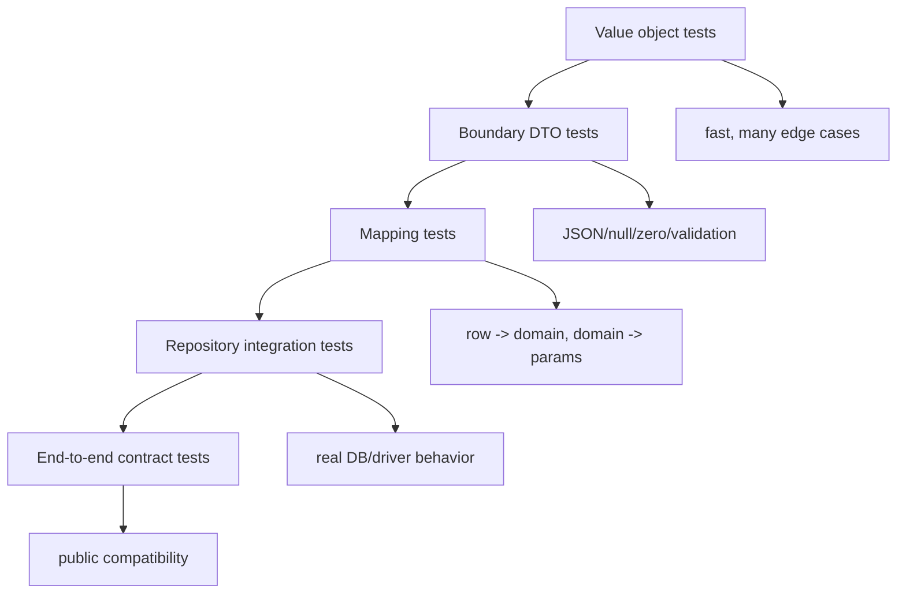
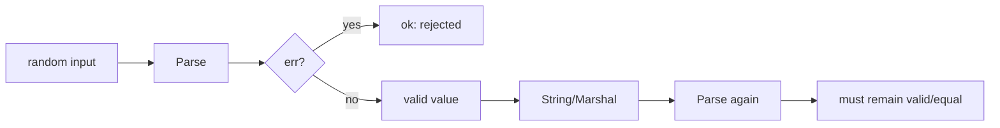

# learn-go-data-model-part-032.md

# Part 032 — Testing Data Semantics: Equality, Fuzzing, Golden, Property, Boundary

> Seri: `learn-go-data-model`  
> Bagian: `032 / 034`  
> Target pembaca: Java software engineer yang ingin memahami Go data model pada level production engineering  
> Fokus: testing data semantics: equality, invariant, boundary, fuzzing, golden files, property-style tests, compatibility fixtures, dan regression-proof data model

---

## 0. Posisi Part Ini dalam Seri

Kita sudah membahas:

```text
part-002: zero value dan invariant
part-005: numeric correctness
part-006..007: text/Unicode
part-017: nil
part-020: error as data
part-023: equality/comparability/ordering
part-026: encoding
part-027: database boundary
part-028: time
part-031: API design with types
```

Sekarang kita membahas bagaimana menguji semua semantic itu.

Testing data semantics berbeda dari sekadar “function menghasilkan output”.

Kita perlu menguji:

```text
- apakah equality yang dipakai benar?
- apakah zero value valid/invalid sesuai desain?
- apakah parser menolak input invalid?
- apakah normalisasi berjalan?
- apakah encoding stabil?
- apakah missing/null/zero dibedakan?
- apakah boundary DB/JSON tidak merusak domain?
- apakah invariant tetap terjaga setelah fuzzing?
- apakah payload lama masih bisa dibaca?
```

Untuk Java engineer:

```text
JUnit-style unit test tetap berguna,
tetapi Go punya idiom kuat:
- table-driven tests
- testdata/
- fuzzing built-in
- golden files
- benchmark + benchmem
- race detector
- examples
```

---

## 1. Tujuan Pembelajaran

Setelah part ini, kamu harus bisa:

1. Mendesain table-driven tests untuk value object.
2. Menguji constructor/parser/invariant.
3. Memilih equality assertion yang tepat.
4. Menghindari `reflect.DeepEqual` sembarangan.
5. Menguji nil vs empty semantics.
6. Menguji JSON/XML/CSV/binary encoding contract.
7. Menggunakan golden files untuk stable output.
8. Menggunakan fuzzing untuk parser/decoder.
9. Mendesain property-style checks.
10. Menguji boundary database mapping.
11. Menguji time precision/timezone semantics.
12. Menguji error taxonomy dengan `errors.Is`/`errors.As`.
13. Menguji compatibility payload versi lama.
14. Membuat PR checklist untuk testing data semantics.

---

## 2. Testing Data Semantics dalam Satu Kalimat

Testing data semantics adalah memastikan data type tidak hanya “berjalan”, tetapi mempertahankan meaning, invariant, dan contract di semua boundary.

Contoh:

```go
email, err := ParseEmail(" ALICE@example.COM ")
```

Test bukan hanya error nil.

Test harus memastikan:

```text
- input diterima
- output canonical
- equality semantics benar
- string representation benar
- invalid input ditolak
- JSON/Text marshal round-trip benar
- zero value behavior jelas
```

---

## 3. Table-Driven Test

Idiomatic Go test:

```go
func TestParseEmail(t *testing.T) {
    tests := []struct {
        name    string
        input   string
        want    string
        wantErr bool
    }{
        {
            name:  "canonicalizes lowercase and trim",
            input: " ALICE@example.COM ",
            want:  "alice@example.com",
        },
        {
            name:    "rejects empty",
            input:   " ",
            wantErr: true,
        },
    }

    for _, tt := range tests {
        t.Run(tt.name, func(t *testing.T) {
            got, err := ParseEmail(tt.input)

            if tt.wantErr {
                if err == nil {
                    t.Fatal("expected error")
                }
                return
            }

            if err != nil {
                t.Fatalf("unexpected error: %v", err)
            }

            if got.String() != tt.want {
                t.Fatalf("got %q want %q", got.String(), tt.want)
            }
        })
    }
}
```

Benefits:

```text
- easy add cases
- each case named
- failure clear
- supports edge cases
```

---

## 4. Test Names Matter

Bad:

```go
{name: "case1"}
```

Good:

```go
{name: "rejects whitespace-only email"}
{name: "normalizes uppercase domain"}
{name: "preserves valid plus addressing"}
```

Test names are executable documentation.

When bug occurs, add regression case with name:

```go
{name: "does not retain large input after token extraction"}
```

---

## 5. Equality in Tests

Choose equality tool by data type.

Comparable:

```go
if got != want {
    t.Fatalf("got %v want %v", got, want)
}
```

Slice:

```go
if !slices.Equal(got, want) {
    t.Fatalf("got %v want %v", got, want)
}
```

Map:

```go
if !maps.Equal(got, want) {
    t.Fatalf("got %v want %v", got, want)
}
```

Custom domain:

```go
if !got.Equal(want) {
    t.Fatalf("got %v want %v", got, want)
}
```

Time:

```go
if !got.Equal(want) {
    t.Fatalf("got %v want %v", got, want)
}
```

Do not default to `reflect.DeepEqual` without understanding semantics.

---

## 6. `reflect.DeepEqual` Caution

`reflect.DeepEqual` may surprise:

```text
- nil slice != empty slice
- nil map != empty map
- time.Time may include representation details
- unexported fields included
- function values only deeply equal if both nil
```

Example:

```go
var a []int = nil
b := []int{}

reflect.DeepEqual(a, b) // false
slices.Equal(a, b)      // true
```

Which is correct depends on contract.

Use `reflect.DeepEqual` mainly when its exact semantics match your intent.

---

## 7. Testing Zero Value

If zero value should be usable:

```go
func TestStackZeroValue(t *testing.T) {
    var s Stack[int]

    s.Push(1)

    got, ok := s.Pop()
    if !ok || got != 1 {
        t.Fatalf("got %v %v", got, ok)
    }
}
```

If zero value invalid:

```go
func TestEmailZeroValue(t *testing.T) {
    var e Email

    if !e.IsZero() {
        t.Fatal("zero Email should be zero")
    }

    if e.Valid() {
        t.Fatal("zero Email must not be valid")
    }
}
```

Document through test.

---

## 8. Testing Constructors and Invariants

Constructor should reject invalid states.

```go
func TestNewMoney(t *testing.T) {
    tests := []struct {
        name     string
        currency Currency
        cents    int64
        wantErr  bool
    }{
        {"valid", CurrencyUSD, 100, false},
        {"empty currency", "", 100, true},
        {"negative amount not allowed", CurrencyUSD, -1, true},
    }

    for _, tt := range tests {
        t.Run(tt.name, func(t *testing.T) {
            _, err := NewMoney(tt.currency, tt.cents)

            if (err != nil) != tt.wantErr {
                t.Fatalf("err=%v wantErr=%v", err, tt.wantErr)
            }
        })
    }
}
```

Test invariant at construction, not only method behavior.

---

## 9. Testing Normalization

Example email:

```go
func TestParseEmailNormalizes(t *testing.T) {
    got, err := ParseEmail(" ALICE@EXAMPLE.COM ")
    if err != nil {
        t.Fatal(err)
    }

    if got.String() != "alice@example.com" {
        t.Fatalf("got %q", got.String())
    }
}
```

Normalization tests prevent subtle boundary drift.

For IDs/actions/status:

```text
trim?
lowercase?
case-sensitive?
Unicode normalization?
allowed characters?
```

Test each deliberately.

---

## 10. Testing Nil vs Empty

API contract may require empty list encoded as `[]`, not `null`.

```go
func TestUserResponseItemsEmptyArray(t *testing.T) {
    resp := NewUserListResponse(nil)

    data, err := json.Marshal(resp)
    if err != nil {
        t.Fatal(err)
    }

    if !bytes.Contains(data, []byte(`"items":[]`)) {
        t.Fatalf("got %s", data)
    }
}
```

For slice equality:

```go
if got.Items == nil {
    t.Fatal("Items must be non-nil empty slice")
}
```

Only assert non-nil if contract requires it.

---

## 11. Testing Missing vs Null vs Zero

PATCH DTO:

```go
type PatchUserRequest struct {
    Name OptionalNullable[string] `json:"name"`
}
```

Tests:

```go
func TestPatchUserRequestNameStates(t *testing.T) {
    tests := []struct {
        name     string
        jsonText string
        wantSet  bool
        wantNull bool
        wantVal  string
    }{
        {"missing", `{}`, false, false, ""},
        {"null", `{"name":null}`, true, true, ""},
        {"value", `{"name":"Alice"}`, true, false, "Alice"},
        {"empty value", `{"name":""}`, true, false, ""},
    }

    for _, tt := range tests {
        t.Run(tt.name, func(t *testing.T) {
            var req PatchUserRequest
            if err := json.Unmarshal([]byte(tt.jsonText), &req); err != nil {
                t.Fatal(err)
            }

            if req.Name.Set != tt.wantSet ||
                req.Name.Null != tt.wantNull ||
                req.Name.Value != tt.wantVal {
                t.Fatalf("got %+v", req.Name)
            }
        })
    }
}
```

This is boundary semantics test.

---

## 12. Testing Errors

Use `errors.Is` for sentinel/wrapped errors.

```go
_, err := repo.FindUser(ctx, id)
if !errors.Is(err, ErrUserNotFound) {
    t.Fatalf("got %v want ErrUserNotFound", err)
}
```

Use `errors.As` for typed error.

```go
var ve *ValidationError
if !errors.As(err, &ve) {
    t.Fatalf("got %T want ValidationError", err)
}
```

Do not test raw error string unless string is public contract.

Bad:

```go
if err.Error() != "user not found" { ... }
```

Use string check only for CLI/user-facing text golden tests.

---

## 13. Testing Error Context

If wrapping context is important:

```go
err := service.Do(ctx)

if !errors.Is(err, ErrUserNotFound) {
    t.Fatal("lost sentinel")
}

if !strings.Contains(err.Error(), "load user") {
    t.Fatal("missing operation context")
}
```

Testing substrings can be acceptable for diagnostic context, but avoid over-specifying entire error message.

---

## 14. Testing JSON Encoding

Basic:

```go
func TestUserResponseJSON(t *testing.T) {
    resp := UserResponse{
        ID:    "u1",
        Email: "a@example.com",
    }

    got, err := json.Marshal(resp)
    if err != nil {
        t.Fatal(err)
    }

    want := `{"id":"u1","email":"a@example.com"}`
    if string(got) != want {
        t.Fatalf("got %s want %s", got, want)
    }
}
```

But raw JSON string order can be brittle for maps.

For struct with stable field order, okay.

For semantic comparison:

```go
assertJSONEqual(t, got, []byte(want))
```

Helper decode into `any` and compare if object order irrelevant.

---

## 15. JSON Semantic Equality Helper

```go
func assertJSONEqual(t *testing.T, got, want []byte) {
    t.Helper()

    var g any
    if err := json.Unmarshal(got, &g); err != nil {
        t.Fatalf("decode got: %v", err)
    }

    var w any
    if err := json.Unmarshal(want, &w); err != nil {
        t.Fatalf("decode want: %v", err)
    }

    if !reflect.DeepEqual(g, w) {
        t.Fatalf("json mismatch\ngot:  %s\nwant: %s", got, want)
    }
}
```

Caveat:

```text
Numbers decode as float64 by default.
Use typed structs or Decoder.UseNumber for numeric precision tests.
```

---

## 16. Golden Files

Golden file stores expected output in `testdata`.

Structure:

```text
mypkg/
  encoder.go
  encoder_test.go
  testdata/
    user_response.golden.json
```

Test:

```go
func TestUserResponseGolden(t *testing.T) {
    got, err := json.MarshalIndent(resp, "", "  ")
    if err != nil {
        t.Fatal(err)
    }
    got = append(got, '\n')

    want, err := os.ReadFile("testdata/user_response.golden.json")
    if err != nil {
        t.Fatal(err)
    }

    if !bytes.Equal(got, want) {
        t.Fatalf("golden mismatch\ngot:\n%s\nwant:\n%s", got, want)
    }
}
```

Use golden files for:

```text
- public API payload
- generated config
- CLI output
- text/binary formats
- migration fixtures
```

---

## 17. Updating Golden Files

Common pattern:

```go
var update = flag.Bool("update", false, "update golden files")
```

In test:

```go
if *update {
    if err := os.WriteFile(path, got, 0644); err != nil {
        t.Fatal(err)
    }
}
```

Run:

```bash
go test ./... -update
```

Be careful: update should be intentional and reviewed.

Golden file diff in PR should be inspected like API contract change.

---

## 18. Fuzzing Basics

Go has built-in fuzzing.

```go
func FuzzParseEmail(f *testing.F) {
    f.Add("alice@example.com")
    f.Add("")
    f.Add("not email")

    f.Fuzz(func(t *testing.T, input string) {
        email, err := ParseEmail(input)
        if err != nil {
            return
        }

        if email.IsZero() {
            t.Fatalf("valid parse produced zero email")
        }

        if _, err := ParseEmail(email.String()); err != nil {
            t.Fatalf("canonical email does not parse: %v", err)
        }
    })
}
```

Run:

```bash
go test -fuzz=FuzzParseEmail
```

Fuzzing is excellent for parsers/decoders.

---

## 19. Fuzzing Decoder

```go
func FuzzDecodeUserRequest(f *testing.F) {
    f.Add([]byte(`{"email":"a@example.com","name":"Alice"}`))
    f.Add([]byte(`{}`))
    f.Add([]byte(`null`))

    f.Fuzz(func(t *testing.T, data []byte) {
        var req CreateUserRequest

        err := json.Unmarshal(data, &req)
        if err != nil {
            return
        }

        // If decode succeeds, mapping should not panic.
        _, _ = req.ToCommand()
    })
}
```

Better invariant:

```text
decode success -> validation either returns clear error or valid command
no panic
no invalid domain object
```

---

## 20. Fuzzing Round Trip

For types with marshal/unmarshal:

```go
func FuzzMoneyJSONRoundTrip(f *testing.F) {
    f.Add(int64(100), "USD")

    f.Fuzz(func(t *testing.T, cents int64, currency string) {
        m, err := NewMoney(Currency(currency), cents)
        if err != nil {
            return
        }

        data, err := json.Marshal(m)
        if err != nil {
            t.Fatal(err)
        }

        var got Money
        if err := json.Unmarshal(data, &got); err != nil {
            t.Fatal(err)
        }

        if !got.Equal(m) {
            t.Fatalf("roundtrip got %v want %v", got, m)
        }
    })
}
```

Property:

```text
valid value -> marshal -> unmarshal -> equal value
```

---

## 21. Property-Style Tests

Property tests assert general laws.

Examples:

```text
Parse(x).String() is canonical.
Parse(canonical).String() == canonical.
Clone does not alias source.
Sort output is ordered.
Set Add then Contains true.
Money Add is commutative for same currency.
Encoding round-trip preserves value.
```

In Go, you can implement property-style tests with normal loops or fuzzing.

Example:

```go
func TestSetLaws(t *testing.T) {
    values := []string{"a", "b", "a"}

    var s Set[string]
    for _, v := range values {
        s.Add(v)
        if !s.Contains(v) {
            t.Fatalf("set does not contain added value %q", v)
        }
    }
}
```

---

## 22. Testing Clone/Aliasing

For map clone:

```go
func TestCloneMapDoesNotAlias(t *testing.T) {
    src := map[string]int{"a": 1}

    got := CloneMap(src)
    got["a"] = 2

    if src["a"] != 1 {
        t.Fatal("clone aliases source")
    }
}
```

For slice clone:

```go
func TestCloneSliceDoesNotAlias(t *testing.T) {
    src := []int{1}

    got := CloneSlice(src)
    got[0] = 2

    if src[0] != 1 {
        t.Fatal("clone aliases source")
    }
}
```

For shallow copy, test/document shallow behavior separately.

---

## 23. Testing Ownership Contracts

If constructor copies input map:

```go
func TestNewConfigCopiesInput(t *testing.T) {
    routes := map[string]Route{
        "/": {Name: "home"},
    }

    cfg := NewConfig(routes)
    routes["/"] = Route{Name: "changed"}

    got, _ := cfg.Route("/")
    if got.Name != "home" {
        t.Fatal("config aliases caller map")
    }
}
```

If constructor takes ownership instead, test should document caller must not mutate, but such contract is harder to enforce.

Prefer copy for public APIs unless performance dictates ownership transfer.

---

## 24. Testing Concurrency Safety

If type claims concurrent-safe:

```go
func TestCacheConcurrentAccess(t *testing.T) {
    var c Cache

    const workers = 100
    var wg sync.WaitGroup

    for i := 0; i < workers; i++ {
        i := i
        wg.Add(1)
        go func() {
            defer wg.Done()
            c.Put(UserID(fmt.Sprintf("u%d", i)), User{})
            _, _ = c.Get(UserID(fmt.Sprintf("u%d", i)))
        }()
    }

    wg.Wait()
}
```

Run with:

```bash
go test -race
```

Without race detector, test may pass but still race.

---

## 25. Testing Atomic Snapshot

```go
func TestConfigSnapshotImmutable(t *testing.T) {
    cfg := NewConfig(map[string]Route{
        "/": {Name: "home"},
    })

    current := atomic.Pointer[Config]{}
    current.Store(cfg)

    got := current.Load()
    route, ok := got.Route("/")
    if !ok || route.Name != "home" {
        t.Fatal("missing route")
    }
}
```

Also test updates do not mutate old snapshot:

```go
next := cfg.WithRoute("/admin", admin)

if _, ok := cfg.Route("/admin"); ok {
    t.Fatal("old config mutated")
}
if _, ok := next.Route("/admin"); !ok {
    t.Fatal("new config missing route")
}
```

---

## 26. Testing Time Semantics

Inject fake clock.

```go
func TestTokenExpired(t *testing.T) {
    now := time.Date(2026, 6, 22, 10, 0, 0, 0, time.UTC)
    token := Token{
        ExpiresAt: now.Add(time.Minute),
    }

    if token.Expired(now) {
        t.Fatal("token should not be expired")
    }

    if !token.Expired(now.Add(time.Minute)) {
        t.Fatal("token should be expired at boundary")
    }
}
```

This tests inclusive/exclusive boundary.

---

## 27. Testing Time Precision

DB truncates microseconds:

```go
func TestNormalizeDBTime(t *testing.T) {
    t0 := time.Date(2026, 6, 22, 10, 0, 0, 123456789, time.UTC)

    got := NormalizeDBTime(t0)

    if got.Nanosecond() != 123456000 {
        t.Fatalf("got ns %d", got.Nanosecond())
    }
}
```

Test timezone:

```go
if got.Location() != time.UTC {
    t.Fatal("must normalize to UTC")
}
```

---

## 28. Testing Date-Only

```go
func TestDateJSON(t *testing.T) {
    d, err := NewDate(2026, 6, 22)
    if err != nil {
        t.Fatal(err)
    }

    data, err := json.Marshal(d)
    if err != nil {
        t.Fatal(err)
    }

    if string(data) != `"2026-06-22"` {
        t.Fatalf("got %s", data)
    }
}
```

Invalid date:

```go
_, err := NewDate(2026, 2, 30)
if err == nil {
    t.Fatal("expected invalid date")
}
```

---

## 29. Testing Database Mapping

Unit test row mapping:

```go
func TestUserRowToDomain(t *testing.T) {
    r := userRow{
        ID:    "u1",
        Email: "a@example.com",
        Name:  "Alice",
    }

    u, err := r.ToDomain()
    if err != nil {
        t.Fatal(err)
    }

    if u.ID() != UserID("u1") {
        t.Fatalf("wrong id")
    }
}
```

Invalid DB data:

```go
func TestUserRowToDomainRejectsInvalidEmail(t *testing.T) {
    r := userRow{
        ID:    "u1",
        Email: "not email",
    }

    _, err := r.ToDomain()
    if err == nil {
        t.Fatal("expected error")
    }
}
```

This catches corruption/schema drift.

---

## 30. Testing SQL Null Mapping

```go
func TestUserRowOptionalNickname(t *testing.T) {
    r := userRow{
        Nickname: sql.NullString{Valid: false},
    }

    u, err := r.ToDomain()
    if err != nil {
        t.Fatal(err)
    }

    if u.Nickname().IsSet() {
        t.Fatal("nickname should be absent")
    }
}
```

Test both:

```text
NULL
empty string
non-empty string
```

because each may have different meaning.

---

## 31. Testing Integration with Database

Unit mapping is not enough.

Integration tests verify actual driver behavior:

```text
- scan NULL into sql.NullX
- timestamp precision
- numeric representation
- JSON column scan type
- constraint violation error classification
- transaction behavior
```

Pattern:

```go
func TestUserRepositoryFind(t *testing.T) {
    db := testDB(t)

    repo := NewUserRepository(db)
    seedUser(t, db, ...)

    got, err := repo.FindUser(context.Background(), id)
    if err != nil {
        t.Fatal(err)
    }

    ...
}
```

Use real DB/container when behavior is database-specific.

---

## 32. Testing Encoding Compatibility

Keep old payload fixtures:

```text
testdata/events/case_submitted_v1.json
testdata/events/case_submitted_v2.json
```

Test:

```go
func TestDecodeOldCaseSubmittedEvents(t *testing.T) {
    files, err := filepath.Glob("testdata/events/case_submitted_*.json")
    if err != nil {
        t.Fatal(err)
    }

    for _, file := range files {
        t.Run(filepath.Base(file), func(t *testing.T) {
            data, err := os.ReadFile(file)
            if err != nil {
                t.Fatal(err)
            }

            event, err := DecodeCaseSubmitted(data)
            if err != nil {
                t.Fatalf("decode %s: %v", file, err)
            }

            if event.CaseID().IsZero() {
                t.Fatal("missing case id")
            }
        })
    }
}
```

Compatibility fixtures protect long-lived contracts.

---

## 33. Testing Sorting/Ordering

```go
func TestSortUsers(t *testing.T) {
    users := []User{
        user("2", "bob@example.com"),
        user("1", "alice@example.com"),
    }

    SortUsers(users)

    if users[0].ID() != UserID("1") {
        t.Fatalf("wrong order: %v", users)
    }
}
```

Property:

```go
if !slices.IsSortedFunc(users, CompareUser) {
    t.Fatal("users not sorted")
}
```

Test tie-breakers.

```text
same timestamp, different ID
same name, different ID
```

Deterministic ordering matters for APIs/tests/pagination.

---

## 34. Testing Map Output

Map iteration order is unstable.

If function returns map, compare with `maps.Equal`.

If function returns slice from map keys, sort before comparison or define sorted output contract.

```go
got := Keys(m)
slices.Sort(got)

want := []string{"a", "b"}
if !slices.Equal(got, want) {
    t.Fatal(...)
}
```

Do not write tests assuming map iteration order.

---

## 35. Testing Unicode/Text

Text parser tests should include:

```text
ASCII
UTF-8 multi-byte
combining characters
invalid UTF-8 if []byte boundary
case folding
trim spaces
non-breaking spaces if relevant
emoji if relevant
```

Example:

```go
func TestDisplayNameAllowsUnicode(t *testing.T) {
    _, err := NewDisplayName("Budi 😊")
    if err != nil {
        t.Fatal(err)
    }
}
```

If normalization matters, include equivalent-looking forms.

---

## 36. Testing Numeric Correctness

Money:

```go
func TestMoneyAddRejectsDifferentCurrency(t *testing.T) {
    usd := MustMoney("USD", 100)
    eur := MustMoney("EUR", 100)

    _, err := usd.Add(eur)
    if !errors.Is(err, ErrCurrencyMismatch) {
        t.Fatalf("got %v", err)
    }
}
```

Overflow:

```go
func TestMoneyAddOverflow(t *testing.T) {
    a := MustMoney("USD", math.MaxInt64)
    b := MustMoney("USD", 1)

    _, err := a.Add(b)
    if !errors.Is(err, ErrOverflow) {
        t.Fatalf("got %v", err)
    }
}
```

Test boundaries, not just happy path.

---

## 37. Testing Generic Collections

Generic test helper:

```go
func testSet[T comparable](t *testing.T, a, b T) {
    t.Helper()

    var s Set[T]
    s.Add(a)

    if !s.Contains(a) {
        t.Fatal("missing added value")
    }
    if s.Contains(b) {
        t.Fatal("unexpected value")
    }
}

func TestSetString(t *testing.T) {
    testSet(t, "a", "b")
}

func TestSetInt(t *testing.T) {
    testSet(t, 1, 2)
}
```

Test representative types:

```text
primitive
defined type
struct comparable
pointer if relevant
```

---

## 38. Testing Generic Constraints Behavior

For `~string` helper:

```go
type UserID string

func TestStringLikeAcceptsDefinedType(t *testing.T) {
    id := UserID("u1")

    if IsEmptyStringLike(id) {
        t.Fatal("should not be empty")
    }
}
```

Compilation itself tests type acceptance. For negative compile tests, Go does not have simple built-in unit style; usually avoid unless using separate test packages/tools.

---

## 39. Testing Panic Behavior

Prefer APIs return errors. But if panic is intended, test it.

```go
func TestMustParseEmailPanics(t *testing.T) {
    defer func() {
        if recover() == nil {
            t.Fatal("expected panic")
        }
    }()

    _ = MustParseEmail("bad")
}
```

Keep panic tests for Must-style programmer errors, not user input.

---

## 40. Testing Examples

Example tests are documentation and compile/run tests.

```go
func ExampleParseEmail() {
    email, _ := ParseEmail(" ALICE@example.COM ")
    fmt.Println(email.String())

    // Output:
    // alice@example.com
}
```

Useful for public APIs.

Examples appear in documentation.

---

## 41. Testing Package API from External View

Use `_test` external package:

```go
package user_test
```

instead of:

```go
package user
```

This tests public API only.

Example:

```go
func TestEmailPublicAPI(t *testing.T) {
    email, err := user.ParseEmail("a@example.com")
    ...
}
```

Use internal package tests when you need unexported details.

For API design, external tests are valuable.

---

## 42. Testing Unexported Invariants

Some invariants are internal.

Test through public behavior when possible.

If needed, use same package tests:

```go
package user
```

But avoid coupling tests too tightly to implementation.

Better:

```text
public constructor rejects invalid
public methods preserve invariant
round-trip does not break invariant
```

---

## 43. Testing Race Conditions

For concurrent type:

```go
func TestCounterConcurrent(t *testing.T) {
    var c Counter

    const n = 1000
    var wg sync.WaitGroup

    for i := 0; i < n; i++ {
        wg.Add(1)
        go func() {
            defer wg.Done()
            c.Inc()
        }()
    }

    wg.Wait()

    if got := c.Value(); got != n {
        t.Fatalf("got %d want %d", got, n)
    }
}
```

Run with race detector.

Functional correctness alone is not enough; use `-race`.

---

## 44. Testing Memory Semantics

Allocation tests can use `testing.AllocsPerRun`:

```go
func TestParseUserIDAllocs(t *testing.T) {
    allocs := testing.AllocsPerRun(1000, func() {
        _, _ = ParseUserID("u1")
    })

    if allocs > 0 {
        t.Fatalf("allocs=%f", allocs)
    }
}
```

Use sparingly. Allocation count can change with compiler/runtime versions.

Better for performance-sensitive internal packages than public semantic tests.

---

## 45. Testing Benchmarks

Benchmark data operations:

```go
func BenchmarkParseEmail(b *testing.B) {
    for i := 0; i < b.N; i++ {
        _, _ = ParseEmail("alice@example.com")
    }
}
```

Run:

```bash
go test -bench=BenchmarkParseEmail -benchmem
```

Benchmark variants:

```text
small input
large input
valid
invalid
common case
worst case
```

Do not optimize based on unrealistic benchmark.

---

## 46. Test Data Builders

For domain tests, builders reduce noise.

```go
func validUser(t *testing.T, opts ...func(*userTestData)) User {
    t.Helper()

    d := userTestData{
        id:    MustParseUserID("u1"),
        email: MustParseEmail("a@example.com"),
        name:  "Alice",
    }

    for _, opt := range opts {
        opt(&d)
    }

    u, err := NewUser(d.id, d.email, d.name)
    if err != nil {
        t.Fatal(err)
    }

    return u
}
```

Use in tests only.

Keep production constructors explicit.

---

## 47. Avoid Overusing Mocks for Data Semantics

For data type tests, prefer real values.

Bad:

```text
mock Email
mock Money
mock Time
```

Better:

```text
real Email
real Money
fake Clock
in-memory repository for application test
```

Mocks are useful for behavior boundaries, not for value object semantics.

---

## 48. Boundary Test Matrix

For each boundary type, test:

```text
valid minimal
valid full
missing required
unknown field
null field
zero value
invalid enum
invalid ID
large input
Unicode input
duplicate key
old version payload
```

Example CreateUserRequest:

```text
{}
{"email":null}
{"email":""}
{"email":"not email"}
{"email":"a@example.com","role":"admin"}
{"email":"a@example.com","name":"Alice"}
```

---

## 49. Regression Tests

When bug found:

```text
1. write failing test reproducing bug
2. fix bug
3. keep test
```

Name it clearly:

```go
func TestParseEmailRejectsTrailingControlCharacter(t *testing.T)
```

Regression tests are institutional memory.

---

## 50. Testdata Organization

Suggested:

```text
testdata/
  json/
    user_response_v1.golden.json
    case_submitted_v1.json
  csv/
    users_valid.csv
    users_invalid_missing_email.csv
  db/
    migration_fixture.sql
```

Use descriptive file names.

Avoid hiding meaning in random blobs.

---

## 51. Mermaid: Data Semantics Test Pyramid



---

## 52. Mermaid: Parser Fuzz Invariant



---

## 53. Mini Lab 1 — Table Test

Write test cases for:

```go
ParseUserID(s string) (UserID, error)
```

Cases:

```text
valid simple
empty
whitespace
too long
invalid character
uppercase if not allowed
```

Goal:

```text
Each business rule becomes a named test case.
```

---

## 54. Mini Lab 2 — Equality Choice

Given:

```go
got := []string{}
var want []string = nil
```

Which assertion?

```go
slices.Equal(got, want)
```

if nil and empty equivalent.

Or:

```go
got == nil
```

if non-nil empty is required.

Lesson:

```text
Equality tool depends on contract.
```

---

## 55. Mini Lab 3 — Golden JSON

Create:

```text
testdata/user_response.golden.json
```

Then test marshaled output.

Goal:

```text
Detect accidental public contract change.
```

---

## 56. Mini Lab 4 — Fuzz Round Trip

For a `Date` type:

```text
valid date -> MarshalText -> UnmarshalText -> Equal
```

Fuzz random strings:

```text
UnmarshalText should never panic.
```

---

## 57. Mini Lab 5 — DB Row Mapping

Test:

```go
caseRow{Status: "unknown"}.ToDomain()
```

should return error.

Goal:

```text
Invalid persisted data must not silently enter domain.
```

---

## 58. Mini Lab 6 — Race Detector

Create intentionally unsafe counter and run:

```bash
go test -race
```

Then fix with mutex/atomic.

Goal:

```text
Experience race detector output.
```

---

## 59. Common Anti-Patterns

### 59.1 Testing only happy path

Data bugs live in boundary cases.

### 59.2 Comparing time with `==`

Use `Equal` and precision normalization.

### 59.3 Using DeepEqual everywhere

Wrong semantics for nil/empty/time/domain equality.

### 59.4 No tests for invalid input

Parser/constructor tests must reject invalid.

### 59.5 Golden files updated blindly

Golden diff is contract diff.

### 59.6 Fuzzing without invariants

Fuzz should assert useful properties, not just call function.

### 59.7 Mocking value objects

Use real values.

### 59.8 No compatibility fixtures

Old payloads break silently.

### 59.9 Ignoring race detector for concurrent types

Functional pass can still race.

### 59.10 Over-specifying error strings

Use `errors.Is/As` for semantic errors.

---

## 60. Production Guidelines

### 60.1 Test Semantic Boundaries

Constructor, parser, encoder, decoder, DB mapper.

### 60.2 Use Named Table Cases

Each rule gets a name.

### 60.3 Choose Equality Intentionally

Comparable, slices, maps, custom Equal, time Equal.

### 60.4 Keep Golden Files for Public Contracts

Review golden diffs carefully.

### 60.5 Fuzz Parsers and Decoders

No panic; valid output preserves invariants.

### 60.6 Test Old Payloads

Compatibility is not theoretical.

### 60.7 Test Invalid Persisted Data

DB can contain bad data after bugs/migrations/manual fixes.

### 60.8 Use External Package Tests for Public API

Catch export/invariant leakage.

### 60.9 Run Race Detector

For concurrent data.

### 60.10 Add Regression Tests for Bugs

Every production data bug should leave a test behind.

---

## 61. PR Review Checklist

### 61.1 Value Semantics

```text
[ ] Constructor/parser valid cases tested?
[ ] Invalid cases tested?
[ ] Zero value behavior tested?
[ ] Normalization tested?
[ ] Equality semantics tested?
```

### 61.2 Boundary

```text
[ ] JSON/XML/CSV/binary encoding tested?
[ ] missing/null/zero tested?
[ ] nil vs empty tested if relevant?
[ ] unknown fields tested if policy matters?
[ ] old payload fixtures tested?
```

### 61.3 Error

```text
[ ] errors.Is/As tested?
[ ] error context preserved?
[ ] error strings not over-specified?
[ ] invalid DB data returns meaningful error?
```

### 61.4 Time/Numeric/Text

```text
[ ] time precision/timezone tested?
[ ] date-only tested?
[ ] numeric overflow/rounding tested?
[ ] Unicode/case normalization tested?
```

### 61.5 Collections

```text
[ ] map order not assumed?
[ ] slice aliasing/clone behavior tested?
[ ] sorting tie-breakers tested?
[ ] generic collection tested with representative types?
```

### 61.6 Concurrency/Memory

```text
[ ] race detector relevant?
[ ] ownership/copy behavior tested?
[ ] allocation tests only where justified?
[ ] benchmark updated for performance-sensitive path?
```

### 61.7 Golden/Fuzz

```text
[ ] golden file diff reviewed?
[ ] update flag not accidentally committed behavior?
[ ] fuzz seeds meaningful?
[ ] fuzz invariants useful?
```

---

## 62. Ringkasan Mental Model

Testing data semantics means testing meaning, not implementation accident.

Core idea:

```text
Every data type has contract.
Every boundary can corrupt that contract.
Tests should lock the contract.
```

Use:

```text
table-driven tests for rules
custom equality for meaning
golden files for stable external output
fuzzing for parsers/decoders
fixtures for compatibility
race detector for concurrent data
benchmarks for measured performance
```

Untuk Java engineer:

```text
Jangan hanya memindahkan JUnit assertEquals mindset.
Di Go, pilih equality tool sesuai data semantics dan test boundary behavior secara eksplisit.
```

---

## 63. Apa yang Tidak Dibahas di Part Ini

Part berikutnya:

```text
part-033 — Performance Engineering for Data Types and Collections
```

Kita akan membahas:

```text
- benchmark methodology
- allocation reduction
- slice/map performance
- cache locality
- string/bytes performance
- JSON/reflection cost
- pprof workflow
- when to optimize
```

---

## 64. Referensi Resmi

- Package `testing`  
  https://pkg.go.dev/testing
- Fuzzing in Go  
  https://go.dev/doc/security/fuzz
- Go Blog — Fuzzing is Beta Ready  
  https://go.dev/blog/fuzz-beta
- Data Race Detector  
  https://go.dev/doc/articles/race_detector
- Package `slices`  
  https://pkg.go.dev/slices
- Package `maps`  
  https://pkg.go.dev/maps
- Package `errors`  
  https://pkg.go.dev/errors
- Package `encoding/json`  
  https://pkg.go.dev/encoding/json
- Go 1.26 Release Notes  
  https://go.dev/doc/go1.26

---

## 65. Status Seri

Selesai:

```text
part-000  Orientation
part-001  Type system core
part-002  Zero value and invariants
part-003  Constants and iota
part-004  Numeric foundations
part-005  Numeric correctness
part-006  Text model I
part-007  Text model II
part-008  Array
part-009  Slice I
part-010  Slice II
part-011  Map I
part-012  Map II
part-013  Struct I
part-014  Struct II
part-015  Struct III
part-016  Pointer
part-017  Nil
part-018  Interface I
part-019  Interface II
part-020  Error as Data
part-021  Generics I
part-022  Generics II
part-023  Comparability / Equality / Ordering
part-024  Reflection
part-025  Unsafe
part-026  Encoding Data
part-027  Database Boundary
part-028  Time as Data
part-029  Memory / Allocation / Escape / GC Pressure
part-030  Concurrency-Safe Data
part-031  API Design with Types
part-032  Testing Data Semantics
```

Berikutnya:

```text
part-033  Performance Engineering for Data Types and Collections
```

Seri belum selesai. Masih ada part 033 sampai part 034.


<!-- NAVIGATION_FOOTER -->
<div class="page-nav">
<a href="./learn-go-data-model-part-031.md">⬅️ Part 031 — API Design with Types: Public Contract, Compatibility, Evolvability</a>
<a href="./index.md">📚 Kategori</a>
<a href="../../index.md">🏠 Home</a>
<a href="./learn-go-data-model-part-033.md">Part 033 — Performance Engineering for Data Types and Collections ➡️</a>
</div>
