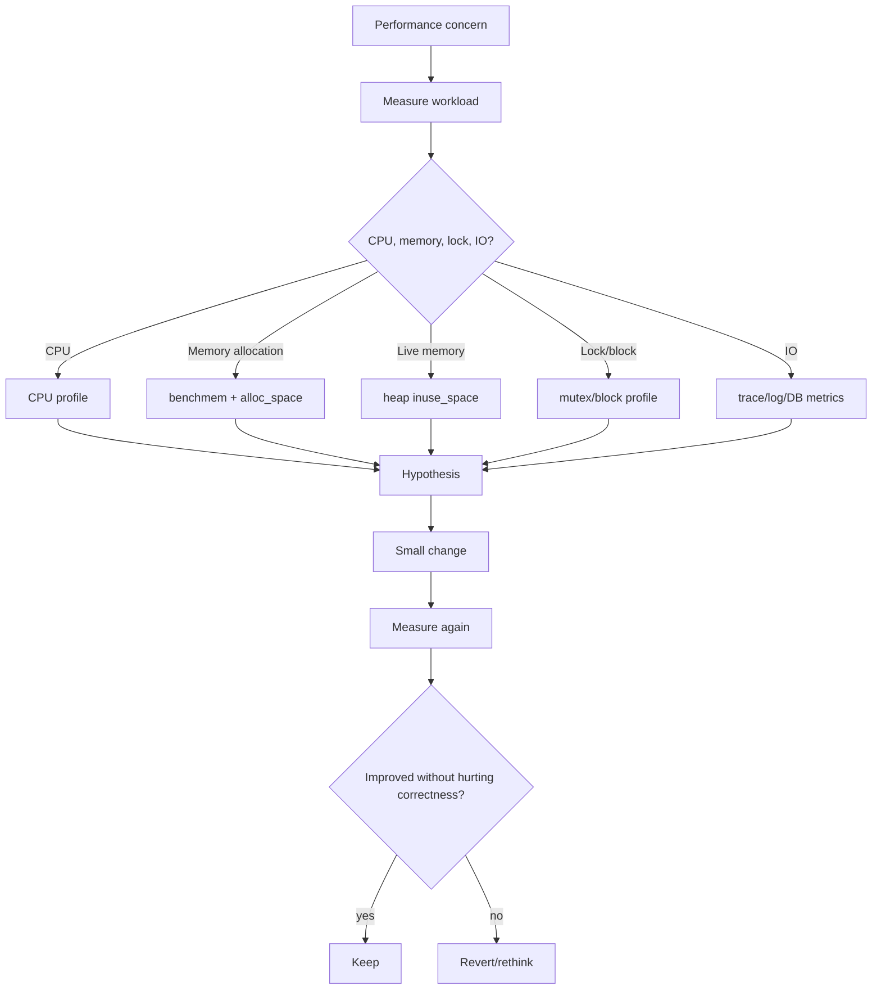
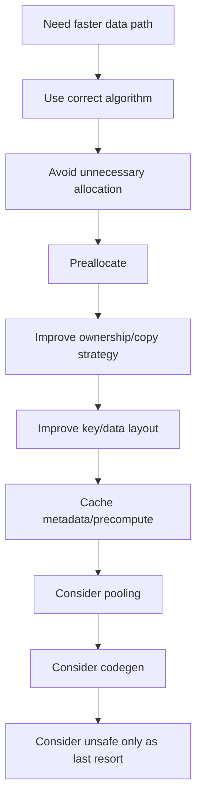

# learn-go-data-model-part-033.md

# Part 033 — Performance Engineering for Data Types and Collections

> Seri: `learn-go-data-model`  
> Bagian: `033 / 034`  
> Target pembaca: Java software engineer yang ingin memahami Go data model pada level production engineering  
> Fokus: benchmark methodology, allocation reduction, slice/map/string/bytes performance, cache locality, pprof workflow, GC-aware optimization, dan kapan optimasi layak dilakukan

---

## 0. Posisi Part Ini dalam Seri

Kita sudah membahas:

```text
part-008..010: array/slice
part-011..012: map
part-013: struct layout
part-016: pointer
part-019: interface boxing
part-021..022: generics
part-025: unsafe
part-029: memory/allocation/escape/GC pressure
part-030: concurrency-safe data
part-032: testing data semantics
```

Part ini adalah sintesis performa.

Topik utamanya:

```text
Bagaimana bentuk data memengaruhi performa nyata,
dan bagaimana mengoptimasi tanpa menjadi clever tapi rapuh.
```

Performa Go bukan hanya “pakai goroutine”.

Sering kali bottleneck ada di:

```text
- terlalu banyak allocation
- slice growth tidak terkontrol
- map key terlalu mahal
- string/[]byte conversion berulang
- JSON/reflection di hot path
- pointer-heavy object graph
- poor cache locality
- lock contention karena data shape
- accidental retention of large buffers
```

Untuk Java engineer:

```text
Java performance often talks about object allocation, GC, boxing, collections, streams.
Go performance punya tema mirip, tetapi detailnya berbeda:
- value vs pointer
- stack vs heap via escape analysis
- slice/map backing storage
- interface boxing
- explicit benchmark via testing package
- pprof-first workflow
```

---

## 1. Tujuan Pembelajaran

Setelah part ini, kamu harus bisa:

1. Menulis benchmark Go yang benar.
2. Membaca `ns/op`, `B/op`, dan `allocs/op`.
3. Menghindari benchmark yang teroptimasi hilang.
4. Menggunakan `b.ReportAllocs`.
5. Membedakan microbenchmark dan real workload.
6. Memahami slice preallocation dan growth.
7. Memahami map preallocation dan key shape.
8. Mengoptimasi string/bytes tanpa unsafe dulu.
9. Mengukur JSON/reflection cost.
10. Memakai pprof untuk CPU dan memory.
11. Memahami cache locality dan pointer chasing.
12. Memilih `[]T` vs `[]*T` secara performance-aware.
13. Memahami pooling trade-off.
14. Menghindari premature optimization.
15. Membuat PR checklist untuk performance data types.

---

## 2. Performance Engineering dalam Satu Kalimat

Performance engineering adalah proses berbasis measurement:

```text
hypothesis -> benchmark/profile -> change -> measure again -> keep only proven improvement
```

Bukan:

```text
feeling -> clever code -> assume faster
```

Go tooling membuat measurement relatif mudah:

```bash
go test -bench=. -benchmem
go test -cpuprofile=cpu.out -memprofile=mem.out
go tool pprof cpu.out
go tool pprof mem.out
go test -gcflags=-m
```

---

## 3. Correctness First, Then Performance

Performance optimization tidak boleh merusak semantic data.

Contoh:

```go
func UserRoles() []Role {
    return roles
}
```

Lebih cepat karena tidak copy.

Tapi jika caller bisa mutate internal slice, invariant rusak.

Safer:

```go
func UserRoles() []Role {
    return append([]Role(nil), roles...)
}
```

Allocation cost mungkin layak demi API safety.

Optimization valid jika:

```text
- correctness tetap benar
- contract tidak berubah
- benchmark/profiling membuktikan manfaat
- complexity masih bisa dipelihara
```

---

## 4. Benchmark Basics

Benchmark function:

```go
func BenchmarkContainsString(b *testing.B) {
    values := []string{"a", "b", "c"}

    for i := 0; i < b.N; i++ {
        _ = Contains(values, "b")
    }
}
```

Run:

```bash
go test -bench=BenchmarkContainsString -benchmem
```

Output:

```text
BenchmarkContainsString-8    100000000    12.3 ns/op    0 B/op    0 allocs/op
```

Meaning:

```text
ns/op      average time per operation
B/op       heap bytes allocated per operation
allocs/op  heap allocation count per operation
```

---

## 5. Avoid Benchmark Elimination

Compiler may eliminate unused result.

Bad:

```go
func BenchmarkParse(b *testing.B) {
    for i := 0; i < b.N; i++ {
        ParseUserID("u1")
    }
}
```

If result unused, compiler may optimize.

Use package-level sink:

```go
var sinkUserID UserID
var sinkBool bool
var sinkErr error
```

Benchmark:

```go
func BenchmarkParseUserID(b *testing.B) {
    var got UserID
    var err error

    for i := 0; i < b.N; i++ {
        got, err = ParseUserID("u1")
    }

    sinkUserID = got
    sinkErr = err
}
```

For bool:

```go
sinkBool = Contains(values, target)
```

Use sinks sparingly but correctly.

---

## 6. Setup Outside Timer

If benchmark needs setup, exclude setup time.

```go
func BenchmarkProcess(b *testing.B) {
    input := buildInput()

    b.ResetTimer()

    for i := 0; i < b.N; i++ {
        _ = Process(input)
    }
}
```

For expensive per-iteration setup that must not count:

```go
for i := 0; i < b.N; i++ {
    b.StopTimer()
    input := buildInput()
    b.StartTimer()

    _ = Process(input)
}
```

But frequent Stop/Start can distort benchmark. Prefer design benchmark carefully.

---

## 7. `b.ReportAllocs`

`-benchmem` reports allocation.

You can also:

```go
func BenchmarkX(b *testing.B) {
    b.ReportAllocs()
    ...
}
```

Use both if benchmark may be run without `-benchmem`.

Allocations are often easier to improve than CPU.

But do not chase zero allocations where copy/alloc protects correctness.

---

## 8. Sub-Benchmarks

Compare variants:

```go
func BenchmarkBuildString(b *testing.B) {
    parts := []string{"a", "b", "c"}

    b.Run("concat", func(b *testing.B) {
        for i := 0; i < b.N; i++ {
            sinkString = buildConcat(parts)
        }
    })

    b.Run("builder", func(b *testing.B) {
        for i := 0; i < b.N; i++ {
            sinkString = buildBuilder(parts)
        }
    })
}
```

Run:

```bash
go test -bench=BenchmarkBuildString -benchmem
```

Sub-benchmarks help compare alternatives under same setup.

---

## 9. Benchmark Input Sizes

Performance often changes with size.

```go
func BenchmarkLookup(b *testing.B) {
    for _, size := range []int{10, 100, 1000, 10000} {
        b.Run(fmt.Sprintf("n=%d", size), func(b *testing.B) {
            values := makeValues(size)
            target := values[size-1]

            b.ResetTimer()

            for i := 0; i < b.N; i++ {
                sinkBool = Contains(values, target)
            }
        })
    }
}
```

This reveals algorithmic behavior.

A solution faster at n=10 may be worse at n=10000.

---

## 10. Microbenchmark vs Real Workload

Microbenchmark:

```text
isolates one function
good for data structure operation
easy to mislead
```

Real workload benchmark:

```text
end-to-end-ish
includes realistic data, IO mocks, parsing, allocation
harder but more meaningful
```

Use both.

Example:

```text
BenchmarkParseEmail
BenchmarkDecodeCreateUserRequest
BenchmarkHandleCreateUserWithoutNetwork
```

Do not optimize microbenchmark if it does not affect real workload.

---

## 11. Slice Preallocation

Bad:

```go
var out []UserResponse
for _, u := range users {
    out = append(out, NewUserResponse(u))
}
```

Better when upper bound known:

```go
out := make([]UserResponse, 0, len(users))
for _, u := range users {
    out = append(out, NewUserResponse(u))
}
```

This reduces backing array growth allocations.

If exact length known and every element filled:

```go
out := make([]UserResponse, len(users))
for i, u := range users {
    out[i] = NewUserResponse(u)
}
```

This avoids append overhead and is clear.

---

## 12. Slice Filter Capacity

Filter:

```go
func Filter[T any](values []T, keep func(T) bool) []T {
    out := make([]T, 0, len(values))
    for _, v := range values {
        if keep(v) {
            out = append(out, v)
        }
    }
    return out
}
```

This allocates capacity len(values), maybe too much if few kept.

Alternative:

```go
out := make([]T, 0)
```

may allocate multiple times.

Choose based on expected keep ratio.

For in-place filter:

```go
func FilterInPlace[T any](values []T, keep func(T) bool) []T {
    out := values[:0]
    for _, v := range values {
        if keep(v) {
            out = append(out, v)
        }
    }

    var zero T
    for i := len(out); i < len(values); i++ {
        values[i] = zero
    }

    return out
}
```

Trade-off:

```text
+ no new backing array
- mutates input
- retains original capacity
- ownership must be clear
```

---

## 13. Slice Delete Performance

Order-preserving delete:

```go
copy(s[i:], s[i+1:])
var zero T
s[len(s)-1] = zero
s = s[:len(s)-1]
```

O(n).

If order does not matter:

```go
s[i] = s[len(s)-1]
var zero T
s[len(s)-1] = zero
s = s[:len(s)-1]
```

O(1).

API must document:

```text
DeleteStable preserves order.
DeleteUnordered does not preserve order.
```

Correctness first.

---

## 14. Map Preallocation

Bad:

```go
m := map[UserID]User{}
```

Better:

```go
m := make(map[UserID]User, len(users))
```

Map growth is costly.

But if many duplicates and final size much smaller, hint len(users) may overallocate.

For `GroupBy`:

```go
groups := make(map[Status][]Case)
```

If number of statuses small, hint may not matter.

For `IndexBy` over unique keys, hint len(values) is good.

---

## 15. Map Key Performance

Map key cost depends on:

```text
- key size
- key type
- hashing cost
- equality cost
- allocation to construct key
```

Good keys:

```go
type UserID string
type TenantUserKey struct {
    TenantID TenantID
    UserID   UserID
}
```

For hot path, avoid building string key by concatenation repeatedly:

```go
key := tenant + ":" + user
```

This allocates.

Prefer struct key:

```go
type TenantUserKey struct {
    TenantID TenantID
    UserID   UserID
}
```

No concatenation ambiguity/allocation.

---

## 16. `map[string]` and `[]byte`

If you parse protocol input as `[]byte` and need map lookup by string:

```go
m[string(b)]
```

This converts/copies.

Options:

```text
- accept allocation
- parse once into string
- keep input as string from start
- use bytes-based data structure if truly hot
- use unsafe only with extreme care
```

Do not choose unsafe first.

Often one string copy at boundary is correct because map key must be immutable.

---

## 17. String Concatenation

For few strings:

```go
s := a + b + c
```

Fine.

For loop:

```go
var s string
for _, p := range parts {
    s += p
}
```

Bad for many parts.

Use:

```go
var b strings.Builder
for _, p := range parts {
    b.WriteString(p)
}
s := b.String()
```

If final size known:

```go
b.Grow(total)
```

For bytes:

```go
buf := make([]byte, 0, total)
buf = append(buf, ...)
```

---

## 18. `fmt` Cost

`fmt.Sprintf` is flexible but relatively expensive.

Hot path:

```go
key := fmt.Sprintf("%s:%d", prefix, id)
```

Alternative:

```go
key := prefix + ":" + strconv.FormatInt(id, 10)
```

For append to buffer:

```go
buf = strconv.AppendInt(buf, id, 10)
```

Guideline:

```text
Use fmt for clarity unless benchmark shows hot path cost.
Use strconv for hot formatting/parsing.
```

---

## 19. `strconv` for Parsing

For numeric parsing:

```go
n, err := strconv.ParseInt(s, 10, 64)
```

For formatting:

```go
s := strconv.FormatInt(n, 10)
```

Append no extra string:

```go
buf = strconv.AppendInt(buf, n, 10)
```

For high-throughput text protocols, `strconv.Append*` can reduce allocations.

---

## 20. bytes vs strings

Use `strings` for string data.

Use `bytes` for `[]byte`.

Avoid repeated conversions.

Bad:

```go
strings.Contains(string(b), "abc")
```

If `b` is []byte and hot:

```go
bytes.Contains(b, []byte("abc"))
```

But `[]byte("abc")` may allocate depending context/compiler. For repeated use:

```go
var needle = []byte("abc")
bytes.Contains(b, needle)
```

---

## 21. JSON Performance

Baseline:

```go
json.Marshal(v)
json.Unmarshal(data, &v)
```

Performance tips:

```text
- use structs, not map[string]any, for known schema
- avoid interface-heavy data
- stream for large payload
- avoid repeated marshal/unmarshal in internal path
- precompute stable encoded forms if immutable and hot
- custom MarshalJSON only if measured
```

Potential custom marshal:

```go
func (id UserID) MarshalJSON() ([]byte, error) {
    return json.Marshal(string(id))
}
```

May not be faster. Benchmark.

---

## 22. Reflection Performance

Reflection is okay for:

```text
config loading
API boundary
validation
tooling
```

Potentially costly for:

```text
per-row DB mapping in huge scan
high-throughput serialization
hot loop validation
```

Optimization:

```text
- cache reflect.Type metadata
- avoid FieldByName in loop
- avoid Interface() if possible
- codegen for hot schemas
```

Measure with pprof.

---

## 23. Interface Dispatch and Boxing

Interface call:

```go
var w io.Writer = buf
w.Write(p)
```

Usually fine.

But `[]any` containers and variadic `...any` can allocate/box.

Generic typed helper can avoid boxing:

```go
func Sum[T Integer](values []T) T
```

instead of:

```go
func SumAny(values []any) any
```

Use generics for homogeneous typed data.

Use interfaces for behavior polymorphism.

---

## 24. `[]T` vs `[]*T` Performance

`[]T`:

```text
+ contiguous values
+ fewer allocations
+ better cache locality
+ less pointer chasing
- copies on append/growth and pass by value
- updating map value requires reassign
```

`[]*T`:

```text
+ stable identity
+ cheap element move/copy
+ shared mutation
- more allocations
- pointer chasing
- more GC work
- nil possible
```

Benchmark with realistic T size and access pattern.

Do not assume pointers are faster.

---

## 25. Struct Field Order

Field order affects padding.

```go
type A struct {
    A bool
    B int64
    C bool
}

type B struct {
    B int64
    A bool
    C bool
}
```

`B` may be smaller due to less padding.

But do not reorder fields if it hurts readability unless type is numerous/hot.

Use:

```go
unsafe.Sizeof(T{})
```

to inspect.

Memory savings matter when millions of objects exist.

---

## 26. Pointer-Free Hot Structures

Pointer-free data can reduce GC scan.

Example hot metric sample:

```go
type Sample struct {
    TimestampUnixNano int64
    Value             float64
    SeriesID          uint64
}
```

No pointers.

Compared to:

```go
type Sample struct {
    Timestamp time.Time
    Series    string
    Labels    map[string]string
}
```

More expressive, more expensive.

Often use different shapes:

```text
ingest/raw DTO
domain rich object
hot storage compact record
```

---

## 27. Cache Locality

CPU likes contiguous memory.

Good:

```go
values := []int64{}
for _, v := range values {
    sum += v
}
```

Less local:

```go
values := []*int64{}
for _, p := range values {
    sum += *p
}
```

Pointer chasing causes cache misses.

For high-performance collections, data layout can dominate.

For typical business logic, clarity first; optimize hot collections.

---

## 28. Sorting Performance

Sorting uses comparisons many times.

Comparator cost matters.

Bad if key extraction expensive:

```go
slices.SortFunc(users, func(a, b User) int {
    return cmp.Compare(expensiveKey(a), expensiveKey(b))
})
```

Precompute keys if needed:

```go
type keyedUser struct {
    user User
    key  string
}
```

Then sort keyed values.

But precomputation allocates memory. Benchmark.

---

## 29. Stable vs Unstable Sort

`sort`/`slices` have stable and unstable variants.

Unstable sort often faster.

Use stable only if:

```text
relative order of equal elements matters
multi-pass sort
user-visible deterministic rule depends on original order
```

Otherwise, use unstable with explicit tie-breaker for deterministic total order.

---

## 30. Pooling

`sync.Pool` may help for temporary allocations.

Good candidates:

```text
bytes.Buffer
large temporary []byte
encoder scratch state
```

But:

```text
pool can be cleared by GC
pool retains memory
reset required
use-after-put bugs
```

Benchmark before/after.

Example:

```go
var bufferPool = sync.Pool{
    New: func() any { return new(bytes.Buffer) },
}

func useBuffer() {
    buf := bufferPool.Get().(*bytes.Buffer)
    buf.Reset()
    defer bufferPool.Put(buf)
}
```

Never return pooled buffer to caller after putting it back.

---

## 31. Avoiding Allocation by Reuse

In-place APIs:

```go
func AppendEncoded(dst []byte, v Value) []byte
```

Pattern:

```go
buf = AppendEncoded(buf[:0], v)
```

This is common in high-performance packages.

Trade-off:

```text
+ caller controls buffer allocation/reuse
- API more complex
- caller must respect ownership
```

Use for hot low-level APIs, not ordinary business APIs.

---

## 32. Copy vs View

View avoids allocation:

```go
sub := data[:n]
```

Copy releases/isolates:

```go
sub := append([]byte(nil), data[:n]...)
```

Performance decision depends on:

```text
- lifetime of source
- mutation risk
- size of source
- size of sub
- ownership contract
```

If small view retains huge source, copy is better.

If view short-lived and source lives anyway, view is better.

---

## 33. CPU Profiling

Generate CPU profile from benchmark:

```bash
go test -bench=BenchmarkX -cpuprofile=cpu.out
go tool pprof cpu.out
```

Inside pprof:

```text
top
list FunctionName
web
```

For service with pprof:

```bash
go tool pprof http://localhost:6060/debug/pprof/profile?seconds=30
```

Look for:

```text
hot functions
unexpected fmt/json/reflect
lock contention symptoms
runtime allocation
hash/map operations
```

---

## 34. Memory Profiling

Generate:

```bash
go test -bench=BenchmarkX -memprofile=mem.out
go tool pprof mem.out
```

Views:

```text
alloc_space  total allocated
inuse_space  currently live heap
alloc_objects total allocated objects
inuse_objects live objects
```

Use:

```text
alloc_space -> reduce allocation rate
inuse_space -> find retention/leak
```

Common findings:

```text
encoding/json
fmt.Sprintf
append growth
string conversion
map growth
reflection
large retained buffers
```

---

## 35. Block and Mutex Profiles

If performance issue is concurrency:

```go
runtime.SetBlockProfileRate(1)
runtime.SetMutexProfileFraction(1)
```

Or via testing/runtime setup.

Profiles:

```text
block profile -> goroutines blocked on channel/select/mutex
mutex profile -> lock contention
```

Sometimes data structure choice creates lock contention.

Optimization may be:

```text
- sharding map
- immutable snapshot
- reducing lock scope
- single owner goroutine
- batching
```

Not just faster code inside lock.

---

## 36. Escape Analysis Workflow

Use:

```bash
go test -gcflags='all=-m' ./...
```

Look for hot package messages.

Example:

```text
moved to heap: buf
value escapes to heap
```

Then ask:

```text
Is escape necessary?
Can value remain local?
Is interface conversion causing escape?
Is closure causing escape?
Is pointer return required?
```

Do not fight every escape. Focus on hot path.

---

## 37. Inlining

Compiler inlining can affect performance and escape.

Output:

```text
can inline X
inlining call to X
```

Small functions often inline.

But complex generic/reflect/interface code may not inline.

Do not manually inline everywhere. Let compiler work unless benchmark shows issue.

Clear small functions are often inlined.

---

## 38. Data-Oriented Design in Go

For high-throughput paths, shape data for access pattern.

Example event processing:

Rich domain:

```go
type Event struct {
    ID        EventID
    Metadata  map[string]string
    Payload   []byte
    CreatedAt time.Time
}
```

Hot index record:

```go
type eventIndexEntry struct {
    idHash    uint64
    unixNanos int64
    offset    int64
}
```

Different layers can use different data shapes.

Do not force one struct for all purposes.

---

## 39. Avoid Global “Optimized” Helpers

Bad:

```go
package fast

func UnsafeString(b []byte) string
```

used everywhere.

This spreads unsafe ownership assumptions across codebase.

Better:

```text
specific package, specific use case, documented safety, benchmarked
```

Optimization should be local to bottleneck.

---

## 40. Performance and API Compatibility

Optimized APIs can leak complexity.

Example:

```go
func Encode(dst []byte, v Value) []byte
```

Once public, caller depends on behavior.

Before exposing low-level allocation-friendly API, ask:

```text
Is this public API worth supporting long-term?
Can we keep simple API and add advanced API later?
```

Pattern:

```go
func Marshal(v Value) ([]byte, error)
func AppendMarshal(dst []byte, v Value) ([]byte, error)
```

Simple + advanced.

---

## 41. Performance and Error Paths

Do not over-optimize error paths unless errors are common.

Good error context may allocate:

```go
return fmt.Errorf("parse user id %q: %w", s, err)
```

Fine.

Hot success path matters more.

But avoid building expensive error strings before error occurs.

Bad:

```go
msg := fmt.Sprintf("parse %s", input)
if err != nil { return errors.New(msg) }
```

Build error only when needed.

---

## 42. Performance and Logging

Logging can be performance bottleneck.

Guidelines:

```text
- avoid fmt.Sprintf before structured logger
- avoid expensive field computation when level disabled
- avoid logging large payloads
- sample high-volume logs
- keep PII/security in mind
```

Hot path:

```go
if logger.Enabled(ctx, slog.LevelDebug) {
    logger.Debug("parsed", "payload", expensiveSummary(p))
}
```

---

## 43. Performance and Validation

Validation can be expensive if repeated.

Example:

```go
email, err := ParseEmail(s)
```

After constructing `Email`, do not re-parse string repeatedly.

Use value object:

```go
type Email struct {
    canonical string
}
```

Validated once at boundary.

This is both correctness and performance.

---

## 44. Performance and Database Boundary

Avoid:

```text
scan row -> map[string]any -> JSON -> domain
```

when schema known.

Prefer direct scan row struct -> domain mapping.

For large queries:

```text
select only needed columns
avoid loading CLOB/BLOB in list
stream rows
preallocate result if count known
```

Remember: most backend performance issues may be DB/IO, not Go data structure. Profile end-to-end.

---

## 45. Performance and Network/IO

Encoding copies may not matter if network dominates.

Before optimizing 100ns function, check:

```text
database query 20ms
external API 300ms
JSON payload 5MB
lock wait 50ms
```

Performance engineering starts with where time/memory actually goes.

---

## 46. GC Tuning vs Data Shape

Go GC can be tuned with `GOGC` / memory limit, but first improve data shape.

If allocation rate high:

```text
reduce allocations
reuse buffers carefully
avoid retaining large data
use streaming
```

Do not tune GC to hide obvious allocation bugs.

GC tuning is operational lever, not replacement for good data design.

---

## 47. Optimization Decision Matrix

| Symptom | Likely Investigation | Possible Fix |
|---|---|---|
| high allocs/op | benchmem, alloc_space | prealloc, avoid conversions, reuse buffers |
| high live heap | inuse_space | fix retention, bound cache, copy small slice |
| CPU in json/reflect | CPU profile | structs, cached metadata, codegen |
| CPU in mapaccess | profile + key review | better key shape, precompute, reduce lookups |
| lock contention | mutex/block profile | reduce lock scope, shard, snapshot |
| GC CPU high | pprof, runtime metrics | reduce allocation/live pointers |
| p99 latency spikes | tracing/profile | allocation bursts, lock, GC, IO |

---

## 48. Benchmarking Against Yourself

When changing performance, keep before/after.

Tools:

```bash
go test -bench=. -benchmem > before.txt
go test -bench=. -benchmem > after.txt
```

Use benchstat if available:

```bash
benchstat before.txt after.txt
```

If benchstat unavailable, compare carefully.

Look for stable improvement across runs.

---

## 49. Repeatability

Benchmark noise sources:

```text
CPU frequency scaling
background processes
thermal throttling
GC variability
small benchmark duration
shared CI machines
```

Improve:

```bash
go test -bench=. -benchmem -count=10
```

Use longer benchtime if needed:

```bash
go test -bench=. -benchtime=3s -benchmem
```

Do not trust one run.

---

## 50. Benchmark Realistic Data

Bad benchmark:

```go
values := []string{"a"}
```

for function used on 10k items.

Use realistic:

```text
typical size
p95 size
worst acceptable size
realistic string lengths
realistic unicode if text
realistic map key distribution
```

Production data shape matters.

---

## 51. Regression Performance Tests

For critical libraries, keep benchmarks in repo.

CI may not enforce strict numbers due to noise, but benchmarks are useful for manual comparison.

For allocations, you may add semantic allocation test if stable:

```go
allocs := testing.AllocsPerRun(1000, func() { ... })
if allocs > 1 {
    t.Fatalf("too many allocs: %f", allocs)
}
```

Use sparingly; compiler changes can affect counts.

---

## 52. Mermaid: Performance Workflow



---

## 53. Mermaid: Data Optimization Ladder



---

## 54. Mini Lab 1 — Benchmark Slice Prealloc

Compare:

```go
func BuildNoPrealloc(values []User) []UserResponse {
    var out []UserResponse
    for _, v := range values {
        out = append(out, NewUserResponse(v))
    }
    return out
}
```

vs:

```go
func BuildPrealloc(values []User) []UserResponse {
    out := make([]UserResponse, 0, len(values))
    for _, v := range values {
        out = append(out, NewUserResponse(v))
    }
    return out
}
```

Benchmark with `-benchmem`.

Expected:

```text
Prealloc reduces allocations.
```

---

## 55. Mini Lab 2 — Map Key Struct vs String Concat

Compare:

```go
key := string(tenantID) + ":" + string(userID)
m[key] = v
```

vs:

```go
key := TenantUserKey{TenantID: tenantID, UserID: userID}
m[key] = v
```

Benchmark.

Expected:

```text
Struct key avoids concatenation allocation.
Actual performance depends on key types and workload.
```

---

## 56. Mini Lab 3 — strings.Builder

Compare loop concatenation vs builder for many parts.

Expected:

```text
Builder improves allocations/time for many concatenations.
For few strings, + is fine.
```

---

## 57. Mini Lab 4 — []T vs []*T

Create realistic struct:

```go
type Item struct {
    A int64
    B int64
    C int64
    D int64
}
```

Benchmark scanning/summing:

```go
[]Item
[]*Item
```

Expected:

```text
[]Item often better locality/fewer allocations.
But result depends on size/access pattern.
```

---

## 58. Mini Lab 5 — JSON Struct vs map[string]any

Benchmark decode:

```go
var req CreateUserRequest
json.Unmarshal(data, &req)
```

vs:

```go
var m map[string]any
json.Unmarshal(data, &m)
```

Expected:

```text
Struct is usually more type-safe and often more efficient for known schema.
```

---

## 59. Mini Lab 6 — pprof Allocation

Create benchmark with repeated `fmt.Sprintf`.

Profile:

```bash
go test -bench=BenchmarkKey -memprofile=mem.out
go tool pprof mem.out
```

Find allocation site.

Replace with `strconv`/struct key where appropriate.

---

## 60. Common Anti-Patterns

### 60.1 Optimizing without benchmark/profile

Guessing.

### 60.2 Unsafe as first optimization

Correctness risk.

### 60.3 Pointer-everywhere for “performance”

Often worse locality/GC.

### 60.4 No preallocation for obvious result size

Easy alloc waste.

### 60.5 Over-preallocation huge buffers

Memory waste.

### 60.6 Pooling without proof

Complexity and retention.

### 60.7 Ignoring retention leaks

Small slice can keep huge backing array.

### 60.8 Benchmarking unrealistic data

Misleading result.

### 60.9 Comparing one benchmark run

Noise.

### 60.10 Breaking API/correctness for micro gain

Bad engineering.

---

## 61. Production Guidelines

### 61.1 Profile First

Find real bottleneck.

### 61.2 Optimize Algorithm Before Micro-Optimizing

O(n²) to O(n) beats tiny allocation tricks.

### 61.3 Preallocate Where Obvious

Slices/maps/builders.

### 61.4 Keep Hot Data Typed

Avoid `any`/reflection in inner loops.

### 61.5 Choose Data Layout by Access Pattern

[]T, []*T, map key shape, compact records.

### 61.6 Avoid Unnecessary Conversions

string/[]byte, fmt, JSON roundtrips.

### 61.7 Bound Memory

Caches, queues, retained buffers.

### 61.8 Use Pool Carefully

Reset, ownership, benchmark.

### 61.9 Keep Safe API and Add Advanced API

Simple `Marshal`; advanced `AppendMarshal`.

### 61.10 Re-measure After Every Change

Performance work without remeasurement is fiction.

---

## 62. PR Review Checklist

### 62.1 Measurement

```text
[ ] Is there benchmark/profile evidence?
[ ] Is workload realistic?
[ ] Was before/after compared?
[ ] Multiple runs or benchstat used for noisy changes?
```

### 62.2 Correctness

```text
[ ] Data semantics unchanged?
[ ] Ownership/aliasing safe?
[ ] API contract unchanged?
[ ] Tests cover optimized path?
```

### 62.3 Allocation

```text
[ ] Preallocation possible?
[ ] String/[]byte conversions necessary?
[ ] fmt/reflection/json in hot path?
[ ] Escape analysis checked if relevant?
```

### 62.4 Data Shape

```text
[ ] []T vs []*T choice justified?
[ ] Map key shape efficient and canonical?
[ ] Pointer density acceptable?
[ ] Struct layout matters for this scale?
```

### 62.5 Memory Retention

```text
[ ] Subslice/substring retention considered?
[ ] Deleted slice elements cleared?
[ ] Cache/queue bounded?
[ ] Large buffers not retained accidentally?
```

### 62.6 Concurrency

```text
[ ] Lock contention considered?
[ ] Shared data protected?
[ ] Pool use safe?
[ ] Backpressure bounded?
```

### 62.7 Tooling

```text
[ ] benchmem used?
[ ] pprof used for real bottleneck?
[ ] race detector relevant?
[ ] checkptr relevant if unsafe used?
```

---

## 63. Ringkasan Mental Model

Performance engineering for Go data types is mostly about:

```text
- allocation count
- allocation size
- live heap retention
- pointer graph size
- cache locality
- conversion cost
- algorithmic complexity
- synchronization cost
```

Optimization ladder:

```text
correct algorithm
clear data ownership
preallocation
typed data
better key/layout
metadata caching
pooling
codegen
unsafe last
```

Untuk Java engineer:

```text
Jangan hanya berpikir “object allocation bad”.
Di Go, pikirkan value layout, escape, slice/map backing storage, pointer density, dan GC scanning.
```

Best performance code is usually:

```text
measured
simple
typed
preallocated
ownership-clear
boring
```

---

## 64. Apa yang Tidak Dibahas di Part Ini

Part berikutnya adalah final part:

```text
part-034 — Production Case Studies: Data Modeling Failure and Repair
```

Kita akan membahas case studies end-to-end:

```text
- nil vs empty API break
- money float bug
- map key canonicalization bug
- slice retention memory leak
- time zone bug
- DB NULL bug
- unsafe zero-copy corruption
- concurrency ownership race
- over-generic API repair
```

---

## 65. Referensi Resmi

- Package `testing` — benchmarks  
  https://pkg.go.dev/testing
- Go Diagnostics  
  https://go.dev/doc/diagnostics
- Package `runtime/pprof`  
  https://pkg.go.dev/runtime/pprof
- Package `net/http/pprof`  
  https://pkg.go.dev/net/http/pprof
- Package `strings` — Builder  
  https://pkg.go.dev/strings
- Package `strconv`  
  https://pkg.go.dev/strconv
- Package `sync` — Pool  
  https://pkg.go.dev/sync#Pool
- Package `slices`  
  https://pkg.go.dev/slices
- Package `maps`  
  https://pkg.go.dev/maps
- Go 1.26 Release Notes  
  https://go.dev/doc/go1.26

---

## 66. Status Seri

Selesai:

```text
part-000  Orientation
part-001  Type system core
part-002  Zero value and invariants
part-003  Constants and iota
part-004  Numeric foundations
part-005  Numeric correctness
part-006  Text model I
part-007  Text model II
part-008  Array
part-009  Slice I
part-010  Slice II
part-011  Map I
part-012  Map II
part-013  Struct I
part-014  Struct II
part-015  Struct III
part-016  Pointer
part-017  Nil
part-018  Interface I
part-019  Interface II
part-020  Error as Data
part-021  Generics I
part-022  Generics II
part-023  Comparability / Equality / Ordering
part-024  Reflection
part-025  Unsafe
part-026  Encoding Data
part-027  Database Boundary
part-028  Time as Data
part-029  Memory / Allocation / Escape / GC Pressure
part-030  Concurrency-Safe Data
part-031  API Design with Types
part-032  Testing Data Semantics
part-033  Performance Engineering
```

Berikutnya:

```text
part-034  Production Case Studies: Data Modeling Failure and Repair
```

Seri hampir selesai. Masih ada part 034 sebagai final part.

<!-- NAVIGATION_FOOTER -->
<div class="page-nav">
<a href="./learn-go-data-model-part-032.md">⬅️ Part 032 — Testing Data Semantics: Equality, Fuzzing, Golden, Property, Boundary</a>
<a href="./index.md">📚 Kategori</a>
<a href="../../index.md">🏠 Home</a>
<a href="./learn-go-data-model-part-034.md">Part 034 — Production Case Studies: Data Modeling Failure and Repair ➡️</a>
</div>
