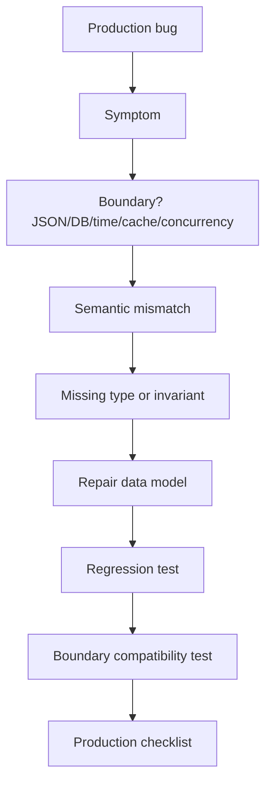

# learn-go-data-model-part-034.md

# Part 034 — Production Case Studies: Data Modeling Failure and Repair

> Seri: `learn-go-data-model`  
> Bagian: `034 / 034`  
> Target pembaca: Java software engineer yang ingin memahami Go data model pada level production engineering  
> Fokus: case study end-to-end tentang kegagalan data modeling di Go dan cara memperbaikinya secara production-grade  
> Status: **FINAL PART**

---

## 0. Posisi Part Ini dalam Seri

Ini adalah bagian terakhir dari seri `learn-go-data-model`.

Kita sudah membahas:

```text
000 Orientation
001 Type System Core
002 Zero Value, Initialization, Valid State
003 Constants
004 Numeric Foundations
005 Numeric Correctness
006 Text Model I
007 Text Model II
008 Array
009 Slice I
010 Slice II
011 Map I
012 Map II
013 Struct I
014 Struct II
015 Struct III
016 Pointer
017 Nil
018 Interface I
019 Interface II
020 Error as Data
021 Generics I
022 Generics II
023 Comparability / Equality / Ordering / Hashability
024 Reflection
025 Unsafe
026 Encoding Data
027 Database Boundary
028 Time as Data
029 Memory / Allocation / Escape / GC Pressure
030 Concurrency-Safe Data
031 API Design with Types
032 Testing Data Semantics
033 Performance Engineering
```

Part final ini bukan memperkenalkan satu data type baru.

Part ini melatih skill paling penting:

```text
Melihat bug produksi sebagai kegagalan data modeling,
lalu memperbaikinya dengan type, invariant, ownership, boundary, dan test.
```

Top 1% engineer bukan hanya tahu syntax.

Top 1% engineer bisa melihat:

```text
"Ini bukan bug JSON."
"Ini adalah bug semantic nil vs empty."

"Ini bukan bug timezone."
"Ini adalah bug salah memodelkan date-only sebagai instant."

"Ini bukan bug map."
"Ini adalah bug canonical key."

"Ini bukan bug GC."
"Ini adalah slice retention karena backing array."

"Ini bukan bug goroutine."
"Ini adalah ownership contract yang tidak ada."
```

---

## 1. Tujuan Pembelajaran

Setelah part ini, kamu harus bisa:

1. Mendiagnosis bug produksi sebagai data modeling failure.
2. Membedakan symptom, root cause, dan design repair.
3. Memilih repair dengan type, constructor, DTO, invariant, dan tests.
4. Menghindari patch cepat yang hanya menutup symptom.
5. Mendesain regression test untuk setiap failure.
6. Membuat checklist data model review untuk production.
7. Mengintegrasikan seluruh part 000–033 menjadi mental model utuh.

---

## 2. Format Case Study

Setiap case study memakai format:

```text
1. Scenario
2. Bug symptom
3. Bad code shape
4. Root cause
5. Repair strategy
6. Better code shape
7. Regression tests
8. Production checklist
```

Tujuannya bukan menghafal solusi, tetapi membangun instinct.

---

# Case Study 1 — Nil Slice vs Empty Slice API Break

## 3. Scenario

Service API mengembalikan daftar items.

Contract dengan frontend:

```json
{
  "items": []
}
```

Tetapi setelah refactor, response berubah:

```json
{
  "items": null
}
```

Frontend crash karena mengasumsikan `items` selalu array.

---

## 4. Bad Code Shape

```go
type ListUsersResponse struct {
    Items []UserResponse `json:"items"`
}

func NewListUsersResponse(users []User) ListUsersResponse {
    var items []UserResponse

    for _, u := range users {
        items = append(items, NewUserResponse(u))
    }

    return ListUsersResponse{Items: items}
}
```

Jika `users` kosong, `items` tetap nil.

JSON:

```json
{"items":null}
```

---

## 5. Root Cause

Ini bukan sekadar bug JSON.

Ini bug semantic:

```text
API contract: empty collection is []
Go zero value slice: nil
encoding/json nil slice: null
```

Go nil slice dan empty slice sering equivalent di internal logic:

```go
len(nilSlice) == 0
```

Tapi tidak equivalent di JSON representation.

---

## 6. Repair Strategy

Normalize collection at API boundary.

```go
func NewListUsersResponse(users []User) ListUsersResponse {
    items := make([]UserResponse, 0, len(users))

    for _, u := range users {
        items = append(items, NewUserResponse(u))
    }

    return ListUsersResponse{Items: items}
}
```

Now empty input returns non-nil empty slice.

Alternative helper:

```go
func EmptyIfNil[T any](s []T) []T {
    if s == nil {
        return []T{}
    }
    return s
}
```

Use only at boundary, not everywhere blindly.

---

## 7. Regression Test

```go
func TestListUsersResponseEmptyItemsArray(t *testing.T) {
    resp := NewListUsersResponse(nil)

    data, err := json.Marshal(resp)
    if err != nil {
        t.Fatal(err)
    }

    if string(data) != `{"items":[]}` {
        t.Fatalf("got %s", data)
    }
}
```

Also test semantic:

```go
func TestListUsersResponseItemsNonNil(t *testing.T) {
    resp := NewListUsersResponse(nil)

    if resp.Items == nil {
        t.Fatal("Items must be non-nil empty slice")
    }
}
```

---

## 8. Checklist

```text
[ ] Is nil vs empty observable at this boundary?
[ ] Does API contract require []/{} instead of null?
[ ] Do constructors normalize collection fields?
[ ] Do tests assert JSON representation?
```

---

# Case Study 2 — Money Stored as float64

## 9. Scenario

Payment service stores amounts as float64.

Intermittent reconciliation mismatch:

```text
expected 0.30
got      0.30000000000000004
```

---

## 10. Bad Code Shape

```go
type Payment struct {
    Amount   float64 `json:"amount"`
    Currency string  `json:"currency"`
}

func (p Payment) Total(fee Payment) Payment {
    return Payment{
        Amount:   p.Amount + fee.Amount,
        Currency: p.Currency,
    }
}
```

---

## 11. Root Cause

Money is exact domain data.

`float64` is binary floating-point approximation.

Bug category:

```text
Numeric data model failure.
```

Not:

```text
formatting bug
rounding display bug
database bug
```

---

## 12. Repair Strategy

Use integer minor unit or explicit decimal.

Simple money type:

```go
type Currency string

const CurrencyUSD Currency = "USD"

type Money struct {
    currency Currency
    cents    int64
}

func NewMoney(currency Currency, cents int64) (Money, error) {
    if currency == "" {
        return Money{}, errors.New("currency required")
    }
    return Money{currency: currency, cents: cents}, nil
}

func (m Money) Add(n Money) (Money, error) {
    if m.currency != n.currency {
        return Money{}, errors.New("currency mismatch")
    }

    if (n.cents > 0 && m.cents > math.MaxInt64-n.cents) ||
        (n.cents < 0 && m.cents < math.MinInt64-n.cents) {
        return Money{}, errors.New("money overflow")
    }

    return Money{currency: m.currency, cents: m.cents + n.cents}, nil
}

func (m Money) Cents() int64 {
    return m.cents
}

func (m Money) Currency() Currency {
    return m.currency
}
```

JSON DTO:

```go
type MoneyJSON struct {
    Currency Currency `json:"currency"`
    Cents    int64    `json:"cents"`
}
```

or if external contract needs decimal string:

```json
{"amount":"123.45","currency":"USD"}
```

with strict parser.

---

## 13. Regression Tests

```go
func TestMoneyAddExact(t *testing.T) {
    a := mustMoney(t, CurrencyUSD, 10)
    b := mustMoney(t, CurrencyUSD, 20)

    got, err := a.Add(b)
    if err != nil {
        t.Fatal(err)
    }

    if got.Cents() != 30 {
        t.Fatalf("got %d", got.Cents())
    }
}
```

Currency mismatch:

```go
func TestMoneyAddCurrencyMismatch(t *testing.T) {
    usd := mustMoney(t, "USD", 100)
    eur := mustMoney(t, "EUR", 100)

    _, err := usd.Add(eur)
    if err == nil {
        t.Fatal("expected error")
    }
}
```

Overflow:

```go
func TestMoneyAddOverflow(t *testing.T) {
    a := mustMoney(t, "USD", math.MaxInt64)
    b := mustMoney(t, "USD", 1)

    _, err := a.Add(b)
    if err == nil {
        t.Fatal("expected overflow")
    }
}
```

---

## 14. Checklist

```text
[ ] Is this exact numeric data?
[ ] Is float64 forbidden for money/decimal/counter?
[ ] Is scale explicit?
[ ] Is overflow tested?
[ ] Is database numeric mapping exact?
```

---

# Case Study 3 — Email Map Key Canonicalization Bug

## 15. Scenario

User lookup cache keyed by email sometimes has duplicates:

```text
Alice@example.com
alice@example.com
 ALICE@example.com
```

Same logical email creates different cache entries.

---

## 16. Bad Code Shape

```go
type UserCache struct {
    users map[string]User
}

func (c *UserCache) Put(email string, user User) {
    c.users[email] = user
}

func (c *UserCache) Get(email string) (User, bool) {
    u, ok := c.users[email]
    return u, ok
}
```

---

## 17. Root Cause

Map key is raw external input.

Bug category:

```text
Canonicalization failure.
```

Map works correctly. Key design is wrong.

---

## 18. Repair Strategy

Create canonical value object.

```go
type Email struct {
    canonical string
}

func ParseEmail(s string) (Email, error) {
    s = strings.TrimSpace(s)
    if s == "" {
        return Email{}, errors.New("email required")
    }

    // Simplified for example.
    s = strings.ToLower(s)

    if !strings.Contains(s, "@") {
        return Email{}, errors.New("invalid email")
    }

    return Email{canonical: s}, nil
}

func (e Email) String() string {
    return e.canonical
}

func (e Email) IsZero() bool {
    return e.canonical == ""
}
```

Cache:

```go
type UserCache struct {
    users map[Email]User
}

func NewUserCache() *UserCache {
    return &UserCache{
        users: make(map[Email]User),
    }
}

func (c *UserCache) Put(email Email, user User) {
    c.users[email] = user
}

func (c *UserCache) Get(email Email) (User, bool) {
    u, ok := c.users[email]
    return u, ok
}
```

Boundary:

```go
email, err := ParseEmail(req.Email)
if err != nil {
    return err
}
cache.Put(email, user)
```

---

## 19. Regression Tests

```go
func TestEmailCanonicalization(t *testing.T) {
    a, err := ParseEmail(" Alice@Example.COM ")
    if err != nil {
        t.Fatal(err)
    }

    b, err := ParseEmail("alice@example.com")
    if err != nil {
        t.Fatal(err)
    }

    if a != b {
        t.Fatalf("emails should canonicalize equal: %q %q", a, b)
    }
}
```

Cache:

```go
func TestUserCacheUsesCanonicalEmail(t *testing.T) {
    cache := NewUserCache()

    a := mustEmail(t, " Alice@Example.COM ")
    b := mustEmail(t, "alice@example.com")

    cache.Put(a, User{ID: "u1"})

    if _, ok := cache.Get(b); !ok {
        t.Fatal("expected lookup by canonical equivalent email")
    }
}
```

---

## 20. Checklist

```text
[ ] Are map keys canonical domain values?
[ ] Are raw external strings parsed before keying?
[ ] Does type system prevent raw string lookup?
[ ] Are normalization tests present?
```

---

# Case Study 4 — Slice Retention Memory Leak

## 21. Scenario

Service parses large uploaded files.

It extracts first line token and stores it in cache.

Memory grows with large files even though only small tokens are retained.

---

## 22. Bad Code Shape

```go
func ExtractToken(data []byte) []byte {
    idx := bytes.IndexByte(data, '\n')
    if idx < 0 {
        idx = len(data)
    }

    return data[:idx]
}
```

Caller:

```go
token := ExtractToken(fileBytes)
cache[tokenKey] = token
```

If `fileBytes` is 100MB and token is 20 bytes, token slice still references 100MB backing array.

---

## 23. Root Cause

Slice header points into backing array.

Bug category:

```text
Memory retention due to data view lifetime.
```

---

## 24. Repair Strategy

Copy retained small slice.

```go
func ExtractToken(data []byte) []byte {
    idx := bytes.IndexByte(data, '\n')
    if idx < 0 {
        idx = len(data)
    }

    return append([]byte(nil), data[:idx]...)
}
```

If token should be immutable key:

```go
func ExtractTokenString(data []byte) string {
    idx := bytes.IndexByte(data, '\n')
    if idx < 0 {
        idx = len(data)
    }

    return string(data[:idx]) // copy into immutable string
}
```

---

## 25. Regression Test

Hard to directly assert GC release deterministically, but test ownership/aliasing.

```go
func TestExtractTokenCopies(t *testing.T) {
    data := []byte("token\nlarge data")

    token := ExtractToken(data)
    data[0] = 'X'

    if string(token) != "token" {
        t.Fatalf("token aliases input: %q", token)
    }
}
```

Benchmark/memory test for large input can be added for performance-sensitive package.

---

## 26. Checklist

```text
[ ] Returning small slice from large input?
[ ] Retained view lifetime longer than source?
[ ] Copy needed to release backing array?
[ ] Aliasing test present?
```

---

# Case Study 5 — Time Zone Bug: Date-Only Modeled as UTC Instant

## 27. Scenario

User birthday is stored as `time.Time` at midnight UTC:

```text
1995-06-22T00:00:00Z
```

In America/Los_Angeles display, it becomes:

```text
1995-06-21
```

Birthday is wrong.

---

## 28. Bad Code Shape

```go
type Profile struct {
    BirthDate time.Time `json:"birth_date"`
}

func NewProfile(birthDate time.Time) Profile {
    return Profile{BirthDate: birthDate.UTC()}
}
```

API:

```json
{"birth_date":"1995-06-22T00:00:00Z"}
```

---

## 29. Root Cause

Birthday is date-only data, not instant.

Bug category:

```text
Wrong time concept.
```

---

## 30. Repair Strategy

Create Date type.

```go
type Date struct {
    t time.Time
}

func NewDate(year int, month time.Month, day int) (Date, error) {
    t := time.Date(year, month, day, 0, 0, 0, 0, time.UTC)

    if t.Year() != year || t.Month() != month || t.Day() != day {
        return Date{}, errors.New("invalid date")
    }

    return Date{t: t}, nil
}

func (d Date) MarshalText() ([]byte, error) {
    return []byte(d.t.Format(time.DateOnly)), nil
}

func (d *Date) UnmarshalText(text []byte) error {
    t, err := time.Parse(time.DateOnly, string(text))
    if err != nil {
        return err
    }

    *d = Date{t: t}
    return nil
}

func (d Date) String() string {
    return d.t.Format(time.DateOnly)
}
```

Profile:

```go
type Profile struct {
    birthDate Date
}
```

DTO:

```go
type ProfileResponse struct {
    BirthDate Date `json:"birth_date"`
}
```

JSON:

```json
{"birth_date":"1995-06-22"}
```

---

## 31. Regression Tests

```go
func TestDateJSONNoTimezoneShift(t *testing.T) {
    d, err := NewDate(1995, 6, 22)
    if err != nil {
        t.Fatal(err)
    }

    data, err := json.Marshal(d)
    if err != nil {
        t.Fatal(err)
    }

    if string(data) != `"1995-06-22"` {
        t.Fatalf("got %s", data)
    }
}
```

Invalid date:

```go
func TestDateRejectsInvalid(t *testing.T) {
    _, err := NewDate(2026, 2, 30)
    if err == nil {
        t.Fatal("expected invalid date")
    }
}
```

---

## 32. Checklist

```text
[ ] Is this instant or date-only?
[ ] Is timezone conversion allowed?
[ ] Does JSON contract use YYYY-MM-DD for date-only?
[ ] Are date-only tests independent of local timezone?
```

---

# Case Study 6 — DB NULL Collapsed into Empty String

## 33. Scenario

User profile has optional nickname.

Database:

```sql
nickname varchar null
```

Business meaning:

```text
NULL = not provided
""   = explicitly set empty nickname is invalid
```

Bug: missing nickname becomes empty string and passes through as provided.

---

## 34. Bad Code Shape

```go
type userRow struct {
    ID       string
    Nickname string
}

row.Scan(&r.ID, &r.Nickname)
```

Or ORM maps NULL to zero string.

Domain:

```go
type User struct {
    nickname string
}
```

---

## 35. Root Cause

DB NULL collapsed into Go zero value.

Bug category:

```text
Nullable boundary modeling failure.
```

---

## 36. Repair Strategy

Use explicit nullable at row boundary.

```go
type userRow struct {
    ID       string
    Nickname sql.NullString
}
```

Domain optional:

```go
type OptionalString struct {
    value string
    set   bool
}

func SomeString(s string) (OptionalString, error) {
    if s == "" {
        return OptionalString{}, errors.New("empty string not allowed")
    }
    return OptionalString{value: s, set: true}, nil
}

func NoneString() OptionalString {
    return OptionalString{}
}
```

Mapping:

```go
func (r userRow) ToDomain() (User, error) {
    id, err := ParseUserID(r.ID)
    if err != nil {
        return User{}, err
    }

    nickname := NoneString()
    if r.Nickname.Valid {
        nickname, err = SomeString(r.Nickname.String)
        if err != nil {
            return User{}, fmt.Errorf("invalid nickname: %w", err)
        }
    }

    return RehydrateUser(id, nickname)
}
```

---

## 37. Regression Tests

```go
func TestUserRowNullNickname(t *testing.T) {
    r := userRow{
        ID:       "u1",
        Nickname: sql.NullString{Valid: false},
    }

    u, err := r.ToDomain()
    if err != nil {
        t.Fatal(err)
    }

    if u.Nickname().IsSet() {
        t.Fatal("nickname should be absent")
    }
}
```

```go
func TestUserRowEmptyNicknameRejected(t *testing.T) {
    r := userRow{
        ID: "u1",
        Nickname: sql.NullString{
            String: "",
            Valid:  true,
        },
    }

    _, err := r.ToDomain()
    if err == nil {
        t.Fatal("expected error")
    }
}
```

---

## 38. Checklist

```text
[ ] Does DB NULL have distinct domain meaning?
[ ] Is sql.NullX confined to row boundary?
[ ] Is empty string different from NULL?
[ ] Are both cases tested?
```

---

# Case Study 7 — Unsafe Zero-Copy String Corrupts Map Key

## 39. Scenario

For performance, code converts `[]byte` to string without copy and uses it as map key.

Later input buffer is reused.

Map lookups become inconsistent.

---

## 40. Bad Code Shape

```go
func UnsafeString(b []byte) string {
    return unsafe.String(unsafe.SliceData(b), len(b))
}

func ParseAndStore(buf []byte, m map[string]int) {
    key := UnsafeString(buf[:10])
    m[key] = 1

    // buf reused/mutated later
}
```

---

## 41. Root Cause

String key must be immutable.

Unsafe string view points to mutable `[]byte`.

Bug category:

```text
Unsafe aliasing violates string/map invariants.
```

---

## 42. Repair Strategy

Use safe copy at key boundary.

```go
func ParseAndStore(buf []byte, m map[string]int) {
    key := string(buf[:10]) // copies
    m[key] = 1
}
```

If performance issue real, redesign ownership:

```text
- make buffer immutable
- do not reuse until map key lifetime ends
- copy only key segment
- use canonical ID parser producing value object
```

Do not expose global `UnsafeString` helper.

---

## 43. Regression Test

```go
func TestMapKeyDoesNotAliasBuffer(t *testing.T) {
    buf := []byte("abcdefghij-rest")
    m := map[string]int{}

    key := string(buf[:10])
    m[key] = 1

    buf[0] = 'X'

    if _, ok := m["abcdefghij"]; !ok {
        t.Fatal("safe string key should not alias buffer")
    }
}
```

Unsafe version would fail or behave unpredictably.

---

## 44. Checklist

```text
[ ] Is string used as map key derived from mutable bytes?
[ ] Is conversion safe copy unless immutability guaranteed?
[ ] Is unsafe localized and documented?
[ ] Is there benchmark proof before unsafe?
```

---

# Case Study 8 — Concurrent Slice Append Race

## 45. Scenario

Parallel processing appends results to shared slice.

Sometimes result count wrong. Race detector reports race.

---

## 46. Bad Code Shape

```go
var results []Result

for _, item := range items {
    go func(item Item) {
        results = append(results, process(item))
    }(item)
}
```

---

## 47. Root Cause

Slice header and backing array are shared mutable state.

`append` mutates header/backing array.

Bug category:

```text
Concurrency ownership failure.
```

---

## 48. Repair Strategy A — Single Collector Owns Slice

```go
out := make(chan Result)

var wg sync.WaitGroup
for _, item := range items {
    item := item
    wg.Add(1)
    go func() {
        defer wg.Done()
        out <- process(item)
    }()
}

go func() {
    wg.Wait()
    close(out)
}()

results := make([]Result, 0, len(items))
for r := range out {
    results = append(results, r)
}
```

Only collector goroutine mutates `results`.

---

## 49. Repair Strategy B — Preallocate and Write Distinct Index

If output order should match input:

```go
results := make([]Result, len(items))

var wg sync.WaitGroup
for i, item := range items {
    i, item := i, item

    wg.Add(1)
    go func() {
        defer wg.Done()
        results[i] = process(item)
    }()
}

wg.Wait()
```

This can be safe because:

```text
- slice header not mutated
- each goroutine writes distinct index
- no read until after Wait
```

---

## 50. Regression Test

```go
func TestProcessAllConcurrent(t *testing.T) {
    items := makeItems(1000)

    got := ProcessAll(items)

    if len(got) != len(items) {
        t.Fatalf("got %d want %d", len(got), len(items))
    }
}
```

Run:

```bash
go test -race ./...
```

---

## 51. Checklist

```text
[ ] Is any slice appended from multiple goroutines?
[ ] Is there a single owner or lock?
[ ] Can preallocated distinct index be used?
[ ] Is race detector run?
```

---

# Case Study 9 — Over-Generic Repository API

## 52. Scenario

Team creates generic repository:

```go
type Repository[T any, ID comparable] interface {
    Find(context.Context, ID) (T, error)
    Save(context.Context, T) error
    Delete(context.Context, ID) error
}
```

All modules use it.

Later domain needs:

```text
Find active user by email
Submit case with transition validation
Save audit with append-only semantics
Delete not allowed for some aggregate
```

Generic API becomes leaky and awkward.

---

## 53. Bad Code Shape

```go
func (s *CaseService) Submit(ctx context.Context, id CaseID) error {
    c, err := s.repo.Find(ctx, id)
    if err != nil {
        return err
    }

    c.Status = "submitted"

    return s.repo.Save(ctx, c)
}
```

Problems:

```text
- status is string
- transition logic outside aggregate
- repository too generic to express operation semantics
- Save may overwrite incorrectly
```

---

## 54. Root Cause

Generic CRUD erased domain language.

Bug category:

```text
API type design failure.
```

---

## 55. Repair Strategy

Use domain-specific repository.

```go
type CaseRepository interface {
    FindCaseForUpdate(ctx context.Context, id CaseID) (Case, error)
    SaveCase(ctx context.Context, c Case) error
}
```

Domain behavior:

```go
func (c *Case) Submit(now time.Time) error {
    if c.status != CaseStatusDraft {
        return ErrInvalidCaseTransition
    }

    c.status = CaseStatusSubmitted
    c.submittedAt = SomeTime(now.UTC().Round(0))
    return nil
}
```

Service:

```go
func (s *CaseService) Submit(ctx context.Context, id CaseID) error {
    c, err := s.repo.FindCaseForUpdate(ctx, id)
    if err != nil {
        return err
    }

    if err := c.Submit(s.clock.Now()); err != nil {
        return err
    }

    return s.repo.SaveCase(ctx, c)
}
```

Now types express domain.

---

## 56. Regression Tests

Domain transition:

```go
func TestCaseSubmitFromDraft(t *testing.T) {
    c := draftCase(t)

    err := c.Submit(fixedTime())
    if err != nil {
        t.Fatal(err)
    }

    if c.Status() != CaseStatusSubmitted {
        t.Fatal("not submitted")
    }
}
```

Invalid transition:

```go
func TestCaseSubmitRejectsAlreadySubmitted(t *testing.T) {
    c := submittedCase(t)

    err := c.Submit(fixedTime())
    if !errors.Is(err, ErrInvalidCaseTransition) {
        t.Fatalf("got %v", err)
    }
}
```

Repository contract test:

```text
FindCaseForUpdate locks row / version behavior integration-tested.
```

---

## 57. Checklist

```text
[ ] Does generic API erase domain semantics?
[ ] Are operations named in business language?
[ ] Are invariants inside domain type?
[ ] Is repository boundary specific enough?
```

---

# Case Study 10 — Interface Equality Panic in Dedup Logic

## 58. Scenario

Generic dedup function accepts `[]any`.

Works for strings/ints, panics for slices.

---

## 59. Bad Code Shape

```go
func ContainsAny(values []any, target any) bool {
    for _, v := range values {
        if v == target {
            return true
        }
    }
    return false
}
```

Panic:

```go
values := []any{[]int{1}}
ContainsAny(values, []int{1})
```

---

## 60. Root Cause

Interface values are comparable statically, but comparison panics if dynamic value is non-comparable.

Bug category:

```text
Interface equality misuse.
```

---

## 61. Repair Strategy A — Generic Comparable

```go
func Contains[T comparable](values []T, target T) bool {
    for _, v := range values {
        if v == target {
            return true
        }
    }
    return false
}
```

Compile-time prevents non-comparable T.

---

## 62. Repair Strategy B — Equality Function

For non-comparable types:

```go
func ContainsFunc[T any](values []T, target T, eq func(T, T) bool) bool {
    for _, v := range values {
        if eq(v, target) {
            return true
        }
    }
    return false
}
```

Use:

```go
ok := ContainsFunc(items, target, slices.Equal[[]int])
```

or:

```go
ok := ContainsFunc(users, target, func(a, b User) bool {
    return a.ID() == b.ID()
})
```

---

## 63. Regression Tests

```go
func TestContainsComparable(t *testing.T) {
    if !Contains([]string{"a", "b"}, "a") {
        t.Fatal("missing")
    }
}
```

For slices:

```go
func TestContainsFuncSlice(t *testing.T) {
    values := [][]int{{1}, {2}}

    ok := ContainsFunc(values, []int{1}, slices.Equal[int])
    if !ok {
        t.Fatal("missing")
    }
}
```

---

## 64. Checklist

```text
[ ] Is equality over any/interface?
[ ] Could dynamic value be non-comparable?
[ ] Should API use comparable generic?
[ ] Should caller provide Equal function?
```

---

# Case Study 11 — JSON Number Precision Loss

## 65. Scenario

Payload contains large ID:

```json
{"id":9007199254740993}
```

Code decodes into `map[string]any`.

ID becomes `float64`, loses precision.

---

## 66. Bad Code Shape

```go
var payload map[string]any

if err := json.Unmarshal(data, &payload); err != nil {
    return err
}

id := int64(payload["id"].(float64))
```

---

## 67. Root Cause

`encoding/json` decodes numbers into `float64` when target is `any`.

Bug category:

```text
Dynamic decoding loses numeric semantics.
```

---

## 68. Repair Strategy A — Typed DTO

```go
type Request struct {
    ID int64 `json:"id"`
}

var req Request
if err := json.Unmarshal(data, &req); err != nil {
    return err
}
```

---

## 69. Repair Strategy B — UseNumber for Dynamic

```go
dec := json.NewDecoder(bytes.NewReader(data))
dec.UseNumber()

var payload map[string]any
if err := dec.Decode(&payload); err != nil {
    return err
}

num, ok := payload["id"].(json.Number)
if !ok {
    return errors.New("id must be number")
}

id, err := num.Int64()
if err != nil {
    return err
}
```

Better: avoid dynamic if schema known.

---

## 70. Regression Test

```go
func TestJSONLargeIDPrecision(t *testing.T) {
    data := []byte(`{"id":9007199254740993}`)

    var req struct {
        ID int64 `json:"id"`
    }

    if err := json.Unmarshal(data, &req); err != nil {
        t.Fatal(err)
    }

    if req.ID != 9007199254740993 {
        t.Fatalf("got %d", req.ID)
    }
}
```

Dynamic `map[string]any` version would fail precision.

---

## 71. Checklist

```text
[ ] Is JSON schema known? Use typed struct.
[ ] Are large integers decoded dynamically?
[ ] Is Decoder.UseNumber needed?
[ ] Are IDs modeled as strings if cross-JavaScript boundary?
```

---

# Case Study 12 — Public Struct Field Breaks Invariant

## 72. Scenario

Package exposes:

```go
type Token struct {
    ExpiresAt time.Time
}
```

Caller sets zero expiry accidentally. Token never expires or expires immediately depending logic.

---

## 73. Bad Code Shape

```go
type Token struct {
    Value     string
    ExpiresAt time.Time
}

func (t Token) Valid(now time.Time) bool {
    return now.Before(t.ExpiresAt)
}
```

Caller:

```go
token := Token{Value: "abc"}
```

`ExpiresAt` zero.

---

## 74. Root Cause

Exported fields allow invalid construction.

Bug category:

```text
API invariant leak.
```

---

## 75. Repair Strategy

Unexport fields and constructor.

```go
type Token struct {
    value     string
    expiresAt time.Time
}

func NewToken(value string, expiresAt time.Time) (Token, error) {
    if value == "" {
        return Token{}, errors.New("token value required")
    }
    if expiresAt.IsZero() {
        return Token{}, errors.New("expiry required")
    }

    return Token{
        value:     value,
        expiresAt: expiresAt.UTC().Round(0),
    }, nil
}

func (t Token) Valid(now time.Time) bool {
    return now.Before(t.expiresAt)
}

func (t Token) ExpiresAt() time.Time {
    return t.expiresAt
}
```

---

## 76. Regression Tests

```go
func TestNewTokenRejectsZeroExpiry(t *testing.T) {
    _, err := NewToken("abc", time.Time{})
    if err == nil {
        t.Fatal("expected error")
    }
}
```

Boundary:

```go
func TestTokenValidBoundary(t *testing.T) {
    exp := time.Date(2026, 6, 22, 10, 0, 0, 0, time.UTC)

    token := mustToken(t, "abc", exp)

    if !token.Valid(exp.Add(-time.Nanosecond)) {
        t.Fatal("should be valid before expiry")
    }

    if token.Valid(exp) {
        t.Fatal("should be invalid at expiry boundary")
    }
}
```

---

## 77. Checklist

```text
[ ] Can caller construct invalid public struct?
[ ] Are required fields unexported?
[ ] Does constructor validate?
[ ] Are boundary semantics tested?
```

---

# Case Study 13 — `reflect.DeepEqual` Breaks Time Test

## 78. Scenario

Test compares response containing `time.Time` using `reflect.DeepEqual`.

It fails intermittently after JSON/database roundtrip.

---

## 79. Bad Code Shape

```go
if !reflect.DeepEqual(got, want) {
    t.Fatalf("got %+v want %+v", got, want)
}
```

Struct:

```go
type Event struct {
    ID        string
    CreatedAt time.Time
}
```

---

## 80. Root Cause

`time.Time` representation may differ because of monotonic clock/location/precision even if instant is same.

Bug category:

```text
Wrong equality semantics in test.
```

---

## 81. Repair Strategy

Use custom comparison.

```go
func assertEventEqual(t *testing.T, got, want Event) {
    t.Helper()

    if got.ID != want.ID {
        t.Fatalf("ID got %q want %q", got.ID, want.ID)
    }

    if !got.CreatedAt.Equal(want.CreatedAt) {
        t.Fatalf("CreatedAt got %v want %v", got.CreatedAt, want.CreatedAt)
    }
}
```

If DB precision:

```go
func normalizeDBTime(t time.Time) time.Time {
    return t.UTC().Round(0).Truncate(time.Microsecond)
}
```

Then compare normalized.

---

## 82. Regression Test

```go
func TestEventJSONRoundTripTimeEqual(t *testing.T) {
    want := Event{
        ID:        "e1",
        CreatedAt: time.Now().UTC(),
    }

    data, err := json.Marshal(want)
    if err != nil {
        t.Fatal(err)
    }

    var got Event
    if err := json.Unmarshal(data, &got); err != nil {
        t.Fatal(err)
    }

    assertEventEqual(t, got, want)
}
```

---

## 83. Checklist

```text
[ ] Does test use correct equality semantic?
[ ] Is time compared with Equal?
[ ] Is DB precision normalized?
[ ] Is DeepEqual avoided for domain equality?
```

---

# Case Study 14 — Cache Without Bound

## 84. Scenario

Service has in-memory cache:

```go
map[string]Response
```

Memory grows until OOM.

---

## 85. Bad Code Shape

```go
type Cache struct {
    mu sync.Mutex
    m  map[string]Response
}

func (c *Cache) GetOrLoad(key string, load func() Response) Response {
    c.mu.Lock()
    defer c.mu.Unlock()

    if v, ok := c.m[key]; ok {
        return v
    }

    v := load()
    c.m[key] = v
    return v
}
```

No max size, no TTL, no eviction.

---

## 86. Root Cause

Reachable memory leak due to unbounded data structure.

Bug category:

```text
Data lifecycle modeling failure.
```

---

## 87. Repair Strategy

Define cache policy:

```text
max entries
TTL
eviction
value size limit
metrics
cleanup
```

Simple TTL cache sketch:

```go
type cacheEntry[V any] struct {
    value     V
    expiresAt time.Time
}

type Cache[K comparable, V any] struct {
    mu       sync.Mutex
    entries  map[K]cacheEntry[V]
    maxItems int
    ttl      time.Duration
    clock    Clock
}
```

Put:

```go
func (c *Cache[K, V]) Put(k K, v V) {
    c.mu.Lock()
    defer c.mu.Unlock()

    if c.entries == nil {
        c.entries = make(map[K]cacheEntry[V])
    }

    if len(c.entries) >= c.maxItems {
        c.evictOneLocked()
    }

    c.entries[k] = cacheEntry[V]{
        value:     v,
        expiresAt: c.clock.Now().Add(c.ttl),
    }
}
```

This is simplified. Production cache needs careful eviction.

Alternative:

```text
Use well-tested cache library if requirements are non-trivial.
```

---

## 88. Regression Tests

```go
func TestCacheEvictsExpired(t *testing.T) {
    clock := NewFakeClock(start)
    c := NewCache[string, int](CacheConfig{
        MaxItems: 10,
        TTL:      time.Minute,
        Clock:    clock,
    })

    c.Put("a", 1)

    clock.Advance(2 * time.Minute)

    if _, ok := c.Get("a"); ok {
        t.Fatal("expected expired entry")
    }
}
```

Max items:

```go
func TestCacheBounded(t *testing.T) {
    c := NewCache[string, int](CacheConfig{MaxItems: 2, TTL: time.Hour})

    c.Put("a", 1)
    c.Put("b", 2)
    c.Put("c", 3)

    if c.Len() > 2 {
        t.Fatal("cache exceeded max items")
    }
}
```

---

## 89. Checklist

```text
[ ] Is map/cache bounded?
[ ] Is TTL/eviction policy explicit?
[ ] Are large values limited?
[ ] Are metrics available?
[ ] Are cleanup and lifecycle tested?
```

---

# Case Study 15 — Tags Pile-Up Domain Struct

## 90. Scenario

One struct is used for DB, JSON, validation, and domain.

```go
type User struct {
    ID           string `json:"id" db:"id" validate:"required"`
    Email        string `json:"email" db:"email" validate:"required,email"`
    PasswordHash []byte `json:"password_hash" db:"password_hash"`
    Role         string `json:"role" db:"role"`
}
```

Bug: API accidentally exposes `password_hash` and allows `role` assignment in create request.

---

## 91. Root Cause

One type is doing too many jobs.

Bug category:

```text
Boundary collapse / leaky abstraction.
```

---

## 92. Repair Strategy

Separate types.

Request DTO:

```go
type CreateUserRequest struct {
    Email string `json:"email"`
    Name  string `json:"name"`
}
```

Command:

```go
type CreateUserCommand struct {
    Email Email
    Name  string
}
```

Domain:

```go
type User struct {
    id           UserID
    email        Email
    passwordHash PasswordHash
    role         Role
}
```

DB row:

```go
type userRow struct {
    ID           string
    Email        string
    PasswordHash []byte
    Role         string
}
```

Response DTO:

```go
type UserResponse struct {
    ID    string `json:"id"`
    Email string `json:"email"`
    Name  string `json:"name"`
}
```

---

## 93. Regression Tests

Request ignores role by strict unknown field:

```go
func TestCreateUserRejectsUnknownRole(t *testing.T) {
    body := []byte(`{"email":"a@example.com","name":"Alice","role":"admin"}`)

    dec := json.NewDecoder(bytes.NewReader(body))
    dec.DisallowUnknownFields()

    var req CreateUserRequest
    err := dec.Decode(&req)

    if err == nil {
        t.Fatal("expected unknown field error")
    }
}
```

Response does not expose password:

```go
func TestUserResponseDoesNotExposePasswordHash(t *testing.T) {
    resp := NewUserResponse(userWithPasswordHash(t))

    data, err := json.Marshal(resp)
    if err != nil {
        t.Fatal(err)
    }

    if bytes.Contains(data, []byte("password")) {
        t.Fatalf("response leaks password field: %s", data)
    }
}
```

---

## 94. Checklist

```text
[ ] Is one struct used for DB + JSON + domain?
[ ] Are sensitive fields impossible to encode?
[ ] Is input allowlisted?
[ ] Are domain invariants unexported?
[ ] Are mapping tests present?
```

---

# 95. Cross-Case Patterns

Across all failures, repeat patterns emerge.

## 95.1 Boundary Collapse

One type used for everything.

Repair:

```text
DTO / row / domain / response separation.
```

## 95.2 Missing Canonicalization

Raw strings used as IDs/actions/emails.

Repair:

```text
Parse into canonical value object.
```

## 95.3 Ambiguous Zero

Zero value used for missing/invalid/real value.

Repair:

```text
optional wrapper, sql.NullX, constructor validation.
```

## 95.4 Wrong Equality

`==`/DeepEqual used when domain equality differs.

Repair:

```text
Equal method/function, time.Equal, slices/maps helpers.
```

## 95.5 Aliasing Without Ownership

Slices/maps/buffers shared accidentally.

Repair:

```text
copy, ownership transfer, immutable snapshots.
```

## 95.6 Unbounded Lifetime

Cache/map/goroutine/ticker never ends.

Repair:

```text
bound, TTL, eviction, cancellation, stop.
```

## 95.7 Premature Cleverness

Unsafe/pooling/generic abstraction before evidence.

Repair:

```text
measure, simplify, isolate, document.
```

---

# 96. Universal Data Model Repair Algorithm

When production data bug happens:

```text
1. Identify observable symptom.
2. Identify data boundary involved.
3. Identify semantic mismatch.
4. Name the missing concept.
5. Create/adjust type to represent it.
6. Move validation/canonicalization to constructor/parser.
7. Separate boundary model if needed.
8. Add regression test at the boundary.
9. Add invariant/property test at the domain type.
10. Add compatibility test if external contract changed.
```

Diagram:



---

# 97. Final Data Model Review Checklist

Use this checklist for serious Go PRs.

## 97.1 Type and Invariant

```text
[ ] Does this type represent one clear concept?
[ ] Can invalid state be constructed?
[ ] Are fields exported only when mutation is acceptable?
[ ] Does constructor/parser validate and normalize?
[ ] Is zero value behavior intentional?
```

## 97.2 Boundary

```text
[ ] Is domain separated from DTO/DB row?
[ ] Are JSON tags stable and tested?
[ ] Is DB NULL mapped explicitly?
[ ] Are decimal/time/enum/ID boundaries correct?
[ ] Is external input canonicalized?
```

## 97.3 Collection

```text
[ ] nil vs empty semantics clear?
[ ] map key canonical and comparable?
[ ] slice/map ownership clear?
[ ] internal collections not exposed mutably?
[ ] cache/queue bounded?
```

## 97.4 Equality and Ordering

```text
[ ] Does == match domain equality?
[ ] Is custom Equal/Compare needed?
[ ] Is time compared with Equal?
[ ] Are float/NaN cases avoided or tested?
[ ] Is ordering deterministic with tie-breaker?
```

## 97.5 Memory

```text
[ ] Are small views retaining large buffers?
[ ] Are deleted slice elements cleared when pointer-heavy?
[ ] Is pointer-heavy shape justified?
[ ] Are allocations measured if hot?
[ ] Is pooling/unsafe justified and documented?
```

## 97.6 Concurrency

```text
[ ] Who owns mutable data?
[ ] Is shared mutable state synchronized?
[ ] Are maps/slices accessed concurrently?
[ ] Are immutable snapshots truly immutable?
[ ] Has race detector been run?
```

## 97.7 API Compatibility

```text
[ ] Is exported surface minimal?
[ ] Will adding fields/methods break callers?
[ ] Are interfaces small and stable?
[ ] Are error sentinels/types stable?
[ ] Is ownership/concurrency documented?
```

## 97.8 Tests

```text
[ ] Table tests for valid/invalid cases?
[ ] Boundary tests for missing/null/zero?
[ ] Golden tests for external payload?
[ ] Fuzz tests for parser/decoder?
[ ] Regression test for known bug?
[ ] Compatibility fixtures for old payloads?
```

---

# 98. Final Mental Model

Go data modeling is not about memorizing types.

It is about making illegal states hard to represent and accidental semantics hard to leak.

Core principles:

```text
1. Name domain concepts with types.
2. Parse external input into canonical values.
3. Keep domain separate from boundary representation.
4. Use constructors to protect invariants.
5. Treat nil/zero/null/empty as different unless proven same.
6. Define equality and ordering explicitly.
7. Know ownership of slices/maps/buffers.
8. Prefer immutable sharing over shared mutation.
9. Measure performance before optimizing.
10. Test semantics at every boundary.
```

If you internalize this, you stop writing Go as “Java with shorter syntax” and start writing Go as a language with its own data-oriented engineering style.

---

# 99. What “Top 1%” Looks Like for Go Data Model

A top engineer looking at a Go data type asks:

```text
What concept does this type represent?
What states are invalid?
Can invalid state be constructed?
What is the zero value?
Who owns this memory?
Can this be used concurrently?
Is equality language-level or domain-level?
Can this be a map key?
Can this cross JSON/DB boundary safely?
Does this retain memory unexpectedly?
Can this API evolve?
How do tests lock the contract?
```

A junior often asks:

```text
Does it compile?
Does happy path work?
```

A senior asks:

```text
What invariant does this preserve?
What future bug does this prevent?
```

---

# 100. Recommended Next Series

After finishing this series, the next high-value Go series would be:

```text
1. Go Error Handling, Reliability, and Resilience Patterns
2. Go Concurrency, Parallelism, Scheduler, Context, and Worker Patterns
3. Go HTTP, Network, gRPC, and Production API Design
4. Go SQL, Transaction, Repository, and Persistence Patterns
5. Go Testing, Benchmarking, Profiling, and Performance Engineering
6. Go Authentication, Authorization, Identity, and Permission Patterns
```

Given this series just ended with data model, the most natural continuation is:

```text
Go Error Handling, Reliability, and Resilience Patterns
```

because data model and error model together shape most production correctness.

---

# 101. Final References

- Go Language Specification  
  https://go.dev/ref/spec
- Effective Go  
  https://go.dev/doc/effective_go
- Go Code Review Comments  
  https://go.dev/wiki/CodeReviewComments
- Package `testing`  
  https://pkg.go.dev/testing
- Package `encoding/json`  
  https://pkg.go.dev/encoding/json
- Package `database/sql`  
  https://pkg.go.dev/database/sql
- Package `time`  
  https://pkg.go.dev/time
- Go Memory Model  
  https://go.dev/ref/mem
- Data Race Detector  
  https://go.dev/doc/articles/race_detector
- Go Diagnostics  
  https://go.dev/doc/diagnostics

---

# 102. Status Seri

Selesai:

```text
part-000  Orientation
part-001  Type System Core
part-002  Zero Value, Initialization, Valid State, Invariant Design
part-003  Constants, Untyped Values, iota, Compile-Time Semantics
part-004  Boolean, Integer, Float, Complex: Numeric Foundations
part-005  Numeric Correctness
part-006  Text Model I
part-007  Text Model II
part-008  Array
part-009  Slice I
part-010  Slice II
part-011  Map I
part-012  Map II
part-013  Struct I
part-014  Struct II
part-015  Struct III
part-016  Pointer
part-017  Nil
part-018  Interface I
part-019  Interface II
part-020  Error as Data
part-021  Generics I
part-022  Generics II
part-023  Comparability / Equality / Ordering / Hashability
part-024  Reflection
part-025  Unsafe
part-026  Encoding Data
part-027  Database Boundary
part-028  Time as Data
part-029  Memory / Allocation / Escape / GC Pressure
part-030  Concurrency-Safe Data
part-031  API Design with Types
part-032  Testing Data Semantics
part-033  Performance Engineering
part-034  Production Case Studies
```

Seri `learn-go-data-model` **selesai**.


<!-- NAVIGATION_FOOTER -->
<div class="page-nav">
<a href="./learn-go-data-model-part-033.md">⬅️ Part 033 — Performance Engineering for Data Types and Collections</a>
<a href="./index.md">📚 Kategori</a>
<a href="../../index.md">🏠 Home</a>
<span></span>
</div>
