# learn-go-concurrency-parallelism-part-000.md

# Part 000 — Orientation: Dari Java Threading ke Go Concurrency Engineering

> Seri: **learn-go-concurrency-parallelism**  
> Target pembaca: **Java software engineer** yang ingin masuk ke level engineering handbook internal untuk Go concurrency.  
> Target Go: **Go 1.26.x**  
> Status seri: **Part 000 dari 034 — belum selesai**  
> Fokus part ini: **orientasi mental model, peta konsep, perbedaan Java vs Go, dan fondasi berpikir sebelum masuk runtime/scheduler/memory model secara detail.**

---

## 0. Cara Membaca Part Ini

Part ini bukan tutorial `go func() { ... }()` atau `make(chan T)`. Itu terlalu dangkal untuk tujuan seri ini.

Part ini adalah **orientation layer**: bagian yang membentuk cara berpikir sebelum masuk ke detail yang lebih mekanis pada part berikutnya. Setelah membaca part ini, targetnya bukan hanya bisa menjawab “apa itu goroutine”, tetapi mulai bisa menjawab:

- kapan concurrency benar-benar dibutuhkan;
- kapan concurrency justru memperburuk sistem;
- kenapa goroutine murah tetapi tidak gratis;
- kenapa channel bukan pengganti universal untuk mutex;
- kenapa timeout/cancellation bukan fitur tambahan, tetapi bagian dari kontrak concurrency;
- bagaimana memetakan pengalaman Java `Thread`, `ExecutorService`, `CompletableFuture`, `synchronized`, `Lock`, `volatile`, dan virtual thread ke idiom Go;
- bagaimana memandang Go runtime sebagai bagian dari desain sistem, bukan sekadar detail implementasi bahasa.

Part ini sengaja banyak memakai perbandingan Java karena Anda datang dari background Java. Namun tujuan akhirnya bukan “menulis Java style di Go”, melainkan **membongkar mental model Java lalu membangun ulang mental model Go secara tepat**.

---

## 1. Big Picture: Masalah Apa yang Sebenarnya Diselesaikan Concurrency?

Concurrency bukan tujuan. Concurrency adalah alat untuk mengatur **banyak pekerjaan yang overlap dalam waktu**.

Masalah yang biasa diselesaikan concurrency:

1. **Menunggu sesuatu tanpa menghentikan seluruh program**  
   Contoh: request HTTP menunggu database, service lain, disk, network, queue.

2. **Memecah pekerjaan besar menjadi beberapa pekerjaan yang dapat berjalan bersama**  
   Contoh: memproses 1 juta record dengan beberapa worker.

3. **Mengisolasi bagian sistem yang punya lifecycle berbeda**  
   Contoh: HTTP server, background scheduler, message consumer, metrics exporter.

4. **Mengatur resource terbatas**  
   Contoh: database hanya aman untuk 50 concurrent query, external API hanya 300 request/menit, CPU container hanya 2 vCPU.

5. **Membuat sistem tetap responsif**  
   Contoh: request lambat tidak boleh memblokir semua request lain.

Namun concurrency juga menambah risiko:

- race condition;
- deadlock;
- goroutine leak;
- queue buildup;
- memory pressure;
- CPU oversubscription;
- tail latency buruk;
- cancellation tidak terpropagasi;
- observability menjadi sulit;
- test menjadi flaky;
- production incident lebih sulit direproduksi.

Jadi pertanyaan engineer senior bukan “bagaimana membuat ini concurrent?”, melainkan:

> **Apa unit kerja yang harus overlap, resource apa yang membatasi, state apa yang dibagi, dan bagaimana lifecycle-nya dihentikan secara aman?**

Itulah framing utama seri ini.

---

## 2. Definisi Kritis: Concurrency, Parallelism, Asynchrony, Distribution

Empat istilah ini sering dicampur. Dalam sistem production, mencampurnya menyebabkan desain yang salah.

### 2.1 Concurrency

**Concurrency** berarti sistem mampu menangani beberapa pekerjaan yang hidup pada periode waktu yang sama, walaupun belum tentu dieksekusi pada saat yang persis sama.

Contoh:

- 10.000 request HTTP sedang menunggu I/O.
- 100 goroutine sedang blocked pada channel atau network.
- 5 worker sedang mengambil job dari queue.

Concurrency adalah tentang **struktur pekerjaan**.

### 2.2 Parallelism

**Parallelism** berarti beberapa pekerjaan benar-benar dieksekusi secara bersamaan di core CPU berbeda.

Contoh:

- 4 goroutine CPU-bound berjalan di 4 logical CPU berbeda.
- proses image encoding dibagi menjadi 8 chunk dan diproses paralel.

Parallelism adalah tentang **eksekusi fisik**.

### 2.3 Asynchrony

**Asynchrony** berarti caller tidak menunggu hasil secara blocking pada call stack yang sama. Hasil dikembalikan nanti melalui callback, future, promise, channel, event, atau polling.

Contoh Java:

```java
CompletableFuture.supplyAsync(() -> fetchData())
    .thenApply(this::transform)
    .thenAccept(this::save);
```

Contoh Go:

```go
resultCh := make(chan Result, 1)

go func() {
    resultCh <- fetchData(ctx)
}()

result := <-resultCh
```

Asynchrony adalah tentang **bentuk API dan kontrol alur**.

### 2.4 Distribution

**Distribution** berarti pekerjaan tersebar di process, host, container, zone, region, atau service berbeda.

Contoh:

- Kafka consumer group;
- sharded workers;
- distributed lock;
- saga antar microservice;
- replicated cache.

Distribution adalah tentang **batas proses dan jaringan**.

### 2.5 Diagram Hubungan

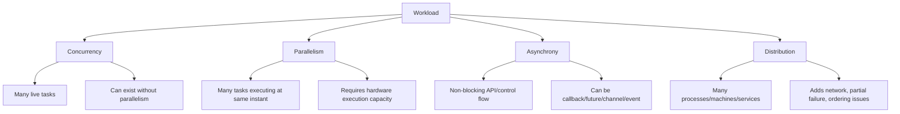

### 2.6 Contoh Praktis

| Situasi | Concurrent? | Parallel? | Async? | Distributed? |
|---|---:|---:|---:|---:|
| Single goroutine membaca file besar secara blocking | Tidak signifikan | Tidak | Tidak | Tidak |
| 10.000 goroutine menunggu network response | Ya | Sedikit | Bisa iya/tidak | Bisa iya |
| 8 goroutine menghitung hash di 8 CPU | Ya | Ya | Tidak harus | Tidak |
| Java `CompletableFuture` chained di executor | Ya | Tergantung executor | Ya | Tidak |
| Kafka consumer group di 10 pod | Ya | Ya | Ya | Ya |
| Go HTTP server satu process melayani banyak request | Ya | Ya jika banyak CPU | API handler terlihat blocking | Tidak langsung |

Mental model penting:

> **Concurrency adalah desain struktur pekerjaan. Parallelism adalah realisasi hardware. Asynchrony adalah bentuk interaksi. Distribution adalah batas kegagalan.**

---

## 3. Kenapa Java Engineer Sering Salah Membaca Go Concurrency

Sebagai Java engineer, Anda kemungkinan terbiasa dengan beberapa ide berikut:

- OS thread cukup mahal;
- thread pool penting untuk membatasi thread;
- `ExecutorService` adalah default abstraction untuk concurrency;
- `Future`/`CompletableFuture` membawa hasil async;
- `synchronized`, `Lock`, `Semaphore`, `CountDownLatch`, `Phaser`, `BlockingQueue` adalah primitive umum;
- reactive stack sering dipakai untuk menghindari blocking thread;
- virtual thread mengubah biaya blocking dalam Java modern.

Di Go, beberapa ide itu masih berguna, tetapi bentuknya berubah.

### 3.1 Java: Thread sebagai Resource yang Terasa Mahal

Di Java klasik, `Thread` langsung berasosiasi dengan OS thread. OS thread punya stack besar, scheduling oleh OS, dan overhead context switch relatif mahal. Karena itu Java ecosystem lama sangat menekankan:

- thread pool;
- executor;
- queue;
- bounded concurrency;
- non-blocking I/O;
- reactive style untuk high concurrency.

Di Java, membuat thread baru untuk setiap request historisnya sering dianggap buruk.

### 3.2 Go: Goroutine sebagai Unit Concurrency yang Murah

Di Go, unit concurrency adalah **goroutine**, bukan OS thread langsung. Goroutine dijadwalkan oleh Go runtime di atas sejumlah OS thread.

Karena goroutine murah, Go mendorong gaya:

```go
go handleConnection(conn)
```

atau:

```go
go func() {
    defer wg.Done()
    process(job)
}()
```

Namun murah tidak sama dengan gratis.

Goroutine tetap punya:

- stack;
- metadata runtime;
- scheduling cost;
- referensi ke object yang dapat memperpanjang lifetime memory;
- potensi leak;
- potensi blocking;
- kontribusi terhadap GC scanning;
- kontribusi terhadap contention.

Kesalahan umum Java engineer saat masuk Go:

> “Karena goroutine murah, worker pool tidak diperlukan.”

Yang benar:

> **Worker pool di Go bukan terutama untuk menghemat goroutine, tetapi untuk membatasi resource, mengontrol backpressure, dan menjaga stabilitas sistem.**

### 3.3 Java Executor vs Go Goroutine

Java:

```java
ExecutorService executor = Executors.newFixedThreadPool(32);
Future<Result> future = executor.submit(() -> compute());
Result result = future.get();
```

Go:

```go
resultCh := make(chan Result, 1)

go func() {
    resultCh <- compute()
}()

result := <-resultCh
```

Perbedaannya bukan hanya syntax.

Di Java, pertanyaan default sering:

> “Executor mana yang menjalankan task ini?”

Di Go, pertanyaan default lebih sering:

> “Siapa yang memiliki goroutine ini, bagaimana ia berhenti, dan bagaimana hasil/error/cancellation dikembalikan?”

Go tidak memaksa Anda memakai executor untuk setiap goroutine. Itu membuat kode sederhana, tetapi juga membuat lifecycle lebih mudah terlupakan.

---

## 4. Slogan Go yang Sering Disalahpahami

Slogan terkenal Go:

> “Do not communicate by sharing memory; instead, share memory by communicating.”

Makna praktisnya bukan “jangan pernah pakai mutex”. Makna sebenarnya:

- desainlah ownership state secara jelas;
- gunakan komunikasi untuk memindahkan ownership bila itu menyederhanakan invariant;
- jangan membuat semua goroutine bebas membaca/menulis state global;
- pilih primitive berdasarkan invariant, bukan berdasarkan dogma.

### 4.1 Channel Bukan Selalu Lebih Baik dari Mutex

Mutex sering lebih tepat jika:

- ada struktur data kecil yang dilindungi;
- operasi singkat;
- invariant mudah dijelaskan;
- caller butuh akses sinkron;
- tidak ada pipeline atau ownership transfer.

Channel sering lebih tepat jika:

- ada event stream;
- ada producer-consumer;
- ada handoff ownership;
- ada worker pool;
- ada cancellation select;
- ada kebutuhan backpressure eksplisit.

Atomic sering lebih tepat jika:

- state sangat kecil;
- invariant sederhana;
- operasi harus sangat ringan;
- Anda benar-benar memahami memory ordering dan contention.

Actor/event loop cocok jika:

- satu goroutine menjadi pemilik state kompleks;
- operasi terhadap state harus berurutan;
- ordering lebih penting daripada parallel mutation;
- API bisa diubah menjadi command/message.

### 4.2 Decision Matrix Awal

| Kebutuhan | Primitive yang sering cocok | Catatan |
|---|---|---|
| Melindungi map kecil dengan read/write biasa | `sync.Mutex` / `sync.RWMutex` | Jangan pakai channel hanya untuk “terlihat Go-like” |
| Producer-consumer bounded | channel buffered | Channel buffer menjadi queue dan backpressure |
| Menunggu banyak goroutine selesai | `sync.WaitGroup` / task group | Butuh strategi error/cancel terpisah |
| Propagasi cancel request | `context.Context` | Jangan simpan context di struct long-lived sembarangan |
| Counter sederhana | `atomic.Int64` | Perhatikan contention dan false sharing |
| In-flight request dedup | `singleflight` / per-key lock | Hindari stampede |
| Rate/concurrency limit external API | semaphore / rate limiter | Bedakan rate vs concurrency |
| State kompleks dengan strict ordering | single owner goroutine / actor | Perhatikan mailbox/backpressure |
| CPU-bound parallel loop | bounded worker / partitioning | Jangan oversubscribe CPU |

---

## 5. Go Concurrency dalam Satu Gambar Besar

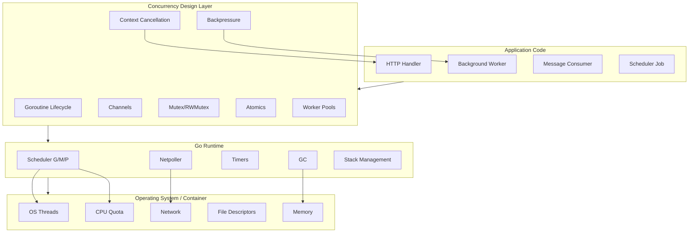

Hal penting dari gambar ini:

1. Kode aplikasi Anda tidak langsung mengontrol OS thread seperti model Java klasik.
2. Kode Anda membuat goroutine, channel, lock, timer, dan context.
3. Runtime menerjemahkan goroutine ke eksekusi di OS thread.
4. Container/Kubernetes memberi batas CPU/memory yang memengaruhi runtime.
5. Desain concurrency yang buruk tetap bisa membuat sistem collapse walaupun runtime Go sangat kuat.

---

## 6. Mental Model Java ke Go

### 6.1 Mapping Konsep

| Java | Go | Catatan Mental Model |
|---|---|---|
| `Thread` | goroutine + runtime scheduler | Goroutine bukan OS thread langsung |
| OS thread | `M` di runtime Go | Dikelola runtime, bukan biasanya oleh application code |
| `ExecutorService` | worker pool manual / goroutine langsung | Go tidak menjadikan executor abstraction sebagai default |
| `Future<T>` | channel result / callback / errgroup result | Tidak ada Future bawaan di stdlib |
| `CompletableFuture` | goroutine + channel + context / pipeline | Go lebih eksplisit, lebih sedikit magic chaining |
| `synchronized` | `sync.Mutex` | Tidak melekat pada object; eksplisit sebagai field/value |
| `ReentrantLock` | `sync.Mutex` | Go mutex bukan reentrant |
| `ReadWriteLock` | `sync.RWMutex` | Tidak otomatis lebih cepat |
| `volatile` | `sync/atomic` atau lock/channel | Jangan skip synchronization untuk shared mutable state |
| `BlockingQueue` | buffered channel | Channel juga membawa close/select semantics |
| `CountDownLatch` | `sync.WaitGroup` | WaitGroup tidak membawa error/cancel |
| `Semaphore` | buffered channel / weighted semaphore | Untuk limit concurrency |
| `ThreadLocal` | context value / explicit parameter | Go tidak mendorong thread-local karena goroutine tidak identik dengan thread |
| Java virtual thread | goroutine secara konsep mirip ringan | Semantik dan runtime berbeda; jangan disamakan penuh |
| Reactive stream | channel/pipeline/backpressure manual | Go lebih suka blocking style di goroutine |

### 6.2 Perbedaan Filosofi

Java historically memberi banyak abstraction concurrency yang layered:

```text
Thread -> Executor -> Future -> CompletableFuture -> Reactive Stream
```

Go lebih memilih primitive kecil:

```text
goroutine + channel + select + context + sync + atomic
```

Ini membuat Go terlihat sederhana, tetapi kesederhanaannya memindahkan tanggung jawab ke desain:

- siapa owner goroutine;
- siapa owner channel;
- siapa yang menutup channel;
- kapan context dibatalkan;
- berapa batas concurrency;
- bagaimana error dikumpulkan;
- bagaimana shutdown dilakukan;
- bagaimana race diuji;
- bagaimana leak dideteksi.

### 6.3 Tidak Ada “Thread Pool Default” Tidak Berarti Tidak Ada Batas

Di Java, fixed thread pool sering digunakan karena thread mahal.

Di Go, worker pool tetap penting, tetapi alasan utamanya berbeda:

| Alasan | Java klasik | Go |
|---|---|---|
| Menghindari terlalu banyak OS thread | Sangat penting | Runtime sudah membantu, tapi tetap ada OS thread/runtime cost |
| Membatasi CPU-bound parallelism | Penting | Sangat penting |
| Membatasi DB/API/file resource | Penting | Sangat penting |
| Memberi backpressure | Penting | Sangat penting |
| Mengontrol queue | Penting | Sangat penting |
| Mengurangi goroutine overhead | Kadang | Biasanya bukan alasan utama |

Prinsipnya:

> **Di Go, jangan membatasi concurrency karena takut goroutine semata; batasi concurrency karena resource downstream, CPU, memory, queue, dan lifecycle memang terbatas.**

---

## 7. Model Eksekusi Go: Blocking Code yang Tetap Scalable

Salah satu kekuatan Go adalah kemampuan menulis kode blocking yang tetap scalable karena goroutine murah dan runtime menyediakan scheduler + netpoller.

Contoh handler:

```go
func handler(w http.ResponseWriter, r *http.Request) {
    ctx := r.Context()

    user, err := repo.FindUser(ctx, userID)
    if err != nil {
        http.Error(w, err.Error(), http.StatusInternalServerError)
        return
    }

    writeJSON(w, user)
}
```

Kode ini terlihat blocking. Namun dalam Go, blocking pada network I/O tidak sama dengan membekukan seluruh process. Runtime dapat memarkir goroutine yang menunggu I/O dan menjalankan goroutine lain.

### 7.1 Perbandingan dengan Java Reactive

Java reactive sering muncul karena thread blocking mahal. Banyak request menunggu I/O dapat menghabiskan thread pool.

Go mengambil pendekatan berbeda:

- tulis kode sekuensial/blocking;
- jalankan per request dalam goroutine;
- biarkan runtime mengatur blocking I/O;
- tetap batasi resource downstream.

Ini menyederhanakan reasoning lokal, tetapi tidak menghapus kebutuhan desain global.

### 7.2 Diagram Blocking I/O di Go

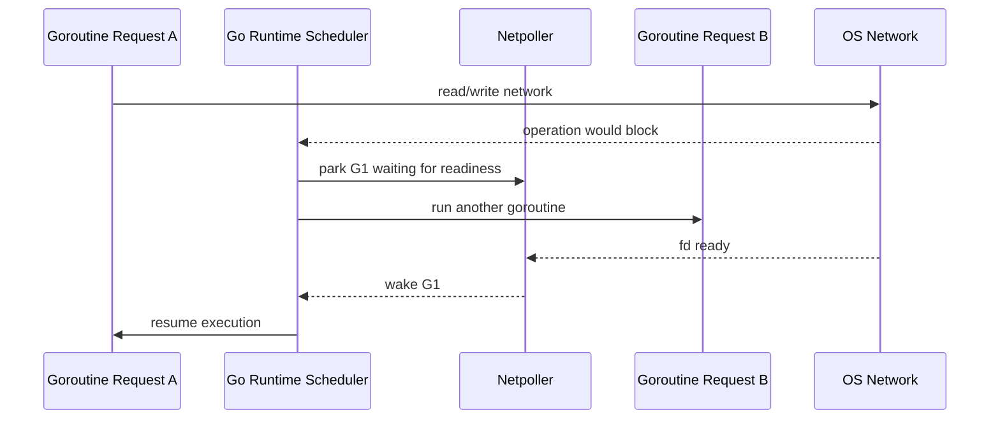

Mental model:

> Dalam Go, blocking style sering tetap scalable untuk I/O, selama blocking tersebut dikenali runtime dan resource eksternal tetap dibatasi.

Namun jangan salah:

- CPU-bound loop panjang tetap memakan CPU;
- syscall/blocking C call bisa mengikat OS thread;
- lock contention tetap contention;
- DB pool tetap bisa jenuh;
- goroutine leak tetap leak.

---

## 8. Runtime Go sebagai Bagian dari Desain Sistem

Untuk top-level engineering, runtime bukan trivia. Runtime adalah lapisan yang menentukan:

- berapa banyak pekerjaan bisa berjalan paralel;
- bagaimana goroutine dijadwalkan;
- bagaimana blocking I/O ditangani;
- bagaimana timer dibangunkan;
- bagaimana stack goroutine tumbuh;
- bagaimana GC memengaruhi latency;
- bagaimana container CPU quota memengaruhi `GOMAXPROCS`.

### 8.1 G/M/P Secara Orientasi

Detail penuh akan dibahas di part scheduler, tetapi orientasinya:

- **G** = goroutine, unit pekerjaan yang dijadwalkan;
- **M** = machine, OS thread yang menjalankan kode;
- **P** = processor/token runtime yang diperlukan untuk menjalankan Go code.

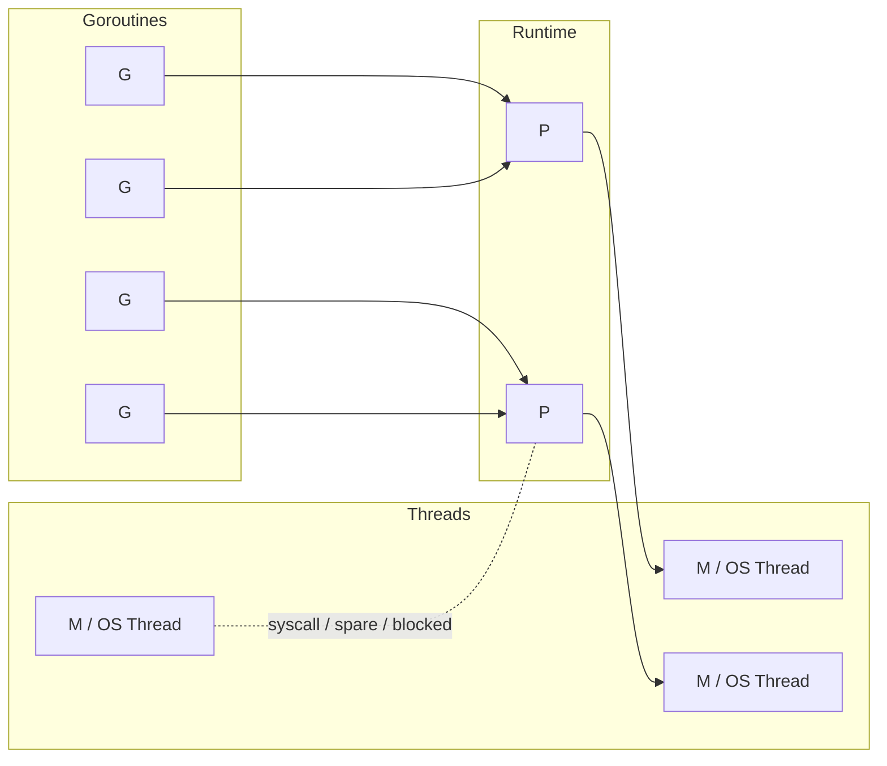

Hal penting:

- jumlah `P` kira-kira dikendalikan oleh `GOMAXPROCS`;
- hanya goroutine yang mendapatkan `P` dan `M` yang bisa menjalankan Go code;
- goroutine lain bisa runnable, waiting, blocked, syscall, atau parked;
- jumlah goroutine bisa jauh lebih banyak daripada jumlah CPU.

### 8.2 Kenapa `GOMAXPROCS` Penting

`GOMAXPROCS` membatasi jumlah thread yang dapat mengeksekusi Go code secara paralel. Jika `GOMAXPROCS=4`, maka secara sederhana maksimal 4 goroutine dapat menjalankan Go code pada saat yang sama, walaupun jumlah goroutine bisa ribuan.

Di container/Kubernetes, ini penting karena CPU quota bisa lebih kecil daripada jumlah CPU host. Jika runtime mengira tersedia banyak CPU padahal container hanya diberi quota kecil, sistem bisa mengalami throttling dan tail latency buruk.

Pada Go modern, khususnya mulai Go 1.25, default `GOMAXPROCS` menjadi lebih sadar container CPU limit. Ini sangat relevan untuk deployment Go di Kubernetes.

---

## 9. Concurrency Topology: Peta Hidup Goroutine dalam Service

Salah satu kebiasaan engineer senior adalah menggambar **concurrency topology** dari service.

Contoh service sederhana:

- HTTP server menerima request;
- setiap request menjalankan handler goroutine;
- handler memanggil DB;
- handler fan-out ke external service;
- ada background scheduler;
- ada message consumer;
- ada metrics exporter;
- ada shutdown coordinator.

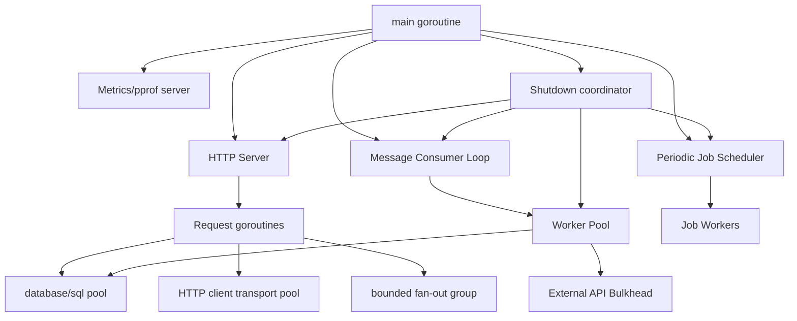

Tanpa topology seperti ini, tim biasanya gagal menjawab pertanyaan production:

- saat shutdown, goroutine mana yang harus berhenti dulu?
- request baru harus ditolak kapan?
- worker consumer harus drain atau cancel?
- DB pool maksimum berapa dibanding worker count?
- external API punya limit berapa?
- apakah fan-out per request bisa membuat 1 request menghasilkan 100 goroutine?
- jika downstream lambat, queue mana yang tumbuh?
- jika context request cancel, semua goroutine child ikut berhenti?

### 9.1 Invariant Topology

Untuk setiap goroutine long-lived, harus bisa dijawab:

1. Siapa yang membuatnya?
2. Siapa yang memilikinya?
3. Apa kondisi berhentinya?
4. Bagaimana error dilaporkan?
5. Bagaimana panic ditangani?
6. Resource apa yang dipegang?
7. Apakah goroutine ini bisa leak?
8. Apakah ada metric untuk melihat jumlah/aktivitasnya?

Untuk setiap goroutine short-lived:

1. Apakah jumlahnya bounded?
2. Apakah dia menerima context?
3. Apakah hasil/error-nya dikumpulkan?
4. Apakah caller menunggu selesai?
5. Apa yang terjadi jika caller return lebih awal?
6. Apakah channel send bisa blocked selamanya?

---

## 10. Unit Kerja: Jangan Mulai dari Primitive, Mulai dari Work Model

Kesalahan umum adalah mulai dari primitive:

- “pakai channel atau mutex?”
- “pakai berapa worker?”
- “pakai atomic?”

Urutan yang lebih benar:

1. Apa unit kerjanya?
2. Apa resource yang dibutuhkan unit kerja?
3. Apa state yang dibaca/diubah?
4. Apa ordering yang harus dijaga?
5. Apa batas concurrency yang aman?
6. Apa cancellation boundary?
7. Apa failure mode?
8. Baru pilih primitive.

### 10.1 Contoh: External API Rate Limited

Masalah:

- Anda harus memanggil external API.
- Limit API 300 request/menit.
- Response time bervariasi 50ms–2s.
- Request internal bisa spike 2.000 request/menit.

Primitive mentah:

- goroutine per request;
- channel queue;
- worker pool;
- rate limiter;
- retry.

Work model yang benar:

- unit kerja = external API call;
- resource = external API quota;
- bound = max 300/minute dan mungkin max in-flight tertentu;
- backpressure = block, reject, atau degrade;
- retry = harus menghormati context dan rate;
- observability = queue depth, request age, reject count, 429 count, retry count;
- failure = retry storm, queue growth, timeout massal.

Baru setelah itu desain primitive.

### 10.2 Contoh: CPU-bound Processing

Masalah:

- Anda harus menghitung hash untuk 10 juta item.
- CPU container = 4 vCPU.
- Pekerjaan tidak menunggu network.

Work model:

- unit kerja = item/chunk;
- resource = CPU;
- parallelism ideal dekat `GOMAXPROCS`, bukan 10 juta goroutine;
- queue bounded;
- chunking penting untuk overhead;
- allocation harus dikurangi;
- hasil perlu ordering atau tidak?

Primitive:

- bounded worker pool;
- chunk partitioning;
- WaitGroup/task group;
- context untuk cancel;
- result aggregation.

### 10.3 Contoh: Shared Cache

Masalah:

- Cache dipakai banyak goroutine.
- Read jauh lebih sering daripada write.
- Ada TTL.
- Saat miss, fetch ke DB mahal.

Work model:

- state = map cache;
- invariant = value tidak boleh setengah terupdate;
- race = read/write map;
- stampede = banyak goroutine fetch key sama;
- TTL = expiration race;
- eviction = state mutation;
- cancellation = fetch harus bisa batal.

Primitive bisa berupa:

- mutex/RWMutex;
- sharded lock;
- singleflight;
- atomic copy-on-write untuk read-mostly;
- background refresh.

Tidak ada jawaban universal.

---

## 11. State Ownership: Pertanyaan Paling Penting

Concurrency bug hampir selalu berasal dari state ownership yang kabur.

### 11.1 Model Ownership Umum

#### Model A — Shared State + Lock

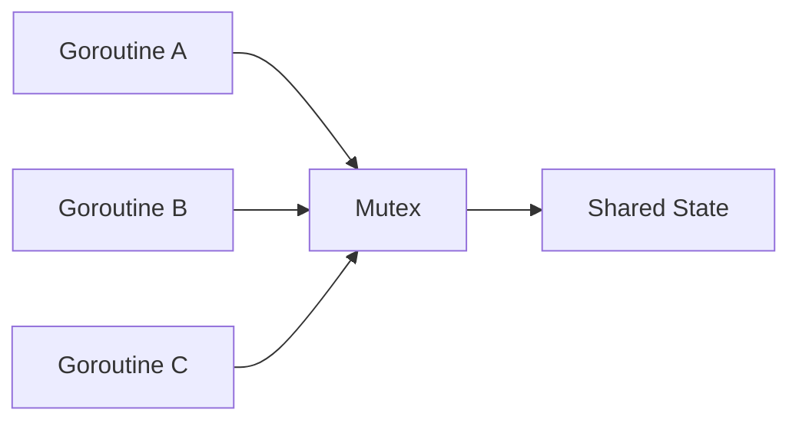

Cocok untuk:

- struktur data kecil;
- operasi singkat;
- invariant sederhana;
- access pattern sinkron.

Risiko:

- deadlock jika lock order buruk;
- contention;
- lupa lock;
- terlalu banyak logic di critical section.

#### Model B — Single Owner Goroutine

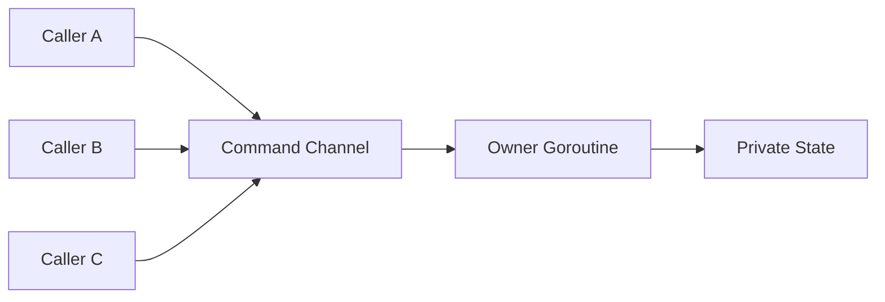

Cocok untuk:

- state kompleks;
- ordering penting;
- operasi event-like;
- ingin menghindari shared mutation.

Risiko:

- owner menjadi bottleneck;
- mailbox/channel bisa penuh;
- response channel bisa leak;
- shutdown lebih kompleks.

#### Model C — Immutable Snapshot / Copy-on-Write

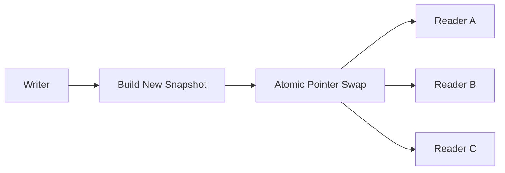

Cocok untuk:

- read-mostly;
- config snapshot;
- routing table;
- feature flags;
- policy data.

Risiko:

- memory spike saat copy;
- stale read acceptable atau tidak;
- write cost tinggi.

#### Model D — Sharded State

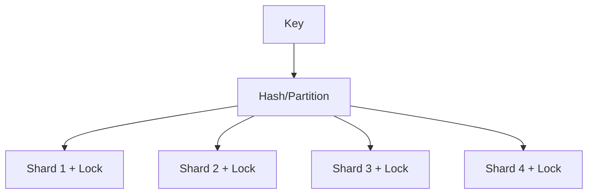

Cocok untuk:

- map besar;
- high concurrency;
- key-based operation;
- per-key isolation.

Risiko:

- cross-shard transaction sulit;
- hot key tetap bottleneck;
- resize/rebalance kompleks.

### 11.2 Rule of Thumb

- Jika invariant sederhana: mutex sering paling jelas.
- Jika pekerjaan adalah stream: channel sering natural.
- Jika state harus linear dan event-driven: owner goroutine/actor bisa bagus.
- Jika read-mostly: immutable snapshot/copy-on-write bisa unggul.
- Jika high cardinality key: sharding/per-key lock bisa efektif.
- Jika state kecil dan update atomic: atomic bisa tepat, tetapi hati-hati.

---

## 12. Lifecycle: Setiap Goroutine Harus Punya Pemilik

Goroutine tanpa owner adalah akar leak.

Contoh buruk:

```go
func Start() {
    go func() {
        for {
            doWork()
            time.Sleep(time.Second)
        }
    }()
}
```

Masalah:

- siapa yang menghentikan goroutine?
- bagaimana jika `doWork` error?
- bagaimana saat shutdown?
- apakah `time.Sleep` bisa dibatalkan?
- bagaimana test menunggu goroutine selesai?

Versi lebih baik secara konsep:

```go
func Start(ctx context.Context, wg *sync.WaitGroup) {
    wg.Go(func() {
        ticker := time.NewTicker(time.Second)
        defer ticker.Stop()

        for {
            select {
            case <-ctx.Done():
                return
            case <-ticker.C:
                doWork(ctx)
            }
        }
    })
}
```

Catatan: `WaitGroup.Go` tersedia di Go modern. Di codebase yang belum memakainya, pola manual `Add`/`Done` tetap umum.

### 12.1 Invariant Lifecycle

Untuk top-level service:

```text
main creates root context
main starts long-lived goroutines
main handles signal
main cancels root context
main stops accepting new work
main waits bounded duration
main exits
```

Diagram:

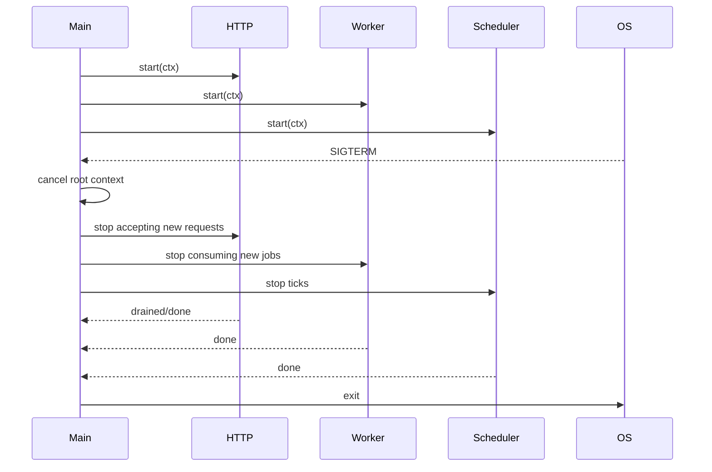

### 12.2 Goroutine Ownership Checklist

Setiap kali Anda menulis `go`, berhenti sejenak dan jawab:

- Apakah goroutine ini bounded jumlahnya?
- Apakah goroutine ini menerima `context.Context`?
- Apakah ada mekanisme berhenti?
- Apakah caller menunggu goroutine selesai?
- Apakah error dikembalikan?
- Apakah panic dipulihkan di boundary yang tepat?
- Apakah channel send/receive bisa blocked selamanya?
- Apakah goroutine memegang resource yang harus ditutup?
- Apakah test bisa memastikan goroutine tidak leak?

Jika tidak bisa menjawab, desainnya belum matang.

---

## 13. Cancellation: Bukan Fitur Tambahan, Tetapi Kontrak

Di Go, `context.Context` adalah primitive utama untuk cancellation dan deadline propagation.

### 13.1 Kenapa Cancellation Penting

Tanpa cancellation:

- request yang client-nya sudah disconnect tetap memproses DB/API;
- fan-out goroutine tetap berjalan walaupun parent return;
- worker stuck menunggu dependency lambat;
- shutdown menjadi lambat;
- memory dan goroutine menumpuk;
- retry storm makin parah.

### 13.2 Cancellation Boundary

Boundary umum:

- HTTP request context;
- message processing context;
- batch job context;
- service root context;
- per-downstream timeout context;
- per-operation context.

### 13.3 Context Tree

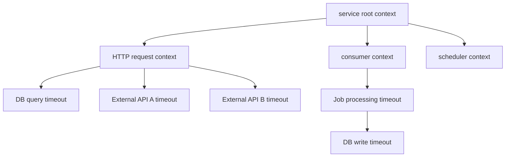

Jika root dibatalkan, semua child harus berhenti. Jika HTTP request timeout, pekerjaan child dari request itu harus berhenti, tetapi service root tetap hidup.

### 13.4 Kesalahan Umum Context

- Tidak meneruskan context ke DB/HTTP client.
- Membuat goroutine child tanpa context parent.
- Menggunakan `context.Background()` di tengah request path.
- Menyimpan context di struct long-lived tanpa alasan kuat.
- Memakai context value untuk dependency injection.
- Tidak memanggil cancel function sehingga timer/resource context tidak dilepas.
- Timeout terlalu panjang sehingga tidak selaras dengan SLA caller.

### 13.5 Budget Thinking

Jika API punya SLA 1 detik:

```text
Total budget: 1000ms
- parsing/auth/basic validation: 50ms
- DB read: 200ms
- external API: 400ms
- DB write: 200ms
- response margin: 150ms
```

Concurrency design harus mematuhi budget ini. Jangan membuat fan-out tanpa deadline. Jangan retry tanpa mengecek sisa waktu.

---

## 14. Backpressure: Sistem Stabil Harus Bisa Berkata “Tidak”

Concurrency tanpa backpressure adalah jalan menuju outage.

Jika producer lebih cepat daripada consumer, salah satu hal ini akan terjadi:

1. producer diblokir;
2. request ditolak;
3. data dijatuhkan;
4. kualitas layanan diturunkan;
5. queue tumbuh tanpa batas;
6. process kehabisan memory.

Nomor 5 dan 6 adalah desain buruk kecuali benar-benar dipilih dengan sadar dan diamankan.

### 14.1 Backpressure Diagram

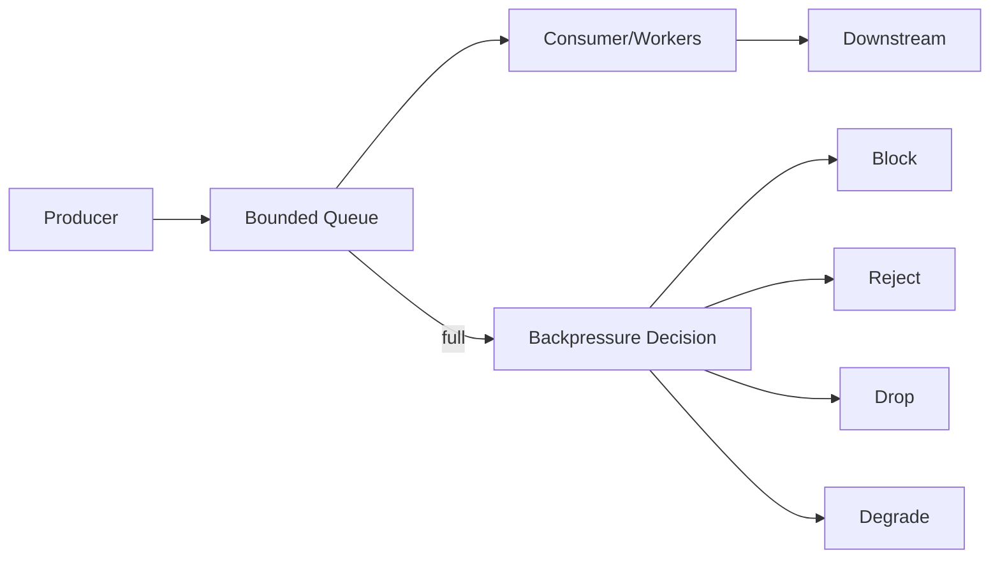

### 14.2 Backpressure di Go

Primitive yang sering dipakai:

- buffered channel dengan kapasitas terbatas;
- semaphore;
- worker pool;
- rate limiter;
- bounded queue custom;
- context deadline;
- HTTP 429 / gRPC ResourceExhausted;
- circuit breaker;
- load shedding.

### 14.3 Anti-pattern: Goroutine sebagai Queue

Contoh buruk:

```go
for _, item := range items {
    go process(item)
}
```

Jika `items` berjumlah 1 juta, Anda membuat 1 juta goroutine. Ini bukan concurrency design, ini hanya memindahkan queue ke scheduler runtime dan memory.

Versi lebih stabil:

```go
jobs := make(chan Item, 1024)

for i := 0; i < workerCount; i++ {
    wg.Go(func() {
        for item := range jobs {
            process(item)
        }
    })
}

for _, item := range items {
    select {
    case jobs <- item:
    case <-ctx.Done():
        return ctx.Err()
    }
}

close(jobs)
wg.Wait()
```

Bukan karena goroutine mahal seperti Java thread klasik, tetapi karena resource dan queue harus bounded.

---

## 15. Error Propagation: Wait Tidak Sama dengan Berhasil

`WaitGroup` hanya menjawab:

> “Apakah semua goroutine sudah selesai?”

Ia tidak menjawab:

- apakah ada error?
- error pertama atau semua error?
- jika satu gagal, yang lain dibatalkan?
- apakah panic terjadi?
- apakah partial result valid?

### 15.1 Java Comparison

Java `Future.get()` dapat mengembalikan exception dari task. `CompletableFuture` punya exceptional completion.

Go `WaitGroup` tidak punya konsep hasil. Anda harus mendesainnya.

Pola umum:

- channel error;
- mutex-protected error list;
- `errgroup`;
- custom task group;
- context cancellation on first error.

### 15.2 Fan-Out Error Design

Pertanyaan yang harus dijawab:

- Apakah semua task harus sukses?
- Jika satu gagal, apakah task lain harus dibatalkan?
- Apakah hasil parsial boleh dipakai?
- Apakah error perlu digabung?
- Apakah timeout dianggap error biasa atau cancellation?
- Apakah retry dilakukan per task?

Diagram:

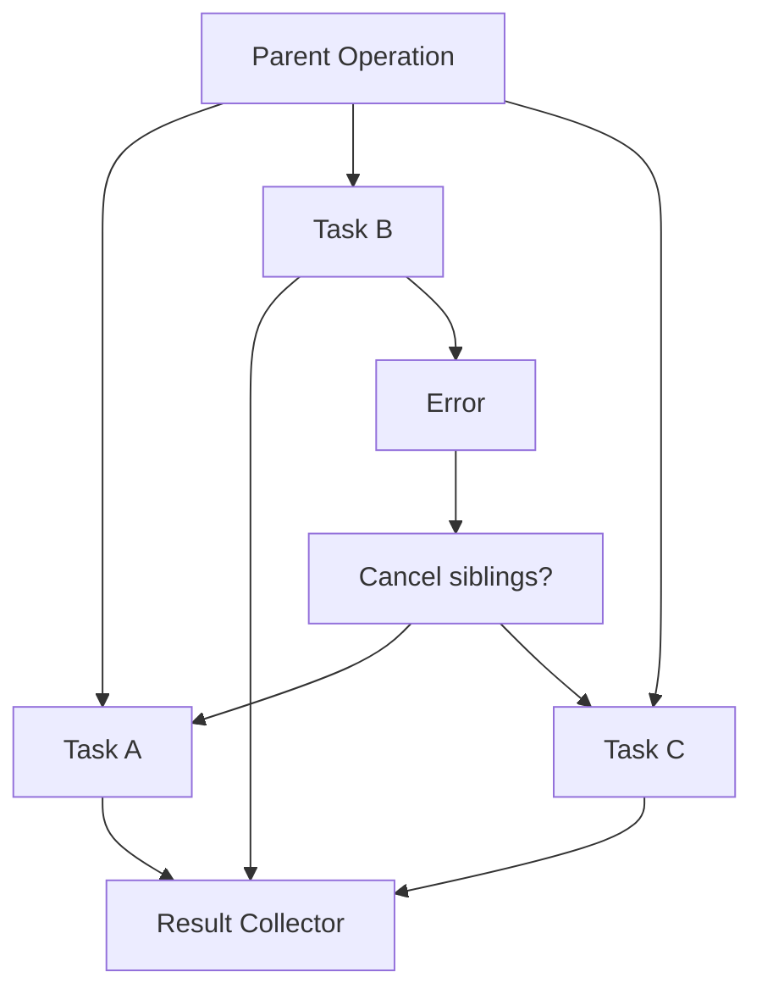

### 15.3 Senior-Level Invariant

> Setiap goroutine yang menghasilkan error harus memiliki jalur error yang jelas. Error yang hanya di-log tanpa memengaruhi lifecycle sering menjadi silent data corruption atau hidden outage.

---

## 16. Ordering: Tidak Semua Parallelism Aman

Parallelism sering mengorbankan ordering.

Contoh:

```text
input:  A B C D E
worker: W1 W2 W3
output: B A D C E   // bisa berubah urutan
```

Jika output order penting, Anda harus mendesainnya.

### 16.1 Jenis Ordering

| Jenis Ordering | Contoh |
|---|---|
| No ordering | log enrichment, independent API call |
| Per-key ordering | event per user/account harus urut |
| Global ordering | ledger sequence, audit trail tertentu |
| Causal ordering | event B hanya valid setelah A |
| Deadline ordering | task yang deadline-nya lebih dekat diprioritaskan |

### 16.2 Per-Key Concurrency

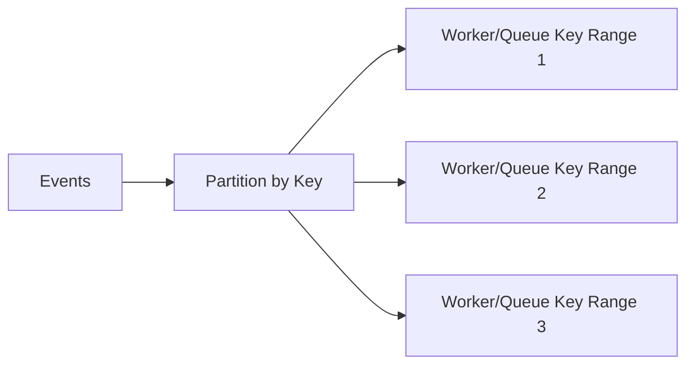

Per-key ordering biasanya dicapai dengan partitioning. Ini mirip Kafka partition model.

### 16.3 Trap: Parallelizing State Machine

Jika Anda punya lifecycle regulatory case:

```text
Draft -> Submitted -> Screening -> Investigation -> Decision -> Appeal
```

Anda tidak boleh sembarang parallelize transition yang mengubah state yang sama. Anda harus menjaga:

- valid transition;
- idempotency;
- optimistic/pessimistic lock;
- event ordering;
- audit correctness;
- authorization decision consistency.

Concurrency di domain stateful bukan hanya masalah performa. Ini masalah **legal/operational correctness**.

---

## 17. Race Condition: Bukan Sekadar Bug Acak

Data race terjadi ketika dua goroutine mengakses memory yang sama secara concurrent, minimal satu write, tanpa synchronization yang benar.

Contoh buruk:

```go
var count int

for i := 0; i < 1000; i++ {
    go func() {
        count++
    }()
}
```

Masalahnya bukan hanya hasil akhir tidak tepat. Masalahnya adalah program tidak memiliki kontrak visibility yang valid.

### 17.1 Race Bukan Hanya pada Map

Race bisa terjadi pada:

- integer;
- bool;
- pointer;
- slice header;
- string header;
- interface value;
- struct field;
- error variable;
- loop variable capture;
- cache entry;
- context-like custom object;
- metrics aggregator custom.

### 17.2 Race Detector Bukan Bukti Kebenaran

`go test -race` sangat berguna, tetapi ia hanya mendeteksi race pada path yang benar-benar dieksekusi. Jika test tidak menjalankan interleaving tertentu, race bisa lolos.

Senior workflow:

1. desain ownership agar race sulit terjadi;
2. gunakan lock/channel/atomic dengan invariant jelas;
3. test dengan race detector;
4. stress test;
5. observasi production signal;
6. review code dengan concurrency checklist.

---

## 18. Deadlock, Livelock, Starvation, Leak: Empat Kelas Kegagalan

### 18.1 Deadlock

Semua pihak menunggu sesuatu yang tidak akan terjadi.

Contoh:

```go
ch := make(chan int)
ch <- 1 // blocked forever if no receiver
```

Atau lock cycle:

```text
G1 holds A, waits B
G2 holds B, waits A
```

### 18.2 Livelock

Goroutine aktif, tetapi tidak membuat progress.

Contoh:

- dua worker saling mengalah terus;
- retry loop cepat tanpa backoff;
- select default busy loop.

### 18.3 Starvation

Satu pihak terus kalah akses resource.

Contoh:

- worker low priority tidak pernah dapat slot;
- hot key membuat key lain tertunda;
- lock terlalu sering diambil operasi panjang.

### 18.4 Leak

Goroutine/resource tetap hidup setelah tidak dibutuhkan.

Contoh:

- goroutine blocked mengirim ke channel yang tidak pernah dibaca;
- ticker tidak dihentikan;
- context tidak dibatalkan;
- response body tidak ditutup;
- worker menunggu jobs channel yang tidak pernah ditutup.

### 18.5 Failure Taxonomy Diagram

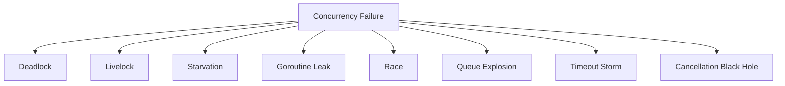

---

## 19. Cost Model: Goroutine Murah, Sistem Tidak Gratis

Goroutine lebih murah daripada OS thread klasik, tetapi setiap concurrency tetap punya cost.

### 19.1 Cost yang Harus Dihitung

| Cost | Penjelasan |
|---|---|
| Stack | Setiap goroutine punya stack yang bisa tumbuh |
| Scheduling | Runtime harus menjadwalkan runnable goroutine |
| Memory retention | Goroutine bisa menahan referensi object besar |
| Channel buffer | Buffered channel menyimpan elemen |
| Lock contention | Banyak goroutine berebut critical section |
| Atomic contention | Cache line bisa menjadi bottleneck |
| GC scanning | Lebih banyak live object memperbesar kerja GC |
| Queueing delay | Work menunggu sebelum diproses |
| Downstream pressure | DB/API/file descriptor punya limit |
| Observability noise | Banyak goroutine membuat dump/profile sulit dibaca |

### 19.2 Cost Model Awal

```text
Total latency = queue wait + scheduling wait + execution time + blocking wait + retry/backoff + response write
```

Concurrency bisa mengurangi blocking wait secara global, tetapi bisa menambah queue wait, scheduling wait, dan contention.

### 19.3 Tail Latency

Meningkatkan concurrency sering menaikkan throughput sampai titik tertentu. Setelah resource jenuh, p99 bisa naik tajam.

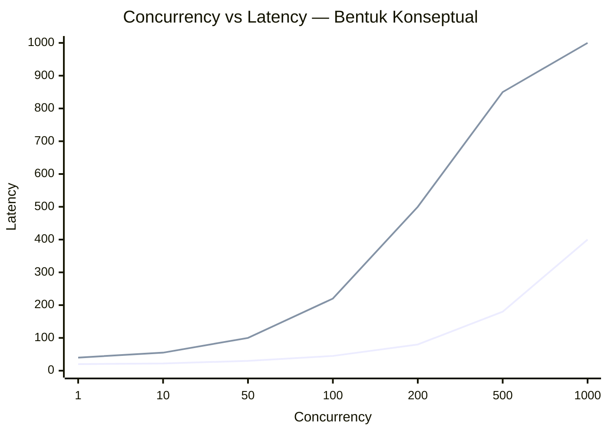

Diagram ini konseptual, bukan hasil benchmark. Pesannya:

> Sistem biasanya terlihat baik di p50 saat mulai overload, tetapi p99/p999 lebih cepat menunjukkan kerusakan.

---

## 20. Boundedness: Semua yang Tidak Dibatasi Akan Menjadi Risiko

Engineering principle untuk production Go:

> **Bound everything that can grow.**

Yang harus dibatasi:

- jumlah worker;
- ukuran queue;
- jumlah in-flight request;
- jumlah retry;
- durasi timeout;
- ukuran batch;
- jumlah goroutine per request;
- jumlah connection;
- memory cache;
- jumlah timer/ticker;
- jumlah pending result;
- jumlah per-key operation.

### 20.1 Bounded vs Unbounded

| Komponen | Unbounded Risk | Bounded Alternative |
|---|---|---|
| Goroutine per item | memory/scheduler collapse | worker pool |
| Channel buffer besar tanpa limit jelas | memory buildup | explicit capacity + reject policy |
| Retry loop | retry storm | max attempts + backoff + context |
| Cache | OOM | max size/TTL/eviction |
| DB query concurrency | DB collapse | pool + semaphore + timeout |
| External API call | 429/cascade failure | rate limiter + bulkhead |
| Fan-out per request | explosive concurrency | bounded fan-out |

### 20.2 Unbounded Bukan Selalu Salah, Tetapi Harus Disadari

Ada kasus unbounded secara konseptual tetapi bounded oleh upstream:

- HTTP server bisa menerima banyak request, tetapi dibatasi load balancer, server config, kernel backlog, resource limit.
- Goroutine per connection bisa aman jika connection limit jelas.
- Channel tanpa buffer bisa aman karena producer diblokir langsung.

Masalah muncul ketika engineer tidak tahu di mana batasnya.

---

## 21. Go Concurrency dan Kubernetes/Container Reality

Banyak materi Go concurrency berhenti di laptop. Production modern sering berjalan di container.

Pertanyaan runtime yang berubah di container:

- Berapa CPU quota container?
- Apakah `GOMAXPROCS` sesuai CPU limit?
- Apakah CPU throttling terjadi?
- Apakah memory limit mendekati OOM?
- Apakah goroutine CPU-bound berebut quota?
- Apakah p99 naik saat node noisy?
- Apakah worker count disesuaikan dengan CPU/memory?

### 21.1 CPU Request vs Limit

Di Kubernetes:

- CPU request memengaruhi scheduling pod;
- CPU limit memengaruhi throttle;
- memory limit bisa menyebabkan OOMKill;
- Go runtime melihat environment yang sudah semakin container-aware, tetapi desain worker tetap tanggung jawab aplikasi.

### 21.2 Practical Trap

Misal:

```text
Pod CPU limit: 1 vCPU
Worker pool CPU-bound: 64 worker
GOMAXPROCS: 1-ish container aware
```

64 worker tidak membuat pekerjaan 64x lebih cepat. Mereka akan antre berebut 1 CPU. Bahkan bisa lebih lambat karena scheduling, cache, dan memory pressure.

Untuk CPU-bound:

```text
workerCount ≈ GOMAXPROCS atau sedikit di atas, tergantung blocking/internal wait
```

Untuk I/O-bound:

```text
workerCount ditentukan oleh downstream capacity, latency, dan target throughput
```

---

## 22. Java Virtual Threads vs Go Goroutines

Java virtual threads membuat perbandingan dengan Go semakin menarik. Keduanya sama-sama membuat blocking style lebih scalable dibanding OS thread klasik.

Namun jangan disamakan secara penuh.

### 22.1 Persamaan Tingkat Tinggi

- Keduanya lightweight dibanding OS thread klasik.
- Keduanya memungkinkan gaya blocking yang lebih mudah dibaca.
- Keduanya mengurangi kebutuhan reactive programming untuk banyak use case I/O-bound.
- Keduanya tetap membutuhkan bounded resource.

### 22.2 Perbedaan Penting

| Area | Java Virtual Thread | Go Goroutine |
|---|---|---|
| Ekosistem | Berada di atas JVM dan Java concurrency ecosystem | Bagian inti bahasa/runtime Go sejak awal |
| API async | Future/CompletableFuture/executor tetap umum | Goroutine/channel/context lebih idiomatik |
| Scheduler | JVM virtual thread scheduler | Go runtime G/M/P scheduler |
| Structured concurrency | Ada API/fitur Java modern tertentu | Go memakai context/errgroup/custom task group |
| ThreadLocal | Masih konsep penting tapi perlu hati-hati | Tidak ada thread-local idiom karena goroutine != OS thread |
| Primitive komunikasi | BlockingQueue, locks, futures, structured scopes | channels, select, sync, atomic, context |

### 22.3 Transfer Skill yang Benar

Yang bisa Anda bawa dari Java:

- pemahaman race condition;
- lock discipline;
- memory visibility;
- executor sizing intuition;
- queue/backpressure thinking;
- thread dump analysis mindset;
- latency/throughput trade-off;
- production incident thinking.

Yang harus Anda lepas:

- semua concurrency harus lewat executor;
- blocking selalu buruk;
- channel = BlockingQueue saja;
- goroutine = virtual thread secara penuh;
- reactive style selalu lebih scalable;
- `volatile` mental model bisa langsung dipakai tanpa menyesuaikan Go memory model.

---

## 23. Idiom Go: Sederhana di Permukaan, Ketat di Invariant

Go concurrency sering tampak seperti ini:

```go
go doSomething()
```

atau:

```go
select {
case msg := <-ch:
    handle(msg)
case <-ctx.Done():
    return ctx.Err()
}
```

Kodenya pendek. Tetapi production correctness ada pada invariant yang tidak terlihat:

- `ch` ditutup oleh siapa?
- `handle` boleh blocking berapa lama?
- `ctx` berasal dari mana?
- jika `handle` panic, apa yang terjadi?
- jika receiver berhenti, sender bagaimana?
- apakah message boleh hilang?
- apakah ordering penting?
- apakah retry aman?

### 23.1 Style yang Diharapkan

Kode concurrent Go yang baik biasanya:

- eksplisit tentang ownership;
- eksplisit tentang cancellation;
- bounded;
- punya path error;
- punya shutdown behavior;
- punya test untuk race/leak;
- punya metric untuk queue/worker/latency;
- tidak over-engineered;
- memilih primitive paling sederhana yang menjaga invariant.

### 23.2 Style yang Mencurigakan

Red flag:

- `go func()` di tengah logic tanpa wait/cancel;
- channel global;
- `context.Background()` dalam request path;
- `time.Sleep` untuk sinkronisasi test;
- `select { default: }` dalam loop tanpa backoff;
- unbounded channel/queue custom;
- `recover` yang hanya log lalu lanjut tanpa state repair;
- worker pool tanpa shutdown;
- retry tanpa context;
- mutex yang melindungi terlalu banyak logic lambat;
- atomic dipakai untuk state kompleks;
- close channel dari banyak sender.

---

## 24. Design Question: “Bisa Concurrent?” Bukan “Harus Concurrent?”

Sebelum menambah goroutine, tanyakan:

1. Apakah bottleneck sekarang benar-benar concurrency?
2. Apakah pekerjaan independent?
3. Apakah state bisa dipisah?
4. Apakah ordering penting?
5. Apakah resource downstream mampu menerima parallel call?
6. Apakah error handling akan lebih kompleks?
7. Apakah cancellation bisa jelas?
8. Apakah observability siap?
9. Apakah test bisa deterministik?
10. Apakah p99 akan membaik atau memburuk?

### 24.1 Contoh Keputusan

#### Case A — Sequential Lebih Baik

Anda punya operasi:

```text
validate -> authorize -> mutate DB -> audit -> publish event
```

Sebagian harus berurutan karena audit harus merefleksikan mutation yang benar. Memaksa parallelism bisa membuat domain correctness lemah.

#### Case B — Parallelism Berguna

Anda punya operasi:

```text
fetch profile
fetch permissions
fetch preferences
fetch notification settings
```

Jika independent dan deadline sama, fan-out bounded bisa mengurangi latency.

#### Case C — Concurrency Harus Dibatasi

Anda punya 1000 request, masing-masing fan-out ke 10 downstream call. Tanpa limit, 1000 request menghasilkan 10.000 call. Ini bisa merusak downstream.

---

## 25. Pattern Awal yang Akan Sering Muncul di Seri Ini

### 25.1 Bounded Fan-Out with Context

```go
func FetchAll(ctx context.Context, ids []ID, maxConcurrent int) ([]Result, error) {
    sem := make(chan struct{}, maxConcurrent)
    results := make([]Result, len(ids))

    var wg sync.WaitGroup
    var mu sync.Mutex
    var firstErr error

    ctx, cancel := context.WithCancel(ctx)
    defer cancel()

    for i, id := range ids {
        i, id := i, id

        select {
        case sem <- struct{}{}:
        case <-ctx.Done():
            return nil, ctx.Err()
        }

        wg.Go(func() {
            defer func() { <-sem }()

            result, err := fetchOne(ctx, id)
            if err != nil {
                mu.Lock()
                if firstErr == nil {
                    firstErr = err
                    cancel()
                }
                mu.Unlock()
                return
            }

            results[i] = result
        })
    }

    wg.Wait()

    if firstErr != nil {
        return nil, firstErr
    }
    if err := ctx.Err(); err != nil {
        return nil, err
    }
    return results, nil
}
```

Catatan:

- Ini contoh orientasi, bukan final best practice universal.
- `results[i]` aman karena setiap goroutine menulis index berbeda dan parent membaca setelah wait. Tetapi desain seperti ini harus dipahami dengan memory model.
- Error handling bisa lebih rapi dengan `errgroup`.
- Semaphore membatasi fan-out.
- Context membatalkan sibling saat first error.

### 25.2 Worker Pool Skeleton

```go
type WorkerPool struct {
    jobs chan Job
    wg   sync.WaitGroup
}

func NewWorkerPool(size int, queueSize int) *WorkerPool {
    return &WorkerPool{
        jobs: make(chan Job, queueSize),
    }
}

func (p *WorkerPool) Start(ctx context.Context) {
    for i := 0; i < cap(p.jobs); i++ {
        p.wg.Go(func() {
            for {
                select {
                case <-ctx.Done():
                    return
                case job, ok := <-p.jobs:
                    if !ok {
                        return
                    }
                    process(ctx, job)
                }
            }
        })
    }
}

func (p *WorkerPool) Submit(ctx context.Context, job Job) error {
    select {
    case p.jobs <- job:
        return nil
    case <-ctx.Done():
        return ctx.Err()
    default:
        return ErrQueueFull
    }
}

func (p *WorkerPool) Stop() {
    close(p.jobs)
    p.wg.Wait()
}
```

Skeleton ini sengaja belum sempurna. Nanti kita akan bedah:

- bug sizing `cap(p.jobs)` vs worker count;
- graceful shutdown race;
- submit after close;
- panic containment;
- context semantics;
- drain vs cancel;
- metrics;
- backpressure policy.

Part ini memperkenalkan pertanyaan, bukan final implementation.

---

## 26. Dari “Correct Code” ke “Operable System”

Kode concurrent yang benar secara lokal belum tentu operable di production.

### 26.1 Minimal Correctness

- tidak ada data race;
- tidak deadlock dalam happy path;
- hasil benar;
- test pass.

### 26.2 Production Correctness

- bounded under load;
- cancellation bekerja;
- shutdown deterministik;
- error propagation jelas;
- retry tidak menyebabkan storm;
- queue punya limit dan metric;
- p99 acceptable;
- goroutine tidak leak;
- profile bisa dibaca;
- failure mode sudah dipikirkan;
- behavior tetap benar saat downstream lambat.

### 26.3 Operability Matrix

| Area | Pertanyaan |
|---|---|
| Metrics | Apakah ada goroutine count, queue depth, active workers, latency, error rate? |
| Logs | Apakah lifecycle start/stop/error terlihat? |
| Tracing | Apakah fan-out child operation terhubung ke parent? |
| Profiling | Apakah pprof aktif aman? |
| Debugging | Apakah goroutine dump bisa dimengerti? |
| Alerting | Apakah leak/queue growth bisa terdeteksi sebelum outage? |
| Load Test | Apakah p99 dan saturation point diketahui? |
| Shutdown | Apakah SIGTERM behavior diuji? |

---

## 27. Common Misconceptions yang Harus Dihapus dari Awal

### 27.1 “Goroutine Itu Gratis”

Salah. Goroutine murah, bukan gratis.

### 27.2 “Channel Lebih Idiomatik daripada Mutex”

Tidak selalu. Idiomatik berarti primitive sesuai masalah.

### 27.3 “Buffered Channel Menyelesaikan Blocking”

Buffered channel hanya memindahkan blocking sampai buffer penuh. Jika consumer lambat, masalah tetap ada.

### 27.4 “Race Detector Membuktikan Tidak Ada Race”

Tidak. Ia hanya mendeteksi race yang terjadi saat eksekusi test/run tersebut.

### 27.5 “Lebih Banyak Worker Selalu Lebih Cepat”

Tidak. Untuk CPU-bound, worker terlalu banyak bisa memperburuk performa. Untuk I/O-bound, downstream bisa collapse.

### 27.6 “Context Hanya untuk Timeout HTTP”

Tidak. Context adalah kontrak lifetime/cancellation antar goroutine dan operasi.

### 27.7 “Atomic Lebih Cepat, Jadi Lebih Baik”

Atomic bisa cepat untuk state sederhana, tetapi mudah salah untuk invariant kompleks dan bisa bottleneck karena cache-line contention.

### 27.8 “Kalau Tidak Ada Deadlock Panic, Berarti Aman”

Tidak. Partial deadlock, leak, starvation, dan queue buildup bisa terjadi tanpa panic.

### 27.9 “Go Tidak Butuh Structured Concurrency”

Go tidak memaksakan structured concurrency sebagai syntax utama, tetapi prinsipnya tetap penting: child goroutine harus owned, cancelable, dan awaited.

### 27.10 “Concurrency Itu Urusan Library, Bukan Domain”

Salah. Untuk domain stateful, concurrency memengaruhi correctness bisnis, auditability, legal defensibility, dan recoverability.

---

## 28. Domain-Oriented Example: Regulatory Case Management

Karena target Anda banyak berurusan dengan lifecycle/case management, mari ambil contoh.

Misal ada sistem enforcement case:

```text
Case Created -> Assigned -> Investigation -> Review -> Decision -> Appeal -> Closure
```

Ada operasi concurrent:

- officer update evidence;
- supervisor review;
- scheduler check SLA breach;
- event consumer sync external registry;
- notification worker mengirim email;
- report generator membaca aggregate;
- audit trail writer mencatat perubahan.

### 28.1 State yang Harus Dijaga

- transition valid;
- actor authorized;
- audit lengkap;
- notification tidak duplicate;
- report tidak membaca state setengah jadi;
- SLA job tidak menandai breach setelah case closed;
- appeal tidak bisa dibuat sebelum decision;
- external sync idempotent.

### 28.2 Concurrency Hazards

| Hazard | Contoh |
|---|---|
| Lost update | dua officer update field berbeda tapi write terakhir menimpa pertama |
| Invalid transition | scheduler escalate saat supervisor close case |
| Duplicate side effect | notification worker retry mengirim email dua kali |
| Stale read | report membaca status lama saat decision sudah berubah |
| Race with timeout | SLA breach job dan manual extension berjalan bersamaan |
| Audit gap | mutation sukses tapi audit goroutine gagal/tertinggal |
| Ordering bug | event `Closed` diproses sebelum `DecisionIssued` |

### 28.3 Go Design Implication

Dalam Go, Anda bisa membuat banyak goroutine, tetapi domain invariant tetap harus dilindungi:

- database transaction;
- optimistic locking/version;
- per-case serialization;
- idempotency key;
- outbox pattern;
- per-key worker partition;
- bounded retry;
- audit write in same transaction bila wajib;
- context deadline yang tidak memotong critical mutation secara korup.

Concurrency bukan hanya runtime skill. Ia adalah bagian dari domain correctness.

---

## 29. Reading Strategy untuk Seri Ini

Seri ini akan berjalan dari mental model ke production design.

### 29.1 Layer 1 — Runtime and Primitive

Anda akan belajar:

- goroutine lifecycle;
- scheduler G/M/P;
- `GOMAXPROCS`;
- memory model;
- mutex/channel/atomic/select/context.

Target:

> Mengerti apa yang sebenarnya terjadi ketika kode concurrent berjalan.

### 29.2 Layer 2 — Coordination Pattern

Anda akan belajar:

- worker pool;
- fan-out/fan-in;
- pipeline;
- backpressure;
- rate/concurrency limiting;
- singleflight;
- timer/ticker;
- cancellation propagation.

Target:

> Mampu memilih pola berdasarkan workload, bukan berdasarkan template.

### 29.3 Layer 3 — Subsystem Engineering

Anda akan belajar:

- HTTP/gRPC concurrency;
- DB pool concurrency;
- CPU-bound parallelism;
- memory/GC pressure;
- runtime-aware service design;
- Kubernetes impact.

Target:

> Mampu mendesain service Go yang stabil di production.

### 29.4 Layer 4 — Verification and Operation

Anda akan belajar:

- race detection;
- deterministic testing;
- `testing/synctest`;
- pprof;
- runtime trace;
- runtime metrics;
- goroutine dumps;
- failure-mode analysis.

Target:

> Mampu membuktikan, mengamati, dan memperbaiki sistem concurrent.

### 29.5 Layer 5 — Architecture

Anda akan belajar:

- concurrent API contract;
- lifecycle design;
- actor/event-loop pattern;
- distributed concurrency;
- case studies;
- review checklist.

Target:

> Mampu melakukan architecture review concurrency pada level senior/staff.

---

## 30. Minimal Vocabulary yang Wajib Dikuasai

| Istilah | Makna Singkat |
|---|---|
| Goroutine | Unit eksekusi ringan yang dijadwalkan Go runtime |
| Channel | Primitive komunikasi/sinkronisasi antar goroutine |
| Select | Multiplexing operasi channel/cancellation/timeouts |
| Mutex | Mutual exclusion untuk shared state |
| Atomic | Operasi memory tersinkronisasi level rendah |
| Context | Propagasi cancellation, deadline, dan request-scoped values |
| Scheduler | Runtime component yang menjadwalkan goroutine ke OS thread |
| G/M/P | Model internal goroutine/thread/processor runtime Go |
| Netpoller | Runtime mechanism untuk scalable network I/O blocking |
| Backpressure | Mekanisme agar producer tidak menghancurkan consumer/downstream |
| Bounded concurrency | Batas eksplisit jumlah pekerjaan concurrent |
| Fan-out | Memecah pekerjaan ke beberapa task concurrent |
| Fan-in | Menggabungkan hasil beberapa task concurrent |
| Race | Akses memory bersama tanpa synchronization valid |
| Deadlock | Semua pihak menunggu selamanya |
| Livelock | Aktif tetapi tidak progress |
| Starvation | Sebagian pihak tidak mendapat resource/progress |
| Leak | Goroutine/resource hidup tanpa kemungkinan berguna/selesai |
| Tail latency | Latency percentile tinggi seperti p95/p99/p999 |
| Structured concurrency | Child task owned, cancelable, dan awaited oleh parent |

---

## 31. Pre-Checklist Sebelum Menulis Kode Concurrent Go

Gunakan checklist ini sebelum menulis `go` baru.

### 31.1 Workload

- [ ] Apakah workload CPU-bound, I/O-bound, mixed, atau external-limit-bound?
- [ ] Apa unit kerja terkecil yang masuk akal?
- [ ] Apakah unit kerja independent?
- [ ] Apakah ordering penting?
- [ ] Apakah hasil parsial boleh?

### 31.2 Resource

- [ ] Resource apa yang membatasi: CPU, memory, DB, API, file descriptor, queue?
- [ ] Berapa batas concurrency yang aman?
- [ ] Apakah ada rate limit?
- [ ] Apakah ada pool downstream?
- [ ] Apa yang terjadi saat resource penuh?

### 31.3 State

- [ ] State apa yang dibagi?
- [ ] Siapa owner state?
- [ ] Apa invariant state?
- [ ] Primitive apa yang menjaga invariant?
- [ ] Apakah ada safe publication?

### 31.4 Lifecycle

- [ ] Siapa membuat goroutine?
- [ ] Siapa menghentikan goroutine?
- [ ] Apakah goroutine menerima context?
- [ ] Apakah parent menunggu child?
- [ ] Apa shutdown behavior?

### 31.5 Error and Cancellation

- [ ] Bagaimana error dikembalikan?
- [ ] Jika satu task gagal, task lain dibatalkan atau lanjut?
- [ ] Apakah panic boundary jelas?
- [ ] Apakah timeout budget eksplisit?
- [ ] Apakah retry menghormati context?

### 31.6 Observability

- [ ] Metric apa yang menunjukkan queue depth?
- [ ] Metric apa yang menunjukkan active workers?
- [ ] Apakah goroutine count dipantau?
- [ ] Apakah latency per stage terlihat?
- [ ] Apakah pprof/trace bisa dipakai?

### 31.7 Testing

- [ ] Apakah test bebas `time.Sleep` sembarangan?
- [ ] Apakah race detector dijalankan?
- [ ] Apakah cancellation diuji?
- [ ] Apakah shutdown diuji?
- [ ] Apakah overload/backpressure diuji?

---

## 32. Mini Exercise: Ubah Framing dari Syntax ke Design

### Exercise 1 — API Fan-Out

Anda punya endpoint:

```text
GET /dashboard/{userID}
```

Endpoint butuh:

- profile service;
- permission service;
- billing service;
- notification preference service;
- recommendation service.

Pertanyaan:

1. Service mana yang wajib, mana opsional?
2. Apakah response boleh partial?
3. Timeout total berapa?
4. Timeout masing-masing downstream berapa?
5. Fan-out maksimal per request berapa?
6. Apakah ada global limit per downstream?
7. Jika recommendation lambat, apakah seluruh dashboard gagal?
8. Bagaimana tracing parent-child?
9. Bagaimana mencegah 1000 request menjadi 5000 downstream call uncontrolled?

### Exercise 2 — Batch Processor

Anda harus memproses 5 juta record dari file.

Pertanyaan:

1. Apakah parsing CPU-bound atau I/O-bound?
2. Apakah output order penting?
3. Berapa ukuran chunk?
4. Berapa worker?
5. Apa batas memory?
6. Apa policy jika satu record gagal?
7. Apakah processing idempotent?
8. Bagaimana progress metric?
9. Bagaimana cancellation/shutdown?

### Exercise 3 — Case State Transition

Ada transition:

```text
Investigation -> DecisionIssued
```

Pada saat yang sama, SLA scheduler bisa menjalankan escalation.

Pertanyaan:

1. Apakah dua operasi boleh berjalan parallel untuk case yang sama?
2. Apakah perlu per-case lock?
3. Apakah DB transaction cukup?
4. Apakah optimistic version diperlukan?
5. Bagaimana audit trail dijamin?
6. Apa urutan event yang dipublish?
7. Jika scheduler timeout, apakah state partial mungkin?
8. Apakah retry transition idempotent?

---

## 33. Apa yang Tidak Akan Kita Lakukan di Part Ini

Part ini belum membahas detail:

- implementasi scheduler G/M/P;
- Go memory model formal;
- precise channel happens-before;
- mutex starvation mode;
- atomic CAS loop;
- timer reset pitfalls;
- pprof/trace reading;
- `testing/synctest` hands-on;
- production worker pool implementation;
- DB/HTTP/gRPC tuning detail.

Semua itu akan dibahas pada part berikutnya.

Part 000 hanya membangun orientation map agar detail-detail itu tidak terasa sebagai potongan informasi acak.

---

## 34. Sumber Fakta Utama untuk Part Ini

Sumber berikut dipakai sebagai basis faktual dan akan sering kembali pada part lanjutan:

1. Go 1.26 Release Notes — `https://go.dev/doc/go1.26`  
   Relevan untuk Green Tea GC default, scheduler/runtime metrics, dan experimental goroutine leak profile.

2. Go 1.25 Release Notes — `https://go.dev/doc/go1.25`  
   Relevan untuk container-aware `GOMAXPROCS`, `testing/synctest`, `WaitGroup.Go`, dan runtime/tooling update.

3. The Go Memory Model — `https://go.dev/ref/mem`  
   Relevan untuk data race, happens-before, channel/sync/atomic visibility, dan DRF-SC.

4. `sync` package docs — `https://pkg.go.dev/sync`  
   Relevan untuk `Mutex`, `RWMutex`, `WaitGroup`, `Once`, `Pool`, `Map`, dan synchronization semantics.

5. `sync/atomic` package docs — `https://pkg.go.dev/sync/atomic`  
   Relevan untuk atomic operation semantics dan sequential consistency.

6. Go blog: Context — `https://go.dev/blog/context`  
   Relevan untuk cancellation propagation dan request-scoped lifecycle.

7. Go blog: Pipelines and cancellation — `https://go.dev/blog/pipelines`  
   Relevan untuk pipeline, fan-out/fan-in, dan cancellation.

8. Go blog: Container-aware GOMAXPROCS — `https://go.dev/blog/container-aware-gomaxprocs`  
   Relevan untuk container CPU quota dan default runtime behavior modern.

9. Go runtime HACKING notes — `https://go.dev/src/runtime/HACKING`  
   Relevan untuk G/M/P scheduler orientation.

10. Go race detector docs — `https://go.dev/doc/articles/race_detector`  
    Relevan untuk race detection workflow dan keterbatasannya.

---

## 35. Ringkasan Part 000

Part ini membangun fondasi mental:

1. **Concurrency bukan tujuan.** Ia adalah alat untuk mengatur pekerjaan yang overlap.
2. **Parallelism berbeda dari concurrency.** Parallelism membutuhkan kapasitas hardware.
3. **Asynchrony berbeda dari concurrency.** Asynchrony adalah bentuk API/control flow.
4. **Distribution berbeda lagi.** Ia menambah network dan partial failure.
5. **Goroutine murah, bukan gratis.** Resource tetap harus bounded.
6. **Channel bukan pengganti universal mutex.** Primitive dipilih berdasarkan invariant.
7. **Setiap goroutine harus punya owner.** Tanpa owner, leak tinggal menunggu waktu.
8. **Cancellation adalah kontrak.** Bukan dekorasi tambahan.
9. **Backpressure adalah syarat stabilitas.** Sistem harus bisa block/reject/drop/degrade dengan sadar.
10. **Runtime Go adalah bagian dari desain production.** Scheduler, GOMAXPROCS, netpoller, GC, dan container limit memengaruhi behavior.
11. **Java skill tetap berguna, tetapi harus diterjemahkan.** Jangan membawa executor/thread mental model secara mentah.
12. **Engineering senior dimulai dari work model, resource model, state ownership, lifecycle, dan failure mode.** Bukan dari syntax.

---

## 36. Jembatan ke Part 001

Part berikutnya:

`learn-go-concurrency-parallelism-part-001.md`

Topik:

# Foundations: Work, Time, State, Ordering, and Contention

Kita akan masuk lebih dalam ke cara memodelkan:

- unit kerja;
- critical path;
- queueing;
- latency budget;
- contention;
- throughput;
- p50/p95/p99;
- Little’s Law;
- workload taxonomy;
- kapan concurrency membantu dan kapan merusak.

Ini penting sebelum masuk ke goroutine internals, karena runtime skill tanpa workload model sering menghasilkan optimasi yang salah sasaran.

---

## 37. Status Seri

Seri **belum selesai**.

Progress saat ini:

- [x] Part 000 — Orientation: Dari Java Threading ke Go Concurrency Engineering
- [ ] Part 001 — Foundations: Work, Time, State, Ordering, and Contention
- [ ] Part 002 — Goroutine Internals
- [ ] Part 003 — Go Scheduler Deep Dive
- [ ] Part 004 — GOMAXPROCS, CPU Quotas, Containers, and Kubernetes Reality
- [ ] Part 005 — Go Memory Model
- [ ] Part 006 — Synchronization Primitives
- [ ] Part 007 — Atomic Operations
- [ ] Part 008 — Channels Deep Dive
- [ ] Part 009 — Select Semantics
- [ ] Part 010 — WaitGroup, ErrGroup, Task Groups, and Structured Concurrency
- [ ] Part 011 — Context as Concurrency Contract
- [ ] Part 012 — Ownership Models
- [ ] Part 013 — Worker Pools
- [ ] Part 014 — Fan-Out/Fan-In and Pipelines
- [ ] Part 015 — Backpressure End-to-End
- [ ] Part 016 — Semaphores, Rate Limiters, Token Buckets, and Bulkheads
- [ ] Part 017 — Concurrent Data Structures
- [ ] Part 018 — Singleflight, Deduplication, Idempotency
- [ ] Part 019 — Timers, Tickers, Deadlines, Heartbeats
- [ ] Part 020 — Network Concurrency
- [ ] Part 021 — Database Concurrency
- [ ] Part 022 — Parallel CPU Work
- [ ] Part 023 — Memory, Allocation, GC, and Concurrency Pressure
- [ ] Part 024 — Race Detection and Static Analysis
- [ ] Part 025 — Testing Concurrent Code
- [ ] Part 026 — Observability
- [ ] Part 027 — Performance Engineering
- [ ] Part 028 — Failure Modes
- [ ] Part 029 — Designing Concurrent APIs
- [ ] Part 030 — Runtime-Aware Service Design
- [ ] Part 031 — Advanced Patterns
- [ ] Part 032 — Cross-Service Concurrency
- [ ] Part 033 — Case Studies
- [ ] Part 034 — Engineering Handbook


<!-- NAVIGATION_FOOTER -->
<div class="page-nav">
<span></span>
<a href="./index.md">📚 Kategori</a>
<a href="../../index.md">🏠 Home</a>
<a href="./learn-go-concurrency-parallelism-part-001.md">Part 001 — Foundations: Work, Time, State, Ordering, and Contention ➡️</a>
</div>
