# learn-go-concurrency-parallelism-part-001.md

# Part 001 — Foundations: Work, Time, State, Ordering, and Contention

> Seri: **Go Thread, Concurrency, Parallelism & Runtime Engineering**  
> Target pembaca: **Java software engineer** yang ingin naik dari “bisa memakai goroutine/channel” menjadi engineer yang mampu mendesain, menguji, mengobservasi, dan mengoperasikan sistem concurrent production-grade.  
> Versi konteks: **Go 1.26.x**.  
> Fokus part ini: bukan API dulu, tetapi *grammar* berpikir concurrency: **work, time, state, ordering, contention, capacity, and failure**.

---

## 0. Posisi Part Ini Dalam Seri

Part 000 memberi orientasi besar: bagaimana Java thread/executor/virtual-thread mental model berbeda dari Go goroutine/channel/context/runtime model.

Part 001 ini menjawab pertanyaan yang lebih fundamental:

> Sebelum memilih goroutine, channel, mutex, atomic, worker pool, pipeline, atau actor-like design, apa sebenarnya yang harus dimodelkan?

Jawabannya: kita harus memodelkan **work**, **time**, **state**, **ordering**, dan **contention**.

Tanpa lima hal itu, concurrency design biasanya berubah menjadi kumpulan idiom:

```go
go func() { ... }()
ch := make(chan T)
var mu sync.Mutex
```

Kode seperti itu bisa terlihat idiomatic, tetapi tetap bisa gagal secara production:

- goroutine leak,
- queue buildup,
- request timeout tetapi downstream work tetap jalan,
- DB pool collapse,
- CPU throttling,
- race condition,
- starvation,
- retry storm,
- p99 latency meledak,
- system “up” tetapi tidak lagi melakukan useful work.

Part ini adalah fondasi untuk membaca semua pattern berikutnya.

---

## 1. Tujuan Belajar

Setelah menyelesaikan Part 001, kamu harus mampu:

1. Membedakan **unit kerja** dari **mekanisme eksekusi**.
2. Menentukan apakah workload bersifat **CPU-bound**, **I/O-bound**, **latency-sensitive**, **throughput-oriented**, **bursty**, atau **background**.
3. Membaca concurrency design sebagai kombinasi:
   - ownership,
   - ordering,
   - cancellation,
   - capacity,
   - backpressure,
   - observability.
4. Menggunakan Little's Law sebagai alat sizing awal concurrency dan queue.
5. Menjelaskan kenapa menaikkan concurrency bisa menaikkan throughput sampai titik tertentu, lalu memperburuk latency dan availability.
6. Mengenali hidden assumptions di desain concurrent.
7. Membuat design sketch concurrent subsystem sebelum menulis kode.
8. Membuat checklist review concurrency untuk service Go production.

---

## 2. Core Mental Model

Concurrency bukan tentang “menjalankan banyak hal”. Concurrency adalah tentang **mengelola banyak pekerjaan yang lifecycle-nya saling overlap**.

Parallelism bukan tentang “goroutine banyak”. Parallelism adalah tentang **benar-benar mengeksekusi lebih dari satu instruksi kerja pada saat yang sama di CPU berbeda**.

Asynchrony bukan tentang “pakai callback/future/channel”. Asynchrony adalah tentang **tidak menunggu hasil secara blocking di tempat yang sama**.

Distributed concurrency bukan tentang “service banyak”. Distributed concurrency adalah tentang **state, waktu, retry, ordering, dan failure yang tersebar di banyak proses**.

Dalam Go, kamu akan sering melihat semua ini bercampur:

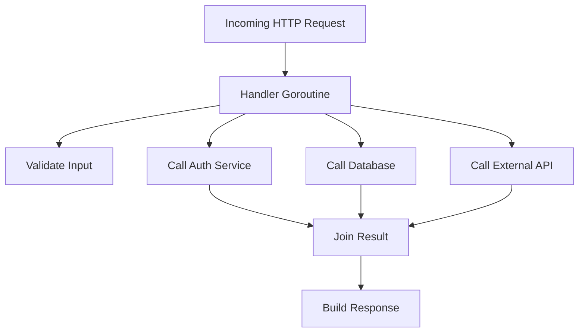

Diagram ini terlihat sederhana. Tetapi concurrency problem sebenarnya ada di pertanyaan-pertanyaan berikut:

- Berapa request boleh aktif bersamaan?
- Berapa fan-out downstream boleh aktif per request?
- Kalau client disconnect, siapa menghentikan `D`, `E`, dan `F`?
- Kalau external API lambat, apakah goroutine menumpuk?
- Kalau DB pool penuh, apakah request baru ikut menunggu sampai timeout?
- Kalau satu downstream error, apakah pekerjaan lain dibatalkan?
- Apakah hasil harus preserve order?
- Apakah ada shared state yang dimutasi?
- Apakah retry memperparah beban?
- Apakah metric kita bisa membedakan accepted work, rejected work, timed-out work, dan orphan work?

Itulah concurrency engineering.

---

## 3. Lima Elemen Dasar Concurrency Design

Setiap desain concurrent bisa dibaca dengan lima pertanyaan.

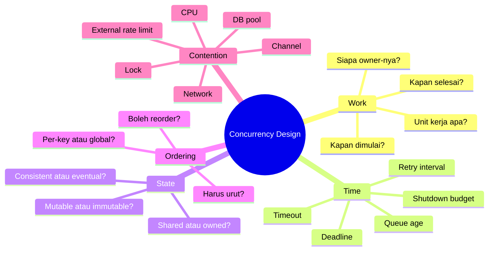

### 3.1 Work

Work adalah sesuatu yang mengonsumsi resource untuk menghasilkan outcome.

Contoh:

- satu HTTP request,
- satu message Kafka/RabbitMQ,
- satu database query,
- satu file chunk processing,
- satu external API call,
- satu cache refresh,
- satu background reconciliation job,
- satu audit event write,
- satu state transition enforcement case.

Work harus punya boundary:

- input,
- output,
- owner,
- lifecycle,
- timeout/deadline,
- cancellation path,
- resource budget,
- error behavior,
- observability.

Kalau work tidak punya boundary, ia mudah menjadi goroutine leak atau backlog.

### 3.2 Time

Concurrency selalu membuat waktu menjadi eksplisit.

Hal yang perlu dimodelkan:

- kapan work mulai,
- berapa lama boleh antre,
- berapa lama boleh dieksekusi,
- kapan caller menyerah,
- kapan downstream menyerah,
- kapan retry dilakukan,
- kapan shutdown harus selesai,
- kapan stale result tidak berguna lagi.

Tanpa time model, sistem bisa tetap melakukan pekerjaan yang sudah tidak berguna.

### 3.3 State

Concurrency berbahaya ketika beberapa execution context menyentuh state yang sama.

State perlu diklasifikasi:

- immutable,
- mutable-owned,
- mutable-shared,
- derived/cache,
- durable,
- transient,
- per-request,
- global,
- per-tenant,
- per-key,
- per-shard.

Go memory model menyatakan data race terjadi ketika write pada lokasi memori berjalan concurrent dengan read/write lain pada lokasi yang sama, kecuali akses tersebut atomic. Program Go yang bebas data race memperoleh properti DRF-SC: eksekusi dapat dipahami seolah-olah interleaving-nya sequentially consistent. [Go Memory Model](https://go.dev/ref/mem)

Praktisnya:

> Jika state dimutasi oleh lebih dari satu goroutine, desain harus menjawab: apa primitive sinkronisasinya, apa invariant-nya, dan siapa owner-nya?

### 3.4 Ordering

Ordering menjawab:

- apakah hasil harus sama urutan dengan input?
- apakah event untuk entity yang sama harus diproses berurutan?
- apakah global order perlu?
- apakah partial order cukup?
- apakah reorder bisa diterima demi throughput?

Contoh:

- audit trail biasanya perlu per-entity causal ordering.
- email notification mungkin bisa out-of-order dalam batas tertentu.
- payment state transition tidak boleh reorder sembarangan.
- cache refresh bisa drop older work jika newer work sudah tersedia.

### 3.5 Contention

Contention adalah saat beberapa work berebut resource terbatas.

Resource terbatas bisa berupa:

- CPU,
- memory bandwidth,
- GC capacity,
- mutex,
- channel,
- DB connection,
- outbound HTTP connection,
- rate limit external API,
- disk I/O,
- network socket,
- per-tenant quota,
- global queue capacity.

Amazon Builders' Library menjelaskan bahwa pada beban tinggi, thread contention, context switching, garbage collection, dan I/O contention menjadi lebih terlihat; throughput bisa naik dengan parallelization, tetapi akhirnya dibatasi oleh serialization points, dan saat overload sistem bisa menjadi lambat sampai tidak berguna. [AWS Builders' Library — Using load shedding to avoid overload](https://aws.amazon.com/builders-library/using-load-shedding-to-avoid-overload/)

---

## 4. Concurrency Bukan Mekanisme, Tetapi Contract

Banyak engineer memulai dari mekanisme:

- “pakai goroutine”,
- “pakai channel”,
- “pakai mutex”,
- “pakai worker pool”,
- “pakai atomic”,
- “pakai queue”.

Engineer yang lebih matang memulai dari contract:

| Contract | Pertanyaan |
|---|---|
| Ownership | Siapa pemilik work dan state? |
| Lifetime | Siapa yang boleh memulai dan menghentikan? |
| Capacity | Berapa maksimal work aktif dan antre? |
| Ordering | Urutan apa yang harus dijaga? |
| Failure | Apa yang terjadi jika sebagian work gagal? |
| Cancellation | Bagaimana work dihentikan saat tidak lagi berguna? |
| Backpressure | Bagaimana upstream diberi sinyal saat sistem penuh? |
| Observability | Bagaimana kita tahu work stuck, lambat, bocor, atau rejected? |

Mekanisme dipilih setelah contract jelas.

---

## 5. Java Mental Model vs Go Mental Model Pada Level Fondasi

Sebagai Java engineer, kamu mungkin terbiasa berpikir seperti ini:

```java
ExecutorService pool = Executors.newFixedThreadPool(32);
Future<Result> f = pool.submit(() -> callBackend());
Result r = f.get(500, TimeUnit.MILLISECONDS);
```

Di Java, boundary concurrency sering terlihat di:

- executor,
- thread pool,
- future,
- completable future,
- virtual thread,
- synchronized/lock,
- queue,
- scheduler.

Di Go, boundary concurrency lebih sering tersebar di:

- goroutine creation,
- channel communication,
- context propagation,
- mutex/atomic untuk shared state,
- transport/pool config,
- select cancellation,
- runtime scheduling,
- explicit lifecycle code.

Perbandingan mental model:

| Aspek | Java klasik | Java virtual thread | Go |
|---|---|---|---|
| Unit eksekusi ringan | biasanya task di executor | virtual thread | goroutine |
| Scheduler utama | JVM + OS + executor | JVM virtual thread scheduler + OS | Go runtime scheduler + OS |
| Cancellation umum | interrupt/future cancel/custom token | interrupt/custom token | `context.Context` + channel/select |
| Coordination | locks, queues, futures | locks, structured concurrency-ish APIs | channels, `sync`, `context`, `errgroup`, patterns |
| Default service style | bounded executor umum | thread-per-request lebih masuk akal | goroutine-per-request umum |
| Danger | thread exhaustion, blocked pool | pinning/structured lifetime | goroutine leak, unbounded fan-out, hidden queues |
| State sharing | common with locks/concurrent collections | still common | prefer explicit ownership or synchronization |

Koreksi penting:

> Goroutine murah bukan berarti work murah. Work tetap memakai CPU, memory, socket, DB connection, downstream quota, dan latency budget.

---

## 6. Unit Kerja: Fondasi Semua Desain

Sebelum mendesain concurrency, definisikan unit kerja.

### 6.1 Bentuk Unit Kerja Umum

| Unit kerja | Contoh Go | Risiko concurrency |
|---|---|---|
| Request | HTTP handler goroutine | fan-out tidak dibatasi, cancellation tidak dipropagate |
| Job | worker pool job | queue menumpuk, worker leak |
| Message | Rabbit/Kafka consumer | duplicate, reorder, retry storm |
| Event | domain event | causal ordering rusak |
| Stream item | pipeline stage item | downstream slow consumer |
| Batch | slice of items | partial failure, memory spike |
| Shard | per-key partition | hot shard, starvation |
| Actor command | mailbox message | mailbox unbounded, blocked actor |
| Timer tick | periodic reconciliation | overlapping run, ticker leak |

### 6.2 Work Envelope

Production-grade unit kerja sebaiknya dipikirkan seperti envelope:

```go
type WorkEnvelope[T any] struct {
    ID          string
    TenantID    string
    Key         string
    Payload     T
    Deadline    time.Time
    Attempt     int
    EnqueuedAt  time.Time
    TraceID     string
    Priority    int
}
```

Tidak semua field harus ada di kode. Tetapi secara mental, setiap work punya metadata seperti itu.

Mengapa?

Karena concurrency tanpa metadata membuat debugging susah:

- request mana yang stuck?
- tenant mana yang membanjiri queue?
- attempt ke berapa yang menyebabkan retry storm?
- work sudah stale atau masih berguna?
- berapa umur queue item?
- apakah priority bekerja?

### 6.3 Lifecycle Work

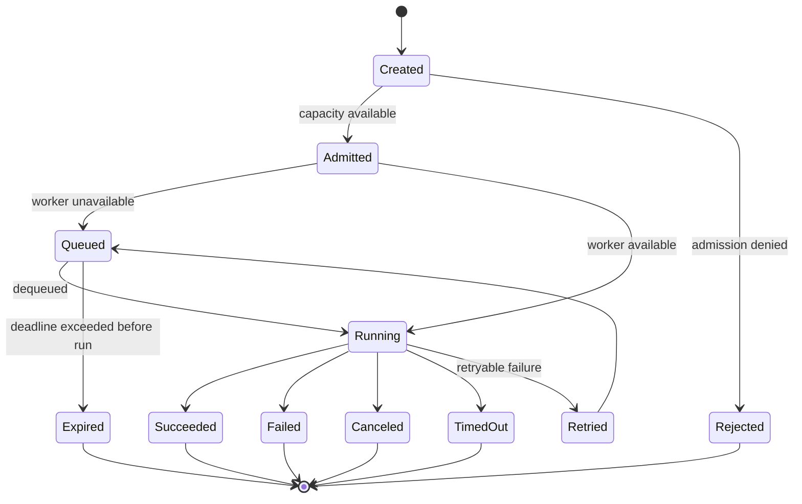

Perhatikan perbedaan:

- **Rejected**: tidak pernah diterima.
- **Expired**: terlalu lama antre, tidak berguna lagi.
- **Canceled**: caller/parent membatalkan.
- **TimedOut**: budget waktu habis.
- **Failed**: work berjalan tetapi gagal.
- **Retried**: failure dianggap recoverable.

Banyak sistem production gagal karena semua ini dilabeli satu kata: “error”.

---

## 7. Taxonomy Workload

Tidak semua concurrency problem sama. Klasifikasikan workload dulu.

### 7.1 CPU-bound

Ciri:

- bottleneck di CPU,
- goroutine aktif terus menghitung,
- latency turun/throughput naik hanya sampai jumlah CPU efektif,
- oversubscription memperburuk context switching dan cache locality.

Contoh:

- compression,
- crypto-heavy operation,
- image processing,
- large JSON/XML transform,
- scoring engine,
- rules evaluation,
- parsing besar,
- batch validation.

Design implication:

- batasi parallelism dekat `GOMAXPROCS` atau CPU quota efektif,
- hindari worker terlalu banyak,
- ukur allocation dan cache behavior,
- pikirkan chunking dan cancellation.

### 7.2 I/O-bound

Ciri:

- banyak waktu menunggu network/disk/database,
- goroutine bisa banyak karena sebagian besar parked,
- bottleneck sering ada di connection pool, downstream service, atau rate limit.

Contoh:

- HTTP call,
- DB query,
- Redis operation,
- file read/write,
- object storage operation,
- gRPC call.

Design implication:

- batasi concurrency berdasarkan downstream capacity, bukan jumlah CPU,
- gunakan deadline dan cancellation,
- configure pool,
- monitor wait time dan queue.

### 7.3 Latency-sensitive

Ciri:

- user menunggu,
- p95/p99 penting,
- expired work tidak berguna,
- queueing delay sangat berbahaya.

Contoh:

- login,
- payment authorization,
- search API,
- user-facing CRUD,
- regulatory case action submission.

Design implication:

- deadline-first design,
- bounded queue kecil atau no queue,
- fail fast lebih baik daripada antre panjang,
- avoid hidden retry,
- shed optional work.

### 7.4 Throughput-oriented

Ciri:

- user tidak selalu menunggu langsung,
- total completed work per waktu lebih penting,
- latency individual bisa lebih longgar,
- batching mungkin menguntungkan.

Contoh:

- ETL,
- report generation,
- archival,
- reconciliation,
- async notification,
- indexing.

Design implication:

- worker pool,
- batching,
- retry with backoff,
- queue observability,
- fairness antar tenant/key.

### 7.5 Bursty

Ciri:

- average rendah, spike tinggi,
- queue dapat menyerap spike tetapi juga bisa menyembunyikan overload,
- autoscaling terlambat dibanding spike.

Contoh:

- traffic setelah deployment,
- scheduled jobs bersamaan,
- user campaign,
- external callback flood,
- retry setelah outage.

Design implication:

- bounded burst buffer,
- admission control,
- jitter,
- rate limit,
- warm capacity,
- backlog age monitoring.

### 7.6 Background

Ciri:

- tidak langsung user-facing,
- mudah terlupakan,
- sering menjadi sumber goroutine/ticker leak,
- bisa mengganggu foreground workload.

Contoh:

- cache refresh,
- token refresh,
- metrics collector,
- cleanup task,
- scheduler,
- sync loop.

Design implication:

- explicit `Start`/`Stop`,
- context lifecycle,
- skip-if-running,
- jitter,
- low priority,
- no unbounded fan-out.

---

## 8. Workload Classification Matrix

Gunakan tabel ini saat review desain.

| Pertanyaan | CPU-bound | I/O-bound | Latency-sensitive | Throughput-oriented | Bursty | Background |
|---|---:|---:|---:|---:|---:|---:|
| Perlu limit concurrency? | Ya, ketat | Ya, downstream-based | Ya, ketat | Ya, capacity-based | Ya, burst-aware | Ya, low priority |
| Queue boleh panjang? | Jarang | Hati-hati | Tidak | Bisa, jika age monitored | Terbatas | Bisa, tapi bounded |
| Deadline wajib? | Ya | Ya | Sangat wajib | Ya | Ya | Ya |
| Retry agresif? | Tidak | Tidak | Hampir tidak | Dengan backoff | Dengan jitter | Dengan backoff |
| Batching berguna? | Kadang | Kadang | Jarang | Sering | Kadang | Sering |
| Scale by CPU? | Ya | Tidak selalu | Tergantung | Tergantung | Tergantung | Tergantung |
| Main failure | CPU saturation | downstream saturation | p99 explode | backlog growth | overload spike | leak/interference |

---

## 9. Time Model: Deadline, Timeout, Queue Age, and Freshness

### 9.1 Timeout vs Deadline

Timeout adalah durasi relatif:

> Operasi ini boleh berjalan maksimal 200ms.

Deadline adalah waktu absolut:

> Operasi ini harus selesai sebelum 10:15:30.123.

Dalam sistem concurrent, deadline sering lebih kuat karena bisa dipropagate.

Contoh:

```go
ctx, cancel := context.WithTimeout(parent, 300*time.Millisecond)
defer cancel()

result, err := callDownstream(ctx, req)
```

Package `context` mendefinisikan `Context` sebagai pembawa deadline, cancellation signal, dan request-scoped values melintasi API boundary; request masuk sebaiknya membuat context, outgoing call menerima context, dan derived context harus dipropagate. [context package](https://pkg.go.dev/context)

### 9.2 Budget Breakdown

Misalkan user-facing API punya SLO 500ms.

Budget bisa dibagi:

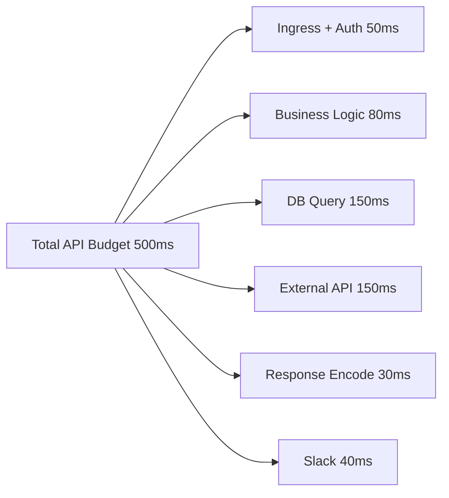

Jika kita melakukan fan-out parallel, total wall-clock mungkin tidak menjumlah linear. Tetapi resource cost tetap menjumlah.

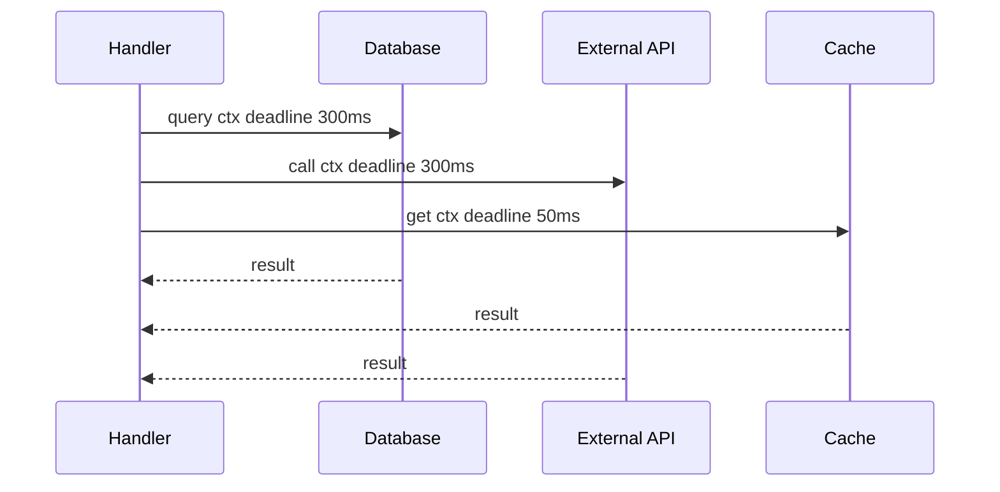

Kesalahan umum:

- parent punya 500ms,
- tiap downstream diberi timeout 500ms juga,
- retry dilakukan beberapa kali,
- akhirnya total work melebihi request budget.

Lebih baik:

- parent deadline menjadi sumber kebenaran,
- downstream menerima remaining budget,
- retry hanya jika masih ada budget.

### 9.3 Queue Age

Queue depth penting, tetapi queue age sering lebih penting.

Queue depth = berapa item menunggu.

Queue age = seberapa tua item tertua.

Jika queue depth 100 tetapi worker cepat, mungkin aman.

Jika queue depth 5 tetapi oldest age 2 menit pada API latency-sensitive, itu buruk.

Untuk work user-facing, item yang terlalu lama antre sebaiknya expired, bukan diproses.

```go
func expired(now time.Time, enqueuedAt time.Time, maxQueueAge time.Duration) bool {
    return now.Sub(enqueuedAt) > maxQueueAge
}
```

### 9.4 Freshness

Beberapa work punya freshness semantics.

Contoh:

- Cache refresh untuk key `A` versi terbaru membuat refresh lama tidak berguna.
- UI notification lama mungkin tidak perlu dikirim jika state sudah berubah.
- Search indexing boleh eventual tetapi tidak boleh reorder fatal untuk delete/create tertentu.

Freshness policy:

| Policy | Makna | Contoh |
|---|---|---|
| Process all | Semua work penting | audit log, financial transaction |
| Latest wins | Work terbaru menggantikan lama | config refresh, dashboard snapshot |
| Drop stale | Work lama tidak berguna | user request yang timeout |
| Coalesce | Banyak work digabung | cache warmup per key |
| Priority aging | Work lama naik prioritas | fair background jobs |

---

## 10. Little's Law Untuk Engineer

Little's Law:

```text
L = λ × W
```

Di sistem software:

- `L` = jumlah work dalam sistem/concurrency/in-flight,
- `λ` = arrival rate atau throughput,
- `W` = waktu rata-rata work berada di sistem.

Versi praktis:

```text
concurrency ≈ throughput_per_second × latency_seconds
```

Contoh:

Jika service menerima 1.000 request/second dan average latency 100ms:

```text
L = 1000 × 0.1 = 100 concurrent requests
```

Jika latency naik menjadi 500ms pada traffic sama:

```text
L = 1000 × 0.5 = 500 concurrent requests
```

Artinya concurrency meningkat walaupun request rate tidak berubah.

Ini menjelaskan kenapa latency spike bisa menyebabkan goroutine count naik.

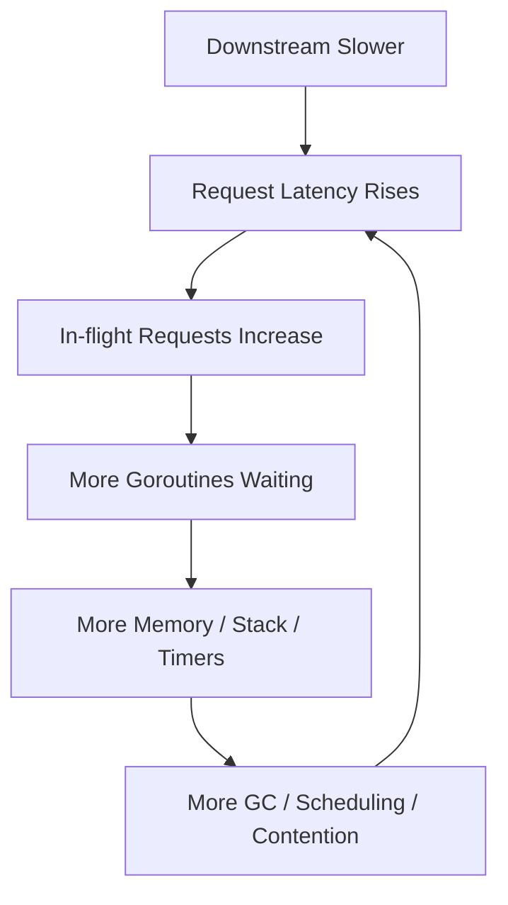

### 10.1 Sizing Awal Worker Pool

Misal:

- target throughput: 500 jobs/s,
- average job time: 40ms,
- expected concurrency:

```text
L = 500 × 0.04 = 20 workers
```

Lalu tambahkan safety factor berdasarkan variance:

- low variance: 1.2x,
- moderate variance: 2x,
- high variance: 3x+ atau perlu redesign.

Tetapi jangan langsung `workers = 1000`. Worker banyak tidak menghilangkan bottleneck downstream.

### 10.2 Queue Capacity

Queue capacity bukan “sebanyak mungkin”. Queue capacity adalah keputusan produk dan SLO.

Jika:

- worker throughput = 200 jobs/s,
- max acceptable queue wait = 2s,

maka queue capacity awal:

```text
capacity ≈ 200 × 2 = 400 jobs
```

Jika queue lebih besar, kamu memperbolehkan work menunggu lebih lama dari batas kegunaan.

### 10.3 Tail Latency Tidak Sama Dengan Average

Little's Law dengan average berguna untuk intuisi awal. Tetapi production harus memikirkan p95/p99.

Jika average 50ms tetapi p99 2s, queue dan in-flight bisa melonjak saat tail event.

Gunakan:

- average untuk capacity baseline,
- p95/p99 untuk SLO/user impact,
- max/oldest age untuk backlog danger,
- saturation metrics untuk overload.

---

## 11. Capacity Model

Setiap concurrent system punya capacity envelope.

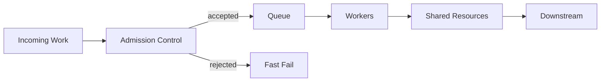

Capacity dibatasi oleh minimum dari beberapa resource:

```text
effective_capacity = min(
    CPU_capacity,
    memory_capacity,
    goroutine_lifecycle_capacity,
    queue_capacity,
    DB_pool_capacity,
    HTTP_pool_capacity,
    downstream_rate_limit,
    lock_serialization_capacity,
    per_tenant_quota
)
```

Kesalahan umum adalah mengukur satu kapasitas saja.

Contoh:

- CPU masih 30%, lalu worker dinaikkan.
- Ternyata DB pool sudah saturated.
- Worker tambahan hanya membuat lebih banyak goroutine menunggu connection.
- p99 naik.
- timeout naik.
- retry naik.
- load makin parah.

### 11.1 Capacity Budget Per Boundary

| Boundary | Capacity knob | Metric wajib |
|---|---|---|
| HTTP server | max in-flight/admission | active requests, rejected requests, latency |
| Worker pool | worker count, queue size | active workers, queue depth, oldest age |
| DB | max open conns | wait count, wait duration, query latency |
| HTTP client | max conns per host | pending requests, connection reuse, latency |
| External API | rate limit/concurrency limit | 429, retry count, success latency |
| CPU | `GOMAXPROCS`, pod CPU limit | CPU usage, throttling, runnable goroutines |
| Memory | queue size, allocation rate | heap, GC pause/assist, RSS |
| Lock | shard count, lock scope | mutex/block profile |
| Channel | buffer size, producers/consumers | send block, receive block, queue len |

### 11.2 Goodput vs Throughput

Throughput = semua request yang masuk atau dicoba.

Goodput = request yang selesai tepat waktu dan berguna.

Under overload, throughput bisa terlihat tinggi tetapi goodput turun.

Amazon Builders' Library menekankan load shedding untuk mempertahankan goodput: server menolak excess work agar request yang diterima tetap selesai sebelum client timeout. [AWS Builders' Library — Using load shedding to avoid overload](https://aws.amazon.com/builders-library/using-load-shedding-to-avoid-overload/)

---

## 12. State Model

State adalah pusat correctness concurrency.

### 12.1 Klasifikasi State

| State type | Contoh | Strategy umum |
|---|---|---|
| Immutable | config snapshot | share freely |
| Per-request mutable | request accumulator | owned by request goroutine |
| Shared mutable | cache map | mutex/shard/actor/atomic |
| Durable state | database row | transaction/isolation/idempotency |
| Derived state | materialized view | rebuild/invalidate/atomic swap |
| External state | downstream system | idempotency/retry/correlation |
| Runtime state | goroutine/channel/timer | lifecycle ownership |

### 12.2 Ownership Patterns

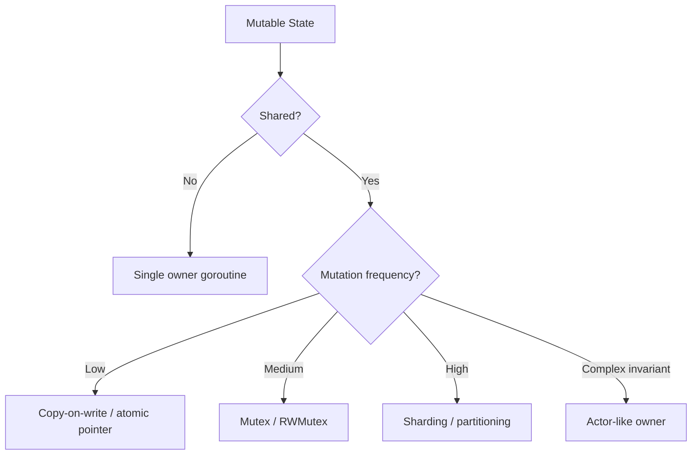

### 12.3 Single Owner

Single owner berarti hanya satu goroutine yang boleh mutasi state.

Contoh:

```go
type command struct {
    key   string
    value string
    reply chan error
}

func runOwner(ctx context.Context, commands <-chan command) {
    state := make(map[string]string)

    for {
        select {
        case <-ctx.Done():
            return
        case cmd := <-commands:
            state[cmd.key] = cmd.value
            cmd.reply <- nil
        }
    }
}
```

Kelebihan:

- invariant mudah dijaga,
- tidak perlu lock di state,
- ordering natural.

Kekurangan:

- owner bisa jadi bottleneck,
- mailbox bisa menumpuk,
- request-reply channel bisa leak jika caller timeout,
- shutdown perlu hati-hati.

### 12.4 Lock-Protected Shared State

```go
type Cache struct {
    mu sync.RWMutex
    m  map[string]string
}

func (c *Cache) Get(key string) (string, bool) {
    c.mu.RLock()
    defer c.mu.RUnlock()
    v, ok := c.m[key]
    return v, ok
}

func (c *Cache) Put(key, value string) {
    c.mu.Lock()
    defer c.mu.Unlock()
    c.m[key] = value
}
```

Kelebihan:

- sederhana,
- familiar untuk Java engineer,
- explicit critical section.

Kekurangan:

- contention,
- deadlock jika multi-lock,
- long critical section,
- invariant tersebar jika API tidak dirancang baik.

### 12.5 Atomic Snapshot

```go
type Config struct {
    FeatureEnabled bool
    Limit          int
}

type ConfigStore struct {
    current atomic.Pointer[Config]
}

func (s *ConfigStore) Get() *Config {
    return s.current.Load()
}

func (s *ConfigStore) Swap(c *Config) {
    s.current.Store(c)
}
```

Kelebihan:

- read path sangat murah,
- cocok untuk config immutable,
- tidak ada lock di reader.

Kekurangan:

- update harus publish snapshot immutable,
- tidak cocok untuk mutasi granular kompleks,
- pointer lama masih bisa dipegang reader.

`sync/atomic` mendefinisikan operasi atomic sebagai sequentially consistent; jika efek operasi atomic A diamati oleh B, A “synchronizes before” B. [sync/atomic](https://pkg.go.dev/sync/atomic)

---

## 13. Ordering Model

Ordering sering lebih penting daripada parallelism.

### 13.1 Jenis Ordering

| Ordering | Makna | Contoh |
|---|---|---|
| No order | hasil boleh acak | parallel image resize |
| Input order | output sama urutan input | CSV transform preserving rows |
| Per-key order | urut per entity/key | case state transition per case ID |
| Causal order | event sebab sebelum akibat | domain event workflow |
| Global order | semua event total order | ledger sequence, audit sequence tertentu |

### 13.2 Per-Key Parallelism

Jika global order tidak perlu, gunakan per-key order agar parallelism tetap tinggi.

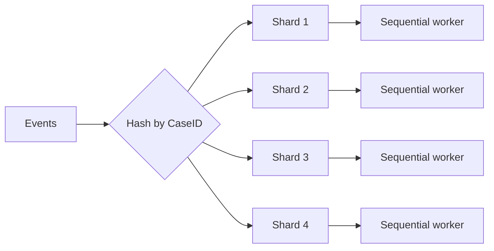

Properti:

- event dengan key sama masuk shard sama,
- shard memproses sequential,
- key berbeda bisa parallel,
- hot key tetap bisa bottleneck.

### 13.3 Reordering Risk

Contoh buruk:

```go
for _, ev := range events {
    go process(ev)
}
```

Jika event adalah:

1. `CaseSubmitted`,
2. `CaseAssigned`,
3. `CaseClosed`,

maka concurrent processing bisa membuat `CaseClosed` diproses sebelum `CaseSubmitted`.

Solusi bukan “jangan parallel sama sekali”. Solusi adalah memilih ordering boundary:

- per case ID,
- per tenant,
- per workflow instance,
- per aggregate root.

---

## 14. Contention Model

Contention muncul saat work bertemu resource bersama.

### 14.1 Bentuk Contention

| Contention | Gejala | Penyebab umum |
|---|---|---|
| CPU contention | runnable goroutine naik, latency naik | worker terlalu banyak, CPU-bound fan-out |
| Lock contention | mutex profile tinggi | critical section besar, global lock |
| Channel contention | goroutine blocked send/recv | buffer salah, consumer lambat |
| DB contention | wait for connection, deadlocks | pool kecil, query lambat, transaction panjang |
| Memory contention | GC pressure, RSS naik | queue besar, allocation rate tinggi |
| Network contention | timeout, connection wait | max conns, downstream slow |
| Rate contention | 429, throttling | concurrency tidak sesuai quota |
| Tenant contention | satu tenant mengganggu lain | no quota/isolation |

### 14.2 Contention Amplification

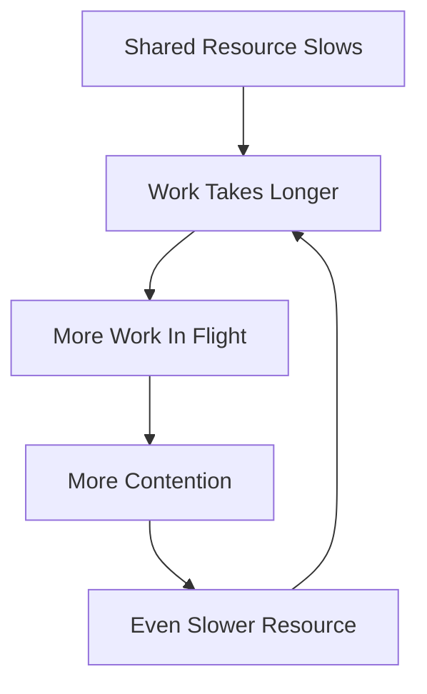

Contoh nyata:

1. DB query lambat.
2. Goroutine menunggu connection lebih lama.
3. HTTP requests in-flight naik.
4. Memory dan goroutine count naik.
5. GC dan scheduling overhead naik.
6. Handler makin lambat.
7. Client timeout.
8. Client retry.
9. DB makin penuh.

Concurrency bug sering bukan race condition. Sering kali ia adalah **feedback loop**.

---

## 15. Backpressure Sebagai Stabilizer

Backpressure adalah cara sistem berkata:

> “Saya tidak bisa menerima work lebih cepat dari kemampuan saya memprosesnya.”

Tanpa backpressure, overload berubah menjadi queue, memory growth, latency spike, dan retry storm.

### 15.1 Bentuk Backpressure

| Mechanism | Cara kerja | Cocok untuk |
|---|---|---|
| Blocking send | producer menunggu channel | internal pipeline sederhana |
| Bounded queue | reject saat penuh | worker pool/service boundary |
| Semaphore | limit in-flight | external API/DB/concurrency cap |
| Rate limiter | limit rate per waktu | quota external/tenant |
| Load shedding | drop/reject low-value work | overload protection |
| Deadline check | skip stale work | latency-sensitive work |
| Retry-After | sinyal ke client | HTTP service overload |
| Pull model | consumer menentukan pace | queue/stream/batch |

### 15.2 Bounded vs Unbounded

Unbounded queue terasa aman saat development karena tidak reject.

Di production, unbounded queue adalah hidden outage.

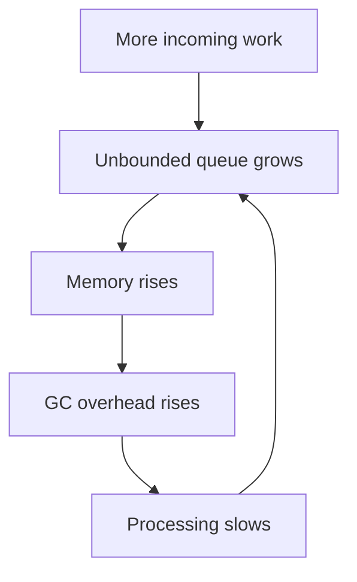

Bounded queue memaksa keputusan eksplisit:

- reject,
- shed,
- degrade,
- retry later,
- priority.

### 15.3 Backpressure Dalam Go Channel

Buffered channel bisa menjadi queue terbatas:

```go
type Job struct {
    ID string
}

func submit(ctx context.Context, jobs chan<- Job, job Job) error {
    select {
    case jobs <- job:
        return nil
    case <-ctx.Done():
        return ctx.Err()
    default:
        return ErrQueueFull
    }
}
```

Tetapi `default` di sini berarti fail-fast jika penuh. Itu keputusan produk, bukan sekadar teknik.

Jika ingin menunggu sebentar:

```go
func submitWithWait(ctx context.Context, jobs chan<- Job, job Job) error {
    select {
    case jobs <- job:
        return nil
    case <-ctx.Done():
        return ctx.Err()
    }
}
```

Risiko: caller bisa menunggu sampai deadline. Itu boleh hanya jika deadline jelas.

---

## 16. Cancellation Model

Go blog tentang context menjelaskan bahwa saat request dibatalkan atau timeout, semua goroutine yang bekerja untuk request tersebut harus keluar cepat agar resource dapat diklaim kembali. [Go Concurrency Patterns: Context](https://go.dev/blog/context)

Cancellation bukan optional. Cancellation adalah bagian dari lifecycle.

### 16.1 Parent-Child Work

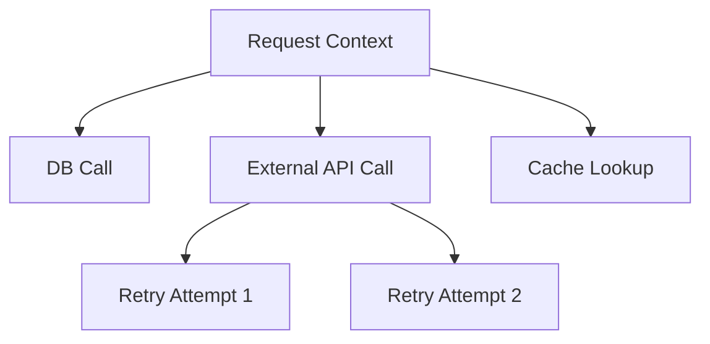

Jika request context canceled, semua child harus berhenti.

### 16.2 Cancellation Contract

Setiap function concurrent production-grade harus menjawab:

- Apakah menerima `context.Context`?
- Apakah menghormati `ctx.Done()`?
- Apakah membatalkan child goroutine?
- Apakah menutup channel?
- Apakah menunggu goroutine selesai?
- Apakah error membatalkan siblings?
- Apakah cancellation menimbulkan partial side effect?

### 16.3 Anti-Pattern: Fire-and-Forget

```go
func handler(w http.ResponseWriter, r *http.Request) {
    go sendAuditLog(r.UserAgent())
    w.WriteHeader(http.StatusAccepted)
}
```

Masalah:

- siapa owner goroutine?
- kalau shutdown, audit log ditunggu atau dibuang?
- kalau audit sink lambat, berapa goroutine bisa menumpuk?
- kalau panic, siapa recover?
- kalau audit gagal, bagaimana diketahui?

Lebih baik:

- masukkan ke bounded queue,
- punya worker lifecycle,
- punya metric rejected/queued/sent/failed,
- punya shutdown drain policy.

---

## 17. Error Model Dalam Concurrent Work

Concurrent work membuat error lebih kompleks.

### 17.1 Single Error vs Multiple Errors

Dalam sequential code:

```go
if err := step1(); err != nil { return err }
if err := step2(); err != nil { return err }
if err := step3(); err != nil { return err }
```

Dalam concurrent code:

- beberapa step bisa gagal bersamaan,
- satu failure bisa membuat hasil lain tidak relevan,
- sebagian side effect mungkin sudah terjadi,
- error pertama belum tentu error paling penting,
- retry bisa membuat error bertambah.

### 17.2 Error Policy

| Policy | Makna | Contoh |
|---|---|---|
| Fail fast | error pertama membatalkan sibling | request fan-out |
| Collect all | tunggu semua error | batch validation |
| Best effort | error dicatat tetapi tidak menggagalkan parent | optional notification |
| Partial success | hasil sebagian diterima | search across shards |
| Compensate | side effect dibalik | saga/workflow |
| Retry | error recoverable dicoba ulang | transient network |

### 17.3 Early Return Leak

Go 1.26 release notes menunjukkan contoh goroutine leak: goroutine mengirim ke unbuffered channel, parent return lebih awal saat error, sisa goroutine bisa blocked selamanya karena tidak ada receiver. Go 1.26 menambahkan experimental `goroutineleak` profile untuk mendeteksi sebagian kelas leak seperti ini. [Go 1.26 Release Notes](https://go.dev/doc/go1.26)

Pola buruk:

```go
func process(items []Item) ([]Result, error) {
    ch := make(chan result)

    for _, item := range items {
        go func() {
            r, err := processOne(item)
            ch <- result{r: r, err: err} // may block forever
        }()
    }

    var out []Result
    for range items {
        res := <-ch
        if res.err != nil {
            return nil, res.err // early return leaks senders
        }
        out = append(out, res.r)
    }
    return out, nil
}
```

Pola lebih sehat akan dibahas detail di part `errgroup` dan pipeline, tetapi fondasinya:

- parent owns children,
- parent cancels children,
- parent waits children,
- send must not block forever after parent stops receiving.

---

## 18. Queueing Delay dan Tail Latency

Latency total biasanya:

```text
latency_total = queue_wait + service_time + retry_delay + downstream_wait + scheduling_delay
```

Engineer sering hanya mengukur `service_time`.

Production user merasakan `latency_total`.

### 18.1 Queue Wait

Jika worker penuh, work menunggu.

Queue wait bisa lebih besar daripada actual work.

Contoh:

- job processing 20ms,
- queue wait 3s,
- metric handler menunjukkan processing cepat,
- user tetap melihat lambat.

### 18.2 Scheduling Delay

Goroutine tidak selalu langsung berjalan. Ia perlu dijadwalkan oleh runtime dan OS.

Scheduling delay bisa naik saat:

- CPU saturated,
- terlalu banyak runnable goroutines,
- GC/allocator pressure,
- lock contention,
- syscall/IO pressure,
- container CPU throttling.

Part scheduler nanti akan detail, tetapi part ini memberi rule:

> Jangan hanya ukur durasi function. Ukur durasi dari admission sampai completion.

### 18.3 Tail Amplification Pada Fan-Out

Jika request melakukan fan-out ke 10 dependency, latency request biasanya mengikuti yang paling lambat.

```text
request latency ≈ max(dep1, dep2, ..., dep10) + join overhead
```

Semakin banyak fan-out, peluang salah satu lambat makin besar.

Ini disebut tail amplification.

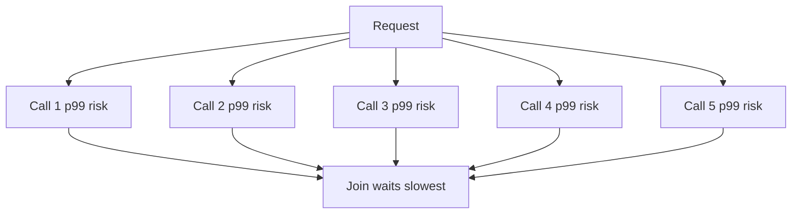

Mitigasi:

- reduce fan-out,
- parallelize only necessary calls,
- hedge carefully,
- timeout per dependency,
- degrade optional calls,
- cache,
- precompute,
- batch,
- per-downstream concurrency limit.

---

## 19. Admission Control

Admission control memutuskan apakah work boleh masuk sistem.

Tanpa admission control, semua work diterima sampai sistem collapse.

### 19.1 Admission Decision

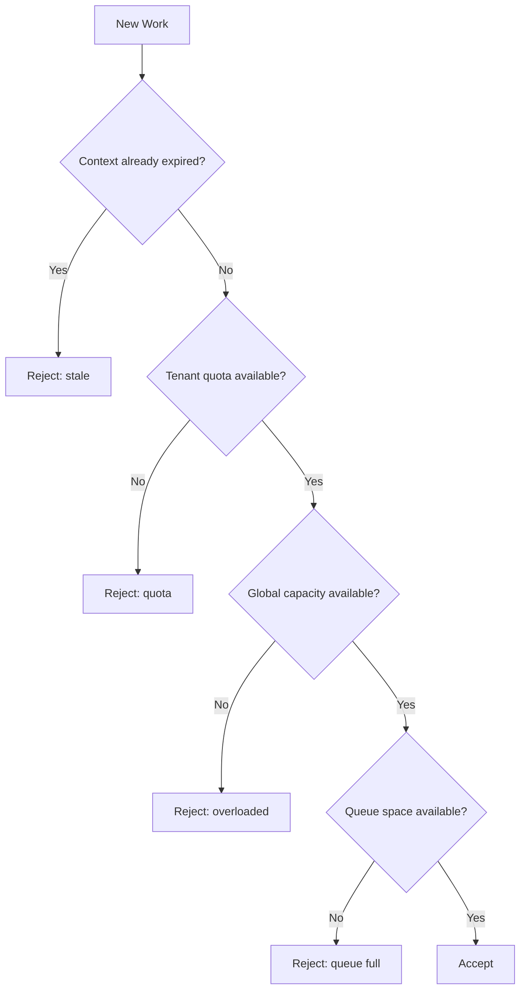

### 19.2 Where Admission Happens

Admission bisa dilakukan di:

- load balancer,
- API gateway,
- HTTP middleware,
- service method,
- worker pool submit,
- per-tenant scheduler,
- downstream client wrapper,
- queue consumer.

Semakin awal overload ditolak, semakin murah.

Tetapi semakin awal ditolak, semakin sedikit context bisnis untuk menentukan prioritas.

Trade-off:

| Early rejection | Late rejection |
|---|---|
| murah | lebih mahal |
| melindungi sistem | punya context lebih kaya |
| bisa kasar | bisa lebih tepat |
| baik untuk overload global | baik untuk priority/business rule |

---

## 20. Prioritas dan Fairness

Concurrency tanpa fairness bisa membuat satu jenis work memakan seluruh kapasitas.

### 20.1 Noisy Tenant

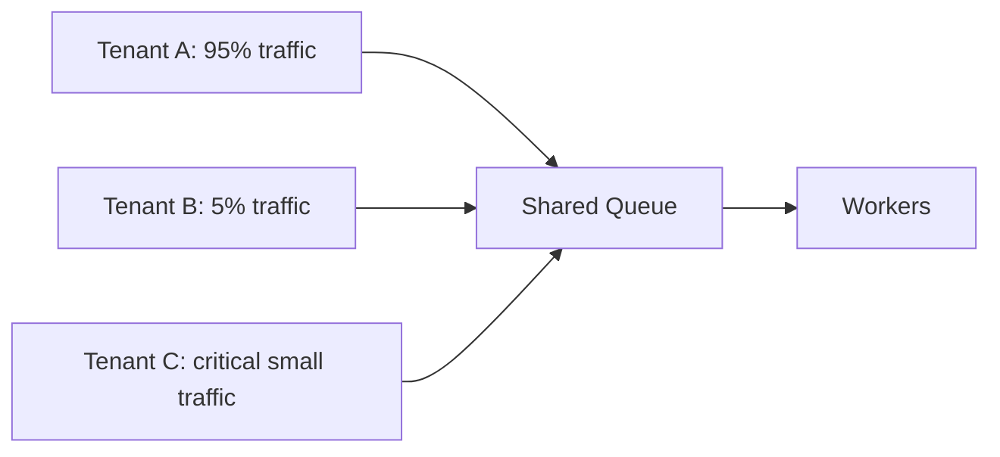

Jika FIFO shared queue penuh oleh Tenant A, Tenant C ikut lambat.

Solusi:

- per-tenant queue,
- quota,
- weighted fair queue,
- priority class,
- shuffle sharding,
- separate worker pool,
- admission per tenant.

### 20.2 Priority Inversion

Priority tinggi bisa tertahan oleh work priority rendah yang sudah memegang resource.

Contoh:

- background job memegang DB connection lama,
- user request menunggu connection,
- user-facing latency meledak.

Solusi:

- pool terpisah,
- timeout lebih pendek untuk background,
- query budget,
- priority-aware scheduler,
- limit background concurrency.

### 20.3 Fairness vs Throughput

Fairness bisa menurunkan throughput maksimum tetapi menaikkan reliability multi-tenant.

Top engineer tidak hanya mengejar throughput global; mereka mengejar **controlled degradation**.

---

## 21. Mapping Work to Goroutines

Tidak semua work harus punya goroutine sendiri. Tetapi di Go, banyak workload natural dimodelkan goroutine-per-work karena goroutine murah.

### 21.1 Safe Goroutine Creation Checklist

Sebelum menulis `go f()`, jawab:

1. Siapa owner goroutine ini?
2. Bagaimana goroutine ini berhenti?
3. Apakah ada context?
4. Apakah parent menunggu selesai?
5. Apakah ada batas jumlah goroutine ini?
6. Apakah goroutine bisa blocked send/receive?
7. Apakah goroutine memegang resource eksternal?
8. Apakah panic ditangani?
9. Apakah metric/log cukup untuk melihat lifecycle?
10. Apa yang terjadi saat shutdown?

### 21.2 Goroutine Per Request

Go HTTP server umum menangani incoming request dalam goroutine sendiri. Blog context Go juga menjelaskan bahwa handler request sering memulai goroutine tambahan untuk backend seperti database/RPC, dan semua goroutine tersebut perlu deadline/cancellation request. [Go Concurrency Patterns: Context](https://go.dev/blog/context)

Goroutine-per-request masuk akal karena:

- API blocking terlihat sequential,
- runtime memparkir goroutine saat I/O wait,
- code sederhana.

Tetapi goroutine-per-subtask tanpa limit bisa berbahaya.

### 21.3 Goroutine Per Item

Pola:

```go
for _, item := range items {
    go process(item)
}
```

Aman hanya jika:

- jumlah item kecil dan bounded,
- process punya context,
- parent wait,
- error handled,
- downstream capacity cukup,
- ordering tidak penting.

Jika `items` bisa 100.000, ini bukan desain. Ini denial-of-service internal.

### 21.4 Worker Pool

Worker pool cocok jika:

- work banyak,
- concurrency perlu bounded,
- ada queue policy,
- processing relatif seragam atau bisa dipartisi.

Namun worker pool juga bisa salah:

- queue terlalu besar,
- worker count tidak sesuai bottleneck,
- tidak ada cancellation,
- shutdown tidak drain,
- panic membunuh worker diam-diam.

---

## 22. Communication vs Synchronization

Channel sering disebut untuk “communication”. Mutex untuk “shared memory”. Tetapi keduanya juga sinkronisasi.

### 22.1 Channel Untuk Handoff

```go
ch <- value
value := <-ch
```

Channel cocok untuk:

- handoff ownership,
- pipeline,
- event stream,
- semaphore sederhana,
- cancellation broadcast melalui closed channel,
- worker queue.

### 22.2 Mutex Untuk Critical Section

```go
mu.Lock()
state.x++
mu.Unlock()
```

Mutex cocok untuk:

- state kecil dengan invariant jelas,
- cache/map,
- counters yang butuh composite update,
- resource yang harus serial.

### 22.3 Atomic Untuk Single-Variable Coordination

Atomic cocok untuk:

- counters,
- flags,
- immutable pointer publication,
- fast read snapshots.

Tidak cocok untuk:

- invariant multi-field kompleks,
- state machine rumit tanpa formal reasoning,
- menggantikan lock agar terlihat “lebih cepat”.

### 22.4 Decision Table

| Problem | Good first choice | Hindari |
|---|---|---|
| Protect map | `sync.Mutex` / sharded mutex | channel owner jika cuma CRUD sederhana dan high latency |
| Pipeline stages | channel + context | shared mutable state |
| Config snapshot | `atomic.Pointer` immutable | mutating loaded pointer |
| Counter metric | atomic / metrics library | global mutex besar |
| Per-key sequential workflow | sharded worker/actor | goroutine per event unordered |
| External API limit | semaphore/rate limiter | unlimited goroutines |
| One-time init | `sync.Once` | custom double-check tanpa atomic |
| Request fan-out with error | errgroup + context | raw goroutine + unbuffered channel early return |

---

## 23. Hidden Queues

Queue tidak selalu terlihat sebagai `chan` atau message broker.

Hidden queues bisa ada di:

- Go scheduler run queue,
- OS network buffer,
- HTTP transport connection pool,
- DB connection pool waiters,
- mutex wait queue,
- channel blocked senders,
- channel buffered items,
- kernel accept queue,
- load balancer pending requests,
- downstream service queue,
- retry queue,
- timer heap,
- log writer buffer.

Top engineer mencari hidden queues karena hidden queues menjelaskan p99.

### 23.1 Hidden Queue Example: DB Pool

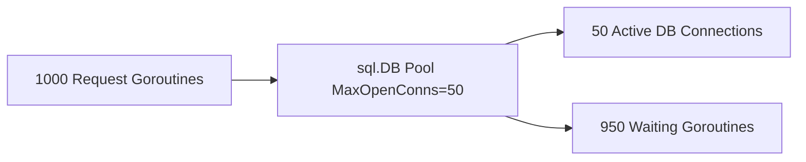

CPU mungkin rendah. Tetapi user latency tinggi karena 950 goroutine menunggu connection.

Solusi bukan langsung menaikkan DB pool.

Pertanyaan:

- DB mampu menerima koneksi tambahan?
- query lambat karena lock?
- ada transaction panjang?
- request harus fail fast?
- perlu per-endpoint/per-tenant DB concurrency limit?
- apakah queue wait masuk latency metric?

---

## 24. Failure Model

Concurrent system gagal dengan cara yang lebih kaya daripada sequential system.

### 24.1 Failure Taxonomy

| Failure | Definisi | Contoh |
|---|---|---|
| Data race | akses memory unsynchronized | map read/write concurrent |
| Deadlock | semua saling tunggu | lock cycle, channel no receiver |
| Partial deadlock | sebagian subsystem stuck | worker pool stopped consuming |
| Livelock | aktif tapi tidak progress | retry loop conflict |
| Starvation | work tidak pernah dapat resource | low priority never served |
| Leak | resource tidak selesai | goroutine blocked forever |
| Backlog | work antre terlalu lama | queue age grows |
| Overload | offered load > capacity | p99 + timeout spike |
| Retry storm | retries amplify load | downstream 500 leads to client retry flood |
| Thundering herd | banyak work bangun bersamaan | cache expiration simultaneous |
| Priority inversion | low-priority blocks high-priority | background holds DB pool |
| Orphan work | work berjalan setelah parent gone | request canceled but goroutine continues |

### 24.2 Failure Cascade

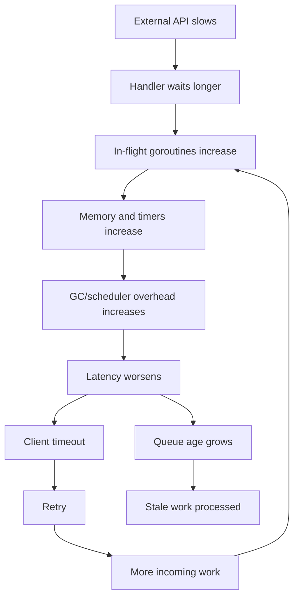

### 24.3 Containment

Failure containment mechanisms:

- bounded queue,
- timeout/deadline,
- circuit breaker,
- bulkhead,
- rate limit,
- per-tenant quota,
- priority shedding,
- cancellation propagation,
- retry budget,
- idempotency,
- fallback/degrade,
- separate pool for background.

---

## 25. Observability Model Sejak Awal

Concurrency tidak bisa dioperasikan jika tidak terlihat.

### 25.1 Minimal Metrics

| Area | Metrics |
|---|---|
| Work lifecycle | accepted, rejected, started, completed, failed, canceled, timed out |
| Queue | depth, oldest age, enqueue rate, dequeue rate, dropped |
| Worker | active, idle, crashed, processing latency |
| Context | cancellation count, deadline exceeded count |
| Goroutine | count, growth rate, blocked profiles |
| Lock/channel | block profile, mutex profile |
| Downstream | in-flight, success/error/timeout, rate limit |
| Retry | attempts, retry budget exhausted, retry delay |
| Resource | CPU, memory, GC, DB pool wait, HTTP pool wait |
| SLO | p50, p95, p99, availability, goodput |

### 25.2 Logs

Concurrent logs harus punya correlation:

- request ID,
- trace ID,
- work ID,
- parent work ID,
- tenant ID,
- goroutine role tidak harus ID runtime,
- attempt,
- queue age,
- deadline remaining,
- cancellation cause jika ada.

### 25.3 Profiles and Traces

Tools yang akan diperdalam nanti:

- goroutine profile,
- block profile,
- mutex profile,
- CPU profile,
- heap profile,
- runtime trace,
- trace flight recorder,
- Go 1.26 experimental goroutine leak profile.

Go 1.25 memperkenalkan `runtime/trace.FlightRecorder` sebagai cara lebih ringan untuk menyimpan trace runtime dalam ring buffer dan menulis snapshot saat event penting terjadi. [Go 1.25 Release Notes](https://go.dev/doc/go1.25)

---

## 26. Design Sketch Sebelum Kode

Sebelum menulis implementation, buat design sketch.

### 26.1 Template

```text
Subsystem:
Work unit:
Caller:
Owner:
Start trigger:
Completion condition:
Cancellation source:
Deadline/timeout:
Concurrency limit:
Queue capacity:
Ordering requirement:
State ownership:
Downstream dependencies:
Retry policy:
Backpressure behavior:
Shutdown behavior:
Metrics:
Known failure modes:
```

### 26.2 Example: External API Enrichment

```text
Subsystem: Postal code enrichment
Work unit: one address enrichment request
Caller: HTTP request handler
Owner: request context + enrichment client
Start trigger: request needs enrichment
Completion condition: result received, timeout, or cancellation
Cancellation source: parent request context
Deadline/timeout: min(parent remaining, 300ms)
Concurrency limit: 50 in-flight globally, 5 per tenant
Queue capacity: no internal queue for user request; fail fast if semaphore unavailable
Ordering requirement: none across different requests
State ownership: cache is sharded map guarded by mutex
Downstream dependencies: OneMap-like external API
Retry policy: max 1 retry for 401 refresh or transient 5xx if budget remains
Backpressure behavior: return degraded response or 503/429 depending endpoint criticality
Shutdown behavior: no new requests, wait for in-flight within shutdown budget
Metrics: in-flight, latency, cache hit, rejected, retry, downstream status
Known failure modes: rate limit, slow API, cache stampede, token refresh race
```

### 26.3 Example: Background Reconciliation Worker

```text
Subsystem: Case reconciliation
Work unit: one case ID reconciliation
Caller: scheduler
Owner: reconciliation service lifecycle
Start trigger: periodic tick or manual trigger
Completion condition: case reconciled or classified failed
Cancellation source: service shutdown context
Deadline/timeout: 30s per case, 10min batch budget
Concurrency limit: 8 workers
Queue capacity: 1000 case IDs
Ordering requirement: per case ID no overlap
State ownership: durable DB transaction per case; in-memory in-flight set guarded by mutex
Downstream dependencies: DB, document service, notification service
Retry policy: retry transient failure with exponential backoff and jitter
Backpressure behavior: skip scheduling if previous run still active; report backlog
Shutdown behavior: stop scheduling, stop accepting new work, finish or cancel in-flight
Metrics: run duration, queue depth, oldest age, success/failure by reason, skipped runs
Known failure modes: overlapping runs, DB lock contention, stale case state, poison case
```

---

## 27. Concurrency Review Questions

Gunakan pertanyaan berikut dalam design/code review.

### 27.1 Work

- Apa unit kerja terkecil?
- Apakah jumlahnya bounded?
- Siapa owner work?
- Apa outcome final work?
- Apakah partial success valid?

### 27.2 Time

- Apa deadline parent?
- Apakah deadline dipropagate?
- Apakah queue wait masuk budget?
- Apakah retry masih menghormati budget?
- Apakah work stale bisa dibuang?

### 27.3 State

- State mana yang shared?
- State mana yang immutable?
- Apa invariant critical?
- Primitive sinkronisasi apa yang menjaga invariant?
- Apakah ada safe publication?

### 27.4 Ordering

- Urutan apa yang wajib?
- Apakah ordering global benar-benar diperlukan?
- Bisakah order dipersempit per key?
- Apa efek retry terhadap ordering?

### 27.5 Contention

- Resource apa yang paling sempit?
- Bagaimana resource itu dilimit?
- Apa metric saturation-nya?
- Apakah ada hidden queue?
- Apa yang terjadi saat resource penuh?

### 27.6 Failure

- Apa yang terjadi jika downstream lambat?
- Apa yang terjadi jika parent canceled?
- Apa yang terjadi jika worker panic?
- Apa yang terjadi saat shutdown?
- Apakah retry memperparah overload?

### 27.7 Observability

- Bisakah kita melihat active work?
- Bisakah kita melihat queue age?
- Bisakah kita membedakan rejected vs failed vs canceled?
- Bisakah kita melihat goroutine leak trend?
- Bisakah kita tahu tenant/key mana penyebab load?

---

## 28. Anti-Patterns Fondasional

### 28.1 Unlimited Goroutine Fan-Out

```go
for _, x := range hugeSlice {
    go process(x)
}
```

Masalah:

- tidak ada bound,
- tidak ada backpressure,
- memory spike,
- downstream overload,
- sulit cancel/wait.

### 28.2 Queue Tanpa Age Metric

```go
jobs := make(chan Job, 1000000)
```

Buffer besar tidak menyelesaikan overload. Ia menunda failure dan memperburuk stale work.

### 28.3 Timeout Lokal Tanpa Parent Deadline

```go
ctx, cancel := context.WithTimeout(context.Background(), 5*time.Second)
```

Di dalam request handler, ini memutus cancellation chain dari request.

Gunakan parent:

```go
ctx, cancel := context.WithTimeout(r.Context(), 5*time.Second)
```

### 28.4 Shared Mutable Map Tanpa Lock

```go
m[key] = value // while another goroutine reads/writes
```

Ini data race dan bisa menyebabkan fatal runtime error untuk map concurrent write/read.

### 28.5 Fire-and-Forget Background Work

```go
go doSomethingImportant()
```

Tanpa owner, tanpa limit, tanpa shutdown, tanpa error path.

### 28.6 Retry Tanpa Budget

```go
for {
    err := call()
    if err == nil { return nil }
}
```

Retry harus punya:

- max attempt,
- backoff,
- jitter,
- context,
- retry budget,
- idempotency.

### 28.7 Measuring Only Average

Average latency bisa terlihat baik saat p99 buruk.

Gunakan p95/p99, queue age, goodput, rejection, and timeout metrics.

---

## 29. Case Walkthrough: API Dengan Fan-Out Downstream

### 29.1 Problem

API `/case/{id}/summary` harus mengambil:

- case core data dari DB,
- applicant profile dari profile service,
- latest document metadata dari document service,
- risk score dari scoring service,
- audit summary dari audit service.

Target SLO: p95 400ms.

### 29.2 Naive Design

```go
func Summary(w http.ResponseWriter, r *http.Request) {
    id := mux.Vars(r)["id"]

    ch := make(chan part)
    go fetchCase(id, ch)
    go fetchProfile(id, ch)
    go fetchDocs(id, ch)
    go fetchScore(id, ch)
    go fetchAudit(id, ch)

    var summary Summary
    for i := 0; i < 5; i++ {
        p := <-ch
        merge(&summary, p)
    }

    writeJSON(w, summary)
}
```

Masalah:

- no context propagation,
- no timeout,
- no error policy,
- no cancellation on first fatal error,
- no downstream concurrency limit,
- unbuffered channel leak if early return added later,
- no optional/degraded distinction,
- no metrics per dependency.

### 29.3 Better Design Contract

```text
Work unit: one summary request
Parent context: r.Context()
Total budget: 400ms p95, hard timeout 500ms
Required dependencies: DB case, profile
Optional dependencies: audit summary, risk score, docs metadata
Concurrency limit: per-downstream semaphore
Error policy: fail if required dependency fails; degrade optional if timeout
Ordering: no order needed; merge by part type
Cancellation: first required failure cancels siblings
Backpressure: if downstream limiter full, degrade optional or fail fast required
Observability: per-dependency in-flight, latency, error, degraded count
```

### 29.4 Better Shape

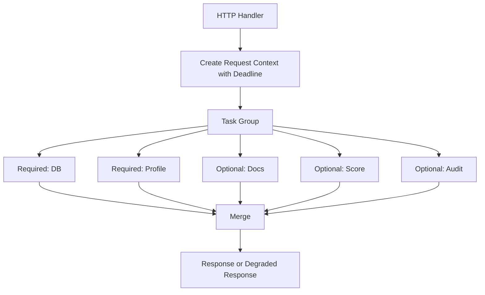

### 29.5 Key Insight

The hard part is not making calls concurrent. The hard part is deciding:

- which calls are required,
- which calls are optional,
- which failures cancel others,
- which results can be stale,
- where capacity is enforced,
- how to observe degraded mode.

---

## 30. Case Walkthrough: Worker Pool For External Rate-Limited API

### 30.1 Problem

Service harus memperkaya 10.000 records memakai external API dengan rate limit 300/minute.

### 30.2 Wrong Design

```go
for _, rec := range records {
    go enrich(rec)
}
```

Masalah:

- burst 10.000 call,
- 429,
- retry storm,
- memory spike,
- no progress visibility.

### 30.3 Better Design

```text
Work unit: one record enrichment
Rate limit: 300/minute
Concurrency limit: e.g. 10-20 in-flight depending latency
Queue: bounded; input batch already bounded
Retry: 429 with Retry-After/backoff/jitter and budget
Dedup: per postal code/key if repeated
Cache: exact-key cache with TTL if valid
Ordering: output can preserve input order using index if required
Metrics: submitted, processed, 429, retry, cache hit, queue age, throughput
```

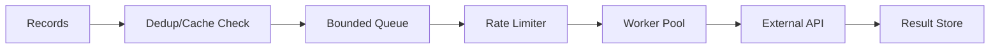

### 30.4 Sizing

Rate limit 300/min = 5/sec.

If average API latency = 200ms:

```text
concurrency ≈ 5 × 0.2 = 1
```

But because latency variance and retry exist, maybe 2-5 in-flight is enough. Worker 100 tidak membantu karena rate limit 5/sec.

Jika average latency = 2s:

```text
concurrency ≈ 5 × 2 = 10
```

Sekarang 10 workers masuk akal.

Sizing worker harus mengikuti throughput target dan service time, bukan feeling.

---

## 31. Case Walkthrough: Cache Stampede

### 31.1 Problem

Cache entry expired. 1.000 request concurrent untuk key yang sama. Semua miss dan call DB.

### 31.2 Naive Design

```go
func Get(key string) (Value, error) {
    if v, ok := cache.Get(key); ok {
        return v, nil
    }
    v, err := db.Load(key)
    if err != nil { return Value{}, err }
    cache.Set(key, v)
    return v, nil
}
```

Masalah:

- duplicate work,
- DB spike,
- tail latency,
- retry amplification.

### 31.3 Better Design Concepts

- singleflight per key,
- stale-while-revalidate,
- TTL jitter,
- bounded refresh concurrency,
- negative cache for not found,
- per-key lock cleanup.

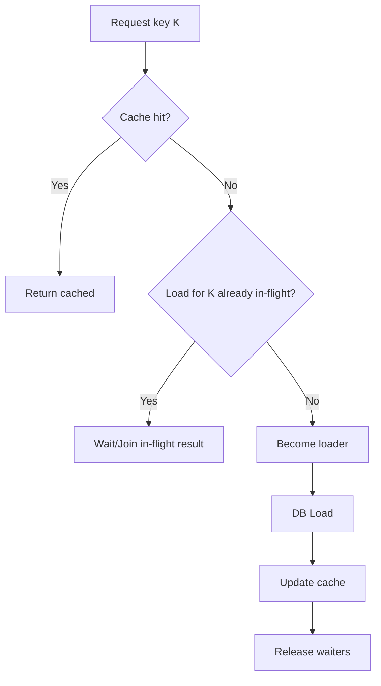

Key insight:

> Duplicate suppression is concurrency control.

---

## 32. Design Heuristics Untuk Top 1% Engineer

### 32.1 Bound Everything That Can Grow

Bound:

- goroutines,
- queues,
- retries,
- timers,
- batch size,
- request body,
- DB connections,
- HTTP connections,
- per-tenant usage,
- background work,
- shutdown duration.

### 32.2 Prefer Explicit Ownership

Every goroutine should have an owner.

Every channel should have a closer.

Every mutable state should have a synchronization story.

Every worker pool should have a shutdown story.

### 32.3 Cancellation Is Not Error Handling

Cancellation means work is no longer wanted.

Failure means work was wanted but failed.

Timeout means budget expired.

Rejected means work was never accepted.

Do not collapse all into generic error metrics.

### 32.4 Queue Is Debt

Queue means work accepted but not yet paid for.

Debt can help absorb bursts.

Debt can also bankrupt the system.

Measure queue age.

### 32.5 Throughput Without Latency Is Incomplete

A service can process many requests but still be useless if all are late.

Measure:

- goodput,
- p95/p99,
- timeouts,
- stale completions,
- rejection policy.

### 32.6 Race-Free Is Baseline, Not Finish Line

No data race does not mean correct.

You can be race-free and still have:

- deadlock,
- wrong ordering,
- stale work,
- duplicate side effects,
- resource leaks,
- overload collapse.

### 32.7 Start With the Bottleneck

Concurrency design should start from bottleneck:

- CPU?
- DB?
- external API?
- lock?
- per-key ordering?
- memory?
- downstream quota?

Then design around it.

---

## 33. Practical Checklist: Before You Add Concurrency

Use this before adding goroutines to code.

```text
[ ] I know the unit of work.
[ ] I know the owner of each goroutine.
[ ] I know the maximum number of goroutines/work items.
[ ] I know the deadline/cancellation path.
[ ] I know whether order matters.
[ ] I know which state is shared.
[ ] I know the synchronization primitive for shared state.
[ ] I know the bottleneck resource.
[ ] I know the backpressure behavior.
[ ] I know the retry policy and retry budget.
[ ] I know how shutdown works.
[ ] I know how to observe active/queued/completed/failed/canceled work.
[ ] I know what happens when downstream is slow.
[ ] I know what happens when queue is full.
[ ] I know what happens when parent returns early.
```

---

## 34. Practical Checklist: After You Add Concurrency

```text
[ ] Race tests cover important paths.
[ ] Stress tests run with high concurrency.
[ ] Cancellation tests prove goroutines exit.
[ ] Shutdown tests prove no worker/ticker leak.
[ ] Queue capacity is intentionally chosen.
[ ] Queue oldest-age metric exists.
[ ] Downstream limiter exists if dependency is finite.
[ ] Retry has backoff, jitter, max attempts, and context.
[ ] p95/p99 are measured, not only average.
[ ] Block/mutex/goroutine profile can be captured.
[ ] Logs have correlation ID/work ID.
[ ] Load test includes overload beyond breaking point.
[ ] Goodput is measured separately from raw throughput.
```

AWS Builders' Library recommends load testing beyond the point of failure to understand overload behavior and verify that load shedding preserves goodput instead of letting availability collapse. [AWS Builders' Library — Using load shedding to avoid overload](https://aws.amazon.com/builders-library/using-load-shedding-to-avoid-overload/)

---

## 35. Mini Lab 1: Model Sebelum Kode

Ambil requirement berikut:

> Build Go service yang menerima request untuk memproses 1 sampai 1.000 IDs. Untuk tiap ID, service perlu call DB dan external API. Response harus return semua result yang berhasil dan daftar error per ID. Total API timeout 2 detik. External API rate limit 100 req/s. DB pool max 50 connections.

Sebelum coding, jawab:

1. Apa unit kerja?
2. Apakah per-ID work boleh parallel?
3. Apakah output harus preserve input order?
4. Berapa concurrency DB maksimal?
5. Berapa concurrency external API maksimal?
6. Bagaimana jika request context canceled?
7. Bagaimana jika external API mulai 429?
8. Bagaimana jika 1 ID gagal?
9. Apakah retry boleh?
10. Apa queue capacity?
11. Apa metric wajib?
12. Apa yang terjadi saat shutdown?

### Suggested Model

```text
Unit work: one ID processing
Parent work: one HTTP batch request
Ordering: preserve output order using input index
Concurrency:
  DB: <= 50, likely lower per endpoint, e.g. 20
  External API: based on rate 100/s and latency; use rate limiter + concurrency limiter
Timeout: parent 2s, per-ID derived from remaining budget
Error policy: collect per-ID errors, do not fail whole batch unless systemic error
Cancellation: parent cancel stops all ID workers
Queue: no unbounded internal queue; semaphore bounded fan-out
Retry: only transient, only if budget remains, limited attempts
Metrics:
  batch size
  per-ID latency
  DB wait
  external in-flight
  429 count
  canceled count
  partial success count
```

---

## 36. Mini Lab 2: Identify Hidden Queues

Untuk service berikut, identifikasi hidden queue:

```go
func handler(w http.ResponseWriter, r *http.Request) {
    ids := parseIDs(r)
    results := make(chan Result)

    for _, id := range ids {
        go func(id string) {
            row := db.QueryRowContext(r.Context(), "select ...", id)
            res := callExternal(r.Context(), row)
            results <- res
        }(id)
    }

    for range ids {
        res := <-results
        writePart(res)
    }
}
```

Hidden queues:

- goroutines created per ID,
- DB pool waiters,
- HTTP transport waiters,
- external API server queue,
- unbuffered `results` blocked senders if writer slow,
- response writer/network backpressure,
- scheduler run queue,
- timers from contexts/deadlines.

Problems:

- no per-ID concurrency limit,
- no result channel close ownership,
- no early return handling,
- response write while collecting may have partial response complexity,
- no error policy,
- no external rate limit.

---

## 37. Mini Lab 3: Backpressure Policy

Requirement:

> Background job menerima events dari channel. Event diproses dengan 20 workers. Saat queue penuh, apa yang harus dilakukan?

Jawaban tidak universal.

Pilih berdasarkan value of work:

| Work type | Queue full behavior |
|---|---|
| Audit event wajib | block briefly, persist durable fallback, alert |
| Cache refresh | drop/coalesce latest |
| Email notification | enqueue durable queue or retry later |
| Metrics sample | drop |
| Payment command | reject/return busy; do not silently drop |
| Search indexing | durable queue; delay acceptable |

Concurrency design adalah business semantics + resource control.

---

## 38. Mermaid Summary: Full Concurrency Foundation

```mermaid
flowchart TD
    A[Concurrency Requirement] --> B[Define Work Unit]
    B --> C[Classify Workload]
    C --> D[Define Time Budget]
    D --> E[Define State Ownership]
    E --> F[Define Ordering Requirement]
    F --> G[Identify Bottleneck Resource]
    G --> H[Choose Capacity Control]
    H --> I[Choose Coordination Primitive]
    I --> J[Define Error/Cancellation Policy]
    J --> K[Define Backpressure Policy]
    K --> L[Define Observability]
    L --> M[Implement]
    M --> N[Test Race/Stress/Cancellation]
    N --> O[Load Test to Failure]
    O --> P[Operate with Metrics/Profiles]
```

---

## 39. What You Should Be Able To Say In A Design Review

Setelah part ini, kamu harus bisa mengatakan hal seperti:

> “Kita tidak boleh spawn goroutine per item tanpa limit karena bottleneck sebenarnya external API rate limit 100/s. Dengan average latency 200ms, concurrency efektif sekitar 20. Kita perlu limiter untuk in-flight dan rate, parent context 2s, output order preserve by index, error collected per item, dan queue tidak boleh unbounded. Metric wajib: in-flight, queue age, 429, retry count, p95/p99 per dependency.”

Atau:

> “Masalahnya bukan channel atau mutex. Masalahnya ownership state belum jelas. Kalau invariant harus berubah atomically untuk beberapa field, mutex lebih tepat daripada channel owner yang membuat mailbox menjadi bottleneck. Kalau read-mostly config, atomic immutable snapshot lebih baik.”

Atau:

> “Queue depth 10.000 bukan capacity. Itu backlog debt. Jika average processing 100/s, queue itu berarti 100 detik delay. Untuk user-facing request, itu sudah stale.”

---

## 40. Key Takeaways

1. Concurrency design dimulai dari **work**, bukan goroutine.
2. Work harus punya owner, lifecycle, deadline, capacity, error policy, dan observability.
3. Time model harus mencakup queue wait, execution time, retry delay, dan downstream wait.
4. State harus punya ownership dan synchronization story.
5. Ordering harus dipilih eksplisit: none, input, per-key, causal, atau global.
6. Contention adalah pusat performance failure.
7. Queue adalah debt; bounded queue adalah control point.
8. Backpressure adalah mekanisme stabilitas, bukan detail implementasi.
9. Cancellation adalah lifecycle contract.
10. Goodput lebih penting daripada raw throughput saat overload.
11. Race-free adalah baseline correctness, bukan jaminan desain benar.
12. Top engineer mencari hidden queues, feedback loops, dan failure cascade sebelum production menemukan sendiri.

---

## 41. Referensi Resmi dan Pendukung

1. Go Memory Model — https://go.dev/ref/mem  
   Relevan untuk data race, happens-before, dan DRF-SC.

2. Go Concurrency Patterns: Context — https://go.dev/blog/context  
   Relevan untuk request-scoped cancellation, deadline, dan goroutine lifecycle.

3. context package documentation — https://pkg.go.dev/context  
   Relevan untuk contract `Context`, cancellation tree, deadline, dan CancelFunc leak.

4. Go Concurrency Patterns: Pipelines and cancellation — https://go.dev/blog/pipelines  
   Relevan untuk pipeline, channel stages, cancellation, dan failure cleanup.

5. sync/atomic package documentation — https://pkg.go.dev/sync/atomic  
   Relevan untuk sequentially consistent atomics dan synchronizes-before.

6. Go 1.25 Release Notes — https://go.dev/doc/go1.25  
   Relevan untuk trace flight recorder, `WaitGroup.Go`, `testing/synctest`, dan runtime updates.

7. Go 1.26 Release Notes — https://go.dev/doc/go1.26  
   Relevan untuk Green Tea GC default, experimental goroutine leak profile, runtime behavior, dan concurrency diagnostics.

8. AWS Builders' Library: Using load shedding to avoid overload — https://aws.amazon.com/builders-library/using-load-shedding-to-avoid-overload/  
   Relevan untuk overload, goodput, load shedding, testing to breaking point, dan contention behavior.

9. AWS Builders' Library: Avoiding overload in distributed systems by putting the smaller service in control — https://aws.amazon.com/builders-library/avoiding-overload-in-distributed-systems-by-putting-the-smaller-service-in-control/  
   Relevan untuk scale mismatch, correlated clients, retry amplification, and control-plane/data-plane overload.

---

## 42. Status Seri

Seri **belum selesai**.

Progress:

- [x] Part 000 — Orientation: Dari Java Threading ke Go Concurrency Engineering
- [x] Part 001 — Foundations: Work, Time, State, Ordering, and Contention
- [ ] Part 002 — Goroutine Internals: Lifecycle, Stack, Parking, Blocking, and Leaks
- [ ] Part 003 — Go Scheduler Deep Dive: G, M, P, Run Queues, Stealing, Preemption
- [ ] Part 004 — GOMAXPROCS, CPU Quotas, Containers, and Kubernetes Reality
- [ ] Part 005 — Go Memory Model: Happens-Before, Visibility, Race Freedom
- [ ] Part 006 — Synchronization Primitives: Mutex, RWMutex, Cond, Once, Pool
- [ ] Part 007 — Atomic Operations: Correctness, Performance, and Misuse
- [ ] Part 008 — Channels Deep Dive: Semantics, Ownership, Backpressure, and Closure
- [ ] Part 009 — Select Semantics: Fairness, Cancellation, Timeouts, Priority, and Starvation
- [ ] Part 010 — WaitGroup, ErrGroup, Task Groups, and Structured Concurrency
- [ ] Part 011 — Context as Concurrency Contract: Cancellation, Deadline, Values, and Propagation
- [ ] Part 012 — Ownership Models: Share Memory by Communicating vs Communicate by Sharing Memory
- [ ] Part 013 — Worker Pools: Bounded Concurrency, Queueing, Load Shedding, and Sizing
- [ ] Part 014 — Fan-Out/Fan-In, Pipelines, Stages, and Stream Processing
- [ ] Part 015 — Backpressure End-to-End: From Goroutine to Service Boundary
- [ ] Part 016 — Semaphores, Rate Limiters, Token Buckets, and Bulkheads
- [ ] Part 017 — Concurrent Data Structures: Maps, Caches, Queues, Rings, and Shards
- [ ] Part 018 — Singleflight, Deduplication, Idempotency, and Duplicate Suppression
- [ ] Part 019 — Timers, Tickers, Deadlines, Heartbeats, and Time-Based Concurrency
- [ ] Part 020 — Network Concurrency: netpoller, HTTP Server, Client, gRPC, and Connection Pools
- [ ] Part 021 — Database Concurrency: sql.DB, Transactions, Pool Saturation, and Deadlocks
- [ ] Part 022 — Parallel CPU Work: Partitioning, Work Stealing, SIMD Awareness, and Cache Locality
- [ ] Part 023 — Memory, Allocation, GC, and Concurrency Pressure
- [ ] Part 024 — Race Detection, Static Analysis, Vet, and Concurrency Bug Hunting
- [ ] Part 025 — Testing Concurrent Code: Determinism, Quiescence, Fake Time, and Stress
- [ ] Part 026 — Observability: pprof, trace, runtime/metrics, Logs, and Goroutine Dumps
- [ ] Part 027 — Performance Engineering: Benchmarking, Contention, Throughput, and Tail Latency
- [ ] Part 028 — Failure Modes: Deadlock, Livelock, Starvation, Leaks, Thundering Herds
- [ ] Part 029 — Designing Concurrent APIs: Contracts, Ownership, Cancellation, and Misuse Resistance
- [ ] Part 030 — Runtime-Aware Service Design: HTTP, Background Jobs, Queues, and Shutdown
- [ ] Part 031 — Advanced Patterns: Actors, Event Loops, Reactors, Schedulers, and Mailboxes
- [ ] Part 032 — Cross-Service Concurrency: Distributed Coordination, Idempotency, and Sagas
- [ ] Part 033 — Case Studies: Production Concurrency Architecture Reviews
- [ ] Part 034 — Engineering Handbook: Design Review Checklist, Decision Matrix, and Operating Model


<!-- NAVIGATION_FOOTER -->
<div class="page-nav">
<a href="./learn-go-concurrency-parallelism-part-000.md">⬅️ Part 000 — Orientation: Dari Java Threading ke Go Concurrency Engineering</a>
<a href="./index.md">📚 Kategori</a>
<a href="../../index.md">🏠 Home</a>
<a href="./learn-go-concurrency-parallelism-part-002.md">Part 002 — Goroutine Internals: Lifecycle, Stack, Parking, Blocking, and Leaks ➡️</a>
</div>
