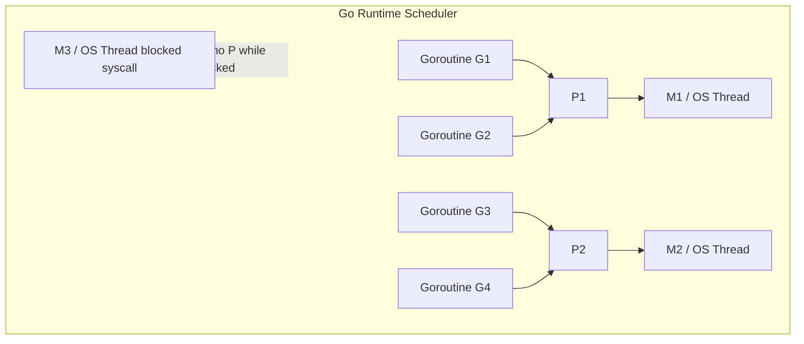
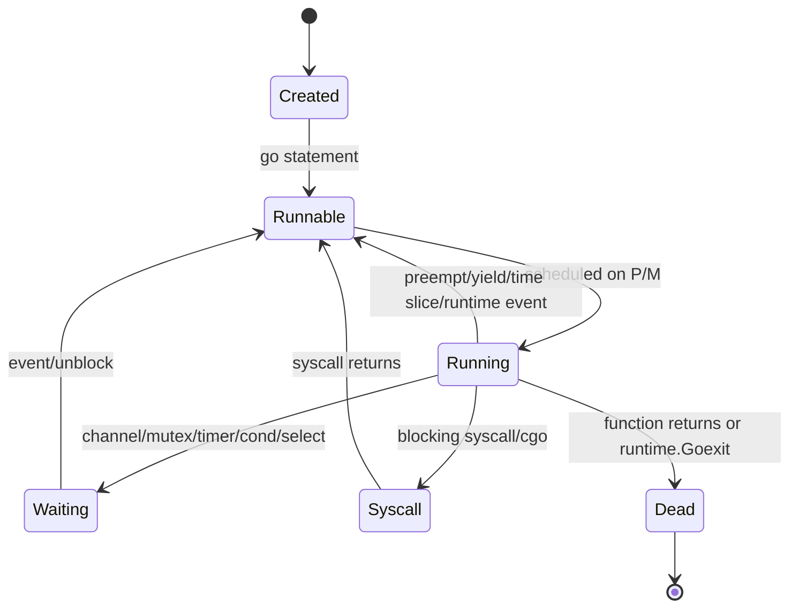
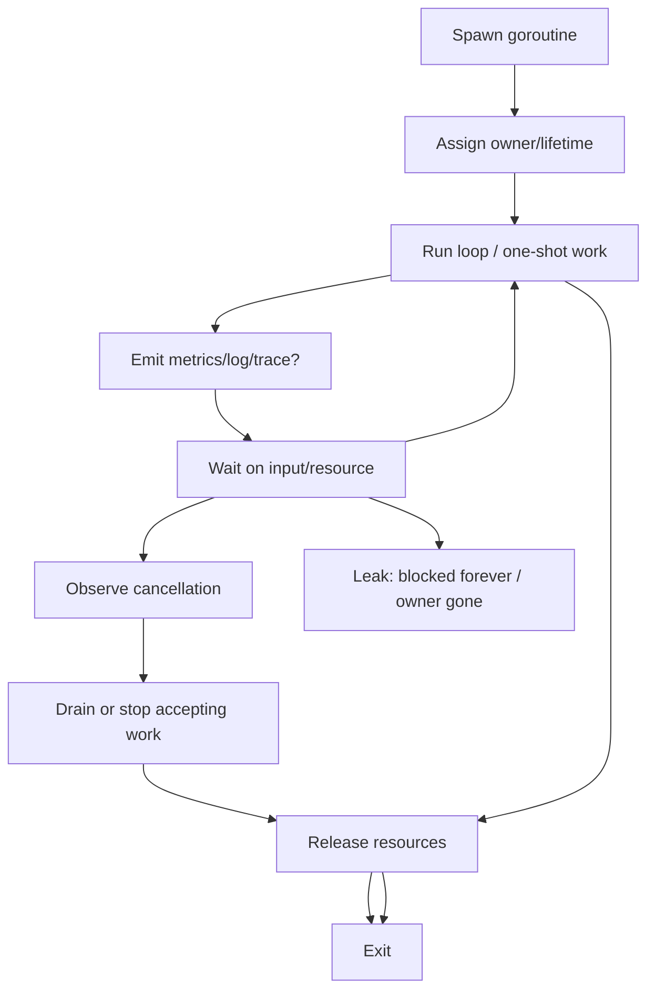
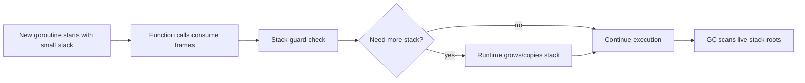
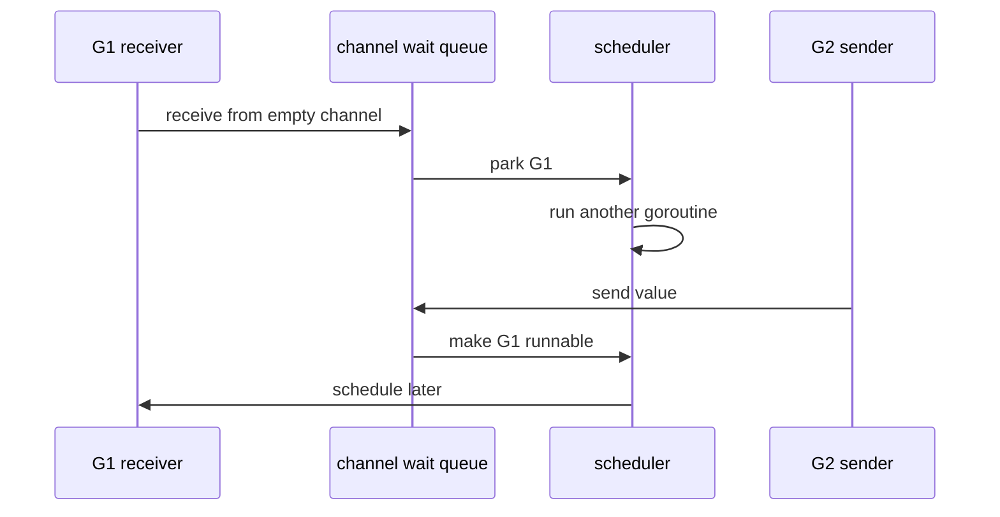
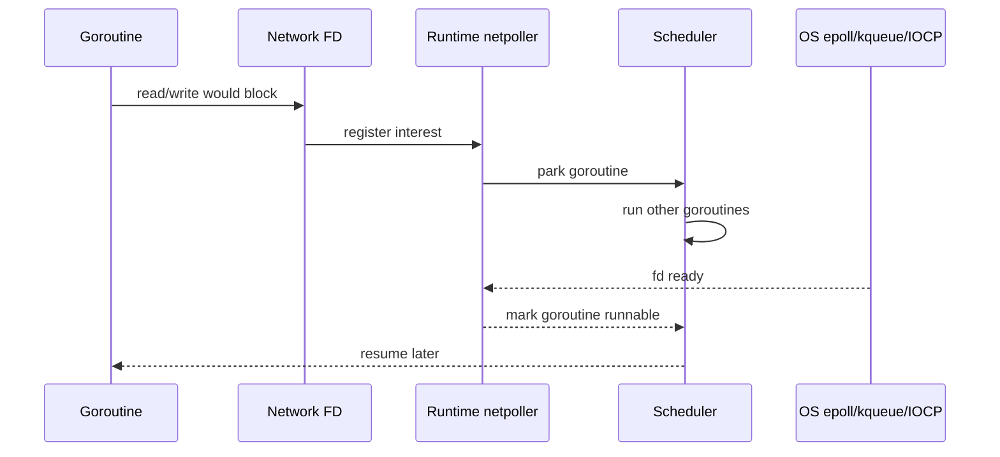
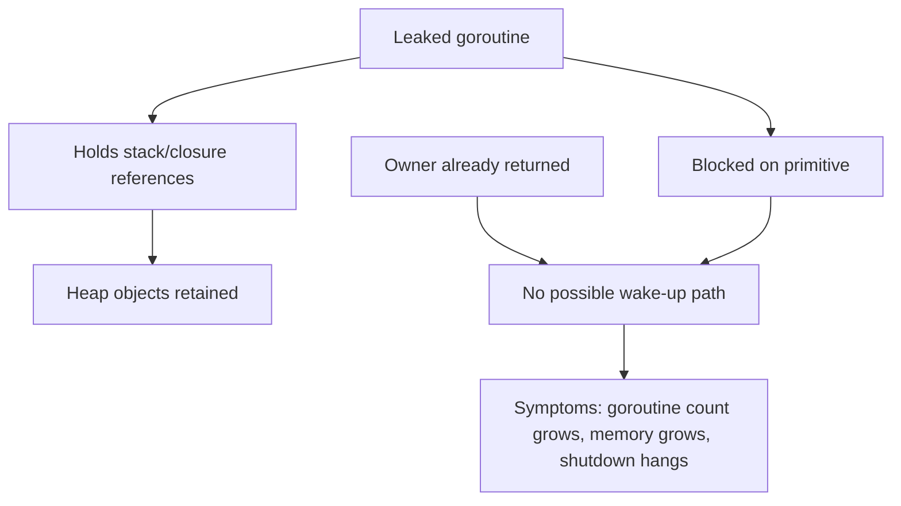
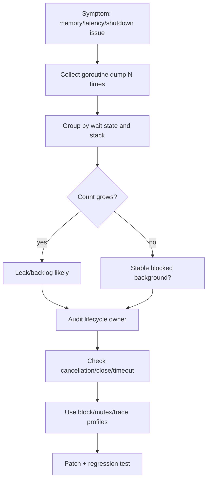
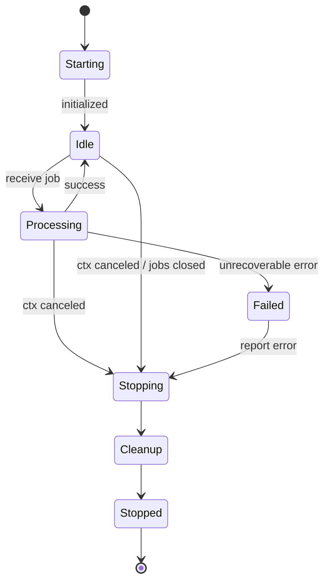

# learn-go-concurrency-parallelism-part-002.md

# Part 002 — Goroutine Internals: Lifecycle, Stack, Parking, Blocking, and Leaks

> Series: `learn-go-concurrency-parallelism`  
> Target: Go 1.26.x  
> Audience: Java software engineer / tech lead moving toward production-grade Go concurrency engineering  
> Status: Part 002 of 034

---

## 0. Posisi Part Ini Dalam Seri

Pada Part 000 kita membangun orientasi Java → Go: jangan memandang goroutine sebagai sekadar “thread murah”, tetapi sebagai unit kerja yang harus punya owner, cancellation path, boundedness, dan observability.

Pada Part 001 kita membangun grammar concurrency: work, time, state, ordering, contention, capacity, queueing, backpressure, dan failure cascade.

Part 002 masuk ke lapisan lebih rendah:

- apa yang sebenarnya terjadi saat `go f()` dijalankan,
- bagaimana goroutine hidup, berhenti, park, block, wake up, dan leak,
- bagaimana stack goroutine bekerja,
- apa hubungan goroutine dengan scheduler, OS thread, syscall, network poller, dan garbage collector,
- bagaimana membaca goroutine dump,
- bagaimana mendesain lifecycle goroutine agar tidak menjadi resource leak tersembunyi.

Tujuan bagian ini bukan membuat kamu menghafal detail runtime internal yang berubah antar versi. Tujuan utamanya adalah membentuk **mental model operasional** yang cukup akurat untuk debugging, capacity planning, performance review, incident triage, dan design review.

---

## 1. Sumber Resmi dan Basis Faktual

Materi ini disusun dengan basis dokumen resmi Go dan source runtime Go. Beberapa hal yang relevan untuk Part 002:

1. Go runtime mendefinisikan scheduler internal menggunakan konsep **G, M, P**: G adalah goroutine, M adalah OS thread, dan P adalah resource untuk mengeksekusi Go user code. Dalam dokumen runtime `HACKING`, Go menyatakan scheduler mengelola tiga resource tersebut; jumlah P sama dengan `GOMAXPROCS`.
2. Source `runtime/stack.go` menunjukkan bahwa minimum stack awal goroutine Go code adalah 2048 bytes, dan `startingStackSize` dapat diadaptasi oleh runtime berdasarkan ukuran stack rata-rata yang dipindai saat GC.
3. Go FAQ menjelaskan bahwa `GOMAXPROCS` membatasi jumlah goroutine yang dapat benar-benar berjalan bersamaan, tetapi runtime dapat membuat lebih banyak OS thread untuk melayani syscall / I/O blocking.
4. Go diagnostics document menyatakan stack trace berguna untuk melihat berapa banyak goroutine yang sedang berjalan, apa yang mereka lakukan, dan apakah mereka blocked.
5. Go 1.26 menambahkan experimental `goroutineleak` profile di `runtime/pprof`, dapat diaktifkan dengan `GOEXPERIMENT=goroutineleakprofile`, dan tersedia di endpoint `/debug/pprof/goroutineleak` jika `net/http/pprof` digunakan.
6. Go 1.26 release notes mendefinisikan leaked goroutine dalam konteks profile tersebut sebagai goroutine yang blocked pada concurrency primitive yang tidak mungkin lagi menjadi unblocked, dengan deteksi berbasis reachability oleh garbage collector.

Referensi lengkap ada di akhir file.

---

## 2. Core Thesis: Goroutine Murah, Tapi Bukan Gratis

Kalimat yang sering terdengar:

> “Goroutine itu murah, jadi spawn saja sebanyak mungkin.”

Kalimat ini berbahaya karena setengah benar.

Yang benar:

- goroutine jauh lebih ringan daripada OS thread,
- stack awalnya kecil,
- scheduling dikelola runtime Go,
- blocking I/O banyak ditangani dengan netpoller sehingga tidak selalu menahan OS thread,
- ribuan sampai ratusan ribu goroutine bisa masuk akal pada workload tertentu.

Yang salah:

- goroutine tetap punya stack,
- goroutine tetap menjadi root / participant yang harus dipindai GC,
- goroutine blocked tetap menyimpan referensi ke object yang ada di stack / closure,
- goroutine waiting pada channel/mutex/timer tetap memakan metadata runtime,
- goroutine runaway bisa menyebabkan memory pressure, scheduler pressure, queue pressure, dan tail latency,
- goroutine tanpa lifecycle owner adalah leak waiting to happen.

Mental model yang lebih sehat:

> Goroutine adalah unit eksekusi murah yang boleh dibuat banyak, tetapi setiap goroutine tetap harus punya alasan hidup, batas hidup, pemilik, cara berhenti, dan sinyal observability.

Aturan design review:

> Jangan pernah bertanya hanya “boleh tidak spawn goroutine?”  
> Tanyakan: “Siapa yang memiliki goroutine ini, kapan ia selesai, bagaimana ia dibatalkan, apa resource yang ia tahan, apa yang terjadi jika parent return lebih dulu, dan bagaimana kita tahu ia leak?”

---

## 3. Dari Java Thread ke Go Goroutine

Sebagai Java engineer, kemungkinan mental model awal kamu adalah:

- `Thread` relatif mahal,
- workload production dijalankan via `ExecutorService`,
- thread pool mengontrol concurrency,
- blocking call menahan thread,
- Java virtual thread membuat blocking style lebih murah, tetapi tetap ada carrier thread dan scheduler JVM,
- `CompletableFuture` / reactive stack memindahkan concern ke callback, executor, dan completion graph.

Go berbeda.

Di Go:

- `go f()` membuat goroutine, bukan OS thread langsung,
- goroutine dischedule oleh runtime Go ke OS thread,
- goroutine memiliki growable stack,
- goroutine bisa park saat menunggu channel/mutex/timer/network,
- runtime dapat melanjutkan goroutine lain tanpa kamu membuat executor manual,
- concurrency boundary sering diekspresikan dengan `context`, channel, mutex, wait group, dan ownership.

Tetapi ada jebakan:

Java engineer sering membawa kebiasaan ini ke Go:

```go
// Anti-pattern: "ExecutorService mindset" yang terlalu mekanis.
for _, item := range items {
    go process(item)
}
```

Masalahnya bukan karena `go process(item)` salah secara syntax. Masalahnya adalah tidak ada jawaban untuk pertanyaan:

- berapa banyak goroutine maksimal?
- siapa yang menunggu selesai?
- bagaimana error dikumpulkan?
- bagaimana cancellation dikirim?
- apa yang terjadi jika caller return lebih awal?
- apakah external dependency overload?
- bagaimana test memastikan semua goroutine berhenti?

Go membuat spawn mudah; engineering membuat lifecycle eksplisit.

---

## 4. Terminologi Runtime: G, M, P

Part 003 akan membahas scheduler lebih dalam. Part ini hanya perlu model minimum.

Dalam runtime Go:

- **G** = goroutine.
- **M** = machine, yaitu OS thread.
- **P** = processor/resource token yang diperlukan untuk menjalankan Go user code.

Mermaid diagram:



Makna praktis:

- jumlah goroutine bisa sangat banyak,
- jumlah OS thread bisa lebih sedikit atau lebih banyak tergantung blocking syscall/cgo/LockOSThread,
- jumlah P menentukan berapa banyak goroutine Go user code yang bisa benar-benar berjalan paralel,
- `GOMAXPROCS` mengatur jumlah P,
- goroutine yang blocked pada channel/mutex/timer biasanya tidak memakai CPU,
- goroutine yang blocked dalam syscall mungkin memegang OS-level resource dan dapat memicu runtime membuat thread lain.

Analogi Java:

| Java | Go | Perbedaan penting |
|---|---|---|
| `Thread` | `M` / OS thread | Go programmer jarang berinteraksi langsung dengan M. |
| Java virtual thread | goroutine | Sama-sama lightweight, tetapi scheduler dan API lifecycle berbeda. |
| Executor worker | P+M executing G | Go tidak memaksa semua task lewat executor eksplisit. |
| Blocking queue | channel / queue / worker pool | Channel punya synchronization semantics, bukan sekadar queue. |
| Thread dump | goroutine dump | Goroutine dump menunjukkan stack dan waiting state goroutine. |

---

## 5. Apa yang Terjadi Saat `go f()`?

Kode:

```go
go f(x, y)
```

Secara mental model, urutannya kira-kira:

1. current goroutine mengevaluasi function value dan argument,
2. runtime membuat descriptor goroutine baru,
3. runtime menyiapkan stack awal dan entry frame,
4. goroutine baru menjadi runnable,
5. scheduler akan menjalankan goroutine baru saat ada P/M yang tersedia,
6. caller tidak menunggu goroutine baru kecuali kamu membuat synchronization explicit.

Yang penting:

```go
go f()
```

bukan:

```text
start thread and wait later automatically
```

melainkan:

```text
register independent concurrent execution and return immediately
```

Dalam Go, `go` statement tidak mengembalikan handle seperti `Thread`, `Future`, atau `Task`. Ini design penting. Karena tidak ada handle bawaan, kamu harus membangun ownership sendiri dengan:

- `sync.WaitGroup`,
- `errgroup.Group`,
- channel result,
- context cancellation,
- explicit `Start/Stop/Wait`,
- supervisor / worker pool.

### 5.1 Kesalahan Dasar: Mengira Caller Akan Menunggu

```go
func main() {
    go func() {
        fmt.Println("background")
    }()
}
```

Program bisa keluar sebelum goroutine sempat print.

Bukan karena scheduler “bug”, tetapi karena `main` selesai berarti program selesai.

Correctness principle:

> Jika result atau side effect goroutine penting, harus ada synchronization yang membuat parent menunggu atau cancellation yang jelas.

---

## 6. Lifecycle Goroutine

Lifecycle sederhana:



Lifecycle produksi lebih kaya:



### 6.1 Created

Created adalah kondisi konseptual setelah runtime menyiapkan goroutine tetapi sebelum benar-benar berjalan.

Di level programmer, setelah `go f()` dipanggil:

- kamu tidak tahu kapan goroutine mulai,
- kamu tidak boleh mengandalkan ordering kecuali ada synchronization,
- side effect di goroutine tidak otomatis terlihat ke goroutine lain tanpa happens-before relation.

Contoh salah:

```go
var ready bool

func main() {
    go func() {
        ready = true
    }()

    for !ready {
        // data race + busy spin
    }
}
```

Correct:

```go
func main() {
    ready := make(chan struct{})

    go func() {
        close(ready)
    }()

    <-ready
}
```

### 6.2 Runnable

Runnable berarti goroutine siap berjalan, tetapi belum tentu sedang berjalan.

Runnable goroutine masuk ke run queue. Banyak runnable goroutine berarti runtime perlu memilih siapa yang dijalankan.

Gejala production jika terlalu banyak runnable goroutine:

- CPU tinggi,
- latency naik,
- scheduler overhead naik,
- work stealing meningkat,
- goroutine dump menunjukkan banyak goroutine tidak blocked tetapi siap jalan,
- trace menunjukkan runnable delay.

Runnable backlog berbeda dari waiting goroutine. Waiting goroutine mungkin murah jika memang idle. Runnable goroutine adalah kompetitor CPU.

### 6.3 Running

Running berarti goroutine sedang mengeksekusi Go code pada M yang memiliki P.

Jumlah goroutine running Go code secara paralel dibatasi oleh `GOMAXPROCS`.

Jika `GOMAXPROCS=4`, maka secara kasar hanya 4 goroutine Go user code yang bisa running bersamaan, walaupun ada 100.000 goroutine lain.

### 6.4 Waiting / Parked

Waiting berarti goroutine sedang blocked pada event runtime:

- menerima dari channel kosong,
- mengirim ke channel penuh / unbuffered tanpa receiver,
- menunggu mutex,
- menunggu condition variable,
- menunggu timer,
- menunggu `select`,
- menunggu network I/O via netpoller,
- menunggu `WaitGroup.Wait`,
- menunggu syscall/cgo boundary.

“Parked” biasanya berarti goroutine disimpan oleh runtime pada wait queue sampai ada event yang membuatnya runnable lagi.

### 6.5 Syscall

Saat goroutine masuk blocking syscall, ia dapat menahan OS thread. Runtime memiliki mekanisme agar P dapat dilepas dan digunakan M lain untuk menjalankan goroutine lain.

Makna praktis:

- blocking network I/O Go standard library biasanya terintegrasi dengan netpoller,
- blocking filesystem syscall bisa berbeda perilakunya per OS,
- cgo call bisa menahan OS thread lebih berat,
- terlalu banyak blocking syscall/cgo bisa menaikkan jumlah thread,
- OS thread bukan tidak terbatas.

### 6.6 Dead

Goroutine selesai saat function return atau memanggil `runtime.Goexit`.

Goroutine yang panic tanpa recover akan menyebabkan program crash jika panic mencapai top of goroutine.

Important:

```go
func main() {
    go func() {
        panic("boom")
    }()

    time.Sleep(time.Second)
}
```

Panic pada child goroutine tidak otomatis berubah menjadi error yang bisa ditangani parent. Jika tidak di-recover di goroutine tersebut, program akan panic.

---

## 7. Goroutine Stack: Kecil, Tumbuh, Tetapi Tetap Ada Biayanya

Salah satu alasan goroutine murah adalah stack awalnya kecil. Source runtime Go mendefinisikan minimum stack Go code sebagai 2048 bytes, lalu runtime dapat menyesuaikan `startingStackSize` berdasarkan ukuran stack rata-rata yang dipindai saat GC.

Mental model:



### 7.1 Java Comparison

Java platform thread biasanya memiliki stack OS-level yang jauh lebih besar secara default. Java virtual thread juga lightweight dan stack-nya lebih fleksibel, tetapi runtime model dan scheduling berbeda.

Di Go:

- stack per goroutine dimulai kecil,
- stack bisa tumbuh saat call depth / frame butuh lebih banyak,
- stack bisa menyimpan pointer ke heap object,
- GC harus mempertimbangkan stack goroutine sebagai source of live references,
- goroutine leak dapat membuat object tetap live karena masih direferensikan dari stack goroutine.

### 7.2 Stack Growth Cost

Stack growth bukan sesuatu yang perlu kamu micro-optimize setiap hari, tetapi penting untuk mental model:

- goroutine dengan call chain dalam bisa trigger stack growth,
- stack growth dapat melibatkan copy stack,
- pointer di stack harus valid setelah stack move,
- runtime/compiler bekerja sama untuk memastikan ini aman,
- pola recursive yang tidak bounded tetap berbahaya,
- goroutine leak dengan stack besar lebih mahal daripada leak dengan stack kecil.

Contoh recursive buruk:

```go
func walk(n int) {
    if n == 0 {
        return
    }
    walk(n - 1)
}
```

Jika `n` tidak bounded, masalahnya bukan “goroutine stack kecil”, tetapi algorithmic unbounded recursion.

### 7.3 Stack Retention Problem

Perhatikan contoh:

```go
func leaky(ch <-chan struct{}) {
    big := make([]byte, 100<<20) // 100 MiB

    go func() {
        <-ch
        // closure masih bisa mempertahankan referensi big,
        // tergantung bagaimana compiler menganalisis capture dan usage.
        _ = big
    }()
}
```

Jika goroutine blocked selamanya pada `<-ch`, object besar bisa ikut tertahan.

Prinsip:

> Goroutine leak bukan hanya leak goroutine. Ia bisa menjadi heap retention leak karena stack/closure goroutine menyimpan referensi ke object besar.

### 7.4 Jangan Menyimpan Payload Besar Di Closure Background

Lebih aman:

```go
func processAsync(ctx context.Context, payload []byte) {
    // copy hanya jika benar-benar perlu ownership independent
    payloadCopy := append([]byte(nil), payload...)

    go func() {
        defer func() {
            // release reference early if useful in long-running loops
            payloadCopy = nil
        }()

        select {
        case <-ctx.Done():
            return
        default:
        }

        process(payloadCopy)
    }()
}
```

Tetapi jangan copy besar sembarangan juga. Lebih penting adalah jelas ownership dan lifetime-nya.

---

## 8. Parking dan Unparking

Goroutine yang tidak bisa lanjut tidak harus memutar CPU. Runtime dapat mem-park goroutine dan menjalankan goroutine lain.

Contoh channel receive:

```go
func consumer(ch <-chan int) {
    v := <-ch // jika ch kosong, goroutine park
    fmt.Println(v)
}
```

Saat channel kosong:

- goroutine tidak busy-wait,
- runtime menaruh goroutine pada wait queue channel,
- P/M dapat menjalankan goroutine lain,
- saat ada sender, receiver di-unpark dan menjadi runnable.

Diagram:



### 8.1 Parking Tidak Sama Dengan Aman

Goroutine yang parked tidak membakar CPU, tetapi tetap dapat menjadi masalah:

- jumlah goroutine bertambah terus,
- stack dan metadata tetap ada,
- object references tetap hidup,
- goroutine dump makin besar,
- shutdown menunggu selamanya,
- dependency cleanup tidak terjadi,
- hidden capacity habis.

A production system can die quietly from parked goroutines.

### 8.2 Busy Wait: Lawan Dari Parking

Buruk:

```go
for !done.Load() {
    // busy spin
}
```

Lebih baik:

```go
<-doneCh
```

Atau:

```go
select {
case <-doneCh:
    return
case <-time.After(100 * time.Millisecond):
    // periodic check
}
```

Tetapi hati-hati dengan `time.After` di loop panjang; bagian timer dibahas di Part 019.

---

## 9. Blocking Taxonomy

Tidak semua blocking sama. Untuk debugging, bedakan minimal 8 jenis blocking.

| Blocking type | Contoh | Apakah buruk? | Risiko utama |
|---|---|---:|---|
| Channel receive | `<-ch` | Tidak selalu | leak jika channel tidak pernah ditutup/dikirim |
| Channel send | `ch <- v` | Tidak selalu | producer stuck jika receiver hilang |
| Mutex | `mu.Lock()` | Tidak selalu | contention, deadlock, priority inversion |
| WaitGroup | `wg.Wait()` | Tidak selalu | `Done` hilang, Add ordering bug |
| Timer | `<-timer.C` | Tidak selalu | timer leak, slow shutdown |
| Network I/O | `client.Do(req)` | Tidak selalu | missing timeout, dependency hang |
| Syscall/file I/O | read/write file | Context-dependent | OS thread pressure |
| cgo | C call | More risky | thread pinning, scheduler visibility lower |

Design review harus bertanya:

- block ini bounded atau unbounded?
- apa yang membangunkan goroutine ini?
- apa yang terjadi jika wake-up tidak pernah datang?
- apakah `ctx.Done()` diperhatikan?
- apakah shutdown bisa melewati block ini?

---

## 10. Channel Blocking Internals: Wait Queue dan Ownership

Channel adalah salah satu sumber blocking paling umum.

### 10.1 Receive Dari Channel Kosong

```go
v := <-ch
```

Jika tidak ada value:

- receiver park,
- goroutine masuk wait queue receiver,
- akan bangun jika ada sender atau channel closed.

### 10.2 Send Ke Channel Penuh

```go
ch <- v
```

Jika channel unbuffered atau buffer penuh:

- sender park,
- sender menunggu receiver / buffer slot,
- jika receiver hilang, sender bisa leak.

### 10.3 Close Channel

`close(ch)` membangunkan receiver. Tetapi close bukan broadcast cancellation universal jika senders masih bisa send; send ke closed channel panic.

Pattern benar tergantung ownership.

Rule sederhana:

> Channel biasanya ditutup oleh sender/owner, bukan receiver. Jika banyak sender, perlu owner terpisah atau coordination.

### 10.4 Leak Pattern: Receiver Menunggu Selamanya

```go
func waitForEvent(events <-chan Event) Event {
    return <-events // leak risk if no event and no close
}
```

Lebih baik:

```go
func waitForEvent(ctx context.Context, events <-chan Event) (Event, error) {
    select {
    case e, ok := <-events:
        if !ok {
            return Event{}, io.EOF
        }
        return e, nil
    case <-ctx.Done():
        return Event{}, ctx.Err()
    }
}
```

### 10.5 Leak Pattern: Sender Menunggu Selamanya

```go
func startProducer(ch chan<- Event) {
    go func() {
        for {
            e := produce()
            ch <- e // leak if consumer stops
        }
    }()
}
```

Lebih baik:

```go
func startProducer(ctx context.Context, ch chan<- Event) {
    go func() {
        defer close(ch)
        for {
            e, err := produce(ctx)
            if err != nil {
                return
            }

            select {
            case ch <- e:
            case <-ctx.Done():
                return
            }
        }
    }()
}
```

---

## 11. Mutex Blocking Internals: Contention, Not Just Mutual Exclusion

Mutex digunakan untuk menjaga invariant shared state. Tetapi mutex juga bisa menjadi source blocking.

```go
type Counter struct {
    mu sync.Mutex
    n  int64
}

func (c *Counter) Inc() {
    c.mu.Lock()
    defer c.mu.Unlock()
    c.n++
}
```

Saat goroutine memanggil `Lock()` dan lock sedang dipegang:

- goroutine dapat park,
- runtime akan membangunkannya saat lock tersedia,
- contention tinggi dapat terlihat pada mutex profile.

### 11.1 Mutex Wait Bukan Bug Otomatis

Mutex wait normal jika:

- critical section pendek,
- contention rendah,
- invariant jelas,
- latency acceptable.

Mutex wait menjadi smell jika:

- lock dipegang saat I/O,
- lock dipegang saat network call,
- lock dipegang saat logging lambat,
- lock melindungi terlalu banyak state,
- lock order tidak konsisten,
- p99 latency naik karena convoy.

Buruk:

```go
func (s *Store) Update(ctx context.Context, id string) error {
    s.mu.Lock()
    defer s.mu.Unlock()

    row, err := s.db.Load(ctx, id) // I/O while holding lock
    if err != nil {
        return err
    }
    s.cache[id] = row
    return nil
}
```

Lebih baik:

```go
func (s *Store) Update(ctx context.Context, id string) error {
    row, err := s.db.Load(ctx, id)
    if err != nil {
        return err
    }

    s.mu.Lock()
    s.cache[id] = row
    s.mu.Unlock()
    return nil
}
```

### 11.2 Lock Scope Harus Melindungi Invariant, Bukan Fungsi

Kunci bukan untuk “membuat fungsi thread-safe” secara membabi buta. Kunci melindungi invariant.

Buruk:

```go
func (s *Service) Handle(ctx context.Context, req Request) error {
    s.mu.Lock()
    defer s.mu.Unlock()

    validate(req)
    result := compute(req)
    err := s.callExternal(ctx, result)
    if err != nil {
        return err
    }
    s.state[req.ID] = result
    return nil
}
```

Pertanyaan:

- invariant mana yang butuh lock?
- `validate` butuh lock?
- `compute` butuh lock?
- external call butuh lock?
- apakah state bisa diupdate setelah external call?

---

## 12. Network I/O dan Netpoller

Go network I/O sering terasa seperti blocking style:

```go
resp, err := http.DefaultClient.Do(req)
```

Tetapi runtime dan network poller dapat mem-park goroutine yang menunggu readiness socket dan menjalankan goroutine lain.

Mental model:



Makna praktis:

- goroutine-per-request di HTTP server masuk akal karena blocked network I/O tidak selalu menahan OS thread,
- tetapi goroutine-per-request tetap bisa overload DB, downstream, memory, dan CPU,
- context timeout tetap wajib,
- connection pool tetap wajib dikonfigurasi,
- body harus ditutup,
- slow dependency tetap bisa menyebabkan goroutine pile-up.

### 12.1 Missing Timeout = Goroutine Retention

Buruk:

```go
resp, err := http.Get("https://example.com")
```

Lebih production-safe:

```go
client := &http.Client{
    Timeout: 3 * time.Second,
}

req, err := http.NewRequestWithContext(ctx, http.MethodGet, url, nil)
if err != nil {
    return err
}

resp, err := client.Do(req)
if err != nil {
    return err
}
defer resp.Body.Close()
```

Timeout bukan hanya latency feature. Timeout adalah goroutine lifetime bound.

---

## 13. Goroutine Leak: Definisi Engineering

Secara engineering:

> Goroutine leak adalah goroutine yang tetap hidup setelah alasan bisnis / teknis untuk hidupnya sudah hilang, atau goroutine yang tidak punya jalur keluar yang dapat dijamin.

Leak tidak selalu berarti blocked forever pada runtime primitive. Bisa juga:

- loop background tanpa observe cancellation,
- retry loop tanpa batas,
- ticker yang tidak berhenti,
- worker menunggu job queue yang tidak pernah ditutup,
- sender stuck karena receiver return awal,
- receiver stuck karena sender gagal dibuat,
- goroutine menahan reference object besar,
- goroutine menunggu `WaitGroup` yang counter-nya tidak pernah nol,
- goroutine stuck pada external dependency tanpa timeout.

Go 1.26 experimental goroutine leak profile lebih sempit: ia mendeteksi kelas goroutine yang blocked pada concurrency primitive yang tidak mungkin lagi unblocked berdasarkan reachability. Ini sangat berguna, tetapi bukan pengganti lifecycle design.

### 13.1 Leak Bukan Hanya Memory Leak

Goroutine leak dapat menyebabkan:

- memory retention,
- file descriptor retention,
- connection retention,
- request context retention,
- timer retention,
- CPU wake-up overhead,
- shutdown hang,
- duplicate side effects,
- misleading metrics,
- cascading timeout.

### 13.2 Leak Detection Mental Model



---

## 14. Canonical Leak Patterns dan Perbaikannya

### 14.1 Early Return Fan-In Leak

Buruk:

```go
func processAll(items []Item) ([]Result, error) {
    ch := make(chan result)

    for _, item := range items {
        go func() {
            r, err := process(item)
            ch <- result{r: r, err: err}
        }()
    }

    results := make([]Result, 0, len(items))
    for range items {
        r := <-ch
        if r.err != nil {
            return nil, r.err // sender lain bisa stuck di ch <- result
        }
        results = append(results, r.r)
    }
    return results, nil
}
```

Masalah:

- channel unbuffered,
- caller return early,
- goroutine lain tetap mencoba send,
- tidak ada cancellation,
- tidak ada wait.

Perbaikan minimal dengan buffer sebesar jumlah item:

```go
func processAll(items []Item) ([]Result, error) {
    ch := make(chan result, len(items))

    for _, item := range items {
        item := item
        go func() {
            r, err := process(item)
            ch <- result{r: r, err: err}
        }()
    }

    results := make([]Result, 0, len(items))
    for range items {
        r := <-ch
        if r.err != nil {
            return nil, r.err
        }
        results = append(results, r.r)
    }
    return results, nil
}
```

Ini mencegah sender stuck jika semua worker hanya mengirim satu hasil. Tetapi ini belum ideal:

- work tetap berjalan meskipun sudah ada error,
- jumlah goroutine tidak bounded,
- tidak ada context,
- tidak ada wait group eksplisit.

Perbaikan lebih baik:

```go
func processAll(ctx context.Context, items []Item, maxParallel int) ([]Result, error) {
    if maxParallel <= 0 {
        return nil, fmt.Errorf("maxParallel must be positive")
    }

    ctx, cancel := context.WithCancel(ctx)
    defer cancel()

    jobs := make(chan Item)
    results := make(chan result, len(items))

    var wg sync.WaitGroup
    workerCount := min(maxParallel, len(items))

    for i := 0; i < workerCount; i++ {
        wg.Add(1)
        go func() {
            defer wg.Done()
            for {
                select {
                case <-ctx.Done():
                    return
                case item, ok := <-jobs:
                    if !ok {
                        return
                    }

                    r, err := process(ctx, item)

                    select {
                    case results <- result{r: r, err: err}:
                    case <-ctx.Done():
                        return
                    }
                }
            }
        }()
    }

    go func() {
        defer close(jobs)
        for _, item := range items {
            select {
            case jobs <- item:
            case <-ctx.Done():
                return
            }
        }
    }()

    go func() {
        wg.Wait()
        close(results)
    }()

    out := make([]Result, 0, len(items))
    for r := range results {
        if r.err != nil {
            cancel()
            return nil, r.err
        }
        out = append(out, r.r)
    }

    if err := ctx.Err(); err != nil && !errors.Is(err, context.Canceled) {
        return nil, err
    }
    return out, nil
}
```

Catatan: implementasi final production bisa lebih sederhana dengan `errgroup` + semaphore. Kita bahas di Part 010 dan 013.

### 14.2 Goroutine Waiting On Never Closed Channel

Buruk:

```go
func startLogger(ch <-chan LogEvent) {
    go func() {
        for event := range ch {
            write(event)
        }
    }()
}
```

Masalah: siapa yang close `ch`? Jika tidak ada, goroutine hidup sampai process mati.

Lebih baik:

```go
type Logger struct {
    ch   chan LogEvent
    done chan struct{}
}

func NewLogger() *Logger {
    l := &Logger{
        ch:   make(chan LogEvent, 1024),
        done: make(chan struct{}),
    }
    go l.run()
    return l
}

func (l *Logger) run() {
    defer close(l.done)
    for event := range l.ch {
        write(event)
    }
}

func (l *Logger) Close() {
    close(l.ch)
    <-l.done
}
```

Tapi `Close` harus idempotent jika bisa dipanggil multiple times. Nanti kita bahas API lifecycle di Part 029.

### 14.3 Ticker Leak

Buruk:

```go
func startMetrics() {
    ticker := time.NewTicker(time.Second)
    go func() {
        for range ticker.C {
            collect()
        }
    }()
}
```

Masalah:

- ticker tidak pernah stopped,
- goroutine tidak pernah exit,
- tidak ada owner.

Lebih baik:

```go
func startMetrics(ctx context.Context) {
    ticker := time.NewTicker(time.Second)
    go func() {
        defer ticker.Stop()
        for {
            select {
            case <-ticker.C:
                collect()
            case <-ctx.Done():
                return
            }
        }
    }()
}
```

### 14.4 Retry Loop Leak

Buruk:

```go
go func() {
    for {
        err := callExternal()
        if err == nil {
            return
        }
        time.Sleep(time.Second)
    }
}()
```

Masalah:

- tidak ada max retry,
- tidak ada context,
- bisa hidup setelah request selesai,
- external dependency bisa terus dipukul saat outage.

Lebih baik:

```go
func retry(ctx context.Context, maxAttempts int, op func(context.Context) error) error {
    if maxAttempts <= 0 {
        return fmt.Errorf("maxAttempts must be positive")
    }

    backoff := 100 * time.Millisecond
    for attempt := 1; attempt <= maxAttempts; attempt++ {
        if err := op(ctx); err == nil {
            return nil
        } else if attempt == maxAttempts {
            return err
        }

        timer := time.NewTimer(backoff)
        select {
        case <-timer.C:
        case <-ctx.Done():
            if !timer.Stop() {
                <-timer.C
            }
            return ctx.Err()
        }
        backoff *= 2
    }
    return nil
}
```

Timer handling detail dibahas di Part 019.

### 14.5 Background Worker Without Stop

Buruk:

```go
type Cache struct {
    data map[string]Entry
}

func NewCache() *Cache {
    c := &Cache{data: map[string]Entry{}}
    go c.evictLoop()
    return c
}

func (c *Cache) evictLoop() {
    for {
        time.Sleep(time.Minute)
        c.evictExpired()
    }
}
```

Masalah:

- `Cache` tidak bisa dimatikan,
- test bisa leak goroutine,
- process shutdown tidak bisa coordinate,
- jika cache dibuat banyak kali, semua loop hidup.

Lebih baik:

```go
type Cache struct {
    mu     sync.Mutex
    data   map[string]Entry
    stop   chan struct{}
    done   chan struct{}
    once   sync.Once
}

func NewCache() *Cache {
    c := &Cache{
        data: map[string]Entry{},
        stop: make(chan struct{}),
        done: make(chan struct{}),
    }
    go c.evictLoop()
    return c
}

func (c *Cache) evictLoop() {
    defer close(c.done)

    ticker := time.NewTicker(time.Minute)
    defer ticker.Stop()

    for {
        select {
        case <-ticker.C:
            c.evictExpired()
        case <-c.stop:
            return
        }
    }
}

func (c *Cache) Close() {
    c.once.Do(func() {
        close(c.stop)
        <-c.done
    })
}
```

---

## 15. Goroutine Ownership: The Missing Handle Problem

Karena Go tidak memberikan handle dari `go f()`, ownership harus diekspresikan dengan design.

### 15.1 Ownership Questions

Setiap goroutine harus punya jawaban:

1. Siapa owner-nya?
2. Apa alasan ia dibuat?
3. Apakah ia one-shot atau loop?
4. Apa condition normal exit?
5. Apa condition error exit?
6. Apa cancellation signal?
7. Siapa yang menunggu exit?
8. Resource apa yang ia tahan?
9. Apakah ia boleh panic?
10. Bagaimana observability-nya?

### 15.2 Ownership Categories

| Category | Example | Owner | Stop mechanism |
|---|---|---|---|
| Request-scoped | parallel downstream call | request handler | request context |
| Operation-scoped | process batch items | caller function | context + wait |
| Component-scoped | cache eviction loop | component instance | Close/Stop |
| Process-scoped | metrics exporter | main service | root context shutdown |
| Detached | fire-and-forget audit | usually dangerous | queue/supervisor required |

### 15.3 Fire-and-Forget Is Usually Fire-and-Leak

Buruk:

```go
func (s *Service) Handle(w http.ResponseWriter, r *http.Request) {
    go s.audit(r.Context(), AuditEvent{...})
    w.WriteHeader(http.StatusAccepted)
}
```

Masalah:

- memakai request context, tetapi handler segera return; context bisa canceled,
- jika audit harus reliable, goroutine bukan durability mechanism,
- jika audit gagal, error hilang,
- jika audit lambat, goroutine menumpuk.

Lebih baik:

- tulis audit ke durable queue / outbox,
- atau masukkan ke bounded internal queue dengan explicit drop/backpressure policy,
- worker pool process-scoped yang punya shutdown lifecycle.

Sketch:

```go
type AuditDispatcher struct {
    queue chan AuditEvent
    done  chan struct{}
}

func (d *AuditDispatcher) Submit(ctx context.Context, e AuditEvent) error {
    select {
    case d.queue <- e:
        return nil
    case <-ctx.Done():
        return ctx.Err()
    default:
        return ErrAuditQueueFull
    }
}
```

Fire-and-forget boleh hanya jika side effect benar-benar optional dan drop policy eksplisit.

---

## 16. Cancellation: Jalur Keluar Goroutine

Goroutine harus melihat sinyal cancellation di titik blocking dan loop boundary.

### 16.1 Cancellation Pada Receive

```go
func run(ctx context.Context, jobs <-chan Job) {
    for {
        select {
        case job, ok := <-jobs:
            if !ok {
                return
            }
            handle(job)
        case <-ctx.Done():
            return
        }
    }
}
```

### 16.2 Cancellation Pada Send

```go
func emit(ctx context.Context, out chan<- Event, e Event) error {
    select {
    case out <- e:
        return nil
    case <-ctx.Done():
        return ctx.Err()
    }
}
```

Ini sering dilupakan. Banyak leak terjadi di send, bukan receive.

### 16.3 Cancellation Pada Work Function

Buruk:

```go
func worker(ctx context.Context, jobs <-chan Job) {
    for job := range jobs {
        process(job) // process tidak menerima ctx
    }
}
```

Lebih baik:

```go
func worker(ctx context.Context, jobs <-chan Job) {
    for {
        select {
        case <-ctx.Done():
            return
        case job, ok := <-jobs:
            if !ok {
                return
            }
            if err := process(ctx, job); err != nil {
                return
            }
        }
    }
}
```

### 16.4 Cancellation Bukan Kill - Itu Cooperative

Go tidak menyediakan safe external kill untuk goroutine. Kamu tidak bisa menghentikan goroutine lain secara paksa seperti membunuh thread.

Karena itu, goroutine harus cooperative:

- menerima context,
- select pada `ctx.Done()`,
- memakai timeout pada I/O,
- keluar dari loop,
- release resource via defer.

---

## 17. Panic Boundary Dalam Goroutine

Jika goroutine panic dan tidak recover, program crash.

Pada worker pool production, biasanya kamu butuh panic boundary agar satu bad job tidak menjatuhkan process. Tetapi recover juga tidak boleh menyembunyikan bug tanpa observability.

Pattern:

```go
func safeGo(wg *sync.WaitGroup, log *slog.Logger, f func()) {
    wg.Add(1)
    go func() {
        defer wg.Done()
        defer func() {
            if r := recover(); r != nil {
                log.Error("goroutine panic", "panic", r, "stack", string(debug.Stack()))
            }
        }()
        f()
    }()
}
```

Trade-off:

- untuk request worker, recover + return error mungkin tepat,
- untuk invariant corruption, crash-fast mungkin lebih aman,
- untuk background supervisor, recover + restart mungkin tepat hanya jika state aman,
- jangan recover lalu lanjut seolah tidak terjadi apa-apa.

Part 028 akan membahas failure modes lebih lengkap.

---

## 18. Observability: Membaca Goroutine Dump

Goroutine dump adalah salah satu alat debugging paling penting.

Cara umum:

```go
import _ "net/http/pprof"
```

Kemudian akses:

```text
/debug/pprof/goroutine?debug=2
```

Atau programmatically:

```go
pprof.Lookup("goroutine").WriteTo(os.Stdout, 2)
```

### 18.1 Contoh State: chan receive

Dump bisa menunjukkan:

```text
goroutine 123 [chan receive]:
main.worker(...)
    /app/worker.go:42
```

Makna:

- goroutine blocked menerima dari channel,
- cari channel owner,
- apakah channel akan dikirim atau ditutup?
- apakah ada cancellation case?

### 18.2 State: chan send

```text
goroutine 456 [chan send]:
main.producer(...)
    /app/producer.go:88
```

Makna:

- sender blocked,
- receiver mungkin berhenti,
- buffer penuh,
- potential backpressure atau leak.

### 18.3 State: semacquire

```text
goroutine 789 [semacquire]:
sync.runtime_SemacquireMutex(...)
```

Makna:

- menunggu mutex/semaphore internal,
- cek contention,
- ambil mutex profile,
- lihat siapa memegang lock terlalu lama.

### 18.4 State: IO wait

```text
goroutine 1001 [IO wait]:
internal/poll.runtime_pollWait(...)
```

Makna:

- goroutine menunggu network I/O readiness,
- tidak selalu buruk,
- jika banyak dan tumbuh, cek downstream timeout / connection leak / body close.

### 18.5 State: select

```text
goroutine 222 [select]:
main.loop(...)
```

Makna:

- goroutine blocked pada select,
- cek semua case,
- apakah ada case cancellation?
- apakah semua channel mungkin tidak pernah aktif?

---

## 19. Metrics Minimum Untuk Goroutine Lifecycle

Minimal monitor:

- `runtime.NumGoroutine()`
- queue depth per worker pool,
- active worker count,
- job processing latency,
- job wait age,
- cancellation count,
- timeout count,
- goroutine count by dump sampling in incident,
- pprof goroutine profile,
- block profile,
- mutex profile,
- runtime trace saat latency/scheduler issue.

Contoh metric sederhana:

```go
func recordRuntimeMetrics(ctx context.Context, interval time.Duration, observe func(name string, value float64)) {
    ticker := time.NewTicker(interval)
    defer ticker.Stop()

    for {
        select {
        case <-ticker.C:
            observe("runtime.goroutines", float64(runtime.NumGoroutine()))
        case <-ctx.Done():
            return
        }
    }
}
```

Di production, gunakan metrics library yang sudah dipakai tim, tetapi mental model-nya sama.

### 19.1 Interpretasi Goroutine Count

| Pattern | Interpretasi awal | Tindakan |
|---|---|---|
| Naik saat traffic naik, turun saat traffic turun | mungkin normal | korelasikan dengan request rate |
| Naik terus walau traffic stabil | leak / backlog | ambil goroutine dump berkala |
| Spike lalu stuck tinggi | blocked dependency / queue drain gagal | cek pprof, downstream, queue depth |
| Tinggi sejak startup | banyak background workers | audit component lifecycle |
| Tinggi saat shutdown | goroutine tidak observe cancellation | cek stop path |

---

## 20. Go 1.26: Experimental Goroutine Leak Profile

Go 1.26 menambahkan experimental profile bernama `goroutineleak` di `runtime/pprof`, diaktifkan dengan:

```bash
GOEXPERIMENT=goroutineleakprofile go test ./...
```

Jika aplikasi mengekspos `net/http/pprof`, endpoint menjadi:

```text
/debug/pprof/goroutineleak
```

Definisi yang dipakai release notes Go 1.26:

- leaked goroutine adalah goroutine yang blocked pada concurrency primitive seperti channel, `sync.Mutex`, `sync.Cond`, dan sejenisnya,
- primitive tersebut tidak reachable dari runnable goroutine atau goroutine lain yang dapat membangunkannya,
- karena tidak ada path untuk unblock, goroutine tersebut tidak bisa wake up,
- pendekatan ini mendeteksi banyak kelas leak, tetapi tidak semua.

### 20.1 Yang Bisa Dideteksi

Kemungkinan terdeteksi:

```go
func leak() {
    ch := make(chan int)
    go func() {
        <-ch // ch eventually unreachable except by blocked goroutine
    }()
}
```

Jika channel tidak reachable dari goroutine runnable mana pun, runtime dapat menyimpulkan receiver tidak akan pernah dibangunkan.

### 20.2 Yang Mungkin Tidak Terdeteksi

Tidak semua leak dapat dideteksi. Contoh:

```go
var global = make(chan int)

func leakButReachable() {
    go func() {
        <-global
    }()
}
```

Karena `global` reachable, runtime tidak bisa membuktikan bahwa channel tidak akan pernah menerima value. Secara engineering, ini masih bisa leak jika tidak ada sender nyata.

Contoh lain:

```go
go func() {
    for {
        time.Sleep(time.Hour)
    }
}()
```

Ini leak lifecycle, tetapi bukan blocked pada unreachable concurrency primitive dalam arti sempit.

### 20.3 Cara Memakai Di CI

Untuk package yang rawan leak:

```bash
GOEXPERIMENT=goroutineleakprofile go test ./... -run TestSomething -count=1
```

Tambahkan test yang:

1. membuat component,
2. menjalankan workload singkat,
3. menutup component,
4. menunggu quiescence,
5. memeriksa goroutine leak profile / goroutine count baseline.

Catatan: karena fitur ini experimental di Go 1.26, perlakukan sebagai alat tambahan, bukan satu-satunya guardrail.

---

## 21. Stack Trace Sebagai Graph, Bukan Teks

Saat membaca goroutine dump, jangan hanya lihat satu stack. Kelompokkan stack.

### 21.1 Group By Waiting Site

Jika ada 10.000 goroutine:

```text
goroutine ... [chan send]:
app.(*Dispatcher).Submit(...)
    dispatcher.go:77
```

Artinya ada bottleneck di dispatcher submit path.

### 21.2 Group By Lifecycle Owner

Tanyakan:

- goroutine ini milik request?
- milik worker pool?
- milik cache?
- milik HTTP client transport?
- milik DB driver?
- milik message consumer?

### 21.3 Group By Resource

- channel mana?
- mutex mana?
- socket mana?
- DB pool mana?
- context mana?

Goal debugging:

> Ubah 10.000 goroutine menjadi 3–5 class failure.

---

## 22. Goroutine Dump Incident Workflow

Saat incident memory/latency/shutdown hang:

1. Ambil goroutine dump beberapa kali dengan interval 10–30 detik.
2. Bandingkan apakah stack yang sama bertambah.
3. Kelompokkan berdasarkan top blocking state.
4. Cari owner lifecycle.
5. Cari missing cancellation / close / timeout.
6. Korelasikan dengan metrics:
   - request rate,
   - error rate,
   - downstream latency,
   - queue depth,
   - goroutine count,
   - heap,
   - CPU.
7. Jika mutex-heavy, ambil mutex profile.
8. Jika channel/block-heavy, ambil block profile.
9. Jika scheduler/latency issue, ambil trace.
10. Buat minimal reproduction test.

Mermaid:



---

## 23. Block Profile dan Mutex Profile

Goroutine dump memberi snapshot. Block/mutex profile memberi sampling waktu blocking.

### 23.1 Block Profile

`go test` mendukung:

```bash
go test ./... -run TestX -blockprofile block.out -blockprofilerate 1
```

Atau runtime:

```go
runtime.SetBlockProfileRate(1)
```

Block profile berguna untuk melihat goroutine blocking pada synchronization primitives.

### 23.2 Mutex Profile

```bash
go test ./... -run TestX -mutexprofile mutex.out -mutexprofilefraction 1
```

Mutex profile berguna untuk melihat contention mutex.

### 23.3 Snapshot vs Time

| Tool | Tipe | Menjawab |
|---|---|---|
| goroutine dump | snapshot | goroutine sedang di mana sekarang? |
| goroutine profile | snapshot/profile | stack live goroutine |
| block profile | sampled time | waktu blocking banyak habis di mana? |
| mutex profile | sampled time | lock contention banyak di mana? |
| trace | timeline | scheduler/event/runtime interleaving bagaimana? |

---

## 24. `runtime.NumGoroutine()` Untuk Test Leak: Berguna Tapi Hati-Hati

Test sederhana:

```go
func TestNoGoroutineLeak(t *testing.T) {
    before := runtime.NumGoroutine()

    c := NewComponent()
    c.Start()
    c.Close()

    eventually(t, time.Second, func() bool {
        return runtime.NumGoroutine() <= before
    })
}
```

Masalah:

- test runner sendiri punya goroutine,
- package lain bisa membuat background goroutine,
- GC/timer/network goroutine bisa berubah,
- parallel tests membuat noisy baseline.

Lebih baik:

- test component lifecycle secara spesifik dengan `done` channel,
- expose `Close` yang menunggu worker exit,
- gunakan leak checker helper dengan allowance,
- dump goroutine saat gagal.

Helper:

```go
func waitClosed(t *testing.T, done <-chan struct{}) {
    t.Helper()

    select {
    case <-done:
    case <-time.After(2 * time.Second):
        pprof.Lookup("goroutine").WriteTo(os.Stderr, 2)
        t.Fatal("component did not stop")
    }
}
```

---

## 25. Component Lifecycle Pattern: Start, Stop, Wait

Untuk component yang spawn goroutine, pattern production biasanya butuh:

- constructor tidak selalu langsung start heavy work,
- `Start(ctx)` atau `Run(ctx)` jelas,
- `Close()` / `Stop()` idempotent,
- `Wait()` atau Close menunggu selesai,
- error channel atau return error jelas,
- no goroutine left behind.

### 25.1 `Run(ctx)` Pattern

Sangat baik untuk service-level component:

```go
type Consumer struct {
    jobs <-chan Job
}

func (c *Consumer) Run(ctx context.Context) error {
    for {
        select {
        case <-ctx.Done():
            return ctx.Err()
        case job, ok := <-c.jobs:
            if !ok {
                return nil
            }
            if err := c.handle(ctx, job); err != nil {
                return err
            }
        }
    }
}
```

Caller memutuskan apakah dijalankan di goroutine:

```go
g.Go(func() error {
    return consumer.Run(ctx)
})
```

Keunggulan:

- owner jelas,
- error path jelas,
- cancellation jelas,
- test mudah.

### 25.2 `Start/Close` Pattern

Cocok untuk library object:

```go
type Watcher struct {
    ctx    context.Context
    cancel context.CancelFunc
    done   chan struct{}
    once   sync.Once
}

func NewWatcher(parent context.Context) *Watcher {
    ctx, cancel := context.WithCancel(parent)
    w := &Watcher{
        ctx:    ctx,
        cancel: cancel,
        done:   make(chan struct{}),
    }
    go w.run()
    return w
}

func (w *Watcher) run() {
    defer close(w.done)
    for {
        select {
        case <-w.ctx.Done():
            return
        // other cases...
        }
    }
}

func (w *Watcher) Close() error {
    w.once.Do(func() {
        w.cancel()
        <-w.done
    })
    return nil
}
```

Trade-off: constructor langsung start goroutine. Ini harus didokumentasikan.

---

## 26. Bounded Goroutine Creation

Goroutine murah membuat unbounded fan-out terlihat menggoda.

Buruk:

```go
for _, id := range ids {
    go fetch(id)
}
```

Jika `len(ids)=1_000_000`, kamu membuat 1 juta goroutine. Walaupun tiap goroutine kecil, external dependency, memory, scheduler, dan result aggregation bisa collapse.

Pattern semaphore:

```go
func fetchAll(ctx context.Context, ids []string, maxParallel int) error {
    sem := make(chan struct{}, maxParallel)
    errCh := make(chan error, len(ids))

    var wg sync.WaitGroup
    for _, id := range ids {
        id := id

        select {
        case sem <- struct{}{}:
        case <-ctx.Done():
            return ctx.Err()
        }

        wg.Add(1)
        go func() {
            defer wg.Done()
            defer func() { <-sem }()

            if err := fetch(ctx, id); err != nil {
                errCh <- err
            }
        }()
    }

    wg.Wait()
    close(errCh)

    for err := range errCh {
        if err != nil {
            return err
        }
    }
    return nil
}
```

Catatan: ini masih punya trade-off error cancellation. Versi dengan `errgroup` akan lebih bersih di Part 010.

---

## 27. Goroutine Per Request: Kapan Masuk Akal?

Go HTTP server lazim membuat goroutine per connection/request. Ini masuk akal karena:

- handler blocking style sederhana,
- network wait dapat dipark via runtime,
- programmer tidak harus menulis event loop manual.

Tetapi request handler bisa spawn goroutine tambahan. Inilah yang harus hati-hati.

Buruk:

```go
func handler(w http.ResponseWriter, r *http.Request) {
    for _, dep := range dependencies {
        go call(dep) // no bound, no ctx, no wait
    }
    w.WriteHeader(http.StatusOK)
}
```

Lebih baik:

```go
func handler(w http.ResponseWriter, r *http.Request) {
    ctx := r.Context()

    results, err := callDependencies(ctx, dependencies, 8)
    if err != nil {
        http.Error(w, err.Error(), http.StatusBadGateway)
        return
    }

    writeJSON(w, results)
}
```

Principle:

> Request goroutine boleh menjadi owner sementara child goroutine, tetapi handler tidak boleh return sebelum child goroutine selesai atau dibatalkan dengan aman.

---

## 28. Goroutine dan Garbage Collector

Goroutine berinteraksi dengan GC lewat stack scanning.

Setiap goroutine stack dapat berisi pointer ke heap. GC perlu mengetahui object mana yang masih reachable.

Makna praktis:

- semakin banyak goroutine, semakin banyak stack yang perlu dipertimbangkan,
- goroutine leak dapat mempertahankan heap object,
- object besar di closure goroutine dapat memperbesar live heap,
- banyak idle goroutine tidak gratis untuk GC,
- deep stack / banyak pointer di stack dapat meningkatkan scanning work.

### 28.1 Leak Yang Mempertahankan Request

```go
func handler(w http.ResponseWriter, r *http.Request) {
    reqBody, _ := io.ReadAll(r.Body)

    go func() {
        // Jika goroutine ini leak, reqBody bisa ikut tertahan.
        slowAudit(reqBody)
    }()

    w.WriteHeader(http.StatusAccepted)
}
```

Jika audit lambat/hang, memory request body tertahan.

Lebih baik:

- batasi ukuran body,
- enqueue ke bounded queue,
- copy hanya metadata yang dibutuhkan,
- timeout audit,
- gunakan durable outbox jika harus reliable.

---

## 29. Goroutine dan `defer`

`defer` adalah alat penting untuk cleanup di goroutine.

Pattern:

```go
go func() {
    defer wg.Done()
    defer close(done)
    defer resource.Close()

    run()
}()
```

Tetapi hati-hati dengan `defer` di loop panjang:

Buruk:

```go
for job := range jobs {
    f, err := os.Open(job.Path)
    if err != nil {
        continue
    }
    defer f.Close() // close tertunda sampai goroutine exit, bukan akhir iterasi
    process(f)
}
```

Lebih baik:

```go
for job := range jobs {
    if err := processFile(job.Path); err != nil {
        log.Error("process failed", "err", err)
    }
}

func processFile(path string) error {
    f, err := os.Open(path)
    if err != nil {
        return err
    }
    defer f.Close()
    return process(f)
}
```

Goroutine long-running perlu cleanup per iteration, bukan hanya saat goroutine exit.

---

## 30. Loop Variable Capture: Masih Perlu Dipahami

Go versi modern sudah memperbaiki banyak jebakan loop variable capture pada range loop, tetapi sebagai engineer kamu tetap harus memahami closure capture.

Safe explicit style tetap bagus untuk clarity:

```go
for _, item := range items {
    item := item
    go func() {
        process(item)
    }()
}
```

Masalah closure bukan hanya loop variable. Masalah lebih besar adalah capture object besar / mutable pointer.

Buruk:

```go
for _, req := range requests {
    go func() {
        process(req.Payload) // capture req; lifetime unclear
    }()
}
```

Lebih explicit:

```go
for _, req := range requests {
    id := req.ID
    payload := append([]byte(nil), req.Payload...)

    go func(id string, payload []byte) {
        process(id, payload)
    }(id, payload)
}
```

Tetapi copy payload besar harus dipertimbangkan. Clarity ownership adalah tujuannya.

---

## 31. Goroutine State Machine Dalam Desain

Untuk component production, gambarkan goroutine sebagai state machine.

Contoh worker:



Dengan state machine, kamu bisa melihat:

- apakah ada transition yang tidak punya exit?
- apakah error saat processing membatalkan worker lain?
- apakah jobs closed sama dengan shutdown?
- apakah cleanup selalu jalan?
- apakah state `Failed` terlihat oleh owner?

---

## 32. Design Pattern: Supervisor Untuk Background Goroutines

Jika component punya banyak goroutine, gunakan supervisor concept.

```go
type Supervisor struct {
    ctx    context.Context
    cancel context.CancelFunc
    wg     sync.WaitGroup
    errCh  chan error
}

func NewSupervisor(parent context.Context) *Supervisor {
    ctx, cancel := context.WithCancel(parent)
    return &Supervisor{
        ctx:    ctx,
        cancel: cancel,
        errCh:  make(chan error, 1),
    }
}

func (s *Supervisor) Go(name string, f func(context.Context) error) {
    s.wg.Add(1)
    go func() {
        defer s.wg.Done()
        defer func() {
            if r := recover(); r != nil {
                err := fmt.Errorf("%s panic: %v", name, r)
                select {
                case s.errCh <- err:
                default:
                }
                s.cancel()
            }
        }()

        if err := f(s.ctx); err != nil && !errors.Is(err, context.Canceled) {
            select {
            case s.errCh <- fmt.Errorf("%s: %w", name, err):
            default:
            }
            s.cancel()
        }
    }()
}

func (s *Supervisor) Wait() error {
    done := make(chan struct{})
    go func() {
        s.wg.Wait()
        close(done)
    }()

    select {
    case err := <-s.errCh:
        s.cancel()
        <-done
        return err
    case <-done:
        return nil
    }
}

func (s *Supervisor) Stop() {
    s.cancel()
    s.wg.Wait()
}
```

Ini bukan rekomendasi untuk membuat framework sendiri di semua project. Ini mental model. Dalam banyak kasus, `errgroup.Group` cukup.

---

## 33. Anti-Pattern Catalog

### 33.1 Goroutine In Constructor Without Close

```go
func NewX() *X {
    x := &X{}
    go x.loop()
    return x
}
```

Jika tidak ada `Close`, ini leak-prone.

### 33.2 Goroutine In Library Function Without Documentation

```go
func Parse(input []byte) Result {
    go warmCache()
    return result
}
```

Library function yang diam-diam spawn goroutine membuat lifecycle tidak terlihat.

### 33.3 Unbounded Per Item Goroutine

```go
for _, item := range hugeList {
    go process(item)
}
```

Harus ada limit.

### 33.4 Send Without Cancellation

```go
out <- value
```

Jika receiver bisa berhenti, gunakan select dengan `ctx.Done()`.

### 33.5 Receive Without Cancellation

```go
value := <-in
```

Jika sender bisa hilang, gunakan select dengan context atau close contract.

### 33.6 Background Loop With Sleep

```go
for {
    time.Sleep(time.Minute)
    work()
}
```

Gunakan ticker + context.

### 33.7 Panic Hidden In Worker

```go
go worker()
```

Jika worker panic, process crash. Bisa benar atau salah tergantung policy, tetapi harus disengaja.

### 33.8 Capturing Request Context For Detached Work

```go
go doLater(r.Context())
```

Request context akan canceled saat request selesai. Detached work perlu lifecycle berbeda.

### 33.9 `context.Background()` In Request Child Goroutine

```go
go call(context.Background())
```

Ini memutus cancellation request. Biasanya salah kecuali sengaja membuat process-scoped work.

### 33.10 Waiting Forever On Done

```go
<-done
```

Jika `done` tidak dijamin close, test/shutdown bisa hang. Tambahkan timeout di boundary.

---

## 34. Production Checklist: Sebelum Spawn Goroutine

Gunakan checklist ini di code review.

### 34.1 Lifecycle

- [ ] Apa owner goroutine?
- [ ] One-shot atau long-running?
- [ ] Kapan normal exit?
- [ ] Kapan error exit?
- [ ] Apakah caller menunggu?
- [ ] Apakah shutdown menunggu?

### 34.2 Cancellation

- [ ] Apakah menerima `context.Context`?
- [ ] Apakah block pada receive memperhatikan context?
- [ ] Apakah block pada send memperhatikan context?
- [ ] Apakah I/O punya timeout/deadline?
- [ ] Apakah loop observe cancellation?

### 34.3 Resource

- [ ] Apakah goroutine menahan file/socket/DB connection?
- [ ] Apakah ada defer cleanup?
- [ ] Apakah closure capture object besar?
- [ ] Apakah ticker/timer dihentikan?

### 34.4 Boundedness

- [ ] Apakah jumlah goroutine bounded?
- [ ] Apakah queue bounded?
- [ ] Apakah external dependency concurrency bounded?
- [ ] Apa policy saat penuh?

### 34.5 Error/Panic

- [ ] Ke mana error dikirim?
- [ ] Apakah panic harus crash atau recover?
- [ ] Jika recover, apakah log/metric/stack tersedia?

### 34.6 Observability

- [ ] Apakah ada metric active workers / queue depth?
- [ ] Apakah goroutine profile membantu identify owner?
- [ ] Apakah log punya component name?
- [ ] Apakah test bisa mendeteksi goroutine tidak berhenti?

---

## 35. Mini Labs

### Lab 1 — Early Return Leak

Buat test untuk fungsi fan-in yang return early saat error. Tunjukkan bahwa goroutine sender bisa stuck.

Skeleton:

```go
func TestEarlyReturnLeak(t *testing.T) {
    before := runtime.NumGoroutine()

    _ = brokenProcessAll([]Item{{}, {}, {}})

    time.Sleep(100 * time.Millisecond)
    after := runtime.NumGoroutine()

    t.Logf("before=%d after=%d", before, after)
    pprof.Lookup("goroutine").WriteTo(os.Stdout, 2)
}
```

Tugas:

- perbaiki dengan buffered channel,
- perbaiki lagi dengan context cancellation,
- perbaiki lagi dengan bounded worker pool.

### Lab 2 — Component Close Contract

Buat `Cache` dengan eviction loop.

Requirements:

- `NewCache()` membuat cache,
- `Start()` atau constructor menjalankan eviction loop,
- `Close()` idempotent,
- test memastikan goroutine berhenti,
- ticker dihentikan,
- tidak ada sleep di test kecuali timeout boundary.

### Lab 3 — Goroutine Dump Classification

Buat program dengan 3 class goroutine:

- blocked channel receive,
- blocked channel send,
- blocked mutex.

Ambil goroutine dump dan kelompokkan stack.

### Lab 4 — Request Detached Work

Buat handler HTTP yang melakukan audit async.

Versi 1:

- spawn goroutine per request.

Versi 2:

- bounded queue + worker pool + shutdown.

Bandingkan:

- goroutine count,
- behavior saat audit lambat,
- behavior saat server shutdown,
- behavior saat queue penuh.

---

## 36. Mental Model Ringkas

### 36.1 Goroutine Lifecycle Model

```text
spawn -> runnable -> running -> waiting/syscall -> runnable -> running -> exit
```

Leak terjadi saat lifecycle tidak punya transition ke exit.

### 36.2 Goroutine Cost Model

```text
goroutine cost = runtime metadata + stack + retained references + scheduling/GC/observability overhead
```

Murah bukan nol.

### 36.3 Blocking Model

```text
blocking is safe only if wake-up path is guaranteed or cancellation path exists
```

### 36.4 Ownership Model

```text
no goroutine without owner
no owner without stop path
no stop path without wait/confirmation
```

### 36.5 Debugging Model

```text
goroutine dump -> group stacks -> find owner -> find missing wake-up/cancel/close -> patch lifecycle -> add regression test
```

---

## 37. Apa Yang Tidak Dibahas Mendalam Di Part Ini

Agar tidak tumpang tindih:

- scheduler G/M/P detail, work stealing, run queue: Part 003,
- `GOMAXPROCS`, CPU quota, container: Part 004,
- memory model/happens-before: Part 005,
- mutex/RWMutex/Cond/Once/Pool detail: Part 006,
- channel semantics detail: Part 008,
- select fairness/timeouts: Part 009,
- WaitGroup/errgroup/structured concurrency: Part 010,
- context deep dive: Part 011,
- worker pool sizing: Part 013,
- timers/tickers deep dive: Part 019,
- observability full pprof/trace: Part 026.

Part ini sengaja fokus pada internal lifecycle goroutine dan failure mode leak.

---

## 38. Engineering Heuristics Untuk Top-Level Review

1. Goroutine is a lifecycle, not a syntax.
2. A goroutine without cancellation is a liability.
3. A send can leak as easily as a receive.
4. A parked goroutine is cheap until there are too many or it retains expensive objects.
5. `context.Background()` inside request path is usually a cancellation bug.
6. `time.Sleep` loop is often a lifecycle smell.
7. Constructor-spawned goroutine requires `Close`.
8. Fire-and-forget requires explicit durability/drop policy.
9. Goroutine count is not capacity by itself; classify by state and owner.
10. Every concurrent design should have a shutdown test.

---

## 39. References

Official Go references used for this part:

1. Go 1.26 Release Notes — Experimental goroutine leak profile, runtime changes:  
   https://go.dev/doc/go1.26
2. Go runtime `HACKING` — scheduler structures G, M, P:  
   https://go.dev/src/runtime/HACKING
3. Go runtime `stack.go` — stack layout, minimum stack, adaptive starting stack size:  
   https://go.dev/src/runtime/stack.go
4. Go runtime package documentation:  
   https://pkg.go.dev/runtime
5. Go Diagnostics — goroutine stack traces, runtime metrics, execution tracer:  
   https://go.dev/doc/diagnostics
6. Go FAQ — goroutines, scheduler, `GOMAXPROCS`, goroutine IDs:  
   https://go.dev/doc/faq
7. Go command docs — test block/mutex/cpu/mem/trace profile flags:  
   https://pkg.go.dev/cmd/go
8. Go Wiki Performance — goroutine profiler, scheduler trace, profiling notes:  
   https://go.dev/wiki/Performance
9. Go Blog: Context — cancellation and request-scoped goroutines:  
   https://go.dev/blog/context
10. Go Blog: Pipelines — cancellation and goroutine cleanup in pipelines:  
   https://go.dev/blog/pipelines

---

## 40. Penutup Part 002

Jika Part 001 memberi grammar concurrency, Part 002 memberi kemampuan membaca “organisme hidup” bernama goroutine:

- kapan ia lahir,
- kapan ia running,
- kapan ia park,
- apa yang membangunkannya,
- kapan ia mati,
- bagaimana ia bisa bocor,
- bagaimana ia menahan resource,
- bagaimana ia terlihat di dump/profile.

Skill penting setelah bagian ini:

> Kamu harus bisa melihat satu baris `go func() { ... }()` dan langsung menanyakan lifecycle, owner, cancellation, boundedness, cleanup, error, panic, dan observability-nya.

Seri belum selesai. Lanjutannya adalah:

**Part 003 — Go Scheduler Deep Dive: G, M, P, Run Queues, Stealing, Preemption**


<!-- NAVIGATION_FOOTER -->
<div class="page-nav">
<a href="./learn-go-concurrency-parallelism-part-001.md">⬅️ Part 001 — Foundations: Work, Time, State, Ordering, and Contention</a>
<a href="./index.md">📚 Kategori</a>
<a href="../../index.md">🏠 Home</a>
<a href="./learn-go-concurrency-parallelism-part-003.md">Part 003 — Go Scheduler Deep Dive: G, M, P, Run Queues, Stealing, Preemption ➡️</a>
</div>
