# learn-go-concurrency-parallelism-part-003.md

# Part 003 — Go Scheduler Deep Dive: G, M, P, Run Queues, Stealing, Preemption

> Seri: `learn-go-concurrency-parallelism`  
> Target pembaca: Java software engineer / tech lead yang ingin memahami Go concurrency pada level runtime, production behavior, dan failure diagnosis.  
> Fokus part ini: scheduler Go sebagai mesin yang mengubah ribuan goroutine menjadi eksekusi nyata di OS thread, CPU, syscall, network poller, timer, dan container CPU budget.

---

## 0. Posisi Part Ini Dalam Seri

Kita sudah membangun fondasi:

- **Part 000**: orientasi Java → Go concurrency.
- **Part 001**: work, time, state, ordering, contention.
- **Part 002**: goroutine lifecycle, blocking, parking, leak.

Sekarang kita masuk ke inti runtime: **scheduler Go**.

Banyak engineer bisa menulis:

```go
go doSomething()
```

Tetapi tidak banyak yang benar-benar memahami pertanyaan berikut:

- Goroutine itu dijalankan oleh siapa?
- Kenapa ribuan goroutine tidak berarti ribuan OS thread?
- Kenapa `GOMAXPROCS` bukan jumlah goroutine?
- Kenapa goroutine bisa “runnable” tapi tidak running?
- Kenapa service bisa punya CPU rendah tapi latency tinggi?
- Kenapa CPU throttling di Kubernetes bisa menghancurkan p99 latency?
- Kenapa blocking syscall berbeda dari blocking channel?
- Kenapa tight loop dulu bisa mengganggu scheduler dan GC?
- Kenapa trace sering lebih berguna daripada log untuk concurrency issue?

Part ini menjawab pertanyaan tersebut.

---

## 1. Tujuan Pembelajaran

Setelah menyelesaikan part ini, Anda diharapkan mampu:

1. Menjelaskan model scheduler Go menggunakan konsep **G/M/P**.
2. Membedakan:
   - goroutine,
   - OS thread,
   - logical processor runtime,
   - CPU core,
   - container CPU quota.
3. Memahami bagaimana goroutine berpindah antara state:
   - runnable,
   - running,
   - waiting,
   - syscall,
   - dead.
4. Memahami local run queue, global run queue, work stealing, dan scheduling fairness.
5. Menjelaskan mengapa `GOMAXPROCS` membatasi parallel execution Go code, bukan jumlah goroutine.
6. Memahami interaksi scheduler dengan:
   - channel,
   - mutex,
   - timers,
   - network poller,
   - syscalls,
   - cgo,
   - GC,
   - Kubernetes CPU limits.
7. Membaca gejala scheduler dari:
   - goroutine dump,
   - runtime trace,
   - `runtime/metrics`,
   - pprof,
   - CPU throttling metrics.
8. Mendesain aplikasi Go yang tidak sekadar “spawn goroutine”, tetapi sadar runtime scheduling.

---

## 2. Executive Mental Model

Scheduler Go adalah lapisan runtime yang memetakan:

```text
many goroutines -> limited execution slots -> OS threads -> CPU time
```

Goroutine murah, tetapi **eksekusi tidak gratis**.

Jumlah goroutine bisa 10, 1.000, atau 1.000.000, tetapi pada satu waktu hanya sejumlah terbatas goroutine yang benar-benar menjalankan Go code secara paralel. Batas utamanya adalah `GOMAXPROCS`.

Mental model sederhananya:

```text
Goroutine = work
M         = OS thread yang bisa menjalankan work
P         = izin/runtime token untuk menjalankan Go code
```

Satu `M` harus memegang satu `P` untuk menjalankan Go code.

Kalau `GOMAXPROCS=4`, maka secara kasar hanya ada 4 `P`, sehingga maksimal 4 OS thread dapat menjalankan Go code secara paralel pada satu waktu, walaupun ada ribuan goroutine siap jalan.

---

## 3. Kenapa Scheduler Go Ada?

Tanpa scheduler runtime, setiap unit concurrency harus dipetakan langsung ke OS thread.

Model direct mapping:

```text
1 task = 1 OS thread
```

Masalahnya:

- OS thread relatif mahal.
- Stack OS thread biasanya besar dibanding goroutine stack awal.
- Context switch OS thread mahal.
- Membuat thread ribuan bisa berat.
- Blocking I/O dapat membuang kapasitas thread.
- Thread pool manual sering menjadi bottleneck desain.

Go memilih model:

```text
many goroutines multiplexed onto fewer OS threads
```

Artinya banyak goroutine berbagi sejumlah OS thread.

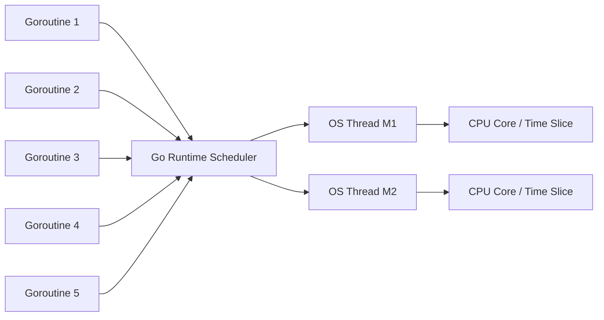

Go scheduler bukan hanya optimisasi performa. Ia adalah bagian dari programming model Go.

---

## 4. Perbandingan Mental Model Java vs Go

### 4.1 Java classic thread model

Di Java klasik:

```java
new Thread(() -> work()).start();
```

biasanya berarti satu Java thread dipetakan ke satu OS thread.

Dengan thread pool:

```java
ExecutorService executor = Executors.newFixedThreadPool(32);
executor.submit(task);
```

Anda secara eksplisit membatasi jumlah OS thread pekerja.

### 4.2 Java virtual thread model

Dengan Java virtual threads:

```java
Thread.startVirtualThread(() -> work());
```

banyak virtual thread dimultiplex ke carrier OS threads.

Ini lebih dekat ke model Go, tetapi tetap berbeda dalam API, scheduler behavior, blocking semantics, runtime trade-off, dan ekosistem library.

### 4.3 Go model

Di Go:

```go
go work()
```

Anda tidak memilih thread pool secara eksplisit. Anda membuat goroutine. Runtime yang mengatur pemetaan goroutine ke OS thread.

Perbandingan ringkas:

| Aspek | Java platform thread | Java virtual thread | Go goroutine |
|---|---:|---:|---:|
| Unit concurrency | `Thread` | virtual `Thread` | goroutine |
| Mapping ke OS thread | umumnya 1:1 | many-to-few | many-to-few |
| Scheduler utama | OS | JVM + OS | Go runtime + OS |
| Lifecycle cancellation | interrupt/convention | interrupt/convention | context/convention |
| Common coordination | locks, queues, futures | locks, structured concurrency APIs | channel, `sync`, context |
| Runtime pool control | executor | scheduler/carrier | G/M/P + `GOMAXPROCS` |
| Idiom dasar | submit task | spawn virtual thread | `go f()` |

Hal yang perlu ditekankan:

> Goroutine bukan thread pool task biasa. Goroutine adalah eksekusi function concurrent yang dikelola runtime, dengan stack sendiri, state sendiri, dan lifecycle yang harus Anda desain.

---

## 5. G/M/P: Struktur Inti Scheduler Go

Dokumentasi runtime Go menjelaskan tiga resource utama scheduler:

- **G**: goroutine.
- **M**: machine, yaitu OS thread.
- **P**: processor, resource yang dibutuhkan untuk menjalankan Go code.

### 5.1 G — Goroutine

G adalah unit work yang dijadwalkan.

Satu G berisi metadata seperti:

- stack goroutine,
- instruction pointer,
- state,
- informasi blocking/waiting,
- relasi dengan M saat running,
- informasi scheduler internal lainnya.

Secara mental:

```text
G = "pekerjaan yang bisa dieksekusi"
```

Contoh:

```go
go func() {
    processOrder(ctx, orderID)
}()
```

Function anonymous itu menjadi sebuah G.

### 5.2 M — Machine / OS Thread

M adalah OS thread yang benar-benar dieksekusi oleh kernel.

Secara mental:

```text
M = "kendaraan OS-level yang menjalankan instruksi CPU"
```

M bisa:

- menjalankan Go code jika memegang P,
- masuk syscall,
- block di kernel,
- menjalankan cgo,
- idle,
- park.

### 5.3 P — Processor

P adalah resource runtime yang diperlukan M untuk menjalankan Go code.

Secara mental:

```text
P = "izin/scheduling context untuk menjalankan Go code"
```

Jumlah P dikontrol oleh `GOMAXPROCS`.

Kalau:

```go
runtime.GOMAXPROCS(4)
```

maka runtime punya 4 P.

P juga menyimpan resource scheduler seperti:

- local run queue,
- timer heap tertentu,
- cache allocator runtime,
- scheduler-local state lain.

### 5.4 Relasi G/M/P

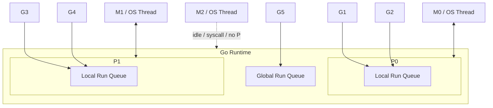

Sebuah M harus terasosiasi dengan P untuk menjalankan G.

---

## 6. Jangan Samakan P Dengan CPU Core

Ini salah satu jebakan paling umum.

`GOMAXPROCS` menentukan jumlah P, yaitu jumlah maksimum thread yang menjalankan Go code secara simultan.

Tetapi P bukan CPU core fisik.

Hubungannya:

```text
GOMAXPROCS -> jumlah P -> batas paralel Go code
OS scheduler -> memetakan OS thread ke CPU core/time slice
CPU/cgroup -> menyediakan actual CPU time
```

Diagram:

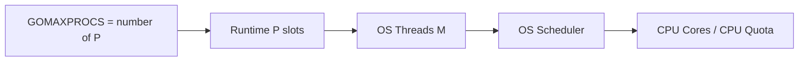

Contoh:

- Host punya 16 CPU core.
- Container punya CPU limit 2 core.
- `GOMAXPROCS=16`.

Secara runtime, Go mungkin mencoba menjalankan sampai 16 thread Go-code secara paralel. Tetapi container hanya punya quota 2 CPU. Akibatnya OS/cgroup akan throttle. P99 latency bisa memburuk.

Sejak Go 1.25, default `GOMAXPROCS` menjadi lebih sadar container CPU limit. Ini penting untuk production Kubernetes.

---

## 7. State Goroutine Dari Sudut Scheduler

Goroutine tidak hanya “hidup” atau “mati”. Ia berada dalam state scheduling tertentu.

Mental model utama:

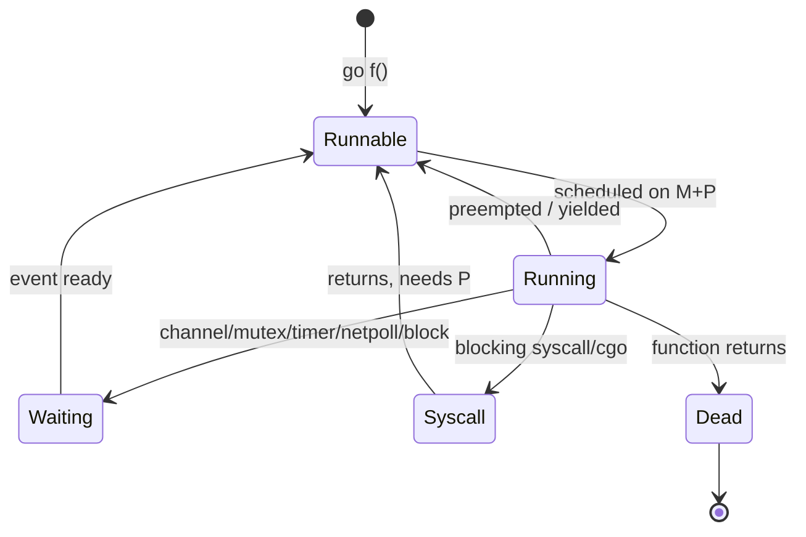

### 7.1 Runnable

Goroutine siap jalan tetapi belum mendapat slot eksekusi.

Gejala banyak runnable goroutine:

- CPU penuh atau P terbatas.
- Work queue terlalu besar.
- Fan-out tidak dibatasi.
- `GOMAXPROCS` terlalu kecil untuk CPU-bound workload.
- Container CPU quota terlalu kecil.

### 7.2 Running

Goroutine sedang dieksekusi oleh M yang memegang P.

Jumlah goroutine running Go code kira-kira dibatasi oleh jumlah P.

### 7.3 Waiting

Goroutine sedang menunggu event:

- receive channel,
- send channel,
- mutex,
- cond,
- timer,
- network readiness,
- GC assist atau runtime wait tertentu.

Waiting tidak selalu buruk. Service I/O-bound normalnya punya banyak goroutine waiting.

### 7.4 Syscall

Goroutine masuk syscall blocking atau cgo. M yang membawanya bisa block di kernel.

Runtime dapat melepas P dari M tersebut agar P bisa dipakai M lain menjalankan goroutine lain.

Ini salah satu alasan Go bisa tetap efisien saat beberapa goroutine melakukan blocking syscall.

### 7.5 Dead

Function goroutine selesai. Resource goroutine dapat direklamasi runtime.

---

## 8. Local Run Queue dan Global Run Queue

Scheduler Go tidak menyimpan semua runnable goroutine di satu queue global saja.

Setiap P punya **local run queue**.

Ada juga **global run queue**.

### 8.1 Kenapa perlu local run queue?

Kalau semua goroutine runnable masuk satu global queue, maka setiap scheduling decision bisa menyebabkan contention global lock.

Dengan local run queue:

- scheduling lebih cache-friendly,
- contention lebih rendah,
- P dapat mengambil goroutine dari queue lokal sendiri,
- throughput lebih baik.

### 8.2 Kenapa tetap perlu global run queue?

Global queue tetap dibutuhkan untuk balancing dan beberapa jalur scheduling tertentu.

Misalnya:

- goroutine yang dibuat atau diready-kan dari konteks tertentu,
- fairness agar global runnable work tidak kelaparan,
- redistribusi work.

### 8.3 Diagram sederhana

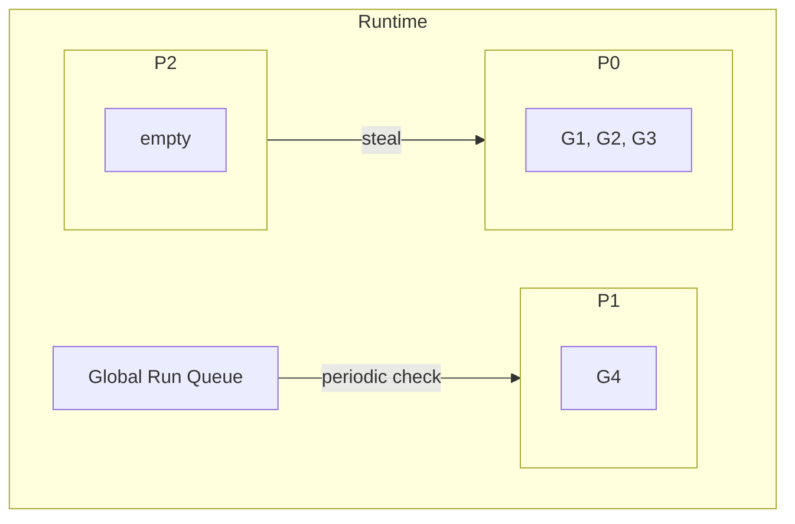

---

## 9. Work Stealing

Work stealing adalah mekanisme balancing.

Jika sebuah P kehabisan goroutine runnable di local queue-nya, ia dapat mencoba mengambil work dari P lain.

Mental model:

```text
P kosong tidak langsung idle.
P mencoba mencari work:
1. local run queue sendiri
2. global run queue
3. network poller
4. steal dari P lain
5. idle/park jika tidak ada work
```

Diagram:

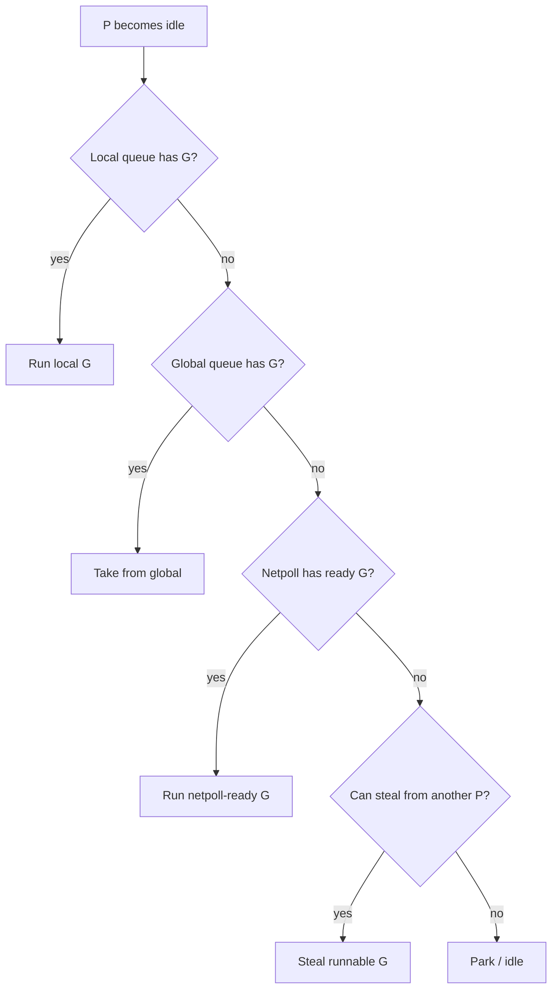

Work stealing penting karena fan-out sering membuat distribusi work tidak rata.

Contoh:

```go
for _, item := range items {
    go process(item)
}
```

Goroutine bisa muncul dari satu P. Tanpa balancing, satu P penuh, P lain kosong. Work stealing membantu menyebarkan runnable goroutines.

---

## 10. Scheduling Bukan Fairness Sempurna

Engineer sering mengira scheduler berarti semua goroutine otomatis mendapat giliran adil.

Realitanya:

- Scheduler berusaha efisien dan cukup fair.
- Bukan real-time scheduler.
- Tidak menjamin fairness absolut antar goroutine.
- Tidak menjamin latency tertentu.
- Goroutine runnable bisa menunggu lama jika sistem overload.

Jika sistem Anda bergantung pada fairness ketat, desainnya harus eksplisit:

- per-tenant queue,
- priority queue,
- weighted fair scheduling,
- rate limit per class,
- bounded worker pool,
- admission control.

Go scheduler bukan pengganti desain fairness domain.

---

## 11. Preemption: Menghentikan Goroutine Yang Terlalu Lama Running

Preemption adalah kemampuan runtime menghentikan sementara goroutine running agar goroutine lain atau GC bisa maju.

### 11.1 Kenapa preemption penting?

Misalnya:

```go
for {
    // tight CPU loop
}
```

Kalau goroutine seperti ini tidak bisa dipreempt, ia bisa memonopoli P.

Dampaknya:

- goroutine lain tidak mendapat giliran,
- timer delay,
- GC delay,
- latency spike,
- service terlihat hidup tapi tidak responsif.

### 11.2 Cooperative vs asynchronous preemption

Secara historis, banyak preemption terjadi pada safe point seperti function call.

Go 1.14 memperkenalkan asynchronous preemption sehingga loop tanpa function call tidak lagi seburuk sebelumnya untuk scheduler dan GC latency.

Mental model:

```text
Dulu: goroutine lebih sering berhenti di titik kooperatif.
Sekarang: runtime punya mekanisme lebih kuat untuk menghentikan goroutine CPU-bound di safe point tertentu.
```

Tetapi bukan berarti Anda boleh membuat busy loop sembarangan.

### 11.3 Busy loop tetap buruk

Contoh buruk:

```go
for {
    select {
    default:
        // do nothing
    }
}
```

Ini membakar CPU.

Lebih baik:

```go
for {
    select {
    case <-ctx.Done():
        return
    case item := <-ch:
        process(item)
    }
}
```

Atau jika memang polling:

```go
for {
    if workAvailable() {
        process()
        continue
    }

    select {
    case <-ctx.Done():
        return
    case <-time.After(10 * time.Millisecond):
    }
}
```

Namun `time.After` dalam loop juga perlu hati-hati karena membuat timer baru setiap iterasi. Dalam path panas, gunakan timer reusable.

---

## 12. Syscall Handling

Saat goroutine melakukan syscall blocking, OS thread dapat block.

Contoh:

```go
file.Read(buf)
```

atau operasi OS tertentu.

Jika M yang sedang menjalankan G masuk blocking syscall, runtime tidak ingin P ikut terbuang. Maka runtime bisa melepaskan P agar P dipakai M lain.

Diagram:

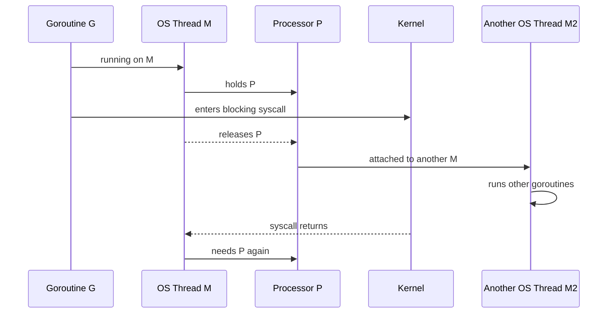

Konsekuensinya:

- OS thread count bisa lebih besar daripada `GOMAXPROCS`.
- `GOMAXPROCS` membatasi Go code running, bukan total OS thread dalam process.
- Banyak blocking syscall/cgo dapat membuat thread count naik.

---

## 13. Network Poller

Go network I/O tidak selalu memblokir OS thread untuk setiap connection.

Runtime menggunakan network poller berbasis fasilitas OS seperti epoll/kqueue/IOCP tergantung platform.

Mental model:

```text
Goroutine mencoba read network.
Jika data belum tersedia:
  goroutine dipark.
  fd didaftarkan ke netpoller.
  M/P bisa menjalankan goroutine lain.
Saat fd ready:
  goroutine dibuat runnable lagi.
```

Diagram:

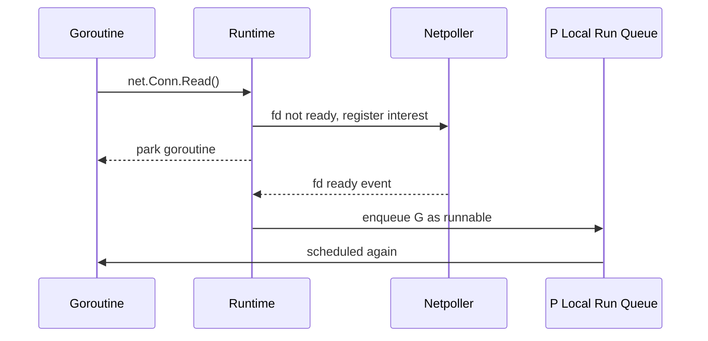

Implikasi:

- Banyak koneksi idle tidak berarti banyak OS thread blocked.
- HTTP server Go cocok untuk goroutine-per-request model.
- Tetapi goroutine-per-request tetap bisa overload jika downstream, DB pool, atau CPU tidak dibatasi.

---

## 14. Timer dan Scheduler

Timer memengaruhi scheduler karena timer dapat membuat goroutine waiting menjadi runnable.

Contoh:

```go
select {
case <-ctx.Done():
    return ctx.Err()
case <-time.After(200 * time.Millisecond):
    return ErrTimeout
}
```

Timer event akan membangunkan goroutine setelah durasi tertentu.

Masalah umum:

1. Terlalu banyak timer dibuat di hot path.
2. `time.After` dalam loop panjang.
3. Ticker tidak di-stop.
4. Deadline tidak dipropagasikan, sehingga timer lokal tidak selaras dengan request budget.

Contoh ticker leak:

```go
func start() {
    ticker := time.NewTicker(time.Second)
    go func() {
        for range ticker.C {
            doWork()
        }
    }()
    // ticker tidak pernah Stop, goroutine tidak punya cancellation
}
```

Versi lebih benar:

```go
func start(ctx context.Context) {
    ticker := time.NewTicker(time.Second)
    go func() {
        defer ticker.Stop()
        for {
            select {
            case <-ctx.Done():
                return
            case <-ticker.C:
                doWork()
            }
        }
    }()
}
```

---

## 15. Channel Blocking Dalam Scheduler

Saat goroutine melakukan receive dari channel kosong:

```go
v := <-ch
```

jika tidak ada value, goroutine dipark.

Saat goroutine melakukan send ke channel penuh:

```go
ch <- v
```

jika tidak ada kapasitas atau receiver, goroutine juga dipark.

Diagram unbuffered channel:

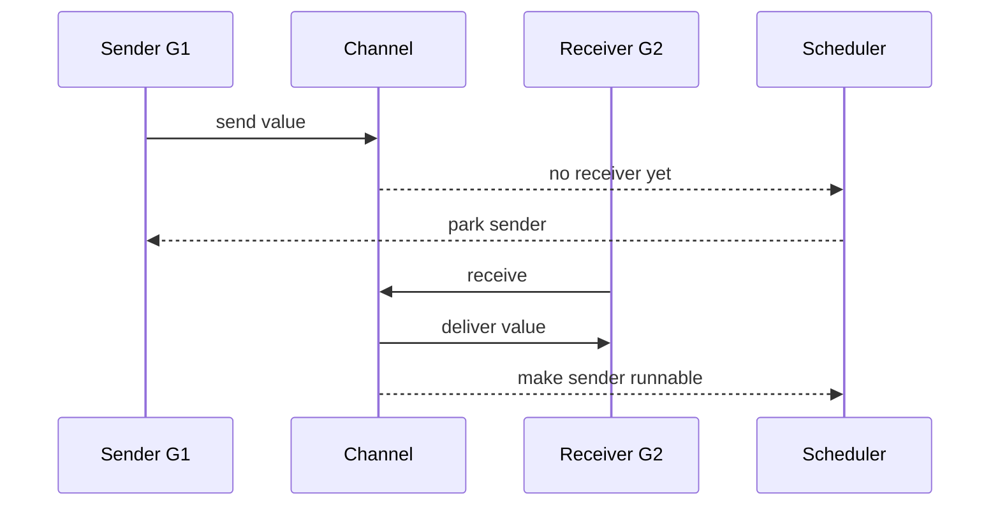

Channel bukan hanya data structure. Channel juga scheduling point.

Ini penting karena channel dapat:

- menyinkronkan goroutine,
- memindahkan ownership data,
- memberi backpressure,
- menyebabkan deadlock,
- menyebabkan goroutine leak,
- menjadi contention point.

---

## 16. Mutex Blocking Dalam Scheduler

Saat goroutine gagal mendapatkan mutex:

```go
mu.Lock()
```

ia dapat masuk waiting sampai mutex tersedia.

Contoh:

```go
var mu sync.Mutex
var count int

func inc() {
    mu.Lock()
    defer mu.Unlock()
    count++
}
```

Jika critical section terlalu lama, banyak goroutine bisa menumpuk.

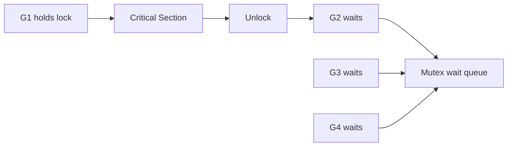

Gejala runtime:

- goroutine dump banyak `sync.runtime_SemacquireMutex`,
- mutex profile menunjukkan contention,
- CPU mungkin tidak penuh,
- latency naik karena waiting, bukan CPU execution.

---

## 17. Scheduler dan Garbage Collector

Scheduler dan GC berinteraksi erat.

Beberapa hal penting:

1. GC perlu melihat goroutine stack.
2. GC perlu safe point.
3. Banyak goroutine berarti lebih banyak stack metadata yang harus diperhatikan.
4. Banyak alokasi dari goroutine concurrent dapat meningkatkan GC pressure.
5. CPU-bound goroutine yang sulit dipreempt dapat mengganggu GC latency.

Go 1.26 mengaktifkan Green Tea GC secara default. Perubahan GC ini tidak mengubah prinsip scheduler G/M/P, tetapi dapat memengaruhi overhead runtime pada workload GC-heavy.

Mental model:

```text
Concurrency increases live work.
Live work often increases live memory.
Live memory increases GC involvement.
GC and scheduler share CPU budget.
```

Jadi saat latency buruk, jangan hanya lihat goroutine count. Lihat juga:

- allocation rate,
- heap growth,
- GC cycles,
- CPU throttling,
- runnable goroutine count,
- mutex/block profile.

---

## 18. Scheduler dan `GOMAXPROCS`

`GOMAXPROCS` menentukan jumlah P.

```go
fmt.Println(runtime.GOMAXPROCS(0))
```

mengembalikan setting saat ini.

### 18.1 CPU-bound workload

Untuk CPU-bound workload, `GOMAXPROCS` sangat menentukan parallelism.

Contoh:

```go
func cpuWork(n int) int {
    total := 0
    for i := 0; i < n; i++ {
        total += i * i
    }
    return total
}
```

Jika Anda menjalankan 100 goroutine CPU-bound dengan `GOMAXPROCS=4`, hanya sekitar 4 goroutine yang benar-benar menjalankan Go code secara bersamaan.

Sisanya runnable, menunggu giliran.

### 18.2 I/O-bound workload

Untuk I/O-bound workload, jumlah goroutine bisa jauh lebih besar dari `GOMAXPROCS` karena banyak goroutine berada dalam waiting state.

Contoh HTTP server:

- 1.000 request concurrent.
- Banyak request menunggu DB/network.
- Hanya sebagian yang running CPU pada saat tertentu.

Ini normal.

Tetapi jika semua request melakukan CPU-heavy JSON processing besar, compression, crypto, atau protobuf encode/decode berat, runnable queue dapat meledak.

### 18.3 Container-aware default

Sejak Go 1.25, runtime memperhitungkan CPU limit container untuk default `GOMAXPROCS`. Ini membantu mencegah Go runtime menjalankan terlalu banyak thread Go-code dibanding CPU quota container.

Namun ini bukan pengganti capacity planning.

Anda tetap harus memahami:

- CPU request,
- CPU limit,
- throttling,
- HPA behavior,
- worker pool sizing,
- downstream capacity.

---

## 19. Thread Count Bisa Lebih Besar Dari GOMAXPROCS

Kesalahan umum:

> “Kalau GOMAXPROCS=4, process hanya punya 4 thread.”

Salah.

`GOMAXPROCS=4` berarti maksimal 4 M menjalankan Go code secara paralel. Tetapi total OS thread bisa lebih banyak karena:

- syscall blocking,
- cgo,
- locked OS thread,
- runtime background threads,
- profiler/signal handling,
- OS-specific runtime needs.

Contoh:

```go
runtime.LockOSThread()
```

membuat goroutine terikat pada OS thread tertentu. Ini diperlukan untuk kasus khusus seperti GUI thread, thread-local state C library, atau namespace manipulation tertentu, tetapi harus dipakai hati-hati.

---

## 20. `runtime.LockOSThread`: Kapan Relevan?

Sebagian besar aplikasi server tidak perlu `runtime.LockOSThread`.

Gunakan hanya ketika benar-benar perlu OS thread affinity, misalnya:

- library C yang bergantung pada thread-local state,
- operasi OS yang harus terjadi di thread tertentu,
- GUI toolkit tertentu,
- namespace operations tertentu di Linux.

Anti-pattern:

```go
func handler(w http.ResponseWriter, r *http.Request) {
    runtime.LockOSThread()
    defer runtime.UnlockOSThread()
    // regular business logic
}
```

Ini hampir selalu buruk untuk server biasa.

Thread affinity mengurangi fleksibilitas scheduler.

---

## 21. Spinning, Parking, dan Wakeup

Scheduler harus menyeimbangkan dua biaya:

1. Kalau thread langsung tidur saat tidak ada work, wakeup bisa lambat.
2. Kalau thread terus spinning mencari work, CPU terbuang.

Runtime menggunakan strategi internal untuk spinning/parking M.

Mental model:

```text
Ada sedikit spinning untuk respons cepat.
Terlalu banyak spinning buruk karena membakar CPU.
Tidak ada spinning sama sekali bisa menambah latency wakeup.
```

Sebagai application engineer, Anda tidak mengatur detail ini langsung. Tetapi Anda perlu memahami gejalanya:

- CPU naik padahal throughput tidak naik.
- Banyak goroutine runnable.
- Banyak goroutine waiting tetapi latency tetap tinggi.
- Thread count naik.
- Trace menunjukkan scheduling delay.

---

## 22. Scheduling Delay

Scheduling delay adalah waktu antara goroutine menjadi runnable dan benar-benar running.

Contoh:

```text
T0: network response ready -> goroutine runnable
T1: goroutine scheduled on M+P -> running
Scheduling delay = T1 - T0
```

Scheduling delay bisa naik karena:

- CPU saturated,
- `GOMAXPROCS` terlalu kecil,
- container CPU throttling,
- terlalu banyak runnable goroutine,
- long-running CPU goroutines,
- GC pressure,
- OS-level contention.

Ini sangat penting untuk p99 latency.

Request bisa lambat bukan karena DB lambat, tetapi karena goroutine yang sudah siap lanjut harus menunggu dijadwalkan.

---

## 23. Runtime Trace: Cara Melihat Scheduler

`pprof` bagus untuk CPU dan memory. Tetapi untuk concurrency timeline, `runtime/trace` sering lebih tajam.

Contoh membuat trace di test atau program:

```go
package main

import (
    "os"
    "runtime/trace"
)

func main() {
    f, err := os.Create("trace.out")
    if err != nil {
        panic(err)
    }
    defer f.Close()

    if err := trace.Start(f); err != nil {
        panic(err)
    }
    defer trace.Stop()

    runWorkload()
}
```

Lalu:

```bash
go tool trace trace.out
```

Hal yang dicari:

- goroutine creation bursts,
- goroutine blocking reason,
- network blocking,
- syscall blocking,
- scheduler latency,
- processor utilization,
- STW/GC events,
- long-running goroutines,
- imbalance antar P.

### 23.1 Trace vs pprof

| Tool | Cocok untuk | Kurang cocok untuk |
|---|---|---|
| CPU pprof | fungsi yang memakai CPU | waiting/blocking timeline |
| Heap pprof | memory allocation/retention | scheduling delay |
| Goroutine profile | snapshot blocked goroutine | historical timeline |
| Block profile | blocking contention | full causal timeline |
| Mutex profile | lock contention | network/timer/syscall timeline |
| Runtime trace | scheduler timeline | long-term always-on observability |

---

## 24. Go 1.26 Scheduler Metrics

Go 1.26 menambahkan beberapa metric scheduler di `runtime/metrics`, termasuk:

- counts goroutine dalam berbagai state di bawah prefix `/sched/goroutines`,
- jumlah OS thread yang runtime ketahui: `/sched/threads:threads`,
- total goroutine yang pernah dibuat: `/sched/goroutines-created:goroutines`.

Ini penting karena sebelumnya banyak aplikasi hanya memonitor `runtime.NumGoroutine()`, yang terlalu kasar.

### 24.1 Membaca runtime metrics

Contoh:

```go
package main

import (
    "fmt"
    "runtime/metrics"
)

func main() {
    samples := []metrics.Sample{
        {Name: "/sched/goroutines:goroutines"},
        {Name: "/sched/threads:threads"},
        {Name: "/sched/goroutines-created:goroutines"},
    }

    metrics.Read(samples)

    for _, s := range samples {
        fmt.Printf("%s = %v\n", s.Name, s.Value)
    }
}
```

Catatan: nama metric harus dicek dengan `metrics.All()` untuk versi Go yang digunakan, karena detail metric dapat berkembang.

Contoh eksplorasi:

```go
for _, d := range metrics.All() {
    if strings.HasPrefix(d.Name, "/sched/") {
        fmt.Println(d.Name, d.Description)
    }
}
```

### 24.2 Kenapa `NumGoroutine` tidak cukup?

`runtime.NumGoroutine()` hanya memberi total goroutine live.

Total 10.000 goroutine bisa berarti:

1. Banyak idle websocket connection, normal.
2. Banyak request stuck menunggu DB, buruk.
3. Banyak goroutine leak menunggu channel yang tidak pernah ditutup, buruk.
4. Banyak runnable CPU tasks, overload.

Anda butuh state, bukan hanya count.

---

## 25. Membaca Goroutine Dump Dari Perspektif Scheduler

Goroutine dump sering menunjukkan state seperti:

```text
goroutine 123 [chan receive]:
```

Artinya goroutine waiting menerima channel.

Contoh umum:

| Dump state | Makna kasar | Kemungkinan masalah |
|---|---|---|
| `[running]` | sedang jalan | normal jika sedikit |
| `[runnable]` | siap tapi belum jalan | CPU saturation / quota / too much work |
| `[chan receive]` | menunggu receive | normal atau leak |
| `[chan send]` | menunggu send | backpressure atau deadlock |
| `[select]` | menunggu select | normal atau lifecycle leak |
| `[sync.Mutex.Lock]` / semacquire | menunggu lock | contention |
| `[IO wait]` | menunggu network I/O | normal untuk server I/O-bound |
| `[syscall]` | block di syscall | periksa OS/file/cgo |

Contoh interpretasi:

```text
Banyak goroutine [runnable]
+ CPU near limit
+ p99 naik
= kemungkinan CPU saturated atau container throttling.
```

```text
Banyak goroutine [chan send]
+ queue channel penuh
+ consumer lambat
= backpressure bekerja atau downstream bottleneck.
```

```text
Banyak goroutine [select]
+ jumlah terus naik
+ tidak turun setelah traffic turun
= kemungkinan goroutine leak.
```

---

## 26. Scheduler-Aware Design Principle

Prinsip utama:

> Scheduler membuat concurrency murah, bukan tak terbatas.

Setiap goroutine harus punya:

1. Owner.
2. Alasan hidup.
3. Cara selesai.
4. Batas resource.
5. Observability.

### 26.1 Goroutine tanpa owner

Buruk:

```go
func Handle(w http.ResponseWriter, r *http.Request) {
    go sendAudit(r.Context(), eventFrom(r))
    w.WriteHeader(http.StatusAccepted)
}
```

Masalah:

- Menggunakan request context yang bisa cancel saat handler return.
- Tidak ada wait.
- Tidak ada retry strategy.
- Tidak ada backpressure.
- Tidak ada shutdown coordination.
- Jika audit lambat, goroutine bisa menumpuk.

Lebih baik: kirim ke bounded background queue dengan lifecycle service.

```go
type AuditService struct {
    jobs chan AuditEvent
    wg   sync.WaitGroup
}

func (s *AuditService) Enqueue(ctx context.Context, ev AuditEvent) error {
    select {
    case s.jobs <- ev:
        return nil
    case <-ctx.Done():
        return ctx.Err()
    default:
        return ErrAuditQueueFull
    }
}
```

Ini bukan sekadar code style. Ini membuat scheduler pressure menjadi bounded.

---

## 27. Anti-Pattern: Goroutine Per Item Tanpa Bound

Contoh buruk:

```go
func ProcessAll(items []Item) error {
    var wg sync.WaitGroup
    for _, item := range items {
        wg.Add(1)
        go func() {
            defer wg.Done()
            process(item)
        }()
    }
    wg.Wait()
    return nil
}
```

Selain bug capture pada versi Go lama/tertentu tergantung bentuk loop, masalah desainnya adalah unbounded fan-out.

Jika `items` berisi 1.000.000 item:

- 1.000.000 goroutine dibuat,
- memory naik,
- scheduler overhead naik,
- downstream bisa overload,
- cancellation susah,
- p99 buruk.

Lebih baik bounded worker pool:

```go
func ProcessAll(ctx context.Context, items []Item, workers int) error {
    jobs := make(chan Item)
    var wg sync.WaitGroup

    for i := 0; i < workers; i++ {
        wg.Add(1)
        go func() {
            defer wg.Done()
            for item := range jobs {
                process(item)
            }
        }()
    }

    for _, item := range items {
        select {
        case jobs <- item:
        case <-ctx.Done():
            close(jobs)
            wg.Wait()
            return ctx.Err()
        }
    }

    close(jobs)
    wg.Wait()
    return nil
}
```

Ini belum sempurna karena error propagation belum ada, tetapi sudah bounded.

---

## 28. Anti-Pattern: Default Select Busy Loop

Buruk:

```go
for {
    select {
    case msg := <-ch:
        handle(msg)
    default:
    }
}
```

Jika channel kosong, loop terus berjalan dan membakar CPU.

Lebih baik block sampai ada event:

```go
for {
    select {
    case msg := <-ch:
        handle(msg)
    case <-ctx.Done():
        return
    }
}
```

`default` dalam select cocok untuk non-blocking operation tertentu, tetapi berbahaya di loop tanpa pacing.

---

## 29. Anti-Pattern: Mengira Waiting Goroutine Selalu Murah

Goroutine waiting memang lebih murah daripada OS thread blocking, tetapi tetap punya biaya:

- stack,
- metadata,
- references yang menahan memory,
- wakeup cost,
- scheduler bookkeeping,
- debugging complexity.

Misalnya 100.000 goroutine waiting pada channel mungkin masih bisa berjalan di beberapa kasus, tetapi apakah benar desainnya tepat?

Pertanyaan yang harus diajukan:

- Apakah semua goroutine punya owner?
- Apakah jumlahnya bounded?
- Apakah ada cancellation?
- Apakah references yang ditahan besar?
- Apakah goroutine count turun setelah traffic turun?
- Apakah pprof menunjukkan retention dari closure goroutine?

---

## 30. Scheduler dan Backpressure

Scheduler bukan backpressure mechanism domain.

Jika request masuk lebih cepat dari kapasitas proses, scheduler hanya akan:

- membuat lebih banyak goroutine runnable/waiting,
- menambah queue implicit,
- meningkatkan memory,
- meningkatkan scheduling delay,
- memperburuk tail latency.

Backpressure harus didesain eksplisit:

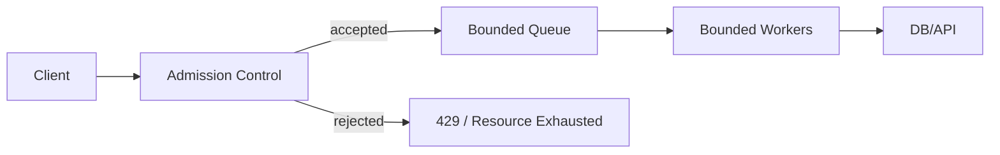

Tanpa admission control:

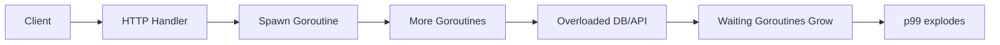

---

## 31. Scheduler dan Kubernetes CPU Throttling

Di Kubernetes, CPU limit dapat menyebabkan throttling.

Misalnya container punya limit 500m CPU. Itu berarti kira-kira setengah CPU core quota.

Jika aplikasi Go mencoba menjalankan terlalu banyak Go-code parallel, cgroup dapat membatasi CPU time.

Dampak:

- goroutine runnable menumpuk,
- request yang siap lanjut tertunda,
- timer terlambat,
- p99 naik,
- retry dari client meningkat,
- overload makin parah.

### 31.1 Go 1.25+ membantu, tapi tidak menyelesaikan semua

Container-aware `GOMAXPROCS` membantu default runtime lebih sesuai CPU limit.

Tetapi tetap ada kasus yang harus Anda desain:

- workload I/O-bound tapi downstream kecil,
- DB pool lebih kecil dari request concurrency,
- CPU spike dari JSON/compression/crypto,
- HPA scale-out lambat,
- retry storm,
- noisy neighbor,
- burst traffic.

### 31.2 Checklist Kubernetes

Untuk service Go di Kubernetes, pantau:

- CPU usage,
- CPU throttling time/periods,
- goroutine count by state,
- OS thread count,
- request concurrency,
- queue depth,
- DB pool wait count,
- p95/p99 latency,
- retry count,
- GC pause/CPU,
- runnable goroutine metric.

---

## 32. Java Engineer Translation Table

| Java concept | Go equivalent-ish | Catatan |
|---|---|---|
| OS thread | M | M adalah OS thread runtime, tidak langsung dikontrol umum |
| Executor worker | M+P running G | Go tidak umum memakai executor untuk goroutine biasa |
| Runnable task | G runnable | G siap jalan di run queue |
| Thread pool size | `GOMAXPROCS` + worker design | `GOMAXPROCS` bukan worker pool app |
| BlockingQueue | channel / custom queue | Channel juga synchronization primitive |
| `Thread.sleep` | `time.Sleep` | Parking goroutine, bukan OS thread busy |
| Lock contention | `sync.Mutex` contention | Lihat mutex profile |
| CompletableFuture fan-out | goroutine + errgroup/channel | Perlu cancellation eksplisit |
| Virtual threads | goroutines | Mirip high-level, berbeda runtime/API |
| ForkJoin work stealing | scheduler work stealing | Go scheduler internal, bukan API langsung |

---

## 33. Production Diagnostic Playbook

### 33.1 Symptom: p99 latency naik, CPU tinggi

Kemungkinan:

- CPU-bound workload overload.
- `GOMAXPROCS` terlalu rendah atau CPU limit terlalu rendah.
- Too many runnable goroutines.
- GC pressure.
- Busy loop.

Investigasi:

1. CPU profile.
2. Runtime trace.
3. Scheduler metrics.
4. CPU throttling metrics.
5. Goroutine dump: banyak `[runnable]`?
6. Allocation profile.

### 33.2 Symptom: p99 latency naik, CPU rendah

Kemungkinan:

- lock contention,
- channel blocking,
- DB pool saturation,
- downstream slow,
- hidden queue,
- goroutine leak waiting,
- network I/O wait.

Investigasi:

1. Goroutine dump.
2. Block profile.
3. Mutex profile.
4. DB pool stats.
5. HTTP client transport stats if available.
6. Trace.

### 33.3 Symptom: goroutine count naik terus

Kemungkinan:

- leak,
- long-lived connections,
- unbounded queue,
- stuck channel send/receive,
- missing context cancellation,
- ticker leak,
- background worker not stopped.

Investigasi:

1. Goroutine profile/dump over time.
2. Compare stack signatures.
3. Check request lifecycle.
4. Check channel ownership.
5. Check background goroutine startup.
6. In Go 1.26, evaluate experimental goroutine leak profile if applicable.

### 33.4 Symptom: OS thread count naik

Kemungkinan:

- blocking syscalls,
- cgo,
- `LockOSThread`,
- DNS resolver behavior,
- profiler/runtime threads,
- stuck kernel calls.

Investigasi:

1. `/sched/threads:threads` metric.
2. Goroutine dump syscall states.
3. pprof/threadcreate if relevant.
4. cgo usage.
5. OS-level thread view.

---

## 34. Mini Lab 1: Melihat GOMAXPROCS dan Goroutine Count

Buat file:

```go
package main

import (
    "fmt"
    "runtime"
    "time"
)

func main() {
    fmt.Println("GOMAXPROCS:", runtime.GOMAXPROCS(0))
    fmt.Println("goroutines:", runtime.NumGoroutine())

    for i := 0; i < 1000; i++ {
        go func() {
            time.Sleep(10 * time.Second)
        }()
    }

    fmt.Println("goroutines after spawn:", runtime.NumGoroutine())
    time.Sleep(11 * time.Second)
    fmt.Println("goroutines after sleep:", runtime.NumGoroutine())
}
```

Observasi:

- 1000 goroutine dibuat.
- Tidak berarti 1000 OS thread.
- Mayoritas goroutine waiting pada timer.
- Setelah selesai, goroutine count turun.

---

## 35. Mini Lab 2: Runnable Pressure

```go
package main

import (
    "fmt"
    "runtime"
    "sync"
    "time"
)

func burn(stop <-chan struct{}, wg *sync.WaitGroup) {
    defer wg.Done()
    var x uint64
    for {
        select {
        case <-stop:
            return
        default:
            x++
            if x == 0 {
                fmt.Println("impossible")
            }
        }
    }
}

func main() {
    fmt.Println("GOMAXPROCS:", runtime.GOMAXPROCS(0))

    stop := make(chan struct{})
    var wg sync.WaitGroup

    for i := 0; i < runtime.GOMAXPROCS(0)*4; i++ {
        wg.Add(1)
        go burn(stop, &wg)
    }

    time.Sleep(5 * time.Second)
    close(stop)
    wg.Wait()
}
```

Eksperimen:

```bash
GOMAXPROCS=1 go run .
GOMAXPROCS=2 go run .
GOMAXPROCS=4 go run .
```

Observasi:

- Jumlah goroutine CPU-bound lebih banyak dari P.
- Banyak goroutine runnable menunggu giliran.
- CPU akan tinggi.
- Pada container CPU kecil, ini dapat menyebabkan throttling.

---

## 36. Mini Lab 3: Channel Blocking Dump

```go
package main

import (
    "net/http"
    _ "net/http/pprof"
)

func main() {
    ch := make(chan int)

    for i := 0; i < 1000; i++ {
        go func() {
            <-ch
        }()
    }

    http.ListenAndServe(":6060", nil)
}
```

Jalankan:

```bash
go run .
```

Ambil goroutine dump:

```bash
curl http://localhost:6060/debug/pprof/goroutine?debug=2
```

Anda akan melihat banyak goroutine blocked pada channel receive.

Pertanyaan:

- Apakah ini leak?
- Siapa owner channel?
- Kapan channel ditutup?
- Apakah goroutine punya cancellation?

---

## 37. Mini Lab 4: Trace Scheduler

```go
package main

import (
    "os"
    "runtime/trace"
    "sync"
)

func cpu(n int) int {
    total := 0
    for i := 0; i < n; i++ {
        total += i * i
    }
    return total
}

func main() {
    f, err := os.Create("trace.out")
    if err != nil {
        panic(err)
    }
    defer f.Close()

    if err := trace.Start(f); err != nil {
        panic(err)
    }

    var wg sync.WaitGroup
    for i := 0; i < 100; i++ {
        wg.Add(1)
        go func() {
            defer wg.Done()
            _ = cpu(50_000_000)
        }()
    }
    wg.Wait()

    trace.Stop()
}
```

Lalu:

```bash
go tool trace trace.out
```

Cari:

- berapa P aktif,
- goroutine runnable/running,
- scheduling delay,
- processor utilization,
- apakah work tersebar rata.

---

## 38. Design Heuristics Level Senior

### 38.1 Jangan optimalkan scheduler sebelum membatasi work

Jika sistem overload karena unbounded goroutine, men-tune `GOMAXPROCS` bukan solusi utama.

Solusi utama:

- bounded queue,
- worker pool,
- admission control,
- cancellation,
- deadline,
- load shedding.

### 38.2 Jangan jadikan goroutine sebagai queue

Buruk:

```go
for _, event := range events {
    go processEventually(event)
}
```

Goroutine yang menunggu sebenarnya menjadi queue tersembunyi.

Lebih baik queue eksplisit:

```go
jobs := make(chan Event, 1000)
```

Dengan policy saat penuh.

### 38.3 Runnable goroutine adalah sinyal overload CPU

Jika banyak goroutine runnable, mereka siap jalan tapi tidak mendapat CPU/P.

Pertanyaan:

- Apakah CPU penuh?
- Apakah container throttled?
- Apakah CPU work terlalu banyak?
- Apakah fan-out terlalu besar?
- Apakah `GOMAXPROCS` sesuai?

### 38.4 Waiting goroutine adalah sinyal dependency atau lifecycle

Jika banyak goroutine waiting:

- Bisa normal untuk I/O-bound server.
- Bisa buruk jika waiting pada resource sempit.
- Bisa leak jika tidak pernah selesai.

Bedakan dengan stack signature dan lifecycle expectation.

### 38.5 Thread count tinggi adalah sinyal syscall/cgo/thread affinity

Jika OS thread count tinggi:

- cek syscall,
- cek cgo,
- cek `LockOSThread`,
- cek DNS/native libraries,
- cek blocking filesystem/network call.

---

## 39. Design Review Checklist Untuk Scheduler-Aware Go Code

Gunakan checklist ini saat review desain concurrent subsystem:

### 39.1 Goroutine lifecycle

- [ ] Siapa owner setiap goroutine?
- [ ] Kapan goroutine dimulai?
- [ ] Kapan goroutine selesai?
- [ ] Apakah ada cancellation?
- [ ] Apakah parent menunggu child goroutine?
- [ ] Apa yang terjadi saat shutdown?

### 39.2 Bound dan backpressure

- [ ] Apakah jumlah goroutine bounded?
- [ ] Apakah queue bounded?
- [ ] Apa policy saat queue penuh?
- [ ] Apakah downstream dilindungi concurrency limit?
- [ ] Apakah ada admission control?

### 39.3 CPU dan scheduler pressure

- [ ] Apakah workload CPU-bound atau I/O-bound?
- [ ] Apakah worker count sesuai CPU quota?
- [ ] Apakah container CPU limit diperhitungkan?
- [ ] Apakah ada busy loop?
- [ ] Apakah ada fan-out besar tanpa limit?

### 39.4 Blocking

- [ ] Goroutine blocking pada apa?
- [ ] Channel send/receive bisa block selamanya?
- [ ] Mutex critical section pendek?
- [ ] Syscall/cgo blocking dipahami?
- [ ] Timer/ticker dihentikan?

### 39.5 Observability

- [ ] Goroutine count dimonitor?
- [ ] Goroutine state/scheduler metrics dimonitor?
- [ ] Queue depth dimonitor?
- [ ] Worker active/idle dimonitor?
- [ ] Block/mutex profile bisa diaktifkan?
- [ ] Trace bisa diambil di staging/perf env?
- [ ] CPU throttling dimonitor di Kubernetes?

---

## 40. Common Misconceptions

### Misconception 1: “Goroutine itu gratis.”

Lebih tepat:

> Goroutine murah dibanding OS thread, tetapi tetap punya stack, metadata, scheduling cost, references, dan lifecycle risk.

### Misconception 2: “GOMAXPROCS adalah jumlah goroutine.”

Salah.

`GOMAXPROCS` adalah jumlah P, yaitu batas parallel Go code execution.

### Misconception 3: “Kalau CPU rendah, scheduler bukan masalah.”

Belum tentu.

CPU rendah + latency tinggi bisa berarti blocking, contention, downstream saturation, atau hidden queue.

### Misconception 4: “Banyak goroutine waiting pasti leak.”

Belum tentu.

Websocket server atau long polling bisa punya banyak goroutine waiting secara sah. Yang penting adalah lifecycle dan boundedness.

### Misconception 5: “Runtime scheduler akan menyelesaikan fairness.”

Tidak.

Fairness domain seperti tenant priority, customer isolation, dan request class harus didesain eksplisit.

### Misconception 6: “Worker pool selalu meningkatkan performa.”

Tidak.

Worker pool membatasi concurrency. Ia bisa meningkatkan stabilitas, tetapi jika sizing salah bisa menambah queueing latency atau underutilization.

---

## 41. Mental Model: Scheduler Sebagai Sistem Antrian

Scheduler bisa dilihat sebagai sistem antrian internal:

```text
arrival of runnable goroutines -> run queues -> limited P servers -> execution -> block/finish/requeue
```

Diagram:

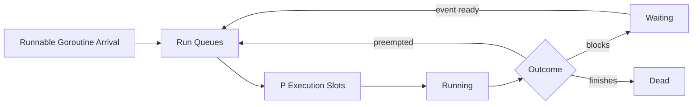

Jika arrival rate runnable goroutine lebih besar daripada service rate CPU/P, queue tumbuh.

Ini sama dengan prinsip Part 001:

```text
queue length ≈ arrival rate × wait time
```

Scheduler tidak bisa mengalahkan hukum kapasitas.

---

## 42. Practical Runtime Metrics Set

Untuk service production Go 1.26.x, minimal pikirkan metric berikut:

### 42.1 Runtime

- goroutine total,
- goroutine by state jika tersedia,
- goroutines created total,
- OS thread count,
- GC cycles,
- heap alloc,
- allocation rate,
- pause time,
- `GOMAXPROCS`.

### 42.2 Application concurrency

- active requests,
- in-flight jobs,
- queue depth,
- queue wait time,
- worker utilization,
- rejected jobs,
- context cancellation count,
- timeout count.

### 42.3 Dependency

- DB pool in-use,
- DB pool wait count/duration,
- HTTP client in-flight per host,
- gRPC stream count,
- downstream latency,
- downstream error/retry count.

### 42.4 Platform

- CPU usage,
- CPU throttling,
- memory RSS,
- OOM kills,
- pod restarts,
- node pressure.

---

## 43. Example: Diagnosing A Bad Fan-Out Handler

### 43.1 Problem code

```go
func Handler(w http.ResponseWriter, r *http.Request) {
    ids := parseIDs(r)

    results := make(chan Result, len(ids))
    for _, id := range ids {
        go func(id string) {
            result := callDownstream(r.Context(), id)
            results <- result
        }(id)
    }

    var all []Result
    for range ids {
        all = append(all, <-results)
    }

    writeJSON(w, all)
}
```

### 43.2 Masalah

- Fan-out sebanyak `len(ids)` tanpa batas.
- Jika client mengirim 10.000 IDs, 10.000 goroutine dibuat.
- Downstream bisa overload.
- Tidak ada per-request concurrency limit.
- Tidak ada global concurrency limit.
- Jika `writeJSON` lambat atau request cancel, goroutine bisa tetap mencoba send.
- Channel buffer sebesar `len(ids)` bisa besar.

### 43.3 Scheduler symptoms

- goroutine count naik saat traffic spike,
- banyak goroutine `[IO wait]` atau `[runnable]`,
- downstream latency naik,
- CPU bisa naik karena JSON/result aggregation,
- p99 naik,
- retry storm.

### 43.4 Better design

Gunakan bounded concurrency:

```go
func Handler(w http.ResponseWriter, r *http.Request) {
    ctx := r.Context()
    ids := parseIDs(r)

    const perRequestLimit = 20
    sem := make(chan struct{}, perRequestLimit)
    results := make(chan Result, len(ids))
    errCh := make(chan error, 1)

    var wg sync.WaitGroup

    for _, id := range ids {
        select {
        case sem <- struct{}{}:
        case <-ctx.Done():
            http.Error(w, ctx.Err().Error(), http.StatusRequestTimeout)
            return
        }

        wg.Add(1)
        go func(id string) {
            defer wg.Done()
            defer func() { <-sem }()

            result, err := callDownstream(ctx, id)
            if err != nil {
                select {
                case errCh <- err:
                default:
                }
                return
            }

            select {
            case results <- result:
            case <-ctx.Done():
            }
        }(id)
    }

    done := make(chan struct{})
    go func() {
        wg.Wait()
        close(done)
    }()

    var all []Result
    for remaining := len(ids); remaining > 0; {
        select {
        case result := <-results:
            all = append(all, result)
            remaining--
        case err := <-errCh:
            http.Error(w, err.Error(), http.StatusBadGateway)
            return
        case <-done:
            remaining = 0
        case <-ctx.Done():
            http.Error(w, ctx.Err().Error(), http.StatusRequestTimeout)
            return
        }
    }

    writeJSON(w, all)
}
```

Ini masih bisa disempurnakan dengan `errgroup`, global limiter, dan result ordering. Tetapi prinsip scheduler-aware sudah lebih baik: fan-out dibatasi.

---

## 44. Apa Yang Tidak Dijamin Scheduler

Scheduler Go tidak menjamin:

- urutan eksekusi goroutine,
- fairness sempurna,
- real-time deadlines,
- bebas starvation di semua desain,
- bounded memory,
- bounded goroutine count,
- downstream tidak overload,
- cancellation otomatis,
- goroutine child selesai saat parent return,
- race freedom,
- deadlock freedom.

Semua itu tanggung jawab desain aplikasi.

---

## 45. Ringkasan Part 003

Poin terpenting:

1. Go scheduler memetakan banyak goroutine ke sejumlah OS thread melalui model G/M/P.
2. G adalah goroutine, M adalah OS thread, P adalah runtime processor/scheduling resource.
3. `GOMAXPROCS` menentukan jumlah P, yaitu batas parallel Go code execution.
4. P bukan CPU core, dan OS/container tetap menentukan actual CPU time.
5. Goroutine bisa runnable, running, waiting, syscall, atau dead.
6. Banyak runnable goroutine biasanya sinyal CPU/P/quota pressure.
7. Banyak waiting goroutine bisa normal atau leak, tergantung lifecycle.
8. Local run queue dan work stealing mengurangi contention dan membantu balancing.
9. Syscall dan network I/O diperlakukan berbeda oleh runtime agar OS thread tidak selalu menjadi bottleneck.
10. Scheduler bukan backpressure mechanism. Bound harus didesain eksplisit.
11. Runtime trace adalah alat penting untuk memahami scheduling timeline.
12. Go 1.26 scheduler metrics membuat observability goroutine state lebih baik daripada hanya total goroutine.
13. Kubernetes CPU throttling harus dipahami bersama `GOMAXPROCS`, worker count, dan p99 latency.

---

## 46. Pertanyaan Review

Jawab tanpa melihat materi:

1. Apa perbedaan G, M, dan P?
2. Mengapa M harus memegang P untuk menjalankan Go code?
3. Apakah `GOMAXPROCS=4` berarti process hanya punya 4 OS thread?
4. Apa bedanya goroutine runnable dan waiting?
5. Kenapa banyak goroutine runnable bisa menaikkan p99 latency?
6. Apa fungsi local run queue?
7. Kenapa work stealing dibutuhkan?
8. Bagaimana runtime menangani goroutine yang masuk blocking syscall?
9. Kenapa network I/O Go tidak membutuhkan satu OS thread blocked per connection?
10. Apa risiko busy loop dengan `select default`?
11. Kenapa scheduler bukan backpressure mechanism?
12. Metric apa yang perlu dilihat selain total goroutine?
13. Bagaimana CPU throttling Kubernetes memengaruhi scheduler Go?
14. Kapan `runtime.LockOSThread` masuk akal?
15. Kapan runtime trace lebih berguna daripada CPU profile?

---

## 47. Latihan Desain

Ambil salah satu service Go yang Anda bayangkan:

- HTTP API,
- worker consumer,
- batch processor,
- file processor,
- API aggregator,
- notification sender.

Buat concurrency map:

```text
Inbound request / event
  -> goroutine owner?
  -> queue?
  -> worker pool?
  -> downstream?
  -> cancellation?
  -> shutdown?
  -> metrics?
```

Lalu jawab:

1. Berapa maksimum goroutine yang bisa dibuat dari satu request/event?
2. Berapa maksimum goroutine global dari subsystem itu?
3. Resource apa yang menjadi bottleneck?
4. Apa yang terjadi saat downstream lambat?
5. Apa yang terjadi saat context cancel?
6. Apa yang terjadi saat process shutdown?
7. Apa metric yang membuktikan sistem sehat?
8. Apa dump/trace symptom jika sistem tidak sehat?

---

## 48. Referensi

Sumber resmi dan relevan:

1. Go Runtime HACKING — scheduler structures G/M/P:  
   <https://go.dev/src/runtime/HACKING>
2. Go 1.26 Release Notes — runtime/metrics scheduler metrics, goroutine leak profile, Green Tea GC:  
   <https://go.dev/doc/go1.26>
3. Go 1.25 Release Notes — container-aware `GOMAXPROCS`, `WaitGroup.Go`, `testing/synctest`, trace flight recorder:  
   <https://go.dev/doc/go1.25>
4. Go Blog — Container-aware GOMAXPROCS:  
   <https://go.dev/blog/container-aware-gomaxprocs>
5. Package runtime:  
   <https://pkg.go.dev/runtime>
6. Package runtime/metrics:  
   <https://pkg.go.dev/runtime/metrics>
7. Package runtime/trace:  
   <https://pkg.go.dev/runtime/trace>
8. Diagnostics guide:  
   <https://go.dev/doc/diagnostics>
9. Data Race Detector:  
   <https://go.dev/doc/articles/race_detector>
10. Go Memory Model:  
   <https://go.dev/ref/mem>

---

## 49. Status Seri

Selesai:

- Part 000 — Orientation: Dari Java Threading ke Go Concurrency Engineering
- Part 001 — Foundations: Work, Time, State, Ordering, and Contention
- Part 002 — Goroutine Internals: Lifecycle, Stack, Parking, Blocking, and Leaks
- Part 003 — Go Scheduler Deep Dive: G, M, P, Run Queues, Stealing, Preemption

Belum selesai. Masih lanjut ke:

- Part 004 — GOMAXPROCS, CPU Quotas, Containers, and Kubernetes Reality

<!-- NAVIGATION_FOOTER -->
<div class="page-nav">
<a href="./learn-go-concurrency-parallelism-part-002.md">⬅️ Part 002 — Goroutine Internals: Lifecycle, Stack, Parking, Blocking, and Leaks</a>
<a href="./index.md">📚 Kategori</a>
<a href="../../index.md">🏠 Home</a>
<a href="./learn-go-concurrency-parallelism-part-004.md">Part 004 — GOMAXPROCS, CPU Quotas, Containers, dan Realitas Kubernetes ➡️</a>
</div>
