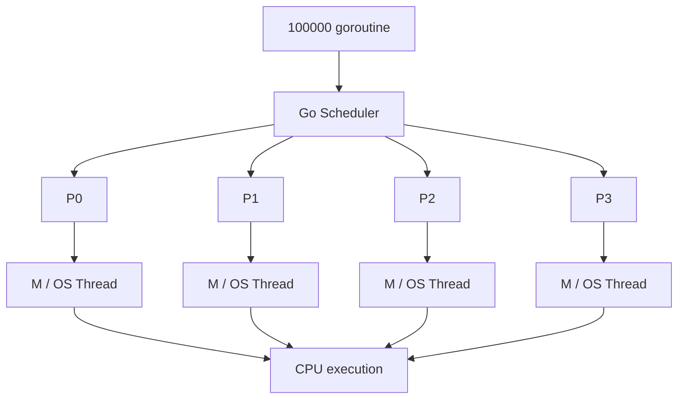
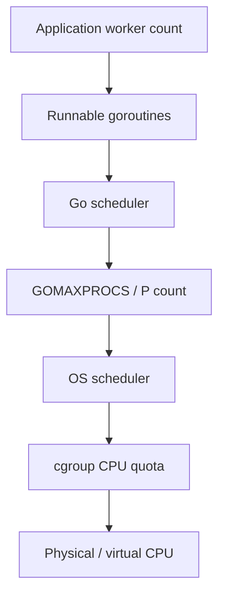
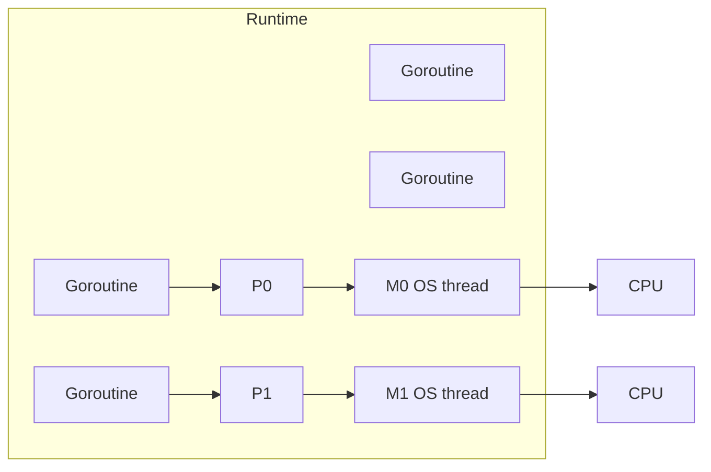
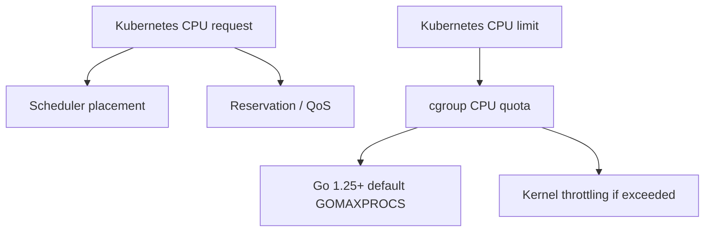
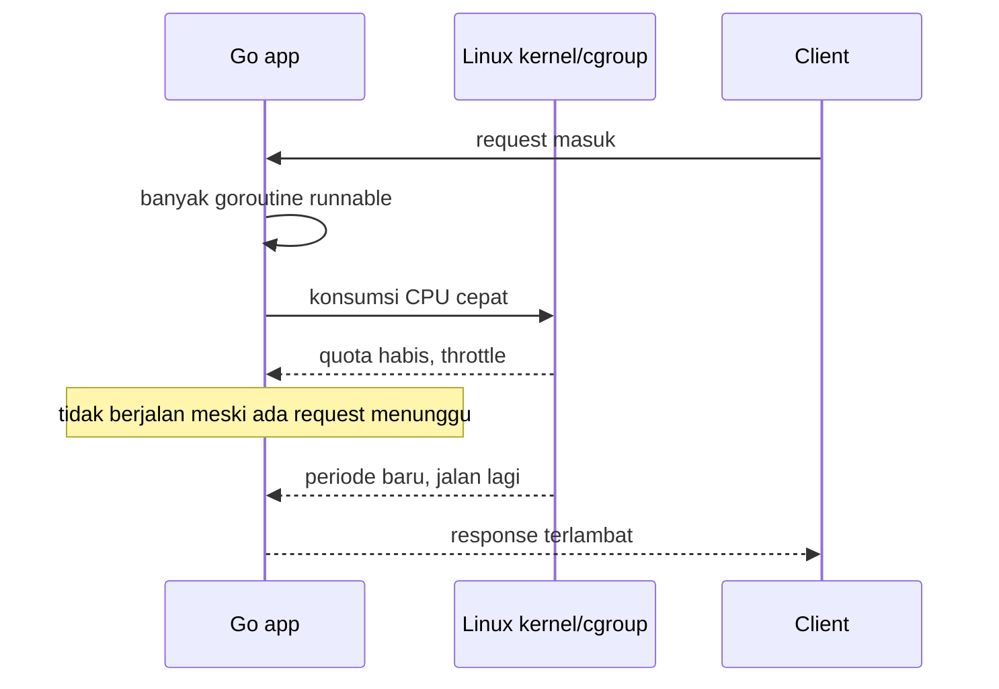
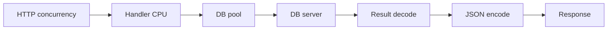

# learn-go-concurrency-parallelism-part-004.md

# Part 004 — GOMAXPROCS, CPU Quotas, Containers, dan Realitas Kubernetes

> Seri: `learn-go-concurrency-parallelism`  
> Bagian: `004 / 034`  
> Target pembaca: Java software engineer yang ingin memahami Go concurrency pada level runtime + production engineering  
> Target versi: Go 1.26.x, dengan perubahan penting dari Go 1.25 yang tetap berlaku di Go 1.26.x

---

## 0. Tujuan Bagian Ini

Pada bagian sebelumnya kita sudah membedah scheduler Go: goroutine (`G`), OS thread (`M`), processor token (`P`), run queue, work stealing, syscall handoff, dan netpoller.

Bagian ini menjawab pertanyaan yang sering kelihatan sederhana, tetapi sering menjadi akar masalah performa production:

> Berapa banyak goroutine yang boleh benar-benar berjalan paralel pada saat yang sama?

Jawabannya bukan jumlah goroutine. Jawabannya juga bukan jumlah worker pool. Jawabannya dikendalikan oleh kombinasi:

1. `GOMAXPROCS`
2. jumlah logical CPU yang terlihat oleh proses
3. CPU affinity mask
4. cgroup CPU quota pada Linux/container
5. OS scheduler
6. Kubernetes request/limit policy
7. workload CPU-bound atau I/O-bound
8. GC dan runtime background work
9. throttling behavior dari kernel
10. desain internal concurrency aplikasi

Di Java, terutama sebelum virtual threads, engineer sering berpikir dalam istilah:

- thread pool size
- executor size
- CPU core count
- queue size
- blocking ratio
- ForkJoinPool parallelism

Di Go, bentuk luarnya berbeda karena goroutine murah dan scheduler runtime mengatur multiplexing goroutine ke OS thread. Tetapi realitas fisiknya tetap sama:

> CPU parallelism tidak gratis. Pada satu waktu, hanya sejumlah terbatas instruksi yang bisa benar-benar dieksekusi oleh core yang tersedia.

`GOMAXPROCS` adalah salah satu parameter terpenting yang menghubungkan dunia goroutine yang “murah” dengan dunia CPU yang “terbatas”.

---

## 1. Definisi Singkat: Apa Itu `GOMAXPROCS`?

Secara praktis:

> `GOMAXPROCS` adalah batas jumlah OS thread yang boleh mengeksekusi Go user-level code secara simultan.

Bukan berarti jumlah goroutine dibatasi. Bukan berarti jumlah OS thread total dibatasi. Bukan berarti jumlah request dibatasi.

Yang dibatasi adalah **parallel execution capacity** untuk Go code.

Misalnya:

```go
runtime.GOMAXPROCS(4)
```

Artinya runtime Go dapat menjalankan Go code secara paralel pada maksimal 4 thread pada satu waktu.

Jika ada 100.000 goroutine runnable, runtime tidak menjalankan 100.000 goroutine secara paralel. Runtime akan menjadwalkan goroutine-goroutine tersebut di atas sejumlah `P`, dan jumlah `P` efektif dikendalikan oleh `GOMAXPROCS`.

---

## 2. Mental Model: Goroutine Banyak, Parallelism Sedikit

Perbedaan paling penting:

| Konsep | Arti |
|---|---|
| Concurrency | Banyak pekerjaan hidup/berlangsung dalam periode waktu yang overlap |
| Parallelism | Banyak pekerjaan benar-benar dieksekusi pada saat yang sama |
| Goroutine count | Jumlah unit eksekusi ringan yang dikelola runtime |
| OS thread count | Jumlah thread native yang dibuat runtime/OS |
| `GOMAXPROCS` | Jumlah maksimum thread yang menjalankan Go code simultan |
| CPU quota | Jatah CPU yang boleh dikonsumsi proses/container |
| CPU throttling | Kernel menahan eksekusi karena proses melewati jatah CPU |

Diagram sederhana:



Jika `GOMAXPROCS=4`, maka kira-kira ada 4 `P` yang dapat menjalankan Go code secara paralel. Jumlah goroutine bisa jauh lebih banyak, tetapi banyak dari mereka akan:

- waiting di channel
- waiting di mutex
- waiting di network poller
- sleeping di timer
- blocked di syscall
- runnable tetapi menunggu giliran CPU

---

## 3. Analogi Java: `GOMAXPROCS` Bukan Sama Dengan Thread Pool Size

Untuk Java engineer, godaan pertama adalah menyamakan `GOMAXPROCS` dengan ukuran thread pool.

Itu tidak tepat.

### 3.1 Java Executor

Di Java:

```java
ExecutorService pool = Executors.newFixedThreadPool(16);
```

Ukuran pool menentukan berapa banyak task yang dapat dijalankan oleh thread pool tersebut secara bersamaan, meskipun OS tetap membatasi eksekusi aktual berdasarkan CPU.

Java thread pool adalah construct application-level.

### 3.2 Go `GOMAXPROCS`

Di Go:

```go
runtime.GOMAXPROCS(16)
```

Ini bukan worker pool aplikasi. Ini mengatur kapasitas paralel runtime scheduler untuk menjalankan Go code.

Worker pool Go tetap bisa dibuat sendiri:

```go
jobs := make(chan Job, 1000)
for i := 0; i < 64; i++ {
    go worker(jobs)
}
```

Tetapi jika `GOMAXPROCS=4`, maka 64 worker CPU-bound itu tetap hanya dapat benar-benar menjalankan Go code pada sekitar 4 thread secara bersamaan.

### 3.3 Implikasi

Dalam Java, tuning sering dilakukan di level:

- executor size
- ForkJoinPool parallelism
- Tomcat worker thread
- Hikari connection pool
- Kafka consumer thread

Dalam Go, tuning production perlu membaca beberapa layer sekaligus:



Kesalahan umum adalah hanya menaikkan worker count tanpa memahami layer di bawahnya.

---

## 4. `GOMAXPROCS` dan Model G/M/P

Dari part sebelumnya:

- `G` = goroutine
- `M` = OS thread
- `P` = processor token, resource yang dibutuhkan `M` untuk menjalankan Go code

`GOMAXPROCS` secara efektif menentukan jumlah `P`.



Jika `GOMAXPROCS=2`, ada dua `P`, sehingga maksimal dua `M` dapat menjalankan Go code pada saat yang sama.

Tetapi runtime masih boleh membuat OS thread tambahan untuk situasi lain, misalnya:

- thread blocked di syscall
- cgo
- network poller internals
- thread locked via `runtime.LockOSThread`
- runtime housekeeping

Jadi:

> `GOMAXPROCS` bukan hard limit total OS thread.

Ini penting saat membaca metrics. Jika Anda melihat OS thread count lebih besar dari `GOMAXPROCS`, itu tidak otomatis bug.

---

## 5. API Dasar

### 5.1 Melihat Nilai Saat Ini

```go
package main

import (
    "fmt"
    "runtime"
)

func main() {
    fmt.Println("GOMAXPROCS:", runtime.GOMAXPROCS(0))
    fmt.Println("NumCPU:", runtime.NumCPU())
}
```

`runtime.GOMAXPROCS(0)` tidak mengubah nilai, hanya mengembalikan nilai saat ini.

### 5.2 Mengubah Nilai

```go
old := runtime.GOMAXPROCS(4)
fmt.Println("old:", old)
```

Ini mengubah parallelism runtime menjadi 4.

Namun di production modern, khususnya Go 1.25+, mengubah ini manual harus dilakukan dengan alasan jelas.

### 5.3 Mengembalikan Default Otomatis

Go 1.25 memperkenalkan perilaku default yang lebih container-aware. Jika Anda pernah mengubah `GOMAXPROCS` manual dan ingin mengembalikan default runtime, gunakan:

```go
runtime.SetDefaultGOMAXPROCS()
```

Pola ini berguna untuk library/framework yang mungkin pernah mengubah `GOMAXPROCS`, tetapi aplikasi ingin kembali ke default runtime.

---

## 6. Default `GOMAXPROCS` Sebelum dan Sesudah Go 1.25

### 6.1 Sebelum Go 1.25

Secara historis, default `GOMAXPROCS` adalah jumlah logical CPU yang terlihat oleh proses saat startup.

Di VM atau bare metal, ini sering cukup masuk akal.

Masalah muncul di container.

Contoh:

- Kubernetes node: 64 vCPU
- Pod CPU limit: 2 CPU
- Go runtime lama melihat: 64 logical CPU
- Default `GOMAXPROCS`: 64
- Real quota container: 2 CPU

Aplikasi bisa mencoba menjalankan Go code seolah-olah punya 64 CPU, padahal kernel hanya memberi jatah 2 CPU.

Hasilnya:

- runnable goroutine banyak
- OS thread bersaing terlalu agresif
- container melewati quota
- kernel melakukan throttling
- latency p99 naik tajam

### 6.2 Go 1.25 dan Setelahnya

Go 1.25 mengubah default `GOMAXPROCS` agar mempertimbangkan cgroup CPU quota pada Linux.

Jika container memiliki CPU limit lebih kecil daripada jumlah logical CPU host, runtime memilih nilai yang lebih rendah berdasarkan limit tersebut.

Go runtime juga dapat memperbarui default secara periodik jika CPU availability atau cgroup quota berubah.

### 6.3 Hal Yang Tidak Dipertimbangkan

Penting:

> Go runtime mempertimbangkan CPU limit, bukan CPU request Kubernetes.

Jika Pod hanya punya CPU request tetapi tidak punya CPU limit, runtime tidak mendapatkan quota hard dari cgroup untuk dijadikan dasar default `GOMAXPROCS`.

Contoh:

```yaml
resources:
  requests:
    cpu: "500m"
  limits: {}
```

Dalam kondisi seperti ini, Go bisa tetap melihat CPU berdasarkan logical CPU/affinity, bukan request.

---

## 7. Kubernetes CPU Request vs CPU Limit

### 7.1 CPU Request

CPU request adalah sinyal scheduling Kubernetes.

Ia mengatakan:

> Tolong schedule Pod ini di node yang punya kapasitas minimal sebesar request ini.

CPU request memengaruhi:

- placement Pod
- resource reservation relatif
- QoS class
- scheduling decision

Tetapi request bukan hard cap eksekusi CPU.

### 7.2 CPU Limit

CPU limit adalah batas konsumsi CPU.

Jika container melewati limit pada periode tertentu, kernel dapat throttle proses/container.

Contoh:

```yaml
resources:
  requests:
    cpu: "500m"
  limits:
    cpu: "2"
```

Artinya:

- scheduler menganggap Pod butuh minimal 0.5 CPU
- container tidak boleh memakai lebih dari 2 CPU secara rata-rata sesuai mekanisme quota period

### 7.3 Diagram



### 7.4 Kesalahan Umum

Kesalahan umum:

```yaml
resources:
  requests:
    cpu: "250m"
  limits:
    cpu: "250m"
```

Lalu aplikasi Go menjalankan:

- HTTP server
- JSON processing
- database call
- logging
- metrics
- GC
- TLS
- compression
- background job

Dengan limit `250m`, aplikasi hanya punya seperempat CPU rata-rata. Bahkan jika `GOMAXPROCS` disesuaikan, latency bisa buruk karena budget CPU memang kecil.

Jangan menyimpulkan “Go lambat” ketika sebenarnya container hanya diberi CPU terlalu kecil.

---

## 8. CPU Quota: Kenapa 500m Bukan Berarti Setengah Core Stabil Setiap Saat

Kubernetes CPU limit diterjemahkan menjadi cgroup CPU bandwidth control.

Secara konseptual:

- ada periode waktu, misalnya 100ms
- container diberi jatah runtime CPU dalam periode itu
- jika jatah habis sebelum periode selesai, container throttle sampai periode berikutnya

Contoh sederhana:

- limit = 1 CPU
- period = 100ms
- quota = 100ms CPU time per 100ms wall time

Jika container punya banyak thread dan menghabiskan quota dalam 20ms pertama, ia bisa throttle selama sisa periode.

Efek ke latency:



Ini menjelaskan kenapa CPU throttling sangat berbahaya untuk tail latency.

Bukan karena setiap request selalu lambat, tetapi karena sebagian request kebetulan jatuh ke window throttling.

---

## 9. Hubungan `GOMAXPROCS` Dengan Throttling

Misalnya:

- node punya 64 CPU
- container limit 2 CPU
- `GOMAXPROCS=64`

Go runtime bisa menjadwalkan banyak thread untuk menjalankan Go code. Dari sudut pandang kernel, container bisa membakar CPU quota sangat cepat.

Akibatnya:

- quota habis lebih awal
- container throttle
- semua goroutine ikut berhenti dari sisi CPU
- latency spike

Dengan `GOMAXPROCS=2`, runtime lebih selaras dengan quota.

Artinya:

- konsumsi CPU lebih smooth
- peluang membakar quota terlalu cepat berkurang
- p99 latency bisa membaik
- context switching bisa lebih terkendali

Namun ini bukan obat semua masalah. Jika workload butuh CPU 8 core tetapi container diberi 2 CPU, `GOMAXPROCS=2` hanya membuat runtime lebih jujur terhadap batas fisik. Throughput tetap dibatasi 2 CPU.

---

## 10. `GOMAXPROCS` Tidak Sama Dengan Rate Limit

Ini kesalahan arsitektural yang sering muncul:

> “Kita set `GOMAXPROCS=4`, berarti aplikasi tidak akan overload downstream.”

Salah.

`GOMAXPROCS` membatasi parallel Go execution. Ia tidak membatasi:

- jumlah request masuk
- jumlah goroutine blocked di network
- jumlah DB query concurrent
- jumlah HTTP outbound concurrent
- jumlah job queue
- jumlah memory yang tertahan
- jumlah retry storm

Contoh:

```go
for _, item := range items {
    go callExternalAPI(ctx, item)
}
```

Walaupun `GOMAXPROCS=2`, kode ini tetap bisa membuat 100.000 goroutine yang semuanya mencoba melakukan I/O ke external API. Banyak dari mereka akan blocked di network poller, tetapi external dependency tetap bisa dibanjiri koneksi/request.

Untuk membatasi external concurrency, gunakan:

- worker pool
- semaphore
- rate limiter
- connection pool limit
- queue bound
- circuit breaker
- load shedding

---

## 11. `GOMAXPROCS` Tidak Sama Dengan Worker Count

Misalnya:

```go
workers := runtime.GOMAXPROCS(0)
for i := 0; i < workers; i++ {
    go worker(jobs)
}
```

Untuk CPU-bound workload, ini sering masuk akal sebagai baseline.

Tetapi untuk I/O-bound workload, worker count mungkin lebih besar dari `GOMAXPROCS` karena banyak worker menunggu I/O.

Namun lebih besar bukan berarti unlimited.

Sizing worker count harus berdasarkan:

- service time
- wait time
- latency budget
- downstream capacity
- queue size
- memory per job
- retry behavior
- p99 requirement

Formula konseptual:

```text
concurrency_needed ≈ throughput_target × average_latency
```

Ini turunan dari Little’s Law.

Contoh:

- target throughput: 500 jobs/s
- average processing latency: 40ms = 0.04s
- concurrency needed ≈ 500 × 0.04 = 20

Jika job CPU-bound dan tiap job butuh CPU penuh, concurrency 20 pada 2 CPU bisa buruk. Jika job I/O-bound dan sebagian besar waktu menunggu network, concurrency 20 bisa masuk akal.

---

## 12. Klasifikasi Workload dan Implikasi `GOMAXPROCS`

### 12.1 CPU-Bound

Contoh:

- compression
- encryption-heavy processing
- image/video processing
- JSON encode/decode sangat besar
- regex berat
- hashing massal
- simulation
- in-memory aggregation

Karakteristik:

- goroutine lebih sering runnable
- CPU cepat penuh
- worker count ideal dekat dengan jumlah CPU efektif
- oversubscription menaikkan context switching dan cache miss

Baseline:

```text
workers ≈ GOMAXPROCS
```

Kadang sedikit lebih tinggi, tetapi harus dibuktikan benchmark.

### 12.2 I/O-Bound

Contoh:

- HTTP outbound
- database query
- Redis call
- file/network read
- message broker consumer

Karakteristik:

- banyak waktu waiting
- goroutine parked di netpoller/channel
- worker count bisa lebih besar dari `GOMAXPROCS`
- bottleneck sering di downstream, bukan CPU

Baseline:

```text
workers = berdasarkan downstream capacity + latency + timeout budget
```

Bukan berdasarkan CPU semata.

### 12.3 Mixed Workload

Contoh HTTP API umum:

- parse request
- validate
- call DB
- transform response
- encode JSON
- logging/metrics

Ada fase CPU, I/O, dan allocation.

Strateginya:

- batasi request concurrency di edge jika perlu
- batasi DB pool
- batasi outbound per dependency
- ukur CPU saturation
- ukur queue depth
- ukur p95/p99
- jangan tuning satu angka saja

---

## 13. Kubernetes Deployment: Apa Yang Harus Dicek

### 13.1 Cek Manifest

Contoh manifest:

```yaml
resources:
  requests:
    cpu: "500m"
    memory: "512Mi"
  limits:
    cpu: "2"
    memory: "1Gi"
```

Pertanyaan review:

1. Apakah limit CPU ada?
2. Apakah request terlalu kecil dibanding real usage?
3. Apakah limit terlalu kecil untuk p99 target?
4. Apakah `GOMAXPROCS` diset manual oleh env?
5. Apakah base image/entrypoint memakai `automaxprocs` lama?
6. Apakah aplikasi memakai Go 1.25+?
7. Apakah `go.mod` `go` directive cukup baru untuk default behavior yang diharapkan?
8. Apakah ada sidecar yang ikut berbagi resource di Pod?

### 13.2 Cek Environment

```bash
kubectl exec deploy/my-service -- printenv | grep -E 'GOMAXPROCS|GODEBUG|GOMEMLIMIT'
```

Yang perlu dicari:

- `GOMAXPROCS` manual
- `GODEBUG=containermaxprocs=0`
- `GODEBUG=updatemaxprocs=0`
- `GOMEMLIMIT`

### 13.3 Cek Runtime Value

Tambahkan log startup:

```go
log.Info("runtime config",
    "gomaxprocs", runtime.GOMAXPROCS(0),
    "num_cpu", runtime.NumCPU(),
    "num_goroutine", runtime.NumGoroutine(),
)
```

Lebih baik lagi ekspose sebagai metric/gauge:

```text
go_runtime_gomaxprocs 2
go_runtime_num_cpu 64
go_runtime_goroutines 1234
```

### 13.4 Cek Throttling

Metrics yang biasanya dicari di Prometheus/cAdvisor:

```text
container_cpu_cfs_throttled_periods_total
container_cpu_cfs_periods_total
container_cpu_cfs_throttled_seconds_total
container_cpu_usage_seconds_total
```

Rasio kasar:

```promql
rate(container_cpu_cfs_throttled_periods_total[5m])
/
rate(container_cpu_cfs_periods_total[5m])
```

Jika throttling ratio tinggi bersamaan dengan p99 latency naik, CPU limit kemungkinan bagian dari masalah.

---

## 14. Interpretasi Kombinasi Metrics

Jangan membaca satu metric sendirian.

### 14.1 CPU Usage Tinggi, Throttling Tinggi, Latency Tinggi

Kemungkinan:

- CPU limit terlalu rendah
- `GOMAXPROCS` terlalu tinggi dibanding limit
- workload CPU-bound naik
- GC overhead tinggi
- logging/serialization berat

Tindakan:

1. cek `GOMAXPROCS`
2. cek CPU limit
3. cek CPU profile
4. cek allocation profile
5. cek request rate
6. cek pprof/trace

### 14.2 CPU Usage Rendah, Latency Tinggi

Kemungkinan:

- blocked di DB
- blocked di network dependency
- lock contention
- queue menumpuk
- goroutine leak
- connection pool saturation

`GOMAXPROCS` mungkin bukan root cause.

### 14.3 Goroutine Count Naik, CPU Tidak Naik

Kemungkinan:

- goroutine blocked I/O
- channel receive/send leak
- worker menunggu job
- downstream lambat
- context cancellation tidak dipatuhi

### 14.4 Runnable Goroutine Banyak, CPU Penuh

Kemungkinan:

- CPU-bound overload
- worker terlalu banyak
- retry loop
- busy loop dengan `select default`
- lock contention menyebabkan spin/overhead

---

## 15. Startup Instrumentation Yang Disarankan

Untuk service production, log runtime baseline saat startup:

```go
package runtimeinfo

import (
    "log/slog"
    "runtime"
    "runtime/debug"
)

func LogStartup(logger *slog.Logger) {
    bi, ok := debug.ReadBuildInfo()

    attrs := []any{
        "go_version", runtime.Version(),
        "gomaxprocs", runtime.GOMAXPROCS(0),
        "num_cpu", runtime.NumCPU(),
        "num_goroutine", runtime.NumGoroutine(),
        "goos", runtime.GOOS,
        "goarch", runtime.GOARCH,
    }

    if ok {
        attrs = append(attrs,
            "module", bi.Main.Path,
            "module_version", bi.Main.Version,
            "go_directive", findSetting(bi.Settings, "vcs.revision"),
        )
    }

    logger.Info("go runtime startup", attrs...)
}

func findSetting(settings []debug.BuildSetting, key string) string {
    for _, s := range settings {
        if s.Key == key {
            return s.Value
        }
    }
    return ""
}
```

Catatan: contoh di atas sengaja sederhana. Di production, Anda mungkin ingin log:

- build commit
- build time
- container CPU limit dari Downward API/env
- memory limit
- pod name
- node name
- deployment version

---

## 16. Runtime Metrics Yang Perlu Diekspose

Dengan `runtime/metrics`, Anda bisa membaca metrics runtime Go.

Contoh skeleton:

```go
package main

import (
    "fmt"
    "runtime/metrics"
)

func main() {
    samples := []metrics.Sample{
        {Name: "/sched/gomaxprocs:threads"},
        {Name: "/sched/goroutines:goroutines"},
    }

    metrics.Read(samples)

    for _, s := range samples {
        fmt.Printf("%s = %v\n", s.Name, s.Value)
    }
}
```

Nama metric dapat berubah/bertambah antar versi, jadi dalam sistem observability production gunakan discovery/test terhadap versi Go yang dipakai.

Yang dicari secara konseptual:

- jumlah goroutine
- `GOMAXPROCS`
- thread count
- scheduler latency
- GC cycles
- heap allocation
- pause time

---

## 17. Skenario Production: API di Kubernetes Dengan Limit Kecil

### 17.1 Kondisi Awal

Service:

- Go HTTP API
- CPU limit: `500m`
- node: 32 vCPU
- Go versi lama atau `GOMAXPROCS` manual: 32
- traffic burst: 300 RPS
- handler melakukan JSON encode besar

Gejala:

- p50: 40ms
- p95: 800ms
- p99: 3s
- CPU throttling tinggi
- goroutine count naik saat burst
- DB normal
- downstream normal

### 17.2 Diagnosis

Root cause bukan sekadar “Go lambat”. Masalahnya:

```text
runtime parallelism expectation != container CPU quota
```

Runtime mencoba menjalankan workload seolah punya banyak CPU. Kernel memaksa quota 0.5 CPU.

### 17.3 Perbaikan

Langkah:

1. upgrade ke Go 1.25+ atau pastikan Go 1.26.x
2. hapus `GOMAXPROCS` manual yang salah
3. set CPU limit yang realistis, misalnya 2 CPU jika p99 target butuh
4. ukur CPU profile untuk JSON hot path
5. pertimbangkan request concurrency limit
6. set autoscaling berdasarkan CPU + latency + queue
7. monitor throttling ratio

### 17.4 Pelajaran

`GOMAXPROCS` yang benar tidak membuat 0.5 CPU menjadi 4 CPU.

Ia hanya mencegah runtime membuat situasi lebih buruk akibat mismatch paralelisme.

---

## 18. Skenario Production: CPU Request Tanpa Limit

### 18.1 Manifest

```yaml
resources:
  requests:
    cpu: "500m"
    memory: "512Mi"
```

Tidak ada CPU limit.

### 18.2 Efek

Kubernetes memakai request untuk scheduling. Tetapi tidak ada cgroup CPU bandwidth limit yang menjadi hard cap.

Go runtime dapat memilih `GOMAXPROCS` berdasarkan logical CPUs/affinity karena tidak ada CPU quota limit yang lebih rendah.

Ini bisa baik atau buruk.

Baik jika:

- cluster sengaja membolehkan burst
- workload opportunistic
- node punya headroom
- latency lebih penting daripada strict isolation

Buruk jika:

- banyak Pod berebut node
- noisy neighbor sering terjadi
- kapasitas tidak diproteksi
- sulit menjelaskan p99 spikes

### 18.3 Keputusan Engineering

Tidak ada jawaban universal “selalu set CPU limit” atau “jangan pernah set CPU limit”.

Trade-off:

| Pilihan | Kelebihan | Risiko |
|---|---|---|
| Ada CPU limit | isolasi lebih jelas, Go 1.25+ bisa default `GOMAXPROCS` lebih selaras | throttling jika limit terlalu rendah |
| Tanpa CPU limit | bisa memakai idle CPU, burst lebih fleksibel | noisy neighbor, default `GOMAXPROCS` mungkin terlalu tinggi untuk harapan kapasitas |
| Manual `GOMAXPROCS` | kontrol eksplisit | mudah stale/salah saat deployment berubah |

---

## 19. Manual `GOMAXPROCS`: Kapan Masuk Akal?

Manual override masuk akal jika Anda punya alasan kuat.

### 19.1 Kasus Masuk Akal

1. **No CPU limit, tetapi ingin predictable parallelism**

```bash
GOMAXPROCS=4 ./service
```

2. **Batch job CPU-bound** yang sengaja dibatasi agar tidak mengganggu proses lain.

3. **Benchmark eksperimen** untuk mencari throughput optimal.

4. **Legacy environment** sebelum Go 1.25 atau runtime behavior sengaja distandardisasi.

5. **Multi-process dalam satu container/VM** yang perlu berbagi CPU secara eksplisit.

### 19.2 Kasus Tidak Masuk Akal

1. Copy-paste `GOMAXPROCS=runtime.NumCPU()` dari artikel lama.
2. Set `GOMAXPROCS=1` untuk “menghindari race”. Race harus diperbaiki, bukan disembunyikan.
3. Set sangat tinggi karena “goroutine murah”.
4. Set sama dengan worker count tanpa melihat CPU limit.
5. Set di library. Library sebaiknya tidak diam-diam mengubah global runtime process.

---

## 20. `GOMAXPROCS=1`: Kapan Berguna?

`GOMAXPROCS=1` dapat berguna untuk:

- eksperimen deterministik terbatas
- debug scheduler-related behavior
- CPU-bound benchmark baseline
- mengurangi parallelism untuk workload kecil
- compatibility scenario tertentu

Namun jangan salah:

> `GOMAXPROCS=1` tidak membuat program bebas race.

Race tetap bisa terjadi karena goroutine masih bisa interleave. Bahkan pada satu OS thread, scheduler dapat berpindah antar goroutine pada synchronization/blocking/preemption point. Data race adalah masalah memory ordering dan unsynchronized access, bukan hanya masalah jumlah core.

---

## 21. Hubungan `GOMAXPROCS` Dengan GC

GC Go berjalan concurrent dengan program, tetapi tetap membutuhkan CPU.

Jika CPU limit sangat kecil, maka CPU budget dibagi untuk:

- request handling
- background goroutine
- runtime scheduler
- garbage collector
- finalizer jika ada
- logging/metrics

Jika aplikasi allocation-heavy, CPU yang tampak “hilang” bisa sebenarnya dipakai GC.

Efek umum:

- latency naik saat allocation rate tinggi
- GC assist memperlambat goroutine mutator
- CPU penuh tetapi business throughput tidak naik
- heap naik jika GC tidak mengejar allocation rate

`GOMAXPROCS` yang terlalu tinggi terhadap quota dapat memperparah throttling. Tetapi `GOMAXPROCS` yang terlalu rendah juga bisa membatasi kemampuan GC dan aplikasi memproses workload paralel.

Prinsip:

> Tuning CPU parallelism harus dibaca bersama allocation profile, heap growth, dan GC metrics.

---

## 22. Hubungan `GOMAXPROCS` Dengan Network I/O

Goroutine yang menunggu network I/O biasanya parked dan tidak mengonsumsi `P` aktif.

Karena itu, service I/O-bound bisa memiliki jumlah goroutine jauh lebih besar dari `GOMAXPROCS`.

Contoh:

- `GOMAXPROCS=2`
- 5.000 goroutine menunggu HTTP response
- CPU tidak penuh

Ini mungkin normal.

Tetapi ada risiko lain:

- downstream overload
- connection pool penuh
- memory retention besar
- timeout storm
- retry storm
- response fan-in lambat

Jadi untuk I/O-bound workload, pertanyaan utamanya bukan “berapa `GOMAXPROCS`?”, melainkan:

1. Berapa concurrent outbound call per dependency?
2. Berapa connection pool limit?
3. Berapa timeout?
4. Apakah context cancellation dipatuhi?
5. Apakah retry bounded?
6. Apakah queue bounded?
7. Apakah ada bulkhead?

---

## 23. Hubungan `GOMAXPROCS` Dengan Database Pool

`database/sql` memiliki pool internal.

Misalnya:

```go
db.SetMaxOpenConns(20)
db.SetMaxIdleConns(10)
```

Jika `GOMAXPROCS=2`, bukan berarti DB concurrency maksimal 2. Bisa ada 20 goroutine menunggu/menjalankan DB call karena banyak waktu berada di I/O.

Tetapi jika setiap DB result diproses CPU-heavy setelah query, maka CPU bisa menjadi bottleneck.

Tuning harus melihat chain:



Bottleneck bisa berada di:

- handler CPU
- DB pool wait
- DB lock
- DB CPU/I/O
- result decoding
- JSON encoding
- client network

`GOMAXPROCS` hanya satu bagian.

---

## 24. Anti-Pattern: Worker Pool Sebesar Goroutine Count

Kode buruk:

```go
for _, item := range items {
    go func(item Item) {
        process(item)
    }(item)
}
```

Untuk `items` besar, ini membuat concurrency tidak bounded.

Versi sedikit lebih baik tetapi masih bisa salah:

```go
workers := runtime.NumCPU() * 100
```

Masalah:

- `runtime.NumCPU()` bukan cgroup quota-aware dalam semua makna yang Anda harapkan
- CPU-bound worker sebanyak itu bisa oversubscribe
- I/O-bound worker sebanyak itu bisa overload downstream
- angka `100` biasanya magic number

Versi lebih defensible:

```go
type PoolConfig struct {
    Workers int
    Queue   int
}

func DefaultCPUConfig() PoolConfig {
    p := runtime.GOMAXPROCS(0)
    return PoolConfig{
        Workers: p,
        Queue:   p * 4,
    }
}
```

Untuk I/O-bound:

```go
type DownstreamLimit struct {
    MaxInFlight int
    Queue       int
}
```

Dihitung berdasarkan downstream SLO, bukan CPU semata.

---

## 25. Pattern: CPU-Bound Worker Pool

```go
type Job struct {
    Payload []byte
}

type Result struct {
    Value []byte
    Err   error
}

func RunCPUWorkers(ctx context.Context, jobs <-chan Job, results chan<- Result) {
    workers := runtime.GOMAXPROCS(0)

    var wg sync.WaitGroup
    wg.Add(workers)

    for i := 0; i < workers; i++ {
        go func() {
            defer wg.Done()
            for {
                select {
                case <-ctx.Done():
                    return
                case job, ok := <-jobs:
                    if !ok {
                        return
                    }
                    value, err := processCPU(job.Payload)
                    select {
                    case <-ctx.Done():
                        return
                    case results <- Result{Value: value, Err: err}:
                    }
                }
            }
        }()
    }

    go func() {
        wg.Wait()
        close(results)
    }()
}
```

Catatan desain:

- worker count berbasis `GOMAXPROCS`
- cancellation dihormati
- output ditutup oleh owner worker group
- tidak spawn goroutine per job
- boundedness harus datang dari channel `jobs` upstream

---

## 26. Pattern: I/O-Bound Limit Dengan Semaphore

```go
type Client struct {
    sem chan struct{}
}

func NewClient(maxInFlight int) *Client {
    return &Client{sem: make(chan struct{}, maxInFlight)}
}

func (c *Client) Do(ctx context.Context, req Request) (Response, error) {
    select {
    case c.sem <- struct{}{}:
        defer func() { <-c.sem }()
    case <-ctx.Done():
        return Response{}, ctx.Err()
    }

    return callDownstream(ctx, req)
}
```

Di sini limit tidak berdasarkan `GOMAXPROCS`, tetapi berdasarkan kapasitas downstream.

Ini jauh lebih tepat untuk HTTP/DB/API external.

---

## 27. Pattern: Admission Control di HTTP Server

```go
type LimitMiddleware struct {
    sem chan struct{}
}

func NewLimitMiddleware(maxInFlight int) *LimitMiddleware {
    return &LimitMiddleware{sem: make(chan struct{}, maxInFlight)}
}

func (m *LimitMiddleware) Wrap(next http.Handler) http.Handler {
    return http.HandlerFunc(func(w http.ResponseWriter, r *http.Request) {
        select {
        case m.sem <- struct{}{}:
            defer func() { <-m.sem }()
            next.ServeHTTP(w, r)
        default:
            http.Error(w, "server busy", http.StatusTooManyRequests)
        }
    })
}
```

Ini menghindari request pile-up tanpa batas.

Pilihan `default` berarti load shedding langsung. Alternatifnya blocking dengan timeout:

```go
select {
case m.sem <- struct{}{}:
    defer func() { <-m.sem }()
    next.ServeHTTP(w, r)
case <-time.After(50 * time.Millisecond):
    http.Error(w, "server busy", http.StatusTooManyRequests)
case <-r.Context().Done():
    return
}
```

Trade-off:

| Strategi | Efek |
|---|---|
| reject langsung | melindungi service, client harus retry/backoff |
| wait sebentar | menyerap burst kecil, risiko menambah latency |
| wait tanpa batas | anti-pattern, menciptakan hidden queue |

---

## 28. CPU Limit dan Autoscaling

Horizontal Pod Autoscaler sering memakai CPU utilization.

Jika CPU limit terlalu kecil dan throttling tinggi, HPA bisa bereaksi lambat atau salah membaca kondisi.

Contoh masalah:

- Pod limit 500m
- CPU usage tampak dekat limit
- throttling tinggi
- latency tinggi
- HPA menambah Pod
- tetapi setiap Pod tetap terlalu kecil

Mungkin membantu throughput total, tetapi p99 tiap Pod tetap buruk jika per-request CPU burst butuh lebih besar.

Pertanyaan review autoscaling:

1. Apakah CPU metric cukup?
2. Apakah latency metric ikut dipakai?
3. Apakah queue depth ikut dipakai?
4. Apakah throttling ratio dimonitor?
5. Apakah request concurrency per Pod bounded?
6. Apakah Pod baru butuh warmup?
7. Apakah downstream mampu menerima skala horizontal?

---

## 29. Deployment Decision Matrix

| Situasi | Rekomendasi awal |
|---|---|
| Go 1.26.x, ada CPU limit realistis | gunakan default `GOMAXPROCS`, jangan override |
| Go 1.26.x, CPU limit sangat kecil | default membantu, tetapi evaluasi apakah limit realistis |
| Tanpa CPU limit, latency harus predictable | pertimbangkan manual `GOMAXPROCS` atau set CPU limit |
| Batch CPU-bound | worker ≈ `GOMAXPROCS`, ukur throughput |
| I/O-bound API | limit per dependency, bukan hanya `GOMAXPROCS` |
| p99 spike + throttling tinggi | cek CPU limit, `GOMAXPROCS`, CPU profile |
| CPU rendah + latency tinggi | cari I/O/lock/queue, jangan fokus ke `GOMAXPROCS` dulu |
| Library code | jangan ubah `GOMAXPROCS` global |

---

## 30. Practical Playbook: Investigasi Latency Spike di Go Service Kubernetes

### Step 1 — Konfirmasi Runtime

Log/cek:

```text
Go version
GOMAXPROCS
NumCPU
GODEBUG
GOMAXPROCS env
container CPU limit
container CPU request
```

### Step 2 — Cek Throttling

PromQL kasar:

```promql
rate(container_cpu_cfs_throttled_seconds_total{pod=~"my-service-.*"}[5m])
```

Dan ratio period:

```promql
rate(container_cpu_cfs_throttled_periods_total{pod=~"my-service-.*"}[5m])
/
rate(container_cpu_cfs_periods_total{pod=~"my-service-.*"}[5m])
```

### Step 3 — Cek CPU Saturation

```promql
rate(container_cpu_usage_seconds_total{pod=~"my-service-.*"}[5m])
```

Bandingkan dengan limit.

### Step 4 — Cek Runtime Symptoms

- goroutine count
- heap size
- GC CPU fraction jika tersedia
- scheduler latency
- mutex/block profile
- pprof CPU

### Step 5 — Cek Application Queues

- HTTP in-flight
- worker queue depth
- DB pool wait count
- downstream in-flight
- retry count
- timeout count

### Step 6 — Ambil Kesimpulan

Jangan langsung menaikkan `GOMAXPROCS`.

Gunakan diagnosis:

```text
Apakah CPU benar-benar bottleneck?
Apakah throttling terjadi?
Apakah request menumpuk karena downstream?
Apakah ada unbounded goroutine creation?
Apakah GC/allocation memperparah CPU?
Apakah limit terlalu kecil untuk SLO?
```

---

## 31. Checklist Design Review Untuk Service Go di Container

### Runtime

- [ ] Menggunakan Go 1.25+ / Go 1.26.x.
- [ ] Tidak ada `GOMAXPROCS` manual tanpa alasan.
- [ ] Startup log mencatat `runtime.GOMAXPROCS(0)` dan `runtime.NumCPU()`.
- [ ] `GODEBUG` tidak menonaktifkan container-aware behavior tanpa alasan.
- [ ] Runtime metrics diekspose.

### Kubernetes

- [ ] CPU request realistis.
- [ ] CPU limit realistis jika digunakan.
- [ ] Throttling dimonitor.
- [ ] HPA tidak hanya mengandalkan CPU jika workload queue/latency-sensitive.
- [ ] Sidecar resource ikut diperhitungkan.

### Application Concurrency

- [ ] Worker pool bounded.
- [ ] Queue bounded.
- [ ] Downstream concurrency bounded.
- [ ] DB pool disetel eksplisit.
- [ ] HTTP client transport disetel eksplisit.
- [ ] Retry bounded dengan backoff dan jitter.
- [ ] Context cancellation dipatuhi.

### Observability

- [ ] In-flight request metric.
- [ ] Queue depth metric.
- [ ] Worker active/idle metric.
- [ ] Rejection/load-shed metric.
- [ ] Timeout/cancel metric.
- [ ] CPU throttling dashboard.
- [ ] pprof endpoint diamankan.

---

## 32. Anti-Pattern Catalog

### Anti-Pattern 1 — `GOMAXPROCS = runtime.NumCPU()` di Container

```go
runtime.GOMAXPROCS(runtime.NumCPU())
```

Masalah:

- bisa menimpa default Go 1.25+ yang container-aware
- `NumCPU` tidak otomatis sama dengan CPU quota
- membuat automatic updates disabled

### Anti-Pattern 2 — Worker Count = 1000 Karena Goroutine Murah

```go
for i := 0; i < 1000; i++ {
    go worker()
}
```

Masalah:

- CPU-bound: oversubscription
- I/O-bound: downstream overload
- memory: queue/goroutine retention
- observability: sulit diagnosis

### Anti-Pattern 3 — CPU Limit 100m Untuk API Latency-Sensitive

Masalah:

- CPU burst kecil saja bisa throttle
- TLS/JSON/logging/GC semua rebutan budget
- p99 buruk

### Anti-Pattern 4 — Menggunakan `GOMAXPROCS` Sebagai Backpressure

Masalah:

- tidak membatasi request masuk
- tidak membatasi goroutine blocked I/O
- tidak melindungi dependency

### Anti-Pattern 5 — Mengubah `GOMAXPROCS` Dalam Library

Masalah:

- global process effect
- mengejutkan aplikasi host
- sulit debug

---

## 33. Mini Lab 1 — Melihat Efek `GOMAXPROCS` Pada CPU-Bound Work

Buat file:

```go
package main

import (
    "crypto/sha256"
    "fmt"
    "runtime"
    "sync"
    "time"
)

func burn(n int) [32]byte {
    var x [32]byte
    for i := 0; i < n; i++ {
        x = sha256.Sum256(x[:])
    }
    return x
}

func run(workers int) time.Duration {
    start := time.Now()
    var wg sync.WaitGroup
    wg.Add(workers)
    for i := 0; i < workers; i++ {
        go func() {
            defer wg.Done()
            _ = burn(2_000_000)
        }()
    }
    wg.Wait()
    return time.Since(start)
}

func main() {
    for _, p := range []int{1, 2, 4, 8} {
        runtime.GOMAXPROCS(p)
        d := run(p)
        fmt.Printf("GOMAXPROCS=%d workers=%d duration=%s\n", p, p, d)
    }
}
```

Eksperimen:

- jalankan di laptop
- jalankan di container dengan CPU limit
- bandingkan hasil
- ubah worker count lebih besar dari `GOMAXPROCS`

Pertanyaan:

1. Apakah throughput naik linear?
2. Kapan mulai plateau?
3. Apakah worker > `GOMAXPROCS` membantu?
4. Apakah hasil berubah di container?

---

## 34. Mini Lab 2 — Hidden Queue Pada HTTP Handler

Simulasikan handler lambat:

```go
package main

import (
    "fmt"
    "log"
    "net/http"
    "runtime"
    "time"
)

func main() {
    log.Println("GOMAXPROCS", runtime.GOMAXPROCS(0))

    http.HandleFunc("/work", func(w http.ResponseWriter, r *http.Request) {
        start := time.Now()
        cpuBurn(50 * time.Millisecond)
        fmt.Fprintf(w, "done in %s\n", time.Since(start))
    })

    log.Fatal(http.ListenAndServe(":8080", nil))
}

func cpuBurn(d time.Duration) {
    deadline := time.Now().Add(d)
    var x uint64
    for time.Now().Before(deadline) {
        x++
    }
    _ = x
}
```

Lalu load test dengan concurrency berbeda.

Amati:

- latency p50/p99
- CPU usage
- throttling jika di container
- goroutine count

Tambahkan middleware admission control dari section sebelumnya, lalu bandingkan.

---

## 35. Mini Lab 3 — Startup Runtime Report di Kubernetes

Tambahkan endpoint debug sederhana:

```go
func runtimeHandler(w http.ResponseWriter, r *http.Request) {
    fmt.Fprintf(w, "go_version=%s\n", runtime.Version())
    fmt.Fprintf(w, "gomaxprocs=%d\n", runtime.GOMAXPROCS(0))
    fmt.Fprintf(w, "num_cpu=%d\n", runtime.NumCPU())
    fmt.Fprintf(w, "goroutines=%d\n", runtime.NumGoroutine())
}
```

Deploy dengan variasi:

1. tanpa CPU limit
2. limit 500m
3. limit 2
4. env `GOMAXPROCS=1`
5. `GODEBUG=containermaxprocs=0`

Bandingkan output.

---

## 36. Design Exercise: Menentukan Konfigurasi Untuk Service Nyata

Skenario:

- HTTP API Go
- rata-rata 200 RPS
- p99 target < 300ms
- handler melakukan:
  - auth middleware
  - DB query 20–80ms
  - call external API 30–150ms
  - JSON encode 5–20ms CPU
- deployment Kubernetes
- node 32 vCPU
- Pod request 500m
- Pod limit 1 CPU
- Go 1.26.x

Pertanyaan:

1. Apakah default `GOMAXPROCS` cukup?
2. Apakah CPU limit 1 cukup?
3. Berapa max in-flight HTTP request per Pod?
4. Berapa DB max open connection?
5. Berapa outbound external API concurrency?
6. Apa metric yang wajib ada?
7. Apa failure mode paling mungkin?

Jawaban arah:

- default `GOMAXPROCS` kemungkinan menjadi sekitar CPU limit jika tidak dioverride
- CPU limit 1 perlu dibuktikan dengan CPU profile dan load test
- HTTP in-flight harus bounded berdasarkan latency budget
- DB pool jangan lebih besar dari kapasitas DB dan kebutuhan concurrency
- external API perlu bulkhead sendiri
- metric wajib: latency histogram, in-flight, downstream latency, DB wait, queue depth, throttling, goroutine count
- failure mode: external API lambat menyebabkan goroutine pile-up dan request timeout, bukan semata CPU

---

## 37. Prinsip Penting Yang Harus Diingat

1. `GOMAXPROCS` mengatur parallelism runtime, bukan jumlah goroutine.
2. Goroutine murah, tetapi CPU tidak murah.
3. Worker count bukan otomatis sama dengan `GOMAXPROCS`.
4. CPU-bound workload biasanya butuh worker dekat `GOMAXPROCS`.
5. I/O-bound workload butuh limit berdasarkan dependency capacity.
6. Kubernetes CPU request bukan CPU hard cap.
7. Kubernetes CPU limit menjadi cgroup CPU quota yang dapat menyebabkan throttling.
8. Go 1.25+ default `GOMAXPROCS` lebih container-aware.
9. Manual `GOMAXPROCS` dapat menonaktifkan automatic default updates.
10. Throttling adalah tail-latency killer.
11. `GOMAXPROCS` bukan backpressure.
12. Semua queue harus bounded atau setidaknya terobservasi.
13. Jangan tuning sebelum mengukur.
14. Jangan membaca CPU usage tanpa throttling.
15. Jangan membaca throttling tanpa latency.
16. Jangan membaca goroutine count tanpa stack/profile.
17. Runtime config harus terlihat di log/metrics.
18. Library tidak seharusnya mengubah global runtime process.
19. `GOMAXPROCS=1` bukan race detector.
20. Production concurrency design harus menyelaraskan application concurrency, runtime parallelism, dan infrastructure quota.

---

## 38. Mapping Ke Part Berikutnya

Bagian ini memberi fondasi infrastructure/runtime boundary.

Berikutnya, Part 005 akan masuk ke topik correctness yang lebih fundamental:

> Go Memory Model: happens-before, visibility, race freedom, dan safe publication.

Kenapa urutannya seperti ini?

Karena setelah memahami berapa banyak pekerjaan bisa berjalan paralel, kita harus memahami apa yang terjadi ketika pekerjaan-pekerjaan itu membaca/menulis state yang sama.

`GOMAXPROCS` menjawab:

> Berapa banyak Go code dapat berjalan bersamaan secara fisik?

Memory model menjawab:

> Ketika code berjalan concurrent, kapan hasil write dari satu goroutine boleh terlihat oleh goroutine lain secara benar?

---

## 39. Referensi Resmi dan Bacaan Lanjutan

Referensi utama yang relevan:

1. Go 1.25 Release Notes — container-aware `GOMAXPROCS`, automatic update behavior, `SetDefaultGOMAXPROCS`.
2. Go Blog — Container-aware `GOMAXPROCS`, hubungan scheduler Go dengan container CPU controls dan tail latency.
3. `runtime` package documentation — definisi `GOMAXPROCS`, default behavior, update behavior, `NumCPU`, thread/syscall note.
4. Kubernetes documentation — CPU requests, limits, dan cgroup behavior.
5. Go execution tracer dan pprof — untuk analisis scheduler, CPU, block, mutex, dan goroutine behavior.

---

## 40. Ringkasan Akhir

`GOMAXPROCS` adalah jembatan antara abstraksi goroutine dan realitas CPU.

Di local development, Anda mungkin jarang memikirkannya. Di production Kubernetes, ia bisa menjadi perbedaan antara service yang stabil dan service yang p99-nya spike tanpa sebab yang terlihat jelas di application log.

Mental model yang benar:

```text
Application concurrency menghasilkan runnable/waiting goroutines.
Go scheduler memetakan goroutines ke P/M.
GOMAXPROCS membatasi jumlah P yang menjalankan Go code simultan.
OS scheduler menjalankan thread di CPU.
Container CPU quota membatasi konsumsi CPU.
Jika runtime expectation > quota, throttling dapat menghancurkan tail latency.
```

Engineer yang matang tidak bertanya:

> Berapa banyak goroutine yang boleh saya buat?

Engineer yang matang bertanya:

> Workload ini CPU-bound atau I/O-bound?  
> Resource mana yang harus dilindungi?  
> Berapa parallelism fisik yang tersedia?  
> Apakah concurrency internal bounded?  
> Apakah CPU quota selaras dengan SLO?  
> Apakah throttling terjadi?  
> Apakah metric cukup untuk membuktikan diagnosis?

Itulah perbedaan antara sekadar tahu Go concurrency dan mampu mengoperasikan Go concurrency di production.

---

# Status Seri

Selesai: `part-000` sampai `part-004`  
Belum selesai: `part-005` sampai `part-034`  
Bagian berikutnya: `learn-go-concurrency-parallelism-part-005.md` — Go Memory Model: Happens-Before, Visibility, Race Freedom


<!-- NAVIGATION_FOOTER -->
<div class="page-nav">
<a href="./learn-go-concurrency-parallelism-part-003.md">⬅️ Part 003 — Go Scheduler Deep Dive: G, M, P, Run Queues, Stealing, Preemption</a>
<a href="./index.md">📚 Kategori</a>
<a href="../../index.md">🏠 Home</a>
<a href="./learn-go-concurrency-parallelism-part-005.md">Part 005 — Go Memory Model: Happens-Before, Visibility, Race Freedom ➡️</a>
</div>
