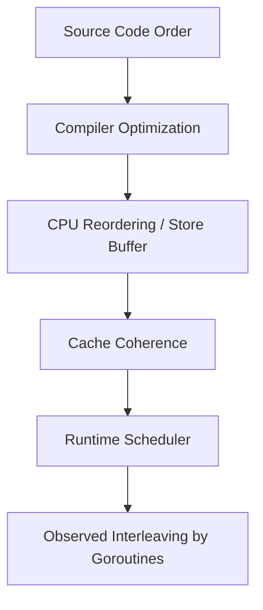
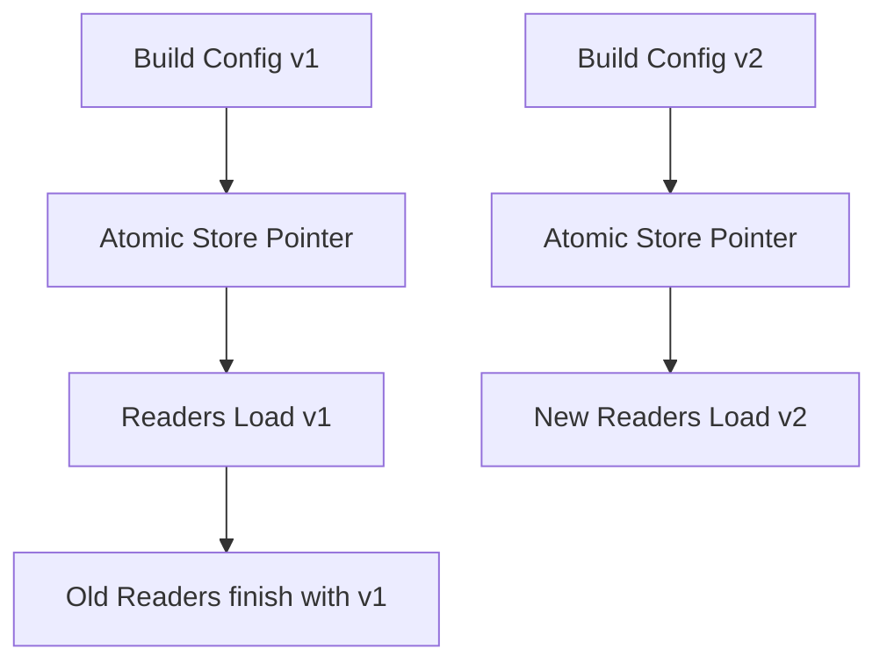
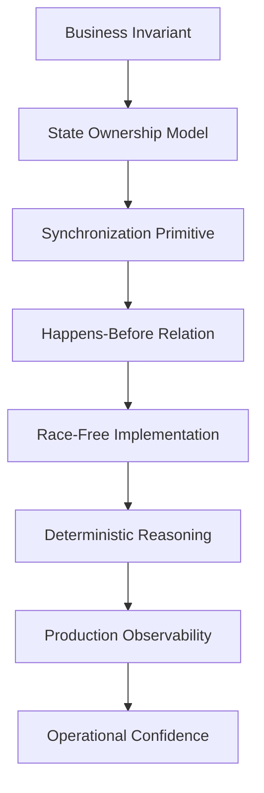

# learn-go-concurrency-parallelism-part-005.md

# Part 005 — Go Memory Model: Happens-Before, Visibility, Race Freedom

> Seri: `learn-go-concurrency-parallelism`  
> Target: Java software engineer yang ingin memahami Go concurrency sampai level production/runtime engineering  
> Fokus part ini: **correctness contract** dari program concurrent Go: visibility, ordering, synchronization, data race, safe publication, dan perbedaan mental model dengan Java Memory Model.

---

## 0. Posisi Part Ini Dalam Seri

Pada part sebelumnya kita sudah membahas:

- Part 000: orientasi Java → Go concurrency.
- Part 001: work, time, state, ordering, contention.
- Part 002: goroutine lifecycle, blocking, parking, leaks.
- Part 003: scheduler G/M/P, run queue, preemption, netpoller.
- Part 004: `GOMAXPROCS`, CPU quota, Kubernetes/container reality.

Semua itu menjelaskan **bagaimana work dijalankan**.

Part ini menjelaskan **kapan hasil kerja concurrent dianggap benar**.

Ini adalah perbedaan yang sangat penting:

```text
Scheduler menjawab:
  "Siapa berjalan kapan?"

Memory model menjawab:
  "Kalau goroutine A menulis sesuatu, kapan goroutine B dijamin melihatnya?"
```

Dalam sistem concurrent, bug paling berbahaya sering bukan bug syntax atau bug algorithm biasa, tetapi bug asumsi:

- “Karena goroutine A sudah menulis, goroutine B pasti melihat.”
- “Karena saya sudah set boolean `done = true`, goroutine lain pasti berhenti.”
- “Karena pointer sudah diassign, object pasti sudah fully initialized.”
- “Karena di Java saya biasa pakai volatile, di Go atomic counter pasti cukup untuk semua state.”
- “Karena di laptop aman, di production juga aman.”

Memory model menghancurkan asumsi-asumsi ini.

---

## 1. Tujuan Pembelajaran

Setelah menyelesaikan bagian ini, Anda diharapkan mampu:

1. Menjelaskan kenapa program concurrent butuh kontrak memory visibility.
2. Membedakan **program order**, **synchronizes-before**, dan **happens-before**.
3. Menentukan apakah sebuah akses shared state memiliki data race.
4. Mendesain safe publication di Go.
5. Memilih channel, mutex, atomic, atau immutable snapshot berdasarkan invariant yang dijaga.
6. Mengenali pola race yang tidak selalu terlihat di review dangkal.
7. Membandingkan Go Memory Model dengan Java Memory Model tanpa menyamakan keduanya secara keliru.
8. Menulis concurrency code yang “boring but correct”.

---

## 2. Masalah Dasar: CPU Tidak Menjalankan Program Seperti Cerita Linear Kita

Ketika membaca kode seperti ini:

```go
var ready bool
var value int

func writer() {
    value = 42
    ready = true
}

func reader() {
    for !ready {
    }
    fmt.Println(value)
}
```

Secara manusia kita membaca:

```text
writer:
  1. set value = 42
  2. set ready = true

reader:
  1. tunggu ready true
  2. baca value
```

Lalu kita tergoda menyimpulkan:

```text
Kalau reader melihat ready == true,
reader pasti melihat value == 42.
```

Kesimpulan ini **tidak valid** di Go jika tidak ada synchronization.

Kenapa?

Karena sistem nyata memiliki banyak layer:



Compiler, CPU, cache, dan scheduler boleh melakukan banyak hal selama hasil single-threaded tetap sesuai kontrak. Dalam concurrent program, “sesuai kontrak” harus didefinisikan oleh memory model.

Tanpa synchronization, Anda tidak boleh membangun correctness dari intuisi “baris kode di atas pasti terlihat duluan”.

---

## 3. Definisi Inti

### 3.1 Memory Location

Memory location adalah lokasi data yang dapat dibaca/ditulis:

- variable scalar
- field struct
- element array/slice
- map entry secara konseptual
- pointer target
- bagian dari interface/string/slice header

Dalam diskusi race, kita peduli apakah dua operasi mengakses **memory location yang sama**.

Contoh:

```go
type Counter struct {
    A int64
    B int64
}
```

Akses ke `c.A` dan `c.B` adalah field berbeda, tetapi masih bisa memiliki performance issue seperti false sharing. Untuk correctness race, yang utama adalah apakah operasi menyentuh location yang sama.

---

### 3.2 Read-like dan Write-like Operation

Dalam Go Memory Model, operasi dibedakan secara konseptual:

Read-like:

- read variable biasa
- receive channel
- atomic load
- mutex lock secara synchronization sense

Write-like:

- write variable biasa
- send channel
- close channel
- atomic store
- mutex unlock secara synchronization sense

Tidak semua operasi ini “read/write” dalam arti source code biasa, tetapi dalam memory model mereka dapat membentuk ordering.

---

### 3.3 Program Order / Sequenced-Before

Dalam satu goroutine, statement punya urutan eksekusi sesuai semantics bahasa.

Contoh:

```go
x = 1
 y = 2
```

Dalam goroutine yang sama, assignment `x = 1` terjadi sebelum `y = 2` menurut program order.

Tetapi program order **hanya berlaku di dalam satu goroutine**.

Masalah concurrency muncul saat kita ingin mengatakan:

```text
Write di goroutine A terlihat oleh read di goroutine B.
```

Untuk itu, perlu hubungan synchronization.

---

### 3.4 Synchronizes-Before

Synchronizes-before adalah hubungan ordering yang dibentuk oleh primitive synchronization.

Contoh sumber synchronization di Go:

- channel send → matching receive
- channel close → receive yang melihat closed
- mutex unlock → lock berikutnya pada mutex yang sama
- atomic operation tertentu
- `sync.Once`
- `WaitGroup` synchronization tertentu
- package-level initialization

Contoh:

```go
var x int
ch := make(chan struct{})

go func() {
    x = 42
    ch <- struct{}{}
}()

<-ch
fmt.Println(x) // guaranteed melihat x = 42
```

Kenapa aman?

Karena:

```text
x = 42
  sequenced-before
send ch
  synchronizes-before
receive ch
  sequenced-before
read x
```

Rantai ini membentuk happens-before.

---

### 3.5 Happens-Before

Happens-before adalah transitive closure dari:

- sequenced-before
- synchronizes-before

Artinya, jika A happens-before B, maka efek A harus terlihat oleh B sesuai kontrak memory model.

Diagram:

```mermaid
flowchart LR
    A[x = 42] -->|sequenced-before| B[ch <- struct{}{}]
    B -->|synchronizes-before| C[<-ch]
    C -->|sequenced-before| D[fmt.Println x]
    A -. happens-before .-> D
```

Inilah grammar paling penting dalam Go concurrency correctness.

Anda tidak bertanya:

```text
"Apakah secara praktis goroutine B biasanya melihat data?"
```

Anda bertanya:

```text
"Apakah ada happens-before path dari write ke read?"
```

Jika tidak ada, program Anda mungkin bergantung pada undefined/invalid concurrency assumption.

---

## 4. Data Race: Definisi Engineering

Sebuah data race terjadi ketika:

1. Dua goroutine mengakses memory location yang sama.
2. Setidaknya salah satunya adalah write.
3. Akses tersebut concurrent.
4. Tidak ada synchronization/happens-before yang mengatur ordering di antara keduanya.

Contoh race paling sederhana:

```go
var x int

go func() {
    x++
}()

go func() {
    x++
}()
```

`x++` bukan satu operasi atomik. Ia biasanya terdiri dari:

```text
load x
add 1
store x
```

Interleaving mungkin:

```text
G1 load x = 0
G2 load x = 0
G1 store x = 1
G2 store x = 1
```

Hasil akhir 1, bukan 2.

Tetapi masalah data race bukan hanya lost update. Masalah lebih dalamnya adalah: program tidak punya kontrak visibility yang sah.

---

## 5. DRF-SC: Prinsip yang Harus Diingat

Go Memory Model memberi prinsip penting:

```text
Data-race-free programs behave as if goroutines are multiplexed on a single processor.
```

Ini sering disebut DRF-SC:

```text
Data-Race-Free => Sequential Consistency
```

Artinya, jika program Anda bebas data race, Anda dapat bernalar seolah-olah operasi goroutine disusun dalam satu interleaving global yang masuk akal.

Tetapi jika program punya data race, reasoning menjadi rapuh.

Untuk engineer senior, ini berarti:

```text
Correctness goal pertama dalam Go concurrent code:
  jadikan program data-race-free.

Optimization goal datang setelah itu.
```

---

## 6. Kenapa “Terlihat Aman” Belum Tentu Aman

### 6.1 Busy Wait Flag Tanpa Atomic

Buruk:

```go
var done bool

func worker() {
    // work
    done = true
}

func main() {
    go worker()
    for !done {
    }
}
```

Masalah:

- `done` dibaca dan ditulis concurrent.
- Tidak ada synchronization.
- Compiler/runtime tidak wajib membuat write terlihat ke loop reader.
- Loop dapat dioptimasi atau berperilaku tidak sesuai asumsi.

Benar dengan channel:

```go
done := make(chan struct{})

go func() {
    // work
    close(done)
}()

<-done
```

Benar dengan atomic:

```go
var done atomic.Bool

go func() {
    // work
    done.Store(true)
}()

for !done.Load() {
    runtime.Gosched()
}
```

Namun atomic busy wait biasanya bukan desain ideal untuk application-level code. Channel/context lebih sering lebih tepat.

---

### 6.2 Pointer Publication Tanpa Synchronization

Buruk:

```go
type Config struct {
    Host string
    Port int
}

var global *Config

func load() {
    cfg := &Config{Host: "localhost", Port: 8080}
    global = cfg
}

func use() {
    if global != nil {
        fmt.Println(global.Host, global.Port)
    }
}
```

Jika `load` dan `use` berjalan concurrent tanpa synchronization, ada data race pada `global`. Lebih halus lagi, reader tidak punya jaminan melihat initialization object secara benar.

Benar dengan `atomic.Pointer`:

```go
type Config struct {
    Host string
    Port int
}

var global atomic.Pointer[Config]

func load() {
    cfg := &Config{Host: "localhost", Port: 8080}
    global.Store(cfg)
}

func use() {
    cfg := global.Load()
    if cfg != nil {
        fmt.Println(cfg.Host, cfg.Port)
    }
}
```

Namun ini aman hanya jika `Config` setelah dipublish bersifat immutable, atau mutasinya juga disinkronkan.

---

### 6.3 Slice Header Race

Buruk:

```go
var items []int

func appendItem(v int) {
    items = append(items, v)
}

func readItems() []int {
    return items
}
```

Slice header terdiri dari:

```text
pointer
length
capacity
```

Concurrent read/write terhadap slice header dapat menghasilkan state campuran. Ini bukan sekadar “panjangnya salah”, tetapi bisa merusak asumsi pointer/len/cap.

Benar dengan mutex:

```go
type Store struct {
    mu    sync.RWMutex
    items []int
}

func (s *Store) Append(v int) {
    s.mu.Lock()
    defer s.mu.Unlock()
    s.items = append(s.items, v)
}

func (s *Store) Snapshot() []int {
    s.mu.RLock()
    defer s.mu.RUnlock()

    out := make([]int, len(s.items))
    copy(out, s.items)
    return out
}
```

Kenapa return copy?

Karena jika kita return backing array asli, caller dapat membaca/mutasi tanpa lock.

---

### 6.4 Interface Race

Interface value secara runtime memiliki pasangan informasi:

```text
type information
value pointer/data
```

Concurrent write/read terhadap interface variable dapat menghasilkan kombinasi tidak valid secara konseptual.

Buruk:

```go
var current any

func writer() {
    current = &Config{Host: "a"}
}

func reader() {
    fmt.Println(current)
}
```

Benar:

```go
var current atomic.Value

func writer() {
    current.Store(&Config{Host: "a"})
}

func reader() {
    v := current.Load()
    if cfg, ok := v.(*Config); ok {
        fmt.Println(cfg.Host)
    }
}
```

Catatan: `atomic.Value` punya constraint type consistency. Jangan digunakan sebagai “tempat sampah any concurrent” tanpa disiplin.

---

## 7. Primitive Synchronization dan Memory Ordering

### 7.1 Channel Send/Receive

Unbuffered channel:

```go
ch := make(chan int)

var x int

go func() {
    x = 10
    ch <- 1
}()

<-ch
fmt.Println(x) // safe
```

Mental model:

```text
send pada channel happens-before receive yang menerima value tersebut.
```

Buffered channel juga memberikan synchronization, tetapi reasoning bisa lebih rumit karena send tidak selalu berpasangan langsung dengan receive secara temporal seperti unbuffered rendezvous.

Contoh:

```go
ch := make(chan int, 1)
var x int

x = 1
ch <- 10

// goroutine lain receive 10
```

Receive yang menerima value dari send tersebut melihat efek yang happens-before send.

---

### 7.2 Channel Close

Close channel dapat menjadi broadcast signal.

```go
var config *Config
ready := make(chan struct{})

go func() {
    config = loadConfig()
    close(ready)
}()

<-ready
fmt.Println(config.Host)
```

Receive dari closed channel yang mengamati close dapat melihat write sebelum close.

Pattern ini umum untuk one-time readiness.

Tetapi jangan salah gunakan close sebagai general-purpose event bus.

---

### 7.3 Mutex Unlock/Lock

```go
type Counter struct {
    mu sync.Mutex
    n  int
}

func (c *Counter) Inc() {
    c.mu.Lock()
    defer c.mu.Unlock()
    c.n++
}

func (c *Counter) Value() int {
    c.mu.Lock()
    defer c.mu.Unlock()
    return c.n
}
```

Memory model penting:

```text
Unlock happens-before subsequent Lock pada mutex yang sama.
```

Karena itu write dalam critical section sebelumnya terlihat oleh critical section berikutnya.

Mutex bukan hanya mutual exclusion. Mutex juga visibility boundary.

---

### 7.4 RWMutex

`RWMutex` memberi shared read lock dan exclusive write lock.

Namun correctness-nya tetap sama:

- write harus di bawah `Lock`
- read harus di bawah `RLock` jika membaca state yang sama
- jangan “optimasi” read tanpa lock kecuali state immutable/atomic/snapshot

Buruk:

```go
type Cache struct {
    mu sync.RWMutex
    m  map[string]string
}

func (c *Cache) Get(k string) string {
    return c.m[k] // race jika writer memakai lock tapi reader tidak
}
```

Benar:

```go
func (c *Cache) Get(k string) string {
    c.mu.RLock()
    defer c.mu.RUnlock()
    return c.m[k]
}
```

Lock discipline harus konsisten. Satu path tanpa lock merusak keseluruhan invariant.

---

### 7.5 Once

`sync.Once` digunakan untuk one-time initialization.

```go
var once sync.Once
var cfg *Config

func ConfigInstance() *Config {
    once.Do(func() {
        cfg = loadConfig()
    })
    return cfg
}
```

`Once` bukan hanya mencegah fungsi berjalan dua kali, tetapi juga memastikan visibility initialization ke caller setelah `Do` selesai.

Go versi modern juga memiliki helper seperti `OnceFunc`, `OnceValue`, dan `OnceValues`.

---

### 7.6 WaitGroup

`WaitGroup` terutama coordination primitive untuk menunggu completion.

```go
var wg sync.WaitGroup
var result int

wg.Add(1)
go func() {
    defer wg.Done()
    result = 42
}()

wg.Wait()
fmt.Println(result)
```

Secara praktik ini pola umum. Namun desain yang lebih sehat tetap perlu memperhatikan:

- `Add` harus dilakukan sebelum goroutine mulai jika counter dari zero.
- Jangan copy `WaitGroup` setelah digunakan.
- Jangan pakai `WaitGroup` untuk error propagation.
- Jangan jadikan `WaitGroup` sebagai lifecycle tanpa cancellation.

Go 1.25 menambahkan `WaitGroup.Go`, tetapi prinsip ownership tetap sama: siapa spawn, dia harus wait/cancel/observe.

---

### 7.7 Atomic

Atomic memberi synchronization level rendah.

```go
var counter atomic.Int64

func inc() {
    counter.Add(1)
}

func value() int64 {
    return counter.Load()
}
```

Atomic cocok untuk:

- counter
- flag sederhana
- pointer publication immutable snapshot
- lock-free read path yang invariant-nya sangat sederhana

Atomic tidak cocok untuk:

- multi-field invariant kompleks
- “setengah state pakai atomic, setengah state biasa”
- menggantikan desain ownership
- menghindari mutex hanya karena “mutex kelihatan lambat”

Peringatan penting:

```text
Atomic membuat operasi individual aman,
tetapi tidak otomatis membuat keseluruhan invariant aman.
```

---

## 8. Safe Publication

Safe publication berarti object yang dibuat oleh satu goroutine dipublikasikan ke goroutine lain dengan synchronization yang menjamin:

1. Reader melihat pointer/reference yang benar.
2. Reader melihat isi object yang sudah diinisialisasi.
3. Object tidak dimutasi tanpa synchronization setelah publish, kecuali memang didesain aman.

---

### 8.1 Safe Publication dengan Channel

```go
type Config struct {
    Host string
    Port int
}

func loader(out chan<- *Config) {
    cfg := &Config{Host: "localhost", Port: 8080}
    out <- cfg
}

func main() {
    ch := make(chan *Config)
    go loader(ch)

    cfg := <-ch
    fmt.Println(cfg.Host, cfg.Port)
}
```

Channel send/receive menjadi publication boundary.

---

### 8.2 Safe Publication dengan Mutex

```go
type ConfigHolder struct {
    mu  sync.RWMutex
    cfg *Config
}

func (h *ConfigHolder) Store(cfg *Config) {
    h.mu.Lock()
    defer h.mu.Unlock()
    h.cfg = cfg
}

func (h *ConfigHolder) Load() *Config {
    h.mu.RLock()
    defer h.mu.RUnlock()
    return h.cfg
}
```

Tetapi hati-hati: return pointer mutable berarti caller dapat mutate tanpa lock.

Lebih aman:

```go
func (h *ConfigHolder) LoadCopy() Config {
    h.mu.RLock()
    defer h.mu.RUnlock()
    return *h.cfg
}
```

Atau buat `Config` immutable by convention.

---

### 8.3 Safe Publication dengan Atomic Pointer Immutable Snapshot

```go
type Config struct {
    Host string
    Port int
}

var current atomic.Pointer[Config]

func Reload() {
    cfg := &Config{Host: "localhost", Port: 8080}
    current.Store(cfg)
}

func Current() *Config {
    return current.Load()
}
```

Ini pattern kuat untuk read-mostly config.

Invariant:

```text
Setelah Config dipublish, Config tidak boleh dimutasi.
Reload membuat object baru, lalu atomic swap pointer.
```

Diagram:



Ini adalah copy-on-write publication.

---

## 9. Invariant: Unit Correctness yang Sering Dilupakan

Data race detection bicara memory location. Tetapi software correctness bicara invariant.

Contoh:

```go
type Account struct {
    Balance int64
    Version int64
}
```

Anda bisa membuat `Balance` dan `Version` masing-masing atomic:

```go
var balance atomic.Int64
var version atomic.Int64
```

Tetapi invariant mungkin:

```text
Setiap perubahan balance harus menaikkan version tepat satu kali.
Reader harus melihat pasangan balance-version yang konsisten.
```

Jika reader melakukan:

```go
b := balance.Load()
v := version.Load()
```

Ia bisa melihat kombinasi dari dua update berbeda.

Contoh interleaving:

```text
Initial: balance=100, version=1
Writer: balance=150
Reader: load balance=150
Writer: version=2
Reader: load version=2
```

Ini terlihat konsisten.

Tetapi interleaving lain:

```text
Writer update #1: balance=150, version=2
Writer update #2: balance=120, version=3
Reader: load balance=120
Reader: load version=2
```

Reader melihat state yang tidak pernah eksis sebagai satu snapshot valid.

Solusi sering lebih sederhana dengan mutex:

```go
type Account struct {
    mu      sync.Mutex
    balance int64
    version int64
}

func (a *Account) Update(delta int64) {
    a.mu.Lock()
    defer a.mu.Unlock()
    a.balance += delta
    a.version++
}

func (a *Account) Snapshot() (balance, version int64) {
    a.mu.Lock()
    defer a.mu.Unlock()
    return a.balance, a.version
}
```

Top 1% rule:

```text
Protect invariants, not variables.
```

---

## 10. Channel vs Mutex vs Atomic: Memory Model Perspective

### 10.1 Channel

Gunakan channel ketika:

- ownership berpindah
- event/handoff penting
- goroutine lifecycle jelas
- cancellation dan closure bisa didesain eksplisit
- pipeline atau worker coordination natural

Channel cocok untuk:

```text
"Data ini bergerak dari owner A ke owner B."
```

---

### 10.2 Mutex

Gunakan mutex ketika:

- ada shared state dengan invariant
- operasi harus transactional terhadap beberapa field
- API sync lebih sederhana
- caller tidak perlu tahu internal goroutine

Mutex cocok untuk:

```text
"State ini tetap di satu tempat, beberapa goroutine boleh akses dengan critical section."
```

---

### 10.3 Atomic

Gunakan atomic ketika:

- invariant sederhana
- single variable atau pointer snapshot
- high-read low-write pattern
- Anda bisa membuktikan correctness tanpa “semoga”

Atomic cocok untuk:

```text
"Saya butuh operasi memory tunggal yang synchronized dan invariant-nya tidak melebar."
```

---

### 10.4 Decision Table

| Situasi | Primitive Awal yang Disarankan | Alasan |
|---|---:|---|
| Counter metrics | Atomic | Single numeric state |
| Map mutable shared | Mutex/RWMutex | Map tidak safe untuk concurrent mutation |
| Config reload read-mostly | Atomic pointer immutable snapshot | Publish whole snapshot |
| Multi-field invariant | Mutex | Critical section menjaga consistency |
| Pipeline stage | Channel + context | Ownership dan lifecycle natural |
| Broadcast shutdown | close channel atau context | One-to-many signal |
| Request cancellation | context | Standard propagation contract |
| Dedup per key | Mutex + map / singleflight | Invariant per key |
| Fast path cache read | RWMutex or atomic snapshot | Tergantung write rate dan invariant |

---

## 11. Perbandingan dengan Java Memory Model

Sebagai Java engineer, Anda mungkin familiar dengan:

- `synchronized`
- `volatile`
- `final`
- `AtomicInteger`
- `ConcurrentHashMap`
- `ExecutorService`
- `CompletableFuture`
- `Thread.start` / `Thread.join`
- virtual threads

Go punya beberapa kesamaan konseptual, tetapi mapping 1:1 sering menyesatkan.

---

### 11.1 Java `synchronized` vs Go `sync.Mutex`

Mirip:

- mutual exclusion
- visibility boundary
- unlock/lock membentuk happens-before-like relation

Berbeda:

- Java `synchronized` terikat object monitor.
- Go `sync.Mutex` adalah value field eksplisit.
- Go mutex tidak reentrant.
- Go mutex tidak punya condition wait bawaan; ada `sync.Cond`.
- Jangan copy mutex setelah digunakan.

Java:

```java
synchronized (lock) {
    state++;
}
```

Go:

```go
mu.Lock()
state++
mu.Unlock()
```

Go lebih eksplisit dan lebih mudah salah jika lock/unlock tidak dipasangkan dengan benar. Karena itu `defer mu.Unlock()` sering dipakai, meski pada hot path perlu dipertimbangkan cost-nya.

---

### 11.2 Java `volatile` vs Go `sync/atomic`

Java `volatile` sering digunakan untuk visibility flag:

```java
volatile boolean running = true;
```

Di Go, jangan pakai variable biasa untuk itu.

Gunakan:

```go
var running atomic.Bool
```

Namun di Go application-level, sering lebih idiomatic:

```go
ctx, cancel := context.WithCancel(context.Background())
```

atau:

```go
done := make(chan struct{})
close(done)
```

Atomic adalah primitive rendah, bukan default coordination style.

---

### 11.3 Java `Thread.join` vs Go `WaitGroup`

Java:

```java
thread.start();
thread.join();
```

Go:

```go
var wg sync.WaitGroup
wg.Go(func() {
    work()
})
wg.Wait()
```

Atau pre-Go 1.25 style:

```go
wg.Add(1)
go func() {
    defer wg.Done()
    work()
}()
wg.Wait()
```

Tetapi Go goroutine tidak punya handle built-in seperti Java `Thread`. Ownership harus Anda desain sendiri.

---

### 11.4 Java Concurrent Collections vs Go Minimalism

Java punya banyak concurrent collections built-in.

Go standard library lebih minimal:

- `sync.Map` untuk use case tertentu
- `map` + `Mutex` untuk banyak kasus umum
- channel untuk ownership transfer
- atomic untuk low-level state

Jangan mencari `ConcurrentHashMap` equivalent sebagai default. Di Go, desain state ownership sering lebih penting daripada memilih collection.

---

## 12. Race Pattern yang Sering Muncul di Production

### 12.1 Loop Variable Capture

Modern Go sudah memperbaiki banyak kasus loop variable capture untuk range variables di versi baru, tetapi mental model closure tetap penting.

Masalah umum:

```go
for _, job := range jobs {
    go func() {
        process(job)
    }()
}
```

Pada Go modern, range variable behavior sudah lebih aman dibanding historis. Namun bug closure masih mungkin jika variable luar dimutasi.

Aman eksplisit:

```go
for _, job := range jobs {
    job := job
    go func() {
        process(job)
    }()
}
```

Style ini tetap jelas untuk reviewer lintas versi/mental model.

---

### 12.2 Shared Error Variable

Buruk:

```go
var err error

for _, task := range tasks {
    go func(task Task) {
        if e := run(task); e != nil {
            err = e // race
        }
    }(task)
}
```

Benar dengan channel:

```go
errCh := make(chan error, len(tasks))

for _, task := range tasks {
    task := task
    go func() {
        errCh <- run(task)
    }()
}

for range tasks {
    if err := <-errCh; err != nil {
        // handle
    }
}
```

Atau gunakan `errgroup` untuk structured error propagation.

---

### 12.3 Shared Map

Buruk:

```go
m := map[string]int{}

go func() { m["a"] = 1 }()
go func() { fmt.Println(m["a"]) }()
```

Map tidak aman untuk concurrent mutation. Bahkan read concurrent dengan write bisa fatal.

Benar:

```go
type SafeMap struct {
    mu sync.RWMutex
    m  map[string]int
}
```

atau `sync.Map` jika use case cocok.

---

### 12.4 Send-Close Race

Buruk:

```go
ch := make(chan int)

go func() {
    ch <- 1
}()

go func() {
    close(ch)
}()
```

Jika close terjadi saat sender masih bisa send, panic.

Rule:

```text
Channel close harus dilakukan oleh owner yang tahu tidak ada sender lagi.
```

Multi-sender channel biasanya perlu:

- WaitGroup untuk sender completion
- dedicated closer goroutine
- context cancellation alih-alih close data channel

Benar:

```go
ch := make(chan int)
var wg sync.WaitGroup

for _, v := range []int{1, 2, 3} {
    v := v
    wg.Add(1)
    go func() {
        defer wg.Done()
        ch <- v
    }()
}

go func() {
    wg.Wait()
    close(ch)
}()

for v := range ch {
    fmt.Println(v)
}
```

---

### 12.5 Publishing Mutable Slice

Buruk:

```go
func (s *Store) Items() []Item {
    s.mu.RLock()
    defer s.mu.RUnlock()
    return s.items
}
```

Caller menerima slice header yang menunjuk backing array internal.

Benar:

```go
func (s *Store) Items() []Item {
    s.mu.RLock()
    defer s.mu.RUnlock()
    out := make([]Item, len(s.items))
    copy(out, s.items)
    return out
}
```

Atau expose iterator/callback di dalam lock dengan hati-hati.

---

## 13. Race Detector: Sangat Berguna, Tetapi Bukan Bukti Formal

Go race detector dapat dijalankan dengan:

```bash
go test -race ./...
```

Atau:

```bash
go run -race ./cmd/app
```

Ia sangat berguna untuk menemukan data race pada path yang dieksekusi.

Tetapi batasannya penting:

```text
Race detector hanya menemukan race yang benar-benar terjadi saat runtime test/run tersebut.
```

Artinya:

- path yang tidak dites tidak dianalisis secara dinamis
- interleaving langka bisa lolos
- workload production bisa memicu race yang test tidak memicu
- overhead race detector besar, sehingga tidak selalu cocok untuk semua load test

Strategy production-grade:

```text
1. Unit test normal.
2. Unit/integration test dengan -race.
3. Stress test untuk concurrency-heavy component.
4. Fuzz/property test jika state machine kompleks.
5. Code review berbasis happens-before reasoning.
```

---

## 14. Happens-Before Reasoning Workflow

Gunakan workflow ini saat review code concurrent.

### Step 1 — Identifikasi Shared State

Tanya:

```text
Data apa yang bisa diakses lebih dari satu goroutine?
```

Contoh:

- map cache
- config pointer
- queue
- stats counter
- boolean shutdown flag
- slice buffer
- connection state
- retry state

---

### Step 2 — Identifikasi Semua Read dan Write

Buat daftar:

```text
State: cache map
Writes:
  - Put
  - Delete
  - Refresh
Reads:
  - Get
  - Snapshot
  - Metrics
```

Sering terjadi race dari path “tidak penting” seperti metrics/debug endpoint.

---

### Step 3 — Tentukan Invariant

Contoh:

```text
cache map dan expiry map harus berubah bersama.
```

Jika invariant melibatkan dua field, lock harus melindungi keduanya.

---

### Step 4 — Cari Happens-Before Path

Untuk setiap read yang bisa concurrent dengan write, tanya:

```text
Apa synchronization edge-nya?
```

Kemungkinan jawaban valid:

- same mutex lock discipline
- channel send/receive
- channel close/receive
- atomic load/store
- once initialization
- wait completion
- immutable before publish

Jika jawabannya:

```text
"Seharusnya goroutine ini selesai duluan."
```

Tanya lagi:

```text
"Dijamin oleh apa?"
```

Jika tidak ada primitive synchronization, itu asumsi, bukan kontrak.

---

### Step 5 — Pastikan Lifecycle Tidak Membocorkan Access

Contoh:

```go
func (s *Server) Stop() {
    close(s.done)
}
```

Pertanyaan:

- Apakah semua goroutine sudah berhenti sebelum state dihancurkan?
- Apakah masih ada goroutine yang bisa write ke channel setelah close?
- Apakah callback masih bisa membaca object setelah Stop return?
- Apakah context cancellation ditunggu sampai quiescent?

Memory safety dan lifecycle safety saling terkait.

---

## 15. Diagram: Membentuk Happens-Before dengan Primitive Berbeda

```mermaid
flowchart TB
    subgraph Channel
        A1[write x] --> A2[send ch]
        A2 --> A3[receive ch]
        A3 --> A4[read x]
    end

    subgraph Mutex
        B1[lock mu] --> B2[write state]
        B2 --> B3[unlock mu]
        B3 --> B4[next lock mu]
        B4 --> B5[read state]
    end

    subgraph Atomic
        C1[build immutable object] --> C2[atomic store pointer]
        C2 --> C3[atomic load pointer]
        C3 --> C4[read immutable object]
    end

    subgraph Close
        D1[initialize state] --> D2[close ready]
        D2 --> D3[receive from ready]
        D3 --> D4[read initialized state]
    end
```



---

## 16. Advanced Topic: Atomic Pointer Snapshot Pattern

Pattern ini banyak dipakai untuk:

- config reload
- routing table
- feature flag snapshot
- auth policy snapshot
- compiled regex/rule set
- read-mostly lookup table

Contoh:

```go
type PolicySet struct {
    Version string
    Rules   map[string]Rule
}

type PolicyStore struct {
    current atomic.Pointer[PolicySet]
}

func NewPolicyStore(initial *PolicySet) *PolicyStore {
    s := &PolicyStore{}
    s.current.Store(clonePolicySet(initial))
    return s
}

func (s *PolicyStore) Current() *PolicySet {
    return s.current.Load()
}

func (s *PolicyStore) Reload(next *PolicySet) {
    snapshot := clonePolicySet(next)
    s.current.Store(snapshot)
}
```

Tetapi ada rule keras:

```text
PolicySet dan map di dalamnya harus immutable setelah Store.
```

Jika map masih dimutasi setelah publish:

```go
snapshot.Rules["x"] = newRule // dangerous jika readers concurrent
```

Maka atomic pointer tidak cukup. Anda hanya membuat pointer swap aman, bukan object graph mutation aman.

Correct immutable clone:

```go
func clonePolicySet(in *PolicySet) *PolicySet {
    rules := make(map[string]Rule, len(in.Rules))
    for k, v := range in.Rules {
        rules[k] = v
    }
    return &PolicySet{
        Version: in.Version,
        Rules:   rules,
    }
}
```

---

## 17. Advanced Topic: Double-Checked Locking

Di banyak bahasa, double-checked locking sering menjadi sumber bug jika memory model tidak dipahami.

Buruk di Go jika memakai variable biasa:

```go
var instance *Client
var mu sync.Mutex

func GetClient() *Client {
    if instance != nil {
        return instance
    }

    mu.Lock()
    defer mu.Unlock()

    if instance == nil {
        instance = NewClient()
    }
    return instance
}
```

Masalah: read pertama terhadap `instance` tidak disinkronkan dengan write di bawah lock.

Lebih sederhana:

```go
var once sync.Once
var instance *Client

func GetClient() *Client {
    once.Do(func() {
        instance = NewClient()
    })
    return instance
}
```

Atau gunakan atomic pointer jika benar-benar butuh fast path, tetapi kompleksitasnya jarang worth it untuk initialization biasa.

Top 1% heuristic:

```text
Gunakan sync.Once untuk initialization.
Jangan menulis double-checked locking kecuali Anda bisa menjelaskan memory model-nya secara formal.
```

---

## 18. Advanced Topic: Benign Race Itu Hampir Selalu Bohong

Kadang engineer berkata:

```text
"Race ini benign, hanya metrics."
```

Contoh:

```go
var requests int64

func handler() {
    requests++
}

func metrics() int64 {
    return requests
}
```

Ini race.

Benar:

```go
var requests atomic.Int64

func handler() {
    requests.Add(1)
}

func metrics() int64 {
    return requests.Load()
}
```

Untuk metrics counter, atomic murah dan jelas. Tidak ada alasan membiarkan race.

Benign race berbahaya karena:

- membiasakan tim mengabaikan race detector
- menyembunyikan race lain dalam noise
- membuat correctness review tidak tegas
- bisa berubah tidak benign saat refactor

Engineering policy yang sehat:

```text
Production code should be race-clean.
```

Jika ada pengecualian low-level ekstrem, dokumentasikan dengan sangat eksplisit dan isolasi.

---

## 19. Memory Model dan API Design

API concurrent harus menjawab:

1. Apakah type ini safe for concurrent use?
2. Method mana yang boleh dipanggil concurrent?
3. Siapa owner state?
4. Apakah returned data immutable/copy/live view?
5. Siapa yang boleh close channel?
6. Apakah callback dipanggil concurrent?
7. Apakah `Stop` menunggu semua goroutine selesai?
8. Apakah `Start` idempotent?
9. Apakah object boleh digunakan setelah `Close`?

Contoh dokumentasi buruk:

```go
// Cache stores values.
type Cache struct { ... }
```

Dokumentasi lebih baik:

```go
// Cache is safe for concurrent use by multiple goroutines.
// Values returned by Get are immutable snapshots owned by the caller.
// Close stops background refresh and waits until all internal goroutines exit.
type Cache struct { ... }
```

Jika tidak safe:

```go
// Builder is not safe for concurrent use.
// Callers must serialize all method calls.
type Builder struct { ... }
```

Ambiguity adalah sumber race.

---

## 20. Memory Model dan Clean Architecture / Service Design

Dalam service besar, race sering muncul di layer yang dianggap “infrastructure”:

- config reload
- auth policy cache
- token cache
- HTTP client registry
- DB connection wrapper
- background scheduler
- metrics collector
- websocket/session map
- in-memory rate limiter
- feature flag client

Contoh desain buruk:

```text
Handler goroutine reads policy map directly.
Background goroutine refreshes policy map every 1 minute.
No synchronization.
```

Desain lebih baik:

```text
Background goroutine builds new immutable policy snapshot.
After fully built, atomic pointer swaps current snapshot.
Handlers atomic-load current snapshot and never mutate it.
```

Atau:

```text
All access to mutable policy map goes through PolicyStore methods guarded by RWMutex.
```

Pilihan tergantung read/write ratio dan invariant.

---

## 21. Checklist Code Review: Go Memory Model

Gunakan checklist ini saat review PR.

### Shared State

- [ ] Apakah ada variable yang diakses lebih dari satu goroutine?
- [ ] Apakah semua read/write shared state teridentifikasi?
- [ ] Apakah metrics/debug path ikut dianalisis?
- [ ] Apakah callback bisa dipanggil concurrent?

### Synchronization

- [ ] Apakah setiap write-read concurrent punya happens-before path?
- [ ] Apakah lock discipline konsisten?
- [ ] Apakah ada read tanpa lock terhadap state yang biasanya protected by lock?
- [ ] Apakah atomic digunakan untuk invariant yang terlalu kompleks?
- [ ] Apakah channel close dilakukan oleh owner yang benar?

### Publication

- [ ] Apakah object dipublish setelah fully initialized?
- [ ] Apakah published object immutable atau protected?
- [ ] Apakah slice/map yang dikembalikan adalah copy atau live internal state?
- [ ] Apakah pointer snapshot tidak dimutasi setelah atomic store?

### Lifecycle

- [ ] Apakah goroutine yang membaca state bisa hidup lebih lama dari owner?
- [ ] Apakah Stop/Close menunggu quiescence jika perlu?
- [ ] Apakah cancellation menghentikan access ke state yang akan dihancurkan?

### Testing

- [ ] Apakah `go test -race ./...` dijalankan?
- [ ] Apakah ada stress test untuk interleaving?
- [ ] Apakah test tidak bergantung pada `time.Sleep` untuk ordering?

---

## 22. Mini Lab 1: Perbaiki Race Counter

### Problem

```go
package counter

type Counter struct {
    n int64
}

func (c *Counter) Inc() {
    c.n++
}

func (c *Counter) Value() int64 {
    return c.n
}
```

### Pertanyaan

1. Di mana race-nya?
2. Apakah solusi atomic cukup?
3. Apakah mutex lebih baik?

### Solusi Atomic

```go
package counter

import "sync/atomic"

type Counter struct {
    n atomic.Int64
}

func (c *Counter) Inc() {
    c.n.Add(1)
}

func (c *Counter) Value() int64 {
    return c.n.Load()
}
```

Atomic cukup karena invariant hanya satu counter numeric.

---

## 23. Mini Lab 2: Perbaiki Config Reload

### Problem

```go
var cfg *Config

func Reload() {
    cfg = LoadConfig()
}

func Current() *Config {
    return cfg
}
```

### Solusi Atomic Snapshot

```go
var cfg atomic.Pointer[Config]

func Reload() error {
    next, err := LoadConfig()
    if err != nil {
        return err
    }
    cfg.Store(next)
    return nil
}

func Current() *Config {
    return cfg.Load()
}
```

Syarat:

```text
Config harus immutable setelah Store.
```

Jika `Config` mengandung map/slice, clone dulu.

---

## 24. Mini Lab 3: Perbaiki Shared Map Cache

### Problem

```go
type Cache struct {
    m map[string]string
}

func (c *Cache) Put(k, v string) {
    c.m[k] = v
}

func (c *Cache) Get(k string) (string, bool) {
    v, ok := c.m[k]
    return v, ok
}
```

### Solusi Mutex

```go
type Cache struct {
    mu sync.RWMutex
    m  map[string]string
}

func NewCache() *Cache {
    return &Cache{m: make(map[string]string)}
}

func (c *Cache) Put(k, v string) {
    c.mu.Lock()
    defer c.mu.Unlock()
    c.m[k] = v
}

func (c *Cache) Get(k string) (string, bool) {
    c.mu.RLock()
    defer c.mu.RUnlock()
    v, ok := c.m[k]
    return v, ok
}
```

Kenapa bukan atomic?

Karena map mutation adalah operasi internal kompleks. Atomic pointer bisa digunakan jika seluruh map adalah immutable snapshot, tetapi bukan untuk mutate map yang sama.

---

## 25. Anti-Pattern Catalog

### Anti-Pattern 1 — Boolean Done Flag Biasa

```go
var done bool
```

Ganti dengan:

- context
- closed channel
- `atomic.Bool`

---

### Anti-Pattern 2 — Lock Saat Write, Tanpa Lock Saat Read

```go
mu.Lock()
state = x
mu.Unlock()

return state // race
```

Semua access shared mutable state harus ikut discipline yang sama.

---

### Anti-Pattern 3 — Atomic untuk Multi-Field State

```go
atomicBalance.Store(...)
atomicVersion.Store(...)
```

Jika reader butuh snapshot konsisten, gunakan mutex atau immutable snapshot.

---

### Anti-Pattern 4 — Return Internal Mutable Slice/Map

```go
return s.items
```

Return copy atau immutable view.

---

### Anti-Pattern 5 — Close Channel dari Receiver

Receiver biasanya tidak tahu apakah sender lain masih akan send.

Rule:

```text
Sender side owns close.
```

Lebih tepat:

```text
The goroutine that can prove no more sends will happen owns close.
```

---

### Anti-Pattern 6 — Mengabaikan Race Karena “Hanya Test”

Race di test sering menunjukkan desain test atau production code tidak punya lifecycle jelas.

---

## 26. Production Heuristics

1. Jika ada shared mutable state, default awal adalah mutex.
2. Jika state berpindah ownership, gunakan channel.
3. Jika state read-mostly dan bisa immutable snapshot, atomic pointer sangat kuat.
4. Jika hanya counter/flag, atomic cukup.
5. Jika invariant lebih dari satu field, atomic biasanya bukan default.
6. Jika API return slice/map, anggap berbahaya sampai terbukti copy/immutable.
7. Jika goroutine dibuat, tentukan siapa owner lifecycle-nya.
8. Jika goroutine membaca object, pastikan object hidup lebih lama atau ada shutdown sync.
9. Jika race detector menemukan race, jangan normalize.
10. Jika tidak bisa menggambar happens-before path, desain belum selesai.

---

## 27. Diagram Besar: Correctness Stack



Jangan mulai dari primitive.

Mulai dari invariant.

Salah:

```text
"Saya mau pakai channel."
```

Benar:

```text
"Invariant apa yang harus dijaga? Siapa owner state? Bagaimana publication/cancellation terjadi? Primitive apa yang paling sederhana?"
```

---

## 28. Latihan Desain: Auth Policy Cache

### Scenario

Service memiliki authorization policy cache:

- Handler membaca policy per request.
- Background job reload policy tiap 30 detik.
- Policy terdiri dari map role → permission list.
- Request rate tinggi.
- Reload jarang.
- Handler tidak boleh block lama.
- Policy harus konsisten per request.

### Desain A — RWMutex

```text
Reload mengambil write lock.
Handler mengambil read lock.
```

Kelebihan:

- sederhana
- mudah benar
- map bisa mutable selama lock

Kekurangan:

- reload bisa block readers
- readers bisa block writer
- request path ada lock overhead

### Desain B — Atomic Immutable Snapshot

```text
Reload build map baru lengkap.
Atomic swap pointer.
Handler load pointer.
Policy tidak pernah dimutasi setelah publish.
```

Kelebihan:

- read path sangat murah
- request tidak block reload
- snapshot konsisten per request

Kekurangan:

- perlu clone lengkap
- memory spike saat reload
- disiplin immutability harus kuat

### Rekomendasi

Untuk read-heavy auth policy cache, desain B sering lebih tepat.

Tetapi hanya jika tim dapat menjamin:

- deep immutability
- tidak ada mutation setelah publish
- reload failure tidak mengganti snapshot lama
- metrics/debug tidak membocorkan mutable map

---

## 29. Ringkasan

Go Memory Model adalah fondasi correctness untuk concurrency.

Hal yang harus melekat:

```text
Tidak cukup bahwa kode "biasanya berjalan benar".
Harus ada happens-before path yang menjamin visibility dan ordering.
```

Prinsip utama:

- Data race terjadi saat shared memory location diakses concurrent, minimal satu write, tanpa synchronization.
- Program bebas data race dapat dinalar secara sequentially consistent.
- Mutex adalah visibility boundary, bukan hanya lock.
- Channel adalah synchronization boundary, bukan hanya queue.
- Atomic adalah low-level synchronization, bukan pengganti desain invariant.
- Safe publication membutuhkan synchronization.
- Immutable snapshot adalah pattern sangat kuat untuk read-mostly concurrent systems.
- Protect invariants, not variables.

---

## 30. Referensi Resmi dan Bacaan Lanjutan

- Go Memory Model — https://go.dev/ref/mem
- Go Data Race Detector — https://go.dev/doc/articles/race_detector
- `sync` package — https://pkg.go.dev/sync
- `sync/atomic` package — https://pkg.go.dev/sync/atomic
- Go 1.25 Release Notes — https://go.dev/doc/go1.25
- Go 1.26 Release Notes — https://go.dev/doc/go1.26
- Go Blog: Context — https://go.dev/blog/context
- Go Blog: Pipelines and Cancellation — https://go.dev/blog/pipelines

---

## 31. Status Seri

Selesai:

- Part 000 — Orientation: Dari Java Threading ke Go Concurrency Engineering
- Part 001 — Foundations: Work, Time, State, Ordering, and Contention
- Part 002 — Goroutine Internals: Lifecycle, Stack, Parking, Blocking, and Leaks
- Part 003 — Go Scheduler Deep Dive: G, M, P, Run Queues, Stealing, Preemption
- Part 004 — GOMAXPROCS, CPU Quotas, Containers, and Kubernetes Reality
- Part 005 — Go Memory Model: Happens-Before, Visibility, Race Freedom

Belum selesai. Berikutnya:

- Part 006 — Synchronization Primitives: Mutex, RWMutex, Cond, Once, Pool


<!-- NAVIGATION_FOOTER -->
<div class="page-nav">
<a href="./learn-go-concurrency-parallelism-part-004.md">⬅️ Part 004 — GOMAXPROCS, CPU Quotas, Containers, dan Realitas Kubernetes</a>
<a href="./index.md">📚 Kategori</a>
<a href="../../index.md">🏠 Home</a>
<a href="./learn-go-concurrency-parallelism-part-006.md">Part 006 — Synchronization Primitives: Mutex, RWMutex, Cond, Once, Pool ➡️</a>
</div>
