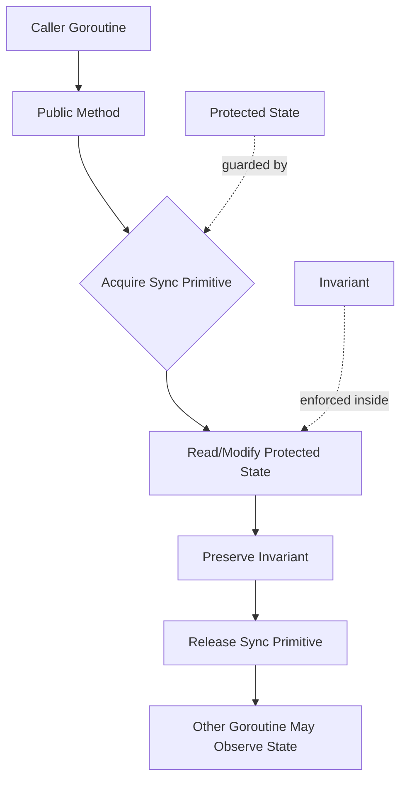
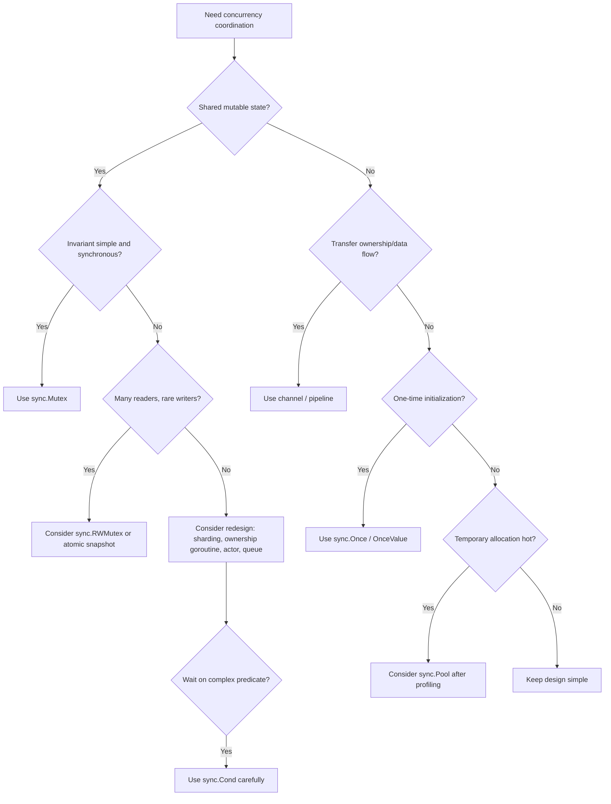

# learn-go-concurrency-parallelism-part-006.md

# Part 006 — Synchronization Primitives: Mutex, RWMutex, Cond, Once, Pool

> Seri: `learn-go-concurrency-parallelism`  
> Bagian: `006 / 034`  
> Target pembaca: Java software engineer yang ingin memahami Go concurrency di level engineering handbook.  
> Fokus: `sync.Mutex`, `sync.RWMutex`, `sync.Cond`, `sync.Once`, `sync.Pool`, invariant, memory ordering, contention, production failure mode, dan decision-making.

---

## 0. Posisi Part Ini di Dalam Seri

Di Part 005 kita membahas **Go Memory Model**: visibility, happens-before, synchronized-before, data race, dan safe publication. Part ini adalah aplikasi langsung dari konsep tersebut pada primitive sinkronisasi Go.

Kalau Part 005 menjawab:

> “Kapan suatu goroutine boleh melihat perubahan yang dilakukan goroutine lain?”

Maka Part 006 menjawab:

> “Primitive apa yang harus saya pakai untuk melindungi invariant, bagaimana cara kerjanya, kapan salah pakai, dan bagaimana membaca failure-nya di production?”

Kita tidak akan membahas `WaitGroup` secara mendalam di sini karena itu mendapat bagian khusus di Part 010. Namun beberapa referensi singkat mungkin muncul ketika membahas lifecycle.

---

## 1. Premis Utama: Synchronization Bukan Sekadar Locking

Banyak engineer memandang synchronization sebagai “mencegah dua thread masuk ke critical section”. Itu benar, tetapi terlalu sempit.

Dalam Go, synchronization punya empat fungsi besar:

1. **Mutual exclusion**  
   Mencegah operasi yang tidak boleh overlap.

2. **Visibility**  
   Membuat write dari satu goroutine terlihat oleh goroutine lain sesuai memory model.

3. **Invariant protection**  
   Menjaga hubungan antar-field tetap benar.

4. **Lifecycle coordination**  
   Mengatur kapan state boleh dibaca, diinisialisasi, dipakai, dihentikan, atau dibersihkan.

Contoh invariant sederhana:

```go
type Counter struct {
    mu    sync.Mutex
    value int64
}
```

Invariant-nya:

```text
value hanya boleh dibaca/ditulis ketika mu dikunci.
```

Contoh invariant yang lebih realistis:

```go
type SessionStore struct {
    mu       sync.Mutex
    sessions map[string]Session
    byUser   map[string]map[string]struct{}
}
```

Invariant-nya:

```text
Untuk setiap sessionID di sessions, byUser[userID] harus mengandung sessionID yang sama.
Tidak boleh ada session di byUser yang tidak ada di sessions.
Semua perubahan terhadap sessions dan byUser harus atomic secara logical.
```

Di sini lock bukan hanya “menghindari race”. Lock menjaga **multi-field consistency**.

---

## 2. Sumber Resmi yang Menjadi Dasar

Beberapa fakta penting yang menjadi basis part ini:

- Dokumentasi `sync` menyatakan banyak tipe `sync` tidak boleh dicopy setelah pertama kali dipakai.
- Dokumentasi `Mutex` menyatakan `Unlock` ke-n synchronizes-before `Lock` ke-m untuk `n < m`.
- Dokumentasi Go Memory Model juga mendefinisikan hubungan happens-before untuk `Mutex` dan `RWMutex`.
- Dokumentasi `sync.Pool` menyatakan item di pool boleh dihapus kapan saja tanpa pemberitahuan, dan Pool adalah cache untuk mengurangi tekanan alokasi/GC, bukan ownership container.
- Dokumentasi `sync/atomic` mengingatkan bahwa operasi atomic adalah primitive low-level dan untuk banyak kasus lebih tepat memakai channel atau fasilitas `sync`.

Referensi:

- https://pkg.go.dev/sync
- https://go.dev/ref/mem
- https://pkg.go.dev/sync/atomic
- https://go.dev/doc/go1.26

---

## 3. Mental Model: Lock Melindungi Invariant, Bukan Variabel

Kesalahan umum:

> “Saya pakai mutex untuk melindungi field `x`.”

Lebih tepat:

> “Saya pakai mutex untuk melindungi invariant yang melibatkan `x` dan operasi-operasi terhadapnya.”

Kenapa penting?

Karena bug concurrency sering bukan hanya data race, tetapi **broken logical invariant**.

Contoh:

```go
type Account struct {
    mu      sync.Mutex
    balance int64
}

func (a *Account) Withdraw(amount int64) bool {
    a.mu.Lock()
    defer a.mu.Unlock()

    if a.balance < amount {
        return false
    }
    a.balance -= amount
    return true
}
```

Yang dilindungi bukan sekadar `balance`. Yang dilindungi adalah invariant:

```text
balance tidak boleh negatif karena check dan mutation harus atomic.
```

Kalau ditulis begini:

```go
func (a *Account) WithdrawBroken(amount int64) bool {
    a.mu.Lock()
    enough := a.balance >= amount
    a.mu.Unlock()

    if !enough {
        return false
    }

    a.mu.Lock()
    a.balance -= amount
    a.mu.Unlock()
    return true
}
```

Secara data race mungkin tidak ada, tetapi correctness rusak. Dua goroutine bisa sama-sama melihat saldo cukup, lalu keduanya mengurangi saldo.

Pelajaran:

> Race freedom belum tentu invariant safety.

---

## 4. Peta Primitive `sync`

| Primitive | Fungsi utama | Cocok untuk | Tidak cocok untuk |
|---|---|---|---|
| `sync.Mutex` | Mutual exclusion eksklusif | State mutable dengan invariant sederhana/kompleks | Waiting condition kompleks tanpa loop; one-time init |
| `sync.RWMutex` | Banyak reader, satu writer | Read-heavy state dengan critical section cukup mahal | Write sering; read sangat cepat; invariant mudah berubah |
| `sync.Cond` | Menunggu condition berubah | Queue, bounded buffer, custom coordination | Simple notification yang bisa pakai channel |
| `sync.Once` | Eksekusi satu kali | Lazy init, one-time setup | Init yang harus diulang setelah gagal kecuali didesain eksplisit |
| `sync.Pool` | Temporary object reuse | Buffer temporary high-throughput | Resource ownership, connection pool, lifecycle object |
| `sync.Map` | Concurrent map khusus | Read-mostly/disjoint-key workload | General map replacement tanpa analisis |
| `sync.WaitGroup` | Menunggu task selesai | Lifecycle goroutine/task | Error propagation/cancellation lengkap |

`sync.Map` akan dibahas lebih dalam di Part 017. `WaitGroup` di Part 010.

---

## 5. Diagram Konseptual: State, Invariant, dan Synchronization Boundary



Boundary yang benar biasanya berada pada **method**, bukan di tangan caller.

Buruk:

```go
store.mu.Lock()
store.sessions[id] = s
store.mu.Unlock()
```

Lebih baik:

```go
store.Put(id, s)
```

Kenapa? Karena caller tidak seharusnya tahu invariant internal `SessionStore`.

---

# Bab A — `sync.Mutex`

---

## 6. `sync.Mutex`: Primitive Paling Penting dan Sering Paling Benar

`sync.Mutex` adalah lock eksklusif.

Properti penting:

- zero value siap dipakai;
- tidak boleh dicopy setelah digunakan;
- `Lock` memblokir sampai lock tersedia;
- `Unlock` melepaskan lock;
- unlock pada mutex yang tidak locked adalah runtime error;
- mutex tidak terikat ownership goroutine seperti Java `ReentrantLock` secara semantic owner-checking;
- satu goroutine bisa lock, goroutine lain bisa unlock, walaupun ini jarang desain yang baik.

Contoh canonical:

```go
type SafeCounter struct {
    mu sync.Mutex
    n  int64
}

func (c *SafeCounter) Inc() {
    c.mu.Lock()
    defer c.mu.Unlock()
    c.n++
}

func (c *SafeCounter) Value() int64 {
    c.mu.Lock()
    defer c.mu.Unlock()
    return c.n
}
```

---

## 7. Memory Ordering Mutex

Menurut Go Memory Model, untuk `Mutex` atau `RWMutex`:

```text
Unlock ke-n synchronizes-before Lock ke-m yang return, untuk n < m.
```

Artinya:

```go
var mu sync.Mutex
var value string

func writer() {
    mu.Lock()
    value = "ready"
    mu.Unlock()
}

func reader() string {
    mu.Lock()
    defer mu.Unlock()
    return value
}
```

Jika `reader` memperoleh lock setelah `writer` unlock, maka write `value = "ready"` visible ke reader.

Mutex memberi dua hal:

1. mutual exclusion;
2. memory synchronization.

Jangan hanya pikirkan exclusion. Pikirkan visibility juga.

---

## 8. Java Comparison: `synchronized` vs Go `sync.Mutex`

Java:

```java
synchronized (lock) {
    value++;
}
```

Go:

```go
mu.Lock()
value++
mu.Unlock()
```

Perbedaan penting:

| Aspek | Java `synchronized` | Go `sync.Mutex` |
|---|---|---|
| Syntax | language-level | library type |
| Unlock otomatis | saat keluar block | manual, sering `defer` |
| Reentrant | ya | tidak |
| Ownership enforcement | thread owns monitor | tidak sama seperti Java monitor |
| Condition wait | `wait/notify` pada monitor | `sync.Cond` terpisah |
| Copy hazard | object reference biasa | mutex value tidak boleh dicopy setelah use |

Go mutex **tidak reentrant**.

Ini akan deadlock:

```go
func (c *SafeCounter) A() {
    c.mu.Lock()
    defer c.mu.Unlock()
    c.B()
}

func (c *SafeCounter) B() {
    c.mu.Lock()
    defer c.mu.Unlock()
    c.n++
}
```

Jika `A` memanggil `B`, goroutine yang sama mencoba lock mutex yang sama dua kali. `sync.Mutex` tidak mengenal “owner goroutine” dan tidak memberi reentrancy count.

Solusi desain:

```go
func (c *SafeCounter) A() {
    c.mu.Lock()
    defer c.mu.Unlock()
    c.bLocked()
}

func (c *SafeCounter) B() {
    c.mu.Lock()
    defer c.mu.Unlock()
    c.bLocked()
}

func (c *SafeCounter) bLocked() {
    c.n++
}
```

Konvensi yang sering dipakai:

```text
methodLocked / fooLocked berarti caller harus sudah memegang lock.
```

---

## 9. Rule: Jangan Export Mutex Kecuali Sangat Terpaksa

Buruk:

```go
type Store struct {
    Mu   sync.Mutex
    Data map[string]string
}
```

Ini membuat caller bisa:

- lupa lock;
- lock terlalu lama;
- lock lalu memanggil method lain yang juga lock;
- merusak invariant internal;
- menciptakan deadlock lintas package.

Lebih baik:

```go
type Store struct {
    mu   sync.Mutex
    data map[string]string
}

func (s *Store) Put(k, v string) {
    s.mu.Lock()
    defer s.mu.Unlock()
    s.data[k] = v
}

func (s *Store) Get(k string) (string, bool) {
    s.mu.Lock()
    defer s.mu.Unlock()
    v, ok := s.data[k]
    return v, ok
}
```

API harus menyembunyikan synchronization policy kecuali package memang menyediakan low-level primitive.

---

## 10. Defer Unlock: Aman, Tetapi Tidak Selalu Gratis

Pattern umum:

```go
mu.Lock()
defer mu.Unlock()
```

Kelebihan:

- aman terhadap early return;
- aman terhadap panic dalam banyak kasus;
- mudah dibaca;
- mengurangi lupa unlock.

Kekurangan:

- lock mungkin tertahan lebih lama dari perlu;
- dalam hot loop, overhead defer mungkin relevan walaupun Go modern sudah mengoptimasi banyak kasus;
- tidak cocok jika ingin release lock sebelum operasi mahal.

Contoh terlalu lama:

```go
func (s *Store) GetAndEncode(id string) ([]byte, error) {
    s.mu.Lock()
    defer s.mu.Unlock()

    item := s.items[id]
    return json.Marshal(item) // operasi mahal dilakukan saat lock masih ditahan
}
```

Lebih baik jika aman:

```go
func (s *Store) GetAndEncode(id string) ([]byte, error) {
    s.mu.Lock()
    item := s.items[id]
    s.mu.Unlock()

    return json.Marshal(item)
}
```

Namun hati-hati: ini aman hanya jika `item` immutable atau sudah dicopy cukup dalam.

Kalau `item` pointer ke mutable object, Anda mungkin baru saja melepas proteksi terlalu cepat.

---

## 11. Critical Section Harus Kecil, Tetapi Tidak Boleh Memecah Invariant

Nasihat umum:

> “Keep critical section small.”

Nasihat ini benar tapi bisa menyesatkan.

Critical section harus:

- cukup kecil agar contention rendah;
- cukup besar agar invariant atomic.

Contoh salah karena terlalu kecil:

```go
func (s *Store) Move(id, from, to string) error {
    s.mu.Lock()
    item, ok := s.buckets[from][id]
    s.mu.Unlock()

    if !ok {
        return ErrNotFound
    }

    s.mu.Lock()
    delete(s.buckets[from], id)
    s.buckets[to][id] = item
    s.mu.Unlock()

    return nil
}
```

Ada race logical: item bisa berubah/hilang di antara dua critical section.

Lebih benar:

```go
func (s *Store) Move(id, from, to string) error {
    s.mu.Lock()
    defer s.mu.Unlock()

    item, ok := s.buckets[from][id]
    if !ok {
        return ErrNotFound
    }

    delete(s.buckets[from], id)
    s.buckets[to][id] = item
    return nil
}
```

Jika critical section menjadi mahal, jangan pecah sembarangan. Pertimbangkan:

- struktur data berbeda;
- sharding;
- immutable snapshot;
- copy-on-write;
- actor ownership;
- batch operation.

---

## 12. Lock Ordering: Cara Menghindari Deadlock Multi-Lock

Deadlock klasik:

```go
func transfer(a, b *Account, amount int64) {
    a.mu.Lock()
    defer a.mu.Unlock()

    b.mu.Lock()
    defer b.mu.Unlock()

    a.balance -= amount
    b.balance += amount
}
```

Jika goroutine 1 transfer A→B dan goroutine 2 transfer B→A, keduanya bisa saling menunggu.

Solusi: deterministic lock ordering.

```go
type Account struct {
    id      string
    mu      sync.Mutex
    balance int64
}

func transfer(a, b *Account, amount int64) {
    first, second := a, b
    if first.id > second.id {
        first, second = second, first
    }

    first.mu.Lock()
    second.mu.Lock()

    a.balance -= amount
    b.balance += amount

    second.mu.Unlock()
    first.mu.Unlock()
}
```

Rule:

```text
Jika perlu mengambil lebih dari satu lock, definisikan global lock order.
```

Jangan berharap deadlock “jarang terjadi” berarti aman. Deadlock sering muncul saat traffic spike, retry, atau maintenance window.

---

## 13. Copying Mutex: Bug yang Sering Tidak Terlihat

Ini buruk:

```go
type Counter struct {
    mu sync.Mutex
    n  int
}

func (c Counter) Inc() { // value receiver: Counter dicopy
    c.mu.Lock()
    defer c.mu.Unlock()
    c.n++
}
```

`Counter` dicopy, termasuk mutex-nya. Lock terjadi pada copy, bukan instance asli.

Gunakan pointer receiver:

```go
func (c *Counter) Inc() {
    c.mu.Lock()
    defer c.mu.Unlock()
    c.n++
}
```

Rule:

```text
Struct yang mengandung sync.Mutex, sync.RWMutex, sync.Cond, sync.Once, sync.Pool biasanya harus diperlakukan non-copyable setelah digunakan.
```

Tambahkan marker opsional:

```go
type noCopy struct{}

func (*noCopy) Lock()   {}
func (*noCopy) Unlock() {}

type Counter struct {
    _  noCopy
    mu sync.Mutex
    n  int
}
```

`go vet -copylocks` dapat membantu mendeteksi beberapa kasus copy lock.

---

## 14. Jangan Memanggil External Callback Saat Lock Dipegang

Buruk:

```go
type Registry struct {
    mu        sync.Mutex
    listeners []func(Event)
}

func (r *Registry) Publish(e Event) {
    r.mu.Lock()
    defer r.mu.Unlock()

    for _, fn := range r.listeners {
        fn(e)
    }
}
```

Masalah:

- callback bisa lambat;
- callback bisa panic;
- callback bisa memanggil balik `Registry` dan deadlock;
- lock duration tidak terkendali;
- caller eksternal mengontrol critical section internal.

Lebih baik:

```go
func (r *Registry) Publish(e Event) {
    r.mu.Lock()
    listeners := append([]func(Event){}, r.listeners...)
    r.mu.Unlock()

    for _, fn := range listeners {
        fn(e)
    }
}
```

Tapi ini juga punya trade-off: listener yang dihapus tepat setelah copy masih bisa menerima event. Jika itu tidak diterima, desain lifecycle harus lebih eksplisit.

---

## 15. Mutex Contention: Gejala dan Penyebab

Gejala:

- throughput stagnan walau CPU belum penuh;
- p99 latency naik;
- banyak goroutine blocked di `sync.Mutex.Lock`;
- mutex profile menunjukkan waktu tunggu tinggi;
- CPU profile tidak menjelaskan wall-clock latency;
- queue internal membesar karena worker tertahan lock.

Penyebab umum:

- critical section terlalu besar;
- lock global untuk semua tenant/key;
- operasi I/O saat lock dipegang;
- JSON encode/decode saat lock;
- logging sinkron saat lock;
- callback eksternal saat lock;
- `RWMutex` dipakai di workload write-heavy;
- lock order tidak jelas;
- hot key.

Mitigasi:

- perkecil critical section tanpa memecah invariant;
- sharding by key;
- immutable snapshot;
- copy-on-write;
- reduce shared state;
- move slow work outside lock;
- per-tenant/per-key lock;
- actor/event-loop ownership;
- batch updates.

---

## 16. Mutex Profile Mini Playbook

Aktifkan mutex profile:

```go
runtime.SetMutexProfileFraction(10)
```

Atau expose `net/http/pprof` di environment aman.

Analisis:

```bash
go tool pprof http://localhost:6060/debug/pprof/mutex
```

Yang dicari:

- function mana memegang/menunggu lock paling mahal;
- apakah lock global;
- apakah stack menunjukkan operasi mahal di dalam lock;
- apakah contention hanya di path tertentu;
- apakah contention meningkat saat traffic naik.

Catatan penting:

> Mutex profile menunjukkan contention cost, bukan otomatis root cause. Root cause tetap perlu dikaitkan dengan invariant dan workload.

---

# Bab B — `sync.RWMutex`

---

## 17. `sync.RWMutex`: Banyak Reader, Satu Writer

`RWMutex` menyediakan:

- `RLock` / `RUnlock` untuk read lock;
- `Lock` / `Unlock` untuk write lock.

Banyak reader boleh masuk bersamaan. Writer butuh exclusive access.

Contoh:

```go
type ConfigStore struct {
    mu     sync.RWMutex
    config Config
}

func (s *ConfigStore) Get() Config {
    s.mu.RLock()
    defer s.mu.RUnlock()
    return s.config
}

func (s *ConfigStore) Set(c Config) {
    s.mu.Lock()
    defer s.mu.Unlock()
    s.config = c
}
```

Namun contoh ini hanya aman jika `Config` value copy cukup aman. Jika `Config` mengandung map/slice/pointer mutable, return-nya bisa membocorkan mutable state.

---

## 18. RWMutex Bukan Upgrade dari Mutex

Banyak engineer berpikir:

> “RWMutex lebih advanced, berarti lebih cepat.”

Salah.

`RWMutex` bisa lebih lambat daripada `Mutex` jika:

- read critical section sangat pendek;
- write cukup sering;
- jumlah goroutine kecil;
- overhead reader bookkeeping lebih mahal daripada manfaat parallel read;
- read sebenarnya tetap menyentuh shared cache line panas;
- writer menahan lock cukup lama sehingga reader menumpuk.

Rule praktis:

```text
Gunakan Mutex dulu. Pertimbangkan RWMutex hanya jika profiling atau reasoning workload menunjukkan read-heavy contention nyata.
```

---

## 19. Read Lock Harus Benar-Benar Read-Only

Buruk:

```go
func (s *Store) GetOrCreate(id string) *Item {
    s.mu.RLock()
    item := s.items[id]
    if item == nil {
        item = &Item{}
        s.items[id] = item // write under RLock: salah
    }
    s.mu.RUnlock()
    return item
}
```

Benar:

```go
func (s *Store) GetOrCreate(id string) *Item {
    s.mu.RLock()
    item := s.items[id]
    s.mu.RUnlock()
    if item != nil {
        return item
    }

    s.mu.Lock()
    defer s.mu.Unlock()

    item = s.items[id]
    if item == nil {
        item = &Item{}
        s.items[id] = item
    }
    return item
}
```

Perhatikan double-check setelah memperoleh write lock. Tanpa double-check, dua goroutine bisa sama-sama create.

---

## 20. RWMutex Tidak Bisa Upgrade Secara Aman

Ini deadlock-prone:

```go
s.mu.RLock()
if needWrite {
    s.mu.Lock() // salah: mencoba upgrade saat masih pegang RLock
}
s.mu.RUnlock()
```

Go `RWMutex` tidak menyediakan atomic upgrade dari read lock ke write lock.

Pattern benar:

1. Ambil `RLock`.
2. Cek state.
3. Lepas `RLock`.
4. Ambil `Lock`.
5. Cek ulang state.
6. Mutasi.

```go
func (s *Store) Ensure(id string) *Item {
    s.mu.RLock()
    item := s.items[id]
    s.mu.RUnlock()
    if item != nil {
        return item
    }

    s.mu.Lock()
    defer s.mu.Unlock()

    item = s.items[id]
    if item == nil {
        item = &Item{}
        s.items[id] = item
    }
    return item
}
```

---

## 21. Return Mutable Internal State: Bug Besar yang Tersembunyi

```go
type Store struct {
    mu    sync.RWMutex
    items map[string]*Item
}

func (s *Store) Get(id string) *Item {
    s.mu.RLock()
    defer s.mu.RUnlock()
    return s.items[id]
}
```

Jika caller menerima `*Item` lalu memodifikasinya tanpa lock, invariant hancur.

Solusi:

1. Return immutable object.
2. Return deep copy.
3. Berikan method update yang tetap memegang lock.
4. Gunakan copy-on-write.

Contoh return copy:

```go
func (s *Store) Get(id string) (Item, bool) {
    s.mu.RLock()
    defer s.mu.RUnlock()

    item, ok := s.items[id]
    if !ok {
        return Item{}, false
    }
    return *item, true
}
```

Jika `Item` punya map/slice, perlu deep copy.

---

## 22. RWMutex vs Atomic Snapshot

Untuk config read-heavy, atomic snapshot sering lebih baik.

Dengan `RWMutex`:

```go
type ConfigStore struct {
    mu sync.RWMutex
    c  Config
}
```

Dengan atomic snapshot:

```go
type ConfigStore struct {
    ptr atomic.Pointer[Config]
}

func NewConfigStore(c Config) *ConfigStore {
    s := &ConfigStore{}
    s.ptr.Store(&c)
    return s
}

func (s *ConfigStore) Get() Config {
    c := s.ptr.Load()
    return *c
}

func (s *ConfigStore) Set(c Config) {
    s.ptr.Store(&c)
}
```

Atomic snapshot cocok jika:

- config immutable setelah publish;
- update jarang;
- read sangat sering;
- consistency per snapshot cukup.

Tidak cocok jika:

- update harus merge dengan existing state kompleks;
- invariant multi-object sulit dicopy;
- object besar dan copy mahal;
- caller bisa mutate pointer yang dipublish.

---

# Bab C — `sync.Cond`

---

## 23. `sync.Cond`: Condition Variable, Bukan Event Bus

`sync.Cond` memungkinkan goroutine menunggu sebuah condition berubah.

Tiga bagian:

1. lock;
2. condition predicate;
3. wait/signal/broadcast.

Contoh bounded queue:

```go
type BoundedQueue[T any] struct {
    mu       sync.Mutex
    notEmpty *sync.Cond
    notFull  *sync.Cond
    buf      []T
    cap      int
    closed   bool
}

func NewBoundedQueue[T any](cap int) *BoundedQueue[T] {
    q := &BoundedQueue[T]{cap: cap}
    q.notEmpty = sync.NewCond(&q.mu)
    q.notFull = sync.NewCond(&q.mu)
    return q
}
```

`Cond` hampir selalu dipakai dengan loop.

---

## 24. Rule Paling Penting: Wait Dalam Loop

Buruk:

```go
q.mu.Lock()
if len(q.buf) == 0 {
    q.notEmpty.Wait()
}
item := q.buf[0]
q.mu.Unlock()
```

Benar:

```go
q.mu.Lock()
for len(q.buf) == 0 && !q.closed {
    q.notEmpty.Wait()
}
if len(q.buf) == 0 && q.closed {
    q.mu.Unlock()
    return zero, false
}
item := q.buf[0]
q.buf = q.buf[1:]
q.notFull.Signal()
q.mu.Unlock()
```

Kenapa harus loop?

- signal bisa membangunkan lebih dari satu waiter;
- condition bisa berubah lagi sebelum goroutine mendapat lock;
- broadcast membangunkan semua;
- Wait hanya berarti “bangun dan cek ulang”, bukan “condition pasti true”.

Mental model:

```text
Cond.Wait bukan menunggu event. Cond.Wait menunggu kesempatan untuk mengecek predicate lagi.
```

---

## 25. Implementasi Bounded Queue dengan `sync.Cond`

```go
func (q *BoundedQueue[T]) Put(v T) bool {
    q.mu.Lock()
    defer q.mu.Unlock()

    for len(q.buf) == q.cap && !q.closed {
        q.notFull.Wait()
    }

    if q.closed {
        return false
    }

    q.buf = append(q.buf, v)
    q.notEmpty.Signal()
    return true
}

func (q *BoundedQueue[T]) Get() (T, bool) {
    q.mu.Lock()
    defer q.mu.Unlock()

    for len(q.buf) == 0 && !q.closed {
        q.notEmpty.Wait()
    }

    if len(q.buf) == 0 && q.closed {
        var zero T
        return zero, false
    }

    v := q.buf[0]
    var zero T
    q.buf[0] = zero // avoid retention
    q.buf = q.buf[1:]
    q.notFull.Signal()
    return v, true
}

func (q *BoundedQueue[T]) Close() {
    q.mu.Lock()
    defer q.mu.Unlock()

    if q.closed {
        return
    }
    q.closed = true
    q.notEmpty.Broadcast()
    q.notFull.Broadcast()
}
```

Kenapa `Broadcast` saat close?

Karena semua waiter, baik producer maupun consumer, harus bangun dan melihat `closed == true`.

---

## 26. Cond vs Channel

Channel sering lebih idiomatik untuk producer-consumer sederhana.

```go
jobs := make(chan Job, 100)
```

Gunakan channel jika:

- hanya perlu queue sederhana;
- close semantics cukup;
- tidak perlu banyak condition predicate;
- tidak perlu operasi kompleks di bawah lock.

Gunakan `sync.Cond` jika:

- ada lebih dari satu condition;
- state protected kompleks;
- butuh wait berdasarkan predicate yang bukan sekadar receive;
- ingin wakeup banyak waiter berdasarkan state transition;
- membangun primitive lebih rendah seperti bounded queue custom, pool, scheduler.

Perbandingan:

| Aspek | Channel | `sync.Cond` |
|---|---|---|
| Data transfer | built-in | harus kelola sendiri |
| Condition predicate | implicit | explicit |
| Multiple conditions | kurang nyaman | cocok |
| Close semantics | built-in | harus desain sendiri |
| Select support | ya | tidak langsung |
| Custom scheduler | terbatas | lebih fleksibel |

---

## 27. Lost Wakeup: Bug yang Harus Dipahami

`Cond` harus dipakai bersama lock agar tidak ada lost wakeup.

Buruk:

```go
if !ready {
    cond.Wait()
}
```

Jika `ready` berubah dan signal terjadi sebelum waiter benar-benar wait, signal bisa hilang.

Pattern benar:

```go
mu.Lock()
for !ready {
    cond.Wait()
}
mu.Unlock()
```

Signal dilakukan setelah mengubah state di bawah lock:

```go
mu.Lock()
ready = true
cond.Broadcast()
mu.Unlock()
```

Lock mengikat predicate dan notification menjadi satu protocol.

---

# Bab D — `sync.Once`

---

## 28. `sync.Once`: One-Time Initialization dengan Memory Safety

`sync.Once` menjamin function hanya dieksekusi satu kali.

```go
type ClientProvider struct {
    once   sync.Once
    client *Client
    err    error
}

func (p *ClientProvider) Client() (*Client, error) {
    p.once.Do(func() {
        p.client, p.err = NewClient()
    })
    return p.client, p.err
}
```

Memory ordering penting:

> Return dari function yang dijalankan `Once.Do` synchronizes-before return dari setiap call `Do` yang melihat initialization tersebut.

Artinya semua caller setelah init melihat state yang diinisialisasi.

---

## 29. Once dan Error: Sekali Gagal, Tetap Selesai

Ini sering mengejutkan.

```go
var once sync.Once
var conn *Conn
var err error

func GetConn() (*Conn, error) {
    once.Do(func() {
        conn, err = Dial()
    })
    return conn, err
}
```

Jika `Dial()` gagal, `once` tetap dianggap sudah done. Call berikutnya tidak retry.

Itu bisa benar atau salah tergantung kontrak.

Jika ingin retry sampai sukses, jangan pakai `Once` polos. Buat state machine eksplisit.

Contoh retryable init sederhana:

```go
type RetryInit[T any] struct {
    mu    sync.Mutex
    value T
    ready bool
}

func (r *RetryInit[T]) Get(init func() (T, error)) (T, error) {
    r.mu.Lock()
    defer r.mu.Unlock()

    if r.ready {
        return r.value, nil
    }

    v, err := init()
    if err != nil {
        var zero T
        return zero, err
    }

    r.value = v
    r.ready = true
    return v, nil
}
```

Trade-off: semua caller serial di lock. Untuk init mahal, bisa dikombinasikan dengan state `initializing` dan condition/channel.

---

## 30. Once dan Panic

Jika function dalam `once.Do` panic, `Once` menganggap function sudah selesai. Call berikutnya tidak akan menjalankan ulang function tersebut.

Konsekuensi:

```go
once.Do(func() {
    panic("init failed")
})
```

Setelah panic direcover di caller, `once.Do` berikutnya tidak retry.

Rule:

```text
Jangan letakkan operasi yang boleh panic secara normal di Once.Do kecuali memang ingin fail permanently.
```

---

## 31. `OnceFunc`, `OnceValue`, `OnceValues`

Go menyediakan helper modern:

```go
loadConfig := sync.OnceValue(func() Config {
    return readConfig()
})

cfg := loadConfig()
```

Untuk function dengan dua return value:

```go
load := sync.OnceValues(func() (*Client, error) {
    return NewClient()
})

client, err := load()
```

Kelebihan:

- mengurangi boilerplate;
- membuat contract one-time computation eksplisit;
- cocok untuk lazy initialization sederhana.

Tetap ingat:

- error juga dicache;
- panic behavior mengikuti once semantics;
- return mutable pointer bisa menjadi shared mutable state.

---

## 32. Once Bukan Lifecycle Manager

Buruk:

```go
var startOnce sync.Once
var stopOnce sync.Once
```

Kadang dipakai untuk service start/stop, tetapi lifecycle lebih kompleks:

- init;
- started;
- stopping;
- stopped;
- failed;
- restartable atau tidak;
- concurrent Start/Stop;
- context cancellation;
- error propagation.

Untuk lifecycle service, state machine eksplisit sering lebih tepat.

```go
type State int

const (
    New State = iota
    Running
    Stopping
    Stopped
)
```

`Once` cocok untuk one-time init, bukan full lifecycle orchestration.

---

# Bab E — `sync.Pool`

---

## 33. `sync.Pool`: Cache Temporary Object, Bukan Pool Resource

`sync.Pool` sering disalahpahami sebagai general object pool.

Dokumentasi resmi menekankan:

- Pool aman dipakai banyak goroutine;
- item dalam Pool bisa dihapus kapan saja tanpa pemberitahuan;
- jika Pool satu-satunya reference, item bisa dideallocate;
- tujuan Pool adalah cache temporary object untuk mengurangi tekanan alokasi/GC;
- Pool bukan cocok untuk semua free list.

Contoh idiomatik:

```go
var bufPool = sync.Pool{
    New: func() any {
        b := make([]byte, 0, 64*1024)
        return &b
    },
}

func encode(v any) ([]byte, error) {
    bp := bufPool.Get().(*[]byte)
    b := (*bp)[:0]

    defer func() {
        if cap(b) <= 1<<20 { // avoid keeping huge buffers
            *bp = b[:0]
            bufPool.Put(bp)
        }
    }()

    b = append(b, "..."...)
    return append([]byte(nil), b...), nil
}
```

Perhatikan `return append([]byte(nil), b...)`.

Kenapa? Karena buffer akan dikembalikan ke pool; caller tidak boleh memegang slice yang backing array-nya akan reuse.

---

## 34. Pool Ownership Rule

Rule:

```text
Setelah object dikembalikan ke sync.Pool, caller tidak boleh lagi menggunakan object itu.
```

Buruk:

```go
buf := pool.Get().(*bytes.Buffer)
buf.Reset()
buf.WriteString("hello")
pool.Put(buf)
return buf.String() // use-after-put logical bug
```

Lebih buruk:

```go
func GetBytes() []byte {
    b := pool.Get().([]byte)
    defer pool.Put(b)
    return b // caller menerima buffer yang sudah kembali ke pool
}
```

Solusi:

- copy sebelum return;
- jangan return pooled object;
- definisikan ownership eksplisit.

---

## 35. Jangan Pakai `sync.Pool` untuk Connection Pool

Salah:

```go
var conns sync.Pool
```

Kenapa salah?

Karena `sync.Pool` boleh membuang item kapan saja. Connection pool butuh lifecycle dan capacity semantics:

- max open;
- max idle;
- health check;
- close;
- timeout;
- ownership;
- fairness;
- backpressure.

Gunakan pool khusus seperti `database/sql.DB` untuk database, atau implementasi resource pool eksplisit dengan channel/semaphore.

`sync.Pool` cocok untuk:

- temporary buffers;
- encoder/decoder scratch;
- hash state temporary;
- reusable byte slice yang tidak punya external resource;
- object kecil yang allocation-nya terbukti hot.

Tidak cocok untuk:

- database connection;
- file handle;
- network connection;
- transaction;
- goroutine;
- object dengan lifecycle wajib;
- cache bisnis.

---

## 36. Pool Bisa Memperburuk Performance

`sync.Pool` bukan magic.

Bisa buruk jika:

- object kecil dan murah dialokasi;
- pool menyebabkan retention buffer besar;
- locality buruk;
- object perlu reset mahal;
- pool menyembunyikan allocation design yang salah;
- pooled object bocor ke caller;
- GC sudah cukup efisien;
- workload tidak cukup high-throughput.

Rule:

```text
Gunakan sync.Pool setelah profiling menunjukkan allocation/GC pressure nyata, bukan sebagai default style.
```

Metric yang perlu dilihat:

- allocs/op;
- B/op;
- GC CPU fraction;
- heap live size;
- latency saat burst;
- object retention;
- pprof allocation profile.

---

## 37. Pool dan Huge Buffer Retention

Masalah umum:

```go
buf := pool.Get().(*bytes.Buffer)
buf.Reset()
// request besar membuat buffer capacity 50MB
pool.Put(buf)
```

Sekarang pool bisa menyimpan buffer 50MB untuk request kecil berikutnya. Ini meningkatkan memory footprint.

Mitigasi:

```go
const maxRetained = 1 << 20 // 1 MiB

func putBuffer(b *bytes.Buffer) {
    if b.Cap() > maxRetained {
        return
    }
    b.Reset()
    pool.Put(b)
}
```

Atau untuk `[]byte`:

```go
if cap(b) <= maxRetained {
    b = b[:0]
    pool.Put(&b)
}
```

---

# Bab F — Choosing the Right Primitive

---

## 38. Decision Matrix: Mutex vs RWMutex vs Cond vs Once vs Pool

| Pertanyaan | Primitive yang biasanya tepat |
|---|---|
| Ada mutable state dengan invariant? | `Mutex` |
| Read jauh lebih banyak dari write dan read critical section cukup mahal? | `RWMutex` |
| Banyak goroutine harus menunggu predicate state? | `Cond` |
| Inisialisasi harus tepat satu kali? | `Once`, `OnceValue`, `OnceValues` |
| Temporary object allocation terbukti mahal? | `Pool` |
| Perlu counter sederhana/high-frequency? | `atomic`, tapi hati-hati |
| Perlu transfer ownership data antar goroutine? | channel |
| Perlu lifecycle task? | `WaitGroup` / structured concurrency |
| Perlu bounded parallelism? | semaphore / worker pool |

---

## 39. Bukan Channel vs Mutex, Tetapi Ownership vs Shared State

Slogan Go terkenal:

```text
Do not communicate by sharing memory; instead, share memory by communicating.
```

Ini bagus sebagai prinsip, tetapi bukan larangan memakai mutex.

Gunakan channel jika:

- ingin transfer ownership;
- ingin serialize operasi melalui single owner goroutine;
- ingin pipeline/fan-in/fan-out;
- ingin cancellation via select;
- data flow lebih penting daripada random access.

Gunakan mutex jika:

- state kecil dan invariant jelas;
- operasi sinkron sederhana;
- random access map/cache;
- caller butuh request/response langsung;
- channel akan membuat protokol lebih rumit.

Contoh channel yang over-engineered:

```go
type getReq struct {
    key string
    res chan string
}

type putReq struct {
    key string
    val string
}
```

Untuk map sederhana, mutex lebih baik.

---

## 40. Pattern: Lock-Guarded State

```go
type State struct {
    mu sync.Mutex
    // protected by mu:
    users map[string]User
    roles map[string][]Role
}
```

Dokumentasikan:

```go
// State is safe for concurrent use.
// users and roles are protected by mu.
// Invariant: every role entry must refer to an existing user.
```

Method:

```go
func (s *State) AssignRole(userID string, role Role) error {
    s.mu.Lock()
    defer s.mu.Unlock()

    if _, ok := s.users[userID]; !ok {
        return ErrUserNotFound
    }
    s.roles[userID] = append(s.roles[userID], role)
    return nil
}
```

---

## 41. Pattern: Snapshot Under Lock, Slow Work Outside

```go
func (s *Store) ExportJSON() ([]byte, error) {
    s.mu.Lock()
    snapshot := make([]Item, 0, len(s.items))
    for _, item := range s.items {
        snapshot = append(snapshot, item.Clone())
    }
    s.mu.Unlock()

    return json.Marshal(snapshot)
}
```

Ini mengurangi lock duration sambil menjaga safety.

Trade-off:

- memory tambahan;
- snapshot bisa stale;
- clone harus benar;
- invariant harus tetap cukup untuk export.

---

## 42. Pattern: Sharded Lock

Untuk hot map:

```go
const shardCount = 64

type shard struct {
    mu sync.Mutex
    m  map[string]Value
}

type ShardedMap struct {
    shards [shardCount]shard
}

func NewShardedMap() *ShardedMap {
    sm := &ShardedMap{}
    for i := range sm.shards {
        sm.shards[i].m = make(map[string]Value)
    }
    return sm
}

func (sm *ShardedMap) shardFor(key string) *shard {
    h := fnv32(key)
    return &sm.shards[h%shardCount]
}

func (sm *ShardedMap) Put(key string, v Value) {
    s := sm.shardFor(key)
    s.mu.Lock()
    defer s.mu.Unlock()
    s.m[key] = v
}
```

Sharding mengurangi contention jika akses tersebar.

Tidak membantu jika:

- satu hot key dominan;
- operasi butuh scan semua shard;
- invariant lintas shard sering;
- shard count terlalu besar dan overhead meningkat.

---

## 43. Pattern: Copy-On-Write Snapshot

Untuk read-heavy config/routing table:

```go
type Router struct {
    routes atomic.Pointer[RouteTable]
    mu     sync.Mutex
}

func (r *Router) Match(path string) Handler {
    rt := r.routes.Load()
    return rt.Match(path)
}

func (r *Router) AddRoute(path string, h Handler) {
    r.mu.Lock()
    defer r.mu.Unlock()

    old := r.routes.Load()
    next := old.Clone()
    next.Add(path, h)
    r.routes.Store(next)
}
```

Mental model:

- reader lock-free membaca immutable snapshot;
- writer serial membangun snapshot baru;
- publish atomic;
- old snapshot tetap valid untuk reader lama.

Trade-off:

- memory spike saat update;
- update mahal;
- object harus immutable setelah publish;
- clone harus benar.

---

## 44. Pattern: Per-Key Lock

Kadang lock global terlalu kasar, tapi sharded lock masih kurang tepat. Gunakan per-key coordination.

```go
type KeyLocks struct {
    mu    sync.Mutex
    locks map[string]*sync.Mutex
}
```

Namun lifecycle lock per-key sulit: kapan dihapus? Bagaimana menghindari delete saat masih dipakai?

Lebih aman pakai reference count:

```go
type keyLock struct {
    mu   sync.Mutex
    refs int
}

type KeyLocks struct {
    mu    sync.Mutex
    locks map[string]*keyLock
}

func (k *KeyLocks) acquire(key string) *keyLock {
    k.mu.Lock()
    kl := k.locks[key]
    if kl == nil {
        kl = &keyLock{}
        k.locks[key] = kl
    }
    kl.refs++
    k.mu.Unlock()

    kl.mu.Lock()
    return kl
}

func (k *KeyLocks) release(key string, kl *keyLock) {
    kl.mu.Unlock()

    k.mu.Lock()
    kl.refs--
    if kl.refs == 0 {
        delete(k.locks, key)
    }
    k.mu.Unlock()
}
```

Ini contoh, bukan selalu final production design. Untuk duplicate suppression, `singleflight` sering lebih tepat.

---

# Bab G — Anti-Pattern Catalog

---

## 45. Anti-Pattern 1: Lock Public dan Data Public

```go
type Cache struct {
    Mu sync.Mutex
    M  map[string]string
}
```

Masalah:

- invariant bocor;
- caller bisa salah lock;
- refactor internal sulit;
- deadlock lintas caller.

Solusi:

```go
type Cache struct {
    mu sync.Mutex
    m  map[string]string
}
```

Expose method.

---

## 46. Anti-Pattern 2: Lock Saat I/O

```go
s.mu.Lock()
resp, err := http.Get(url)
s.mu.Unlock()
```

Masalah:

- lock duration mengikuti network;
- satu downstream lambat menghentikan semua caller;
- retry memperburuk contention;
- p99 meledak.

Solusi:

- ambil snapshot state di lock;
- release lock;
- lakukan I/O;
- reacquire hanya jika perlu commit result;
- validate ulang state jika diperlukan.

---

## 47. Anti-Pattern 3: RWMutex untuk Semua Map

```go
type Cache struct {
    mu sync.RWMutex
    m  map[string]Value
}
```

Belum tentu salah, tetapi sering tanpa bukti.

Pertanyaan review:

- Apakah read/write ratio diketahui?
- Apakah read critical section cukup mahal?
- Apakah write latency penting?
- Apakah mutex profile menunjukkan contention?
- Apakah return value immutable?

Jika tidak, mulai dari `Mutex`.

---

## 48. Anti-Pattern 4: `sync.Pool` untuk Semua Allocation

```go
var pool sync.Pool
```

Jika tidak ada bukti allocation hot, pool menambah kompleksitas.

Risiko:

- use-after-put;
- data leak antar request;
- memory retention;
- reset tidak lengkap;
- test sulit.

---

## 49. Anti-Pattern 5: Cond Tanpa Predicate

```go
cond.Wait()
```

Ini salah model.

`Cond` harus selalu punya predicate:

```go
for !condition() {
    cond.Wait()
}
```

Signal bukan data. Signal hanya notifikasi untuk cek state lagi.

---

## 50. Anti-Pattern 6: Recursive Locking karena Membawa Kebiasaan Java

Java `synchronized` reentrant. Go `sync.Mutex` tidak.

Jika method public saling memanggil dan masing-masing lock, Anda bisa deadlock.

Solusi:

- public method lock;
- private `xxxLocked` tidak lock;
- dokumentasikan precondition.

---

# Bab H — Observability dan Debugging

---

## 51. Stack Trace: Membaca Blocking State

Goroutine dump bisa menunjukkan:

```text
goroutine 123 [sync.Mutex.Lock]:
```

Artinya goroutine blocked menunggu mutex.

```text
goroutine 456 [sync.RWMutex.RLock]:
```

Reader menunggu writer.

```text
goroutine 789 [sync.Cond.Wait]:
```

Waiter sedang menunggu condition signal/broadcast.

Jangan hanya hitung goroutine. Baca state dan stack.

---

## 52. Block Profile vs Mutex Profile

| Profile | Menjawab |
|---|---|
| goroutine profile | goroutine sedang di mana? |
| mutex profile | lock mana menyebabkan contention? |
| block profile | blocking pada channel/select/cond/mutex-like wait? |
| CPU profile | CPU habis di mana? |
| trace | timeline goroutine/scheduler/blocking |

Untuk contention, sering perlu:

1. goroutine dump;
2. mutex profile;
3. block profile;
4. runtime trace;
5. application metrics.

---

## 53. Metrics yang Harus Ada di Komponen Concurrent

Untuk komponen dengan lock/queue/pool:

- active operations;
- queue depth;
- wait duration;
- lock contention proxy jika bisa;
- rejected operations;
- timeout count;
- cancellation count;
- in-flight per key/tenant;
- operation latency;
- slow path count;
- goroutine count.

Tidak semua harus expose dari primitive. Tetapi sistem harus bisa menjawab:

```text
Apakah lambat karena CPU, lock, queue, downstream, atau cancellation?
```

---

# Bab I — Design Review Checklist

---

## 54. Checklist untuk Mutex/RWMutex

Tanyakan:

- State apa yang dilindungi?
- Invariant apa yang dijaga?
- Apakah semua akses state memakai lock yang sama?
- Apakah ada pointer/map/slice internal yang bocor ke caller?
- Apakah critical section berisi I/O, callback, logging berat, JSON encode/decode?
- Apakah ada nested lock?
- Apakah lock order eksplisit?
- Apakah struct yang mengandung lock pernah dicopy?
- Apakah value receiver digunakan tanpa sengaja?
- Apakah `RWMutex` benar-benar dibutuhkan?
- Apakah benchmark/profile mendukung pilihan tersebut?

---

## 55. Checklist untuk Cond

Tanyakan:

- Predicate state-nya apa?
- Apakah `Wait` selalu di loop?
- Apakah state change dan Signal/Broadcast dilakukan dengan lock protocol benar?
- Apakah close/shutdown membangunkan semua waiter?
- Apakah ada timeout/cancellation requirement?
- Apakah channel lebih sederhana?
- Apakah spurious/redundant wakeup aman?

---

## 56. Checklist untuk Once

Tanyakan:

- Apakah operasi benar-benar hanya boleh sekali?
- Apa yang terjadi jika init gagal?
- Apa yang terjadi jika init panic?
- Apakah error harus dicache atau retry?
- Apakah returned object immutable atau thread-safe?
- Apakah Once dipakai untuk lifecycle yang seharusnya state machine?

---

## 57. Checklist untuk Pool

Tanyakan:

- Apakah allocation/GC pressure sudah terbukti?
- Apakah object temporary dan stateless setelah reset?
- Apakah reset lengkap?
- Apakah object tidak dipakai setelah Put?
- Apakah buffer besar dibuang, bukan dikembalikan?
- Apakah Pool bukan satu-satunya owner resource penting?
- Apakah benchmark menunjukkan improvement nyata?

---

# Bab J — Mini Labs

---

## 58. Lab 1: Mutex Invariant

Tugas:

Buat `Bank` dengan banyak account dan operasi `Transfer(from, to, amount)`.

Requirement:

- tidak boleh balance negatif;
- total balance seluruh account harus konstan;
- aman concurrent;
- tidak deadlock saat transfer dua arah;
- test dengan 100 goroutine.

Pertanyaan review:

- Apa lock order Anda?
- Apakah total balance dicek di bawah lock yang konsisten?
- Apakah ada pointer mutable yang bocor?

---

## 59. Lab 2: RWMutex vs Mutex Benchmark

Tugas:

Implementasikan cache sederhana dengan:

1. `Mutex`;
2. `RWMutex`;
3. atomic snapshot.

Benchmark:

- 99% read, 1% write;
- 90% read, 10% write;
- 50% read, 50% write;
- 1 goroutine, 8 goroutine, 64 goroutine.

Ukur:

- ns/op;
- allocs/op;
- p95/p99 jika membuat custom load test;
- mutex profile.

Pertanyaan:

- Pada workload mana RWMutex menang?
- Pada workload mana Mutex lebih sederhana dan cukup?
- Pada workload mana atomic snapshot menang?

---

## 60. Lab 3: Cond-Based Bounded Queue

Tugas:

Buat bounded queue generic dengan:

- `Put(ctx, item)`;
- `Get(ctx)`;
- `Close()`;
- multiple producer;
- multiple consumer;
- no goroutine leak;
- no lost wakeup.

Catatan:

`sync.Cond` tidak support context langsung. Anda harus mendesain cancellation dengan hati-hati. Salah satu pendekatan adalah tidak memakai `Cond` jika context cancellation adalah requirement utama; channel/semaphore mungkin lebih sederhana.

Pertanyaan:

- Bagaimana waiter bangun saat close?
- Bagaimana context cancellation ditangani?
- Apakah semua path melepas lock?

---

## 61. Lab 4: sync.Pool Safety

Tugas:

Buat encoder yang memakai pooled buffer.

Requirement:

- caller tidak boleh menerima buffer pooled langsung;
- buffer besar tidak diretensi;
- benchmark dengan dan tanpa pool;
- race test.

Pertanyaan:

- Apakah pool benar-benar mengurangi allocs/op?
- Apakah latency membaik?
- Apakah memory live size turun atau malah naik?

---

# Bab K — Production Review Example

---

## 62. Case: Global Lock Membunuh Throughput

Situasi:

Service Go punya cache global:

```go
type Cache struct {
    mu sync.Mutex
    m  map[string]Entry
}
```

Setiap request:

1. lock cache;
2. cek entry;
3. jika miss, call downstream API;
4. update cache;
5. unlock.

Masalah:

- saat satu miss lambat, semua request lain ikut menunggu;
- cache hit pun tertahan miss;
- p99 naik;
- goroutine blocked di `sync.Mutex.Lock`;
- downstream retry memperpanjang lock;
- queue HTTP server membesar.

Desain lebih baik:

```go
func (c *Cache) Get(ctx context.Context, key string) (Entry, error) {
    c.mu.Lock()
    entry, ok := c.m[key]
    c.mu.Unlock()
    if ok && !entry.Expired() {
        return entry, nil
    }

    entry, err := c.fetch(ctx, key) // outside lock
    if err != nil {
        return Entry{}, err
    }

    c.mu.Lock()
    c.m[key] = entry
    c.mu.Unlock()
    return entry, nil
}
```

Namun ini bisa menyebabkan cache stampede: banyak goroutine miss key yang sama lalu fetch bersamaan.

Solusi berikutnya:

- per-key singleflight;
- stale-while-revalidate;
- per-downstream concurrency limit;
- timeout dan cancellation;
- negative caching jika sesuai.

Pelajaran:

> Melepas lock sebelum I/O menyelesaikan satu bug, tetapi bisa membuka bug concurrency lain. Desain concurrency harus end-to-end.

---

# Bab L — Mental Model Akhir

---

## 63. Synchronization Primitive sebagai Contract

Primitive bukan hiasan di struct. Ia adalah contract.

```text
Mutex     = hanya satu goroutine boleh mengubah/melihat invariant pada satu waktu.
RWMutex   = banyak reader boleh melihat snapshot konsisten, writer eksklusif.
Cond      = waiter tidur sampai predicate state perlu dicek ulang.
Once      = satu computation dipublish aman ke semua caller.
Pool      = temporary object cache tanpa ownership/lifecycle guarantee.
```

Jika contract tidak bisa dijelaskan dalam satu atau dua kalimat, desainnya belum matang.

---

## 64. Rule of Thumb Top 1%

1. Mulai dari invariant, bukan primitive.
2. Pilih `Mutex` dulu jika state kecil dan correctness penting.
3. Pakai `RWMutex` hanya jika read-heavy contention terbukti atau sangat masuk akal.
4. Jangan return mutable internal state.
5. Jangan panggil I/O atau callback eksternal saat lock dipegang.
6. Jangan copy struct yang mengandung lock.
7. Jangan pakai `sync.Pool` tanpa profiling.
8. Jangan pakai `sync.Cond` tanpa predicate loop.
9. Jangan mengandalkan race detector untuk logical invariant safety.
10. Observability harus bisa membedakan CPU-bound, lock-bound, queue-bound, dan downstream-bound.

---

## 65. Diagram: Decision Flow



---

## 66. Apa yang Tidak Dibahas Mendalam di Part Ini

Agar tidak mengulang dan menjaga struktur seri:

- `WaitGroup` dan structured concurrency akan dibahas di Part 010.
- `atomic` dibahas khusus di Part 007.
- Channel dibahas khusus di Part 008.
- `sync.Map` dan concurrent data structures dibahas di Part 017.
- Testing concurrent code dibahas di Part 025.
- Observability mendalam dibahas di Part 026.
- Performance engineering mendalam dibahas di Part 027.

---

## 67. Ringkasan

Part ini membahas primitive sinkronisasi Go sebagai alat untuk menjaga invariant dan memory visibility, bukan hanya alat blocking.

Kesimpulan utama:

- `sync.Mutex` adalah primitive default yang sering paling benar.
- `sync.RWMutex` bukan upgrade otomatis; ia hanya menang di workload tertentu.
- `sync.Cond` adalah tool untuk menunggu predicate state, wajib dengan loop.
- `sync.Once` aman untuk one-time init, tetapi error/panic behavior harus dipahami.
- `sync.Pool` adalah temporary object cache, bukan resource pool.
- Primitive harus dipilih berdasarkan ownership, invariant, lifecycle, workload, dan failure mode.

Jika Anda bisa menjelaskan:

```text
state apa yang dilindungi,
invariant apa yang dijaga,
siapa boleh mutate,
kapan visibility dijamin,
apa failure mode saat contention,
dan bagaimana mendiagnosisnya di production,
```

maka Anda tidak hanya “menggunakan lock”; Anda sedang mendesain concurrency subsystem.

---

## 68. Referensi

- Go `sync` package: https://pkg.go.dev/sync
- Go Memory Model: https://go.dev/ref/mem
- Go `sync/atomic` package: https://pkg.go.dev/sync/atomic
- Go 1.26 Release Notes: https://go.dev/doc/go1.26
- Go Diagnostics: https://go.dev/doc/diagnostics
- Go Race Detector: https://go.dev/doc/articles/race_detector


<!-- NAVIGATION_FOOTER -->
<div class="page-nav">
<a href="./learn-go-concurrency-parallelism-part-005.md">⬅️ Part 005 — Go Memory Model: Happens-Before, Visibility, Race Freedom</a>
<a href="./index.md">📚 Kategori</a>
<a href="../../index.md">🏠 Home</a>
<a href="./learn-go-concurrency-parallelism-part-007.md">Part 007 — Atomic Operations: Correctness, Performance, and Misuse ➡️</a>
</div>
