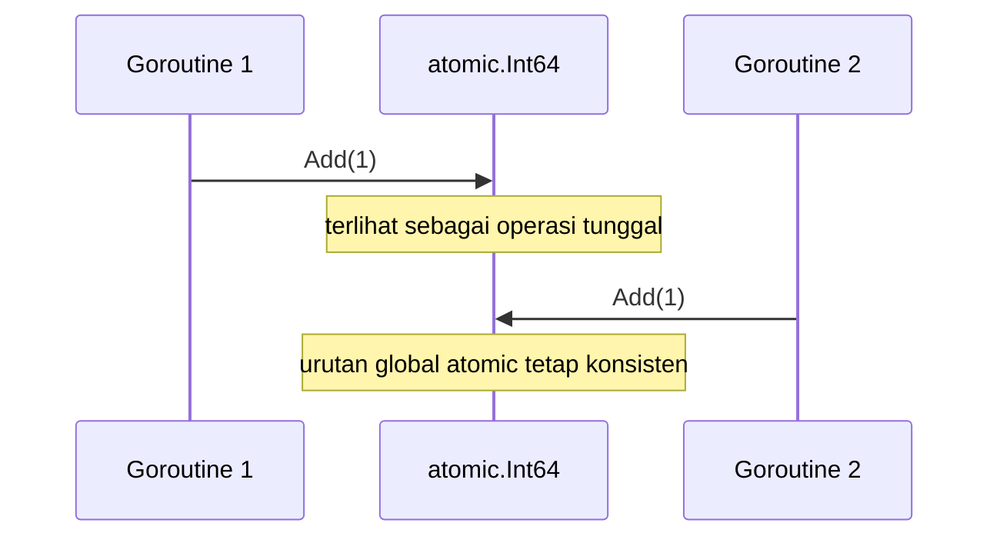
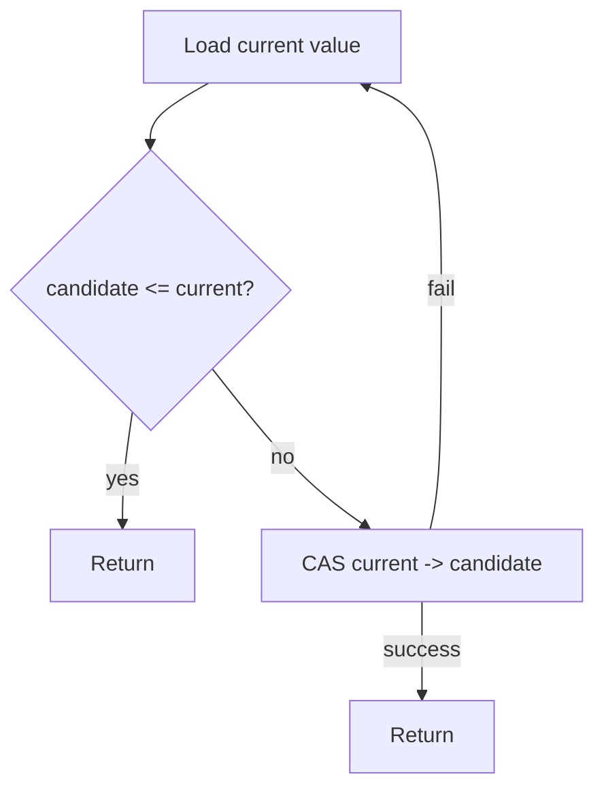
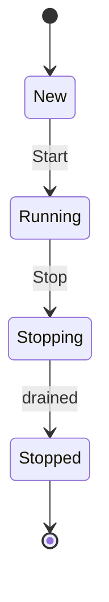
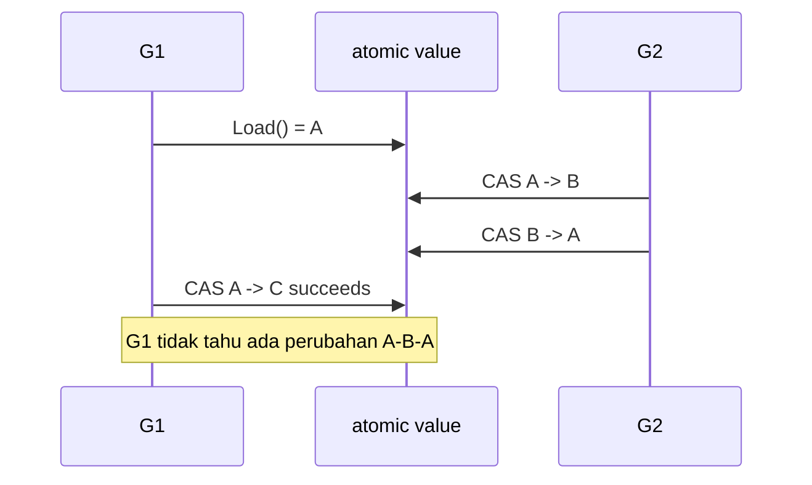
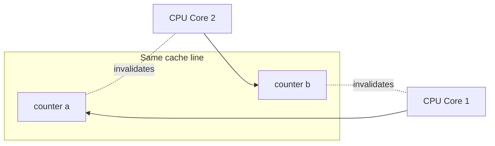

# learn-go-concurrency-parallelism-part-007.md

# Part 007 — Atomic Operations: Correctness, Performance, and Misuse

> Seri: `learn-go-concurrency-parallelism`  
> Target pembaca: Java software engineer yang ingin menguasai concurrency Go pada level production/runtime engineering.  
> Fokus bagian ini: memahami atomic operation sebagai primitive sinkronisasi paling rendah di Go, kapan tepat dipakai, kapan berbahaya, dan bagaimana mendesain kode atomic tanpa merusak invariant sistem.

---

## 0. Posisi Part Ini Dalam Seri

Sampai bagian sebelumnya, kita sudah membahas:

- orientasi Java → Go concurrency,
- konsep work, time, state, ordering, contention,
- goroutine internals,
- scheduler G/M/P,
- `GOMAXPROCS`, CPU quota, dan container reality,
- Go Memory Model,
- primitive `sync`: `Mutex`, `RWMutex`, `Cond`, `Once`, `Pool`.

Bagian ini masuk ke primitive yang lebih rendah: **atomic operations**.

Atomic operation sering terlihat seperti solusi “lebih cepat dari mutex”. Itu framing yang berbahaya. Atomic bukan versi cepat dari lock. Atomic adalah alat untuk membangun operasi kecil yang harus terlihat **indivisible** dan memiliki **memory ordering** tertentu.

Dalam Go, atomic operations berada di package:

```go
sync/atomic
```

Atomic tepat ketika:

- operasi state sangat kecil,
- invariant sederhana,
- tidak butuh mengubah beberapa field sebagai satu transaksi,
- overhead lock menjadi bottleneck yang sudah terbukti,
- pola publikasi immutable snapshot atau pointer swap memang cocok,
- desainnya bisa dijelaskan dengan memory model, bukan feeling.

Atomic salah ketika:

- dipakai untuk menghindari berpikir tentang ownership,
- dipakai untuk multi-field invariant,
- dipakai sebagai pengganti lock tanpa proof,
- dipakai dalam state machine kompleks tanpa transisi eksplisit,
- dipakai hanya karena “lebih keren” atau “lock mahal”.

---

## 1. Mental Model Utama

### 1.1 Atomic Itu Bukan “Tidak Ada Race” Secara Otomatis

Atomic operation membuat **akses tertentu** aman secara concurrent. Tetapi program bisa tetap salah.

Contoh counter atomic:

```go
var requests atomic.Int64

func onRequest() {
    requests.Add(1)
}
```

Ini benar untuk counter sederhana.

Tapi contoh berikut salah secara desain:

```go
var balance atomic.Int64
var version atomic.Int64

func withdraw(amount int64) bool {
    b := balance.Load()
    if b < amount {
        return false
    }

    balance.Store(b - amount)
    version.Add(1)
    return true
}
```

Masalahnya bukan akses primitive-nya. Masalahnya adalah **read-check-write bukan satu operasi atomik**.

Dua goroutine bisa membaca balance yang sama, sama-sama lulus validasi, lalu menulis hasil yang saling menimpa.

Atomic memperbaiki **memory safety pada lokasi tertentu**, bukan otomatis memperbaiki **business invariant**.

---

## 2. Apa Arti “Atomic”?

Dalam konteks concurrency, atomic operation berarti operasi tersebut terlihat sebagai satu unit tak terpecah oleh goroutine lain.

Untuk satu lokasi memori atomic:

```go
counter.Add(1)
```

runtime/compiler/CPU menjamin operasi add tersebut tidak terlihat sebagai:

1. load old value,
2. compute new value,
3. store new value,

yang bisa disisipkan operasi lain di tengahnya secara tidak terkendali.

Secara konseptual:



Jika nilai awal 0 dan dua goroutine melakukan `Add(1)`, hasil akhirnya pasti 2. Dengan operasi non-atomic, hasil akhirnya bisa 1 karena lost update.

---

## 3. Atomic Dalam Go Memory Model

Go memory model menyatakan beberapa hal penting tentang atomic operations:

1. Atomic operations dapat digunakan untuk menyinkronkan eksekusi goroutine.
2. Jika efek atomic operation A diamati oleh atomic operation B, maka A **synchronizes-before** B.
3. Semua atomic operations dalam program berperilaku seolah dieksekusi dalam satu urutan **sequentially consistent**.

Artinya, Go tidak mengekspos pilihan memory ordering seperti C++ `memory_order_relaxed`, `acquire`, `release`, dan sebagainya. Dari perspektif API Go, atomic bersifat sequentially consistent.

Ini membuat API lebih sederhana, tetapi bukan berarti atomic selalu mudah. Kesulitan atomic biasanya bukan pada ordering flag, melainkan pada desain invariant.

---

## 4. Java Engineer Translation

Sebagai Java engineer, analogi terdekat:

| Java | Go |
|---|---|
| `AtomicInteger` | `atomic.Int32` / `atomic.Int64` |
| `AtomicBoolean` | `atomic.Bool` |
| `AtomicReference<T>` | `atomic.Pointer[T]` atau `atomic.Value` |
| volatile read/write | atomic load/store secara konseptual dekat |
| `compareAndSet` | `CompareAndSwap` |
| `getAndIncrement` | `Add` |
| `lazySet` | tidak ada API equivalent langsung di Go high-level atomic |
| relaxed/acquire/release VarHandle | tidak diekspos sebagai pilihan umum di Go |

Perbedaan penting:

- Go mendorong penggunaan `sync.Mutex`, channel, dan ownership sebelum atomic.
- Go atomic package secara eksplisit memperingatkan bahwa API ini membutuhkan kehati-hatian besar.
- Go typed atomics membuat kode lebih aman dibanding primitive function lama seperti `atomic.AddInt64(&x, 1)`, tetapi tidak mengubah kompleksitas correctness.

---

## 5. API Modern `sync/atomic`

Go menyediakan typed atomic types, antara lain:

```go
atomic.Bool
atomic.Int32
atomic.Int64
atomic.Uint32
atomic.Uint64
atomic.Uintptr
atomic.Pointer[T]
atomic.Value
```

Typed atomic biasanya lebih disukai dibanding function lama karena:

- lebih readable,
- mengurangi risiko salah pointer,
- lebih mudah didokumentasikan sebagai field atomic,
- lebih jelas bahwa field tidak boleh diakses langsung secara non-atomic.

Contoh:

```go
type Metrics struct {
    requests atomic.Int64
    errors   atomic.Int64
}

func (m *Metrics) IncRequest() {
    m.requests.Add(1)
}

func (m *Metrics) Snapshot() (requests, errors int64) {
    return m.requests.Load(), m.errors.Load()
}
```

Tetapi perhatikan: snapshot dua field di atas **bukan snapshot konsisten**. Itu hanya dua read atomic terpisah.

Jika invariant membutuhkan `errors <= requests` secara konsisten dalam satu snapshot, atomic counter terpisah tidak cukup.

---

## 6. Atomic Counter

### 6.1 Counter Sederhana

Use case paling aman untuk atomic adalah counter observability.

```go
type ServerStats struct {
    totalRequests atomic.Int64
    totalErrors   atomic.Int64
}

func (s *ServerStats) RecordOK() {
    s.totalRequests.Add(1)
}

func (s *ServerStats) RecordError() {
    s.totalRequests.Add(1)
    s.totalErrors.Add(1)
}

func (s *ServerStats) Snapshot() StatsSnapshot {
    return StatsSnapshot{
        TotalRequests: s.totalRequests.Load(),
        TotalErrors:   s.totalErrors.Load(),
    }
}
```

Ini cocok jika snapshot hanya untuk metrics approximate real-time.

Tidak cocok jika snapshot dipakai untuk keputusan kritis yang membutuhkan konsistensi antar field.

### 6.2 Counter Bukan State Machine

Salah:

```go
if active.Load() < maxActive {
    active.Add(1)
    defer active.Add(-1)
    doWork()
}
```

Race correctness:

- G1 membaca `active = 9`, max 10.
- G2 membaca `active = 9`, max 10.
- Keduanya add.
- `active = 11`.

Benar dengan CAS:

```go
func tryAcquire(active *atomic.Int64, max int64) bool {
    for {
        cur := active.Load()
        if cur >= max {
            return false
        }
        if active.CompareAndSwap(cur, cur+1) {
            return true
        }
    }
}

func release(active *atomic.Int64) {
    active.Add(-1)
}
```

Tetapi untuk limiter sederhana, sering kali semaphore channel lebih jelas:

```go
type Limiter struct {
    sem chan struct{}
}

func NewLimiter(n int) *Limiter {
    return &Limiter{sem: make(chan struct{}, n)}
}

func (l *Limiter) TryAcquire() bool {
    select {
    case l.sem <- struct{}{}:
        return true
    default:
        return false
    }
}

func (l *Limiter) Release() {
    <-l.sem
}
```

Channel version mungkin sedikit lebih mahal, tetapi lebih mudah dijaga correctness-nya dan lebih jelas ownership-nya.

---

## 7. Compare-And-Swap: CAS

CAS adalah operasi:

> Jika nilai saat ini sama dengan expected, ubah ke new value; jika tidak, gagal.

Di Go:

```go
ok := x.CompareAndSwap(old, new)
```

CAS memungkinkan update conditional tanpa lock.

### 7.1 CAS Loop

Pattern umum:

```go
func maxAtomic(x *atomic.Int64, candidate int64) {
    for {
        cur := x.Load()
        if candidate <= cur {
            return
        }
        if x.CompareAndSwap(cur, candidate) {
            return
        }
    }
}
```

Makna:

1. Baca nilai sekarang.
2. Hitung nilai baru.
3. Coba commit jika nilai belum berubah.
4. Jika berubah, ulangi.

Diagram:



### 7.2 CAS Loop Harus Murah

CAS loop buruk jika:

- perhitungan new value mahal,
- contention tinggi,
- loop bisa spin lama,
- ada I/O di dalam loop,
- ada allocation besar di setiap retry,
- fairness penting.

Buruk:

```go
for {
    old := ptr.Load()
    next := expensiveRebuild(old) // mahal dan dialokasikan ulang terus
    if ptr.CompareAndSwap(old, next) {
        return
    }
}
```

Lebih baik pertimbangkan mutex jika rebuild mahal.

---

## 8. Atomic Flag

Atomic flag cocok untuk state boolean sederhana:

```go
type StopSignal struct {
    stopped atomic.Bool
}

func (s *StopSignal) Stop() {
    s.stopped.Store(true)
}

func (s *StopSignal) Stopped() bool {
    return s.stopped.Load()
}
```

Namun di Go, cancellation biasanya lebih idiomatis menggunakan `context.Context` atau channel close.

Atomic flag cocok untuk:

- fast-path check,
- best-effort state,
- low-level component,
- menghindari blocking pada hot path.

Tidak cocok sebagai satu-satunya mekanisme lifecycle jika ada goroutine yang harus dibangunkan. Atomic flag tidak membangunkan goroutine yang sedang blocked.

Salah:

```go
type Worker struct {
    stopped atomic.Bool
    jobs    chan Job
}

func (w *Worker) Stop() {
    w.stopped.Store(true)
}

func (w *Worker) Run() {
    for !w.stopped.Load() {
        job := <-w.jobs // bisa block selamanya
        handle(job)
    }
}
```

Benar dengan `context`:

```go
func (w *Worker) Run(ctx context.Context) {
    for {
        select {
        case <-ctx.Done():
            return
        case job := <-w.jobs:
            handle(job)
        }
    }
}
```

---

## 9. Atomic Pointer

`atomic.Pointer[T]` cocok untuk pointer swap.

Use case utama:

- immutable config snapshot,
- routing table snapshot,
- feature flag snapshot,
- read-mostly data,
- copy-on-write map,
- lock-free fast read path dengan writer jarang.

### 9.1 Immutable Snapshot Pattern

```go
type Config struct {
    Timeout time.Duration
    Routes  map[string]string
}

type ConfigStore struct {
    current atomic.Pointer[Config]
}

func NewConfigStore(cfg *Config) *ConfigStore {
    s := &ConfigStore{}
    s.current.Store(cloneConfig(cfg))
    return s
}

func (s *ConfigStore) Get() *Config {
    return s.current.Load()
}

func (s *ConfigStore) Update(cfg *Config) {
    s.current.Store(cloneConfig(cfg))
}

func cloneConfig(cfg *Config) *Config {
    routes := make(map[string]string, len(cfg.Routes))
    for k, v := range cfg.Routes {
        routes[k] = v
    }
    return &Config{
        Timeout: cfg.Timeout,
        Routes:  routes,
    }
}
```

Invariant penting:

- object yang dipublish harus immutable setelah `Store`,
- semua nested mutable structure harus dicopy,
- pembaca tidak boleh mutate hasil `Load`,
- API harus mencegah caller memegang mutable reference internal.

### 9.2 Salah: Publish Pointer ke Mutable Map

```go
type BadStore struct {
    current atomic.Pointer[map[string]string]
}

func (s *BadStore) Update(m map[string]string) {
    s.current.Store(&m)
}
```

Masalah:

- caller masih bisa mutate `m`,
- reader bisa membaca map saat writer lain mutate,
- atomic hanya melindungi pointer, bukan isi map.

Atomic pointer bukan deep immutability.

---

## 10. `atomic.Value`

`atomic.Value` menyimpan value arbitrary secara atomic.

Karakteristik penting:

- `Load` mengembalikan `any`, perlu type assertion.
- Semua `Store` setelah store pertama harus memiliki concrete type yang sama.
- Cocok untuk read-mostly configuration dan immutable snapshot.

Contoh:

```go
type RoutingTable struct {
    routes map[string]string
}

type Router struct {
    table atomic.Value // stores *RoutingTable
}

func NewRouter(t *RoutingTable) *Router {
    r := &Router{}
    r.table.Store(cloneRoutingTable(t))
    return r
}

func (r *Router) Lookup(key string) (string, bool) {
    t := r.table.Load().(*RoutingTable)
    v, ok := t.routes[key]
    return v, ok
}

func (r *Router) Replace(t *RoutingTable) {
    r.table.Store(cloneRoutingTable(t))
}
```

Dengan Go modern, `atomic.Pointer[T]` sering lebih type-safe untuk pointer snapshot. `atomic.Value` tetap berguna jika value yang disimpan bukan pointer generic sederhana atau untuk compatibility lama.

---

## 11. Atomic State Machine

Atomic state machine adalah salah satu area paling rawan.

Contoh state sederhana:

```go
type State int32

const (
    StateNew State = iota
    StateRunning
    StateStopping
    StateStopped
)

type Service struct {
    state atomic.Int32
}
```

Transisi legal:



Implementasi:

```go
func (s *Service) Start() bool {
    return s.state.CompareAndSwap(int32(StateNew), int32(StateRunning))
}

func (s *Service) Stop() bool {
    return s.state.CompareAndSwap(int32(StateRunning), int32(StateStopping))
}

func (s *Service) MarkStopped() {
    if !s.state.CompareAndSwap(int32(StateStopping), int32(StateStopped)) {
        panic("invalid state transition")
    }
}
```

Ini cukup aman jika state hanya satu integer dan transisi sederhana.

Tapi jika transisi harus mengubah beberapa resource:

- close channel,
- cancel context,
- wait worker,
- flush queue,
- update metrics,
- reject new request,

maka atomic state saja tidak cukup. Biasanya perlu mutex atau lifecycle owner goroutine.

---

## 12. Atomic Tidak Cocok Untuk Multi-Field Invariant

Misal:

```go
type Window struct {
    start atomic.Int64
    end   atomic.Int64
}
```

Invariant:

```text
start <= end
```

Update:

```go
func (w *Window) Move(start, end int64) {
    w.start.Store(start)
    w.end.Store(end)
}
```

Reader:

```go
func (w *Window) Snapshot() (int64, int64) {
    return w.start.Load(), w.end.Load()
}
```

Reader bisa melihat:

- `start` baru,
- `end` lama,
- sehingga invariant tampak rusak.

Solusi 1: mutex.

```go
type Window struct {
    mu    sync.RWMutex
    start int64
    end   int64
}

func (w *Window) Move(start, end int64) {
    w.mu.Lock()
    defer w.mu.Unlock()
    w.start = start
    w.end = end
}

func (w *Window) Snapshot() (int64, int64) {
    w.mu.RLock()
    defer w.mu.RUnlock()
    return w.start, w.end
}
```

Solusi 2: immutable snapshot dengan atomic pointer.

```go
type WindowSnapshot struct {
    Start int64
    End   int64
}

type Window struct {
    current atomic.Pointer[WindowSnapshot]
}

func NewWindow(start, end int64) *Window {
    w := &Window{}
    w.current.Store(&WindowSnapshot{Start: start, End: end})
    return w
}

func (w *Window) Move(start, end int64) {
    w.current.Store(&WindowSnapshot{Start: start, End: end})
}

func (w *Window) Snapshot() WindowSnapshot {
    return *w.current.Load()
}
```

Jika snapshot kecil dan immutable, atomic pointer bisa bagus.

---

## 13. ABA Problem

ABA terjadi ketika CAS hanya melihat nilai sama, tetapi tidak tahu nilai sempat berubah.

Sequence:

```text
G1 reads A
G2 changes A -> B
G2 changes B -> A
G1 CAS A -> C succeeds
```

G1 mengira tidak ada perubahan karena nilai kembali A, padahal state pernah berubah.

Diagram:



Dalam Go, ABA terutama relevan untuk:

- lock-free stack/queue,
- pointer CAS,
- object reuse,
- freelist,
- custom memory reclamation,
- low-level runtime-like structure.

Mitigasi umum:

- version/tag counter,
- avoid pointer reuse assumptions,
- immutable object allocation,
- use mutex,
- use channel/owner goroutine,
- avoid building lock-free data structure unless benar-benar perlu.

Untuk mayoritas aplikasi backend Go, jika desain Anda mulai membutuhkan ABA reasoning, besar kemungkinan mutex lebih baik.

---

## 14. False Sharing

False sharing terjadi ketika beberapa atomic variables berbeda berada di cache line yang sama, lalu diupdate intensif oleh CPU core berbeda.

Contoh konseptual:

```go
type Counters struct {
    a atomic.Int64
    b atomic.Int64
}
```

Jika `a` dan `b` berada di cache line yang sama:

- core 1 update `a`,
- core 2 update `b`,
- cache line bolak-balik invalidated,
- throughput turun walaupun variabel berbeda.

Diagram:



Mitigasi:

- shard counter per worker/per P/per key,
- aggregate periodically,
- avoid hot global atomic counter,
- padding pada struktur low-level jika benar-benar perlu,
- ukur dengan benchmark dan profile.

Contoh sharded counter sederhana:

```go
type ShardedCounter struct {
    shards []atomic.Int64
}

func NewShardedCounter(n int) *ShardedCounter {
    return &ShardedCounter{shards: make([]atomic.Int64, n)}
}

func (c *ShardedCounter) Add(shard int, delta int64) {
    c.shards[shard%len(c.shards)].Add(delta)
}

func (c *ShardedCounter) Sum() int64 {
    var total int64
    for i := range c.shards {
        total += c.shards[i].Load()
    }
    return total
}
```

Trade-off:

- write lebih scalable,
- read lebih mahal,
- snapshot tidak instantaneously consistent,
- cocok untuk metrics, bukan accounting critical.

---

## 15. Atomic vs Mutex

### 15.1 Decision Matrix

| Pertanyaan | Atomic cocok | Mutex cocok |
|---|---|---|
| State satu primitive? | Ya | Ya |
| Multi-field invariant? | Tidak, kecuali snapshot pointer | Ya |
| Butuh blocking/wakeup? | Tidak | Ya, dengan Cond/channel |
| Butuh fairness? | Lemah | Lebih masuk akal |
| Critical section kompleks? | Tidak | Ya |
| Read-mostly immutable snapshot? | Ya | Bisa juga |
| Write sering dengan contention tinggi? | Hati-hati | Hati-hati |
| Mudah dijelaskan? | Kalau sangat sederhana | Sering lebih mudah |
| Perlu compose beberapa operasi? | Sulit | Lebih natural |

### 15.2 Mutex Bukan Kegagalan

Banyak engineer menganggap mutex sebagai lambat. Itu terlalu sederhana.

Mutex sering lebih baik karena:

- invariant jelas,
- critical section eksplisit,
- failure lebih mudah dianalisis,
- state transition lebih mudah dijaga,
- code review lebih murah,
- bug lebih sedikit.

Atomic bisa lebih cepat di microbenchmark tetapi lebih buruk secara sistem jika:

- retry loop tinggi,
- cache line contention tinggi,
- invariant bug menyebabkan incident,
- observability sulit,
- engineer lain tidak paham reasoning-nya.

Rule praktis:

> Gunakan mutex sampai ada bukti bahwa mutex adalah bottleneck, atau gunakan atomic ketika model datanya memang atomic secara natural.

---

## 16. Atomic vs Channel

Channel cocok untuk:

- ownership transfer,
- backpressure,
- waiting,
- cancellation with select,
- pipeline,
- worker coordination.

Atomic cocok untuk:

- fast shared flag,
- counter,
- pointer publication,
- CAS transition kecil,
- read-mostly snapshot.

Contoh: stop signal.

Atomic flag tidak bisa wake up blocked goroutine.

Channel close bisa wake up semua receiver:

```go
type Stopper struct {
    done chan struct{}
    once sync.Once
}

func NewStopper() *Stopper {
    return &Stopper{done: make(chan struct{})}
}

func (s *Stopper) Stop() {
    s.once.Do(func() {
        close(s.done)
    })
}

func (s *Stopper) Done() <-chan struct{} {
    return s.done
}
```

Jika goroutine harus menunggu, channel/context biasanya lebih tepat daripada atomic polling.

---

## 17. Atomic Publication

Publication adalah proses membuat object yang dibangun satu goroutine terlihat aman oleh goroutine lain.

Salah:

```go
var cfg *Config
var ready bool

func writer() {
    cfg = &Config{Timeout: time.Second}
    ready = true
}

func reader() {
    if ready {
        use(cfg)
    }
}
```

Ada data race pada `cfg` dan `ready`.

Benar dengan atomic pointer:

```go
var cfg atomic.Pointer[Config]

func writer() {
    next := &Config{Timeout: time.Second}
    cfg.Store(next)
}

func reader() {
    current := cfg.Load()
    if current == nil {
        return
    }
    use(current)
}
```

Tetapi object harus tidak dimutasi setelah store.

Benar dengan mutex:

```go
var (
    mu  sync.RWMutex
    cfg *Config
)

func writer() {
    mu.Lock()
    defer mu.Unlock()
    cfg = &Config{Timeout: time.Second}
}

func reader() {
    mu.RLock()
    defer mu.RUnlock()
    if cfg != nil {
        use(cfg)
    }
}
```

---

## 18. Double-Checked Locking

Double-checked locking sering muncul untuk lazy init.

Di Go, biasanya gunakan `sync.Once`.

Jangan ini:

```go
var initialized atomic.Bool
var resource *Resource
var mu sync.Mutex

func Get() *Resource {
    if initialized.Load() {
        return resource
    }

    mu.Lock()
    defer mu.Unlock()

    if !initialized.Load() {
        resource = NewResource()
        initialized.Store(true)
    }
    return resource
}
```

Ini bisa benar jika semua akses dipublish dengan benar dan tidak ada akses race pada `resource`, tetapi desainnya lebih rumit daripada perlu.

Lebih idiomatis:

```go
var once sync.Once
var resource *Resource

func Get() *Resource {
    once.Do(func() {
        resource = NewResource()
    })
    return resource
}
```

Go `sync.Once` sudah memberikan memory synchronization yang benar.

Gunakan atomic untuk lazy init hanya jika:

- sudah terbukti `sync.Once` tidak cocok,
- ada kebutuhan reset/reload khusus,
- Anda bisa menjelaskan publication invariant dengan jelas.

---

## 19. Spin Loop dan CPU Burn

Atomic sering menggoda untuk spin loop.

Buruk:

```go
for !ready.Load() {
    // spin
}
```

Masalah:

- membakar CPU,
- mengganggu scheduler,
- memperburuk latency goroutine lain,
- tidak menghormati cancellation,
- buruk di container dengan CPU quota.

Lebih baik:

```go
select {
case <-readyCh:
    return nil
case <-ctx.Done():
    return ctx.Err()
}
```

Jika benar-benar perlu spin untuk low-latency primitive, biasanya gunakan backoff:

```go
for i := 0; !ready.Load(); i++ {
    if i < 10 {
        runtime.Gosched()
        continue
    }
    time.Sleep(time.Microsecond)
}
```

Tetapi untuk aplikasi server, spin loop hampir selalu smell.

---

## 20. Atomic dan Context Cancellation

Atomic flag tidak menggantikan `context.Context`.

Context membawa:

- cancellation propagation,
- deadline,
- cause,
- integration dengan HTTP/gRPC/database,
- select-friendly channel.

Atomic flag hanya membawa value.

Gunakan atomic untuk fast-path supplement, bukan lifecycle root.

Contoh kombinasi yang masih masuk akal:

```go
type Component struct {
    closed atomic.Bool
    cancel context.CancelFunc
}

func (c *Component) IsClosed() bool {
    return c.closed.Load()
}

func (c *Component) Close() {
    if c.closed.CompareAndSwap(false, true) {
        c.cancel()
    }
}
```

Di sini atomic hanya menjaga `Close` idempotent. Cancellation tetap dilakukan oleh context.

---

## 21. Atomic Idempotency Gate

Atomic sering cocok untuk memastikan satu aksi hanya terjadi sekali.

```go
type Closer struct {
    closed atomic.Bool
    ch     chan struct{}
}

func NewCloser() *Closer {
    return &Closer{ch: make(chan struct{})}
}

func (c *Closer) Close() bool {
    if c.closed.CompareAndSwap(false, true) {
        close(c.ch)
        return true
    }
    return false
}

func (c *Closer) Done() <-chan struct{} {
    return c.ch
}
```

Namun `sync.Once` sering lebih cocok:

```go
type Closer struct {
    once sync.Once
    ch   chan struct{}
}

func (c *Closer) Close() {
    c.once.Do(func() {
        close(c.ch)
    })
}
```

Atomic version berguna jika caller perlu tahu apakah dirinya yang berhasil melakukan close.

---

## 22. Atomic Rate / Config Fast Path

Contoh feature flag read-mostly:

```go
type FeatureFlags struct {
    flags map[string]bool
}

type FlagStore struct {
    current atomic.Pointer[FeatureFlags]
}

func NewFlagStore(flags map[string]bool) *FlagStore {
    s := &FlagStore{}
    s.current.Store(&FeatureFlags{flags: cloneBoolMap(flags)})
    return s
}

func (s *FlagStore) Enabled(name string) bool {
    current := s.current.Load()
    if current == nil {
        return false
    }
    return current.flags[name]
}

func (s *FlagStore) Replace(flags map[string]bool) {
    s.current.Store(&FeatureFlags{flags: cloneBoolMap(flags)})
}

func cloneBoolMap(in map[string]bool) map[string]bool {
    out := make(map[string]bool, len(in))
    for k, v := range in {
        out[k] = v
    }
    return out
}
```

Ini performant karena read tidak lock. Tetapi correctness bergantung pada immutability.

Jika ada mutation incremental frequent, mutex atau sharded map lebih tepat.

---

## 23. Atomic dan Metrics

Atomic sangat umum untuk metrics, tapi ada trap.

### 23.1 Monotonic Counter

```go
requestsTotal.Add(1)
```

Bagus.

### 23.2 Gauge

```go
inflight.Add(1)
defer inflight.Add(-1)
```

Bagus jika semua path release benar.

### 23.3 Histogram Manual

Atomic untuk histogram multi-bucket bisa menimbulkan snapshot inconsistent.

```go
type Histogram struct {
    b1 atomic.Int64
    b2 atomic.Int64
    b3 atomic.Int64
}
```

Untuk observability approximate mungkin cukup. Untuk billing/accounting tidak cukup.

### 23.4 Hot Counter Bottleneck

Global atomic counter pada path sangat panas bisa menjadi bottleneck karena cache contention.

Mitigasi:

- per-worker counter,
- per-shard counter,
- sampling,
- periodic aggregation,
- gunakan metrics library yang sudah menangani concurrency.

---

## 24. Atomic dan Error Handling

Jangan menyimpan error state kompleks dengan atomic tanpa desain jelas.

Buruk:

```go
var lastErr atomic.Value // error

func record(err error) {
    lastErr.Store(err)
}
```

Masalah:

- error bisa wrap context besar,
- tidak ada timestamp,
- tidak ada causal history,
- concurrent overwrite kehilangan informasi,
- nil store ke `atomic.Value` bermasalah karena Store nil tidak valid.

Lebih baik:

```go
type ErrorSnapshot struct {
    At      time.Time
    Message string
}

var last atomic.Pointer[ErrorSnapshot]

func record(err error) {
    if err == nil {
        return
    }
    last.Store(&ErrorSnapshot{
        At:      time.Now(),
        Message: err.Error(),
    })
}
```

Atau gunakan mutex jika perlu history.

---

## 25. Atomic dan Copying

Typed atomic values tidak boleh dicopy setelah digunakan.

Buruk:

```go
type Counter struct {
    n atomic.Int64
}

func snapshot(c Counter) int64 { // copy struct
    return c.n.Load()
}
```

Gunakan pointer receiver dan hindari pass-by-value:

```go
type Counter struct {
    n atomic.Int64
}

func (c *Counter) Snapshot() int64 {
    return c.n.Load()
}
```

Jika struct mengandung atomic, biasanya:

- jangan copy struct setelah first use,
- gunakan pointer,
- tambahkan komentar dokumentasi,
- pertimbangkan embed noCopy pattern untuk vet internal.

---

## 26. Alignment dan 32-bit Architecture

Pada arsitektur 32-bit, operasi 64-bit atomic punya requirement alignment tertentu. Go typed atomic membantu menghindari banyak masalah alignment dibanding fungsi lama, tetapi desain portable tetap perlu hati-hati bila menggunakan primitive lama atau struktur packed.

Praktis untuk backend modern di amd64/arm64, ini jarang menjadi isu, tetapi library low-level harus tetap memperhatikan dokumentasi atomic.

---

## 27. Lock-Free Bukan Wait-Free

Istilah penting:

- **blocking**: goroutine bisa tertahan menunggu lock/condition/channel.
- **lock-free**: sistem secara keseluruhan terus maju; satu goroutine bisa retry lama.
- **wait-free**: setiap goroutine menyelesaikan operasi dalam batas langkah tertentu.

Banyak kode CAS loop bukan wait-free. Under contention, satu goroutine bisa gagal CAS berkali-kali.

Atomic CAS loop bisa memperbaiki throughput pada low contention, tetapi memperburuk p99 pada high contention.

---

## 28. Production Failure Modes Atomic

### 28.1 Lost Invariant

Field-field atomic individual tetapi invariant antar field tidak atomic.

Symptom:

- metric aneh,
- negative count,
- impossible state,
- intermittent failure.

### 28.2 Spin Burn

Symptom:

- CPU tinggi,
- goroutine count normal,
- p99 naik,
- trace menunjukkan goroutine runnable terus.

### 28.3 CAS Storm

Symptom:

- throughput turun saat load naik,
- CPU tinggi tapi useful work rendah,
- flamegraph menunjukkan CAS/retry path.

### 28.4 Stale Snapshot Misuse

Atomic pointer snapshot dibaca lalu diasumsikan tetap current untuk operasi panjang.

### 28.5 Mutating Published Object

Reader melihat object yang dianggap immutable, tetapi writer mutate nested map/slice.

### 28.6 Atomic Counter as Limiter Bug

Check-then-add bukan CAS, menyebabkan limit dilanggar.

### 28.7 Hidden Global Contention

Satu global atomic counter di hot path semua request menjadi serialization point.

---

## 29. Observability Untuk Atomic-Heavy Code

Atomic contention tidak selalu terlihat sebagai mutex/block profile karena tidak blocking seperti mutex.

Yang perlu diamati:

- CPU profile,
- runtime trace runnable pressure,
- p99 latency,
- retry count pada CAS loop,
- failed CAS metric,
- per-shard skew,
- queue depth,
- GC pressure akibat copy-on-write snapshot,
- allocation rate saat snapshot update.

Tambahkan metric eksplisit:

```go
type AtomicStats struct {
    casAttempts atomic.Int64
    casFailures atomic.Int64
}
```

Contoh CAS dengan metric:

```go
func updateMax(x *atomic.Int64, candidate int64, stats *AtomicStats) {
    for {
        stats.casAttempts.Add(1)

        cur := x.Load()
        if candidate <= cur {
            return
        }

        if x.CompareAndSwap(cur, candidate) {
            return
        }

        stats.casFailures.Add(1)
    }
}
```

Jika `casFailures / casAttempts` tinggi, desain mungkin contention-heavy.

---

## 30. Benchmarking Atomic

Benchmark atomic harus menghindari kesimpulan palsu.

### 30.1 Single Goroutine Benchmark Tidak Mewakili Contention

```go
func BenchmarkAtomicAdd(b *testing.B) {
    var x atomic.Int64
    for i := 0; i < b.N; i++ {
        x.Add(1)
    }
}
```

Ini hanya mengukur overhead atomic tanpa contention.

### 30.2 Parallel Benchmark

```go
func BenchmarkAtomicAddParallel(b *testing.B) {
    var x atomic.Int64
    b.RunParallel(func(pb *testing.PB) {
        for pb.Next() {
            x.Add(1)
        }
    })
}
```

Ini lebih menunjukkan global counter contention.

### 30.3 Sharded Benchmark

```go
func BenchmarkShardedAtomicAddParallel(b *testing.B) {
    const shards = 128
    counters := make([]atomic.Int64, shards)

    var next atomic.Uint64

    b.RunParallel(func(pb *testing.PB) {
        id := int(next.Add(1)) % shards
        for pb.Next() {
            counters[id].Add(1)
        }
    })
}
```

Bandingkan:

- global atomic,
- sharded atomic,
- mutex,
- channel aggregator.

Jangan hanya ukur throughput. Ukur juga p95/p99 jika ini path request.

---

## 31. Design Patterns

### 31.1 Atomic Fast Path + Mutex Slow Path

Pattern:

- atomic read untuk fast path,
- mutex untuk update kompleks.

Contoh cache config:

```go
type Store struct {
    current atomic.Pointer[Snapshot]
    mu      sync.Mutex
}

func (s *Store) Get() *Snapshot {
    return s.current.Load()
}

func (s *Store) Reload(load func() (*Snapshot, error)) error {
    next, err := load()
    if err != nil {
        return err
    }

    s.mu.Lock()
    defer s.mu.Unlock()

    s.current.Store(next)
    return nil
}
```

Mutex tidak untuk reader, tetapi memastikan reload tidak overlap.

### 31.2 Atomic Gate

```go
type Gate struct {
    closed atomic.Bool
}

func (g *Gate) Allow() bool {
    return !g.closed.Load()
}

func (g *Gate) Close() {
    g.closed.Store(true)
}
```

Cocok untuk reject fast-path. Tetapi goroutine yang sudah masuk tetap harus dikelola dengan WaitGroup/context.

### 31.3 Atomic Pointer Copy-on-Write Map

```go
type COWMap[K comparable, V any] struct {
    mu      sync.Mutex
    current atomic.Pointer[map[K]V]
}

func NewCOWMap[K comparable, V any]() *COWMap[K, V] {
    m := make(map[K]V)
    c := &COWMap[K, V]{}
    c.current.Store(&m)
    return c
}

func (m *COWMap[K, V]) Get(k K) (V, bool) {
    current := m.current.Load()
    v, ok := (*current)[k]
    return v, ok
}

func (m *COWMap[K, V]) Put(k K, v V) {
    m.mu.Lock()
    defer m.mu.Unlock()

    old := m.current.Load()
    next := make(map[K]V, len(*old)+1)
    for key, val := range *old {
        next[key] = val
    }
    next[k] = v

    m.current.Store(&next)
}
```

Cocok untuk:

- read sangat sering,
- write jarang,
- map tidak terlalu besar.

Buruk untuk:

- write sering,
- map besar,
- strict memory budget.

---

## 32. Code Review Checklist Untuk Atomic

Gunakan checklist ini setiap kali melihat `sync/atomic`.

### 32.1 Correctness

- Apa invariant yang dijaga?
- Apakah invariant hanya satu memory location?
- Jika multi-field, bagaimana snapshot konsisten dijamin?
- Apakah ada akses non-atomic ke field yang sama?
- Apakah object yang dipublish benar-benar immutable?
- Apakah nested map/slice/pointer ikut aman?
- Apakah CAS loop punya termination reason?
- Apakah ABA relevan?
- Apakah operasi idempotent?

### 32.2 Lifecycle

- Apakah atomic flag digunakan untuk membangunkan goroutine? Jika iya, salah.
- Apakah cancellation tetap menggunakan context/channel?
- Apakah close dilakukan sekali?
- Apakah goroutine yang melihat flag bisa keluar?

### 32.3 Performance

- Apakah atomic ada di hot path global?
- Apakah ada contention metric?
- Apakah benchmark parallel sudah dilakukan?
- Apakah false sharing mungkin terjadi?
- Apakah sharding lebih tepat?
- Apakah mutex sebenarnya cukup?

### 32.4 Maintainability

- Apakah komentar menjelaskan invariant atomic?
- Apakah struct dengan atomic dicegah dari copy?
- Apakah engineer lain bisa memahami proof-nya?
- Apakah test race/stress tersedia?

---

## 33. Anti-Pattern Catalog

### Anti-Pattern 1: Atomic Everything

```go
type UserSession struct {
    id        atomic.Value
    userID    atomic.Value
    expiresAt atomic.Int64
    roles     atomic.Value
}
```

Ini biasanya tanda desain buruk. Session punya invariant multi-field. Gunakan immutable snapshot atau mutex.

### Anti-Pattern 2: Atomic Flag for Blocking Loop

```go
for !done.Load() {
    item := <-ch
    process(item)
}
```

Jika `ch` tidak menerima item, loop tidak pernah membaca flag lagi.

### Anti-Pattern 3: Check-Then-Act

```go
if count.Load() < limit {
    count.Add(1)
}
```

Tidak atomic sebagai satu operasi.

### Anti-Pattern 4: Publish Mutable Object

```go
cfg.Store(&Config{Routes: routes}) // routes masih dimutasi pihak lain
```

Atomic pointer tidak melindungi isi object.

### Anti-Pattern 5: CAS With Heavy Work Inside Retry

```go
for {
    old := p.Load()
    next := buildHugeSnapshot(old)
    if p.CompareAndSwap(old, next) {
        return
    }
}
```

Under contention, CPU dan allocation bisa meledak.

### Anti-Pattern 6: Global Atomic Metrics On Ultra Hot Path

```go
globalRequests.Add(1)
```

Untuk banyak sistem ini baik-baik saja. Untuk path sangat panas dengan banyak core, ini bisa menjadi bottleneck. Ukur, jangan tebak.

---

## 34. Mini Lab 1 — Memperbaiki Limiter Salah

### Problem

Kode berikut bertujuan membatasi concurrency maksimal 10.

```go
type Limiter struct {
    active atomic.Int64
    max    int64
}

func (l *Limiter) TryDo(fn func()) bool {
    if l.active.Load() >= l.max {
        return false
    }

    l.active.Add(1)
    defer l.active.Add(-1)

    fn()
    return true
}
```

### Pertanyaan

1. Apa bug correctness-nya?
2. Perbaiki dengan CAS.
3. Perbaiki dengan channel semaphore.
4. Mana yang lebih mudah dipahami dalam code review?

### Jawaban Konseptual

Bug-nya adalah check-then-add tidak atomic. Banyak goroutine bisa lolos check sebelum add.

---

## 35. Mini Lab 2 — Immutable Config Snapshot

Desain config store dengan requirement:

- read sangat sering,
- update jarang,
- config berisi map endpoint,
- reader tidak boleh lock,
- reader tidak boleh melihat map yang sedang dimutasi.

Solusi yang diharapkan:

- `atomic.Pointer[*Snapshot]` atau `atomic.Pointer[Snapshot]`,
- clone map saat update,
- jangan expose mutable map,
- dokumentasikan immutability.

---

## 36. Mini Lab 3 — CAS Failure Metric

Implementasikan atomic max tracker:

```go
type MaxTracker struct {
    value       atomic.Int64
    attempts    atomic.Int64
    casFailures atomic.Int64
}
```

Requirement:

- `Observe(v int64)` update max jika `v` lebih besar.
- Track CAS attempts dan failures.
- `Stats()` return current max, attempts, failures.

Diskusikan kapan failure ratio tinggi menjadi sinyal desain perlu diubah.

---

## 37. Design Exercise — Runtime Feature Flag Store

Buat desain `FeatureFlagStore` untuk service production:

Requirement:

- 100k read/sec,
- update setiap 10 detik,
- flag map ukuran 5k keys,
- reader tidak boleh block,
- update boleh sedikit mahal,
- snapshot harus konsisten,
- tidak boleh ada data race,
- exposed API tidak boleh memungkinkan caller mutate internal map.

Evaluasi opsi:

1. `sync.RWMutex`.
2. `atomic.Pointer` immutable snapshot.
3. `sync.Map`.
4. Channel owner goroutine.

Kemungkinan jawaban terbaik: atomic pointer immutable snapshot, dengan clone saat update dan API read-only.

---

## 38. Production Checklist

Sebelum menggunakan atomic di production, jawab:

1. Apakah primitive atomic ini benar-benar dibutuhkan?
2. Apakah mutex/channel lebih sederhana?
3. Apakah invariant bisa dijelaskan dalam 3 kalimat?
4. Apakah semua akses ke field tersebut atomic?
5. Apakah field tidak dicopy setelah digunakan?
6. Apakah ada test race?
7. Apakah ada stress test?
8. Apakah ada metric untuk contention/CAS failure bila relevan?
9. Apakah object yang dipublish immutable?
10. Apakah lifecycle tetap menggunakan context/channel jika perlu wakeup?
11. Apakah snapshot multi-field konsisten?
12. Apakah false sharing/global contention sudah dipertimbangkan?
13. Apakah code comment menjelaskan synchronization contract?

---

## 39. Ringkasan Mental Model

Atomic operation di Go adalah primitive kuat, tetapi sempit.

Gunakan atomic untuk:

- counter sederhana,
- gauge sederhana,
- boolean gate,
- idempotency flag,
- CAS state transition kecil,
- immutable snapshot publication,
- read-mostly pointer swap.

Hindari atomic untuk:

- multi-field mutable invariant,
- lifecycle yang perlu wakeup,
- complex state machine,
- queueing/backpressure,
- fairness-sensitive coordination,
- desain yang tidak bisa dijelaskan secara formal.

Formula praktis:

```text
Atomic protects an operation.
Mutex protects an invariant.
Channel transfers ownership and applies coordination/backpressure.
Context propagates cancellation and deadlines.
```

Jika Anda hanya mengingat satu hal dari part ini:

> Atomic bukan pengganti mutex. Atomic adalah primitive untuk kasus kecil yang invariant-nya memang bisa direpresentasikan sebagai satu operasi atau satu immutable pointer publication.

---

## 40. Hubungan Ke Part Berikutnya

Part berikutnya akan membahas **Channels Deep Dive**.

Atomic membantu kita memahami operasi low-level pada shared memory. Channel membawa kita ke model yang berbeda: bukan “siapa mengunci state”, tetapi “siapa memiliki state dan bagaimana ownership berpindah”.

Setelah memahami atomic, kita akan lebih tajam melihat kapan channel benar-benar membantu dan kapan channel hanya menyembunyikan queue, blocking, atau lifecycle bug.

---

## 41. Referensi Resmi dan Bacaan Lanjutan

Referensi utama:

- Go Memory Model — https://go.dev/ref/mem
- `sync/atomic` package documentation — https://pkg.go.dev/sync/atomic
- `sync` package documentation — https://pkg.go.dev/sync
- Data Race Detector — https://go.dev/doc/articles/race_detector
- Go 1.26 Release Notes — https://go.dev/doc/go1.26
- Go 1.25 Release Notes — https://go.dev/doc/go1.25

Bacaan pendukung:

- “Share Memory By Communicating” — https://go.dev/blog/codelab-share
- Go Concurrency Patterns: Context — https://go.dev/blog/context
- Go Concurrency Patterns: Pipelines and cancellation — https://go.dev/blog/pipelines

<!-- NAVIGATION_FOOTER -->
<div class="page-nav">
<a href="./learn-go-concurrency-parallelism-part-006.md">⬅️ Part 006 — Synchronization Primitives: Mutex, RWMutex, Cond, Once, Pool</a>
<a href="./index.md">📚 Kategori</a>
<a href="../../index.md">🏠 Home</a>
<a href="./learn-go-concurrency-parallelism-part-008.md">Part 008 — Channels Deep Dive: Semantics, Ownership, Backpressure, and Closure ➡️</a>
</div>
