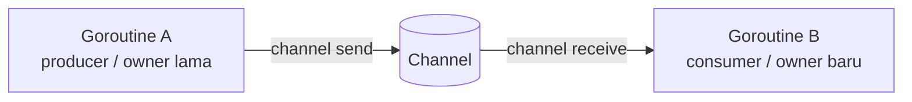
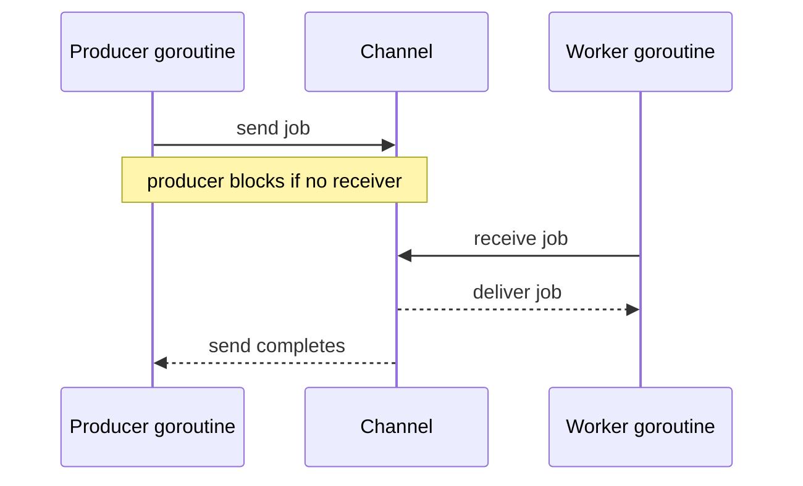
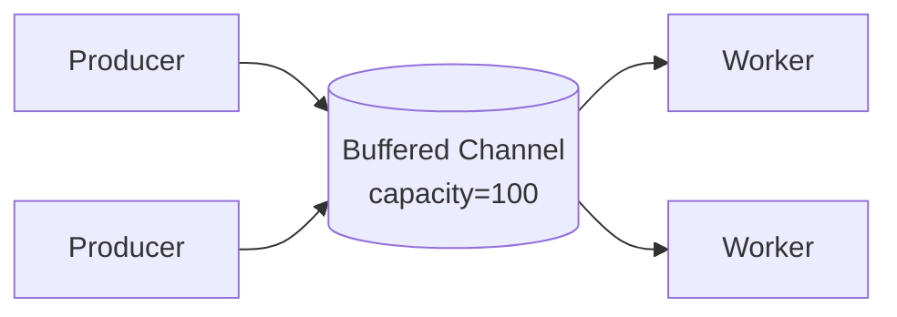
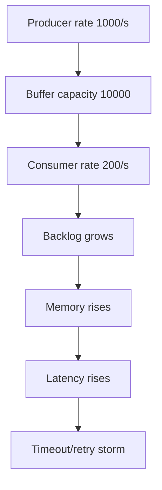
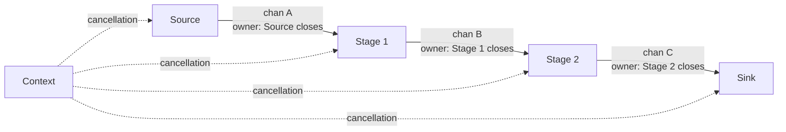

# learn-go-concurrency-parallelism-part-008.md

# Part 008 — Channels Deep Dive: Semantics, Ownership, Backpressure, and Closure

> Target pembaca: Java software engineer yang sudah memahami thread, executor, queue, lock, blocking, async API, dan ingin memahami channel Go sebagai primitive desain concurrency production-grade, bukan hanya syntax.
>
> Fokus part ini: memahami channel sebagai **synchronization primitive**, **ownership transfer mechanism**, **bounded coordination point**, dan **backpressure surface**.

---

## 0. Posisi Part Ini dalam Seri

Kita sudah membangun fondasi:

- Part 000: orientasi Java → Go concurrency.
- Part 001: work, time, state, ordering, contention.
- Part 002: goroutine lifecycle, parking, blocking, leak.
- Part 003: scheduler G/M/P.
- Part 004: `GOMAXPROCS`, CPU quota, Kubernetes reality.
- Part 005: Go Memory Model.
- Part 006: `sync` primitives.
- Part 007: atomic operations.

Part ini masuk ke primitive yang paling sering diasosiasikan dengan Go: **channel**.

Tetapi framing yang benar:

> Channel bukan “queue bawaan Go”.
>
> Channel adalah primitive sinkronisasi yang dapat berperan sebagai queue, rendezvous point, ownership handoff, semaphore, cancellation signal, lifecycle boundary, dan backpressure mechanism.

Kalau channel dipahami hanya sebagai queue, desain concurrency Go akan cepat berubah menjadi:
- goroutine leak,
- deadlock,
- send-on-closed-channel panic,
- hidden queue buildup,
- unclear ownership,
- cancellation yang tidak dipropagasikan,
- pipeline yang tidak bisa berhenti bersih.

---

## 1. Tujuan Pembelajaran

Setelah menyelesaikan part ini, Anda harus mampu:

1. Menjelaskan perbedaan **unbuffered channel** dan **buffered channel** sebagai model sinkronisasi.
2. Mendesain ownership rule:
   - siapa sender,
   - siapa receiver,
   - siapa closer,
   - siapa cancellation owner,
   - siapa waiter.
3. Memahami memory ordering dari send, receive, dan close.
4. Menggunakan channel sebagai:
   - rendezvous,
   - queue bounded,
   - semaphore,
   - completion signal,
   - cancellation broadcast,
   - pipeline edge.
5. Mengenali kapan **channel lebih buruk** daripada mutex, atomic, atau plain function call.
6. Menghindari anti-pattern:
   - close dari receiver,
   - multi-sender close tanpa coordinator,
   - channel sebagai unbounded queue,
   - default select busy-loop,
   - orphan sender,
   - blocked send leak.
7. Mendesain API channel yang misuse-resistant.

---

## 2. Mental Model Utama: Channel Adalah Edge, Bukan Node

Dalam desain concurrency, goroutine adalah node eksekusi. Channel adalah edge komunikasi/sinkronisasi antar node.



Channel menjawab pertanyaan:

1. **Apa yang dipindahkan?**
   - value,
   - ownership,
   - signal,
   - permit,
   - error,
   - completion event.

2. **Siapa yang boleh mengirim?**

3. **Siapa yang boleh menerima?**

4. **Apakah komunikasi harus sinkron?**
   - unbuffered: rendezvous.
   - buffered: queue bounded.

5. **Apa yang terjadi kalau receiver lambat?**
   - sender block,
   - queue terisi,
   - request ditolak,
   - work didrop,
   - timeout/cancel.

6. **Bagaimana channel selesai?**
   - close,
   - context cancellation,
   - sentinel value,
   - external lifecycle.

Kesalahan besar adalah membuat channel sebelum menjawab pertanyaan ownership di atas.

---

## 3. Channel dari Perspektif Java Engineer

Di Java, Anda mungkin familiar dengan:

- `BlockingQueue<T>`
- `SynchronousQueue<T>`
- `ArrayBlockingQueue<T>`
- `LinkedBlockingQueue<T>`
- `Semaphore`
- `CountDownLatch`
- `CompletableFuture`
- `ExecutorService`
- `Flow.Publisher`
- `ReentrantLock`
- `Condition`

Channel Go bisa menyerupai beberapa hal ini, tetapi tidak identik.

| Go construct | Mirip di Java | Perbedaan penting |
|---|---|---|
| `chan T` unbuffered | `SynchronousQueue<T>` | Send/receive juga menjadi memory synchronization event |
| `chan T` buffered | `ArrayBlockingQueue<T>` | Close semantics built-in; send ke closed channel panic |
| `chan struct{}` sebagai signal | `CountDownLatch`/event | Close channel dapat broadcast ke banyak receiver |
| `chan struct{}` sebagai semaphore | `Semaphore` | Permit direpresentasikan sebagai slot/value |
| receive dari channel | `take()` | Bisa mendeteksi closed dengan comma-ok |
| close channel | producer completion signal | Hanya sender/owner yang seharusnya close |
| `select` | wait multiple blocking ops | Native language construct |

Namun ada perbedaan budaya desain:

Java cenderung:
- shared object + lock/atomic,
- executor + task queue,
- future/promise,
- explicit thread pool.

Go cenderung:
- goroutine per activity,
- channel untuk boundary komunikasi,
- context untuk lifecycle,
- mutex untuk shared invariant sederhana,
- explicit boundedness.

---

## 4. Syntax Dasar, Tapi dengan Makna Desain

```go
ch := make(chan int)      // unbuffered
ch := make(chan int, 10)  // buffered capacity 10

ch <- 42                  // send
v := <-ch                 // receive

v, ok := <-ch             // ok false jika channel closed dan drained

close(ch)                 // close channel
```

Directional channel:

```go
func produce(out chan<- int) {
    out <- 1
}

func consume(in <-chan int) {
    v := <-in
    _ = v
}
```

Directional channel adalah tool desain API. Ia membuat kontrak eksplisit:

- `chan<- T`: function hanya boleh send.
- `<-chan T`: function hanya boleh receive.
- `chan T`: function boleh send dan receive.

Guideline:

> Untuk boundary API, gunakan directional channel sebanyak mungkin agar ownership lebih jelas.

---

## 5. Unbuffered Channel: Rendezvous dan Handoff

Unbuffered channel dibuat tanpa capacity:

```go
ch := make(chan Job)
```

Send akan block sampai ada receiver:

```go
ch <- job
```

Receive akan block sampai ada sender:

```go
job := <-ch
```

Artinya unbuffered channel adalah rendezvous point.



### 5.1 Makna Engineering

Unbuffered channel memberikan:

1. **Synchronization**
   - sender dan receiver bertemu.

2. **Ownership handoff**
   - setelah send selesai, sender secara desain tidak boleh lagi mutate object yang dikirim jika object tersebut shared reference.

3. **Natural backpressure**
   - producer tidak bisa lebih cepat dari consumer.

4. **Low buffering**
   - tidak ada backlog internal.

5. **Latency coupling**
   - producer latency tergantung receiver readiness.

### 5.2 Kapan Unbuffered Channel Cocok

Gunakan unbuffered channel ketika:

- Anda ingin handoff eksplisit.
- Producer tidak boleh outrun consumer.
- Work item harus diproses synchronously oleh worker.
- Anda ingin test deterministik.
- Anda ingin membuat goroutine lifecycle terlihat jelas.
- Anda butuh completion acknowledgement.

Contoh:

```go
type Job struct {
    ID string
}

func worker(ctx context.Context, jobs <-chan Job) {
    for {
        select {
        case <-ctx.Done():
            return
        case job, ok := <-jobs:
            if !ok {
                return
            }
            process(job)
        }
    }
}
```

### 5.3 Kapan Unbuffered Channel Buruk

Buruk ketika:

- producer bursty tetapi consumer stabil,
- Anda butuh decoupling kecil,
- producer tidak boleh block,
- send dilakukan di request path latency-sensitive tanpa timeout,
- receiver bisa berhenti lebih awal,
- tidak ada cancellation select.

Anti-pattern:

```go
func handler(w http.ResponseWriter, r *http.Request) {
    jobs <- Job{} // bisa block selamanya jika worker mati/penuh
    w.WriteHeader(http.StatusAccepted)
}
```

Lebih baik:

```go
func handler(w http.ResponseWriter, r *http.Request) {
    select {
    case jobs <- Job{}:
        w.WriteHeader(http.StatusAccepted)
    case <-r.Context().Done():
        http.Error(w, "client cancelled", http.StatusRequestTimeout)
    case <-time.After(100 * time.Millisecond):
        http.Error(w, "queue busy", http.StatusTooManyRequests)
    }
}
```

---

## 6. Buffered Channel: Queue Bounded, Decoupling, dan Backpressure

Buffered channel:

```go
jobs := make(chan Job, 100)
```

Send block hanya jika buffer penuh. Receive block hanya jika buffer kosong.



### 6.1 Buffered Channel Bukan Free Throughput

Buffered channel memberi decoupling sementara:

- producer bisa jalan lebih cepat sampai buffer penuh,
- consumer bisa memproses backlog,
- burst kecil bisa diserap.

Tetapi capacity tidak menciptakan throughput. Throughput tetap dibatasi oleh:

- worker processing rate,
- CPU,
- downstream latency,
- database pool,
- network dependency,
- lock contention.

Kalau consumer lebih lambat daripada producer secara sustained, buffer hanya menunda kegagalan.



### 6.2 Capacity Adalah Policy

Capacity harus punya makna:

| Capacity | Makna |
|---:|---|
| 0 | rendezvous, no backlog |
| 1 | latest handoff / small decoupling |
| N kecil | absorb microburst |
| N besar | explicit queue, must observe and bound |
| sangat besar | sering menjadi hidden outage |

Pertanyaan capacity:

1. Berapa arrival rate?
2. Berapa service rate?
3. Berapa burst yang ingin diserap?
4. Berapa maksimum latency yang masih acceptable?
5. Apa yang terjadi saat penuh?
6. Apakah queue depth dimonitor?
7. Apakah item punya deadline?
8. Apakah item masih valid saat akhirnya diproses?

### 6.3 Buffered Channel sebagai Backpressure

Contoh bounded queue dengan timeout:

```go
func submit(ctx context.Context, jobs chan<- Job, job Job) error {
    select {
    case jobs <- job:
        return nil
    case <-ctx.Done():
        return ctx.Err()
    }
}
```

Versi dengan explicit overload result:

```go
var ErrQueueFull = errors.New("queue full")

func trySubmit(jobs chan<- Job, job Job) error {
    select {
    case jobs <- job:
        return nil
    default:
        return ErrQueueFull
    }
}
```

Design decision:

- block = push back ke caller,
- default reject = load shedding,
- timeout = bounded wait,
- drop oldest/latest = lossy system,
- spill to durable queue = reliability over latency.

---

## 7. Channel dan Go Memory Model

Channel bukan hanya transport value. Channel adalah synchronization operation.

Aturan penting:

1. Send pada channel disinkronkan sebelum completion receive yang menerima value tersebut.
2. Close pada channel disinkronkan sebelum receive yang melihat channel closed.
3. Untuk unbuffered channel, receive juga terjadi sebelum send complete.
4. Untuk buffered channel capacity C, receive ke-k terjadi sebelum send ke-k+C complete.

Implikasi:

```go
var msg string
done := make(chan struct{})

go func() {
    msg = "ready"
    close(done)
}()

<-done
fmt.Println(msg) // safe: close happens-before receive closed
```

`close(done)` membuat semua goroutine yang receive dari `done` melihat writes sebelum close.

Namun jangan salah paham:

```go
var shared int
ch := make(chan struct{})

go func() {
    shared = 1
    ch <- struct{}{}
}()

<-ch
fmt.Println(shared) // safe untuk write tersebut
```

Tetapi ini tidak membuat semua akses ke `shared` aman kalau ada writer lain tanpa synchronization.

```go
var shared int
ch := make(chan struct{})

go func() {
    shared = 1
    ch <- struct{}{}
}()

go func() {
    shared = 2 // race dengan write pertama jika tidak diorder
}()

<-ch
fmt.Println(shared)
```

Channel synchronization hanya mengorder operasi yang terhubung oleh send/receive/close tertentu.

---

## 8. Ownership Transfer: Konsep yang Sering Lebih Penting dari Syntax

Channel sering dipakai untuk memindahkan ownership.

Contoh buruk:

```go
type Buffer struct {
    Data []byte
}

ch := make(chan *Buffer)

go func() {
    b := &Buffer{Data: make([]byte, 1024)}
    ch <- b

    // Buruk: sender masih mutate setelah handoff.
    b.Data[0] = 99
}()

b := <-ch
_ = b.Data[0]
```

Secara memory model, send/receive mengorder operasi sebelum send. Tetapi mutation setelah send bisa race dengan receiver.

Rule:

> Setelah object dikirim melalui channel sebagai ownership transfer, sender tidak boleh mutate object itu kecuali ada protocol eksplisit untuk mengembalikan ownership.

### 8.1 Ownership Handoff Pattern

```go
type Buffer struct {
    Data []byte
}

func producer(out chan<- *Buffer) {
    b := &Buffer{Data: make([]byte, 1024)}
    fill(b.Data)
    out <- b
    // ownership pindah ke receiver
}

func consumer(in <-chan *Buffer) {
    b := <-in
    use(b.Data)
}
```

### 8.2 Borrowing Pattern

Kalau object hanya dipinjam, harus ada acknowledgement.

```go
type Request struct {
    Buf  []byte
    Done chan struct{}
}

func owner(worker chan<- Request) {
    buf := make([]byte, 1024)

    req := Request{
        Buf:  buf,
        Done: make(chan struct{}),
    }

    worker <- req
    <-req.Done // ownership kembali aman setelah worker selesai

    reuse(buf)
}

func worker(in <-chan Request) {
    req := <-in
    process(req.Buf)
    close(req.Done)
}
```

Tetapi pattern ini mudah rumit. Sering lebih aman:
- copy data,
- use immutable object,
- allocate per request,
- use pool with strict ownership.

---

## 9. Close Semantics: Close Adalah Signal dari Sender ke Receiver

Close channel:

```go
close(ch)
```

Receive dari closed channel:

```go
v, ok := <-ch
if !ok {
    // channel closed and drained
}
```

Range over channel:

```go
for v := range ch {
    process(v)
}
```

Range berhenti saat channel closed dan semua buffered value habis.

### 9.1 Makna Close

Close berarti:

> Tidak akan ada lagi value yang dikirim.

Close bukan:
- membatalkan send yang sedang dilakukan secara universal,
- menghentikan goroutine,
- menghapus buffered values,
- signal dari receiver ke sender,
- cleanup magic.

### 9.2 Siapa yang Boleh Close?

Rule paling aman:

> Channel ditutup oleh goroutine yang memiliki sisi send dan tahu pasti tidak ada sender lain yang akan mengirim lagi.

Dengan kata lain:

- sender closes,
- receiver usually does not close,
- multiple senders need coordinator.

### 9.3 Single Sender Close

```go
func producer(out chan<- int) {
    defer close(out)

    for i := 0; i < 10; i++ {
        out <- i
    }
}

func consumer(in <-chan int) {
    for v := range in {
        fmt.Println(v)
    }
}
```

Ini aman karena hanya producer yang send dan producer tahu kapan selesai.

### 9.4 Receiver Close Anti-Pattern

```go
func consumer(ch chan int) {
    v := <-ch
    _ = v
    close(ch) // buruk jika sender masih mungkin send
}
```

Jika sender kemudian send:

```go
ch <- 2 // panic: send on closed channel
```

### 9.5 Multiple Sender Close Problem

```go
ch := make(chan int)

for i := 0; i < 10; i++ {
    go func(id int) {
        ch <- id
        close(ch) // fatal: banyak sender bisa close
    }(i)
}
```

Solusi: coordinator dengan `WaitGroup`.

```go
func merge(inputs ...<-chan int) <-chan int {
    out := make(chan int)
    var wg sync.WaitGroup

    wg.Add(len(inputs))
    for _, in := range inputs {
        in := in
        go func() {
            defer wg.Done()
            for v := range in {
                out <- v
            }
        }()
    }

    go func() {
        wg.Wait()
        close(out)
    }()

    return out
}
```

Ownership close ada di goroutine coordinator, bukan worker sender individual.

---

## 10. Nil Channel: Dynamic Disable dalam `select`

Nil channel block selamanya untuk send/receive:

```go
var ch chan int

<-ch     // block forever
ch <- 1  // block forever
```

Di `select`, case dengan nil channel effectively disabled.

```go
var out chan<- int
var next int

if hasValue {
    out = output
    next = value
}

select {
case out <- next:
    hasValue = false
case v := <-input:
    value = v
    hasValue = true
}
```

Nil channel berguna untuk:
- state machine,
- temporarily disabling send,
- fan-in/fan-out control,
- avoiding boolean-heavy select logic.

Contoh batching:

```go
func batcher(ctx context.Context, in <-chan Item, out chan<- []Item, max int) {
    var batch []Item
    var outCh chan<- []Item
    var next []Item

    for {
        if len(batch) >= max {
            outCh = out
            next = batch
        } else {
            outCh = nil
            next = nil
        }

        select {
        case <-ctx.Done():
            return

        case item, ok := <-in:
            if !ok {
                if len(batch) > 0 {
                    select {
                    case out <- batch:
                    case <-ctx.Done():
                    }
                }
                return
            }
            batch = append(batch, item)

        case outCh <- next:
            batch = nil
        }
    }
}
```

Caution:

Nil channel juga bisa menyebabkan deadlock yang sulit dibaca jika tidak didokumentasikan.

---

## 11. Directional Channels sebagai API Contract

### 11.1 Producer API

```go
func StartProducer(ctx context.Context) <-chan Event {
    out := make(chan Event)

    go func() {
        defer close(out)

        for {
            event, err := nextEvent(ctx)
            if err != nil {
                return
            }

            select {
            case out <- event:
            case <-ctx.Done():
                return
            }
        }
    }()

    return out
}
```

Consumer hanya receive. Ia tidak bisa close/send.

### 11.2 Consumer API

```go
func StartSink(ctx context.Context, in <-chan Event) error {
    for {
        select {
        case <-ctx.Done():
            return ctx.Err()
        case event, ok := <-in:
            if !ok {
                return nil
            }
            if err := write(event); err != nil {
                return err
            }
        }
    }
}
```

### 11.3 Why Direction Matters

Tanpa directional channel:

```go
func consume(ch chan Event) {
    close(ch) // compiler allows this
}
```

Dengan directional receive-only:

```go
func consume(ch <-chan Event) {
    close(ch) // compile error
}
```

Ini adalah misuse resistance.

---

## 12. Channel sebagai Signal

Kalau tidak butuh payload, gunakan `struct{}`:

```go
done := make(chan struct{})
```

`struct{}` tidak membawa data.

### 12.1 One-Time Completion

```go
done := make(chan struct{})

go func() {
    defer close(done)
    work()
}()

<-done
```

### 12.2 Broadcast Cancellation

Close channel bisa membangunkan banyak receiver.

```go
done := make(chan struct{})

for i := 0; i < 10; i++ {
    go func() {
        <-done
        fmt.Println("stopping")
    }()
}

close(done)
```

Semua receiver unblock.

Namun dalam aplikasi modern, untuk cancellation lintas API, prefer `context.Context`.

Gunakan channel done internal ketika:
- local primitive,
- low-level coordination,
- no need deadline/value/cause,
- no external API contract.

Gunakan context ketika:
- request lifecycle,
- deadline,
- cancellation propagation,
- cross-boundary call,
- library API.

---

## 13. Channel sebagai Semaphore

Buffered channel bisa menjadi semaphore.

```go
type Semaphore struct {
    permits chan struct{}
}

func NewSemaphore(n int) *Semaphore {
    return &Semaphore{permits: make(chan struct{}, n)}
}

func (s *Semaphore) Acquire(ctx context.Context) error {
    select {
    case s.permits <- struct{}{}:
        return nil
    case <-ctx.Done():
        return ctx.Err()
    }
}

func (s *Semaphore) Release() {
    select {
    case <-s.permits:
    default:
        panic("release without acquire")
    }
}
```

Usage:

```go
sem := NewSemaphore(10)

func handle(ctx context.Context, req Request) error {
    if err := sem.Acquire(ctx); err != nil {
        return err
    }
    defer sem.Release()

    return callDownstream(ctx, req)
}
```

### 13.1 Semaphore vs Worker Pool

| Pattern | Cocok untuk |
|---|---|
| Semaphore | membatasi concurrency di sekitar operasi tertentu |
| Worker pool | queue + fixed consumers + lifecycle worker |
| Rate limiter | membatasi rate per waktu |
| DB pool | membatasi connection resource |
| Bulkhead | isolasi per dependency/tenant |

Semaphore tidak memberikan queue worker sendiri; caller tetap menjalankan work setelah permit didapat.

---

## 14. Channel sebagai Queue: Bounded Only

Channel sering dipakai sebagai queue:

```go
jobs := make(chan Job, 100)
```

Tetapi channel tidak punya:
- priority,
- inspect arbitrary item,
- remove arbitrary item,
- resize,
- built-in metrics,
- expiration per item,
- durable persistence,
- multi-condition wakeup,
- sophisticated fairness.

Kalau kebutuhan queue kompleks, channel mungkin bukan primitive terbaik.

### 14.1 Bounded Queue Contract

Jika membuat queue dengan channel, dokumentasikan:

```go
type QueueConfig struct {
    Capacity      int
    SubmitTimeout time.Duration
    DropPolicy    DropPolicy
}
```

Policy saat penuh:

| Policy | Behavior | Risiko |
|---|---|---|
| block | producer menunggu | request pile-up |
| timeout | bounded wait | rejected work |
| drop newest | lossy | data loss |
| drop oldest | stale removal | ordering violation |
| spill | durable queue | complexity |
| backpressure upstream | stable | caller must handle |

### 14.2 Queue Depth Observability

Channel length:

```go
len(jobs)
cap(jobs)
```

`len(ch)` concurrent-safe untuk membaca jumlah buffered element saat itu, tetapi hanya snapshot. Jangan pakai sebagai correctness condition.

Buruk:

```go
if len(jobs) < cap(jobs) {
    jobs <- job // race: bisa tetap block
}
```

Baik:

```go
select {
case jobs <- job:
    return nil
default:
    return ErrQueueFull
}
```

`len(ch)` berguna untuk metrics:

```go
queueDepth.Set(float64(len(jobs)))
queueCapacity.Set(float64(cap(jobs)))
```

---

## 15. Send dengan Cancellation: Pattern Wajib

Setiap send yang bisa block harus dipertimbangkan cancellation-nya.

Buruk:

```go
out <- value
```

Kalau downstream berhenti, goroutine ini leak.

Baik:

```go
select {
case out <- value:
    return nil
case <-ctx.Done():
    return ctx.Err()
}
```

Dalam pipeline:

```go
func stage(ctx context.Context, in <-chan A) <-chan B {
    out := make(chan B)

    go func() {
        defer close(out)

        for {
            select {
            case <-ctx.Done():
                return

            case a, ok := <-in:
                if !ok {
                    return
                }

                b := transform(a)

                select {
                case out <- b:
                case <-ctx.Done():
                    return
                }
            }
        }
    }()

    return out
}
```

Notice ada dua select:
- saat receive input,
- saat send output.

Kalau hanya receive yang cancel-aware tapi send tidak, stage tetap bisa leak.

---

## 16. Receive dengan Cancellation

Receive juga bisa block selamanya jika upstream tidak close.

Buruk:

```go
v := <-in
```

Baik:

```go
select {
case v, ok := <-in:
    if !ok {
        return nil
    }
    return handle(v)
case <-ctx.Done():
    return ctx.Err()
}
```

Dalam worker loop:

```go
func worker(ctx context.Context, jobs <-chan Job) {
    for {
        select {
        case <-ctx.Done():
            return
        case job, ok := <-jobs:
            if !ok {
                return
            }
            process(ctx, job)
        }
    }
}
```

---

## 17. Pipeline Edge Contract

Setiap edge channel dalam pipeline harus punya contract.



Untuk setiap channel:

| Pertanyaan | Jawaban wajib |
|---|---|
| Siapa yang send? | satu/multiple sender |
| Siapa yang receive? | satu/multiple receiver |
| Siapa yang close? | owner/coordinator |
| Apakah buffered? | capacity dan alasan |
| Apa yang terjadi saat penuh? | block/drop/timeout |
| Apa yang terjadi saat ctx cancel? | return/drain/flush |
| Apakah ordering penting? | yes/no/per-key |
| Apakah duplicate allowed? | yes/no/idempotent |
| Apakah item immutable? | yes/no/ownership |

---

## 18. Early Termination Problem

Pipeline sederhana:

```go
func gen(nums ...int) <-chan int {
    out := make(chan int)
    go func() {
        defer close(out)
        for _, n := range nums {
            out <- n
        }
    }()
    return out
}

func square(in <-chan int) <-chan int {
    out := make(chan int)
    go func() {
        defer close(out)
        for n := range in {
            out <- n * n
        }
    }()
    return out
}
```

Consumer hanya butuh satu value:

```go
out := square(gen(1, 2, 3, 4))
fmt.Println(<-out)
return
```

Masalah:
- `square` bisa block saat send value berikutnya.
- `gen` bisa block saat send ke `square`.
- goroutine leak.

Solusi: cancellation.

```go
func gen(ctx context.Context, nums ...int) <-chan int {
    out := make(chan int)

    go func() {
        defer close(out)

        for _, n := range nums {
            select {
            case out <- n:
            case <-ctx.Done():
                return
            }
        }
    }()

    return out
}

func square(ctx context.Context, in <-chan int) <-chan int {
    out := make(chan int)

    go func() {
        defer close(out)

        for {
            select {
            case <-ctx.Done():
                return

            case n, ok := <-in:
                if !ok {
                    return
                }

                select {
                case out <- n * n:
                case <-ctx.Done():
                    return
                }
            }
        }
    }()

    return out
}
```

Consumer:

```go
ctx, cancel := context.WithCancel(context.Background())
defer cancel()

out := square(ctx, gen(ctx, 1, 2, 3, 4))
fmt.Println(<-out)
cancel()
```

---

## 19. Drain vs Cancel

Saat shutdown atau early return, ada dua strategi:

### 19.1 Cancel

Stop upstream quickly.

Cocok ketika:
- work tidak lagi dibutuhkan,
- item bisa dibuang,
- latency shutdown penting,
- caller cancelled.

### 19.2 Drain

Tetap baca sampai channel habis.

Cocok ketika:
- semua item harus diproses,
- producer sudah close,
- data loss tidak acceptable,
- shutdown graceful.

Contoh drain:

```go
for job := range jobs {
    process(job)
}
```

Contoh cancel-aware drain with bounded shutdown:

```go
func drainOrTimeout(ctx context.Context, jobs <-chan Job) {
    for {
        select {
        case job, ok := <-jobs:
            if !ok {
                return
            }
            process(job)
        case <-ctx.Done():
            return
        }
    }
}
```

Design decision:

| Situation | Strategy |
|---|---|
| HTTP client cancelled | cancel |
| SIGTERM with grace period | stop intake, drain until deadline |
| lossy telemetry | drop/cancel |
| payment processing | drain/durable queue |
| cache refresh | cancel |
| audit event | durable queue, not plain channel only |

---

## 20. Channel Closing Patterns

### 20.1 Producer Owns Close

```go
func producer() <-chan int {
    out := make(chan int)

    go func() {
        defer close(out)
        for i := 0; i < 10; i++ {
            out <- i
        }
    }()

    return out
}
```

### 20.2 Coordinator Owns Close for Multiple Producers

```go
func produceMany(ctx context.Context, producers int) <-chan Event {
    out := make(chan Event)
    var wg sync.WaitGroup

    wg.Add(producers)
    for i := 0; i < producers; i++ {
        i := i
        go func() {
            defer wg.Done()
            for _, event := range loadEvents(i) {
                select {
                case out <- event:
                case <-ctx.Done():
                    return
                }
            }
        }()
    }

    go func() {
        wg.Wait()
        close(out)
    }()

    return out
}
```

### 20.3 Stop Channel with `sync.Once`

Jika ada multiple caller yang bisa request stop, jangan close channel langsung berkali-kali.

```go
type Stopper struct {
    once sync.Once
    done chan struct{}
}

func NewStopper() *Stopper {
    return &Stopper{done: make(chan struct{})}
}

func (s *Stopper) Stop() {
    s.once.Do(func() {
        close(s.done)
    })
}

func (s *Stopper) Done() <-chan struct{} {
    return s.done
}
```

Namun untuk public API, `context.Context` sering lebih idiomatic.

---

## 21. Send-on-Closed Panic: Kenapa Terjadi dan Cara Mencegah

Send ke closed channel panic.

```go
ch := make(chan int)
close(ch)
ch <- 1 // panic
```

Root cause biasanya:
- ownership close tidak jelas,
- receiver menutup channel,
- multiple sender,
- lifecycle race,
- stop dan submit bisa terjadi bersamaan.

### 21.1 Bad Stop/Submit API

```go
type Queue struct {
    jobs chan Job
}

func (q *Queue) Submit(job Job) {
    q.jobs <- job
}

func (q *Queue) Stop() {
    close(q.jobs)
}
```

Race:
- goroutine A call `Submit`
- goroutine B call `Stop`
- send on closed panic.

### 21.2 Safer API with Mutex State

```go
var ErrStopped = errors.New("queue stopped")

type Queue struct {
    mu      sync.Mutex
    stopped bool
    jobs    chan Job
}

func NewQueue(capacity int) *Queue {
    return &Queue{jobs: make(chan Job, capacity)}
}

func (q *Queue) Submit(ctx context.Context, job Job) error {
    q.mu.Lock()
    if q.stopped {
        q.mu.Unlock()
        return ErrStopped
    }

    jobs := q.jobs
    q.mu.Unlock()

    select {
    case jobs <- job:
        return nil
    case <-ctx.Done():
        return ctx.Err()
    }
}

func (q *Queue) Stop() {
    q.mu.Lock()
    if !q.stopped {
        q.stopped = true
        close(q.jobs)
    }
    q.mu.Unlock()
}
```

Tapi ini masih punya subtle race: `Submit` bisa mengambil `jobs`, unlock, lalu `Stop` close, lalu `Submit` send ke closed channel.

Lebih aman: jangan close job channel yang bisa di-submit concurrent dengan stop. Gunakan separate done channel dan worker exit.

```go
type Queue struct {
    jobs chan Job
    done chan struct{}

    once sync.Once
}

func NewQueue(capacity int) *Queue {
    return &Queue{
        jobs: make(chan Job, capacity),
        done: make(chan struct{}),
    }
}

func (q *Queue) Submit(ctx context.Context, job Job) error {
    select {
    case q.jobs <- job:
        return nil
    case <-q.done:
        return ErrStopped
    case <-ctx.Done():
        return ctx.Err()
    }
}

func (q *Queue) Stop() {
    q.once.Do(func() {
        close(q.done)
    })
}
```

Worker:

```go
func (q *Queue) worker() {
    for {
        select {
        case job := <-q.jobs:
            process(job)
        case <-q.done:
            return
        }
    }
}
```

Jika butuh drain, desain lebih kompleks:
- stop intake,
- wait submitters,
- close jobs only after no submitters,
- workers range jobs,
- wait workers.

Ini akan dibahas lebih dalam di worker pool/service lifecycle parts.

---

## 22. Receiving from Closed Channel: Zero Value Trap

```go
ch := make(chan int)
close(ch)

v := <-ch
fmt.Println(v) // 0
```

Jika tidak cek `ok`, zero value bisa disalahartikan sebagai data valid.

Buruk:

```go
for {
    job := <-jobs
    process(job) // bisa process zero-value job selamanya setelah close
}
```

Baik:

```go
for {
    job, ok := <-jobs
    if !ok {
        return
    }
    process(job)
}
```

Atau:

```go
for job := range jobs {
    process(job)
}
```

Untuk channel of pointer, closed receive memberi `nil`, juga berbahaya jika `nil` valid/special.

---

## 23. Channel of Error: Common Trap

Pattern:

```go
errCh := make(chan error, 1)

go func() {
    errCh <- doWork()
}()

if err := <-errCh; err != nil {
    return err
}
```

Ini boleh untuk satu goroutine.

Masalah muncul untuk multiple goroutine:

```go
errCh := make(chan error)

for _, item := range items {
    go func(item Item) {
        errCh <- process(item)
    }(item)
}

return <-errCh
```

Masalah:
- hanya receive satu error,
- goroutine lain bisa block send,
- leak,
- tidak ada cancellation,
- channel tidak ditutup.

Lebih baik gunakan task group/errgroup style.

Manual:

```go
ctx, cancel := context.WithCancel(ctx)
defer cancel()

errCh := make(chan error, len(items))
var wg sync.WaitGroup

wg.Add(len(items))
for _, item := range items {
    item := item
    go func() {
        defer wg.Done()
        if err := process(ctx, item); err != nil {
            errCh <- err
            cancel()
        }
    }()
}

go func() {
    wg.Wait()
    close(errCh)
}()

var firstErr error
 for err := range errCh {
    if firstErr == nil {
        firstErr = err
    }
}

return firstErr
```

Namun di production, prefer `errgroup` jika available, karena semantics lebih jelas.

---

## 24. Channel and Ordering

Channel preserves FIFO order per sender? Lebih tepat:

- Channel menerima sequence send operations sesuai ordering yang terjadi pada channel.
- Jika satu goroutine mengirim A lalu B ke channel yang sama, receiver akan menerima A sebelum B.
- Dengan multiple sender, interleaving antar sender bergantung schedule.

Contoh:

```go
ch := make(chan string, 10)

go func() {
    ch <- "A1"
    ch <- "A2"
}()

go func() {
    ch <- "B1"
    ch <- "B2"
}()
```

Guaranteed:
- A1 sebelum A2.
- B1 sebelum B2.

Tidak guaranteed:
- A1 sebelum B1,
- B1 sebelum A1,
- A2 sebelum B1,
- global ordering.

Jika ordering penting:
- gunakan single sender,
- sequence number,
- per-key partition,
- reorder buffer,
- actor per key,
- mutex-protected ordered structure.

---

## 25. Fairness dan Starvation

Channel operations bergantung scheduler dan runtime implementation. Jangan desain correctness di atas asumsi fairness yang terlalu kuat.

Contoh:

```go
select {
case fast <- item:
case slow <- item:
}
```

Jika satu case sering ready, distribusi tidak boleh diasumsikan sebagai strict round-robin.

Untuk fairness eksplisit:
- buat scheduler sendiri,
- round-robin over queues,
- per-priority queue,
- weighted selection,
- token bucket per class.

Channel memberi blocking coordination, bukan scheduling policy lengkap.

---

## 26. `select` Preview: Channel Selection as State Machine

Walau part `select` khusus ada di Part 009, channel tidak bisa dipahami utuh tanpa `select`.

Basic:

```go
select {
case v := <-in:
    handle(v)
case out <- value:
    sent()
case <-ctx.Done():
    return ctx.Err()
default:
    noOp()
}
```

`select` memungkinkan:
- receive dengan cancellation,
- send dengan timeout,
- multiplexing input,
- state machine dengan nil channel,
- non-blocking operation.

Tetapi default case bisa menjadi busy loop:

```go
for {
    select {
    case v := <-ch:
        handle(v)
    default:
        // spins if no work
    }
}
```

Lebih baik:
- block,
- use ticker carefully,
- use condition,
- use worker wait,
- use runtime trace/profile before optimizing.

---

## 27. Channel as API Surface: Public vs Internal

### 27.1 Public Channel Return

```go
func Events() <-chan Event
```

Pros:
- simple,
- composable,
- idiomatic for stream.

Cons:
- error propagation awkward,
- cancellation needs context,
- backpressure controlled by receiver,
- lifecycle often ambiguous,
- cannot evolve easily if you need ack/retry.

Alternative:

```go
type Subscription interface {
    Events() <-chan Event
    Err() error
    Close() error
}
```

Or callback/iterator style:

```go
func Subscribe(ctx context.Context, handler func(Event) error) error
```

### 27.2 Accepting Channel as Parameter

```go
func Run(ctx context.Context, in <-chan Job) error
```

Good when caller owns source.

Bad when function needs queue semantics, stop semantics, metrics, and overload policy. In that case, create explicit type:

```go
type Dispatcher interface {
    Submit(context.Context, Job) error
    Stop(context.Context) error
    Stats() DispatcherStats
}
```

---

## 28. When Not to Use Channel

Gunakan mutex jika:
- Anda menjaga shared invariant sederhana.
- Tidak ada stream/event/handoff.
- Anda butuh read-modify-write cepat.
- Anda hanya butuh protect map/cache.

Contoh channel yang overkill:

```go
type Counter struct {
    commands chan command
}
```

Untuk counter sederhana, ini buruk dibanding:

```go
type Counter struct {
    mu sync.Mutex
    n  int64
}
```

Gunakan atomic jika:
- single variable state,
- high-frequency counter/flag,
- invariant sangat sederhana.

Gunakan channel jika:
- ada handoff ownership,
- ada stream,
- ada lifecycle signal,
- ada pipeline,
- ada bounded worker queue,
- ada coordination antar goroutine yang memang event-driven.

Decision matrix:

| Problem | Prefer |
|---|---|
| Protect map with invariant | `sync.Mutex` |
| Read-mostly immutable config | `atomic.Pointer` COW |
| Increment metric | `atomic.Int64` |
| Send jobs to workers | channel |
| Wait for multiple workers with errors | errgroup/task group |
| Broadcast cancellation | context / closed done channel |
| Limit concurrency around call | semaphore |
| Complex priority queue | heap + mutex/cond |
| Actor-like per-key ownership | channel + goroutine per shard/key group |

---

## 29. Backpressure Design with Channel

Backpressure berarti sistem memberi sinyal ke upstream bahwa kapasitas tidak cukup.

### 29.1 Blocking Backpressure

```go
jobs <- job
```

Pros:
- simple,
- prevents unbounded queue.

Cons:
- can block request goroutine,
- can cause thread/goroutine pile-up,
- can hide overload.

### 29.2 Timeout Backpressure

```go
select {
case jobs <- job:
    return nil
case <-time.After(50 * time.Millisecond):
    return ErrBusy
}
```

Better with timer reuse in hot paths, but conceptually clear.

### 29.3 Context-Aware Backpressure

```go
select {
case jobs <- job:
    return nil
case <-ctx.Done():
    return ctx.Err()
}
```

### 29.4 Explicit Load Shedding

```go
select {
case jobs <- job:
    return nil
default:
    return ErrQueueFull
}
```

Mapping to HTTP:

```go
if errors.Is(err, ErrQueueFull) {
    http.Error(w, "busy", http.StatusTooManyRequests)
    return
}
```

Mapping to gRPC:
- `codes.ResourceExhausted`
- maybe retry info
- avoid blind retry storm.

---

## 30. Channel Metrics

Minimal metrics for channel-backed queue:

```go
type QueueStats struct {
    Depth       int
    Capacity    int
    Submitted   uint64
    Rejected    uint64
    Processed   uint64
    Failed      uint64
}
```

Metrics to expose:
- queue depth,
- queue capacity,
- active workers,
- submit latency,
- time in queue,
- processing latency,
- rejection count,
- cancellation count,
- worker panic count,
- oldest item age.

Channel itself only gives `len` and `cap`; production needs more instrumentation.

Example wrapper:

```go
type InstrumentedQueue struct {
    jobs      chan Job
    submitted atomic.Uint64
    rejected  atomic.Uint64
}

func (q *InstrumentedQueue) TrySubmit(job Job) error {
    select {
    case q.jobs <- job:
        q.submitted.Add(1)
        return nil
    default:
        q.rejected.Add(1)
        return ErrQueueFull
    }
}

func (q *InstrumentedQueue) Depth() int {
    return len(q.jobs)
}

func (q *InstrumentedQueue) Capacity() int {
    return cap(q.jobs)
}
```

---

## 31. Goroutine Leak Patterns Caused by Channel

### 31.1 Blocked Sender Leak

```go
func produce(out chan<- int) {
    out <- 1 // receiver gone
}
```

Fix:
```go
select {
case out <- 1:
case <-ctx.Done():
    return
}
```

### 31.2 Blocked Receiver Leak

```go
func consume(in <-chan int) {
    v := <-in // sender never sends/closes
    _ = v
}
```

Fix:
```go
select {
case v, ok := <-in:
    if !ok {
        return
    }
    _ = v
case <-ctx.Done():
    return
}
```

### 31.3 Forgotten Close

```go
func producer(out chan<- int) {
    for i := 0; i < 10; i++ {
        out <- i
    }
    // forgot close
}
```

Consumer ranging forever:

```go
for v := range out {
    _ = v
}
```

Fix:
```go
defer close(out)
```

### 31.4 Send After Stop

Queue stopped by closing jobs channel while submitters still active.

Fix:
- separate `done` channel,
- stop intake before close,
- coordinate submitter lifecycle,
- use mutex state + no close of externally submitted channel,
- use explicit dispatcher type.

### 31.5 Default Busy Loop

```go
for {
    select {
    case v := <-ch:
        handle(v)
    default:
    }
}
```

Fix:
- remove default,
- use ticker/backoff,
- block on condition,
- redesign.

---

## 32. Case Study 1: External API Worker Queue

Scenario:
- HTTP request submits postal code validation job.
- External API has rate/concurrency limits.
- You use buffered channel + workers.

Naive:

```go
var jobs = make(chan Job, 100000)

func handler(w http.ResponseWriter, r *http.Request) {
    jobs <- Job{PostalCode: r.FormValue("postalCode")}
    w.WriteHeader(http.StatusAccepted)
}
```

Problems:
- huge hidden backlog,
- request can block when full,
- no timeout,
- job may be stale,
- no tenant isolation,
- no queue age metric,
- no cancellation,
- shutdown unclear.

Better:

```go
type Dispatcher struct {
    jobs chan Job

    submitted atomic.Uint64
    rejected  atomic.Uint64
}

func NewDispatcher(capacity int) *Dispatcher {
    return &Dispatcher{
        jobs: make(chan Job, capacity),
    }
}

func (d *Dispatcher) Submit(ctx context.Context, job Job) error {
    job.EnqueuedAt = time.Now()

    select {
    case d.jobs <- job:
        d.submitted.Add(1)
        return nil

    case <-ctx.Done():
        return ctx.Err()

    default:
        d.rejected.Add(1)
        return ErrQueueFull
    }
}
```

But `select` with `default` and `ctx.Done()` like above has subtle semantics: if queue full and ctx not done, default fires immediately. Good for fail-fast. If you want bounded wait:

```go
func (d *Dispatcher) Submit(ctx context.Context, job Job) error {
    job.EnqueuedAt = time.Now()

    timer := time.NewTimer(50 * time.Millisecond)
    defer timer.Stop()

    select {
    case d.jobs <- job:
        d.submitted.Add(1)
        return nil

    case <-ctx.Done():
        return ctx.Err()

    case <-timer.C:
        d.rejected.Add(1)
        return ErrQueueFull
    }
}
```

Worker:

```go
func (d *Dispatcher) RunWorker(ctx context.Context, id int) {
    for {
        select {
        case <-ctx.Done():
            return

        case job, ok := <-d.jobs:
            if !ok {
                return
            }

            if time.Since(job.EnqueuedAt) > job.MaxAge {
                continue
            }

            _ = callExternal(ctx, job)
        }
    }
}
```

Production additions:
- rate limiter,
- per-tenant queue/bulkhead,
- retry policy,
- DLQ/durable store if must not lose,
- metrics,
- graceful shutdown.

---

## 33. Case Study 2: Channel Close Panic in Multi-Sender Fan-In

Naive:

```go
func fanIn(inputs ...<-chan Event) <-chan Event {
    out := make(chan Event)

    for _, in := range inputs {
        go func(in <-chan Event) {
            for e := range in {
                out <- e
            }
            close(out)
        }(in)
    }

    return out
}
```

Bug:
- first input that closes closes `out`,
- other goroutines may still send,
- panic.

Correct:

```go
func fanIn(ctx context.Context, inputs ...<-chan Event) <-chan Event {
    out := make(chan Event)
    var wg sync.WaitGroup

    wg.Add(len(inputs))
    for _, in := range inputs {
        in := in
        go func() {
            defer wg.Done()

            for {
                select {
                case <-ctx.Done():
                    return

                case e, ok := <-in:
                    if !ok {
                        return
                    }

                    select {
                    case out <- e:
                    case <-ctx.Done():
                        return
                    }
                }
            }
        }()
    }

    go func() {
        wg.Wait()
        close(out)
    }()

    return out
}
```

Invariant:
- only coordinator closes `out`,
- senders stop before close,
- cancellation prevents blocked send leak.

---

## 34. Case Study 3: Config Reload with Channel vs Atomic Pointer

Bad channel design:

```go
type ConfigService struct {
    req chan chan Config
}

func (s *ConfigService) Get() Config {
    resp := make(chan Config)
    s.req <- resp
    return <-resp
}
```

Problems:
- every read requires goroutine/service loop,
- can block,
- high latency,
- unnecessary coordination.

Better with immutable config + atomic pointer:

```go
type ConfigService struct {
    current atomic.Pointer[Config]
}

func (s *ConfigService) Get() *Config {
    return s.current.Load()
}

func (s *ConfigService) Reload(cfg *Config) {
    s.current.Store(cfg)
}
```

Lesson:

> Channel is not a universal substitute for shared memory. If your state is immutable snapshot read frequently, atomic pointer is often clearer and faster.

---

## 35. Case Study 4: Actor-like State Owner

Sometimes channel is ideal.

```go
type command struct {
    key   string
    value string
    reply chan result
}

type Store struct {
    commands chan command
}

func NewStore(ctx context.Context) *Store {
    s := &Store{
        commands: make(chan command),
    }

    go s.loop(ctx)

    return s
}

func (s *Store) loop(ctx context.Context) {
    data := make(map[string]string)

    for {
        select {
        case <-ctx.Done():
            return

        case cmd := <-s.commands:
            data[cmd.key] = cmd.value
            cmd.reply <- result{ok: true}
        }
    }
}
```

This can be good when:
- state invariant complex,
- all mutation must be serialized,
- command order matters,
- no high read throughput requirement,
- lifecycle is clear.

But it can be bad when:
- every operation becomes bottleneck,
- reply send can block,
- no cancellation on command send/reply,
- command queue unbounded,
- actor panic kills state owner.

Improved command:

```go
func (s *Store) Put(ctx context.Context, key, value string) error {
    reply := make(chan error, 1)

    cmd := command{
        key:   key,
        value: value,
        reply: reply,
    }

    select {
    case s.commands <- cmd:
    case <-ctx.Done():
        return ctx.Err()
    }

    select {
    case err := <-reply:
        return err
    case <-ctx.Done():
        return ctx.Err()
    }
}
```

Notice reply channel buffered capacity 1 so actor does not block forever if caller times out before receiving reply.

---

## 36. Buffered Reply Channel Pattern

When a goroutine sends a response to caller, use buffered reply channel capacity 1 if caller may cancel.

Bad:

```go
reply := make(chan Result)

go func() {
    reply <- compute()
}()

select {
case res := <-reply:
    return res, nil
case <-ctx.Done():
    return Result{}, ctx.Err()
}
```

If ctx cancels first, goroutine can block sending reply.

Better:

```go
reply := make(chan Result, 1)

go func() {
    reply <- compute()
}()

select {
case res := <-reply:
    return res, nil
case <-ctx.Done():
    return Result{}, ctx.Err()
}
```

But if `compute()` itself can run long, it also needs context:

```go
reply := make(chan Result, 1)

go func() {
    res := compute(ctx)
    select {
    case reply <- res:
    case <-ctx.Done():
    }
}()
```

Or avoid goroutine if not needed.

---

## 37. Channel Buffer Size 1: Special Uses

Capacity 1 is useful for:
- non-blocking notification,
- latest value slot,
- reply channel,
- handoff with minimal decoupling,
- semaphore binary permit.

### 37.1 Coalescing Signal

```go
func notify(ch chan struct{}) {
    select {
    case ch <- struct{}{}:
    default:
        // notification already pending
    }
}
```

This prevents notification storm.

Receiver:

```go
for {
    select {
    case <-notifyCh:
        reload()
    case <-ctx.Done():
        return
    }
}
```

Channel capacity 1 means:
- at least one notification remembered,
- duplicates coalesced,
- sender does not block.

---

## 38. Channel of Channel

Channel of channel can model request/reply, dynamic subscription, or ownership transfer of stream.

```go
type request struct {
    payload Payload
    reply   chan Response
}
```

Use carefully:
- reply channel should often be buffered 1,
- context needed,
- ownership clear,
- avoid leaking reply waiters.

Example:

```go
func call(ctx context.Context, requests chan<- request, payload Payload) (Response, error) {
    reply := make(chan Response, 1)

    req := request{
        payload: payload,
        reply:   reply,
    }

    select {
    case requests <- req:
    case <-ctx.Done():
        return Response{}, ctx.Err()
    }

    select {
    case res := <-reply:
        return res, nil
    case <-ctx.Done():
        return Response{}, ctx.Err()
    }
}
```

---

## 39. Error + Value Stream

Avoid separate value channel and error channel unless you can prove lifecycle.

Risky:

```go
values := make(chan Value)
errors := make(chan error)
```

Which closes first? Who drains both? What if error arrives while value sender blocks?

Often better:

```go
type ItemResult struct {
    Value Value
    Err   error
}

results := make(chan ItemResult)
```

Then a single stream has single lifecycle.

For terminal error:

```go
type Stream struct {
    C   <-chan Value
    Err func() error
}
```

This resembles scanner pattern:
- receive values,
- after channel closes check terminal error.

---

## 40. Channel and Context: Complementary, Not Competitors

Bad API:

```go
func Do(done <-chan struct{}) error
```

Better for public request-scoped API:

```go
func Do(ctx context.Context) error
```

Internal channel still okay:

```go
func Do(ctx context.Context) error {
    completed := make(chan error, 1)

    go func() {
        completed <- work(ctx)
    }()

    select {
    case err := <-completed:
        return err
    case <-ctx.Done():
        return ctx.Err()
    }
}
```

Context carries:
- cancellation,
- deadline,
- values for request scope,
- cancellation cause in newer APIs.

Channel carries:
- typed data,
- synchronization,
- pipeline edges,
- internal signal.

---

## 41. Select-Free Channel Code Is Often Incomplete

Any channel send/receive in production code should trigger a design question:

> Can this block forever?

If yes, ask:
- Is that acceptable?
- Who unblocks it?
- What if peer exits?
- What if context cancels?
- What if shutdown starts?
- What if buffer full/empty?
- What if downstream is slow?
- Is there a metric?

Simple code:

```go
out <- v
```

May be correct in local tests but wrong in service lifecycle.

Safer default in goroutines:

```go
select {
case out <- v:
case <-ctx.Done():
    return
}
```

---

## 42. API Documentation Template for Channel

When exposing channel, document:

```go
// Events returns a receive-only stream of events.
//
// Contract:
//   - The returned channel is closed when the producer stops normally.
//   - The caller must cancel ctx to stop production early.
//   - The caller must drain the channel until closed, or cancel ctx.
//   - Values must be treated as immutable.
//   - The channel buffer is internal and should not be used for correctness.
//   - On terminal failure, Events closes the channel and Err returns non-nil.
func (s *Source) Events(ctx context.Context) <-chan Event
```

For input channel:

```go
// Run consumes jobs until ctx is cancelled or jobs is closed.
//
// Contract:
//   - Run does not close jobs.
//   - Caller owns closing jobs.
//   - Run processes jobs sequentially per invocation.
//   - Caller must not mutate Job after sending unless Job is immutable or copied.
func Run(ctx context.Context, jobs <-chan Job) error
```

---

## 43. Design Checklist: Should This Be a Channel?

Before creating channel, answer:

1. Is there a stream of values?
2. Is there ownership transfer?
3. Is there synchronization/handoff?
4. Is there bounded queue requirement?
5. Is there lifecycle signal?
6. Who sends?
7. Who receives?
8. Who closes?
9. Can there be multiple senders?
10. What happens if receiver exits early?
11. What happens if sender exits early?
12. Is cancellation propagated?
13. Is buffer capacity justified?
14. Is queue depth observable?
15. Is item ordering important?
16. Is item mutable?
17. Is channel public API or internal implementation?
18. Would mutex be simpler?
19. Would atomic be safer?
20. Would a real queue be more appropriate?

---

## 44. Anti-Pattern Catalog

### 44.1 Channel as Global Event Bus

```go
var Events = make(chan Event, 10000)
```

Problems:
- unclear ownership,
- random senders,
- random receivers,
- impossible close semantics,
- hidden coupling,
- global backpressure.

Better:
- explicit dispatcher type,
- dependency injection,
- ownership per subsystem,
- metrics and lifecycle.

### 44.2 Closing Channel from Receiver

Already covered. Usually wrong.

### 44.3 Multiple Producers Closing Same Channel

Use coordinator.

### 44.4 Unbounded Goroutine Senders

```go
for _, item := range items {
    go func() {
        out <- process(item)
    }()
}
```

If `items` huge and `out` slow:
- huge goroutine count,
- memory pressure,
- scheduler pressure,
- blocked sender leak.

Use bounded worker pool.

### 44.5 Channel for Synchronous Function Call

```go
func Add(a, b int) int {
    ch := make(chan int)
    go func() { ch <- a + b }()
    return <-ch
}
```

This is pure overhead.

### 44.6 Missing `ok` on Receive

Zero value trap.

### 44.7 Huge Buffered Channel as Reliability Mechanism

A large in-memory buffer is not durable reliability. Process crash loses data.

### 44.8 Channel Without Context in Long-Lived Goroutine

Leads to leaked goroutines on shutdown.

---

## 45. Debugging Channel Problems

### 45.1 Goroutine Dump States

Common stack hints:

- `chan send`
  - goroutine blocked sending.
- `chan receive`
  - goroutine blocked receiving.
- `select`
  - goroutine waiting on select.
- `semacquire`
  - often mutex/waitgroup/semaphore.
- `IO wait`
  - network.

Example symptom:
- goroutine count rising,
- many goroutines stuck in `chan send`,
- queue consumer stopped or too slow.

### 45.2 Questions During Incident

1. Which channel are goroutines blocked on?
2. Is there still a receiver?
3. Is channel full?
4. Was channel closed?
5. Are senders cancellation-aware?
6. Did downstream return early?
7. Is queue depth rising?
8. Did worker panic and exit?
9. Did context cancel but goroutine ignored it?
10. Is shutdown waiting for goroutines that are blocked on send?

### 45.3 pprof/trace Signals

Use:
- goroutine profile,
- block profile,
- runtime trace,
- scheduler metrics,
- application queue metrics.

Channel contention/blocking appears not as CPU saturation, but as waiting.

---

## 46. Mini Lab 1: Safe Producer/Consumer

Goal:
- producer sends N items,
- consumer processes all,
- producer closes channel,
- consumer exits cleanly.

```go
func Generate(ctx context.Context, n int) <-chan int {
    out := make(chan int)

    go func() {
        defer close(out)

        for i := 0; i < n; i++ {
            select {
            case out <- i:
            case <-ctx.Done():
                return
            }
        }
    }()

    return out
}
```

Consumer:

```go
func Consume(ctx context.Context, in <-chan int) error {
    for {
        select {
        case v, ok := <-in:
            if !ok {
                return nil
            }
            fmt.Println(v)

        case <-ctx.Done():
            return ctx.Err()
        }
    }
}
```

Experiment:
- cancel context early.
- verify no goroutine leak.
- run with `go test -race`.
- inspect goroutine count before/after in test.

---

## 47. Mini Lab 2: Multi-Producer Fan-In

Implement:
- 3 producers,
- one output channel,
- coordinator closes output only after all producers done,
- context cancellation prevents blocked send.

Skeleton:

```go
func FanIn[T any](ctx context.Context, inputs ...<-chan T) <-chan T {
    out := make(chan T)
    var wg sync.WaitGroup

    wg.Add(len(inputs))

    for _, in := range inputs {
        in := in

        go func() {
            defer wg.Done()

            for {
                select {
                case <-ctx.Done():
                    return

                case v, ok := <-in:
                    if !ok {
                        return
                    }

                    select {
                    case out <- v:
                    case <-ctx.Done():
                        return
                    }
                }
            }
        }()
    }

    go func() {
        wg.Wait()
        close(out)
    }()

    return out
}
```

Review:
- Who closes `out`?
- What if consumer stops early?
- What if one input never closes?
- What if ctx cancels?
- Is ordering preserved?

---

## 48. Mini Lab 3: Bounded Submit with Overload Policy

Implement queue:

```go
var ErrQueueFull = errors.New("queue full")
var ErrStopped = errors.New("stopped")

type Dispatcher struct {
    jobs chan Job
    done chan struct{}
    once sync.Once
}
```

Requirements:
- `Submit(ctx, job)` returns:
  - nil if accepted,
  - `ErrQueueFull` if full fail-fast,
  - `ctx.Err()` if caller cancelled,
  - `ErrStopped` if dispatcher stopped.
- `Stop()` does not panic if called multiple times.
- workers exit on stop.
- no send-on-closed-channel panic.

Think carefully:
- Should `jobs` be closed?
- If yes, when is it safe?
- If no, how do workers stop?
- What happens to queued jobs on stop?
- Is this drain or cancel shutdown?

---

## 49. Mini Lab 4: Coalescing Notification

Implement config reload signal where repeated notifications collapse to one pending reload.

```go
type Reloader struct {
    notify chan struct{}
}

func NewReloader() *Reloader {
    return &Reloader{
        notify: make(chan struct{}, 1),
    }
}

func (r *Reloader) Notify() {
    select {
    case r.notify <- struct{}{}:
    default:
    }
}

func (r *Reloader) Run(ctx context.Context) {
    for {
        select {
        case <-ctx.Done():
            return
        case <-r.notify:
            reload()
        }
    }
}
```

Question:
- What happens if reload takes long and 100 notifications arrive?
- Is it acceptable to coalesce?
- Should reload run concurrently or serially?
- Should there be cooldown/debounce?

---

## 50. Review: Channel Design Invariants

A production channel design should make these invariants true:

1. Every goroutine blocked on channel has a known unblock path.
2. Every channel has a clear close owner.
3. No receiver closes a channel it does not own.
4. Multi-sender channels are closed only by coordinator.
5. Blocking send/receive in long-lived goroutine is cancellation-aware.
6. Buffered capacity has a documented reason.
7. Queue full behavior is explicit.
8. Public APIs use directional channels.
9. Mutable values sent through channel have ownership rules.
10. Downstream early exit does not leak upstream.
11. Shutdown semantics distinguish cancel vs drain.
12. Channel metrics exist for production queues.
13. Channel is not used where mutex/atomic would be clearer.
14. Close is not used as a general-purpose state transition without protocol.
15. Tests cover cancellation, early return, close, and overload.

---

## 51. Java Engineer Translation Table

| Java instinct | Go translation | Warning |
|---|---|---|
| `BlockingQueue.put` | `ch <- v` | add context/select if can block |
| `BlockingQueue.offer` | `select { case ch<-v: default: }` | fail-fast overload |
| `SynchronousQueue` | unbuffered channel | rendezvous + memory order |
| `CountDownLatch` | closed `chan struct{}` | close broadcasts |
| `Semaphore` | buffered `chan struct{}` | release correctness manual |
| `ExecutorService` | worker goroutines + jobs channel | lifecycle must be explicit |
| `Future.get` | reply channel | use buffer 1 + context |
| `volatile flag` | closed done channel/context | one-way broadcast |
| `ReentrantLock` | `sync.Mutex` | often better than channel for state |
| `Condition` | `sync.Cond` | better for complex predicates |

---

## 52. Common Interview-Level Questions, Production-Level Answers

### Q1: When should I close a channel?

Close a channel when the sender side wants to signal that no more values will be sent, and the closer can guarantee no future send will occur. Usually the producer or a coordinator closes it.

### Q2: Should receiver close the channel?

Usually no. Receiver does not know whether other senders still exist. Receiver should signal cancellation through context/done, not close the producer’s data channel.

### Q3: Are buffered channels faster?

Not inherently. They reduce rendezvous blocking up to capacity, but can increase latency, hide overload, and consume memory. They are a policy decision, not a performance magic trick.

### Q4: Does channel remove need for mutex?

No. Channel is good for communication/ownership/lifecycle. Mutex is better for protecting shared state invariants. Atomic is better for simple counters/flags/snapshots.

### Q5: Can receive from closed channel block?

No, once channel is closed and drained, receive proceeds immediately with zero value and `ok=false`.

### Q6: Can send to closed channel block?

No. It panics.

### Q7: Does close discard buffered values?

No. Receivers get buffered values first; then `ok=false`.

### Q8: Is `len(ch)` safe?

It is safe as a snapshot, useful for metrics, but not safe as correctness predicate for subsequent send/receive decisions.

### Q9: Why use `chan struct{}`?

For signal-only channels with no payload.

### Q10: Why use buffered reply channel size 1?

So responder does not block forever if requester times out before receiving the response.

---

## 53. Source Notes

Key official references used for this part:

1. Go Memory Model:
   - channel communication is the main synchronization method between goroutines,
   - send synchronizes before corresponding receive completion,
   - close synchronizes before receive observing closed,
   - buffered channel capacity affects ordering.
2. Go blog “Pipelines and cancellation”:
   - downstream early return can leave upstream goroutines blocked,
   - cancellation is needed to stop unknown/unbounded senders.
3. Effective Go:
   - channels are first-class values,
   - can be used like Unix pipes,
   - channels can be passed around and used for safe parallel demultiplexing.
4. Go language specification:
   - channel types,
   - send/receive behavior,
   - close,
   - range over channel.
5. `context` package/blog:
   - request-scoped cancellation and deadlines should be propagated to goroutines.

---

## 54. Summary

Channel adalah salah satu primitive paling powerful di Go, tetapi juga salah satu sumber bug paling umum jika dipakai tanpa ownership model.

Mental model yang harus dibawa:

> Channel adalah boundary. Boundary itu harus punya kontrak.

Kontrak minimalnya:
- siapa mengirim,
- siapa menerima,
- siapa menutup,
- kapan berhenti,
- apa yang terjadi saat penuh/kosong,
- apakah value dipindahkan ownership-nya,
- bagaimana cancellation dipropagasikan,
- bagaimana observability dilakukan.

Gunakan channel untuk:
- stream,
- handoff,
- signal,
- pipeline,
- bounded queue,
- semaphore,
- lifecycle coordination.

Jangan gunakan channel hanya karena “Go way”.
Untuk shared invariant sederhana, `sync.Mutex` sering lebih benar.
Untuk counter/flag/snapshot sederhana, atomic bisa lebih tepat.
Untuk queue kompleks, gunakan struktur eksplisit.

Top 1% concurrency engineer tidak bertanya “pakai channel atau mutex?” secara dangkal.
Mereka bertanya:

> Apa invariant yang harus dijaga, siapa owner state ini, bagaimana work berhenti, dan apa failure mode saat peer lebih lambat, mati, atau dibatalkan?

---

## 55. Status Seri

Selesai:
- Part 000 — Orientation
- Part 001 — Foundations
- Part 002 — Goroutine Internals
- Part 003 — Go Scheduler Deep Dive
- Part 004 — GOMAXPROCS, CPU Quotas, Containers
- Part 005 — Go Memory Model
- Part 006 — Synchronization Primitives
- Part 007 — Atomic Operations
- Part 008 — Channels Deep Dive

Belum selesai:
- Part 009 sampai Part 034.

Seri belum mencapai bagian terakhir.


<!-- NAVIGATION_FOOTER -->
<div class="page-nav">
<a href="./learn-go-concurrency-parallelism-part-007.md">⬅️ Part 007 — Atomic Operations: Correctness, Performance, and Misuse</a>
<a href="./index.md">📚 Kategori</a>
<a href="../../index.md">🏠 Home</a>
<a href="./learn-go-concurrency-parallelism-part-009.md">Part 009 — Select Semantics: Fairness, Cancellation, Timeouts, Priority, and Starvation ➡️</a>
</div>
