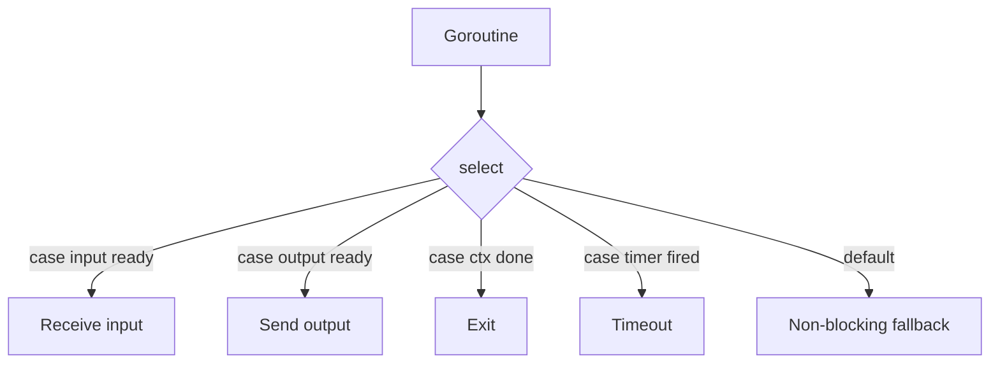
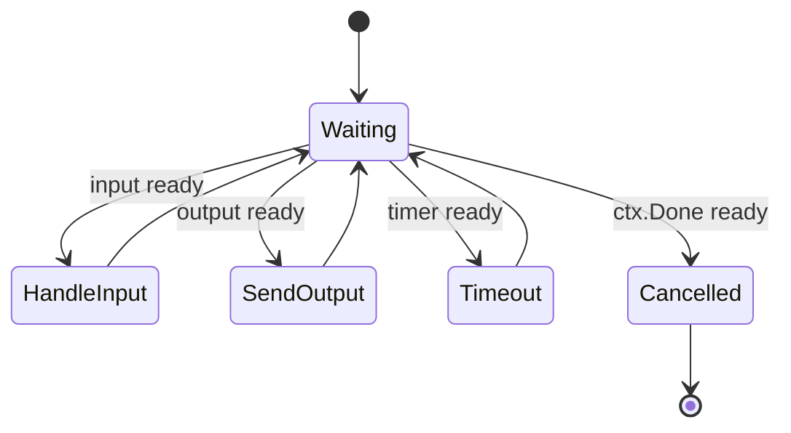

# learn-go-concurrency-parallelism-part-009.md

# Part 009 — Select Semantics: Fairness, Cancellation, Timeouts, Priority, and Starvation

> Target pembaca: Java software engineer yang ingin memahami `select` bukan hanya sebagai “switch untuk channel”, tetapi sebagai primitive desain state machine concurrency Go.
>
> Fokus part ini: semantics, fairness limitation, cancellation, timeout, nil channel, priority emulation, starvation, busy loop, timer correctness, dan production patterns.

---

## 0. Posisi Part Ini dalam Seri

Sebelumnya:

- Part 005 membahas Go Memory Model.
- Part 006 membahas `sync`.
- Part 007 membahas atomic.
- Part 008 membahas channel.

Part ini membahas primitive yang membuat channel benar-benar powerful: **`select`**.

Kalau channel adalah edge komunikasi, maka `select` adalah decision engine untuk memilih edge mana yang bisa dilanjutkan.



`select` sering terlihat sederhana, tetapi banyak bug production berasal dari pemahaman yang lemah tentang:

- case evaluation,
- blocking behavior,
- pseudo-random ready case choice,
- `default` busy-loop,
- timeout allocation,
- nil channel disable,
- cancellation race,
- priority starvation,
- send/receive close behavior,
- lifecycle ownership.

---

## 1. Tujuan Pembelajaran

Setelah part ini, Anda harus mampu:

1. Menjelaskan urutan eksekusi `select` secara tepat.
2. Membedakan:
   - blocking select,
   - non-blocking select,
   - timeout select,
   - cancellation select,
   - priority select,
   - state-machine select.
3. Mendesain send/receive yang cancellation-aware.
4. Menggunakan nil channel untuk enable/disable dynamic case.
5. Menghindari `default` busy-loop.
6. Memahami kenapa `select` bukan fairness guarantee.
7. Mendesain timeout tanpa timer leak dan tanpa allocation berlebihan di hot path.
8. Membangun event loop goroutine yang punya lifecycle jelas.
9. Menyusun review checklist untuk code yang memakai `select`.

---

## 2. Mental Model Utama: `select` Adalah State Machine Step

Java engineer sering membandingkan `select` dengan:

- `switch`,
- `CompletableFuture.anyOf`,
- `Selector` NIO,
- `BlockingQueue.poll(timeout)`,
- `Condition.await`,
- event loop.

Perbandingan tersebut berguna, tapi tidak sempurna.

Di Go:

> `select` memilih satu operasi channel yang dapat berjalan, atau block sampai salah satunya dapat berjalan, atau menjalankan `default` jika ada dan tidak ada case lain yang siap.

`select` bukan loop sendiri. Ia hanya satu decision point.

```go
select {
case v := <-in:
    handle(v)
case out <- value:
    sent()
case <-ctx.Done():
    return ctx.Err()
}
```

Kalau ingin terus memproses event, Anda membuat loop:

```go
for {
    select {
    case v := <-in:
        handle(v)
    case <-ctx.Done():
        return
    }
}
```

Maka pola sebenarnya adalah:



---

## 3. Syntax Dasar

```go
select {
case v := <-ch:
    _ = v

case ch <- value:
    // sent

case <-done:
    return

default:
    // no channel operation ready
}
```

Valid case:

```go
case v := <-ch:
case v, ok := <-ch:
case ch <- v:
case <-ch:
```

Tidak boleh arbitrary boolean condition seperti:

```go
select {
case x > 10: // invalid
}
```

Kalau butuh condition, gunakan nil channel untuk disable case atau pakai `if` sebelum `select`.

---

## 4. Urutan Eksekusi `select` Menurut Spec

Secara konseptual, saat memasuki `select`:

1. Semua channel operand untuk receive dan semua channel/value expression untuk send dievaluasi.
2. Jika ada satu atau lebih operation yang bisa proceed, satu dipilih secara uniform pseudo-random.
3. Jika tidak ada operation yang bisa proceed dan ada `default`, `default` dijalankan.
4. Jika tidak ada operation yang bisa proceed dan tidak ada `default`, goroutine block sampai minimal satu case bisa proceed.
5. Setelah case dipilih, assignment kiri pada receive dievaluasi dan statement body dijalankan.

Konsekuensi besar:

```go
select {
case ch <- expensive():
case <-ctx.Done():
}
```

`expensive()` dievaluasi saat masuk `select`, bahkan jika case send tidak dipilih.

Jadi jika value mahal dihitung, jangan letakkan langsung di send expression jika cancellation/other case bisa menang.

Buruk:

```go
select {
case out <- buildHugeResponse():
case <-ctx.Done():
    return ctx.Err()
}
```

Lebih baik:

```go
response := buildHugeResponse()

select {
case out <- response:
    return nil
case <-ctx.Done():
    return ctx.Err()
}
```

Atau lebih baik lagi, jika build juga harus cancellable:

```go
response, err := buildHugeResponse(ctx)
if err != nil {
    return err
}

select {
case out <- response:
    return nil
case <-ctx.Done():
    return ctx.Err()
}
```

Untuk send ke nil channel, value expression tetap dievaluasi saat select masuk. Jadi nil channel tidak selalu menghindari cost expression.

---

## 5. Blocking Select

Tanpa `default`, `select` block sampai salah satu case bisa berjalan.

```go
select {
case v := <-in:
    handle(v)
case <-ctx.Done():
    return ctx.Err()
}
```

Ini adalah pattern umum untuk:
- wait input,
- wait cancellation,
- wait timeout,
- wait completion.

Blocking select bagus karena:
- tidak spin,
- scheduler bisa park goroutine,
- CPU tidak habis untuk polling,
- lifecycle jelas.

---

## 6. Non-Blocking Select dengan `default`

Jika ada `default`, select tidak block.

```go
select {
case v := <-ch:
    handle(v)
default:
    // no value available
}
```

Use cases:
- try receive,
- try send,
- load shedding,
- coalescing notification,
- best-effort metrics/logging,
- opportunistic work.

### 6.1 Try Send

```go
func trySubmit(ch chan<- Job, job Job) bool {
    select {
    case ch <- job:
        return true
    default:
        return false
    }
}
```

### 6.2 Try Receive

```go
func tryReceive(ch <-chan Event) (Event, bool) {
    select {
    case event := <-ch:
        return event, true
    default:
        return Event{}, false
    }
}
```

But beware closed channel:

```go
func tryReceive(ch <-chan Event) (Event, bool, bool) {
    select {
    case event, ok := <-ch:
        return event, true, ok
    default:
        return Event{}, false, true
    }
}
```

Meaning:
- second return: received something or closed signal.
- third return: channel still open.

### 6.3 Default Busy Loop Anti-Pattern

Buruk:

```go
for {
    select {
    case v := <-ch:
        handle(v)
    default:
    }
}
```

Jika tidak ada value, loop ini berputar terus dan makan CPU.

Gejala production:
- CPU naik,
- pprof CPU menunjukkan loop kecil,
- goroutine tidak block,
- scheduler pressure meningkat,
- latency service lain memburuk.

Solusi:
- hapus `default`,
- gunakan ticker/backoff,
- gunakan blocking receive,
- gunakan condition variable,
- gunakan event-driven design.

Lebih baik:

```go
for {
    select {
    case v := <-ch:
        handle(v)
    case <-ctx.Done():
        return
    }
}
```

Jika memang harus polling:

```go
ticker := time.NewTicker(100 * time.Millisecond)
defer ticker.Stop()

for {
    select {
    case v := <-ch:
        handle(v)
    case <-ticker.C:
        poll()
    case <-ctx.Done():
        return
    }
}
```

---

## 7. Cancellation Select

Pattern paling penting:

```go
select {
case result := <-resultCh:
    return result, nil
case <-ctx.Done():
    return Result{}, ctx.Err()
}
```

`ctx.Done()` adalah receive-only channel yang ditutup saat context dibatalkan atau deadline habis.

### 7.1 Cancellation-Aware Send

```go
func send(ctx context.Context, out chan<- Event, event Event) error {
    select {
    case out <- event:
        return nil
    case <-ctx.Done():
        return ctx.Err()
    }
}
```

### 7.2 Cancellation-Aware Receive

```go
func receive(ctx context.Context, in <-chan Event) (Event, error) {
    select {
    case event, ok := <-in:
        if !ok {
            return Event{}, io.EOF
        }
        return event, nil

    case <-ctx.Done():
        return Event{}, ctx.Err()
    }
}
```

### 7.3 Cancellation Is Not Preemption of Work

Jika Anda melakukan CPU-heavy work tanpa checking context:

```go
for _, item := range huge {
    process(item)
}
```

Context cancellation tidak otomatis menghentikan loop. Anda harus check:

```go
for _, item := range huge {
    select {
    case <-ctx.Done():
        return ctx.Err()
    default:
    }

    process(item)
}
```

Caution: `default` di sini bukan busy-loop karena loop punya work nyata. Tapi check terlalu sering juga overhead; untuk CPU-heavy loop, bisa check per chunk.

```go
for i, item := range huge {
    if i%1024 == 0 {
        select {
        case <-ctx.Done():
            return ctx.Err()
        default:
        }
    }

    process(item)
}
```

---

## 8. Timeout Select

Basic:

```go
select {
case res := <-resultCh:
    return res, nil
case <-time.After(100 * time.Millisecond):
    return Result{}, ErrTimeout
}
```

Ini simple dan benar untuk non-hot path.

### 8.1 `time.After` in Loop

Buruk di hot loop:

```go
for {
    select {
    case v := <-in:
        handle(v)
    case <-time.After(time.Second):
        heartbeat()
    }
}
```

Masalah:
- membuat timer baru setiap iterasi,
- overhead allocation/runtime timer,
- bisa banyak pending timer jika loop cepat.

Lebih baik pakai `time.NewTimer` atau `time.NewTicker`, tergantung semantics.

### 8.2 Periodic Tick

```go
ticker := time.NewTicker(time.Second)
defer ticker.Stop()

for {
    select {
    case v := <-in:
        handle(v)

    case <-ticker.C:
        heartbeat()

    case <-ctx.Done():
        return
    }
}
```

### 8.3 Idle Timeout

Idle timeout berarti timer reset saat ada activity.

```go
timer := time.NewTimer(idleTimeout)
defer timer.Stop()

for {
    select {
    case v := <-in:
        if !timer.Stop() {
            select {
            case <-timer.C:
            default:
            }
        }
        timer.Reset(idleTimeout)

        handle(v)

    case <-timer.C:
        return ErrIdleTimeout

    case <-ctx.Done():
        return ctx.Err()
    }
}
```

Go versi modern memperbaiki beberapa ergonomi timer, tapi mental model tetap penting:
- timer perlu dihentikan jika tidak dipakai,
- reset harus jelas,
- jangan membuat timer terus-menerus di hot path tanpa alasan.

### 8.4 Timeout vs Deadline vs Cancellation

| Concept | Meaning |
|---|---|
| timeout | durasi relatif untuk operasi |
| deadline | waktu absolut terakhir operasi boleh berjalan |
| cancellation | sinyal stop dari parent/caller |
| context timeout | cancellation otomatis setelah durasi |
| timer | primitive waktu low-level |

Biasanya untuk request-scoped operation, gunakan context:

```go
ctx, cancel := context.WithTimeout(parent, 200*time.Millisecond)
defer cancel()

return call(ctx)
```

Di dalam `call`:

```go
select {
case res := <-resultCh:
    return res, nil
case <-ctx.Done():
    return Result{}, ctx.Err()
}
```

---

## 9. Ready Case Selection dan Fairness

Jika lebih dari satu case siap, Go memilih satu case secara pseudo-random uniform.

Contoh:

```go
select {
case a := <-chA:
    handleA(a)
case b := <-chB:
    handleB(b)
}
```

Jika keduanya ready, Anda tidak boleh mengasumsikan urutan.

### 9.1 Bukan Strict Fairness

Pseudo-random selection bukan berarti:
- round-robin,
- no starvation guarantee dalam semua desain,
- priority guarantee,
- latency fairness antar tenant,
- fairness antar dependency.

Jika fairness adalah requirement, Anda harus desain fairness eksplisit.

### 9.2 Contoh Starvation karena Loop Design

```go
for {
    select {
    case high := <-highPriority:
        handle(high)
    case low := <-lowPriority:
        handle(low)
    }
}
```

Ini tidak memberi high priority. Jika high dan low ready, random. Jika high terus ready, low masih mungkin dipilih, tapi latency low tidak punya bound yang jelas.

Untuk priority, perlu pattern lain.

---

## 10. Priority Select Pattern

Go tidak punya built-in priority select. Anda bisa emulate dengan two-stage select.

### 10.1 Strict Priority: Drain High First

```go
for {
    select {
    case item := <-high:
        handleHigh(item)
        continue
    default:
    }

    select {
    case item := <-high:
        handleHigh(item)

    case item := <-low:
        handleLow(item)

    case <-ctx.Done():
        return
    }
}
```

Meaning:
1. Try high non-blocking.
2. If high available, process high.
3. Else block on high/low/cancel.

Problem:
- low can starve if high always available.

### 10.2 Weighted Priority

```go
highBudget := 10

for {
    for i := 0; i < highBudget; i++ {
        select {
        case item := <-high:
            handleHigh(item)
        default:
            goto mixed
        }
    }

mixed:
    select {
    case item := <-high:
        handleHigh(item)
    case item := <-low:
        handleLow(item)
    case <-ctx.Done():
        return
    }
}
```

But this is ad hoc. For real scheduling:
- use explicit queues,
- track age,
- implement weighted fair queue,
- separate worker pools,
- tenant bulkheads.

### 10.3 Priority with Aging

For production priority, avoid naive select. Use a scheduler object:

```go
type Scheduler struct {
    mu   sync.Mutex
    high []Job
    low  []Job
}
```

Then define:
- priority,
- max starvation time,
- per-tenant limits,
- retry policy,
- metrics.

Channel is not a full scheduler.

---

## 11. Nil Channel Pattern

Nil channel blocks forever. In `select`, a nil channel case is disabled.

```go
var out chan<- Event

if readyToSend {
    out = realOut
} else {
    out = nil
}

select {
case out <- event:
    readyToSend = false
case v := <-in:
    event = transform(v)
    readyToSend = true
}
```

Nil channel lets you write state machine without nested `if`.

### 11.1 Example: One-Item Buffer State Machine

```go
func bridge(ctx context.Context, in <-chan Event, out chan<- Event) error {
    var pending Event
    var outCh chan<- Event

    for {
        select {
        case v, ok := <-in:
            if !ok {
                if outCh != nil {
                    select {
                    case out <- pending:
                    case <-ctx.Done():
                        return ctx.Err()
                    }
                }
                return nil
            }

            pending = v
            outCh = out

        case outCh <- pending:
            outCh = nil

        case <-ctx.Done():
            return ctx.Err()
        }
    }
}
```

But this has a bug: if input sends multiple values before pending sent, pending overwritten? Actually because `in` remains active while `outCh` active. Need disable input when pending exists.

Correct:

```go
func bridge(ctx context.Context, in <-chan Event, out chan<- Event) error {
    var pending Event
    var inCh <-chan Event = in
    var outCh chan<- Event

    for {
        select {
        case v, ok := <-inCh:
            if !ok {
                return nil
            }

            pending = v
            inCh = nil
            outCh = out

        case outCh <- pending:
            outCh = nil
            inCh = in

        case <-ctx.Done():
            return ctx.Err()
        }
    }
}
```

This models exactly one pending event.

### 11.2 Nil Channel for Shutdown State

```go
var jobs <-chan Job = realJobs

for {
    select {
    case job, ok := <-jobs:
        if !ok {
            jobs = nil
            continue
        }
        process(job)

    case <-ctx.Done():
        return
    }

    if jobs == nil {
        return
    }
}
```

Nil channel should be used deliberately, with comments if state machine is not obvious.

---

## 12. Select with Closed Channels

Receive from closed channel is always ready.

```go
ch := make(chan int)
close(ch)

select {
case v, ok := <-ch:
    fmt.Println(v, ok) // 0 false
default:
    // will not run
}
```

This can cause loop spin if you do not disable closed channel.

Bug:

```go
for {
    select {
    case v := <-ch:
        handle(v) // after close, receives zero forever
    case <-ctx.Done():
        return
    }
}
```

Fix:

```go
for ch != nil {
    select {
    case v, ok := <-ch:
        if !ok {
            ch = nil
            continue
        }
        handle(v)

    case <-ctx.Done():
        return
    }
}
```

Or use `range` when only one channel:

```go
for v := range ch {
    handle(v)
}
```

For multiple channels:

```go
for chA != nil || chB != nil {
    select {
    case v, ok := <-chA:
        if !ok {
            chA = nil
            continue
        }
        handleA(v)

    case v, ok := <-chB:
        if !ok {
            chB = nil
            continue
        }
        handleB(v)
    }
}
```

---

## 13. Select with Send to Closed Channel

If a send case is selected and channel is closed, send panics.

```go
select {
case ch <- v:
    // if ch closed, panic
case <-ctx.Done():
}
```

A closed channel is not safe to send to. You need ownership protocol; `select` does not protect you.

Wrong idea:

```go
select {
case ch <- v:
    return nil
case <-done:
    return ErrStopped
}
```

If `done` and `ch` close concurrently, and `ch` is closed by another goroutine, send can panic.

Better:
- do not close channels that concurrent submitters send into,
- use separate done channel,
- coordinate shutdown,
- own close only after all senders stop.

This is why public queue APIs often should not expose send channel directly.

---

## 14. Select and Context Done Race

Consider:

```go
select {
case out <- v:
    return nil
case <-ctx.Done():
    return ctx.Err()
}
```

If both send is ready and context done is ready, select may choose send.

Meaning:
- cancellation is not strict priority.
- If you require “after cancellation, never send”, check context first.

Strict-ish cancellation check:

```go
select {
case <-ctx.Done():
    return ctx.Err()
default:
}

select {
case out <- v:
    return nil
case <-ctx.Done():
    return ctx.Err()
}
```

But even this has a race: ctx can be cancelled after first check and send can still win in second select if both ready.

If strict no-send-after-cancel is a hard invariant, you need stronger protocol:
- hold lock and check state,
- use owner goroutine,
- stop intake before cancellation visible,
- design idempotent downstream,
- include cancellation state in message processing.

Most systems accept “best-effort cancellation”:
- cancellation means stop as soon as possible,
- operations concurrently ready may complete.

---

## 15. Select and Error Propagation

Naive:

```go
select {
case err := <-errCh:
    return err
case res := <-resCh:
    return handle(res)
}
```

Problem:
- What if both arrive?
- What if one channel closes?
- Who closes channels?
- What about goroutines still running after return?
- Is context cancelled?
- Are channels buffered?

Better with structured concurrency:
- one result channel carrying value/error,
- context cancellation,
- wait for children,
- close by coordinator.

```go
type Result struct {
    Value Value
    Err   error
}

resultCh := make(chan Result, 1)

go func() {
    value, err := work(ctx)
    resultCh <- Result{Value: value, Err: err}
}()

select {
case result := <-resultCh:
    return result.Value, result.Err
case <-ctx.Done():
    return Value{}, ctx.Err()
}
```

For multiple goroutines, use task group/errgroup pattern rather than ad hoc select on many err channels.

---

## 16. Fan-In with Select

For fixed number of channels:

```go
for chA != nil || chB != nil {
    select {
    case a, ok := <-chA:
        if !ok {
            chA = nil
            continue
        }
        handleA(a)

    case b, ok := <-chB:
        if !ok {
            chB = nil
            continue
        }
        handleB(b)

    case <-ctx.Done():
        return ctx.Err()
    }
}
```

For dynamic number of channels, `select` is static. Options:
- one goroutine per input forwarding to common channel,
- use `reflect.Select` cautiously,
- redesign input aggregation,
- explicit queue/multiplexer.

`reflect.Select` is rarely the best option in high-performance production code because:
- reflection overhead,
- less type safety,
- complexity,
- harder review.

---

## 17. Fan-Out with Select

Selective send to multiple outputs:

```go
select {
case outA <- v:
case outB <- v:
case <-ctx.Done():
    return ctx.Err()
}
```

This sends to one available output, not broadcast.

Broadcast requires loop over outputs, and must handle slow consumers.

Naive broadcast:

```go
for _, out := range outputs {
    out <- v
}
```

Problems:
- one slow consumer blocks all,
- cancellation missing,
- send-on-closed risk,
- ordering and backpressure unclear.

Better choices:
- per-subscriber buffered queue,
- drop policy,
- slow consumer eviction,
- non-blocking send,
- dedicated broadcaster goroutine.

Non-blocking lossy broadcast:

```go
for _, out := range outputs {
    select {
    case out <- v:
    default:
        // drop for slow subscriber
    }
}
```

But document loss semantics.

---

## 18. Event Loop Pattern

A goroutine with a `for-select` loop is an event loop.

```go
type command struct {
    kind commandKind
    data Data
    resp chan response
}

func (s *Service) loop(ctx context.Context) {
    for {
        select {
        case cmd := <-s.commands:
            s.handleCommand(cmd)

        case tick := <-s.ticker.C:
            s.handleTick(tick)

        case <-ctx.Done():
            s.shutdown()
            return
        }
    }
}
```

Event loop good for:
- serialized state mutation,
- actor-like ownership,
- small control plane,
- protocol state machine.

Risk:
- one slow handler blocks all events,
- command queue can grow,
- reply channel can block,
- panic kills owner,
- cancellation not checked inside long handler.

### 18.1 Handler Should Not Block Indefinitely

Bad:

```go
func (s *Service) handleCommand(cmd command) {
    result := callSlowDependency(cmd.data)
    cmd.resp <- result
}
```

Better:
- use context,
- reply channel buffered,
- offload long work to worker pool if appropriate,
- keep event loop for state changes.

```go
func (s *Service) handleCommand(cmd command) {
    select {
    case cmd.resp <- response{ok: true}:
    default:
        // caller gone; avoid blocking event loop
    }
}
```

But silent drop may be wrong. Design response contract.

---

## 19. State Machine with Select

Example: batcher with input, output, timer, cancellation.

Requirements:
- collect up to `max` items,
- flush every `interval`,
- flush on input close,
- stop on context cancel,
- no busy loop,
- no send without cancellation.

```go
func Batch[T any](
    ctx context.Context,
    in <-chan T,
    max int,
    interval time.Duration,
) <-chan []T {
    out := make(chan []T)

    go func() {
        defer close(out)

        timer := time.NewTimer(interval)
        defer timer.Stop()

        var batch []T
        var outCh chan<- []T
        var next []T

        resetTimer := func() {
            if !timer.Stop() {
                select {
                case <-timer.C:
                default:
                }
            }
            timer.Reset(interval)
        }

        for {
            if len(batch) > 0 && len(batch) >= max {
                outCh = out
                next = batch
            } else {
                outCh = nil
                next = nil
            }

            select {
            case <-ctx.Done():
                return

            case item, ok := <-in:
                if !ok {
                    if len(batch) > 0 {
                        select {
                        case out <- batch:
                        case <-ctx.Done():
                        }
                    }
                    return
                }

                if len(batch) == 0 {
                    resetTimer()
                }

                batch = append(batch, item)

            case <-timer.C:
                if len(batch) > 0 {
                    select {
                    case out <- batch:
                        batch = nil
                    case <-ctx.Done():
                        return
                    }
                }
                resetTimer()

            case outCh <- next:
                batch = nil
                resetTimer()
            }
        }
    }()

    return out
}
```

This example shows:
- nil output channel disables send unless batch ready,
- timer drives flush,
- input close flushes,
- context cancels,
- send is guarded.

It is complex. That is the point: select state machines need careful invariant design.

---

## 20. Timer Patterns in Select

### 20.1 One-Shot Timeout

```go
timer := time.NewTimer(timeout)
defer timer.Stop()

select {
case res := <-resultCh:
    return res, nil
case <-timer.C:
    return Result{}, ErrTimeout
case <-ctx.Done():
    return Result{}, ctx.Err()
}
```

### 20.2 Loop with Ticker

```go
ticker := time.NewTicker(interval)
defer ticker.Stop()

for {
    select {
    case <-ticker.C:
        doPeriodic()
    case <-ctx.Done():
        return
    }
}
```

### 20.3 Debounce

```go
var timer *time.Timer
var timerC <-chan time.Time

for {
    select {
    case <-events:
        if timer != nil {
            timer.Stop()
        }
        timer = time.NewTimer(delay)
        timerC = timer.C

    case <-timerC:
        processDebounced()
        timerC = nil
        timer = nil

    case <-ctx.Done():
        if timer != nil {
            timer.Stop()
        }
        return
    }
}
```

### 20.4 Avoid `time.After` in Tight Loops

`time.After` is convenient, but creates a timer. In high-frequency loops, prefer timer reuse.

---

## 21. Backpressure with Select

### 21.1 Fail-Fast Queue Submit

```go
func (q *Queue) Submit(job Job) error {
    select {
    case q.jobs <- job:
        return nil
    default:
        return ErrQueueFull
    }
}
```

### 21.2 Bounded Wait

```go
func (q *Queue) Submit(ctx context.Context, job Job) error {
    timer := time.NewTimer(50 * time.Millisecond)
    defer timer.Stop()

    select {
    case q.jobs <- job:
        return nil

    case <-timer.C:
        return ErrQueueFull

    case <-ctx.Done():
        return ctx.Err()
    }
}
```

### 21.3 Caller-Driven Cancellation

```go
func (q *Queue) Submit(ctx context.Context, job Job) error {
    select {
    case q.jobs <- job:
        return nil
    case <-ctx.Done():
        return ctx.Err()
    }
}
```

This blocks until accepted or caller cancels. Whether that is good depends on service contract.

---

## 22. Select in HTTP Handler

Bad:

```go
func handler(w http.ResponseWriter, r *http.Request) {
    jobs <- Job{ID: id}
    w.WriteHeader(http.StatusAccepted)
}
```

Better:

```go
func handler(w http.ResponseWriter, r *http.Request) {
    ctx := r.Context()

    select {
    case jobs <- Job{ID: id}:
        w.WriteHeader(http.StatusAccepted)

    case <-ctx.Done():
        http.Error(w, "request cancelled", http.StatusRequestTimeout)

    case <-time.After(50 * time.Millisecond):
        http.Error(w, "busy", http.StatusTooManyRequests)
    }
}
```

Even better:
- avoid `time.After` allocation in very hot handlers,
- use dispatcher method,
- expose metrics,
- consistent overload response,
- consider admission control before parsing huge body.

---

## 23. Select in Worker

```go
func worker(ctx context.Context, id int, jobs <-chan Job) {
    for {
        select {
        case <-ctx.Done():
            return

        case job, ok := <-jobs:
            if !ok {
                return
            }

            process(ctx, job)
        }
    }
}
```

Potential problem:
- if `process` ignores ctx and runs forever, worker still stuck.
- if jobs channel closes, worker exits.
- if ctx cancels, worker exits even if jobs remain.

Drain variant:

```go
func workerDrain(ctx context.Context, jobs <-chan Job) {
    for {
        select {
        case job, ok := <-jobs:
            if !ok {
                return
            }
            process(context.Background(), job)

        case <-ctx.Done():
            for job := range jobs {
                process(context.Background(), job)
            }
            return
        }
    }
}
```

But this can hang if jobs is never closed. For graceful shutdown:
- stop intake,
- close jobs,
- then drain,
- bound by shutdown deadline.

---

## 24. Select in Pipeline Stage

```go
func Map[A, B any](
    ctx context.Context,
    in <-chan A,
    fn func(context.Context, A) (B, error),
) (<-chan B, <-chan error) {
    out := make(chan B)
    errCh := make(chan error, 1)

    go func() {
        defer close(out)
        defer close(errCh)

        for {
            select {
            case <-ctx.Done():
                errCh <- ctx.Err()
                return

            case a, ok := <-in:
                if !ok {
                    return
                }

                b, err := fn(ctx, a)
                if err != nil {
                    errCh <- err
                    return
                }

                select {
                case out <- b:
                case <-ctx.Done():
                    errCh <- ctx.Err()
                    return
                }
            }
        }
    }()

    return out, errCh
}
```

Note:
- receive cancellation-aware,
- send cancellation-aware,
- error channel buffered,
- close ownership clear.

But multiple channels (`out`, `errCh`) increase API complexity. Many production designs use single result stream.

---

## 25. Select and Panic Boundary

If case body panics, select does not recover.

```go
select {
case job := <-jobs:
    process(job) // panic exits goroutine unless recovered
}
```

Worker pools often need panic containment:

```go
func safeWorker(ctx context.Context, jobs <-chan Job) {
    defer func() {
        if r := recover(); r != nil {
            logPanic(r)
        }
    }()

    for {
        select {
        case <-ctx.Done():
            return
        case job, ok := <-jobs:
            if !ok {
                return
            }
            process(job)
        }
    }
}
```

But if panic exits worker, should it restart? That is supervisor policy, not select semantics.

---

## 26. Select and Lock Interaction

Be careful using select while holding locks.

Bad:

```go
mu.Lock()
defer mu.Unlock()

select {
case ch <- value:
case <-ctx.Done():
}
```

If send blocks, lock remains held. This can deadlock other goroutines that need lock to receive/cancel/progress.

Better:
- prepare state under lock,
- release lock,
- perform blocking channel operation,
- reacquire if necessary.

```go
mu.Lock()
value := buildValueLocked()
mu.Unlock()

select {
case ch <- value:
case <-ctx.Done():
    return ctx.Err()
}
```

But ensure state remains valid after unlock.

Rule:

> Do not block on channel while holding a lock unless you can prove it cannot deadlock and the wait is bounded.

---

## 27. Select and Atomic/Mutex State

Sometimes you need state check plus select. Beware races.

Example:

```go
if stopped.Load() {
    return ErrStopped
}

select {
case jobs <- job:
    return nil
case <-done:
    return ErrStopped
}
```

Between atomic check and send, stop can happen. If jobs is not closed, okay. If jobs can be closed, panic risk remains.

Design:
- never close input channel while external senders exist,
- use done channel for stop signal,
- use mutex/condition if strict state transition needed,
- use owner goroutine for serialized command processing.

---

## 28. Starvation Patterns

### 28.1 Default Starvation

```go
for {
    select {
    case v := <-in:
        handle(v)
    default:
        doOtherWork()
    }
}
```

If `doOtherWork()` always runs quickly, input still checked each loop. But CPU may spin.

If `doOtherWork()` is long, input latency can be high.

### 28.2 Priority Starvation

Strict priority high channel can starve low.

```go
for {
    select {
    case h := <-high:
        handle(h)
        continue
    default:
    }

    select {
    case h := <-high:
        handle(h)
    case l := <-low:
        handle(l)
    }
}
```

If high constantly ready, low may starve.

### 28.3 Output Starvation

```go
for {
    select {
    case out <- pending:
        pending = next()
    case in := <-input:
        enqueue(in)
    }
}
```

If output always ready and pending always exists, input may get delayed. Usually random selection helps, but no strict service bound.

For bounded fairness, explicit scheduling needed.

---

## 29. Select and Queue Age

Select does not know item age. If fairness/age matters, implement it.

Example:
- high priority queue,
- low priority queue,
- max wait 500ms for low priority.

Channel alone cannot express this. Use explicit queues:

```go
type item struct {
    job       Job
    enqueued  time.Time
    priority  Priority
}
```

Scheduler decides next item:
- priority,
- age,
- tenant,
- retry count,
- deadline.

Then worker receives chosen item through one channel or direct call.

---

## 30. Select and Deadlock

Select without ready cases and without default blocks.

```go
select {}
```

This blocks forever.

Sometimes used intentionally:
- block main goroutine in small demo,
- keep process alive.

In production, `select {}` is almost always wrong unless documented.

Deadlock example:

```go
func main() {
    ch := make(chan int)

    select {
    case ch <- 1:
    }
}
```

No receiver, so main blocks. Runtime may report deadlock if all goroutines asleep.

---

## 31. Select and Testing

Testing select-heavy code is hard because schedules vary.

Bad test:

```go
go worker()
time.Sleep(10 * time.Millisecond)
assert(...)
```

Better:
- use explicit channels to coordinate,
- use fake clock where possible,
- use context with timeout as test guard,
- avoid relying on random select distribution,
- test invariants, not exact interleavings.

Example deterministic test:

```go
func TestWorkerStops(t *testing.T) {
    ctx, cancel := context.WithCancel(context.Background())
    jobs := make(chan Job)
    stopped := make(chan struct{})

    go func() {
        defer close(stopped)
        worker(ctx, jobs)
    }()

    cancel()

    select {
    case <-stopped:
    case <-time.After(time.Second):
        t.Fatal("worker did not stop")
    }
}
```

### 31.1 Testing Non-Blocking Send

```go
func TestTrySubmitFull(t *testing.T) {
    ch := make(chan Job, 1)
    ch <- Job{}

    ok := trySubmit(ch, Job{})
    if ok {
        t.Fatal("expected full queue")
    }
}
```

### 31.2 Testing Cancellation-Aware Send

```go
func TestSendCancelled(t *testing.T) {
    ctx, cancel := context.WithCancel(context.Background())
    cancel()

    ch := make(chan Event)

    err := send(ctx, ch, Event{})
    if !errors.Is(err, context.Canceled) {
        t.Fatalf("expected canceled, got %v", err)
    }
}
```

---

## 32. Observability for Select Problems

`select` itself is not directly “visible” in metrics. You infer behavior from:

- goroutine dumps:
  - `select`,
  - `chan send`,
  - `chan receive`,
- block profile,
- queue depth,
- worker active count,
- timeout count,
- cancellation count,
- dropped/rejected count,
- p99 latency,
- CPU profile for busy loops,
- runtime trace.

### 32.1 Metrics to Add

For a select-driven queue:
- accepted_total,
- rejected_total,
- cancelled_total,
- timeout_total,
- queue_depth,
- queue_capacity,
- submit_wait_duration,
- processing_duration,
- item_age_on_start,
- worker_active,
- worker_exited_total.

### 32.2 Logging

Avoid logging every select timeout in hot path. Aggregate counters. Log state transitions:
- started,
- stopped,
- queue closed,
- worker panic,
- overload mode entered,
- overload mode exited.

---

## 33. Production Design Patterns

### 33.1 Request Reply with Select

```go
type Request struct {
    Payload Payload
    Reply   chan Response
}

func Call(ctx context.Context, requests chan<- Request, payload Payload) (Response, error) {
    reply := make(chan Response, 1)

    req := Request{
        Payload: payload,
        Reply:   reply,
    }

    select {
    case requests <- req:
    case <-ctx.Done():
        return Response{}, ctx.Err()
    }

    select {
    case res := <-reply:
        return res, nil
    case <-ctx.Done():
        return Response{}, ctx.Err()
    }
}
```

Why reply buffered:
- caller may timeout,
- service goroutine should not block forever sending response.

### 33.2 Coalescing Signal

```go
func notify(ch chan struct{}) {
    select {
    case ch <- struct{}{}:
    default:
    }
}
```

Use for:
- reload notification,
- flush signal,
- wake-up signal.

Semantics:
- at least one notification pending,
- duplicate notifications collapsed.

### 33.3 Stop Signal

```go
type Stopper struct {
    once sync.Once
    done chan struct{}
}

func (s *Stopper) Stop() {
    s.once.Do(func() {
        close(s.done)
    })
}

func (s *Stopper) Done() <-chan struct{} {
    return s.done
}
```

Select usage:

```go
select {
case <-s.Done():
    return ErrStopped
case jobs <- job:
    return nil
}
```

Again: do not close `jobs` while submitters may send.

### 33.4 Heartbeat

```go
ticker := time.NewTicker(heartbeatInterval)
defer ticker.Stop()

for {
    select {
    case <-ticker.C:
        sendHeartbeat()

    case msg := <-messages:
        handle(msg)

    case <-ctx.Done():
        return
    }
}
```

If `sendHeartbeat` can block, it needs context/timeout too.

---

## 34. Bad Patterns and Corrections

### 34.1 `time.After` in Hot Loop

Bad:

```go
for {
    select {
    case <-time.After(time.Millisecond):
    default:
    }
}
```

Correction:
- use ticker/timer,
- avoid default spin.

### 34.2 Select with Default and No Sleep

Bad:

```go
for {
    select {
    case msg := <-ch:
        handle(msg)
    default:
        continue
    }
}
```

Correction:
```go
for msg := range ch {
    handle(msg)
}
```

Or:
```go
for {
    select {
    case msg := <-ch:
        handle(msg)
    case <-ctx.Done():
        return
    }
}
```

### 34.3 Ignoring Closed Channel

Bad:

```go
case v := <-ch:
    handle(v)
```

Correction:
```go
case v, ok := <-ch:
    if !ok {
        ch = nil
        continue
    }
    handle(v)
```

### 34.4 Send Without Cancellation in Pipeline

Bad:

```go
out <- transform(v)
```

Correction:
```go
select {
case out <- transform(v):
case <-ctx.Done():
    return
}
```

But remember expression evaluation. If transform expensive:
```go
result := transform(v)
select {
case out <- result:
case <-ctx.Done():
    return
}
```

### 34.5 Select While Holding Lock

Bad:
```go
mu.Lock()
select {
case ch <- v:
case <-ctx.Done():
}
mu.Unlock()
```

Correction:
```go
mu.Lock()
v := snapshot()
mu.Unlock()

select {
case ch <- v:
case <-ctx.Done():
}
```

---

## 35. Design Review Checklist for `select`

For every `select`, ask:

1. Can this select block forever?
2. If yes, what unblocks it?
3. Is context cancellation included where needed?
4. Are send operations cancellation-aware?
5. Are receive operations cancellation-aware?
6. Are closed channels handled with `ok`?
7. Are nil channels used intentionally?
8. Could default create busy loop?
9. Is `time.After` used in a loop?
10. Should a timer/ticker be stopped?
11. Are expensive expressions evaluated before select unnecessarily?
12. If multiple cases ready, is random choice acceptable?
13. Is priority assumed but not implemented?
14. Can low priority starve?
15. Is select inside lock?
16. Can case body block too long?
17. Can case body panic and kill worker?
18. Is send to closed channel possible?
19. Is queue full behavior explicit?
20. Is cancellation strict or best-effort?
21. Is downstream early exit handled?
22. Are metrics emitted for timeout/drop/cancel?
23. Are tests deterministic enough?
24. Is this actually a scheduler problem better solved explicitly?
25. Would mutex/cond/atomic be simpler?

---

## 36. Mini Lab 1: Try Send vs Blocking Send

Implement two submit modes:

```go
type SubmitMode int

const (
    SubmitBlock SubmitMode = iota
    SubmitFailFast
    SubmitBoundedWait
)
```

Implement:

```go
func Submit(ctx context.Context, jobs chan<- Job, job Job, mode SubmitMode) error
```

Requirements:
- block mode waits until accepted or ctx cancelled.
- fail-fast returns `ErrQueueFull`.
- bounded wait waits up to configured duration.
- no goroutine leak.
- no busy-loop.
- tests for full queue.

---

## 37. Mini Lab 2: Merge Two Channels Safely

Implement:

```go
func Merge2[T any](ctx context.Context, a, b <-chan T) <-chan T
```

Requirements:
- output closes when both input channels closed.
- closed input is disabled with nil channel.
- send to output is cancellation-aware.
- context cancellation exits goroutine.
- no zero-value processing after close.

Skeleton:

```go
func Merge2[T any](ctx context.Context, a, b <-chan T) <-chan T {
    out := make(chan T)

    go func() {
        defer close(out)

        for a != nil || b != nil {
            select {
            case v, ok := <-a:
                if !ok {
                    a = nil
                    continue
                }
                select {
                case out <- v:
                case <-ctx.Done():
                    return
                }

            case v, ok := <-b:
                if !ok {
                    b = nil
                    continue
                }
                select {
                case out <- v:
                case <-ctx.Done():
                    return
                }

            case <-ctx.Done():
                return
            }
        }
    }()

    return out
}
```

Review fairness:
- Is random selection okay?
- Should one channel have priority?
- What if output receiver exits early without cancelling ctx?

---

## 38. Mini Lab 3: Priority Worker

Implement worker that:
- processes high priority first,
- but processes at least one low priority job after at most N high priority jobs.

Think:
- Can this be done cleanly with only select?
- Do you need explicit queues?
- How will you test starvation?
- What metrics show fairness?

---

## 39. Mini Lab 4: Debouncer

Implement debouncer:
- receives events,
- waits 200ms after last event,
- calls `flush`,
- exits on context cancel,
- stops timer cleanly.

Questions:
- Is `time.After` okay?
- Do repeated events leak timers?
- Is flush allowed concurrently?
- What if flush takes longer than event interval?

---

## 40. Mini Lab 5: Event Loop with Request/Reply

Implement actor-like service:

```go
type Service struct {
    commands chan command
}
```

Commands:
- `Get`
- `Set`
- `Stop`

Requirements:
- reply channels buffered 1.
- caller can timeout.
- loop exits on context cancel.
- stop is idempotent.
- no send to closed command channel by public API.
- tests cover caller timeout before reply.

---

## 41. Top 1% Heuristics

1. `select` is not magic fairness.
2. `default` is a loaded weapon.
3. Closed receive is always ready; disable closed channels.
4. Send to closed channel is a lifecycle bug, not a select bug.
5. Context cancellation is usually best-effort, not strict transaction rollback.
6. Avoid blocking channel operations while holding locks.
7. Make timer lifecycle explicit in loops.
8. Use nil channel to model state, but comment non-obvious state machines.
9. Priority is a scheduler design, not a select feature.
10. If you expose channels publicly, document close/cancel/drain rules.
11. If queue full behavior is not explicit, overload behavior is accidental.
12. If a select has no metrics around failure paths, production debugging will be painful.
13. If exact interleaving matters, your design is probably too fragile.
14. If code relies on random select for fairness, verify tail latency and starvation.
15. If case body can block, the select only moved the blocking point.

---

## 42. Source Notes

This part relies on the following primary Go references:

1. **Go Language Specification**:
   - `select` statement semantics,
   - evaluation order,
   - pseudo-random selection among ready cases,
   - default behavior,
   - nil channel blocking behavior.

2. **Go Memory Model**:
   - channel send/receive/close as synchronization operations.

3. **Go blog: Pipelines and Cancellation**:
   - downstream early exit can block upstream senders,
   - cancellation is needed for robust pipelines.

4. **Go blog: Context**:
   - `Context.Done()` is a cancellation signal channel,
   - cancellation propagates across goroutines handling request-scoped work.

5. **`time` package documentation**:
   - timers and tickers are channel-based time primitives,
   - long-lived loops should manage timer/ticker lifecycle carefully.

---

## 43. Summary

`select` is where Go channel code becomes a real concurrency protocol.

A weak engineer sees:

```go
select {
case x := <-a:
case y := <-b:
case <-ctx.Done():
}
```

A strong engineer asks:

- What if both are ready?
- What if one closes?
- What if context is cancelled at the same time as send is ready?
- What if this is inside a loop?
- What if default spins?
- Who owns close?
- Is priority required?
- Is fairness required?
- Can this block while holding lock?
- Does timer allocate repeatedly?
- What metric tells us it is stuck?
- What happens during shutdown?

The core mental model:

> `select` is a state transition. Every case is an edge. Every edge needs lifecycle, cancellation, ownership, and failure semantics.

---

## 44. Status Seri

Selesai:
- Part 000 — Orientation
- Part 001 — Foundations
- Part 002 — Goroutine Internals
- Part 003 — Go Scheduler Deep Dive
- Part 004 — GOMAXPROCS, CPU Quotas, Containers
- Part 005 — Go Memory Model
- Part 006 — Synchronization Primitives
- Part 007 — Atomic Operations
- Part 008 — Channels Deep Dive
- Part 009 — Select Semantics

Belum selesai:
- Part 010 sampai Part 034.

Seri belum mencapai bagian terakhir.


<!-- NAVIGATION_FOOTER -->
<div class="page-nav">
<a href="./learn-go-concurrency-parallelism-part-008.md">⬅️ Part 008 — Channels Deep Dive: Semantics, Ownership, Backpressure, and Closure</a>
<a href="./index.md">📚 Kategori</a>
<a href="../../index.md">🏠 Home</a>
<a href="./learn-go-concurrency-parallelism-part-010.md">Part 010 — WaitGroup, ErrGroup, Task Groups, and Structured Concurrency ➡️</a>
</div>
