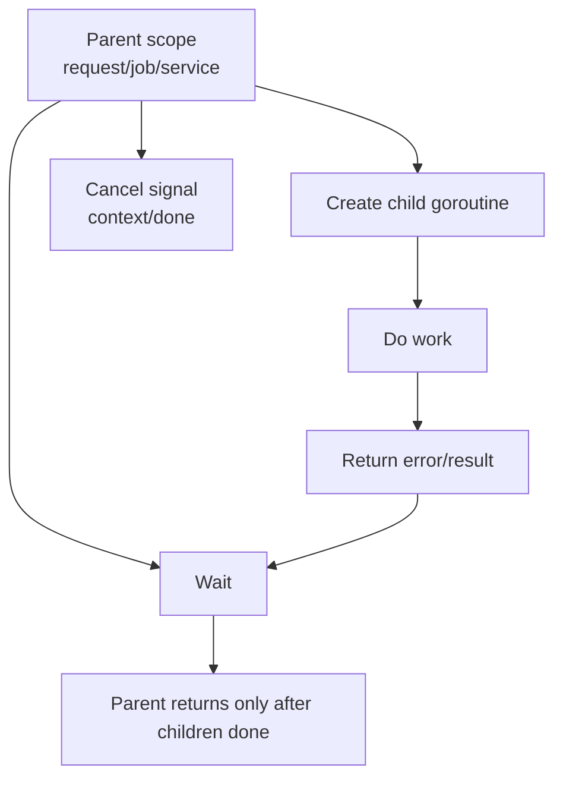
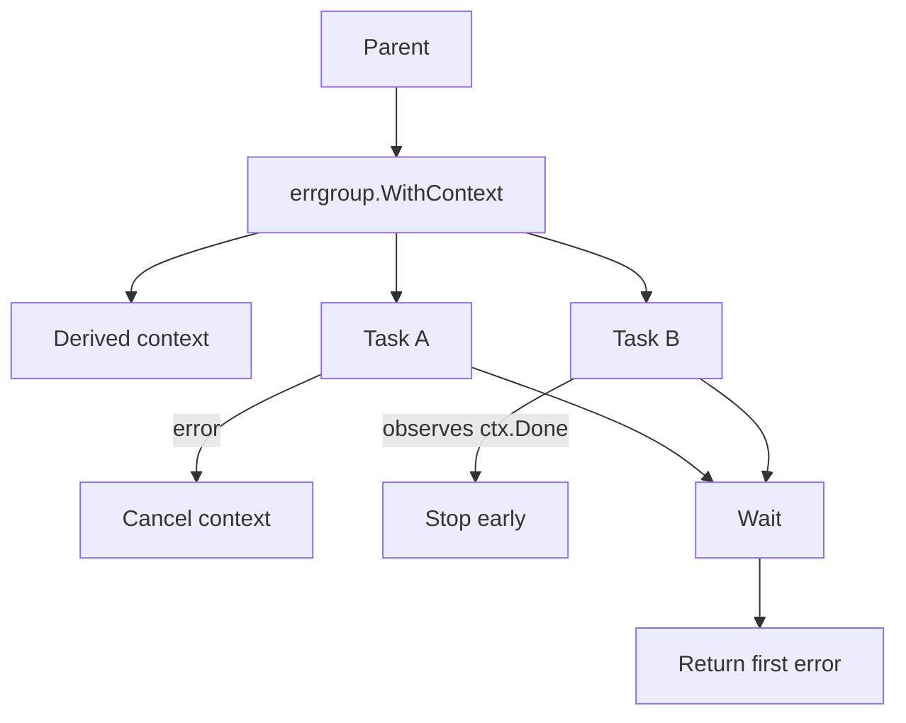

# learn-go-concurrency-parallelism-part-010.md

# Part 010 — WaitGroup, ErrGroup, Task Groups, and Structured Concurrency

> Target pembaca: Java software engineer yang ingin menguasai cara mengelola lifecycle banyak goroutine secara benar: start, wait, cancel, propagate error, recover panic, dan mencegah orphan goroutine.
>
> Fokus part ini: `sync.WaitGroup`, `WaitGroup.Go`, error propagation, `errgroup`, structured concurrency, task group design, bounded fan-out, panic boundary, dan production lifecycle invariants.

---

## 0. Posisi Part Ini dalam Seri

Sebelumnya kita membahas:

- goroutine lifecycle,
- scheduler,
- memory model,
- synchronization primitives,
- atomic,
- channel,
- `select`.

Part ini menjawab pertanyaan praktis:

> Setelah kita bisa membuat goroutine, bagaimana memastikan semua goroutine punya owner, bisa berhenti, error-nya tidak hilang, dan tidak leak?

Go membuat goroutine sangat murah untuk dibuat. Tetapi production system gagal bukan karena goroutine mahal. Production system gagal karena goroutine:

- dibuat tanpa owner,
- tidak ditunggu,
- tidak bisa dibatalkan,
- error-nya dibuang,
- panic-nya membunuh worker diam-diam,
- block pada send/receive,
- hidup lebih lama dari request,
- menahan memory lewat stack/reference,
- terus menjalankan work walau hasilnya sudah tidak dibutuhkan.

Part ini adalah jembatan dari primitive-level concurrency ke **structured concurrency**.

---

## 1. Tujuan Pembelajaran

Setelah part ini, Anda harus mampu:

1. Menggunakan `sync.WaitGroup` tanpa race, negative counter, atau Add/Wait ordering bug.
2. Memahami `WaitGroup.Go` di Go modern dan batasannya.
3. Menjelaskan kenapa `WaitGroup` tidak cukup untuk error propagation.
4. Mendesain goroutine group dengan:
   - cancellation,
   - wait,
   - error collection,
   - panic containment,
   - concurrency limit.
5. Memakai `errgroup` secara tepat.
6. Mendesain task group internal jika perlu tanpa membuat framework overkill.
7. Menerapkan invariant structured concurrency:
   - parent owns child goroutines,
   - child lifetime bounded by parent scope,
   - function tidak return sebelum child selesai atau diambil alih owner lain secara eksplisit.
8. Menghindari anti-pattern seperti fire-and-forget tanpa supervisor.
9. Membuat checklist review untuk goroutine lifecycle.

---

## 2. Core Mental Model: Goroutine Harus Punya Owner

Goroutine adalah unit eksekusi. Tetapi dari perspektif architecture, goroutine adalah juga **resource with lifecycle**.

Setiap goroutine harus punya jawaban untuk pertanyaan ini:

1. Siapa yang membuat?
2. Siapa yang membatalkan?
3. Siapa yang menunggu selesai?
4. Ke mana error dikirim?
5. Apa yang terjadi jika panic?
6. Apa stop condition-nya?
7. Apa yang terjadi jika caller return?
8. Apa yang terjadi saat shutdown?
9. Apakah goroutine boleh hidup lebih lama dari request?
10. Apa observability-nya?

Jika tidak ada jawaban, goroutine itu orphan.



Structured concurrency adalah disiplin yang membuat diagram di atas menjadi invariant default.

---

## 3. Java Translation: Executor/Future vs Go Goroutine Group

Di Java, Anda mungkin terbiasa:

```java
ExecutorService executor = Executors.newFixedThreadPool(10);
Future<Result> f = executor.submit(() -> work());
Result r = f.get();
```

Atau:

```java
CompletableFuture<Result> f =
    CompletableFuture.supplyAsync(() -> work(), executor);
```

Atau Java virtual thread structured task scope:

```java
try (var scope = new StructuredTaskScope.ShutdownOnFailure()) {
    var a = scope.fork(() -> taskA());
    var b = scope.fork(() -> taskB());
    scope.join().throwIfFailed();
}
```

Go primitive-level equivalent sering terlihat seperti:

```go
go work()
```

Tetapi itu terlalu rendah level.

Production-level equivalent harus lebih dekat ke:

```go
g, ctx := errgroup.WithContext(ctx)

g.Go(func() error {
    return taskA(ctx)
})

g.Go(func() error {
    return taskB(ctx)
})

if err := g.Wait(); err != nil {
    return err
}
```

Atau untuk no-error wait:

```go
var wg sync.WaitGroup

wg.Go(func() {
    taskA()
})

wg.Go(func() {
    taskB()
})

wg.Wait()
```

Perbedaan penting:

| Concern | Java common tool | Go common tool |
|---|---|---|
| start task | Executor submit | `go`, `WaitGroup.Go`, `errgroup.Group.Go` |
| wait all | `Future.get`, `invokeAll`, structured scope join | `WaitGroup.Wait`, `errgroup.Wait` |
| error propagation | `ExecutionException`, future result | `errgroup`, error channel, custom group |
| cancellation | interrupt/future cancel/token | `context.Context` |
| concurrency limit | executor pool size/semaphore | worker pool, semaphore, `errgroup.SetLimit` |
| panic/exception | exception captured by Future | panic kills goroutine unless recovered |
| lifecycle | executor/service scope | explicit context + wait |

---

## 4. `sync.WaitGroup`: What It Is

`sync.WaitGroup` waits for a collection of goroutines/tasks to finish.

Conceptual model:

- counter starts at 0,
- `Add(n)` increases counter,
- `Done()` decreases counter by 1,
- `Wait()` blocks until counter reaches 0.

Classic usage:

```go
var wg sync.WaitGroup

wg.Add(2)

go func() {
    defer wg.Done()
    taskA()
}()

go func() {
    defer wg.Done()
    taskB()
}()

wg.Wait()
```

Important:

> `WaitGroup` is only a counting/waiting primitive. It does not propagate errors, cancel work, limit concurrency, recover panic, or own resources automatically.

---

## 5. WaitGroup Memory Ordering

`WaitGroup` is not just a sleep mechanism. It is a synchronization primitive.

If goroutine writes data before calling `Done`, and another goroutine returns from `Wait`, the waiting goroutine can observe those writes under the synchronization guarantee of the primitive.

Example:

```go
var wg sync.WaitGroup
results := make([]int, 2)

wg.Add(2)

go func() {
    defer wg.Done()
    results[0] = 10
}()

go func() {
    defer wg.Done()
    results[1] = 20
}()

wg.Wait()

fmt.Println(results[0], results[1])
```

This is safe because each goroutine writes a distinct element and `Wait` observes completion.

But this is not safe:

```go
var wg sync.WaitGroup
var total int

wg.Add(2)

go func() {
    defer wg.Done()
    total++
}()

go func() {
    defer wg.Done()
    total++
}()

wg.Wait()
fmt.Println(total)
```

`Wait` only waits for completion. It does not make concurrent increments safe. The increments race with each other.

Correct:

```go
var wg sync.WaitGroup
var mu sync.Mutex
var total int

wg.Add(2)

go func() {
    defer wg.Done()
    mu.Lock()
    total++
    mu.Unlock()
}()

go func() {
    defer wg.Done()
    mu.Lock()
    total++
    mu.Unlock()
}()

wg.Wait()
fmt.Println(total)
```

Or:

```go
var total atomic.Int64
```

---

## 6. WaitGroup Correctness Rules

### Rule 1: Add Before Starting Goroutine

Classic safe pattern:

```go
wg.Add(1)
go func() {
    defer wg.Done()
    work()
}()
```

Dangerous:

```go
go func() {
    wg.Add(1)
    defer wg.Done()
    work()
}()

wg.Wait()
```

`Wait` may see counter 0 before goroutine calls `Add`.

### Rule 2: Every Add Must Have Matching Done

```go
wg.Add(1)
go func() {
    defer wg.Done()
    work()
}()
```

Use `defer wg.Done()` at top of goroutine body.

### Rule 3: Counter Must Not Go Negative

This panics:

```go
var wg sync.WaitGroup
wg.Done() // negative counter panic
```

Also panics if `Done` called too many times.

### Rule 4: Do Not Copy WaitGroup After Use

Wrong:

```go
type Runner struct {
    wg sync.WaitGroup
}

func (r Runner) Start() { // value receiver copies wg
    r.wg.Add(1)
}
```

Use pointer receiver:

```go
func (r *Runner) Start() {
    r.wg.Add(1)
}
```

### Rule 5: Reuse Only After Wait Returns

You can reuse a `WaitGroup` for independent batches only after previous `Wait` returns.

Bad:

```go
wg.Add(1)
go task(&wg)

go func() {
    wg.Wait()
}()

wg.Add(1) // can race with Wait misuse depending timing
```

Keep lifecycle simple: one group per scope.

---

## 7. WaitGroup.Go

Modern Go includes `WaitGroup.Go(f)`.

Conceptually:

```go
var wg sync.WaitGroup

wg.Go(func() {
    taskA()
})

wg.Go(func() {
    taskB()
})

wg.Wait()
```

This eliminates common Add-before-go mistake by combining counter increment and goroutine start in one method.

Equivalent mental model:

```go
wg.Add(1)
go func() {
    defer wg.Done()
    f()
}()
```

Important documented constraint:

> The function passed to `WaitGroup.Go` must not panic.

That means if `f` panics, you should not rely on `WaitGroup.Go` to recover it. If panic containment matters, wrap it.

```go
wg.Go(func() {
    defer func() {
        if r := recover(); r != nil {
            log.Printf("worker panic: %v", r)
        }
    }()

    task()
})
```

But think carefully: swallowing panic may hide correctness bugs. For workers, you may want:
- recover,
- record metric,
- send error,
- restart under supervisor,
- or crash process intentionally depending severity.

### 7.1 When to Prefer WaitGroup.Go

Prefer:

```go
wg.Go(func() {
    work()
})
```

When:
- no error propagation needed,
- no panic expected,
- simple concurrent tasks,
- parent only needs wait.

Use `errgroup` or custom task group when:
- tasks return error,
- first error should cancel siblings,
- concurrency should be limited,
- panic must be captured as error,
- lifecycle must expose cause.

---

## 8. WaitGroup Does Not Propagate Error

Naive:

```go
var wg sync.WaitGroup

wg.Add(2)

go func() {
    defer wg.Done()
    _ = taskA()
}()

go func() {
    defer wg.Done()
    _ = taskB()
}()

wg.Wait()
return nil
```

Errors are lost.

You might add shared error:

```go
var wg sync.WaitGroup
var err error

wg.Add(2)

go func() {
    defer wg.Done()
    err = taskA()
}()

go func() {
    defer wg.Done()
    err = taskB()
}()

wg.Wait()
return err
```

This has data race and last-writer-wins semantics.

Fix with mutex:

```go
var wg sync.WaitGroup
var mu sync.Mutex
var firstErr error

setErr := func(err error) {
    if err == nil {
        return
    }

    mu.Lock()
    defer mu.Unlock()

    if firstErr == nil {
        firstErr = err
    }
}

wg.Add(2)

go func() {
    defer wg.Done()
    setErr(taskA())
}()

go func() {
    defer wg.Done()
    setErr(taskB())
}()

wg.Wait()
return firstErr
```

This waits all tasks but does not cancel siblings on first error.

If you want cancellation on first error, use context.

---

## 9. Manual Error Group with Context

A basic custom pattern:

```go
func runAll(ctx context.Context) error {
    ctx, cancel := context.WithCancel(ctx)
    defer cancel()

    var wg sync.WaitGroup
    var mu sync.Mutex
    var firstErr error

    setErr := func(err error) {
        if err == nil {
            return
        }

        mu.Lock()
        if firstErr == nil {
            firstErr = err
            cancel()
        }
        mu.Unlock()
    }

    wg.Add(2)

    go func() {
        defer wg.Done()
        setErr(taskA(ctx))
    }()

    go func() {
        defer wg.Done()
        setErr(taskB(ctx))
    }()

    wg.Wait()

    mu.Lock()
    defer mu.Unlock()
    return firstErr
}
```

Properties:
- parent waits all tasks,
- first error captured,
- first error cancels context,
- siblings must observe ctx to stop early,
- no error race.

But this pattern is common enough that `errgroup` exists.

---

## 10. `errgroup`: WaitGroup + Error + Context Cancellation

`golang.org/x/sync/errgroup` provides:
- goroutine group,
- first non-nil error capture,
- context cancellation with `WithContext`,
- wait for all goroutines,
- optional concurrency limit.

Basic:

```go
g, ctx := errgroup.WithContext(ctx)

g.Go(func() error {
    return taskA(ctx)
})

g.Go(func() error {
    return taskB(ctx)
})

if err := g.Wait(); err != nil {
    return err
}

return nil
```

Mental model:



### 10.1 What errgroup Guarantees

- `Wait` returns first non-nil error from any task.
- With `WithContext`, the derived context is cancelled when:
  - a task returns non-nil error, or
  - `Wait` returns.
- `Wait` waits for all started goroutines to return.

### 10.2 What errgroup Does Not Magically Do

It does not:
- kill goroutines forcefully,
- make blocking operations cancellable automatically,
- recover panics as errors,
- protect shared mutable state,
- guarantee all errors returned,
- solve priority/fairness,
- make unbounded fan-out safe unless you set limit.

Every task must cooperate:

```go
func task(ctx context.Context) error {
    for {
        select {
        case <-ctx.Done():
            return ctx.Err()
        case item := <-work:
            if err := process(ctx, item); err != nil {
                return err
            }
        }
    }
}
```

---

## 11. `errgroup.SetLimit`: Bounded Fan-Out

Unbounded goroutine fan-out:

```go
g, ctx := errgroup.WithContext(ctx)

for _, item := range items {
    item := item
    g.Go(func() error {
        return process(ctx, item)
    })
}

return g.Wait()
```

If `items` has 1 million entries, this creates up to 1 million goroutines.

Bound it:

```go
g, ctx := errgroup.WithContext(ctx)
g.SetLimit(32)

for _, item := range items {
    item := item

    g.Go(func() error {
        return process(ctx, item)
    })
}

return g.Wait()
```

This limits active goroutines in the group.

### 11.1 SetLimit Is Not a Queue Policy

`SetLimit` bounds concurrent active goroutines submitted via group. It is not:
- priority queue,
- rate limiter,
- durable queue,
- backpressure protocol to HTTP caller,
- per-tenant isolation.

It is good for:
- bounded parallel processing,
- file processing,
- API fan-out,
- CPU-bound chunking,
- migration batches.

But for long-lived service workers, worker pool may be clearer.

---

## 12. `errgroup.TryGo`

Some versions include `TryGo`, which starts a goroutine only if below limit and returns false otherwise.

Pattern:

```go
if !g.TryGo(func() error {
    return process(ctx, item)
}) {
    return ErrBusy
}
```

Use cases:
- fail-fast admission,
- best-effort background task,
- overload protection.

But be careful:
- if you return immediately, what happens to already started tasks?
- do you cancel context?
- do you wait?
- do you expose partial processing?

Often you need:

```go
if !g.TryGo(func() error {
    return process(ctx, item)
}) {
    cancel()
    _ = g.Wait()
    return ErrBusy
}
```

But with `errgroup.WithContext`, cancellation is owned through returned context, not external cancel unless you wrap parent context yourself.

---

## 13. Structured Concurrency: The Invariant

Structured concurrency can be summarized:

> A function that starts concurrent work must wait for that work to finish before returning, unless it explicitly transfers ownership to a longer-lived supervisor.

Bad:

```go
func Handle(ctx context.Context, req Request) error {
    go sendAudit(req)
    return process(req)
}
```

Problem:
- audit goroutine outlives request,
- no cancellation,
- no error propagation,
- may use request data after invalid,
- may leak on blocked send,
- no observability.

Better if audit is part of request outcome:

```go
func Handle(ctx context.Context, req Request) error {
    g, ctx := errgroup.WithContext(ctx)

    g.Go(func() error {
        return sendAudit(ctx, req)
    })

    g.Go(func() error {
        return process(ctx, req)
    })

    return g.Wait()
}
```

Better if audit is background service-owned work:

```go
func Handle(ctx context.Context, req Request, audit *AuditDispatcher) error {
    if err := process(ctx, req); err != nil {
        return err
    }

    return audit.Submit(ctx, AuditEvent{
        RequestID: req.ID,
        Action:    "processed",
    })
}
```

Ownership transferred to `AuditDispatcher`, which has its own lifecycle.

---

## 14. Fire-and-Forget Is Usually a Smell

Fire-and-forget:

```go
go func() {
    _ = doWork()
}()
```

Sometimes acceptable:
- process-level telemetry best effort,
- supervised background loop at startup,
- async cache warmup with bounded lifecycle,
- detached cleanup with explicit owner.

But most of the time it hides:
- lost error,
- unbounded lifetime,
- panic risk,
- memory retention,
- shutdown leak,
- dependency overload.

If you use fire-and-forget, document:
- owner,
- cancellation,
- panic behavior,
- capacity,
- error handling,
- shutdown behavior.

Better pattern:

```go
type Background struct {
    ctx    context.Context
    cancel context.CancelFunc
    wg     sync.WaitGroup
    errs   chan error
}
```

Then background work has a supervisor.

---

## 15. Task Scope Taxonomy

Not all goroutine groups are the same.

| Scope | Lifetime | Example | Tool |
|---|---|---|---|
| request scope | one HTTP/gRPC request | fan-out downstream calls | `errgroup.WithContext` |
| job scope | one batch/job | process files/items | `errgroup.SetLimit` |
| service scope | process lifetime | workers, consumers | supervisor + context + wg |
| subsystem scope | component lifetime | cache refresher | component Start/Stop |
| detached scope | transferred owner | audit dispatcher queue | explicit dispatcher |

### 15.1 Request Scope

```go
func handler(w http.ResponseWriter, r *http.Request) {
    if err := serve(r.Context()); err != nil {
        // map error
    }
}
```

All child goroutines should stop when request context cancels.

### 15.2 Service Scope

```go
func (s *Server) Start(ctx context.Context) {
    s.wg.Go(func() {
        s.consumerLoop(ctx)
    })
}
```

Stop:

```go
func (s *Server) Stop() {
    s.cancel()
    s.wg.Wait()
}
```

### 15.3 Ownership Transfer

A function can return before work completes only if ownership is transferred to something explicit:

```go
audit.Submit(ctx, event)
```

Now `audit` owns queue, worker, retry, shutdown.

---

## 16. Designing a Small TaskGroup

Sometimes you do not want external dependency or need custom behavior.

Design goals:
- start tasks,
- capture first error,
- cancel siblings,
- wait all,
- recover panic as error optionally,
- limit concurrency optionally.

Simple version:

```go
type TaskGroup struct {
    ctx    context.Context
    cancel context.CancelFunc

    wg sync.WaitGroup

    mu  sync.Mutex
    err error
}

func NewTaskGroup(parent context.Context) *TaskGroup {
    ctx, cancel := context.WithCancel(parent)

    return &TaskGroup{
        ctx:    ctx,
        cancel: cancel,
    }
}

func (g *TaskGroup) Go(fn func(context.Context) error) {
    g.wg.Add(1)

    go func() {
        defer g.wg.Done()

        if err := fn(g.ctx); err != nil {
            g.fail(err)
        }
    }()
}

func (g *TaskGroup) fail(err error) {
    g.mu.Lock()
    defer g.mu.Unlock()

    if g.err == nil {
        g.err = err
        g.cancel()
    }
}

func (g *TaskGroup) Wait() error {
    g.wg.Wait()
    g.cancel()

    g.mu.Lock()
    defer g.mu.Unlock()

    return g.err
}
```

Usage:

```go
g := NewTaskGroup(ctx)

g.Go(func(ctx context.Context) error {
    return taskA(ctx)
})

g.Go(func(ctx context.Context) error {
    return taskB(ctx)
})

return g.Wait()
```

### 16.1 Add Panic Capture

```go
func (g *TaskGroup) Go(fn func(context.Context) error) {
    g.wg.Add(1)

    go func() {
        defer g.wg.Done()

        defer func() {
            if r := recover(); r != nil {
                g.fail(fmt.Errorf("panic: %v", r))
            }
        }()

        if err := fn(g.ctx); err != nil {
            g.fail(err)
        }
    }()
}
```

Caution:
- converting panic to error may hide programming bug,
- include stack trace if needed,
- define policy: crash vs recover.

### 16.2 Add Concurrency Limit

```go
type TaskGroup struct {
    ctx    context.Context
    cancel context.CancelFunc

    wg  sync.WaitGroup
    sem chan struct{}

    mu  sync.Mutex
    err error
}

func NewLimitedTaskGroup(parent context.Context, limit int) *TaskGroup {
    ctx, cancel := context.WithCancel(parent)

    return &TaskGroup{
        ctx:    ctx,
        cancel: cancel,
        sem:    make(chan struct{}, limit),
    }
}

func (g *TaskGroup) Go(fn func(context.Context) error) error {
    select {
    case g.sem <- struct{}{}:
    case <-g.ctx.Done():
        return g.ctx.Err()
    }

    g.wg.Add(1)

    go func() {
        defer g.wg.Done()
        defer func() { <-g.sem }()

        if err := fn(g.ctx); err != nil {
            g.fail(err)
        }
    }()

    return nil
}
```

Potential issue:
- If caller stops submitting on error, must still `Wait`.
- If `Go` blocks acquiring sem, this is backpressure.
- If `Go` returns error, decide whether parent should stop.

In many cases, `errgroup.SetLimit` is simpler.

---

## 17. Bounded Fan-Out Pattern

Problem:
- Need process many items with limited concurrency.
- Stop on first error.
- No goroutine explosion.

Pattern using errgroup:

```go
func ProcessAll(ctx context.Context, items []Item, limit int) error {
    g, ctx := errgroup.WithContext(ctx)
    g.SetLimit(limit)

    for _, item := range items {
        item := item

        g.Go(func() error {
            return ProcessOne(ctx, item)
        })
    }

    return g.Wait()
}
```

Subtle issue:
- Loop continues submitting tasks even after ctx cancelled, although `g.Go` with limit may block depending implementation.
- If `items` huge and limit reached, submission itself can block until task exits.

If item production is streaming, use worker pool instead:

```go
func ProcessStream(ctx context.Context, items <-chan Item, workers int) error {
    g, ctx := errgroup.WithContext(ctx)

    for i := 0; i < workers; i++ {
        g.Go(func() error {
            for {
                select {
                case <-ctx.Done():
                    return ctx.Err()

                case item, ok := <-items:
                    if !ok {
                        return nil
                    }

                    if err := ProcessOne(ctx, item); err != nil {
                        return err
                    }
                }
            }
        })
    }

    return g.Wait()
}
```

---

## 18. Fan-Out/Fan-In with Results

Need process items concurrently and collect results.

### 18.1 Result Slice by Index

Safe if each goroutine writes distinct index.

```go
func FetchAll(ctx context.Context, ids []string) ([]Result, error) {
    g, ctx := errgroup.WithContext(ctx)
    g.SetLimit(16)

    results := make([]Result, len(ids))

    for i, id := range ids {
        i, id := i, id

        g.Go(func() error {
            result, err := Fetch(ctx, id)
            if err != nil {
                return err
            }

            results[i] = result
            return nil
        })
    }

    if err := g.Wait(); err != nil {
        return nil, err
    }

    return results, nil
}
```

This is safe because each goroutine writes a unique index and parent reads after `Wait`.

### 18.2 Results Channel

```go
type itemResult struct {
    Index  int
    Result Result
}

func FetchAll(ctx context.Context, ids []string) ([]Result, error) {
    g, ctx := errgroup.WithContext(ctx)
    g.SetLimit(16)

    results := make([]Result, len(ids))
    resultCh := make(chan itemResult)

    g.Go(func() error {
        defer close(resultCh)

        workers, workerCtx := errgroup.WithContext(ctx)
        workers.SetLimit(16)

        for i, id := range ids {
            i, id := i, id
            workers.Go(func() error {
                result, err := Fetch(workerCtx, id)
                if err != nil {
                    return err
                }

                select {
                case resultCh <- itemResult{Index: i, Result: result}:
                    return nil
                case <-workerCtx.Done():
                    return workerCtx.Err()
                }
            })
        }

        return workers.Wait()
    })

    collectErr := make(chan error, 1)

    go func() {
        for r := range resultCh {
            results[r.Index] = r.Result
        }
        collectErr <- nil
    }()

    if err := g.Wait(); err != nil {
        return nil, err
    }

    if err := <-collectErr; err != nil {
        return nil, err
    }

    return results, nil
}
```

This is more complex. Prefer indexed slice when possible.

Lesson:
- Channel fan-in is not always simpler.
- If result destination is naturally indexed, use it.

---

## 19. Error Semantics: First Error vs All Errors

`errgroup` returns first error. Is that enough?

Depends.

### 19.1 First Error Is Good When

- first failure invalidates whole operation,
- siblings should cancel,
- caller only needs failure cause,
- downstream retry happens at operation level.

Example:
- fetch required data from 3 services,
- one fails,
- whole request fails.

### 19.2 Need All Errors When

- validation tasks,
- batch processing report,
- migration,
- lint/checker,
- partial success,
- audit/reporting.

Pattern:

```go
type MultiError struct {
    Errors []error
}

func ValidateAll(ctx context.Context, items []Item) error {
    var wg sync.WaitGroup
    errCh := make(chan error, len(items))

    for _, item := range items {
        item := item

        wg.Go(func() {
            if err := Validate(ctx, item); err != nil {
                errCh <- err
            }
        })
    }

    wg.Wait()
    close(errCh)

    var errs []error
    for err := range errCh {
        errs = append(errs, err)
    }

    if len(errs) > 0 {
        return MultiError{Errors: errs}
    }

    return nil
}
```

But if `len(items)` huge, buffered `errCh` huge. Use mutex append:

```go
var wg sync.WaitGroup
var mu sync.Mutex
var errs []error

for _, item := range items {
    item := item

    wg.Go(func() {
        if err := Validate(ctx, item); err != nil {
            mu.Lock()
            errs = append(errs, err)
            mu.Unlock()
        }
    })
}

wg.Wait()
```

Bound concurrency if needed.

---

## 20. Panic Policy

In Java, exceptions in `Future` are captured and rethrown on `get`.

In Go:
- panic in goroutine does not become return error,
- unrecovered panic in any goroutine crashes the program,
- recover only works in the same goroutine stack.

Example:

```go
go func() {
    panic("boom")
}()
```

If unrecovered, program panics.

For worker pool, you may want containment:

```go
func safeGo(wg *sync.WaitGroup, report func(error), fn func() error) {
    wg.Add(1)

    go func() {
        defer wg.Done()

        defer func() {
            if r := recover(); r != nil {
                report(fmt.Errorf("panic: %v", r))
            }
        }()

        if err := fn(); err != nil {
            report(err)
        }
    }()
}
```

But decide per subsystem:

| Context | Panic policy |
|---|---|
| request handler child | recover, convert to error, cancel siblings |
| background worker | recover, log, metric, maybe restart |
| invariant corruption | crash process may be safer |
| library code | usually do not recover silently |
| task group | optional recover as error |

Top-level HTTP server already recovers panics per connection in some contexts, but do not rely on it for your own goroutine groups.

---

## 21. Lifecycle of Service-Level Goroutines

Request-scope groups are easy: function starts tasks and waits.

Service-scope goroutines live longer.

Example component:

```go
type ConsumerService struct {
    ctx    context.Context
    cancel context.CancelFunc
    wg     sync.WaitGroup

    jobs chan Job
}

func NewConsumerService(parent context.Context) *ConsumerService {
    ctx, cancel := context.WithCancel(parent)

    return &ConsumerService{
        ctx:    ctx,
        cancel: cancel,
        jobs:   make(chan Job, 100),
    }
}

func (s *ConsumerService) Start(workers int) {
    for i := 0; i < workers; i++ {
        s.wg.Go(func() {
            s.worker()
        })
    }
}

func (s *ConsumerService) Stop() {
    s.cancel()
    s.wg.Wait()
}

func (s *ConsumerService) worker() {
    for {
        select {
        case <-s.ctx.Done():
            return

        case job := <-s.jobs:
            process(s.ctx, job)
        }
    }
}
```

Potential bug:
- if `jobs` closes, receive returns zero value forever unless `ok` checked.
- if `process` ignores ctx, stop may block.
- if `Submit` sends after stop, behavior?
- if `jobs` buffer contains work, stop cancels without drain.

Improved:

```go
func (s *ConsumerService) worker() {
    for {
        select {
        case <-s.ctx.Done():
            return

        case job, ok := <-s.jobs:
            if !ok {
                return
            }

            process(s.ctx, job)
        }
    }
}
```

But close ownership must be clear.

---

## 22. Stop: Cancel vs Drain

Service shutdown has two different semantics.

### 22.1 Cancel Shutdown

- stop accepting work,
- cancel in-flight work,
- exit quickly.

```go
func (s *Service) Stop() {
    s.cancel()
    s.wg.Wait()
}
```

Good for:
- cache refresh,
- telemetry,
- polling,
- best-effort work.

### 22.2 Drain Shutdown

- stop accepting new work,
- process queued/in-flight work,
- then exit,
- bounded by deadline.

More complex:

```go
type Service struct {
    jobs chan Job

    stopOnce sync.Once
    stopCh   chan struct{}

    wg sync.WaitGroup
}
```

Basic drain pattern:

```go
func (s *Service) StopDrain(ctx context.Context) error {
    s.stopOnce.Do(func() {
        close(s.stopCh) // stop intake
    })

    done := make(chan struct{})
    go func() {
        s.wg.Wait()
        close(done)
    }()

    select {
    case <-done:
        return nil
    case <-ctx.Done():
        return ctx.Err()
    }
}
```

But to drain jobs safely, you must coordinate:
1. reject new Submit,
2. wait active Submit calls finish,
3. close jobs,
4. workers range jobs until drained,
5. wait workers,
6. enforce deadline.

This is why serious worker pool implementation deserves its own design.

---

## 23. Submit/Stop Race

Naive queue:

```go
type Queue struct {
    jobs chan Job
}

func (q *Queue) Submit(job Job) {
    q.jobs <- job
}

func (q *Queue) Stop() {
    close(q.jobs)
}
```

Race:
- `Submit` can send while `Stop` closes.
- panic.

Better: do not expose raw closeable send channel to external submitters.

```go
type Queue struct {
    jobs chan Job
    done chan struct{}
    once sync.Once
}

func (q *Queue) Submit(ctx context.Context, job Job) error {
    select {
    case q.jobs <- job:
        return nil
    case <-q.done:
        return ErrStopped
    case <-ctx.Done():
        return ctx.Err()
    }
}

func (q *Queue) StopCancel() {
    q.once.Do(func() {
        close(q.done)
    })
}
```

Workers listen to `done`.

If you must close `jobs` for drain, use mutex + active submit counter or own all submissions through a single goroutine.

---

## 24. Orphan Goroutine Examples

### 24.1 Orphan from Timeout

```go
func Query(ctx context.Context) (Result, error) {
    ch := make(chan Result)

    go func() {
        ch <- slowQuery()
    }()

    select {
    case r := <-ch:
        return r, nil
    case <-ctx.Done():
        return Result{}, ctx.Err()
    }
}
```

If ctx cancels first, goroutine may block sending result forever.

Fix:

```go
func Query(ctx context.Context) (Result, error) {
    ch := make(chan Result, 1)

    go func() {
        ch <- slowQuery()
    }()

    select {
    case r := <-ch:
        return r, nil
    case <-ctx.Done():
        return Result{}, ctx.Err()
    }
}
```

But `slowQuery` still runs. Better:

```go
func Query(ctx context.Context) (Result, error) {
    ch := make(chan Result, 1)

    go func() {
        r, _ := slowQuery(ctx)
        select {
        case ch <- r:
        case <-ctx.Done():
        }
    }()

    select {
    case r := <-ch:
        return r, nil
    case <-ctx.Done():
        return Result{}, ctx.Err()
    }
}
```

Best: avoid goroutine if `slowQuery(ctx)` can be called directly.

### 24.2 Orphan from Range

```go
func Start(in <-chan Event) {
    go func() {
        for e := range in {
            handle(e)
        }
    }()
}
```

Who closes `in`? Who waits? How stop?

Better:

```go
func Start(ctx context.Context, in <-chan Event, wg *sync.WaitGroup) {
    wg.Go(func() {
        for {
            select {
            case <-ctx.Done():
                return
            case e, ok := <-in:
                if !ok {
                    return
                }
                handle(e)
            }
        }
    })
}
```

### 24.3 Orphan from Background Retry

```go
go func() {
    for {
        if err := sync(); err == nil {
            return
        }
        time.Sleep(time.Second)
    }
}()
```

No context, no max retry, no wait, no owner.

Fix:

```go
func retryLoop(ctx context.Context) error {
    ticker := time.NewTicker(time.Second)
    defer ticker.Stop()

    for {
        if err := sync(ctx); err == nil {
            return nil
        }

        select {
        case <-ticker.C:
        case <-ctx.Done():
            return ctx.Err()
        }
    }
}
```

---

## 25. WaitGroup and Loop Variables

Modern Go fixed a common loop variable capture issue for range variables in recent versions, but do not rely on vague memory. The safe pattern remains explicit and readable:

```go
for _, item := range items {
    item := item

    wg.Go(func() {
        process(item)
    })
}
```

This also documents intent.

For index writes:

```go
results := make([]Result, len(items))

for i, item := range items {
    i, item := i, item

    wg.Go(func() {
        results[i] = process(item)
    })
}
```

Safe if:
- each goroutine writes unique `i`,
- parent reads after Wait,
- `process` does not mutate shared item unsafely.

---

## 26. WaitGroup and Channels Together

Common pattern: start workers, close output after workers done.

```go
func Map[T, U any](ctx context.Context, in <-chan T, workers int, fn func(T) U) <-chan U {
    out := make(chan U)

    var wg sync.WaitGroup

    for i := 0; i < workers; i++ {
        wg.Go(func() {
            for {
                select {
                case <-ctx.Done():
                    return

                case v, ok := <-in:
                    if !ok {
                        return
                    }

                    u := fn(v)

                    select {
                    case out <- u:
                    case <-ctx.Done():
                        return
                    }
                }
            }
        })
    }

    go func() {
        wg.Wait()
        close(out)
    }()

    return out
}
```

Invariant:
- workers are only senders to `out`,
- closer goroutine waits until all senders are done,
- then closes `out`,
- no send-on-closed.

---

## 27. WaitGroup and Semaphore

Bound concurrency manually:

```go
sem := make(chan struct{}, 16)
var wg sync.WaitGroup

for _, item := range items {
    item := item

    select {
    case sem <- struct{}{}:
    case <-ctx.Done():
        break
    }

    wg.Go(func() {
        defer func() { <-sem }()
        process(item)
    })
}

wg.Wait()
```

Potential issue:
- `break` inside select only breaks select, not loop, unless labeled.
- errors not propagated.
- if process panics, permit release with defer still happens, but panic may crash.
- context cancellation after permit but before goroutine start? handled because goroutine starts immediately.

Prefer `errgroup.SetLimit` for error-aware bounded fan-out.

---

## 28. Structured Concurrency Design Patterns

### Pattern A: Parallel Required Calls

```go
func LoadPage(ctx context.Context, id string) (*Page, error) {
    g, ctx := errgroup.WithContext(ctx)

    var user User
    var orders []Order
    var recommendations []Recommendation

    g.Go(func() error {
        var err error
        user, err = loadUser(ctx, id)
        return err
    })

    g.Go(func() error {
        var err error
        orders, err = loadOrders(ctx, id)
        return err
    })

    g.Go(func() error {
        var err error
        recommendations, err = loadRecommendations(ctx, id)
        return err
    })

    if err := g.Wait(); err != nil {
        return nil, err
    }

    return &Page{
        User:            user,
        Orders:          orders,
        Recommendations: recommendations,
    }, nil
}
```

Safe:
- each goroutine writes distinct variable,
- parent reads after wait,
- first error cancels siblings.

### Pattern B: Optional Calls with Partial Results

```go
func LoadPageBestEffort(ctx context.Context, id string) (*Page, error) {
    var wg sync.WaitGroup
    var mu sync.Mutex

    page := &Page{}

    wg.Go(func() {
        user, err := loadUser(ctx, id)
        mu.Lock()
        defer mu.Unlock()

        if err != nil {
            page.UserError = err
            return
        }
        page.User = user
    })

    wg.Go(func() {
        recs, err := loadRecommendations(ctx, id)
        mu.Lock()
        defer mu.Unlock()

        if err != nil {
            page.RecommendationError = err
            return
        }
        page.Recommendations = recs
    })

    wg.Wait()

    return page, nil
}
```

Here first error should not cancel all. `errgroup` may be wrong if partial success desired.

### Pattern C: Race/First Success

Use context cancellation after first success.

```go
func FirstSuccess(ctx context.Context, replicas []Replica, req Request) (Response, error) {
    ctx, cancel := context.WithCancel(ctx)
    defer cancel()

    type result struct {
        res Response
        err error
    }

    resultCh := make(chan result, len(replicas))
    var wg sync.WaitGroup

    for _, replica := range replicas {
        replica := replica

        wg.Go(func() {
            res, err := replica.Call(ctx, req)
            select {
            case resultCh <- result{res: res, err: err}:
            case <-ctx.Done():
            }
        })
    }

    go func() {
        wg.Wait()
        close(resultCh)
    }()

    var lastErr error
    for r := range resultCh {
        if r.err == nil {
            cancel()
            return r.res, nil
        }
        lastErr = r.err
    }

    return Response{}, lastErr
}
```

Caution:
- hedged requests increase load,
- need per-replica timeout,
- cancellation may arrive after a request already completed,
- idempotency matters.

---

## 29. Background Supervisor Pattern

For long-lived background goroutines:

```go
type Supervisor struct {
    ctx    context.Context
    cancel context.CancelFunc
    wg     sync.WaitGroup

    errCh chan error
}

func NewSupervisor(parent context.Context) *Supervisor {
    ctx, cancel := context.WithCancel(parent)

    return &Supervisor{
        ctx:    ctx,
        cancel: cancel,
        errCh:  make(chan error, 16),
    }
}

func (s *Supervisor) Go(name string, fn func(context.Context) error) {
    s.wg.Go(func() {
        defer func() {
            if r := recover(); r != nil {
                s.report(fmt.Errorf("%s panic: %v", name, r))
            }
        }()

        if err := fn(s.ctx); err != nil && !errors.Is(err, context.Canceled) {
            s.report(fmt.Errorf("%s: %w", name, err))
        }
    })
}

func (s *Supervisor) report(err error) {
    select {
    case s.errCh <- err:
    default:
        // avoid blocking supervisor; increment dropped metric in real code
    }
}

func (s *Supervisor) Stop() {
    s.cancel()
    s.wg.Wait()
    close(s.errCh)
}
```

Production additions:
- restart policy,
- backoff,
- max restarts,
- fatal vs non-fatal error classification,
- health status,
- metrics,
- structured logging,
- panic stack,
- graceful deadline.

---

## 30. Concurrency Limit Strategy

Choose based on what you bound.

| Bound | Tool |
|---|---|
| number of active subtasks in one scope | `errgroup.SetLimit` |
| number of concurrent calls to dependency | semaphore/bulkhead |
| number of workers consuming queue | worker pool |
| rate per second | rate limiter |
| number of DB connections | DB pool |
| CPU parallelism | `GOMAXPROCS`, worker count |
| per-tenant isolation | sharded bulkhead/queue |

Do not use one global `errgroup.SetLimit` to solve all resource constraints. Different dependencies need different budgets.

Example:

```go
dbSem := semaphore.NewWeighted(20)
apiSem := semaphore.NewWeighted(50)
```

Or channel semaphores if avoiding external package.

---

## 31. Observability for Task Groups

Add metrics around goroutine/task groups:

- active tasks,
- tasks started total,
- tasks completed total,
- tasks failed total,
- tasks cancelled total,
- task duration,
- time to cancellation,
- time waiting for group,
- panic count,
- concurrency limit saturation,
- queue depth if submissions buffered,
- goroutine count.

For request-scope errgroup, metrics may be per operation:
- downstream fan-out count,
- downstream error count,
- cancellation cause,
- p95/p99 total latency.

For service-scope groups:
- worker alive count,
- worker restarts,
- last error,
- stop duration,
- shutdown timeout.

---

## 32. Testing Task Groups

### 32.1 Test Waits for Children

```go
func TestGroupWaits(t *testing.T) {
    var wg sync.WaitGroup
    done := make(chan struct{})

    wg.Go(func() {
        defer close(done)
    })

    wg.Wait()

    select {
    case <-done:
    default:
        t.Fatal("child not done")
    }
}
```

### 32.2 Test Cancellation on Error

```go
func TestErrGroupCancelsOnError(t *testing.T) {
    ctx := context.Background()
    g, ctx := errgroup.WithContext(ctx)

    started := make(chan struct{})
    observedCancel := make(chan struct{})

    g.Go(func() error {
        close(started)
        return errors.New("fail")
    })

    g.Go(func() error {
        <-started
        <-ctx.Done()
        close(observedCancel)
        return ctx.Err()
    })

    _ = g.Wait()

    select {
    case <-observedCancel:
    case <-time.After(time.Second):
        t.Fatal("sibling did not observe cancellation")
    }
}
```

### 32.3 Test No Goroutine Leak

Use:
- goroutine count snapshot cautiously,
- goleak-style tools,
- pprof in integration,
- test-specific done channels,
- context timeout guard.

Pattern:

```go
func TestWorkerStops(t *testing.T) {
    ctx, cancel := context.WithCancel(context.Background())
    var wg sync.WaitGroup

    wg.Go(func() {
        worker(ctx)
    })

    cancel()

    done := make(chan struct{})
    go func() {
        wg.Wait()
        close(done)
    }()

    select {
    case <-done:
    case <-time.After(time.Second):
        t.Fatal("worker did not stop")
    }
}
```

---

## 33. Failure Mode Catalog

### 33.1 Add Inside Goroutine

```go
go func() {
    wg.Add(1)
    defer wg.Done()
}()
wg.Wait()
```

Bug: Wait can return before Add.

### 33.2 Missing Done on Error Path

```go
wg.Add(1)
go func() {
    if err := work(); err != nil {
        return // Done not called
    }
    wg.Done()
}()
wg.Wait()
```

Fix:

```go
defer wg.Done()
```

### 33.3 Error Data Race

```go
var err error
wg.Go(func() { err = taskA() })
wg.Go(func() { err = taskB() })
wg.Wait()
```

Fix mutex/errgroup/channel.

### 33.4 Orphan on Early Return

```go
go work()
return err
```

Fix wait/cancel/owner transfer.

### 33.5 Unbounded Fan-Out

```go
for _, item := range items {
    go process(item)
}
```

Fix group limit/worker pool/semaphore.

### 33.6 Blocking Send After Caller Timeout

```go
ch := make(chan Result)
go func() { ch <- work() }()
select {
case <-ctx.Done():
    return ctx.Err()
}
```

Fix buffer 1 + cancellable work.

### 33.7 Panic Lost or Process Crash

Unhandled panic in goroutine.

Fix policy.

### 33.8 Service Stop Hangs

Worker ignores context or blocks on non-cancellable operation.

Fix dependency timeouts, context-aware APIs, shutdown deadline.

---

## 34. Design Review Checklist

For every goroutine group:

1. What is the parent scope?
2. Can parent return before children finish?
3. If yes, who owns children after return?
4. Is there a `Wait`?
5. Is there cancellation?
6. Is cancellation propagated to all blocking operations?
7. Are errors captured?
8. Is first error enough or need all errors?
9. Should error cancel siblings?
10. Is concurrency bounded?
11. What resource is bounded?
12. What happens on panic?
13. Are shared writes synchronized?
14. Are result writes to distinct indices?
15. Is `WaitGroup.Add` called before goroutine start?
16. Is `defer Done` used?
17. Is `WaitGroup` copied?
18. Can `Wait` race with new `Add`?
19. Does any goroutine block on send after parent returns?
20. Are reply channels buffered where caller may timeout?
21. Are channels closed by correct owner?
22. Is shutdown cancel or drain?
23. Is stop idempotent?
24. Is stop bounded by deadline?
25. Are metrics available for active/failed/cancelled tasks?
26. Are tests deterministic?
27. Does test fail if child goroutine leaks?
28. Are loop variables captured clearly?
29. Is fire-and-forget justified and documented?
30. Is there a simpler synchronous design?

---

## 35. Mini Lab 1: Implement `RunParallel`

Implement:

```go
func RunParallel(ctx context.Context, limit int, tasks []func(context.Context) error) error
```

Requirements:
- run tasks with max `limit` concurrency,
- cancel siblings on first error,
- wait for all started tasks,
- return first error,
- no goroutine leak,
- handle `limit <= 0`,
- tasks must observe context.

Try two implementations:
1. using `errgroup.SetLimit`,
2. manually using `WaitGroup`, semaphore, mutex, context.

Compare complexity.

---

## 36. Mini Lab 2: First Success

Implement:

```go
func FirstSuccess[T any](
    ctx context.Context,
    tasks []func(context.Context) (T, error),
) (T, error)
```

Requirements:
- return first successful result,
- cancel remaining tasks after success,
- if all fail, return combined error,
- no goroutine blocked sending result after caller returns,
- bounded concurrency optional.

Think:
- Should result channel be buffered?
- How many results can arrive?
- How to avoid leak if caller returns after first success?
- Are tasks idempotent?

---

## 37. Mini Lab 3: Service Supervisor

Build `Supervisor`:

```go
type Supervisor struct {
    // ...
}

func (s *Supervisor) Go(name string, fn func(context.Context) error)
func (s *Supervisor) Stop(ctx context.Context) error
func (s *Supervisor) Errors() <-chan error
```

Requirements:
- start named background tasks,
- cancel on stop,
- wait with deadline,
- recover panic and report,
- do not block reporting errors,
- close errors channel after stop,
- expose active task count.

---

## 38. Mini Lab 4: Audit Dispatcher Ownership Transfer

Design:

```go
type AuditDispatcher interface {
    Submit(context.Context, AuditEvent) error
    Stop(context.Context) error
}
```

Requirements:
- HTTP handler can submit event without spawning goroutine directly.
- Dispatcher owns workers.
- Queue bounded.
- Stop supports drain with deadline.
- Submit after stop returns `ErrStopped`.
- No send-on-closed panic.
- Metrics:
  - submitted,
  - rejected,
  - processed,
  - failed,
  - queue depth,
  - stop duration.

---

## 39. Mini Lab 5: Panic Policy Experiment

Create three task group variants:

1. No recover: panic crashes process.
2. Recover and return panic as error.
3. Recover, report, and restart worker.

For each, answer:
- When is it appropriate?
- What invariant can be corrupted?
- What observability is needed?
- What could hide bugs?

---

## 40. Top 1% Heuristics

1. Never start a goroutine without knowing who waits for it.
2. Never start a goroutine without knowing how it stops.
3. `WaitGroup` waits; it does not cancel or propagate errors.
4. `errgroup` cancels by context; tasks must cooperate.
5. First error semantics are not always correct.
6. Bounded fan-out is default for production.
7. Fire-and-forget is ownership transfer, not absence of ownership.
8. Reply channels should usually be buffered if caller can timeout.
9. Do not close channels used by external concurrent submitters unless close is coordinated.
10. Panic policy is architecture, not syntax.
11. A function should not return while its internal goroutines still mutate its locals.
12. If a child goroutine can block on send after parent returns, it is a leak candidate.
13. In tests, wait for goroutines explicitly; do not sleep and hope.
14. Add metrics to task groups before production incidents force you to.
15. Structured concurrency is a reliability pattern, not an academic style preference.

---

## 41. Source Notes

Primary references used for this part:

1. Go `sync` package documentation:
   - `WaitGroup`,
   - `WaitGroup.Go`,
   - `WaitGroup.Done`,
   - synchronization semantics,
   - no-copy-after-use rule.

2. `golang.org/x/sync/errgroup` documentation:
   - synchronization,
   - error propagation,
   - context cancellation,
   - group limit.

3. Go `context` package and Go blog context article:
   - context carries cancellation signals/deadlines across API boundaries and goroutines.

4. Go blog pipeline cancellation article:
   - cancellation prevents blocked upstream goroutines when downstream exits early.

5. Go memory model:
   - synchronization operations and visibility.

---

## 42. Summary

`go f()` is not a lifecycle strategy.

The correct production question is not:

> How do I start goroutines?

The correct question is:

> What is the scope that owns these goroutines, how are they cancelled, how are they waited, and how do errors return?

Use:

- `WaitGroup` when you only need wait.
- `WaitGroup.Go` when you want safer simple goroutine start/wait without error return.
- `errgroup.WithContext` when tasks return errors and first failure should cancel siblings.
- worker pool/semaphore when concurrency must be bounded around resources.
- supervisor when goroutines are service-level and long-lived.
- explicit dispatcher when work ownership is transferred beyond request scope.

Structured concurrency protects you from the most common Go production failure:
**goroutines that outlive the reason they were created.**

---

## 43. Status Seri

Selesai:
- Part 000 — Orientation
- Part 001 — Foundations
- Part 002 — Goroutine Internals
- Part 003 — Go Scheduler Deep Dive
- Part 004 — GOMAXPROCS, CPU Quotas, Containers
- Part 005 — Go Memory Model
- Part 006 — Synchronization Primitives
- Part 007 — Atomic Operations
- Part 008 — Channels Deep Dive
- Part 009 — Select Semantics
- Part 010 — WaitGroup, ErrGroup, Task Groups, and Structured Concurrency

Belum selesai:
- Part 011 sampai Part 034.

Seri belum mencapai bagian terakhir.


<!-- NAVIGATION_FOOTER -->
<div class="page-nav">
<a href="./learn-go-concurrency-parallelism-part-009.md">⬅️ Part 009 — Select Semantics: Fairness, Cancellation, Timeouts, Priority, and Starvation</a>
<a href="./index.md">📚 Kategori</a>
<a href="../../index.md">🏠 Home</a>
<a href="./learn-go-concurrency-parallelism-part-011.md">Part 011 — Context as Concurrency Contract: Cancellation, Deadline, Values, and Propagation ➡️</a>
</div>
