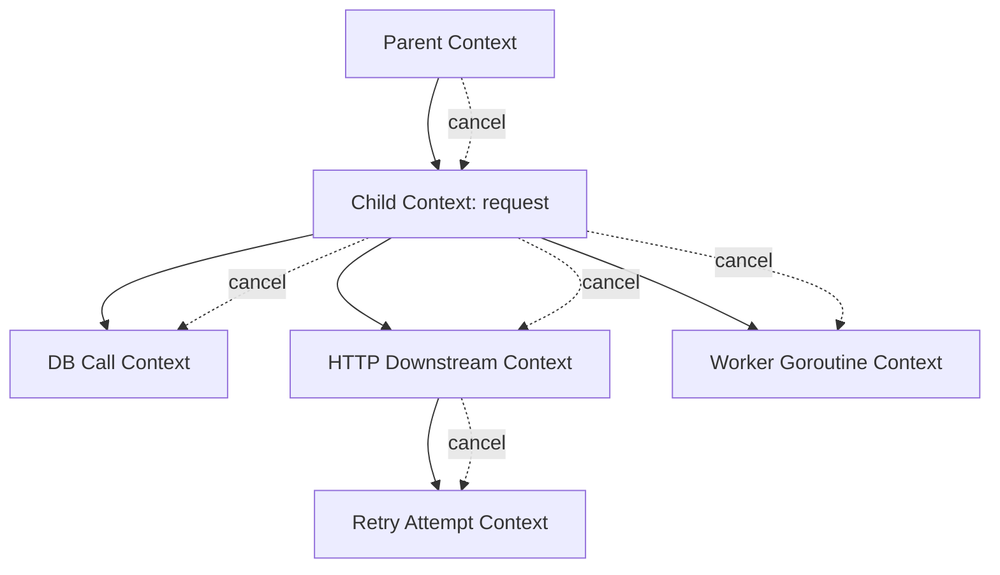
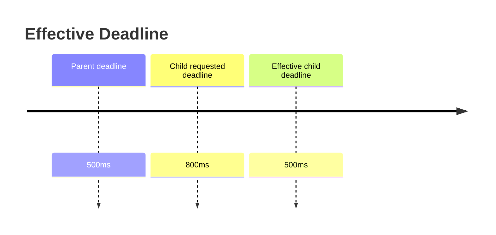

# learn-go-concurrency-parallelism-part-011.md

# Part 011 — Context as Concurrency Contract: Cancellation, Deadline, Values, and Propagation

> Target pembaca: Java software engineer yang ingin memahami `context.Context` bukan sebagai “parameter wajib di Go”, tetapi sebagai kontrak lifecycle untuk concurrency, request, goroutine, deadline, cancellation, dan resource cleanup.
>
> Fokus part ini: cancellation tree, deadline propagation, timeout budget, cancellation cause, context values, API boundary, goroutine ownership, shutdown, observability, dan failure modes.

---

## 0. Posisi Part Ini dalam Seri

Sebelumnya:

- Part 008 membahas channel.
- Part 009 membahas `select`.
- Part 010 membahas `WaitGroup`, `errgroup`, task groups, dan structured concurrency.

Part ini membahas primitive yang mengikat semua itu dalam aplikasi Go modern: **`context.Context`**.

Di Go production code, `context.Context` adalah salah satu boundary terpenting karena ia menjawab:

1. Kapan work harus berhenti?
2. Siapa parent dari work ini?
3. Berapa deadline/budget waktu yang tersisa?
4. Kenapa work dibatalkan?
5. Apa metadata request-scoped yang sah untuk dibawa?
6. Bagaimana cancellation dipropagasikan ke goroutine lain?
7. Bagaimana mencegah goroutine leak ketika caller sudah pergi?

Context bukan sekadar parameter pertama di function signature. Context adalah kontrak bahwa work yang dimulai dalam scope tersebut harus menghormati lifecycle scope tersebut.

---

## 1. Tujuan Pembelajaran

Setelah part ini, Anda harus mampu:

1. Menjelaskan `context.Context` sebagai cancellation/deadline/value carrier.
2. Membedakan:
   - `context.Background`,
   - `context.TODO`,
   - `WithCancel`,
   - `WithTimeout`,
   - `WithDeadline`,
   - `WithCancelCause`,
   - `WithoutCancel`.
3. Mendesain cancellation tree untuk request, job, service, dan background worker.
4. Menyusun timeout budget end-to-end, bukan timeout random per layer.
5. Menggunakan `ctx.Done()` dalam `select` untuk mencegah blocked goroutine.
6. Menghindari anti-pattern:
   - menyimpan context di struct sembarangan,
   - memakai context sebagai dependency bag,
   - melewatkan nil context,
   - membuat timeout berlapis tanpa budget,
   - mengabaikan `cancel`,
   - menjalankan goroutine request-scoped setelah request selesai.
7. Memahami cancellation cause untuk observability dan error semantics.
8. Mendesain API Go yang context-aware secara idiomatis.
9. Membedakan cancellation dan graceful drain.
10. Membuat checklist review untuk context propagation.

---

## 2. Mental Model Utama

`context.Context` membawa tiga hal utama:

1. **Cancellation signal**
   - `Done() <-chan struct{}`.
2. **Deadline**
   - `Deadline() (time.Time, bool)`.
3. **Request-scoped values**
   - `Value(key any) any`.

Dan satu hal melalui method:
4. **Cancellation reason**
   - `Err() error`.
   - dengan cause API: `context.Cause(ctx)`.



Context adalah tree:
- cancel parent → semua child cancel,
- deadline parent lebih awal → child tidak boleh melewati parent,
- values inherited dari parent,
- child cancellation tidak membatalkan parent.

---

## 3. Java Translation

Java equivalents:

| Java concept | Go context equivalent |
|---|---|
| `Thread.interrupt()` | cancellation signal via `ctx.Done()` |
| `Future.cancel()` | cancel function / context cancellation |
| timeout parameter | `WithTimeout` / `WithDeadline` |
| request-scoped MDC/correlation ID | context value, but carefully |
| structured task scope cancellation | `errgroup.WithContext` + context |
| deadline budget | context deadline |
| cancellation token | `context.Context` |
| ThreadLocal | sometimes context value, but not general replacement |

Important difference:

- Java interrupt is thread-affine.
- Go context is work-scope-affine.
- Java `ThreadLocal` attaches to thread.
- Go context is passed explicitly through call graph.
- Go goroutines are not stable request containers like Java thread-per-request used to be.
- Context passing makes lifecycle visible in function signatures.

---

## 4. The Context Interface

Conceptually:

```go
type Context interface {
    Deadline() (deadline time.Time, ok bool)
    Done() <-chan struct{}
    Err() error
    Value(key any) any
}
```

### 4.1 `Done`

`Done` returns a channel closed when context is cancelled or deadline expires.

```go
select {
case <-ctx.Done():
    return ctx.Err()
}
```

### 4.2 `Err`

After `Done` is closed:

```go
err := ctx.Err()
```

Usually:
- `context.Canceled`
- `context.DeadlineExceeded`

### 4.3 `Deadline`

```go
deadline, ok := ctx.Deadline()
if ok {
    remaining := time.Until(deadline)
    _ = remaining
}
```

### 4.4 `Value`

```go
requestID, _ := ctx.Value(requestIDKey{}).(string)
```

Use sparingly.

---

## 5. `context.Background` vs `context.TODO`

### 5.1 Background

```go
ctx := context.Background()
```

Use at:
- process root,
- main,
- tests,
- top-level initialization,
- root of server lifecycle.

### 5.2 TODO

```go
ctx := context.TODO()
```

Use when:
- you know a context is needed,
- but proper parent is not yet wired,
- during migration/refactor.

Do not leave `TODO` forever in production call paths if real parent context exists.

---

## 6. Context Must Not Be Nil

Bad:

```go
func Fetch(ctx context.Context, id string) error {
    // ...
}

Fetch(nil, "123")
```

Many context-aware APIs assume non-nil context.

If unsure at top-level, use:

```go
ctx := context.Background()
```

Do not make function handle nil context unless you intentionally support legacy callers.

---

## 7. API Rule: Context First

Idiomatic Go:

```go
func FetchUser(ctx context.Context, userID string) (User, error)
```

Not:

```go
func FetchUser(userID string, ctx context.Context) (User, error)
```

Not:

```go
func FetchUser(userID string) (User, error)
```

if operation can block, call network/db, wait for lock, or spawn work.

Use context for:
- HTTP request,
- DB query,
- external API,
- long CPU operation,
- queue submit,
- worker processing,
- file/network IO where cancellation matters,
- task group.

Maybe not needed for:
- pure CPU tiny function,
- data conversion,
- object validation without blocking,
- deterministic in-memory getter,
- simple formatting.

But if the function might evolve into IO/blocking, adding context later is API-breaking. For internal APIs, decide by architecture.

---

## 8. WithCancel

```go
ctx, cancel := context.WithCancel(parent)
defer cancel()
```

Use when:
- you need manual cancellation,
- parent scope finishes early,
- first task failure should stop siblings,
- component stop signal,
- cleanup child context resources.

Example:

```go
func Run(ctx context.Context) error {
    ctx, cancel := context.WithCancel(ctx)
    defer cancel()

    var wg sync.WaitGroup

    wg.Go(func() {
        worker(ctx)
    })

    // some condition
    cancel()
    wg.Wait()

    return nil
}
```

Important:

> Always call the cancel function when done, even if deadline will eventually expire.

Why:
- releases resources associated with context,
- removes child from parent,
- stops timers for timeout/deadline contexts.

---

## 9. WithTimeout

```go
ctx, cancel := context.WithTimeout(parent, 200*time.Millisecond)
defer cancel()
```

Use when operation has relative max duration.

Example:

```go
func FetchWithTimeout(parent context.Context, id string) (User, error) {
    ctx, cancel := context.WithTimeout(parent, 200*time.Millisecond)
    defer cancel()

    return FetchUser(ctx, id)
}
```

### 9.1 Timeout Is Not Retry Policy

A timeout says:
- this attempt/scope must not exceed duration.

It does not say:
- retry how many times,
- backoff,
- idempotency,
- circuit breaking,
- load shedding.

Do not hide retries inside random timeout wrappers without budget.

---

## 10. WithDeadline

```go
deadline := time.Now().Add(500 * time.Millisecond)
ctx, cancel := context.WithDeadline(parent, deadline)
defer cancel()
```

Use when absolute cutoff matters:
- request deadline,
- job deadline,
- transaction deadline,
- shutdown deadline.

If parent has earlier deadline, child effective deadline is earlier.



---

## 11. Timeout Budget: The Top 1% Difference

Naive timeout layering:

```go
func Handler(ctx context.Context) error {
    ctxA, cancelA := context.WithTimeout(ctx, 1*time.Second)
    defer cancelA()

    if err := callA(ctxA); err != nil {
        return err
    }

    ctxB, cancelB := context.WithTimeout(ctx, 1*time.Second)
    defer cancelB()

    return callB(ctxB)
}
```

If request SLA is 1 second, this can exceed SLA.

Better: parent context has deadline; children derive from remaining budget.

```go
func Handler(ctx context.Context) error {
    if err := callA(ctx); err != nil {
        return err
    }

    return callB(ctx)
}
```

If need per-call cap:

```go
func childWithCap(parent context.Context, max time.Duration) (context.Context, context.CancelFunc) {
    if deadline, ok := parent.Deadline(); ok {
        remaining := time.Until(deadline)
        if remaining < max {
            return context.WithDeadline(parent, deadline)
        }
    }

    return context.WithTimeout(parent, max)
}
```

Use:

```go
ctxA, cancelA := childWithCap(ctx, 200*time.Millisecond)
defer cancelA()

if err := callA(ctxA); err != nil {
    return err
}
```

### 11.1 Budget Allocation Example

Request budget: 1000ms.

| Segment | Budget |
|---|---:|
| auth/cache | 50ms |
| DB read | 250ms |
| downstream A | 300ms |
| downstream B | 300ms |
| response assembly | 50ms |
| safety margin | 50ms |

Better still:
- use remaining deadline,
- avoid fixed budget if dependency already fast,
- track actual elapsed,
- avoid retry beyond budget.

### 11.2 Retry Budget

Bad:

```go
for i := 0; i < 3; i++ {
    ctx, cancel := context.WithTimeout(parent, time.Second)
    err := call(ctx)
    cancel()
    if err == nil {
        return nil
    }
}
```

This can run 3 seconds.

Better:

```go
deadlineCtx, cancel := context.WithTimeout(parent, time.Second)
defer cancel()

for i := 0; i < 3; i++ {
    if err := call(deadlineCtx); err == nil {
        return nil
    }

    select {
    case <-time.After(backoff(i)):
    case <-deadlineCtx.Done():
        return deadlineCtx.Err()
    }
}
```

Even better: make backoff context-aware with timer.

---

## 12. WithCancelCause and Cancellation Cause

Basic context cancellation only returns:
- `context.Canceled`,
- `context.DeadlineExceeded`.

But production observability often needs: **why** was it cancelled?

Cause API allows parent to cancel with reason.

```go
ctx, cancel := context.WithCancelCause(parent)

cancel(errors.New("downstream dependency failed"))

<-ctx.Done()

fmt.Println(ctx.Err())           // context canceled
fmt.Println(context.Cause(ctx))  // downstream dependency failed
```

Use cases:
- errgroup-like cancellation with actual cause,
- shutdown reason,
- fail-fast due to validation,
- circuit open,
- overload,
- tenant disabled,
- leader lost.

### 12.1 Pattern: Cancel Siblings with Cause

```go
ctx, cancel := context.WithCancelCause(parent)
defer cancel(nil)

var wg sync.WaitGroup

wg.Go(func() {
    if err := taskA(ctx); err != nil {
        cancel(fmt.Errorf("taskA failed: %w", err))
    }
})

wg.Go(func() {
    if err := taskB(ctx); err != nil {
        cancel(fmt.Errorf("taskB failed: %w", err))
    }
})

wg.Wait()

if cause := context.Cause(ctx); cause != nil && !errors.Is(cause, context.Canceled) {
    return cause
}

return nil
```

Caution:
- first cause wins,
- still wait all tasks,
- tasks must observe ctx,
- cancellation cause is not all-error aggregation.

### 12.2 Deadline Cause

There are APIs to set deadline/timeout with cause in modern Go.

Useful when differentiating:
- user-facing timeout,
- internal budget exceeded,
- shutdown timeout,
- dependency timeout,
- overload shed.

---

## 13. WithoutCancel

Sometimes you need derive a context that preserves values but detaches cancellation.

Use cases:
- logging after request cancellation,
- audit event after response,
- cleanup that must outlive request,
- but should have its own timeout.

Dangerous:

```go
ctx := context.WithoutCancel(requestCtx)
go audit(ctx, event)
```

This can create unbounded detached work.

Safer:

```go
ctx := context.WithoutCancel(requestCtx)
ctx, cancel := context.WithTimeout(ctx, 2*time.Second)
defer cancel()

return auditDispatcher.Submit(ctx, event)
```

Or transfer ownership to service-level dispatcher:

```go
auditDispatcher.Submit(context.Background(), event)
```

But even then dispatcher must have lifecycle, queue bound, and shutdown.

Rule:

> Detaching cancellation is ownership transfer. Treat it like starting a new lifecycle scope.

---

## 14. Context Values: Use Sparingly

Context values are for request-scoped metadata that crosses API boundaries.

Good examples:
- request ID,
- trace/span context,
- auth principal metadata,
- locale,
- tenant ID,
- correlation ID.

Bad examples:
- database handle,
- logger as dependency,
- configuration object,
- feature service,
- optional function parameters,
- business data,
- mutable state,
- large payload.

### 14.1 Typed Keys

Avoid string keys:

```go
ctx = context.WithValue(ctx, "request_id", id)
```

Collision risk.

Better:

```go
type requestIDKey struct{}

func WithRequestID(ctx context.Context, id string) context.Context {
    return context.WithValue(ctx, requestIDKey{}, id)
}

func RequestID(ctx context.Context) (string, bool) {
    id, ok := ctx.Value(requestIDKey{}).(string)
    return id, ok
}
```

### 14.2 Do Not Require Context Value for Core Logic

Bad:

```go
func Process(ctx context.Context, order Order) error {
    db := ctx.Value(dbKey{}).(*sql.DB)
    return db.Save(order)
}
```

Better:

```go
type Processor struct {
    db *sql.DB
}

func (p *Processor) Process(ctx context.Context, order Order) error {
    return p.db.Save(ctx, order)
}
```

Context value should not hide dependencies.

---

## 15. Context in Struct: Usually No

Bad:

```go
type Service struct {
    ctx context.Context
}
```

Why often bad:
- unclear lifetime,
- stale request context can be retained,
- cancellation ownership unclear,
- values may outlive request,
- hard to reason about concurrent methods.

Better:
- pass context per method call.

```go
type Service struct {
    db *sql.DB
}

func (s *Service) Fetch(ctx context.Context, id string) (User, error) {
    return s.dbFetch(ctx, id)
}
```

Exception:
- long-lived component may store service lifecycle context internally.

```go
type Worker struct {
    ctx    context.Context
    cancel context.CancelFunc
}
```

This is acceptable if:
- context belongs to component lifecycle,
- not request context,
- Start/Stop semantics clear,
- not used to smuggle values.

---

## 16. Context and Goroutine Lifecycle

If goroutine is request-scoped:

```go
func Handle(ctx context.Context) error {
    g, ctx := errgroup.WithContext(ctx)

    g.Go(func() error {
        return task(ctx)
    })

    return g.Wait()
}
```

If goroutine ignores context:

```go
g.Go(func() error {
    return task(context.Background())
})
```

Bug:
- task outlives request,
- cancellation not propagated,
- resource leak,
- useless downstream work.

### 16.1 Goroutine Loop Pattern

```go
func worker(ctx context.Context, jobs <-chan Job) error {
    for {
        select {
        case <-ctx.Done():
            return ctx.Err()

        case job, ok := <-jobs:
            if !ok {
                return nil
            }

            if err := process(ctx, job); err != nil {
                return err
            }
        }
    }
}
```

### 16.2 Send Pattern

```go
select {
case out <- value:
    return nil
case <-ctx.Done():
    return ctx.Err()
}
```

### 16.3 Receive Pattern

```go
select {
case v, ok := <-in:
    if !ok {
        return io.EOF
    }
    return v, nil
case <-ctx.Done():
    return zero, ctx.Err()
}
```

---

## 17. Context Does Not Kill Goroutines

This is critical.

Cancellation closes `ctx.Done()`. It does not forcibly stop goroutines.

Bad assumption:

```go
ctx, cancel := context.WithCancel(parent)

go func() {
    for {
        expensiveCPUWork()
    }
}()

cancel() // goroutine keeps running
```

Correct:

```go
go func() {
    for {
        select {
        case <-ctx.Done():
            return
        default:
        }

        expensiveCPUWorkChunk()
    }
}()
```

For blocking IO:
- use APIs that accept context,
- set deadlines,
- close underlying resource,
- use cancellation-aware driver/client.

---

## 18. Context in HTTP Server

Incoming request:

```go
func handler(w http.ResponseWriter, r *http.Request) {
    ctx := r.Context()

    result, err := service.Do(ctx, request)
    if err != nil {
        // map error
        return
    }

    writeResponse(w, result)
}
```

Request context is cancelled when:
- client connection closes,
- HTTP/2 request cancelled,
- handler returns,
- server shutdown depending lifecycle.

Implication:
- do not use `r.Context()` for long background work after response.
- copy required data and transfer to service-level owner if needed.

Bad:

```go
func handler(w http.ResponseWriter, r *http.Request) {
    go sendEmail(r.Context(), email)
    w.WriteHeader(http.StatusAccepted)
}
```

If handler returns, context may be cancelled; email may fail or behave unpredictably.

Better:

```go
func handler(w http.ResponseWriter, r *http.Request) {
    if err := emailDispatcher.Submit(r.Context(), email); err != nil {
        http.Error(w, "busy", http.StatusTooManyRequests)
        return
    }

    w.WriteHeader(http.StatusAccepted)
}
```

Dispatcher owns background work.

---

## 19. Context in HTTP Client

Use request with context:

```go
req, err := http.NewRequestWithContext(ctx, http.MethodGet, url, nil)
if err != nil {
    return nil, err
}

resp, err := http.DefaultClient.Do(req)
```

Also configure client transport timeouts appropriately:
- response header timeout,
- TLS handshake timeout,
- idle connection timeout,
- expect continue timeout,
- max connections.

Context deadline controls request lifecycle, but transport-level timeouts protect lower-level phases.

Do not use only `http.Client{Timeout: ...}` everywhere without understanding:
- it is whole request timeout,
- may conflict with context,
- does not express per-dependency budget clearly.

---

## 20. Context in Database Calls

Use context-aware methods:

```go
row := db.QueryRowContext(ctx, query, id)
```

```go
rows, err := db.QueryContext(ctx, query)
```

```go
tx, err := db.BeginTx(ctx, opts)
```

Important:
- driver must support cancellation properly,
- context cancellation may close connection depending driver behavior,
- transaction context should cover intended scope,
- do not keep transaction open while waiting on unrelated goroutines.

Bad:

```go
tx, _ := db.BeginTx(ctx, nil)

g.Go(func() error {
    return callExternal(ctx)
})

g.Go(func() error {
    return updateDB(ctx, tx)
})

return g.Wait()
```

This can hold DB transaction while external call waits. Often wrong.

Better:
- external calls first,
- then short DB transaction,
- or design saga/outbox.

---

## 21. Context in gRPC

gRPC uses context heavily:
- deadlines propagate through metadata,
- cancellation propagates client → server,
- server handlers receive context,
- streaming methods must observe context.

Pattern:

```go
func (s *Server) GetUser(ctx context.Context, req *pb.GetUserRequest) (*pb.GetUserResponse, error) {
    user, err := s.service.GetUser(ctx, req.Id)
    if err != nil {
        return nil, mapError(err)
    }

    return &pb.GetUserResponse{User: user}, nil
}
```

For streaming:

```go
for {
    select {
    case <-stream.Context().Done():
        return stream.Context().Err()
    case msg := <-out:
        if err := stream.Send(msg); err != nil {
            return err
        }
    }
}
```

---

## 22. Context and Channels

Context Done is a channel, so it composes with `select`.

### 22.1 Pipeline Stage

```go
func Stage[A, B any](ctx context.Context, in <-chan A, fn func(A) B) <-chan B {
    out := make(chan B)

    go func() {
        defer close(out)

        for {
            select {
            case <-ctx.Done():
                return

            case a, ok := <-in:
                if !ok {
                    return
                }

                b := fn(a)

                select {
                case out <- b:
                case <-ctx.Done():
                    return
                }
            }
        }
    }()

    return out
}
```

### 22.2 Context Does Not Replace Data Channel

Do not send data through context.

Bad:

```go
ctx = context.WithValue(ctx, resultKey{}, result)
```

Use channel/return value for data.

### 22.3 Context Does Not Replace Close Ownership

Context can signal stop, but data channel close still needs owner.

---

## 23. Context and errgroup

Canonical request fan-out:

```go
func Load(ctx context.Context, id string) (*Page, error) {
    g, ctx := errgroup.WithContext(ctx)

    var user User
    var orders []Order

    g.Go(func() error {
        var err error
        user, err = loadUser(ctx, id)
        return err
    })

    g.Go(func() error {
        var err error
        orders, err = loadOrders(ctx, id)
        return err
    })

    if err := g.Wait(); err != nil {
        return nil, err
    }

    return &Page{User: user, Orders: orders}, nil
}
```

Key:
- if `loadUser` fails, context is cancelled,
- `loadOrders` must observe context,
- parent waits both before return.

Common bug:

```go
g.Go(func() error {
    return loadOrders(context.Background(), id)
})
```

This defeats cancellation.

---

## 24. Context and Worker Pool

Worker pool may have service context and job context.

```go
type Job struct {
    Ctx context.Context
    Payload Payload
}
```

But be careful: storing context inside job can retain request values and cancellation semantics.

Alternative:
- submit accepts context only for enqueue.
- worker creates processing context from service lifecycle and job deadline.

```go
func (p *Pool) Submit(ctx context.Context, payload Payload) error {
    select {
    case p.jobs <- payload:
        return nil
    case <-ctx.Done():
        return ctx.Err()
    case <-p.done:
        return ErrStopped
    }
}
```

If job itself must be cancelled when original request cancels, include context intentionally:

```go
type Job struct {
    Ctx context.Context
    Payload Payload
}
```

But document:
- if caller context cancels before worker starts, should job be skipped?
- can request context values be used later?
- is this background work or request-scoped work?

Often for background queues, do not bind job processing to HTTP request context. Instead:
- use submit context for admission,
- store explicit deadline/tenant/request ID as fields,
- worker uses service context + job deadline.

---

## 25. Request Context vs Background Work

This is one of the most common production design mistakes.

### 25.1 Work Required for Response

Use request context.

```go
func handler(w http.ResponseWriter, r *http.Request) {
    if err := service.Process(r.Context(), req); err != nil {
        // response failure
    }
}
```

### 25.2 Work Accepted for Later

Do not run directly under request context after response. Transfer ownership.

```go
func handler(w http.ResponseWriter, r *http.Request) {
    event := buildEvent(r)

    if err := dispatcher.Submit(r.Context(), event); err != nil {
        http.Error(w, "busy", http.StatusTooManyRequests)
        return
    }

    w.WriteHeader(http.StatusAccepted)
}
```

Dispatcher uses service lifecycle context.

### 25.3 Work Must Outlive Request but Keep Metadata

Extract explicit fields:

```go
event := AuditEvent{
    RequestID: requestIDFrom(ctx),
    UserID:    userID,
    Action:    "submit",
}
```

Do not rely on retaining full request context.

---

## 26. Context Cancellation and Error Mapping

Common errors:
- `context.Canceled`
- `context.DeadlineExceeded`

Mapping:

| Error | HTTP | gRPC | Meaning |
|---|---:|---|---|
| `context.Canceled` | often 499-like in proxies; app-specific | `Canceled` | caller cancelled |
| `context.DeadlineExceeded` | 504/timeout | `DeadlineExceeded` | deadline exceeded |
| overload admission timeout | 429/503 | `ResourceExhausted`/`Unavailable` | system busy |
| dependency timeout | 504/502 | `Unavailable`/`DeadlineExceeded` | downstream issue |

Do not blindly map every `ctx.Err()` to internal server error.

### 26.1 Preserve Cause

```go
if err := ctx.Err(); err != nil {
    cause := context.Cause(ctx)
    log.Info("context done", "err", err, "cause", cause)
    return err
}
```

---

## 27. Context and Observability

Context often carries tracing metadata, but you still need explicit logs/metrics.

Useful fields:
- request ID,
- trace ID,
- tenant ID,
- deadline remaining,
- cancellation cause,
- elapsed time,
- downstream name,
- retry attempt,
- queue wait time.

Example:

```go
func logDeadline(ctx context.Context, operation string) {
    if deadline, ok := ctx.Deadline(); ok {
        log.Printf("%s deadline_remaining_ms=%d", operation, time.Until(deadline).Milliseconds())
    }
}
```

Metrics:
- context cancellations total,
- deadline exceeded total,
- downstream timeout total,
- queue submit cancelled,
- worker cancelled jobs,
- shutdown cancellation count,
- work abandoned due to cancellation cause.

Important:
- `context.Canceled` may be normal if client disconnected.
- Alerting on all cancellations creates noise.
- Alert on abnormal rate or wrong cause.

---

## 28. Context and Locks

Context does not work with `sync.Mutex.Lock()` directly. Lock cannot be cancelled.

Bad:

```go
mu.Lock()
defer mu.Unlock()
```

If lock is highly contended, caller cannot cancel while waiting.

Options:
- redesign lock contention,
- use channel/semaphore with select,
- use try lock if available/appropriate,
- avoid holding lock during blocking IO,
- reduce critical section,
- shard lock.

Do not invent complex cancellable mutex unless necessary.

Pattern with semaphore:

```go
select {
case sem <- struct{}{}:
    defer func() { <-sem }()
case <-ctx.Done():
    return ctx.Err()
}
```

But semaphore is not identical to mutex for invariant protection.

---

## 29. Context and CPU-Bound Work

CPU-bound function should check context at chunk boundaries.

```go
func HashMany(ctx context.Context, chunks [][]byte) error {
    for i, chunk := range chunks {
        if i%128 == 0 {
            select {
            case <-ctx.Done():
                return ctx.Err()
            default:
            }
        }

        hash(chunk)
    }

    return nil
}
```

Too frequent checks add overhead. Too rare checks make cancellation slow.

Choose based on:
- chunk cost,
- latency requirement,
- CPU budget,
- expected cancellation frequency.

---

## 30. Context and Resource Cleanup

Context cancellation should trigger cleanup, but cleanup itself may need separate bounded context.

Example:

```go
func Run(ctx context.Context) error {
    resource := acquire()
    defer resource.Close()

    <-ctx.Done()

    cleanupCtx, cancel := context.WithTimeout(context.Background(), 5*time.Second)
    defer cancel()

    return resource.GracefulClose(cleanupCtx)
}
```

Do not use already-cancelled ctx for cleanup that must run:

```go
<-ctx.Done()
resource.GracefulClose(ctx) // ctx already cancelled; cleanup may immediately fail
```

Use:
- `context.WithoutCancel(ctx)` plus timeout,
- or `context.Background()` plus timeout,
- but preserve explicit metadata if needed.

---

## 31. Context in Shutdown

Service root:

```go
func main() {
    root, stop := signal.NotifyContext(context.Background(), os.Interrupt, syscall.SIGTERM)
    defer stop()

    app := NewApp()
    if err := app.Run(root); err != nil {
        log.Fatal(err)
    }
}
```

Component:

```go
func (a *App) Run(ctx context.Context) error {
    g, ctx := errgroup.WithContext(ctx)

    g.Go(func() error {
        return a.httpServer.Run(ctx)
    })

    g.Go(func() error {
        return a.consumer.Run(ctx)
    })

    return g.Wait()
}
```

Shutdown semantics:
- root cancel means stop accepting new work,
- each component decides cancel vs drain,
- shutdown deadline should be explicit,
- cleanup should not reuse cancelled context blindly.

---

## 32. Cancellation vs Drain

Context cancellation means “stop this scope”. It does not define drain policy.

### Cancel Policy

```go
case <-ctx.Done():
    return ctx.Err()
```

### Drain Policy

```go
case <-ctx.Done():
    for job := range jobs {
        process(job)
    }
    return nil
```

But drain can hang if jobs never closes.

Proper graceful drain:
1. stop intake,
2. close job source,
3. wait active jobs,
4. bound wait with shutdown context,
5. force cancel after deadline.

Context is one input to shutdown policy, not the whole policy.

---

## 33. Common Anti-Patterns

### 33.1 Passing `context.Background()` Deep in Call Chain

Bad:

```go
func (s *Service) Fetch(ctx context.Context) error {
    return s.client.Call(context.Background())
}
```

This breaks cancellation and deadline propagation.

### 33.2 Storing Request Context in Struct

Bad:

```go
type RequestProcessor struct {
    ctx context.Context
}
```

unless struct is request-scoped and not retained.

### 33.3 Context as Dependency Bag

Bad:

```go
ctx = context.WithValue(ctx, dbKey{}, db)
ctx = context.WithValue(ctx, loggerKey{}, logger)
ctx = context.WithValue(ctx, configKey{}, config)
```

Use fields/dependency injection.

### 33.4 Ignoring Cancel Function

Bad:

```go
ctx, _ := context.WithTimeout(parent, time.Second)
return call(ctx)
```

Fix:

```go
ctx, cancel := context.WithTimeout(parent, time.Second)
defer cancel()
return call(ctx)
```

### 33.5 Timeout at Every Layer

Bad:
- handler 1s,
- service 1s,
- repository 1s,
- client 1s,
- retry 3 times.

This creates accidental 3–4s request.

Use parent deadline and budget.

### 33.6 Context Value Required for Correctness

Bad:
- function silently fails if value absent,
- hidden dependency,
- hard tests.

### 33.7 Running Background Work with Request Context

Already covered. Transfer ownership.

### 33.8 Swallowing Context Error

Bad:

```go
if errors.Is(err, context.Canceled) {
    return nil
}
```

Sometimes okay, but can hide cancellation causing incomplete work.

Decide by operation semantics.

---

## 34. Case Study 1: HTTP Fan-Out with Deadline Budget

Scenario:
- handler loads profile, orders, recommendations.
- SLA 800ms.
- Recommendations optional.

Design:

```go
func (s *Service) LoadPage(ctx context.Context, userID string) (*Page, error) {
    ctx, cancel := context.WithTimeout(ctx, 800*time.Millisecond)
    defer cancel()

    g, ctx := errgroup.WithContext(ctx)

    var profile Profile
    var orders []Order
    var recs []Recommendation

    g.Go(func() error {
        var err error
        profile, err = s.profile.Get(ctx, userID)
        return err
    })

    g.Go(func() error {
        var err error
        orders, err = s.orders.List(ctx, userID)
        return err
    })

    g.Go(func() error {
        childCtx, childCancel := childWithCap(ctx, 150*time.Millisecond)
        defer childCancel()

        var err error
        recs, err = s.recommendations.Get(childCtx, userID)
        if err != nil {
            // optional: do not fail whole page
            return nil
        }

        return nil
    })

    if err := g.Wait(); err != nil {
        return nil, err
    }

    return &Page{
        Profile: profile,
        Orders:  orders,
        Recs:    recs,
    }, nil
}
```

Points:
- parent SLA enforced,
- required dependencies return error,
- optional dependency bounded and swallowed intentionally,
- context cancellation propagated,
- parent waits all tasks.

---

## 35. Case Study 2: Queue Submit vs Job Processing Context

Scenario:
- HTTP request submits report generation job.
- Job should run even if HTTP client disconnects after acceptance.

Bad:

```go
func handler(w http.ResponseWriter, r *http.Request) {
    job := Job{
        Ctx: r.Context(),
        ID:  newID(),
    }

    queue <- job
    w.WriteHeader(http.StatusAccepted)
}
```

If client disconnects, job context cancels.

Better:

```go
func handler(w http.ResponseWriter, r *http.Request) {
    job := Job{
        ID:        newID(),
        RequestID: requestIDFrom(r.Context()),
        UserID:    userIDFrom(r.Context()),
        Deadline:  time.Now().Add(10 * time.Minute),
    }

    if err := dispatcher.Submit(r.Context(), job); err != nil {
        http.Error(w, "busy", http.StatusTooManyRequests)
        return
    }

    w.WriteHeader(http.StatusAccepted)
}
```

Worker:

```go
func (d *Dispatcher) process(serviceCtx context.Context, job Job) error {
    ctx := serviceCtx

    if !job.Deadline.IsZero() {
        var cancel context.CancelFunc
        ctx, cancel = context.WithDeadline(serviceCtx, job.Deadline)
        defer cancel()
    }

    return generateReport(ctx, job)
}
```

Submit context controls admission. Service context controls processing lifecycle.

---

## 36. Case Study 3: Cleanup After Cancel

Scenario:
- request starts temp file processing.
- if request cancels, temp file must be deleted.

Bad:

```go
func Process(ctx context.Context) error {
    tmp := createTemp()

    defer cleanup(ctx, tmp)

    return doWork(ctx, tmp)
}
```

If ctx cancelled, cleanup may fail immediately.

Better:

```go
func Process(ctx context.Context) error {
    tmp := createTemp()

    defer func() {
        cleanupCtx, cancel := context.WithTimeout(context.Background(), 5*time.Second)
        defer cancel()

        _ = cleanup(cleanupCtx, tmp)
    }()

    return doWork(ctx, tmp)
}
```

If cleanup needs request ID, pass it explicitly.

---

## 37. Case Study 4: Context Ignored by Downstream

Scenario:
- handler deadline 500ms.
- repository method ignores ctx.

Bad:

```go
func (r *Repo) Find(ctx context.Context, id string) (User, error) {
    row := r.db.QueryRow("select ...", id)
    // ignores ctx
}
```

Fix:

```go
func (r *Repo) Find(ctx context.Context, id string) (User, error) {
    row := r.db.QueryRowContext(ctx, "select ...", id)
    // ...
}
```

But also:
- configure DB pool,
- query timeout,
- driver support,
- transaction scope.

Context propagation must reach actual blocking operation.

---

## 38. Testing Context-Aware Code

### 38.1 Test Cancellation

```go
func TestStopsOnCancel(t *testing.T) {
    ctx, cancel := context.WithCancel(context.Background())

    stopped := make(chan struct{})

    go func() {
        defer close(stopped)
        _ = worker(ctx)
    }()

    cancel()

    select {
    case <-stopped:
    case <-time.After(time.Second):
        t.Fatal("worker did not stop")
    }
}
```

### 38.2 Test Deadline

```go
func TestDeadlineExceeded(t *testing.T) {
    ctx, cancel := context.WithTimeout(context.Background(), 10*time.Millisecond)
    defer cancel()

    err := slowOperation(ctx)

    if !errors.Is(err, context.DeadlineExceeded) {
        t.Fatalf("expected deadline exceeded, got %v", err)
    }
}
```

### 38.3 Avoid Slow Tests

Instead of sleeping long:
- inject fake clock if design allows,
- use controllable channel,
- use short timeout only as guard,
- use `testing/synctest` where appropriate in Go versions that support it.

### 38.4 Test Cancel Function Called?

Hard to test directly, but vet/static analysis can catch lost cancel in many cases. Code review should enforce `defer cancel()`.

---

## 39. Observability Checklist

For each major operation:
- log deadline remaining at start for debug-level traces,
- record deadline exceeded separately from caller cancelled,
- record cancellation cause,
- record dependency timeout by dependency name,
- record queue submit cancellation,
- record worker cancellation,
- record shutdown cancellation,
- avoid alerting on normal client cancellations,
- alert on increased deadline exceeded rate,
- correlate with queue depth and downstream latency.

Example structured log fields:

```text
operation=LoadPage
request_id=...
tenant_id=...
deadline_remaining_ms=742
ctx_err=context deadline exceeded
ctx_cause=downstream orders timeout
elapsed_ms=801
```

---

## 40. Design Review Checklist

For every context-aware API:

1. Is `context.Context` first parameter?
2. Is context non-nil?
3. Does function pass context to all blocking operations?
4. Does function avoid replacing parent with `context.Background()`?
5. Are child timeouts derived from parent budget?
6. Is cancel function always called?
7. Are deadlines layered correctly?
8. Are retries bounded by parent context?
9. Are goroutines listening to `ctx.Done()`?
10. Are sends/receives cancellation-aware?
11. Does CPU-bound work check context at reasonable intervals?
12. Does cleanup use appropriate context, not blindly cancelled one?
13. Are context values limited to request-scoped metadata?
14. Are dependencies not hidden in context values?
15. Is request context not stored in long-lived struct?
16. Is background work not using request context after response?
17. If cancellation is detached, is ownership transferred?
18. Is cancellation cause useful and preserved?
19. Are `context.Canceled` and `DeadlineExceeded` mapped correctly?
20. Are metrics distinguishing cancel vs timeout vs overload?
21. Does test cover cancellation?
22. Does test cover deadline?
23. Does shutdown distinguish cancel vs drain?
24. Are transaction scopes not held across unrelated waits?
25. Does downstream library actually honor context?

---

## 41. Mini Lab 1: Budgeted Fan-Out

Implement:

```go
func LoadAggregate(ctx context.Context, id string) (Aggregate, error)
```

Requirements:
- total deadline 700ms,
- required calls: profile, account,
- optional call: recommendations max 100ms,
- first required error cancels siblings,
- optional error does not fail aggregate,
- all goroutines waited,
- no data race.

Think:
- Which calls use errgroup?
- How to handle optional result?
- How to derive child timeout from parent?

---

## 42. Mini Lab 2: Context-Aware Worker

Implement worker:

```go
func Worker(ctx context.Context, jobs <-chan Job, results chan<- Result) error
```

Requirements:
- exits when ctx cancelled,
- exits when jobs closed,
- does not block forever sending result if ctx cancelled,
- process function receives context,
- closed jobs channel handled with `ok`,
- test cancellation and close.

---

## 43. Mini Lab 3: Background Dispatcher

Implement:

```go
type Dispatcher struct {
    // service lifecycle context internally
}

func (d *Dispatcher) Submit(ctx context.Context, job Job) error
func (d *Dispatcher) Stop(ctx context.Context) error
```

Requirements:
- submit context controls admission only,
- processing uses dispatcher service context,
- job has explicit deadline field,
- stop supports bounded drain,
- no request context stored in job,
- metrics for rejected/cancelled/deadline exceeded.

---

## 44. Mini Lab 4: Cancellation Cause

Implement task group with cause:

```go
type CauseGroup struct {
    // ...
}

func (g *CauseGroup) Go(name string, fn func(context.Context) error)
func (g *CauseGroup) Wait() error
```

Requirements:
- first task error cancels context with cause,
- sibling sees `context.Cause(ctx)`,
- `Wait` returns cause,
- panic converted to cause with stack,
- all tasks waited.

---

## 45. Mini Lab 5: Cleanup Context

Create function:

```go
func ProcessWithTemp(ctx context.Context) error
```

Requirements:
- create temp resource,
- work respects request context,
- cleanup always runs,
- cleanup has separate 3s timeout,
- cleanup logs original request ID without retaining full request context.

---

## 46. Top 1% Heuristics

1. Context is a lifecycle contract, not a convenience parameter.
2. Parent context should flow downward; do not create `Background` deep inside request path.
3. Cancellation is cooperative; every blocking operation must participate.
4. A timeout without budget thinking is just a random failure generator.
5. Always call cancel.
6. Do not use context values for dependencies.
7. Do not store request context in long-lived structs.
8. Do not run accepted background work under request context.
9. Detaching cancellation is ownership transfer.
10. Cleanup often needs a fresh bounded context.
11. Context does not define drain semantics; shutdown policy does.
12. Preserve cancellation cause when it helps operations.
13. Map `context.Canceled` and `DeadlineExceeded` intentionally.
14. Context-aware code must be tested for cancellation.
15. The real question is not “does function accept context?” but “does cancellation reach the operation that can block?”

---

## 47. Source Notes

Primary references used for this part:

1. Go `context` package documentation:
   - `Context`,
   - `WithCancel`,
   - `WithTimeout`,
   - `WithDeadline`,
   - `WithCancelCause`,
   - `WithoutCancel`,
   - cancellation and deadline semantics.

2. Go blog context article:
   - request-scoped cancellation,
   - goroutines working on a request should exit quickly after cancellation.

3. Go blog pipelines and cancellation:
   - cancellation prevents blocked upstream goroutines when downstream exits early.

4. Go `net/http` documentation:
   - request context lifecycle and context-aware requests.

5. Go `database/sql` documentation:
   - context-aware query/transaction APIs.

6. Go memory model:
   - channel close/receive synchronization relevant to `ctx.Done()`.

---

## 48. Summary

`context.Context` is one of the main tools that turns Go concurrency from “spawn goroutines” into an engineered lifecycle.

It answers:

- when to stop,
- who owns the stop signal,
- how much time remains,
- why cancellation happened,
- what request metadata follows the work,
- how children are tied to parent scope.

But context is cooperative:
- it does not kill goroutines,
- it does not cancel non-context-aware IO,
- it does not make CPU loops stop,
- it does not define drain policy,
- it does not replace ownership.

The production-grade rule:

> Every goroutine and every blocking operation should be reachable by a context lifecycle, unless ownership has been explicitly transferred to another lifecycle.

---

## 49. Status Seri

Selesai:
- Part 000 — Orientation
- Part 001 — Foundations
- Part 002 — Goroutine Internals
- Part 003 — Go Scheduler Deep Dive
- Part 004 — GOMAXPROCS, CPU Quotas, Containers
- Part 005 — Go Memory Model
- Part 006 — Synchronization Primitives
- Part 007 — Atomic Operations
- Part 008 — Channels Deep Dive
- Part 009 — Select Semantics
- Part 010 — WaitGroup, ErrGroup, Task Groups, and Structured Concurrency
- Part 011 — Context as Concurrency Contract

Belum selesai:
- Part 012 sampai Part 034.

Seri belum mencapai bagian terakhir.

<!-- NAVIGATION_FOOTER -->
<div class="page-nav">
<a href="./learn-go-concurrency-parallelism-part-010.md">⬅️ Part 010 — WaitGroup, ErrGroup, Task Groups, and Structured Concurrency</a>
<a href="./index.md">📚 Kategori</a>
<a href="../../index.md">🏠 Home</a>
<a href="./learn-go-concurrency-parallelism-part-012.md">Part 012 — Ownership Models: Share Memory by Communicating vs Communicate by Sharing Memory ➡️</a>
</div>
