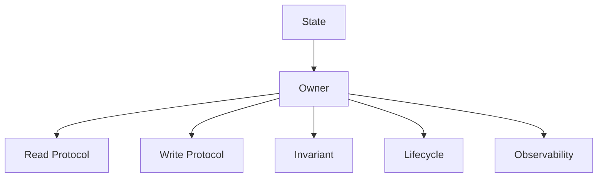
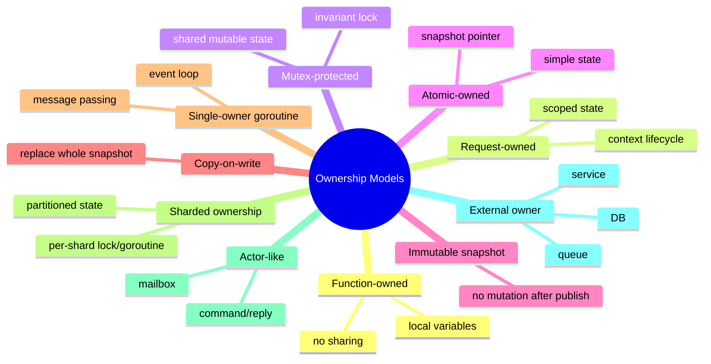
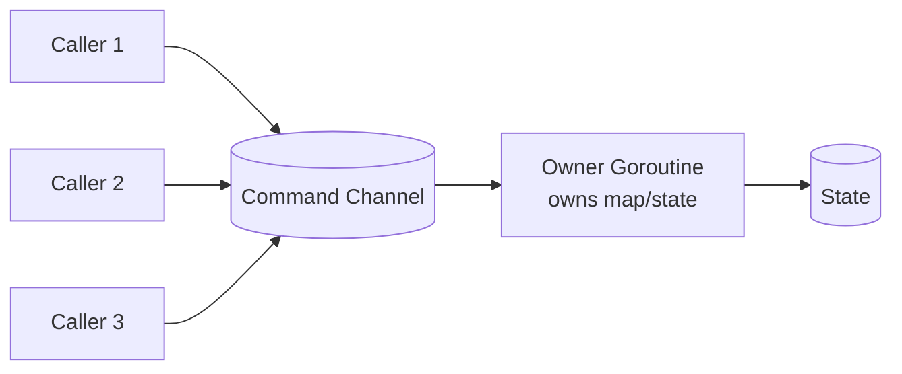
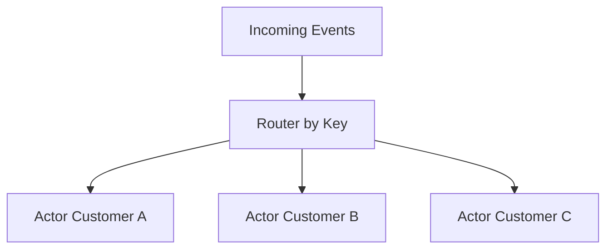
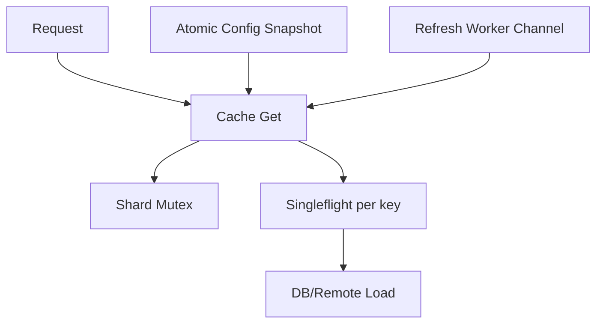
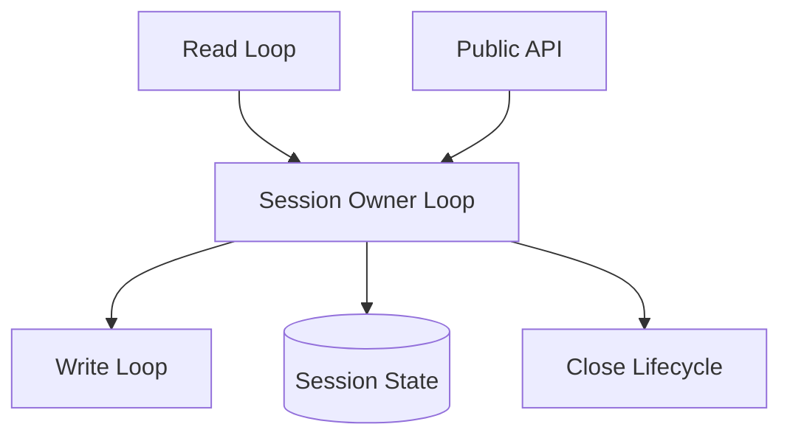
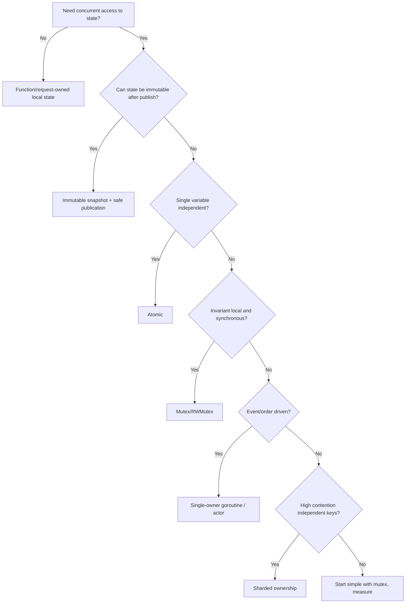

# learn-go-concurrency-parallelism-part-012.md

# Part 012 — Ownership Models: Share Memory by Communicating vs Communicate by Sharing Memory

> Target pembaca: Java software engineer yang ingin naik dari “bisa memakai goroutine/channel/mutex” menjadi engineer yang bisa memilih **model kepemilikan state** secara tepat untuk sistem concurrent production-grade.
>
> Fokus part ini: ownership sebagai dasar desain concurrency; kapan memakai single-owner goroutine, mutex-protected shared state, immutable snapshot, copy-on-write, atomic pointer, sharded state, actor-like ownership, dan hybrid model.

---

## 0. Posisi Part Ini dalam Seri

Sebelumnya kita membahas primitive:

- goroutine lifecycle,
- scheduler,
- memory model,
- `sync`,
- atomic,
- channel,
- `select`,
- task group,
- context.

Sekarang kita mulai masuk ke level desain.

Pertanyaan utama part ini:

> State ini seharusnya dimiliki siapa?

Bukan:
- “pakai mutex atau channel?”
- “pakai atomic biar cepat?”
- “pakai goroutine biar Go idiomatic?”

Pertanyaan yang benar:

1. Siapa pemilik state?
2. Siapa boleh membaca?
3. Siapa boleh menulis?
4. Invariant apa yang harus selalu benar?
5. Apakah mutation harus serialized?
6. Apakah read butuh snapshot konsisten?
7. Apakah ordering penting?
8. Apakah state bisa dibuat immutable?
9. Apakah contention akan tinggi?
10. Apa failure mode saat owner lambat/mati/cancel?
11. Bagaimana shutdown dan observability?

Concurrency bug hampir selalu muncul ketika ownership kabur.

---

## 1. Tujuan Pembelajaran

Setelah part ini, Anda harus mampu:

1. Menjelaskan ownership sebagai konsep utama dalam desain concurrent system.
2. Membedakan:
   - single-owner goroutine,
   - lock-protected shared state,
   - immutable snapshot,
   - copy-on-write,
   - atomic publication,
   - sharded ownership,
   - actor-like model,
   - request-owned state,
   - service-owned state.
3. Memilih antara channel, mutex, atomic, sharding, dan queue berdasarkan invariant.
4. Mendesain safe publication tanpa data race.
5. Menghindari overuse channel untuk state sederhana.
6. Menghindari shared mutable object setelah channel handoff.
7. Membuat decision matrix untuk production design review.
8. Memahami trade-off latency, throughput, complexity, observability, dan correctness.
9. Menerapkan ownership model pada cache, config, rate limiter, worker pool, and per-key ordering.
10. Mengidentifikasi ownership smell dalam code review.

---

## 2. Mental Model: State, Owner, Access

Setiap state dalam program concurrent harus punya owner.



Owner bukan selalu goroutine. Owner bisa berupa:

- function stack,
- request scope,
- struct protected by mutex,
- atomic pointer,
- goroutine event loop,
- shard,
- database transaction,
- worker pool,
- external system.

Ownership berarti:

> Ada aturan eksplisit tentang siapa yang boleh mutate state dan melalui mekanisme apa.

Tanpa ownership, Anda mengandalkan “semoga tidak bersamaan”.

---

## 3. The Slogan: Share Memory by Communicating

Go terkenal dengan prinsip:

> Do not communicate by sharing memory; instead, share memory by communicating.

Makna yang sering benar:
- jangan banyak goroutine mutate object yang sama secara bebas,
- pindahkan ownership lewat channel,
- gunakan message passing untuk serialized mutation,
- buat boundary concurrency eksplisit.

Makna yang sering disalahpahami:
- mutex itu buruk,
- channel selalu lebih idiomatic,
- semua state harus dimiliki goroutine,
- shared memory tidak boleh dipakai,
- atomic lebih rendah level dan selalu tidak idiomatic.

Realitas production:

> Go memberi channel, mutex, atomic, context, scheduler, dan memory model. Engineer senior memilih primitive berdasarkan invariant, bukan slogan.

---

## 4. Ownership Model Taxonomy

Kita akan pakai taxonomy berikut:



Tidak ada model yang selalu menang.

---

## 5. Model 1: Function-Owned State

State paling aman adalah state yang tidak dishare.

```go
func Calculate(input Input) Output {
    temp := make(map[string]int)
    // only this goroutine accesses temp
    return buildOutput(temp)
}
```

Properties:
- no synchronization needed,
- easiest to reason,
- fastest to review,
- lifetime clear,
- cannot race unless reference escapes.

Rule:

> Jangan membuat state shared jika bisa tetap local.

### 5.1 Escape by Closure

State local bisa menjadi shared jika ditangkap goroutine.

```go
func Bad(items []Item) {
    total := 0

    for _, item := range items {
        go func() {
            total += item.Value // race
        }()
    }
}
```

Fix:
- local per goroutine,
- collect after wait,
- mutex/atomic,
- channel results.

```go
func Good(items []Item) int {
    results := make(chan int, len(items))
    var wg sync.WaitGroup

    for _, item := range items {
        item := item

        wg.Go(func() {
            results <- item.Value
        })
    }

    wg.Wait()
    close(results)

    total := 0
    for v := range results {
        total += v
    }

    return total
}
```

But if data set large, prefer bounded worker/parallel reduction.

---

## 6. Model 2: Request-Owned State

Request-owned state lives for one request/job.

Example:

```go
func Handle(ctx context.Context, req Request) (Response, error) {
    state := RequestState{
        RequestID: req.ID,
        StartedAt: time.Now(),
    }

    return process(ctx, req, &state)
}
```

If request spawns goroutines, state access must be controlled.

Safe pattern: distinct writes + wait.

```go
func Load(ctx context.Context) (*Page, error) {
    g, ctx := errgroup.WithContext(ctx)

    var user User
    var orders []Order

    g.Go(func() error {
        var err error
        user, err = loadUser(ctx)
        return err
    })

    g.Go(func() error {
        var err error
        orders, err = loadOrders(ctx)
        return err
    })

    if err := g.Wait(); err != nil {
        return nil, err
    }

    return &Page{User: user, Orders: orders}, nil
}
```

This is safe if:
- each variable written by one goroutine,
- parent reads only after `Wait`,
- loaded objects are not concurrently mutated.

Unsafe:

```go
var page Page

g.Go(func() error {
    page.Items = append(page.Items, item) // race if multiple goroutines
    return nil
})
```

Use:
- per-index assignment,
- mutex,
- result channel,
- local aggregation then merge.

---

## 7. Model 3: Mutex-Protected Shared State

Use mutex when multiple goroutines need access to shared mutable state and invariants are easier to protect with critical sections.

Example:

```go
type Cache struct {
    mu    sync.Mutex
    items map[string]Item
}

func (c *Cache) Get(key string) (Item, bool) {
    c.mu.Lock()
    defer c.mu.Unlock()

    item, ok := c.items[key]
    return item, ok
}

func (c *Cache) Put(key string, item Item) {
    c.mu.Lock()
    defer c.mu.Unlock()

    c.items[key] = item
}
```

### 7.1 Mutex Protects Invariants

Important: mutex should protect invariant, not just variable.

```go
type Account struct {
    mu      sync.Mutex
    balance int64
    status  Status
}
```

Invariant:
- closed account cannot be debited,
- balance must not go negative,
- status transition must be valid.

```go
func (a *Account) Debit(amount int64) error {
    a.mu.Lock()
    defer a.mu.Unlock()

    if a.status == StatusClosed {
        return ErrClosed
    }

    if a.balance < amount {
        return ErrInsufficientFunds
    }

    a.balance -= amount
    return nil
}
```

If you split locks per field, invariant can break.

### 7.2 When Mutex Is Better Than Channel

Use mutex when:
- state is naturally shared object,
- operations are short,
- invariant is local,
- no need serialized event loop,
- callers need synchronous result,
- high read/write clarity,
- ownership through object methods is enough.

Channel over-engineering:

```go
type Counter struct {
    commands chan command
}
```

For a counter, use:

```go
type Counter struct {
    n atomic.Int64
}
```

or mutex if complex.

### 7.3 Mutex Risks

- deadlock,
- long critical section,
- lock convoy,
- priority inversion-ish behavior,
- hidden blocking under lock,
- inconsistent lock ordering,
- exposing protected pointer.

Bad:

```go
func (c *Cache) GetPtr(key string) *Item {
    c.mu.Lock()
    defer c.mu.Unlock()

    return c.items[key] // caller can mutate outside lock
}
```

Better:
- return copy,
- immutable item,
- caller callback under lock only if safe,
- explicit update method.

---

## 8. Model 4: RWMutex-Protected Shared State

Use `RWMutex` for read-heavy state where reads are frequent and writes infrequent.

```go
type Registry struct {
    mu    sync.RWMutex
    items map[string]Handler
}

func (r *Registry) Get(name string) (Handler, bool) {
    r.mu.RLock()
    defer r.mu.RUnlock()

    h, ok := r.items[name]
    return h, ok
}

func (r *Registry) Register(name string, h Handler) {
    r.mu.Lock()
    defer r.mu.Unlock()

    r.items[name] = h
}
```

### 8.1 RWMutex Is Not Automatically Faster

RWMutex can be worse if:
- reads are tiny,
- writes frequent,
- read lock overhead dominates,
- writer waits behind readers,
- invariant requires upgrade from read to write.

Do not choose RWMutex by default. Benchmark under realistic contention.

### 8.2 No Lock Upgrade

Bad:

```go
r.mu.RLock()
if _, ok := r.items[name]; !ok {
    r.mu.Lock() // deadlock / invalid upgrade
}
r.mu.RUnlock()
```

Correct:

```go
r.mu.RLock()
_, ok := r.items[name]
r.mu.RUnlock()

if !ok {
    r.mu.Lock()
    if _, ok := r.items[name]; !ok {
        r.items[name] = h
    }
    r.mu.Unlock()
}
```

This is double-check under proper locking. But consider if simpler full write lock is enough.

---

## 9. Model 5: Immutable Snapshot

Immutable state is ideal for concurrent reads.

```go
type Config struct {
    Limits map[string]int
}
```

But map is mutable. To make snapshot truly immutable:
- do not mutate after publish,
- do not expose mutable internals,
- deep copy on construction,
- return copies or read-only API.

```go
type Config struct {
    limits map[string]int
}

func NewConfig(input map[string]int) *Config {
    limits := make(map[string]int, len(input))
    for k, v := range input {
        limits[k] = v
    }

    return &Config{limits: limits}
}

func (c *Config) Limit(name string) (int, bool) {
    v, ok := c.limits[name]
    return v, ok
}
```

If nobody mutates `limits` after construction, concurrent reads are safe.

### 9.1 Safe Publication Needed

Immutable object must be safely published.

Bad:

```go
var cfg *Config

func Reload() {
    cfg = NewConfig(load()) // data race with readers
}

func GetLimit(name string) int {
    return cfg.Limit(name)
}
```

Use mutex or atomic pointer.

```go
var cfg atomic.Pointer[Config]

func Reload() {
    cfg.Store(NewConfig(load()))
}

func GetLimit(name string) int {
    c := cfg.Load()
    if c == nil {
        return 0
    }

    v, _ := c.Limit(name)
    return v
}
```

---

## 10. Model 6: Copy-on-Write

Copy-on-write is useful when:
- reads are frequent,
- writes are rare,
- state can be replaced wholesale,
- readers need lock-free-ish snapshot,
- update cost acceptable.

Example route table:

```go
type RouteTable struct {
    routes map[string]Handler
}

type Router struct {
    current atomic.Pointer[RouteTable]
}

func (r *Router) Serve(path string) {
    table := r.current.Load()
    if table == nil {
        return
    }

    if h, ok := table.routes[path]; ok {
        h()
    }
}

func (r *Router) Add(path string, h Handler) {
    old := r.current.Load()

    nextRoutes := make(map[string]Handler)
    if old != nil {
        for k, v := range old.routes {
            nextRoutes[k] = v
        }
    }

    nextRoutes[path] = h

    r.current.Store(&RouteTable{
        routes: nextRoutes,
    })
}
```

Problem:
- concurrent writers can overwrite each other.

Fix with writer mutex:

```go
type Router struct {
    mu      sync.Mutex
    current atomic.Pointer[RouteTable]
}

func (r *Router) Add(path string, h Handler) {
    r.mu.Lock()
    defer r.mu.Unlock()

    old := r.current.Load()

    nextRoutes := make(map[string]Handler)
    if old != nil {
        for k, v := range old.routes {
            nextRoutes[k] = v
        }
    }

    nextRoutes[path] = h
    r.current.Store(&RouteTable{routes: nextRoutes})
}
```

Ownership model:
- readers own snapshot reference temporarily,
- writer owns construction of new snapshot,
- published snapshot immutable.

---

## 11. Model 7: Atomic-Owned Simple State

Atomic is good for simple independent state:

```go
type CircuitBreaker struct {
    open atomic.Bool
}

func (c *CircuitBreaker) IsOpen() bool {
    return c.open.Load()
}

func (c *CircuitBreaker) Open() {
    c.open.Store(true)
}
```

Atomic is not good for multi-field invariant.

Bad:

```go
type State struct {
    count atomic.Int64
    limit atomic.Int64
}
```

If invariant is `count <= limit`, updating separately may expose inconsistent state.

Use:
- mutex for invariant,
- atomic pointer to immutable struct,
- single owner goroutine.

```go
type LimitState struct {
    Count int64
    Limit int64
}

type Limiter struct {
    state atomic.Pointer[LimitState]
}
```

But if updates depend on current state, use CAS or mutex. Mutex usually simpler.

---

## 12. Model 8: Single-Owner Goroutine

Single-owner goroutine serializes all access to state through messages.



Example:

```go
type command struct {
    kind  commandKind
    key   string
    value string
    reply chan response
}

type Store struct {
    commands chan command
}

func NewStore(ctx context.Context) *Store {
    s := &Store{
        commands: make(chan command),
    }

    go s.loop(ctx)

    return s
}

func (s *Store) loop(ctx context.Context) {
    data := make(map[string]string)

    for {
        select {
        case <-ctx.Done():
            return

        case cmd := <-s.commands:
            switch cmd.kind {
            case commandGet:
                cmd.reply <- response{value: data[cmd.key]}

            case commandSet:
                data[cmd.key] = cmd.value
                cmd.reply <- response{ok: true}
            }
        }
    }
}
```

### 12.1 When Single-Owner Goroutine Is Good

Use when:
- state machine complex,
- ordering matters,
- mutation must be serialized,
- operations are naturally event-driven,
- shared invariant spans many fields,
- external API is asynchronous/streaming,
- you need actor-like isolation.

Examples:
- connection session state,
- websocket client,
- stream multiplexer,
- leader election state,
- subscription manager,
- batching loop,
- per-key processor,
- protocol state machine.

### 12.2 Risks

- owner goroutine becomes bottleneck,
- command channel backlog,
- reply channel blocking,
- hard priority/fairness,
- panic kills owner,
- long operation blocks state machine,
- lifecycle complex,
- testing event ordering harder.

### 12.3 Avoid Blocking Owner

Bad:

```go
case cmd := <-s.commands:
    result := callSlowDependency(cmd.value)
    cmd.reply <- response{result: result}
```

This blocks all commands.

Better:
- owner updates state only,
- slow work in worker,
- send completion event back,
- or use mutex if synchronous operation simpler.

---

## 13. Model 9: Actor-Like Ownership

Actor-like pattern:
- goroutine owns state,
- mailbox channel receives commands,
- command may include reply channel,
- only owner mutates state.

```go
type Actor struct {
    mailbox chan Message
}
```

Actor model is stronger than “one goroutine with channel” if you define:
- mailbox capacity,
- supervision,
- restart policy,
- message ordering,
- backpressure,
- failure isolation,
- lifecycle,
- metrics.

### 13.1 Actor Per Key

For per-entity ordering:



Use when:
- events for same key must be sequential,
- different keys can process in parallel,
- per-key state exists.

But actor-per-key can explode:
- millions of keys,
- idle actor cleanup,
- mailbox memory,
- supervision overhead.

Alternative:
- shard by key into fixed number of actors.

---

## 14. Model 10: Sharded Ownership

Sharding partitions state to reduce contention.

```go
type ShardedMap struct {
    shards []mapShard
}

type mapShard struct {
    mu    sync.Mutex
    items map[string]Item
}
```

```go
func (m *ShardedMap) shardFor(key string) *mapShard {
    h := hash(key)
    return &m.shards[h%uint64(len(m.shards))]
}

func (m *ShardedMap) Get(key string) (Item, bool) {
    s := m.shardFor(key)

    s.mu.Lock()
    defer s.mu.Unlock()

    v, ok := s.items[key]
    return v, ok
}

func (m *ShardedMap) Put(key string, v Item) {
    s := m.shardFor(key)

    s.mu.Lock()
    defer s.mu.Unlock()

    s.items[key] = v
}
```

### 14.1 When Sharding Helps

- high contention on single lock,
- many independent keys,
- operations local to one key,
- acceptable approximate global operations,
- memory overhead acceptable.

### 14.2 Global Operations Are Hard

Example:

```go
func (m *ShardedMap) Len() int {
    total := 0

    for i := range m.shards {
        s := &m.shards[i]
        s.mu.Lock()
        total += len(s.items)
        s.mu.Unlock()
    }

    return total
}
```

If you need consistent snapshot across shards:
- lock all shards in stable order,
- copy snapshot,
- unlock,
- beware pause time.

```go
func (m *ShardedMap) Snapshot() map[string]Item {
    for i := range m.shards {
        m.shards[i].mu.Lock()
    }

    defer func() {
        for i := len(m.shards) - 1; i >= 0; i-- {
            m.shards[i].mu.Unlock()
        }
    }()

    out := make(map[string]Item)
    for i := range m.shards {
        for k, v := range m.shards[i].items {
            out[k] = v
        }
    }

    return out
}
```

Lock order prevents deadlock.

### 14.3 Sharded Goroutine Ownership

Instead of lock per shard:

```go
type shard struct {
    commands chan command
}
```

Router sends by key.

Good:
- per-shard sequential processing,
- no locks inside shard.

Bad:
- channel overhead,
- backpressure per shard,
- hot key problem,
- shutdown complexity.

---

## 15. Model 11: External Owner

Sometimes the owner of state is outside process:
- database,
- Redis,
- Kafka partition,
- message broker,
- distributed lock service,
- another microservice.

Example:
- account balance owned by database transaction,
- offset owned by Kafka consumer group,
- distributed lease owned by etcd/Consul,
- idempotency record owned by DB unique constraint.

Go concurrency still matters because local goroutines interact with external owner.

Rule:

> Do not assume local mutex protects distributed state.

Example:

```go
var mu sync.Mutex

func Process(order Order) error {
    mu.Lock()
    defer mu.Unlock()

    // protects only this process
    return callPayment(order)
}
```

If multiple service instances run, local lock does not serialize globally.

Use:
- DB constraints,
- transaction isolation,
- idempotency key,
- partition ordering,
- external lease,
- durable queue,
- optimistic concurrency.

---

## 16. Ownership and Mutability

Mutable references are dangerous across ownership boundaries.

### 16.1 Slice Sharing

```go
func Send(out chan<- []byte, buf []byte) {
    out <- buf
    buf[0] = 99 // race / ownership violation
}
```

Fix:
- copy before send,
- do not mutate after send,
- use immutable convention,
- use ownership return protocol.

```go
copyBuf := append([]byte(nil), buf...)
out <- copyBuf
```

### 16.2 Map Sharing

Maps are reference types. Copying map variable does not copy data.

```go
m2 := m // same underlying map
```

For immutable snapshot, deep copy map.

```go
func cloneMap[K comparable, V any](in map[K]V) map[K]V {
    out := make(map[K]V, len(in))
    for k, v := range in {
        out[k] = v
    }
    return out
}
```

### 16.3 Struct with Pointers

Even if struct copied, pointer fields share underlying data.

```go
type Config struct {
    Limits map[string]int
    Rules  []*Rule
}
```

Need deep immutability or documented no-mutation.

---

## 17. Ownership and Safe Publication

Safe publication means:
- object fully initialized,
- then made visible to other goroutines through synchronization.

Safe methods:
- channel send,
- mutex unlock/lock,
- atomic store/load,
- `sync.Once`,
- goroutine start has ordering for captured values before start? Be careful: initialization before goroutine sees local variable is generally fine if no concurrent mutation, but publication to arbitrary goroutines needs sync.

Examples:

### 17.1 Channel Publication

```go
ch := make(chan *Config)

go func() {
    cfg := NewConfig()
    ch <- cfg
}()

cfg := <-ch
use(cfg)
```

### 17.2 Mutex Publication

```go
mu.Lock()
cfg = NewConfig()
mu.Unlock()

mu.Lock()
c := cfg
mu.Unlock()
```

### 17.3 Atomic Publication

```go
current.Store(NewConfig())

cfg := current.Load()
```

### 17.4 Once Publication

```go
var once sync.Once
var cfg *Config

func Config() *Config {
    once.Do(func() {
        cfg = NewConfig()
    })

    return cfg
}
```

---

## 18. Ownership and Invariants

Choose model based on invariant shape.

### 18.1 Single Variable

```go
enabled atomic.Bool
```

Atomic fine.

### 18.2 Multi-Field Local Invariant

```go
type Window struct {
    start time.Time
    end   time.Time
}
```

Invariant: `start <= end`.

Use mutex or atomic pointer to immutable `Window`.

### 18.3 Cross-Collection Invariant

```go
type Registry struct {
    byID   map[string]*User
    byName map[string]*User
}
```

Invariant:
- both indexes consistent.

Use one mutex around both maps.

```go
type Registry struct {
    mu     sync.Mutex
    byID   map[string]*User
    byName map[string]*User
}
```

Avoid separate locks unless carefully designed.

### 18.4 Ordered State Machine

Example:
- status transitions: Draft → Submitted → Approved → Revoked.
- duplicate events.
- compensating action.

Single-owner goroutine or mutex-protected method can work.

Choose based on:
- event-driven nature,
- blocking operations,
- persistence,
- per-entity concurrency,
- throughput.

---

## 19. Decision Matrix

| Situation | Best initial model | Why |
|---|---|---|
| local temp state | function-owned | no sync |
| request aggregation with independent results | request-owned + errgroup | wait and scope |
| simple counter | atomic | single variable |
| config snapshot read often write rarely | atomic pointer + immutable snapshot | fast reads |
| cache map with puts/gets | mutex or sharded mutex | simple invariant |
| read-heavy registry | RWMutex or atomic snapshot | depends write frequency |
| protocol session state | single-owner goroutine | ordered events |
| per-key ordered processing | sharded actor/worker | parallel by key |
| high-contention global map | sharded map | reduce lock contention |
| complex priority queue | mutex + cond/heap | channel too limited |
| external account balance | DB transaction | process-local sync insufficient |
| background jobs | dispatcher owns queue/workers | ownership transfer |
| downstream concurrency limit | semaphore/bulkhead | resource bound |
| stream pipeline | channels + context | handoff/backpressure |

---

## 20. Choosing Channel vs Mutex

### 20.1 Prefer Mutex When

- protecting shared state,
- operations synchronous,
- invariant local,
- critical section short,
- no need message queue,
- no need ownership handoff,
- API should look like method calls.

Example:

```go
type RateStats struct {
    mu     sync.Mutex
    counts map[string]int64
}
```

### 20.2 Prefer Channel When

- communication event matters,
- ownership handoff,
- producer/consumer,
- pipeline,
- backpressure,
- lifecycle signal,
- event loop state machine.

Example:

```go
type Batcher struct {
    in chan Event
}
```

### 20.3 Smell: Channel Just to Avoid Mutex

Bad:

```go
type SafeMap struct {
    ops chan op
}
```

If it just implements get/set synchronously, mutex is likely better.

### 20.4 Smell: Mutex Around Async Protocol

Bad:

```go
type WebSocketSession struct {
    mu sync.Mutex
    // many state transitions, pings, writes, close, subscriptions
}
```

A single-owner goroutine may be clearer because session is event-driven.

---

## 21. Choosing Atomic vs Mutex

### Prefer Atomic When

- single independent variable,
- metrics counter,
- boolean flag,
- immutable pointer snapshot,
- high-frequency read,
- eventual consistency acceptable.

### Prefer Mutex When

- multi-field invariant,
- compound update,
- map mutation,
- state transition,
- need wait/condition,
- easier correctness.

Bad atomic state machine:

```go
if state.Load() == StateOpen {
    state.Store(StateHalfOpen)
}
```

Race: multiple goroutines can transition.

Use CAS:

```go
if state.CompareAndSwap(StateOpen, StateHalfOpen) {
    // won transition
}
```

But if transition has side effects, mutex may be safer.

---

## 22. Choosing Sharding

Use sharding only after:
- single lock contention measured,
- keys independent,
- global operations rare,
- shard count justified.

Shard count:
- too low: contention remains,
- too high: memory overhead, cache effects, global ops cost.

Start with simple mutex unless contention is real or predictable.

---

## 23. Choosing Actor/Single Owner

Actor-like pattern is useful when state is naturally sequential.

Example: subscription manager.

```go
type Manager struct {
    commands chan command
}

type command struct {
    kind commandKind
    subID string
    topic string
    reply chan error
}
```

Benefits:
- no lock,
- one place for invariant,
- event ordering explicit.

Costs:
- command protocol complexity,
- reply handling,
- potential bottleneck,
- shutdown complexity,
- backpressure design.

Question:

> Is this state better modeled as a synchronous object or as an event-processing loop?

---

## 24. Hybrid Models

Real systems often combine models.

Example cache:
- atomic pointer for config,
- mutex per shard for entries,
- singleflight for duplicate loads,
- channel worker for refresh,
- context for cancellation,
- metrics via atomic counters.



Top engineers do not force one primitive everywhere. They compose models with clear boundaries.

---

## 25. Case Study 1: Config Reload

### Bad: Mutex for Every Read When Writes Rare

```go
type ConfigStore struct {
    mu  sync.RWMutex
    cfg *Config
}

func (s *ConfigStore) Get() *Config {
    s.mu.RLock()
    defer s.mu.RUnlock()

    return s.cfg
}
```

Potential issue:
- caller may mutate config,
- every read lock cost,
- unclear immutability.

Better:

```go
type ConfigStore struct {
    current atomic.Pointer[Config]
}

func (s *ConfigStore) Get() *Config {
    return s.current.Load()
}

func (s *ConfigStore) Reload(cfg *Config) {
    s.current.Store(cfg)
}
```

But only if `Config` immutable.

Safer construction:

```go
func (s *ConfigStore) ReloadFrom(raw RawConfig) error {
    cfg, err := BuildImmutableConfig(raw)
    if err != nil {
        return err
    }

    s.current.Store(cfg)
    return nil
}
```

Ownership:
- builder owns mutation,
- after store, config immutable,
- readers borrow snapshot.

---

## 26. Case Study 2: Cache with Stampede

Simple mutex cache:

```go
func (c *Cache) Get(ctx context.Context, key string) (Value, error) {
    c.mu.Lock()
    v, ok := c.items[key]
    c.mu.Unlock()

    if ok {
        return v, nil
    }

    v, err := c.load(ctx, key)
    if err != nil {
        return Value{}, err
    }

    c.mu.Lock()
    c.items[key] = v
    c.mu.Unlock()

    return v, nil
}
```

Bug:
- many goroutines miss same key,
- all call load,
- downstream overload.

Ownership fix:
- mutex owns map,
- singleflight owns in-flight per key,
- value immutable or copied.

```go
func (c *Cache) Get(ctx context.Context, key string) (Value, error) {
    c.mu.Lock()
    v, ok := c.items[key]
    c.mu.Unlock()

    if ok {
        return v, nil
    }

    v, err, _ := c.group.Do(key, func() (any, error) {
        loaded, err := c.load(ctx, key)
        if err != nil {
            return Value{}, err
        }

        c.mu.Lock()
        c.items[key] = loaded
        c.mu.Unlock()

        return loaded, nil
    })
    if err != nil {
        return Value{}, err
    }

    return v.(Value), nil
}
```

Now ownership:
- map protected by mutex,
- in-flight load deduplicated,
- downstream protected from stampede.

---

## 27. Case Study 3: Per-Customer Ordering

Requirement:
- events for same customer must process in order,
- different customers can process concurrently.

Bad global worker pool:

```go
for i := 0; i < workers; i++ {
    go worker(events)
}
```

This can process same customer concurrently.

Better: shard by customer ID.

```go
type Router struct {
    shards []chan Event
}

func (r *Router) Submit(ctx context.Context, e Event) error {
    shard := hash(e.CustomerID) % len(r.shards)

    select {
    case r.shards[shard] <- e:
        return nil
    case <-ctx.Done():
        return ctx.Err()
    }
}
```

Each shard has single worker:

```go
func runShard(ctx context.Context, in <-chan Event) {
    for {
        select {
        case <-ctx.Done():
            return

        case e, ok := <-in:
            if !ok {
                return
            }

            process(e)
        }
    }
}
```

Properties:
- per customer order preserved if same customer maps same shard,
- different shards parallel,
- hot customer can block shard,
- shard-level backpressure needed.

Advanced:
- per-key actor with idle cleanup,
- dynamic partitioning,
- hot key isolation.

---

## 28. Case Study 4: Rate Limiter State

A token bucket has state:
- tokens,
- last refill time,
- capacity,
- refill rate.

Multi-field invariant. Use mutex.

```go
type TokenBucket struct {
    mu       sync.Mutex
    capacity int
    tokens   int
    rate     float64
    last     time.Time
}

func (b *TokenBucket) Allow(now time.Time) bool {
    b.mu.Lock()
    defer b.mu.Unlock()

    b.refill(now)

    if b.tokens <= 0 {
        return false
    }

    b.tokens--
    return true
}
```

Atomic would be hard because tokens and last time must update together.

Channel semaphore might work for fixed concurrency, but token bucket is time-based state. Mutex is clear.

---

## 29. Case Study 5: WebSocket Session

State:
- connection,
- outbound queue,
- subscriptions,
- ping/pong,
- close state,
- reconnect,
- write serialization.

Single-owner/event-loop pattern often works.

```go
type Session struct {
    commands chan command
    outgoing chan Message
}
```

Goroutines:
- read loop sends inbound events to owner,
- write loop serializes writes,
- owner loop manages subscriptions and lifecycle.



Do not let random goroutines write to websocket concurrently unless library explicitly supports it and you enforce write lock.

Ownership:
- owner loop owns session state,
- write loop owns connection writes,
- API sends commands,
- context/close signal controls lifecycle.

---

## 30. Ownership Smells in Code Review

Look for:

1. Global mutable map.
2. Struct field mutated from goroutine without lock.
3. Channel send of pointer followed by mutation.
4. Function starts goroutine using local variable then returns.
5. Atomic variables representing multi-field state.
6. Context stored in long-lived struct.
7. Public channel field.
8. Receiver closes channel it did not create.
9. `Get` returns pointer to internal mutable state.
10. Multiple goroutines append to same slice.
11. Large buffered channel used as “safety”.
12. Lock protects individual fields but invariant spans fields.
13. Actor loop performs slow external IO.
14. Sharded state with global operation locking shards in inconsistent order.
15. Background goroutine has no Stop/Wait.
16. Map read/write from multiple goroutines.
17. Exposed slice/map from supposedly immutable config.
18. `sync.Map` used as default map replacement.
19. `atomic.Value` storing mutable object.
20. Per-request goroutine writes response after handler returned.

---

## 31. Ownership Documentation Template

For any concurrent type:

```go
// Cache is safe for concurrent use.
//
// Ownership model:
//   - items map is owned by Cache and protected by mu.
//   - values stored in the cache must be immutable after Put.
//   - Get returns a copy/snapshot and caller must not mutate internal state.
//   - load deduplication is handled by singleflight.
//   - Close cancels background refresh workers and waits for them.
//   - Submit after Close returns ErrClosed.
type Cache struct {
    // ...
}
```

For channel-based component:

```go
// Batcher owns its internal goroutine.
//
// Ownership model:
//   - callers transfer Event ownership to Batcher via Submit.
//   - Submit does not retain caller context after admission.
//   - Batcher closes output only after all accepted events are flushed.
//   - Stop(ctx) stops intake and drains until ctx deadline.
//   - Events returned from Output must be treated immutable by receivers.
```

For atomic snapshot:

```go
// ConfigStore publishes immutable Config snapshots.
//
// Ownership model:
//   - Config is fully built before Store.
//   - after publication Config and nested maps/slices are immutable.
//   - readers borrow snapshots and must not mutate them.
//   - writer mutex serializes reloads to prevent lost updates.
```

---

## 32. Testing Ownership

### 32.1 Race Detector

Run:

```bash
go test -race ./...
```

Race detector catches executed data races, not all possible races.

### 32.2 Mutation After Handoff Test

Design tests where sender mutates after send and see if API prevents it:
- by copying,
- by documentation,
- by unexported fields,
- by immutable type.

### 32.3 Concurrent Access Tests

For concurrent type:

```go
func TestCacheConcurrent(t *testing.T) {
    var wg sync.WaitGroup
    cache := NewCache()

    for i := 0; i < 100; i++ {
        i := i

        wg.Go(func() {
            key := fmt.Sprintf("k-%d", i%10)
            cache.Put(key, Item{Value: i})
            _, _ = cache.Get(key)
        })
    }

    wg.Wait()
}
```

Run with race detector and stress.

### 32.4 Invariant Tests

Test invariant, not implementation.

```go
func TestAccountConcurrentDebit(t *testing.T) {
    account := NewAccount(100)

    var wg sync.WaitGroup
    success := atomic.Int64{}

    for i := 0; i < 1000; i++ {
        wg.Go(func() {
            if err := account.Debit(1); err == nil {
                success.Add(1)
            }
        })
    }

    wg.Wait()

    if success.Load() > 100 {
        t.Fatal("debited more than balance")
    }
}
```

---

## 33. Observability by Ownership Model

### Mutex-Protected State

Metrics:
- lock contention via mutex profile,
- operation latency,
- critical section duration if instrumented,
- map size/cache size.

### Channel/Actor State

Metrics:
- mailbox depth,
- command latency,
- processing latency,
- rejected commands,
- owner loop restarts/panic,
- oldest queued command age.

### Atomic Snapshot

Metrics:
- reload count,
- reload error,
- current version,
- snapshot age,
- reader error count.

### Sharded State

Metrics:
- per-shard depth/size,
- hot shard,
- lock contention per shard,
- skew,
- global operation duration.

### External Owner

Metrics:
- transaction retry,
- conflict count,
- lock wait,
- idempotency duplicate,
- partition lag,
- external timeout.

Ownership model informs observability model.

---

## 34. Performance Considerations

### 34.1 Mutex

Cost comes from:
- contention,
- cache line bouncing,
- goroutine parking/unparking,
- long critical section,
- lock convoy.

Optimization:
- reduce critical section,
- shard,
- copy snapshot,
- avoid IO under lock,
- use atomic for independent counters.

### 34.2 Channel

Cost comes from:
- send/receive synchronization,
- buffer contention,
- blocking,
- scheduler interaction,
- goroutine wakeup,
- allocation in messages if any.

Optimization:
- reduce unnecessary channel hops,
- batch,
- use buffered channel intentionally,
- use direct call/mutex for simple state,
- avoid goroutine per tiny task.

### 34.3 Atomic

Cost comes from:
- cache coherency,
- contention on same cache line,
- CAS retry,
- false sharing.

Optimization:
- reduce write frequency,
- shard counters,
- use local aggregation,
- avoid CAS loops for complex state.

### 34.4 Immutable Snapshot

Cost:
- copy on write,
- memory pressure,
- old snapshots retained by readers,
- GC overhead.

Optimization:
- structural sharing if justified,
- smaller snapshots,
- reload less frequently,
- avoid exposing large mutable graphs.

---

## 35. Design Review Flow

Use this decision flow:



---

## 36. Mini Lab 1: Immutable Config Store

Implement:

```go
type ConfigStore struct {
    // ...
}

func (s *ConfigStore) Load() *Config
func (s *ConfigStore) Reload(raw RawConfig) error
```

Requirements:
- readers do not lock,
- config immutable after publish,
- maps/slices deep copied,
- concurrent reloads do not lose updates,
- expose version and loadedAt,
- tests with race detector.

Questions:
- Do you need writer mutex?
- Can caller mutate returned config?
- How do you prevent mutation?
- How do you expose list data safely?

---

## 37. Mini Lab 2: Sharded Counter

Implement:

```go
type ShardedCounter struct {
    // ...
}

func (c *ShardedCounter) Add(key string, delta int64)
func (c *ShardedCounter) Get(key string) int64
func (c *ShardedCounter) Snapshot() map[string]int64
```

Requirements:
- shard by key,
- per-shard lock,
- global snapshot locks shards in stable order,
- no map races,
- benchmark vs single mutex.

Questions:
- How many shards?
- What happens with hot key?
- Is snapshot consistent?
- What if value type becomes complex?

---

## 38. Mini Lab 3: Actor-Like Session

Implement:

```go
type Session struct {
    // ...
}

func (s *Session) Subscribe(ctx context.Context, topic string) error
func (s *Session) Unsubscribe(ctx context.Context, topic string) error
func (s *Session) Stop(ctx context.Context) error
```

Requirements:
- one owner goroutine owns subscription map,
- commands have buffered reply channel size 1,
- public methods respect ctx,
- stop idempotent,
- no command send after stop panic,
- metrics for mailbox depth.

Questions:
- What if command handler blocks?
- What if caller cancels before reply?
- Who closes command channel?
- Does owner drain on stop?

---

## 39. Mini Lab 4: Ownership Transfer of Buffer

Implement a buffer pool pipeline:

```go
type Buffer struct {
    B []byte
}
```

Requirements:
- producer gets buffer from pool,
- fills buffer,
- sends to consumer,
- producer must not mutate after send,
- consumer returns buffer to pool after use,
- cancellation does not leak buffers.

Questions:
- How do you ensure buffer returned exactly once?
- What happens on consumer error?
- Is copying simpler?
- Is pool premature optimization?

---

## 40. Mini Lab 5: Rate Limiter

Implement token bucket:

```go
type TokenBucket struct {
    // ...
}

func (b *TokenBucket) Allow(ctx context.Context, key string) (bool, error)
```

Two versions:
1. single mutex,
2. sharded mutex per key.

Compare:
- correctness,
- complexity,
- contention,
- global metrics,
- testability.

---

## 41. Top 1% Heuristics

1. Ownership first, primitive second.
2. A mutex is not less Go-like if it protects the right invariant.
3. A channel is not safer if ownership and close rules are unclear.
4. Atomic is for simple independent state or immutable publication, not complex invariants.
5. Immutable snapshots are powerful if you can truly enforce immutability.
6. Copy-on-write needs writer serialization.
7. Sharding reduces contention but complicates global operations.
8. Single-owner goroutines clarify ordering but can become bottlenecks.
9. External state needs external correctness; local locks do not protect distributed invariants.
10. Returning mutable internal pointers breaks ownership.
11. Sending pointers through channels requires handoff rules.
12. Context is lifecycle ownership, not data ownership.
13. Public channel fields are usually ownership leaks.
14. If you cannot document who closes/stops/writes/reads, the design is incomplete.
15. Optimize ownership clarity before optimizing nanoseconds.

---

## 42. Source Notes

Primary Go concepts behind this part:

1. Go Memory Model:
   - data-race-free programs,
   - synchronization via channel, mutex, atomic,
   - safe visibility requires synchronization.

2. `sync` package:
   - `Mutex`, `RWMutex`, `Once`, and no-copy-after-use rules.

3. `sync/atomic` package:
   - sequentially consistent atomic operations,
   - typed atomics,
   - atomic pointer publication.

4. Go channel semantics:
   - send/receive/close synchronization,
   - ownership handoff patterns.

5. Go context package:
   - lifecycle/cancellation ownership for work scope.

---

## 43. Summary

Concurrency correctness begins with ownership.

The primitive decision is downstream of ownership:

- If state is local, keep it local.
- If state is immutable, publish snapshot safely.
- If state has simple independent variable semantics, atomic may work.
- If state has local invariant, mutex is usually the clearest.
- If state is event-ordered, use single-owner goroutine or actor-like pattern.
- If state is partitionable and contention is real, shard it.
- If state is distributed, use external consistency mechanisms.

The most important design review question is:

> Who owns this state, and through what protocol can someone else observe or modify it?

If that answer is unclear, the code is not production-ready, even if it passes tests.

---

## 44. Status Seri

Selesai:
- Part 000 — Orientation
- Part 001 — Foundations
- Part 002 — Goroutine Internals
- Part 003 — Go Scheduler Deep Dive
- Part 004 — GOMAXPROCS, CPU Quotas, Containers
- Part 005 — Go Memory Model
- Part 006 — Synchronization Primitives
- Part 007 — Atomic Operations
- Part 008 — Channels Deep Dive
- Part 009 — Select Semantics
- Part 010 — WaitGroup, ErrGroup, Task Groups, and Structured Concurrency
- Part 011 — Context as Concurrency Contract
- Part 012 — Ownership Models

Belum selesai:
- Part 013 sampai Part 034.

Seri belum mencapai bagian terakhir.

<!-- NAVIGATION_FOOTER -->
<div class="page-nav">
<a href="./learn-go-concurrency-parallelism-part-011.md">⬅️ Part 011 — Context as Concurrency Contract: Cancellation, Deadline, Values, and Propagation</a>
<a href="./index.md">📚 Kategori</a>
<a href="../../index.md">🏠 Home</a>
<a href="./learn-go-concurrency-parallelism-part-013.md">Part 013 — Worker Pools: Bounded Concurrency, Queueing, Load Shedding, and Sizing ➡️</a>
</div>
