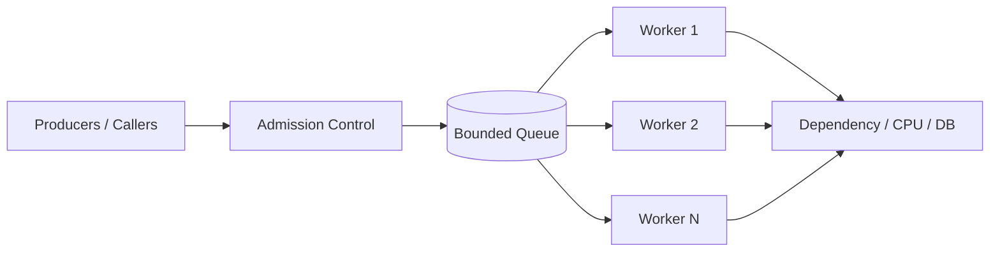
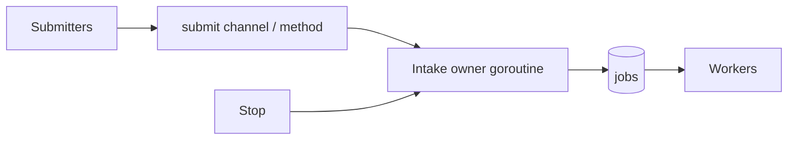
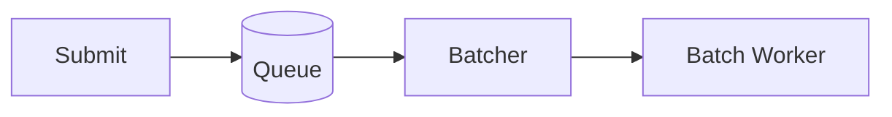
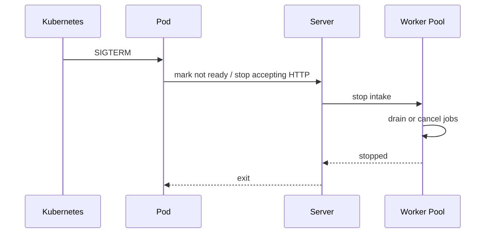

# learn-go-concurrency-parallelism-part-013.md

# Part 013 — Worker Pools: Bounded Concurrency, Queueing, Load Shedding, and Sizing

> Target pembaca: Java software engineer yang ingin memahami worker pool Go sebagai mekanisme **capacity governance**, bukan sekadar pattern “N goroutine baca dari channel”.
>
> Fokus part ini: worker pool design, bounded concurrency, queueing theory, backpressure, overload policy, sizing, lifecycle, graceful shutdown, panic containment, observability, and production failure modes.

---

## 0. Posisi Part Ini dalam Seri

Sebelumnya kita membangun:

- Part 001: work, time, state, ordering, contention.
- Part 008: channel sebagai backpressure/queue boundary.
- Part 009: `select` untuk cancellation/timeout.
- Part 010: task group dan structured concurrency.
- Part 011: context sebagai lifecycle contract.
- Part 012: ownership model.

Part ini membahas pola yang hampir selalu muncul dalam service production: **worker pool**.

Worker pool sering ditulis seperti ini:

```go
jobs := make(chan Job, 100)

for i := 0; i < 10; i++ {
    go func() {
        for job := range jobs {
            process(job)
        }
    }()
}
```

Itu bukan worker pool production-grade. Itu baru skeleton.

Production-grade worker pool harus menjawab:

1. Work apa yang diterima?
2. Berapa kapasitas queue?
3. Berapa jumlah worker?
4. Apa resource yang dibatasi?
5. Apa terjadi saat queue penuh?
6. Apakah submit blocking, timeout, atau fail-fast?
7. Bagaimana cancellation?
8. Bagaimana shutdown: cancel atau drain?
9. Bagaimana error diproses?
10. Bagaimana panic ditangani?
11. Bagaimana metrics?
12. Bagaimana mencegah retry storm?
13. Apakah fairness/per-tenant isolation dibutuhkan?
14. Apakah work masih valid saat keluar dari queue?
15. Apakah worker pool ini benar-benar solusi atau hanya menyembunyikan bottleneck?

---

## 1. Tujuan Pembelajaran

Setelah part ini, Anda harus mampu:

1. Mendesain worker pool dengan queue bounded dan lifecycle jelas.
2. Membedakan:
   - worker pool,
   - semaphore,
   - task group,
   - rate limiter,
   - executor,
   - durable queue,
   - goroutine-per-request.
3. Menentukan worker count berdasarkan workload:
   - CPU-bound,
   - I/O-bound,
   - downstream-bound,
   - DB-bound,
   - rate-limited dependency.
4. Mendesain submit policy:
   - block,
   - bounded wait,
   - fail-fast,
   - drop,
   - spill,
   - priority.
5. Menggunakan Little’s Law untuk reasoning queue depth dan latency.
6. Mencegah goroutine leak saat submit/worker/output blocked.
7. Mendesain shutdown:
   - stop intake,
   - drain,
   - cancel,
   - deadline.
8. Menambahkan observability:
   - queue depth,
   - active workers,
   - job age,
   - processing latency,
   - rejection count,
   - panic count.
9. Menghindari worker pool anti-pattern:
   - unbounded queue,
   - hidden backlog,
   - worker count asal,
   - blocking submit tanpa timeout,
   - swallowing error,
   - missing context,
   - worker panic death,
   - single global pool for unrelated workloads.
10. Membuat checklist review worker pool.

---

## 2. Mental Model: Worker Pool Adalah Capacity Boundary

Worker pool bukan hanya “cara menjalankan task paralel”.

Worker pool adalah **boundary** yang mengubah aliran work menjadi:



Di dalamnya ada tiga policy besar:

1. **Admission policy**
   - apakah job diterima?
   - kapan ditolak?
   - apakah caller menunggu?

2. **Scheduling policy**
   - worker mana memproses job?
   - FIFO?
   - priority?
   - per tenant?
   - per key ordering?

3. **Execution policy**
   - bagaimana job diproses?
   - timeout?
   - cancellation?
   - retry?
   - error?
   - panic?

Worker pool production-grade adalah explicit capacity governance.

---

## 3. Java Translation: ExecutorService vs Go Worker Pool

Java:

```java
ExecutorService executor = Executors.newFixedThreadPool(10);
executor.submit(() -> process(job));
```

Go:

```go
jobs := make(chan Job, 100)
for i := 0; i < 10; i++ {
    go worker(jobs)
}
```

Tetapi Java `ExecutorService` sering punya:
- lifecycle (`shutdown`, `awaitTermination`),
- task submission semantics,
- rejected execution policy,
- bounded/unbounded queue depending executor,
- thread factory,
- exception handling,
- monitoring hooks if wrapped.

Go tidak memberi “default executor” di standard library karena goroutine murah. Tetapi worker pool masih diperlukan untuk membatasi resource.

| Concern | Java Executor | Go Worker Pool |
|---|---|---|
| worker count | thread pool size | goroutine count |
| queue | BlockingQueue | channel/custom queue |
| rejection | RejectedExecutionHandler | explicit Submit policy |
| shutdown | shutdown/await | context/close/wait |
| cancellation | Future/cancel/interrupt | context |
| error | Future result/log | explicit result/error channel/callback |
| panic/exception | captured/logged depending executor | must recover intentionally |
| metrics | custom/wrapped executor | custom metrics |
| context propagation | MDC/ThreadLocal/manual | explicit context/job fields |

Go makes the lifecycle visible, but you must design it.

---

## 4. Worker Pool vs Semaphore vs ErrGroup vs Rate Limiter

A common design error is using worker pool for every concurrency problem.

| Problem | Better primitive |
|---|---|
| Limit active calls around one function | semaphore |
| Run N subtasks and wait result | errgroup with limit |
| Long-lived queue + workers | worker pool |
| Limit requests per second | rate limiter |
| Protect DB connection count | DB pool config |
| Per-request fan-out | errgroup |
| Background processing accepted jobs | worker pool/dispatcher |
| Durable async processing | message broker / DB queue |
| CPU parallel map | errgroup/parallel loop with limit |
| Per-key ordering | sharded worker/actor |

### 4.1 Semaphore Example

If caller should do the work after acquiring permit:

```go
if err := sem.Acquire(ctx); err != nil {
    return err
}
defer sem.Release()

return callDependency(ctx)
```

No separate worker needed.

### 4.2 Worker Pool Example

If work should be queued and processed by long-lived workers:

```go
if err := pool.Submit(ctx, job); err != nil {
    return err
}
```

Caller transfers work ownership to pool.

### 4.3 ErrGroup Example

If tasks are child work of current function:

```go
g, ctx := errgroup.WithContext(ctx)
g.SetLimit(8)

for _, item := range items {
    item := item
    g.Go(func() error {
        return process(ctx, item)
    })
}

return g.Wait()
```

No service-level worker pool needed.

---

## 5. Workload Classification

Before designing pool, classify workload.

### 5.1 CPU-Bound

Examples:
- compression,
- image processing,
- cryptographic hashing,
- JSON/XML heavy transformation,
- validation over large data,
- CPU-heavy simulation.

Constraint:
- CPU cores / `GOMAXPROCS`.

Worker count:
- near `GOMAXPROCS`,
- sometimes `GOMAXPROCS - reserve`,
- benchmark needed.

Too many workers:
- scheduler overhead,
- cache thrash,
- context switching,
- higher latency.

### 5.2 I/O-Bound

Examples:
- HTTP calls,
- DB queries,
- file/network IO,
- S3 object fetch,
- RPC calls.

Constraint:
- downstream latency,
- connection pools,
- remote rate limits,
- file descriptors,
- network bandwidth.

Worker count can exceed CPU count, but must be bounded by downstream capacity.

### 5.3 Downstream-Bound

Example:
- external API allows 100 concurrent requests or 300/minute.

Worker count should reflect:
- concurrency limit,
- rate limit,
- retry behavior,
- timeout,
- circuit breaker,
- per-tenant fairness.

### 5.4 DB-Bound

If DB pool max open conns = 20, worker count 200 just means 180 goroutines wait on DB pool.

Better:
- worker count aligned with DB capacity,
- per-query timeout,
- queue admission policy,
- DB pool metrics.

### 5.5 Mixed Workload

Often job includes:
- parse input,
- call DB,
- call external API,
- write result.

Single worker count may not match all resources. Consider:
- stages/pipeline,
- separate pools per dependency,
- semaphore around constrained dependency,
- avoid holding scarce resource while doing unrelated work.

---

## 6. Little’s Law for Worker Pool Reasoning

Little’s Law:

```text
L = λ × W
```

Where:
- `L` = average number of items in system,
- `λ` = arrival rate,
- `W` = average time in system.

For worker pool:
- arrivals per second,
- service time per job,
- queue wait time,
- active worker count,
- queue length.

Example:
- arrival rate: 100 jobs/sec,
- processing time: 200ms = 0.2s,
- required active workers just for service: `100 × 0.2 = 20`.

If you run 10 workers:
- capacity ≈ 10 / 0.2 = 50 jobs/sec,
- arrival 100 jobs/sec,
- queue grows without bound until rejected/timeout/OOM.

If you run 20 workers:
- average capacity matches arrival,
- but no headroom,
- p99 spikes create backlog.

If you run 40 workers:
- enough service capacity if downstream can handle it,
- but may overload DB/API.

Worker count is not “more is better”. Worker count must match bottleneck.

---

## 7. Queue Capacity Is Latency Policy

Queue capacity determines how much waiting you permit.

Suppose:
- 20 workers,
- average processing 200ms,
- capacity around 100 jobs/sec.
- queue capacity 1000.

If queue fills to 1000:
- approximate queue drain time: `1000 / 100 = 10s`.

If request SLA is 500ms, queue capacity 1000 is absurd unless jobs are background and can wait.

### 7.1 Queue Capacity Questions

1. Is job still useful after waiting?
2. What is max acceptable queue wait?
3. What is worker throughput?
4. What queue depth corresponds to max wait?
5. What happens when full?
6. Is queue depth observable?
7. Should old jobs expire?
8. Should high-priority jobs bypass low-priority ones?
9. Should tenants have separate queues?

### 7.2 Derive Capacity from Wait Budget

If:
- worker throughput = 200 jobs/sec,
- max queue wait = 250ms,

then capacity should be roughly:

```text
queue capacity ≈ 200 × 0.25 = 50 jobs
```

Add small burst allowance, but do not blindly set 100000.

---

## 8. Worker Pool API Design

A worker pool should usually be a type, not a raw channel.

Bad:

```go
var jobs = make(chan Job, 100)
```

Better:

```go
type Pool struct {
    jobs chan Job
    // lifecycle, metrics, config
}

func (p *Pool) Submit(ctx context.Context, job Job) error
func (p *Pool) Stop(ctx context.Context) error
func (p *Pool) Stats() Stats
```

### 8.1 Basic Types

```go
type Job struct {
    ID        string
    CreatedAt time.Time
    Payload   Payload
}

type Handler func(context.Context, Job) error

type Config struct {
    Workers       int
    QueueCapacity int
    SubmitTimeout time.Duration
}
```

### 8.2 Stats

```go
type Stats struct {
    QueueDepth      int
    QueueCapacity   int
    ActiveWorkers   int64
    SubmittedTotal  uint64
    AcceptedTotal   uint64
    RejectedTotal   uint64
    CompletedTotal  uint64
    FailedTotal     uint64
    PanickedTotal   uint64
    CancelledTotal  uint64
}
```

### 8.3 Errors

```go
var (
    ErrStopped   = errors.New("worker pool stopped")
    ErrQueueFull = errors.New("worker pool queue full")
)
```

---

## 9. Basic Worker Pool Skeleton

```go
type Pool struct {
    handler Handler

    jobs chan Job
    done chan struct{}

    stopOnce sync.Once
    wg       sync.WaitGroup

    active atomic.Int64

    submitted atomic.Uint64
    accepted  atomic.Uint64
    rejected  atomic.Uint64
    completed atomic.Uint64
    failed    atomic.Uint64
    panicked  atomic.Uint64
}

func NewPool(cfg Config, handler Handler) (*Pool, error) {
    if cfg.Workers <= 0 {
        return nil, fmt.Errorf("workers must be > 0")
    }
    if cfg.QueueCapacity < 0 {
        return nil, fmt.Errorf("queue capacity must be >= 0")
    }
    if handler == nil {
        return nil, fmt.Errorf("handler is nil")
    }

    p := &Pool{
        handler: handler,
        jobs:    make(chan Job, cfg.QueueCapacity),
        done:    make(chan struct{}),
    }

    for i := 0; i < cfg.Workers; i++ {
        workerID := i
        p.wg.Go(func() {
            p.worker(workerID)
        })
    }

    return p, nil
}
```

Worker:

```go
func (p *Pool) worker(id int) {
    for {
        select {
        case <-p.done:
            return

        case job, ok := <-p.jobs:
            if !ok {
                return
            }

            p.runJob(job)
        }
    }
}
```

Run job:

```go
func (p *Pool) runJob(job Job) {
    p.active.Add(1)
    defer p.active.Add(-1)

    defer func() {
        if r := recover(); r != nil {
            p.panicked.Add(1)
            // log panic with stack in real code
        }
    }()

    ctx := context.Background()
    if err := p.handler(ctx, job); err != nil {
        p.failed.Add(1)
        return
    }

    p.completed.Add(1)
}
```

This is still incomplete:
- handler context should be service lifecycle or job deadline,
- stop semantics unclear,
- Submit not implemented,
- errors not surfaced,
- panic policy simplistic,
- no queue wait time metrics.

We will refine.

---

## 10. Submit Policies

### 10.1 Blocking Submit

```go
func (p *Pool) Submit(ctx context.Context, job Job) error {
    p.submitted.Add(1)

    select {
    case p.jobs <- job:
        p.accepted.Add(1)
        return nil

    case <-p.done:
        p.rejected.Add(1)
        return ErrStopped

    case <-ctx.Done():
        p.rejected.Add(1)
        return ctx.Err()
    }
}
```

Properties:
- caller blocks until queue has room,
- backpressure to caller,
- no hidden unbounded queue,
- caller cancellation works.

Risk:
- request goroutine pile-up under overload,
- caller may wait too long if ctx has long deadline,
- can increase tail latency.

### 10.2 Fail-Fast Submit

```go
func (p *Pool) TrySubmit(job Job) error {
    p.submitted.Add(1)

    select {
    case p.jobs <- job:
        p.accepted.Add(1)
        return nil

    case <-p.done:
        p.rejected.Add(1)
        return ErrStopped

    default:
        p.rejected.Add(1)
        return ErrQueueFull
    }
}
```

Properties:
- immediate overload signal,
- good for HTTP 429/503,
- prevents request pile-up,
- loses work unless caller retries or handles failure.

### 10.3 Bounded Wait Submit

```go
func (p *Pool) SubmitWait(ctx context.Context, job Job, maxWait time.Duration) error {
    p.submitted.Add(1)

    timer := time.NewTimer(maxWait)
    defer timer.Stop()

    select {
    case p.jobs <- job:
        p.accepted.Add(1)
        return nil

    case <-p.done:
        p.rejected.Add(1)
        return ErrStopped

    case <-ctx.Done():
        p.rejected.Add(1)
        return ctx.Err()

    case <-timer.C:
        p.rejected.Add(1)
        return ErrQueueFull
    }
}
```

Properties:
- absorbs short bursts,
- bounds queue wait at admission,
- good default for request path.

### 10.4 Policy Decision

| Policy | Use when |
|---|---|
| blocking | caller can wait and has meaningful ctx deadline |
| fail-fast | service must shed load quickly |
| bounded wait | absorb small bursts but avoid pile-up |
| drop | telemetry/lossy events |
| durable spill | jobs must not be lost |
| priority | different classes of work |
| per-tenant queues | isolation required |

---

## 11. Stop Semantics: Cancel vs Drain

Worker pool shutdown is hard because there are two different semantics.

### 11.1 Cancel Stop

Stop quickly:
- stop workers,
- queued jobs may be abandoned,
- in-flight jobs should observe context if possible.

```go
func (p *Pool) StopCancel(ctx context.Context) error {
    p.stopOnce.Do(func() {
        close(p.done)
    })

    stopped := make(chan struct{})
    go func() {
        p.wg.Wait()
        close(stopped)
    }()

    select {
    case <-stopped:
        return nil
    case <-ctx.Done():
        return ctx.Err()
    }
}
```

Problem:
- if handler ignores cancellation, stop waits.
- our current handler context is Background, so cancel does not reach it.
- fix with service context.

### 11.2 Drain Stop

Stop accepting new work, process queued work, then stop.

Naive:

```go
close(p.jobs)
p.wg.Wait()
```

Danger:
- submitters may still send → panic.
- close must happen only after no more submitters.

A drain-capable pool needs intake state.

---

## 12. Drain-Capable Pool Design

We need:
- stop accepting new submissions,
- wait active submitters to exit,
- close jobs,
- workers range until jobs drained,
- wait workers,
- bound by ctx deadline.

Use mutex state + submitters WaitGroup? But `WaitGroup` with Add during Stop can be tricky. Simpler: guard submit with mutex and closed flag, but do not block while holding mutex.

However if you release mutex before sending, Stop can close jobs before send. Need a protocol.

One approach:
- never close jobs directly while Submit can send,
- submit sends through an intake goroutine that owns closing jobs.

Another approach:
- use a `submitMu` held during send and Stop close. But blocking send while holding submitMu can make Stop wait for queue room. That may be acceptable only if Submit has bounded wait and close needs coordination.

Simpler production architecture:



But this adds complexity.

For this part, define two pool types:
- cancel pool: simpler, does not drain queue.
- drain pool: explicit dispatcher/intake owner.

### 12.1 Cancel Pool Is Often Enough

For request-scoped/lossy/background refresh:
- cancel stop is acceptable.

For must-process jobs:
- worker pool with in-memory channel is not enough; use durable queue.

### 12.2 Drain Requires Stronger Contract

If you say drain, you must define:
- no new submissions after stop starts,
- accepted jobs processed exactly once or reported failed,
- deadline behavior,
- what happens to in-flight on timeout,
- whether process crash loses jobs.

If exact processing matters across crash, use durable storage/message broker.

---

## 13. Service Context for Workers

A pool should have service lifecycle context.

```go
type Pool struct {
    ctx    context.Context
    cancel context.CancelFunc

    handler Handler
    jobs    chan Job
    done    chan struct{}

    stopOnce sync.Once
    wg       sync.WaitGroup
}
```

Constructor:

```go
func NewPool(parent context.Context, cfg Config, handler Handler) (*Pool, error) {
    ctx, cancel := context.WithCancel(parent)

    p := &Pool{
        ctx:     ctx,
        cancel:  cancel,
        handler: handler,
        jobs:    make(chan Job, cfg.QueueCapacity),
        done:    make(chan struct{}),
    }

    for i := 0; i < cfg.Workers; i++ {
        workerID := i
        p.wg.Go(func() {
            p.worker(workerID)
        })
    }

    return p, nil
}
```

Worker:

```go
func (p *Pool) worker(id int) {
    for {
        select {
        case <-p.ctx.Done():
            return

        case job, ok := <-p.jobs:
            if !ok {
                return
            }

            p.runJob(job)
        }
    }
}
```

Stop:

```go
func (p *Pool) Stop(ctx context.Context) error {
    p.stopOnce.Do(func() {
        p.cancel()
        close(p.done)
    })

    stopped := make(chan struct{})
    go func() {
        p.wg.Wait()
        close(stopped)
    }()

    select {
    case <-stopped:
        return nil
    case <-ctx.Done():
        return ctx.Err()
    }
}
```

Submit:

```go
func (p *Pool) Submit(ctx context.Context, job Job) error {
    p.submitted.Add(1)

    select {
    case p.jobs <- job:
        p.accepted.Add(1)
        return nil

    case <-p.done:
        p.rejected.Add(1)
        return ErrStopped

    case <-ctx.Done():
        p.rejected.Add(1)
        return ctx.Err()
    }
}
```

Potential issue:
- after `p.cancel()` but before `done` selected, `Submit` could still send to `jobs` if ready.
- close `done` is immediate after cancel in same Stop, but select race can accept job concurrently.

If strict “no accept after Stop begins” is required, need state lock or owner goroutine. If best-effort is acceptable, document.

Better Submit with atomic stopped flag:

```go
type Pool struct {
    stopped atomic.Bool
    // ...
}

func (p *Pool) Submit(ctx context.Context, job Job) error {
    if p.stopped.Load() {
        p.rejected.Add(1)
        return ErrStopped
    }

    p.submitted.Add(1)

    select {
    case p.jobs <- job:
        if p.stopped.Load() {
            // Job accepted concurrently with stop.
            // Decide if acceptable. If not, this design is insufficient.
        }
        p.accepted.Add(1)
        return nil

    case <-p.done:
        p.rejected.Add(1)
        return ErrStopped

    case <-ctx.Done():
        p.rejected.Add(1)
        return ctx.Err()
    }
}
```

This reveals a deeper truth:

> Strict stop/admission semantics require serialized admission ownership.

For many pools, best-effort stop is fine. For compliance/financial job acceptance, use stronger design.

---

## 14. Job Context: Admission vs Processing

Do not blindly store caller context in job.

### 14.1 Admission Context

`Submit(ctx, job)` means:
- caller waits until job accepted,
- if caller cancels before acceptance, submit fails,
- after acceptance, pool owns job.

### 14.2 Processing Context

Worker should use:
- pool service context,
- job-specific deadline,
- possibly explicit cancellation token if job tied to caller.

Example:

```go
type Job struct {
    ID        string
    CreatedAt time.Time
    Deadline  time.Time
    Payload   Payload
}
```

Run:

```go
func (p *Pool) runJob(job Job) {
    ctx := p.ctx

    if !job.Deadline.IsZero() {
        var cancel context.CancelFunc
        ctx, cancel = context.WithDeadline(p.ctx, job.Deadline)
        defer cancel()
    }

    err := p.handler(ctx, job)
    // record err
}
```

### 14.3 When to Store Caller Context

Store context only if:
- job must be cancelled when caller cancels,
- job is request-scoped,
- job will not outlive request,
- context values are needed and safe.

For background jobs, store explicit metadata instead:
- request ID,
- user ID,
- tenant ID,
- deadline,
- priority,
- idempotency key.

---

## 15. Job Age and Expiration

Queued jobs can become stale.

Add:

```go
type Job struct {
    ID        string
    CreatedAt time.Time
    MaxAge    time.Duration
    Payload   Payload
}
```

Worker:

```go
func (p *Pool) runJob(job Job) {
    if job.MaxAge > 0 && time.Since(job.CreatedAt) > job.MaxAge {
        p.expired.Add(1)
        return
    }

    // process
}
```

Metrics:
- queue wait duration,
- expired jobs,
- oldest queued job age.

If many jobs expire after waiting, queue capacity/admission is wrong.

---

## 16. Panic Containment

If worker panics and exits:
- pool capacity decreases,
- queue backs up,
- service degrades silently if not observed.

Basic recover:

```go
func (p *Pool) worker(id int) {
    defer func() {
        if r := recover(); r != nil {
            p.panicked.Add(1)
            // log stack
        }
    }()

    for {
        select {
        case <-p.ctx.Done():
            return

        case job := <-p.jobs:
            p.runJob(job)
        }
    }
}
```

Problem:
- after panic, worker exits permanently.

Option: recover per job:

```go
func (p *Pool) runJob(job Job) {
    p.active.Add(1)
    defer p.active.Add(-1)

    defer func() {
        if r := recover(); r != nil {
            p.panicked.Add(1)
            // log panic + job id + stack
        }
    }()

    if err := p.handler(p.ctx, job); err != nil {
        p.failed.Add(1)
        return
    }

    p.completed.Add(1)
}
```

Now worker loop continues.

But panic may indicate corrupted shared state. Policy must be explicit:
- recover and continue,
- recover and stop pool,
- crash process,
- quarantine job,
- mark dependency unhealthy.

---

## 17. Error Handling Policy

Worker handler returns error. What happens?

Options:

| Policy | Use case |
|---|---|
| log and continue | best-effort jobs |
| retry in worker | transient downstream |
| send to error channel | supervisor handles |
| dead-letter queue | durable jobs |
| stop pool on first error | critical invariant |
| mark job failed | batch/reporting |

### 17.1 Error Channel

```go
type JobError struct {
    JobID string
    Err   error
}

type Pool struct {
    errors chan JobError
}
```

In run:

```go
if err := p.handler(ctx, job); err != nil {
    p.failed.Add(1)

    select {
    case p.errors <- JobError{JobID: job.ID, Err: err}:
    default:
        p.droppedErrors.Add(1)
    }

    return
}
```

Do not block worker forever reporting error. Use bounded channel and metrics.

### 17.2 Retry

Retry belongs to execution policy.

Bad:
- infinite retry inside worker,
- no context,
- no backoff,
- all workers stuck retrying same dependency.

Better:
- max attempts,
- context-aware backoff,
- classify error,
- jitter,
- circuit breaker,
- DLQ after exhausted.

```go
func retry(ctx context.Context, attempts int, fn func(context.Context) error) error {
    var last error

    for i := 0; i < attempts; i++ {
        if err := fn(ctx); err != nil {
            last = err
        } else {
            return nil
        }

        delay := time.Duration(1<<i) * 100 * time.Millisecond
        timer := time.NewTimer(delay)

        select {
        case <-timer.C:
        case <-ctx.Done():
            timer.Stop()
            return ctx.Err()
        }
    }

    return last
}
```

---

## 18. Worker Count Sizing

### 18.1 CPU-Bound

Start:

```text
workers ≈ GOMAXPROCS
```

Then benchmark.

If each job allocates heavily, GC may become bottleneck. More workers can worsen GC pressure.

### 18.2 I/O-Bound

Approximate:

```text
workers ≈ target_throughput × average_latency
```

Example:
- target 500 jobs/sec,
- API call avg 100ms = 0.1s,
- active concurrency needed = 50.

But check:
- remote API concurrency limit,
- rate limit,
- connection pool,
- p99 latency,
- retry amplification.

### 18.3 DB-Bound

If DB max open conns = 30:
- worker count > 30 may be okay if not all jobs use DB simultaneously,
- but if every job blocks on DB, 30–40 is enough,
- extra workers just wait.

### 18.4 External Rate Limit

If API allows 300/min = 5/sec, worker count does not solve rate limit.
Use rate limiter.

```text
worker count controls concurrency
rate limiter controls rate
```

You may need both:
- 20 workers,
- 5 req/sec limiter,
- queue capacity 50,
- fail-fast when backlog too high.

### 18.5 Dynamic Sizing

Dynamic workers can help but add complexity:
- scale up on queue depth,
- scale down idle workers,
- avoid oscillation,
- respect resource limits.

Usually:
- static worker count + good admission policy is better first version.
- tune with metrics.

---

## 19. Queue Type: Channel vs Custom Queue

Channel is good for simple FIFO bounded queue.

Limitations:
- no priority,
- no remove expired item before receive,
- no inspect oldest timestamp easily,
- no per-tenant fairness,
- no dynamic resize,
- no durable persistence,
- no multi-condition scheduling.

Use custom queue if:
- priority required,
- deadline/age scheduling,
- tenant isolation,
- drop oldest,
- pause/resume,
- batch dequeue,
- draining semantics complex.

Custom queue likely uses:
- `sync.Mutex`,
- `sync.Cond`,
- heap/list/ring,
- explicit state.

Do not force channel if queue policy is more complex than FIFO.

---

## 20. Load Shedding

Worker pool must define overload behavior.

### 20.1 Fail Fast

```go
select {
case jobs <- job:
    return nil
default:
    return ErrQueueFull
}
```

HTTP mapping:
- `429 Too Many Requests` if caller may retry later,
- `503 Service Unavailable` if service overloaded.

gRPC mapping:
- `ResourceExhausted`,
- `Unavailable`.

### 20.2 Drop

For telemetry:

```go
select {
case telemetry <- event:
default:
    dropped.Add(1)
}
```

Only for lossy data.

### 20.3 Degrade

Instead of queueing expensive job:
- return cached response,
- skip optional feature,
- lower quality,
- async fallback.

### 20.4 Spill to Durable Queue

If must process:
- write to DB/message broker,
- return accepted after durable write,
- workers consume durable queue.

In-memory worker pool is not reliability boundary.

---

## 21. Backpressure End-to-End

A bounded queue is only useful if backpressure propagates.

Bad:

```go
func handler(w http.ResponseWriter, r *http.Request) {
    go func() {
        _ = pool.Submit(context.Background(), job)
    }()
    w.WriteHeader(http.StatusAccepted)
}
```

This hides backpressure and creates goroutine leak risk.

Better:

```go
func handler(w http.ResponseWriter, r *http.Request) {
    err := pool.SubmitWait(r.Context(), job, 50*time.Millisecond)
    if err != nil {
        if errors.Is(err, ErrQueueFull) {
            http.Error(w, "busy", http.StatusTooManyRequests)
            return
        }
        if errors.Is(err, context.Canceled) {
            return
        }
        http.Error(w, "unavailable", http.StatusServiceUnavailable)
        return
    }

    w.WriteHeader(http.StatusAccepted)
}
```

Backpressure must reach caller/load balancer/client.

---

## 22. Per-Tenant and Per-Priority Isolation

Single global pool:

```text
all tenants -> one queue -> workers
```

Problem:
- one noisy tenant fills queue,
- high priority work stuck behind low priority work,
- admin/system jobs starve.

Options:
1. separate pools per class,
2. per-tenant queue limits,
3. weighted fair scheduler,
4. priority queue,
5. admission control before queue,
6. sharded workers by tenant/key.

### 22.1 Separate Pools

```go
criticalPool
normalPool
backgroundPool
```

Simple, strong isolation, more resources.

### 22.2 Per-Tenant Limit

Track per-tenant queued/active count.

```go
if tenantQueued[tenant] >= maxPerTenant {
    return ErrTenantOverLimit
}
```

Needs custom admission state with mutex.

### 22.3 Priority Queue

Use custom heap, not simple channel.

---

## 23. Ordering Requirements

Worker pool with multiple workers does not preserve global processing order.

If jobs A, B sent in order:
- worker 1 may process A slowly,
- worker 2 processes B quickly,
- completion order B before A.

If order matters:
- use one worker,
- partition by key,
- sequence/reorder,
- actor per key,
- state machine owner.

### 23.1 Per-Key Ordering

Use shard by key:

```go
shard := hash(job.Key) % len(shards)
shards[shard].Submit(ctx, job)
```

Each shard has one worker or ordered queue.

Trade-off:
- key order preserved,
- hot key bottleneck,
- shard skew.

---

## 24. Batch Processing

Workers can process one job at a time or batches.

Batching helps when:
- downstream supports batch API,
- DB insert bulk,
- amortize overhead,
- reduce lock contention.

Batcher in front of workers:



Batch policy:
- max batch size,
- max wait time,
- flush on shutdown,
- item deadline,
- partial failure handling.

Simple worker-side batching:

```go
func batchWorker(ctx context.Context, jobs <-chan Job, max int, interval time.Duration) {
    ticker := time.NewTicker(interval)
    defer ticker.Stop()

    batch := make([]Job, 0, max)

    flush := func() {
        if len(batch) == 0 {
            return
        }
        processBatch(ctx, batch)
        batch = batch[:0]
    }

    for {
        select {
        case <-ctx.Done():
            flush()
            return

        case job, ok := <-jobs:
            if !ok {
                flush()
                return
            }

            batch = append(batch, job)
            if len(batch) >= max {
                flush()
            }

        case <-ticker.C:
            flush()
        }
    }
}
```

Caution:
- `flush` under cancelled ctx may fail immediately.
- use shutdown/drain context deliberately.

---

## 25. Output Handling

Worker pool may produce results.

Options:
1. job includes reply channel,
2. pool has result channel,
3. handler callback,
4. persist result externally,
5. no result.

### 25.1 Reply Channel

```go
type Job struct {
    Payload Payload
    Reply   chan Result
}
```

Use buffered reply channel if submitter may timeout:

```go
reply := make(chan Result, 1)
```

Worker:

```go
select {
case job.Reply <- result:
case <-ctx.Done():
}
```

### 25.2 Shared Result Channel

```go
results := make(chan Result, 100)
```

Need:
- who closes results?
- what if receiver slow?
- do workers block?
- cancellation?
- result ordering?

### 25.3 Callback

```go
type Job struct {
    Payload Payload
    OnDone  func(Result)
}
```

Danger:
- callback can block/panic,
- executes in worker,
- can hold worker hostage.

Wrap callback with recover/timeout or avoid for untrusted code.

---

## 26. Worker Pool and DB Pool Collapse

Common failure:

```text
HTTP requests -> worker pool queue -> 100 workers -> DB max conns 20 -> 80 workers blocked -> queue grows -> HTTP waits -> retry storm
```

Fix:
- DB pool sized intentionally,
- worker count aligned,
- semaphore around DB if job also does non-DB work,
- short DB transactions,
- context timeouts,
- admission control,
- monitor DB wait count/duration.

Worker pool does not replace DB pool. It should cooperate with it.

---

## 27. Worker Pool and Retry Storm

If every failed job retries immediately inside worker:
- workers occupied by retries,
- new jobs starve,
- downstream gets hammered,
- queue grows,
- more timeouts,
- more retries.

Retry policy:
- classify retryable,
- exponential backoff with jitter,
- max attempts,
- respect context/deadline,
- circuit breaker,
- rate limit,
- DLQ,
- avoid retrying after job expired.

---

## 28. Worker Pool and Kubernetes

Kubernetes realities:
- CPU limit throttling,
- memory limit OOM,
- pod termination grace period,
- readiness/liveness probes,
- autoscaling signals.

Worker pool should:
- stop accepting when not ready,
- drain/cancel on SIGTERM,
- expose queue depth/latency,
- not hide overload until OOM,
- consider CPU quota with worker count,
- use deadlines shorter than termination grace period.

Shutdown:



---

## 29. Observability

Minimum metrics:

### Queue
- queue depth,
- queue capacity,
- oldest job age,
- enqueue latency,
- accepted/rejected count.

### Workers
- worker count,
- active workers,
- idle workers,
- worker panic count,
- worker restarts,
- processing duration.

### Jobs
- completed count,
- failed count,
- expired count,
- cancelled count,
- retry count,
- job age at start,
- job age at completion.

### Overload
- queue full count,
- submit timeout count,
- load shed count,
- per-tenant rejection,
- downstream timeout.

### Shutdown
- stop duration,
- jobs abandoned,
- jobs drained,
- shutdown timeout.

### Go Runtime
- goroutine count,
- heap,
- GC pause/overhead,
- scheduler latency,
- block profile,
- mutex profile if custom queue.

---

## 30. Instrumented Pool Sketch

```go
func (p *Pool) Stats() Stats {
    return Stats{
        QueueDepth:     len(p.jobs),
        QueueCapacity:  cap(p.jobs),
        ActiveWorkers:  p.active.Load(),
        SubmittedTotal: p.submitted.Load(),
        AcceptedTotal:  p.accepted.Load(),
        RejectedTotal:  p.rejected.Load(),
        CompletedTotal: p.completed.Load(),
        FailedTotal:    p.failed.Load(),
        PanickedTotal:  p.panicked.Load(),
    }
}
```

For latency:
- record `job.CreatedAt`,
- measure time at worker start,
- measure handler duration.

```go
func (p *Pool) runJob(job Job) {
    queueWait := time.Since(job.CreatedAt)
    p.observeQueueWait(queueWait)

    start := time.Now()
    defer func() {
        p.observeProcessingDuration(time.Since(start))
    }()

    // handler...
}
```

Metrics implementation can use Prometheus/OpenTelemetry/stats library, but the model is independent.

---

## 31. Testing Worker Pools

### 31.1 Test Submit Accepted

```go
func TestSubmitAccepted(t *testing.T) {
    processed := make(chan Job, 1)

    pool, err := NewPool(context.Background(), Config{
        Workers:       1,
        QueueCapacity: 1,
    }, func(ctx context.Context, job Job) error {
        processed <- job
        return nil
    })
    if err != nil {
        t.Fatal(err)
    }
    defer pool.Stop(context.Background())

    job := Job{ID: "1", CreatedAt: time.Now()}
    if err := pool.Submit(context.Background(), job); err != nil {
        t.Fatal(err)
    }

    select {
    case got := <-processed:
        if got.ID != job.ID {
            t.Fatalf("got %s", got.ID)
        }
    case <-time.After(time.Second):
        t.Fatal("job not processed")
    }
}
```

### 31.2 Test Queue Full

Use worker blocked on channel.

```go
func TestQueueFull(t *testing.T) {
    block := make(chan struct{})

    pool, _ := NewPool(context.Background(), Config{
        Workers:       1,
        QueueCapacity: 1,
    }, func(ctx context.Context, job Job) error {
        <-block
        return nil
    })
    defer close(block)
    defer pool.Stop(context.Background())

    _ = pool.Submit(context.Background(), Job{ID: "active", CreatedAt: time.Now()})
    _ = pool.Submit(context.Background(), Job{ID: "queued", CreatedAt: time.Now()})

    err := pool.TrySubmit(Job{ID: "rejected", CreatedAt: time.Now()})
    if !errors.Is(err, ErrQueueFull) {
        t.Fatalf("expected ErrQueueFull, got %v", err)
    }
}
```

### 31.3 Test Stop

```go
func TestStopReturns(t *testing.T) {
    pool, _ := NewPool(context.Background(), Config{
        Workers:       1,
        QueueCapacity: 1,
    }, func(ctx context.Context, job Job) error {
        return nil
    })

    ctx, cancel := context.WithTimeout(context.Background(), time.Second)
    defer cancel()

    if err := pool.Stop(ctx); err != nil {
        t.Fatal(err)
    }
}
```

### 31.4 Race Test

Run:

```bash
go test -race ./...
```

### 31.5 Stress Test

Focus:
- concurrent submit,
- stop while submit,
- panic jobs,
- slow handler,
- queue full,
- context cancellation,
- repeated start/stop if supported.

---

## 32. Anti-Pattern Catalog

### 32.1 Unbounded Queue

```go
jobs := make(chan Job, 1_000_000)
```

This is not reliability. It is delayed failure.

### 32.2 Worker Count Equals Random Number

```go
workers := 100
```

Without relation to CPU/downstream/DB capacity.

### 32.3 Blocking Submit Without Timeout in HTTP Path

```go
pool.Submit(context.Background(), job)
```

Can hang request and ignore client cancellation.

### 32.4 Swallowing Errors

```go
_ = handler(job)
```

No metrics, no retry, no DLQ.

### 32.5 Panic Kills Worker

No recover/metrics.

### 32.6 One Global Pool

All workloads compete:
- email,
- payment,
- report,
- audit,
- cache refresh.

Separate by resource/priority.

### 32.7 Worker Does Slow IO While Holding Lock

Can freeze pool.

### 32.8 Retrying Forever

Workers never free up.

### 32.9 Queue as Distributed Reliability

In-memory queue loses jobs on crash.

### 32.10 Stop by Closing Job Channel While Submitters Active

Send-on-closed panic.

### 32.11 Missing Job Expiration

Stale jobs processed after SLA irrelevant.

### 32.12 No Metrics

Incident becomes guesswork.

---

## 33. Design Review Checklist

For every worker pool:

1. What resource is bounded?
2. Why worker count = N?
3. What is queue capacity and why?
4. What is max acceptable queue wait?
5. What happens when queue full?
6. Is Submit blocking, fail-fast, or bounded wait?
7. Does Submit use caller context?
8. Does processing use service context or job context?
9. Can job expire?
10. Are jobs idempotent?
11. Is retry policy bounded?
12. Are downstream limits respected?
13. Is DB pool considered?
14. Is rate limit considered?
15. Is worker panic handled?
16. Are errors surfaced?
17. Are metrics emitted?
18. Is queue depth observable?
19. Is oldest job age observable?
20. Is shutdown cancel or drain?
21. Is Stop idempotent?
22. Does Stop have deadline?
23. Can Submit race with Stop?
24. Can job channel be closed safely?
25. Is ordering required?
26. Is per-key ordering required?
27. Is per-tenant isolation required?
28. Is priority required?
29. Is channel sufficient or custom queue needed?
30. Is durable queue required instead of in-memory queue?
31. Can worker block forever?
32. Does handler respect context?
33. Are tests covering full queue?
34. Are tests covering stop while submit?
35. Are tests run with race detector?

---

## 34. Mini Lab 1: Basic Bounded Pool

Implement:

```go
type Pool struct {
    // ...
}

func NewPool(parent context.Context, cfg Config, handler Handler) (*Pool, error)
func (p *Pool) Submit(ctx context.Context, job Job) error
func (p *Pool) TrySubmit(job Job) error
func (p *Pool) Stop(ctx context.Context) error
func (p *Pool) Stats() Stats
```

Requirements:
- bounded queue,
- fixed workers,
- context-aware submit,
- fail-fast submit,
- cancel stop,
- panic per job recovered,
- metrics counters,
- tests with race detector.

---

## 35. Mini Lab 2: Bounded Wait Submit

Add:

```go
func (p *Pool) SubmitWait(ctx context.Context, job Job, maxWait time.Duration) error
```

Requirements:
- accept if queue has space before maxWait,
- return `ErrQueueFull` on timeout,
- return `ctx.Err()` if caller cancels,
- return `ErrStopped` if stopped,
- no timer leak,
- test deterministic full queue.

---

## 36. Mini Lab 3: Job Expiration

Add:
- `CreatedAt`,
- `MaxAge`.

Worker skips expired jobs.

Metrics:
- expired count,
- queue wait histogram.

Questions:
- Should expired job count as failed?
- Should expiration happen at submit or worker start?
- What if job expires during processing?
- Should handler receive deadline?

---

## 37. Mini Lab 4: Per-Tenant Admission

Add tenant ID:
```go
type Job struct {
    TenantID string
    // ...
}
```

Requirement:
- max queued+active per tenant,
- reject tenant over limit,
- global queue still bounded,
- counters per tenant.

Think:
- Need mutex state?
- When decrement active?
- What happens on panic?
- How to expose metrics without cardinality explosion?

---

## 38. Mini Lab 5: Drain Shutdown

Design a drain-capable pool.

Requirements:
- Stop accepting new jobs.
- Accepted jobs processed before shutdown.
- Submit after stop returns `ErrStopped`.
- No send-on-closed panic.
- Stop bounded by context deadline.
- If deadline exceeded, cancel in-flight.
- Tests cover concurrent Submit and Stop.

Hint:
- Consider single admission owner goroutine.
- Or use mutex + condition carefully.
- Or admit that durable queue is better for exact processing.

---

## 39. Mini Lab 6: Worker Pool vs Semaphore

Implement the same downstream call limit using:
1. worker pool,
2. semaphore around direct call,
3. errgroup with SetLimit.

Compare:
- latency,
- code complexity,
- backpressure,
- cancellation,
- error propagation,
- observability,
- fit for request-scope vs service-scope.

---

## 40. Top 1% Heuristics

1. Worker pool is a capacity boundary, not a performance decoration.
2. Queue capacity is latency policy.
3. Worker count must map to a bottleneck.
4. If queue can grow faster than workers drain, overload policy must trigger.
5. In-memory queue is not durability.
6. Blocking Submit without caller context is a leak vector.
7. Retry inside worker can amplify outages.
8. One global pool couples unrelated workloads.
9. Panic policy must be explicit.
10. Stop semantics must say cancel or drain.
11. Strict Stop/Submit semantics require serialized admission.
12. Measure queue age, not only queue depth.
13. Worker pools should protect dependencies, not overload them faster.
14. If ordering matters, normal multi-worker pool is wrong.
15. If fairness matters, channel FIFO alone is not enough.

---

## 41. Source Notes

Primary concepts behind this part:

1. Go channel semantics:
   - bounded buffered channels,
   - blocking send/receive,
   - close ownership.

2. Go `context`:
   - cancellation-aware admission and processing.

3. Go `sync.WaitGroup`:
   - worker lifecycle and wait.

4. Go scheduler/runtime:
   - goroutines are cheap, but blocked/queued work still consumes memory and lifecycle complexity.

5. Queueing theory:
   - Little’s Law for throughput/latency/backlog reasoning.

6. Production reliability patterns:
   - backpressure,
   - load shedding,
   - bounded queues,
   - bulkheads,
   - graceful shutdown.

---

## 42. Summary

A worker pool should not be introduced because “goroutines need pooling”. Goroutines are cheap.

A worker pool is introduced because **something else is not cheap**:

- CPU,
- DB connections,
- downstream API capacity,
- file descriptors,
- memory,
- tenant fairness,
- operational predictability.

The basic worker pool is easy. The correct worker pool is a small concurrency subsystem.

A production-ready worker pool must define:
- admission,
- queue capacity,
- worker count,
- context propagation,
- overload behavior,
- error policy,
- panic policy,
- shutdown semantics,
- observability,
- testing strategy.

If you cannot explain what happens when the queue is full, the worker pool is not designed yet.

---

## 43. Status Seri

Selesai:
- Part 000 — Orientation
- Part 001 — Foundations
- Part 002 — Goroutine Internals
- Part 003 — Go Scheduler Deep Dive
- Part 004 — GOMAXPROCS, CPU Quotas, Containers
- Part 005 — Go Memory Model
- Part 006 — Synchronization Primitives
- Part 007 — Atomic Operations
- Part 008 — Channels Deep Dive
- Part 009 — Select Semantics
- Part 010 — WaitGroup, ErrGroup, Task Groups, and Structured Concurrency
- Part 011 — Context as Concurrency Contract
- Part 012 — Ownership Models
- Part 013 — Worker Pools

Belum selesai:
- Part 014 sampai Part 034.

Seri belum mencapai bagian terakhir.


<!-- NAVIGATION_FOOTER -->
<div class="page-nav">
<a href="./learn-go-concurrency-parallelism-part-012.md">⬅️ Part 012 — Ownership Models: Share Memory by Communicating vs Communicate by Sharing Memory</a>
<a href="./index.md">📚 Kategori</a>
<a href="../../index.md">🏠 Home</a>
<a href="./learn-go-concurrency-parallelism-part-014.md">Part 014 — Fan-Out/Fan-In, Pipelines, Stages, and Stream Processing ➡️</a>
</div>
