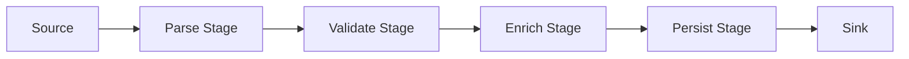
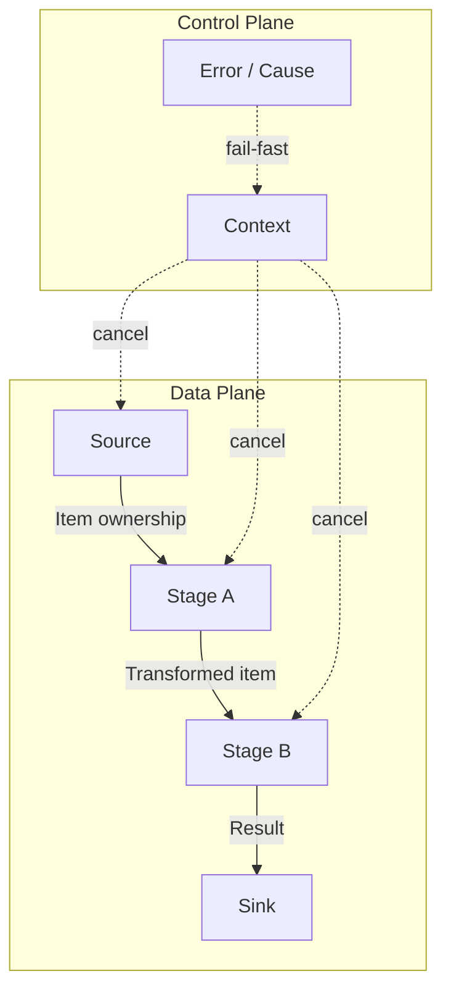
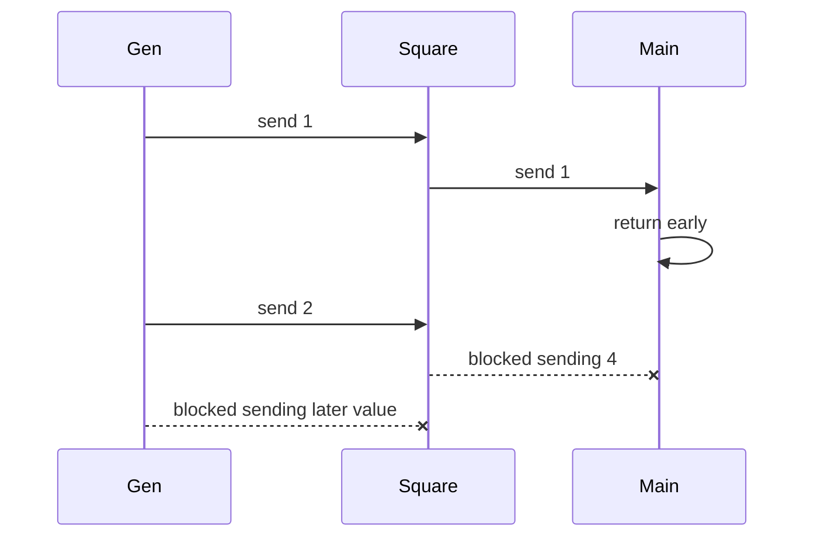
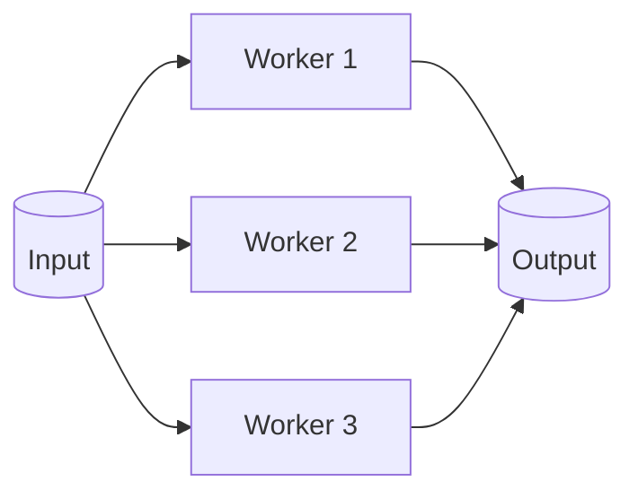
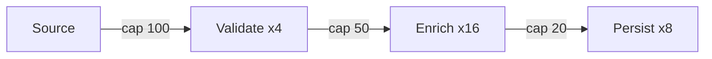
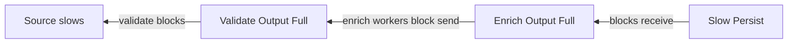
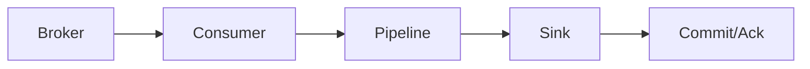
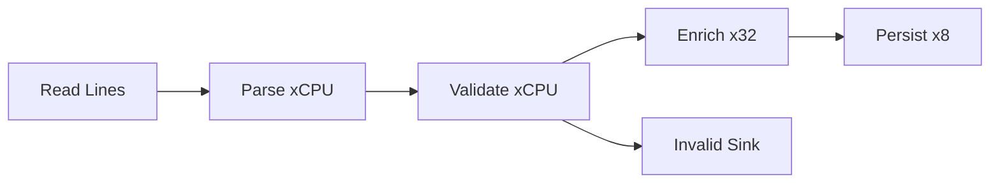
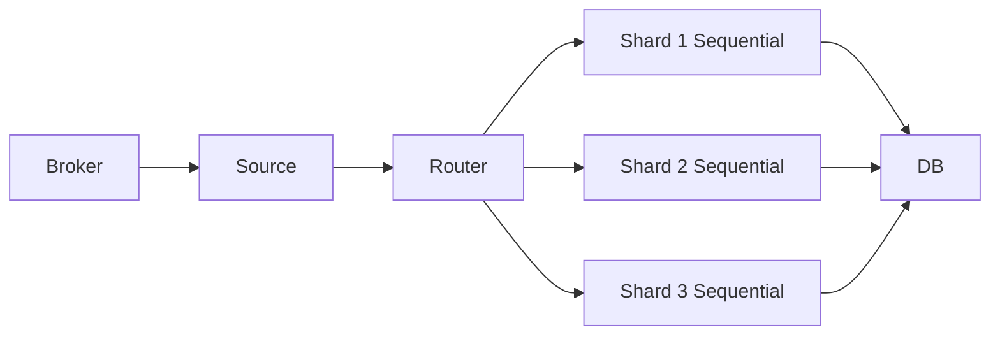

# learn-go-concurrency-parallelism-part-014.md

# Part 014 — Fan-Out/Fan-In, Pipelines, Stages, and Stream Processing

> Target pembaca: Java software engineer yang ingin memahami pipeline concurrency Go sebagai desain sistem, bukan hanya pattern `gen -> sq -> merge`.
>
> Fokus part ini: fan-out/fan-in, stage contract, bounded pipeline, ordering, cancellation, backpressure, error propagation, early termination, drain vs cancel, stream processing, observability, and production failure modes.

---

## 0. Posisi Part Ini dalam Seri

Sebelumnya:

- Part 008: channel sebagai handoff/backpressure.
- Part 009: `select` semantics.
- Part 010: structured concurrency.
- Part 011: context.
- Part 013: worker pool.

Part ini membahas bagaimana primitive tersebut disusun menjadi **pipeline**.

Pipeline adalah model yang sangat natural di Go:



Tetapi pipeline production-grade bukan sekadar menyambung channel.

Pipeline harus menjawab:

1. Apa kontrak setiap stage?
2. Siapa menutup channel?
3. Bagaimana cancellation mengalir?
4. Bagaimana error dikembalikan?
5. Bagaimana backpressure terjadi?
6. Apakah ordering harus dipertahankan?
7. Apakah concurrency per-stage bounded?
8. Apa yang terjadi saat downstream berhenti lebih awal?
9. Apakah data bisa hilang?
10. Bagaimana pipeline shutdown?
11. Bagaimana metrics per-stage?
12. Apakah pipeline ini perlu durable queue, bukan channel?

---

## 1. Tujuan Pembelajaran

Setelah part ini, Anda harus mampu:

1. Mendesain pipeline Go dengan stage contract eksplisit.
2. Membedakan:
   - fan-out,
   - fan-in,
   - pipeline linear,
   - DAG pipeline,
   - stream processing,
   - batch pipeline,
   - bounded pipeline,
   - durable pipeline.
3. Memahami early termination problem dan mencegah goroutine leak.
4. Mendesain cancellation propagation dengan `context`.
5. Mendesain error propagation:
   - fail-fast,
   - collect-all,
   - partial success,
   - dead-letter.
6. Menentukan ordering semantics:
   - unordered,
   - preserve input order,
   - per-key order,
   - sequence reorder.
7. Menggunakan worker pool/fan-out pada stage tertentu tanpa merusak lifecycle.
8. Mendesain backpressure end-to-end.
9. Menghindari anti-pattern:
   - unbounded goroutine per item,
   - missing channel close,
   - blocked send after downstream exit,
   - error channel leak,
   - pipeline without metrics,
   - stage doing too many responsibilities.
10. Membuat checklist review pipeline production-grade.

---

## 2. Mental Model: Pipeline Adalah Graph of Ownership Transfer

Pipeline terdiri dari:

- **nodes**: stages,
- **edges**: channels/queues,
- **messages**: data ownership transfer,
- **control plane**: context/cancellation/error,
- **policy**: buffering, ordering, retries, backpressure.



Key idea:

> Every edge in a pipeline transfers either data, ownership, signal, or error.

If ownership and lifecycle are unclear at any edge, the pipeline is fragile.

---

## 3. Java Translation

Java equivalents:
- `Stream` pipeline,
- `CompletableFuture` chain,
- Reactive Streams,
- Akka Streams,
- Project Reactor,
- Kafka Streams,
- executor stages with queues,
- blocking queue producer/consumer chains.

Go pipeline is closer to:
- explicit blocking queue stages,
- goroutine-per-stage,
- channel edges,
- context cancellation,
- manual backpressure.

Differences:

| Concern | Java/Reactor style | Go pipeline style |
|---|---|---|
| stage execution | scheduler/operator | goroutine/function |
| backpressure | protocol/operator | channel capacity/blocking |
| cancellation | subscription/cancel token | context |
| error | stream terminal signal | explicit error/result/context cause |
| ordering | operator-defined | must design |
| concurrency | operator config | goroutine/worker count |
| lifecycle | framework owns | you own |
| observability | framework hooks | explicit metrics |

Go gives low-level clarity, but fewer guardrails.

---

## 4. Minimal Pipeline

Classic example:

```go
func gen(nums ...int) <-chan int {
    out := make(chan int)

    go func() {
        defer close(out)

        for _, n := range nums {
            out <- n
        }
    }()

    return out
}

func square(in <-chan int) <-chan int {
    out := make(chan int)

    go func() {
        defer close(out)

        for n := range in {
            out <- n * n
        }
    }()

    return out
}
```

Usage:

```go
for n := range square(gen(1, 2, 3)) {
    fmt.Println(n)
}
```

This works only if:
- consumer reads all outputs,
- no stage errors,
- no cancellation,
- no early termination,
- no bounded resource concern,
- no slow downstream issue.

Production pipelines almost always need more.

---

## 5. Stage Contract

Every stage should document:

| Contract | Question |
|---|---|
| Input ownership | Does stage own received item? Can upstream mutate after send? |
| Output ownership | Is output immutable? Who can mutate? |
| Close rule | Who closes output? |
| Cancellation | Does stage stop on ctx? |
| Error | How does stage report failure? |
| Backpressure | What happens if output blocks? |
| Ordering | Is input order preserved? |
| Concurrency | Is stage single-worker or multi-worker? |
| Buffering | What is output capacity and why? |
| Flush/drain | What happens on input close or shutdown? |
| Observability | What metrics exist? |

Template:

```go
// Validate reads Items from in and emits ValidatedItems.
// Contract:
//   - Validate does not close in.
//   - Validate closes returned out when it exits.
//   - Validate stops when ctx is cancelled.
//   - Validate treats received Items as immutable.
//   - Validate preserves input order.
//   - Validation errors are emitted as Result.Err, not via a separate channel.
//   - Send to out is cancellation-aware.
func Validate(ctx context.Context, in <-chan Item) <-chan Result[ValidatedItem]
```

---

## 6. Cancellation-Aware Stage Template

A robust stage usually looks like:

```go
func Stage[A, B any](
    ctx context.Context,
    in <-chan A,
    fn func(context.Context, A) (B, error),
) <-chan Result[B] {
    out := make(chan Result[B])

    go func() {
        defer close(out)

        for {
            select {
            case <-ctx.Done():
                return

            case a, ok := <-in:
                if !ok {
                    return
                }

                b, err := fn(ctx, a)
                result := Result[B]{Value: b, Err: err}

                select {
                case out <- result:
                case <-ctx.Done():
                    return
                }
            }
        }
    }()

    return out
}
```

Result type:

```go
type Result[T any] struct {
    Value T
    Err   error
}
```

Properties:
- receive is cancellation-aware,
- send is cancellation-aware,
- output closed by stage,
- error travels with item,
- no separate error channel lifecycle problem.

---

## 7. Early Termination Problem

Pipeline leak example:

```go
out := square(gen(1, 2, 3, 4))
fmt.Println(<-out)
return
```

Consumer reads only one value. Upstream goroutines may block sending remaining values.



Fix with context:

```go
ctx, cancel := context.WithCancel(context.Background())
defer cancel()

out := square(ctx, gen(ctx, 1, 2, 3, 4))
fmt.Println(<-out)
cancel()
```

Stages must respect ctx on receive and send.

---

## 8. Source Stage

Source has no input. It emits items.

```go
func Source[T any](ctx context.Context, items []T) <-chan T {
    out := make(chan T)

    go func() {
        defer close(out)

        for _, item := range items {
            select {
            case out <- item:
            case <-ctx.Done():
                return
            }
        }
    }()

    return out
}
```

For external source:
- file reader,
- DB cursor,
- message consumer,
- network stream.

Source must handle:
- close output,
- close underlying resource,
- stop on context,
- report errors.

### 8.1 Source with Error in Result Stream

```go
func ReadLines(ctx context.Context, r io.Reader) <-chan Result[string] {
    out := make(chan Result[string])

    go func() {
        defer close(out)

        scanner := bufio.NewScanner(r)

        for scanner.Scan() {
            line := scanner.Text()

            select {
            case out <- Result[string]{Value: line}:
            case <-ctx.Done():
                return
            }
        }

        if err := scanner.Err(); err != nil {
            select {
            case out <- Result[string]{Err: err}:
            case <-ctx.Done():
            }
        }
    }()

    return out
}
```

---

## 9. Sink Stage

Sink consumes final output. It may:
- write DB,
- send HTTP,
- write file,
- aggregate,
- return result.

```go
func Sink[T any](
    ctx context.Context,
    in <-chan T,
    fn func(context.Context, T) error,
) error {
    for {
        select {
        case <-ctx.Done():
            return ctx.Err()

        case item, ok := <-in:
            if !ok {
                return nil
            }

            if err := fn(ctx, item); err != nil {
                return err
            }
        }
    }
}
```

Sink often determines pipeline lifecycle because if sink returns early, upstream must be cancelled.

---

## 10. Fan-Out

Fan-out means multiple workers consume from one input.



Implementation:

```go
func ParallelMap[A, B any](
    ctx context.Context,
    in <-chan A,
    workers int,
    fn func(context.Context, A) (B, error),
) <-chan Result[B] {
    out := make(chan Result[B])

    var wg sync.WaitGroup

    for i := 0; i < workers; i++ {
        wg.Go(func() {
            for {
                select {
                case <-ctx.Done():
                    return

                case a, ok := <-in:
                    if !ok {
                        return
                    }

                    b, err := fn(ctx, a)

                    select {
                    case out <- Result[B]{Value: b, Err: err}:
                    case <-ctx.Done():
                        return
                    }
                }
            }
        })
    }

    go func() {
        wg.Wait()
        close(out)
    }()

    return out
}
```

Properties:
- output closes after all workers finish,
- multiple workers share input,
- ordering not preserved,
- worker count bounds stage concurrency,
- errors emitted as results.

### 10.1 Fan-Out Trade-Offs

Pros:
- parallelism,
- higher throughput,
- better resource utilization.

Cons:
- ordering lost,
- more memory in-flight,
- downstream may receive bursts,
- error handling harder,
- per-key invariant can break,
- external dependency can be overloaded.

---

## 11. Fan-In

Fan-in merges multiple inputs into one output.

```go
func Merge[T any](ctx context.Context, inputs ...<-chan T) <-chan T {
    out := make(chan T)

    var wg sync.WaitGroup

    for _, in := range inputs {
        in := in

        wg.Go(func() {
            for {
                select {
                case <-ctx.Done():
                    return

                case v, ok := <-in:
                    if !ok {
                        return
                    }

                    select {
                    case out <- v:
                    case <-ctx.Done():
                        return
                    }
                }
            }
        })
    }

    go func() {
        wg.Wait()
        close(out)
    }()

    return out
}
```

Close rule:
- individual forwarding goroutines do not close output,
- coordinator closes output after all forwarders done.

### 11.1 Fan-In Does Not Preserve Global Order

If two inputs produce ordered streams separately:
- each stream order preserved,
- merged global order depends on scheduling.

For ordered merge, use sequence numbers or timestamp ordering.

---

## 12. Ordering Models

Pipeline design must state ordering semantics.

### 12.1 Unordered

Fastest/easiest.

```go
out := ParallelMap(ctx, in, 16, process)
```

Outputs arrive when done.

Good for:
- independent jobs,
- search indexing,
- enrichment where order irrelevant,
- background processing.

### 12.2 Preserve Input Order

Need sequence number.

```go
type Sequenced[T any] struct {
    Seq   int64
    Value T
}
```

Source assigns sequence:

```go
func Sequence[T any](ctx context.Context, in <-chan T) <-chan Sequenced[T] {
    out := make(chan Sequenced[T])

    go func() {
        defer close(out)

        var seq int64
        for {
            select {
            case <-ctx.Done():
                return

            case v, ok := <-in:
                if !ok {
                    return
                }

                item := Sequenced[T]{Seq: seq, Value: v}
                seq++

                select {
                case out <- item:
                case <-ctx.Done():
                    return
                }
            }
        }
    }()

    return out
}
```

Reorder stage:

```go
func Reorder[T any](ctx context.Context, in <-chan Sequenced[T]) <-chan T {
    out := make(chan T)

    go func() {
        defer close(out)

        pending := make(map[int64]T)
        var next int64

        for {
            select {
            case <-ctx.Done():
                return

            case item, ok := <-in:
                if !ok {
                    for {
                        v, exists := pending[next]
                        if !exists {
                            return
                        }

                        delete(pending, next)
                        next++

                        select {
                        case out <- v:
                        case <-ctx.Done():
                            return
                        }
                    }
                }

                pending[item.Seq] = item.Value

                for {
                    v, exists := pending[next]
                    if !exists {
                        break
                    }

                    delete(pending, next)
                    next++

                    select {
                    case out <- v:
                    case <-ctx.Done():
                        return
                    }
                }
            }
        }
    }()

    return out
}
```

Risks:
- if one item is slow/lost, later items buffer,
- memory can grow,
- need timeout/skip policy,
- head-of-line blocking.

### 12.3 Per-Key Order

Use shard by key.

```go
type Keyed[T any] struct {
    Key   string
    Value T
}
```

Route to shard:

```go
func Shard[T any](key string, n int) int {
    return int(hash(key) % uint64(n))
}
```

Each shard processes sequentially, shards parallel.

Good for:
- customer/account/order lifecycle,
- event sourcing per aggregate,
- partitioned streams.

---

## 13. Error Propagation Strategies

### 13.1 Error in Result Stream

```go
type Result[T any] struct {
    Value T
    Err   error
}
```

Pros:
- one channel lifecycle,
- no separate err channel close issue,
- per-item error possible.

Cons:
- every stage must handle result,
- fail-fast requires cancellation policy,
- value zero on error.

### 13.2 Separate Error Channel

```go
out := make(chan Item)
errCh := make(chan error, 1)
```

Pros:
- terminal error model.

Cons:
- lifecycle complex,
- consumer must drain output/error,
- risk blocked error send,
- close ordering tricky.

Use only with clear contract.

### 13.3 Context Cause

On first fatal error:
- cancel context with cause,
- stages stop,
- parent waits,
- return cause.

```go
ctx, cancel := context.WithCancelCause(parent)
defer cancel(nil)

errOnce := sync.Once{}

fail := func(err error) {
    if err == nil {
        return
    }

    errOnce.Do(func() {
        cancel(err)
    })
}
```

### 13.4 Dead-Letter

For durable/important stream:
- failed item goes to DLQ,
- pipeline continues.

This usually requires external durable queue/storage, not just channel.

### 13.5 Collect All Errors

For batch validation:
- do not cancel on first error,
- collect errors,
- preserve association with item.

---

## 14. Fail-Fast Pipeline Pattern

Use context cause + wait.

```go
func RunPipeline(ctx context.Context, input []Item) error {
    ctx, cancel := context.WithCancelCause(ctx)
    defer cancel(nil)

    src := Source(ctx, input)
    validated := Validate(ctx, src)
    enriched := Enrich(ctx, validated)

    err := Sink(ctx, enriched, func(ctx context.Context, item Enriched) error {
        if err := Persist(ctx, item); err != nil {
            cancel(err)
            return err
        }

        return nil
    })

    if err != nil {
        return err
    }

    if cause := context.Cause(ctx); cause != nil && !errors.Is(cause, context.Canceled) {
        return cause
    }

    return nil
}
```

Caution:
- You must ensure stages finish if sink returns early.
- Often easier to run pipeline under parent function and defer cancel.

```go
ctx, cancel := context.WithCancel(ctx)
defer cancel()
```

When sink returns, `defer cancel` stops upstream.

---

## 15. Pipeline with errgroup

A more structured pattern:

```go
func Run(ctx context.Context, input []Item) error {
    g, ctx := errgroup.WithContext(ctx)

    src := make(chan Item)
    validated := make(chan Validated)
    enriched := make(chan Enriched)

    g.Go(func() error {
        defer close(src)

        for _, item := range input {
            select {
            case src <- item:
            case <-ctx.Done():
                return ctx.Err()
            }
        }

        return nil
    })

    g.Go(func() error {
        defer close(validated)

        for {
            select {
            case <-ctx.Done():
                return ctx.Err()

            case item, ok := <-src:
                if !ok {
                    return nil
                }

                v, err := validate(item)
                if err != nil {
                    return err
                }

                select {
                case validated <- v:
                case <-ctx.Done():
                    return ctx.Err()
                }
            }
        }
    })

    g.Go(func() error {
        defer close(enriched)

        for {
            select {
            case <-ctx.Done():
                return ctx.Err()

            case v, ok := <-validated:
                if !ok {
                    return nil
                }

                e, err := enrich(ctx, v)
                if err != nil {
                    return err
                }

                select {
                case enriched <- e:
                case <-ctx.Done():
                    return ctx.Err()
                }
            }
        }
    })

    g.Go(func() error {
        for {
            select {
            case <-ctx.Done():
                return ctx.Err()

            case e, ok := <-enriched:
                if !ok {
                    return nil
                }

                if err := persist(ctx, e); err != nil {
                    return err
                }
            }
        }
    })

    return g.Wait()
}
```

Properties:
- each stage is part of errgroup,
- first error cancels context,
- all stages waited,
- output channels closed by owner stage,
- lifecycle explicit.

Trade-off:
- more boilerplate,
- channels defined in parent,
- clear for critical pipelines.

---

## 16. Bounded Pipeline

Every edge buffer and stage concurrency should be bounded.



Why different capacities?
- validation fast CPU,
- enrich slow network,
- persist DB-bound.

Bound:
- queue capacity per edge,
- worker count per stage,
- request deadlines,
- downstream concurrency,
- batch size.

Unbounded fan-out:

```go
for item := range in {
    go process(item)
}
```

This is not pipeline; this is resource explosion.

---

## 17. Stage Concurrency Sizing

Each stage may have different bottleneck.

| Stage | Bottleneck | Concurrency |
|---|---|---|
| parse JSON | CPU/alloc | near GOMAXPROCS |
| validate format | CPU | CPU-bound |
| enrich via HTTP | downstream | API concurrency/rate limit |
| persist DB | DB pool | max open conns/transaction cost |
| write file | disk IO | disk bandwidth |
| aggregate | state/lock | often single owner |

Do not set all stages to same worker count.

Example:

```go
parsed := ParallelMap(ctx, raw, runtime.GOMAXPROCS(0), parse)
validated := ParallelMap(ctx, parsed, runtime.GOMAXPROCS(0), validate)
enriched := ParallelMap(ctx, validated, 32, enrich)
persisted := ParallelMap(ctx, enriched, 8, persist)
```

But type and result handling must be designed carefully.

---

## 18. Backpressure in Pipeline

Backpressure flows downstream to upstream through blocking sends.

If `Persist` is slow:
- `enriched` output channel fills,
- enrich workers block sending,
- validated output fills,
- validate workers block,
- source blocks.

This is good if bounded and expected.



But if source is external broker:
- backpressure may become consumer lag,
- broker retention grows,
- rebalance risk,
- offset commit policy matters.

If source is HTTP:
- request latency increases,
- clients retry,
- load storm.

Backpressure must connect to admission/load shedding.

---

## 19. Buffers: Where and Why

Buffer can:
- absorb microburst,
- decouple small timing variations,
- improve throughput through batching,
- hide downstream slowness,
- increase latency,
- increase memory,
- delay error visibility.

Buffer rule:

> Every channel capacity should have a reason tied to throughput, burst, or latency budget.

Bad:

```go
make(chan Item, 100000)
```

Good:

```go
// Capacity 64 absorbs ~100ms burst at expected 600 items/s
// while keeping worst-case queue wait below operational target.
make(chan Item, 64)
```

---

## 20. Drain vs Cancel in Pipeline

### 20.1 Cancel

Stop as soon as result no longer needed.

Use for:
- request cancelled,
- fail-fast error,
- first successful result found,
- optional pipeline stage no longer useful.

### 20.2 Drain

Process all accepted items.

Use for:
- batch job,
- audit,
- migration,
- durable events,
- graceful shutdown.

Drain requires:
- stop source,
- close channels,
- process remaining buffered items,
- handle deadline,
- avoid accepting new items.

### 20.3 Flush on Close

Some stages aggregate/batch and must flush when input closes.

```go
func Batch(ctx context.Context, in <-chan Item, max int) <-chan []Item {
    out := make(chan []Item)

    go func() {
        defer close(out)

        batch := make([]Item, 0, max)

        flush := func() bool {
            if len(batch) == 0 {
                return true
            }

            b := append([]Item(nil), batch...)
            batch = batch[:0]

            select {
            case out <- b:
                return true
            case <-ctx.Done():
                return false
            }
        }

        for {
            select {
            case <-ctx.Done():
                return

            case item, ok := <-in:
                if !ok {
                    flush()
                    return
                }

                batch = append(batch, item)
                if len(batch) >= max {
                    if !flush() {
                        return
                    }
                }
            }
        }
    }()

    return out
}
```

---

## 21. Batching with Timer

Batch by size or time.

```go
func BatchBySizeOrTime[T any](
    ctx context.Context,
    in <-chan T,
    max int,
    interval time.Duration,
) <-chan []T {
    out := make(chan []T)

    go func() {
        defer close(out)

        ticker := time.NewTicker(interval)
        defer ticker.Stop()

        batch := make([]T, 0, max)

        flush := func() bool {
            if len(batch) == 0 {
                return true
            }

            b := append([]T(nil), batch...)
            batch = batch[:0]

            select {
            case out <- b:
                return true
            case <-ctx.Done():
                return false
            }
        }

        for {
            select {
            case <-ctx.Done():
                return

            case item, ok := <-in:
                if !ok {
                    flush()
                    return
                }

                batch = append(batch, item)
                if len(batch) >= max {
                    if !flush() {
                        return
                    }
                }

            case <-ticker.C:
                if !flush() {
                    return
                }
            }
        }
    }()

    return out
}
```

Consider:
- ticker runs even when no batch,
- flush on context cancel may or may not be desired,
- output send can block,
- batch copy prevents mutation by later reuse.

---

## 22. Pipeline with Result Type

A generic result stream:

```go
type Result[T any] struct {
    Value T
    Err   error
}
```

Stage consuming result:

```go
func MapResult[A, B any](
    ctx context.Context,
    in <-chan Result[A],
    fn func(context.Context, A) (B, error),
) <-chan Result[B] {
    out := make(chan Result[B])

    go func() {
        defer close(out)

        for {
            select {
            case <-ctx.Done():
                return

            case r, ok := <-in:
                if !ok {
                    return
                }

                if r.Err != nil {
                    select {
                    case out <- Result[B]{Err: r.Err}:
                    case <-ctx.Done():
                    }
                    return
                }

                b, err := fn(ctx, r.Value)

                select {
                case out <- Result[B]{Value: b, Err: err}:
                case <-ctx.Done():
                    return
                }

                if err != nil {
                    return
                }
            }
        }
    }()

    return out
}
```

This implements fail-stop-on-error propagation through stream.

Alternative:
- skip bad item and continue,
- emit error result and continue,
- dead-letter.

Define explicitly.

---

## 23. Pipeline Error Modes

| Mode | Description | Example |
|---|---|---|
| fail-fast | first error cancels all | request aggregation |
| fail-item | item error emitted, stream continues | validation |
| skip-error | bad item dropped with metric | telemetry |
| retry | retry item before failing | transient API |
| DLQ | failed item stored elsewhere | durable event |
| aggregate errors | process all, return list | batch validation |

Do not mix modes accidentally.

---

## 24. Idempotency in Pipelines

If a stage can retry or process after cancellation race, side effects must be idempotent.

Examples:
- DB insert with unique idempotency key,
- external API call with request ID,
- file write temp+rename,
- message offset commit after processing.

Pipeline concurrency increases duplicate risk:
- retry after timeout while original still running,
- fan-out partial failure,
- sink error after side effect,
- consumer restart.

Design idempotency at side-effect boundary.

---

## 25. Stream Processing vs Batch Pipeline

### 25.1 Batch Pipeline

Input is finite:
- file,
- slice,
- batch job,
- migration chunk.

Completion is expected. Channels close.

### 25.2 Stream Pipeline

Input is infinite/long-lived:
- Kafka/Rabbit consumer,
- socket,
- change feed,
- telemetry stream.

Completion may only occur on shutdown. More concerns:
- checkpoint/offset,
- rebalance,
- backpressure to broker,
- lag,
- poison messages,
- DLQ,
- exactly-once illusion,
- long-running metrics.

Go channels can model internal stream edges, but external stream correctness belongs to broker/protocol.

---

## 26. Pipeline and External Broker

If source is Kafka/Rabbit/etc:



Critical:
- when do you ack?
- before processing? risk loss.
- after processing? risk duplicate.
- per-message or batch?
- what if pipeline partially fails?
- what if shutdown occurs?
- what if order per partition matters?

Worker fan-out may break partition ordering.

For per-partition order:
- one pipeline per partition,
- or shard by partition/key,
- commit offset only after earlier messages complete.

---

## 27. Pipeline and Side Effects

Stages can be:
- pure transform,
- validation,
- enrichment,
- side-effecting.

Pure stages are easy:
- deterministic,
- retry safe,
- parallel safe.

Side-effect stages are hard:
- DB writes,
- external API calls,
- sending emails,
- publishing messages.

Put side effects near sink when possible.
Keep earlier stages pure to simplify retry and error handling.

---

## 28. Observability Per Stage

For each stage:

### Counters
- received,
- emitted,
- failed,
- skipped,
- retried,
- cancelled,
- expired.

### Gauges
- input queue depth,
- output queue depth,
- active workers,
- in-flight items.

### Histograms
- processing duration,
- queue wait duration,
- end-to-end latency,
- batch size,
- retry delay.

### Logs
- stage start/stop,
- fatal error,
- shutdown reason,
- panic,
- poison message.

### Traces
- item/request correlation,
- stage spans,
- downstream calls.

Critical metric:
- **oldest item age** per queue/stage.
Queue depth alone is insufficient.

---

## 29. Pipeline Debugging

Symptoms and likely causes:

| Symptom | Likely cause |
|---|---|
| goroutines stuck `chan send` | downstream stopped/slow |
| goroutines stuck `chan receive` | upstream stopped without close |
| queue depth grows | downstream bottleneck |
| CPU low, latency high | blocked on IO/channel |
| CPU high, no throughput | busy loop or CPU-bound stage |
| memory grows | large buffers/backlog/retention |
| output missing | early cancellation/drop |
| duplicate side effects | retry/idempotency issue |
| out-of-order results | fan-out unordered |
| p99 spikes | head-of-line blocking |

Use:
- goroutine dump,
- block profile,
- runtime trace,
- per-stage metrics,
- logs with item IDs,
- synthetic tests under slow downstream.

---

## 30. Case Study 1: File Processing Pipeline

Requirement:
- read large file,
- parse records,
- validate,
- enrich with external API,
- write valid rows to DB,
- collect invalid rows.

Design:



Important decisions:
- parse/validate CPU-bound: limited near CPU.
- enrich external API: limited by API concurrency/rate.
- persist DB: limited by DB pool.
- invalid rows go separate sink.
- error mode:
  - parse error: invalid row?
  - enrich error: retry then fail item?
  - DB error: fail-fast or retry?
- output ordering probably not needed.
- file source should stop on ctx.
- DB sink should be idempotent.

---

## 31. Case Study 2: Search Aggregation Request

Requirement:
- request fans out to multiple sources,
- return first page aggregated,
- if one optional source fails, continue,
- total SLA 500ms.

Design:
- not a long pipeline; request-scope fan-out.
- `errgroup` for required sources,
- optional source result with timeout and error suppression,
- context deadline,
- no worker pool unless downstream concurrency shared globally.

Lesson:
- not every fan-out is pipeline.
- choose shape based on lifecycle and result semantics.

---

## 32. Case Study 3: Event Processing with Per-Key Order

Requirement:
- process events by account ID in order,
- many accounts in parallel,
- side effect DB update.

Design:
- source consumes broker partition,
- route events to shard by account ID,
- each shard sequential worker,
- DB updates idempotent,
- commit offset carefully.



Trade-off:
- hot account blocks its shard,
- offset commit across shards complicated,
- DLQ needed for poison event.

---

## 33. Case Study 4: Image Processing

Requirement:
- resize images,
- CPU-heavy,
- upload results.

Pipeline:
- decode CPU,
- resize CPU,
- upload IO.

Worker counts:
- decode/resize near CPU,
- upload based on network/storage capacity.

Do not create goroutine per image if batch huge.
Use bounded pipeline.

Memory:
- images large,
- channel buffer capacity must be small,
- ownership of byte buffers/images clear,
- release references after stage.

---

## 34. Anti-Pattern Catalog

### 34.1 Goroutine per Item Without Bound

```go
for item := range in {
    go process(item)
}
```

### 34.2 Missing Cancellation on Send

```go
out <- item
```

inside long-lived stage.

### 34.3 Not Closing Output

Consumer ranges forever.

### 34.4 Closing Input You Do Not Own

Receiver closes producer channel.

### 34.5 Separate Error Channel Without Drain

Error send blocks because nobody receives.

### 34.6 Huge Buffers Hiding Outage

Memory grows and latency explodes.

### 34.7 One Context Ignored Deep Down

Cancellation does not reach blocking IO.

### 34.8 Fan-Out Breaking Ordering

Parallel workers process same key concurrently.

### 34.9 Side Effects Before Validation

Bad item causes partial external effects.

### 34.10 No Metrics Per Stage

Incident cannot locate bottleneck.

### 34.11 Retry Inside Stage Without Budget

Retry storm and stuck workers.

### 34.12 Batching Without Flush on Close

Last partial batch lost.

---

## 35. Design Review Checklist

For every pipeline:

1. Is input finite or infinite?
2. What is each stage contract?
3. Who owns closing each channel?
4. Does every stage observe context?
5. Is every blocking send cancellation-aware?
6. Is every blocking receive cancellation-aware where needed?
7. What is error mode?
8. Is error mode consistent across stages?
9. Does downstream early return cancel upstream?
10. Are buffers bounded?
11. Why each buffer capacity?
12. Are worker counts tied to bottlenecks?
13. Is ordering required?
14. Is per-key ordering required?
15. Can fan-out violate invariants?
16. Is item mutable after handoff?
17. Are side effects idempotent?
18. Where are retries?
19. Are retries bounded by context?
20. Is DLQ needed?
21. Is durable queue needed?
22. Is backpressure propagated to caller/source?
23. What happens on shutdown?
24. Cancel or drain?
25. Are batches flushed?
26. Are stale items expired?
27. Are metrics per stage?
28. Is oldest item age measured?
29. Are goroutine leaks tested?
30. Is race detector used?
31. Are slow downstream tests present?
32. Are closed channel paths tested?
33. Are partial failure paths tested?
34. Is memory bounded under backlog?
35. Is this pipeline simpler as synchronous code?

---

## 36. Mini Lab 1: Cancellation-Safe Pipeline

Implement:
- source emits numbers,
- stage squares numbers,
- sink consumes first N then returns.

Requirement:
- no goroutine leak after sink returns early.
- use context cancellation.
- test with goroutine count or explicit done channels.

---

## 37. Mini Lab 2: Parallel Map with Unordered Results

Implement:

```go
func ParallelMap[A, B any](
    ctx context.Context,
    in <-chan A,
    workers int,
    fn func(context.Context, A) (B, error),
) <-chan Result[B]
```

Requirements:
- workers bounded,
- output closed after workers finish,
- send cancellation-aware,
- receive cancellation-aware,
- panic converted to error result or metric,
- tests for input close and ctx cancel.

---

## 38. Mini Lab 3: Ordered Parallel Map

Implement:
- source adds sequence number,
- parallel workers process unordered,
- reorder stage emits in input order.

Questions:
- What happens if sequence 5 is slow?
- How large can reorder buffer grow?
- Should there be timeout/skip?
- Is preserving order worth the cost?

---

## 39. Mini Lab 4: Batch Stage

Implement:

```go
func Batch[T any](
    ctx context.Context,
    in <-chan T,
    max int,
    interval time.Duration,
) <-chan []T
```

Requirements:
- flush by size,
- flush by interval,
- flush on input close,
- no timer leak,
- output send cancellation-aware,
- batch slice ownership safe.

---

## 40. Mini Lab 5: Pipeline with Fail-Fast Error

Implement:
- parse,
- validate,
- persist.
- first fatal error cancels whole pipeline.
- all stages return/wait.

Use either:
- `errgroup`, or
- context cause + done channels.

Compare complexity.

---

## 41. Mini Lab 6: Per-Key Ordered Pipeline

Implement:
- route events by key to N shards,
- each shard processes sequentially,
- shards run in parallel,
- stop on context,
- per-shard queue depth metrics.

Test:
- events for same key preserve order,
- events for different keys can overlap,
- hot key does not break other shards except same shard.

---

## 42. Top 1% Heuristics

1. A pipeline is a graph with contracts, not just channels.
2. Every stage owns closing its output.
3. Every blocking send in a long-lived pipeline needs cancellation.
4. Downstream early return must cancel upstream.
5. Buffers are latency policy, not free performance.
6. Fan-out usually destroys ordering.
7. Preserve ordering only when requirement demands it.
8. Side effects belong near controlled sink boundaries.
9. Retry without idempotency is dangerous.
10. In-memory pipeline is not durable stream processing.
11. Per-stage metrics are non-negotiable in production.
12. Queue depth without oldest item age is incomplete.
13. Use result streams to avoid separate error channel lifecycle bugs.
14. If priority/fairness needed, channel FIFO is not enough.
15. If pipeline semantics cannot be documented, code will become incident-prone.

---

## 43. Source Notes

Primary Go concepts behind this part:

1. Go blog pipelines and cancellation:
   - pipeline stages are connected by channels,
   - stages close outbound channels,
   - downstream early exit can block upstream,
   - cancellation is required for robustness.

2. Go context package:
   - cancellation and deadline propagation.

3. Go channel semantics:
   - send/receive blocking,
   - close behavior,
   - ownership rules.

4. Go `sync.WaitGroup` / `errgroup`:
   - wait for fan-out/fan-in workers,
   - propagate errors and cancellation.

5. Queueing/backpressure fundamentals:
   - bounded queues,
   - Little’s Law,
   - overload behavior.

---

## 44. Summary

Pipeline concurrency is powerful because it decomposes work into stages and uses backpressure naturally through bounded channels.

But production-grade pipeline design requires more than connecting functions:

- stage contracts,
- ownership,
- close rules,
- cancellation,
- error semantics,
- ordering semantics,
- bounded concurrency,
- backpressure,
- side-effect idempotency,
- shutdown policy,
- metrics.

The key rule:

> Every pipeline edge must define data ownership, lifecycle, error behavior, and backpressure.

If a pipeline stage can block forever after downstream exits, the pipeline is incomplete.
If a queue can grow without a policy, overload is only delayed.
If ordering is assumed but not designed, correctness is accidental.

---

## 45. Status Seri

Selesai:
- Part 000 — Orientation
- Part 001 — Foundations
- Part 002 — Goroutine Internals
- Part 003 — Go Scheduler Deep Dive
- Part 004 — GOMAXPROCS, CPU Quotas, Containers
- Part 005 — Go Memory Model
- Part 006 — Synchronization Primitives
- Part 007 — Atomic Operations
- Part 008 — Channels Deep Dive
- Part 009 — Select Semantics
- Part 010 — WaitGroup, ErrGroup, Task Groups, and Structured Concurrency
- Part 011 — Context as Concurrency Contract
- Part 012 — Ownership Models
- Part 013 — Worker Pools
- Part 014 — Fan-Out/Fan-In, Pipelines, Stages, and Stream Processing

Belum selesai:
- Part 015 sampai Part 034.

Seri belum mencapai bagian terakhir.

<!-- NAVIGATION_FOOTER -->
<div class="page-nav">
<a href="./learn-go-concurrency-parallelism-part-013.md">⬅️ Part 013 — Worker Pools: Bounded Concurrency, Queueing, Load Shedding, and Sizing</a>
<a href="./index.md">📚 Kategori</a>
<a href="../../index.md">🏠 Home</a>
<a href="./learn-go-concurrency-parallelism-part-015.md">Part 015 — Backpressure End-to-End: From Goroutine to Service Boundary ➡️</a>
</div>
