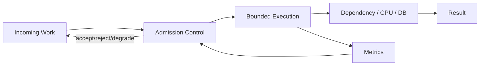
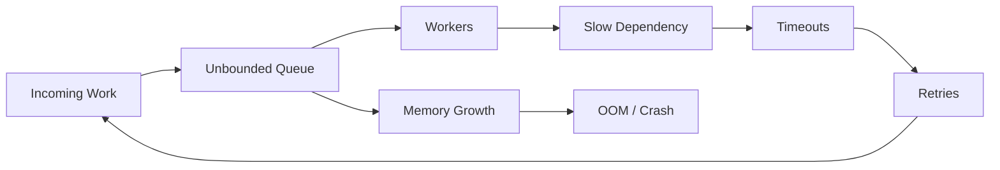
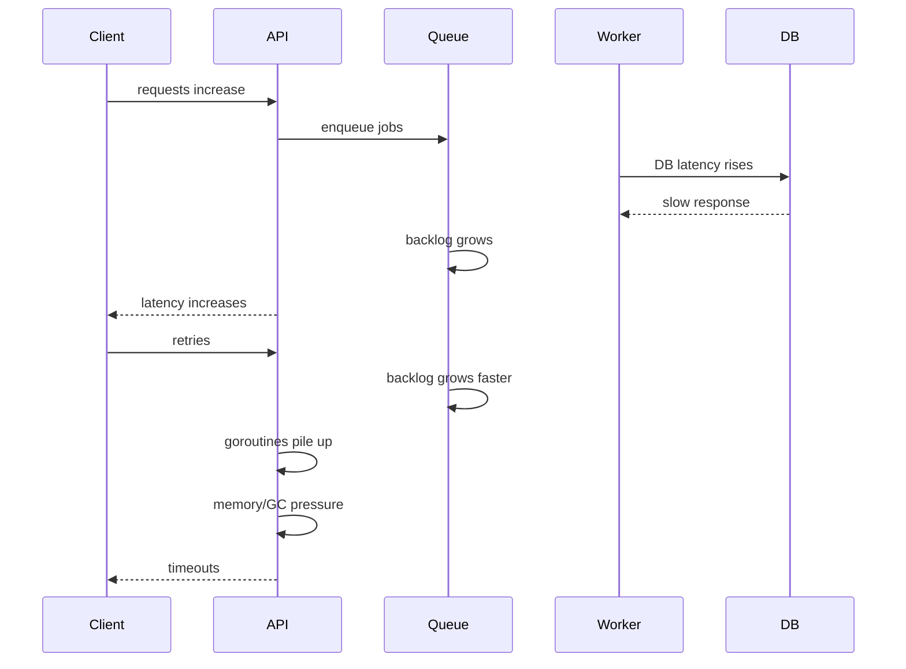
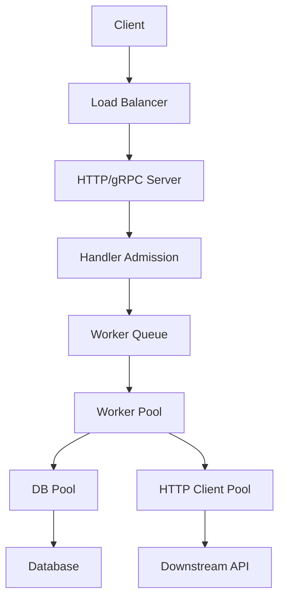
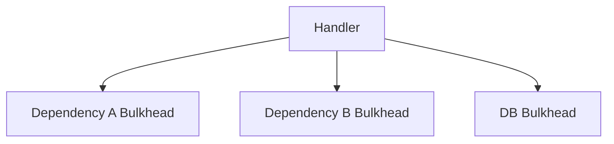
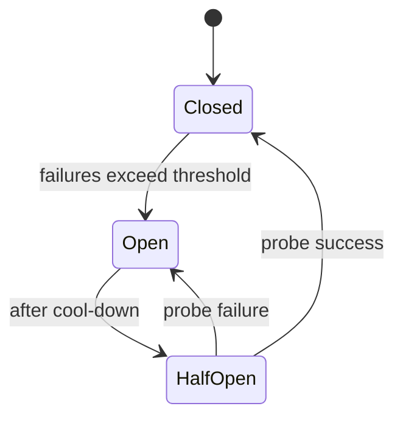

# learn-go-concurrency-parallelism-part-015.md

# Part 015 — Backpressure End-to-End: From Goroutine to Service Boundary

> Target pembaca: Java software engineer yang ingin memahami backpressure bukan hanya sebagai “channel penuh lalu block”, tetapi sebagai mekanisme stabilitas sistem dari goroutine lokal sampai HTTP/gRPC/broker/database boundary.
>
> Fokus part ini: overload control, bounded queues, admission, load shedding, deadline propagation, retry storm prevention, dependency protection, queue age, tail latency, and production guardrails.

---

## 0. Posisi Part Ini dalam Seri

Sebelumnya:

- Part 001 membahas work, time, state, ordering, contention.
- Part 008 membahas channel sebagai bounded coordination/backpressure primitive.
- Part 013 membahas worker pool sebagai capacity boundary.
- Part 014 membahas pipeline dan stage-level backpressure.

Part ini memperluas semua itu menjadi **end-to-end backpressure design**.

Pertanyaan utama:

> Saat sistem menerima work lebih cepat daripada bisa menyelesaikannya, apa yang terjadi?

Jawaban buruk:
- queue tumbuh diam-diam,
- goroutine menumpuk,
- request timeout,
- retry storm,
- memory naik,
- GC pressure naik,
- downstream overload,
- p99/p999 latency hancur,
- pod OOM/restart,
- duplicate side effects.

Jawaban baik:
- admission control,
- bounded queue,
- timeout budget,
- load shedding,
- circuit breaker,
- rate/concurrency limit,
- caller-visible overload signal,
- graceful degradation,
- metrics and alerting.

Backpressure adalah disiplin untuk membuat overload **terlihat, terbatas, dan terkendali**.

---

## 1. Tujuan Pembelajaran

Setelah part ini, Anda harus mampu:

1. Menjelaskan backpressure sebagai mekanisme stabilitas sistem.
2. Membedakan:
   - blocking backpressure,
   - bounded wait,
   - fail-fast rejection,
   - load shedding,
   - degradation,
   - durable buffering,
   - rate limiting,
   - concurrency limiting.
3. Mendesain backpressure dari goroutine/channel sampai HTTP/gRPC boundary.
4. Menentukan kapan queue harus bounded dan bagaimana menentukan kapasitasnya.
5. Menggunakan deadline dan queue age untuk mencegah stale work.
6. Mencegah retry storm dan retry amplification.
7. Melindungi downstream dependency dengan bulkhead, semaphore, limiter, dan circuit breaker.
8. Mendesain response overload:
   - HTTP 429/503,
   - gRPC ResourceExhausted/Unavailable,
   - broker nack/requeue/DLQ.
9. Menggunakan Little’s Law untuk reason about backlog dan latency.
10. Menambahkan metrics yang tepat:
   - queue depth,
   - oldest item age,
   - rejection rate,
   - retry rate,
   - goodput,
   - saturation.
11. Menghindari anti-pattern:
   - unbounded goroutine,
   - huge buffer,
   - blind retry,
   - timeout tanpa cancellation,
   - one global queue,
   - hidden async after response.

---

## 2. Mental Model: Backpressure Adalah Feedback Loop

Sistem sehat punya feedback loop:



Backpressure berarti downstream capacity memengaruhi upstream behavior.

Tanpa feedback loop:



Backpressure bukan hanya blocking. Blocking adalah salah satu bentuk backpressure.

Backpressure juga bisa berupa:
- reject,
- timeout,
- shed,
- degrade,
- slow intake,
- pause consumer,
- reduce concurrency,
- open circuit,
- lower priority,
- drop lossy data,
- spill to durable queue.

---

## 3. Core Vocabulary

| Term | Meaning |
|---|---|
| arrival rate | rate work masuk |
| service rate | rate work selesai |
| backlog | work menunggu |
| queue depth | jumlah item di queue |
| queue age | berapa lama item tertua menunggu |
| saturation | resource sudah dekat/full capacity |
| overload | arrival > sustainable service |
| load shedding | menolak/membuang work untuk menjaga stabilitas |
| admission control | keputusan accept/reject sebelum work masuk sistem |
| goodput | useful successful throughput |
| throughput | total processed attempts, termasuk retries/waste |
| tail latency | p95/p99/p999 latency |
| bulkhead | isolasi resource agar satu area tidak menenggelamkan yang lain |
| retry storm | retry memperbesar load saat sistem/downstream sudah sakit |
| backoff | delay retry untuk mengurangi pressure |
| jitter | randomness untuk mencegah synchronized retry |
| deadline | batas waktu absolut work masih berguna |
| stale work | work yang sudah tidak bermanfaat saat diproses |

---

## 4. Backpressure vs Rate Limiting vs Concurrency Limiting

### 4.1 Backpressure

General feedback:
- “Saya tidak bisa menerima/memproses secepat itu.”

Examples:
- channel full,
- HTTP 429,
- broker pause,
- queue depth rejection,
- DB pool wait.

### 4.2 Rate Limiting

Controls rate over time.

```text
max 300 requests/minute
```

Good for:
- external API quota,
- abuse control,
- tenant fairness,
- smoothing.

### 4.3 Concurrency Limiting

Controls simultaneous in-flight work.

```text
max 20 concurrent calls
```

Good for:
- DB connections,
- downstream concurrency,
- CPU-heavy operations,
- memory-heavy jobs.

### 4.4 You Often Need Both

External API:
- max 50 concurrent requests,
- max 300/min.

Use:
- semaphore for concurrency,
- token bucket for rate,
- queue/admission for overload,
- timeout/deadline,
- retry policy.

---

## 5. Why Go Makes Backpressure Both Easy and Dangerous

Easy:
- buffered channels provide bounded queue.
- unbuffered channels provide natural rendezvous.
- goroutines are cheap.
- `select` makes timeout/cancellation easy.
- context propagates cancellation.

Dangerous:
- goroutines are cheap enough to accidentally create too many.
- channels can hide queueing latency.
- blocking send can leak goroutines.
- huge buffers look harmless until memory spike.
- async goroutines can bypass request backpressure.
- default HTTP server concurrency can be very high.
- DB/HTTP clients have their own pools and queues.

Go gives primitive, not policy. You own policy.

---

## 6. Overload Timeline

A typical incident:



The root problem may be DB latency, but failure amplification is often caused by missing backpressure.

---

## 7. Little’s Law Revisited

```text
L = λ × W
```

If:
- arrival λ = 1000 req/s,
- average system time W = 200ms = 0.2s,

then:
- average in-flight L = 200.

If dependency latency increases to 2s:
- L = 1000 × 2 = 2000.

If your system has no admission control, in-flight goroutines increase 10x.

If each request holds:
- memory,
- DB wait,
- response writer,
- context,
- buffers,
- log fields,
- trace spans,

memory and scheduler pressure grow.

Backpressure tries to cap L.

---

## 8. Queue Depth Is Not Enough: Measure Queue Age

Queue depth says how many items. Queue age says how stale.

Example:
- queue depth 100 might be fine if workers process 10k/s.
- queue depth 100 might be disastrous if workers process 1/s.

Measure:
- oldest item age,
- queue wait duration histogram,
- processing duration histogram.

Job:

```go
type Job struct {
    ID        string
    CreatedAt time.Time
    Deadline  time.Time
    Payload   Payload
}
```

Worker:

```go
queueWait := time.Since(job.CreatedAt)
observeQueueWait(queueWait)

if !job.Deadline.IsZero() && time.Now().After(job.Deadline) {
    expiredTotal.Add(1)
    return
}
```

Backpressure should trigger based on:
- depth,
- age,
- rejection,
- downstream latency,
- error rate,
- CPU/memory saturation.

---

## 9. Backpressure at Different Layers



Backpressure can exist at:
1. client retry policy,
2. load balancer max connection/pending request,
3. server max concurrent requests,
4. handler admission,
5. worker queue,
6. worker pool,
7. DB pool,
8. HTTP transport pool,
9. downstream response status,
10. broker consumer lag/pause,
11. Kubernetes CPU/memory limit.

A stable design aligns these layers.

Misaligned example:
- handler accepts unlimited,
- worker queue huge,
- DB pool small,
- client retries aggressively,
- pod memory limited.

---

## 10. Local Primitive: Unbuffered Channel

Unbuffered channel provides synchronous backpressure.

```go
jobs := make(chan Job)

select {
case jobs <- job:
    return nil
case <-ctx.Done():
    return ctx.Err()
}
```

Producer cannot outrun consumer.

Use when:
- handoff must be synchronous,
- no backlog allowed,
- caller can wait,
- system prefers immediate pressure.

Risk:
- producer blocks,
- request latency tied to worker availability,
- if receiver dies, producer can block unless cancellation-aware.

---

## 11. Local Primitive: Buffered Channel

Buffered channel provides bounded backlog.

```go
jobs := make(chan Job, 100)
```

Behavior:
- accepts burst up to 100,
- then backpressure occurs.

Submit fail-fast:

```go
select {
case jobs <- job:
    return nil
default:
    return ErrQueueFull
}
```

Submit with context:

```go
select {
case jobs <- job:
    return nil
case <-ctx.Done():
    return ctx.Err()
}
```

Submit bounded wait:

```go
timer := time.NewTimer(50 * time.Millisecond)
defer timer.Stop()

select {
case jobs <- job:
    return nil
case <-timer.C:
    return ErrQueueFull
case <-ctx.Done():
    return ctx.Err()
}
```

---

## 12. Blocking Backpressure

Blocking submit:

```go
err := pool.Submit(ctx, job)
```

Pros:
- naturally slows caller,
- simple,
- no dropped work if caller waits.

Cons:
- can tie up request goroutines,
- can cause client timeouts,
- can increase tail latency,
- can create request pile-up if caller context too long.

Use when:
- caller has meaningful deadline,
- queue wait is acceptable,
- number of callers bounded,
- system should push back by making caller wait.

Do not use with `context.Background()` in request path.

---

## 13. Fail-Fast Backpressure

Fail fast:

```go
if err := pool.TrySubmit(job); errors.Is(err, ErrQueueFull) {
    return overloaded
}
```

Pros:
- protects system quickly,
- avoids queue wait,
- clear overload signal,
- good for low-latency APIs.

Cons:
- caller must handle rejection,
- can reduce throughput under burst if too aggressive,
- may cause retries.

Use when:
- work is optional,
- caller can retry with backoff,
- low latency more important than accepting all,
- overload should be visible.

---

## 14. Bounded-Wait Admission

Bounded wait is often a good request-path compromise.

```go
err := pool.SubmitWait(ctx, job, 25*time.Millisecond)
```

Meaning:
- wait briefly for capacity,
- reject if not available quickly,
- respect caller cancellation.

Good for:
- absorbing microbursts,
- avoiding immediate rejection,
- limiting tail latency.

Choose wait based on:
- SLA,
- p99 budget,
- queue drain rate,
- client retry behavior,
- operation importance.

---

## 15. Load Shedding

Load shedding means intentionally rejecting/dropping work to keep useful service alive.

Examples:
- reject optional feature,
- skip recommendation call,
- drop telemetry,
- return cached response,
- reject low-priority tenant,
- stop accepting background jobs.

### 15.1 Shedding by Priority

```go
if overloaded.Load() && req.Priority == Low {
    return ErrShed
}
```

### 15.2 Shedding by Queue Age

```go
if queueOldestAge() > 200*time.Millisecond {
    return ErrOverloaded
}
```

### 15.3 Shedding by Dependency Health

```go
if breaker.IsOpen("recommendations") {
    return cachedRecommendations(), nil
}
```

### 15.4 Shedding by Tenant

```go
if tenant.InFlight >= tenantLimit {
    return ErrTenantOverLimit
}
```

Shedding must be:
- explicit,
- measured,
- visible,
- documented,
- mapped to client semantics.

---

## 16. Goodput vs Throughput

Throughput can be misleading.

During overload:
- total attempts may rise,
- successful useful work may fall.

Goodput = useful successful output.

Example:
- 1000 req/s attempts,
- 800 timeout,
- 200 success.
- Throughput may show 1000 handled attempts.
- Goodput is 200.

Retry storm can increase throughput counters but reduce goodput.

Metrics should distinguish:
- accepted,
- rejected,
- started,
- completed successfully,
- failed,
- timed out,
- cancelled,
- retried,
- duplicate.

---

## 17. Retry Storm

Bad retry loop:

```go
for {
    err := call(ctx)
    if err == nil {
        return nil
    }
}
```

Slightly less bad but still dangerous:

```go
for i := 0; i < 3; i++ {
    err := call(ctx)
    if err == nil {
        return nil
    }
}
```

If downstream is overloaded, retries add more load.

### 17.1 Retry Amplification

If each request retries 3 times:
- 1000 incoming req/s can become 3000 downstream calls/s.

If clients also retry:
- amplification multiplies.

### 17.2 Correct Retry Policy

Retry only if:
- error is transient,
- operation idempotent,
- remaining deadline exists,
- retry budget remains,
- backoff with jitter,
- downstream not circuit-open,
- load is not already too high.

```go
func Retry(ctx context.Context, maxAttempts int, base time.Duration, fn func(context.Context) error) error {
    var last error

    for attempt := 0; attempt < maxAttempts; attempt++ {
        if err := fn(ctx); err != nil {
            last = err
        } else {
            return nil
        }

        if attempt == maxAttempts-1 {
            break
        }

        delay := jitter(base * (1 << attempt))
        timer := time.NewTimer(delay)

        select {
        case <-timer.C:
        case <-ctx.Done():
            timer.Stop()
            return ctx.Err()
        }
    }

    return last
}
```

Jitter:

```go
func jitter(d time.Duration) time.Duration {
    if d <= 0 {
        return 0
    }

    n := rand.Int63n(int64(d))
    return d/2 + time.Duration(n/2)
}
```

In production, use a properly seeded/source-safe RNG strategy.

---

## 18. Deadlines as Backpressure

Deadline prevents stale work.

```go
ctx, cancel := context.WithTimeout(parent, 500*time.Millisecond)
defer cancel()
```

Every layer should respect remaining budget.

Bad:

```go
func callA(ctx context.Context) error {
    ctx, cancel := context.WithTimeout(context.Background(), time.Second)
    defer cancel()
    return downstream(ctx)
}
```

This discards parent deadline.

Good:

```go
func callA(ctx context.Context) error {
    child, cancel := childWithCap(ctx, 100*time.Millisecond)
    defer cancel()
    return downstream(child)
}
```

If queue wait consumes deadline, worker should see it.

```go
func (p *Pool) Submit(ctx context.Context, job Job) error {
    if deadline, ok := ctx.Deadline(); ok {
        job.Deadline = deadline
    }

    select {
    case p.jobs <- job:
        return nil
    case <-ctx.Done():
        return ctx.Err()
    }
}
```

But for background jobs, do not bind to request deadline unless intended.

---

## 19. Queue Expiration

If job has deadline:

```go
if !job.Deadline.IsZero() && time.Now().After(job.Deadline) {
    expiredTotal.Add(1)
    return
}
```

Expiration can happen:
- at admission,
- while waiting,
- before processing,
- during processing.

Policies:
- reject if not enough remaining budget,
- skip expired at worker start,
- pass deadline to handler,
- cancel if exceeded during processing.

Admission example:

```go
func Submit(ctx context.Context, job Job) error {
    if deadline, ok := ctx.Deadline(); ok {
        remaining := time.Until(deadline)
        if remaining < minUsefulProcessingTime {
            return ErrTooLate
        }

        job.Deadline = deadline
    }

    // enqueue...
}
```

---

## 20. Dependency Bulkheads

Bulkhead isolates one dependency/workload.

Bad global pool:
```text
all work -> one pool -> all dependencies
```

If dependency A slows, all workers blocked, dependency B work starves.

Better:


Bulkhead tools:
- separate worker pools,
- separate semaphores,
- separate queues,
- separate timeouts,
- separate circuit breakers,
- separate rate limiters.

Example:

```go
type Client struct {
    sem chan struct{}
}

func (c *Client) Call(ctx context.Context, req Request) (Response, error) {
    select {
    case c.sem <- struct{}{}:
        defer func() { <-c.sem }()
    case <-ctx.Done():
        return Response{}, ctx.Err()
    }

    return c.doCall(ctx, req)
}
```

---

## 21. Circuit Breaker as Backpressure

Circuit breaker stops calling dependency that is likely failing.

States:
- closed: calls allowed.
- open: calls rejected quickly.
- half-open: limited probes.



Circuit breaker protects:
- downstream,
- caller latency,
- local worker pool,
- retry storm.

But breaker is not enough:
- still need timeouts,
- still need bulkhead,
- still need fallback/degradation,
- must avoid flapping,
- must expose metrics.

---

## 22. Rate Limit as Backpressure

Token bucket concept:
- tokens refill at rate,
- each request consumes token,
- if no token: wait/reject.

Use cases:
- external API quota,
- tenant quota,
- expensive operation control.

Admission wait:

```go
if err := limiter.Wait(ctx); err != nil {
    return err
}
```

Fail-fast:

```go
if !limiter.Allow() {
    return ErrRateLimited
}
```

For request path, fail-fast or bounded wait is often better than long wait.

---

## 23. HTTP Boundary

HTTP overload responses:

| Situation | Status |
|---|---:|
| per-client/tenant rate limit | 429 |
| local queue full | 429 or 503 |
| service overloaded | 503 |
| downstream timeout | 504 |
| dependency unavailable | 502/503 |
| request cancelled by client | often logged as client cancel; no useful response |
| admission too late | 503/429 |

Add headers when useful:
- `Retry-After`,
- rate limit headers,
- request ID.

Handler example:

```go
func handler(w http.ResponseWriter, r *http.Request) {
    err := pool.SubmitWait(r.Context(), jobFrom(r), 25*time.Millisecond)
    if err == nil {
        w.WriteHeader(http.StatusAccepted)
        return
    }

    switch {
    case errors.Is(err, ErrQueueFull):
        w.Header().Set("Retry-After", "1")
        http.Error(w, "server busy", http.StatusTooManyRequests)

    case errors.Is(err, context.Canceled):
        return

    case errors.Is(err, context.DeadlineExceeded):
        http.Error(w, "request deadline exceeded", http.StatusGatewayTimeout)

    default:
        http.Error(w, "unavailable", http.StatusServiceUnavailable)
    }
}
```

Do not enqueue after writing success unless ownership/durability is clear.

---

## 24. gRPC Boundary

gRPC status mapping:

| Situation | Code |
|---|---|
| queue full/admission rejected | `ResourceExhausted` |
| local overload | `ResourceExhausted` or `Unavailable` |
| dependency unavailable | `Unavailable` |
| deadline exceeded | `DeadlineExceeded` |
| caller cancelled | `Canceled` |
| circuit open | `Unavailable` or `ResourceExhausted` |
| invalid request | `InvalidArgument` |

Example concept:

```go
if errors.Is(err, ErrQueueFull) {
    return nil, status.Error(codes.ResourceExhausted, "server busy")
}
```

For retryable overload, include retry info if your API ecosystem supports it.

---

## 25. Broker Boundary

For message brokers, backpressure is different.

Possible controls:
- pause consumption,
- lower prefetch,
- nack/requeue,
- dead-letter,
- commit offsets later,
- partition lag monitoring,
- consumer scaling.

Rabbit-like:
- prefetch controls unacked in-flight messages.
- nack/requeue can create hot poison loop.
- DLQ for poison messages.

Kafka-like:
- poll/processing/commit.
- if processing slow, lag grows.
- parallel processing can break partition ordering.
- commit only after safe processing.

Backpressure signal may be:
- lag,
- unacked count,
- consumer pause,
- rebalance,
- retention risk.

---

## 26. Database Boundary

DB has its own backpressure:
- connection pool wait,
- lock wait,
- query timeout,
- transaction contention,
- deadlocks,
- max sessions.

Go `database/sql` pool:
- `SetMaxOpenConns`,
- `SetMaxIdleConns`,
- `SetConnMaxLifetime`,
- context-aware query.

Backpressure strategy:
- do not run more DB-bound workers than DB can handle,
- use short transactions,
- set query timeouts,
- reject upstream if DB saturated,
- avoid holding transaction while doing external IO,
- monitor pool wait count/duration.

---

## 27. Memory as Backpressure Signal

If backlog grows, memory grows.

Sources:
- queued jobs,
- goroutine stacks,
- request bodies,
- response buffers,
- trace/log metadata,
- retry state,
- closures retaining objects,
- channel buffers.

Memory limit in Kubernetes turns backlog into OOM kill.

Backpressure should trigger before memory emergency:
- queue depth/age thresholds,
- admission rejection,
- reduce concurrency,
- shed optional work,
- circuit open,
- readiness false if severe.

Do not wait for OOM to shed load.

---

## 28. CPU as Backpressure Signal

CPU-bound overload:
- run queue grows,
- request latency increases,
- GC assist increases,
- scheduler latency increases,
- CPU throttling in container worsens.

Controls:
- `GOMAXPROCS`,
- worker count,
- admission,
- queue capacity,
- autoscaling,
- reduce optional CPU work,
- cache,
- batch.

If CPU throttled:
- more goroutines do not help.
- they compete for same quota.

---

## 29. Adaptive Concurrency

Advanced pattern:
- dynamically adjust concurrency based on observed latency/error.
- reduce concurrency when latency rises.
- increase when healthy.

Signals:
- p95/p99 latency,
- error rate,
- queue wait,
- in-flight,
- downstream saturation.

Risks:
- oscillation,
- slow reaction,
- bad signal,
- unfairness,
- complexity.

Use static limits first. Add adaptive only when needed and measurable.

---

## 30. Backpressure and Autoscaling

Autoscaling helps only if bottleneck scales.

If bottleneck is:
- CPU in pod: HPA can help.
- DB capacity: adding pods can hurt DB.
- external API quota: adding pods can exceed quota.
- global lock: adding pods may not help.
- Kafka partitions: max parallelism limited by partitions.

Autoscaling signal:
- CPU,
- queue depth,
- queue age,
- request latency,
- custom metric.

Backpressure and autoscaling should cooperate:
- shed locally while scale-out happens,
- avoid retry storm during scale delay,
- protect shared dependencies.

---

## 31. Designing End-to-End Policy

Example API:
- endpoint accepts report generation request.
- report generation CPU + DB + external API.
- response can be async accepted.

Policy:

1. HTTP handler validates request synchronously.
2. Admission checks tenant quota.
3. Submit to bounded durable queue or in-memory queue depending reliability.
4. If queue full: 429/503.
5. Job includes deadline and idempotency key.
6. Worker pool bounded by DB/API limits.
7. API calls use concurrency limiter + rate limiter.
8. Retries bounded with backoff/jitter.
9. Job expiration checked before work.
10. DLQ for permanent failures.
11. Metrics for queue age/depth/rejection/goodput.
12. Shutdown stops intake and drains within deadline.

---

## 32. Example: Backpressure-Aware Submitter

```go
type AdmissionPolicy int

const (
    AdmissionBlock AdmissionPolicy = iota
    AdmissionFailFast
    AdmissionBoundedWait
)

type Dispatcher struct {
    jobs chan Job
    done chan struct{}

    accepted atomic.Uint64
    rejected atomic.Uint64
}

func (d *Dispatcher) Submit(ctx context.Context, job Job, policy AdmissionPolicy, wait time.Duration) error {
    job.CreatedAt = time.Now()

    if deadline, ok := ctx.Deadline(); ok {
        job.Deadline = deadline
    }

    switch policy {
    case AdmissionFailFast:
        return d.trySubmit(job)

    case AdmissionBoundedWait:
        return d.submitWait(ctx, job, wait)

    case AdmissionBlock:
        return d.submitBlock(ctx, job)

    default:
        return fmt.Errorf("unknown admission policy")
    }
}

func (d *Dispatcher) trySubmit(job Job) error {
    select {
    case d.jobs <- job:
        d.accepted.Add(1)
        return nil
    case <-d.done:
        d.rejected.Add(1)
        return ErrStopped
    default:
        d.rejected.Add(1)
        return ErrQueueFull
    }
}

func (d *Dispatcher) submitBlock(ctx context.Context, job Job) error {
    select {
    case d.jobs <- job:
        d.accepted.Add(1)
        return nil
    case <-d.done:
        d.rejected.Add(1)
        return ErrStopped
    case <-ctx.Done():
        d.rejected.Add(1)
        return ctx.Err()
    }
}

func (d *Dispatcher) submitWait(ctx context.Context, job Job, wait time.Duration) error {
    timer := time.NewTimer(wait)
    defer timer.Stop()

    select {
    case d.jobs <- job:
        d.accepted.Add(1)
        return nil
    case <-d.done:
        d.rejected.Add(1)
        return ErrStopped
    case <-ctx.Done():
        d.rejected.Add(1)
        return ctx.Err()
    case <-timer.C:
        d.rejected.Add(1)
        return ErrQueueFull
    }
}
```

---

## 33. Example: Worker with Expiration and Dependency Bulkhead

```go
type Bulkhead struct {
    permits chan struct{}
}

func NewBulkhead(n int) *Bulkhead {
    return &Bulkhead{permits: make(chan struct{}, n)}
}

func (b *Bulkhead) Acquire(ctx context.Context) error {
    select {
    case b.permits <- struct{}{}:
        return nil
    case <-ctx.Done():
        return ctx.Err()
    }
}

func (b *Bulkhead) Release() {
    <-b.permits
}
```

Worker:

```go
func worker(ctx context.Context, jobs <-chan Job, api *Bulkhead, handler func(context.Context, Job) error) {
    for {
        select {
        case <-ctx.Done():
            return

        case job, ok := <-jobs:
            if !ok {
                return
            }

            if !job.Deadline.IsZero() && time.Now().After(job.Deadline) {
                expiredTotal.Add(1)
                continue
            }

            jobCtx := ctx
            if !job.Deadline.IsZero() {
                var cancel context.CancelFunc
                jobCtx, cancel = context.WithDeadline(ctx, job.Deadline)
                defer cancel()
            }

            if err := api.Acquire(jobCtx); err != nil {
                cancelledTotal.Add(1)
                continue
            }

            err := handler(jobCtx, job)
            api.Release()

            if err != nil {
                failedTotal.Add(1)
            } else {
                completedTotal.Add(1)
            }
        }
    }
}
```

Note: `defer cancel()` inside long loop accumulates defers until worker exits. Better:

```go
jobCtx := ctx
cancel := func() {}
if !job.Deadline.IsZero() {
    jobCtx, cancel = context.WithDeadline(ctx, job.Deadline)
}
err := process(jobCtx, job)
cancel()
```

This detail matters in long-lived workers.

---

## 34. Case Study 1: API Queue Meltdown

### Symptoms

- p99 latency from 200ms to 30s.
- goroutine count rises.
- memory rises.
- DB CPU high.
- clients retry.
- queue depth high.

### Broken Design

```go
func handler(w http.ResponseWriter, r *http.Request) {
    jobs <- Job{Payload: parse(r)}
    w.WriteHeader(http.StatusAccepted)
}
```

Problems:
- blocking submit no timeout,
- no queue full response,
- no queue age metric,
- DB-bound workers too many,
- no retry control,
- no tenant isolation.

### Corrected Design

- bounded-wait submit 25ms,
- return 429 with Retry-After if full,
- workers aligned with DB capacity,
- DB query context deadline,
- queue expiration,
- retry with backoff/jitter only retryable errors,
- metrics and alerts on oldest job age.

---

## 35. Case Study 2: External API Rate Limit

### Symptoms

- external API returns 429.
- local workers retry immediately.
- success rate drops.
- more workers make it worse.

### Broken Assumption

“More concurrency increases throughput.”

Actually external API quota is bottleneck.

### Corrected Design

- rate limiter 300/min,
- concurrency limiter 20,
- exponential backoff with jitter,
- respect `Retry-After`,
- circuit breaker on sustained 429/5xx,
- fail optional feature gracefully,
- cache results when possible.

---

## 36. Case Study 3: Kafka Consumer Lag

### Symptoms

- consumer lag rises.
- processing pool full.
- commits delayed.
- rebalance occurs.
- duplicates increase.

### Broken Design

- consume messages faster than processing capacity,
- unbounded internal queue,
- fan-out breaks partition ordering,
- commits not coordinated with completion.

### Corrected Design

- bounded internal queue,
- pause/resume consumption when queue age high,
- per-partition processing if ordering needed,
- commit after completion,
- DLQ poison messages,
- worker count based on sink capacity.

---

## 37. Case Study 4: Optional Dependency Degrades Whole API

### Symptoms

- recommendation service slow.
- main page API p99 high.
- required profile/orders services healthy.

### Broken Design

- all downstream calls required,
- shared errgroup fail-fast,
- no optional timeout,
- no fallback.

### Corrected Design

- required calls use request context,
- optional recommendation has small child timeout,
- fallback to cached/empty recommendations,
- circuit breaker for optional dependency,
- metrics separate optional degradation.

---

## 38. Anti-Pattern Catalog

### 38.1 Infinite Queue

A queue without max is outage storage.

### 38.2 Huge Buffered Channel

Delays failure and increases memory/tail latency.

### 38.3 Goroutine Per Request to Hide Blocking

```go
go pool.Submit(context.Background(), job)
```

Destroys backpressure.

### 38.4 Retry Without Budget

Retries beyond caller deadline waste work.

### 38.5 Retry Without Jitter

Synchronized retries create traffic waves.

### 38.6 One Global Pool

Unrelated workloads starve each other.

### 38.7 Ignoring Queue Age

Depth alone does not show latency.

### 38.8 Context Background in Downstream Call

Breaks deadline propagation.

### 38.9 Accepting Work After Success Response Without Durability

Client believes accepted, process crash loses job.

### 38.10 Load Shedding Without Metrics

You cannot tell if shedding is normal or incident.

### 38.11 Backpressure Only at Deep Layer

If only DB pool blocks, API already accepted too much work.

### 38.12 Autoscaling Without Dependency Awareness

More pods can overload shared DB/API faster.

---

## 39. Metrics and Alerts

### 39.1 Core Metrics

- incoming rate,
- accepted rate,
- rejected rate,
- completed success rate,
- failed rate,
- timeout rate,
- retry rate,
- queue depth,
- oldest queue age,
- active workers,
- in-flight per dependency,
- rate limiter denied,
- circuit breaker state,
- DB pool wait duration,
- downstream latency,
- goodput.

### 39.2 Alerts

Alert on:
- oldest queue age above SLA,
- sustained rejection rate above normal,
- goodput drop,
- retry rate spike,
- downstream timeout spike,
- circuit breaker open too long,
- DB pool wait p95 high,
- goroutine count growth,
- memory growth correlated with queue depth.

Do not alert on:
- every individual 429,
- normal client cancellations,
- short microburst queue depth if age remains low.

---

## 40. Design Review Checklist

For any service path:

1. What is the bottleneck resource?
2. Is concurrency bounded at that resource?
3. Is rate bounded if dependency has quota?
4. Is queue bounded?
5. Why that queue capacity?
6. What is max queue wait?
7. Is queue age measured?
8. What happens when queue is full?
9. Is overload visible to caller?
10. Are HTTP/gRPC statuses mapped intentionally?
11. Does caller retry? With backoff/jitter?
12. Are retries bounded by deadline?
13. Is operation idempotent if retried?
14. Is there load shedding?
15. Is there graceful degradation?
16. Are optional dependencies isolated?
17. Are tenants isolated?
18. Are priorities handled?
19. Does backpressure reach ingress?
20. Is there any goroutine hiding backpressure?
21. Does context propagate to blocking IO?
22. Are stale jobs expired?
23. Are worker counts tied to capacity?
24. Is DB pool considered?
25. Is external API quota considered?
26. Is Kubernetes CPU/memory limit considered?
27. Is autoscaling safe for downstream?
28. Is shutdown policy compatible with queues?
29. Is durability required?
30. Is in-memory queue sufficient?
31. Are goodput and throughput separated?
32. Are retries counted?
33. Are rejections counted?
34. Are circuit breaker states visible?
35. Is the system stable under slow downstream test?

---

## 41. Mini Lab 1: Admission Policies

Implement one dispatcher with:
- blocking submit,
- bounded-wait submit,
- fail-fast submit.

Test:
- queue full,
- context cancelled,
- stopped dispatcher,
- bounded wait timeout,
- no goroutine leak.

---

## 42. Mini Lab 2: Queue Age-Based Shedding

Implement:
- queue with CreatedAt.
- reject new jobs if oldest queued job age > threshold.
- metric for oldest age.
- worker that sleeps to simulate slow dependency.

Observe:
- depth,
- age,
- rejection,
- latency.

---

## 43. Mini Lab 3: Retry Storm Simulation

Simulate:
- 100 callers,
- dependency fails for 5 seconds,
- retry immediate vs retry backoff+jitter,
- compare total downstream attempts and success recovery.

Measure:
- attempts,
- successes,
- failures,
- p99 latency,
- in-flight.

---

## 44. Mini Lab 4: Bulkhead Isolation

Implement:
- dependency A slow,
- dependency B fast.
- version 1: global worker pool.
- version 2: separate bulkheads.

Show:
- in version 1, A starves B.
- in version 2, B remains healthy.

---

## 45. Mini Lab 5: HTTP Overload Mapping

Build handler:
- bounded wait submit 25ms,
- map ErrQueueFull to 429,
- map context deadline to 504,
- map stopped to 503,
- include Retry-After.
- add metrics counters.

Test with:
- full queue,
- cancelled request,
- slow worker.

---

## 46. Mini Lab 6: Backpressure in Pipeline

Create pipeline:
- source emits 10000 items,
- stage 1 fast,
- stage 2 slow,
- bounded channels.

Run:
- without cancellation,
- with early sink return,
- with context cancellation.
Observe goroutine leak behavior.

---

## 47. Top 1% Heuristics

1. Backpressure must reach the caller or source.
2. A full queue is not an error in design; missing full-queue policy is.
3. Queue capacity is latency policy.
4. Queue age is often more important than queue depth.
5. More workers help only if the bottleneck can handle more concurrency.
6. Retry is load; retry during overload can be attack traffic against yourself.
7. Goodput matters more than raw throughput.
8. Deadlines prevent stale work from consuming capacity.
9. In-memory queues are not durable acceptance.
10. Bulkheads prevent one dependency from sinking the whole service.
11. Fail fast is often kinder than timing out slowly.
12. Autoscaling without dependency awareness can amplify failure.
13. Optional work should degrade before required work fails.
14. Every overload response should be intentional.
15. If you cannot explain overload behavior, the system is not production-ready.

---

## 48. Source Notes

Primary concepts behind this part:

1. Go channel semantics:
   - bounded buffers,
   - blocking send/receive,
   - cancellation-aware select.

2. Go context:
   - cancellation and deadline propagation.

3. Go HTTP/gRPC service design:
   - request context,
   - caller-visible overload response.

4. Queueing fundamentals:
   - Little’s Law,
   - backlog,
   - latency,
   - saturation.

5. Reliability engineering:
   - backpressure,
   - load shedding,
   - retry backoff with jitter,
   - bulkheads,
   - circuit breakers,
   - goodput.

---

## 49. Summary

Backpressure is not a single API. It is an end-to-end control loop.

At the local level:
- channel capacity,
- semaphores,
- worker pools,
- context cancellation.

At the service level:
- admission control,
- load shedding,
- deadlines,
- overload response.

At the dependency level:
- rate limits,
- concurrency limits,
- circuit breakers,
- DB pool alignment.

At the system level:
- autoscaling,
- queue age,
- goodput,
- retry control,
- tenant isolation.

The production-grade rule:

> Never let work enter the system faster than the system can either complete it, reject it, or intentionally buffer it within a known latency and memory budget.

---

## 50. Status Seri

Selesai:
- Part 000 — Orientation
- Part 001 — Foundations
- Part 002 — Goroutine Internals
- Part 003 — Go Scheduler Deep Dive
- Part 004 — GOMAXPROCS, CPU Quotas, Containers
- Part 005 — Go Memory Model
- Part 006 — Synchronization Primitives
- Part 007 — Atomic Operations
- Part 008 — Channels Deep Dive
- Part 009 — Select Semantics
- Part 010 — WaitGroup, ErrGroup, Task Groups, and Structured Concurrency
- Part 011 — Context as Concurrency Contract
- Part 012 — Ownership Models
- Part 013 — Worker Pools
- Part 014 — Fan-Out/Fan-In, Pipelines, Stages, and Stream Processing
- Part 015 — Backpressure End-to-End

Belum selesai:
- Part 016 sampai Part 034.

Seri belum mencapai bagian terakhir.

<!-- NAVIGATION_FOOTER -->
<div class="page-nav">
<a href="./learn-go-concurrency-parallelism-part-014.md">⬅️ Part 014 — Fan-Out/Fan-In, Pipelines, Stages, and Stream Processing</a>
<a href="./index.md">📚 Kategori</a>
<a href="../../index.md">🏠 Home</a>
<a href="./learn-go-concurrency-parallelism-part-016.md">Part 016 — Semaphores, Rate Limiters, Token Buckets, and Bulkheads ➡️</a>
</div>
