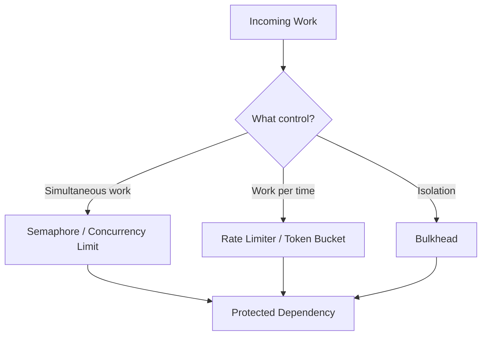
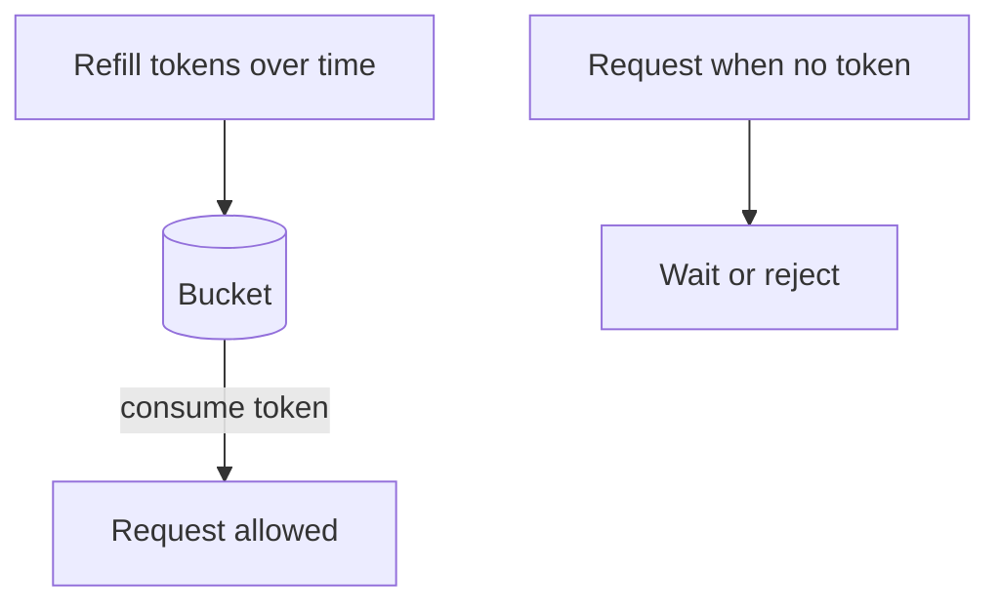
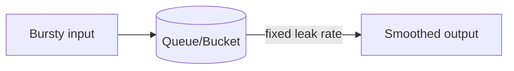
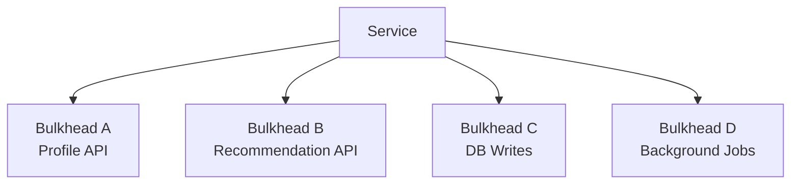
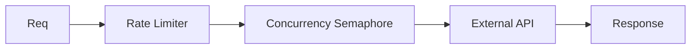

# learn-go-concurrency-parallelism-part-016.md

# Part 016 — Semaphores, Rate Limiters, Token Buckets, and Bulkheads

> Target pembaca: Java software engineer yang ingin memahami primitive pengendali kapasitas secara presisi: kapan membatasi **jumlah concurrent work**, kapan membatasi **rate per waktu**, kapan membuat **isolasi resource**, dan bagaimana semua ini dipakai di Go production service.
>
> Fokus part ini: semaphore, weighted semaphore, token bucket, leaky bucket, rate limiter, concurrency limiter, bulkhead, per-key/per-tenant limit, fairness, priority inversion, overload policy, observability, dan production failure modes.

---

## 0. Posisi Part Ini dalam Seri

Sebelumnya:

- Part 013 membahas worker pool sebagai bounded execution.
- Part 014 membahas pipeline.
- Part 015 membahas backpressure end-to-end.

Part ini memperdalam primitive yang sering dipakai untuk backpressure dan dependency protection:

1. **Semaphore** — membatasi concurrency.
2. **Rate limiter** — membatasi rate per waktu.
3. **Token bucket** — model rate limiter yang bisa mengizinkan burst.
4. **Leaky bucket** — model smoothing output rate.
5. **Bulkhead** — isolasi resource agar satu dependency/tenant/workload tidak menenggelamkan seluruh service.

Banyak incident terjadi karena engineer mencampuradukkan ini:

- memakai worker pool untuk rate limit,
- memakai rate limiter untuk concurrency limit,
- memakai global semaphore untuk semua dependency,
- memakai satu queue untuk semua tenant,
- retry tanpa limiter,
- membatasi request ingress tapi tidak membatasi downstream,
- membatasi downstream tapi tidak memberi sinyal overload ke caller.

---

## 1. Tujuan Pembelajaran

Setelah part ini, Anda harus mampu:

1. Membedakan concurrency limit, rate limit, and bulkhead.
2. Mengimplementasikan semaphore sederhana dengan buffered channel.
3. Mendesain weighted semaphore untuk work dengan cost berbeda.
4. Menggunakan token bucket secara benar:
   - burst,
   - refill rate,
   - wait vs allow,
   - context cancellation.
5. Memahami leaky bucket sebagai smoothing queue.
6. Mendesain per-dependency bulkhead.
7. Mendesain per-tenant/per-key limiter.
8. Menghindari starvation dan priority inversion.
9. Menggabungkan limiter dengan worker pool, context, timeout, retry, dan circuit breaker.
10. Menentukan metrics:
    - permits in use,
    - wait duration,
    - denied count,
    - tokens available,
    - queue depth,
    - bulkhead saturation.
11. Membuat checklist review limiter/bulkhead production-grade.

---

## 2. Mental Model: Tiga Pertanyaan Berbeda

Saat sistem overload, tanyakan:

### 2.1 Berapa banyak work boleh berjalan bersamaan?

Itu **concurrency limit**.

Contoh:
- max 20 DB-heavy jobs in-flight,
- max 50 HTTP calls to dependency A,
- max 4 CPU-heavy compression tasks.

Primitive:
- semaphore,
- worker pool,
- errgroup limit,
- connection pool.

### 2.2 Berapa banyak work boleh dimulai per waktu?

Itu **rate limit**.

Contoh:
- max 300 requests/minute to external API,
- max 10 report generations/second,
- tenant A max 1000 calls/hour.

Primitive:
- token bucket,
- leaky bucket,
- fixed/sliding window.

### 2.3 Bagaimana agar satu area tidak menghabiskan kapasitas area lain?

Itu **bulkhead/isolation**.

Contoh:
- recommendation service slow tidak boleh membuat profile endpoint gagal,
- tenant noisy tidak boleh menghabiskan global workers,
- background jobs tidak boleh mengganggu synchronous API,
- low-priority queue tidak boleh memakan semua DB connections.

Primitive:
- separate semaphores,
- separate worker pools,
- per-tenant queues,
- per-priority pools,
- partitioned capacity,
- circuit breaker.



---

## 3. Java Translation

Java equivalents:

| Java concept | Go equivalent |
|---|---|
| `Semaphore` | buffered `chan struct{}` or weighted semaphore |
| `RateLimiter` libraries | token bucket / `x/time/rate` |
| Thread pool size | worker pool / concurrency limit |
| Bulkhead pattern in resilience libraries | separate semaphores/pools/queues |
| RejectedExecutionHandler | admission rejection policy |
| CompletableFuture + bounded executor | errgroup/worker pool/semaphore |
| Circuit breaker | explicit breaker + limiter/bulkhead |

Go standard library does not include a universal rate limiter. Common Go code uses:
- channel semaphores,
- `golang.org/x/sync/semaphore`,
- `golang.org/x/time/rate`,
- custom limiter for domain-specific policies.

The design concepts matter more than package choice.

---

## 4. Concurrency Limiter vs Worker Pool

A semaphore limits how many callers may enter a critical operation.

```go
func Handle(ctx context.Context, req Request) error {
    if err := sem.Acquire(ctx); err != nil {
        return err
    }
    defer sem.Release()

    return callDependency(ctx, req)
}
```

Worker pool moves work to separate workers:

```go
err := pool.Submit(ctx, job)
```

### 4.1 Use Semaphore When

- caller should execute work itself,
- no queue/worker lifecycle needed,
- you only need to guard one operation/resource,
- request should wait/reject before entering dependency,
- structured concurrency already handles goroutines.

### 4.2 Use Worker Pool When

- work is accepted and processed asynchronously,
- queue is required,
- long-lived workers own processing,
- caller should transfer ownership,
- batching/retry/processing lifecycle is centralized.

### 4.3 Common Mistake

Creating worker pool just to limit downstream call:

```go
// Overkill if caller needs result immediately.
pool.Submit(ctx, job)
result := <-job.Reply
```

A semaphore may be simpler:

```go
if err := sem.Acquire(ctx); err != nil {
    return err
}
defer sem.Release()

return call(ctx)
```

---

## 5. Basic Semaphore with Buffered Channel

```go
type Semaphore struct {
    permits chan struct{}
}

func NewSemaphore(n int) *Semaphore {
    if n <= 0 {
        panic("semaphore size must be > 0")
    }

    return &Semaphore{
        permits: make(chan struct{}, n),
    }
}

func (s *Semaphore) Acquire(ctx context.Context) error {
    select {
    case s.permits <- struct{}{}:
        return nil

    case <-ctx.Done():
        return ctx.Err()
    }
}

func (s *Semaphore) TryAcquire() bool {
    select {
    case s.permits <- struct{}{}:
        return true
    default:
        return false
    }
}

func (s *Semaphore) Release() {
    select {
    case <-s.permits:
        return
    default:
        panic("semaphore release without acquire")
    }
}

func (s *Semaphore) InUse() int {
    return len(s.permits)
}

func (s *Semaphore) Capacity() int {
    return cap(s.permits)
}
```

Usage:

```go
if err := sem.Acquire(ctx); err != nil {
    return err
}
defer sem.Release()

return doWork(ctx)
```

### 5.1 Why Send Means Acquire?

The buffered channel capacity is number of permits. Sending fills a permit slot. Receiving releases it.

Alternative design:
- pre-fill channel with tokens,
- acquire receives token,
- release sends token.

Both work. Pick one and be consistent.

---

## 6. Semaphore Correctness Rules

1. Every successful Acquire must have exactly one Release.
2. Release must happen with `defer` after successful Acquire.
3. Do not Release if Acquire failed.
4. Do not hold permit while waiting on unrelated work.
5. Do not acquire multiple semaphores in inconsistent order.
6. Use context for bounded wait.
7. Expose wait duration and denied count.
8. Know whether fairness is required.

Bad:

```go
defer sem.Release()

if err := sem.Acquire(ctx); err != nil {
    return err
}
```

Release may happen without acquire.

Good:

```go
if err := sem.Acquire(ctx); err != nil {
    return err
}
defer sem.Release()
```

Bad:

```go
if err := sem.Acquire(ctx); err != nil {
    return err
}
result := callA(ctx)
result2 := callUnrelatedSlowThing(ctx)
sem.Release()
```

Permit is held too long. Hold permit only for protected resource.

---

## 7. TryAcquire and Fail-Fast Overload

```go
if !sem.TryAcquire() {
    return ErrTooManyInFlight
}
defer sem.Release()

return call(ctx)
```

Use for:
- fail-fast admission,
- low latency endpoint,
- optional dependency,
- overload shedding.

Map:
- HTTP 429 or 503,
- gRPC ResourceExhausted,
- internal degradation.

---

## 8. Bounded Wait Acquire

```go
func (s *Semaphore) AcquireWait(ctx context.Context, maxWait time.Duration) error {
    timer := time.NewTimer(maxWait)
    defer timer.Stop()

    select {
    case s.permits <- struct{}{}:
        return nil

    case <-timer.C:
        return ErrTooManyInFlight

    case <-ctx.Done():
        return ctx.Err()
    }
}
```

Bounded wait is often safer than unbounded blocking.

---

## 9. Weighted Semaphore

Not all work costs the same.

Examples:
- small report cost 1,
- large report cost 10,
- file processing cost based on size,
- API batch cost based on items.

Weighted semaphore lets work acquire N permits.

Conceptual interface:

```go
type Weighted interface {
    Acquire(ctx context.Context, n int64) error
    TryAcquire(n int64) bool
    Release(n int64)
}
```

A simple channel semaphore is inefficient for large weights but possible:

```go
func (s *Semaphore) AcquireN(ctx context.Context, n int) error {
    acquired := 0

    for acquired < n {
        select {
        case s.permits <- struct{}{}:
            acquired++

        case <-ctx.Done():
            for acquired > 0 {
                <-s.permits
                acquired--
            }
            return ctx.Err()
        }
    }

    return nil
}

func (s *Semaphore) ReleaseN(n int) {
    for i := 0; i < n; i++ {
        s.Release()
    }
}
```

Problem:
- partial acquisition can create fairness issues,
- large request may starve,
- many channel sends overhead.

Use a real weighted semaphore implementation for serious usage.

### 9.1 Weighted Cost Design

Define cost carefully:

```go
func Cost(job Job) int64 {
    switch {
    case job.SizeBytes < 1<<20:
        return 1
    case job.SizeBytes < 100<<20:
        return 5
    default:
        return 20
    }
}
```

But cost estimation can be wrong. Add metrics:
- actual duration by cost,
- memory by cost,
- rejection by cost,
- wait duration by cost.

---

## 10. Rate Limiting

Rate limiter controls how many events happen per time.

Example:
- 300/minute = 5/sec.
- allow burst of 10.

Rate limiter answers:

> May I start now, or must I wait/reject because the time budget is exhausted?

Not the same as concurrency.

A request can be allowed by rate limiter but still too many in-flight if each call is slow.

---

## 11. Token Bucket Mental Model

Token bucket has:
- capacity/burst size,
- refill rate,
- current tokens.



Properties:
- allows bursts up to bucket capacity,
- average rate limited by refill rate,
- idle time accumulates tokens up to burst.

Example:
- rate 5/sec,
- burst 10.
- if idle for a while, next 10 can pass immediately.
- then sustained rate about 5/sec.

### 11.1 Allow vs Wait

Fail-fast:

```go
if !limiter.Allow() {
    return ErrRateLimited
}
```

Wait:

```go
if err := limiter.Wait(ctx); err != nil {
    return err
}
```

Reserve:
- reserve future token and know delay,
- useful for scheduling,
- more complex.

### 11.2 Context Matters

If waiting for token, always use context.

```go
if err := limiter.Wait(ctx); err != nil {
    return err
}
```

Do not wait longer than request deadline.

---

## 12. Leaky Bucket Mental Model

Leaky bucket smooths output at constant rate.



If bucket full:
- reject/drop.

Difference:
- token bucket allows bursts.
- leaky bucket smooths output and queues input.

Use leaky bucket when:
- downstream needs smooth traffic,
- queue wait acceptable,
- ordering matters.

Use token bucket when:
- bursts acceptable,
- average rate matters,
- fail-fast possible.

---

## 13. Fixed Window and Sliding Window

### 13.1 Fixed Window

Example:
- max 100 requests per minute.
- counter resets each minute.

Problem:
- boundary burst:
  - 100 at 12:00:59,
  - 100 at 12:01:00,
  - effectively 200 in 1 second.

### 13.2 Sliding Window

Tracks rolling window more accurately.

More complex:
- timestamps,
- buckets,
- approximate counters.

For local in-process limiter, token bucket is often simpler and effective.

---

## 14. Bulkhead Pattern

Bulkhead isolates failure domains.

Ship analogy:
- compartments prevent one leak from sinking entire ship.

Software:
- separate resource pools prevent one dependency/workload from consuming all capacity.



If recommendation API slows:
- only recommendation bulkhead saturates,
- profile and DB still have capacity.

---

## 15. Bulkhead Types

### 15.1 Semaphore Bulkhead

```go
profileSem := NewSemaphore(50)
recommendationSem := NewSemaphore(20)
paymentSem := NewSemaphore(10)
```

Good for request-scope direct calls.

### 15.2 Worker Pool Bulkhead

Separate queue/workers:

```go
emailPool
reportPool
auditPool
```

Good for async/background work.

### 15.3 Queue Bulkhead

Separate bounded queues per priority/tenant.

### 15.4 Connection Pool Bulkhead

Separate HTTP clients/transports or DB pools if necessary.

### 15.5 Process/Pod Bulkhead

Separate deployment for background workers vs API pods.

---

## 16. Bulkhead Example: Downstream Clients

```go
type DownstreamClient struct {
    name string
    sem  *Semaphore
    http *http.Client
}

func (c *DownstreamClient) Do(ctx context.Context, req *http.Request) (*http.Response, error) {
    if err := c.sem.Acquire(ctx); err != nil {
        return nil, fmt.Errorf("%s bulkhead acquire: %w", c.name, err)
    }
    defer c.sem.Release()

    req = req.WithContext(ctx)
    return c.http.Do(req)
}
```

Metrics:
- acquire wait,
- acquire denied/cancelled,
- in-use permits,
- request latency,
- response codes,
- timeout count.

---

## 17. Bulkhead Example: Optional Dependency

```go
func (s *Service) LoadPage(ctx context.Context, id string) (*Page, error) {
    page := &Page{}

    if err := s.loadRequired(ctx, page, id); err != nil {
        return nil, err
    }

    recCtx, cancel := childWithCap(ctx, 100*time.Millisecond)
    defer cancel()

    recs, err := s.recommendations.Get(recCtx, id)
    if err != nil {
        s.metrics.OptionalRecommendationFailed.Add(1)
        page.Recommendations = s.fallbackRecommendations(id)
        return page, nil
    }

    page.Recommendations = recs
    return page, nil
}
```

Optional dependency should not consume all required path capacity.

---

## 18. Per-Tenant Limit

A global limiter is unfair if one tenant is noisy.

```go
type TenantLimiter struct {
    mu       sync.Mutex
    limiters map[string]*Semaphore
    limit    int
}
```

Simple:

```go
func (t *TenantLimiter) limiterFor(tenant string) *Semaphore {
    t.mu.Lock()
    defer t.mu.Unlock()

    lim := t.limiters[tenant]
    if lim == nil {
        lim = NewSemaphore(t.limit)
        t.limiters[tenant] = lim
    }

    return lim
}
```

Usage:

```go
lim := tenantLimiter.limiterFor(tenantID)

if err := lim.Acquire(ctx); err != nil {
    return err
}
defer lim.Release()

return process(ctx)
```

Risks:
- unbounded tenant map,
- idle limiter cleanup,
- high cardinality metrics,
- tenants with different quotas,
- distributed consistency across pods.

For multi-pod global tenant limit:
- use external store/central rate limiter,
- accept approximate local limits,
- partition tenants,
- enforce at gateway.

---

## 19. Per-Key Concurrency Limit

Use case:
- same account/order/customer should not have too many concurrent operations.
- prevent lock contention or business invariant violation.

```go
type KeyLimiter struct {
    mu       sync.Mutex
    limiters map[string]*refLimiter
    limit    int
}

type refLimiter struct {
    sem  *Semaphore
    refs int
}
```

Need cleanup after release.

Simpler if approximate:
- shard by key to fixed semaphores.

```go
type ShardedLimiter struct {
    shards []*Semaphore
}

func (s *ShardedLimiter) ForKey(key string) *Semaphore {
    idx := hash(key) % uint64(len(s.shards))
    return s.shards[idx]
}
```

This limits shard, not exact key. Good enough sometimes.

---

## 20. Combining Rate and Concurrency Limits

External API:
- 10 concurrent calls,
- 100 requests/sec.

```go
func (c *Client) Call(ctx context.Context, req Request) (Response, error) {
    if err := c.rateLimiter.Wait(ctx); err != nil {
        return Response{}, err
    }

    if err := c.sem.Acquire(ctx); err != nil {
        return Response{}, err
    }
    defer c.sem.Release()

    return c.doCall(ctx, req)
}
```

Order matters.

### 20.1 Rate Then Concurrency

Pros:
- do not occupy concurrency permit while waiting for token.

Cons:
- after token acquired, may wait for concurrency and delay call, slightly distorting rate.

### 20.2 Concurrency Then Rate

Pros:
- once token acquired, call starts.

Cons:
- holds concurrency permit while waiting for token; bad.

Usually:
- rate wait first,
- then acquire concurrency,
- or use a scheduler that coordinates both.

---

## 21. Combining Limiter with Retry

Retry should pass through limiter too.

Bad:

```go
for i := 0; i < 3; i++ {
    err := doCall(ctx)
}
```

Good:

```go
for attempt := 0; attempt < maxAttempts; attempt++ {
    if err := limiter.Wait(ctx); err != nil {
        return err
    }

    if err := sem.Acquire(ctx); err != nil {
        return err
    }

    err := doCall(ctx)
    sem.Release()

    if err == nil {
        return nil
    }

    if !isRetryable(err) {
        return err
    }

    if err := sleepBackoff(ctx, attempt); err != nil {
        return err
    }
}
```

Retry attempts are still load. Limit them.

---

## 22. Fairness

Semaphores and channels do not necessarily provide the fairness policy your business needs.

Problems:
- large weighted request starves behind small requests,
- low priority starves behind high priority,
- tenant A fills global queue,
- long-held permit blocks short tasks.

Fairness mechanisms:
- per-tenant quotas,
- separate queues,
- weighted fair queue,
- priority aging,
- max wait time,
- request class bulkheads.

### 22.1 Fairness vs Throughput

Strict fairness can reduce throughput.
Throughput optimization can starve small classes.

Choose based on product/SLO:
- user-facing priority,
- tenant contractual limits,
- background vs interactive,
- compliance/audit work.

---

## 23. Priority Inversion

Priority inversion happens when low-priority work holds resource needed by high-priority work.

Example:
- background export holds all DB permits,
- login request waits.

Fix:
- separate bulkhead for login vs export,
- reserve capacity for high priority,
- preemption is hard; avoid shared full pool.

```text
DB permits:
- 20 total
- 12 normal
- 6 background
- 2 reserved critical
```

Simpler:
- separate semaphores per class,
- ensure DB total not exceeded.

---

## 24. Deadlock with Multiple Semaphores

Bad:

Goroutine 1:
```go
acquire(A)
acquire(B)
```

Goroutine 2:
```go
acquire(B)
acquire(A)
```

Can deadlock.

Rules:
- define global acquisition order,
- avoid holding one permit while waiting for another,
- combine resources into one weighted model if needed,
- use try-acquire and rollback,
- use context timeout.

Safe-ish:

```go
if err := a.Acquire(ctx); err != nil {
    return err
}

if err := b.Acquire(ctx); err != nil {
    a.Release()
    return err
}

defer b.Release()
defer a.Release()
```

Still can wait while holding A. Prefer ordered acquisition or combined admission.

---

## 25. Limiter Placement

Where to place limit?

### 25.1 At Ingress

Pros:
- reject early,
- protects entire service.

Cons:
- coarse,
- may reject even if specific dependency healthy.

### 25.2 Around Dependency

Pros:
- precise,
- protects downstream.

Cons:
- work already spent before rejection,
- local queues/goroutines may pile up before dependency.

### 25.3 Both

Often best:
- ingress admission for global overload,
- dependency limiter for downstream protection,
- tenant limiter for fairness,
- worker queue for async work.

---

## 26. Distributed Rate Limiting

In-process limiter is per instance.

If 10 pods each allow 100/sec:
- global = 1000/sec.

For global limits:
- central gateway,
- Redis/token service,
- distributed counter,
- API gateway quota,
- partitioned quota per pod,
- adaptive coordination.

Trade-offs:
- consistency,
- latency,
- availability,
- failure mode,
- clock accuracy,
- operational complexity.

If external API quota is strict, local-only limiter may violate quota when scaled horizontally.

---

## 27. Clock and Time Issues

Rate limiters depend on time.

Consider:
- monotonic time for durations,
- wall clock jumps,
- distributed clock skew,
- testability with fake clock,
- long GC pauses,
- container CPU throttling affects scheduling.

For local limiter, Go `time.Time` includes monotonic clock readings when produced by `time.Now()` and used in duration calculations. Keep time handling simple and testable.

---

## 28. Observability

### 28.1 Semaphore Metrics

- permits capacity,
- permits in use,
- acquire wait duration,
- acquire success count,
- acquire timeout/cancel count,
- try-acquire denied count,
- release error/panic count,
- active by dependency/tenant/priority.

### 28.2 Rate Limiter Metrics

- allowed count,
- denied count,
- waited count,
- wait duration,
- tokens available,
- burst consumed,
- per-tenant quota usage.

### 28.3 Bulkhead Metrics

- in-flight per bulkhead,
- queue depth per bulkhead,
- rejection per bulkhead,
- latency per bulkhead,
- error per bulkhead,
- saturation time,
- fallback count.

### 28.4 Alerting

Alert on:
- sustained saturation,
- high acquire wait p95,
- high rejection of critical work,
- optional dependency fallback spike,
- tenant over-limit spike,
- rate limiter wait > budget,
- zero goodput with high attempts.

---

## 29. Testing Limiters

### 29.1 Test Semaphore Capacity

```go
func TestSemaphoreCapacity(t *testing.T) {
    sem := NewSemaphore(2)

    if err := sem.Acquire(context.Background()); err != nil {
        t.Fatal(err)
    }
    if err := sem.Acquire(context.Background()); err != nil {
        t.Fatal(err)
    }

    if sem.TryAcquire() {
        t.Fatal("expected no permit")
    }

    sem.Release()

    if !sem.TryAcquire() {
        t.Fatal("expected permit")
    }
}
```

### 29.2 Test Acquire Cancel

```go
func TestSemaphoreAcquireCancel(t *testing.T) {
    sem := NewSemaphore(1)

    if err := sem.Acquire(context.Background()); err != nil {
        t.Fatal(err)
    }

    ctx, cancel := context.WithCancel(context.Background())
    cancel()

    err := sem.Acquire(ctx)
    if !errors.Is(err, context.Canceled) {
        t.Fatalf("expected canceled, got %v", err)
    }
}
```

### 29.3 Test Rate Limiter

Avoid real long sleeps.
Use:
- fake clock if custom limiter,
- small intervals with test guard,
- deterministic refill method.

### 29.4 Test Bulkhead Isolation

Simulate:
- dependency A blocked,
- dependency B healthy.
Verify B still succeeds if separate bulkheads.

---

## 30. Case Study 1: External API Quota

Requirement:
- external API max 300/minute,
- max 20 concurrent,
- returns 429 with Retry-After.

Design:
- token bucket rate 5/sec, burst maybe 10,
- semaphore 20,
- respect Retry-After,
- bounded retry with jitter,
- circuit breaker if sustained 429,
- metrics.

Flow:



Do not solve with only 20 workers. 20 workers can still send more than 300/min if calls are fast.

---

## 31. Case Study 2: DB Bulkhead

Problem:
- report export uses same DB pool as login.
- export queries long-running.
- login latency spikes.

Fix:
- separate query classes,
- smaller export concurrency,
- login reserved capacity,
- DB statement timeout,
- report queue with admission,
- maybe read replica for export.

In Go:
- semaphore around export DB operations,
- separate worker pool for export,
- endpoint returns accepted/rejected,
- monitor DB pool wait.

---

## 32. Case Study 3: Tenant Noisy Neighbor

Problem:
- one tenant sends 90% traffic,
- fills global worker queue,
- other tenants timeout.

Fix:
- per-tenant admission,
- global limit + tenant limit,
- maybe weighted quota,
- queue per tenant + fair scheduler.

Simple local policy:
- max in-flight per tenant,
- max queued per tenant,
- global queue bound.

Distributed:
- gateway quota or central limiter.

---

## 33. Case Study 4: Background Job Starves API

Problem:
- background reconciliation shares same dependency client bulkhead with user requests.
- reconciliation surge consumes all permits.

Fix:
- separate bulkheads:
  - userClientSem,
  - backgroundClientSem,
- reserve capacity for user path,
- lower rate for background,
- pause background when user path unhealthy.

---

## 34. Anti-Pattern Catalog

### 34.1 Rate Limiter Used as Concurrency Limiter

A rate of 100/sec does not prevent 1000 concurrent slow calls.

### 34.2 Semaphore Used as Rate Limiter

Max 10 concurrent does not prevent 1000/sec if calls are very fast.

### 34.3 One Global Semaphore

All dependencies share same limit; one slow dependency blocks all.

### 34.4 Holding Permit Too Long

Permit acquired before unrelated work.

### 34.5 No Context on Acquire

Goroutine can wait forever.

### 34.6 Release Without Acquire

Counter corruption/panic.

### 34.7 Missing Release on Error Path

Permit leak; eventual total outage.

### 34.8 Retry Bypasses Limiter

Retry storm bypasses protection.

### 34.9 Per-Tenant Limiter Without Cleanup

Memory grows with tenant IDs.

### 34.10 Local Limiter Assumed Global

Multiple pods exceed global quota.

### 34.11 Priority Sharing Same Pool

Low priority can consume high-priority capacity.

### 34.12 Limiter Without Metrics

Saturation invisible until latency incident.

---

## 35. Design Review Checklist

For every limiter/bulkhead:

1. What resource is protected?
2. Is it concurrency, rate, or both?
3. Why is the limit value correct?
4. Is limit per instance or global?
5. What happens when limit reached?
6. Does caller wait, fail-fast, or degrade?
7. Is wait context-aware?
8. Is max wait bounded?
9. Is retry also limited?
10. Is operation idempotent under retry?
11. Are permits always released?
12. Is permit held only around protected resource?
13. Are multiple semaphores acquired in stable order?
14. Is priority inversion possible?
15. Is tenant fairness required?
16. Is per-tenant state cleaned up?
17. Is distributed limiting required?
18. Are optional dependencies isolated?
19. Are background jobs isolated from user requests?
20. Is circuit breaker needed?
21. Is fallback defined?
22. Are HTTP/gRPC errors mapped intentionally?
23. Are metrics emitted?
24. Is saturation alerted?
25. Are tests covering cancel/full/release?
26. Is this simpler as worker pool or semaphore?
27. Is rate limit enough if calls are slow?
28. Is concurrency limit enough if calls are fast?
29. Does autoscaling multiply quota?
30. Does shutdown release/wait correctly?

---

## 36. Mini Lab 1: Channel Semaphore

Implement:
- `Acquire(ctx)`,
- `TryAcquire()`,
- `AcquireWait(ctx, duration)`,
- `Release()`,
- `InUse()`,
- `Capacity()`.

Tests:
- capacity reached,
- cancel while waiting,
- release after acquire,
- panic on release without acquire.

---

## 37. Mini Lab 2: Weighted Semaphore

Implement simplified weighted semaphore using mutex/cond.

Requirements:
- capacity N,
- acquire weight W,
- wait with context,
- release W,
- no negative usage,
- test large request starvation.

Think:
- Should acquisition be FIFO?
- Can small requests starve large?
- Can large request block all small behind it?

---

## 38. Mini Lab 3: Token Bucket

Implement local token bucket:

```go
type TokenBucket struct {
    // ...
}

func (b *TokenBucket) Allow(now time.Time) bool
func (b *TokenBucket) Wait(ctx context.Context) error
```

Requirements:
- rate,
- burst,
- refill based on elapsed time,
- no tokens above capacity,
- test with fake time.

---

## 39. Mini Lab 4: External API Client Guard

Implement client wrapper:
- rate limiter,
- semaphore,
- timeout,
- retry with backoff/jitter,
- respect context,
- metrics.

Test:
- rate denied,
- concurrency denied,
- context cancel,
- retry stops on non-retryable,
- retry respects deadline.

---

## 40. Mini Lab 5: Bulkhead Isolation

Build two fake dependencies:
- A blocks,
- B fast.

Version 1:
- shared global semaphore.

Version 2:
- separate semaphores.

Show:
- in version 1, B waits behind A.
- in version 2, B continues.

---

## 41. Mini Lab 6: Per-Tenant Limiter

Implement:
- per-tenant concurrency limit,
- global concurrency limit,
- cleanup idle tenants,
- metrics without unbounded cardinality.

Questions:
- What if tenant ID is attacker-controlled?
- How to handle enterprise tenant with higher quota?
- What happens across multiple pods?

---

## 42. Top 1% Heuristics

1. Concurrency limit and rate limit solve different problems.
2. Bulkhead is about isolation, not just limiting.
3. Hold permits for the shortest resource-critical section.
4. Always make Acquire context-aware.
5. Retry must pass through the same limiters as first attempts.
6. Optional dependency gets smaller, separate budget.
7. Background work should not share all capacity with user-facing work.
8. Per-instance limiter is not global quota.
9. Rate limit without jittered retry still creates waves.
10. Weighted costs must be validated with metrics.
11. Fairness is a product/SLO decision, not a default property of channels.
12. If multiple resources are acquired, define acquisition order.
13. If saturation is not measured, the limiter is blind.
14. Limits should protect bottlenecks, not arbitrary code sections.
15. The best limiter is often the one that rejects early enough to preserve goodput.

---

## 43. Source Notes

Primary concepts behind this part:

1. Go channel semantics:
   - buffered channel as semaphore,
   - select with context for cancellation.

2. Go context:
   - cancellation-aware waiting.

3. Go synchronization:
   - mutex/cond for custom weighted limiter.

4. Rate limiting algorithms:
   - token bucket,
   - leaky bucket,
   - fixed/sliding windows.

5. Reliability patterns:
   - bulkhead,
   - circuit breaker,
   - retry with backoff and jitter,
   - load shedding,
   - overload isolation.

---

## 44. Summary

Semaphore, rate limiter, and bulkhead are related but not interchangeable.

Use:

- **semaphore** to bound simultaneous in-flight work,
- **rate limiter** to bound work started per time,
- **token bucket** to allow controlled burst with average rate,
- **leaky bucket** to smooth output,
- **bulkhead** to isolate failure domains,
- **worker pool** when work ownership is transferred to workers,
- **circuit breaker** to stop calling unhealthy dependencies,
- **context** to make all waits bounded by lifecycle.

The most important design question:

> What exact resource or failure domain am I protecting?

Without that answer, limits become arbitrary numbers that either do nothing or cause unnecessary rejection.

---

## 45. Status Seri

Selesai:
- Part 000 — Orientation
- Part 001 — Foundations
- Part 002 — Goroutine Internals
- Part 003 — Go Scheduler Deep Dive
- Part 004 — GOMAXPROCS, CPU Quotas, Containers
- Part 005 — Go Memory Model
- Part 006 — Synchronization Primitives
- Part 007 — Atomic Operations
- Part 008 — Channels Deep Dive
- Part 009 — Select Semantics
- Part 010 — WaitGroup, ErrGroup, Task Groups, and Structured Concurrency
- Part 011 — Context as Concurrency Contract
- Part 012 — Ownership Models
- Part 013 — Worker Pools
- Part 014 — Fan-Out/Fan-In, Pipelines, Stages, and Stream Processing
- Part 015 — Backpressure End-to-End
- Part 016 — Semaphores, Rate Limiters, Token Buckets, and Bulkheads

Belum selesai:
- Part 017 sampai Part 034.

Seri belum mencapai bagian terakhir.

<!-- NAVIGATION_FOOTER -->
<div class="page-nav">
<a href="./learn-go-concurrency-parallelism-part-015.md">⬅️ Part 015 — Backpressure End-to-End: From Goroutine to Service Boundary</a>
<a href="./index.md">📚 Kategori</a>
<a href="../../index.md">🏠 Home</a>
<a href="./learn-go-concurrency-parallelism-part-017.md">Part 017 — Concurrent Data Structures: Maps, Caches, Queues, Rings, and Shards ➡️</a>
</div>
