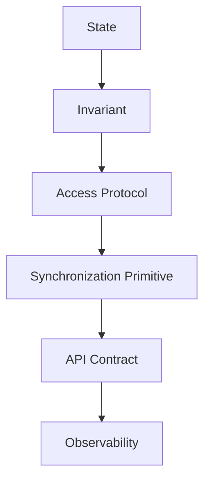

# learn-go-concurrency-parallelism-part-017.md

# Part 017 — Concurrent Data Structures: Maps, Caches, Queues, Rings, and Shards

> Target pembaca: Java software engineer yang ingin memahami desain data structure concurrent di Go secara production-grade: bukan hanya “pakai `sync.Map`”, tetapi bagaimana memilih ownership, lock granularity, sharding, copy-on-write, cache stampede prevention, queue semantics, ring buffer, dan observability.
>
> Fokus part ini: concurrent map, `sync.Map`, sharded map, copy-on-write map, caches, singleflight, queues, ring buffers, lock-free temptation, false sharing, invariants, and production failure modes.

---

## 0. Posisi Part Ini dalam Seri

Sebelumnya:

- Part 005: Go Memory Model.
- Part 006: synchronization primitives.
- Part 007: atomic operations.
- Part 012: ownership models.
- Part 013: worker pools.
- Part 015–016: backpressure, semaphores, rate limiters, bulkheads.

Part ini masuk ke pertanyaan yang sangat praktis:

> Bagaimana membuat atau memilih struktur data yang aman untuk concurrent access di Go?

Di Java, Anda punya:
- `ConcurrentHashMap`,
- `BlockingQueue`,
- `ConcurrentLinkedQueue`,
- `AtomicReference`,
- `LongAdder`,
- `CopyOnWriteArrayList`,
- `LinkedBlockingQueue`,
- `ArrayBlockingQueue`,
- `Disruptor`-style ring buffer via libraries,
- synchronized wrappers.

Di Go, standard library lebih minimal:
- map biasa tidak safe untuk concurrent mutation,
- `sync.Map` ada tapi bukan pengganti map umum,
- channel bisa menjadi queue sederhana,
- mutex/RWMutex sering menjadi pilihan utama,
- atomic pointer cocok untuk immutable snapshot,
- custom sharding sering diperlukan,
- production queue/cache sering butuh policy eksplisit.

---

## 1. Tujuan Pembelajaran

Setelah part ini, Anda harus mampu:

1. Menjelaskan kenapa Go map tidak aman untuk concurrent write.
2. Memilih antara:
   - plain map + mutex,
   - map + RWMutex,
   - sharded map,
   - `sync.Map`,
   - atomic copy-on-write map,
   - actor-owned map.
3. Mendesain cache concurrent:
   - TTL,
   - negative caching,
   - stampede prevention,
   - in-flight dedup,
   - eviction,
   - stale-while-revalidate.
4. Mendesain queue concurrent:
   - bounded,
   - unbounded,
   - blocking,
   - non-blocking,
   - priority,
   - drop policy.
5. Memahami ring buffer:
   - SPSC,
   - MPSC,
   - MPMC,
   - overwrite vs block,
   - sequence counters.
6. Menghindari lock-free overengineering.
7. Mengenali false sharing dan cache-line contention.
8. Membuat invariant-driven data structure design.
9. Menguji dengan race detector, stress test, and invariant test.
10. Menambahkan metrics untuk data structure production.

---

## 2. Mental Model: Data Structure = State + Invariant + Access Protocol

Concurrent data structure bukan sekadar tipe data. Ia adalah kombinasi:



Contoh map cache:

- State:
  - `items map[string]entry`
  - `ttl`
  - `maxSize`
- Invariant:
  - expired item tidak boleh dianggap fresh,
  - size <= maxSize,
  - in-flight load per key max 1,
  - value immutable setelah disimpan.
- Access protocol:
  - `Get`, `Set`, `Delete`, `LoadOrStore`.
- Primitive:
  - mutex/RWMutex/shards/singleflight.
- API:
  - safe for concurrent use?
  - returned value mutable?
  - loader may be called how many times?
- Observability:
  - hits, misses, evictions, load duration, stampede suppression.

Jika Anda tidak bisa menyebut invariant, Anda belum mendesain data structure.

---

## 3. Go Map and Concurrent Access

Go built-in map is not safe for concurrent mutation.

Unsafe:

```go
m := make(map[string]int)

go func() {
    m["a"] = 1
}()

go func() {
    _ = m["a"]
}()
```

This is a data race and may also trigger runtime panic like concurrent map read/write in some cases.

Important:

- Multiple goroutines reading a map concurrently is okay **only if no goroutine mutates it**.
- Any concurrent write requires synchronization.
- Delete is mutation.
- Assigning a new key is mutation.
- Updating a value is mutation.
- Iterating while mutating is unsafe.

Correct with mutex:

```go
type SafeMap struct {
    mu sync.RWMutex
    m  map[string]int
}

func (s *SafeMap) Get(key string) (int, bool) {
    s.mu.RLock()
    defer s.mu.RUnlock()

    v, ok := s.m[key]
    return v, ok
}

func (s *SafeMap) Set(key string, v int) {
    s.mu.Lock()
    defer s.mu.Unlock()

    s.m[key] = v
}
```

---

## 4. Option Matrix for Concurrent Map

| Use case | Recommended starting point |
|---|---|
| simple shared map | `map + sync.Mutex` |
| read-heavy with rare writes | `map + sync.RWMutex` or atomic snapshot |
| high-contention independent keys | sharded map |
| write-once/read-many disjoint keys | `sync.Map` may fit |
| cache with TTL/eviction | custom cache with mutex/shards |
| immutable config registry | atomic pointer to immutable map |
| per-key ordered state | sharded actor/single-owner |
| global consistent snapshot needed | mutex or lock all shards |
| complex eviction priority | custom structure + mutex/heap/list |
| distributed consistency | DB/Redis/external owner |

---

## 5. Plain Map + Mutex

This is the best default for many cases.

```go
type Map[K comparable, V any] struct {
    mu sync.Mutex
    m  map[K]V
}

func NewMap[K comparable, V any]() *Map[K, V] {
    return &Map[K, V]{
        m: make(map[K]V),
    }
}

func (m *Map[K, V]) Get(key K) (V, bool) {
    m.mu.Lock()
    defer m.mu.Unlock()

    v, ok := m.m[key]
    return v, ok
}

func (m *Map[K, V]) Set(key K, value V) {
    m.mu.Lock()
    defer m.mu.Unlock()

    m.m[key] = value
}

func (m *Map[K, V]) Delete(key K) {
    m.mu.Lock()
    defer m.mu.Unlock()

    delete(m.m, key)
}
```

Pros:
- simple,
- easy invariant protection,
- easy snapshot under lock,
- low cognitive load.

Cons:
- one lock bottleneck under high contention,
- no concurrent reads while write,
- long operations under lock hurt latency.

### 5.1 Do Not Call External Code Under Lock

Bad:

```go
m.mu.Lock()
defer m.mu.Unlock()

value := loader(key) // slow external call under lock
m.m[key] = value
```

This blocks all map access.

Better:
- check under lock,
- unlock,
- load,
- lock to store,
- handle duplicate load or use singleflight.

---

## 6. Map + RWMutex

Use when read-heavy.

```go
type RWMap[K comparable, V any] struct {
    mu sync.RWMutex
    m  map[K]V
}

func (m *RWMap[K, V]) Get(key K) (V, bool) {
    m.mu.RLock()
    defer m.mu.RUnlock()

    v, ok := m.m[key]
    return v, ok
}

func (m *RWMap[K, V]) Set(key K, value V) {
    m.mu.Lock()
    defer m.mu.Unlock()

    m.m[key] = value
}
```

### 6.1 RWMutex Is Not Always Faster

RWMutex may be slower if:
- reads are tiny,
- writes frequent,
- lock overhead dominates,
- contention low,
- critical sections very short.

Benchmark with realistic workload.

### 6.2 Avoid Returning Mutable Internal Value

If V is pointer/slice/map, caller can mutate outside lock.

```go
func (m *RWMap[string, *User]) Get(key string) (*User, bool) {
    // returned *User may be mutated concurrently
}
```

Solutions:
- return copy,
- store immutable values,
- expose methods that operate under lock,
- document value ownership.

---

## 7. `sync.Map`

`sync.Map` is specialized. It is not “ConcurrentHashMap for all cases”.

It is optimized for patterns such as:
1. entries written once and read many times,
2. multiple goroutines access disjoint key sets,
3. reducing lock contention in certain read-heavy scenarios.

Basic:

```go
var m sync.Map

m.Store("a", 1)

v, ok := m.Load("a")
if ok {
    n := v.(int)
    _ = n
}

m.Delete("a")
```

Modern APIs include operations like:
- `Load`,
- `Store`,
- `LoadOrStore`,
- `LoadAndDelete`,
- `CompareAndSwap`,
- `CompareAndDelete`,
- `Swap`,
- `Clear` in newer Go versions.

### 7.1 Pros

- safe concurrent use,
- no explicit lock in user code,
- useful for append-only/read-mostly registries,
- avoids global lock contention in specific patterns.

### 7.2 Cons

- type erasure: `any` values,
- harder invariants,
- harder compound operations,
- Range semantics are not snapshot semantics,
- not ideal for frequent overwrites/deletes,
- easy to misuse as generic map replacement.

### 7.3 `LoadOrStore`

```go
actual, loaded := m.LoadOrStore(key, value)
if loaded {
    // another goroutine stored first
}
_ = actual
```

Good for:
- write-once initialization,
- per-key singleton.

But if value construction expensive, this still constructs before call.

```go
value := expensive()
actual, loaded := m.LoadOrStore(key, value)
```

If loaded true, expensive work wasted. Use singleflight or double-check with lock if needed.

### 7.4 Compound Invariant Problem

Bad:

```go
balanceAny, _ := accounts.Load(accountID)
balance := balanceAny.(int)

if balance >= amount {
    accounts.Store(accountID, balance-amount)
}
```

This is not atomic across Load+Store.

Use:
- mutex per account,
- CAS loop with immutable value if appropriate,
- database transaction,
- actor per account.

---

## 8. Atomic Snapshot Map

Best for read-mostly config/registry where writes replace whole map.

```go
type SnapshotMap[K comparable, V any] struct {
    mu      sync.Mutex
    current atomic.Pointer[map[K]V]
}

func NewSnapshotMap[K comparable, V any]() *SnapshotMap[K, V] {
    initial := make(map[K]V)
    s := &SnapshotMap[K, V]{}
    s.current.Store(&initial)
    return s
}

func (s *SnapshotMap[K, V]) Get(key K) (V, bool) {
    m := s.current.Load()
    v, ok := (*m)[key]
    return v, ok
}

func (s *SnapshotMap[K, V]) Set(key K, value V) {
    s.mu.Lock()
    defer s.mu.Unlock()

    old := s.current.Load()
    next := make(map[K]V, len(*old)+1)

    for k, v := range *old {
        next[k] = v
    }

    next[key] = value
    s.current.Store(&next)
}
```

### 8.1 Pros

- readers do not lock,
- readers see consistent snapshot,
- excellent for rare writes,
- simple read path.

### 8.2 Cons

- write copies whole map,
- concurrent writers need serialization,
- old snapshots retained until readers release references,
- values must be immutable or copied,
- not good for frequent writes.

### 8.3 Do Not Mutate Published Map

Bad:

```go
m := s.current.Load()
(*m)[key] = value // race and breaks immutability
```

Published snapshots are read-only by convention and ownership contract.

---

## 9. Sharded Map

Sharding reduces lock contention by splitting map into independent shards.

```go
type ShardedMap[K comparable, V any] struct {
    shards []mapShard[K, V]
    hash   func(K) uint64
}

type mapShard[K comparable, V any] struct {
    mu sync.RWMutex
    m  map[K]V
}
```

Constructor:

```go
func NewShardedMap[K comparable, V any](n int, hash func(K) uint64) *ShardedMap[K, V] {
    if n <= 0 {
        panic("shard count must be > 0")
    }

    shards := make([]mapShard[K, V], n)
    for i := range shards {
        shards[i].m = make(map[K]V)
    }

    return &ShardedMap[K, V]{
        shards: shards,
        hash:   hash,
    }
}
```

Access:

```go
func (s *ShardedMap[K, V]) shard(key K) *mapShard[K, V] {
    h := s.hash(key)
    return &s.shards[int(h%uint64(len(s.shards)))]
}

func (s *ShardedMap[K, V]) Get(key K) (V, bool) {
    sh := s.shard(key)

    sh.mu.RLock()
    defer sh.mu.RUnlock()

    v, ok := sh.m[key]
    return v, ok
}

func (s *ShardedMap[K, V]) Set(key K, value V) {
    sh := s.shard(key)

    sh.mu.Lock()
    defer sh.mu.Unlock()

    sh.m[key] = value
}
```

### 9.1 When Sharding Helps

- many independent keys,
- high concurrent access,
- single lock contention measured,
- global operations rare.

### 9.2 Hot Key Problem

If one key dominates, sharding does not help. That key still maps to one shard.

Solutions:
- per-key locking if operation can split,
- special handling for hot key,
- local aggregation,
- redesign workload.

### 9.3 Snapshot Across Shards

Need stable lock order.

```go
func (s *ShardedMap[K, V]) Snapshot() map[K]V {
    for i := range s.shards {
        s.shards[i].mu.RLock()
    }

    defer func() {
        for i := len(s.shards) - 1; i >= 0; i-- {
            s.shards[i].mu.RUnlock()
        }
    }()

    out := make(map[K]V)
    for i := range s.shards {
        for k, v := range s.shards[i].m {
            out[k] = v
        }
    }

    return out
}
```

But this blocks all writes while snapshotting. If snapshot expensive, consider copy per shard or atomic snapshots.

---

## 10. Cache Data Structure

A cache is not just a map. It has policy.

Common policies:
- TTL,
- max size,
- eviction,
- negative caching,
- refresh,
- stale-while-revalidate,
- singleflight,
- per-key lock,
- serialization/copying.

Basic TTL cache:

```go
type Cache[K comparable, V any] struct {
    mu    sync.Mutex
    items map[K]cacheEntry[V]
}

type cacheEntry[V any] struct {
    value     V
    expiresAt time.Time
}
```

Get:

```go
func (c *Cache[K, V]) Get(key K, now time.Time) (V, bool) {
    c.mu.Lock()
    defer c.mu.Unlock()

    e, ok := c.items[key]
    if !ok {
        var zero V
        return zero, false
    }

    if !e.expiresAt.IsZero() && now.After(e.expiresAt) {
        delete(c.items, key)
        var zero V
        return zero, false
    }

    return e.value, true
}
```

Set:

```go
func (c *Cache[K, V]) Set(key K, value V, ttl time.Duration, now time.Time) {
    c.mu.Lock()
    defer c.mu.Unlock()

    expiresAt := time.Time{}
    if ttl > 0 {
        expiresAt = now.Add(ttl)
    }

    c.items[key] = cacheEntry[V]{
        value:     value,
        expiresAt: expiresAt,
    }
}
```

### 10.1 Cache Value Ownership

If V is mutable:
- caller can mutate cached value,
- another goroutine can observe mutation,
- data race possible.

Solutions:
- store immutable V,
- deep copy on Set/Get,
- expose read-only API,
- document ownership strictly.

---

## 11. Cache Stampede

Naive cache miss:

```go
func (c *Cache[K, V]) GetOrLoad(ctx context.Context, key K, loader func(context.Context, K) (V, error)) (V, error) {
    if v, ok := c.Get(key, time.Now()); ok {
        return v, nil
    }

    v, err := loader(ctx, key)
    if err != nil {
        var zero V
        return zero, err
    }

    c.Set(key, v, time.Minute, time.Now())
    return v, nil
}
```

If 100 goroutines miss same key, all call loader.

Fix:
- singleflight/in-flight dedup,
- per-key lock,
- actor per key,
- stale-while-revalidate.

This topic is deep enough that next Part 018 focuses specifically on singleflight/dedup/idempotency.

---

## 12. Negative Caching

Cache “not found” or failure briefly.

```go
type LookupResult[V any] struct {
    Value V
    Found bool
}
```

Cache result:
- found false with short TTL,
- prevents repeated DB miss.

Caution:
- negative cache can hide newly created data,
- shorter TTL,
- invalidate on write.

---

## 13. Eviction

Max size requires eviction policy:
- random,
- FIFO,
- LRU,
- LFU,
- TTL-only,
- segmented,
- cost-based.

LRU needs:
- map key → list node,
- doubly linked list,
- mutex around both map and list.

Invariant:
- every map entry has exactly one list node,
- list order matches recency,
- size <= max.

Use one mutex for both map and list unless carefully sharded.

Pseudo:

```go
type LRU[K comparable, V any] struct {
    mu    sync.Mutex
    max   int
    items map[K]*list.Element
    order *list.List
}

type entry[K comparable, V any] struct {
    key   K
    value V
}
```

Operations:
- Get moves node to front,
- Set insert/update and evict back,
- Delete removes from map and list.

Do not split map/list locks unless invariant carefully designed.

---

## 14. Queue Data Structures

Queue choices:

| Queue | Use case |
|---|---|
| channel | simple bounded FIFO |
| slice + mutex/cond | custom blocking queue |
| ring buffer | fixed capacity high-throughput |
| heap | priority queue |
| list | flexible dequeue/remove |
| broker | durable/distributed queue |

### 14.1 Channel Queue

```go
jobs := make(chan Job, 100)
```

Pros:
- simple,
- blocking semantics,
- select with context,
- close semantics.

Cons:
- no priority,
- no remove/drop oldest,
- no peek,
- no dynamic resize,
- no custom fairness.

### 14.2 Mutex + Cond Blocking Queue

Use when policy exceeds channel.

```go
type BlockingQueue[T any] struct {
    mu       sync.Mutex
    notEmpty *sync.Cond
    closed   bool
    items    []T
}

func NewBlockingQueue[T any]() *BlockingQueue[T] {
    q := &BlockingQueue[T]{}
    q.notEmpty = sync.NewCond(&q.mu)
    return q
}

func (q *BlockingQueue[T]) Put(v T) error {
    q.mu.Lock()
    defer q.mu.Unlock()

    if q.closed {
        return ErrClosed
    }

    q.items = append(q.items, v)
    q.notEmpty.Signal()
    return nil
}

func (q *BlockingQueue[T]) Take() (T, bool) {
    q.mu.Lock()
    defer q.mu.Unlock()

    for len(q.items) == 0 && !q.closed {
        q.notEmpty.Wait()
    }

    if len(q.items) == 0 && q.closed {
        var zero T
        return zero, false
    }

    v := q.items[0]
    copy(q.items, q.items[1:])
    var zero T
    q.items[len(q.items)-1] = zero
    q.items = q.items[:len(q.items)-1]

    return v, true
}

func (q *BlockingQueue[T]) Close() {
    q.mu.Lock()
    q.closed = true
    q.notEmpty.Broadcast()
    q.mu.Unlock()
}
```

This uses O(n) pop front because slice shifting. Use ring/list for better queue.

### 14.3 Context-Aware Cond Wait?

`sync.Cond` does not directly support context. You need:
- periodic wake,
- close/broadcast on cancellation,
- channel-based design,
- custom condition with context.

For simple context-aware queue, channel is easier.

---

## 15. Ring Buffer

Ring buffer fixed capacity with head/tail indices.

Use cases:
- bounded queue,
- telemetry buffer,
- SPSC high-throughput queue,
- circular log,
- drop-oldest buffer.

Basic non-concurrent ring:

```go
type Ring[T any] struct {
    buf        []T
    head, tail int
    size       int
}
```

Push:

```go
func (r *Ring[T]) Push(v T) bool {
    if r.size == len(r.buf) {
        return false
    }

    r.buf[r.tail] = v
    r.tail = (r.tail + 1) % len(r.buf)
    r.size++
    return true
}
```

Pop:

```go
func (r *Ring[T]) Pop() (T, bool) {
    if r.size == 0 {
        var zero T
        return zero, false
    }

    v := r.buf[r.head]
    var zero T
    r.buf[r.head] = zero
    r.head = (r.head + 1) % len(r.buf)
    r.size--
    return v, true
}
```

Concurrent version:
- easiest: protect with mutex.
- lock-free ring requires careful memory ordering and sequence numbers.

### 15.1 Drop Oldest Ring

```go
func (r *Ring[T]) PushDropOldest(v T) {
    if r.size == len(r.buf) {
        var zero T
        r.buf[r.head] = zero
        r.head = (r.head + 1) % len(r.buf)
        r.size--
    }

    r.Push(v)
}
```

Use for:
- lossy telemetry,
- latest events,
- debug buffer.

Not for must-process jobs.

---

## 16. SPSC, MPSC, MPMC

Queue complexity depends on producers/consumers.

| Pattern | Meaning | Complexity |
|---|---|---|
| SPSC | single producer, single consumer | easiest lock-free |
| MPSC | multiple producers, single consumer | harder |
| SPMC | single producer, multiple consumers | harder |
| MPMC | multiple producers, multiple consumers | hardest |

Most Go services do not need custom lock-free MPMC queue.
Use:
- channel,
- mutex queue,
- worker pool,
- external broker.

Lock-free queue bugs are subtle:
- ABA,
- memory reclamation,
- false sharing,
- ordering,
- starvation,
- hard testing.

---

## 17. Priority Queue

Use heap + mutex/cond.

Use cases:
- priority jobs,
- deadline scheduling,
- retry queue,
- rate scheduling.

Data:

```go
type PriorityItem[T any] struct {
    Value    T
    Priority int
    Seq      int64
}
```

Need invariant:
- heap order by priority,
- stable order by sequence if same priority,
- queue closed wakes waiters,
- context cancellation strategy.

Channel alone cannot do priority.

---

## 18. False Sharing

False sharing occurs when independent hot variables share same cache line and are updated by different CPUs.

Example:

```go
type Counters struct {
    a atomic.Int64
    b atomic.Int64
}
```

If goroutine 1 updates `a` and goroutine 2 updates `b` heavily, they may contend on same cache line.

Mitigation:
- sharded counters,
- padding,
- local aggregation,
- reduce write frequency.

Do not pad blindly. Measure first.

### 18.1 Sharded Counter

```go
type ShardedCounter struct {
    shards []atomic.Int64
}

func (c *ShardedCounter) Add(shard int, delta int64) {
    c.shards[shard%len(c.shards)].Add(delta)
}

func (c *ShardedCounter) Sum() int64 {
    var total int64
    for i := range c.shards {
        total += c.shards[i].Load()
    }
    return total
}
```

For metrics, approximate sharded counters are often fine.

---

## 19. Lock Granularity

### 19.1 Coarse Lock

One lock protects all state.

Pros:
- simple,
- correct,
- easy invariants.

Cons:
- contention.

### 19.2 Fine Lock

Multiple locks protect pieces.

Pros:
- more parallelism.

Cons:
- deadlock risk,
- invariant complexity,
- lock ordering,
- harder review.

### 19.3 Sharded Lock

Partition by key.

Good middle ground.

### 19.4 Lock-Free

Use only when:
- measured lock contention dominates,
- data structure simple enough,
- correctness expertise available,
- testing/stress/review strong.

---

## 20. `atomic.Value` and `atomic.Pointer`

Use for immutable snapshots.

```go
var current atomic.Value // stores *Config

current.Store(&Config{})
cfg := current.Load().(*Config)
```

Typed pointer is usually nicer:

```go
var current atomic.Pointer[Config]

current.Store(cfg)
cfg := current.Load()
```

Rules:
- stored object should be immutable or protected,
- do not mutate after Store,
- use writer mutex for multi-writer copy-on-write,
- readers must handle nil before first store.

---

## 21. Concurrent Slice

Appending to slice concurrently is unsafe.

Bad:

```go
var results []Result

wg.Go(func() {
    results = append(results, r)
})
```

Fix options:

### 21.1 Mutex

```go
var mu sync.Mutex
var results []Result

wg.Go(func() {
    mu.Lock()
    results = append(results, r)
    mu.Unlock()
})
```

### 21.2 Preallocate by Index

If each goroutine has unique index:

```go
results := make([]Result, len(items))

for i, item := range items {
    i, item := i, item

    wg.Go(func() {
        results[i] = process(item)
    })
}

wg.Wait()
```

Safe if unique index and read after wait.

### 21.3 Channel Collection

```go
resultsCh := make(chan Result, len(items))
```

Then collect in one goroutine.

---

## 22. Concurrent Set

Set is map to empty struct.

```go
type Set[K comparable] struct {
    mu sync.RWMutex
    m  map[K]struct{}
}
```

Methods:
- Add,
- Remove,
- Contains,
- Snapshot.

Same map rules.

For read-mostly set, atomic snapshot works well.

---

## 23. Concurrent Registry

Registry often read-mostly:
- route handlers,
- feature flags,
- tenant config,
- codec registry.

Atomic snapshot:

```go
type Registry struct {
    mu      sync.Mutex
    current atomic.Pointer[map[string]Handler]
}
```

Write copies map. Read lock-free.

Good when:
- startup registration,
- rare dynamic updates,
- high read volume.

---

## 24. Actor-Owned Data Structure

Instead of lock, a goroutine owns map.

```go
type command[K comparable, V any] struct {
    kind  string
    key   K
    value V
    reply chan response[V]
}
```

Good for:
- ordered state machine,
- complex mutations,
- async event-driven protocols.

Bad for:
- simple map get/set,
- high read throughput,
- large synchronous API.

Actor-owned map is a data structure plus service loop.

---

## 25. Iterator and Snapshot Semantics

APIs like `Range` are tricky.

Questions:
- Is iteration consistent snapshot?
- Can map mutate during iteration?
- Does Range hold lock while callback runs?
- What if callback calls back into map?
- What if callback blocks?

Bad:

```go
func (m *Map[K, V]) Range(fn func(K, V) bool) {
    m.mu.Lock()
    defer m.mu.Unlock()

    for k, v := range m.m {
        if !fn(k, v) {
            return
        }
    }
}
```

Callback runs under lock. If callback blocks or calls map method, deadlock.

Better snapshot:

```go
func (m *Map[K, V]) Snapshot() map[K]V {
    m.mu.Lock()
    defer m.mu.Unlock()

    out := make(map[K]V, len(m.m))
    for k, v := range m.m {
        out[k] = v
    }

    return out
}
```

Then caller iterates outside lock.

Trade-off:
- copy cost.

---

## 26. Value Copy vs Pointer Return

For concurrent structure, returning pointer can break safety.

```go
func (c *Cache) Get(key string) (*Item, bool)
```

If caller mutates `*Item`, cache internal state changes without lock.

Alternatives:
- return value copy,
- return immutable type,
- deep copy,
- provide update function.

```go
func (c *Cache) Update(key string, fn func(Item) Item) {
    c.mu.Lock()
    defer c.mu.Unlock()

    c.items[key] = fn(c.items[key])
}
```

But callback under lock risk. Keep callback pure/fast or avoid.

---

## 27. Memory Retention

Concurrent data structures often retain memory accidentally.

Examples:
- queue slice pop without zeroing old element,
- cache value references large object,
- goroutine closure captures large buffer,
- ring buffer overwritten without clearing pointer,
- map delete but value referenced elsewhere.

When removing pointer-containing values, zero slot.

```go
v := q.items[0]
var zero T
q.items[0] = zero
q.items = q.items[1:]
```

For ring:

```go
var zero T
r.buf[r.head] = zero
```

This helps GC reclaim.

---

## 28. Observability

For maps/caches:
- size,
- hits,
- misses,
- hit ratio,
- evictions,
- expired,
- load duration,
- load errors,
- stampede suppressed,
- lock wait/operation latency,
- shard skew.

For queues/rings:
- depth,
- capacity,
- enqueue count,
- dequeue count,
- dropped,
- rejected,
- oldest item age,
- wait duration.

For limiters/counters:
- in-flight,
- denied,
- wait duration,
- contention.

For all:
- panic count if callbacks/handlers,
- memory usage,
- goroutine count if actor-owned.

---

## 29. Testing Concurrent Data Structures

### 29.1 Race Detector

```bash
go test -race ./...
```

### 29.2 Invariant Tests

Example LRU:
- size never exceeds max,
- map/list count equal,
- get moves to front,
- evicted item absent.

### 29.3 Concurrent Stress

```go
func TestConcurrentMapStress(t *testing.T) {
    m := NewMap[string, int]()

    var wg sync.WaitGroup

    for i := 0; i < 100; i++ {
        i := i

        wg.Go(func() {
            for j := 0; j < 1000; j++ {
                key := fmt.Sprintf("%d", j%10)
                m.Set(key, i*j)
                _, _ = m.Get(key)
            }
        })
    }

    wg.Wait()
}
```

### 29.4 Linearizability?

For complex concurrent structures, consider linearizability testing:
- define sequential model,
- run concurrent operations,
- verify history possible.

This is advanced but valuable for custom queues/lock-free structures.

### 29.5 Fuzzing

Fuzz operation sequences:
- Put,
- Get,
- Delete,
- Snapshot,
- Close,
- Push,
- Pop.

Combine with race detector and stress.

---

## 30. Case Study 1: Read-Mostly Config Map

Requirement:
- millions of reads/sec,
- reload few times/hour,
- readers need consistent snapshot.

Use:
- atomic pointer to immutable map,
- writer mutex,
- deep copy on reload.

Do not:
- use `sync.Map` blindly,
- mutate map in place,
- return mutable nested objects.

---

## 31. Case Study 2: High-Write Metrics Counter

Requirement:
- increment counter per request,
- read total periodically.

Use:
- atomic counter,
- or sharded counter under high contention.

Do not:
- use mutex map for single global counter unless low volume,
- use channel actor for each increment.

---

## 32. Case Study 3: TTL Cache with External Load

Requirement:
- cache user profiles,
- TTL 5 minutes,
- many concurrent requests,
- avoid stampede.

Use:
- sharded cache map,
- singleflight per key,
- immutable values,
- negative caching for not found,
- metrics.

Potential design:
- shard map lock for get/set,
- singleflight outside lock,
- loader respects context,
- TTL checked under lock,
- stale-while-revalidate optional.

---

## 33. Case Study 4: Priority Job Queue

Requirement:
- high-priority jobs before low,
- bounded capacity,
- blocking workers,
- context-aware submit.

Channel is insufficient.

Use:
- heap + mutex/cond,
- capacity,
- close state,
- optional per-priority limits,
- context integration.

If context-aware wait is complex, use submit fail-fast/bounded condition with custom wake channel.

---

## 34. Case Study 5: Recent Events Ring

Requirement:
- store last 1000 events for debugging,
- concurrent writers,
- readers snapshot occasionally,
- losing old events acceptable.

Use:
- ring buffer + mutex,
- overwrite oldest,
- snapshot copies.

```go
type RecentEvents[T any] struct {
    mu   sync.Mutex
    ring Ring[T]
}
```

No need lock-free. Simplicity wins.

---

## 35. Anti-Pattern Catalog

### 35.1 `sync.Map` Everywhere

Hides invariant issues and type safety.

### 35.2 Returning Internal Mutable Pointer

Breaks ownership.

### 35.3 Map + RWMutex for Write-Heavy Workload

May underperform plain mutex.

### 35.4 Atomic for Multi-Field Invariant

Exposes inconsistent state.

### 35.5 Channel Actor for Simple Map

Overcomplicated and bottlenecked.

### 35.6 Sharding Without Measuring

Complexity without benefit.

### 35.7 Global Lock Around Slow IO

All operations blocked by dependency.

### 35.8 Queue Slice Pop Without Clearing

Memory retention.

### 35.9 Range Callback Under Lock

Deadlock/latency risk.

### 35.10 Lock-Free Queue Without Need

Subtle bugs, hard maintenance.

### 35.11 Cache Without Stampede Protection

Downstream overload on misses.

### 35.12 Cache Without Value Ownership

Data races through mutable values.

---

## 36. Design Review Checklist

For every concurrent data structure:

1. What state is protected?
2. What invariant must hold?
3. Who owns mutation?
4. Is it safe for concurrent use?
5. Are values immutable or copied?
6. Does Get expose internal mutable state?
7. Is map mutated under lock?
8. Is iteration snapshot or live?
9. Are callbacks executed under lock?
10. Is lock granularity justified?
11. Is sharding needed and measured?
12. Are shard global operations safe?
13. Is `sync.Map` use case appropriate?
14. Is atomic only used for simple state/snapshot?
15. Are multi-field invariants protected together?
16. Are queues bounded?
17. What happens when queue full?
18. Is memory cleared on pop/delete?
19. Are eviction policies explicit?
20. Is TTL checked correctly?
21. Is stampede prevented?
22. Are errors from loaders handled?
23. Are context/deadline passed to loader?
24. Are metrics available?
25. Are tests run with race detector?
26. Are stress/invariant tests present?
27. Is lock-free justified?
28. Is external consistency needed instead of local structure?
29. Is false sharing relevant/measured?
30. Is simpler design possible?

---

## 37. Mini Lab 1: Safe Generic Map

Implement:

```go
type SafeMap[K comparable, V any] struct {
    // ...
}

func (m *SafeMap[K,V]) Get(K) (V,bool)
func (m *SafeMap[K,V]) Set(K,V)
func (m *SafeMap[K,V]) Delete(K)
func (m *SafeMap[K,V]) Snapshot() map[K]V
```

Requirements:
- safe concurrent use,
- no callback under lock,
- snapshot copy,
- race tests.

---

## 38. Mini Lab 2: Sharded Map

Implement:
- shard count configurable,
- hash for string keys,
- Get/Set/Delete,
- Snapshot locks shards in order,
- metrics per shard size.

Benchmark:
- single mutex vs sharded map,
- read-heavy,
- write-heavy,
- hot key,
- uniform key distribution.

---

## 39. Mini Lab 3: Atomic Snapshot Registry

Implement:
- immutable map snapshot,
- writer mutex,
- atomic pointer publication,
- read without lock.

Test:
- concurrent reads during reload,
- no mutation of old snapshot,
- version increments.

---

## 40. Mini Lab 4: TTL Cache

Implement:
- Get,
- Set,
- Delete,
- GetOrLoad,
- TTL expiration,
- negative caching,
- metrics.

Then improve with in-flight dedup in Part 018.

---

## 41. Mini Lab 5: Ring Buffer

Implement:
- fixed capacity,
- Push,
- Pop,
- PushDropOldest,
- Snapshot,
- mutex-protected concurrent version.

Test:
- wraparound,
- overwrite,
- memory clearing,
- concurrent writers.

---

## 42. Mini Lab 6: Priority Queue

Implement:
- heap-based priority queue,
- max capacity,
- Put,
- Take,
- Close,
- stable ordering for same priority.

Think:
- context-aware wait,
- drop policy,
- fairness,
- starvation.

---

## 43. Top 1% Heuristics

1. Start with invariant, not primitive.
2. Plain map + mutex is often the correct answer.
3. `sync.Map` is specialized; do not use it as reflex.
4. Atomic snapshots are excellent for read-mostly immutable state.
5. Sharding helps only if contention is real and keys distribute.
6. Returning internal mutable references breaks thread safety.
7. Cache without stampede control can amplify outages.
8. Queue capacity and drop policy are part of data structure contract.
9. Lock-free is rarely worth it unless measured and heavily tested.
10. Snapshot semantics must be explicit.
11. Callbacks under lock are dangerous.
12. Memory retention matters for queues/rings with pointer values.
13. Values need ownership rules as much as containers do.
14. Race detector is necessary but not sufficient.
15. A concurrent data structure without metrics is hard to operate.

---

## 44. Source Notes

Primary Go concepts behind this part:

1. Go map semantics:
   - built-in map is not safe for concurrent mutation.

2. Go Memory Model:
   - synchronization required for shared mutable state.

3. `sync` package:
   - Mutex, RWMutex, Map, Cond.

4. `sync/atomic`:
   - atomic pointer/value publication.

5. Channel semantics:
   - bounded FIFO queue for simple use cases.

6. Data structure design:
   - invariants,
   - lock granularity,
   - sharding,
   - copy-on-write,
   - ring buffers,
   - priority queues.

---

## 45. Summary

Concurrent data structures are not selected by taste. They are designed from:

- state,
- invariant,
- ownership,
- access pattern,
- contention,
- lifecycle,
- observability.

Use the simplest structure that preserves correctness:

- local state if possible,
- mutex for shared invariant,
- RWMutex for proven read-heavy pattern,
- atomic snapshot for immutable read-mostly state,
- sharded map for measured contention,
- `sync.Map` for its specialized patterns,
- channel for simple bounded FIFO/handoff,
- custom queue for priority/fairness/drop policy,
- external store for distributed consistency.

The strongest Go engineers are not those who avoid locks. They are those who put synchronization exactly where the invariant lives.

---

## 46. Status Seri

Selesai:
- Part 000 — Orientation
- Part 001 — Foundations
- Part 002 — Goroutine Internals
- Part 003 — Go Scheduler Deep Dive
- Part 004 — GOMAXPROCS, CPU Quotas, Containers
- Part 005 — Go Memory Model
- Part 006 — Synchronization Primitives
- Part 007 — Atomic Operations
- Part 008 — Channels Deep Dive
- Part 009 — Select Semantics
- Part 010 — WaitGroup, ErrGroup, Task Groups, and Structured Concurrency
- Part 011 — Context as Concurrency Contract
- Part 012 — Ownership Models
- Part 013 — Worker Pools
- Part 014 — Fan-Out/Fan-In, Pipelines, Stages, and Stream Processing
- Part 015 — Backpressure End-to-End
- Part 016 — Semaphores, Rate Limiters, Token Buckets, and Bulkheads
- Part 017 — Concurrent Data Structures

Belum selesai:
- Part 018 sampai Part 034.

Seri belum mencapai bagian terakhir.


<!-- NAVIGATION_FOOTER -->
<div class="page-nav">
<a href="./learn-go-concurrency-parallelism-part-016.md">⬅️ Part 016 — Semaphores, Rate Limiters, Token Buckets, and Bulkheads</a>
<a href="./index.md">📚 Kategori</a>
<a href="../../index.md">🏠 Home</a>
<a href="./learn-go-concurrency-parallelism-part-018.md">Part 018 — Singleflight, Deduplication, Idempotency, and Stampede Prevention ➡️</a>
</div>
