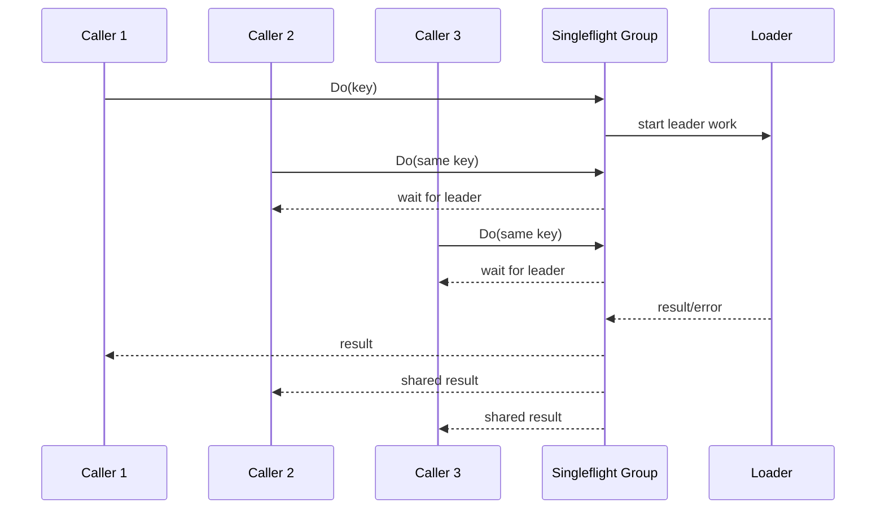
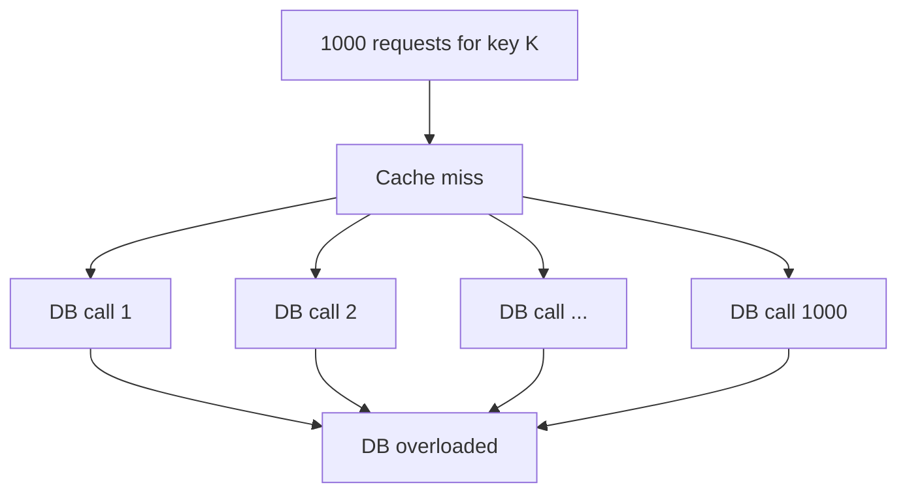
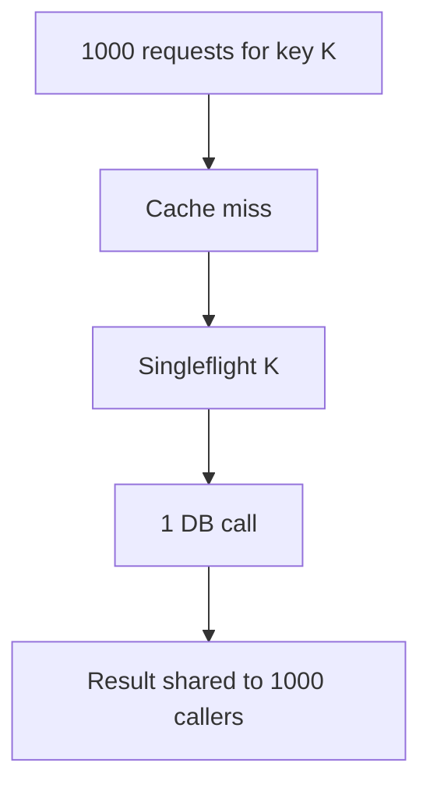
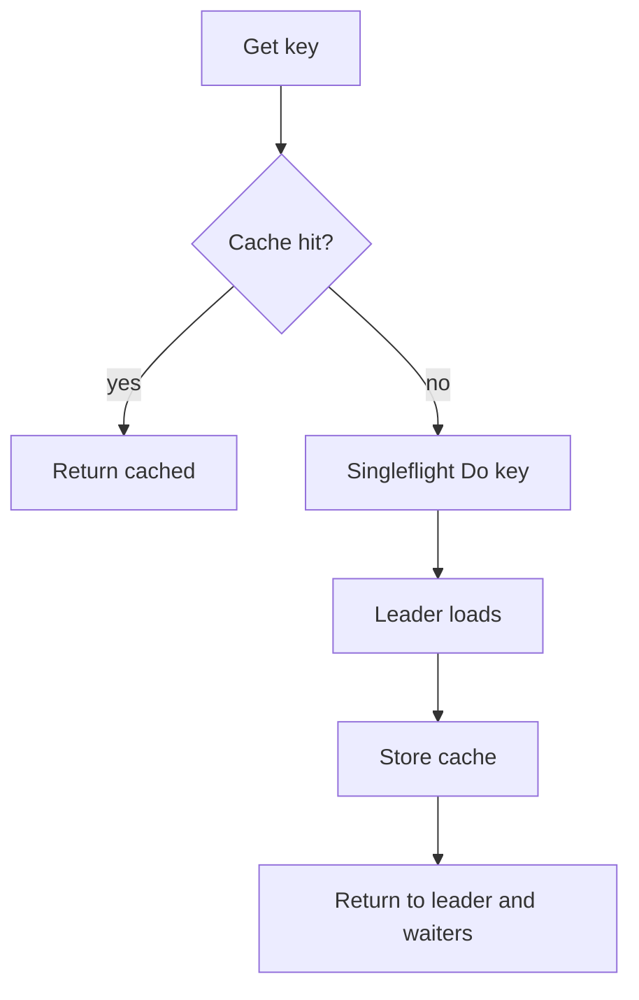
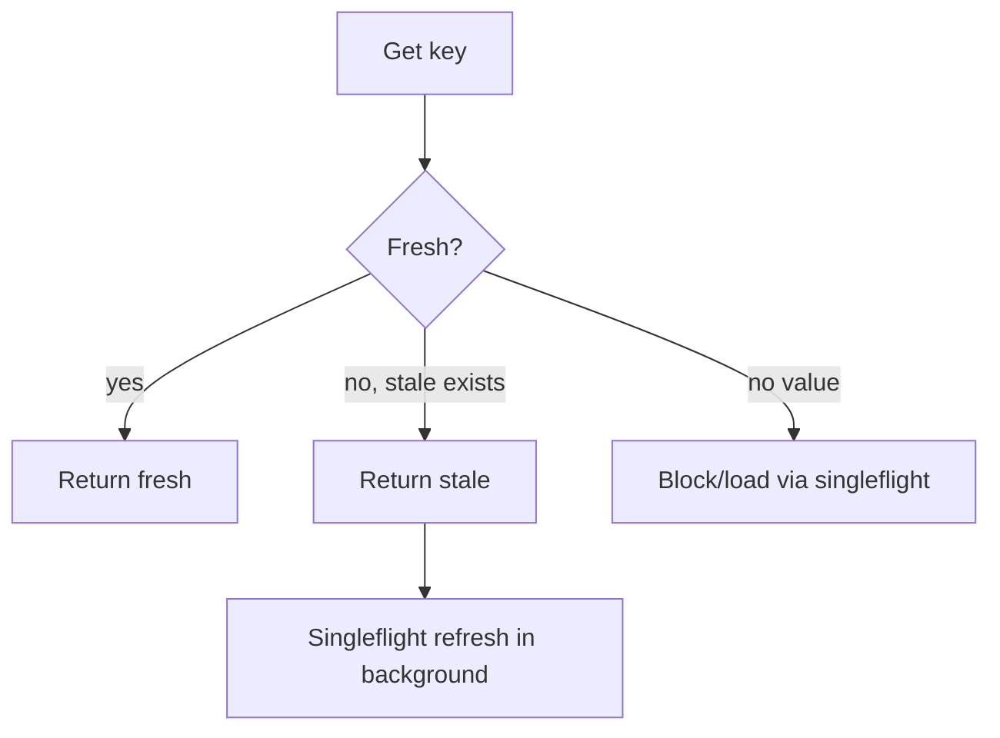
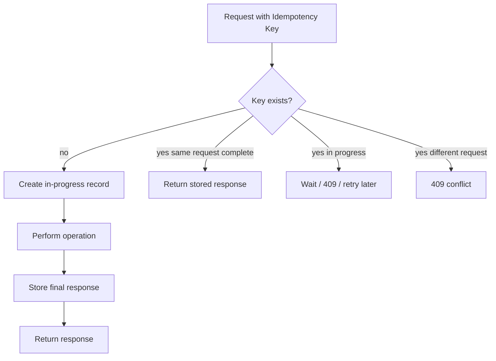

# learn-go-concurrency-parallelism-part-018.md

# Part 018 — Singleflight, Deduplication, Idempotency, and Stampede Prevention

> Target pembaca: Java software engineer yang ingin memahami cara mencegah duplicate work, cache stampede, retry amplification, duplicate side effect, dan repeated expensive calls di Go production system.
>
> Fokus part ini: `singleflight`, in-flight deduplication, cache stampede prevention, request coalescing, idempotency key, duplicate suppression, negative caching, stale-while-revalidate, per-key locking, distributed dedup, and production failure modes.

---

## 0. Posisi Part Ini dalam Seri

Sebelumnya:

- Part 013: worker pools.
- Part 015: backpressure end-to-end.
- Part 016: semaphores/rate limiters/bulkheads.
- Part 017: concurrent data structures.

Part ini membahas satu masalah yang sering muncul di sistem concurrent:

> Banyak goroutine menerima permintaan yang sama, lalu semuanya melakukan expensive work yang sama.

Contoh:
- 1000 request cache miss key yang sama.
- 200 goroutine reload config yang sama.
- 50 worker retry call idempotent yang sama.
- Banyak request refresh token bersamaan.
- Banyak service instance memproses event duplicate.
- Banyak API call membuat pembayaran/order/email duplicate.

Solusi tidak cukup dengan mutex. Kita perlu memahami:

1. **In-flight deduplication** — saat work sedang berjalan, request lain menunggu hasil yang sama.
2. **Singleflight** — bentuk in-flight dedup per key.
3. **Idempotency** — side effect aman jika dipanggil lebih dari sekali.
4. **Negative caching** — cache miss/failure singkat.
5. **Stale-while-revalidate** — gunakan value lama saat refresh berjalan.
6. **Distributed dedup** — duplicate suppression lintas process/pod.
7. **Backpressure** — dedup bukan alasan membiarkan semua caller menunggu tanpa limit.

---

## 1. Tujuan Pembelajaran

Setelah part ini, Anda harus mampu:

1. Menjelaskan cache stampede dan thundering herd.
2. Mendesain in-flight deduplication per key.
3. Menggunakan atau meniru `singleflight` dengan benar.
4. Membedakan:
   - dedup in-flight,
   - cache,
   - idempotency,
   - rate limiting,
   - locking,
   - distributed lock.
5. Menggabungkan singleflight dengan cache TTL.
6. Mendesain negative caching dan stale-while-revalidate.
7. Menghindari failure mode:
   - shared error fan-out,
   - slow leader blocks many waiters,
   - high-cardinality key memory growth,
   - cancellation semantics salah,
   - panic leader,
   - duplicate side effects,
   - distributed duplicate.
8. Mendesain idempotency key untuk HTTP/gRPC/message processing.
9. Menentukan kapan dedup lokal cukup dan kapan butuh external store.
10. Membuat metrics:
    - dedup hits,
    - shared calls,
    - leader duration,
    - waiter count,
    - stampede suppressed,
    - idempotency duplicates.

---

## 2. Mental Model: Same Work, One Leader, Many Waiters

Singleflight pattern:



Terms:
- **key**: identity of duplicate work.
- **leader**: first caller that starts work.
- **waiters**: callers that join same in-flight work.
- **shared result**: same result returned to many callers.
- **forget**: remove in-flight entry so future calls can start new work.

Core idea:

> Dedup in-flight work, not necessarily cache completed work forever.

---

## 3. Java Translation

Java analogs:
- `ConcurrentHashMap<K, CompletableFuture<V>>`
- `computeIfAbsent(key, k -> futureLoader())`
- Caffeine cache async loader
- Guava cache loader
- memoizer pattern
- promise/future per key
- idempotency table in DB
- distributed lock/lease

Equivalent Java-ish pattern:

```java
ConcurrentHashMap<String, CompletableFuture<Value>> inFlight = new ConcurrentHashMap<>();

CompletableFuture<Value> f = inFlight.computeIfAbsent(key, k ->
    CompletableFuture.supplyAsync(() -> load(k), executor)
        .whenComplete((v, e) -> inFlight.remove(k))
);

return f.get();
```

Go equivalent often uses:
- `singleflight.Group`,
- map key → call with waitgroup,
- per-key mutex,
- cache with in-flight state.

---

## 4. Problem: Cache Stampede

Naive cache:

```go
func (c *Cache) GetOrLoad(ctx context.Context, key string) (Value, error) {
    if v, ok := c.Get(key); ok {
        return v, nil
    }

    v, err := c.Load(ctx, key)
    if err != nil {
        return Value{}, err
    }

    c.Set(key, v)
    return v, nil
}
```

If 1000 goroutines miss same key:
- all call `Load`,
- DB/API gets 1000 duplicate calls,
- latency rises,
- retries may amplify,
- cache fill delayed,
- downstream may fail,
- error fan-out triggers more retries.

This is cache stampede.



With singleflight:



---

## 5. Singleflight Is Not Cache

Singleflight:
- dedups concurrent work while in-flight.
- after work completes, result is not automatically cached unless you store it.

Cache:
- stores completed result for future calls.
- may still stampede on miss unless deduped.

You usually combine:

```text
check cache -> if miss, singleflight load -> store cache -> return
```



---

## 6. Basic Singleflight Usage

Conceptually:

```go
var group singleflight.Group

v, err, shared := group.Do(key, func() (any, error) {
    return load(ctx, key)
})
if err != nil {
    return Value{}, err
}

_ = shared // true if result shared with other callers

return v.(Value), nil
```

`shared` means more than one caller received same result.

### 6.1 Type Safety Wrapper

Because result is `any`, wrap it:

```go
type Loader[V any] struct {
    group singleflight.Group
    load  func(context.Context, string) (V, error)
}

func (l *Loader[V]) Load(ctx context.Context, key string) (V, error, bool) {
    v, err, shared := l.group.Do(key, func() (any, error) {
        return l.load(ctx, key)
    })
    if err != nil {
        var zero V
        return zero, err, shared
    }

    return v.(V), nil, shared
}
```

This still panics if loader returns wrong type internally. Since wrapper controls loader, acceptable.

---

## 7. Singleflight with Cache

```go
type Cache[K comparable, V any] struct {
    mu    sync.Mutex
    items map[K]entry[V]
    group singleflight.Group

    load func(context.Context, K) (V, error)
    ttl  time.Duration
}

type entry[V any] struct {
    value     V
    expiresAt time.Time
}
```

Get:

```go
func (c *Cache[K, V]) Get(ctx context.Context, key K) (V, error) {
    now := time.Now()

    if v, ok := c.getFresh(key, now); ok {
        return v, nil
    }

    sfKey := fmt.Sprintf("%v", key)

    vAny, err, _ := c.group.Do(sfKey, func() (any, error) {
        now := time.Now()

        // Double-check cache inside singleflight.
        if v, ok := c.getFresh(key, now); ok {
            return v, nil
        }

        v, err := c.load(ctx, key)
        if err != nil {
            var zero V
            return zero, err
        }

        c.set(key, v, now.Add(c.ttl))
        return v, nil
    })
    if err != nil {
        var zero V
        return zero, err
    }

    return vAny.(V), nil
}
```

Helper:

```go
func (c *Cache[K, V]) getFresh(key K, now time.Time) (V, bool) {
    c.mu.Lock()
    defer c.mu.Unlock()

    e, ok := c.items[key]
    if !ok {
        var zero V
        return zero, false
    }

    if !e.expiresAt.IsZero() && now.After(e.expiresAt) {
        delete(c.items, key)
        var zero V
        return zero, false
    }

    return e.value, true
}

func (c *Cache[K, V]) set(key K, value V, expiresAt time.Time) {
    c.mu.Lock()
    defer c.mu.Unlock()

    c.items[key] = entry[V]{
        value:     value,
        expiresAt: expiresAt,
    }
}
```

### 7.1 Why Double-Check Inside Singleflight?

Race:
1. Caller A misses cache and becomes leader.
2. Caller B misses cache and waits.
3. Another process/path fills cache before leader loads.
4. Leader should check cache again to avoid unnecessary load.

Double-check reduces waste.

---

## 8. Key Design

Singleflight quality depends on key quality.

Good key:
- uniquely identifies work,
- stable,
- bounded size,
- no sensitive data in raw form,
- normalized,
- includes relevant parameters,
- excludes irrelevant request metadata.

Examples:

```go
key := "user:" + userID
key := fmt.Sprintf("postal:%s", normalizedPostalCode)
key := fmt.Sprintf("product:%s:currency:%s", productID, currency)
```

Bad:
- include timestamp unnecessarily,
- include request ID,
- include random nonce,
- include unnormalized JSON string,
- include auth token,
- huge key,
- key omits parameter that affects result.

If key too broad:
- wrong result shared.

If key too narrow:
- dedup ineffective.

---

## 9. Cancellation Semantics

This is subtle.

If leader uses the first caller’s context:

```go
group.Do(key, func() (any, error) {
    return load(ctx, key)
})
```

What if first caller cancels but other waiters still want result?

Then leader load may cancel and all waiters receive cancellation error.

### 9.1 Request-Scoped Work

If result is only useful for the same request/caller scope, using caller ctx is okay.

### 9.2 Shared Cache Load

For cache fill shared by many callers, using first caller context may be wrong.

Alternative:
- use service-level context plus per-load timeout,
- decouple from individual caller cancellation,
- but allow waiter to stop waiting if its ctx cancels.

This requires custom design because simple `Do` waits until leader completes.

### 9.3 Waiter Cancellation

If caller waits on singleflight but its context cancels, should it stop waiting?

Some singleflight APIs provide channel-based result (`DoChan`) where caller can select on ctx.

Conceptual:

```go
ch := group.DoChan(key, func() (any, error) {
    return load(loadCtx, key)
})

select {
case res := <-ch:
    if res.Err != nil {
        return zero, res.Err
    }
    return res.Val.(V), nil

case <-ctx.Done():
    return zero, ctx.Err()
}
```

Now:
- leader may continue,
- this caller stops waiting,
- cache can still be filled.

### 9.4 Context Policy Matrix

| Scenario | Leader context |
|---|---|
| request-only computation | caller ctx |
| cache fill shared across requests | service ctx + load timeout |
| background refresh | service ctx |
| user-specific auth-sensitive call | caller ctx or scoped ctx |
| expensive optional data | caller ctx with small timeout |
| idempotency side effect | operation context tied to transaction/deadline |

Document the policy.

---

## 10. Slow Leader Problem

If leader is slow:
- all waiters wait,
- p99 latency may spike,
- waiter count can grow,
- memory retained.

Mitigations:
- per-load timeout,
- waiter cancellation,
- max waiters per key,
- stale-while-revalidate,
- fallback,
- circuit breaker,
- negative caching,
- rate limit leader creation.

### 10.1 Max Waiters

Custom singleflight can track waiter count.

Policy:
- if waiters exceed N, reject new waiters,
- return stale value,
- fail fast.

This prevents one hot key from consuming memory.

---

## 11. Shared Error Problem

If leader fails, all waiters receive same error.

This can cause synchronized retry:
- 1000 callers get error,
- all retry,
- new singleflight starts,
- stampede repeats.

Mitigations:
- negative cache errors briefly,
- jitter retry at caller,
- circuit breaker,
- stale-if-error,
- backoff,
- rate limit.

### 11.1 Negative Error Cache

Cache failure for short TTL.

```go
type entry[V any] struct {
    value     V
    err       error
    expiresAt time.Time
}
```

Use short TTL:
- 100ms–2s depending dependency.
- not too long or you hide recovery.

Policy:
- cache not-found longer than transient failure?
- cache 5xx? Usually briefly.
- cache auth error? carefully.
- cache validation error? maybe.

---

## 12. Negative Caching

For “not found”:

```go
type Lookup[V any] struct {
    Value V
    Found bool
}
```

Cache:
- found true: normal TTL.
- found false: shorter TTL.

```go
func (c *Cache[K, V]) GetLookup(ctx context.Context, key K) (V, bool, error)
```

Benefits:
- prevents repeated DB misses,
- protects storage.

Risks:
- newly created data invisible until negative TTL expires,
- invalidation needed on create/update.

---

## 13. Stale-While-Revalidate

Instead of blocking all callers on refresh:
- return stale value if available,
- trigger one background refresh,
- update cache when done.



Entry:

```go
type entry[V any] struct {
    value      V
    freshUntil time.Time
    staleUntil time.Time
}
```

Get:
- if now <= freshUntil: return value.
- if now <= staleUntil: return value and refresh async.
- if beyond staleUntil: block load.

### 13.1 Background Refresh Ownership

Do not spawn unbounded goroutines per request.

Use:
- singleflight refresh,
- bounded background pool,
- service context,
- rate limit.

```go
func (c *Cache[K, V]) refreshAsync(key K) {
    if !c.refreshLimiter.TryAcquire() {
        return
    }

    go func() {
        defer c.refreshLimiter.Release()

        _, _, _ = c.group.Do(c.keyString(key), func() (any, error) {
            ctx, cancel := context.WithTimeout(c.serviceCtx, c.loadTimeout)
            defer cancel()

            v, err := c.load(ctx, key)
            if err != nil {
                return nil, err
            }

            c.setFresh(key, v)
            return v, nil
        })
    }()
}
```

But spawning goroutine still needs lifecycle. Better: submit refresh job to bounded dispatcher.

---

## 14. Per-Key Locking

Alternative to singleflight: per-key mutex.

```go
type KeyedLocker[K comparable] struct {
    mu    sync.Mutex
    locks map[K]*refLock
}

type refLock struct {
    mu   sync.Mutex
    refs int
}
```

Flow:
- acquire global map lock,
- get/create lock for key,
- increment refs,
- release global,
- lock key mutex,
- do work,
- unlock key,
- decrement refs and cleanup.

This is more complex than singleflight.

Per-key lock useful when:
- you need exclusive mutation per key,
- not just sharing result,
- operations may not return same result,
- you need serialized updates.

Singleflight useful when:
- duplicate calls should share one result.

---

## 15. Idempotency

Dedup in-flight is local and temporary.
Idempotency is semantic guarantee that duplicate operation has same effect as one operation.

Example:
- creating payment,
- sending email,
- creating order,
- processing message,
- writing event.

Idempotency key:

```text
Idempotency-Key: client-generated-unique-key
```

Server stores:
- key,
- request hash,
- status,
- response,
- expiration.

If duplicate arrives:
- same request hash → return stored response,
- different request hash → reject conflict.



### 15.1 Local Singleflight Is Not Idempotency

If process crashes:
- singleflight state gone.
- duplicate request may repeat side effect.

For critical side effects:
- use durable idempotency store,
- DB unique constraint,
- transaction,
- external API idempotency key.

---

## 16. Idempotency Store Design

Table conceptual:

```sql
idempotency_key
request_hash
status
response_body
error_code
created_at
expires_at
locked_until
```

Status:
- in_progress,
- succeeded,
- failed_retryable,
- failed_final.

Flow:
1. Begin transaction.
2. Insert key if absent.
3. If conflict, inspect existing row.
4. If same complete, return stored result.
5. If in-progress, return 409/202 or wait depending API.
6. Perform operation once.
7. Store response.
8. Commit.

### 16.1 Request Hash

Prevents misuse:
- same key with different payload should not return wrong response.

```text
hash(method + path + normalized_body + tenant_id)
```

### 16.2 TTL

Keep keys long enough for client retries.
Do not keep forever unless required.

---

## 17. Message Processing Dedup

For brokers:
- messages may be delivered more than once.
- consumer must be idempotent.

Dedup keys:
- message ID,
- event ID,
- aggregate version,
- idempotency key,
- natural unique key.

DB unique constraint:

```sql
insert into processed_messages(message_id, processed_at)
values (?, now())
on conflict do nothing;
```

If insert succeeds:
- process.
If conflict:
- duplicate, skip.

But transaction boundaries matter:
- record processed and side effect should be atomic if possible.
- otherwise crash can create false processed marker.

Better:
- process and marker in same transaction,
- outbox/inbox pattern.

---

## 18. Distributed Singleflight

Local singleflight dedups within one process only.

If you have 10 pods:
- each pod can still run one leader,
- total 10 duplicate loads.

Distributed options:
1. accept approximate local dedup,
2. distributed lock/lease,
3. Redis SETNX lock,
4. DB row lock,
5. external cache,
6. queue/partition owner,
7. request routing by key.

### 18.1 Distributed Lock Risks

Distributed locks are hard:
- lock expiry while work still running,
- clock skew,
- process pause,
- network partition,
- lock holder crash,
- duplicate work anyway.

For many cache loads, local singleflight + external cache is enough.

For side effects, use idempotency store, not just lock.

---

## 19. Request Coalescing

At API boundary, coalesce identical in-flight reads.

Example:
- GET `/products/123?currency=USD`

Key:
```text
GET:/products/123:currency=USD:tenant=T
```

If same request arrives concurrently:
- one backend call,
- many waiters.

Caution:
- auth/authorization must be part of key or verified separately.
- do not share response across users if result differs.
- include content negotiation/language/tenant.

---

## 20. Refresh Token Dedup

Common problem:
- many goroutines see token expired,
- all refresh token,
- refresh endpoint rate limited,
- some refresh calls invalidate previous token.

Use singleflight around token refresh:

```go
func (c *TokenClient) Token(ctx context.Context) (string, error) {
    if token := c.currentValidToken(); token != "" {
        return token, nil
    }

    v, err, _ := c.group.Do("refresh-token", func() (any, error) {
        if token := c.currentValidToken(); token != "" {
            return token, nil
        }

        return c.refresh(ctx)
    })
    if err != nil {
        return "", err
    }

    return v.(string), nil
}
```

Double-check inside group is essential.

---

## 21. Config Reload Dedup

If many requests trigger reload:

```go
v, err, _ := group.Do("config-reload", func() (any, error) {
    return loadConfig(ctx)
})
```

But usually config reload should be:
- background controlled,
- rate limited,
- not request-triggered unbounded,
- atomic snapshot publication.

Singleflight prevents duplicate reload, but does not define reload policy.

---

## 22. Dedup and Authorization

Never share result across authorization boundaries incorrectly.

Bad key:

```go
key := "document:" + docID
```

If result differs by user permission, caller B may receive data loaded for caller A.

Fix:
- include authorization scope in key,
- or load common data then apply per-caller auth separately,
- or do not coalesce across users.

Example key:

```go
key := fmt.Sprintf("document:%s:user:%s:scope:%s", docID, userID, scopeHash)
```

But this reduces dedup. Correctness wins.

---

## 23. Dedup and Partial Failure

If leader partially performs side effect then returns error, waiters may retry.

Example:
- email sent,
- DB update failed,
- leader returns error,
- all waiters retry,
- duplicate emails.

This is not a singleflight problem. This is side-effect idempotency problem.

Fix:
- idempotency key,
- outbox,
- transactional side effects,
- exactly-once impossible across arbitrary external systems,
- design for at-least-once with idempotent consumers.

---

## 24. Custom Singleflight Implementation

Understanding implementation helps reasoning.

```go
type Group[K comparable, V any] struct {
    mu sync.Mutex
    m  map[K]*call[V]
}

type call[V any] struct {
    wg  sync.WaitGroup
    val V
    err error
    dup int
}
```

Do:

```go
func (g *Group[K, V]) Do(key K, fn func() (V, error)) (V, error, bool) {
    g.mu.Lock()
    if g.m == nil {
        g.m = make(map[K]*call[V])
    }

    if c := g.m[key]; c != nil {
        c.dup++
        g.mu.Unlock()

        c.wg.Wait()
        return c.val, c.err, true
    }

    c := &call[V]{}
    c.wg.Add(1)
    g.m[key] = c
    g.mu.Unlock()

    c.val, c.err = fn()
    c.wg.Done()

    g.mu.Lock()
    delete(g.m, key)
    g.mu.Unlock()

    return c.val, c.err, c.dup > 0
}
```

Important:
- leader stores call before executing fn,
- waiters wait on call wg,
- result fields written before Done,
- waiters read after Wait,
- delete after completion.

### 24.1 Panic Handling

If `fn` panics, `wg.Done` may not happen and waiters block forever unless deferred.

```go
defer c.wg.Done()
```

But then what error do waiters get?

Production implementation should define panic policy:
- re-panic to all?
- convert to error?
- crash process?
- release waiters?

A simple safe version:

```go
func (g *Group[K, V]) Do(key K, fn func() (V, error)) (v V, err error, shared bool) {
    // setup omitted

    defer func() {
        if r := recover(); r != nil {
            err = fmt.Errorf("singleflight panic: %v", r)
            c.err = err
        }

        c.wg.Done()

        g.mu.Lock()
        delete(g.m, key)
        g.mu.Unlock()
    }()

    c.val, c.err = fn()
    return c.val, c.err, c.dup > 0
}
```

But recovering panic may hide bug. Choose policy.

### 24.2 Waiter Context

This simple implementation does not allow waiter to stop waiting. To support it, use result channel per waiter or call done channel.

---

## 25. DoChan-Style Design

Result:

```go
type CallResult[V any] struct {
    Val    V
    Err    error
    Shared bool
}
```

API:

```go
func (g *Group[K, V]) DoChan(key K, fn func() (V, error)) <-chan CallResult[V]
```

Caller:

```go
ch := g.DoChan(key, fn)

select {
case res := <-ch:
    return res.Val, res.Err

case <-ctx.Done():
    var zero V
    return zero, ctx.Err()
}
```

Now waiter can leave.

But if all waiters leave, should leader continue?
- for cache fill, maybe yes.
- for request-only work, maybe no.
- cancellation policy complex.

---

## 26. Memory Growth and Key Cardinality

Singleflight map holds in-flight keys.

Problems:
- attacker sends many unique keys,
- each key starts expensive load,
- dedup ineffective,
- map grows,
- downstream overloaded.

Mitigations:
- admission control before singleflight,
- rate limit by tenant/IP,
- cap global in-flight keys,
- cap per-tenant in-flight keys,
- normalize/validate keys,
- reject high-cardinality abuse,
- metrics in-flight key count.

Singleflight is not a substitute for rate limiting.

---

## 27. Combining Singleflight with Backpressure

Before starting leader:
- acquire semaphore,
- rate limit,
- check circuit breaker.

But careful: if every waiter also acquires semaphore, you lose benefit.

Pattern:
- leader acquires expensive resource.
- waiters do not.
- waiters may count toward waiter limit.

```go
v, err, _ := group.Do(key, func() (any, error) {
    if err := sem.Acquire(loadCtx); err != nil {
        return nil, err
    }
    defer sem.Release()

    return load(loadCtx, key)
})
```

Admission before group:
- protect global in-flight keys/waiters.

```go
if !globalLimiter.TryAcquire() {
    return zero, ErrBusy
}
defer globalLimiter.Release()

return group.Do(...)
```

But if all waiters acquire global limiter, hot key can still consume global capacity. Decide what you want to count.

---

## 28. Metrics

For singleflight/cache:
- cache hits,
- cache misses,
- loads started,
- loads succeeded,
- loads failed,
- load duration,
- shared results,
- waiter count,
- in-flight keys,
- negative cache hits,
- stale served,
- refresh started,
- refresh failed,
- key cardinality estimate,
- evictions,
- forgotten calls.

For idempotency:
- new keys,
- duplicate same request,
- duplicate conflicting request,
- in-progress duplicate,
- stored response returned,
- idempotency store errors,
- expired keys cleaned.

For stampede:
- duplicate suppressed count,
- max waiters per key,
- hot keys.

---

## 29. Testing

### 29.1 Dedup Test

```go
func TestSingleflightDedups(t *testing.T) {
    var group singleflight.Group
    var calls atomic.Int64

    const n = 100

    start := make(chan struct{})
    var wg sync.WaitGroup
    results := make(chan int, n)

    for i := 0; i < n; i++ {
        wg.Go(func() {
            <-start

            v, err, _ := group.Do("k", func() (any, error) {
                calls.Add(1)
                time.Sleep(10 * time.Millisecond)
                return 42, nil
            })
            if err != nil {
                t.Errorf("err: %v", err)
                return
            }

            results <- v.(int)
        })
    }

    close(start)
    wg.Wait()
    close(results)

    if calls.Load() != 1 {
        t.Fatalf("calls = %d, want 1", calls.Load())
    }

    for v := range results {
        if v != 42 {
            t.Fatalf("got %d", v)
        }
    }
}
```

### 29.2 Error Shared Test

Ensure all waiters see same error and loader called once.

### 29.3 Cancellation Test

If using DoChan:
- caller cancels before leader completes.
- caller returns ctx.Err.
- leader may continue depending policy.

### 29.4 Panic Test

If custom group:
- panic does not block waiters forever.
- policy verified.

### 29.5 High Cardinality Test

Simulate many unique keys:
- in-flight key metrics,
- limiter rejection,
- memory stable.

---

## 30. Case Study 1: Postal Code Lookup Cache

Requirement:
- normalize 6-digit postal code,
- external API rate limited,
- many requests for same postal code,
- cache result 24h,
- negative cache not-found 10m,
- singleflight on miss,
- rate limiter leader calls.

Design:
- key = normalized postal.
- cache check.
- singleflight.
- double-check inside group.
- leader rate-limited.
- store positive/negative.
- stale-if-error optional.

---

## 31. Case Study 2: Product Price

Requirement:
- price depends on product, currency, customer segment, promo, time window.

Bad key:
```go
key := productID
```

Wrong sharing across currency/segment.

Good key:
```go
key := fmt.Sprintf("product:%s:currency:%s:segment:%s:promo:%s:window:%s",
    productID, currency, segment, promoID, priceWindow)
```

But if key includes current timestamp to the second, dedup weak.
Use pricing window/version.

---

## 32. Case Study 3: Payment Creation

Requirement:
- client may retry payment creation after timeout.
- duplicate payment must not happen.

Singleflight is insufficient:
- retry may hit another pod,
- process may crash,
- timeout may occur after payment succeeded.

Use:
- idempotency key,
- durable idempotency table,
- external payment provider idempotency key,
- transaction/outbox,
- return stored result on duplicate.

---

## 33. Case Study 4: Message Consumer

Requirement:
- process event at-least-once,
- duplicate event possible.

Use:
- event ID,
- DB unique processed marker,
- idempotent side effects,
- dedup local optional for concurrent duplicates,
- durable dedup required for restart.

Do not rely on in-memory map only.

---

## 34. Anti-Pattern Catalog

### 34.1 Singleflight Without Cache for Repeated Sequential Calls

Singleflight dedups only concurrent calls. Sequential calls still reload.

### 34.2 Cache Without Singleflight

Miss stampede.

### 34.3 Key Missing Parameters

Wrong data shared.

### 34.4 Key Includes Request ID

No dedup.

### 34.5 Leader Uses Cancelled Caller Context for Shared Cache Fill

All waiters get cancellation.

### 34.6 Shared Error Causes Retry Stampede

No negative cache/backoff.

### 34.7 Singleflight Used for Side Effect Without Idempotency

Duplicate still possible after crash/multi-pod.

### 34.8 Unbounded In-Flight Key Cardinality

Memory/downstream overload.

### 34.9 Panic Leaves Waiters Blocked in Custom Implementation

Missing defer/wakeup.

### 34.10 Distributed Lock Treated as Exactly-Once

Locks fail; idempotency still needed.

### 34.11 Returning Mutable Cached Value

Data race/corruption.

### 34.12 Background Refresh Goroutine Per Request

Refresh storm despite stale-while-revalidate.

---

## 35. Design Review Checklist

For dedup/cache/idempotency:

1. What duplicate work are we suppressing?
2. Is duplicate concurrent only or sequential too?
3. Is completed result cached?
4. What is the dedup key?
5. Does key include all result-affecting parameters?
6. Does key exclude irrelevant/random parameters?
7. Is key bounded and normalized?
8. Is authorization boundary included?
9. What context does leader use?
10. Can waiters cancel waiting?
11. What happens if leader is slow?
12. Is max waiter count needed?
13. What happens if leader errors?
14. Is negative caching needed?
15. Is stale value available?
16. Is stale-while-revalidate needed?
17. Is refresh bounded?
18. Are loader calls rate/concurrency limited?
19. Is high-cardinality abuse controlled?
20. Does loader return immutable/copy-safe value?
21. Is side effect idempotent?
22. Is durable idempotency needed?
23. Does this run across multiple pods?
24. Is local singleflight enough?
25. Are duplicate metrics emitted?
26. Are shared result metrics emitted?
27. Are hot keys visible?
28. Are tests covering concurrent waiters?
29. Are cancellation tests present?
30. Are panic/error tests present?

---

## 36. Mini Lab 1: Generic Singleflight

Implement:

```go
type Group[K comparable, V any] struct {
    // ...
}

func (g *Group[K,V]) Do(key K, fn func() (V,error)) (V,error,bool)
```

Requirements:
- one leader per key,
- waiters share result,
- shared bool,
- delete call after completion,
- no waiter stuck on panic,
- tests with 100 goroutines.

---

## 37. Mini Lab 2: DoChan with Waiter Cancellation

Implement:

```go
func (g *Group[K,V]) DoChan(key K, fn func() (V,error)) <-chan Result[V]
```

Caller can:

```go
select {
case r := <-ch:
case <-ctx.Done():
}
```

Questions:
- does leader continue if all waiters cancel?
- how to avoid sending to abandoned unbuffered waiter channel?
- should result channels be buffered?

---

## 38. Mini Lab 3: Cache + Singleflight

Implement:
- TTL cache,
- `GetOrLoad`,
- double-check inside singleflight,
- positive TTL,
- negative TTL for not found,
- metrics for hit/miss/load/shared.

Test:
- 100 concurrent misses call loader once.
- sequential call within TTL does not call loader.
- after TTL, one reload.

---

## 39. Mini Lab 4: Stale-While-Revalidate

Add:
- freshUntil,
- staleUntil,
- return stale while one refresh runs,
- bounded refresh worker/semaphore,
- stale-if-error.

Test:
- expired fresh but stale available returns immediately.
- refresh called once.
- failed refresh keeps stale until staleUntil.

---

## 40. Mini Lab 5: Idempotency Store

Design DB-backed idempotency:

```go
type IdempotencyStore interface {
    Begin(ctx context.Context, key string, requestHash string) (Decision, error)
    Complete(ctx context.Context, key string, response StoredResponse) error
}
```

Decisions:
- start new,
- return stored,
- conflict,
- in progress.

Think:
- transaction boundaries,
- crash after side effect before Complete,
- TTL cleanup,
- request hash,
- concurrency.

---

## 41. Mini Lab 6: Distributed Dedup Thought Experiment

Given 10 pods and external API quota:
- local singleflight only,
- Redis lock,
- external cache,
- request routing by key.

Compare:
- correctness,
- latency,
- failure modes,
- complexity,
- operational risk.

---

## 42. Top 1% Heuristics

1. Singleflight dedups in-flight work; it is not a cache.
2. Cache without singleflight can stampede.
3. Singleflight without cache helps only concurrent duplicates.
4. Key design is correctness-critical.
5. Authorization boundary must be part of sharing decision.
6. Leader context policy matters.
7. Shared errors can create synchronized retry storms.
8. Negative caching is backpressure for misses/errors.
9. Stale-while-revalidate protects p99 latency.
10. Side effects require idempotency, not just dedup.
11. Local dedup is not distributed dedup.
12. Distributed locks do not replace idempotency.
13. High-cardinality keys can attack singleflight maps.
14. Dedup should be measured: shared calls, waiters, hot keys.
15. The best duplicate work is the work you do not start.

---

## 43. Source Notes

Primary concepts behind this part:

1. `golang.org/x/sync/singleflight`:
   - duplicate function call suppression per key,
   - shared result behavior,
   - channel-based waiting variants.

2. Go synchronization:
   - mutex,
   - waitgroup,
   - channel result waiting.

3. Go context:
   - waiter cancellation and leader load timeout policy.

4. Cache reliability patterns:
   - stampede prevention,
   - negative caching,
   - stale-while-revalidate.

5. Distributed systems reliability:
   - idempotency key,
   - deduplication store,
   - at-least-once processing,
   - duplicate side-effect prevention.

---

## 44. Summary

Duplicate work is one of the easiest ways to overload a healthy-looking system.

Use:
- **singleflight** for concurrent duplicate suppression,
- **cache** for sequential repeated reads,
- **negative caching** for repeated misses/errors,
- **stale-while-revalidate** for p99 protection,
- **rate/concurrency limit** for loader protection,
- **idempotency keys** for side-effect correctness,
- **durable dedup store** for cross-process/retry/crash safety.

The core rule:

> Deduplication optimizes work; idempotency protects correctness.

Both are needed in serious systems, but they solve different problems.

---

## 45. Status Seri

Selesai:
- Part 000 — Orientation
- Part 001 — Foundations
- Part 002 — Goroutine Internals
- Part 003 — Go Scheduler Deep Dive
- Part 004 — GOMAXPROCS, CPU Quotas, Containers
- Part 005 — Go Memory Model
- Part 006 — Synchronization Primitives
- Part 007 — Atomic Operations
- Part 008 — Channels Deep Dive
- Part 009 — Select Semantics
- Part 010 — WaitGroup, ErrGroup, Task Groups, and Structured Concurrency
- Part 011 — Context as Concurrency Contract
- Part 012 — Ownership Models
- Part 013 — Worker Pools
- Part 014 — Fan-Out/Fan-In, Pipelines, Stages, and Stream Processing
- Part 015 — Backpressure End-to-End
- Part 016 — Semaphores, Rate Limiters, Token Buckets, and Bulkheads
- Part 017 — Concurrent Data Structures
- Part 018 — Singleflight, Deduplication, Idempotency, and Stampede Prevention

Belum selesai:
- Part 019 sampai Part 034.

Seri belum mencapai bagian terakhir.

<!-- NAVIGATION_FOOTER -->
<div class="page-nav">
<a href="./learn-go-concurrency-parallelism-part-017.md">⬅️ Part 017 — Concurrent Data Structures: Maps, Caches, Queues, Rings, and Shards</a>
<a href="./index.md">📚 Kategori</a>
<a href="../../index.md">🏠 Home</a>
<a href="./learn-go-concurrency-parallelism-part-019.md">Part 019 — Timers, Tickers, Deadlines, Scheduling, and Time-Based Concurrency ➡️</a>
</div>
