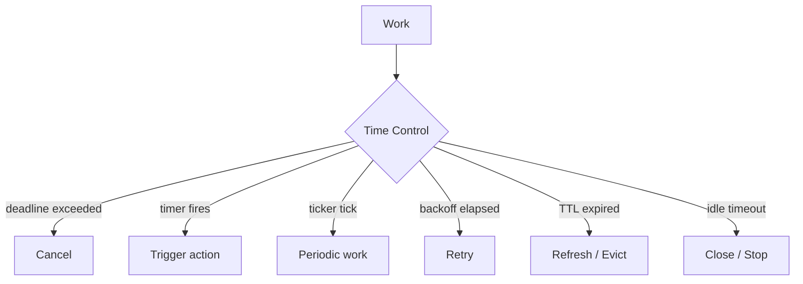
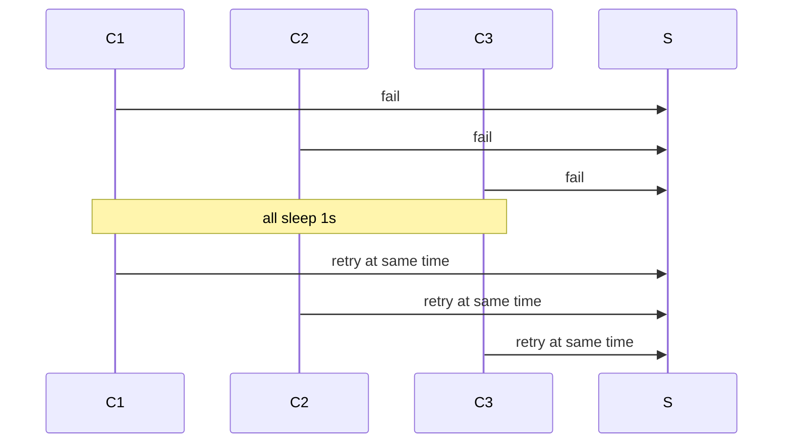

# learn-go-concurrency-parallelism-part-019.md

# Part 019 — Timers, Tickers, Deadlines, Scheduling, and Time-Based Concurrency

> Target pembaca: Java software engineer yang ingin memahami time-based concurrency di Go secara production-grade: timer, ticker, timeout, deadline, backoff, retry, scheduled work, debouncing, throttling, heartbeat, idle timeout, dan shutdown deadline.
>
> Fokus part ini: `time.Timer`, `time.Ticker`, `time.After`, `time.AfterFunc`, `context.WithTimeout`, timer reset/stop correctness, hot-loop timer allocation, monotonic time, scheduling drift, jitter, deadline budgeting, and production failure modes.

---

## 0. Posisi Part Ini dalam Seri

Sebelumnya:

- Part 009 membahas `select`, termasuk timeout case.
- Part 011 membahas `context` sebagai lifecycle/deadline contract.
- Part 015 membahas backpressure dan deadline budget.
- Part 016 membahas rate limiter/token bucket.
- Part 018 membahas retry, dedup, stampede prevention.

Part ini fokus pada waktu.

Dalam concurrent system, waktu muncul di banyak tempat:

- request timeout,
- downstream deadline,
- idle timeout,
- heartbeat,
- retry backoff,
- rate limiter refill,
- token expiration,
- cache TTL,
- scheduled refresh,
- debounce,
- throttle,
- batch flush interval,
- graceful shutdown deadline,
- circuit breaker cool-down,
- worker idle timeout,
- queue item expiration.

Time-based concurrency tampak mudah:

```go
select {
case <-time.After(time.Second):
}
```

Tetapi production bug sering muncul dari:
- `time.After` di hot loop,
- timer tidak dihentikan,
- ticker tidak dihentikan,
- reset timer yang salah,
- goroutine leak dari `AfterFunc`,
- deadline layer bertumpuk,
- retry tanpa jitter,
- sleep yang tidak cancellation-aware,
- cleanup memakai context yang sudah cancelled,
- wall-clock jump,
- drift,
- huge number of timers,
- timer callback race,
- tests lambat/flaky karena real time.

---

## 1. Tujuan Pembelajaran

Setelah part ini, Anda harus mampu:

1. Membedakan:
   - timeout,
   - deadline,
   - timer,
   - ticker,
   - sleep,
   - interval,
   - schedule,
   - backoff,
   - TTL.
2. Menggunakan:
   - `time.After`,
   - `time.NewTimer`,
   - `time.NewTicker`,
   - `time.AfterFunc`,
   - `context.WithTimeout`,
   - `context.WithDeadline`.
3. Menghindari timer allocation di hot loop.
4. Menggunakan timer reset/stop secara aman.
5. Mendesain idle timeout.
6. Mendesain heartbeat dan periodic loop.
7. Mendesain exponential backoff with jitter.
8. Mendesain retry yang context-aware dan deadline-aware.
9. Memahami monotonic time vs wall clock.
10. Menguji time-based code tanpa flaky sleep.
11. Mengobservasi timeout/deadline/retry behavior.
12. Membuat checklist review untuk time-based concurrency.

---

## 2. Mental Model: Time as Control Plane

Dalam concurrency, waktu bukan hanya data. Waktu adalah control plane.



Time-based signal biasanya masuk ke `select`:

```go
select {
case item := <-in:
    handle(item)
case <-timer.C:
    onTimeout()
case <-ctx.Done():
    return ctx.Err()
}
```

Key rule:

> Every wait for time should usually be cancellation-aware.

---

## 3. Java Translation

Java equivalents:

| Java | Go |
|---|---|
| `ScheduledExecutorService.schedule` | `time.Timer`, `time.AfterFunc` |
| `scheduleAtFixedRate` | `time.Ticker` with loop |
| `Thread.sleep` | `time.Sleep` or context-aware timer |
| `Future.get(timeout)` | `select` with timer/context |
| `CompletableFuture.orTimeout` | context deadline/select timeout |
| `System.nanoTime` | monotonic component of `time.Time` / `time.Since` |
| `System.currentTimeMillis` | wall clock part of `time.Now()` |
| timeout parameter | `context.WithTimeout` |
| deadline timestamp | `context.WithDeadline` |

Important difference:
- Go encourages explicit `context` propagation for cancellation/deadline.
- Timers/tickers expose channels.
- Many time waits compose naturally with `select`.

---

## 4. Timeout vs Deadline

### 4.1 Timeout

Relative duration:

```go
ctx, cancel := context.WithTimeout(parent, 200*time.Millisecond)
defer cancel()
```

Meaning:
- from now, operation has at most 200ms.

### 4.2 Deadline

Absolute time:

```go
deadline := time.Now().Add(200 * time.Millisecond)
ctx, cancel := context.WithDeadline(parent, deadline)
defer cancel()
```

Meaning:
- operation must stop by specific time.

### 4.3 Which to Use?

Use timeout when:
- defining duration budget locally,
- operation-specific limit.

Use deadline when:
- propagating absolute budget,
- coordinating across layers,
- shutdown cutoff,
- job expiry,
- queue item useful-until.

In a call chain, deadline is often better because each layer sees remaining time.

---

## 5. Timer vs Ticker vs Sleep

| Primitive | Meaning |
|---|---|
| `time.Sleep(d)` | block current goroutine for duration |
| `time.After(d)` | returns channel that receives once after duration |
| `time.NewTimer(d)` | reusable/stoppable one-shot timer |
| `time.NewTicker(d)` | repeated ticks |
| `time.AfterFunc(d, f)` | run function after duration in its own goroutine context |
| `context.WithTimeout` | cancellation signal after duration |
| `context.WithDeadline` | cancellation signal at absolute time |

### 5.1 Sleep

```go
time.Sleep(100 * time.Millisecond)
```

Not cancellation-aware.

Context-aware sleep:

```go
func Sleep(ctx context.Context, d time.Duration) error {
    timer := time.NewTimer(d)
    defer timer.Stop()

    select {
    case <-timer.C:
        return nil
    case <-ctx.Done():
        return ctx.Err()
    }
}
```

### 5.2 After

```go
select {
case <-time.After(100 * time.Millisecond):
    return ErrTimeout
case <-ctx.Done():
    return ctx.Err()
}
```

Simple, okay for one-off.

### 5.3 NewTimer

```go
timer := time.NewTimer(100 * time.Millisecond)
defer timer.Stop()

select {
case <-timer.C:
case <-ctx.Done():
    return ctx.Err()
}
```

Useful when:
- need Stop,
- need Reset,
- avoid allocation in loop,
- manage lifecycle explicitly.

### 5.4 NewTicker

```go
ticker := time.NewTicker(time.Second)
defer ticker.Stop()

for {
    select {
    case <-ticker.C:
        heartbeat()
    case <-ctx.Done():
        return
    }
}
```

Always stop tickers you create when done.

---

## 6. `time.After` in Loop

Bad in hot loop:

```go
for {
    select {
    case item := <-in:
        handle(item)
    case <-time.After(time.Second):
        flush()
    }
}
```

Problem:
- creates new timer each iteration,
- high allocation/runtime timer pressure,
- if loop iterates frequently due to input, many timers created before firing,
- can increase memory and CPU.

Better for periodic action:

```go
ticker := time.NewTicker(time.Second)
defer ticker.Stop()

for {
    select {
    case item := <-in:
        handle(item)
    case <-ticker.C:
        flush()
    case <-ctx.Done():
        return
    }
}
```

Better for idle timeout:

```go
timer := time.NewTimer(idleTimeout)
defer timer.Stop()

for {
    select {
    case item := <-in:
        resetTimer(timer, idleTimeout)
        handle(item)

    case <-timer.C:
        return ErrIdleTimeout

    case <-ctx.Done():
        return ctx.Err()
    }
}
```

---

## 7. Timer Stop/Reset Correctness

Timer has tricky state:
- active,
- fired with value maybe in channel,
- stopped,
- reset.

A robust helper pattern:

```go
func stopAndDrainTimer(t *time.Timer) {
    if !t.Stop() {
        select {
        case <-t.C:
        default:
        }
    }
}

func resetTimer(t *time.Timer, d time.Duration) {
    stopAndDrainTimer(t)
    t.Reset(d)
}
```

Use when you might reset a timer that may have fired.

Important:
- exact details of timer behavior have improved across Go versions, but this helper remains a conservative mental model.
- avoid complex timer reuse unless necessary.
- prefer simpler ticker/timer lifecycle when possible.

### 7.1 Idle Timeout Example

```go
func ReadLoop(ctx context.Context, in <-chan Message, idle time.Duration) error {
    timer := time.NewTimer(idle)
    defer timer.Stop()

    for {
        select {
        case msg, ok := <-in:
            if !ok {
                return nil
            }

            resetTimer(timer, idle)
            handle(msg)

        case <-timer.C:
            return ErrIdleTimeout

        case <-ctx.Done():
            return ctx.Err()
        }
    }
}
```

---

## 8. Timer Ownership

A timer should have one clear owner.

Bad:
- one goroutine resets timer,
- another goroutine stops it,
- another receives from `timer.C`.

This is race-prone unless carefully synchronized.

Good:
- owner goroutine creates, resets, stops, and receives timer.

```go
func loop(ctx context.Context) {
    timer := time.NewTimer(timeout)
    defer timer.Stop()

    for {
        select {
        case <-timer.C:
        case event := <-events:
            resetTimer(timer, timeout)
            _ = event
        case <-ctx.Done():
            return
        }
    }
}
```

---

## 9. Ticker Correctness

Ticker produces ticks periodically.

```go
ticker := time.NewTicker(time.Second)
defer ticker.Stop()
```

Common mistake: not stopping ticker.

```go
func Bad() {
    ticker := time.NewTicker(time.Second)
    go func() {
        for range ticker.C {
            work()
        }
    }()
}
```

Who stops ticker? Who stops goroutine?

Correct:

```go
func Run(ctx context.Context) {
    ticker := time.NewTicker(time.Second)
    defer ticker.Stop()

    for {
        select {
        case <-ticker.C:
            work()

        case <-ctx.Done():
            return
        }
    }
}
```

### 9.1 Ticker and Slow Work

If work takes longer than interval:

```go
case <-ticker.C:
    work() // takes 5s, ticker interval 1s
```

Ticks may be dropped/coalesced; do not assume you process every interval exactly.

If exact scheduling matters:
- track time,
- compute next schedule,
- run catch-up or skip explicitly.

---

## 10. Fixed Delay vs Fixed Rate

### 10.1 Fixed Delay

Wait after work completes.

```go
for {
    if err := work(ctx); err != nil {
        return err
    }

    if err := Sleep(ctx, interval); err != nil {
        return err
    }
}
```

Schedule:
```text
work -> wait interval -> work -> wait interval
```

### 10.2 Fixed Rate

Try to run every interval.

```go
ticker := time.NewTicker(interval)
defer ticker.Stop()

for {
    select {
    case <-ticker.C:
        work(ctx)
    case <-ctx.Done():
        return
    }
}
```

Schedule:
```text
tick every interval regardless of work duration
```

If work slow, ticks may be skipped/delayed.

Choose based on semantics:
- polling often fixed delay.
- heartbeat often fixed rate-ish.
- refresh may be fixed delay to avoid overlap.
- metrics scrape should not overlap.

---

## 11. Prevent Overlapping Periodic Work

Bad:

```go
ticker := time.NewTicker(time.Second)

for range ticker.C {
    go work()
}
```

If work takes >1s, multiple work instances overlap.

Sometimes desired, often not.

Non-overlap:

```go
ticker := time.NewTicker(time.Second)
defer ticker.Stop()

for {
    select {
    case <-ticker.C:
        if err := work(ctx); err != nil {
            logError(err)
        }

    case <-ctx.Done():
        return
    }
}
```

If work must not block loop but also not overlap:

```go
var running atomic.Bool

for {
    select {
    case <-ticker.C:
        if !running.CompareAndSwap(false, true) {
            skipped.Add(1)
            continue
        }

        go func() {
            defer running.Store(false)
            _ = work(ctx)
        }()

    case <-ctx.Done():
        return
    }
}
```

But now goroutine ownership/shutdown becomes harder. Prefer synchronous loop unless necessary.

---

## 12. `time.AfterFunc`

`time.AfterFunc(d, f)` runs function after duration.

```go
timer := time.AfterFunc(time.Second, func() {
    cleanup()
})
defer timer.Stop()
```

Use cases:
- trigger callback,
- schedule cancellation,
- watchdog.

Caution:
- callback runs in its own goroutine-like execution context.
- callback can race with Stop.
- callback can run concurrently with code that stops/resets timer.
- callback panic policy matters.
- lifecycle ownership must be explicit.

### 12.1 Race with Stop

`Stop` reports whether timer was stopped before function started. If function already started, Stop cannot stop it.

If you need to wait for callback completion, use additional synchronization.

```go
done := make(chan struct{})

timer := time.AfterFunc(time.Second, func() {
    defer close(done)
    work()
})

if !timer.Stop() {
    <-done // only safe if callback guaranteed to close done and has started
}
```

This pattern needs care because if Stop returns true, callback will not close done. Use with precise state.

Often simpler:
- avoid `AfterFunc`,
- use a goroutine with timer and select.

---

## 13. Context Timeout Internals as Timer

`context.WithTimeout` creates a context that cancels when timer fires.

```go
ctx, cancel := context.WithTimeout(parent, d)
defer cancel()
```

Always call cancel:
- releases timer/resources early,
- removes child from parent.

Bad:

```go
ctx, _ := context.WithTimeout(parent, time.Second)
return call(ctx)
```

Good:

```go
ctx, cancel := context.WithTimeout(parent, time.Second)
defer cancel()

return call(ctx)
```

### 13.1 Do Not Wrap Every Layer Blindly

Bad:

```go
handler timeout 1s
service timeout 1s
repo timeout 1s
client timeout 1s
```

May create confusing behavior and hides true deadline.

Prefer:
- parent request deadline,
- child cap only when needed,
- remaining budget awareness.

---

## 14. Deadline Budgeting

Helper:

```go
func WithTimeoutCap(parent context.Context, cap time.Duration) (context.Context, context.CancelFunc) {
    if deadline, ok := parent.Deadline(); ok {
        remaining := time.Until(deadline)
        if remaining <= cap {
            return context.WithDeadline(parent, deadline)
        }
    }

    return context.WithTimeout(parent, cap)
}
```

Use:

```go
ctxDB, cancel := WithTimeoutCap(ctx, 100*time.Millisecond)
defer cancel()

return db.QueryContext(ctxDB, query)
```

### 14.1 Minimum Useful Remaining Time

Before expensive work:

```go
func ensureBudget(ctx context.Context, min time.Duration) error {
    deadline, ok := ctx.Deadline()
    if !ok {
        return nil
    }

    if time.Until(deadline) < min {
        return ErrInsufficientBudget
    }

    return nil
}
```

Use before enqueueing or starting external call.

---

## 15. Queue Item Deadline

Work may wait in queue. When worker starts, it should check if still useful.

```go
type Job struct {
    ID       string
    CreatedAt time.Time
    Deadline time.Time
}
```

Worker:

```go
if !job.Deadline.IsZero() && time.Now().After(job.Deadline) {
    expired.Add(1)
    return
}

ctx := poolCtx
cancel := func() {}

if !job.Deadline.IsZero() {
    ctx, cancel = context.WithDeadline(poolCtx, job.Deadline)
}

err := handler(ctx, job)
cancel()
```

Avoid `defer cancel()` inside long worker loop if many iterations; call `cancel()` at end of each iteration.

---

## 16. Backoff

Backoff delays retry after failure.

Linear:
```text
100ms, 200ms, 300ms
```

Exponential:
```text
100ms, 200ms, 400ms, 800ms
```

Capped:
```text
100ms, 200ms, 400ms, 800ms, 1s, 1s...
```

### 16.1 Context-Aware Backoff

```go
func BackoffSleep(ctx context.Context, d time.Duration) error {
    timer := time.NewTimer(d)
    defer timer.Stop()

    select {
    case <-timer.C:
        return nil
    case <-ctx.Done():
        return ctx.Err()
    }
}
```

### 16.2 Exponential Backoff

```go
func ExponentialBackoff(base, max time.Duration, attempt int) time.Duration {
    if attempt <= 0 {
        return base
    }

    d := base
    for i := 0; i < attempt; i++ {
        d *= 2
        if d >= max {
            return max
        }
    }

    return d
}
```

Beware overflow for large attempts. Cap early.

---

## 17. Jitter

Without jitter, many clients retry at same time.



Jitter spreads retries.

### 17.1 Full Jitter

```go
func FullJitter(max time.Duration) time.Duration {
    if max <= 0 {
        return 0
    }

    return time.Duration(rand.Int63n(int64(max)))
}
```

### 17.2 Equal Jitter

```go
func EqualJitter(max time.Duration) time.Duration {
    if max <= 0 {
        return 0
    }

    half := max / 2
    return half + time.Duration(rand.Int63n(int64(half)))
}
```

### 17.3 Decorrelated Jitter

Often used to avoid synchronized exponential growth.

Concept:
```text
sleep = min(max, random(base, previous*3))
```

Pick a standard strategy and document it.

---

## 18. Retry Loop with Deadline

```go
func Retry(ctx context.Context, maxAttempts int, base, maxDelay time.Duration, fn func(context.Context) error) error {
    var last error

    for attempt := 0; attempt < maxAttempts; attempt++ {
        if err := ensureBudget(ctx, 10*time.Millisecond); err != nil {
            return err
        }

        err := fn(ctx)
        if err == nil {
            return nil
        }

        last = err

        if !isRetryable(err) {
            return err
        }

        if attempt == maxAttempts-1 {
            break
        }

        delay := ExponentialBackoff(base, maxDelay, attempt)
        delay = FullJitter(delay)

        if err := BackoffSleep(ctx, delay); err != nil {
            return err
        }
    }

    return last
}
```

Production additions:
- retry budget,
- metrics per attempt,
- classify errors,
- respect `Retry-After`,
- idempotency,
- circuit breaker,
- rate limiter.

---

## 19. Debounce

Debounce means wait until events stop for duration, then act once.

Use cases:
- config reload after file changes,
- UI-like event burst,
- batch refresh,
- search-as-you-type style logic.

```go
func Debounce(ctx context.Context, in <-chan Event, delay time.Duration, fn func([]Event)) {
    var timer *time.Timer
    var timerC <-chan time.Time
    var batch []Event

    stopTimer := func() {
        if timer != nil {
            stopAndDrainTimer(timer)
        }
    }

    for {
        select {
        case <-ctx.Done():
            stopTimer()
            return

        case e, ok := <-in:
            if !ok {
                stopTimer()
                if len(batch) > 0 {
                    fn(batch)
                }
                return
            }

            batch = append(batch, e)

            if timer == nil {
                timer = time.NewTimer(delay)
            } else {
                resetTimer(timer, delay)
            }
            timerC = timer.C

        case <-timerC:
            fn(batch)
            batch = nil
            timerC = nil
        }
    }
}
```

Caution:
- `fn` runs in loop; if slow, new events wait.
- might need worker/async processing.
- batch ownership.

---

## 20. Throttle

Throttle limits action frequency.

Example: at most once per interval.

```go
func Throttle(ctx context.Context, in <-chan Event, interval time.Duration, fn func(Event)) {
    var last time.Time

    for {
        select {
        case <-ctx.Done():
            return

        case e, ok := <-in:
            if !ok {
                return
            }

            now := time.Now()
            if now.Sub(last) < interval {
                continue
            }

            last = now
            fn(e)
        }
    }
}
```

This drops events. If you need delayed latest event, design separately.

---

## 21. Heartbeat

Heartbeat indicates liveness.

```go
func Heartbeat(ctx context.Context, interval time.Duration, beat func(context.Context) error) error {
    ticker := time.NewTicker(interval)
    defer ticker.Stop()

    for {
        select {
        case <-ctx.Done():
            return ctx.Err()

        case <-ticker.C:
            if err := beat(ctx); err != nil {
                return err
            }
        }
    }
}
```

If heartbeat failure should not stop:
```go
log and continue
```

If heartbeat call can hang:
- give child timeout.

```go
beatCtx, cancel := context.WithTimeout(ctx, 100*time.Millisecond)
err := beat(beatCtx)
cancel()
```

---

## 22. Watchdog

Watchdog triggers if progress not observed.

```go
type Watchdog struct {
    timeout time.Duration
    kick    chan struct{}
}

func (w *Watchdog) Run(ctx context.Context, onTimeout func()) {
    timer := time.NewTimer(w.timeout)
    defer timer.Stop()

    for {
        select {
        case <-ctx.Done():
            return

        case <-w.kick:
            resetTimer(timer, w.timeout)

        case <-timer.C:
            onTimeout()
            resetTimer(timer, w.timeout)
        }
    }
}
```

Use for:
- worker stalled,
- no messages received,
- connection idle,
- leader lease refresh.

Caution:
- timeout action must be safe/idempotent.
- watchdog itself can become false positive under GC pauses/CPU throttling if too aggressive.

---

## 23. Cache TTL and Expiration

TTL uses time to decide freshness.

```go
type Entry[V any] struct {
    Value     V
    ExpiresAt time.Time
}
```

Check:

```go
if !e.ExpiresAt.IsZero() && time.Now().After(e.ExpiresAt) {
    expired = true
}
```

### 23.1 Lazy Expiration

Expire on access.

Pros:
- simple,
- no background goroutine.

Cons:
- expired items remain if never accessed.

### 23.2 Active Expiration

Background sweeper.

```go
ticker := time.NewTicker(time.Minute)
defer ticker.Stop()

for {
    select {
    case <-ticker.C:
        cache.DeleteExpired(time.Now())
    case <-ctx.Done():
        return
    }
}
```

Caution:
- sweeper lock duration,
- large cache scan,
- jitter sweep across pods,
- stop ticker.

---

## 24. Token Expiration Refresh

Refresh before expiry with jitter.

```go
refreshAt := token.ExpiresAt.Add(-refreshBefore)
jittered := refreshAt.Add(-randomJitter)
```

Avoid all pods refreshing at same time.

For shared token:
- singleflight refresh,
- atomic snapshot store,
- background refresh with service context,
- fallback to sync refresh if token expired.

---

## 25. Scheduled Work

Simple periodic schedule:

```go
func Every(ctx context.Context, interval time.Duration, fn func(context.Context) error) error {
    ticker := time.NewTicker(interval)
    defer ticker.Stop()

    for {
        select {
        case <-ctx.Done():
            return ctx.Err()

        case <-ticker.C:
            if err := fn(ctx); err != nil {
                return err
            }
        }
    }
}
```

If you need cron-like schedule:
- compute next run time,
- use timer to wait until next,
- account for time zones/DST if wall-clock semantics matter.

### 25.1 Wall-Clock Schedule

“Run every day at 02:00 local time” is wall-clock scheduling:
- DST issues,
- timezone,
- skipped/repeated times,
- system clock adjustments.

Do not implement casually for critical jobs. Use scheduler library/system if appropriate.

---

## 26. Monotonic Time vs Wall Clock

Go `time.Now()` returns a `time.Time` that may include monotonic clock reading. Duration operations like `time.Since(start)` use monotonic component when available.

Use:
- `time.Since(start)` for elapsed duration.
- `time.Until(deadline)` for remaining duration.

Avoid:
- comparing Unix milliseconds for elapsed durations if not needed.
- using wall clock for measuring latency.

Wall clock can jump due to NTP/manual adjustment. Monotonic time is for durations.

### 26.1 Good

```go
start := time.Now()
doWork()
elapsed := time.Since(start)
```

### 26.2 Deadline Serialization

When `time.Time` is serialized, monotonic component is stripped. That is okay for absolute deadline but not for elapsed measurement.

---

## 27. Timer Scale

Large numbers of timers can be expensive.

Sources:
- `time.After` in hot loop,
- per-request timeout plus per-layer timeout,
- retry timers for many goroutines,
- millions of cache entry timers,
- `AfterFunc` per item.

Alternatives:
- shared ticker for periodic cleanup,
- timing wheel/heap scheduler if huge scale,
- lazy expiration,
- batch timers,
- per-worker timers.

Do not create one goroutine/timer per cached key unless scale is small and bounded.

---

## 28. Shutdown Deadlines

On shutdown:
- stop accepting,
- drain/cancel,
- cleanup with deadline.

```go
shutdownCtx, cancel := context.WithTimeout(context.Background(), 30*time.Second)
defer cancel()

if err := server.Shutdown(shutdownCtx); err != nil {
    return err
}
```

Do not use already-cancelled root context for cleanup.

Bad:

```go
<-root.Done()
server.Shutdown(root) // root already cancelled
```

Good:

```go
<-root.Done()

shutdownCtx, cancel := context.WithTimeout(context.Background(), 30*time.Second)
defer cancel()

server.Shutdown(shutdownCtx)
```

---

## 29. Testing Time-Based Code

### 29.1 Avoid Real Sleeps

Bad:

```go
time.Sleep(time.Second)
if !condition {
    t.Fatal()
}
```

Slow and flaky.

Better:
- use channels to signal completion,
- use small timeout as guard,
- inject clock,
- use fake timer,
- use deterministic hooks.

### 29.2 Guard Timeout

```go
select {
case <-done:
case <-time.After(time.Second):
    t.Fatal("timeout")
}
```

This is acceptable as test guard, not main synchronization.

### 29.3 Inject Clock

Interface:

```go
type Clock interface {
    Now() time.Time
    NewTimer(time.Duration) Timer
}

type Timer interface {
    C() <-chan time.Time
    Stop() bool
    Reset(time.Duration) bool
}
```

This adds complexity. Use for logic heavily dependent on time.

### 29.4 Test Retry Without Waiting Seconds

Make backoff strategy injectable:

```go
type Sleeper func(context.Context, time.Duration) error
```

In test:

```go
sleeper := func(ctx context.Context, d time.Duration) error {
    sleeps = append(sleeps, d)
    return nil
}
```

---

## 30. Observability

Metrics:
- timeout count by operation,
- deadline exceeded count,
- context cancelled count,
- timer callback duration,
- retry attempts,
- backoff duration,
- jittered delay,
- ticker loop duration,
- skipped ticks,
- stale cache served,
- expired jobs,
- queue wait,
- remaining deadline at start,
- shutdown duration,
- idle timeout count.

Logs:
- operation timeout with elapsed and remaining deadline,
- retry exhausted,
- circuit cool-down,
- scheduled job start/finish,
- slow periodic job,
- shutdown timeout.

Trace:
- span deadlines,
- retry attempts as events,
- backoff as event,
- downstream timeout cause.

---

## 31. Case Study 1: HTTP Downstream Call Timeout

Bad:

```go
client := &http.Client{Timeout: 30 * time.Second}
```

Then request has 500ms SLA. Client may wait too long if context not used.

Better:

```go
req, err := http.NewRequestWithContext(ctx, http.MethodGet, url, nil)
if err != nil {
    return err
}

resp, err := client.Do(req)
```

And caller sets:

```go
child, cancel := WithTimeoutCap(ctx, 100*time.Millisecond)
defer cancel()
```

Transport timeouts still matter, but request context carries budget.

---

## 32. Case Study 2: Worker Idle Timeout

Requirement:
- worker exits if idle for 5 minutes.

```go
func worker(ctx context.Context, jobs <-chan Job, idle time.Duration) {
    timer := time.NewTimer(idle)
    defer timer.Stop()

    for {
        select {
        case <-ctx.Done():
            return

        case job, ok := <-jobs:
            if !ok {
                return
            }

            resetTimer(timer, idle)
            process(ctx, job)

        case <-timer.C:
            return
        }
    }
}
```

If processing takes long, idle timer continues while processing. If you want idle after processing, reset after process too or stop during processing. Define semantics.

---

## 33. Case Study 3: Batch Flush

Requirement:
- flush when 100 items or 1s passed.

Use batch stage from previous parts with ticker/timer.
Important:
- flush on input close,
- flush on shutdown if drain,
- do not lose partial batch,
- output send cancellation-aware,
- batch slice ownership.

---

## 34. Case Study 4: Retry Storm Prevention

Bad:
- 1000 goroutines fail,
- all retry after exactly 1s.

Fix:
- exponential backoff,
- jitter,
- context deadline,
- limiter,
- circuit breaker,
- idempotency.

Time primitive alone is not enough; it must be part of overload policy.

---

## 35. Anti-Pattern Catalog

### 35.1 `time.After` in Hot Loop

Creates many timers.

### 35.2 Ticker Not Stopped

Resource leak.

### 35.3 Sleep Without Context

Slow shutdown/cancellation.

### 35.4 Defer Cancel in Long Loop

Defers accumulate until goroutine exits.

Bad:

```go
for job := range jobs {
    ctx, cancel := context.WithTimeout(parent, time.Second)
    defer cancel()
    process(ctx, job)
}
```

Good:

```go
for job := range jobs {
    ctx, cancel := context.WithTimeout(parent, time.Second)
    process(ctx, job)
    cancel()
}
```

### 35.5 Blind Per-Layer Timeout

Conflicting deadlines, wasted work.

### 35.6 Retry Without Jitter

Synchronized retry wave.

### 35.7 Timer Reset from Multiple Goroutines

Ownership unclear.

### 35.8 AfterFunc Without Lifecycle

Callback races/leaks.

### 35.9 Cleanup with Cancelled Context

Cleanup immediately fails.

### 35.10 Overlapping Periodic Work

Ticker starts new goroutine each tick without limit.

### 35.11 Wall Clock for Latency

Use monotonic elapsed durations.

### 35.12 One Timer per Cache Entry at Large Scale

Timer explosion.

---

## 36. Design Review Checklist

For time-based code:

1. Is this timeout or deadline?
2. Is wait cancellation-aware?
3. Is `cancel()` always called?
4. Is `defer cancel()` inside long loop avoided?
5. Is `time.After` used in hot loop?
6. Should this be `NewTimer` or `Ticker`?
7. Is ticker stopped?
8. Is timer stopped/drained before reset where needed?
9. Is timer owned by one goroutine?
10. Can periodic work overlap?
11. Is overlap allowed?
12. Is retry bounded?
13. Is retry jittered?
14. Is retry within deadline?
15. Is operation idempotent if retried?
16. Is queue item expired before processing?
17. Is stale work skipped?
18. Is deadline budget propagated?
19. Is child timeout capped by parent?
20. Is cleanup using fresh bounded context?
21. Are wall-clock schedules handling timezone/DST?
22. Are tests using real sleeps?
23. Is fake clock/injected sleeper needed?
24. Are timeout metrics emitted?
25. Are deadline exceeded and cancelled separated?
26. Is periodic job duration measured?
27. Is skipped tick measured?
28. Is timer scale bounded?
29. Is shutdown deadline explicit?
30. Is time behavior documented?

---

## 37. Mini Lab 1: Context-Aware Sleep and Backoff

Implement:
- `Sleep(ctx, d)`,
- exponential backoff,
- full jitter,
- retry loop.

Tests:
- cancel before sleep,
- retry attempts count,
- no long sleeps via injected sleeper.

---

## 38. Mini Lab 2: Idle Timeout Loop

Implement:
```go
func ReadWithIdleTimeout(ctx context.Context, in <-chan Message, idle time.Duration) error
```

Requirements:
- timeout if no message for idle duration,
- reset on message,
- exit on ctx cancel,
- handle closed input,
- no timer leak.

---

## 39. Mini Lab 3: Debouncer

Implement:
```go
func Debounce[T any](ctx context.Context, in <-chan T, delay time.Duration, fn func([]T))
```

Requirements:
- collect burst,
- run after quiet period,
- flush on close,
- stop on ctx,
- no timer reset race.

---

## 40. Mini Lab 4: Non-Overlapping Periodic Job

Implement:
```go
func RunPeriodic(ctx context.Context, interval time.Duration, fn func(context.Context) error) error
```

Variants:
1. fixed delay,
2. fixed rate no overlap,
3. fixed rate skip if previous still running.

Compare behavior.

---

## 41. Mini Lab 5: Job Deadline in Worker Pool

Add to worker pool:
- job CreatedAt,
- Deadline,
- expiration before processing,
- context.WithDeadline for handler,
- metrics for expired/deadline exceeded.

Avoid `defer cancel()` in worker loop.

---

## 42. Mini Lab 6: Scheduled Refresh with Jitter

Implement:
- token/config refresh before expiry,
- random jitter,
- singleflight refresh,
- service context,
- metrics.

Test:
- refresh not called concurrently,
- refresh before expiry,
- failure keeps old value until expiry.

---

## 43. Top 1% Heuristics

1. Time is control plane, not just utility.
2. Every timer/ticker needs owner and lifecycle.
3. `time.After` is fine once; suspicious in loops.
4. `Sleep` in production control flow should usually be context-aware.
5. Deadlines are better than random per-layer timeouts.
6. Retry without jitter is coordinated self-harm.
7. Retry without idempotency is correctness risk.
8. Ticker work must define overlap semantics.
9. Queue wait consumes deadline budget.
10. Cleanup often needs a fresh bounded context.
11. Wall-clock time is for schedules; monotonic time is for durations.
12. Tests should not depend on hoping real time passes.
13. Long-lived workers should not defer cancel per job.
14. Timeouts need metrics and error mapping.
15. If time behavior is not documented, incidents will define it for you.

---

## 44. Source Notes

Primary Go concepts behind this part:

1. `time` package:
   - `Timer`,
   - `Ticker`,
   - `After`,
   - `AfterFunc`,
   - monotonic time behavior in duration calculations.

2. `context` package:
   - `WithTimeout`,
   - `WithDeadline`,
   - cancellation propagation.

3. `select` semantics:
   - composing timer channels and cancellation.

4. Reliability patterns:
   - timeout budget,
   - backoff,
   - jitter,
   - retry,
   - heartbeat,
   - idle timeout,
   - scheduled refresh.

---

## 45. Summary

Time-based concurrency is everywhere in Go production systems.

It appears as:
- timeout,
- deadline,
- retry backoff,
- ticker,
- timer,
- TTL,
- heartbeat,
- idle timeout,
- scheduled refresh,
- graceful shutdown.

The core design rules:

- prefer context deadlines for operation lifecycle,
- avoid `time.After` in hot loops,
- stop tickers,
- own timers in one goroutine,
- reset timers carefully,
- make sleeps cancellation-aware,
- use jitter for retries,
- propagate budget,
- test with deterministic synchronization,
- measure timeout/deadline behavior.

A strong Go engineer treats time as part of the concurrency contract.

---

## 46. Status Seri

Selesai:
- Part 000 — Orientation
- Part 001 — Foundations
- Part 002 — Goroutine Internals
- Part 003 — Go Scheduler Deep Dive
- Part 004 — GOMAXPROCS, CPU Quotas, Containers
- Part 005 — Go Memory Model
- Part 006 — Synchronization Primitives
- Part 007 — Atomic Operations
- Part 008 — Channels Deep Dive
- Part 009 — Select Semantics
- Part 010 — WaitGroup, ErrGroup, Task Groups, and Structured Concurrency
- Part 011 — Context as Concurrency Contract
- Part 012 — Ownership Models
- Part 013 — Worker Pools
- Part 014 — Fan-Out/Fan-In, Pipelines, Stages, and Stream Processing
- Part 015 — Backpressure End-to-End
- Part 016 — Semaphores, Rate Limiters, Token Buckets, and Bulkheads
- Part 017 — Concurrent Data Structures
- Part 018 — Singleflight, Deduplication, Idempotency, and Stampede Prevention
- Part 019 — Timers, Tickers, Deadlines, Scheduling, and Time-Based Concurrency

Belum selesai:
- Part 020 sampai Part 034.

Seri belum mencapai bagian terakhir.


<!-- NAVIGATION_FOOTER -->
<div class="page-nav">
<a href="./learn-go-concurrency-parallelism-part-018.md">⬅️ Part 018 — Singleflight, Deduplication, Idempotency, and Stampede Prevention</a>
<a href="./index.md">📚 Kategori</a>
<a href="../../index.md">🏠 Home</a>
<a href="./learn-go-concurrency-parallelism-part-020.md">Part 020 — Network Concurrency: HTTP, TCP, gRPC, Connection Pools, Timeouts, and Streaming ➡️</a>
</div>
