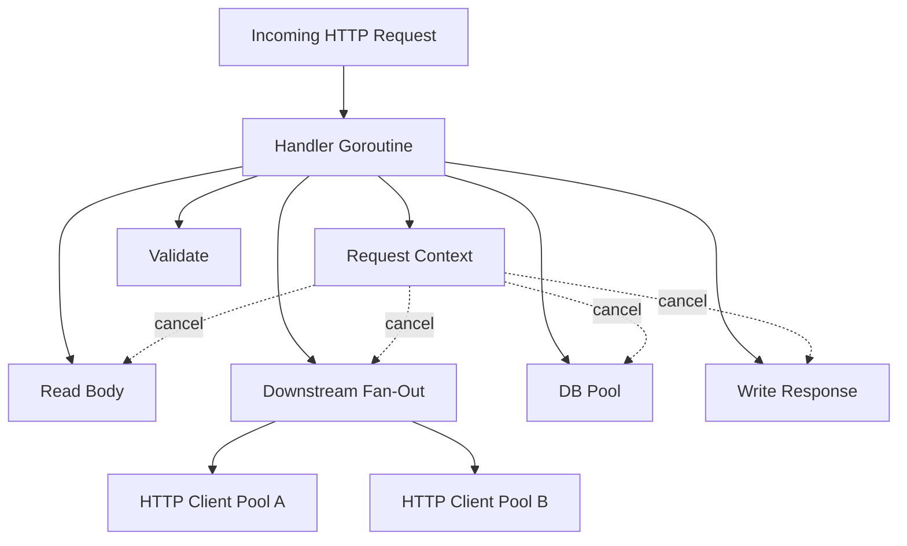
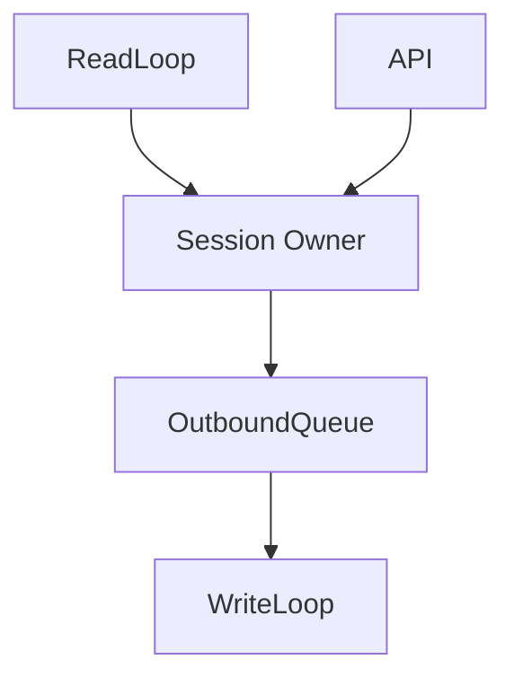
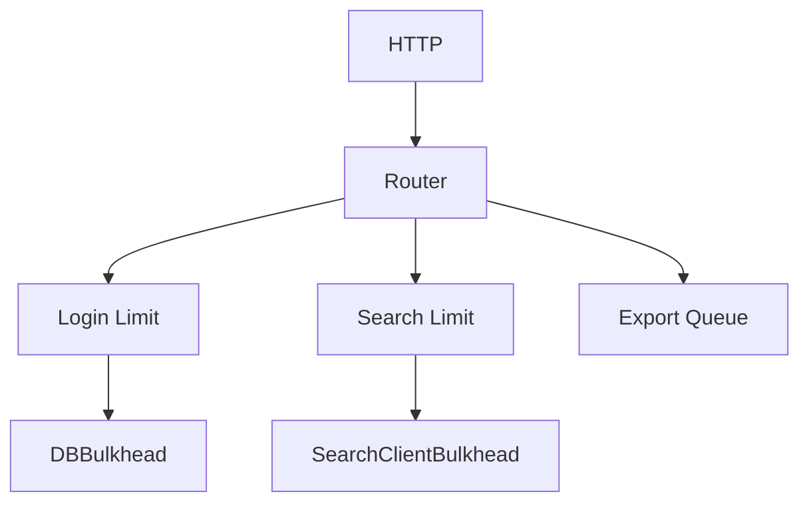

# learn-go-concurrency-parallelism-part-020.md

# Part 020 — Network Concurrency: HTTP, TCP, gRPC, Connection Pools, Timeouts, and Streaming

> Target pembaca: Java software engineer yang ingin memahami concurrency di Go pada boundary network secara production-grade: HTTP server/client, TCP connection lifecycle, gRPC streaming, connection pooling, request cancellation, slow clients, downstream fan-out, overload, and observability.
>
> Fokus part ini: network goroutine model, `net/http` concurrency, HTTP client transport, connection pools, deadlines, streaming backpressure, slowloris defense, gRPC concurrency, per-host limits, request context propagation, and failure modes.

---

## 0. Posisi Part Ini dalam Seri

Sebelumnya:

- Part 011: `context` sebagai lifecycle/deadline contract.
- Part 013: worker pools.
- Part 015: backpressure end-to-end.
- Part 016: semaphores/rate limiters/bulkheads.
- Part 019: timers, tickers, deadlines.

Part ini membawa semua konsep itu ke boundary paling penting dalam backend service: **network**.

Di service Go production, concurrency network muncul di:

- HTTP server handling banyak request concurrent,
- HTTP client fan-out ke downstream,
- gRPC unary/streaming,
- TCP listener accept loop,
- connection pool,
- keep-alive,
- request body streaming,
- response streaming,
- slow client,
- slow downstream,
- TLS handshake,
- DNS lookup,
- proxy/load balancer,
- Kubernetes service networking,
- retry/timeouts,
- cancellation propagation.

Network concurrency sulit karena ia menggabungkan:
- goroutine,
- file descriptor,
- kernel socket buffer,
- connection pool,
- remote latency,
- remote overload,
- timeout,
- streaming backpressure,
- cancellation,
- partial write/read,
- retry,
- idempotency,
- resource leaks.

---

## 1. Tujuan Pembelajaran

Setelah part ini, Anda harus mampu:

1. Menjelaskan model concurrency HTTP server Go.
2. Mendesain HTTP handler yang context-aware dan overload-aware.
3. Mengatur timeout server:
   - read timeout,
   - read header timeout,
   - write timeout,
   - idle timeout,
   - request body limit.
4. Menggunakan HTTP client dengan context dan transport pooling.
5. Membedakan:
   - request timeout,
   - connection timeout,
   - TLS handshake timeout,
   - response header timeout,
   - idle connection timeout.
6. Menghindari connection leak karena response body tidak ditutup.
7. Mendesain downstream fan-out dengan bounded concurrency.
8. Menggunakan semaphore/bulkhead per dependency.
9. Memahami streaming backpressure pada HTTP/gRPC.
10. Mendesain slow-client defense.
11. Menangani cancellation dan client disconnect.
12. Menghindari retry storm network.
13. Mengobservasi network concurrency:
    - in-flight,
    - connection pool,
    - latency,
    - timeout,
    - cancellation,
    - error classes.
14. Membuat checklist review untuk network concurrency code.

---

## 2. Mental Model: Network Request adalah Resource Tree

Satu request network bukan hanya goroutine.

Ia bisa memegang:

- goroutine handler,
- request body reader,
- response writer,
- memory buffer,
- context,
- trace span,
- downstream HTTP connections,
- DB connections,
- file descriptors,
- TLS state,
- socket buffers,
- worker pool slot,
- semaphore permit.



If context cancellation does not reach each blocking operation, request can outlive its caller.

---

## 3. Java Translation

Java backend parallels:

| Java/Spring/Netty concept | Go equivalent |
|---|---|
| servlet/request thread | goroutine per request in `net/http` |
| thread pool saturation | goroutine/resource saturation; app-level admission |
| `HttpClient` connection pool | `http.Transport` |
| socket timeout/read timeout | server/client deadlines/timeouts |
| `CompletableFuture` fan-out | `errgroup` + context |
| Tomcat max threads | Go has no fixed request thread pool by default |
| WebFlux backpressure | Go channel/context/streaming backpressure |
| gRPC deadline | `context.Context` deadline |
| MDC trace context | context values/tracing metadata |
| connection leak from unclosed response | not closing `resp.Body` |

Important difference:

> Go can accept many concurrent requests because goroutines are cheap, but downstream resources are not unlimited. You still need explicit admission and resource limits.

---

## 4. HTTP Server Concurrency Model

`net/http` generally serves each connection/request with goroutines managed by the server.

For typical HTTP/1:
- listener accepts connections,
- connection handled by goroutine,
- requests processed,
- keep-alive may reuse connection.

For HTTP/2:
- one TCP connection can carry multiple concurrent streams,
- concurrency is per stream/request,
- slow stream behavior differs.

Your handler may run concurrently many times:

```go
func handler(w http.ResponseWriter, r *http.Request) {
    // This function can be running in thousands of goroutines.
}
```

Therefore:
- handler must be safe for concurrent use,
- shared state must be synchronized,
- no global mutable map without lock,
- downstream calls must be bounded,
- request body should be limited,
- context must be respected.

---

## 5. Handler Concurrency Rule

Bad:

```go
var count int

func handler(w http.ResponseWriter, r *http.Request) {
    count++ // data race
    fmt.Fprintln(w, count)
}
```

Fix:

```go
var count atomic.Int64

func handler(w http.ResponseWriter, r *http.Request) {
    n := count.Add(1)
    fmt.Fprintln(w, n)
}
```

Or mutex if complex state.

---

## 6. Request Context

Every incoming request has context:

```go
ctx := r.Context()
```

It is cancelled when:
- client disconnects,
- request is cancelled,
- handler returns,
- server shutdown affects it depending lifecycle.

Use it:

```go
func handler(w http.ResponseWriter, r *http.Request) {
    ctx := r.Context()

    result, err := service.Do(ctx, input)
    if err != nil {
        writeError(w, err)
        return
    }

    writeJSON(w, result)
}
```

Do not do:

```go
service.Do(context.Background(), input)
```

inside request path.

---

## 7. HTTP Server Timeouts

A production HTTP server should not rely on zero-value timeout defaults for exposed services.

Conceptual config:

```go
srv := &http.Server{
    Addr:              ":8080",
    Handler:           mux,
    ReadHeaderTimeout: 5 * time.Second,
    ReadTimeout:       15 * time.Second,
    WriteTimeout:      30 * time.Second,
    IdleTimeout:       60 * time.Second,
    MaxHeaderBytes:    1 << 20,
}
```

### 7.1 ReadHeaderTimeout

Protects against slowloris-style slow headers.

### 7.2 ReadTimeout

Limits time reading entire request including body. Be careful for large uploads/streaming.

### 7.3 WriteTimeout

Limits response write time. Be careful for streaming responses where long writes are expected.

### 7.4 IdleTimeout

Limits keep-alive idle connection time.

### 7.5 MaxHeaderBytes

Limits request header size.

Timeouts must match your API:
- JSON API,
- file upload,
- SSE/streaming,
- long-poll,
- internal service,
- public internet.

---

## 8. Request Body Limits

Do not read unbounded body.

```go
r.Body = http.MaxBytesReader(w, r.Body, 1<<20) // 1 MiB
```

Then decode:

```go
dec := json.NewDecoder(r.Body)
if err := dec.Decode(&req); err != nil {
    http.Error(w, "bad request", http.StatusBadRequest)
    return
}
```

Why:
- prevent memory exhaustion,
- avoid slow upload consuming resources,
- make limits explicit.

For streaming upload:
- limit per endpoint,
- enforce read deadlines,
- process incrementally,
- apply backpressure to downstream sink,
- handle cancellation.

---

## 9. Slow Client Problem

Slow clients can hurt server by:
- slowly sending headers,
- slowly sending body,
- slowly reading response,
- keeping connections idle,
- causing goroutines blocked on write.

Defenses:
- `ReadHeaderTimeout`,
- body size limits,
- read timeout,
- write timeout,
- idle timeout,
- reverse proxy buffering/limits,
- connection limits at LB/proxy,
- streaming-specific deadlines,
- admission control.

If you stream response to slow client, your handler can remain alive for a long time. That may be okay if bounded and intentional.

---

## 10. Writing Response and Cancellation

Writing may fail if client disconnects:

```go
if _, err := w.Write(data); err != nil {
    return
}
```

For long generation:
- check `r.Context().Done()`.
- avoid generating huge response after client gone.

```go
for _, chunk := range chunks {
    select {
    case <-r.Context().Done():
        return
    default:
    }

    if _, err := w.Write(chunk); err != nil {
        return
    }
}
```

If using `http.Flusher`:

```go
flusher, ok := w.(http.Flusher)
if ok {
    flusher.Flush()
}
```

Be aware:
- flushing to slow client can block,
- write timeout matters,
- proxies may buffer.

---

## 11. HTTP Client: Always Reuse Client

Bad:

```go
func call(ctx context.Context, url string) error {
    client := &http.Client{}
    _, err := client.Get(url)
    return err
}
```

Creating new client/transport per request can defeat connection pooling.

Better:

```go
type Client struct {
    http *http.Client
}

func NewClient() *Client {
    return &Client{
        http: &http.Client{
            Transport: &http.Transport{
                MaxIdleConns:        100,
                MaxIdleConnsPerHost: 20,
                IdleConnTimeout:     90 * time.Second,
                TLSHandshakeTimeout: 5 * time.Second,
            },
        },
    }
}
```

Use shared client per dependency/config.

---

## 12. HTTP Client Request Context

```go
req, err := http.NewRequestWithContext(ctx, http.MethodGet, url, nil)
if err != nil {
    return err
}

resp, err := c.http.Do(req)
if err != nil {
    return err
}
defer resp.Body.Close()
```

Context controls:
- request cancellation,
- deadline,
- connection acquisition and IO to the extent supported by transport.

Do not use `http.Get` in serious code because it hides client/transport configuration and context.

---

## 13. Response Body Must Be Closed

Bad:

```go
resp, err := client.Do(req)
if err != nil {
    return err
}

data, err := io.ReadAll(resp.Body)
```

Missing close leaks connection resources.

Good:

```go
resp, err := client.Do(req)
if err != nil {
    return err
}
defer resp.Body.Close()

data, err := io.ReadAll(resp.Body)
```

Also consider body size:

```go
limited := io.LimitReader(resp.Body, maxBytes)
data, err := io.ReadAll(limited)
```

If you do not fully read body, connection may not be reused depending protocol/state. Usually:
- read expected body or discard limited amount if safe,
- close body always.

---

## 14. HTTP Client Timeout Layers

Possible timeout controls:

| Timeout | Meaning |
|---|---|
| context deadline | end-to-end request budget |
| `http.Client.Timeout` | total time for request including redirects/body |
| dial timeout | TCP connection setup |
| TLS handshake timeout | TLS setup |
| response header timeout | wait for headers after request sent |
| expect continue timeout | 100-continue behavior |
| idle conn timeout | keep-alive idle connection lifetime |

A good client often uses:
- context deadline per call,
- transport phase timeouts,
- no arbitrary huge total timeout hiding context.

Example:

```go
transport := &http.Transport{
    MaxIdleConns:          200,
    MaxIdleConnsPerHost:   50,
    IdleConnTimeout:       90 * time.Second,
    TLSHandshakeTimeout:   5 * time.Second,
    ResponseHeaderTimeout: 2 * time.Second,
}

client := &http.Client{
    Transport: transport,
}
```

Per-call:

```go
child, cancel := WithTimeoutCap(ctx, 200*time.Millisecond)
defer cancel()

req, _ := http.NewRequestWithContext(child, http.MethodGet, url, nil)
resp, err := client.Do(req)
```

---

## 15. Connection Pool Concurrency

HTTP client transport pools connections.

Important knobs:
- max idle conns,
- max idle conns per host,
- max conns per host if set,
- idle timeout.

If too low:
- excessive dialing,
- connection churn,
- TLS overhead,
- latency.

If too high:
- many open FDs,
- downstream overload,
- memory.

If downstream has concurrency limit, use:
- `MaxConnsPerHost`,
- semaphore/bulkhead,
- rate limiter,
- circuit breaker.

Do not assume connection pool alone expresses business capacity.

---

## 16. Per-Dependency Client

Avoid one generic client config for all dependencies.

```go
type Dependencies struct {
    profileClient *ProfileClient
    orderClient   *OrderClient
    emailClient   *EmailClient
}
```

Each can have:
- base URL,
- timeout budget,
- transport limits,
- semaphore,
- rate limiter,
- retry policy,
- circuit breaker,
- metrics labels.

If recommendation API is slow, it should not consume same bulkhead as payment API.

---

## 17. Downstream Fan-Out

Naive:

```go
profile, _ := profileClient.Get(ctx, id)
orders, _ := orderClient.List(ctx, id)
recs, _ := recClient.Get(ctx, id)
```

Sequential; may be slow.

Parallel with errgroup:

```go
g, ctx := errgroup.WithContext(ctx)

var profile Profile
var orders []Order
var recs []Recommendation

g.Go(func() error {
    var err error
    profile, err = profileClient.Get(ctx, id)
    return err
})

g.Go(func() error {
    var err error
    orders, err = orderClient.List(ctx, id)
    return err
})

g.Go(func() error {
    var err error
    recs, err = recClient.Get(ctx, id)
    return err
})

if err := g.Wait(); err != nil {
    return Page{}, err
}
```

But:
- fan-out increases downstream concurrency,
- first error cancels siblings,
- optional calls may need separate handling,
- each client needs limits/timeouts.

### 17.1 Optional Dependency

```go
g.Go(func() error {
    child, cancel := WithTimeoutCap(ctx, 100*time.Millisecond)
    defer cancel()

    r, err := recClient.Get(child, id)
    if err != nil {
        recs = nil
        return nil // optional
    }

    recs = r
    return nil
})
```

Document optional degradation.

---

## 18. Hedged Requests

Hedging means sending duplicate request to another replica after delay to reduce tail latency.

Risk:
- doubles load,
- side effects duplicate if not idempotent,
- can worsen overload.

Only for:
- idempotent reads,
- replica systems,
- strict budget,
- controlled hedge rate,
- cancellation of loser.

Concept:

```go
func Hedge(ctx context.Context, primary, secondary func(context.Context) (Resp, error)) (Resp, error) {
    ctx, cancel := context.WithCancel(ctx)
    defer cancel()

    resultCh := make(chan Result[Resp], 2)

    go func() {
        r, err := primary(ctx)
        resultCh <- Result[Resp]{Value: r, Err: err}
    }()

    timer := time.NewTimer(50 * time.Millisecond)
    defer timer.Stop()

    select {
    case res := <-resultCh:
        return res.Value, res.Err

    case <-timer.C:
        go func() {
            r, err := secondary(ctx)
            resultCh <- Result[Resp]{Value: r, Err: err}
        }()
    case <-ctx.Done():
        return Resp{}, ctx.Err()
    }

    res := <-resultCh
    cancel()
    return res.Value, res.Err
}
```

This is simplified; production needs goroutine lifecycle, buffered channel, error policy, and idempotency.

---

## 19. Retry for Network Calls

Retry only if:
- operation idempotent,
- error retryable,
- remaining deadline,
- backoff+jitter,
- limiter/circuit breaker,
- no request body replay issue.

HTTP body replay issue:
- request body may be stream that cannot be reread.
- need buffer, `GetBody`, or recreate body.

Retryable examples:
- connection reset before request sent maybe,
- 502/503/504 depending API,
- 429 with Retry-After,
- temporary network error.

Not retry blindly:
- POST with side effects without idempotency key,
- 400/401/403,
- context deadline exceeded due to caller budget,
- request body already partially sent if not safe.

---

## 20. Streaming HTTP

Streaming request/response introduces long-lived concurrency.

Examples:
- file upload,
- SSE,
- long polling,
- chunked response,
- proxying.

Concerns:
- slow producer,
- slow consumer,
- backpressure,
- partial failure,
- timeout semantics,
- write deadlines,
- cancellation,
- memory buffering.

### 20.1 Streaming Copy with Context

```go
func copyWithContext(ctx context.Context, dst io.Writer, src io.Reader) error {
    buf := make([]byte, 32*1024)

    for {
        select {
        case <-ctx.Done():
            return ctx.Err()
        default:
        }

        n, readErr := src.Read(buf)
        if n > 0 {
            if _, err := dst.Write(buf[:n]); err != nil {
                return err
            }
        }

        if readErr != nil {
            if errors.Is(readErr, io.EOF) {
                return nil
            }
            return readErr
        }
    }
}
```

Problem:
- `src.Read` can block and not observe ctx unless underlying reader is context/deadline aware.
- network conn deadlines may be needed.
- HTTP request body cancellation may unblock.

---

## 21. TCP Server Basics

At lower level:

```go
ln, err := net.Listen("tcp", ":9000")
if err != nil {
    return err
}
defer ln.Close()

for {
    conn, err := ln.Accept()
    if err != nil {
        return err
    }

    go handleConn(conn)
}
```

This is unbounded goroutine per connection.

Production concerns:
- max connections,
- accept loop shutdown,
- per-conn deadlines,
- read/write buffer,
- slow clients,
- protocol framing,
- panic recovery,
- connection close,
- metrics.

### 21.1 Bounded TCP Accept

Use semaphore:

```go
sem := NewSemaphore(maxConns)

for {
    conn, err := ln.Accept()
    if err != nil {
        return err
    }

    if !sem.TryAcquire() {
        conn.Close()
        continue
    }

    go func() {
        defer sem.Release()
        defer conn.Close()
        handleConn(ctx, conn)
    }()
}
```

---

## 22. TCP Deadlines

`net.Conn` supports deadlines:

```go
conn.SetReadDeadline(time.Now().Add(30 * time.Second))
conn.SetWriteDeadline(time.Now().Add(30 * time.Second))
conn.SetDeadline(time.Now().Add(30 * time.Second))
```

Use for:
- idle timeout,
- handshake timeout,
- slow read/write defense.

For active protocols, reset deadline after progress.

```go
for {
    conn.SetReadDeadline(time.Now().Add(idleTimeout))
    n, err := conn.Read(buf)
    // ...
}
```

Deadlines are absolute times.

---

## 23. Protocol Framing

TCP is stream, not message.

Bad assumption:
- one Read equals one message.

Need framing:
- length-prefix,
- delimiter,
- fixed-size header,
- protobuf/gRPC handles this,
- HTTP handles framing.

Concurrency concern:
- partial reads,
- malicious length,
- max frame size,
- slow frame,
- memory allocation based on untrusted length.

---

## 24. gRPC Unary Concurrency

gRPC Go handlers receive context:

```go
func (s *Server) GetUser(ctx context.Context, req *pb.GetUserRequest) (*pb.GetUserResponse, error) {
    user, err := s.service.GetUser(ctx, req.Id)
    if err != nil {
        return nil, mapError(err)
    }

    return &pb.GetUserResponse{User: user}, nil
}
```

Use:
- deadline from ctx,
- status codes,
- interceptors for metrics/auth/admission,
- per-method limits if needed.

Do not ignore ctx in DB/downstream calls.

---

## 25. gRPC Streaming Concurrency

Streaming server:

```go
func (s *Server) Watch(req *pb.WatchRequest, stream pb.Service_WatchServer) error {
    ctx := stream.Context()

    events := s.source.Subscribe(ctx, req.Topic)
    for {
        select {
        case <-ctx.Done():
            return ctx.Err()

        case event, ok := <-events:
            if !ok {
                return nil
            }

            if err := stream.Send(toProto(event)); err != nil {
                return err
            }
        }
    }
}
```

Concerns:
- `Send` can block on slow client/network flow control.
- event source must be unsubscribed on ctx.
- per-stream buffer bounded.
- slow consumer policy:
  - block,
  - drop,
  - disconnect,
  - coalesce,
  - backpressure upstream.

---

## 26. Streaming Backpressure

If client reads slowly:
- server send blocks,
- per-stream goroutine held,
- upstream event queue may fill,
- global publisher may block.

Design per subscription:
- bounded channel,
- drop oldest/latest,
- disconnect slow client,
- coalesce updates,
- per-client limits.

Example lossy subscription:

```go
func sendEvent(ch chan<- Event, e Event) bool {
    select {
    case ch <- e:
        return true
    default:
        return false
    }
}
```

Or drop oldest with ring/custom queue.

For critical messages, do not use lossy in-memory stream; use durable queue/ack protocol.

---

## 27. WebSocket Concurrency

Common rule in many WebSocket libraries:
- one reader goroutine,
- one writer goroutine,
- serialize writes.

Pattern:



Do not let many goroutines write to same connection concurrently unless safe.

Concerns:
- ping/pong heartbeat,
- read deadline,
- write deadline,
- slow client outbound queue,
- close handshake,
- backpressure/drop policy.

---

## 28. Network Backpressure

Network layers have buffers:
- kernel receive buffer,
- kernel send buffer,
- HTTP body buffer,
- application channel,
- proxy buffer.

If you read request body faster than you can process, memory may grow downstream.
If you write response faster than client reads, write blocks or buffers.

Streaming pipeline should connect backpressure:
- read chunk,
- process chunk,
- write chunk,
- do not buffer entire body unless bounded.

---

## 29. DNS and Dialing

HTTP client calls may block on:
- DNS lookup,
- TCP dial,
- TLS handshake,
- proxy connect.

Configure dialer:

```go
dialer := &net.Dialer{
    Timeout:   5 * time.Second,
    KeepAlive: 30 * time.Second,
}

transport := &http.Transport{
    DialContext:         dialer.DialContext,
    TLSHandshakeTimeout: 5 * time.Second,
}
```

Context deadline should also apply.

---

## 30. Proxies, Load Balancers, and Kubernetes

Service network path may include:
- client,
- ingress,
- load balancer,
- reverse proxy,
- service mesh,
- pod,
- upstream service.

Timeouts must align:
- client timeout,
- LB idle timeout,
- proxy read/write timeout,
- server timeout,
- downstream timeout.

If proxy timeout is 60s but app continues work for 5m after client gone, waste.

Use request context cancellation to stop work when upstream disconnects.

Kubernetes:
- readiness should fail or shed when overloaded,
- termination should stop accepting then drain,
- pod disruption can cancel in-flight,
- connection draining at LB matters.

---

## 31. Graceful Shutdown HTTP Server

Typical:

```go
srv := &http.Server{
    Addr:    ":8080",
    Handler: mux,
}

go func() {
    if err := srv.ListenAndServe(); err != nil && !errors.Is(err, http.ErrServerClosed) {
        log.Fatal(err)
    }
}()

<-rootCtx.Done()

shutdownCtx, cancel := context.WithTimeout(context.Background(), 30*time.Second)
defer cancel()

if err := srv.Shutdown(shutdownCtx); err != nil {
    return err
}
```

Important:
- stop accepting new connections,
- wait for active handlers up to deadline,
- handlers must observe request context/deadlines,
- background workers must stop separately,
- do not use already-cancelled root context for shutdown.

---

## 32. Admission Control for HTTP Server

Go server can start many handler goroutines. Add application-level admission when needed.

Middleware:

```go
func LimitConcurrency(next http.Handler, sem *Semaphore) http.Handler {
    return http.HandlerFunc(func(w http.ResponseWriter, r *http.Request) {
        if !sem.TryAcquire() {
            http.Error(w, "server busy", http.StatusTooManyRequests)
            return
        }
        defer sem.Release()

        next.ServeHTTP(w, r)
    })
}
```

Better:
- per-route limits,
- per-tenant limits,
- bounded wait for small burst,
- status mapping,
- Retry-After,
- metrics.

Do not use only global server limit if endpoints have different cost.

---

## 33. Per-Route and Per-Dependency Limits

Example:
- `/login`: high priority, low latency.
- `/report/export`: expensive, background.
- `/search`: downstream-bound.

Use:
- route-specific admission,
- dependency-specific bulkheads,
- queue for async jobs.



---

## 34. Observability

Network metrics:

### Server
- requests in-flight,
- request duration,
- request body size,
- response size,
- status code,
- handler timeout,
- client cancellations,
- admission rejections,
- active connections,
- slow requests,
- panics.

### Client
- in-flight per dependency,
- request duration,
- error by class,
- timeout count,
- cancellation count,
- status code,
- retries,
- connection reuse,
- dial duration,
- TLS duration,
- response header wait,
- pool wait if observable,
- rate limiter wait,
- bulkhead wait.

### Streaming
- active streams,
- stream duration,
- messages sent/received,
- send block duration,
- dropped messages,
- per-client queue depth,
- disconnect reason.

### TCP
- active conns,
- accepted/rejected conns,
- read/write errors,
- deadline timeouts,
- bytes in/out,
- protocol errors.

---

## 35. Error Classification

Network errors need classification:

- context canceled,
- deadline exceeded,
- timeout,
- connection refused,
- connection reset,
- DNS error,
- TLS error,
- HTTP 4xx,
- HTTP 5xx,
- 429 rate limit,
- body read error,
- response decode error,
- protocol error.

Do not collapse all into “downstream failed”.

Error classification drives:
- retry,
- circuit breaker,
- alerting,
- status mapping,
- user response.

---

## 36. Anti-Pattern Catalog

### 36.1 `http.Get` in Production Path

No context, no custom transport, hard to tune.

### 36.2 New HTTP Client per Request

Connection pooling defeated.

### 36.3 Not Closing Response Body

Connection leak.

### 36.4 No Server Timeouts

Slowloris/slow client risk.

### 36.5 No Request Body Limit

Memory/CPU risk.

### 36.6 Context Background in Handler

Cancellation/deadline broken.

### 36.7 Unbounded Downstream Fan-Out

One request creates hundreds/thousands of network calls.

### 36.8 Retry Non-Idempotent POST

Duplicate side effects.

### 36.9 Shared Client Bulkhead for All Dependencies

One slow dependency impacts all.

### 36.10 Streaming Without Slow Consumer Policy

Memory/goroutine leak.

### 36.11 TCP Read Assumes Message Boundary

Protocol bug.

### 36.12 Shutdown Uses Cancelled Context

Graceful shutdown immediately fails.

---

## 37. Design Review Checklist

For network concurrency:

1. Does server have timeouts?
2. Are request bodies size-limited?
3. Does handler use `r.Context()`?
4. Are shared handler dependencies concurrency-safe?
5. Is ingress concurrency bounded where needed?
6. Is there per-route admission for expensive routes?
7. Does downstream client reuse `http.Client`?
8. Is transport configured?
9. Are response bodies always closed?
10. Are downstream calls using context?
11. Are downstream timeouts budgeted?
12. Is fan-out bounded?
13. Are per-dependency bulkheads present?
14. Are retries idempotent?
15. Is backoff+jitter used?
16. Are 429/Retry-After respected?
17. Is optional dependency isolated/degraded?
18. Is streaming slow-consumer policy defined?
19. Are TCP deadlines set for custom protocols?
20. Is protocol framing safe?
21. Are connection limits defined?
22. Are shutdown semantics clear?
23. Are errors classified?
24. Are metrics per dependency?
25. Are client cancellations separated from server errors?
26. Are connection leaks tested?
27. Are slow downstream tests present?
28. Are slow client tests present?
29. Are large body tests present?
30. Are Kubernetes/proxy timeout interactions considered?

---

## 38. Mini Lab 1: Harden HTTP Server

Create server with:
- ReadHeaderTimeout,
- ReadTimeout,
- WriteTimeout,
- IdleTimeout,
- MaxHeaderBytes,
- body size limit,
- concurrency middleware.

Test:
- large body rejected,
- slow handler timeout behavior,
- concurrency rejection.

---

## 39. Mini Lab 2: HTTP Client Wrapper

Implement dependency client:
- shared `http.Client`,
- custom transport,
- context per request,
- response body close,
- max response size,
- status classification,
- metrics.

Add:
- semaphore bulkhead,
- rate limiter,
- retry with jitter for safe methods.

---

## 40. Mini Lab 3: Downstream Fan-Out

Implement:
- profile required,
- orders required,
- recommendations optional.
Use:
- errgroup,
- per-client timeout cap,
- optional fallback,
- bulkhead.

Test:
- recommendation slow does not fail page,
- profile failure cancels orders,
- context cancel stops all.

---

## 41. Mini Lab 4: Streaming Slow Consumer

Implement server stream with per-client bounded queue.

Policies:
1. block,
2. drop latest,
3. drop oldest,
4. disconnect slow client.

Compare metrics and behavior.

---

## 42. Mini Lab 5: TCP Echo Server with Limits

Implement:
- TCP listener,
- max connections semaphore,
- read deadline,
- max frame size,
- length-prefixed messages,
- graceful shutdown.

Test:
- connection over limit rejected,
- idle connection closed,
- oversized frame rejected.

---

## 43. Mini Lab 6: Graceful Shutdown

Build app with:
- HTTP server,
- background worker,
- downstream client.
On SIGTERM:
- stop accepting,
- shutdown HTTP with deadline,
- stop worker,
- close idle connections if needed,
- log remaining in-flight.

---

## 44. Top 1% Heuristics

1. Goroutines are cheap; network resources are not.
2. Every network wait needs deadline or cancellation.
3. HTTP client must be reused and configured.
4. Always close response body.
5. Server timeouts are security and reliability controls.
6. Request body size is an admission policy.
7. Fan-out multiplies load; bound it.
8. Retry is extra traffic; make it idempotent and limited.
9. Streaming requires slow consumer policy.
10. Connection pool is not a complete bulkhead.
11. Per-dependency clients deserve per-dependency limits.
12. Client cancellation is not server failure.
13. Proxy/LB/app timeouts must align.
14. Custom TCP protocols need framing and deadlines.
15. Network concurrency must be observable per dependency and route.

---

## 45. Source Notes

Primary Go concepts behind this part:

1. `net/http` server:
   - handler concurrency,
   - request context,
   - server timeouts,
   - graceful shutdown.

2. `net/http` client:
   - `http.Client`,
   - `http.Transport`,
   - request context,
   - response body lifecycle.

3. `net` package:
   - `Listener`,
   - `Conn`,
   - deadlines,
   - TCP stream behavior.

4. gRPC concepts:
   - context deadlines,
   - unary and streaming RPC,
   - status mapping.

5. Reliability patterns:
   - bulkhead,
   - rate limit,
   - retry with jitter,
   - circuit breaker,
   - slow client defense,
   - backpressure.

---

## 46. Summary

Network concurrency is where Go services meet reality.

A handler goroutine is only one piece. A single request can consume:
- socket resources,
- memory,
- downstream connections,
- DB connections,
- semaphores,
- queues,
- timers,
- goroutines,
- trace/log resources.

Production-grade network concurrency requires:
- context propagation,
- server timeouts,
- body limits,
- shared configured clients,
- response body closing,
- per-dependency bulkheads,
- bounded fan-out,
- retry discipline,
- streaming backpressure,
- graceful shutdown,
- observability.

The core rule:

> Every network boundary must have a lifecycle, a capacity policy, a timeout policy, and an overload behavior.

---

## 47. Status Seri

Selesai:
- Part 000 — Orientation
- Part 001 — Foundations
- Part 002 — Goroutine Internals
- Part 003 — Go Scheduler Deep Dive
- Part 004 — GOMAXPROCS, CPU Quotas, Containers
- Part 005 — Go Memory Model
- Part 006 — Synchronization Primitives
- Part 007 — Atomic Operations
- Part 008 — Channels Deep Dive
- Part 009 — Select Semantics
- Part 010 — WaitGroup, ErrGroup, Task Groups, and Structured Concurrency
- Part 011 — Context as Concurrency Contract
- Part 012 — Ownership Models
- Part 013 — Worker Pools
- Part 014 — Fan-Out/Fan-In, Pipelines, Stages, and Stream Processing
- Part 015 — Backpressure End-to-End
- Part 016 — Semaphores, Rate Limiters, Token Buckets, and Bulkheads
- Part 017 — Concurrent Data Structures
- Part 018 — Singleflight, Deduplication, Idempotency, and Stampede Prevention
- Part 019 — Timers, Tickers, Deadlines, Scheduling, and Time-Based Concurrency
- Part 020 — Network Concurrency

Belum selesai:
- Part 021 sampai Part 034.

Seri belum mencapai bagian terakhir.

<!-- NAVIGATION_FOOTER -->
<div class="page-nav">
<a href="./learn-go-concurrency-parallelism-part-019.md">⬅️ Part 019 — Timers, Tickers, Deadlines, Scheduling, and Time-Based Concurrency</a>
<a href="./index.md">📚 Kategori</a>
<a href="../../index.md">🏠 Home</a>
<a href="./learn-go-concurrency-parallelism-part-021.md">Part 021 — Database Concurrency: `database/sql`, Connection Pools, Transactions, Locks, and Backpressure ➡️</a>
</div>
