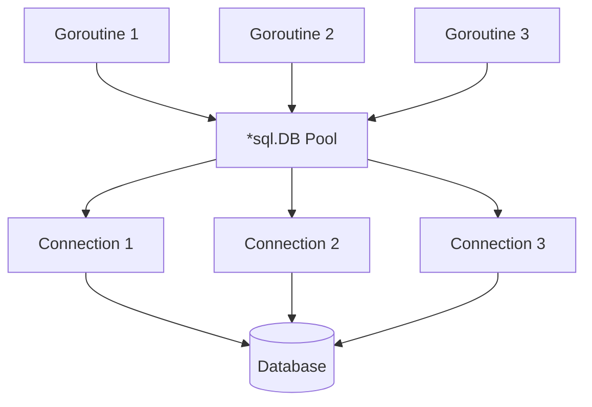
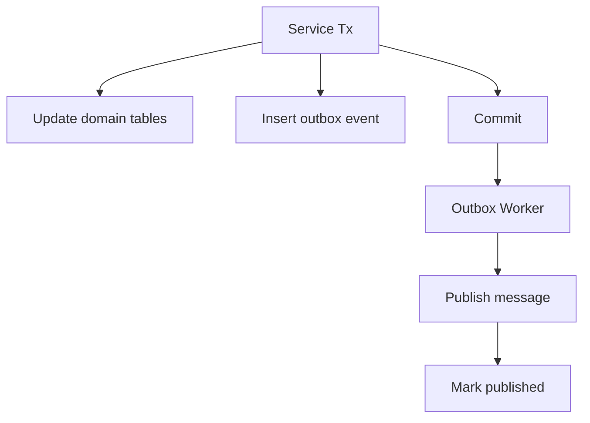

# learn-go-concurrency-parallelism-part-021.md

# Part 021 — Database Concurrency: `database/sql`, Connection Pools, Transactions, Locks, and Backpressure

> Target pembaca: Java software engineer yang ingin memahami concurrency database di Go secara production-grade: bukan hanya “pakai `db.QueryContext`”, tetapi bagaimana connection pool, transaction lifecycle, lock contention, context cancellation, retry, isolation, idempotency, dan backpressure saling terhubung.
>
> Fokus part ini: Go `database/sql`, pool tuning, concurrent query execution, transaction scope, DB locks, deadlocks, context-aware queries, query cancellation, connection leaks, worker/DB pool alignment, repository API design, and production failure modes.

---

## 0. Posisi Part Ini dalam Seri

Sebelumnya:

- Part 011: context sebagai lifecycle/deadline contract.
- Part 013: worker pool.
- Part 015: backpressure end-to-end.
- Part 016: semaphores/rate limiters/bulkheads.
- Part 020: network concurrency.

Part ini membahas boundary yang hampir selalu menjadi bottleneck di backend: **database**.

Database concurrency berbeda dari goroutine concurrency karena melibatkan:

- connection pool,
- transaction isolation,
- row/table/page locks,
- MVCC,
- lock wait,
- deadlock,
- query planning,
- slow query,
- pool wait,
- network roundtrip,
- server CPU/IO,
- connection lifetime,
- transaction duration,
- retry semantics,
- idempotency,
- distributed service instances.

Go membuat banyak goroutine mudah. Database tidak otomatis bisa menerima sebanyak itu.

---

## 1. Tujuan Pembelajaran

Setelah part ini, Anda harus mampu:

1. Menjelaskan `*sql.DB` sebagai pool, bukan single connection.
2. Mengatur:
   - max open connections,
   - max idle connections,
   - connection max lifetime,
   - connection max idle time.
3. Menggunakan `QueryContext`, `ExecContext`, `BeginTx` dengan benar.
4. Menghindari connection leak karena `Rows` tidak ditutup.
5. Memahami relationship antara goroutine concurrency, worker pool, dan DB pool.
6. Mendesain transaction scope yang pendek dan jelas.
7. Menghindari memegang transaction saat melakukan network call.
8. Memahami lock wait, deadlock, retryable transaction error.
9. Mendesain retry transaction yang idempotent dan context-aware.
10. Menentukan kapan parallel query aman dan kapan merusak pool/transaction.
11. Mendesain repository API yang transaction-aware.
12. Menambahkan metrics:
    - pool stats,
    - wait count/duration,
    - query latency,
    - transaction duration,
    - lock/deadlock errors,
    - rows scan count.
13. Membuat checklist review untuk database concurrency.

---

## 2. Mental Model: `*sql.DB` adalah Pool

Di Go, `*sql.DB` bukan satu koneksi. Ia adalah handle ke pool koneksi.



Konsekuensi:

- `*sql.DB` safe for concurrent use.
- Anda biasanya membuat satu `*sql.DB` per database/config dan reuse.
- Jangan membuka koneksi DB baru per request.
- Query concurrent akan meminjam connection dari pool.
- Jika pool penuh, goroutine menunggu.
- Waiting on DB pool adalah bentuk backpressure.
- Jika request context tidak punya deadline, goroutine bisa menunggu terlalu lama.

---

## 3. Java Translation: HikariCP vs `database/sql`

Java Spring/HikariCP:

```text
DataSource -> HikariCP -> JDBC Connections
```

Go:

```text
*sql.DB -> database/sql pool -> driver connections
```

Mapping:

| Java/Hikari | Go `database/sql` |
|---|---|
| `DataSource` | `*sql.DB` |
| max pool size | `SetMaxOpenConns` |
| minimum idle | `SetMaxIdleConns` roughly |
| max lifetime | `SetConnMaxLifetime` |
| idle timeout | `SetConnMaxIdleTime` |
| `Connection` | `*sql.Conn` or internal pooled conn |
| `Transaction` | `*sql.Tx` |
| PreparedStatement | `*sql.Stmt` |
| query timeout | context deadline / DB-specific config |
| leak detection | metrics + code review + tests |

Important difference:
- Go does not force a framework transaction boundary.
- You must design transaction passing explicitly.
- Connection pool stats are available via `db.Stats()`.

---

## 4. Basic Setup

```go
db, err := sql.Open("driver-name", dsn)
if err != nil {
    return err
}

db.SetMaxOpenConns(30)
db.SetMaxIdleConns(30)
db.SetConnMaxLifetime(30 * time.Minute)
db.SetConnMaxIdleTime(5 * time.Minute)

ctx, cancel := context.WithTimeout(context.Background(), 5*time.Second)
defer cancel()

if err := db.PingContext(ctx); err != nil {
    return err
}
```

Notes:
- `sql.Open` may not establish connection immediately.
- Use `PingContext` during startup health/init.
- Pool settings should match DB capacity and service replicas.

---

## 5. Pool Tuning

### 5.1 `SetMaxOpenConns`

Maximum open connections to DB.

If too low:
- goroutines wait for connection,
- latency increases.

If too high:
- DB overloaded,
- more lock contention,
- memory per connection,
- context switching,
- DB CPU saturation.

Rule:
```text
total service instances × max_open_conns <= DB acceptable connections
```

If 10 pods and each max open 50:
```text
total potential DB conns = 500
```

Is DB ready for that?

### 5.2 `SetMaxIdleConns`

Idle connections kept in pool.

If too low:
- frequent reconnect,
- TLS/auth overhead,
- latency spikes.

If too high:
- DB holds many idle sessions.

Often set near max open for steady services, but depends on workload.

### 5.3 `SetConnMaxLifetime`

Maximum lifetime before connection recycled.

Use to:
- avoid stale connections,
- cooperate with load balancers,
- avoid DB closing old sessions unexpectedly.

Add jitter if you manage many pools manually to avoid connection churn waves. `database/sql` handles lifetime, but fleet-level synchronized starts can still create waves.

### 5.4 `SetConnMaxIdleTime`

Close idle connections after duration.

Useful for spiky workloads.

---

## 6. Pool Metrics

`db.Stats()` gives pool stats.

```go
stats := db.Stats()

fmt.Println(stats.OpenConnections)
fmt.Println(stats.InUse)
fmt.Println(stats.Idle)
fmt.Println(stats.WaitCount)
fmt.Println(stats.WaitDuration)
fmt.Println(stats.MaxIdleClosed)
fmt.Println(stats.MaxIdleTimeClosed)
fmt.Println(stats.MaxLifetimeClosed)
```

Key signals:

| Metric | Meaning |
|---|---|
| OpenConnections | total open |
| InUse | currently borrowed |
| Idle | idle available |
| WaitCount | number of waits for connection |
| WaitDuration | total wait duration |
| MaxIdleClosed | closed due to idle limit |
| MaxLifetimeClosed | closed due to lifetime |

Interpretation:
- high WaitCount/WaitDuration = pool saturation.
- InUse near MaxOpen = at capacity.
- DB latency high + InUse high = downstream bottleneck.
- WaitDuration high but DB low = pool too small or connection leak.
- OpenConnections churn high = lifetime/idle settings too aggressive.

---

## 7. Context-Aware Queries

Use context-aware methods:

```go
row := db.QueryRowContext(ctx, query, id)
```

```go
rows, err := db.QueryContext(ctx, query, args...)
```

```go
result, err := db.ExecContext(ctx, query, args...)
```

Why:
- request cancellation propagates,
- deadline enforced,
- pool wait can be cancelled,
- driver may cancel query if supported.

Do not use:
```go
db.Query(query)
db.Exec(query)
```
in request paths unless context truly irrelevant.

---

## 8. Always Close Rows

Bad:

```go
rows, err := db.QueryContext(ctx, query)
if err != nil {
    return err
}

for rows.Next() {
    // ...
}

return rows.Err()
```

Missing `rows.Close()` can hold connection longer.

Good:

```go
rows, err := db.QueryContext(ctx, query)
if err != nil {
    return err
}
defer rows.Close()

for rows.Next() {
    // scan
}

if err := rows.Err(); err != nil {
    return err
}
```

Important:
- `Rows` holds connection until closed/exhausted.
- Always close even if you return early.
- Check `rows.Err()` after iteration.

### 8.1 Early Return Leak

Bad:

```go
for rows.Next() {
    if found {
        return nil // rows not closed if no defer
    }
}
```

Use `defer rows.Close()` immediately after nil error.

---

## 9. QueryRow and Scan

```go
var user User

err := db.QueryRowContext(ctx, query, id).Scan(&user.ID, &user.Name)
if errors.Is(err, sql.ErrNoRows) {
    return User{}, ErrNotFound
}
if err != nil {
    return User{}, err
}
```

`QueryRowContext` defers error until `Scan`.

---

## 10. Prepared Statements

Prepared statements can improve repeated query execution, depending driver/database.

```go
stmt, err := db.PrepareContext(ctx, query)
if err != nil {
    return err
}
defer stmt.Close()

rows, err := stmt.QueryContext(ctx, arg)
```

Cautions:
- statement lifecycle,
- per-connection preparation behavior depends on driver,
- too many prepared statements can stress DB,
- transaction-specific statements differ from DB-level statements.

For most app code, start with parameterized queries. Prepare when measured/needed.

---

## 11. Transactions

Transaction:

```go
tx, err := db.BeginTx(ctx, &sql.TxOptions{
    Isolation: sql.LevelReadCommitted,
    ReadOnly:  false,
})
if err != nil {
    return err
}

defer tx.Rollback()

if _, err := tx.ExecContext(ctx, query1); err != nil {
    return err
}

if _, err := tx.ExecContext(ctx, query2); err != nil {
    return err
}

if err := tx.Commit(); err != nil {
    return err
}

return nil
```

Important:
- `defer tx.Rollback()` is safe; after Commit it returns error ignored.
- Transaction holds a connection until commit/rollback.
- Keep transaction short.
- Do not perform slow external IO inside transaction.
- Context cancellation can affect transaction; ensure rollback/cleanup.

---

## 12. Transaction Scope

Bad:

```go
tx, _ := db.BeginTx(ctx, nil)
defer tx.Rollback()

profile, err := externalAPI.Get(ctx, id) // network call while tx open
if err != nil {
    return err
}

_, err = tx.ExecContext(ctx, updateQuery, profile.Name)
if err != nil {
    return err
}

return tx.Commit()
```

Problems:
- DB connection held while waiting network.
- locks may be held.
- transaction duration high.
- pool saturation.
- deadlock risk higher.

Better:

```go
profile, err := externalAPI.Get(ctx, id)
if err != nil {
    return err
}

tx, err := db.BeginTx(ctx, nil)
if err != nil {
    return err
}
defer tx.Rollback()

if _, err := tx.ExecContext(ctx, updateQuery, profile.Name); err != nil {
    return err
}

return tx.Commit()
```

If consistency requires external call tied to transaction, reconsider architecture:
- outbox,
- saga,
- idempotency,
- reservation pattern,
- compensation.

---

## 13. Repository API Design

Problem: methods need to work inside and outside transaction.

Define minimal interface:

```go
type Execer interface {
    ExecContext(context.Context, string, ...any) (sql.Result, error)
    QueryContext(context.Context, string, ...any) (*sql.Rows, error)
    QueryRowContext(context.Context, string, ...any) *sql.Row
}
```

Both `*sql.DB` and `*sql.Tx` satisfy similar method shapes.

Repository:

```go
type UserRepo struct{}

func (r *UserRepo) FindByID(ctx context.Context, q Execer, id string) (User, error) {
    row := q.QueryRowContext(ctx, `select id, name from users where id = ?`, id)

    var u User
    if err := row.Scan(&u.ID, &u.Name); err != nil {
        if errors.Is(err, sql.ErrNoRows) {
            return User{}, ErrNotFound
        }
        return User{}, err
    }

    return u, nil
}
```

Service:

```go
user, err := repo.FindByID(ctx, db, id)
```

Inside transaction:

```go
tx, _ := db.BeginTx(ctx, nil)
defer tx.Rollback()

user, err := repo.FindByID(ctx, tx, id)
```

---

## 14. Transaction Helper

```go
func WithTx(ctx context.Context, db *sql.DB, opts *sql.TxOptions, fn func(context.Context, *sql.Tx) error) error {
    tx, err := db.BeginTx(ctx, opts)
    if err != nil {
        return err
    }

    defer tx.Rollback()

    if err := fn(ctx, tx); err != nil {
        return err
    }

    return tx.Commit()
}
```

Usage:

```go
err := WithTx(ctx, db, nil, func(ctx context.Context, tx *sql.Tx) error {
    if err := repo.UpdateA(ctx, tx, a); err != nil {
        return err
    }

    return repo.UpdateB(ctx, tx, b)
})
```

Caution:
- do not hide too much.
- commit errors matter.
- rollback errors may matter for logs but usually secondary.
- panic policy? You may recover/rollback/repanic if needed.

---

## 15. Connection Pool and Worker Pool Alignment

If worker pool has 100 workers and DB pool has 10 connections:

```text
90 workers may wait on DB pool
```

This can be acceptable if workers also do non-DB work, but often it is waste.

Better:
- worker count close to DB capacity for DB-bound jobs,
- semaphore around DB-heavy section,
- separate worker pools per workload,
- monitor pool wait.

Example:

```go
dbSem := NewSemaphore(20)

func process(ctx context.Context, job Job) error {
    // CPU/prep outside DB semaphore

    if err := dbSem.Acquire(ctx); err != nil {
        return err
    }
    defer dbSem.Release()

    return repo.Save(ctx, db, job)
}
```

But if `db.SetMaxOpenConns(20)`, DB pool already limits. Why use semaphore?

Reasons:
- avoid many goroutines waiting inside DB pool,
- implement per-route/per-tenant DB budget,
- reject earlier,
- isolate workloads.

---

## 16. Parallel Queries

Parallel DB queries can reduce latency if:
- independent,
- DB can handle concurrency,
- pool capacity available,
- transaction consistency not required across them.

Example:

```go
g, ctx := errgroup.WithContext(ctx)

var user User
var orders []Order

g.Go(func() error {
    var err error
    user, err = userRepo.Find(ctx, db, userID)
    return err
})

g.Go(func() error {
    var err error
    orders, err = orderRepo.List(ctx, db, userID)
    return err
})

if err := g.Wait(); err != nil {
    return err
}
```

But do not blindly parallelize:
- one request now uses multiple DB connections,
- fan-out across many handlers can multiply DB load,
- DB may be better at joining than app fan-out,
- transaction snapshot consistency may differ.

### 16.1 Parallel Query Anti-Pattern

```go
for _, id := range ids {
    id := id
    g.Go(func() error {
        return repo.Load(ctx, db, id)
    })
}
```

If ids = 1000, one request can consume huge DB capacity.

Use:
- batch query,
- `where id in (...)`,
- limit concurrency,
- pagination,
- streaming.

---

## 17. Transaction and Parallelism

Using one `*sql.Tx` concurrently is usually a bad idea unless driver explicitly supports and semantics are clear.

Transaction uses one connection. Even if multiple goroutines call tx concurrently:
- operations serialize or race at driver/connection level,
- error handling becomes confusing,
- transaction state can be corrupted,
- ordering matters.

Prefer sequential operations inside transaction.

If you need parallel work:
- do parallel reads before transaction if safe,
- then short transaction for writes,
- or use separate transactions with clear consistency.

---

## 18. Isolation Levels

Common isolation concepts:
- read uncommitted,
- read committed,
- repeatable read,
- serializable.

Go exposes isolation constants, but actual support depends on database/driver.

```go
tx, err := db.BeginTx(ctx, &sql.TxOptions{
    Isolation: sql.LevelSerializable,
})
```

Higher isolation can:
- reduce anomalies,
- increase blocking/retries,
- cause serialization failures.

Concurrency design must include retry for serializable conflicts.

---

## 19. Locks and Lock Wait

DB operations may wait on locks:
- row lock,
- table lock,
- index lock,
- metadata lock,
- advisory lock.

Symptoms:
- query latency high,
- DB CPU may not be high,
- connection pool InUse high,
- transactions long,
- lock wait errors/deadlocks.

App-side:
- set statement/lock timeout if DB supports,
- keep transactions short,
- access rows in consistent order,
- avoid user think-time in transaction,
- avoid external calls in transaction.

---

## 20. Deadlocks

Deadlock example:

Transaction A:
```text
lock row 1
lock row 2
```

Transaction B:
```text
lock row 2
lock row 1
```

DB aborts one transaction.

App must:
- detect retryable deadlock/serialization error,
- retry whole transaction,
- ensure idempotency,
- use backoff/jitter,
- preserve deadline.

### 20.1 Consistent Lock Ordering

If transferring between accounts:
- always lock smaller account ID first.

```go
a, b := fromID, toID
if b < a {
    a, b = b, a
}
```

Then lock/update in stable order.

---

## 21. Transaction Retry

Pseudo:

```go
func WithTxRetry(ctx context.Context, db *sql.DB, opts *sql.TxOptions, maxAttempts int, fn func(context.Context, *sql.Tx) error) error {
    var last error

    for attempt := 0; attempt < maxAttempts; attempt++ {
        err := WithTx(ctx, db, opts, fn)
        if err == nil {
            return nil
        }

        last = err

        if !isRetryableTxError(err) {
            return err
        }

        if attempt == maxAttempts-1 {
            break
        }

        delay := jitter(backoff(attempt))

        if err := Sleep(ctx, delay); err != nil {
            return err
        }
    }

    return last
}
```

Cautions:
- `fn` may be executed multiple times.
- `fn` must not perform non-idempotent external side effects.
- If fn sends email, publishes message, calls payment API, retry can duplicate.
- Use outbox/idempotency.

---

## 22. Outbox Pattern

Problem:
- update DB and publish message atomically.

Bad:

```go
tx update DB
commit
publish event
```

If publish fails, DB committed but no event.

Bad:

```go
publish event
tx update DB
commit
```

If commit fails, event published for nonexistent update.

Outbox:
- write domain change and outbox event in same DB transaction.
- separate worker reads outbox and publishes.
- mark published.



Concurrency:
- outbox worker pool bounded,
- skip locked / claim rows,
- idempotent publish,
- retry with backoff,
- dead-letter after repeated failure.

---

## 23. Idempotency with DB Unique Constraint

For create operations:

```sql
unique(idempotency_key)
```

Flow:
- insert idempotency record,
- perform operation,
- store response.

For natural uniqueness:
- unique order number,
- unique event ID,
- unique processed message ID.

Use DB constraints as concurrency control.

App-level check-then-insert is racy:

```go
exists := check(key)
if !exists {
    insert(key)
}
```

Use atomic insert/unique constraint.

---

## 24. Pagination and Streaming Rows

Loading huge result into memory:

```go
rows, _ := db.QueryContext(ctx, query)
var all []Item
for rows.Next() {
    all = append(all, scan(rows))
}
```

Risk:
- memory blowup,
- long connection hold,
- long transaction snapshot,
- slow response.

Options:
- pagination,
- streaming to client with backpressure,
- process rows incrementally,
- limit result size,
- use cursor if supported.

Streaming rows still holds DB connection until done. If downstream sink is slow, DB connection held.

Pipeline design:
- read rows,
- bounded channel,
- workers,
- but reader blocks if channel full,
- DB connection remains open.

Sometimes better:
- page in chunks,
- close rows per chunk,
- process chunk.

---

## 25. N+1 Query Problem and Concurrency

N+1 can hide under concurrency.

Bad:
```go
for _, order := range orders {
    g.Go(func() error {
        return repo.LoadItems(ctx, db, order.ID)
    })
}
```

Parallel N+1 still N+1:
- more DB connections,
- more roundtrips,
- more lock/planner overhead.

Prefer:
- join,
- batch query,
- `where order_id in (...)`,
- prefetch,
- denormalized read model.

Concurrency is not a substitute for query design.

---

## 26. DB Backpressure at API Boundary

If DB is saturated:
- reject earlier,
- shed optional DB work,
- use cache,
- degrade,
- queue background work,
- circuit breaker for DB? carefully,
- readiness? only for severe/unrecoverable.

Admission examples:
- per-route semaphore for DB-heavy endpoint,
- bounded wait on DB bulkhead,
- fail-fast 503/429.

Do not let every request wait on DB pool until client timeout.

---

## 27. Context Cancellation and DB Driver Reality

`QueryContext` propagates cancellation, but behavior depends on driver/database:
- query may be cancelled server-side,
- connection may be closed,
- cancellation may only stop waiting locally,
- transaction may be left in aborted state.

Design:
- handle context errors,
- rollback transaction after cancellation,
- avoid reusing tx after error,
- monitor driver behavior,
- set DB-side statement timeout where available.

---

## 28. Statement Timeout vs Context Timeout

Context timeout is app-side lifecycle.
DB statement timeout is database-side enforcement.

Use both for critical systems:
- context deadline from request,
- DB session/statement timeout to avoid runaway query if app disconnects.

DB-specific configuration varies:
- PostgreSQL statement_timeout,
- MySQL max_execution_time hints/settings,
- Oracle resource manager/profile/query timeout mechanisms,
- SQL Server command timeout via driver/config.

Do not assume context alone always kills server-side query immediately.

---

## 29. Connection Leaks

Causes:
- rows not closed,
- transaction not committed/rolled back,
- response body/network stream inside transaction,
- long-running row iteration,
- forgotten `Stmt.Close`,
- goroutine blocked while holding tx/conn.

Symptoms:
- `InUse` stays high,
- `WaitCount` increases,
- DB idle sessions? depends,
- app latency spikes.

Detection:
- pool stats,
- query logs,
- pprof goroutine dump,
- tests,
- instrumentation around repository calls.

---

## 30. Dedicated Connection `*sql.Conn`

Use when you need one specific connection:
- session variables,
- advisory lock,
- temp table,
- connection-specific state.

```go
conn, err := db.Conn(ctx)
if err != nil {
    return err
}
defer conn.Close()
```

Caution:
- `conn.Close()` returns it to pool.
- holding conn reduces pool capacity.
- prefer tx where transaction semantics needed.
- avoid session state if possible.

---

## 31. Advisory Locks

Some DBs support advisory locks.

Use cases:
- distributed mutual exclusion,
- leader election-ish tasks,
- per-key serialization.

Risks:
- connection/session bound locks,
- transaction bound locks,
- deadlock,
- lock leak if connection stuck,
- reduced concurrency,
- hard operational visibility.

Prefer:
- unique constraints,
- idempotency,
- row-level locking,
- queue partitioning,
- external lock service if appropriate.

---

## 32. Row-Level Work Claiming

Background workers claiming jobs:

SQL concept:
```sql
select id
from jobs
where status = 'pending'
order by created_at
limit 10
for update skip locked
```

Then update to `processing`.

Concurrency:
- multiple workers claim different rows,
- avoid double processing,
- transaction short,
- heartbeat/lease for stuck jobs,
- retry/attempt count,
- DLQ.

App design:
- worker count bounded,
- DB query rate bounded,
- transaction around claim,
- processing outside claim transaction or with lease depending semantics,
- idempotency.

---

## 33. Handling Slow Queries

App-side:
- context timeout,
- statement timeout,
- query metrics,
- per-query labels,
- result size limits,
- pagination.

DB-side:
- indexes,
- query plan,
- statistics,
- lock monitoring,
- slow query log,
- connection/session monitoring.

Concurrency angle:
- one slow query holds connection longer.
- many slow queries saturate pool.
- pool wait then affects unrelated requests.
- bulkhead/separate pool may be needed for slow reports.

---

## 34. Read vs Write Pools

Sometimes separate pools:
- OLTP writes,
- report reads,
- read replica,
- background job.

Benefits:
- isolate report from API.
- protect writes.
- control replica load.

Risks:
- consistency lag,
- more config,
- total connection explosion,
- transaction semantics across pools impossible.

---

## 35. Multi-Instance Math

If each pod:
```text
MaxOpenConns = 40
```

and HPA scales to 20 pods:
```text
800 possible DB connections
```

Need:
- DB max connection capacity,
- reserved admin connections,
- other services,
- migration jobs,
- connection overhead,
- pool wait metrics.

Scaling app horizontally can overload DB unless connection budgets scale accordingly.

---

## 36. Observability

### 36.1 Pool Metrics
- open connections,
- in use,
- idle,
- wait count,
- wait duration,
- max lifetime closed,
- max idle closed.

### 36.2 Query Metrics
- latency by query name,
- rows returned,
- rows affected,
- error by class,
- timeout count,
- cancellation count.

### 36.3 Transaction Metrics
- duration,
- commit latency,
- rollback count,
- retry count,
- deadlock count,
- serialization failure count.

### 36.4 Lock Metrics
- lock wait errors,
- deadlock errors,
- DB-side lock wait if available.

### 36.5 App Metrics
- DB bulkhead wait,
- DB queue rejection,
- worker DB saturation,
- endpoint latency correlated with DB pool wait.

---

## 37. Testing Database Concurrency

### 37.1 Unit Tests with Fake DB?

Useful for service logic but cannot catch real DB concurrency/locking.

### 37.2 Integration Tests

Use real DB for:
- transaction isolation,
- unique constraint race,
- deadlock retry,
- row locking,
- context timeout behavior,
- driver cancellation behavior.

### 37.3 Race Tests

Race detector catches Go memory races, not DB logical races.

### 37.4 Concurrency Test Example

Test unique constraint/idempotency:

```go
var wg sync.WaitGroup
success := atomic.Int64{}

for i := 0; i < 50; i++ {
    wg.Go(func() {
        err := repo.CreateWithKey(ctx, key)
        if err == nil {
            success.Add(1)
        }
    })
}

wg.Wait()

if success.Load() != 1 {
    t.Fatalf("success = %d, want 1", success.Load())
}
```

### 37.5 Timeout Test

- run query that sleeps/locks.
- context timeout.
- verify connection returned usable.
- verify transaction rolled back.

---

## 38. Case Study 1: Pool Saturation from Missing Rows Close

Symptoms:
- latency increases over time,
- `InUse` climbs to max,
- `WaitCount` increases,
- DB not necessarily busy.

Bug:
```go
rows, err := db.QueryContext(ctx, query)
if err != nil { return err }
// no rows.Close
```

Fix:
```go
defer rows.Close()
```

Add:
- static analysis/code review,
- repository wrapper,
- pool metrics alert.

---

## 39. Case Study 2: External API Inside Transaction

Symptoms:
- DB locks held long,
- deadlocks,
- pool saturation,
- slow downstream correlated with DB incident.

Bug:
```go
tx begin
update row lock
call external API
commit
```

Fix:
- call external before tx if safe,
- short tx,
- outbox for external side effect,
- idempotency.

---

## 40. Case Study 3: Report Endpoint Starves Login

Report:
- long queries,
- many rows,
- same DB pool as login.

Fix:
- separate route admission,
- smaller concurrency for report,
- read replica,
- pagination/export async,
- statement timeout,
- login reserved DB budget.

---

## 41. Case Study 4: Parallel Query Fan-Out Meltdown

One API request loads 100 IDs in parallel.
At 100 concurrent users:
```text
10,000 DB queries in flight/waiting
```

Fix:
- batch query,
- limit concurrency,
- cache,
- precompute read model,
- pagination.

---

## 42. Anti-Pattern Catalog

### 42.1 Opening DB per Request

Connection storm, no pooling benefit.

### 42.2 No Pool Limits

DB connection explosion.

### 42.3 Rows Not Closed

Connection leak.

### 42.4 Transaction Not Rolled Back

Connection/lock leak.

### 42.5 External IO Inside Transaction

Long locks.

### 42.6 Parallelizing N+1

Makes bad query design worse.

### 42.7 Using `context.Background` for Query

Cancellation/deadline broken.

### 42.8 Retrying Transaction with Side Effects

Duplicate payment/email/message.

### 42.9 Huge Result Load

Memory and connection hold.

### 42.10 One DB Pool for All Workloads

Reports/background starve OLTP.

### 42.11 Assuming Local Mutex Protects DB State Across Pods

Use DB constraints/transactions.

### 42.12 Ignoring Pool Wait Metrics

DB saturation invisible until p99 bad.

---

## 43. Design Review Checklist

For DB concurrency:

1. Is `*sql.DB` reused?
2. Are pool settings explicit?
3. Does total pod connection budget fit DB?
4. Are queries context-aware?
5. Are Rows always closed?
6. Is rows.Err checked?
7. Are transactions rolled back on error?
8. Are transactions short?
9. Is external IO outside transaction?
10. Are locks acquired in consistent order?
11. Are deadlocks/serialization failures retried?
12. Is retry function idempotent?
13. Are DB side effects protected by unique constraints/idempotency?
14. Are parallel queries bounded?
15. Could query be batched instead of fan-out?
16. Are large results paginated/streamed safely?
17. Is DB pool aligned with worker pool?
18. Are DB-heavy routes admitted separately?
19. Are reports/background isolated?
20. Are statement timeouts configured where needed?
21. Is context cancellation behavior tested with driver?
22. Are pool stats exported?
23. Are query metrics labeled by query name?
24. Are lock/deadlock errors visible?
25. Is read replica lag considered?
26. Are prepared statements managed?
27. Are dedicated connections closed?
28. Are migrations/jobs included in connection budget?
29. Is shutdown waiting for DB work appropriately?
30. Are integration concurrency tests present?

---

## 44. Mini Lab 1: Repository with Tx-Aware Interface

Implement:
- `Execer` interface,
- repo methods usable with `*sql.DB` and `*sql.Tx`,
- transaction helper.

Test:
- outside tx,
- inside tx rollback,
- inside tx commit.

---

## 45. Mini Lab 2: Pool Saturation Simulation

Create:
- DB pool max open 2,
- 10 goroutines running slow query,
- context timeout.

Measure:
- WaitCount,
- WaitDuration,
- InUse,
- latency.

Observe impact of pool size.

---

## 46. Mini Lab 3: Rows Close Leak

Write test that intentionally does not close rows.
Observe:
- pool InUse remains high,
- next query waits.

Then fix.

---

## 47. Mini Lab 4: Transaction Retry

Implement `WithTxRetry`.

Simulate retryable error.
Ensure:
- fn can run multiple times,
- context cancellation stops retry,
- non-retryable error stops immediately,
- backoff+jitter used.

Discuss why external side effects must not be inside fn.

---

## 48. Mini Lab 5: Work Claiming Queue

Implement DB-backed jobs:
- pending rows,
- claim batch,
- mark processing,
- complete,
- retry attempts,
- dead-letter.

Add:
- worker concurrency limit,
- context deadline,
- stuck job recovery.

---

## 49. Mini Lab 6: Report Isolation

Build two endpoints:
- login query fast,
- report query slow.

Version 1:
- same DB pool/admission.

Version 2:
- report semaphore/queue,
- login reserved capacity.

Compare latency under load.

---

## 50. Top 1% Heuristics

1. `*sql.DB` is a pool; treat it as shared infrastructure.
2. Pool size is system capacity policy, not random config.
3. Total DB connections = pods × max open connections.
4. Every query in request path should take context.
5. `Rows.Close` is non-negotiable.
6. Transactions should be short and boring.
7. Do not call remote APIs while holding DB transaction.
8. Parallel queries multiply DB load.
9. N+1 is not fixed by goroutines.
10. Deadlock retry requires idempotent transaction body.
11. Unique constraints are concurrency control.
12. Pool wait metrics are backpressure signals.
13. DB statement timeout complements context timeout.
14. Background/report workload needs isolation.
15. The best DB concurrency optimization is often better query design.

---

## 51. Source Notes

Primary Go concepts behind this part:

1. Go `database/sql`:
   - `*sql.DB` as concurrent pool,
   - `QueryContext`,
   - `ExecContext`,
   - `BeginTx`,
   - `Rows`,
   - `Tx`,
   - `DBStats`.

2. Go `context`:
   - cancellation/deadline propagation to DB calls.

3. Go concurrency primitives:
   - worker pools,
   - semaphores,
   - errgroup,
   - backpressure.

4. Database concurrency fundamentals:
   - transactions,
   - isolation levels,
   - row locks,
   - deadlocks,
   - serialization failure,
   - connection pool saturation.

5. Reliability patterns:
   - idempotency,
   - outbox,
   - retry with backoff,
   - bulkheads,
   - admission control.

---

## 52. Summary

Database concurrency in Go is a coordination problem between:

- goroutines,
- connection pool,
- transactions,
- DB locks,
- query execution,
- request deadlines,
- worker pools,
- service replicas.

The central rule:

> Go can create more concurrent work than your database can safely execute.

Therefore:
- bound DB concurrency,
- tune pool explicitly,
- use context,
- keep transactions short,
- close rows,
- avoid parallel N+1,
- retry only idempotent transaction bodies,
- isolate slow workloads,
- observe pool wait and transaction duration.

A production Go engineer treats the DB pool as a first-class concurrency boundary.

---

## 53. Status Seri

Selesai:
- Part 000 — Orientation
- Part 001 — Foundations
- Part 002 — Goroutine Internals
- Part 003 — Go Scheduler Deep Dive
- Part 004 — GOMAXPROCS, CPU Quotas, Containers
- Part 005 — Go Memory Model
- Part 006 — Synchronization Primitives
- Part 007 — Atomic Operations
- Part 008 — Channels Deep Dive
- Part 009 — Select Semantics
- Part 010 — WaitGroup, ErrGroup, Task Groups, and Structured Concurrency
- Part 011 — Context as Concurrency Contract
- Part 012 — Ownership Models
- Part 013 — Worker Pools
- Part 014 — Fan-Out/Fan-In, Pipelines, Stages, and Stream Processing
- Part 015 — Backpressure End-to-End
- Part 016 — Semaphores, Rate Limiters, Token Buckets, and Bulkheads
- Part 017 — Concurrent Data Structures
- Part 018 — Singleflight, Deduplication, Idempotency, and Stampede Prevention
- Part 019 — Timers, Tickers, Deadlines, Scheduling, and Time-Based Concurrency
- Part 020 — Network Concurrency
- Part 021 — Database Concurrency

Belum selesai:
- Part 022 sampai Part 034.

Seri belum mencapai bagian terakhir.

<!-- NAVIGATION_FOOTER -->
<div class="page-nav">
<a href="./learn-go-concurrency-parallelism-part-020.md">⬅️ Part 020 — Network Concurrency: HTTP, TCP, gRPC, Connection Pools, Timeouts, and Streaming</a>
<a href="./index.md">📚 Kategori</a>
<a href="../../index.md">🏠 Home</a>
<a href="./learn-go-concurrency-parallelism-part-022.md">Part 022 — Parallel CPU Work: Partitioning, Reduction, Cache Locality, and Runtime-Aware Parallelism ➡️</a>
</div>
