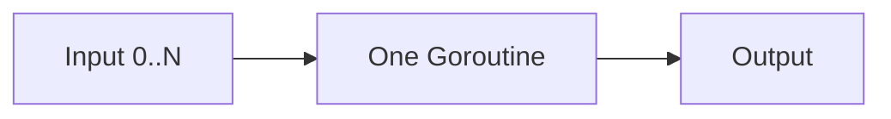
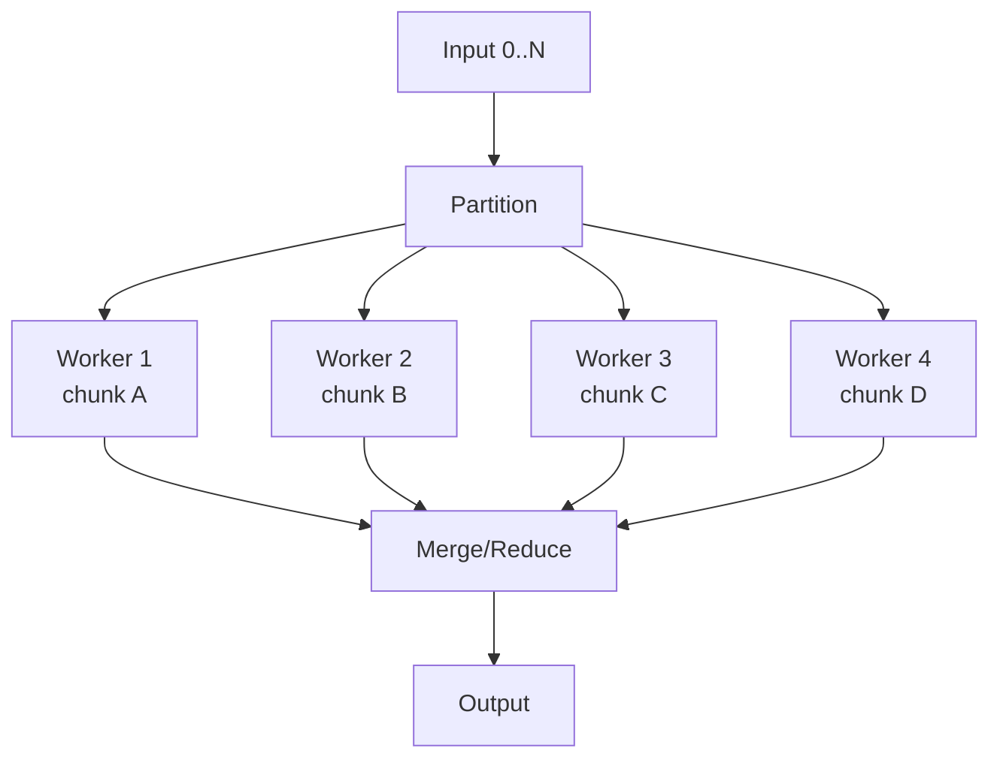

# learn-go-concurrency-parallelism-part-022.md

# Part 022 — Parallel CPU Work: Partitioning, Reduction, Cache Locality, and Runtime-Aware Parallelism

> Target pembaca: Java software engineer yang ingin memahami CPU-bound concurrency di Go secara production-grade: kapan mem-parallel-kan work, bagaimana membagi data, bagaimana menghindari false sharing, bagaimana melakukan reduction dengan benar, dan bagaimana membaca hasil benchmark/profiling.
>
> Fokus part ini: CPU-bound parallelism, `GOMAXPROCS`, work partitioning, chunking, parallel map/reduce, cancellation, memory bandwidth, cache locality, false sharing, SIMD limitations, scheduler overhead, and production failure modes.

---

## 0. Posisi Part Ini dalam Seri

Sebelumnya:

- Part 003: scheduler Go.
- Part 004: `GOMAXPROCS`, CPU quota, containers.
- Part 005: memory model.
- Part 007: atomic operations.
- Part 013: worker pools.
- Part 017: concurrent data structures.
- Part 021: database concurrency.

Part ini fokus pada workload yang bottleneck utamanya adalah CPU.

Contoh CPU-bound work:
- hashing,
- compression,
- encryption,
- image processing,
- JSON/XML parsing besar,
- validation besar,
- batch transformation,
- ranking/scoring,
- simulation,
- text processing,
- data normalization,
- checksum,
- protobuf encode/decode berat,
- report aggregation,
- analytics pre-processing.

Pertanyaan utama:

> Kapan goroutine membuat CPU work lebih cepat, dan kapan hanya menambah overhead?

Parallel CPU work bukan sekadar:

```go
for _, item := range items {
    go process(item)
}
```

Production-grade parallel CPU work harus mempertimbangkan:
- number of logical CPUs,
- `GOMAXPROCS`,
- container CPU quota,
- work granularity,
- memory allocation,
- cache locality,
- false sharing,
- load balancing,
- cancellation,
- result ordering,
- reduction,
- benchmark validity,
- GC pressure,
- latency vs throughput.

---

## 1. Tujuan Pembelajaran

Setelah part ini, Anda harus mampu:

1. Membedakan concurrency I/O-bound dan parallelism CPU-bound.
2. Menentukan kapan work layak diparalelkan.
3. Mendesain parallel loop dengan bounded workers.
4. Membagi work:
   - contiguous chunk,
   - dynamic work queue,
   - per-shard,
   - recursive split.
5. Melakukan reduction:
   - local accumulation,
   - merge phase,
   - avoid atomic hot counter.
6. Memahami cache locality, memory bandwidth, false sharing.
7. Menggunakan `runtime.GOMAXPROCS(0)` secara benar.
8. Memahami CPU quota/container impact.
9. Menghindari goroutine-per-item untuk task kecil.
10. Mendesain cancellation untuk CPU-bound loop.
11. Benchmark CPU parallelism dengan benar.
12. Menggunakan pprof untuk melihat CPU bottleneck.
13. Membuat checklist review untuk CPU-bound parallel work.

---

## 2. Mental Model: CPU Parallelism Mengubah Work Menjadi Partisi

Sequential:



Parallel:



Parallelism speedup depends on:

```text
speedup = useful_parallel_work / (parallel_work + overhead + contention + memory bottleneck)
```

Overhead:
- goroutine creation,
- scheduling,
- channel communication,
- synchronization,
- cache misses,
- memory allocation,
- merge/reduce,
- GC,
- false sharing.

Parallelism works best when:
- work per item/chunk is large,
- data can be partitioned independently,
- merge cost small,
- memory bandwidth not already saturated,
- no shared hot lock/atomic,
- number of workers matches CPU capacity.

---

## 3. Java Translation

Java CPU parallelism tools:
- `ForkJoinPool`,
- parallel streams,
- executor fixed thread pool,
- `CompletableFuture`,
- `LongAdder`,
- `Spliterator`,
- vector API,
- thread pools.

Go equivalents:
- goroutines,
- worker pools,
- `errgroup.SetLimit`,
- channels,
- `sync.WaitGroup`,
- local partial results,
- `runtime.GOMAXPROCS`,
- pprof CPU profiler.

Important difference:
- Go does not have built-in fork/join pool abstraction in standard library.
- Goroutines are cheap, but CPU cores are still finite.
- For CPU-bound work, worker count should usually be near `GOMAXPROCS`, not thousands.
- Parallel streams hide partitioning; Go makes you design it.

---

## 4. CPU-Bound vs I/O-Bound

### 4.1 CPU-Bound

Increasing goroutines beyond CPU capacity usually hurts.

```text
workers ≈ GOMAXPROCS
```

or slightly less/more after benchmark.

### 4.2 I/O-Bound

Workers can exceed CPU count because goroutines spend time blocked.

```text
workers ≈ throughput × latency
```

### 4.3 Mixed Workload

If task does CPU + DB + HTTP:
- split stages,
- CPU stage near CPU count,
- I/O stage by dependency limit,
- avoid one worker count for all stages.

---

## 5. `GOMAXPROCS`

`runtime.GOMAXPROCS(0)` returns current max number of Ps that can execute Go code simultaneously.

```go
p := runtime.GOMAXPROCS(0)
```

For CPU-bound parallelism, start with:

```go
workers := runtime.GOMAXPROCS(0)
```

But in containers:
- CPU quota may limit effective parallelism.
- Go runtime may adjust default based on container quota in modern Go versions.
- still benchmark in actual deployment environment.

Do not assume host has all CPUs available to your pod.

---

## 6. When Not to Parallelize

Do not parallelize if:

1. Input small.
2. Per-item work tiny.
3. Shared lock dominates.
4. Memory bandwidth already bottleneck.
5. Allocation/GC dominates.
6. Merge cost high.
7. Ordering/reduction complexity high.
8. Latency target better served by simpler sequential code.
9. Work already parallel inside library.
10. Downstream is not CPU but I/O/DB.

Sequential may be faster and more reliable.

Example bad:

```go
for _, n := range nums {
    go func(n int) {
        out <- n + 1
    }(n)
}
```

For trivial arithmetic, goroutine overhead dwarfs work.

---

## 7. Work Granularity

Granularity = amount of work per scheduled unit.

Too fine:
- scheduling/channel overhead high.

Too coarse:
- poor load balance,
- some workers idle while one large chunk runs.

Good chunk:
- enough work to amortize overhead,
- small enough for balance.

Example:

```text
N = 10,000,000 items
workers = 8
chunk size = ceil(N/workers)
```

Contiguous chunks are good for arrays/slices.

---

## 8. Parallel For: Contiguous Chunking

```go
func ParallelFor(n int, workers int, fn func(start, end int)) {
    if n <= 0 {
        return
    }
    if workers <= 0 {
        workers = runtime.GOMAXPROCS(0)
    }
    if workers > n {
        workers = n
    }

    chunk := (n + workers - 1) / workers

    var wg sync.WaitGroup

    for start := 0; start < n; start += chunk {
        start := start
        end := start + chunk
        if end > n {
            end = n
        }

        wg.Go(func() {
            fn(start, end)
        })
    }

    wg.Wait()
}
```

Usage:

```go
ParallelFor(len(items), runtime.GOMAXPROCS(0), func(start, end int) {
    for i := start; i < end; i++ {
        out[i] = process(items[i])
    }
})
```

Safe if:
- each worker writes distinct indices,
- input not mutated concurrently,
- read output after wait.

---

## 9. Parallel Map

```go
func ParallelMap[A, B any](
    ctx context.Context,
    in []A,
    workers int,
    fn func(context.Context, A) (B, error),
) ([]B, error) {
    if workers <= 0 {
        workers = runtime.GOMAXPROCS(0)
    }
    if workers > len(in) {
        workers = len(in)
    }
    if workers == 0 {
        return []B{}, nil
    }

    out := make([]B, len(in))

    ctx, cancel := context.WithCancel(ctx)
    defer cancel()

    errCh := make(chan error, 1)

    chunk := (len(in) + workers - 1) / workers
    var wg sync.WaitGroup

    for start := 0; start < len(in); start += chunk {
        start := start
        end := min(start+chunk, len(in))

        wg.Go(func() {
            for i := start; i < end; i++ {
                select {
                case <-ctx.Done():
                    return
                default:
                }

                v, err := fn(ctx, in[i])
                if err != nil {
                    select {
                    case errCh <- err:
                        cancel()
                    default:
                    }
                    return
                }

                out[i] = v
            }
        })
    }

    done := make(chan struct{})
    go func() {
        wg.Wait()
        close(done)
    }()

    select {
    case <-done:
        select {
        case err := <-errCh:
            return nil, err
        default:
            return out, nil
        }

    case err := <-errCh:
        cancel()
        <-done
        return nil, err

    case <-ctx.Done():
        <-done
        return nil, ctx.Err()
    }
}
```

Note:
- for pure CPU work, checking context every item may be expensive if item is tiny.
- check every chunk/batch for tiny work.

---

## 10. Avoid Goroutine Per Item

Bad:

```go
for i := range items {
    i := i
    wg.Go(func() {
        out[i] = process(items[i])
    })
}
```

If `len(items)` is huge, creates huge goroutines.

Better:
- chunking,
- worker queue,
- errgroup with limit,
- parallel for.

Use goroutine-per-item only when:
- item count small/bounded,
- work heavy,
- lifecycle clear.

---

## 11. Static Chunking vs Dynamic Work Queue

### 11.1 Static Chunking

Each worker gets contiguous range.

Pros:
- simple,
- cache-friendly,
- low channel overhead,
- deterministic.

Cons:
- load imbalance if item cost varies.

### 11.2 Dynamic Work Queue

Workers pull tasks.

```go
jobs := make(chan int)
```

Pros:
- balances variable-cost work.

Cons:
- channel overhead,
- less cache locality,
- more scheduling/sync overhead.

Use dynamic when:
- item cost highly variable,
- work can be split into meaningful chunks.

Better dynamic chunks:

```go
type Range struct {
    Start int
    End   int
}
```

Send chunks, not individual tiny items.

---

## 12. Dynamic Chunk Queue

```go
func ParallelChunks(ctx context.Context, n, chunkSize, workers int, fn func(context.Context, int, int) error) error {
    if workers <= 0 {
        workers = runtime.GOMAXPROCS(0)
    }
    if chunkSize <= 0 {
        chunkSize = 1024
    }

    ctx, cancel := context.WithCancel(ctx)
    defer cancel()

    jobs := make(chan Range)
    errCh := make(chan error, 1)

    var wg sync.WaitGroup

    for w := 0; w < workers; w++ {
        wg.Go(func() {
            for r := range jobs {
                if err := fn(ctx, r.Start, r.End); err != nil {
                    select {
                    case errCh <- err:
                        cancel()
                    default:
                    }
                    return
                }

                select {
                case <-ctx.Done():
                    return
                default:
                }
            }
        })
    }

    go func() {
        defer close(jobs)

        for start := 0; start < n; start += chunkSize {
            end := min(start+chunkSize, n)

            select {
            case jobs <- Range{Start: start, End: end}:
            case <-ctx.Done():
                return
            }
        }
    }()

    done := make(chan struct{})
    go func() {
        wg.Wait()
        close(done)
    }()

    select {
    case <-done:
        select {
        case err := <-errCh:
            return err
        default:
            return nil
        }

    case err := <-errCh:
        cancel()
        <-done
        return err

    case <-ctx.Done():
        <-done
        return ctx.Err()
    }
}
```

---

## 13. Reduction

Bad: atomic add per item.

```go
var total atomic.Int64

ParallelFor(len(nums), workers, func(start, end int) {
    for i := start; i < end; i++ {
        total.Add(int64(nums[i]))
    }
})
```

This creates hot atomic contention.

Better: local sum per worker, merge after.

```go
partials := make([]int64, workers)

ParallelForWorkers(len(nums), workers, func(worker, start, end int) {
    var local int64
    for i := start; i < end; i++ {
        local += int64(nums[i])
    }
    partials[worker] = local
})

var total int64
for _, p := range partials {
    total += p
}
```

Need function that passes worker index.

---

## 14. ParallelFor with Worker Index

```go
func ParallelForWorkers(n, workers int, fn func(worker, start, end int)) {
    if n <= 0 {
        return
    }
    if workers <= 0 {
        workers = runtime.GOMAXPROCS(0)
    }
    if workers > n {
        workers = n
    }

    chunk := (n + workers - 1) / workers

    var wg sync.WaitGroup

    worker := 0
    for start := 0; start < n; start += chunk {
        start := start
        end := min(start+chunk, n)
        workerID := worker
        worker++

        wg.Go(func() {
            fn(workerID, start, end)
        })
    }

    wg.Wait()
}
```

Use:

```go
partials := make([]int64, workers)

ParallelForWorkers(len(nums), workers, func(worker, start, end int) {
    var local int64
    for i := start; i < end; i++ {
        local += int64(nums[i])
    }
    partials[worker] = local
})
```

---

## 15. False Sharing in Partials

Even local partials can false-share if workers write frequently to adjacent memory.

Bad if workers repeatedly update `partials[worker]` inside loop:

```go
for i := start; i < end; i++ {
    partials[worker] += int64(nums[i])
}
```

Adjacent partials may share cache line.

Better:
- accumulate local variable,
- write once at end.

```go
var local int64
for i := start; i < end; i++ {
    local += int64(nums[i])
}
partials[worker] = local
```

If repeated writes unavoidable, use padding after measuring.

---

## 16. Cache Locality

CPU likes contiguous memory.

Good:
- slice contiguous chunks,
- worker processes continuous range,
- output same range,
- avoid random pointer chasing.

Bad:
- workers jump around random indices,
- shared map mutations,
- many small heap objects,
- channel per item.

For arrays/slices, static contiguous chunking often beats dynamic per-item queue.

---

## 17. Memory Bandwidth Bottleneck

Some workloads are memory-bound, not CPU-bound.

Example:
- copy huge byte slices,
- scan large arrays with simple operation,
- parse memory-heavy structures.

Adding workers may saturate memory bandwidth and stop improving.

Symptoms:
- CPU not fully scaling,
- speedup plateaus,
- high cache misses,
- memory bandwidth high,
- more workers worsen performance.

Benchmark worker counts:
```text
1, 2, 4, 8, 16...
```

Do not assume linear speedup.

---

## 18. Allocation and GC Pressure

Parallel CPU work can allocate in parallel, increasing GC pressure.

Bad:
```go
for each item:
    create many temporary objects
```

Mitigations:
- reuse buffers carefully,
- preallocate output,
- avoid per-item allocations,
- local scratch per worker,
- `sync.Pool` for large temporary buffers if beneficial,
- streaming/chunking,
- profile allocations.

Per-worker scratch:

```go
ParallelForWorkers(len(items), workers, func(worker, start, end int) {
    scratch := make([]byte, 0, 64*1024)

    for i := start; i < end; i++ {
        scratch = scratch[:0]
        out[i] = processWithScratch(items[i], scratch)
    }
})
```

Ensure scratch not retained by output unless copied.

---

## 19. Atomic vs Local Aggregation

Use atomic for:
- simple counters updated occasionally,
- coordination flags,
- progress reporting.

Avoid atomic in inner loop if possible.

Bad:
```go
progress.Add(1)
```
for every item if millions/second.

Better:
- local count,
- periodically add,
- report per chunk.

```go
local := 0
for i := start; i < end; i++ {
    process(i)
    local++

    if local%1024 == 0 {
        progress.Add(1024)
    }
}
progress.Add(int64(local % 1024))
```

---

## 20. Cancellation in CPU Loops

CPU-bound loops do not block on context. You must check.

Too frequent check:
- overhead.

Too rare:
- slow cancellation.

Pattern:

```go
for i := start; i < end; i++ {
    if i%1024 == 0 {
        select {
        case <-ctx.Done():
            return ctx.Err()
        default:
        }
    }

    process(i)
}
```

Tune check interval by work cost and cancellation latency requirement.

---

## 21. Error Handling in CPU Parallel Work

Fail-fast:
- first worker error cancels context.
- others stop at next check.

Collect-all:
- workers collect local errors.
- merge after.

For CPU validation:
- maybe collect all validation errors.
For request processing:
- fail-fast often better.

Do not let multiple workers write same error slice without lock.

Use:
- per-worker error slice,
- channel with bounded capacity,
- mutex,
- fail-fast atomic once.

---

## 22. Ordering

Parallel processing can preserve output order if each item writes to same index.

```go
out[i] = process(in[i])
```

Safe if:
- unique index per item,
- no concurrent write same index,
- read after wait.

If output is append-based, ordering becomes harder.

Bad:
```go
var out []B
mu.Lock()
out = append(out, b)
mu.Unlock()
```

This order depends on completion, not input.

Use preallocated output for order.

---

## 23. Recursive Divide-and-Conquer

Some CPU work naturally splits recursively:
- tree processing,
- quicksort-like algorithms,
- image tiles,
- matrix blocks.

Caution:
- recursive goroutine explosion.

Use threshold:

```go
func processRange(ctx context.Context, start, end int, depth int) {
    if end-start < threshold || depth <= 0 {
        processSequential(start, end)
        return
    }

    mid := start + (end-start)/2

    var wg sync.WaitGroup
    wg.Go(func() { processRange(ctx, start, mid, depth-1) })
    processRange(ctx, mid, end, depth-1)
    wg.Wait()
}
```

Limit depth based on workers.

---

## 24. Work Stealing?

Go scheduler does work stealing for goroutines, but your application work units still matter.

If you create one goroutine per chunk:
- scheduler balances runnable goroutines.
- if chunks uneven, some goroutines finish early and no more work exists.

Dynamic queue gives application-level work stealing:
- workers pull next chunk when done.

Choose based on variability.

---

## 25. CPU Parallelism and Channels

Channels are useful for:
- dynamic work distribution,
- pipeline stages,
- cancellation coordination.

But channels in tight CPU loops can be overhead.

Bad:
```go
for each item:
    jobs <- item
```
if item processing trivial.

Better:
- chunk ranges,
- static partition,
- local loops.

---

## 26. SIMD and Go

Some CPU tasks can be sped by SIMD/vectorization.
Go compiler has some optimizations, but explicit SIMD is limited compared to C/Rust/vector APIs.

Options:
- use optimized standard library functions,
- use architecture-specific assembly libraries,
- batch operations,
- reduce allocations,
- avoid preventing compiler optimizations,
- benchmark.

Do not parallelize before using efficient algorithm/library.

---

## 27. Algorithm First, Parallelism Second

If algorithm is O(n²), parallelism may hide but not solve.

Better algorithm often beats more goroutines.

Example:
- map lookup instead of nested loop,
- batch parse,
- streaming state machine,
- avoid reflection,
- precompile regex,
- use bytes functions,
- avoid unnecessary string conversions.

Parallelism should come after:
1. algorithm,
2. allocation reduction,
3. data layout,
4. profiling,
5. then goroutines.

---

## 28. Benchmarking Parallel CPU Work

Use Go benchmarks:

```go
func BenchmarkProcess(b *testing.B) {
    input := generateInput()

    b.ResetTimer()

    for i := 0; i < b.N; i++ {
        _ = Process(input)
    }
}
```

Worker count benchmark:

```go
func BenchmarkProcessWorkers(b *testing.B) {
    input := generateInput()

    for _, workers := range []int{1, 2, 4, 8, 16} {
        b.Run(fmt.Sprintf("workers=%d", workers), func(b *testing.B) {
            for i := 0; i < b.N; i++ {
                _ = ProcessParallel(input, workers)
            }
        })
    }
}
```

Run:
```bash
go test -bench=. -benchmem
```

Consider:
- fixed CPU frequency/turbo,
- container quota,
- GOMAXPROCS,
- realistic input,
- avoid compiler optimizing work away,
- measure allocations.

---

## 29. pprof CPU Profiling

Use CPU profile to see where time goes.

```bash
go test -bench=BenchmarkProcess -cpuprofile cpu.out
go tool pprof cpu.out
```

Look for:
- actual hot functions,
- runtime overhead,
- channel send/recv,
- mutex contention,
- allocation/GC,
- hashing/map overhead,
- syscall/blocking unexpected.

If profile shows channel/mutex overhead dominates, partitioning is wrong.

---

## 30. Runtime Trace

Runtime trace helps see:
- goroutine scheduling,
- blocking,
- parallelism,
- network/syscalls,
- GC pauses,
- scheduler latency.

For CPU-bound parallel work:
- are all Ps busy?
- are goroutines runnable but not running?
- is GC frequent?
- are workers blocked on channel/lock?
- is work imbalance visible?

---

## 31. Case Study 1: Hash Many Files

Work:
- read file I/O,
- hash CPU.

Pipeline:
- file discovery,
- read stage I/O-bound,
- hash stage CPU-bound,
- result stage.

Design:
- read concurrency based on disk throughput,
- hash workers near CPU,
- bounded buffers,
- avoid reading all files into memory,
- context cancellation,
- per-file error handling.

Do not:
- goroutine per file if millions,
- read entire dataset into memory.

---

## 32. Case Study 2: JSON Validation Batch

Work:
- parse JSON,
- validate schema/rules,
- produce errors.

Consider:
- JSON parsing allocates,
- validation may be CPU,
- output error order may matter,
- large invalid input can create many errors.

Design:
- partition records,
- per-worker error slice,
- merge,
- cap errors,
- context deadline,
- preallocated buffers if possible.

---

## 33. Case Study 3: Image Resize

Work:
- decode,
- resize,
- encode.

CPU + memory heavy.

Design:
- workers near CPU or less,
- memory semaphore based on image size,
- avoid too many large images in memory,
- streaming input/output if possible,
- benchmark.

Concurrency limit may be memory-based, not CPU-based.

---

## 34. Case Study 4: Report Aggregation

Work:
- DB fetch,
- CPU aggregation,
- output formatting.

Do not mix all in one huge worker count.
Stage:
- DB fetch bounded by DB pool,
- CPU aggregation near CPU,
- formatting maybe CPU/memory,
- output streaming.

---

## 35. Anti-Pattern Catalog

### 35.1 Goroutine Per Item for Tiny Work

Overhead dominates.

### 35.2 Atomic Counter in Inner Loop

Cache-line contention.

### 35.3 Shared Map Writes from Workers

Lock contention or race.

### 35.4 Append to Shared Slice

Race or lock bottleneck/order bug.

### 35.5 Worker Count = 100 by Guess

Not tied to CPU/quota.

### 35.6 Ignoring Container CPU Limit

Works on laptop, fails in pod.

### 35.7 Parallelizing N+1 I/O as CPU Work

Wrong bottleneck.

### 35.8 Huge Per-Worker Allocation

GC/memory blowup.

### 35.9 No Cancellation Check in Long CPU Loop

Request cancellation ignored.

### 35.10 Benchmarking Unrealistic Input

Misleading speedup.

### 35.11 Measuring Only Throughput, Ignoring p99/GC

Production surprise.

### 35.12 Parallelizing Bad Algorithm

Complexity remains.

---

## 36. Design Review Checklist

For CPU parallel work:

1. Is workload truly CPU-bound?
2. Has algorithm been optimized first?
3. Is input large enough to amortize overhead?
4. What is worker count and why?
5. Does worker count respect `GOMAXPROCS`/CPU quota?
6. Is work partitioned by contiguous chunks if possible?
7. Is dynamic queue needed due to variable cost?
8. Is channel overhead acceptable?
9. Are writes to output disjoint?
10. Is output order required?
11. Is reduction local then merged?
12. Are atomics avoided in inner loops?
13. Is false sharing possible?
14. Is memory bandwidth bottleneck?
15. Are allocations minimized?
16. Is GC pressure measured?
17. Is cancellation checked at reasonable intervals?
18. Is error policy fail-fast or collect-all?
19. Are per-worker scratch buffers safe?
20. Are shared maps/slices protected?
21. Is benchmark realistic?
22. Are worker counts benchmarked?
23. Is CPU profile collected?
24. Is runtime trace needed?
25. Does parallel version improve p95/p99, not just average?
26. Is simpler sequential version acceptable?
27. Does library already parallelize internally?
28. Are tests run with race detector?
29. Is container environment tested?
30. Is memory usage bounded?

---

## 37. Mini Lab 1: Parallel Sum

Implement:
- sequential sum,
- atomic parallel sum,
- local partial sum.
Benchmark all.

Observe:
- atomic contention,
- speedup,
- worker count effect.

---

## 38. Mini Lab 2: Parallel Map Ordered Output

Implement:
```go
func ParallelMap[A,B any](ctx context.Context, in []A, workers int, fn func(context.Context,A)(B,error)) ([]B,error)
```

Requirements:
- output order preserved,
- bounded workers,
- cancellation,
- fail-fast error,
- no goroutine per item.

---

## 39. Mini Lab 3: Static vs Dynamic Chunking

Create workload where:
- item cost uniform,
- item cost random.

Compare:
- static contiguous chunking,
- dynamic chunk queue.

Measure:
- throughput,
- worker idle imbalance,
- overhead.

---

## 40. Mini Lab 4: False Sharing Experiment

Create counters:
- adjacent atomics,
- padded counters,
- local aggregation.

Benchmark with multiple workers.
Observe when padding matters.

---

## 41. Mini Lab 5: CPU Cancellation

Implement long CPU loop with context checks every:
- 1 item,
- 1024 items,
- 65536 items.

Measure:
- cancellation latency,
- throughput overhead.

---

## 42. Mini Lab 6: pprof Parallel Work

Build CPU-heavy benchmark.
Collect:
- CPU profile,
- memory profile,
- trace.

Identify:
- hot function,
- scheduler/channel overhead,
- allocation source,
- GC impact.

---

## 43. Top 1% Heuristics

1. CPU parallelism is about cores, not goroutine count.
2. Start worker count near `GOMAXPROCS`.
3. Chunk work; do not schedule tiny tasks individually.
4. Static contiguous chunks are often fastest for slices.
5. Dynamic queues help variable-cost work but add overhead.
6. Reduce locally, merge globally.
7. Avoid atomics and locks in inner loops.
8. Cache locality can beat clever concurrency.
9. Memory bandwidth can cap speedup.
10. Allocation reduction often beats parallelism.
11. Cancellation in CPU loops must be explicit.
12. Benchmark in the deployment-like CPU/quota environment.
13. Profile before optimizing.
14. Parallelizing a bad algorithm is still a bad algorithm.
15. The best parallel code often looks boring: partition, local work, merge.

---

## 44. Source Notes

Primary Go concepts behind this part:

1. Go runtime scheduler:
   - `GOMAXPROCS`,
   - goroutine scheduling overhead,
   - CPU-bound execution.

2. Go synchronization:
   - WaitGroup,
   - atomic,
   - channels,
   - mutex contention.

3. Go memory/performance:
   - allocation,
   - GC pressure,
   - cache locality,
   - false sharing.

4. Go profiling:
   - benchmarks,
   - `pprof`,
   - runtime trace.

5. Parallel algorithm fundamentals:
   - partitioning,
   - map/reduce,
   - work stealing,
   - load balancing,
   - memory bandwidth.

---

## 45. Summary

Parallel CPU work in Go is powerful, but only when the work is large enough and partitioned well.

The core flow:

1. Identify CPU-bound work.
2. Optimize algorithm and allocation first.
3. Choose worker count near available CPU.
4. Partition data into chunks.
5. Process locally.
6. Merge/reduce with minimal synchronization.
7. Check cancellation deliberately.
8. Benchmark worker counts.
9. Profile CPU and memory.
10. Validate in container-like environment.

The core rule:

> Goroutines expose parallelism; they do not create more CPU.

---

## 46. Status Seri

Selesai:
- Part 000 — Orientation
- Part 001 — Foundations
- Part 002 — Goroutine Internals
- Part 003 — Go Scheduler Deep Dive
- Part 004 — GOMAXPROCS, CPU Quotas, Containers
- Part 005 — Go Memory Model
- Part 006 — Synchronization Primitives
- Part 007 — Atomic Operations
- Part 008 — Channels Deep Dive
- Part 009 — Select Semantics
- Part 010 — WaitGroup, ErrGroup, Task Groups, and Structured Concurrency
- Part 011 — Context as Concurrency Contract
- Part 012 — Ownership Models
- Part 013 — Worker Pools
- Part 014 — Fan-Out/Fan-In, Pipelines, Stages, and Stream Processing
- Part 015 — Backpressure End-to-End
- Part 016 — Semaphores, Rate Limiters, Token Buckets, and Bulkheads
- Part 017 — Concurrent Data Structures
- Part 018 — Singleflight, Deduplication, Idempotency, and Stampede Prevention
- Part 019 — Timers, Tickers, Deadlines, Scheduling, and Time-Based Concurrency
- Part 020 — Network Concurrency
- Part 021 — Database Concurrency
- Part 022 — Parallel CPU Work

Belum selesai:
- Part 023 sampai Part 034.

Seri belum mencapai bagian terakhir.


<!-- NAVIGATION_FOOTER -->
<div class="page-nav">
<a href="./learn-go-concurrency-parallelism-part-021.md">⬅️ Part 021 — Database Concurrency: `database/sql`, Connection Pools, Transactions, Locks, and Backpressure</a>
<a href="./index.md">📚 Kategori</a>
<a href="../../index.md">🏠 Home</a>
<a href="./learn-go-concurrency-parallelism-part-023.md">Part 023 — Memory, Allocation, GC, and Concurrency Pressure ➡️</a>
</div>
