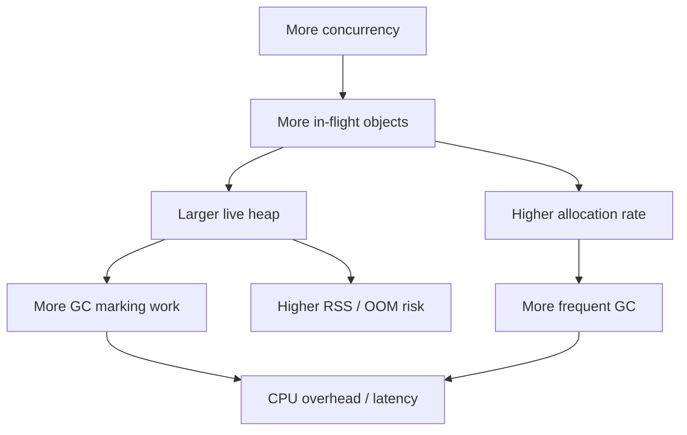

# learn-go-concurrency-parallelism-part-023.md

# Part 023 — Memory, Allocation, GC, and Concurrency Pressure

> Target pembaca: Java software engineer yang ingin memahami hubungan concurrency Go dengan memory allocation, goroutine stack, heap pressure, GC, object lifetime, buffer ownership, pooling, dan production memory incidents.
>
> Fokus part ini: goroutine memory cost, stack growth, heap allocation, escape analysis, GC pressure, allocation rate, channel buffering, worker queues, object pooling, `sync.Pool`, large buffers, memory leaks-by-retention, pprof heap, GC tuning, and Kubernetes memory limits.

---

## 0. Posisi Part Ini dalam Seri

Sebelumnya:

- Part 002: goroutine internals.
- Part 004: container CPU quota.
- Part 007: atomic operations.
- Part 012: ownership models.
- Part 013: worker pools.
- Part 015: backpressure.
- Part 017: concurrent data structures.
- Part 022: parallel CPU work.

Part ini membahas efek samping yang sering muncul setelah kita membuat sistem concurrent:

> Semakin banyak concurrency, semakin banyak object hidup bersamaan.

Concurrency bukan hanya CPU. Concurrency juga berarti:
- lebih banyak goroutine,
- lebih banyak stack,
- lebih banyak queued jobs,
- lebih banyak request body/response buffer,
- lebih banyak context/tree,
- lebih banyak timers,
- lebih banyak trace/log fields,
- lebih banyak in-flight DB/network objects,
- lebih banyak temporary allocations,
- lebih banyak retained memory,
- lebih banyak GC work.

Go garbage collector sangat kuat, tetapi bukan magic. Jika allocation rate tinggi atau object lifetime panjang karena queue/goroutine, latency dan memory bisa rusak.

---

## 1. Tujuan Pembelajaran

Setelah part ini, Anda harus mampu:

1. Menjelaskan hubungan concurrency dan memory pressure.
2. Membedakan:
   - stack memory,
   - heap memory,
   - live heap,
   - allocation rate,
   - retained memory,
   - RSS,
   - GC target heap.
3. Memahami escape analysis secara praktis.
4. Mengurangi allocation dalam hot path.
5. Mendesain buffer ownership agar tidak race/leak.
6. Menggunakan `sync.Pool` dengan benar dan tahu batasannya.
7. Menghindari memory leak-by-retention:
   - slice retaining large array,
   - goroutine blocked holding references,
   - queues retaining pointers,
   - maps/cache unbounded,
   - timers/tickers.
8. Mendesain queue capacity dari memory budget.
9. Membaca heap profile dan allocation profile.
10. Mengobservasi GC behavior di production.
11. Menghubungkan Go memory dengan Kubernetes memory limit.
12. Membuat checklist review memory-aware concurrency.

---

## 2. Mental Model: Concurrency Increases Live Set

GC cost terutama dipengaruhi oleh **live heap** dan **allocation rate**.



Important distinction:

- **Allocation rate**: berapa banyak memory dialokasikan per detik.
- **Live heap**: berapa banyak object masih reachable saat GC.
- **Retained memory**: memory yang tetap reachable karena referensi masih ada.
- **RSS**: memory yang dilihat OS/container; tidak selalu sama dengan live heap.

Concurrency sering memperbesar live heap karena object yang biasanya cepat selesai menjadi menunggu di queue atau blocked goroutine.

---

## 3. Java Translation: JVM GC vs Go GC

Java:
- heap besar,
- generational GC,
- object allocation cheap,
- thread stack fixed-ish / native,
- tuning banyak flag,
- framework object churn tinggi.

Go:
- goroutine stack kecil dan grow/shrink,
- GC concurrent, non-generational historically with evolving improvements,
- heap target controlled by `GOGC`/memory limit,
- escape analysis penting,
- fewer abstraction layers if code simple,
- allocation rate still matters,
- `sync.Pool` may help for temporary objects,
- explicit ownership often reduces churn.

Mindset Java engineer:
- Jangan menganggap “GC akan handle semua”.
- Jangan juga premature micro-optimize semua allocation.
- Measure with `benchmem`, pprof, runtime metrics.
- Reduce allocations in hot path and high-concurrency path first.

---

## 4. Goroutine Stack Memory

Goroutines start with small stacks and grow as needed.

Implications:
- goroutines are much cheaper than OS threads,
- but not free,
- millions of goroutines can still consume memory,
- deep recursion/large stack frames increase stack usage,
- blocked goroutines retain stack references.

Example leak:

```go
func handler(w http.ResponseWriter, r *http.Request) {
    big := make([]byte, 10<<20)

    go func() {
        <-neverClosed
        _ = big
    }()
}
```

The goroutine blocks forever and retains `big`.

Concurrency memory leak is often:
> goroutine blocked + reference retained.

---

## 5. Heap Allocation and Escape Analysis

A value can be allocated on stack or heap. It escapes to heap if compiler determines it must outlive stack frame or be referenced elsewhere.

Example:

```go
func NewUser(name string) *User {
    u := User{Name: name}
    return &u // escapes
}
```

This is okay.

But accidental escape in hot path matters:

```go
func Process(v int) any {
    return v // boxes into interface, may allocate depending context
}
```

Check escape analysis:

```bash
go build -gcflags="-m" ./...
```

Use for insight, not as final truth. Benchmark.

---

## 6. Allocation Rate

High allocation rate can cause frequent GC even if live heap small.

Example hot path:

```go
func Handle(req Request) Response {
    parts := strings.Split(req.Text, ",")
    // allocates slice and substrings behavior depends
    return build(parts)
}
```

Optimization options:
- avoid unnecessary conversions,
- preallocate slices,
- reuse buffers carefully,
- streaming parser,
- avoid reflection-heavy paths,
- reduce temporary objects,
- use `bytes.Buffer`/`strings.Builder`,
- use generated serializers if needed.

But optimize after profiling.

---

## 7. Live Heap and Queueing

Bounded queues are memory budgets.

If each job retains 100 KiB and queue capacity is 10,000:

```text
100 KiB × 10,000 = ~1 GiB
```

Queue capacity is not just latency policy; it is memory policy.

```go
jobs := make(chan Job, 10000)
```

If `Job` contains:
- request body,
- decoded payload,
- user context,
- trace fields,
- large buffers,

queue memory can be huge.

Better:
- queue lightweight references/IDs,
- store payload durably elsewhere,
- limit body size,
- process streaming,
- reduce queue capacity,
- reject earlier.

---

## 8. Channel Buffers and Memory

A buffered channel allocates storage for elements.

```go
ch := make(chan LargeStruct, 1000)
```

If `LargeStruct` is 1 KiB, channel ring alone holds about 1 MiB plus references/overhead.

Prefer channel of pointers?

```go
chan *LargeStruct
```

Trade-off:
- smaller channel slots,
- heap allocation,
- pointer chasing,
- GC must scan pointers,
- ownership mutation risk.

Value vs pointer depends on:
- size,
- mutability,
- copy cost,
- GC scan cost,
- ownership.

For small immutable structs, value channel is often fine.
For large buffers, pointer/ownership transfer can be better but needs lifecycle rules.

---

## 9. Context Retention

Context can carry values. Misuse can retain large objects.

Bad:

```go
ctx = context.WithValue(ctx, userKey, hugeUserProfile)
```

If ctx lives in goroutine/queue, huge profile retained.

Use context values for:
- request ID,
- trace/span,
- auth principal small reference,
- cancellation/deadline.

Avoid:
- large payload,
- optional business data,
- mutable objects,
- long-lived storage.

---

## 10. Timer and Ticker Retention

From Part 019:
- `time.After` in hot loops creates timers,
- ticker not stopped retains resources,
- `AfterFunc` callback can capture large objects.

Bad:

```go
func schedule(big []byte) {
    time.AfterFunc(time.Hour, func() {
        use(big)
    })
}
```

`big` retained until callback runs or timer stopped and callback unreachable.

Timers are memory/lifecycle objects.

---

## 11. Slice Retention

Common Go memory trap.

```go
func FirstKB(data []byte) []byte {
    return data[:1024]
}
```

If `data` is 100 MiB, returned 1 KiB slice retains entire 100 MiB backing array.

Fix:

```go
func FirstKBCopy(data []byte) []byte {
    out := make([]byte, 1024)
    copy(out, data[:1024])
    return out
}
```

In concurrent systems:
- small slice sent through channel may retain huge buffer,
- cache stores small subslice retaining large response,
- goroutine closure captures large slice.

---

## 12. Map/Cache Retention

Unbounded maps are memory leaks by design.

```go
var cache = map[string]Value{}
```

If keys grow forever:
- live heap grows forever,
- GC cost grows,
- OOM eventually.

Cache needs:
- max size,
- TTL,
- eviction,
- admission,
- metrics,
- value ownership,
- cleanup.

Concurrent map needs lifecycle policy, not only synchronization.

---

## 13. Queue Retention and Zeroing

Slice queue pop can retain references.

Bad:

```go
v := q.items[0]
q.items = q.items[1:]
return v
```

Old backing array still references popped item until overwritten/collected.

Better:

```go
v := q.items[0]
var zero T
q.items[0] = zero
q.items = q.items[1:]
return v
```

Ring buffer overwrite should also zero pointer slots when removing.

---

## 14. sync.Pool Mental Model

`sync.Pool` is a pool of temporary objects that may be reused.

Use cases:
- temporary buffers,
- encoders/decoders,
- scratch objects,
- high allocation hot path.

Important:
- items may be dropped at any GC,
- no guarantee object remains,
- not for resource lifecycle,
- not for connection pooling,
- object must not be used after Put,
- object must be reset before reuse,
- pointer values usually used.

Example:

```go
var bufPool = sync.Pool{
    New: func() any {
        b := make([]byte, 0, 32*1024)
        return &b
    },
}

func UseBuffer() {
    bp := bufPool.Get().(*[]byte)
    b := (*bp)[:0]

    // use b
    b = append(b, "hello"...)

    *bp = b[:0]
    bufPool.Put(bp)
}
```

### 14.1 Ownership Rule

After `Put`, caller must not use object.

Bad:

```go
bufPool.Put(bp)
fmt.Println((*bp)[:10]) // use after put
```

Another goroutine may get and mutate it.

---

## 15. sync.Pool and Large Buffers

Pooling huge buffers can retain memory.

If pool stores 10 MiB buffers, RSS may stay high.

Policy:
- cap buffer size before Put,
- discard too-large buffers,
- reset length,
- maybe shrink capacity.

```go
const maxPoolCap = 64 << 10

func putBuffer(b []byte) {
    if cap(b) > maxPoolCap {
        return
    }

    b = b[:0]
    bufPool.Put(&b)
}
```

But storing pointer to slice variable has pitfalls if not allocated safely. A common pattern is pooling `*bytes.Buffer` or custom struct.

```go
var bufferPool = sync.Pool{
    New: func() any {
        return new(bytes.Buffer)
    },
}

func getBuffer() *bytes.Buffer {
    b := bufferPool.Get().(*bytes.Buffer)
    b.Reset()
    return b
}

func putBuffer(b *bytes.Buffer) {
    if b.Cap() > 64<<10 {
        return
    }
    b.Reset()
    bufferPool.Put(b)
}
```

---

## 16. sync.Pool and GC

`sync.Pool` is cleared opportunistically by GC cycles. It is not a stable cache.

Use for:
- reducing allocation churn.

Do not use for:
- caching business values,
- limiting memory,
- storing scarce resources,
- persistent object reuse guarantee.

If your code relies on object staying in pool, design is wrong.

---

## 17. Buffer Ownership in Pipelines

If buffer sent to another goroutine, ownership transfers.

Bad:

```go
buf := getBuffer()
out <- buf
putBuffer(buf) // receiver may still use
```

Correct:
- receiver returns buffer when done,
- or copy before send,
- or immutable byte slice not reused.

Example ownership protocol:

```go
type Buffer struct {
    B []byte
}

func producer(out chan<- *Buffer) {
    b := getBuffer()
    fill(b)

    out <- b // ownership transferred
}

func consumer(in <-chan *Buffer) {
    for b := range in {
        process(b)
        putBuffer(b) // receiver returns
    }
}
```

On cancellation, ensure buffer returned exactly once.

---

## 18. Object Lifetime and Goroutine Closure

Loop variable capture mostly improved in modern Go for range variables, but closure retention still matters.

```go
func process(big []byte) {
    go func() {
        log.Println(len(big))
    }()
}
```

The goroutine retains `big` until it runs and exits.

If goroutine blocks, `big` retained.

Avoid:
- capturing large request object in background goroutine,
- passing full context/payload when only ID needed.

Better:

```go
id := req.ID
go func() {
    processID(id)
}()
```

---

## 19. Request Body Memory

Bad:

```go
body, err := io.ReadAll(r.Body)
```

without limit. A client can send huge body.

Better:

```go
r.Body = http.MaxBytesReader(w, r.Body, maxBody)
body, err := io.ReadAll(r.Body)
```

For large body:
- stream,
- process chunks,
- avoid full buffering,
- apply backpressure.

Concurrency multiplier:
```text
max_body_size × concurrent_requests
```

If max body 10 MiB and 500 concurrent:
```text
potential 5 GiB body memory if buffered
```

---

## 20. Response Buffering

Building huge response in memory:

```go
var buf bytes.Buffer
json.NewEncoder(&buf).Encode(data)
w.Write(buf.Bytes())
```

For huge data:
- stream JSON,
- paginate,
- chunk,
- compress carefully,
- avoid holding full result.

Streaming has backpressure/slow client implications from Part 020.

---

## 21. Compression and Memory

Compression libraries may allocate buffers and dictionaries.

Concurrency issues:
- one compressor per request can consume memory,
- pooling compressors requires Reset and ownership,
- high compression level can be CPU-heavy,
- response compression for huge concurrency can dominate CPU/memory.

Use:
- bounded concurrency for heavy compression,
- pool writer objects carefully,
- limit response sizes,
- benchmark.

---

## 22. Large Object and GC Scan Cost

Objects containing many pointers increase GC scan work.

A `[]byte` large buffer has no pointers inside, so scan cost lower than `[]*Object`.

Pointer-heavy structures:
- maps,
- slices of pointers,
- linked lists,
- trees,
- interface-heavy object graphs.

Concurrency often creates many pointer-heavy request structs. Reducing pointer churn can help.

---

## 23. Struct Layout and Pointer Avoidance

For hot data:
- prefer compact structs,
- avoid unnecessary pointers,
- store values in slices,
- separate pointer-free data if huge,
- avoid interface fields if not needed.

But do not sacrifice clarity until profiling indicates memory/GC issue.

---

## 24. Memory and Worker Pool Sizing

Worker count should consider memory per worker.

If each worker uses:
- 8 MiB buffer,
- 100 workers,
- 800 MiB potential.

Use memory semaphore:

```go
memSem := NewWeightedSemaphore(maxBytes)

cost := estimateJobMemory(job)

if err := memSem.Acquire(ctx, cost); err != nil {
    return err
}
defer memSem.Release(cost)

return process(job)
```

Concurrency can be bounded by memory, not just CPU/IO.

---

## 25. Queue Capacity from Memory Budget

Formula:

```text
queue_capacity <= memory_budget_for_queue / average_job_memory
```

If:
- queue memory budget = 256 MiB,
- average job = 64 KiB,

capacity:
```text
256 MiB / 64 KiB = 4096 jobs
```

But use p95/p99 job size, not average if heavy-tailed.

Better:
- queue small metadata,
- store payload elsewhere,
- reject huge jobs,
- chunk.

---

## 26. GC Tuning: GOGC and Memory Limit

Go GC target roughly grows heap based on `GOGC`.

Concept:
- lower GOGC = more frequent GC, lower memory, more CPU.
- higher GOGC = less frequent GC, higher memory, less GC CPU.

Modern Go also supports memory limit via runtime/debug and `GOMEMLIMIT` environment variable.

Use cases:
- containers with memory limit,
- prevent Go heap from growing too close to cgroup limit,
- trade CPU for lower memory.

Caution:
- setting memory limit too low can cause excessive GC CPU.
- memory outside Go heap also matters:
  - stacks,
  - mmap,
  - C memory,
  - kernel buffers,
  - runtime overhead.

---

## 27. Kubernetes Memory Reality

Container memory limit includes more than Go live heap:
- heap,
- stacks,
- runtime metadata,
- goroutine stacks,
- OS thread stacks,
- mmap,
- network buffers,
- file cache depending cgroup,
- C allocations,
- profiler overhead,
- TLS buffers.

If Kubernetes limit = 512 MiB, do not set Go memory limit = 512 MiB. Leave headroom.

Memory incident pattern:
- queue grows,
- heap grows,
- GC works harder,
- latency rises,
- request timeout,
- retries,
- memory grows more,
- OOMKill.

Backpressure should trigger before memory reaches limit.

---

## 28. Memory Profiling

Heap profile:

```bash
go test -run=NONE -bench=BenchmarkX -benchmem -memprofile mem.out
go tool pprof mem.out
```

For server:
- expose pprof carefully in internal/debug environment.
- capture heap during incident.
- compare before/after.

pprof views:
- `alloc_space`: cumulative allocations.
- `inuse_space`: currently live allocations.

Use:
- `alloc_space` to reduce churn.
- `inuse_space` to find retention/leaks.

---

## 29. CPU Profile and GC

If CPU profile shows:
- `runtime.mallocgc`,
- `runtime.gcBgMarkWorker`,
- `runtime.scanobject`,
- `runtime.memmove`,

then memory/allocation may dominate.

Allocation optimization can improve CPU and latency.

---

## 30. runtime/metrics and MemStats

Runtime metrics can expose:
- heap live,
- heap goal,
- GC cycles,
- allocation bytes,
- goroutine count,
- scheduler metrics,
- memory classes.

`runtime.ReadMemStats` is older but useful.

Key signals:
- allocation rate,
- heap live,
- heap goal,
- GC CPU fraction,
- pause time,
- goroutine count,
- stack in use.

---

## 31. Memory Leak vs High Water Mark

Sometimes memory does not return immediately to OS after load drops.
This can be:
- heap idle retained by runtime,
- fragmentation,
- pools,
- caches,
- live references,
- OS behavior.

Differentiate:
- live heap stable?
- inuse heap growing?
- RSS growing?
- heap profile points to retained objects?
- cache size bounded?
- goroutine count growing?

Do not assume RSS high means leak, but investigate.

---

## 32. Memory Leak-by-Goroutine

Blocked goroutines retain stack and references.

Symptoms:
- goroutine count grows,
- heap retains request objects,
- goroutine dump shows blocked send/receive/select.

Example:

```go
func handler(w http.ResponseWriter, r *http.Request) {
    resultCh := make(chan Result)

    go func() {
        resultCh <- slowWork(r.Context()) // blocks if handler returns early
    }()

    select {
    case res := <-resultCh:
        write(res)
    case <-r.Context().Done():
        return
    }
}
```

If context done, worker goroutine may later block sending to unbuffered channel.

Fix:
- buffered result channel size 1,
- send select with ctx,
- structured concurrency,
- avoid orphan goroutine.

---

## 33. Memory Leak-by-Channel Send

```go
out <- item
```

If receiver exits, sender blocks and retains item.

Fix:

```go
select {
case out <- item:
case <-ctx.Done():
    return
}
```

Especially important if item holds large memory.

---

## 34. Memory Leak-by-Cache

Cache with TTL but no active/lazy cleanup may retain.
Cache with active cleanup but no max size can still grow until TTL.
Cache with huge TTL can be unbounded.

Metrics:
- entry count,
- estimated bytes,
- evictions,
- expired,
- max size,
- key cardinality.

---

## 35. Case Study 1: Worker Queue OOM

Symptoms:
- memory grows with traffic spike,
- queue depth high,
- GC CPU high,
- pod OOMKilled.

Root:
```go
jobs := make(chan Job, 100000)
```

Each Job contains 50 KiB payload.

Worst-case:
```text
~5 GiB
```

Fix:
- reduce capacity,
- store payload externally,
- reject/429 when queue full,
- job expiration,
- memory-based admission,
- metrics.

---

## 36. Case Study 2: `sync.Pool` Retains Huge Buffers

Symptoms:
- RSS high after large requests,
- heap profile shows buffers.

Root:
- pool accepts 10 MiB buffers.

Fix:
- cap buffer capacity before Put,
- separate pools by size,
- do not pool rare huge buffers,
- stream large payload.

---

## 37. Case Study 3: Subslice Retains File

Root:

```go
data, _ := os.ReadFile(path)
header := data[:100]
cache.Set(key, header)
```

Cache stores 100-byte slice retaining whole file.

Fix:
```go
header := append([]byte(nil), data[:100]...)
```

---

## 38. Case Study 4: Context Value Retains Request

Root:
```go
ctx = context.WithValue(ctx, key, request)
```

Background goroutine stores ctx; full request retained.

Fix:
- store request ID only,
- pass business data explicitly,
- avoid long-lived request context.

---

## 39. Anti-Pattern Catalog

### 39.1 Huge Buffered Channels

Memory time bomb.

### 39.2 Unbounded Map/Cache

Leak by design.

### 39.3 `io.ReadAll` Without Limit

Body memory explosion.

### 39.4 Goroutine Captures Large Object and Blocks

Retention leak.

### 39.5 Sending Large Object Without Cancellation-Aware Select

Blocked sender retains memory.

### 39.6 Returning Small Subslice of Huge Buffer

Backing array retained.

### 39.7 `sync.Pool` as Cache

Wrong semantics.

### 39.8 Put Object to Pool Then Use It

Data race/corruption.

### 39.9 Pooling Huge Rare Objects

RSS bloat.

### 39.10 Defers in Long Hot Loop

May retain resources until function returns.

### 39.11 Pointer-Heavy Data in Hot Path Without Need

GC scan cost.

### 39.12 Ignoring `benchmem`

Optimizing CPU while allocation dominates.

---

## 40. Design Review Checklist

For memory-aware concurrency:

1. What is max concurrency?
2. What memory does each in-flight unit retain?
3. What is max queue capacity?
4. What is worst-case queue memory?
5. Are request bodies size-limited?
6. Are large responses streamed/paginated?
7. Are goroutines bounded?
8. Can goroutines block while retaining large objects?
9. Are channel sends cancellation-aware?
10. Are buffered channel capacities justified by memory budget?
11. Are maps/caches bounded?
12. Are TTL/eviction policies present?
13. Are popped queue elements zeroed?
14. Are subslices copied when retaining small part of large buffer?
15. Are context values small?
16. Are timers/tickers stopped?
17. Is `time.After` avoided in hot loops?
18. Are object pools used only for temporary objects?
19. Are pooled objects reset?
20. Are huge buffers discarded instead of pooled?
21. Is object used after `Put` impossible?
22. Are per-worker buffers safe and not shared?
23. Are allocations measured with `benchmem`?
24. Is heap profile available?
25. Are `alloc_space` and `inuse_space` both inspected?
26. Is GC CPU/heap goal monitored?
27. Is Kubernetes memory headroom considered?
28. Is `GOMEMLIMIT` configured appropriately?
29. Are memory-based overload signals present?
30. Is backpressure triggered before OOM?

---

## 41. Mini Lab 1: Queue Memory Budget

Create Job with configurable payload size.
Test queue capacity:
- 100,
- 1000,
- 10000.

Measure memory with `runtime.ReadMemStats`.
Calculate expected vs observed.

---

## 42. Mini Lab 2: Subslice Retention

Read/create large byte slice.
Store small subslice in global/cache.
Run GC and inspect memory.
Then copy small slice and compare.

---

## 43. Mini Lab 3: sync.Pool Buffer

Benchmark:
- allocate new bytes.Buffer,
- use sync.Pool,
- use pool with max cap discard.

Measure:
- allocations/op,
- bytes/op,
- RSS-ish behavior under large occasional buffer.

---

## 44. Mini Lab 4: Goroutine Retention Leak

Create goroutines blocked on channel capturing large object.
Observe:
- goroutine count,
- heap inuse.

Fix with:
- cancellation,
- buffered result channel,
- no large capture.

---

## 45. Mini Lab 5: CPU Work Allocation

Take CPU-heavy function.
Benchmark with `-benchmem`.
Optimize:
- preallocate,
- per-worker scratch,
- avoid interface conversion,
- reduce string/[]byte conversions.

Compare CPU profile before/after.

---

## 46. Mini Lab 6: Memory-Based Admission

Implement worker pool admission that rejects job if estimated queued bytes exceed budget.

Track:
- queued bytes,
- accepted,
- rejected,
- completed.

Test concurrent submit and release.

---

## 47. Top 1% Heuristics

1. Concurrency multiplies memory.
2. Queue capacity is memory policy.
3. Live heap matters more than allocation count alone.
4. Allocation rate drives GC frequency.
5. Blocked goroutines retain references.
6. Small slices can retain huge arrays.
7. `sync.Pool` reduces churn; it is not a cache.
8. Pooling huge buffers can hurt RSS.
9. Body size × concurrent requests is a real capacity number.
10. Pointers increase GC scan work.
11. Object ownership is memory management.
12. Backpressure should trigger before OOM.
13. Heap profile `inuse_space` finds retention; `alloc_space` finds churn.
14. Kubernetes memory limit needs headroom beyond Go heap.
15. The cheapest allocation is the one you do not do in the hot path.

---

## 48. Source Notes

Primary Go concepts behind this part:

1. Go runtime:
   - goroutine stacks,
   - heap allocation,
   - garbage collection,
   - runtime memory metrics.

2. Go compiler:
   - escape analysis,
   - stack vs heap allocation.

3. Go profiling:
   - benchmark `-benchmem`,
   - heap profiles,
   - allocation profiles,
   - CPU profiles,
   - runtime metrics.

4. Go concurrency:
   - channels,
   - goroutine retention,
   - worker queues,
   - context,
   - timers.

5. Reliability engineering:
   - memory budgets,
   - backpressure,
   - bounded queues,
   - overload protection,
   - Kubernetes memory limits.

---

## 49. Summary

Memory is one of the hidden costs of concurrency.

Goroutines are cheap, but:
- blocked goroutines retain references,
- queues retain jobs,
- timers retain callbacks,
- caches retain values,
- buffers retain arrays,
- contexts retain values,
- in-flight requests retain everything they touch.

The core rule:

> Every concurrent unit has a memory footprint. Multiply it by maximum in-flight count.

Production-grade Go concurrency requires:
- bounded queues,
- body limits,
- clear ownership,
- cancellation-aware sends,
- bounded caches,
- careful buffer reuse,
- profiling,
- GC observability,
- memory-aware backpressure.

---

## 50. Status Seri

Selesai:
- Part 000 — Orientation
- Part 001 — Foundations
- Part 002 — Goroutine Internals
- Part 003 — Go Scheduler Deep Dive
- Part 004 — GOMAXPROCS, CPU Quotas, Containers
- Part 005 — Go Memory Model
- Part 006 — Synchronization Primitives
- Part 007 — Atomic Operations
- Part 008 — Channels Deep Dive
- Part 009 — Select Semantics
- Part 010 — WaitGroup, ErrGroup, Task Groups, and Structured Concurrency
- Part 011 — Context as Concurrency Contract
- Part 012 — Ownership Models
- Part 013 — Worker Pools
- Part 014 — Fan-Out/Fan-In, Pipelines, Stages, and Stream Processing
- Part 015 — Backpressure End-to-End
- Part 016 — Semaphores, Rate Limiters, Token Buckets, and Bulkheads
- Part 017 — Concurrent Data Structures
- Part 018 — Singleflight, Deduplication, Idempotency, and Stampede Prevention
- Part 019 — Timers, Tickers, Deadlines, Scheduling, and Time-Based Concurrency
- Part 020 — Network Concurrency
- Part 021 — Database Concurrency
- Part 022 — Parallel CPU Work
- Part 023 — Memory, Allocation, GC, and Concurrency Pressure

Belum selesai:
- Part 024 sampai Part 034.

Seri belum mencapai bagian terakhir.

<!-- NAVIGATION_FOOTER -->
<div class="page-nav">
<a href="./learn-go-concurrency-parallelism-part-022.md">⬅️ Part 022 — Parallel CPU Work: Partitioning, Reduction, Cache Locality, and Runtime-Aware Parallelism</a>
<a href="./index.md">📚 Kategori</a>
<a href="../../index.md">🏠 Home</a>
<a href="./learn-go-concurrency-parallelism-part-024.md">Part 024 — Race Detection, Static Analysis, and Concurrency Bug Hunting ➡️</a>
</div>
