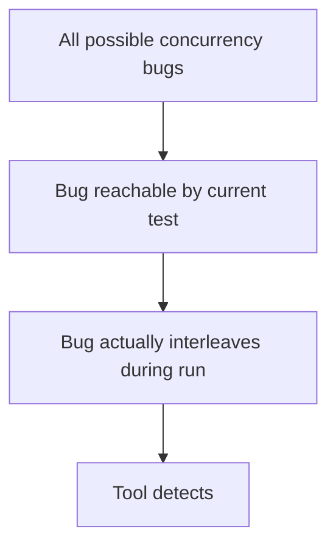

# learn-go-concurrency-parallelism-part-024.md

# Part 024 — Race Detection, Static Analysis, and Concurrency Bug Hunting

> Target pembaca: Java software engineer yang ingin mampu menemukan bug concurrency Go sebelum menjadi incident: data race, goroutine leak, blocked channel, deadlock, timer leak, unsafe publication, shared mutable state, lock misuse, context misuse, and production diagnostics.
>
> Fokus part ini: Go race detector, `go test -race`, `go vet`, static analysis, code review heuristics, pprof goroutine/block/mutex profiles, runtime trace, logging/metrics signals, reproducibility, stress testing, and incident-oriented debugging.

---

## 0. Posisi Part Ini dalam Seri

Sebelumnya:

- Part 005: Go Memory Model.
- Part 006: synchronization primitives.
- Part 008–009: channel/select.
- Part 011: context.
- Part 012: ownership models.
- Part 017: concurrent data structures.
- Part 019: timers/tickers.
- Part 023: memory pressure.

Part ini menjawab pertanyaan praktis:

> Bagaimana saya tahu code concurrent saya benar?

Jawaban singkat:
- Tidak cukup dengan “kelihatannya aman”.
- Tidak cukup dengan unit test biasa.
- Tidak cukup dengan race detector saja.
- Tidak cukup dengan static analysis saja.
- Tidak cukup dengan observability production saja.

Concurrency correctness membutuhkan kombinasi:

1. Mental model.
2. Ownership design.
3. Code review.
4. Race detector.
5. Static analysis.
6. Stress testing.
7. Deterministic tests where possible.
8. Runtime diagnostics.
9. Production metrics.
10. Incident playbook.

---

## 1. Tujuan Pembelajaran

Setelah part ini, Anda harus mampu:

1. Menjelaskan apa yang bisa dan tidak bisa ditemukan race detector.
2. Menjalankan:
   - `go test -race ./...`
   - targeted race tests,
   - stress loop.
3. Menginterpretasikan race detector report.
4. Menggunakan `go vet` untuk menemukan bug umum.
5. Memahami peran staticcheck/golangci-lint secara praktis.
6. Membedakan:
   - data race,
   - logical race,
   - deadlock,
   - goroutine leak,
   - starvation,
   - livelock,
   - unsafe publication.
7. Menggunakan goroutine dump untuk mencari blocked goroutine.
8. Menggunakan block profile dan mutex profile.
9. Menggunakan runtime trace untuk scheduling/blocking investigation.
10. Mendesain tests untuk:
    - cancellation,
    - timeout,
    - channel close,
    - concurrent submit/stop,
    - queue full,
    - race-prone map/slice access.
11. Membuat concurrency bug review checklist.
12. Membuat incident playbook untuk production concurrency issue.

---

## 2. Mental Model: Tools Find Executed Bugs, Not All Bugs

Race detector hanya bisa menemukan race yang benar-benar terjadi saat test/program berjalan.



Karena itu:

- Race detector sangat powerful.
- Tetapi coverage test penting.
- Stress/repetition meningkatkan peluang interleaving.
- Banyak logical races bukan data races.
- Deadlock/goroutine leak sering butuh test/diagnostic berbeda.

Tools memperkuat desain; tools tidak menggantikan desain.

---

## 3. Bug Taxonomy

| Bug type | Example | Detected by race detector? |
|---|---|---|
| data race | unsynchronized read/write shared var | often yes if executed |
| logical race | wrong order despite synchronization | no |
| deadlock | goroutines wait forever | no, unless test times out |
| goroutine leak | blocked goroutine after request | no |
| channel send on closed | panic at runtime | maybe if path executed |
| missed cancellation | slow shutdown/leak | no |
| unsafe publication | pointer visible before sync | maybe as data race |
| atomic invariant bug | multiple atomics inconsistent | no |
| lock-order deadlock | cyclic locks | no |
| timer/ticker leak | resources retained | no |
| memory retention | blocked goroutine holds object | no |
| starvation | one worker/tenant never progresses | no |
| backpressure missing | queue grows/OOM | no |

This is why top engineers combine static/dynamic/observability techniques.

---

## 4. Data Race vs Logical Race

### 4.1 Data Race

Two goroutines access same memory concurrently, at least one write, without synchronization.

```go
var n int

go func() {
    n++
}()

go func() {
    fmt.Println(n)
}()
```

Race detector can catch this if interleaving happens.

### 4.2 Logical Race

No data race, but result depends on timing.

```go
if cache.Exists(key) {
    return cache.Get(key)
}
```

Between Exists and Get another goroutine deletes key. If each method locks internally, no data race, but logic may be wrong.

Fix:
- combine operation under one lock,
- return `(value, ok)`,
- use transaction/invariant method.

Race detector will not catch this.

---

## 5. Running Race Detector

Command:

```bash
go test -race ./...
```

Targeted:

```bash
go test -race ./internal/cache -run TestCacheConcurrent
```

With count:

```bash
go test -race ./... -count=10
```

With specific stress:

```bash
go test -race ./internal/pool -run TestStopWhileSubmit -count=100
```

For binaries:

```bash
go run -race ./cmd/server
```

Build:

```bash
go build -race ./cmd/server
```

Caution:
- race builds are slower,
- use more memory,
- not usually used for normal production,
- useful in staging/load tests if feasible.

---

## 6. Interpreting Race Detector Output

Typical report includes:
- conflicting read/write,
- stack trace for read,
- stack trace for write,
- goroutine creation stack.

Example conceptual:

```text
WARNING: DATA RACE
Read at 0x00c000...
  mypkg.(*Cache).Get()
      cache.go:42

Previous write at 0x00c000...
  mypkg.(*Cache).Set()
      cache.go:55

Goroutine 10 created at:
  mypkg.TestCache()
      cache_test.go:20
```

Interpretation flow:

1. Identify shared variable/address.
2. Identify read stack.
3. Identify write stack.
4. Find missing synchronization.
5. Ask ownership question:
   - who owns this state?
   - should it be immutable?
   - should it be protected by lock?
   - should it be copied?
   - should it be channel-owned?
6. Fix design, not only add random mutex.

---

## 7. Common Race Patterns

### 7.1 Map Access

```go
m[key] = value
_ = m[key]
```

Fix:
- mutex,
- sync.Map if appropriate,
- sharded map,
- actor owner,
- immutable snapshot.

### 7.2 Slice Append

```go
results = append(results, result)
```

from multiple goroutines.

Fix:
- preallocate by index,
- channel collector,
- mutex.

### 7.3 Shared Error Variable

```go
var err error

wg.Go(func() {
    err = doA()
})

wg.Go(func() {
    err = doB()
})
```

Fix:
- errgroup,
- channel,
- local errors + merge,
- mutex/once.

### 7.4 Loop/Closure Shared State

Modern Go improves range variable capture, but shared mutable captured objects still race.

```go
var total int
for _, item := range items {
    item := item
    wg.Go(func() {
        total += item.Value
    })
}
```

Fix:
- atomic/local reduction/mutex/channel.

### 7.5 Reusing Buffer After Send

```go
out <- buf
buf[0] = 1
```

Fix:
- copy,
- ownership transfer,
- return-to-pool protocol.

### 7.6 Context/Request Object in Background Goroutine

Not always race, but can be lifecycle/retention bug.

---

## 8. Race Detector Limitations

Race detector cannot detect:
- code paths not executed,
- races in some unsafe/C code depending situation,
- logical races,
- deadlocks,
- missing cancellation,
- goroutine leaks,
- wrong use of atomics for invariants,
- distributed races,
- DB transaction anomalies.

Also:
- tests must run enough interleavings,
- timing-sensitive bug may be rare,
- race detector overhead changes timing,
- “no race found” is not proof of correctness.

Use it as mandatory baseline, not final guarantee.

---

## 9. `go vet`

Run:

```bash
go vet ./...
```

`go vet` catches suspicious constructs.

Concurrency-relevant examples:
- copying locks by value,
- misuse of `WaitGroup`,
- unreachable/copy issues,
- printf/log formatting that hides debug info,
- lost cancel in some cases via analyzers,
- struct tags and other correctness issues.

Example: copying a struct containing mutex.

```go
type SafeCounter struct {
    mu sync.Mutex
    n  int
}

func Bad(c SafeCounter) {
    // copies mutex
}
```

Fix:
- pass pointer,
- do not copy after first use.

---

## 10. Staticcheck and golangci-lint

Common useful checks:
- ignored cancel function,
- ineffective assignments,
- unreachable code,
- loop issues,
- copying locks,
- deprecated APIs,
- unused results,
- possible nil deref,
- context misuse patterns.

Static analysis is not perfect, but it catches many bugs cheaply.

Recommended CI baseline:
```text
go test ./...
go test -race ./...
go vet ./...
staticcheck ./...
```

For large repos:
- race tests may be nightly if too slow,
- targeted race tests on critical packages per PR,
- full race in CI scheduled.

---

## 11. Copying Locks

Bad:

```go
type Cache struct {
    mu sync.Mutex
    m  map[string]string
}

func (c Cache) Get(key string) string {
    c.mu.Lock()
    defer c.mu.Unlock()
    return c.m[key]
}
```

Value receiver copies mutex. Use pointer receiver.

```go
func (c *Cache) Get(key string) string {
    c.mu.Lock()
    defer c.mu.Unlock()
    return c.m[key]
}
```

Rule:
- types containing mutex/cond/once/waitgroup/atomic should generally not be copied after first use.
- use pointer receivers.
- avoid returning by value.

---

## 12. WaitGroup Misuse

Classic bugs:

### 12.1 Add Inside Goroutine

Bad:

```go
for _, item := range items {
    go func() {
        wg.Add(1)
        defer wg.Done()
        process(item)
    }()
}
wg.Wait()
```

Wait may happen before Add.

Good:

```go
for _, item := range items {
    wg.Add(1)
    go func(item Item) {
        defer wg.Done()
        process(item)
    }(item)
}
wg.Wait()
```

Or with modern helper style:

```go
for _, item := range items {
    item := item
    wg.Go(func() {
        process(item)
    })
}
wg.Wait()
```

### 12.2 Done Not Called on Panic/Error Path

Use defer:

```go
wg.Add(1)
go func() {
    defer wg.Done()
    process()
}()
```

### 12.3 Reusing WaitGroup Before Previous Wait Complete

Avoid complex reuse. Prefer scoped WaitGroup per operation.

---

## 13. Channel Close Misuse

### 13.1 Receiver Closes Channel It Does Not Own

Bad:

```go
func consumer(ch chan Job) {
    close(ch)
}
```

Close belongs to sender/owner that knows no more sends will occur.

### 13.2 Multiple Senders Close Same Channel

Panic risk.

Use:
- coordinator,
- WaitGroup then close,
- context for cancellation,
- separate done channel,
- single owner.

### 13.3 Send on Closed Channel

Panic.

Usually caused by:
- stop races,
- close jobs while submitters active,
- multiple owners.

Design serialized admission/close.

---

## 14. Goroutine Leak Detection

A goroutine leak means goroutine remains alive longer than intended.

Common states:
- blocked on channel send,
- blocked on channel receive,
- blocked on mutex,
- blocked on select with no cancellation,
- blocked on network/DB call without deadline,
- ticker loop without ctx,
- background goroutine without stop.

### 14.1 Test Leak with Done Channel

```go
func TestWorkerStops(t *testing.T) {
    ctx, cancel := context.WithCancel(context.Background())

    done := make(chan struct{})
    go func() {
        defer close(done)
        worker(ctx)
    }()

    cancel()

    select {
    case <-done:
    case <-time.After(time.Second):
        t.Fatal("worker did not stop")
    }
}
```

### 14.2 Count Goroutines Carefully

`runtime.NumGoroutine()` can be noisy.

Use:
- before/after with tolerance,
- package leaktest if available,
- explicit done channels better.

---

## 15. Goroutine Dump

In production/staging, goroutine dump shows stack states.

Look for:
- many goroutines stuck at same channel send,
- `sync.(*Mutex).Lock`,
- `database/sql` waiting,
- `net/http` read/write,
- `time.Sleep`,
- select waiting on never-closed channel.

Example conceptual stack:
```text
goroutine 12345 [chan send]:
mypkg.(*Pool).Submit(...)
```

Interpretation:
- submitters blocked because queue full and no cancellation or slow workers.

Another:
```text
goroutine 678 [sync.Mutex.Lock]:
mypkg.(*Cache).Get(...)
```

Interpretation:
- lock contention or deadlock.

---

## 16. Block Profile

Block profile records blocking on synchronization primitives.

Enable:

```go
runtime.SetBlockProfileRate(1)
```

For server, expose pprof. Then inspect block profile.

Use to find:
- channel send/receive blocking,
- select blocking,
- mutex/RWMutex wait,
- cond wait.

Caution:
- profiling overhead if rate high.
- enable carefully in production or sample.

---

## 17. Mutex Profile

Mutex profile records time goroutines spend waiting on contended mutexes.

Enable:

```go
runtime.SetMutexProfileFraction(1)
```

Use to find:
- hot locks,
- coarse lock bottleneck,
- lock held during slow work,
- global cache contention,
- logger/metrics lock contention.

Interpretation:
- high wait does not always mean bug.
- correlate with latency and throughput.
- fix by reducing critical section, sharding, immutable snapshot, or avoiding shared state.

---

## 18. Runtime Trace

Runtime trace helps diagnose:
- goroutine scheduling,
- blocking,
- syscalls,
- network blocking,
- GC,
- timers,
- heap events,
- processor utilization.

For tests:

```bash
go test -run TestX -trace trace.out
go tool trace trace.out
```

Use trace when:
- pprof not enough,
- scheduling delay suspected,
- worker pipeline stalls,
- timer behavior suspicious,
- GC/scheduler interaction matters.

---

## 19. Deadlock Hunting

Go runtime detects if all goroutines are asleep and no progress possible in simple programs:

```text
fatal error: all goroutines are asleep - deadlock!
```

But servers often have network goroutines/timers, so full deadlock may not trigger.

Deadlock patterns:
- lock order inversion,
- send while holding lock,
- callback under lock calls back,
- waiting for goroutine that waits for you,
- closing/waiting cycle,
- transaction/lock cycles in DB.

### 19.1 Lock Order

Define order:
```text
tenant lock -> account lock -> item lock
```

Never reverse.

### 19.2 No Blocking External Calls Under Lock

Bad:

```go
mu.Lock()
defer mu.Unlock()

resp, err := httpClient.Do(req)
```

This can freeze all users of lock.

---

## 20. Logical Race Hunting

Example:

```go
if !cache.Exists(key) {
    cache.Set(key, load())
}
```

Two goroutines can load and set.

No data race if methods lock, but duplicate work.

Fix:
- `LoadOrStore`,
- singleflight,
- lock around compound operation,
- transaction/unique constraint.

Logical races require code review and invariants, not race detector.

---

## 21. Atomic Misuse Hunting

Smell:
- multiple atomic fields representing one state.
- Load then Store without CAS.
- atomic pointer to mutable object.
- spin loop without backoff.
- atomic used to avoid understanding lock.

Bad:

```go
if state.Load() == Open {
    state.Store(HalfOpen)
    probe()
}
```

Multiple goroutines can probe.

Use CAS:

```go
if state.CompareAndSwap(Open, HalfOpen) {
    probe()
}
```

But if state has side effects/invariants, mutex may be clearer.

---

## 22. Context Misuse Hunting

Smells:
- `context.Background()` inside request path.
- storing context in struct.
- not calling cancel.
- `defer cancel()` in long loop.
- using request context for background job after response.
- ignoring ctx in DB/HTTP calls.
- large values in context.
- cleanup with already cancelled ctx.

Review question:
> What owns this work lifecycle?

---

## 23. Timer/Ticker Misuse Hunting

Smells:
- `time.After` inside hot loop.
- `time.NewTicker` without Stop.
- `AfterFunc` captures large object.
- timer reset from multiple goroutines.
- periodic job overlaps unintentionally.
- retry sleep without context.
- fixed retry without jitter.

---

## 24. Channel Misuse Hunting

Smells:
- unbuffered result channel with possible early return.
- output channel not closed.
- close from receiver.
- send without select on ctx in long-lived pipeline.
- buffered channel with huge capacity.
- nil channel state machine not documented.
- default case causing busy loop.
- channel used where mutex simpler.

---

## 25. Lock Misuse Hunting

Smells:
- exported mutable fields plus mutex.
- returning internal pointer/slice/map.
- lock held during callback.
- lock held during IO.
- inconsistent lock ordering.
- RWMutex used by default without measurement.
- copying struct with mutex.
- defer unlock in extremely hot tiny function? Usually okay; optimize only after profiling.
- panic path leaves lock? use defer.

---

## 26. Stress Testing

Run tests repeatedly:

```bash
go test ./internal/pool -run TestStopWhileSubmit -count=1000
```

With race:

```bash
go test -race ./internal/pool -run TestStopWhileSubmit -count=100
```

With parallel test execution:

```bash
go test ./... -parallel=16
```

Stress helps expose rare interleavings.

Design stress tests around:
- concurrent Submit and Stop,
- close while senders active,
- timeout/cancel races,
- queue full,
- loader error,
- panic recovery,
- retry/circuit state,
- map/cache concurrent operations.

---

## 27. Deterministic Concurrency Tests

Avoid relying on sleep.

Bad:

```go
go worker()
time.Sleep(100 * time.Millisecond)
assert()
```

Better:
- use channels as barriers,
- use fake clock,
- use hooks,
- use blocked handler.

Example:

```go
started := make(chan struct{})
release := make(chan struct{})

go func() {
    close(started)
    <-release
    done <- process()
}()

<-started
// assert worker is blocked
close(release)
```

---

## 28. Testing Queue Full

To test queue full:
- block worker,
- fill queue,
- try submit.

```go
block := make(chan struct{})

pool := NewPool(1, 1, func(ctx context.Context, job Job) error {
    <-block
    return nil
})

_ = pool.Submit(ctx, Job{ID: "active"})
_ = pool.Submit(ctx, Job{ID: "queued"})

err := pool.TrySubmit(Job{ID: "full"})
if !errors.Is(err, ErrQueueFull) {
    t.Fatal(err)
}

close(block)
```

---

## 29. Testing Cancellation

Test:
- before admission,
- while waiting,
- during processing,
- during output send,
- during shutdown.

```go
ctx, cancel := context.WithCancel(context.Background())
cancel()

err := pool.Submit(ctx, job)
if !errors.Is(err, context.Canceled) {
    t.Fatal(err)
}
```

---

## 30. Testing Panic Policy

If worker should recover:

```go
pool := NewPool(1, 1, func(ctx context.Context, job Job) error {
    panic("boom")
})

_ = pool.Submit(ctx, Job{})
// wait/observe panic metric
// submit another job and ensure worker still alive
```

If panic should crash, test may be different at process boundary.

Policy must be explicit.

---

## 31. Testing Shutdown

Shutdown tests:
- Stop is idempotent.
- Submit after Stop returns ErrStopped.
- Stop while Submit does not panic.
- Stop drains or cancels as documented.
- Stop respects context deadline.
- Workers exit.
- Channels closed by owner.

Concurrent Stop/Submit:

```go
var wg sync.WaitGroup

for i := 0; i < 100; i++ {
    wg.Go(func() {
        _ = pool.Submit(ctx, Job{})
    })
}

wg.Go(func() {
    _ = pool.Stop(ctx)
})

wg.Wait()
```

Run many times with race detector.

---

## 32. Unsafe Package and Data Race

If you use `unsafe`, race detector may still catch some races, but unsafe can bypass type/memory safety.

Rules:
- avoid unsafe in application concurrency unless absolutely necessary.
- isolate unsafe in small package.
- heavy tests.
- document memory ownership and alignment.
- prefer standard library/atomic.

---

## 33. Production Signals of Concurrency Bugs

| Signal | Possible cause |
|---|---|
| goroutine count grows | leak/blocking sends |
| memory grows with goroutines | retention leak |
| p99 latency spikes | lock/channel/DB pool contention |
| CPU low, latency high | blocking/waiting |
| CPU high, throughput low | busy loop/spin/retry storm |
| queue depth grows | downstream bottleneck |
| oldest queue age grows | backpressure failure |
| mutex profile hot | lock contention |
| block profile hot | channel/select wait |
| many context deadline exceeded | budget/downstream/pool wait |
| panics send on closed channel | close ownership race |
| fatal concurrent map writes | unsynchronized map |
| duplicate side effects | logical race/idempotency missing |

---

## 34. Incident Playbook: Goroutine Leak

1. Check goroutine count trend.
2. Capture goroutine dump.
3. Group by stack signature.
4. Identify blocked operation:
   - channel send,
   - receive,
   - mutex,
   - DB,
   - HTTP,
   - timer.
5. Map stack to ownership/lifecycle.
6. Ask:
   - who should cancel?
   - who should close?
   - who should drain?
   - who is blocked?
7. Add minimal mitigation:
   - restart,
   - shed load,
   - reduce queue,
   - disable feature.
8. Fix:
   - context-aware send,
   - buffered result channel,
   - close ownership,
   - worker shutdown,
   - timeout.

---

## 35. Incident Playbook: Lock Contention

1. Check latency and CPU.
2. Enable/inspect mutex profile.
3. Identify hot lock.
4. Inspect critical section:
   - IO under lock?
   - callback under lock?
   - long loop?
   - global map?
5. Fix:
   - reduce critical section,
   - copy snapshot,
   - sharding,
   - immutable atomic snapshot,
   - local aggregation,
   - remove lock by ownership redesign.

---

## 36. Incident Playbook: Channel Stall

1. Goroutine dump shows chan send/receive.
2. Identify channel owner.
3. Is receiver gone?
4. Is sender missing ctx select?
5. Is buffer full?
6. Is downstream slow?
7. Is output channel closed?
8. Is pipeline early termination handled?
9. Fix with:
   - context cancellation,
   - close by owner,
   - drain policy,
   - bounded queue/load shedding,
   - stage metrics.

---

## 37. Incident Playbook: Race Detector Failure

1. Read report top to bottom.
2. Identify shared object.
3. Locate read/write stack.
4. Determine intended ownership.
5. Choose fix:
   - lock,
   - atomic,
   - channel owner,
   - copy,
   - immutable snapshot.
6. Add regression test.
7. Run with `-race -count=N`.
8. Review adjacent similar code.

Do not silence race by random sleeps.

---

## 38. Concurrency Code Review Method

For each goroutine:
1. Who starts it?
2. Who stops it?
3. Who waits for it?
4. What does it own?
5. What can block it?
6. What cancellation path exists?
7. What references does it retain?

For each channel:
1. Who sends?
2. Who receives?
3. Who closes?
4. Is buffer size justified?
5. What if receiver exits early?
6. What if sender exits early?

For each shared state:
1. Who owns mutation?
2. What invariant?
3. What synchronization?
4. Is returned value mutable?
5. Is publication safe?

For each lock:
1. What invariant does it protect?
2. Can code under lock block?
3. Is lock order consistent?
4. Is lock copied?

For each context:
1. Is it passed down?
2. Is cancel called?
3. Is it stored?
4. Is it used for background work incorrectly?

---

## 39. CI Strategy

Recommended:

```bash
go test ./...
go vet ./...
staticcheck ./...
go test -race ./...
```

For big repo:
- normal tests every PR,
- vet/staticcheck every PR,
- targeted race tests every PR,
- full race nightly,
- stress tests nightly,
- benchmarks on performance-sensitive packages,
- pprof/trace in performance pipeline.

Also:
- fail CI on data race.
- fail CI on goroutine leak tests for critical packages.
- track flaky tests as bugs, not noise.

---

## 40. Anti-Pattern Catalog

### 40.1 “Race Detector Passed, Therefore Correct”

No. It only covered executed interleavings.

### 40.2 Fixing Race with Sleep

Wrong.

### 40.3 Adding Mutex Without Defining Invariant

May hide symptom but leave logical race.

### 40.4 Ignoring Race in Test Code

Test races can invalidate tests and hide production races.

### 40.5 Global Mutable State in Tests

Parallel tests race.

### 40.6 Callback Under Lock

Deadlock/latency risk.

### 40.7 Channel Close as Broadcast Without Ownership

Panic risk.

### 40.8 Context Background to “Avoid Cancellation”

Leaks work.

### 40.9 Unbounded Goroutine in Test

Flaky/leaky tests.

### 40.10 Not Checking `rows.Err`/not closing resources

Concurrency leak via resources.

### 40.11 Using `sync.Map` to Avoid Thinking

Logical invariants still broken.

### 40.12 Ignoring Production Profiles

Incidents repeat.

---

## 41. Mini Lab 1: Race Detector Report

Create race:

```go
var n int
var wg sync.WaitGroup

for i := 0; i < 100; i++ {
    wg.Go(func() {
        n++
    })
}

wg.Wait()
```

Run:
```bash
go test -race
```

Fix with:
1. mutex,
2. atomic,
3. local reduction.

Compare correctness/design.

---

## 42. Mini Lab 2: Logical Race Without Data Race

Implement cache with:
- `Exists`,
- `Get`,
- `Delete`.

Make test where Exists then Delete then Get fails.
Fix with atomic `Get`.

Observe race detector does not help.

---

## 43. Mini Lab 3: Goroutine Leak

Create function:
- starts goroutine sending result on unbuffered channel,
- caller times out.

Show goroutine leak.
Fix with:
- buffered channel size 1,
- send select on ctx,
- errgroup.

---

## 44. Mini Lab 4: Stop While Submit

Worker pool:
- many goroutines Submit,
- one goroutine Stop.
Run:
```bash
go test -race -count=1000
```

Find:
- send on closed channel,
- data race on stopped flag,
- goroutine leak.

Fix with serialized admission or documented best-effort semantics.

---

## 45. Mini Lab 5: Mutex Profile

Create hot global lock.
Enable mutex profile.
Run load.
Inspect profile.
Fix with:
- sharding,
- local aggregation,
- atomic snapshot.

---

## 46. Mini Lab 6: Block Profile Pipeline

Create pipeline where downstream stops early.
Observe goroutines blocked on channel send.
Fix with context cancellation-aware send.

---

## 47. Top 1% Heuristics

1. Race detector is mandatory but not sufficient.
2. Logical races are found by invariant review.
3. Every goroutine needs owner, stop path, and wait path.
4. Every channel needs close ownership.
5. Every shared state needs invariant and synchronization.
6. Every lock protects an invariant, not a variable.
7. Every context has lifecycle meaning.
8. Stress tests expose timing bugs unit tests miss.
9. Sleep is not synchronization.
10. Goroutine dumps are production truth.
11. Block/mutex profiles show where concurrency actually waits.
12. Fix root ownership, not symptom.
13. Test cancellation and shutdown as first-class behavior.
14. CI should run race/static analysis continuously.
15. A flaky concurrency test is usually telling you something real.

---

## 48. Source Notes

Primary Go concepts behind this part:

1. Go race detector:
   - dynamic data race detection during execution.

2. Go Memory Model:
   - data races and synchronization.

3. Go tooling:
   - `go test -race`,
   - `go vet`,
   - pprof,
   - runtime trace.

4. Go runtime diagnostics:
   - goroutine dump,
   - block profile,
   - mutex profile.

5. Concurrency design:
   - ownership,
   - channel close,
   - context lifecycle,
   - lock invariants,
   - deterministic and stress testing.

---

## 49. Summary

Concurrency bug hunting is not one tool. It is a discipline.

Use:

- race detector for executed data races,
- static analysis for suspicious code,
- code review for ownership/invariants,
- stress tests for rare interleavings,
- deterministic tests for lifecycle,
- goroutine dump for leaks/stalls,
- block/mutex profiles for contention,
- runtime trace for scheduling/blocking,
- metrics for production symptoms.

The core rule:

> Tools find evidence. Ownership design prevents classes of bugs.

A top-tier Go engineer can look at a goroutine, channel, lock, context, or timer and immediately ask: who owns it, who stops it, who waits for it, and what happens when the other side disappears?

---

## 50. Status Seri

Selesai:
- Part 000 — Orientation
- Part 001 — Foundations
- Part 002 — Goroutine Internals
- Part 003 — Go Scheduler Deep Dive
- Part 004 — GOMAXPROCS, CPU Quotas, Containers
- Part 005 — Go Memory Model
- Part 006 — Synchronization Primitives
- Part 007 — Atomic Operations
- Part 008 — Channels Deep Dive
- Part 009 — Select Semantics
- Part 010 — WaitGroup, ErrGroup, Task Groups, and Structured Concurrency
- Part 011 — Context as Concurrency Contract
- Part 012 — Ownership Models
- Part 013 — Worker Pools
- Part 014 — Fan-Out/Fan-In, Pipelines, Stages, and Stream Processing
- Part 015 — Backpressure End-to-End
- Part 016 — Semaphores, Rate Limiters, Token Buckets, and Bulkheads
- Part 017 — Concurrent Data Structures
- Part 018 — Singleflight, Deduplication, Idempotency, and Stampede Prevention
- Part 019 — Timers, Tickers, Deadlines, Scheduling, and Time-Based Concurrency
- Part 020 — Network Concurrency
- Part 021 — Database Concurrency
- Part 022 — Parallel CPU Work
- Part 023 — Memory, Allocation, GC, and Concurrency Pressure
- Part 024 — Race Detection, Static Analysis, and Concurrency Bug Hunting

Belum selesai:
- Part 025 sampai Part 034.

Seri belum mencapai bagian terakhir.

<!-- NAVIGATION_FOOTER -->
<div class="page-nav">
<a href="./learn-go-concurrency-parallelism-part-023.md">⬅️ Part 023 — Memory, Allocation, GC, and Concurrency Pressure</a>
<a href="./index.md">📚 Kategori</a>
<a href="../../index.md">🏠 Home</a>
<a href="./learn-go-concurrency-parallelism-part-025.md">Part 025 — Testing Concurrent Code: Determinism, Stress, Cancellation, Leaks, and Testability ➡️</a>
</div>
