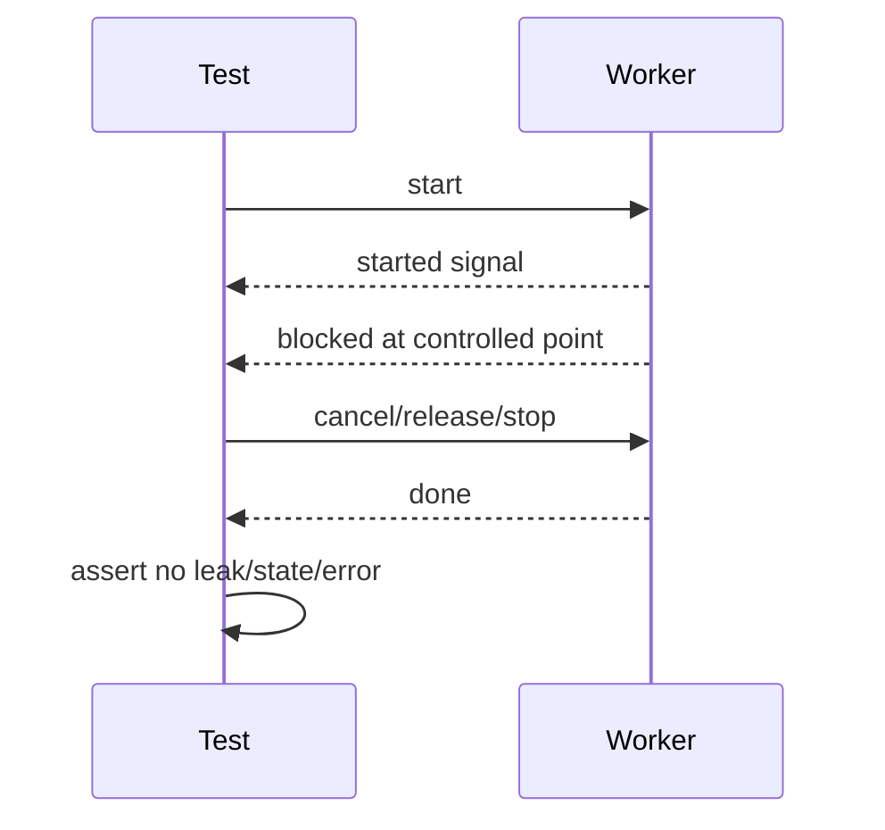

# learn-go-concurrency-parallelism-part-025.md

# Part 025 — Testing Concurrent Code: Determinism, Stress, Cancellation, Leaks, and Testability

> Target pembaca: Java software engineer yang ingin mampu menulis test concurrent Go yang benar-benar menangkap bug lifecycle, race, deadlock, leak, timeout, cancellation, backpressure, dan shutdown—bukan test yang “kebetulan lewat”.
>
> Fokus part ini: deterministic concurrency tests, barrier channels, fake dependencies, fake clock, cancellation tests, goroutine leak tests, stress tests, race tests, worker pool tests, pipeline tests, timer tests, HTTP/DB concurrency tests, and production-grade testability design.

---

## 0. Posisi Part Ini dalam Seri

Sebelumnya:

- Part 024 membahas race detection, static analysis, dan bug hunting.
- Part ini masuk lebih jauh ke **desain test** untuk concurrent code.

Pertanyaan utama:

> Bagaimana menulis test yang membuktikan lifecycle concurrent code benar tanpa mengandalkan `time.Sleep` dan keberuntungan scheduler?

Concurrent tests sering buruk karena:
- sleep-based,
- flaky,
- tidak deterministic,
- hanya test happy path,
- tidak test cancellation,
- tidak test shutdown,
- tidak test queue full,
- tidak test early return,
- tidak test panic,
- tidak test race with stop,
- tidak test goroutine leak,
- tidak test slow downstream,
- tidak test backpressure,
- tidak test resource cleanup.

Top 1% engineer memperlakukan concurrency lifecycle sebagai behavior yang harus dites eksplisit.

---

## 1. Tujuan Pembelajaran

Setelah part ini, Anda harus mampu:

1. Mendesain concurrent code agar testable.
2. Menghindari `time.Sleep` sebagai synchronization.
3. Menggunakan channel barrier:
   - started,
   - blocked,
   - release,
   - done.
4. Menguji:
   - cancellation,
   - timeout,
   - queue full,
   - submit while stop,
   - close ownership,
   - early downstream exit,
   - worker panic,
   - drain vs cancel shutdown,
   - ordering,
   - backpressure.
5. Menulis stress tests dengan `-count`.
6. Menggabungkan tests dengan race detector.
7. Menggunakan fake clock/fake sleeper untuk retry/timer code.
8. Mendesain fake dependency yang controllable.
9. Menguji worker pool, pipeline, singleflight, limiter, cache, network client, DB transaction logic.
10. Membedakan:
    - deterministic unit test,
    - stress test,
    - integration test,
    - benchmark,
    - property/invariant test.
11. Membuat CI strategy untuk concurrent code.
12. Membuat checklist test review.

---

## 2. Mental Model: Concurrent Test Harus Mengontrol Interleaving

Test biasa:

```text
call function -> assert result
```

Concurrent test:

```text
start goroutine -> wait until it reaches point A -> trigger event B -> assert state C -> release goroutine -> assert cleanup
```



The key is not sleeping. The key is **observing and controlling progress**.

---

## 3. Java Translation

Java testing parallels:
- `CountDownLatch`,
- `CyclicBarrier`,
- `Semaphore`,
- `CompletableFuture`,
- fake executor,
- Awaitility,
- virtual time scheduler in Reactor,
- JUnit timeout,
- thread dump on timeout.

Go equivalents:
- channels as latches/barriers,
- `sync.WaitGroup`,
- context cancellation,
- fake clock/sleeper,
- `httptest.Server`,
- test hooks,
- `testing.T.Cleanup`,
- race detector,
- `go test -count=N`,
- pprof/trace for hard cases.

Go tests should prefer channels over sleeps.

---

## 4. Test Smell: `time.Sleep`

Bad:

```go
go worker()

time.Sleep(100 * time.Millisecond)

if !workerStarted {
    t.Fatal("not started")
}
```

Why bad:
- slow machine may fail,
- fast machine wastes time,
- scheduler timing unpredictable,
- race may be hidden,
- test does not prove worker reached the intended state.

Better:

```go
started := make(chan struct{})

go func() {
    close(started)
    worker()
}()

select {
case <-started:
case <-time.After(time.Second):
    t.Fatal("worker did not start")
}
```

Use timeouts as **guard**, not synchronization.

---

## 5. Guard Timeout Pattern

Every test waiting on goroutine should have a timeout guard.

```go
func waitOrFail(t *testing.T, ch <-chan struct{}, msg string) {
    t.Helper()

    select {
    case <-ch:
    case <-time.After(time.Second):
        t.Fatal(msg)
    }
}
```

Use:
```go
waitOrFail(t, done, "worker did not stop")
```

Timeout should be generous enough for CI but not hide deadlock too long.

---

## 6. Barrier Channels

Common channels:

```go
started := make(chan struct{})
blocked := make(chan struct{})
release := make(chan struct{})
done := make(chan struct{})
```

Worker fake:

```go
fn := func(ctx context.Context, job Job) error {
    close(started)

    select {
    case <-blocked:
    default:
        close(blocked)
    }

    select {
    case <-release:
        return nil
    case <-ctx.Done():
        return ctx.Err()
    }
}
```

But be careful: closing a channel twice panics. Use `sync.Once` if multiple workers may close.

```go
var once sync.Once
once.Do(func() { close(blocked) })
```

---

## 7. Testing Cancellation

Function under test:

```go
func Work(ctx context.Context, in <-chan Item) error {
    for {
        select {
        case <-ctx.Done():
            return ctx.Err()
        case item := <-in:
            process(item)
        }
    }
}
```

Test:

```go
func TestWorkStopsOnCancel(t *testing.T) {
    ctx, cancel := context.WithCancel(context.Background())

    done := make(chan error, 1)

    go func() {
        done <- Work(ctx, make(chan Item))
    }()

    cancel()

    select {
    case err := <-done:
        if !errors.Is(err, context.Canceled) {
            t.Fatalf("got %v", err)
        }
    case <-time.After(time.Second):
        t.Fatal("work did not stop")
    }
}
```

Test should assert:
- returns promptly,
- returns expected error,
- no goroutine stuck,
- resources closed if applicable.

---

## 8. Testing Already-Cancelled Context

Many functions should fail quickly if context already cancelled.

```go
func TestSubmitAlreadyCanceled(t *testing.T) {
    ctx, cancel := context.WithCancel(context.Background())
    cancel()

    err := pool.Submit(ctx, Job{})

    if !errors.Is(err, context.Canceled) {
        t.Fatalf("got %v", err)
    }
}
```

This catches code that ignores ctx before blocking.

---

## 9. Testing Queue Full

Worker pool with capacity 1 worker + queue size 1.

```go
func TestPoolQueueFull(t *testing.T) {
    block := make(chan struct{})
    started := make(chan struct{})

    var once sync.Once

    pool := NewPool(1, 1, func(ctx context.Context, job Job) error {
        once.Do(func() { close(started) })
        <-block
        return nil
    })
    t.Cleanup(func() {
        close(block)
        _ = pool.Stop(context.Background())
    })

    if err := pool.Submit(context.Background(), Job{ID: "active"}); err != nil {
        t.Fatal(err)
    }

    waitOrFail(t, started, "worker did not start")

    if err := pool.Submit(context.Background(), Job{ID: "queued"}); err != nil {
        t.Fatal(err)
    }

    err := pool.TrySubmit(Job{ID: "full"})
    if !errors.Is(err, ErrQueueFull) {
        t.Fatalf("got %v, want queue full", err)
    }
}
```

Key:
- block worker deterministically,
- fill queue,
- assert full.

---

## 10. Testing Stop While Submit

This catches common `send on closed channel` races.

```go
func TestPoolStopWhileSubmit(t *testing.T) {
    pool := NewPool(4, 4, func(ctx context.Context, job Job) error {
        return nil
    })

    var wg sync.WaitGroup

    for i := 0; i < 100; i++ {
        wg.Go(func() {
            _ = pool.Submit(context.Background(), Job{})
        })
    }

    wg.Go(func() {
        _ = pool.Stop(context.Background())
    })

    wg.Wait()
}
```

Run:

```bash
go test -race -run TestPoolStopWhileSubmit -count=1000
```

But design matters:
- Is Submit after Stop allowed to race?
- Should it return ErrStopped?
- Is Stop idempotent?
- Is channel ever closed while senders may send?

Better pool implementation often serializes admission with mutex/state instead of closing jobs channel directly while submitters exist.

---

## 11. Testing Shutdown Semantics: Drain vs Cancel

If pool supports drain:

```go
err := pool.StopDrain(ctx)
```

Assert:
- accepted jobs complete,
- no new jobs accepted,
- workers exit,
- Stop returns after jobs done or context deadline.

If pool supports cancel:

```go
err := pool.StopCancel(ctx)
```

Assert:
- running jobs observe ctx,
- queued jobs discarded or marked cancelled,
- Stop returns promptly.

Test both semantics separately.

---

## 12. Testing Goroutine Leak

Explicit done is better than goroutine count.

```go
func TestWorkerNoLeak(t *testing.T) {
    ctx, cancel := context.WithCancel(context.Background())

    done := make(chan struct{})

    go func() {
        defer close(done)
        worker(ctx)
    }()

    cancel()

    select {
    case <-done:
    case <-time.After(time.Second):
        t.Fatal("worker leaked")
    }
}
```

For APIs that hide goroutines, expose Close/Stop and wait.

```go
svc := NewService()
svc.Start()
err := svc.Stop(ctx)
```

Stop should wait for internal goroutines.

---

## 13. Testing Early Downstream Exit in Pipeline

Bug:
- consumer reads one item and returns.
- upstream blocks sending.

Test:

```go
func TestPipelineEarlyExitDoesNotLeak(t *testing.T) {
    ctx, cancel := context.WithCancel(context.Background())
    defer cancel()

    out := Pipeline(ctx, Source(ctx, 1000))

    <-out
    cancel()

    done := PipelineDone(out) // or explicit done from pipeline

    select {
    case <-done:
    case <-time.After(time.Second):
        t.Fatal("pipeline did not stop")
    }
}
```

Better design:
- pipeline runner returns `done` or `Wait`.
- stages are owned by errgroup.
- tests can wait for group completion.

---

## 14. Testing Channel Close Ownership

Test sender closes output after all work.

```go
func TestStageClosesOutput(t *testing.T) {
    ctx := context.Background()
    in := make(chan Item)

    out := Stage(ctx, in)

    close(in)

    select {
    case _, ok := <-out:
        if ok {
            t.Fatal("expected closed output")
        }
    case <-time.After(time.Second):
        t.Fatal("output not closed")
    }
}
```

Also test:
- ctx cancel closes output,
- input close flushes batch,
- worker panic closes output if policy says so.

---

## 15. Testing Ordering

For parallel map that promises order:

```go
func TestParallelMapPreservesOrder(t *testing.T) {
    in := []int{0, 1, 2, 3, 4, 5}

    out, err := ParallelMap(context.Background(), in, 3, func(ctx context.Context, n int) (int, error) {
        if n%2 == 0 {
            time.Sleep(10 * time.Millisecond) // acceptable? better fake delay if possible
        }
        return n * 10, nil
    })
    if err != nil {
        t.Fatal(err)
    }

    want := []int{0, 10, 20, 30, 40, 50}
    if !reflect.DeepEqual(out, want) {
        t.Fatalf("got %v want %v", out, want)
    }
}
```

Sleep here simulates different completion order; better deterministic blocker per item if possible.

---

## 16. Testing Backpressure

Backpressure behavior:
- submit blocks,
- submit returns queue full,
- submit waits bounded duration,
- upstream slows,
- downstream slow does not OOM.

Example fail-fast:

```go
func TestBackpressureFailFast(t *testing.T) {
    q := NewBoundedQueue[Job](1)

    if err := q.TryPut(Job{}); err != nil {
        t.Fatal(err)
    }

    err := q.TryPut(Job{})
    if !errors.Is(err, ErrFull) {
        t.Fatalf("got %v", err)
    }
}
```

Bounded wait:
- use fake clock/sleeper if implemented.
- otherwise use small duration with generous guard.

---

## 17. Fake Dependency

A controllable dependency lets tests force ordering.

```go
type FakeClient struct {
    started chan struct{}
    release chan struct{}
    err     error
}

func NewFakeClient() *FakeClient {
    return &FakeClient{
        started: make(chan struct{}),
        release: make(chan struct{}),
    }
}

func (f *FakeClient) Call(ctx context.Context) error {
    close(f.started)

    select {
    case <-f.release:
        return f.err
    case <-ctx.Done():
        return ctx.Err()
    }
}
```

Use:
- wait until call started,
- cancel context,
- release dependency,
- assert result.

Need `sync.Once` if multiple calls.

---

## 18. Fake Clock and Fake Sleeper

Time-based code becomes testable if sleep/backoff injected.

Production:

```go
type Sleeper func(context.Context, time.Duration) error

func RealSleep(ctx context.Context, d time.Duration) error {
    timer := time.NewTimer(d)
    defer timer.Stop()

    select {
    case <-timer.C:
        return nil
    case <-ctx.Done():
        return ctx.Err()
    }
}
```

Retry function:

```go
func Retry(ctx context.Context, attempts int, sleep Sleeper, fn func() error) error {
    var last error

    for i := 0; i < attempts; i++ {
        if err := fn(); err == nil {
            return nil
        } else {
            last = err
        }

        if i != attempts-1 {
            if err := sleep(ctx, backoff(i)); err != nil {
                return err
            }
        }
    }

    return last
}
```

Test:

```go
var sleeps []time.Duration

fakeSleep := func(ctx context.Context, d time.Duration) error {
    sleeps = append(sleeps, d)
    return nil
}
```

Now test retry without real waiting.

---

## 19. Testing Timers Without Flakiness

If testing debounce/ticker:
- inject clock if complex,
- or expose trigger channel,
- or test smaller pure logic separately.

Example:
- separate “should flush?” decision from timer loop.
- unit test decision pure.
- integration test timer loop with guard.

Avoid dozens of real-time sleeps in CI.

---

## 20. Testing Singleflight

Need ensure loader called once under concurrent misses.

```go
func TestSingleflightDedup(t *testing.T) {
    var calls atomic.Int64
    group := NewGroup[string, int]()

    started := make(chan struct{})
    release := make(chan struct{})

    fn := func() (int, error) {
        if calls.Add(1) == 1 {
            close(started)
        }
        <-release
        return 42, nil
    }

    const n = 100
    var wg sync.WaitGroup
    results := make(chan int, n)

    for i := 0; i < n; i++ {
        wg.Go(func() {
            v, err, _ := group.Do("k", fn)
            if err != nil {
                t.Errorf("err: %v", err)
                return
            }
            results <- v
        })
    }

    waitOrFail(t, started, "leader did not start")
    close(release)

    wg.Wait()
    close(results)

    if calls.Load() != 1 {
        t.Fatalf("calls=%d want 1", calls.Load())
    }
}
```

Also test:
- leader error shared,
- panic policy,
- high-cardinality keys if limiter exists,
- waiter cancellation if API supports it.

---

## 21. Testing Rate Limiter/Semaphore

Semaphore:
- capacity,
- TryAcquire false when full,
- Acquire returns on context cancellation,
- Release without acquire panic if documented,
- concurrent acquire/release no race.

Rate limiter:
- use fake clock if custom.
- test token refill deterministically.
- test burst capacity.
- test Wait respects context.

---

## 22. Testing Concurrent Data Structures

Test layers:

1. Sequential behavior.
2. Concurrent behavior with race detector.
3. Invariants after concurrent operations.
4. Snapshot semantics.
5. Memory retention if relevant.

Example map stress:

```go
func TestSafeMapConcurrent(t *testing.T) {
    m := NewSafeMap[string, int]()

    var wg sync.WaitGroup

    for i := 0; i < 100; i++ {
        i := i
        wg.Go(func() {
            for j := 0; j < 1000; j++ {
                key := strconv.Itoa(j % 10)
                m.Set(key, i*j)
                _, _ = m.Get(key)
            }
        })
    }

    wg.Wait()
}
```

Run with race detector.

---

## 23. Testing HTTP Concurrency

Use `httptest.Server`.

```go
func TestClientTimeout(t *testing.T) {
    started := make(chan struct{})

    srv := httptest.NewServer(http.HandlerFunc(func(w http.ResponseWriter, r *http.Request) {
        close(started)
        <-r.Context().Done()
    }))
    defer srv.Close()

    ctx, cancel := context.WithTimeout(context.Background(), 10*time.Millisecond)
    defer cancel()

    req, _ := http.NewRequestWithContext(ctx, http.MethodGet, srv.URL, nil)

    _, err := http.DefaultClient.Do(req)
    if err == nil {
        t.Fatal("expected error")
    }
}
```

Test:
- response body closed,
- slow server timeout,
- retry policy,
- concurrency limiter,
- optional dependency fallback,
- client cancellation.

---

## 24. Testing DB Concurrency

For DB concurrency, unit fake is insufficient for:
- transaction isolation,
- unique constraint,
- deadlock,
- lock wait,
- context cancellation behavior.

Use integration tests with real DB for:
- idempotency unique constraint,
- row claiming,
- transaction retry,
- pool saturation,
- context timeout.

Still isolate pure transaction orchestration with fake interface where useful.

---

## 25. Testing with Race Detector in CI

Commands:

```bash
go test ./...
go test -race ./...
go test -race ./internal/pool -run TestStopWhileSubmit -count=100
```

Race tests can be slower. Strategy:
- small critical packages: every PR,
- full repo: nightly,
- flaky/stress: scheduled,
- performance-sensitive packages: benchmark pipeline.

Never ignore a race report because “only in test”.
Test races can invalidate test results and often indicate production patterns.

---

## 26. Stress Testing

Stress test repeats to expose rare interleavings.

```bash
go test -race ./internal/cache -run TestConcurrentGetOrLoad -count=1000
```

Useful for:
- submit/stop race,
- close/send race,
- singleflight race,
- cache eviction race,
- timeout/cancel race,
- transaction retry race.

Keep stress tests:
- deterministic enough,
- bounded runtime,
- isolated from external flaky systems,
- runnable locally.

---

## 27. Property and Invariant Testing

Concurrent data structures need invariant checks.

LRU invariants:
- map size == list size,
- size <= max,
- each map node in list,
- no duplicate key in list.

Queue invariants:
- length between 0 and cap,
- no item lost unless drop policy,
- FIFO order if promised,
- closed state consistent.

Worker pool invariants:
- accepted jobs either completed or cancelled according to policy,
- no new job after stop,
- workers exit after stop,
- queue not over capacity.

Fuzz operation sequences where possible.

---

## 28. Benchmark Is Not Test

Benchmark answers:
- how fast?
- how many allocations?
- scalability?

Test answers:
- correct?
- no leak?
- cancels?
- preserves invariant?

Do both.

Example:
```bash
go test -bench=. -benchmem
go test -race ./...
```

Race detector with benchmark:
```bash
go test -race -run=NONE -bench=BenchmarkX
```
Can be useful but overhead changes timing.

---

## 29. Testability Design Guidelines

Concurrent code is testable when it exposes:

1. `Start(ctx)` / `Stop(ctx)` / `Wait()`.
2. Explicit context.
3. Bounded queues with observable state.
4. Dependency interfaces.
5. Injected sleeper/clock for time logic.
6. Hooks/barriers for tests, if necessary.
7. Metrics/state snapshots.
8. No hidden background goroutine without owner.
9. No package-level global mutable state.
10. Deterministic close semantics.

Bad API:

```go
func StartWorker() {
    go func() {
        for {
            doWork()
            time.Sleep(time.Second)
        }
    }()
}
```

Good API:

```go
type Worker struct {
    // ...
}

func (w *Worker) Start(ctx context.Context)
func (w *Worker) Stop(ctx context.Context) error
func (w *Worker) Wait() error
```

---

## 30. Test Hooks

Sometimes useful:

```go
type Hooks struct {
    BeforeProcess func(Job)
    AfterProcess  func(Job)
}
```

Production passes nil.
Tests pass hooks to coordinate.

Caution:
- hooks can alter timing,
- hooks under lock can deadlock,
- keep hooks internal/test-only if possible,
- do not expose unstable hooks as public API.

Better alternatives:
- fake dependencies,
- explicit state channels,
- dependency injection.

---

## 31. Testing Panic Policy

If worker pool recovers panics:

```go
func TestWorkerPanicRecovered(t *testing.T) {
    panicSeen := make(chan struct{})

    pool := NewPool(1, 1, func(ctx context.Context, job Job) error {
        if job.ID == "panic" {
            panic("boom")
        }
        close(panicSeen)
        return nil
    })
    defer pool.Stop(context.Background())

    _ = pool.Submit(context.Background(), Job{ID: "panic"})
    _ = pool.Submit(context.Background(), Job{ID: "next"})

    waitOrFail(t, panicSeen, "worker did not continue after panic")
}
```

But if policy is “panic crashes process”, do not recover silently. Test at process boundary may be needed.

---

## 32. Testing Error Propagation

For errgroup/pipeline:
- first error cancels siblings,
- error returned is expected,
- no goroutine leak,
- output closed,
- partial results policy clear.

Fake stage:

```go
errStage := func(ctx context.Context, x int) (int, error) {
    if x == 5 {
        return 0, ErrBoom
    }
    return x, nil
}
```

Assert:
- `ErrBoom` returned,
- ctx cancelled,
- stages exit.

---

## 33. Testing Backoff and Retry

Inject sleeper and classifier.

```go
func TestRetryStopsOnNonRetryable(t *testing.T) {
    attempts := 0

    err := Retry(ctx, 5, fakeSleep, func() error {
        attempts++
        return ErrNonRetryable
    })

    if !errors.Is(err, ErrNonRetryable) {
        t.Fatal(err)
    }

    if attempts != 1 {
        t.Fatalf("attempts=%d", attempts)
    }
}
```

Test:
- retryable attempts,
- non-retryable stops,
- context cancel during sleep,
- jitter range,
- max attempts,
- deadline budget.

---

## 34. Testing Slow Downstream

For HTTP:
- httptest server blocks.
For DB:
- transaction lock or sleep query.
For worker:
- fake dependency blocks.
For channel:
- do not receive from downstream.

Slow downstream tests verify:
- timeout,
- cancellation,
- queue full,
- backpressure,
- no leak.

---

## 35. Testing Resource Cleanup

Assert:
- response body closed? Hard directly, but fake RoundTripper can track Close.
- rows closed? Fake rows or integration pool stats.
- ticker stopped? Usually via goroutine exit.
- buffers returned? counters in fake pool.
- permits released? semaphore InUse returns 0.
- workers stopped? Wait returns.

Example semaphore:

```go
if sem.InUse() != 0 {
    t.Fatalf("permits leaked")
}
```

---

## 36. Parallel Tests and Shared State

`t.Parallel()` can create races if tests share globals.

Bad:
```go
var globalCache = NewCache()

func TestA(t *testing.T) { t.Parallel(); globalCache.Set("a", 1) }
func TestB(t *testing.T) { t.Parallel(); globalCache.Clear() }
```

Use per-test instance.

```go
func TestA(t *testing.T) {
    t.Parallel()
    cache := NewCache()
}
```

Also:
- avoid fixed ports,
- use temp dirs,
- isolate env vars,
- use `t.Setenv`,
- use `t.TempDir`.

---

## 37. CI Flakiness Policy

A flaky concurrent test is a bug until proven otherwise.

Do not:
- just increase sleep blindly,
- ignore failure,
- mark as flaky permanently.

Investigate:
- missing synchronization,
- real race,
- resource leak,
- external dependency instability,
- timing assumption,
- test order dependency,
- global shared state.

---

## 38. Test Matrix

For each concurrent component:

| Dimension | Cases |
|---|---|
| lifecycle | start, stop, double stop, submit after stop |
| capacity | empty, full, near full |
| cancellation | before, during wait, during work |
| timeout | deadline exceeded, enough budget |
| errors | worker error, dependency error, panic |
| ordering | ordered, unordered |
| backpressure | block, reject, drop |
| resources | permits released, buffers returned |
| concurrency | many submitters, many workers |
| shutdown | drain, cancel, deadline |
| race | run with `-race` |
| stress | run with `-count` |

---

## 39. Anti-Pattern Catalog

### 39.1 Sleep as Synchronization

Use barriers.

### 39.2 Testing Only Happy Path

Concurrent bugs live in cancellation/error/shutdown.

### 39.3 No Timeout Guard

Deadlocked test hangs CI.

### 39.4 Ignoring Race in Tests

Test races are real problems.

### 39.5 Hidden Background Goroutine

No Stop/Wait means untestable lifecycle.

### 39.6 Real Time in Retry Tests

Slow/flaky.

### 39.7 Unbounded Stress Test

CI timeout/noise.

### 39.8 Overmocking DB Transaction Semantics

Fake misses real isolation/locking bugs.

### 39.9 Global Shared State Across Parallel Tests

Flaky races.

### 39.10 No Test for Submit While Stop

Common production panic.

### 39.11 No Test for Early Consumer Exit

Pipeline leaks.

### 39.12 No Test for Resource Release on Error

Permit/buffer/connection leaks.

---

## 40. Design Review Checklist

For concurrent tests:

1. Does test avoid sleep as synchronization?
2. Does every wait have timeout guard?
3. Are goroutines waited/stopped?
4. Is cancellation tested?
5. Is already-cancelled context tested?
6. Is queue full tested?
7. Is shutdown tested?
8. Is double stop tested?
9. Is submit-after-stop tested?
10. Is stop-while-submit tested?
11. Is early downstream exit tested?
12. Is output channel close tested?
13. Is panic policy tested?
14. Is error propagation tested?
15. Are resources released on error?
16. Is ordering tested if promised?
17. Is unordered behavior not accidentally assumed?
18. Are fake dependencies controllable?
19. Is fake time/sleeper used for retry/timer?
20. Are integration tests used where fake cannot model?
21. Does test run with race detector?
22. Is stress `-count` used for race-prone paths?
23. Are invariants checked?
24. Are parallel tests isolated?
25. Is global state avoided/reset?
26. Are CI commands defined?
27. Are flaky tests treated seriously?
28. Is testability built into API?
29. Are metrics/state snapshots available for assertions?
30. Is the test proving lifecycle, not timing luck?

---

## 41. Mini Lab 1: Rewrite Sleep-Based Test

Take a test using:
```go
time.Sleep(100 * time.Millisecond)
```

Replace with:
- started channel,
- blocked channel,
- release channel,
- done channel,
- timeout guard.

Explain what interleaving is now controlled.

---

## 42. Mini Lab 2: Worker Pool Test Suite

For your worker pool, implement tests:
- submit success,
- queue full,
- already cancelled ctx,
- worker error,
- panic policy,
- stop drain,
- stop cancel,
- submit after stop,
- stop while submit,
- no goroutine leak.

Run:
```bash
go test -race -count=100
```

---

## 43. Mini Lab 3: Pipeline Leak Test

Build pipeline:
- source emits many items,
- sink reads one then cancels.

Assert:
- all stage goroutines stop,
- output closed or Wait returns,
- no blocked send.

---

## 44. Mini Lab 4: Fake Sleeper Retry Test

Implement retry with injected sleeper.
Test:
- delays sequence,
- context cancel during sleep,
- non-retryable error,
- retryable error eventually success,
- max attempts.

No real sleep.

---

## 45. Mini Lab 5: Singleflight Cancellation Test

If using DoChan:
- leader blocks,
- waiter cancels,
- waiter returns ctx.Err,
- leader completes,
- future call gets expected result/cache.

Clarify policy:
- leader continues or cancels?

---

## 46. Mini Lab 6: DB Unique Constraint Race

Integration test:
- 50 goroutines create same idempotency key.
- exactly one succeeds or all return same stored result.
- no duplicate domain row.

Run against real DB.

---

## 47. Top 1% Heuristics

1. Sleep is not synchronization.
2. Use timeout only as guard, not proof.
3. Test cancellation as a first-class path.
4. Test shutdown as aggressively as startup.
5. Test resource release on every error path.
6. Stop while Submit is a mandatory worker pool test.
7. Early consumer exit is a mandatory pipeline test.
8. Race detector should be part of test workflow.
9. Stress tests expose interleavings; deterministic barriers explain them.
10. Fake dependencies should be controllable, not just mocked.
11. Time logic should use injected sleep/clock when complex.
12. Integration tests are required for DB/network concurrency semantics.
13. Flaky tests are signals.
14. Testability is API design.
15. A concurrent component without Stop/Wait is incomplete.

---

## 48. Source Notes

Primary Go concepts behind this part:

1. Go testing:
   - `testing` package,
   - subtests,
   - `t.Cleanup`,
   - timeout guards.

2. Go concurrency:
   - channels as synchronization barriers,
   - WaitGroup,
   - context cancellation,
   - worker/pipeline lifecycle.

3. Go tooling:
   - race detector,
   - stress via `-count`,
   - `go test -race`.

4. Test design:
   - deterministic interleaving,
   - fake dependency,
   - fake sleeper/clock,
   - invariant/property testing,
   - integration testing for external systems.

---

## 49. Summary

Testing concurrent Go code is about controlling lifecycle and interleavings.

Good concurrent tests:
- avoid sleep as synchronization,
- use channels as barriers,
- use timeout only as guard,
- test cancellation,
- test shutdown,
- test queue full,
- test early exit,
- test resource release,
- run with race detector,
- repeat stress-prone paths,
- use fake time/dependencies,
- assert invariants.

The core rule:

> If production behavior depends on a concurrent lifecycle, that lifecycle deserves a deterministic test.

---

## 50. Status Seri

Selesai:
- Part 000 — Orientation
- Part 001 — Foundations
- Part 002 — Goroutine Internals
- Part 003 — Go Scheduler Deep Dive
- Part 004 — GOMAXPROCS, CPU Quotas, Containers
- Part 005 — Go Memory Model
- Part 006 — Synchronization Primitives
- Part 007 — Atomic Operations
- Part 008 — Channels Deep Dive
- Part 009 — Select Semantics
- Part 010 — WaitGroup, ErrGroup, Task Groups, and Structured Concurrency
- Part 011 — Context as Concurrency Contract
- Part 012 — Ownership Models
- Part 013 — Worker Pools
- Part 014 — Fan-Out/Fan-In, Pipelines, Stages, and Stream Processing
- Part 015 — Backpressure End-to-End
- Part 016 — Semaphores, Rate Limiters, Token Buckets, and Bulkheads
- Part 017 — Concurrent Data Structures
- Part 018 — Singleflight, Deduplication, Idempotency, and Stampede Prevention
- Part 019 — Timers, Tickers, Deadlines, Scheduling, and Time-Based Concurrency
- Part 020 — Network Concurrency
- Part 021 — Database Concurrency
- Part 022 — Parallel CPU Work
- Part 023 — Memory, Allocation, GC, and Concurrency Pressure
- Part 024 — Race Detection, Static Analysis, and Concurrency Bug Hunting
- Part 025 — Testing Concurrent Code

Belum selesai:
- Part 026 sampai Part 034.

Seri belum mencapai bagian terakhir.


<!-- NAVIGATION_FOOTER -->
<div class="page-nav">
<a href="./learn-go-concurrency-parallelism-part-024.md">⬅️ Part 024 — Race Detection, Static Analysis, and Concurrency Bug Hunting</a>
<a href="./index.md">📚 Kategori</a>
<a href="../../index.md">🏠 Home</a>
<a href="./learn-go-concurrency-parallelism-part-026.md">Part 026 — Observability for Concurrent Systems: Metrics, Logs, Traces, Profiles, and Runtime Signals ➡️</a>
</div>
