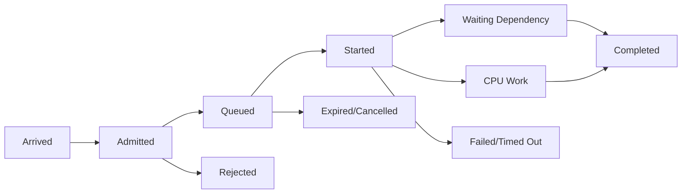
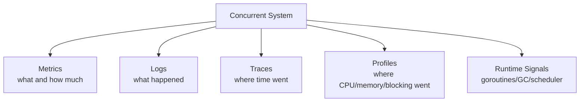
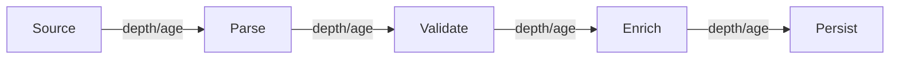
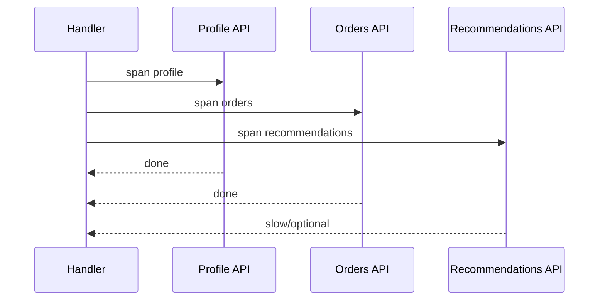
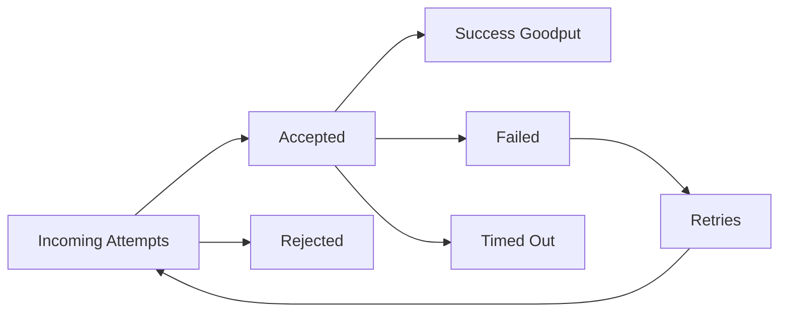

# learn-go-concurrency-parallelism-part-026.md

# Part 026 — Observability for Concurrent Systems: Metrics, Logs, Traces, Profiles, and Runtime Signals

> Target pembaca: Java software engineer yang ingin mampu mengoperasikan sistem Go concurrent di production: tahu sinyal apa yang harus diamati, bagaimana membaca gejala overload, goroutine leak, contention, queue buildup, pool saturation, scheduler latency, GC pressure, dan cancellation storm.
>
> Fokus part ini: concurrency-aware metrics, structured logs, distributed tracing, pprof, runtime metrics, goroutine/block/mutex profiles, queue age, worker saturation, context cancellation, backpressure, profiling strategy, dashboards, alerts, and incident diagnostics.

---

## 0. Posisi Part Ini dalam Seri

Sebelumnya:

- Part 002: goroutine internals.
- Part 003: scheduler.
- Part 004: GOMAXPROCS/container CPU.
- Part 013: worker pools.
- Part 015: backpressure.
- Part 020: network concurrency.
- Part 021: database concurrency.
- Part 023: memory/GC.
- Part 024: bug hunting.
- Part 025: testing concurrent code.

Part ini membahas pertanyaan production:

> Saat sistem concurrent bermasalah, bagaimana kita tahu apa yang sedang terjadi?

Concurrent system gagal dengan gejala yang sering menipu:

- CPU rendah tapi latency tinggi.
- Goroutine count naik tapi throughput turun.
- Queue depth kecil tapi queue age tinggi.
- DB sehat tapi app menunggu pool.
- HTTP 5xx sedikit tapi client cancellation tinggi.
- Retry rate naik tapi goodput turun.
- Memory naik karena goroutine blocked, bukan cache.
- p99 buruk karena satu lock.
- Worker pool “aktif” tapi semua blocked di downstream.
- Ticker job overlap dan menumpuk.
- Context deadline exceeded banyak, tapi root cause pool wait.

Observability concurrency harus menjawab:

1. Work datang seberapa cepat?
2. Work diterima atau ditolak?
3. Work menunggu di mana?
4. Work berjalan di mana?
5. Work selesai atau dibatalkan?
6. Bottleneck resource apa?
7. Apakah overload dikendalikan?
8. Apakah goroutine/resource bocor?
9. Apakah latency disebabkan queue, execution, dependency, lock, scheduler, atau GC?

---

## 1. Tujuan Pembelajaran

Setelah part ini, Anda harus mampu:

1. Mendesain metrics untuk worker pool, pipeline, queues, semaphores, rate limiters, caches, and singleflight.
2. Membedakan:
   - throughput,
   - goodput,
   - saturation,
   - queue depth,
   - queue age,
   - in-flight,
   - wait duration,
   - processing duration,
   - tail latency.
3. Menulis structured logs untuk lifecycle concurrent work.
4. Mendesain tracing untuk request fan-out dan pipeline stages.
5. Menggunakan pprof:
   - goroutine,
   - heap,
   - CPU,
   - block,
   - mutex.
6. Menggunakan runtime metrics:
   - goroutine count,
   - scheduler,
   - GC,
   - memory classes.
7. Membuat dashboard concurrency production.
8. Membuat alerts yang actionable.
9. Menghindari high-cardinality metrics.
10. Membaca symptom → hypothesis → evidence.
11. Membuat incident playbook berbasis observability.

---

## 2. Mental Model: Observability Harus Menunjukkan Flow of Work

Concurrent system adalah flow:



Metrics harus menempel di setiap titik:

| Phase | Signals |
|---|---|
| Arrived | request/job rate |
| Admitted | accepted rate |
| Rejected | rejection count/reason |
| Queued | depth, oldest age, wait duration |
| Started | in-flight, active workers |
| Dependency wait | DB pool wait, HTTP latency, semaphore wait |
| CPU work | CPU profile, worker duration |
| Completed | success rate, goodput |
| Failed | error class |
| Cancelled | ctx cancel/deadline |
| Timed out | operation timeout |
| Shutdown | drain/cancel duration |

Jika hanya punya “request latency” dan “error rate”, debugging concurrency akan lambat.

---

## 3. Java Translation

Java observability parallels:

| Java world | Go world |
|---|---|
| Micrometer JVM metrics | runtime/metrics, custom metrics |
| Thread pool metrics | goroutine/worker pool metrics |
| HikariCP metrics | `db.Stats()` |
| JFR thread dumps | goroutine dump, runtime trace |
| async profiler | pprof CPU/heap/block/mutex |
| MDC correlation id | context-carried request id/tracing |
| Reactor operator metrics | explicit stage/pipeline metrics |
| executor queue depth | channel/custom queue depth |

Key Go difference:
- You must instrument your own worker pools, channels, pipelines, and bulkheads.
- The runtime gives powerful low-level profiles, but business-level concurrency needs custom metrics.

---

## 4. Three Pillars Plus Profiles

Classic:
- metrics,
- logs,
- traces.

For Go concurrency add:
- profiles,
- runtime metrics,
- goroutine dumps,
- runtime trace.



Each answers different questions.

---

## 5. Metrics: The First Line of Defense

Metrics are for:
- dashboards,
- alerts,
- trends,
- capacity planning,
- SLOs.

Concurrency metrics should emphasize:
- saturation,
- queueing,
- wait,
- cancellation,
- rejection,
- goodput,
- resource contention.

### 5.1 Counter

Monotonic increasing:
- accepted_total,
- rejected_total,
- completed_total,
- failed_total,
- cancelled_total,
- retry_total.

### 5.2 Gauge

Current value:
- queue_depth,
- in_flight,
- active_workers,
- goroutines,
- permits_in_use.

### 5.3 Histogram

Distribution:
- queue_wait_duration,
- processing_duration,
- dependency_latency,
- semaphore_wait_duration,
- end_to_end_latency.

Histograms are crucial for p95/p99.

---

## 6. Queue Metrics

For any queue/channel/worker pool:

| Metric | Type | Why |
|---|---|---|
| queue_depth | gauge | current backlog |
| queue_capacity | gauge/constant | context |
| queue_oldest_age_seconds | gauge | stale work |
| enqueue_total | counter | arrival |
| dequeue_total | counter | processing start |
| rejected_total | counter | backpressure |
| dropped_total | counter | shedding |
| expired_total | counter | stale work |
| queue_wait_seconds | histogram | latency before processing |

Most teams measure depth but forget oldest age.

Queue depth alone is insufficient.

Example:
- depth 100 at 10k/s = fine.
- depth 100 at 1/s = disaster.

---

## 7. Worker Pool Metrics

| Metric | Type |
|---|---|
| workers_configured | gauge |
| workers_active | gauge |
| workers_idle | gauge |
| jobs_in_flight | gauge |
| job_started_total | counter |
| job_completed_total | counter |
| job_failed_total | counter |
| job_cancelled_total | counter |
| job_panic_total | counter |
| job_duration_seconds | histogram |
| worker_lifetime_seconds | histogram |
| stop_duration_seconds | histogram |

Also:
- job duration by job type,
- error class,
- tenant or priority if cardinality controlled.

Avoid labels:
- job ID,
- user ID,
- request ID,
- raw key,
- high-cardinality dynamic values.

---

## 8. Semaphore/Bulkhead Metrics

| Metric | Meaning |
|---|---|
| permits_capacity | configured capacity |
| permits_in_use | current saturation |
| acquire_total | attempts |
| acquire_success_total | success |
| acquire_rejected_total | fail-fast |
| acquire_cancelled_total | context cancelled |
| acquire_wait_seconds | wait time |
| saturation_seconds | time fully used |

Bulkhead labels:
- dependency,
- route,
- priority class,
- tenant tier maybe.

Do not label every tenant unless bounded/controlled.

---

## 9. Rate Limiter Metrics

| Metric | Meaning |
|---|---|
| allowed_total | passed |
| denied_total | rejected |
| waited_total | had to wait |
| wait_seconds | wait distribution |
| tokens_available | current token estimate if available |
| retry_after_seconds | external feedback |
| quota_exhausted_total | hard quota hit |

For external API:
- rate limit response count,
- 429 count,
- Retry-After observed,
- client-side denied vs server-side denied.

---

## 10. Pipeline Metrics

Per stage:

| Metric | Meaning |
|---|---|
| stage_input_total | received |
| stage_output_total | emitted |
| stage_error_total | failed |
| stage_dropped_total | dropped |
| stage_in_flight | current processing |
| stage_queue_depth | backlog |
| stage_oldest_age | stale |
| stage_processing_seconds | stage duration |
| stage_send_block_seconds | blocked sending downstream |
| stage_receive_wait_seconds | waiting upstream |

Per-stage metrics let you locate bottleneck.



If `Enrich` output queue fills, bottleneck may be `Persist`.

---

## 11. Cache/Singleflight Metrics

Cache:
- hits_total,
- misses_total,
- hit_ratio,
- entries,
- evictions_total,
- expired_total,
- load_total,
- load_error_total,
- load_duration_seconds.

Singleflight:
- leader_calls_total,
- shared_calls_total,
- waiters_total,
- in_flight_keys,
- hot_key_suppressed_total,
- leader_duration_seconds,
- waiter_wait_seconds.

Do not label by raw key if high cardinality.
For hot key debugging:
- logs/sampled top-k,
- bounded cardinality hashing,
- debug endpoint with care.

---

## 12. Context and Deadline Metrics

Track:
- context_cancelled_total,
- context_deadline_exceeded_total,
- operation_timeout_total,
- insufficient_budget_total,
- queue_expired_total.

Separate:
- client cancelled,
- server deadline exceeded,
- dependency timeout,
- queue expiration,
- shutdown cancellation.

Do not collapse all into “timeout”.

---

## 13. HTTP Server Concurrency Metrics

Server:
- requests_in_flight,
- request_duration_seconds,
- request_body_bytes,
- response_bytes,
- status_code_total,
- admission_rejected_total,
- client_cancelled_total,
- handler_timeout_total,
- panics_total.

By labels:
- route template, not raw path.
- method.
- status class/code.
- service version.

Avoid raw URL, user ID, query string.

---

## 14. HTTP Client Metrics

Per dependency:
- requests_in_flight,
- request_duration_seconds,
- status_code_total,
- error_total by class,
- timeout_total,
- cancelled_total,
- retry_total,
- retry_exhausted_total,
- bulkhead_wait_seconds,
- rate_limiter_wait_seconds,
- circuit_state,
- response_body_read_seconds.

Advanced:
- DNS duration,
- dial duration,
- TLS handshake duration,
- time to first byte,
- connection reuse.

These require client trace hooks if needed.

---

## 15. Database Metrics

From `db.Stats()`:
- open connections,
- in use,
- idle,
- wait count,
- wait duration,
- max idle closed,
- max lifetime closed.

Custom:
- query_duration_seconds by query name,
- tx_duration_seconds,
- tx_retry_total,
- deadlock_total,
- serialization_failure_total,
- rows_returned,
- rows_affected,
- statement_timeout_total,
- pool_wait_seconds if measured.

Important:
- Query label should be stable name, not raw SQL with parameters.
- Raw SQL can leak PII and explode cardinality.

---

## 16. Runtime Metrics

Important Go runtime signals:
- goroutine count,
- heap live,
- heap goal,
- allocation rate,
- GC cycles,
- GC pause,
- GC CPU fraction,
- stack memory,
- OS threads,
- scheduler latencies,
- GOMAXPROCS,
- cgo calls if relevant.

Use runtime metrics and/or standard collectors.

Concurrency-specific:
- goroutine count trend,
- scheduler latency,
- block/mutex profile,
- heap growth correlated with goroutine count,
- GC correlated with queue growth.

---

## 17. Goroutine Count

Goroutine count is a blunt but useful signal.

Alert on:
- sustained growth,
- growth correlated with traffic but not returning,
- sudden spike,
- high count plus memory growth.

Do not alert on a fixed low threshold blindly:
- some systems legitimately have many goroutines.
- use baseline and trend.

Goroutine count must be paired with goroutine dump for diagnosis.

---

## 18. Logs: Structured Lifecycle Events

Logs should answer:
- what work started?
- what work ended?
- why did it fail/cancel?
- how long did it wait?
- what resource was saturated?
- what correlation/request/job id?

Example structured fields:
- request_id,
- trace_id,
- job_id,
- stage,
- worker_id,
- route,
- dependency,
- tenant_tier,
- queue_wait_ms,
- duration_ms,
- error_class,
- cancel_cause,
- retry_attempt,
- overload_reason.

Avoid:
- logging every item in hot path,
- high-cardinality noisy logs,
- raw PII,
- giant payloads.

---

## 19. Logs for Concurrency Events

Useful log events:
- worker pool started/stopped,
- stop timed out,
- queue full rejection,
- circuit breaker state change,
- retry exhausted,
- panic recovered,
- goroutine supervisor restarting worker,
- dependency degraded,
- slow consumer disconnected,
- batch flush failure,
- background job stuck.

For high-frequency events, use metrics and sampling instead of logs.

---

## 20. Tracing Concurrent Work

Tracing helps answer where request time went.

For fan-out:



Trace should show:
- parallel spans,
- dependency latency,
- retries,
- queue wait as span/event,
- worker execution span,
- cancellation/deadline event.

---

## 21. Tracing Queued Work

If request enqueues async job:
- trace context may not live forever.
- create new span/job trace.
- link to original trace if supported.
- record job_id and causality.

Do not keep request context alive for background job just to keep trace.
Extract trace metadata and create background context with service lifecycle.

---

## 22. Trace Events for Concurrency

Add events:
- admitted,
- queued,
- dequeued,
- waiting_for_permit,
- permit_acquired,
- retry_attempt,
- backoff_sleep,
- cancelled,
- deadline_exceeded,
- output_blocked,
- stage_flush,
- fallback_used.

These events explain latency.

---

## 23. pprof Overview

Profiles:
- CPU profile,
- heap profile,
- goroutine profile,
- block profile,
- mutex profile,
- alloc profile,
- threadcreate profile.

For concurrency:
- goroutine: leaks/stalls.
- block: channel/select blocking.
- mutex: lock contention.
- CPU: busy loops/retry storms/GC.
- heap: retention/queue/cache.
- trace: scheduling.

---

## 24. Goroutine Profile

Use when:
- goroutine count high,
- suspected leak,
- request stuck,
- shutdown hangs.

Look for repeated stacks:
- channel send,
- channel receive,
- select,
- mutex lock,
- DB query,
- HTTP client,
- ticker loop.

Group by stack signature.

If thousands blocked at:
```text
mypkg.(*Dispatcher).Submit
```
then queue/admission likely issue.

---

## 25. Block Profile

Enable sampling:

```go
runtime.SetBlockProfileRate(1)
```

Use to find:
- channel send blocking,
- channel receive blocking,
- select wait,
- cond wait,
- mutex wait.

For production, sample carefully due to overhead.

Block profile tells where goroutines spend time blocked on synchronization. It does not replace business queue metrics.

---

## 26. Mutex Profile

Enable:

```go
runtime.SetMutexProfileFraction(1)
```

Use to find:
- hot locks,
- long lock hold,
- contention.

Fix strategies:
- reduce critical section,
- avoid IO under lock,
- shard,
- atomic snapshot,
- local aggregation,
- redesign ownership.

---

## 27. CPU Profile

Use when:
- CPU high,
- throughput low,
- retry storm,
- busy loop,
- JSON/compression/hash hot,
- GC CPU high.

CPU profile can reveal:
- runtime.selectgo hot,
- channel overhead,
- mutex overhead,
- mallocgc,
- scanobject,
- user hot function.

If concurrency code spends lots of CPU in scheduling/channel for tiny work, granularity is wrong.

---

## 28. Heap Profile

Use:
- `inuse_space` for retained memory.
- `alloc_space` for allocation churn.

Concurrency memory questions:
- Are queued jobs retaining payload?
- Are goroutines retaining request objects?
- Are caches unbounded?
- Are buffers pooled too large?
- Are timers retaining callbacks?

Take profiles at:
- baseline,
- during incident,
- after traffic drop.
Compare.

---

## 29. Runtime Trace

Trace is best for:
- scheduler behavior,
- goroutine blocking/unblocking,
- network/syscall,
- GC timeline,
- timers,
- parallelism utilization.

Use when:
- pprof points to symptoms but not timeline,
- worker pipeline stalls,
- scheduler latency suspected,
- CPU quota/throttling issues suspected,
- complex fan-out timing.

---

## 30. Dashboard Design

Concurrency dashboard sections:

### 30.1 Traffic
- request rate,
- accepted/rejected,
- success/error,
- p50/p95/p99 latency.

### 30.2 Saturation
- in-flight requests,
- worker active,
- queue depth,
- oldest queue age,
- DB pool in use/wait,
- HTTP dependency in-flight,
- semaphore usage.

### 30.3 Failure
- timeout,
- cancellation,
- retry,
- circuit open,
- fallback,
- panic.

### 30.4 Runtime
- goroutines,
- heap live/goal,
- allocation rate,
- GC CPU/pause,
- GOMAXPROCS,
- CPU usage,
- memory RSS.

### 30.5 Dependencies
- DB latency/pool,
- HTTP client latency/errors,
- broker lag/unacked.

---

## 31. Alerts

Good alerts:
- SLO burn rate,
- p99 latency sustained,
- error rate sustained,
- queue oldest age above threshold,
- DB pool wait p95 high,
- worker saturation with backlog,
- goroutine count monotonic growth,
- memory approaching limit,
- retry rate spike,
- goodput drop,
- circuit breaker open too long.

Bad alerts:
- single 429,
- transient queue depth spike,
- absolute goroutine count without baseline,
- every context cancellation,
- CPU > 80% without symptom,
- high cardinality per-user alerts.

Alert should indicate action.

---

## 32. Goodput Dashboard

Show:
- incoming attempts,
- accepted,
- completed success,
- rejected,
- failed,
- timed out,
- retried.



During retry storm:
- attempts rise,
- goodput falls.

This is more informative than request rate alone.

---

## 33. High Cardinality

Metrics labels must be bounded.

Bad labels:
- user_id,
- request_id,
- job_id,
- raw URL,
- SQL text,
- cache key,
- error message,
- tenant ID if unbounded.

Better:
- route template,
- dependency name,
- operation name,
- status class,
- error class,
- tenant tier,
- job type,
- bounded priority.

For debugging hot key:
- sample logs,
- top-k sketches,
- debug endpoints,
- temporary instrumentation with caution.

---

## 34. Correlation IDs

Logs and traces need correlation:
- request_id,
- trace_id,
- job_id,
- message_id,
- idempotency_key hash,
- tenant tier.

Do not put full sensitive IDs if policy forbids. Hash if needed.

Context can carry request id, but keep values small.

---

## 35. Error Classification

Concurrency observability needs error taxonomy.

Example:
- `context.Canceled`
- `context.DeadlineExceeded`
- `ErrQueueFull`
- `ErrRateLimited`
- `ErrCircuitOpen`
- `ErrBulkheadFull`
- `ErrDependencyTimeout`
- `ErrDBPoolTimeout`
- `ErrLockTimeout`
- `ErrShutdown`
- `ErrPanicRecovered`

Metrics by error class allow correct alerting.

---

## 36. Cancellation Metrics

Separate:
- client cancelled,
- server timeout,
- shutdown cancelled,
- queue expired,
- dependency timeout,
- context cancelled due to parent fail-fast.

If all show as `context canceled`, you lose diagnosis.

Use wrapping/cause:

```go
ctx, cancel := context.WithCancelCause(parent)
cancel(ErrQueueFull)
```

When appropriate, record cause.

---

## 37. Instrumenting Worker Pool Example

Conceptual:

```go
type PoolMetrics interface {
    JobAccepted()
    JobRejected(reason string)
    JobStarted(jobType string)
    JobCompleted(jobType string, duration time.Duration)
    JobFailed(jobType string, class string, duration time.Duration)
    QueueDepth(depth int)
    QueueOldestAge(age time.Duration)
    ActiveWorkers(n int)
}
```

On submit:
- accepted/rejected.
- queue depth.

On worker start:
- queue wait histogram.
- active workers increment.

On finish:
- duration histogram.
- success/failure/cancel.

On panic:
- panic counter.
- duration.
- worker restart policy.

---

## 38. Instrumenting Pipeline Stage

```go
func Stage[A, B any](
    ctx context.Context,
    name string,
    in <-chan A,
    metrics StageMetrics,
    fn func(context.Context, A) (B, error),
) <-chan B {
    out := make(chan B)

    go func() {
        defer close(out)

        for {
            select {
            case <-ctx.Done():
                metrics.Cancelled(name)
                return

            case a, ok := <-in:
                if !ok {
                    return
                }

                start := time.Now()
                b, err := fn(ctx, a)
                dur := time.Since(start)

                if err != nil {
                    metrics.Failed(name, classify(err), dur)
                    continue
                }

                select {
                case out <- b:
                    metrics.Completed(name, dur)
                case <-ctx.Done():
                    metrics.Cancelled(name)
                    return
                }
            }
        }
    }()

    return out
}
```

Potential issue:
- does not measure send-block duration separately.
- add timing around send if needed.

---

## 39. Profiling Safety

Exposing pprof:
- can leak sensitive data in stack/heap.
- can be expensive.
- should be protected/internal.
- avoid public internet exposure.
- use auth/network controls.
- capture profiles carefully during incident.

Options:
- separate admin port,
- localhost only,
- internal VPN,
- on-demand profiling via sidecar/tooling,
- feature flag.

---

## 40. Incident Diagnosis: Symptom Mapping

| Symptom | First evidence to gather |
|---|---|
| latency high CPU low | goroutine dump, block profile, queue age |
| CPU high throughput low | CPU profile, retry metrics |
| memory high | heap profile, goroutine count, queue depth |
| DB latency high | db stats, query metrics, DB-side locks |
| request timeout high | trace, queue wait, dependency latency |
| goroutine count increasing | goroutine dump grouped stack |
| queue age increasing | worker/dependency saturation |
| mutex contention | mutex profile |
| channel stall | block profile/goroutine dump |
| periodic job duplicate | logs, active job gauge, ticker metrics |
| goodput down attempts up | retry metrics, rejection metrics |

---

## 41. Incident Playbook: Latency Spike

1. Check request p95/p99 by route.
2. Check in-flight and admission rejection.
3. Check queue depth and oldest age.
4. Check dependency latency and pool wait.
5. Check goroutine count and block profile.
6. Check DB pool stats.
7. Check retry rate.
8. Check CPU/GC/memory.
9. Use traces for slow requests.
10. Determine bottleneck:
    - queue,
    - worker,
    - dependency,
    - lock,
    - CPU,
    - GC,
    - client slow,
    - scheduler.
11. Mitigate:
    - shed,
    - reduce concurrency,
    - disable optional dependency,
    - increase capacity if safe,
    - rollback.

---

## 42. Incident Playbook: Goroutine Growth

1. Check goroutine count trend.
2. Capture goroutine profile.
3. Group stacks.
4. Identify top blocking sites.
5. Correlate with recent deploy/traffic.
6. Check queue/channel lifecycle.
7. Check context cancellation.
8. Check downstream stuck.
9. Mitigate:
    - restart if leak severe,
    - shed traffic,
    - disable path.
10. Fix owner/close/cancel/wait design.

---

## 43. Incident Playbook: Memory Growth

1. Check heap live vs RSS.
2. Check allocation rate.
3. Check goroutine count.
4. Check queue depth and oldest age.
5. Capture heap profile.
6. Inspect `inuse_space`.
7. Check caches/maps size.
8. Check sync.Pool large buffers.
9. Check goroutine dump for retained request objects.
10. Mitigate:
    - reduce queue capacity,
    - shed load,
    - clear cache if safe,
    - restart,
    - increase memory only if root cause understood.

---

## 44. Incident Playbook: Retry Storm

1. Check attempts vs goodput.
2. Check retry_total by dependency.
3. Check downstream error/status.
4. Check rate limiter/circuit breaker.
5. Check backoff/jitter.
6. Check client retry behavior.
7. Mitigate:
    - open circuit,
    - reduce retry attempts,
    - shed,
    - honor Retry-After,
    - disable optional feature.
8. Fix:
    - retry budget,
    - idempotency,
    - backoff with jitter,
    - limiter.

---

## 45. Anti-Pattern Catalog

### 45.1 Only RED Metrics

Request rate/error/duration alone does not reveal queue/worker contention.

### 45.2 Queue Depth Without Queue Age

Misses stale work.

### 45.3 No Rejection Metrics

Backpressure invisible.

### 45.4 Timeout Not Classified

All context errors look same.

### 45.5 High-Cardinality Labels

Metrics system overload.

### 45.6 Logs Instead of Metrics for Hot Path

Expensive/noisy.

### 45.7 No Per-Dependency Metrics

All downstream failures merged.

### 45.8 pprof Exposed Publicly

Security risk.

### 45.9 No Goroutine Dump During Incident

Lost evidence.

### 45.10 Alert on Symptoms Without Action

Alert fatigue.

### 45.11 No Goodput View

Retry storm hidden.

### 45.12 No Runtime Metrics

GC/goroutine/scheduler blind spot.

---

## 46. Design Review Checklist

For concurrency observability:

1. Are in-flight requests measured?
2. Are accepted/rejected counts measured?
3. Are rejection reasons classified?
4. Are queues exposing depth?
5. Are queues exposing oldest age?
6. Are queue wait histograms present?
7. Are worker active/in-flight metrics present?
8. Are job duration histograms present?
9. Are cancellation and deadline separated?
10. Are dependency metrics per dependency?
11. Are DB pool stats exported?
12. Are semaphore waits measured?
13. Are rate limiter denied/wait measured?
14. Are retries counted by dependency/reason?
15. Is goodput visible?
16. Are goroutine count and memory visible?
17. Are GC metrics visible?
18. Are block/mutex profiles available when needed?
19. Is pprof protected?
20. Are traces showing fan-out?
21. Are async jobs linked to request trace/job ID?
22. Are logs structured?
23. Are error classes stable?
24. Are labels bounded cardinality?
25. Are dashboards route/dependency/stage aware?
26. Are alerts actionable?
27. Are incident playbooks documented?
28. Are metrics tested or smoke-verified?
29. Are optional degradation/fallback metrics present?
30. Can you answer “where is work waiting?” within 5 minutes?

---

## 47. Mini Lab 1: Worker Pool Metrics

Instrument a worker pool with:
- queue depth,
- accepted/rejected,
- active workers,
- queue wait,
- job duration,
- failure/cancel/panic.

Create load:
- fast jobs,
- slow jobs,
- queue full.

Build dashboard or print metrics snapshots.

---

## 48. Mini Lab 2: Pipeline Stage Metrics

Create 4-stage pipeline.
Make stage 3 slow.
Measure:
- per-stage queue depth,
- oldest age,
- processing duration,
- output blocked time.

Identify bottleneck from metrics only.

---

## 49. Mini Lab 3: Goroutine Leak Diagnosis

Create intentional leak:
- blocked channel send after early return.

Observe:
- goroutine count,
- goroutine profile,
- heap retention.

Fix and compare.

---

## 50. Mini Lab 4: Mutex Contention Profile

Create shared map with one global mutex under high concurrency.
Enable mutex profile.
Then implement sharded map.
Compare profiles and latency.

---

## 51. Mini Lab 5: Retry Storm Dashboard

Simulate dependency returning 503.
Clients retry with and without backoff/jitter.
Measure:
- attempts,
- goodput,
- retry count,
- latency,
- dependency in-flight.

Show how attempts can rise while goodput falls.

---

## 52. Mini Lab 6: Trace Fan-Out

Create HTTP handler that calls 3 fake downstream services in parallel.
Trace:
- parent handler span,
- downstream spans,
- queue wait event,
- timeout/cancel event.

Make one optional dependency slow and observe trace.

---

## 53. Top 1% Heuristics

1. You cannot operate what you cannot see.
2. Queue age beats queue depth for staleness.
3. Goodput beats throughput during overload.
4. Every concurrency boundary needs saturation metrics.
5. Every rejection needs a reason metric.
6. Every dependency needs separate metrics.
7. Every timeout needs classification.
8. Goroutine dumps are essential production evidence.
9. Block/mutex profiles reveal hidden waiting.
10. Runtime metrics connect code behavior to GC/scheduler.
11. Traces should show fan-out and queue wait.
12. High-cardinality labels can become an outage.
13. Logs explain events; metrics quantify them.
14. Profiles answer where resources go.
15. The most important question is: where is work waiting?

---

## 54. Source Notes

Primary Go concepts behind this part:

1. Go runtime observability:
   - goroutine count,
   - runtime metrics,
   - pprof profiles,
   - runtime trace.

2. Go concurrency diagnostics:
   - goroutine dump,
   - block profile,
   - mutex profile.

3. Go service observability:
   - structured logs,
   - metrics,
   - traces,
   - context cancellation/error classification.

4. Reliability engineering:
   - saturation,
   - goodput,
   - backpressure,
   - retry storm,
   - queue age,
   - incident playbooks.

---

## 55. Summary

Concurrent systems need observability that follows work through the system.

You need to see:
- arrival,
- admission,
- queueing,
- execution,
- waiting,
- dependency calls,
- cancellation,
- rejection,
- completion,
- runtime pressure.

Production-grade Go observability combines:
- metrics for trends and alerts,
- logs for discrete lifecycle events,
- traces for request causality,
- profiles for resource usage,
- runtime metrics for goroutine/GC/scheduler signals,
- incident playbooks for fast diagnosis.

The core rule:

> In a concurrent system, latency is usually time spent waiting somewhere. Observability must tell you where.

---

## 56. Status Seri

Selesai:
- Part 000 — Orientation
- Part 001 — Foundations
- Part 002 — Goroutine Internals
- Part 003 — Go Scheduler Deep Dive
- Part 004 — GOMAXPROCS, CPU Quotas, Containers
- Part 005 — Go Memory Model
- Part 006 — Synchronization Primitives
- Part 007 — Atomic Operations
- Part 008 — Channels Deep Dive
- Part 009 — Select Semantics
- Part 010 — WaitGroup, ErrGroup, Task Groups, and Structured Concurrency
- Part 011 — Context as Concurrency Contract
- Part 012 — Ownership Models
- Part 013 — Worker Pools
- Part 014 — Fan-Out/Fan-In, Pipelines, Stages, and Stream Processing
- Part 015 — Backpressure End-to-End
- Part 016 — Semaphores, Rate Limiters, Token Buckets, and Bulkheads
- Part 017 — Concurrent Data Structures
- Part 018 — Singleflight, Deduplication, Idempotency, and Stampede Prevention
- Part 019 — Timers, Tickers, Deadlines, Scheduling, and Time-Based Concurrency
- Part 020 — Network Concurrency
- Part 021 — Database Concurrency
- Part 022 — Parallel CPU Work
- Part 023 — Memory, Allocation, GC, and Concurrency Pressure
- Part 024 — Race Detection, Static Analysis, and Concurrency Bug Hunting
- Part 025 — Testing Concurrent Code
- Part 026 — Observability for Concurrent Systems

Belum selesai:
- Part 027 sampai Part 034.

Seri belum mencapai bagian terakhir.


<!-- NAVIGATION_FOOTER -->
<div class="page-nav">
<a href="./learn-go-concurrency-parallelism-part-025.md">⬅️ Part 025 — Testing Concurrent Code: Determinism, Stress, Cancellation, Leaks, and Testability</a>
<a href="./index.md">📚 Kategori</a>
<a href="../../index.md">🏠 Home</a>
<a href="./learn-go-concurrency-parallelism-part-027.md">Part 027 — Performance Engineering for Concurrent Go: Benchmarking, Profiling, Load, Contention, and Evidence-Based Optimization ➡️</a>
</div>
