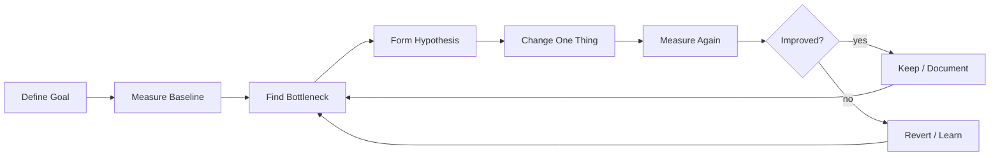

# learn-go-concurrency-parallelism-part-027.md

# Part 027 — Performance Engineering for Concurrent Go: Benchmarking, Profiling, Load, Contention, and Evidence-Based Optimization

> Target pembaca: Java software engineer yang ingin naik level dari “membuat concurrent code berjalan” menjadi “membuktikan concurrent code cepat, stabil, scalable, dan efisien di production.”
>
> Fokus part ini: performance engineering method, benchmark design, `go test -bench`, `benchmem`, pprof CPU/heap/block/mutex, runtime trace, load testing, scalability curves, latency decomposition, queueing, contention, GC pressure, scheduler overhead, tail latency, and optimization playbooks.

---

## 0. Posisi Part Ini dalam Seri

Sebelumnya:

- Part 003: scheduler.
- Part 004: GOMAXPROCS/container CPU.
- Part 013: worker pools.
- Part 015: backpressure.
- Part 022: parallel CPU work.
- Part 023: memory/GC.
- Part 024–025: race/testing.
- Part 026: observability.

Part ini menjawab pertanyaan:

> Bagaimana mengoptimalkan concurrent Go system secara ilmiah, bukan berdasarkan feeling?

Performance engineering bukan:
- menambah goroutine,
- mengganti semua mutex dengan atomic,
- memperbesar buffer,
- menaikkan pool size,
- menambah pod,
- memakai `sync.Pool` di mana-mana,
- menghapus defer tanpa profiling,
- menebak bottleneck.

Performance engineering adalah proses:



---

## 1. Tujuan Pembelajaran

Setelah part ini, Anda harus mampu:

1. Mendefinisikan performance goal yang jelas:
   - throughput,
   - latency,
   - p99,
   - CPU,
   - memory,
   - cost,
   - goodput,
   - stability.
2. Mendesain benchmark yang valid.
3. Menggunakan:
   - `go test -bench`,
   - `-benchmem`,
   - CPU profile,
   - heap profile,
   - block profile,
   - mutex profile,
   - runtime trace.
4. Membedakan:
   - microbenchmark,
   - component benchmark,
   - integration benchmark,
   - load test,
   - soak test,
   - stress test.
5. Membaca scalability curve.
6. Mengidentifikasi bottleneck:
   - CPU,
   - memory,
   - GC,
   - lock contention,
   - channel overhead,
   - DB pool,
   - network dependency,
   - queueing,
   - scheduler latency,
   - OS/container throttling.
7. Menghindari benchmark pitfalls.
8. Mengoptimalkan worker pool/pipeline/concurrent map safely.
9. Menganalisis tail latency.
10. Membuat performance review checklist.

---

## 2. Mental Model: Performance = Work / Time / Resources / Variance

Performance bukan satu angka.

```text
performance = useful work completed
              per unit time
              within resource budget
              with acceptable latency distribution
```

Dimensi:

| Dimension | Question |
|---|---|
| throughput | berapa banyak work selesai per detik? |
| goodput | berapa banyak work sukses dan berguna per detik? |
| latency | berapa lama satu request/job? |
| tail latency | p95/p99/p999 seberapa buruk? |
| CPU | berapa core dipakai? |
| memory | berapa heap/RSS/live set? |
| allocation | berapa bytes/op? |
| GC | berapa CPU/pause/heap pressure? |
| contention | lock/channel wait? |
| saturation | resource mana penuh? |
| stability | apakah performa stabil lama? |
| cost | throughput per CPU/memory/pod? |

Concurrency sering menaikkan throughput tetapi memperburuk p99 atau memory.

Top engineer melihat trade-off, bukan hanya rata-rata.

---

## 3. Java Translation

Java performance engineering:
- JMH,
- async-profiler,
- JFR,
- GC logs,
- Micrometer,
- thread dumps,
- Hikari metrics,
- load testing.

Go equivalents:
- `testing.B`,
- `go test -bench`,
- `benchmem`,
- pprof,
- runtime trace,
- runtime metrics,
- goroutine dump,
- DB stats,
- custom metrics.

Difference:
- Go benchmark tooling built-in and lightweight.
- pprof deeply integrated.
- Goroutines make concurrency cheap, so bottleneck often shifts to DB/network/GC/queues.
- You must instrument custom concurrency structures yourself.

---

## 4. Define Performance Goal First

Bad:
```text
Make it faster.
```

Good:
```text
For 500 concurrent users, p99 latency < 250ms, error rate < 0.1%, CPU < 70%, memory RSS < 1GiB, DB pool wait p95 < 10ms.
```

Or:
```text
Batch processor must process 1M records/minute with RSS < 2GiB and no queue age above 30s.
```

Goal types:
- latency-driven,
- throughput-driven,
- cost-driven,
- memory-driven,
- dependency-protection-driven,
- tail-latency-driven,
- startup/shutdown-driven.

Without goal, optimization has no direction.

---

## 5. Baseline Before Optimization

Baseline should capture:
- code version,
- environment,
- CPU quota,
- GOMAXPROCS,
- input size/distribution,
- concurrency level,
- dependency behavior,
- metrics,
- profiles,
- benchmark command.

Record:
```text
commit: abc123
go version: ...
GOMAXPROCS: 4
CPU limit: 4 cores
input: 1M records, p50 size 1KiB, p99 64KiB
workers: 4
throughput: 120k/s
p99: 220ms
alloc: 512 B/op
heap live: 300MiB
```

If you cannot reproduce baseline, you cannot trust improvement.

---

## 6. Microbenchmark

Use `testing.B`.

```go
func BenchmarkNormalize(b *testing.B) {
    input := []byte("some realistic input")

    b.ReportAllocs()
    b.ResetTimer()

    for i := 0; i < b.N; i++ {
        _ = Normalize(input)
    }
}
```

Run:

```bash
go test -bench=BenchmarkNormalize -benchmem ./...
```

Microbenchmark is good for:
- pure functions,
- allocation comparison,
- hot parser/encoder,
- lock-free vs lock,
- map vs slice,
- buffer reuse.

Microbenchmark is bad for:
- full service latency,
- DB/network,
- scheduler behavior under real load,
- queueing/backpressure.

---

## 7. Prevent Compiler Elimination

If result unused, compiler may optimize away work.

Use package-level sink:

```go
var sink any

func BenchmarkX(b *testing.B) {
    var result Result

    for i := 0; i < b.N; i++ {
        result = Work()
    }

    sink = result
}
```

For bytes/int:
```go
var sinkInt int
```

Be careful not to make sink overhead dominate.

---

## 8. Benchmark Realistic Inputs

Bad:
```go
input := []byte("hello")
```

for parser used on 50KiB payloads.

Use:
- p50 input,
- p95 input,
- p99 input,
- malformed input,
- adversarial input,
- realistic distribution.

Subbenchmarks:

```go
func BenchmarkParse(b *testing.B) {
    for _, size := range []int{128, 1024, 64 * 1024} {
        b.Run(fmt.Sprintf("size=%d", size), func(b *testing.B) {
            input := generate(size)

            b.ReportAllocs()
            b.ResetTimer()

            for i := 0; i < b.N; i++ {
                sink = Parse(input)
            }
        })
    }
}
```

---

## 9. Parallel Benchmark

`b.RunParallel` runs benchmark body in parallel.

```go
func BenchmarkCacheGetParallel(b *testing.B) {
    cache := NewCache()
    cache.Set("k", "v")

    b.ReportAllocs()
    b.ResetTimer()

    b.RunParallel(func(pb *testing.PB) {
        for pb.Next() {
            _, _ = cache.Get("k")
        }
    })
}
```

Use for:
- concurrent cache/map,
- lock contention,
- atomic counters,
- object pool,
- serializer under parallel load.

Caution:
- `RunParallel` concurrency depends on GOMAXPROCS.
- It may not match production request distribution.
- Still useful for contention comparison.

---

## 10. Worker Count Benchmark

For CPU or worker pools:

```go
func BenchmarkWorkers(b *testing.B) {
    input := generateInput()

    for _, workers := range []int{1, 2, 4, 8, 16, 32} {
        b.Run(fmt.Sprintf("workers=%d", workers), func(b *testing.B) {
            b.ReportAllocs()

            for i := 0; i < b.N; i++ {
                _ = ProcessParallel(input, workers)
            }
        })
    }
}
```

Look for:
- speedup plateau,
- regression beyond CPU count,
- allocation increase,
- p99 if measured externally.

---

## 11. Component Benchmark

Benchmark a worker pool/pipeline component with fake dependency.

Example:
- stage parse CPU,
- stage enrich fake 10ms latency,
- stage persist fake DB.

Component benchmark helps find:
- queue overhead,
- stage imbalance,
- worker count effect,
- backpressure behavior.

Use fake dependency with controlled latency, not random real network.

---

## 12. Load Test

Load test measures service under realistic concurrency.

Tools can vary, but goal:
- concurrent clients,
- request rate,
- realistic payload,
- duration,
- ramp-up,
- steady-state,
- error classification.

Record:
- p50/p95/p99,
- throughput/goodput,
- error/rejection/cancel,
- CPU/memory,
- goroutine count,
- queue depth/age,
- DB pool wait,
- dependency latency,
- GC metrics.

Load test is where queueing and tail latency appear.

---

## 13. Stress Test vs Load Test vs Soak Test

| Test | Purpose |
|---|---|
| load test | expected production load |
| stress test | find breaking point |
| spike test | sudden burst |
| soak test | long-duration stability/leaks |
| capacity test | max sustainable throughput |
| regression benchmark | compare code versions |

Concurrency bugs often appear in:
- spike,
- soak,
- shutdown during load,
- dependency slowdown,
- retry storm,
- queue full.

---

## 14. Scalability Curve

Test throughput vs concurrency/workers.

```text
workers:     1   2   4   8   16  32
throughput: 100 190 350 520 530 480
p99:        10  15  25  60  180 400
```

Interpretation:
- throughput plateaus after 8.
- p99 worsens after 8.
- optimal maybe 4–8.

Do not choose highest throughput if p99 unacceptable.

---

## 15. Amdahl's Law

If only part of work parallelizes, speedup is limited.

```text
speedup <= 1 / (serial_fraction + parallel_fraction/workers)
```

If 20% serial:
- max speedup = 5x no matter workers.

Serial parts:
- single global lock,
- one DB transaction,
- merge/reduce,
- output writer,
- cache lock,
- GC,
- queue admission,
- one slow dependency.

Find serial bottleneck before adding workers.

---

## 16. Little’s Law in Performance

```text
L = λ × W
```

If request rate λ increases and latency W increases, in-flight L grows.

Performance tuning often reduces W or caps L.

Use to reason:
- max in-flight,
- queue capacity,
- worker count,
- concurrency limits,
- memory.

If p99 latency high due to queue wait, more queue capacity worsens W.

---

## 17. CPU Profiling

Command:

```bash
go test -bench=BenchmarkX -cpuprofile cpu.out
go tool pprof cpu.out
```

Server:
- capture 30s CPU profile under load.

Look for:
- user functions,
- `runtime.mallocgc`,
- `runtime.scanobject`,
- `runtime.selectgo`,
- `sync.(*Mutex).Lock`,
- serialization/parsing,
- crypto/compression,
- logging.

If CPU profile hot in:
- user function: optimize algorithm.
- mallocgc: reduce allocations.
- channel/select: increase granularity/reduce channel use.
- mutex: reduce contention.
- GC: reduce allocation/live heap.

---

## 18. Heap and Allocation Profiling

Memory profile:

```bash
go test -bench=BenchmarkX -benchmem -memprofile mem.out
go tool pprof mem.out
```

Use:
- `alloc_space`: allocation churn.
- `inuse_space`: retained memory.

Questions:
- What allocates most?
- What remains live?
- Is queue retaining?
- Is cache bounded?
- Are goroutines retaining?
- Are buffers too large?

---

## 19. Block Profile

Enable:

```go
runtime.SetBlockProfileRate(1)
```

Use under load to see blocking:
- channel send,
- channel receive,
- select,
- cond wait.

If block profile points to queue send:
- downstream slow,
- queue full,
- missing backpressure policy.

If many receive waits:
- workers idle,
- upstream slow,
- overprovisioned workers.

---

## 20. Mutex Profile

Enable:

```go
runtime.SetMutexProfileFraction(1)
```

Use to find:
- hot global locks,
- critical sections too long,
- map/cache contention,
- logger/metrics lock.

Optimization:
- reduce lock hold,
- move IO out,
- snapshot,
- sharding,
- local aggregation,
- atomic if invariant simple.

---

## 21. Runtime Trace

Use when needing timeline:
```bash
go test -run TestX -trace trace.out
go tool trace trace.out
```

Trace reveals:
- goroutine runnable but not running,
- blocking/unblocking,
- GC timeline,
- network/syscall,
- CPU utilization across Ps,
- scheduler overhead.

Useful for:
- pipeline stalls,
- unexpected blocking,
- worker imbalance,
- scheduler latency,
- timer behavior.

---

## 22. Tail Latency Analysis

p99 often comes from:
- queue wait,
- lock wait,
- DB pool wait,
- retry,
- GC,
- scheduler delay,
- slow dependency,
- head-of-line blocking,
- large payload,
- noisy neighbor.

Break latency into spans:
```text
total = admission + queue_wait + processing + dependency + response_write
```

If you only measure total, you cannot tune.

---

## 23. Queueing and Tail Latency

As utilization approaches 100%, queueing delay grows nonlinearly.

A worker pool at 95% utilization may have terrible p99.

Rule:
- keep headroom.
- monitor queue age.
- shed before saturation.
- avoid huge buffers.

More queue capacity:
- may reduce rejection,
- but increases latency and memory.

---

## 24. Contention Analysis

Contention symptoms:
- CPU not scaling with workers,
- p99 worsens with workers,
- mutex/block profile hot,
- high atomic contention,
- shared map/cache lock,
- global logger/metrics lock,
- memory allocator contention.

Fix:
- partition work,
- reduce shared state,
- local accumulation,
- sharded structures,
- immutable snapshots,
- per-worker buffers,
- batch updates.

---

## 25. Channel Overhead Analysis

Channels are excellent coordination tools, but not free.

If item work is tiny and every item passes through many channels:
- overhead can dominate.

Optimizations:
- batch items,
- send ranges/chunks,
- fuse stages,
- static partition,
- reduce stage count,
- use direct function call for simple flow.

Do not optimize away channels if they express needed backpressure/lifecycle.

---

## 26. GC Performance

GC-related signals:
- high allocation rate,
- high live heap,
- frequent GC,
- GC CPU fraction high,
- latency correlated with GC,
- heap goal near memory limit.

Fix:
- reduce allocations,
- reduce live set,
- bound queues/caches,
- avoid retaining large objects,
- use pooling carefully,
- use streaming,
- tune memory limit/GOGC only after code-level review.

Do not use GC tuning as first response to unbounded queue.

---

## 27. Scheduler Performance

Symptoms:
- many runnable goroutines,
- CPU saturated,
- scheduler latency,
- goroutine count huge,
- tiny tasks.

Fix:
- reduce goroutine count,
- chunk work,
- bound concurrency,
- avoid goroutine per item,
- use worker pools,
- reduce blocking/retry storms.

---

## 28. Container and OS Effects

Performance in container can differ:
- CPU quota,
- throttling,
- memory limit,
- noisy neighbor,
- cgroup accounting,
- network overlay,
- DNS,
- file system.

Benchmark in environment close to production.

Record:
- CPU request/limit,
- memory limit,
- GOMAXPROCS,
- pod replicas,
- DB/dependency distance,
- kernel/container runtime if relevant.

---

## 29. Dependency Bottleneck

If downstream is bottleneck:
- local CPU optimization may not help.
- more concurrency may hurt.
- need bulkhead/rate limit/cache/batch/degrade.

Evidence:
- dependency latency high,
- in-flight dependency high,
- semaphore wait high,
- DB pool wait high,
- queue age grows before dependency stage.

Optimization:
- reduce calls,
- batch calls,
- cache,
- singleflight,
- limit concurrency,
- improve query/API,
- use read replica,
- degrade optional path.

---

## 30. Logging Performance

Logs can be bottleneck:
- synchronous writes,
- JSON encoding allocations,
- lock contention,
- huge fields,
- logging per item.

Performance policy:
- structured logs for lifecycle/events,
- metrics for high-frequency counts,
- sampling for noisy errors,
- avoid payload logs,
- avoid formatting if log level disabled.

Profile before changing logger.

---

## 31. Metrics Overhead

Metrics can create overhead:
- high-cardinality labels,
- per-item histograms,
- locks,
- allocations,
- expensive label construction.

Best practices:
- predefine labels,
- avoid dynamic IDs,
- sample very hot paths if needed,
- batch/local aggregate counters,
- measure overhead if extremely hot.

---

## 32. sync.Pool Performance

`sync.Pool` can reduce allocations but can also:
- retain memory,
- hide ownership bugs,
- add complexity,
- not help if object small,
- be cleared by GC.

Benchmark:
- no pool,
- pool,
- pool with cap discard,
- realistic concurrency.

Use only if:
- allocation is hot,
- object reusable/resettable,
- ownership clear,
- memory retention controlled.

---

## 33. Optimization Order

Recommended order:

1. Define SLO/goal.
2. Measure baseline.
3. Locate bottleneck with metrics/profiles.
4. Fix algorithm/query first.
5. Remove avoidable allocation.
6. Reduce contention.
7. Tune concurrency.
8. Tune queues/backpressure.
9. Tune GC/runtime settings if needed.
10. Validate with load/soak.
11. Document trade-offs.

Do not start with runtime flags.

---

## 34. Case Study 1: More Workers Made It Slower

Symptoms:
- workers 4 → 32.
- throughput similar.
- p99 worse.
- CPU higher.
- DB wait higher.

Root:
- workload DB-bound.
- more workers wait on DB pool.
- queue age grows.

Fix:
- set workers near DB capacity,
- batch queries,
- add DB indexes,
- separate report pool,
- reject earlier.

---

## 35. Case Study 2: Channel Pipeline Too Granular

Pipeline:
- parse -> trim -> normalize -> validate -> map.
Each stage per item via channel.
Item work tiny.

Profile:
- `runtime.selectgo`,
- channel send/recv overhead.

Fix:
- fuse cheap stages,
- batch items,
- keep channel boundary around expensive/backpressure stage.

---

## 36. Case Study 3: Global Cache Lock

Symptoms:
- high p99 on cache get.
- mutex profile hot.
- CPU moderate.

Fix options:
- atomic snapshot for read-mostly,
- sharded map,
- reduce lock hold,
- avoid callback under lock,
- singleflight for misses.

Measure each.

---

## 37. Case Study 4: Allocation-Dominated Parser

CPU profile:
- `runtime.mallocgc` hot.
- `benchmem` high bytes/op.

Fix:
- preallocate output,
- avoid string/byte conversions,
- reuse scratch per worker,
- reduce reflection,
- stream parse.

Throughput improves and GC drops.

---

## 38. Case Study 5: p99 Spike from Queueing

Average latency fine, p99 bad.
Queue depth spikes during bursts.
Oldest age high.

Fix:
- smaller queue,
- bounded wait admission,
- load shedding,
- more workers only if downstream capacity available,
- optimize stage bottleneck.

---

## 39. Anti-Pattern Catalog

### 39.1 Optimizing Without Baseline

No proof.

### 39.2 Measuring Only Average

p99 may be broken.

### 39.3 Adding Goroutines to DB-Bound Work

Overloads DB/pool.

### 39.4 Huge Buffers to Improve Throughput

Hides backpressure, worsens latency/memory.

### 39.5 Microbenchmark as Production Proof

Ignores queueing/dependencies.

### 39.6 No `benchmem`

Allocation bottleneck missed.

### 39.7 Ignoring Profiles

Optimization by superstition.

### 39.8 Changing Multiple Things at Once

Cannot attribute improvement.

### 39.9 Tuning GC Before Fixing Retention

Treating symptom.

### 39.10 Benchmarking on Laptop Only

Container/prod differs.

### 39.11 Throughput Increase with Goodput Drop

Retry storm hidden.

### 39.12 Removing Safety for Speed

Race/leak introduced.

---

## 40. Performance Review Checklist

1. What is the performance goal?
2. What is the baseline?
3. Is workload realistic?
4. Is environment representative?
5. Is GOMAXPROCS recorded?
6. Are CPU/memory limits recorded?
7. Are p50/p95/p99 measured?
8. Is goodput measured?
9. Are errors/rejections measured?
10. Are queue depth and age measured?
11. Are worker counts varied?
12. Is DB/dependency wait measured?
13. Is CPU profile collected?
14. Is heap profile collected?
15. Is `benchmem` used?
16. Is block/mutex profile needed?
17. Is runtime trace needed?
18. Is bottleneck identified?
19. Is one change made at a time?
20. Is improvement statistically meaningful?
21. Did p99 improve or worsen?
22. Did memory/GC improve or worsen?
23. Did error/retry rate change?
24. Did correctness tests still pass with race detector?
25. Is complexity justified?
26. Is rollback possible?
27. Is the trade-off documented?
28. Is production observability updated?
29. Is capacity limit documented?
30. Is there a regression benchmark/load test?

---

## 41. Mini Lab 1: Benchmark Worker Counts

Create CPU-bound workload.
Benchmark workers:
- 1,
- 2,
- 4,
- 8,
- 16,
- 32.

Plot/record:
- ns/op,
- allocs/op,
- speedup,
- p99 if load tested.

Explain plateau.

---

## 42. Mini Lab 2: Channel Granularity

Implement:
1. pipeline with channel per tiny stage,
2. fused function,
3. batched pipeline.

Benchmark and profile.
Identify channel overhead.

---

## 43. Mini Lab 3: Mutex Contention Optimization

Implement global locked map counter.
Benchmark with `RunParallel`.
Then:
- sharded map,
- local aggregation,
- atomic counter if applicable.

Compare mutex profile.

---

## 44. Mini Lab 4: Allocation Reduction

Benchmark parser/transformer with `benchmem`.
Optimize:
- preallocation,
- scratch buffer,
- avoid conversions.

Collect CPU + heap profile before/after.

---

## 45. Mini Lab 5: Load Test Backpressure

Build HTTP endpoint with worker queue.
Run load:
- queue capacity small vs huge,
- fail-fast vs bounded wait.

Measure:
- p99,
- rejection,
- memory,
- goodput,
- queue age.

Explain trade-off.

---

## 46. Mini Lab 6: Dependency Bottleneck

Fake downstream latency 100ms.
Test local concurrency:
- 10,
- 50,
- 100,
- 500.

Observe:
- in-flight,
- latency,
- goodput,
- timeout,
- memory.

Add bulkhead and retry policy.

---

## 47. Top 1% Heuristics

1. Measure before optimizing.
2. Optimize bottleneck, not code you dislike.
3. Throughput without p99 is incomplete.
4. Goodput matters during overload.
5. Queue age reveals hidden latency.
6. Worker count is a capacity decision.
7. Channels are for coordination, not free per-item transport.
8. Locks are fine until measured contention says otherwise.
9. Allocations are performance bugs only when hot or retained.
10. More goroutines can reduce performance.
11. DB/network bottlenecks need backpressure, not CPU tuning.
12. Profiles beat opinions.
13. One change at a time.
14. Production-like environment matters.
15. Correctness is part of performance.

---

## 48. Source Notes

Primary Go concepts behind this part:

1. Go benchmarking:
   - `testing.B`,
   - `b.Run`,
   - `b.RunParallel`,
   - `-benchmem`.

2. Go profiling:
   - pprof CPU/heap/block/mutex,
   - runtime trace.

3. Runtime and concurrency:
   - scheduler,
   - GOMAXPROCS,
   - goroutine overhead,
   - GC,
   - allocation.

4. Performance engineering:
   - latency distribution,
   - queueing theory,
   - scalability curves,
   - contention analysis,
   - capacity planning.

---

## 49. Summary

Performance engineering is evidence-driven concurrency design.

The cycle:

1. Define goal.
2. Measure baseline.
3. Find bottleneck.
4. Form hypothesis.
5. Change one thing.
6. Measure again.
7. Validate correctness.
8. Document trade-off.

For concurrent Go systems, always inspect:
- p99,
- goodput,
- queue age,
- worker saturation,
- dependency wait,
- CPU profile,
- heap/allocation,
- block/mutex profile,
- runtime metrics.

The core rule:

> The fastest concurrent code is not the code with the most goroutines. It is the code that does the least unnecessary work while keeping the real bottleneck efficiently utilized.

---

## 50. Status Seri

Selesai:
- Part 000 — Orientation
- Part 001 — Foundations
- Part 002 — Goroutine Internals
- Part 003 — Go Scheduler Deep Dive
- Part 004 — GOMAXPROCS, CPU Quotas, Containers
- Part 005 — Go Memory Model
- Part 006 — Synchronization Primitives
- Part 007 — Atomic Operations
- Part 008 — Channels Deep Dive
- Part 009 — Select Semantics
- Part 010 — WaitGroup, ErrGroup, Task Groups, and Structured Concurrency
- Part 011 — Context as Concurrency Contract
- Part 012 — Ownership Models
- Part 013 — Worker Pools
- Part 014 — Fan-Out/Fan-In, Pipelines, Stages, and Stream Processing
- Part 015 — Backpressure End-to-End
- Part 016 — Semaphores, Rate Limiters, Token Buckets, and Bulkheads
- Part 017 — Concurrent Data Structures
- Part 018 — Singleflight, Deduplication, Idempotency, and Stampede Prevention
- Part 019 — Timers, Tickers, Deadlines, Scheduling, and Time-Based Concurrency
- Part 020 — Network Concurrency
- Part 021 — Database Concurrency
- Part 022 — Parallel CPU Work
- Part 023 — Memory, Allocation, GC, and Concurrency Pressure
- Part 024 — Race Detection, Static Analysis, and Concurrency Bug Hunting
- Part 025 — Testing Concurrent Code
- Part 026 — Observability for Concurrent Systems
- Part 027 — Performance Engineering for Concurrent Go

Belum selesai:
- Part 028 sampai Part 034.

Seri belum mencapai bagian terakhir.


<!-- NAVIGATION_FOOTER -->
<div class="page-nav">
<a href="./learn-go-concurrency-parallelism-part-026.md">⬅️ Part 026 — Observability for Concurrent Systems: Metrics, Logs, Traces, Profiles, and Runtime Signals</a>
<a href="./index.md">📚 Kategori</a>
<a href="../../index.md">🏠 Home</a>
<a href="./learn-go-concurrency-parallelism-part-028.md">Part 028 — Failure Modes in Concurrent Go Systems: Deadlocks, Leaks, Starvation, Cascades, and Recovery ➡️</a>
</div>
