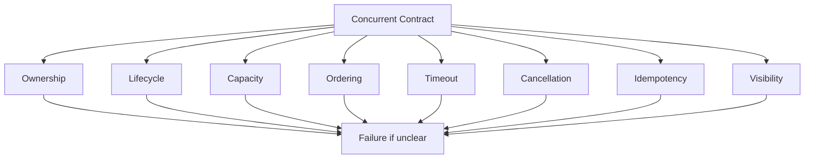
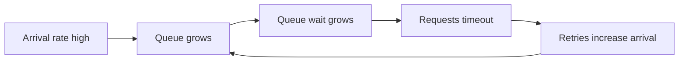

# learn-go-concurrency-parallelism-part-028.md

# Part 028 — Failure Modes in Concurrent Go Systems: Deadlocks, Leaks, Starvation, Cascades, and Recovery

> Target pembaca: Java software engineer yang ingin mampu mengenali, mencegah, dan merespons failure mode concurrency di Go production system.
>
> Fokus part ini: deadlock, goroutine leak, channel leak, memory retention, lock contention, starvation, livelock, retry storm, overload cascade, queue collapse, context misuse, timer/ticker leak, panic handling, shutdown failure, partial failure, split ownership, and recovery patterns.

---

## 0. Posisi Part Ini dalam Seri

Sebelumnya:

- Part 013: worker pools.
- Part 015: backpressure.
- Part 018: singleflight/idempotency.
- Part 019: timers/deadlines.
- Part 020–021: network/database concurrency.
- Part 023: memory pressure.
- Part 024–026: bug hunting/testing/observability.
- Part 027: performance engineering.

Part ini menyatukan semua menjadi satu topik:

> Bagaimana concurrent Go system gagal di production?

Failure mode concurrency sering bukan “program crash langsung”. Lebih sering:

- request makin lambat,
- goroutine count naik,
- queue age naik,
- memory naik,
- retries naik,
- goodput turun,
- CPU rendah tapi latency tinggi,
- shutdown tidak selesai,
- stale work diproses,
- duplicated side effect,
- downstream ikut overload,
- service terlihat hidup tapi tidak berguna.

Top engineer tidak hanya tahu pattern sukses. Ia tahu pola gagal dan cara mendesain guardrail.

---

## 1. Tujuan Pembelajaran

Setelah part ini, Anda harus mampu:

1. Mengenali failure mode utama concurrent Go.
2. Membedakan:
   - deadlock,
   - livelock,
   - starvation,
   - goroutine leak,
   - resource leak,
   - overload,
   - cascade failure,
   - retry storm,
   - logical race,
   - data race.
3. Mendesain prevention:
   - ownership,
   - context,
   - backpressure,
   - deadline,
   - bounded queue,
   - bulkhead,
   - idempotency,
   - circuit breaker,
   - graceful shutdown.
4. Mendesain detection:
   - metrics,
   - logs,
   - traces,
   - pprof,
   - goroutine dumps.
5. Mendesain recovery:
   - cancellation,
   - drain,
   - load shedding,
   - fallback,
   - restart,
   - rollback,
   - circuit open,
   - queue purge.
6. Membuat incident playbook per failure mode.
7. Membuat design review checklist untuk failure resilience.

---

## 2. Mental Model: Failure Mode = Broken Contract

Concurrency failure hampir selalu terjadi karena satu kontrak rusak:



Contoh:
- Ownership broken: siapa close channel? panic send on closed.
- Lifecycle broken: goroutine tidak punya stop path.
- Capacity broken: queue unbounded.
- Ordering broken: lock order inversion.
- Timeout broken: goroutine wait forever.
- Cancellation broken: request selesai tapi work lanjut.
- Idempotency broken: retry menciptakan duplicate payment.
- Visibility broken: no metrics; incident lambat.

---

## 3. Failure Mode Map

| Failure | Primary symptom | Common root |
|---|---|---|
| data race | race detector/panic/corruption | shared mutable state |
| logical race | duplicate/wrong result | compound operation not atomic |
| deadlock | stuck forever | cyclic wait |
| livelock | CPU active, no progress | retry/spin collision |
| starvation | some work never served | unfair scheduling/priority |
| goroutine leak | goroutine count grows | missing cancellation/blocked send |
| memory retention | heap/RSS grows | references retained |
| queue collapse | queue age grows | downstream slower than arrival |
| retry storm | attempts up, goodput down | retries without budget/jitter |
| cascade failure | multiple services degrade | no bulkhead/backpressure |
| timer leak | memory/goroutine growth | ticker/timer lifecycle |
| shutdown failure | SIGTERM timeout | no drain/cancel/wait |
| duplicate side effect | double email/payment | no idempotency |
| stale work | expired jobs processed | no deadline check |
| head-of-line blocking | unrelated work delayed | shared queue/lock/pool |
| lock contention | p99 high | coarse/long lock |

---

## 4. Deadlock

Deadlock: goroutines wait on each other in a cycle and no progress possible.

### 4.1 Channel Deadlock

```go
ch := make(chan int)
ch <- 1 // no receiver
```

In server code, deadlock may be partial, not whole process.

### 4.2 Lock Deadlock

Goroutine A:
```go
muA.Lock()
muB.Lock()
```

Goroutine B:
```go
muB.Lock()
muA.Lock()
```

### 4.3 WaitGroup Deadlock

```go
wg.Add(1)
go func() {
    // forgot Done
}()
wg.Wait()
```

### 4.4 Prevention

- consistent lock order,
- avoid blocking operations under lock,
- defer unlock/done,
- context-aware channel ops,
- owned channel close,
- timeouts for external waits,
- tests for stop/shutdown,
- goroutine dump on incident.

### 4.5 Detection

- goroutine dump,
- block profile,
- stuck tests with timeout,
- p99 infinite/hanging,
- no throughput.

---

## 5. Livelock

Livelock: system actively does work but no useful progress.

Example:
- workers repeatedly retry and conflict.
- distributed workers constantly steal/release same lock.
- CAS loop under contention spins too much.
- circuit half-open probes all collide.

Symptoms:
- CPU high,
- logs busy,
- throughput/goodput low,
- retry count high,
- no actual completion.

Prevention:
- backoff with jitter,
- retry budget,
- randomized election/probe,
- limit CAS retries,
- fallback to mutex,
- circuit breaker.

---

## 6. Starvation

Starvation: some work never gets served.

Examples:
- high-priority queue always full, low-priority never runs.
- one tenant floods global worker pool.
- hot key monopolizes shard.
- long jobs occupy all workers, short jobs wait.
- reader/writer unfairness in design.
- FIFO queue with huge slow job head-of-line blocking.

Prevention:
- fairness policy,
- per-tenant quotas,
- priority aging,
- separate pools,
- shortest-job or class-based queues where appropriate,
- max job duration,
- preemption/cancellation,
- queue age metrics per class.

---

## 7. Goroutine Leak

Goroutine leak: goroutine remains alive beyond intended lifecycle.

Common patterns:

### 7.1 Blocked Send

```go
go func() {
    resultCh <- result // receiver returned
}()
```

Fix:
```go
select {
case resultCh <- result:
case <-ctx.Done():
}
```

or buffered result channel size 1.

### 7.2 Missing Context in Loop

```go
for msg := range ch {
    process(msg)
}
```

If `ch` never closes, goroutine lives forever.

Fix:
```go
for {
    select {
    case msg, ok := <-ch:
        if !ok { return }
        process(msg)
    case <-ctx.Done():
        return
    }
}
```

### 7.3 Ticker Loop Without Stop

```go
ticker := time.NewTicker(time.Second)
go func() {
    for range ticker.C {
        work()
    }
}()
```

No stop path.

### 7.4 Detection

- goroutine count trend,
- goroutine profile,
- heap retention,
- shutdown tests,
- leak tests.

---

## 8. Memory Retention Failure

Concurrency often retains memory accidentally:

- blocked goroutine captures request payload,
- queued job holds large body,
- channel buffer stores pointers,
- small subslice retains huge array,
- cache unbounded,
- sync.Pool keeps huge buffers,
- timer callback captures large object.

Symptoms:
- RSS/heap grows,
- GC CPU rises,
- goroutine count may also rise,
- p99 worsens,
- OOMKill.

Prevention:
- bounded queues,
- memory budgets,
- body limits,
- copy small slices when retaining,
- zero queue slots,
- cap pooled buffers,
- clear ownership.

---

## 9. Queue Collapse

Queue collapse happens when arrival rate > service rate for long enough.



Symptoms:
- queue depth high,
- oldest age high,
- latency high,
- timeout high,
- retry high,
- goodput flat/down,
- memory grows.

Prevention:
- bounded queue,
- admission control,
- queue deadline/expiration,
- load shedding,
- bulkhead,
- autoscaling only if bottleneck scalable,
- backpressure to caller.

Important:
- Bigger queue is not always better.
- It may convert rejection into timeout and memory pressure.

---

## 10. Retry Storm

Retry storm: failures cause clients/workers to retry, increasing load, causing more failures.

Bad retry:
- immediate retry,
- no jitter,
- no max attempts,
- no deadline,
- no retry budget,
- retries non-idempotent operations,
- every layer retries.

Prevention:
- exponential backoff with jitter,
- retry budget,
- respect Retry-After,
- circuit breaker,
- idempotency key,
- classify retryable errors,
- limit retries per dependency,
- stop retry when context nearly expired.

Detection:
- attempts up,
- success goodput down,
- downstream in-flight up,
- 429/503/timeout up,
- p99 up.

---

## 11. Cascade Failure

Cascade failure: one dependency slows/fails, causing callers to consume resources, causing other systems to fail.

Example:
1. DB slows.
2. App handlers wait longer.
3. In-flight requests grow.
4. Goroutines/memory grow.
5. Clients timeout and retry.
6. DB gets more queries.
7. App queue grows.
8. Other endpoints affected.

Prevention:
- timeouts,
- bulkheads,
- per-dependency concurrency limits,
- circuit breaker,
- fallback/degrade optional dependency,
- load shedding,
- cache/singleflight,
- no global shared pool for all work,
- observability per dependency.

---

## 12. Head-of-Line Blocking

One slow work item blocks others.

Examples:
- single FIFO queue for all priorities.
- one global mutex protects unrelated keys.
- one DB pool shared by reports and login.
- one actor goroutine owns too much state.
- one output writer serializes all results.

Prevention:
- partition queues,
- priority/fair queues,
- per-tenant pool,
- sharded locks,
- separate DB pools,
- async export,
- circuit optional slow work.

---

## 13. Context Misuse Failure

### 13.1 Ignoring Request Context

Work continues after client gone.

```go
service.Do(context.Background())
```

### 13.2 Using Request Context for Background Work

Background job cancelled when request ends.

### 13.3 Not Calling Cancel

Timer/resources retained.

### 13.4 Defer Cancel in Long Loop

Cancels delayed until function return.

### 13.5 Cleanup with Cancelled Context

Shutdown cleanup immediately fails.

Prevention:
- clear lifecycle ownership,
- pass ctx down request work,
- background uses service context,
- always cancel,
- fresh bounded context for cleanup.

---

## 14. Timer/Ticker Failure

Common:
- `time.After` in hot loop,
- ticker not stopped,
- timer reset incorrectly,
- `AfterFunc` callback captures state,
- periodic job overlaps,
- retry sleep not cancellation-aware.

Symptoms:
- memory growth,
- goroutine growth,
- duplicate scheduled work,
- slow shutdown,
- drift,
- CPU from excessive timers.

Prevention:
- explicit timer owner,
- stop ticker,
- reset helper,
- bounded periodic job,
- context-aware sleep,
- fake clock tests.

---

## 15. Lock Contention Failure

Not a correctness failure, but performance failure.

Symptoms:
- p99 high,
- CPU not scaling,
- mutex profile hot,
- goroutine dump waiting on mutex,
- throughput plateau.

Root:
- coarse lock,
- lock held during IO,
- callback under lock,
- global map/cache,
- logging/metrics lock,
- RWMutex misuse,
- hot key shard.

Fix:
- reduce critical section,
- move IO out,
- sharding,
- local aggregation,
- immutable snapshot,
- atomic if simple invariant,
- redesign ownership.

---

## 16. Channel Stall Failure

Symptoms:
- goroutine dump many `chan send` or `chan receive`,
- pipeline stops,
- queue full,
- context cancellation not propagated,
- output not drained.

Root:
- downstream returned early,
- sender unaware of cancellation,
- receiver waiting for close that never happens,
- channel close ownership unclear,
- nil channel state machine bug.

Fix:
- context-aware send/receive,
- close by owner,
- errgroup-managed pipeline,
- drain/cancel policy,
- stage metrics.

---

## 17. Panic Failure

Panic in goroutine:
- can crash process if unrecovered,
- or silently kill worker if recovered badly,
- or leave WaitGroup/channel state inconsistent.

Worker panic policy:
1. Crash process.
2. Recover and mark job failed.
3. Recover, restart worker, increment metric.
4. Recover only at process/request boundary.

If recovering:
- `defer wg.Done()`,
- release semaphore,
- close resources,
- record panic,
- avoid hiding programmer bugs silently.

---

## 18. Shutdown Failure

Symptoms:
- pod killed before graceful shutdown,
- in-flight jobs lost,
- process hangs,
- server shutdown returns context deadline,
- background goroutines keep running,
- jobs duplicated after restart.

Causes:
- no Stop/Wait,
- blocked goroutines ignore context,
- server uses cancelled context for shutdown,
- workers do not drain/cancel,
- DB/network calls no timeout,
- channel close panic,
- outbox/queue leases not handled.

Prevention:
- graceful shutdown design:
  1. stop accepting,
  2. signal cancellation,
  3. drain or cancel according policy,
  4. wait with deadline,
  5. release resources,
  6. mark unfinished jobs retryable.

---

## 19. Duplicate Side Effect Failure

Examples:
- duplicate payment,
- duplicate email,
- duplicate order,
- duplicate event,
- duplicate external API call.

Causes:
- retry non-idempotent operation,
- at-least-once message without dedup,
- transaction retry includes side effect,
- timeout after side effect succeeded,
- multiple pods process same job,
- singleflight used instead of durable idempotency.

Prevention:
- idempotency key,
- unique constraint,
- outbox/inbox,
- dedup store,
- external provider idempotency,
- side effect after commit via outbox,
- retry whole transaction only if pure DB/idempotent.

---

## 20. Stale Work Failure

Work processed after it is no longer useful.

Examples:
- request job queued after client timeout,
- scheduled task runs too late,
- cache refresh updates with old data,
- delayed retry overwrites newer state,
- queue accumulates old events.

Prevention:
- job deadline,
- queue age check,
- version check,
- compare-and-swap,
- idempotency/versioning,
- drop expired,
- stale metrics.

---

## 21. Partial Failure

In distributed systems, some dependencies fail while others work.

Bad:
- one optional dependency failure fails entire request.
- one slow recommendation API consumes all workers.
- one tenant overload impacts all tenants.

Prevention:
- optional fallback,
- per-dependency bulkhead,
- per-tenant limit,
- partial response policy,
- circuit breaker,
- graceful degradation.

---

## 22. Split Ownership Failure

When two components think they own same lifecycle.

Examples:
- both sender and receiver close channel.
- both parent and child stop worker.
- both cache and caller return buffer to pool.
- both service and request context cancel background job.
- both retry layer and caller retry same operation.

Prevention:
- document ownership,
- API shape encodes ownership,
- one closer,
- one owner of returned buffer,
- one retry layer per boundary,
- one shutdown coordinator.

---

## 23. Failure Detection Matrix

| Failure | Best detection |
|---|---|
| data race | race detector |
| logical race | invariant tests/code review |
| goroutine leak | goroutine count/profile |
| memory retention | heap profile |
| lock contention | mutex profile |
| channel stall | goroutine/block profile |
| retry storm | attempts vs goodput |
| queue collapse | queue age/depth |
| DB pool saturation | DB stats wait |
| shutdown failure | shutdown test/log |
| duplicate side effect | idempotency metrics/audit |
| stale work | queue age/deadline metrics |
| timer leak | heap/goroutine/timer code review |

---

## 24. Recovery Pattern: Load Shedding

When overloaded, reject early.

Examples:
- 429 Too Many Requests,
- 503 Service Unavailable,
- queue full error,
- drop optional work,
- disconnect slow client.

Good load shedding:
- explicit reason,
- metrics,
- retry-after if appropriate,
- protects core dependencies,
- avoids timeouts and OOM.

Bad:
- accept everything and let it timeout.

---

## 25. Recovery Pattern: Circuit Breaker

Circuit breaker prevents repeated calls to failing dependency.

States:
- closed,
- open,
- half-open.

Use for:
- downstream outage,
- timeout storm,
- failing optional service.

Caution:
- not replacement for timeout/bulkhead.
- half-open probes need limit/jitter.
- state must be observable.
- fallback policy needed.

---

## 26. Recovery Pattern: Bulkhead

Bulkhead isolates failure.

Examples:
- separate worker pool per dependency,
- separate DB pool/report pool,
- per-route concurrency,
- per-tenant limit,
- per-priority queue.

Goal:
- recommendation API failure does not kill login.
- report export does not starve checkout.

---

## 27. Recovery Pattern: Idempotency

Use when operation may repeat.

- HTTP idempotency key,
- DB unique constraint,
- message processed table,
- outbox/inbox,
- external provider key.

Idempotency is not just retry helper. It is correctness boundary.

---

## 28. Recovery Pattern: Graceful Degradation

If optional part fails:
- return partial result,
- use stale cache,
- skip recommendations,
- reduce precision,
- async later,
- default config.

Need:
- product decision,
- API contract,
- metrics,
- trace/log event.

---

## 29. Recovery Pattern: Supervisor

For long-running background workers:
- monitor worker exit,
- restart if policy allows,
- stop on context,
- backoff restart,
- panic metric,
- avoid infinite crash loop.

Do not blindly restart if bug corrupts state. Some panics should crash process.

---

## 30. Recovery Pattern: Queue Purge / Expire

If queue contains stale work:
- expire by deadline,
- purge low-priority,
- drop oldest,
- reject new,
- drain to DLQ,
- snapshot for audit if required.

Policy must be explicit before incident.

---

## 31. Incident Playbook: Overload Cascade

1. Check goodput vs attempts.
2. Check queue age/depth.
3. Check dependency latency.
4. Check retries.
5. Check DB/HTTP pool wait.
6. Check CPU/memory/goroutines.
7. Identify bottleneck.
8. Mitigate:
   - shed load,
   - open circuit,
   - disable optional path,
   - reduce retry,
   - reduce concurrency to dependency,
   - scale only if bottleneck scalable.
9. Follow-up:
   - add guardrail,
   - tune capacity,
   - add alert,
   - improve fallback.

---

## 32. Incident Playbook: Shutdown Failure

1. Inspect shutdown logs.
2. Capture goroutine dump before kill if possible.
3. Identify goroutines blocking shutdown.
4. Check:
   - server shutdown context,
   - worker Stop,
   - DB/HTTP calls with deadlines,
   - channel close,
   - WaitGroup.
5. Fix:
   - service-level ctx,
   - Stop/Wait API,
   - drain/cancel policy,
   - fresh shutdown ctx,
   - deadlines in blocking ops.

---

## 33. Incident Playbook: Duplicate Side Effect

1. Identify operation and duplicate key.
2. Determine trigger:
   - client retry,
   - server retry,
   - message redelivery,
   - timeout,
   - transaction retry.
3. Check idempotency record/unique constraints.
4. Stop duplicate path:
   - disable retry,
   - circuit,
   - dedup hotfix,
   - manual reconciliation.
5. Permanent fix:
   - idempotency key,
   - outbox/inbox,
   - request hash,
   - exactly-once illusion removal.

---

## 34. Incident Playbook: Stale Queue

1. Check oldest age.
2. Compare to job usefulness deadline.
3. Stop accepting if needed.
4. Expire stale jobs.
5. Increase workers only if downstream capacity exists.
6. Add deadline check before processing.
7. Add queue age alert.

---

## 35. Design for Failure

Ask for every concurrent subsystem:

1. What if producer is faster than consumer?
2. What if consumer exits early?
3. What if dependency is slow?
4. What if dependency fails?
5. What if caller cancels?
6. What if shutdown happens mid-work?
7. What if retry repeats operation?
8. What if queue is full?
9. What if work is stale?
10. What if worker panics?
11. What if lock is contended?
12. What if map/cache grows forever?
13. What if one tenant floods?
14. What if one key is hot?
15. What if pod is killed?

---

## 36. Anti-Pattern Catalog

### 36.1 “It Probably Won’t Happen”

It will under load.

### 36.2 Unbounded Everything

Unbounded queue/goroutine/cache/retry.

### 36.3 Timeout Without Cancellation Propagation

Only caller stops waiting; work continues.

### 36.4 Retry Without Idempotency

Duplicate side effect.

### 36.5 One Global Pool for All Work

Cascade and head-of-line blocking.

### 36.6 Close Channel from Multiple Places

Panic race.

### 36.7 Recover Panic and Continue Silently

Corruption hidden.

### 36.8 No Queue Age Metric

Stale work invisible.

### 36.9 Shutdown Not Tested

Production discovers lifecycle bugs.

### 36.10 Bigger Queue as Default Fix

Latency/memory worse.

### 36.11 Circuit Breaker Without Bulkhead

Calls may still pile up.

### 36.12 Autoscale Without Bottleneck Analysis

More pods can overload DB.

---

## 37. Design Review Checklist

1. Is every queue bounded?
2. Is every goroutine owned?
3. Is every goroutine stoppable?
4. Is every channel close owner clear?
5. Are sends/receives cancellation-aware where needed?
6. Are deadlines propagated?
7. Are queued jobs expired if stale?
8. Are retries bounded and jittered?
9. Are retried operations idempotent?
10. Are side effects protected by idempotency/outbox?
11. Are dependencies bulkheaded?
12. Are optional dependencies degradable?
13. Are per-tenant/per-key hot spots controlled?
14. Are locks ordered consistently?
15. Is IO avoided under lock?
16. Are caches bounded?
17. Are buffers ownership-safe?
18. Are timers/tickers stopped?
19. Is shutdown drain/cancel policy explicit?
20. Are worker panics handled by policy?
21. Are metrics for saturation/rejection/goodput present?
22. Are goroutine/memory/runtime metrics present?
23. Are failure mode tests present?
24. Are stress/race tests present?
25. Are incident playbooks documented?
26. Are overload mitigations available at runtime?
27. Are capacity assumptions documented?
28. Are downstream limits known?
29. Are retries coordinated across layers?
30. Is partial failure behavior defined?

---

## 38. Mini Lab 1: Goroutine Leak Failure

Build function that leaks on early return.
Detect with goroutine dump/test.
Fix with context-aware send.

---

## 39. Mini Lab 2: Queue Collapse Simulation

Create:
- producer faster than consumer,
- bounded queue,
- huge queue variant,
- fail-fast variant.

Measure:
- queue depth,
- oldest age,
- memory,
- success,
- timeout.

Explain why huge queue is dangerous.

---

## 40. Mini Lab 3: Retry Storm Simulation

Fake dependency fails for 10s.
Clients retry:
1. immediate no jitter,
2. exponential+jitter,
3. circuit breaker.

Compare attempts/goodput.

---

## 41. Mini Lab 4: Deadlock by Lock Order

Create two locks acquired in opposite order.
Reproduce with test and timeout.
Fix with ordered lock acquisition.

---

## 42. Mini Lab 5: Duplicate Side Effect

Simulate transaction retry that sends email inside fn.
Show duplicate email.
Fix with outbox/idempotency.

---

## 43. Mini Lab 6: Shutdown Under Load

Worker pool processing slow jobs.
Trigger shutdown.
Test:
- drain mode,
- cancel mode,
- deadline exceeded,
- no goroutine leak.

---

## 44. Top 1% Heuristics

1. Every unbounded structure is a future incident.
2. Every retry must have idempotency story.
3. Every goroutine must have an owner.
4. Every queue needs capacity, age, and expiry policy.
5. Every dependency needs timeout and bulkhead.
6. Bigger queues convert errors into latency and memory.
7. Client cancellation must stop server work unless intentionally detached.
8. Shutdown is a normal lifecycle, not an afterthought.
9. Goodput reveals retry storms.
10. Queue age reveals collapse before depth alone.
11. Deadlock prevention is mostly ownership and order.
12. Leaks are usually blocked goroutines retaining references.
13. Partial failure should degrade, not cascade.
14. Observability must show where work is waiting.
15. Failure mode thinking is design, not pessimism.

---

## 45. Source Notes

Primary concepts behind this part:

1. Go concurrency failure modes:
   - goroutine leaks,
   - channel stalls,
   - deadlocks,
   - lock contention,
   - timer leaks.

2. Reliability patterns:
   - backpressure,
   - load shedding,
   - bulkheads,
   - circuit breakers,
   - idempotency,
   - graceful shutdown.

3. Production diagnostics:
   - metrics,
   - goroutine dump,
   - block/mutex profiles,
   - heap profiles,
   - traces.

4. Distributed systems:
   - retry storms,
   - cascade failure,
   - partial failure,
   - duplicate side effects.

---

## 46. Summary

Concurrent Go systems fail when contracts are unclear or unbounded:

- unclear ownership,
- missing cancellation,
- unbounded queue,
- retry without budget,
- side effect without idempotency,
- dependency without bulkhead,
- shutdown without lifecycle,
- cache without bounds,
- observability without saturation signals.

The core rule:

> A concurrent design is incomplete until you can explain how it fails and how it recovers.

Failure-mode thinking is what turns concurrency patterns into production engineering.

---

## 47. Status Seri

Selesai:
- Part 000 — Orientation
- Part 001 — Foundations
- Part 002 — Goroutine Internals
- Part 003 — Go Scheduler Deep Dive
- Part 004 — GOMAXPROCS, CPU Quotas, Containers
- Part 005 — Go Memory Model
- Part 006 — Synchronization Primitives
- Part 007 — Atomic Operations
- Part 008 — Channels Deep Dive
- Part 009 — Select Semantics
- Part 010 — WaitGroup, ErrGroup, Task Groups, and Structured Concurrency
- Part 011 — Context as Concurrency Contract
- Part 012 — Ownership Models
- Part 013 — Worker Pools
- Part 014 — Fan-Out/Fan-In, Pipelines, Stages, and Stream Processing
- Part 015 — Backpressure End-to-End
- Part 016 — Semaphores, Rate Limiters, Token Buckets, and Bulkheads
- Part 017 — Concurrent Data Structures
- Part 018 — Singleflight, Deduplication, Idempotency, and Stampede Prevention
- Part 019 — Timers, Tickers, Deadlines, Scheduling, and Time-Based Concurrency
- Part 020 — Network Concurrency
- Part 021 — Database Concurrency
- Part 022 — Parallel CPU Work
- Part 023 — Memory, Allocation, GC, and Concurrency Pressure
- Part 024 — Race Detection, Static Analysis, and Concurrency Bug Hunting
- Part 025 — Testing Concurrent Code
- Part 026 — Observability for Concurrent Systems
- Part 027 — Performance Engineering for Concurrent Go
- Part 028 — Failure Modes in Concurrent Go Systems

Belum selesai:
- Part 029 sampai Part 034.

Seri belum mencapai bagian terakhir.


<!-- NAVIGATION_FOOTER -->
<div class="page-nav">
<a href="./learn-go-concurrency-parallelism-part-027.md">⬅️ Part 027 — Performance Engineering for Concurrent Go: Benchmarking, Profiling, Load, Contention, and Evidence-Based Optimization</a>
<a href="./index.md">📚 Kategori</a>
<a href="../../index.md">🏠 Home</a>
<a href="./learn-go-concurrency-parallelism-part-029.md">Part 029 — Designing Concurrent APIs: Ownership, Lifecycle, Context, Backpressure, and Compatibility ➡️</a>
</div>
