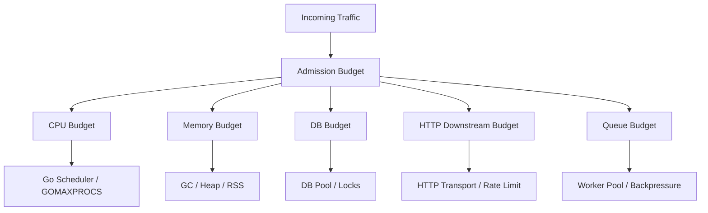
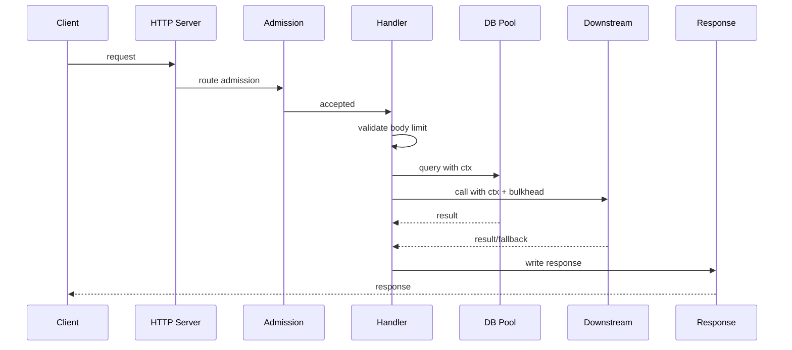
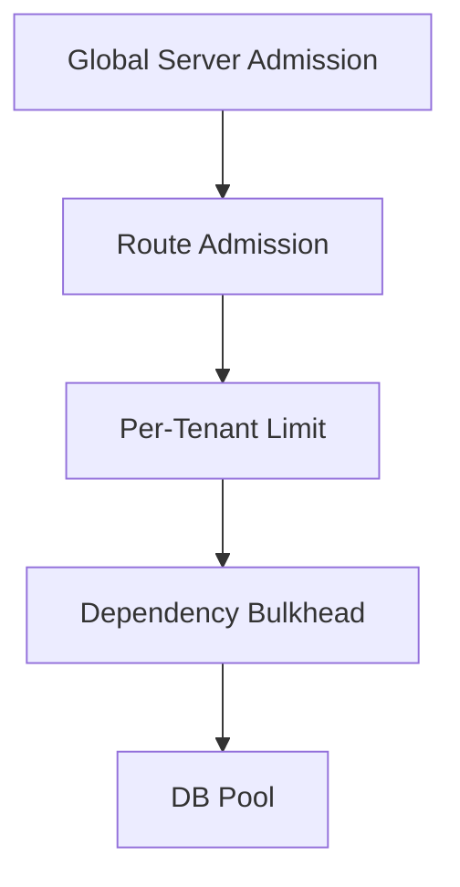
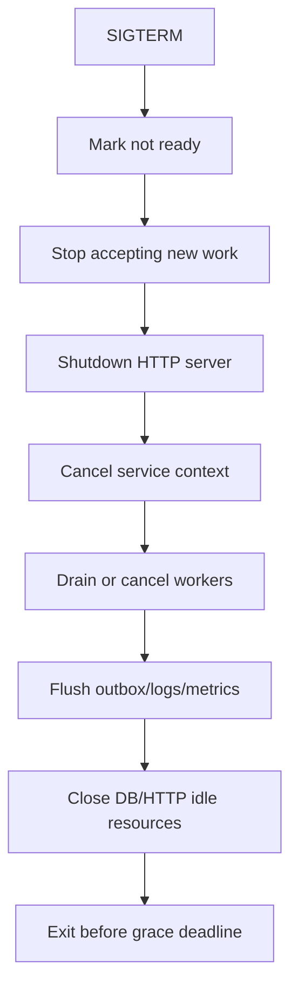
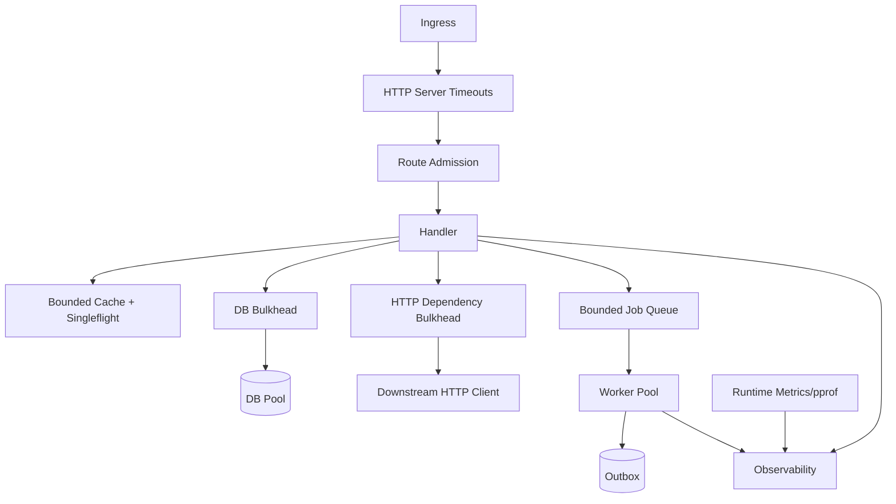

# learn-go-concurrency-parallelism-part-030.md

# Part 030 — Runtime-Aware Service Design: Building Go Services That Cooperate with Scheduler, GC, Containers, and Dependencies

> Target pembaca: Java software engineer yang ingin mampu mendesain Go service production bukan hanya dari sisi business logic, tetapi juga sadar terhadap Go runtime, scheduler, GC, goroutine lifecycle, network/DB pool, CPU quota, memory limit, Kubernetes shutdown, observability, and overload control.
>
> Fokus part ini: runtime-aware architecture, request lifecycle, service lifecycle, concurrency budgets, dependency budgets, CPU/memory budgets, goroutine ownership, backpressure placement, graceful shutdown, Kubernetes integration, runtime metrics, and production design review.

---

## 0. Posisi Part Ini dalam Seri

Sebelumnya:

- Part 003: scheduler.
- Part 004: GOMAXPROCS, CPU quota, containers.
- Part 011: context contract.
- Part 013–016: worker pool, pipeline, backpressure, bulkheads.
- Part 020–021: network/database concurrency.
- Part 023: memory/GC pressure.
- Part 026: observability.
- Part 028: failure modes.
- Part 029: concurrent API design.

Part ini menjawab pertanyaan arsitektural:

> Bagaimana mendesain satu service Go yang secara sadar bekerja bersama runtime dan environment production?

Go membuat goroutine murah, tetapi service production tetap dibatasi oleh:
- CPU quota,
- memory limit,
- file descriptors,
- DB connections,
- HTTP downstream capacity,
- queue capacity,
- GC budget,
- scheduler,
- pod lifecycle,
- load balancer timeouts,
- Kubernetes termination grace period,
- external API rate limits.

Runtime-aware service design berarti:

1. Menentukan concurrency budget.
2. Menentukan memory budget.
3. Menentukan dependency budget.
4. Menentukan lifecycle.
5. Menentukan overload behavior.
6. Menentukan observability.
7. Menentukan shutdown behavior.
8. Menentukan test/load validation.

---

## 1. Tujuan Pembelajaran

Setelah part ini, Anda harus mampu:

1. Mendesain request lifecycle Go service secara end-to-end.
2. Menghubungkan HTTP/gRPC handler dengan context, worker pool, DB, downstream, cache, dan shutdown.
3. Menentukan concurrency budget per route/dependency.
4. Menentukan memory budget dari in-flight work/queue/cache.
5. Menentukan DB/HTTP pool settings berdasarkan pod count dan dependency capacity.
6. Menentukan backpressure placement.
7. Mendesain graceful shutdown Kubernetes-friendly.
8. Mendesain background workers yang runtime-aware.
9. Menggunakan runtime metrics untuk tuning.
10. Menghindari anti-pattern:
    - goroutine per unbounded event,
    - background work tanpa owner,
    - global pool semua workload,
    - no timeout,
    - no body limit,
    - no shutdown wait.
11. Membuat production readiness checklist.

---

## 2. Mental Model: Service sebagai Sistem Budget

Service bukan sekadar code. Ia adalah sistem budget.



Jika salah satu budget dilanggar, service bisa gagal meskipun code “benar”.

Runtime-aware design bertanya:
- berapa work yang boleh masuk?
- berapa work yang boleh menunggu?
- berapa work yang boleh berjalan?
- berapa dependency call yang boleh aktif?
- berapa memory worst-case?
- kapan work harus ditolak?
- kapan work harus dibatalkan?
- kapan service harus berhenti menerima?

---

## 3. Java Translation

Java/Spring service biasanya punya:
- servlet/Tomcat thread pool,
- HikariCP pool,
- executor pools,
- JVM heap settings,
- GC tuning,
- Micrometer metrics,
- graceful shutdown,
- Kubernetes readiness/liveness.

Go equivalent:
- no fixed request thread pool by default,
- goroutine per request is cheap but unbounded unless admitted,
- `database/sql` pool,
- `http.Transport` pools,
- custom worker pools,
- Go GC and `GOMEMLIMIT`,
- runtime metrics/pprof,
- `http.Server.Shutdown`,
- context propagation,
- Kubernetes signal handling.

Important shift:
> In Go, application-level concurrency limits are often your responsibility.

---

## 4. Runtime-Aware Request Lifecycle

A typical request:



Each phase should have:
- context,
- capacity policy,
- timeout/deadline,
- error classification,
- metrics,
- cleanup.

---

## 5. Service-Level Context

Use a root service context for background work.

```go
type Service struct {
    ctx    context.Context
    cancel context.CancelFunc
    wg     sync.WaitGroup
}

func NewService() *Service {
    ctx, cancel := context.WithCancel(context.Background())
    return &Service{
        ctx:    ctx,
        cancel: cancel,
    }
}
```

Background worker:

```go
func (s *Service) StartWorker() {
    s.wg.Go(func() {
        worker(s.ctx)
    })
}

func (s *Service) Shutdown(ctx context.Context) error {
    s.cancel()

    done := make(chan struct{})
    go func() {
        s.wg.Wait()
        close(done)
    }()

    select {
    case <-done:
        return nil
    case <-ctx.Done():
        return ctx.Err()
    }
}
```

Request context is not service context.
Background workers should not depend on request context unless work is truly request-scoped.

---

## 6. Handler Design Skeleton

```go
func (h *Handler) ServeHTTP(w http.ResponseWriter, r *http.Request) {
    ctx := r.Context()

    if !h.admission.TryAcquire() {
        http.Error(w, "busy", http.StatusTooManyRequests)
        h.metrics.Rejected("admission")
        return
    }
    defer h.admission.Release()

    r.Body = http.MaxBytesReader(w, r.Body, h.maxBodyBytes)

    req, err := decodeRequest(r.Body)
    if err != nil {
        writeBadRequest(w, err)
        return
    }

    child, cancel := WithTimeoutCap(ctx, h.routeTimeout)
    defer cancel()

    resp, err := h.service.Do(child, req)
    if err != nil {
        h.writeError(w, err)
        return
    }

    writeJSON(w, resp)
}
```

Key:
- use request context,
- admission before expensive work,
- body limit,
- route timeout cap,
- classify errors,
- release permit.

---

## 7. Concurrency Budget Layers



Budgets can exist at:
- global server,
- route,
- tenant/user tier,
- operation/job type,
- dependency,
- DB pool,
- external API rate limit,
- background worker pool.

Do not use only one global limit for everything.

Example:
- login route: reserved low-latency capacity.
- report route: small queue/async export.
- recommendation dependency: optional bulkhead.
- payment dependency: strict idempotency and lower concurrency.

---

## 8. Budget Math

### 8.1 DB Connections

If DB can handle 200 app connections and there are 10 pods:

```text
max_open_conns_per_pod <= 20
```

But leave headroom:
- admin sessions,
- migrations,
- other services,
- HPA scale-out.

Maybe:
```text
max_open_conns_per_pod = 12–15
```

### 8.2 Memory

If pod memory limit = 1GiB.

Reserve:
- runtime/stack/overhead: 150MiB,
- heap headroom: 200MiB,
- cache: 200MiB,
- request/queue: 300MiB,
- safety: 174MiB.

If request worst-case body = 2MiB and route admission = 200:
```text
400MiB potential just for body if buffered
```

So:
- reduce body buffering,
- limit route concurrency,
- stream,
- smaller max body,
- memory admission.

### 8.3 CPU

If CPU limit = 2 cores:
- CPU-bound workers should not be 32.
- start near GOMAXPROCS.
- I/O workers can be more but dependency-limited.

---

## 9. Runtime-Aware Worker Pool

Worker pool should know:
- workers,
- queue size,
- job memory estimate,
- job deadline,
- shutdown policy,
- metrics.

```go
type Job struct {
    ID       string
    Type     string
    Deadline time.Time
    Payload  Payload
}

type Pool struct {
    workers int
    queue   chan Job
    handler func(context.Context, Job) error
}
```

Before processing:
```go
if !job.Deadline.IsZero() && time.Now().After(job.Deadline) {
    metrics.Expired(job.Type)
    return
}
```

During processing:
```go
ctx := serviceCtx
cancel := func() {}
if !job.Deadline.IsZero() {
    ctx, cancel = context.WithDeadline(serviceCtx, job.Deadline)
}
err := handler(ctx, job)
cancel()
```

Do not `defer cancel()` in long worker loop.

---

## 10. Backpressure Placement

Backpressure should happen as early as possible, but after enough information to classify.

Examples:
- reject huge body before decode,
- reject route if route pool full,
- reject tenant if tenant quota exceeded,
- reject optional downstream if circuit open,
- reject job if queue full,
- expire old queued job before processing.

Bad:
- accept request,
- read huge body,
- enqueue huge job,
- wait 30s,
- timeout.

Good:
- reject upfront with clear reason.

---

## 11. Dependency-Aware Design

For each dependency define:

```text
name:
capacity:
timeout:
retry:
bulkhead:
rate limit:
circuit:
idempotency:
fallback:
metrics:
```

Example:

```text
Dependency: profile-service
Timeout: 150ms cap by request deadline
Concurrency: 50 per pod
Retry: 1 retry for GET only, jitter 20–50ms
Circuit: open after sustained timeout/error
Fallback: fail request
Metrics: latency/status/error/retry/bulkhead wait
```

For optional dependency:

```text
Dependency: recommendations
Timeout: 80ms
Concurrency: 20 per pod
Retry: none
Fallback: empty recommendations
```

---

## 12. HTTP Server Runtime Settings

Production server:

```go
srv := &http.Server{
    Addr:              ":8080",
    Handler:           handler,
    ReadHeaderTimeout: 5 * time.Second,
    ReadTimeout:       15 * time.Second,
    WriteTimeout:      30 * time.Second,
    IdleTimeout:       60 * time.Second,
    MaxHeaderBytes:    1 << 20,
}
```

Adjust by API:
- streaming endpoints need different write timeout strategy.
- upload endpoints need body policy.
- public endpoints need stricter slowloris defense.

---

## 13. HTTP Client Runtime Settings

Use per-dependency client:

```go
transport := &http.Transport{
    MaxIdleConns:          200,
    MaxIdleConnsPerHost:   50,
    MaxConnsPerHost:       80,
    IdleConnTimeout:       90 * time.Second,
    TLSHandshakeTimeout:   5 * time.Second,
    ResponseHeaderTimeout: 2 * time.Second,
}

client := &http.Client{
    Transport: transport,
}
```

Per call:
```go
ctx, cancel := WithTimeoutCap(parent, 200*time.Millisecond)
defer cancel()
```

Do not create client per request.

---

## 14. DB Pool Runtime Settings

```go
db.SetMaxOpenConns(15)
db.SetMaxIdleConns(15)
db.SetConnMaxLifetime(30 * time.Minute)
db.SetConnMaxIdleTime(5 * time.Minute)
```

Export `db.Stats()`.

Align with:
- pod count,
- DB capacity,
- route concurrency,
- worker pools,
- background jobs.

Separate heavy reporting if needed.

---

## 15. GC and Memory Limit

For Kubernetes:
- set memory request/limit based on real profiles.
- consider `GOMEMLIMIT` below container limit.
- leave headroom for non-heap memory.
- monitor heap live, heap goal, RSS, GC CPU.

Example:
```text
Container limit: 1GiB
GOMEMLIMIT: 800MiB
```

But tune with load tests; too low can increase GC CPU.

Memory safety comes first from:
- bounded queues,
- bounded caches,
- body limits,
- streaming,
- admission.

GC tuning is not a substitute for bounds.

---

## 16. GOMAXPROCS and CPU Quota

Modern Go runtime is more container-aware, but you should still observe:
- actual GOMAXPROCS,
- CPU usage,
- throttling,
- scheduler latency,
- p99 under quota.

CPU-bound workers:
```go
workers := runtime.GOMAXPROCS(0)
```

Do not set CPU-bound workers arbitrarily high.

For I/O-bound:
- use dependency limits, not CPU count only.

---

## 17. Graceful Shutdown Design

Kubernetes sends SIGTERM, then termination grace period.

Shutdown flow:



Implementation sketch:

```go
root, stop := signal.NotifyContext(context.Background(), os.Interrupt, syscall.SIGTERM)
defer stop()

go runHTTPServer()

<-root.Done()

readiness.Set(false)

shutdownCtx, cancel := context.WithTimeout(context.Background(), 25*time.Second)
defer cancel()

if err := server.Shutdown(shutdownCtx); err != nil {
    logError(err)
}

if err := app.Shutdown(shutdownCtx); err != nil {
    logError(err)
}
```

Important:
- do not use already cancelled root context for shutdown.
- readiness false before draining if possible.
- respect Kubernetes grace period.

---

## 18. Readiness and Liveness

Readiness:
- should fail when service should stop receiving traffic.
- during shutdown, set not ready.
- may fail on critical dependency unavailable if service cannot serve at all.
- avoid flapping from transient dependency if fallback exists.

Liveness:
- should detect unrecoverable stuck process.
- do not use dependency health for liveness.
- bad liveness can restart during dependency incident and worsen cascade.

Startup:
- separate startup probe if initialization slow.

---

## 19. Background Jobs

Background jobs should have:
- service context,
- Stop/Wait,
- queue bounds,
- retry policy,
- idempotency,
- metrics,
- panic policy,
- lease/deadline if distributed,
- shutdown behavior.

Avoid:
```go
go func() {
    for {
        doWork()
    }
}()
```

Use:
```go
func (j *JobRunner) Run(ctx context.Context) error
```

Then main owns lifecycle.

---

## 20. Periodic Jobs

Periodic job rules:
- no unintended overlap,
- ticker stopped,
- context-aware,
- jitter across pods,
- metrics for duration/failure/skipped,
- deadline per run,
- shutdown stops.

```go
func RunPeriodic(ctx context.Context, interval time.Duration, fn func(context.Context) error) error {
    ticker := time.NewTicker(interval)
    defer ticker.Stop()

    for {
        select {
        case <-ctx.Done():
            return ctx.Err()
        case <-ticker.C:
            runCtx, cancel := context.WithTimeout(ctx, interval/2)
            err := fn(runCtx)
            cancel()
            record(err)
        }
    }
}
```

Add jitter for fleet-wide jobs.

---

## 21. Runtime-Aware Caching

Cache budget:
- max entries,
- approximate bytes,
- TTL,
- stale policy,
- singleflight,
- eviction metrics.

Cache should not grow unbounded because traffic has high cardinality.

For per-pod caches:
- total memory = pods × cache size.
- cache stampede across pods still possible.
- external cache may be needed.

---

## 22. Runtime-Aware Logging

Logs can become a performance bottleneck.

Guidelines:
- structured logs,
- no huge payload,
- sample high-frequency errors,
- metrics for counts,
- include trace/request/job IDs,
- avoid logging under hot locks,
- avoid formatting expensive fields if disabled.

During overload, excessive logs can worsen CPU/IO.

---

## 23. Runtime-Aware Metrics

Every bounded resource should expose:
- capacity,
- used,
- wait,
- rejected,
- duration.

Resources:
- route admission,
- worker pool,
- queue,
- DB pool,
- HTTP client bulkhead,
- rate limiter,
- cache,
- goroutines,
- heap/GC,
- CPU.

If a resource can saturate, it needs metrics.

---

## 24. Runtime-Aware Error Handling

Errors should be classifiable:
- queue full,
- rate limited,
- circuit open,
- context canceled,
- deadline exceeded,
- dependency timeout,
- DB pool timeout,
- validation,
- conflict/idempotency,
- shutdown.

Map to responses:
- 400 validation,
- 409 conflict,
- 429 overload/rate,
- 499-like client cancel if tracked internally,
- 503 dependency/unavailable,
- 504 timeout.

Do not turn all errors into 500.

---

## 25. Runtime-Aware Configuration

Configuration should include:
- route concurrency,
- queue size,
- worker count,
- DB pool,
- HTTP client pool,
- timeouts,
- retry attempts,
- backoff,
- cache size,
- body limits,
- shutdown timeout,
- memory limit.

Validate on startup:
- no zero/negative invalid values,
- DB pool <= global budget,
- queue memory estimate reasonable,
- timeout hierarchy consistent,
- retry attempts bounded.

Log effective config at startup without secrets.

---

## 26. Capacity Document

For each service, maintain capacity notes:

```text
CPU limit: 2 cores
Memory limit: 1GiB
GOMAXPROCS observed: 2
HTTP max in-flight: 300
DB max open per pod: 15
Expected max pods: 10
DB total budget: 150
Report route concurrency: 3
Queue size: 1000 jobs
Average job memory: 32KiB
Max body: 1MiB
Shutdown grace: 30s
```

This makes scaling decisions explicit.

---

## 27. Runtime-Aware Architecture Example



Every edge has:
- context,
- capacity,
- timeout,
- metrics,
- error policy.

---

## 28. Testing Runtime-Aware Design

Tests:
- request cancellation stops downstream.
- route admission rejects when full.
- queue full returns 429/ErrQueueFull.
- DB pool saturation does not hang forever.
- shutdown drains/cancels correctly.
- background workers stop.
- periodic jobs do not overlap.
- body limit enforced.
- optional dependency fallback.
- retry respects deadline.
- cache singleflight dedups.
- memory queue estimate not exceeded in stress.

Load tests:
- expected load,
- spike,
- dependency slow,
- DB slow,
- shutdown during load,
- retry storm scenario,
- memory soak.

---

## 29. Production Readiness Dashboard

Must show:
- request rate/error/latency by route,
- in-flight by route,
- admission rejected by reason,
- queue depth/age,
- worker active/job duration,
- DB pool stats,
- dependency latency/error/retry,
- goroutine count,
- heap live/goal/RSS,
- GC CPU/pause,
- CPU usage/throttling,
- shutdown duration,
- goodput vs attempts.

If dashboard cannot answer “what is saturated?”, it is incomplete.

---

## 30. Runtime-Aware Rollout

During rollout:
- compare new vs old:
  - p99,
  - CPU,
  - memory,
  - goroutines,
  - DB connections,
  - dependency calls,
  - rejections,
  - retries.
- canary small percentage.
- watch queue age and goodput.
- rollback if retry/error/goroutine/memory trend worsens.

Concurrency changes are high-risk:
- worker count,
- queue size,
- retry policy,
- timeout,
- DB pool,
- cache behavior,
- channel buffering.

Roll out carefully.

---

## 31. Common Architecture Anti-Patterns

### 31.1 Unbounded Handler Fan-Out

One request can create thousands of goroutines/calls.

### 31.2 Shared Global Worker Pool

Report job blocks login job.

### 31.3 No Body Limit

Memory attack.

### 31.4 No Route Admission

Server accepts more work than dependencies can handle.

### 31.5 DB Pool Too High Per Pod

Horizontal scale overloads DB.

### 31.6 Queue Size Chosen Randomly

Memory and latency unknown.

### 31.7 Background Goroutine Without Stop

Shutdown/leak bug.

### 31.8 Request Context Used for Background Job

Job cancelled too early.

### 31.9 Background Context Used for Request Work

Client cancellation ignored.

### 31.10 Retry at Every Layer

Retry storm.

### 31.11 Liveness Checks Dependency

Pods restart during dependency outage.

### 31.12 No pprof Access Internally

Incident diagnosis blind.

---

## 32. Design Review Checklist

Runtime-aware service review:

1. Are server timeouts configured?
2. Are body limits configured?
3. Is request context propagated?
4. Are route concurrency limits defined?
5. Are expensive routes isolated?
6. Are per-tenant limits needed?
7. Are downstream clients reused/configured?
8. Are dependency bulkheads defined?
9. Are retries bounded/jittered/idempotent?
10. Is DB pool sized by pod count and DB budget?
11. Are background workers owned by service context?
12. Are queues bounded by memory budget?
13. Are job deadlines checked?
14. Are caches bounded?
15. Is singleflight used where stampede possible?
16. Are CPU-bound worker counts tied to GOMAXPROCS?
17. Is GOMEMLIMIT/memory headroom considered?
18. Are GC/runtime metrics exported?
19. Is pprof protected and available?
20. Is graceful shutdown implemented?
21. Is readiness false during shutdown?
22. Is shutdown context fresh and bounded?
23. Are periodic jobs non-overlapping or intentionally overlapping?
24. Are errors classified?
25. Are overload responses explicit?
26. Are dashboards showing saturation?
27. Are alerts actionable?
28. Are load/spike/soak tests done?
29. Is capacity document maintained?
30. Are rollout guardrails defined?

---

## 33. Mini Lab 1: Runtime-Aware HTTP Service

Build service with:
- HTTP server timeouts,
- route admission,
- body limit,
- request context,
- downstream fake client bulkhead,
- DB fake pool,
- metrics.

Test:
- route full,
- client cancel,
- downstream slow,
- body too large.

---

## 34. Mini Lab 2: Kubernetes Shutdown Simulation

Create app:
- HTTP server,
- background worker,
- periodic job.

Send SIGTERM.
Assert:
- readiness false,
- HTTP Shutdown called,
- workers stop,
- periodic job stops,
- process exits before deadline.

---

## 35. Mini Lab 3: Capacity Budget Calculator

Write a small tool/config doc that calculates:
- total DB connections = pods × max_open,
- queue memory = capacity × avg/p99 job size,
- body memory = route concurrency × max body,
- worker memory = workers × buffer size.

Use it to reject unsafe configs.

---

## 36. Mini Lab 4: Dependency Slowdown Drill

Fake dependency latency increases from 50ms to 2s.
Observe:
- route p99,
- bulkhead wait,
- queue age,
- retries,
- goodput.

Add:
- timeout,
- circuit,
- fallback.
Compare.

---

## 37. Mini Lab 5: Memory Limit Drill

Run service with constrained memory.
Increase queue/job payload.
Observe:
- heap,
- GC,
- RSS,
- OOM risk.
Add memory-based admission.

---

## 38. Mini Lab 6: Runtime Metrics Dashboard

Expose:
- goroutines,
- heap,
- GC,
- DB pool,
- queue,
- worker,
- dependency.

Create a dashboard answering:
> where is work waiting?

---

## 39. Top 1% Heuristics

1. Go makes concurrency easy; production makes capacity finite.
2. Every route needs a capacity story.
3. Every dependency needs a budget.
4. Every queue is a memory and latency commitment.
5. Every background goroutine needs owner and shutdown.
6. Request context is for request work; service context is for service work.
7. DB pool sizing must include pod count.
8. More pods can overload shared dependencies.
9. Body limits are reliability controls.
10. Readiness and liveness have different jobs.
11. Shutdown must be tested under load.
12. Runtime metrics are design feedback.
13. pprof is production safety equipment.
14. Backpressure belongs before expensive work.
15. A service is production-ready when overload behavior is designed, not accidental.

---

## 40. Source Notes

Primary concepts behind this part:

1. Go runtime:
   - scheduler,
   - GOMAXPROCS,
   - GC,
   - goroutine stacks,
   - runtime metrics.

2. Go service primitives:
   - `net/http` server/client,
   - `database/sql`,
   - context,
   - worker pools,
   - channels.

3. Kubernetes/service operations:
   - readiness,
   - liveness,
   - SIGTERM,
   - graceful shutdown,
   - resource limits.

4. Reliability engineering:
   - capacity budgets,
   - backpressure,
   - bulkheads,
   - load shedding,
   - observability,
   - incident readiness.

---

## 41. Summary

Runtime-aware Go service design means designing with the real limits in mind:

- CPU quota,
- memory limit,
- GC,
- goroutine lifecycle,
- DB pool,
- HTTP pools,
- queue capacity,
- dependency rate limits,
- request deadlines,
- Kubernetes shutdown,
- observability.

The core rule:

> A Go service should not merely use goroutines; it should budget them.

Production-ready services define:
- who can enter,
- how much can wait,
- how much can run,
- when work expires,
- how dependencies are protected,
- how shutdown works,
- how overload is observed and handled.

---

## 42. Status Seri

Selesai:
- Part 000 — Orientation
- Part 001 — Foundations
- Part 002 — Goroutine Internals
- Part 003 — Go Scheduler Deep Dive
- Part 004 — GOMAXPROCS, CPU Quotas, Containers
- Part 005 — Go Memory Model
- Part 006 — Synchronization Primitives
- Part 007 — Atomic Operations
- Part 008 — Channels Deep Dive
- Part 009 — Select Semantics
- Part 010 — WaitGroup, ErrGroup, Task Groups, and Structured Concurrency
- Part 011 — Context as Concurrency Contract
- Part 012 — Ownership Models
- Part 013 — Worker Pools
- Part 014 — Fan-Out/Fan-In, Pipelines, Stages, and Stream Processing
- Part 015 — Backpressure End-to-End
- Part 016 — Semaphores, Rate Limiters, Token Buckets, and Bulkheads
- Part 017 — Concurrent Data Structures
- Part 018 — Singleflight, Deduplication, Idempotency, and Stampede Prevention
- Part 019 — Timers, Tickers, Deadlines, Scheduling, and Time-Based Concurrency
- Part 020 — Network Concurrency
- Part 021 — Database Concurrency
- Part 022 — Parallel CPU Work
- Part 023 — Memory, Allocation, GC, and Concurrency Pressure
- Part 024 — Race Detection, Static Analysis, and Concurrency Bug Hunting
- Part 025 — Testing Concurrent Code
- Part 026 — Observability for Concurrent Systems
- Part 027 — Performance Engineering for Concurrent Go
- Part 028 — Failure Modes in Concurrent Go Systems
- Part 029 — Designing Concurrent APIs
- Part 030 — Runtime-Aware Service Design

Belum selesai:
- Part 031 sampai Part 034.

Seri belum mencapai bagian terakhir.

<!-- NAVIGATION_FOOTER -->
<div class="page-nav">
<a href="./learn-go-concurrency-parallelism-part-029.md">⬅️ Part 029 — Designing Concurrent APIs: Ownership, Lifecycle, Context, Backpressure, and Compatibility</a>
<a href="./index.md">📚 Kategori</a>
<a href="../../index.md">🏠 Home</a>
<a href="./learn-go-concurrency-parallelism-part-031.md">Part 031 — Advanced Concurrency Patterns: Supervisors, Actors, Adaptive Limits, Leases, Coordination, and Resilience Composition ➡️</a>
</div>
