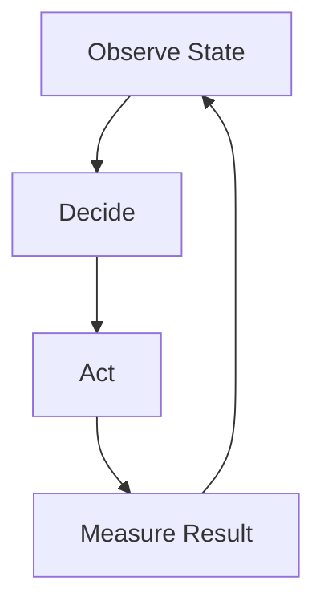
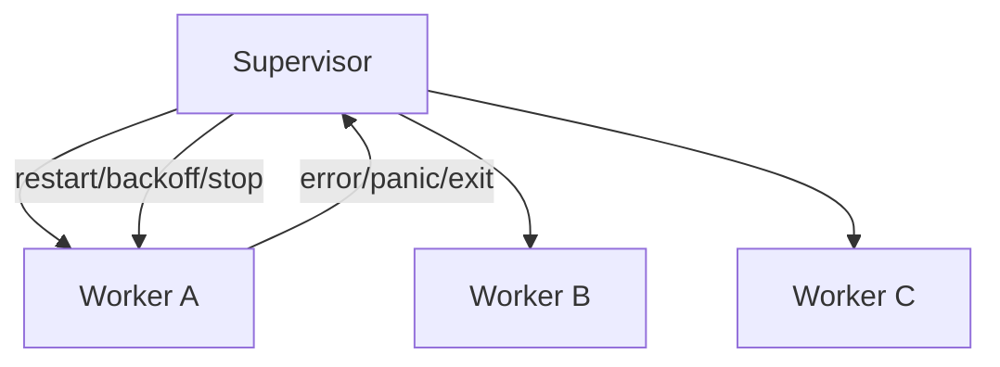
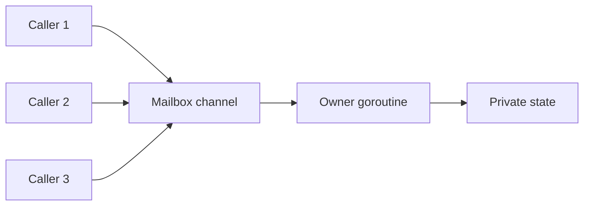
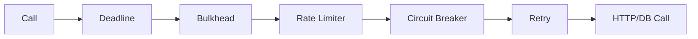
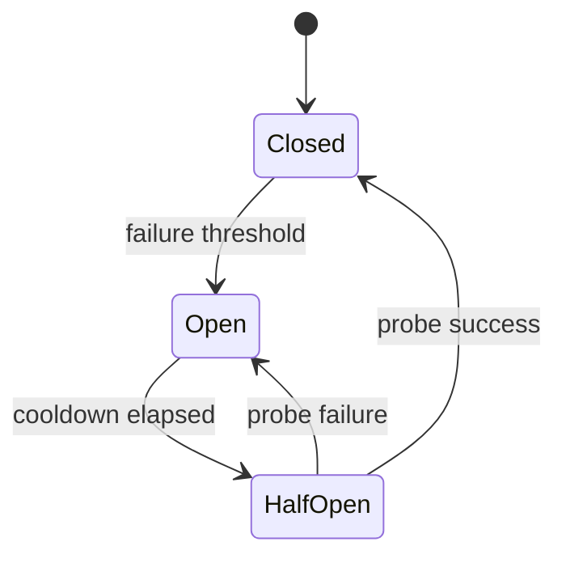
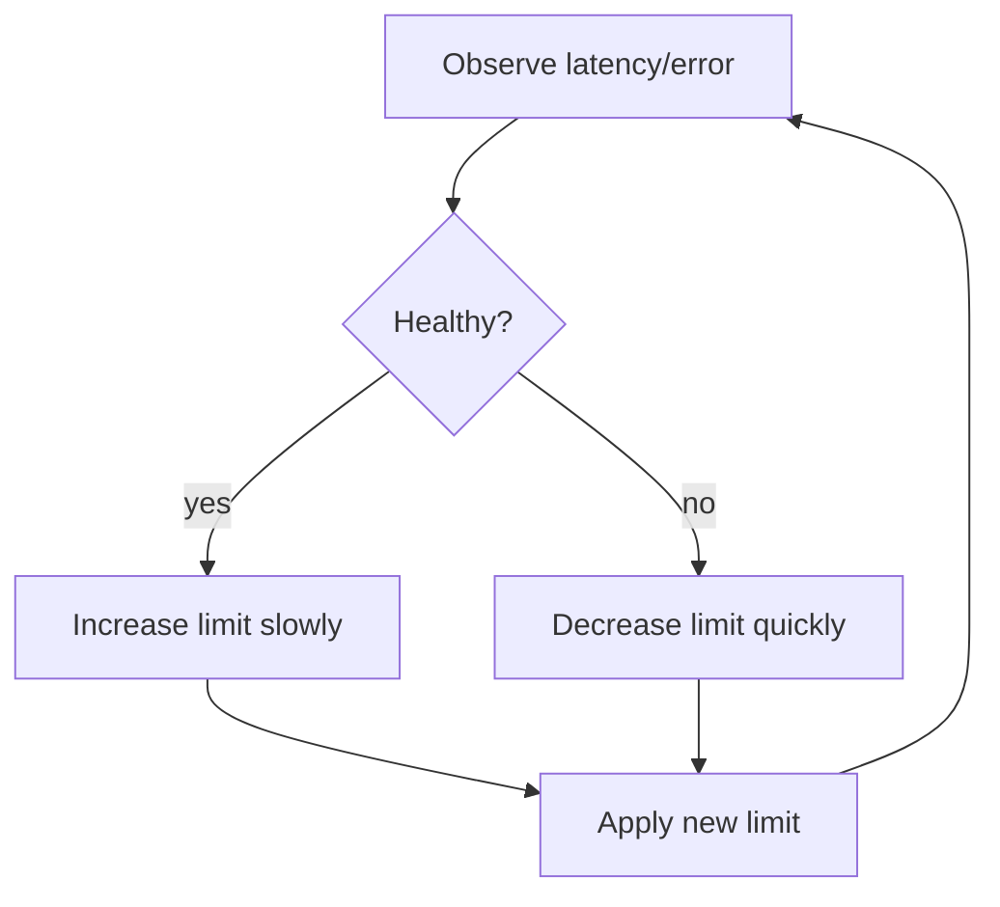
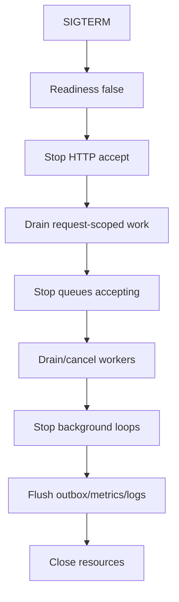
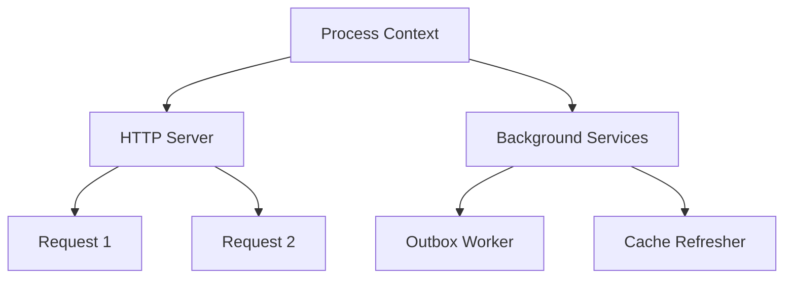
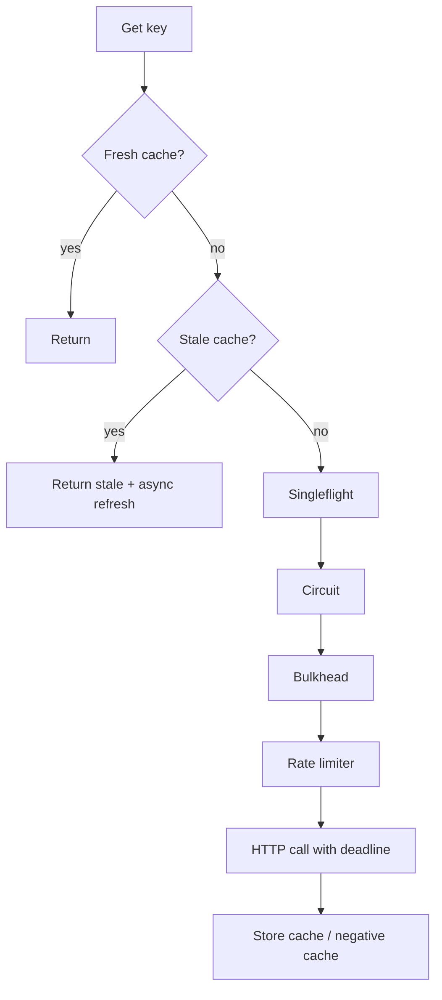

# learn-go-concurrency-parallelism-part-031.md

# Part 031 — Advanced Concurrency Patterns: Supervisors, Actors, Adaptive Limits, Leases, Coordination, and Resilience Composition

> Target pembaca: Java software engineer yang sudah memahami goroutine, channel, context, worker pool, backpressure, observability, dan ingin naik ke pattern lanjutan untuk sistem Go production yang kompleks.
>
> Fokus part ini: supervisor pattern, actor-like ownership, event loop, bounded async, lease/heartbeat, adaptive concurrency, circuit breaker composition, cancellation tree, per-key serialization, work stealing, staged event-driven architecture, coordinated shutdown, and resilience pattern composition.

---

## 0. Posisi Part Ini dalam Seri

Sebelumnya:

- Part 012: ownership models.
- Part 013–016: worker pools, pipelines, backpressure, bulkheads.
- Part 018: singleflight/idempotency.
- Part 019: timers/deadlines.
- Part 028: failure modes.
- Part 029: concurrent API design.
- Part 030: runtime-aware service design.

Part ini membahas pattern lanjutan yang sering muncul ketika sistem mulai kompleks:

- banyak background worker,
- banyak dependency,
- banyak per-key state,
- stream/event-driven workload,
- partial failure,
- tenant isolation,
- adaptive overload control,
- graceful degradation,
- coordinated shutdown,
- distributed-ish coordination.

Tujuannya bukan mengumpulkan pattern agar terlihat keren. Tujuannya adalah memahami kapan pattern tersebut menyelesaikan masalah nyata dan kapan malah membuat sistem sulit dioperasikan.

---

## 1. Tujuan Pembelajaran

Setelah part ini, Anda harus mampu:

1. Mendesain supervisor untuk background goroutine.
2. Memahami actor-like ownership di Go tanpa framework actor.
3. Mendesain event loop yang aman.
4. Mendesain per-key serialization.
5. Menggunakan bounded async dan async result dengan aman.
6. Menggabungkan timeout, retry, bulkhead, circuit breaker, limiter, singleflight, idempotency.
7. Mendesain adaptive concurrency limit.
8. Mendesain lease/heartbeat untuk distributed work.
9. Mendesain coordinated shutdown lintas HTTP server, workers, pipelines, and outbox.
10. Membedakan pattern lokal vs distributed correctness.
11. Menghindari overengineering concurrency pattern.
12. Membuat checklist pemilihan pattern lanjutan.

---

## 2. Mental Model: Advanced Pattern = Explicit Control Loop

Pattern lanjutan biasanya adalah control loop.



Contoh:
- supervisor mengamati worker exit → restart/backoff/stop.
- circuit breaker mengamati failure → open/half-open/close.
- adaptive concurrency mengamati latency/error → naik/turun limit.
- actor event loop mengamati mailbox → mutate state → emit effect.
- lease worker mengamati heartbeat/expiry → continue/release/reclaim.
- shutdown coordinator mengamati components → stop/drain/cancel.

Advanced pattern baik jika:
- state machine jelas,
- lifecycle jelas,
- observability jelas,
- failure policy jelas,
- testable.

Advanced pattern buruk jika hanya membungkus ketidakjelasan dengan goroutine/channel tambahan.

---

## 3. Java Translation

Java analogs:
- Akka actor,
- Erlang supervisor-inspired frameworks,
- ExecutorService + CompletionService,
- Spring lifecycle beans,
- Resilience4j circuit breaker/bulkhead/rate limiter/retry,
- distributed locks via DB/Redis/ZooKeeper,
- ForkJoin/work stealing,
- reactive streams,
- scheduler/leader election.

Go equivalent:
- explicit goroutines,
- channels,
- context,
- errgroup,
- custom supervisor,
- explicit state machines,
- small interfaces,
- no mandatory actor framework,
- strong preference for simple ownership.

Go pattern style:
> Compose small primitives explicitly. Avoid hiding lifecycle.

---

## 4. Supervisor Pattern

Supervisor owns long-running goroutines and decides what happens when they exit.



Use cases:
- background consumers,
- periodic syncers,
- websocket session manager,
- outbox publisher,
- cache refresh daemon,
- file watcher,
- long-running stream processor.

Supervisor responsibilities:
- start workers,
- capture errors/panics,
- restart policy,
- backoff,
- stop on context,
- wait for shutdown,
- metrics,
- avoid restart storm.

---

## 5. Simple Supervisor

```go
type Supervisor struct {
    ctx    context.Context
    cancel context.CancelFunc
    wg     sync.WaitGroup

    errCh chan error
}

func NewSupervisor(parent context.Context) *Supervisor {
    ctx, cancel := context.WithCancel(parent)

    return &Supervisor{
        ctx:    ctx,
        cancel: cancel,
        errCh: make(chan error, 16),
    }
}

func (s *Supervisor) Go(name string, fn func(context.Context) error) {
    s.wg.Go(func() {
        defer func() {
            if r := recover(); r != nil {
                s.report(fmt.Errorf("%s panic: %v", name, r))
            }
        }()

        if err := fn(s.ctx); err != nil && !errors.Is(err, context.Canceled) {
            s.report(fmt.Errorf("%s: %w", name, err))
        }
    })
}

func (s *Supervisor) report(err error) {
    select {
    case s.errCh <- err:
    default:
        // avoid blocking supervisor path; increment dropped metric in real code
    }
}

func (s *Supervisor) Stop() {
    s.cancel()
}

func (s *Supervisor) Wait() {
    s.wg.Wait()
}
```

This supervisor does not restart. It just owns lifecycle/errors.

---

## 6. Restarting Supervisor

Restarting is dangerous if bug is deterministic.

Use restart policy:

```go
type RestartPolicy struct {
    MaxRestarts int
    BaseBackoff time.Duration
    MaxBackoff  time.Duration
}
```

Conceptual loop:

```go
func runRestarting(ctx context.Context, name string, policy RestartPolicy, fn func(context.Context) error) error {
    restarts := 0

    for {
        err := runOnce(ctx, name, fn)
        if ctx.Err() != nil {
            return ctx.Err()
        }

        restarts++
        if restarts > policy.MaxRestarts {
            return fmt.Errorf("%s exceeded restart limit: %w", name, err)
        }

        delay := backoff(policy.BaseBackoff, policy.MaxBackoff, restarts)

        if err := Sleep(ctx, delay); err != nil {
            return err
        }
    }
}
```

Restart policy should include:
- max restarts per time window,
- backoff with jitter,
- panic metric,
- last error,
- alert if flapping.

Do not restart blindly forever at high speed.

---

## 7. Actor-Like Ownership

Actor model:
- one goroutine owns state,
- other goroutines send messages,
- state mutated only in owner goroutine.

Go version:



Good for:
- complex state machine,
- ordered events,
- per-session state,
- websocket connection,
- protocol handler,
- per-key aggregate,
- avoiding locks for complex invariants.

Bad for:
- simple map get/set high read throughput,
- blocking operations inside actor,
- unbounded mailbox,
- operations needing many actors sync.

---

## 8. Actor API Example

```go
type CounterActor struct {
    cmds chan counterCmd
}

type counterCmd struct {
    kind  string
    delta int
    reply chan int
}

func NewCounterActor(ctx context.Context) *CounterActor {
    a := &CounterActor{
        cmds: make(chan counterCmd, 64),
    }

    go a.run(ctx)
    return a
}

func (a *CounterActor) run(ctx context.Context) {
    var n int

    for {
        select {
        case <-ctx.Done():
            return

        case cmd := <-a.cmds:
            switch cmd.kind {
            case "add":
                n += cmd.delta
                cmd.reply <- n
            case "get":
                cmd.reply <- n
            }
        }
    }
}

func (a *CounterActor) Add(ctx context.Context, delta int) (int, error) {
    reply := make(chan int, 1)

    cmd := counterCmd{
        kind:  "add",
        delta: delta,
        reply: reply,
    }

    select {
    case a.cmds <- cmd:
    case <-ctx.Done():
        return 0, ctx.Err()
    }

    select {
    case n := <-reply:
        return n, nil
    case <-ctx.Done():
        return 0, ctx.Err()
    }
}
```

Important:
- mailbox bounded,
- send context-aware,
- reply buffered size 1 to avoid actor blocking if caller cancels,
- actor owns state.

---

## 9. Actor Failure Modes

- mailbox fills,
- actor blocks on reply send,
- actor performs slow I/O and stops processing mailbox,
- caller cancellation leaves reply path blocked,
- actor goroutine leaks if ctx not cancelled,
- one actor becomes hot key bottleneck,
- actor panics and state lost.

Rules:
- actor should not perform slow external I/O in event loop unless intended.
- use effects: actor decides, worker performs I/O, result returns as message.
- mailbox metrics needed.
- one actor per hot key can still bottleneck.

---

## 10. Event Loop Pattern

Event loop is actor-like but often handles multiple event sources:

```go
func (s *Session) run(ctx context.Context) error {
    heartbeat := time.NewTicker(s.heartbeatInterval)
    defer heartbeat.Stop()

    for {
        select {
        case <-ctx.Done():
            return ctx.Err()

        case msg := <-s.inbound:
            s.handleInbound(msg)

        case cmd := <-s.commands:
            s.handleCommand(cmd)

        case <-heartbeat.C:
            s.sendHeartbeat()
        }
    }
}
```

Use cases:
- websocket session,
- protocol connection,
- scheduler,
- coordinator,
- in-memory state machine.

Key design:
- no blocking long operation in loop,
- command reply buffered,
- slow outbound handled via bounded queue,
- timers owned by loop,
- shutdown path clear.

---

## 11. Per-Key Serialization

Requirement:
- operations for same key must be serialized,
- different keys can run concurrently.

Options:
1. sharded worker pool by key hash.
2. per-key actor.
3. keyed mutex.
4. DB row lock/transaction.
5. partitioned message broker.

### 11.1 Sharded Worker by Key

```go
shard := hash(key) % numShards
queues[shard] <- job
```

Guarantee:
- same key same shard, processed sequentially if one worker per shard.

Trade-off:
- hot key blocks other keys in same shard.
- increasing shards reduces collision.
- ordering only within shard worker.

### 11.2 Per-Key Actor

Create actor per active key.
Need:
- lifecycle/idle cleanup,
- max actors,
- memory bound,
- hot key metrics.

### 11.3 Keyed Mutex

Good for short critical sections.
Bad if external I/O under per-key lock unless intended.

---

## 12. Bounded Async

Sometimes API starts async work and returns handle.

```go
type Future[T any] struct {
    done chan struct{}
    val  T
    err  error
}

func (f *Future[T]) Wait(ctx context.Context) (T, error) {
    select {
    case <-f.done:
        return f.val, f.err
    case <-ctx.Done():
        var zero T
        return zero, ctx.Err()
    }
}
```

Producer:

```go
func Async[T any](ctx context.Context, sem *Semaphore, fn func(context.Context) (T, error)) (*Future[T], error) {
    if err := sem.Acquire(ctx); err != nil {
        return nil, err
    }

    f := &Future[T]{done: make(chan struct{})}

    go func() {
        defer sem.Release()
        defer close(f.done)

        f.val, f.err = fn(ctx)
    }()

    return f, nil
}
```

Caution:
- who owns ctx?
- if caller never waits, goroutine still runs.
- bounded by semaphore.
- result retained until Future GC.
- cancellation must be clear.

---

## 13. Async Result with Cancellation

If async work should be cancellable independent of caller wait:

```go
type Task[T any] struct {
    ctx    context.Context
    cancel context.CancelFunc
    done   chan struct{}
    val    T
    err    error
}

func (t *Task[T]) Cancel() {
    t.cancel()
}

func (t *Task[T]) Wait(ctx context.Context) (T, error) {
    select {
    case <-t.done:
        return t.val, t.err
    case <-ctx.Done():
        var zero T
        return zero, ctx.Err()
    }
}
```

Need:
- task registry maybe,
- cleanup,
- max tasks,
- deadline.

---

## 14. Resilience Composition

Common stack around dependency:



But order matters.

Typical better order:
1. context/deadline exists from caller.
2. admission/bulkhead before starting expensive work.
3. circuit breaker can fail fast before acquiring scarce downstream resource.
4. rate limiter may wait or reject.
5. retry wraps the actual attempt but respects budget and idempotency.
6. singleflight/cache can sit before dependency for duplicate reads.

Example for read call:

```text
cache -> singleflight -> circuit check -> bulkhead acquire -> rate limit -> attempt with timeout -> retry if safe -> store cache
```

For write side effect:

```text
idempotency -> validation -> bulkhead -> attempt with idempotency key -> no unsafe retry unless guaranteed
```

---

## 15. Circuit Breaker State Machine



State:
- closed: allow calls.
- open: reject fast.
- half-open: allow limited probes.

Concurrency concerns:
- only limited probes in half-open.
- state transitions atomic/locked.
- metrics for state.
- open reason.
- backoff/cooldown.
- avoid all instances probing simultaneously? add jitter.

---

## 16. Adaptive Concurrency Limit

Static limit may be too high/low as conditions change.

Adaptive limiter adjusts concurrency based on observed latency/errors.

Concept:



Simple AIMD:
- additive increase,
- multiplicative decrease.

```go
type AdaptiveLimit struct {
    mu    sync.Mutex
    limit int
    min   int
    max   int
}

func (a *AdaptiveLimit) OnSuccess(latency time.Duration, target time.Duration) {
    a.mu.Lock()
    defer a.mu.Unlock()

    if latency < target && a.limit < a.max {
        a.limit++
    }
}

func (a *AdaptiveLimit) OnFailure() {
    a.mu.Lock()
    defer a.mu.Unlock()

    a.limit = max(a.min, a.limit/2)
}
```

This is simplified. Production adaptive concurrency needs smoothing/windowing to avoid oscillation.

---

## 17. Adaptive Limit Risks

- oscillation,
- noisy latency,
- coordinated changes across pods,
- unfairness,
- hard debugging,
- interacts with autoscaling,
- bad target latency,
- measuring queue wait vs service time incorrectly.

Use adaptive concurrency when:
- dependency capacity varies,
- static limit either wastes capacity or overloads,
- observability strong,
- rollback possible.

Start with static bulkhead first.

---

## 18. Lease Pattern

Lease: temporary ownership valid until expiry, usually needs renewal.

Use cases:
- distributed job processing,
- leader-ish background task,
- resource reservation,
- DB job claim.

Fields:
```text
owner_id
lease_until
heartbeat_at
attempt
```

Worker:
1. claim job with lease.
2. periodically heartbeat/extend lease.
3. process.
4. complete and release.
5. if worker dies, lease expires and another can claim.

Concurrency concerns:
- clock skew,
- renewal failure,
- long GC pause,
- duplicate processing after lease expiry,
- idempotency still required.

Lease is not exactly-once. It is at-least-once with reduced duplicate window.

---

## 19. Heartbeat Pattern

Heartbeat indicates liveness.

```go
func Heartbeat(ctx context.Context, interval time.Duration, renew func(context.Context) error) error {
    ticker := time.NewTicker(interval)
    defer ticker.Stop()

    for {
        select {
        case <-ctx.Done():
            return ctx.Err()

        case <-ticker.C:
            beatCtx, cancel := context.WithTimeout(ctx, interval/2)
            err := renew(beatCtx)
            cancel()

            if err != nil {
                return err
            }
        }
    }
}
```

Rules:
- heartbeat interval < lease duration.
- renewal timeout < interval.
- jitter across workers.
- on renewal failure, decide whether to stop processing.
- operation must be idempotent if duplicate possible.

---

## 20. Work Stealing

Work stealing:
- each worker has local queue,
- idle workers steal from others.

Useful for:
- variable task sizes,
- CPU-bound recursive work,
- scheduler-like systems.

Go runtime internally work-steals goroutines, but application-level work stealing can still help if tasks are queued per worker.

Complexity:
- queue concurrency,
- fairness,
- locality,
- shutdown,
- metrics.

For most services:
- dynamic chunk queue simpler.
- use work stealing only after measured imbalance.

---

## 21. Staged Event-Driven Architecture

SEDA-like design:
- split system into stages,
- each stage has queue/thread pool,
- backpressure between stages.

Go version:
```text
HTTP -> validate stage -> enrich stage -> persist stage -> publish stage
```

Pros:
- isolation per stage,
- stage-specific concurrency,
- clear bottleneck metrics.

Cons:
- more queues,
- more latency,
- more memory,
- harder cancellation,
- harder tracing.

Use when stages have different resource profiles.

Avoid if simple request/response can be direct.

---

## 22. Coordinated Shutdown

Advanced service has multiple components:
- HTTP server,
- gRPC server,
- worker pool,
- outbox publisher,
- cache refresher,
- scheduler,
- DB connections,
- metrics exporter.

Shutdown coordinator:



Coordinator needs:
- ordering,
- deadlines,
- parallel vs sequential stops,
- error aggregation,
- forced cancel.

---

## 23. Shutdown Groups

```go
type Component interface {
    Name() string
    Shutdown(context.Context) error
}

func ShutdownAll(ctx context.Context, components []Component) error {
    var errs []error

    for _, c := range components {
        if err := c.Shutdown(ctx); err != nil {
            errs = append(errs, fmt.Errorf("%s: %w", c.Name(), err))
        }

        if ctx.Err() != nil {
            break
        }
    }

    return errors.Join(errs...)
}
```

Ordering matters:
- stop ingress before workers?
- drain queues before cancelling?
- stop publisher after producers?
- close DB last?

Document shutdown dependency graph.

---

## 24. Hierarchical Cancellation Tree



Rules:
- root cancels on SIGTERM.
- request contexts cancel on client disconnect/deadline.
- background contexts cancel on service shutdown.
- child contexts have tighter deadlines.
- cleanup uses fresh bounded context if root already canceled.

---

## 25. Coordinator Actor

For complex state, a coordinator actor may own:
- current workers,
- queue state,
- shutdown state,
- component statuses,
- leases.

Benefits:
- serializes lifecycle transitions,
- avoids lock complexity.

Risks:
- coordinator becomes bottleneck,
- mailbox full,
- hard if callbacks block,
- must be tested heavily.

Use only when lifecycle state machine is complex enough.

---

## 26. Pattern Composition Example: External API Cache

Requirement:
- high QPS lookup,
- external API rate-limited,
- cache TTL,
- avoid stampede,
- degrade stale on error.

Composition:



Pattern roles:
- cache handles sequential duplicates,
- singleflight handles concurrent duplicate,
- stale handles p99/dependency failure,
- circuit avoids repeated failure,
- bulkhead limits concurrency,
- limiter respects quota,
- deadline avoids hanging,
- negative cache prevents miss storm.

---

## 27. Pattern Composition Example: Payment Command

Requirement:
- create payment once,
- client may retry,
- external provider may timeout.

Composition:

```text
idempotency key
request hash
DB transaction create payment attempt
external provider idempotency key
outbox/event
retry only safe states
status reconciliation
```

Do not use:
- local singleflight as correctness.
- retry without idempotency.

Concurrency principle:
> Reads often use dedup/cache. Writes need idempotency and durable state.

---

## 28. Pattern Composition Example: Multi-Tenant Worker

Requirement:
- many tenants,
- one noisy tenant must not starve others.

Options:
- per-tenant queues with weighted fair scheduling,
- per-tenant semaphores,
- tenant tier limits,
- global cap,
- queue age per tenant,
- drop/expire policy.

Simple weighted round-robin scheduler actor:
- owns tenant queues,
- dispatches to workers,
- respects global workers and tenant limits.

Caution:
- high cardinality tenants,
- memory per queue,
- idle cleanup,
- metrics cardinality.

---

## 29. Advanced Pattern Decision Table

| Problem | Pattern |
|---|---|
| complex state with ordered commands | actor/event loop |
| background worker lifecycle | supervisor |
| repeated concurrent reads | singleflight |
| repeated sequential reads | cache |
| side-effect duplicate | idempotency |
| dependency overload | bulkhead/rate limiter |
| dependency outage | circuit breaker/fallback |
| variable dependency capacity | adaptive limit |
| per-key ordering | keyed shard/actor/mutex |
| distributed job claim | lease |
| pipeline stage imbalance | staged queues |
| shutdown many components | coordinator |
| hot lock | sharding/snapshot |
| slow consumer stream | bounded per-client queue/drop/disconnect |

---

## 30. Pattern Selection Heuristics

Ask:

1. Is problem local or distributed?
2. Is correctness or performance the main issue?
3. Is state simple or state-machine-like?
4. Is work read or write/side-effect?
5. Is ordering required?
6. Is failure partial or total?
7. Is dependency capacity fixed or variable?
8. Is queueing acceptable?
9. Can work be dropped?
10. What is observability?
11. Can we test it deterministically?
12. What is simplest pattern that satisfies contract?

---

## 31. Anti-Pattern Catalog

### 31.1 Actor for Everything

One goroutine bottleneck for simple map.

### 31.2 Supervisor Restart Storm

Restarting failing worker in tight loop.

### 31.3 Circuit Breaker Without Fallback

Rejects but caller cannot degrade.

### 31.4 Adaptive Limit Without Observability

Oscillation and confusion.

### 31.5 Lease Treated as Exactly-Once

Duplicates still possible.

### 31.6 Work Stealing Before Measuring Imbalance

Complexity without benefit.

### 31.7 SEDA for Simple Request

Unnecessary queues/latency.

### 31.8 Async API Without Bound

Goroutine explosion.

### 31.9 Background Task Without Result/Error Path

Failures invisible.

### 31.10 Per-Key Actor Without Cleanup

Memory leak.

### 31.11 Retry + Circuit + Timeout at Every Layer

Complex storm.

### 31.12 Pattern Composition Without Contract

No one understands behavior.

---

## 32. Design Review Checklist

For advanced patterns:

1. What problem is pattern solving?
2. Is simpler primitive enough?
3. Is state machine documented?
4. Who owns lifecycle?
5. Is there a bounded queue/mailbox?
6. What happens when mailbox full?
7. Are errors visible?
8. Are panics handled by policy?
9. Is restart bounded/backed off?
10. Is context propagated?
11. Is shutdown deterministic?
12. Are metrics defined?
13. Are high-cardinality labels avoided?
14. Are distributed duplicates possible?
15. Is idempotency needed?
16. Is pattern local-only or cross-pod?
17. Is fairness required?
18. Is hot key handled?
19. Is adaptive logic stable/tested?
20. Are timeouts and retries composed once?
21. Is fallback defined?
22. Is partial failure behavior clear?
23. Are tests deterministic?
24. Is load/stress testing done?
25. Is rollback possible?
26. Is complexity justified by measured need?
27. Is documentation clear enough for on-call?
28. Are incident playbooks updated?
29. Are failure modes listed?
30. Is there an owner for maintaining this pattern?

---

## 33. Mini Lab 1: Supervisor

Implement supervisor:
- start N workers,
- collect errors,
- recover panic,
- restart with max restarts/backoff,
- stop on context.

Test:
- normal stop,
- panic restart,
- restart limit,
- no restart storm.

---

## 34. Mini Lab 2: Actor Event Loop

Implement actor-owned map:
- Get,
- Set,
- Delete,
- Snapshot,
- Close.

Requirements:
- bounded mailbox,
- context-aware request,
- reply buffered,
- no goroutine leak.

Benchmark vs mutex map.

---

## 35. Mini Lab 3: Per-Key Serialization

Implement sharded keyed executor:
- jobs with key,
- same key processed in order,
- different keys concurrent,
- bounded queues,
- shutdown.

Test ordering per key.

---

## 36. Mini Lab 4: Circuit Breaker

Implement simple circuit:
- closed/open/half-open,
- failure threshold,
- cooldown,
- half-open one probe,
- metrics.

Test:
- opens after failures,
- rejects while open,
- half-open success closes,
- half-open failure opens.

---

## 37. Mini Lab 5: Adaptive Limit Simulation

Implement AIMD adaptive limit around fake dependency.
Simulate:
- latency increases under high concurrency,
- failure under overload.

Observe convergence/oscillation.
Add smoothing.

---

## 38. Mini Lab 6: Lease-Based Worker

Build DB/in-memory lease simulation:
- claim job,
- heartbeat,
- lease expiry,
- second worker reclaims,
- idempotent completion.

Show duplicate processing can occur.

---

## 39. Top 1% Heuristics

1. Advanced patterns are state machines; write the states down.
2. Actor means ownership, not magic scalability.
3. Supervisor without backoff becomes a restart storm.
4. Circuit breaker needs fallback or clear rejection behavior.
5. Adaptive concurrency requires strong metrics and rollback.
6. Leases reduce duplicate work; they do not eliminate it.
7. Async must be bounded.
8. Per-key ordering creates hot-key risks.
9. Every mailbox is a queue and needs capacity policy.
10. Pattern composition order matters.
11. Use local patterns for local problems and durable patterns for distributed correctness.
12. If on-call cannot explain the pattern, it is too complex or under-documented.
13. Start static before adaptive.
14. Test state transitions, not just happy path.
15. The best advanced pattern is the simplest one that makes the failure mode explicit.

---

## 40. Source Notes

Primary concepts behind this part:

1. Go concurrency primitives:
   - goroutines,
   - channels,
   - context,
   - WaitGroup/errgroup,
   - atomic/mutex.

2. Resilience patterns:
   - supervisor,
   - actor/event loop,
   - bulkhead,
   - circuit breaker,
   - rate limiter,
   - adaptive concurrency,
   - lease/heartbeat.

3. Distributed systems:
   - idempotency,
   - at-least-once processing,
   - lease expiry,
   - duplicate side effects,
   - partial failure.

4. Production design:
   - lifecycle,
   - observability,
   - shutdown,
   - failure mode analysis.

---

## 41. Summary

Advanced concurrency patterns are powerful because they make control loops explicit:

- supervisor controls worker lifecycle,
- actor controls state ownership,
- circuit breaker controls dependency calls,
- adaptive limiter controls concurrency,
- lease controls temporary ownership,
- coordinator controls shutdown.

But every advanced pattern adds a state machine. That state machine must be:
- documented,
- bounded,
- observable,
- testable,
- failure-aware.

The core rule:

> Do not adopt advanced concurrency patterns to look sophisticated. Adopt them when they make ownership, capacity, or failure behavior clearer.

---

## 42. Status Seri

Selesai:
- Part 000 — Orientation
- Part 001 — Foundations
- Part 002 — Goroutine Internals
- Part 003 — Go Scheduler Deep Dive
- Part 004 — GOMAXPROCS, CPU Quotas, Containers
- Part 005 — Go Memory Model
- Part 006 — Synchronization Primitives
- Part 007 — Atomic Operations
- Part 008 — Channels Deep Dive
- Part 009 — Select Semantics
- Part 010 — WaitGroup, ErrGroup, Task Groups, and Structured Concurrency
- Part 011 — Context as Concurrency Contract
- Part 012 — Ownership Models
- Part 013 — Worker Pools
- Part 014 — Fan-Out/Fan-In, Pipelines, Stages, and Stream Processing
- Part 015 — Backpressure End-to-End
- Part 016 — Semaphores, Rate Limiters, Token Buckets, and Bulkheads
- Part 017 — Concurrent Data Structures
- Part 018 — Singleflight, Deduplication, Idempotency, and Stampede Prevention
- Part 019 — Timers, Tickers, Deadlines, Scheduling, and Time-Based Concurrency
- Part 020 — Network Concurrency
- Part 021 — Database Concurrency
- Part 022 — Parallel CPU Work
- Part 023 — Memory, Allocation, GC, and Concurrency Pressure
- Part 024 — Race Detection, Static Analysis, and Concurrency Bug Hunting
- Part 025 — Testing Concurrent Code
- Part 026 — Observability for Concurrent Systems
- Part 027 — Performance Engineering for Concurrent Go
- Part 028 — Failure Modes in Concurrent Go Systems
- Part 029 — Designing Concurrent APIs
- Part 030 — Runtime-Aware Service Design
- Part 031 — Advanced Concurrency Patterns

Belum selesai:
- Part 032 sampai Part 034.

Seri belum mencapai bagian terakhir.


<!-- NAVIGATION_FOOTER -->
<div class="page-nav">
<a href="./learn-go-concurrency-parallelism-part-030.md">⬅️ Part 030 — Runtime-Aware Service Design: Building Go Services That Cooperate with Scheduler, GC, Containers, and Dependencies</a>
<a href="./index.md">📚 Kategori</a>
<a href="../../index.md">🏠 Home</a>
<a href="./learn-go-concurrency-parallelism-part-032.md">Part 032 — Cross-Service Concurrency: Timeouts, Retries, Idempotency, Queues, Sagas, and Backpressure Across Microservices ➡️</a>
</div>
