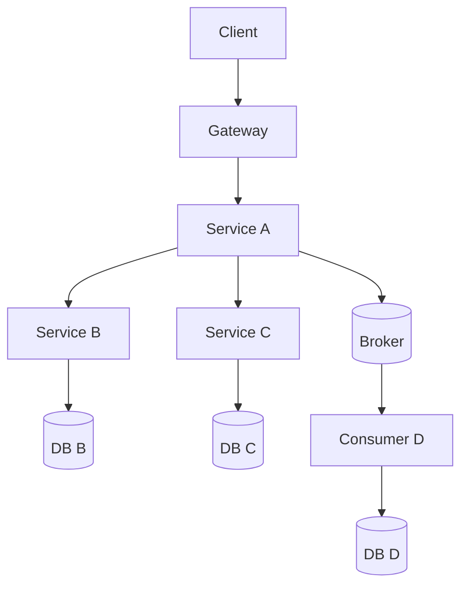
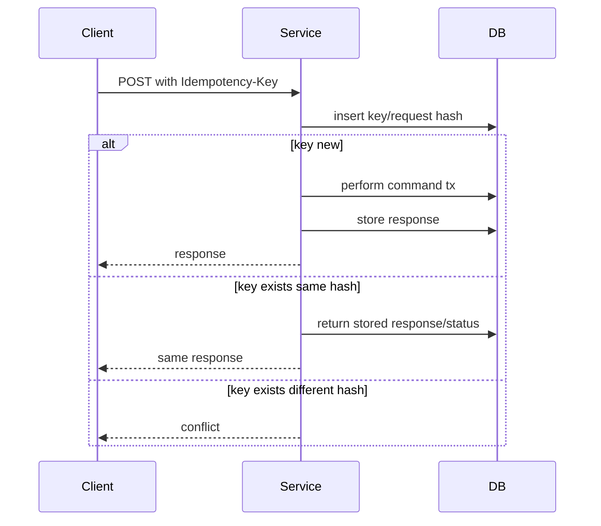
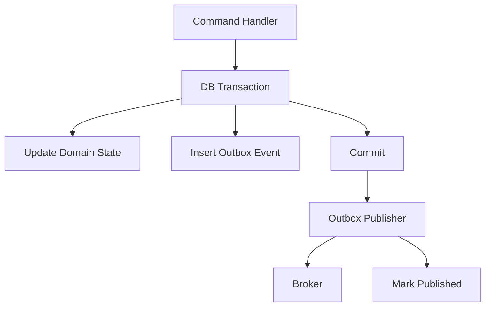
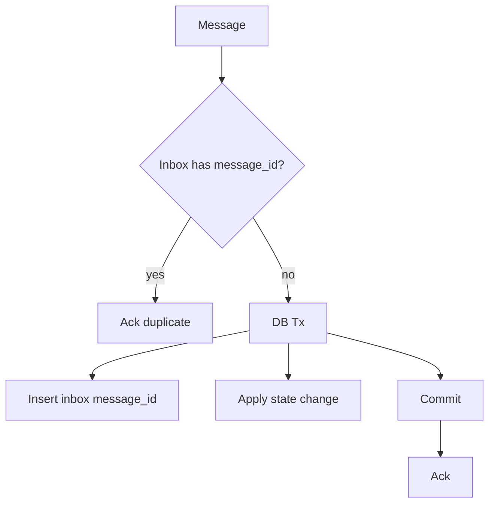
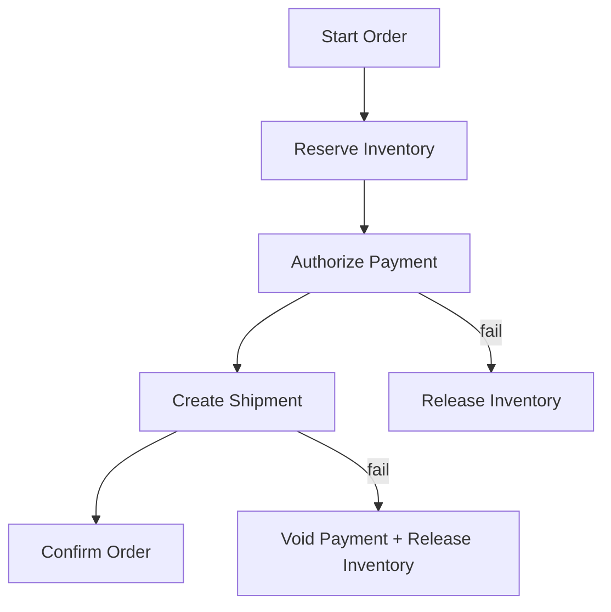

# learn-go-concurrency-parallelism-part-032.md

# Part 032 — Cross-Service Concurrency: Timeouts, Retries, Idempotency, Queues, Sagas, and Backpressure Across Microservices

> Target pembaca: Java software engineer yang ingin memahami concurrency bukan hanya di dalam satu proses Go, tetapi di antara banyak service, pod, database, broker, cache, external API, dan user/client.
>
> Fokus part ini: distributed concurrency, request fan-out, retry amplification, timeout propagation, idempotency, outbox/inbox, distributed locks, leases, message queues, consumer concurrency, partition ordering, saga/compensation, backpressure propagation, rate limits, cross-service observability, and failure containment.

---

## 0. Posisi Part Ini dalam Seri

Sebelumnya:

- Part 015: backpressure end-to-end.
- Part 018: singleflight/idempotency/stampede.
- Part 020: network concurrency.
- Part 021: database concurrency.
- Part 028: failure modes.
- Part 030: runtime-aware service design.
- Part 031: advanced patterns.

Part ini naik satu level:

> Concurrency tidak berhenti di boundary proses Go.

Dalam microservice system, concurrency terjadi di:
- client request,
- API gateway,
- service A goroutines,
- service B connection pool,
- DB locks,
- message broker partitions,
- consumer groups,
- cache stampede,
- external API quota,
- retry layers,
- Kubernetes HPA,
- load balancers,
- distributed transactions/compensation.

Satu service bisa benar secara lokal, tetapi sistem tetap gagal karena concurrency lintas service tidak didesain.

---

## 1. Tujuan Pembelajaran

Setelah part ini, Anda harus mampu:

1. Menjelaskan mengapa local concurrency safety tidak cukup untuk distributed systems.
2. Mendesain timeout/deadline propagation antar service.
3. Menghindari retry amplification dan retry storm.
4. Mendesain idempotency untuk HTTP commands dan message consumers.
5. Menggunakan outbox/inbox pattern untuk reliable eventing.
6. Memahami consumer concurrency, partition ordering, dan offset/ack semantics.
7. Mendesain backpressure propagation antar service.
8. Memahami distributed locks, leases, dan bahayanya.
9. Mendesain saga/compensation untuk long-running workflows.
10. Mengisolasi tenant/dependency failure.
11. Menentukan concurrency budget lintas pod dan lintas dependency.
12. Mengobservasi cross-service concurrency dengan metrics/traces/logs.
13. Membuat checklist desain microservice concurrency.

---

## 2. Mental Model: Distributed Concurrency = Many Queues and Clocks

Dalam satu proses, Anda bisa memakai mutex/channel/context. Di distributed system:
- tidak ada shared memory,
- tidak ada global clock sempurna,
- network bisa delay/drop/duplicate,
- request bisa timeout tapi work tetap sukses,
- message bisa redeliver,
- service bisa crash setelah side effect,
- retry bisa membuat duplicate,
- DB commit dan publish event tidak atomic tanpa pattern.



Setiap arrow adalah concurrency boundary:
- timeout,
- retry,
- queue,
- rate limit,
- idempotency,
- backpressure,
- observability.

---

## 3. Java Translation

Java microservice patterns:
- Spring Cloud/OpenFeign/RestTemplate/WebClient timeouts,
- Resilience4j retry/circuit/bulkhead,
- Kafka consumer concurrency,
- transactional outbox,
- idempotency tables,
- saga orchestration/choreography,
- distributed locks,
- HikariCP connection budgets.

Go equivalents:
- `context.Context` propagation,
- `http.Client`/gRPC deadlines,
- custom retry/bulkhead/circuit,
- `database/sql`,
- broker clients,
- explicit outbox/inbox,
- explicit idempotency,
- explicit worker/consumer pools.

Go makes local concurrency explicit. Distributed concurrency must also be explicit.

---

## 4. Local Race vs Distributed Race

Local data race:
```go
sharedCounter++
```

Distributed race:
- two pods receive same command.
- two consumers process same message.
- two services update related state.
- client retries after timeout.
- two requests create same resource.
- stale event overwrites newer state.

Race detector cannot help distributed races.

Tools:
- DB unique constraints,
- idempotency keys,
- version numbers,
- optimistic concurrency,
- row locks,
- message keys/partitions,
- dedup tables,
- leases,
- outbox/inbox,
- compare-and-swap,
- event ordering metadata.

---

## 5. Timeout Propagation

Each service call should have a deadline budget.

Bad:
```text
Client timeout 2s
A calls B timeout 2s
B calls C timeout 2s
C calls DB timeout 2s
```

This can exceed client budget and keep work after caller is gone.

Better:
```text
Client budget 2s
Gateway overhead 100ms
A local 200ms
B budget 700ms
C budget 500ms
Response buffer 200ms
```

In Go:

```go
func WithTimeoutCap(parent context.Context, cap time.Duration) (context.Context, context.CancelFunc) {
    if deadline, ok := parent.Deadline(); ok {
        remaining := time.Until(deadline)
        if remaining < cap {
            return context.WithTimeout(parent, remaining)
        }
    }
    return context.WithTimeout(parent, cap)
}
```

But avoid creating timeout with negative/near-zero budget. Return early with insufficient budget if needed.

---

## 6. Deadline Budgeting

At service boundary:

```go
func (s *Service) Handle(ctx context.Context, req Request) (Response, error) {
    if d, ok := ctx.Deadline(); ok && time.Until(d) < 50*time.Millisecond {
        return Response{}, ErrInsufficientBudget
    }

    dbCtx, cancel := WithTimeoutCap(ctx, 150*time.Millisecond)
    defer cancel()

    data, err := s.repo.Load(dbCtx, req.ID)
    if err != nil {
        return Response{}, err
    }

    depCtx, cancel := WithTimeoutCap(ctx, 200*time.Millisecond)
    defer cancel()

    enriched, err := s.client.Enrich(depCtx, data)
    if err != nil {
        return Response{}, err
    }

    return enriched, nil
}
```

Guideline:
- child calls should not use full parent budget blindly.
- leave response/cleanup budget.
- avoid retries when remaining budget too small.
- record insufficient budget metrics.

---

## 7. Retry Amplification

If each layer retries 3 times:

```text
Client retries 3
Gateway retries 3
Service A retries 3
Service B retries 3
DB call retries 3

Worst-case attempts = 3^5 = 243
```

This is retry amplification.

Rules:
- retry at one responsible layer when possible.
- retry only idempotent operations.
- use retry budget.
- use exponential backoff with jitter.
- respect parent deadline.
- respect Retry-After/rate limit.
- do not retry overload blindly.
- classify errors.

---

## 8. Retry Budget

Retry budget limits retries relative to real traffic.

Example:
```text
Retries may not exceed 10% of original requests over rolling window.
```

If retry budget exhausted:
- fail fast,
- shed,
- open circuit,
- propagate error.

Metrics:
- original_attempt_total,
- retry_attempt_total,
- retry_budget_exhausted_total,
- retry_success_total,
- retry_exhausted_total.

Retry success rate matters. If retries rarely succeed during incident, stop making it worse.

---

## 9. Jitter

Without jitter, all clients retry together.

Bad:
```go
time.Sleep(1 * time.Second)
```

Better:
```go
delay := base * (1 << attempt)
delay = min(delay, maxDelay)
delay = randomize(delay)
```

Jitter types:
- full jitter,
- equal jitter,
- decorrelated jitter.

The goal:
- spread retries,
- reduce synchronized spikes,
- improve recovery.

---

## 10. Idempotency for HTTP Commands

For commands that create/update side effects, client sends idempotency key.

```http
POST /payments
Idempotency-Key: abc123
```

Server stores:
- key,
- request hash,
- status,
- response,
- created_at,
- expiry.

Flow:



Important:
- key scope matters: user/account/operation.
- request hash prevents accidental key reuse with different payload.
- store enough response to return consistent result.
- expiry policy needed.
- unique constraint is core.

---

## 11. At-Least-Once Reality

Most distributed systems are at-least-once:
- HTTP client may retry,
- message broker may redeliver,
- consumer may crash after side effect before ack,
- producer may publish duplicate,
- timeout may hide success.

Therefore:
> Assume duplicate execution unless proven otherwise.

Design:
- idempotency keys,
- dedup tables,
- natural unique keys,
- version checks,
- operation state machine,
- outbox/inbox,
- external provider idempotency.

---

## 12. Outbox Pattern

Problem:
- update DB and publish event atomically.

Naive:
```text
DB commit succeeds, publish fails -> lost event.
Publish succeeds, DB commit fails -> phantom event.
```

Outbox:
- write domain change and outbox row in same transaction.
- publisher reads outbox and publishes.
- marks as published.



Concurrency:
- multiple publisher workers need claim/lease/skip locked.
- publishing can duplicate if mark published fails after broker publish.
- consumers must be idempotent.
- event order may matter per aggregate.

---

## 13. Inbox Pattern

Consumer idempotency.

When consuming message:
- check message_id in inbox table.
- if already processed, ack.
- if new, insert message_id and apply side effect in same transaction.
- commit.
- ack.



Important:
- message_id uniqueness.
- transaction boundaries.
- ack after commit.
- retention/cleanup of inbox table.

---

## 14. Message Broker Consumer Concurrency

Consumer concurrency dimensions:
- number of pods,
- consumers per pod,
- workers per consumer,
- partitions,
- prefetch/batch size,
- ack mode,
- max processing time.

Increasing worker count may:
- break ordering,
- increase duplicates on crash,
- increase DB load,
- increase memory,
- increase unacked messages.

Design depends on broker semantics.

---

## 15. Partition Ordering

Kafka-like partition:
- order guaranteed within partition.
- parallelism limited by partitions for strict per-key order.

If key = account_id:
- all events for account go same partition.
- one consumer processes partition sequentially.
- can parallelize across partitions.

If you process messages from same partition concurrently, offset commit/order becomes complex.

Rule:
> Ordering and parallelism trade off.

---

## 16. Consumer Offset/Ack Semantics

Common failure:
1. consumer processes message,
2. side effect succeeds,
3. consumer crashes before ack,
4. broker redelivers,
5. duplicate side effect unless idempotent.

Ack before side effect is worse:
1. ack,
2. crash,
3. message lost.

Therefore:
- process then ack,
- make processing idempotent,
- use transactions if broker/DB support and you understand semantics,
- do not assume exactly-once end-to-end.

---

## 17. Prefetch and Backpressure

Broker clients often prefetch messages.

If prefetch too high:
- memory high,
- unfairness,
- slow shutdown,
- messages invisible to other consumers,
- stale work.

If too low:
- throughput low.

Prefetch should align with:
- worker count,
- processing latency,
- memory,
- ack deadline,
- dependency capacity.

Metrics:
- unacked messages,
- consumer lag,
- processing duration,
- oldest unacked age,
- redelivery count,
- DLQ count.

---

## 18. Backpressure Across Services

Local backpressure:
- queue full -> reject.
Cross-service backpressure:
- return 429/503,
- Retry-After,
- circuit breaker,
- rate limit headers,
- broker lag,
- slow consumer,
- admission rejection,
- HPA scaling signal.

Service should communicate overload explicitly.

Bad:
- accept and timeout.
- retry without signal.
- hide overload as generic 500.

Good:
- 429 for rate limit/tenant quota.
- 503 for temporary overload.
- Retry-After when meaningful.
- error class in metrics/traces.

---

## 19. Fan-Out Explosion

One request to A calls:
- 5 calls to B,
- each B calls 5 calls to C,
- each C calls 5 DB queries.

One request becomes 125 downstream operations.

With 100 concurrent requests:
```text
12,500 downstream operations
```

Mitigation:
- batch,
- aggregate,
- cache,
- limit fan-out,
- use scatter-gather with bounded concurrency,
- partial responses,
- precomputed read model,
- reduce nested calls.

---

## 20. Scatter-Gather with Budget

```go
func Gather(ctx context.Context, ids []string, limit int, client Client) ([]Result, error) {
    sem := NewSemaphore(limit)
    g, ctx := errgroup.WithContext(ctx)

    results := make([]Result, len(ids))

    for i, id := range ids {
        i, id := i, id

        if err := sem.Acquire(ctx); err != nil {
            return nil, err
        }

        g.Go(func() error {
            defer sem.Release()

            child, cancel := WithTimeoutCap(ctx, 100*time.Millisecond)
            defer cancel()

            r, err := client.Get(child, id)
            if err != nil {
                return err
            }

            results[i] = r
            return nil
        })
    }

    if err := g.Wait(); err != nil {
        return nil, err
    }

    return results, nil
}
```

Need:
- max fan-out,
- per-call timeout,
- parent deadline,
- optional vs required result,
- cancellation policy,
- result ordering,
- partial failure policy.

---

## 21. Partial Failure Policy

In distributed systems, decide:
- fail whole request,
- return partial data,
- use stale cache,
- skip optional section,
- async repair,
- compensate.

Example:
- payment authorization required: fail request.
- recommendation service optional: return empty list.
- audit event publish via outbox: continue if stored.
- email send: async outbox, not in request.

Document per dependency.

---

## 22. Saga Pattern

Saga coordinates long-running multi-service transaction without distributed ACID transaction.

Steps:
1. reserve inventory,
2. authorize payment,
3. create shipment,
4. confirm order.

If step fails, run compensations:
- release inventory,
- void payment,
- cancel shipment.



Concurrency concerns:
- each step idempotent,
- compensation idempotent,
- retries safe,
- state machine persisted,
- timeout/expiry,
- duplicate messages,
- out-of-order events.

---

## 23. Saga Orchestration vs Choreography

### Orchestration

One coordinator controls steps.

Pros:
- clear state,
- easier visibility,
- centralized retry/timeout.

Cons:
- coordinator dependency,
- more coupling.

### Choreography

Services react to events.

Pros:
- decoupled,
- event-driven.

Cons:
- harder to reason globally,
- event cycles,
- distributed debugging,
- implicit workflow.

For complex critical workflows, orchestration is often easier to operate.

---

## 24. Distributed Locks

Distributed lock use cases:
- ensure one worker performs task,
- protect shared external resource,
- leader-like scheduled job.

Risks:
- lock expiry while work still running,
- clock skew,
- network partition,
- process pause,
- lock service outage,
- false sense of exactly-once.

Prefer:
- idempotency,
- unique constraints,
- leases with fencing tokens,
- DB row locks for DB-owned resource,
- partition ownership via broker.

If using distributed lock:
- use lease duration,
- renew heartbeat,
- fencing token,
- timeout,
- observability,
- safe fallback.

---

## 25. Fencing Token

A fencing token is monotonically increasing token issued with lock/lease.

Resource accepts operation only if token >= last seen.

Why:
- old lock holder may continue after lease expired.
- new holder gets higher token.
- old holder operation rejected.

Without fencing, lease expiry can cause split-brain writes.

---

## 26. Distributed Rate Limits

Local rate limiter per pod is not enough for global quota.

If external API quota = 1000/min and 10 pods:
- local 100/min each if fixed pod count.
- HPA changes pod count.
- uneven traffic.

Options:
- centralized rate limiter,
- token service,
- Redis-based limiter,
- quota partitioning per pod,
- conservative local limits,
- adaptive from 429/Retry-After.

Need:
- failure mode when limiter unavailable,
- latency overhead,
- consistency requirements,
- tenant fairness.

---

## 27. Cross-Service Concurrency Budget

Budget document:

```text
Endpoint: POST /orders
Max app pods: 20
Per-pod route concurrency: 50
Worst in-flight: 1000

DB max connections per pod: 10
Total DB connections: 200

Payment API:
global quota: 300 RPS
per-pod limiter: 10 RPS if 20 pods
bulkhead: 20 in-flight per pod
retry: 1 safe retry with idempotency key

Inventory:
bulkhead: 30 in-flight per pod
timeout: 150ms

Broker:
outbox publisher workers: 5 per pod
batch size: 100
```

Without cross-service budget, scaling one service can break another.

---

## 28. Cache Stampede Across Pods

Local singleflight only deduplicates within one process.

If 100 pods all miss same key:
- 100 calls to dependency.

Mitigation:
- distributed cache,
- probabilistic early refresh,
- stale-while-revalidate,
- request coalescing at gateway/cache layer,
- dependency bulkhead,
- external lock/lease carefully,
- jitter TTL.

TTL should include jitter:
```text
ttl = baseTTL ± random jitter
```

Avoid synchronized expiration.

---

## 29. Thundering Herd on Startup

When many pods start:
- all warm caches,
- all connect DB,
- all fetch config,
- all run migrations? bad,
- all register with dependency.

Mitigation:
- startup jitter,
- lazy warmup,
- limited warmup concurrency,
- readiness after minimal init,
- one migration job,
- connection pool ramp-up,
- cache prewarm controlled.

---

## 30. Cross-Service Observability

Need:
- trace id across services,
- request id,
- idempotency key hash,
- message id,
- causation/correlation id,
- dependency spans,
- queue wait spans,
- retry attempt events,
- outbox/inbox metrics,
- consumer lag,
- duplicate detection metrics.

Trace should show:
- fan-out,
- retries,
- timeouts,
- circuit open,
- queue publish/consume,
- saga step.

Logs should include:
- operation id,
- saga id,
- message id,
- attempt,
- idempotency key hash,
- consumer group,
- partition/offset if relevant.

---

## 31. Error Semantics Across Services

Standardize error classes:
- validation,
- auth,
- conflict,
- rate_limited,
- overloaded,
- dependency_timeout,
- dependency_unavailable,
- idempotency_conflict,
- retry_exhausted,
- stale_request,
- shutdown.

HTTP/gRPC mapping should be consistent.

Retry decisions depend on error class.

Do not retry:
- validation,
- auth,
- idempotency conflict,
- most 4xx.

Maybe retry:
- 503,
- 504,
- connection reset,
- rate limited with Retry-After if allowed,
- serialization/deadlock DB error.

---

## 32. Multi-Tenant Cross-Service Isolation

One tenant can overload:
- API route,
- DB rows,
- broker partitions,
- cache keys,
- external quota.

Strategies:
- per-tenant quotas,
- per-tenant queue,
- tenant tier limits,
- weighted fair scheduling,
- per-tenant circuit/bulkhead,
- noisy neighbor alerts,
- tenant-aware rate limit.

Avoid high-cardinality metrics explosion:
- aggregate by tier,
- sample/debug for specific tenant,
- top-k dashboard.

---

## 33. Distributed Shutdown and Draining

Rolling deployment:
- pod receives SIGTERM,
- readiness false,
- load balancer stops sending new requests after delay,
- in-flight requests drain,
- consumers stop polling,
- workers finish/extend/release leases,
- outbox flushes or leaves rows for next pod,
- DB connections close.

Consumer shutdown:
- stop fetching new messages,
- finish/ack current messages if within deadline,
- otherwise let lease/visibility timeout redeliver,
- ensure idempotency.

Do not ack messages that are not durably processed.

---

## 34. Anti-Pattern Catalog

### 34.1 Local Mutex for Distributed State

Only protects one process.

### 34.2 Retry at Every Layer

Amplification.

### 34.3 Timeout Without Idempotency

Caller retries unknown result.

### 34.4 Publish Event After Commit Without Outbox

Lost event.

### 34.5 Ack Before Processing

Message loss.

### 34.6 Process Then Ack Without Idempotency

Duplicate side effects on redelivery.

### 34.7 Distributed Lock as Exactly-Once

False guarantee.

### 34.8 No Per-Pod Budget Math

HPA overloads dependency.

### 34.9 Local Singleflight for Global Stampede

Only partial solution.

### 34.10 Huge Consumer Prefetch

Memory/slow shutdown/unfairness.

### 34.11 No Correlation IDs

Distributed debugging blind.

### 34.12 Choreography Without Workflow Visibility

Saga becomes invisible spaghetti.

---

## 35. Design Review Checklist

For cross-service concurrency:

1. Is every outbound call context/deadline-bound?
2. Is timeout budget propagated?
3. Is retry policy defined once?
4. Are retries bounded/jittered?
5. Is retry idempotent?
6. Is idempotency key used for commands?
7. Is request hash stored for idempotency?
8. Are DB uniqueness constraints used?
9. Is outbox used for DB + publish?
10. Are consumers idempotent via inbox/dedup?
11. Is ack after durable processing?
12. Is consumer concurrency aligned with partitions/order?
13. Is prefetch bounded?
14. Is backpressure communicated via 429/503/Retry-After?
15. Is fan-out bounded?
16. Are optional dependencies degradable?
17. Are sagas persisted as state machines?
18. Are compensations idempotent?
19. Are distributed locks avoided or fenced?
20. Are leases renewed with heartbeat?
21. Is duplicate processing acceptable and safe?
22. Is global rate limit handled across pods?
23. Is cache stampede across pods considered?
24. Are TTLs jittered?
25. Is startup herd avoided?
26. Are tenant limits needed?
27. Are cross-service metrics/traces/logs correlated?
28. Are error classes standardized?
29. Is rolling shutdown/drain safe?
30. Is cross-service capacity budget documented?

---

## 36. Mini Lab 1: Retry Amplification

Create chain:
- client -> A -> B -> C.
Each layer retries 3 times.
Simulate C failing.
Count attempts at C.
Then redesign retry at one layer with budget.

---

## 37. Mini Lab 2: Idempotent HTTP Command

Implement:
- POST /orders with Idempotency-Key,
- unique key table,
- request hash conflict,
- stored response replay.

Test:
- concurrent same key,
- retry after timeout,
- same key different payload.

---

## 38. Mini Lab 3: Outbox/Inbox

Implement:
- command writes domain row + outbox event.
- publisher publishes events.
- consumer uses inbox table.

Simulate crash:
- after DB commit before publish,
- after publish before mark published,
- after consumer side effect before ack.

Show no lost event and no duplicate side effect.

---

## 39. Mini Lab 4: Consumer Concurrency and Ordering

Simulate partitioned messages by key.
Test:
- same key order preserved,
- different keys parallel,
- redelivery duplicate handled.

---

## 40. Mini Lab 5: Saga State Machine

Implement order saga:
- reserve inventory,
- authorize payment,
- create shipment.
Persist state.
Add compensation.
Test failure at each step and duplicate event.

---

## 41. Mini Lab 6: Cross-Pod Cache Stampede

Simulate 50 service instances missing same key.
Compare:
- local singleflight only,
- distributed cache,
- stale-while-revalidate,
- TTL jitter.

Measure downstream calls.

---

## 42. Top 1% Heuristics

1. Distributed concurrency bugs are usually idempotency bugs.
2. Timeout means “caller stopped waiting,” not “work did not happen.”
3. Every retry needs a duplicate-execution story.
4. Outbox prevents lost events; inbox prevents duplicate effects.
5. Ack only after durable processing.
6. Local locks do not protect distributed state.
7. Leases need fencing if stale owners can still write.
8. Backpressure must cross service boundaries explicitly.
9. Fan-out multiplies load faster than intuition.
10. HPA can overload shared dependencies.
11. Ordering and parallelism trade off.
12. Consumer prefetch is memory and fairness policy.
13. Sagas are persisted state machines, not just callbacks.
14. Cache stampede across pods needs distributed thinking.
15. Cross-service observability must carry causality.

---

## 43. Source Notes

Primary concepts behind this part:

1. Go service concurrency:
   - context deadlines,
   - HTTP clients,
   - database transactions,
   - worker pools.

2. Distributed systems:
   - at-least-once processing,
   - idempotency,
   - outbox/inbox,
   - sagas,
   - leases,
   - fencing tokens,
   - backpressure.

3. Messaging:
   - consumer concurrency,
   - partition ordering,
   - ack/redelivery,
   - prefetch.

4. Reliability:
   - retry storm,
   - cascade failure,
   - rate limiting,
   - circuit breaking,
   - cross-service observability.

---

## 44. Summary

Cross-service concurrency is where local Go correctness meets distributed uncertainty.

The core facts:

- timeout does not prove failure,
- retry can duplicate work,
- publish and DB commit are not automatically atomic,
- broker delivery is usually at-least-once,
- local locks do not protect cross-pod state,
- scaling pods multiplies dependency load,
- fan-out multiplies operations,
- global quotas need global thinking.

The core rule:

> In distributed systems, assume duplicate, delayed, reordered, and partially failed execution. Then design idempotency, ordering, backpressure, and observability around that assumption.

---

## 45. Status Seri

Selesai:
- Part 000 — Orientation
- Part 001 — Foundations
- Part 002 — Goroutine Internals
- Part 003 — Go Scheduler Deep Dive
- Part 004 — GOMAXPROCS, CPU Quotas, Containers
- Part 005 — Go Memory Model
- Part 006 — Synchronization Primitives
- Part 007 — Atomic Operations
- Part 008 — Channels Deep Dive
- Part 009 — Select Semantics
- Part 010 — WaitGroup, ErrGroup, Task Groups, and Structured Concurrency
- Part 011 — Context as Concurrency Contract
- Part 012 — Ownership Models
- Part 013 — Worker Pools
- Part 014 — Fan-Out/Fan-In, Pipelines, Stages, and Stream Processing
- Part 015 — Backpressure End-to-End
- Part 016 — Semaphores, Rate Limiters, Token Buckets, and Bulkheads
- Part 017 — Concurrent Data Structures
- Part 018 — Singleflight, Deduplication, Idempotency, and Stampede Prevention
- Part 019 — Timers, Tickers, Deadlines, Scheduling, and Time-Based Concurrency
- Part 020 — Network Concurrency
- Part 021 — Database Concurrency
- Part 022 — Parallel CPU Work
- Part 023 — Memory, Allocation, GC, and Concurrency Pressure
- Part 024 — Race Detection, Static Analysis, and Concurrency Bug Hunting
- Part 025 — Testing Concurrent Code
- Part 026 — Observability for Concurrent Systems
- Part 027 — Performance Engineering for Concurrent Go
- Part 028 — Failure Modes in Concurrent Go Systems
- Part 029 — Designing Concurrent APIs
- Part 030 — Runtime-Aware Service Design
- Part 031 — Advanced Concurrency Patterns
- Part 032 — Cross-Service Concurrency

Belum selesai:
- Part 033 sampai Part 034.

Seri belum mencapai bagian terakhir.

<!-- NAVIGATION_FOOTER -->
<div class="page-nav">
<a href="./learn-go-concurrency-parallelism-part-031.md">⬅️ Part 031 — Advanced Concurrency Patterns: Supervisors, Actors, Adaptive Limits, Leases, Coordination, and Resilience Composition</a>
<a href="./index.md">📚 Kategori</a>
<a href="../../index.md">🏠 Home</a>
<a href="./learn-go-concurrency-parallelism-part-033.md">Part 033 — Case Studies: Applying Go Concurrency Engineering to Real Production Scenarios ➡️</a>
</div>
