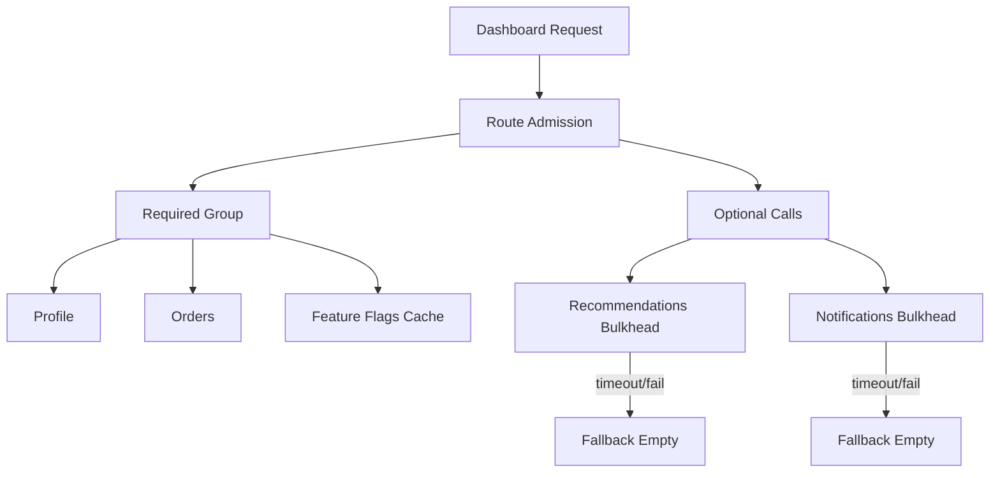
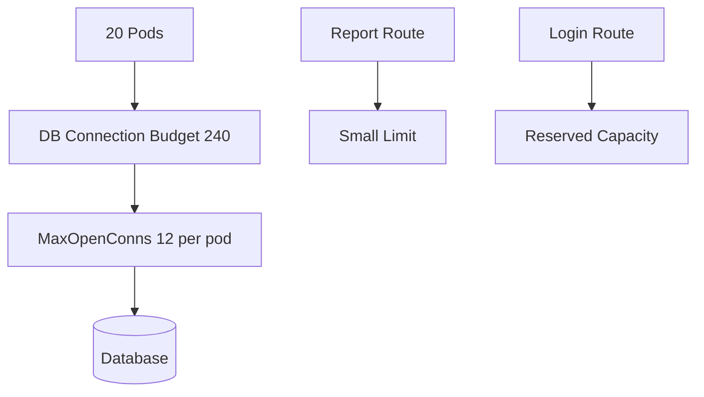
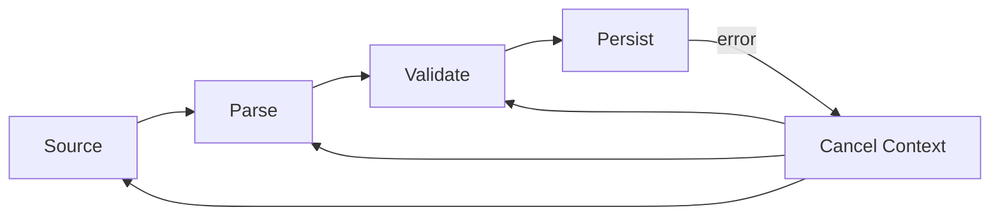
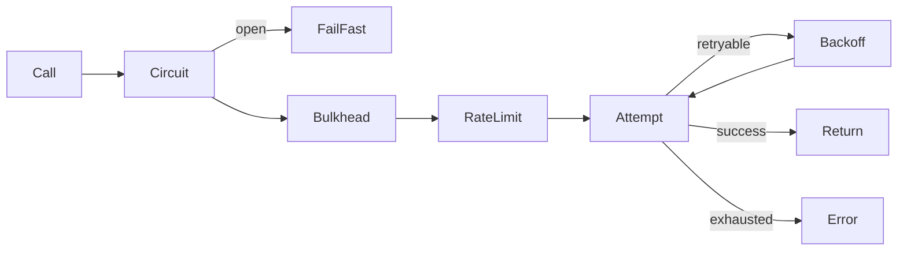
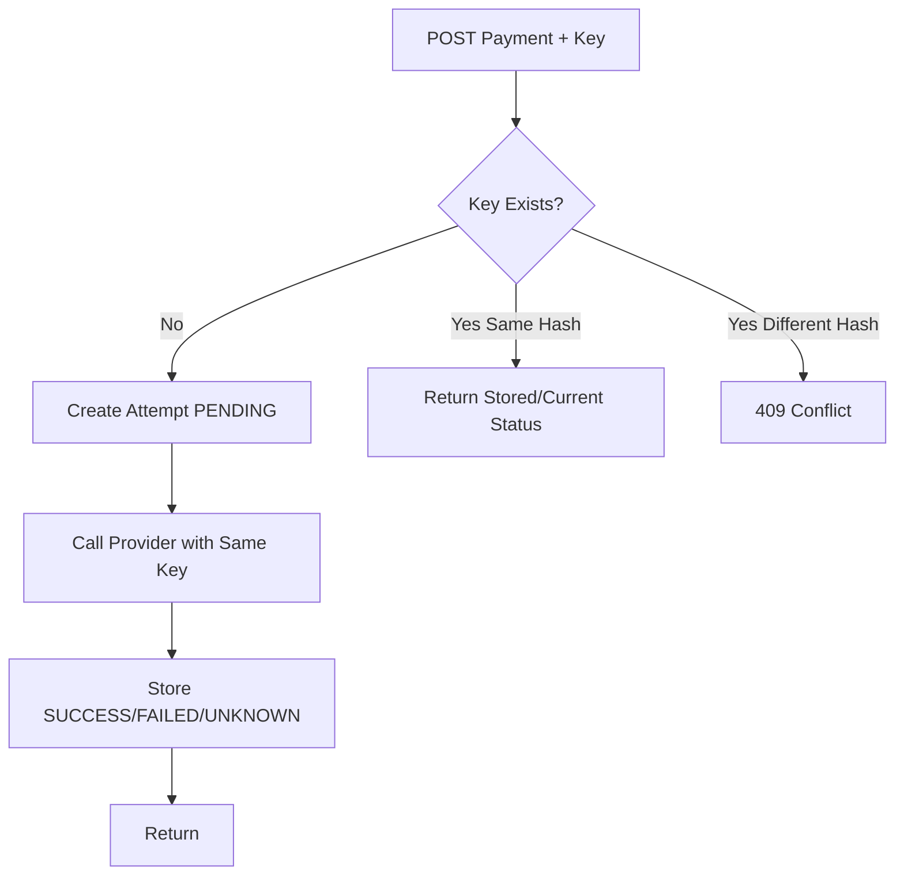
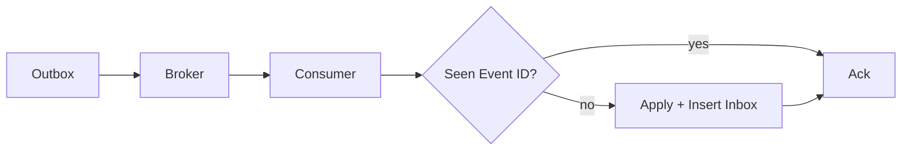
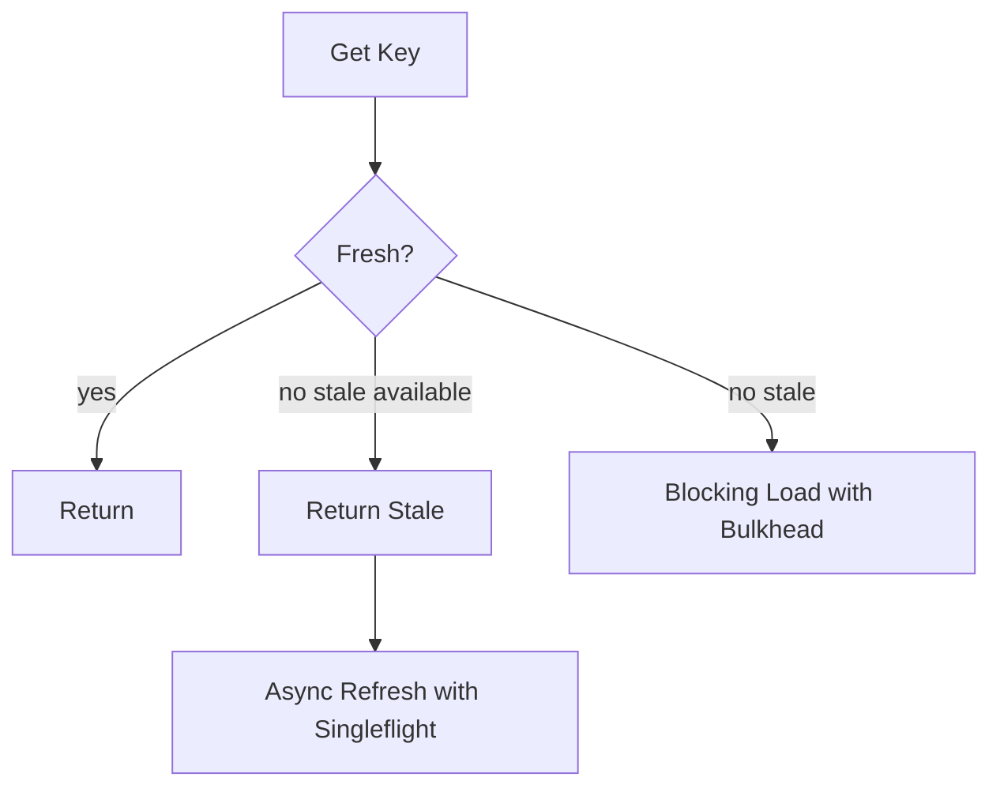
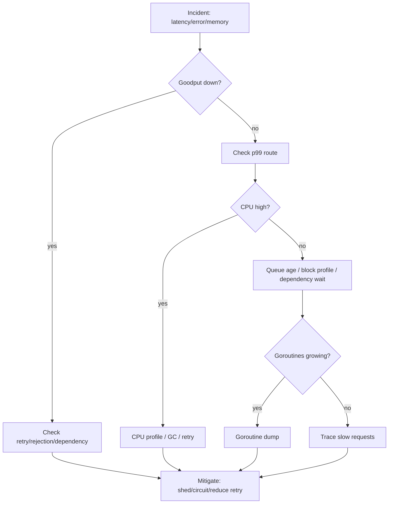

# learn-go-concurrency-parallelism-part-033.md

# Part 033 — Case Studies: Applying Go Concurrency Engineering to Real Production Scenarios

> Target pembaca: Java software engineer yang ingin mengubah teori concurrency Go menjadi kemampuan diagnosis, desain, dan decision-making production.
>
> Fokus part ini: studi kasus end-to-end yang menggabungkan goroutine, context, worker pool, DB pool, HTTP fan-out, backpressure, memory, GC, observability, retries, idempotency, outbox, graceful shutdown, and cross-service concurrency.

---

## 0. Posisi Part Ini dalam Seri

Sebelumnya kita sudah membahas hampir semua building block:

- goroutine, scheduler, memory model,
- mutex, atomic, channel, select,
- context, worker pool, pipeline,
- backpressure, bulkhead, limiter,
- concurrent data structures,
- singleflight, timers,
- network/database concurrency,
- memory/GC,
- race detection/testing,
- observability/performance,
- failure modes,
- concurrent API design,
- runtime-aware service design,
- cross-service concurrency.

Part ini menjawab:

> Bagaimana semua konsep itu dipakai saat menghadapi desain dan incident nyata?

Setiap case study akan memakai format:

1. Scenario.
2. Naive design.
3. Symptoms.
4. Root cause.
5. Correct design.
6. Go implementation sketch.
7. Observability.
8. Tests.
9. Production checklist.
10. Lessons.

---

## 1. Case Study 1 — HTTP Fan-Out Endpoint Meltdown

### 1.1 Scenario

Endpoint:

```text
GET /dashboard/{userID}
```

Mengambil:
- profile service,
- order service,
- recommendation service,
- notification service,
- feature flag service.

Naive implementation:

```go
func (h *Handler) Dashboard(w http.ResponseWriter, r *http.Request) {
    ctx := r.Context()

    var wg sync.WaitGroup

    wg.Go(func() { profile = h.profile.Get(ctx, userID) })
    wg.Go(func() { orders = h.orders.List(ctx, userID) })
    wg.Go(func() { recs = h.recs.Get(ctx, userID) })
    wg.Go(func() { notif = h.notif.List(ctx, userID) })
    wg.Go(func() { flags = h.flags.Get(ctx, userID) })

    wg.Wait()

    writeResponse(w, ...)
}
```

Problems:
- no error propagation,
- no per-dependency timeout,
- no optional/required distinction,
- no concurrency budget,
- no bulkhead,
- no retry policy,
- no partial failure policy,
- no metrics by dependency.

### 1.2 Symptoms

During recommendation service slowdown:
- dashboard p99 increases,
- goroutine count increases,
- HTTP client in-flight increases,
- client cancellations increase,
- recommendation timeouts rise,
- other endpoints also degrade because shared HTTP transport/resources saturated,
- retries amplify traffic.

### 1.3 Root Cause

One optional dependency was treated like required critical path and had no bulkhead. Fan-out multiplied downstream calls. Slow dependency held goroutines and request contexts longer. Retries made it worse.

### 1.4 Correct Design

Policy:
- profile: required, 150ms.
- orders: required, 200ms.
- recommendations: optional, 80ms, no retry, fallback empty.
- notifications: optional, 100ms, fallback empty.
- feature flags: required but cached, 50ms.

Use:
- route admission,
- errgroup for required dependencies,
- optional call isolation,
- per-dependency bulkhead,
- timeout cap,
- metrics/tracing.



### 1.5 Implementation Sketch

```go
func (h *Handler) Dashboard(w http.ResponseWriter, r *http.Request) {
    ctx := r.Context()

    if !h.dashboardLimit.TryAcquire() {
        h.metrics.Rejected("dashboard", "route_limit")
        http.Error(w, "busy", http.StatusTooManyRequests)
        return
    }
    defer h.dashboardLimit.Release()

    userID := muxUserID(r)

    var profile Profile
    var orders []Order
    var flags Flags
    var recs []Recommendation
    var notifications []Notification

    g, ctx := errgroup.WithContext(ctx)

    g.Go(func() error {
        callCtx, cancel := WithTimeoutCap(ctx, 150*time.Millisecond)
        defer cancel()

        var err error
        profile, err = h.profile.Get(callCtx, userID)
        return classifyDependencyErr("profile", err)
    })

    g.Go(func() error {
        callCtx, cancel := WithTimeoutCap(ctx, 200*time.Millisecond)
        defer cancel()

        var err error
        orders, err = h.orders.List(callCtx, userID)
        return classifyDependencyErr("orders", err)
    })

    g.Go(func() error {
        callCtx, cancel := WithTimeoutCap(ctx, 50*time.Millisecond)
        defer cancel()

        var err error
        flags, err = h.flags.Get(callCtx, userID)
        return classifyDependencyErr("flags", err)
    })

    optionalDone := make(chan struct{})

    go func() {
        defer close(optionalDone)

        var og errgroup.Group

        og.Go(func() error {
            callCtx, cancel := WithTimeoutCap(ctx, 80*time.Millisecond)
            defer cancel()

            if !h.recsBulkhead.TryAcquire() {
                h.metrics.OptionalFallback("recommendations", "bulkhead")
                return nil
            }
            defer h.recsBulkhead.Release()

            v, err := h.recs.Get(callCtx, userID)
            if err != nil {
                h.metrics.OptionalFallback("recommendations", classify(err))
                return nil
            }

            recs = v
            return nil
        })

        og.Go(func() error {
            callCtx, cancel := WithTimeoutCap(ctx, 100*time.Millisecond)
            defer cancel()

            if !h.notifBulkhead.TryAcquire() {
                h.metrics.OptionalFallback("notifications", "bulkhead")
                return nil
            }
            defer h.notifBulkhead.Release()

            v, err := h.notif.List(callCtx, userID)
            if err != nil {
                h.metrics.OptionalFallback("notifications", classify(err))
                return nil
            }

            notifications = v
            return nil
        })

        _ = og.Wait()
    }()

    if err := g.Wait(); err != nil {
        h.writeError(w, err)
        return
    }

    select {
    case <-optionalDone:
    case <-ctx.Done():
        h.writeError(w, ctx.Err())
        return
    }

    writeJSON(w, DashboardResponse{
        Profile: profile,
        Orders: orders,
        Flags: flags,
        Recommendations: recs,
        Notifications: notifications,
    })
}
```

### 1.6 Observability

Metrics:
- dependency latency by name,
- dependency timeout by name,
- optional fallback count,
- bulkhead rejected,
- request p99 by route,
- in-flight dashboard requests,
- client cancellation.

Trace:
- parent dashboard span,
- child spans for each dependency,
- fallback events.

### 1.7 Tests

- recommendation slow returns fallback.
- profile slow fails request.
- context cancellation stops all calls.
- bulkhead full returns fallback for optional.
- route admission rejects.
- no goroutine leak on early required failure.

### 1.8 Lessons

- Fan-out needs budget.
- Optional dependency must not control critical path.
- Required vs optional is a product/reliability contract.
- Retries need idempotency and deadline.
- Trace fan-out is critical.

---

## 2. Case Study 2 — Database Pool Meltdown After Scaling Pods

### 2.1 Scenario

Service originally:
- 4 pods,
- `MaxOpenConns=50`,
- total potential DB conns = 200.

HPA changed:
- 20 pods,
- still `MaxOpenConns=50`,
- total potential DB conns = 1000.

DB capacity safe limit: 300.

### 2.2 Symptoms

After traffic spike:
- DB CPU high,
- DB connection count high,
- app p99 high,
- DB wait events high,
- deadlocks/lock waits up,
- app retries up,
- some pods OOM due to in-flight growth.

### 2.3 Root Cause

Horizontal scaling multiplied DB connections and concurrent queries. App scaling overloaded shared dependency.

### 2.4 Correct Design

Budget:
```text
DB safe app connections: 240
max pods: 20
max open per pod: 12
```

Plus:
- route-level DB admission,
- report route isolation,
- query timeout,
- transaction scope review,
- retry only deadlock/serialization and idempotent,
- dashboard for DB pool wait.



### 2.5 Implementation Sketch

```go
func ConfigureDB(db *sql.DB, cfg DBCfg) {
    db.SetMaxOpenConns(cfg.MaxOpenConns)
    db.SetMaxIdleConns(cfg.MaxIdleConns)
    db.SetConnMaxLifetime(cfg.MaxLifetime)
    db.SetConnMaxIdleTime(cfg.MaxIdleTime)
}
```

Route DB bulkhead:

```go
func (s *Service) LoadReport(ctx context.Context, req ReportReq) (Report, error) {
    if err := s.reportDBSem.Acquire(ctx); err != nil {
        return Report{}, ErrReportBusy
    }
    defer s.reportDBSem.Release()

    queryCtx, cancel := WithTimeoutCap(ctx, 2*time.Second)
    defer cancel()

    return s.repo.Report(queryCtx, s.db, req)
}
```

DB stats loop:

```go
func ObserveDB(ctx context.Context, db *sql.DB, m DBMetrics) {
    ticker := time.NewTicker(10 * time.Second)
    defer ticker.Stop()

    for {
        select {
        case <-ctx.Done():
            return
        case <-ticker.C:
            s := db.Stats()
            m.OpenConnections(s.OpenConnections)
            m.InUse(s.InUse)
            m.Idle(s.Idle)
            m.WaitCount(s.WaitCount)
            m.WaitDuration(s.WaitDuration)
        }
    }
}
```

### 2.6 Tests and Validation

- load test at max pod count.
- verify total connection budget.
- DB pool wait p95 under target.
- report route cannot starve login.
- transaction duration histogram.
- retry count bounded.

### 2.7 Lessons

- Pod scaling is dependency scaling.
- DB pool size must be computed, not guessed.
- More app replicas can reduce availability.
- Isolate slow/heavy DB workloads.

---

## 3. Case Study 3 — Pipeline Goroutine Leak on Early Exit

### 3.1 Scenario

Pipeline:
- read file,
- parse records,
- validate,
- persist.

Consumer stops after first error.

Naive stage:

```go
func Validate(in <-chan Record) <-chan ValidRecord {
    out := make(chan ValidRecord)

    go func() {
        defer close(out)

        for r := range in {
            if valid(r) {
                out <- transform(r)
            }
        }
    }()

    return out
}
```

### 3.2 Symptoms

- goroutine count increases per failed import,
- heap grows,
- shutdown hangs,
- goroutine dump shows `chan send`.

### 3.3 Root Cause

Downstream exits early; upstream stage blocks sending because no receiver. Stage did not observe cancellation.

### 3.4 Correct Design

- pipeline context,
- cancellation-aware send/receive,
- errgroup,
- owner waits for all stages,
- bounded channels,
- drain/cancel policy.



### 3.5 Implementation Sketch

```go
func Validate(ctx context.Context, in <-chan Record) <-chan ValidRecord {
    out := make(chan ValidRecord)

    go func() {
        defer close(out)

        for {
            select {
            case <-ctx.Done():
                return

            case r, ok := <-in:
                if !ok {
                    return
                }

                if !valid(r) {
                    continue
                }

                vr := transform(r)

                select {
                case out <- vr:
                case <-ctx.Done():
                    return
                }
            }
        }
    }()

    return out
}
```

Better: errgroup-managed pipeline with `Wait`.

### 3.6 Test

```go
func TestPipelineEarlyExitNoLeak(t *testing.T) {
    ctx, cancel := context.WithCancel(context.Background())

    done := make(chan struct{})

    go func() {
        defer close(done)
        _ = RunPipeline(ctx, input)
    }()

    cancel()

    select {
    case <-done:
    case <-time.After(time.Second):
        t.Fatal("pipeline did not stop")
    }
}
```

### 3.7 Lessons

- Every pipeline send should consider receiver disappearance.
- Context cancellation is part of pipeline contract.
- Early exit tests are mandatory.

---

## 4. Case Study 4 — Retry Storm Against External API

### 4.1 Scenario

Service calls external address validation API.
External API starts returning 503 for 30 seconds.

Naive retry:
```go
for i := 0; i < 5; i++ {
    resp, err := client.Call(ctx, req)
    if err == nil {
        return resp, nil
    }
}
```

No delay, no jitter, no retry budget.

### 4.2 Symptoms

- outgoing RPS 5x normal,
- external API rate limits,
- app latency high,
- worker pool saturated,
- queue grows,
- success goodput lower than before,
- logs flooded.

### 4.3 Root Cause

Retries amplified failure. No circuit breaker, no jitter, no budget, no fallback.

### 4.4 Correct Design

- classify retryable errors,
- max attempts small,
- backoff+jitter,
- retry only while budget remains,
- circuit breaker,
- bulkhead,
- fallback or fail-fast,
- respect Retry-After.



### 4.5 Implementation Sketch

```go
func (c *Client) Validate(ctx context.Context, req Req) (Resp, error) {
    if !c.circuit.Allow() {
        return Resp{}, ErrCircuitOpen
    }

    if err := c.bulkhead.Acquire(ctx); err != nil {
        return Resp{}, err
    }
    defer c.bulkhead.Release()

    var last error

    for attempt := 0; attempt < c.maxAttempts; attempt++ {
        if !hasEnoughBudget(ctx, 50*time.Millisecond) {
            return Resp{}, ErrInsufficientBudget
        }

        callCtx, cancel := WithTimeoutCap(ctx, c.perAttemptTimeout)
        resp, err := c.callOnce(callCtx, req)
        cancel()

        if err == nil {
            c.circuit.RecordSuccess()
            return resp, nil
        }

        last = err
        c.circuit.RecordFailure(err)

        if !isRetryable(err) || attempt == c.maxAttempts-1 {
            break
        }

        delay := jitter(backoff(attempt))
        if err := Sleep(ctx, delay); err != nil {
            return Resp{}, err
        }
    }

    return Resp{}, last
}
```

### 4.6 Observability

- original attempts vs retries,
- retry success ratio,
- circuit state,
- bulkhead wait/reject,
- dependency latency/error,
- goodput.

### 4.7 Lessons

- Retry is load.
- Retry without backoff is attack traffic.
- Circuit breaker protects dependency and caller.
- Goodput is the metric that reveals storms.

---

## 5. Case Study 5 — Duplicate Payment from Timeout Retry

### 5.1 Scenario

Client calls:

```text
POST /payments
```

Client times out after 2s and retries.
Server had sent request to payment provider; provider succeeded but server response was lost.

### 5.2 Symptoms

- duplicate payment charge,
- audit shows two server requests,
- provider shows two successful charges,
- no idempotency key.

### 5.3 Root Cause

Timeout was interpreted as failure, but operation may have succeeded. Retry repeated non-idempotent side effect.

### 5.4 Correct Design

- idempotency key,
- request hash,
- payment attempt state machine,
- external provider idempotency key,
- reconciliation for unknown status.



### 5.5 Lessons

- Timeout means unknown, not failed.
- Idempotency is required for retried side effects.
- External provider idempotency should be used if available.
- State machine beats boolean success/fail.

---

## 6. Case Study 6 — Outbox Publisher Duplicates Event

### 6.1 Scenario

Outbox publisher:
1. Reads unpublished event.
2. Publishes to broker.
3. Marks event published.

Crash happens after publish but before mark.

### 6.2 Symptoms

After restart:
- same event republished.
- downstream consumer processes duplicate.
- duplicate email sent.

### 6.3 Root Cause

Outbox prevents lost event, not duplicate event. Consumer was not idempotent.

### 6.4 Correct Design

- outbox producer,
- inbox/dedup consumer,
- event id stable,
- consumer side effect idempotency.



### 6.5 Lessons

- Outbox gives at-least-once publish.
- Consumers must be idempotent.
- Exactly-once end-to-end is usually an illusion.

---

## 7. Case Study 7 — Worker Pool OOM from Huge Queue

### 7.1 Scenario

Worker pool:
```go
jobs := make(chan Job, 100000)
```

Each job contains decoded payload averaging 64 KiB, p99 2 MiB.

### 7.2 Symptoms

- memory grows during burst,
- GC CPU rises,
- p99 worsens,
- pod OOMKilled,
- queue depth high,
- oldest queue age high.

### 7.3 Root Cause

Queue capacity chosen without memory budget.

Worst average:
```text
100000 × 64KiB = ~6.4GiB
```

p99 worse.

### 7.4 Correct Design

- queue lightweight IDs,
- store payload externally or process streaming,
- smaller queue,
- memory-based admission,
- queue expiration,
- fail-fast overload.

```go
type JobRef struct {
    ID       string
    Deadline time.Time
}
```

### 7.5 Lessons

- Queue size is memory policy.
- Queue age is overload signal.
- Bigger queue often worsens incident.
- Backpressure must happen before memory explosion.

---

## 8. Case Study 8 — Periodic Job Overlap

### 8.1 Scenario

Ticker every 1 minute.
Job sometimes takes 3 minutes.

Naive:

```go
for range ticker.C {
    go runJob()
}
```

### 8.2 Symptoms

- multiple jobs overlap,
- DB load spikes,
- duplicate work,
- lock contention,
- job results race.

### 8.3 Correct Design Options

Option A: skip if previous still running.

```go
var running atomic.Bool

for {
    select {
    case <-ticker.C:
        if !running.CompareAndSwap(false, true) {
            metrics.Skipped("still_running")
            continue
        }

        go func() {
            defer running.Store(false)
            _ = runJob(ctx)
        }()
    case <-ctx.Done():
        return
    }
}
```

Option B: run sequential fixed delay.

```go
for {
    runCtx, cancel := context.WithTimeout(ctx, maxDuration)
    _ = runJob(runCtx)
    cancel()

    if err := Sleep(ctx, interval); err != nil {
        return err
    }
}
```

Option C: distributed lease if multiple pods.

### 8.4 Lessons

- Periodic job overlap must be a deliberate policy.
- Ticker does not wait for job completion.
- Multi-pod scheduled jobs need distributed coordination/idempotency.

---

## 9. Case Study 9 — Hot Key Bottleneck in Sharded Worker

### 9.1 Scenario

Jobs are partitioned by user ID into 32 shards.
One celebrity user gets 40% traffic.

### 9.2 Symptoms

- one shard queue age high,
- global worker utilization low,
- p99 high for that user,
- other keys in same shard delayed.

### 9.3 Root Cause

Per-key ordering + hash shard creates hot shard. One key dominates.

### 9.4 Options

1. Accept if per-key strict order required.
2. Split hot key by subkey if ordering can be relaxed.
3. Special hot-key lane.
4. Move to actor per key with hot-key backpressure.
5. Use DB/version conflict instead of strict serial execution.
6. Rate limit hot key/tenant.

### 9.5 Lessons

- Per-key serialization protects correctness but creates hot-key risk.
- Queue metrics should be per shard/key class.
- Ordering and throughput trade off.

---

## 10. Case Study 10 — Graceful Shutdown Kills In-Flight Jobs

### 10.1 Scenario

Kubernetes sends SIGTERM.
Service uses:

```go
ctx, stop := signal.NotifyContext(...)
<-ctx.Done()
server.Shutdown(ctx)
```

But `ctx` is already cancelled.

### 10.2 Symptoms

- Shutdown returns immediately,
- in-flight jobs killed,
- message redelivered,
- duplicate processing,
- logs show context canceled.

### 10.3 Correct Design

Use fresh shutdown context.

```go
root, stop := signal.NotifyContext(context.Background(), os.Interrupt, syscall.SIGTERM)
defer stop()

<-root.Done()

readiness.Set(false)

shutdownCtx, cancel := context.WithTimeout(context.Background(), 25*time.Second)
defer cancel()

_ = server.Shutdown(shutdownCtx)
_ = app.Shutdown(shutdownCtx)
```

Worker shutdown:
- stop accepting,
- drain or cancel according policy,
- ack only durable work,
- release leases if possible,
- leave unfinished work retryable.

### 10.4 Lessons

- Signal context is for receiving signal, not for shutdown work after it is cancelled.
- Graceful shutdown must be tested.
- Readiness should fail before drain.

---

## 11. Case Study 11 — Cache Stampede Across Pods

### 11.1 Scenario

100 pods have local cache.
A popular key expires at same time.

Local singleflight deduplicates within pod only:
- 1 call per pod,
- 100 calls to dependency.

### 11.2 Symptoms

- dependency spike every TTL boundary,
- p99 spikes,
- occasional 429,
- retry storm.

### 11.3 Correct Design

- TTL jitter,
- stale-while-revalidate,
- distributed cache,
- dependency bulkhead,
- early refresh,
- negative caching for misses.



### 11.4 Lessons

- Local singleflight is not global.
- TTL synchronization causes herd.
- Stale data can be a reliability feature.

---

## 12. Case Study 12 — Mutex Held During Callback

### 12.1 Scenario

Cache API:

```go
func (c *Cache) Range(fn func(string, Value) bool) {
    c.mu.Lock()
    defer c.mu.Unlock()

    for k, v := range c.m {
        if !fn(k, v) {
            return
        }
    }
}
```

Callback calls `cache.Get`, causing deadlock.

### 12.2 Symptoms

- endpoint hangs,
- goroutine dump shows mutex lock,
- p99 infinite for route.

### 12.3 Correct Design

- snapshot before callback,
- document callback not under lock,
- or document callback restrictions strongly.

```go
func (c *Cache) Range(fn func(string, Value) bool) {
    snapshot := c.Snapshot()

    for k, v := range snapshot {
        if !fn(k, v) {
            return
        }
    }
}
```

### 12.4 Lessons

- Callback under lock is dangerous API design.
- Deadlocks often come from reentrancy.
- API contract matters.

---

## 13. Case Study 13 — Channel Close Race in Stop

### 13.1 Scenario

Pool exposes:
```go
func (p *Pool) Submit(job Job) { p.jobs <- job }
func (p *Pool) Stop() { close(p.jobs) }
```

Submit and Stop can run concurrently.

### 13.2 Symptoms

- panic: send on closed channel.
- rare in production, hard to reproduce.
- appears during deployments.

### 13.3 Correct Design

Serialize admission and close.

```go
type Pool struct {
    mu      sync.Mutex
    stopped bool
    jobs    chan Job
}

func (p *Pool) Submit(ctx context.Context, job Job) error {
    p.mu.Lock()
    if p.stopped {
        p.mu.Unlock()
        return ErrStopped
    }

    jobs := p.jobs
    p.mu.Unlock()

    select {
    case jobs <- job:
        return nil
    case <-ctx.Done():
        return ctx.Err()
    }
}
```

But note: this still can race if Stop closes after unlock before send. Better design:
- do not close jobs while submitters may send,
- use admission channel/actor,
- hold lock during non-blocking enqueue if buffered and capacity checked,
- use separate stop state and workers exit via context,
- Stop stops accepting then waits/drains without closing externally sendable channel.

A robust pattern:
- Submit sends through method only.
- internal dispatcher owns channel close.
- Stop changes state under lock and cancels worker context.

### 13.4 Lessons

- Closing channel is a lifecycle event, not just cleanup.
- If multiple goroutines can send, close ownership must be centralized.
- Stop/Submit race tests are mandatory.

---

## 14. Case Study 14 — CPU Parallelism Slower with More Goroutines

### 14.1 Scenario

Batch normalization uses goroutine per record.

```go
for _, rec := range records {
    go normalize(rec)
}
```

Records: 1 million, each small.

### 14.2 Symptoms

- memory huge,
- scheduler overhead high,
- CPU profile shows runtime scheduling/channel overhead,
- throughput worse than sequential.

### 14.3 Correct Design

- chunk records,
- workers near GOMAXPROCS,
- local buffers,
- local reduction/merge.

```go
workers := runtime.GOMAXPROCS(0)

ParallelFor(len(records), workers, func(start, end int) {
    for i := start; i < end; i++ {
        out[i] = normalize(records[i])
    }
})
```

### 14.4 Lessons

- CPU parallelism is about cores, not goroutine count.
- Granularity matters.
- Measure with benchmark and pprof.

---

## 15. Cross-Case Pattern Summary

| Symptom | Likely Cause | Tool |
|---|---|---|
| goroutine count grows | leak/blocked channel | goroutine dump |
| p99 high CPU low | blocking/queue/dependency | trace/block profile |
| p99 high CPU high | CPU hot/retry/GC | CPU profile |
| memory grows | queue/cache/goroutine retention | heap profile |
| DB wait high | pool/slow query/too many pods | DB stats |
| duplicate side effect | retry/idempotency missing | audit/idempotency table |
| queue age high | service rate < arrival | queue metrics |
| attempts high goodput low | retry storm | goodput dashboard |
| shutdown timeout | lifecycle leak | shutdown logs/dump |
| panic send closed channel | close ownership bug | race/stress test |

---

## 16. Production Incident Triage Flow



---

## 17. Design Principles Reinforced

1. Bound every queue.
2. Budget every dependency.
3. Classify required vs optional.
4. Propagate deadlines.
5. Retry only with idempotency.
6. Use outbox/inbox for cross-service events.
7. Make pipeline sends cancellation-aware.
8. Test Stop vs Submit.
9. Use pprof/goroutine dump early.
10. Queue age is as important as depth.
11. Do not optimize without profiles.
12. Local correctness is not distributed correctness.

---

## 18. Mini Lab 1 — Build a Dashboard Endpoint

Create an endpoint with required and optional fan-out.
Add:
- dependency metrics,
- fallback metrics,
- trace spans,
- route admission.

Simulate optional dependency slow.

---

## 19. Mini Lab 2 — DB Pool Budget Drill

Given:
- DB max app conns 300,
- max pods 24,
- two services share DB,
- migration job needs 20 connections.

Calculate safe max per pod.
Load test with too-high and corrected settings.

---

## 20. Mini Lab 3 — Pipeline Leak Reproduction

Build leaking pipeline.
Capture goroutine dump.
Fix with context-aware send.
Add test.

---

## 21. Mini Lab 4 — Idempotent Payment

Implement payment command state machine:
- PENDING,
- PROCESSING,
- SUCCEEDED,
- FAILED,
- UNKNOWN.

Use idempotency key and request hash.
Simulate timeout and retry.

---

## 22. Mini Lab 5 — Outbox Duplicate Consumer

Create outbox publisher that may crash after publish.
Show duplicate event.
Add inbox dedup consumer.

---

## 23. Mini Lab 6 — Shutdown Under Load

Run HTTP + worker + broker consumer.
Send SIGTERM during load.
Verify:
- readiness false,
- no new work,
- in-flight behavior documented,
- no goroutine leak,
- unfinished messages redeliver safely.

---

## 24. Top 1% Heuristics

1. Case studies are where concurrency knowledge becomes engineering judgment.
2. Every slowdown asks: where is work waiting?
3. Every retry asks: what if the first attempt succeeded?
4. Every queue asks: how much memory and how old can work become?
5. Every fan-out asks: what is the multiplicative load?
6. Every optional dependency asks: what is the fallback?
7. Every outbox asks: is the consumer idempotent?
8. Every shutdown asks: what happens to accepted work?
9. Every scale-out asks: what shared dependency gets multiplied?
10. Every channel close asks: who is the sole owner?
11. Every worker pool asks: what happens when full?
12. Every cache asks: what happens at TTL boundary?
13. Every hot key asks: what ordering is truly required?
14. Every performance claim asks: where is the profile?
15. Every production design asks: how does it fail?

---

## 25. Source Notes

Primary concepts applied in this part:

1. Go service concurrency:
   - context,
   - errgroup,
   - worker pools,
   - channel cancellation,
   - shutdown.

2. Runtime and profiling:
   - pprof,
   - goroutine dumps,
   - heap/CPU/block/mutex profiles,
   - runtime metrics.

3. Reliability:
   - backpressure,
   - bulkhead,
   - circuit breaker,
   - retry budget,
   - idempotency,
   - outbox/inbox,
   - graceful shutdown.

4. Distributed systems:
   - at-least-once delivery,
   - fan-out amplification,
   - cross-pod cache stampede,
   - saga/side effect consistency.

---

## 26. Summary

This part applied the series to realistic incidents and designs.

The repeated pattern is clear:

- make capacity explicit,
- make lifecycle explicit,
- make ownership explicit,
- make cancellation explicit,
- make idempotency explicit,
- make observability explicit.

The core rule:

> Production concurrency engineering is the ability to predict failure modes before traffic discovers them.

---

## 27. Status Seri

Selesai:
- Part 000 — Orientation
- Part 001 — Foundations
- Part 002 — Goroutine Internals
- Part 003 — Go Scheduler Deep Dive
- Part 004 — GOMAXPROCS, CPU Quotas, Containers
- Part 005 — Go Memory Model
- Part 006 — Synchronization Primitives
- Part 007 — Atomic Operations
- Part 008 — Channels Deep Dive
- Part 009 — Select Semantics
- Part 010 — WaitGroup, ErrGroup, Task Groups, and Structured Concurrency
- Part 011 — Context as Concurrency Contract
- Part 012 — Ownership Models
- Part 013 — Worker Pools
- Part 014 — Fan-Out/Fan-In, Pipelines, Stages, and Stream Processing
- Part 015 — Backpressure End-to-End
- Part 016 — Semaphores, Rate Limiters, Token Buckets, and Bulkheads
- Part 017 — Concurrent Data Structures
- Part 018 — Singleflight, Deduplication, Idempotency, and Stampede Prevention
- Part 019 — Timers, Tickers, Deadlines, Scheduling, and Time-Based Concurrency
- Part 020 — Network Concurrency
- Part 021 — Database Concurrency
- Part 022 — Parallel CPU Work
- Part 023 — Memory, Allocation, GC, and Concurrency Pressure
- Part 024 — Race Detection, Static Analysis, and Concurrency Bug Hunting
- Part 025 — Testing Concurrent Code
- Part 026 — Observability for Concurrent Systems
- Part 027 — Performance Engineering for Concurrent Go
- Part 028 — Failure Modes in Concurrent Go Systems
- Part 029 — Designing Concurrent APIs
- Part 030 — Runtime-Aware Service Design
- Part 031 — Advanced Concurrency Patterns
- Part 032 — Cross-Service Concurrency
- Part 033 — Case Studies

Belum selesai:
- Part 034.

Seri belum mencapai bagian terakhir.


<!-- NAVIGATION_FOOTER -->
<div class="page-nav">
<a href="./learn-go-concurrency-parallelism-part-032.md">⬅️ Part 032 — Cross-Service Concurrency: Timeouts, Retries, Idempotency, Queues, Sagas, and Backpressure Across Microservices</a>
<a href="./index.md">📚 Kategori</a>
<a href="../../index.md">🏠 Home</a>
<a href="./learn-go-concurrency-parallelism-part-034.md">Part 034 — Engineering Handbook: Final Synthesis, Decision Matrices, Checklists, Playbooks, and Mastery Roadmap ➡️</a>
</div>
