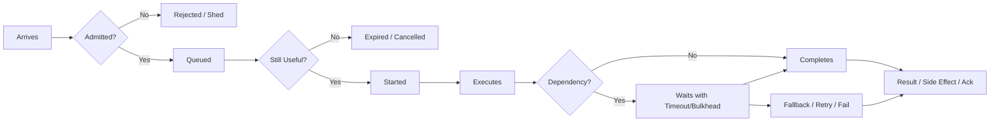
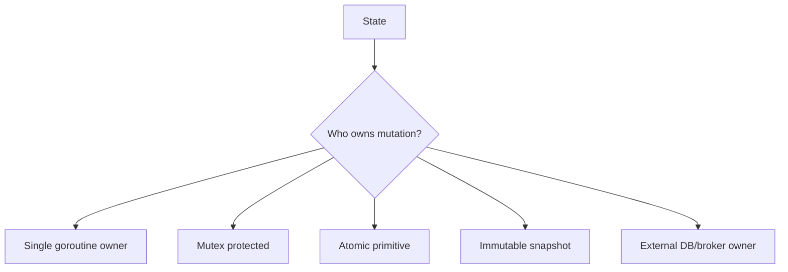
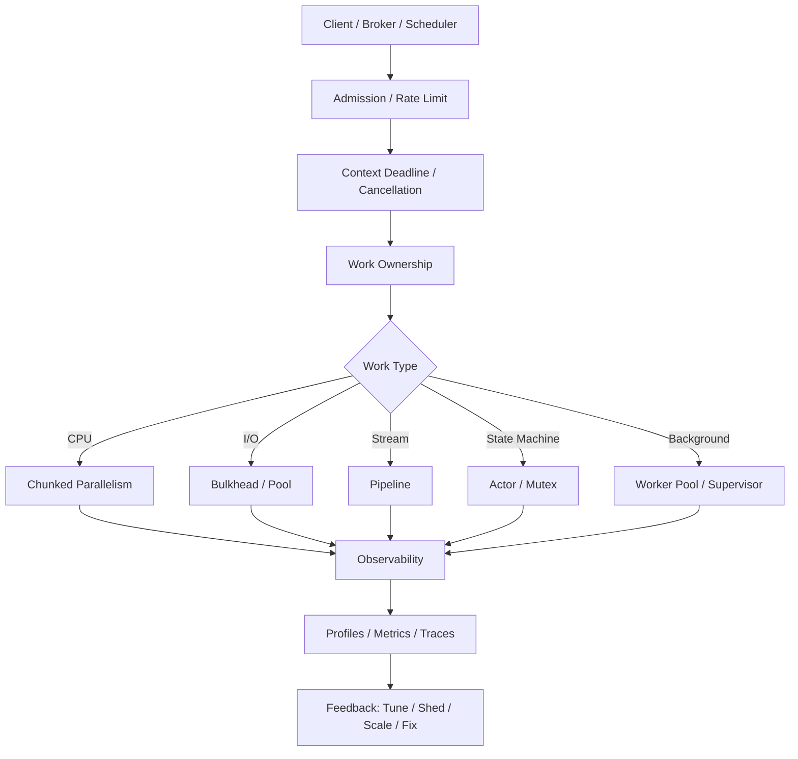
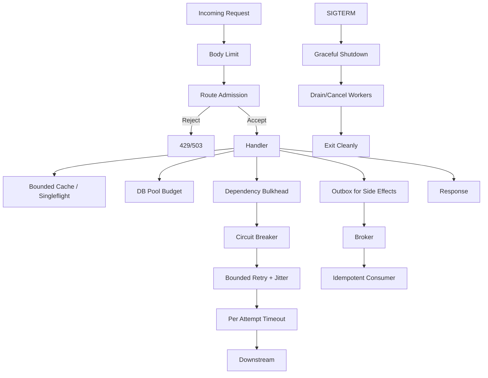

# learn-go-concurrency-parallelism-part-034.md

# Part 034 — Engineering Handbook: Final Synthesis, Decision Matrices, Checklists, Playbooks, and Mastery Roadmap

> Target pembaca: Java software engineer yang sudah menyelesaikan seluruh seri Go Thread, Concurrency, Parallelism & Runtime Engineering dan ingin memiliki handbook praktis untuk desain, review, debugging, testing, dan operasi sistem concurrent Go production.
>
> Fokus part ini: synthesis, mental models, decision matrix, design checklist, code review checklist, incident playbooks, operational dashboards, anti-pattern index, interview/self-assessment, and long-term mastery roadmap.

---

## 0. Posisi Part Ini dalam Seri

Ini adalah **bagian terakhir** dari seri.

Sampai titik ini kita sudah membahas:

- Part 000: orientasi Java → Go.
- Part 001: work, time, state, ordering, contention.
- Part 002: goroutine internals.
- Part 003: scheduler.
- Part 004: GOMAXPROCS, CPU quota, container.
- Part 005: memory model.
- Part 006: synchronization primitives.
- Part 007: atomic operations.
- Part 008: channels.
- Part 009: select.
- Part 010: WaitGroup, errgroup, structured concurrency.
- Part 011: context.
- Part 012: ownership.
- Part 013: worker pools.
- Part 014: pipelines.
- Part 015: backpressure.
- Part 016: semaphores, rate limiters, bulkheads.
- Part 017: concurrent data structures.
- Part 018: singleflight, deduplication, idempotency.
- Part 019: timers/deadlines.
- Part 020: network concurrency.
- Part 021: database concurrency.
- Part 022: parallel CPU work.
- Part 023: memory, allocation, GC.
- Part 024: race detection/static analysis.
- Part 025: testing concurrent code.
- Part 026: observability.
- Part 027: performance engineering.
- Part 028: failure modes.
- Part 029: concurrent API design.
- Part 030: runtime-aware service design.
- Part 031: advanced patterns.
- Part 032: cross-service concurrency.
- Part 033: case studies.

Part ini adalah handbook final: satu tempat untuk berpikir, memilih pattern, melakukan review, dan mengoperasikan concurrency Go secara production-grade.

---

## 1. The Core Thesis

Go concurrency bukan tentang “pakai goroutine sebanyak mungkin”.

Go concurrency adalah seni dan engineering untuk mengatur:

1. **Work** — pekerjaan apa yang harus dilakukan?
2. **Ownership** — siapa pemilik state/resource?
3. **Ordering** — urutan apa yang harus dijaga?
4. **Capacity** — berapa banyak yang boleh berjalan/menunggu?
5. **Cancellation** — siapa boleh menghentikan work?
6. **Deadline** — kapan work tidak lagi berguna?
7. **Backpressure** — apa yang terjadi saat overload?
8. **Memory** — berapa object yang hidup bersamaan?
9. **Failure** — apa yang terjadi saat dependency lambat/gagal?
10. **Observability** — bagaimana tahu work menunggu di mana?
11. **Shutdown** — bagaimana berhenti tanpa merusak data?
12. **Distributed correctness** — apa yang terjadi saat retry/duplicate/redelivery?

Jika Anda bisa menjawab 12 hal ini untuk setiap concurrent subsystem, Anda jauh di atas rata-rata engineer.

---

## 2. Final Mental Model: Work Lifecycle

Setiap unit work melewati lifecycle:



Review setiap stage:
- Apakah bounded?
- Apakah observable?
- Apakah cancellable?
- Apakah idempotent?
- Apakah failure policy jelas?
- Apakah resource dilepas?

---

## 3. Final Mental Model: State Ownership

Semua concurrency bug state biasanya berasal dari ownership yang kabur.



Choose one. Jangan campur tanpa alasan.

Rules:
- If invariant spans multiple fields, prefer mutex or actor.
- If state is simple scalar, atomic may be enough.
- If reads dominate and updates occasional, immutable snapshot can be excellent.
- If state must be durable/cross-pod, local mutex is irrelevant.
- If state is complex protocol/session, actor-like owner can simplify.

---

## 4. Final Mental Model: Capacity Boundaries

Capacity boundary adalah tempat Anda menjawab:

> Kalau lebih banyak work datang daripada yang bisa kita selesaikan, apa yang terjadi?

Boundaries:
- HTTP route admission.
- Worker queue.
- Semaphore/bulkhead.
- Rate limiter.
- DB pool.
- HTTP transport.
- Cache max size.
- Broker prefetch.
- Per-tenant quota.
- Memory budget.
- CPU worker count.

Unbounded system bukan scalable. Ia hanya belum dites cukup keras.

---

## 5. Decision Matrix: Mutex vs Channel vs Atomic vs Actor

| Need | Prefer |
|---|---|
| protect simple shared map | `sync.Mutex` / `sync.RWMutex` |
| protect multi-field invariant | `sync.Mutex` |
| one goroutine owns ordered state machine | actor/event loop |
| hand off data ownership | channel |
| broadcast cancellation | context/channel close |
| simple counter/flag | atomic |
| read-mostly config | atomic immutable snapshot |
| wait for N goroutines | WaitGroup/errgroup |
| error propagation with cancellation | errgroup |
| bounded concurrent access | semaphore/bulkhead |
| rate over time | rate limiter |
| per-key duplicate suppression | singleflight |
| durable cross-pod uniqueness | DB unique constraint/idempotency |
| cross-service event reliability | outbox/inbox |

Heuristic:
> Use the simplest primitive that makes ownership and lifecycle obvious.

---

## 6. Decision Matrix: Worker Pool vs Semaphore vs Pipeline

| Problem | Pattern |
|---|---|
| many independent jobs, bounded workers | worker pool |
| limit a section of code/dependency calls | semaphore/bulkhead |
| multi-stage transformation/stream | pipeline |
| CPU-bound slice processing | chunked parallel loop |
| per-key order | sharded executor / per-key actor |
| async background processing | bounded queue + workers |
| request fan-out | errgroup + bounded semaphore |
| dependency overload protection | bulkhead + timeout + circuit |
| broker consumer | consumer concurrency + idempotency |
| periodic work | ticker loop with non-overlap/lease |

Avoid using worker pool when a simple semaphore around dependency call is enough.

---

## 7. Decision Matrix: Timeout, Retry, Circuit, Bulkhead, Rate Limit

| Pattern | Solves | Does Not Solve |
|---|---|---|
| timeout/deadline | prevents waiting forever | duplicate side effects |
| retry | transient failure | persistent outage/overload |
| backoff+jitter | synchronized retry spikes | non-idempotency |
| retry budget | retry amplification | root dependency failure |
| bulkhead | resource isolation | bad result correctness |
| circuit breaker | fail fast during outage | need for fallback |
| rate limiter | rate quota | in-flight saturation |
| idempotency | duplicate execution | latency |
| outbox | lost publish after DB commit | duplicate event by itself |
| inbox/dedup | duplicate message effects | message ordering |

These patterns compose, but composition must be deliberate.

---

## 8. Design Checklist: New Concurrent Component

Before coding:

1. What is the unit of work?
2. Who submits work?
3. Who owns execution?
4. Is work synchronous or asynchronous?
5. Is there a maximum concurrency?
6. Is there a queue?
7. What is queue capacity?
8. What is memory per queued item?
9. What if queue is full?
10. What if caller cancels?
11. What if work expires before running?
12. What if worker panics?
13. What if dependency is slow?
14. What if dependency fails?
15. Is retry needed?
16. Is operation idempotent?
17. Is ordering required?
18. Is per-key ordering required?
19. Is output order required?
20. Who closes channels?
21. Who stops goroutines?
22. Who waits for goroutines?
23. What metrics are emitted?
24. What logs/traces identify lifecycle?
25. What tests prove shutdown/cancel/full/error behavior?

If you cannot answer these, design is not ready.

---

## 9. Code Review Checklist: Goroutines

For every `go` statement:

1. Who owns this goroutine?
2. When does it exit?
3. Is there a context/done signal?
4. Who waits for it?
5. What happens if caller returns early?
6. What references does it capture?
7. Can it block forever?
8. Does it recover panic or intentionally crash?
9. Does it release resources?
10. Is goroutine count bounded?

A `go` statement without lifecycle is technical debt.

---

## 10. Code Review Checklist: Channels

For every channel:

1. Who sends?
2. Who receives?
3. Who closes?
4. Is it directional in API?
5. Is buffer size justified?
6. What if receiver exits early?
7. What if sender exits early?
8. Are sends cancellation-aware where needed?
9. Is close used as signal or data end?
10. Can there be send-on-closed?
11. Can there be receive forever?
12. Is nil channel used intentionally and documented?

---

## 11. Code Review Checklist: Context

For every context:

1. Is request context propagated to request work?
2. Is background work using service context?
3. Is cancel called?
4. Is timeout/deadline appropriate?
5. Is remaining budget checked before retry?
6. Is cleanup using fresh context if parent cancelled?
7. Are context values small and request-scoped?
8. Is `context.Background()` used only at root?
9. Does function document what ctx controls?
10. Does cancellation actually stop blocking operations?

---

## 12. Code Review Checklist: Locks and Atomics

For every lock:

1. What invariant does it protect?
2. Are all accesses protected?
3. Is lock copied accidentally?
4. Is IO/callback under lock?
5. Is lock order consistent?
6. Can it be held too long?
7. Is RWMutex justified by measurement?
8. Are internal mutable references returned?

For atomics:

1. Is this single-value state?
2. Are multiple atomics forming one invariant? If yes, use lock.
3. Is CAS required?
4. Is pointed-to object immutable after publish?
5. Is false sharing possible?
6. Is spin loop bounded/backed off?

---

## 13. Code Review Checklist: Worker Pools and Queues

1. Is worker count justified?
2. Is queue bounded?
3. Is queue capacity memory-budgeted?
4. Does Submit block/try/bounded wait?
5. Are queue full errors classifiable?
6. Is shutdown drain/cancel policy explicit?
7. Can Submit race with Stop?
8. Are jobs expired if stale?
9. Are panics handled by policy?
10. Are workers observed?
11. Is queue age measured?
12. Are active workers measured?
13. Is backpressure applied before expensive work?

---

## 14. Code Review Checklist: Network and DB

Network:
1. Is client reused?
2. Are timeouts set?
3. Is request context used?
4. Is response body closed?
5. Is retry bounded/jittered?
6. Is dependency bulkheaded?
7. Is optional dependency degraded?
8. Is fan-out bounded?

DB:
1. Is `*sql.DB` reused?
2. Are pool settings explicit?
3. Is total pod connection budget safe?
4. Are rows closed?
5. Is transaction short?
6. Is external IO outside transaction?
7. Is retry idempotent?
8. Are query/tx durations measured?
9. Is DB pool wait observed?

---

## 15. Code Review Checklist: Distributed Concurrency

1. Can request be retried?
2. What if first attempt succeeded but response lost?
3. Is idempotency key required?
4. Is request hash stored?
5. Are unique constraints used?
6. Is outbox needed for DB + publish?
7. Are consumers idempotent?
8. Is ack after durable processing?
9. Is ordering required?
10. Is partition key correct?
11. Is prefetch bounded?
12. Is distributed lock avoided or fenced?
13. Are sagas persisted?
14. Are compensations idempotent?
15. Is cross-service trace/correlation present?

---

## 16. Testing Checklist

Minimum tests for serious concurrent component:

1. happy path.
2. already-cancelled context.
3. cancellation while waiting.
4. cancellation while executing.
5. queue full.
6. stop/shutdown.
7. double stop.
8. submit after stop.
9. stop while submit.
10. early downstream exit.
11. worker error.
12. worker panic policy.
13. resource release on error.
14. no goroutine leak.
15. race detector.
16. stress with `-count`.
17. timeout guard in tests.
18. no sleep-based synchronization.
19. invariant tests.
20. integration test for DB/broker semantics.

---

## 17. Observability Checklist

Every production concurrent service should expose:

1. request rate/error/latency.
2. request in-flight.
3. admission accepted/rejected.
4. rejection reasons.
5. queue depth.
6. queue oldest age.
7. queue wait histogram.
8. worker active/in-flight.
9. job duration.
10. dependency latency/errors.
11. DB pool stats.
12. retry attempts.
13. retry budget exhaustion.
14. circuit state.
15. bulkhead wait/reject.
16. rate limit allow/deny.
17. context cancellation/deadline classification.
18. goroutine count.
19. heap live/goal/RSS.
20. GC CPU/pause.
21. CPU usage/throttling.
22. pprof access internally.
23. trace fan-out.
24. goodput vs attempts.
25. shutdown duration/errors.

If you cannot answer “where is work waiting?”, observability is incomplete.

---

## 18. Incident Playbook: Universal First 10 Minutes

When incident starts:

1. Identify affected route/job/dependency.
2. Check goodput vs attempts.
3. Check p95/p99 latency.
4. Check errors/rejections/timeouts.
5. Check queue depth and oldest age.
6. Check in-flight and worker saturation.
7. Check DB pool wait / dependency latency.
8. Check goroutine count.
9. Check heap/RSS/GC.
10. Capture goroutine dump/profile if abnormal.
11. Decide bottleneck:
    - CPU,
    - memory,
    - queue,
    - DB,
    - network,
    - lock,
    - retry storm,
    - dependency outage.
12. Mitigate:
    - shed load,
    - open circuit,
    - reduce retry,
    - lower concurrency,
    - disable optional path,
    - rollback,
    - restart if leak severe.

Do not start by blindly scaling.

---

## 19. Incident Playbook: “CPU Low, Latency High”

Likely:
- waiting/blocking.
- queue.
- lock.
- DB pool.
- downstream.
- goroutine leak.

Gather:
- queue age,
- block profile,
- goroutine dump,
- DB stats,
- dependency latency,
- traces.

Fix:
- find wait point,
- reduce bottleneck,
- shed/timeout/bulkhead,
- remove head-of-line blocking.

---

## 20. Incident Playbook: “CPU High, Goodput Low”

Likely:
- retry storm,
- busy loop,
- CPU-bound hot function,
- GC,
- serialization/compression,
- logging storm.

Gather:
- CPU profile,
- retry metrics,
- GC metrics,
- logs volume,
- pprof top.

Fix:
- reduce retry,
- circuit,
- optimize hot path,
- reduce allocation,
- sample logs.

---

## 21. Incident Playbook: “Memory Growing”

Likely:
- queue growth,
- goroutine leak,
- cache unbounded,
- buffer retention,
- sync.Pool huge buffers,
- body buffering.

Gather:
- heap profile `inuse_space`,
- goroutine count/dump,
- queue depth/age,
- cache size,
- RSS vs heap.

Fix:
- shed,
- cap queue/cache,
- expire stale work,
- remove retention,
- restart if needed after capturing evidence.

---

## 22. Incident Playbook: “Duplicate Side Effect”

Likely:
- retry without idempotency,
- message redelivery,
- outbox duplicate,
- timeout unknown success,
- concurrent command.

Gather:
- idempotency key,
- request ID,
- message ID,
- audit events,
- provider records,
- retry logs.

Fix:
- stop duplicate path,
- add idempotency/unique constraint,
- add inbox/dedup,
- reconcile affected records.

---

## 23. Performance Optimization Playbook

1. Define goal.
2. Baseline.
3. Profile.
4. Identify bottleneck.
5. Change one thing.
6. Measure.
7. Check p99/goodput/memory/error.
8. Run race tests.
9. Load test.
10. Document.

Never optimize by superstition.

---

## 24. Anti-Pattern Index

The most dangerous patterns across the series:

1. goroutine without owner.
2. unbounded queue.
3. unbounded retry.
4. unbounded cache.
5. context ignored.
6. `context.Background()` in request path.
7. response body not closed.
8. rows not closed.
9. transaction around external IO.
10. channel closed by receiver/multiple senders.
11. callback under lock.
12. atomic for multi-field invariant.
13. goroutine per tiny CPU item.
14. worker count guessed.
15. DB pool size ignoring pod count.
16. huge queue to “fix” overload.
17. retry non-idempotent side effect.
18. outbox without idempotent consumer.
19. sleep-based concurrency test.
20. p99 ignored.
21. queue depth without queue age.
22. high-cardinality metrics labels.
23. liveness depends on external dependency.
24. graceful shutdown using already-cancelled signal context.
25. local lock for distributed correctness.

---

## 25. Pattern Selection Cheat Sheet

```text
Need to wait for many goroutines?
  -> WaitGroup if no error, errgroup if error/cancel.

Need to protect shared state?
  -> Mutex unless simple scalar atomic or actor-style owner.

Need to pass ownership of data?
  -> Channel.

Need to limit concurrent dependency calls?
  -> Semaphore/bulkhead.

Need to limit calls per time?
  -> Rate limiter.

Need to avoid duplicate concurrent load?
  -> Singleflight.

Need to avoid duplicate side effect across retries?
  -> Idempotency key + durable store.

Need DB update + event publish?
  -> Outbox + idempotent consumer.

Need process messages at least once safely?
  -> Inbox/dedup + ack after commit.

Need CPU parallelism?
  -> Chunk by GOMAXPROCS, local reduce.

Need streaming stages?
  -> Pipeline with context-aware sends.

Need complex ordered state?
  -> Actor/event loop.

Need background lifecycle?
  -> Run(ctx), Stop/Wait, supervisor if needed.
```

---

## 26. “Top 1%” Concurrency Questions

When reviewing design, ask:

1. What is the maximum number of goroutines this can create?
2. What is the maximum memory retained by in-flight work?
3. What happens when downstream is 10x slower?
4. What happens when caller cancels?
5. What happens when the response is lost but side effect succeeded?
6. What happens during SIGTERM?
7. What is the ordering guarantee?
8. What is the retry policy and idempotency key?
9. What is the queue age under overload?
10. Where will p99 latency come from?
11. What dashboard tells us bottleneck in 5 minutes?
12. What is the first mitigation switch during incident?
13. What test proves Stop and Submit do not race?
14. What profile proves optimization?
15. What distributed assumption could be false?

If you routinely ask these, your concurrency thinking becomes senior/staff-level.

---

## 27. Mastery Roadmap: 30-Day Practice

### Week 1 — Local Concurrency Mastery

Build:
- bounded worker pool,
- pipeline with cancellation,
- concurrent cache,
- parallel CPU processor.

Run:
- race tests,
- stress tests,
- pprof.

### Week 2 — Runtime and Observability

Add:
- metrics,
- pprof,
- goroutine dump endpoint internal,
- queue age,
- DB stats simulation,
- heap/CPU profile drills.

### Week 3 — Service Design

Build HTTP service:
- route admission,
- dependency bulkhead,
- timeout propagation,
- graceful shutdown,
- body limit,
- optional fallback.

Load test:
- dependency slow,
- retry storm,
- shutdown under load.

### Week 4 — Distributed Correctness

Implement:
- idempotent command,
- outbox publisher,
- inbox consumer,
- saga state machine,
- partitioned consumer ordering,
- cache stampede mitigation.

Drill:
- crash after commit before publish,
- duplicate message,
- client timeout retry,
- rolling shutdown.

---

## 28. Suggested Production Exercises

1. Take one existing service and draw all queues.
2. Calculate DB connection budget across max pods.
3. Add queue age metric to one queue.
4. Add route admission to one expensive endpoint.
5. Add context deadline cap to one fan-out call.
6. Add race test for Stop vs Submit.
7. Add goroutine leak test for one pipeline.
8. Capture pprof under load.
9. Write idempotency design for one POST endpoint.
10. Write shutdown sequence and test it.
11. Review all channel close ownership.
12. Review all context.Background usage.
13. Review all retries for idempotency.
14. Review all caches for bounds.
15. Review all DB transactions for external IO.

---

## 29. Final Mermaid: Production Go Concurrency Stack



---

## 30. Final Mermaid: Failure-Resilient Service



---

## 31. Final Self-Assessment

You understand this series deeply if you can explain without notes:

1. Why goroutines are cheap but not free.
2. How G/M/P scheduler works at high level.
3. What happens-before means.
4. Why data-race-free programs are easier to reason about.
5. When to use mutex vs channel.
6. Why atomic pointer requires immutable pointee.
7. Why closing a channel is ownership-sensitive.
8. Why context is not optional in blocking APIs.
9. How worker queue capacity affects memory and latency.
10. Why backpressure must be end-to-end.
11. How DB pool differs from goroutine pool.
12. Why transaction should not include network call.
13. Why CPU parallelism needs chunking.
14. How blocked goroutines retain memory.
15. What race detector can and cannot find.
16. How to test cancellation without sleep.
17. Which metrics reveal queue collapse.
18. How to read goroutine dump at high level.
19. Why retry can make outage worse.
20. Why idempotency is mandatory for side effects.
21. Why outbox still requires idempotent consumer.
22. Why local singleflight does not solve cross-pod stampede.
23. How graceful shutdown should work in Kubernetes.
24. Why p99 and goodput matter.
25. How to design a concurrent API contract.

---

## 32. Final Guidance for Java Engineers Moving to Go

Your Java background gives you advantages:
- thread pools,
- executors,
- futures,
- JDBC pools,
- GC thinking,
- concurrency primitives,
- production service experience.

But Go asks you to shift:

| Java Habit | Go Shift |
|---|---|
| Executor everywhere | goroutine + explicit lifecycle/bounds |
| Framework-managed lifecycle | application-owned context/Stop/Wait |
| Thread pool as request limit | goroutine per request + explicit admission |
| Parallel streams | explicit chunking/reduction |
| HikariCP hidden behind framework | explicit `database/sql` pool stats |
| Annotations for thread-safety | docs/API shape/tests |
| Heavy abstraction | small composable primitives |
| JVM tuning first | bounds/allocation/profile first |

Go rewards clarity:
- simple state ownership,
- explicit cancellation,
- small interfaces,
- boring concurrency,
- strong observability.

---

## 33. Final Principle Set

Memorize these:

1. A goroutine must have an owner.
2. A channel must have a closer.
3. A queue must have a bound.
4. A retry must have idempotency.
5. A timeout must have cancellation.
6. A dependency must have a budget.
7. A transaction must be short.
8. A cache must have limits.
9. A worker pool must expose saturation.
10. A pipeline must handle early exit.
11. A lock must protect an invariant.
12. An atomic must protect a simple value.
13. A context must have meaning.
14. A shutdown must be tested.
15. A metric must answer an operational question.
16. A benchmark must represent real work.
17. A profile must guide optimization.
18. A distributed side effect must tolerate duplicates.
19. An API must document concurrency contract.
20. A production system must define overload behavior.

---

## 34. Closing Summary

Go concurrency is powerful because its primitives are small:

- goroutines,
- channels,
- select,
- mutexes,
- atomics,
- context,
- timers,
- runtime tooling.

But production concurrency is not small. It spans:

- memory,
- CPU,
- scheduler,
- GC,
- HTTP,
- DB,
- broker,
- retries,
- idempotency,
- shutdown,
- observability,
- distributed failure.

The journey from average Go developer to top-tier Go engineer is the journey from:

```text
“I can start goroutines”
```

to:

```text
“I can design, bound, cancel, observe, test, tune, and safely stop concurrent work across local and distributed systems.”
```

That is the goal of this series.

---

## 35. Status Seri

Selesai:
- Part 000 — Orientation
- Part 001 — Foundations
- Part 002 — Goroutine Internals
- Part 003 — Go Scheduler Deep Dive
- Part 004 — GOMAXPROCS, CPU Quotas, Containers
- Part 005 — Go Memory Model
- Part 006 — Synchronization Primitives
- Part 007 — Atomic Operations
- Part 008 — Channels Deep Dive
- Part 009 — Select Semantics
- Part 010 — WaitGroup, ErrGroup, Task Groups, and Structured Concurrency
- Part 011 — Context as Concurrency Contract
- Part 012 — Ownership Models
- Part 013 — Worker Pools
- Part 014 — Fan-Out/Fan-In, Pipelines, Stages, and Stream Processing
- Part 015 — Backpressure End-to-End
- Part 016 — Semaphores, Rate Limiters, Token Buckets, and Bulkheads
- Part 017 — Concurrent Data Structures
- Part 018 — Singleflight, Deduplication, Idempotency, and Stampede Prevention
- Part 019 — Timers, Tickers, Deadlines, Scheduling, and Time-Based Concurrency
- Part 020 — Network Concurrency
- Part 021 — Database Concurrency
- Part 022 — Parallel CPU Work
- Part 023 — Memory, Allocation, GC, and Concurrency Pressure
- Part 024 — Race Detection, Static Analysis, and Concurrency Bug Hunting
- Part 025 — Testing Concurrent Code
- Part 026 — Observability for Concurrent Systems
- Part 027 — Performance Engineering for Concurrent Go
- Part 028 — Failure Modes in Concurrent Go Systems
- Part 029 — Designing Concurrent APIs
- Part 030 — Runtime-Aware Service Design
- Part 031 — Advanced Concurrency Patterns
- Part 032 — Cross-Service Concurrency
- Part 033 — Case Studies
- Part 034 — Engineering Handbook

Seri **Go Thread, Concurrency, Parallelism & Runtime Engineering** telah mencapai bagian terakhir dan selesai.

<!-- NAVIGATION_FOOTER -->
<div class="page-nav">
<a href="./learn-go-concurrency-parallelism-part-033.md">⬅️ Part 033 — Case Studies: Applying Go Concurrency Engineering to Real Production Scenarios</a>
<a href="./index.md">📚 Kategori</a>
<a href="../../index.md">🏠 Home</a>
<span></span>
</div>
