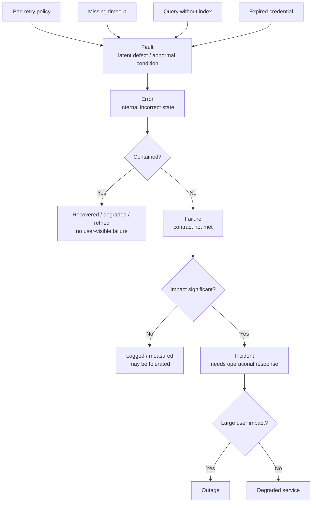
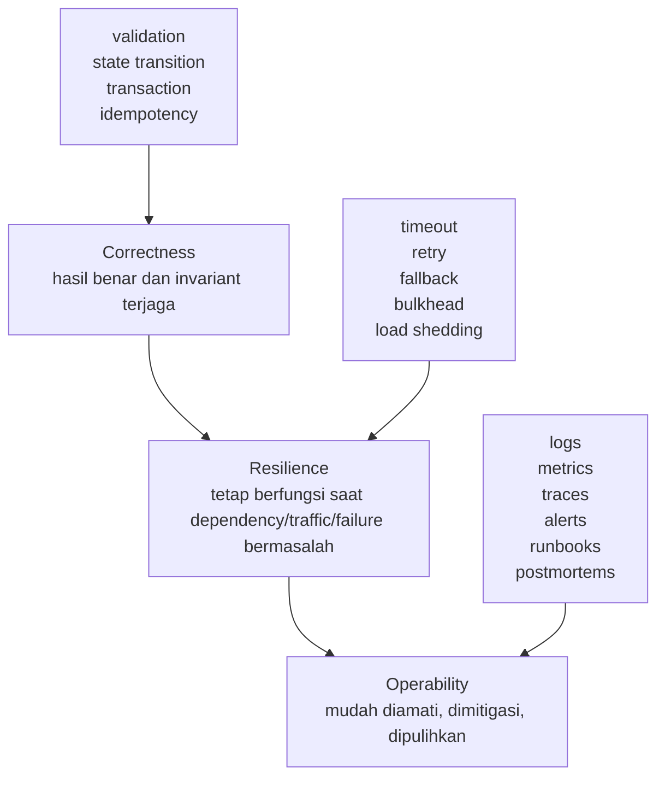
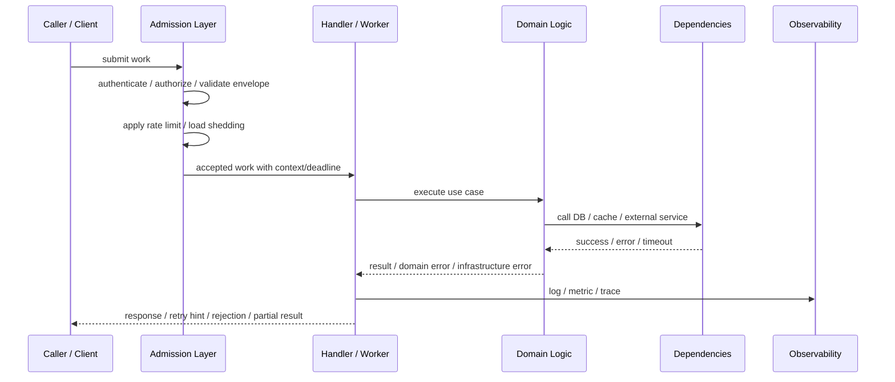
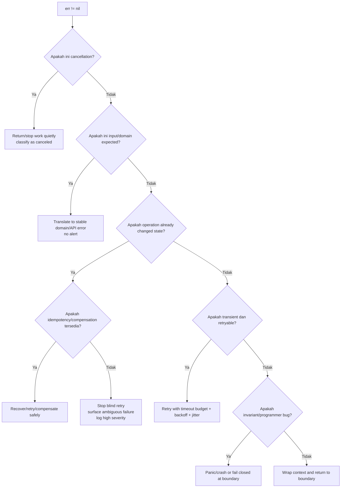
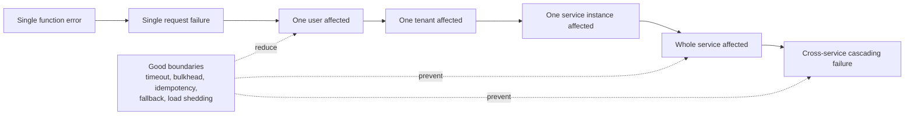
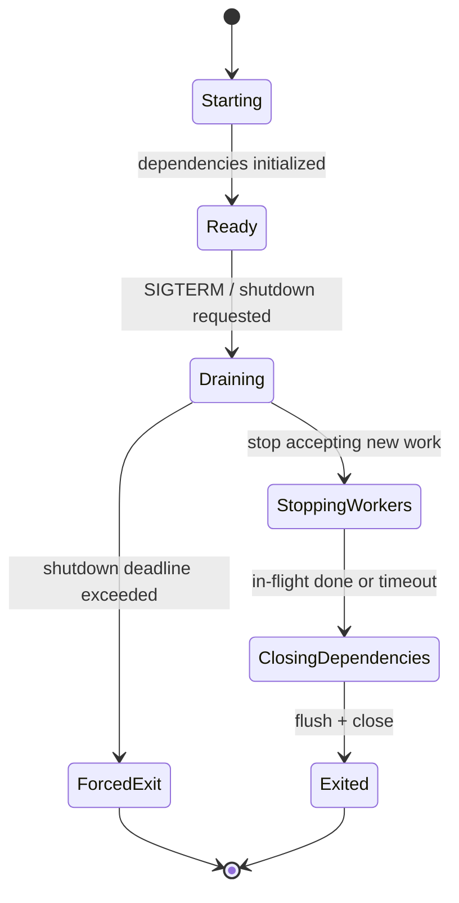
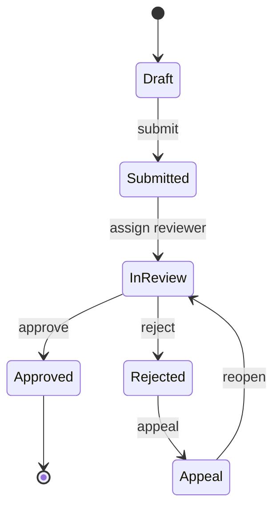
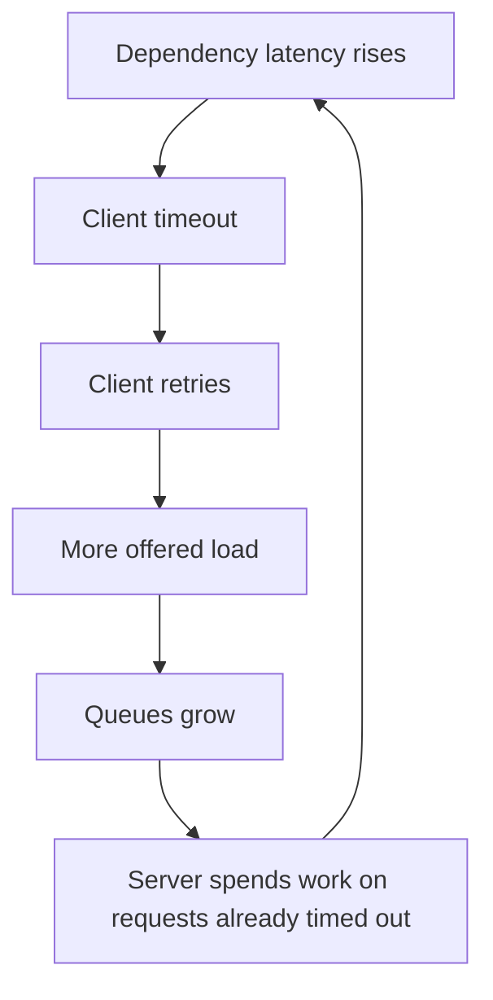
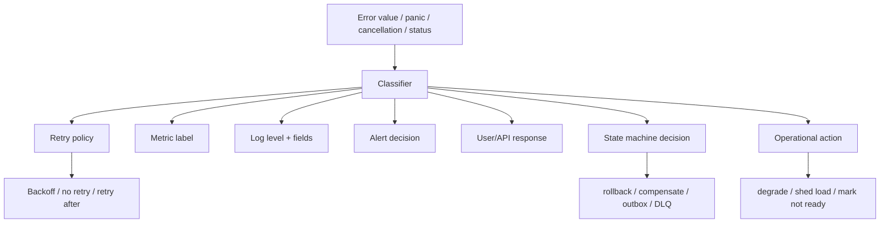
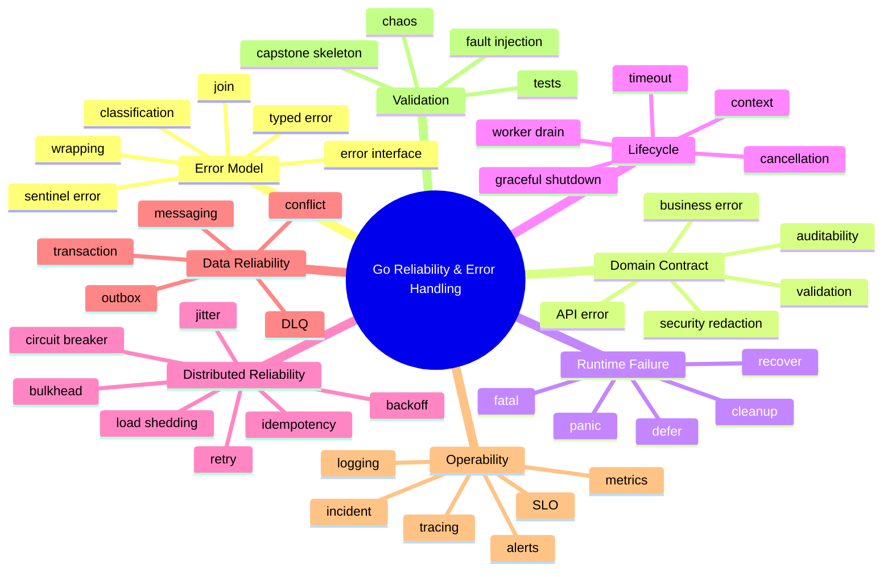

# learn-go-reliability-error-handling-part-000.md

# Part 000 — Orientation: Error, Failure, Reliability, dan Mental Model Produksi

> Seri: **learn-go-reliability-error-handling**  
> Bagian: **000 dari 034**  
> Target pembaca: **Java software engineer yang ingin menguasai Go reliability engineering secara production-grade**  
> Baseline versi: **Go 1.26.x**  
> Fokus bagian ini: **membangun mental model sebelum masuk ke mekanik error handling Go secara detail**

---

## 0. Prasyarat dan posisi materi ini dalam seri

Bagian ini bukan tutorial `if err != nil`.

Bagian ini adalah orientasi untuk menjawab pertanyaan yang lebih fundamental:

> Ketika sebuah operasi gagal, bagaimana sistem Go production-grade seharusnya berpikir, bereaksi, membatasi dampak, memberi sinyal observability, menjaga data tetap benar, dan pulih secara aman?

Dalam seri yang sudah selesai sebelumnya, kita anggap Anda sudah memahami fondasi Go: package, function, interface, goroutine, channel, context dasar, HTTP dasar, struct, pointer, slice, map, module, dan data model. Karena itu, bagian ini tidak akan mengulang grammar bahasa Go kecuali ketika konsepnya penting untuk reliability.

Yang akan kita bangun di sini adalah **framework berpikir**.

Seorang engineer biasa bertanya:

> Bagaimana cara handle error di Go?

Engineer yang lebih matang bertanya:

> Error ini mewakili kegagalan apa, pada boundary mana ia harus diterjemahkan, siapa yang boleh melihat detailnya, apakah aman untuk retry, apakah data sudah berubah, apakah user boleh mencoba lagi, apakah harus alert, dan apakah sistem harus tetap melayani traffic lain?

Itulah level berpikir yang ingin kita capai.

---

## 1. Scope bagian ini

Bagian 000 akan membahas:

1. Definisi error, fault, failure, incident, outage, defect, anomaly.
2. Kenapa error handling bukan sekadar syntax.
3. Perbedaan mental model Java exception dengan Go explicit error value.
4. Apa itu reliability dalam konteks service production.
5. Peta besar failure lifecycle di Go service.
6. Keputusan-keputusan utama saat menghadapi error.
7. Anti-pattern yang harus dihindari sejak awal.
8. Dasar peta perjalanan untuk part 001 sampai part 034.

Bagian ini belum membahas secara dalam:

- Implementasi detail `errors.Is`, `errors.As`, `errors.Join`.
- Panic/recover secara detail.
- Graceful shutdown code template lengkap.
- Retry algorithm lengkap.
- Kubernetes lifecycle detail.
- DB transaction reliability detail.
- Messaging reliability detail.

Itu semua akan dibahas di part berikutnya.

---

## 2. Versi Go dan referensi baseline

Materi ini memakai baseline **Go 1.26.x**. Pada saat penulisan, Go release history resmi mencatat **go1.26.0** dirilis pada 10 Februari 2026 dan **go1.26.4** dirilis pada 2 Juni 2026. Go release policy juga menyatakan bahwa setiap major release didukung sampai ada dua major release yang lebih baru.

Kenapa ini penting?

Karena reliability engineering sering bergantung pada detail standard library:

- `errors` untuk error wrapping, matching, dan multi-error tree.
- `context` untuk deadline, timeout, cancellation, dan cancellation cause.
- `net/http` untuk server lifecycle dan graceful shutdown.
- `os/signal` untuk process signal handling.
- `log/slog` untuk structured logging.
- `database/sql` untuk context-aware query dan transaction boundary.

Go berubah pelan, tetapi detail seperti `context.Cause`, `errors.Join`, dan API modernizer di Go 1.26 memengaruhi style code production.

---

## 3. Kenapa error handling adalah topik arsitektur, bukan syntax

Di banyak codebase, error handling diperlakukan sebagai hal kecil:

```go
if err != nil {
    return err
}
```

Secara syntax, ini sederhana. Secara sistem, ini belum menjawab apa pun.

Pertanyaan sebenarnya:

| Pertanyaan | Mengapa penting |
|---|---|
| Error ini berasal dari mana? | Menentukan root cause dan ownership. |
| Error ini sementara atau permanen? | Menentukan apakah retry aman. |
| Apakah operasi sudah punya side effect? | Menentukan idempotency, rollback, atau kompensasi. |
| Apakah caller boleh tahu detailnya? | Menentukan security dan API contract. |
| Apakah error harus dilog di sini? | Mencegah log spam dan duplikasi. |
| Apakah error harus memicu alert? | Mencegah noise dan alert fatigue. |
| Apakah service harus tetap menerima traffic? | Menentukan readiness, load shedding, dan shutdown behavior. |
| Apakah sistem sedang overload? | Retry bisa memperburuk situasi. |
| Apakah error melanggar invariant? | Mungkin harus panic/crash, bukan return normal error. |
| Apakah user bisa memperbaikinya? | Menentukan response message dan UX. |

Jadi error handling adalah pertemuan antara:

```text
programming model + domain contract + distributed systems + operations + user experience + security + data correctness
```

Jika salah satu hilang, hasilnya biasanya code yang tampak “handle error”, tapi secara production tetap rapuh.

---

## 4. Vocabulary dasar: fault, error, failure, incident, outage

Sebelum bicara Go, kita perlu vocabulary yang presisi.

Dalam percakapan sehari-hari, orang sering memakai “error”, “bug”, “failure”, “incident”, dan “outage” secara acak. Di level engineering handbook, istilah ini harus dibedakan karena setiap istilah menghasilkan tindakan berbeda.

### 4.1 Fault

**Fault** adalah penyebab laten atau kondisi abnormal yang bisa menghasilkan error.

Contoh:

- Bug di code retry.
- Query tanpa index.
- Config timeout terlalu besar.
- Credential expired.
- DNS cache stale.
- Disk hampir penuh.
- Deployment dengan environment variable salah.
- Race condition.
- Missing idempotency key.
- Dependency latency spike.

Fault belum tentu langsung terlihat oleh user. Fault bisa diam berhari-hari sampai traffic tertentu memicunya.

### 4.2 Error

**Error** adalah state internal yang menyimpang dari state yang diharapkan.

Contoh:

- `sql.ErrNoRows` muncul saat data wajib ada.
- `context deadline exceeded` saat operasi melampaui deadline.
- JSON payload tidak valid.
- Signature token tidak valid.
- Goroutine menerima nilai yang melanggar invariant.
- External API mengembalikan `503`.

Dalam Go, banyak error direpresentasikan sebagai nilai bertipe `error`, tetapi tidak semua error state harus berupa `error` value. Kadang error state muncul sebagai:

- boolean false,
- invalid enum,
- missing channel signal,
- metric anomaly,
- panic,
- failed health check,
- corrupted state.

### 4.3 Failure

**Failure** adalah ketika sistem tidak memenuhi kontraknya terhadap caller atau user.

Contoh:

- User tidak bisa submit application.
- API mengembalikan 500.
- Job tidak memproses message tepat waktu.
- Report salah hitung.
- Case state berubah tidak valid.
- Email notifikasi tidak terkirim.
- Service latency melewati SLO.

Perhatikan: tidak semua error menjadi failure.

Contoh:

- Cache Redis gagal, tetapi sistem fallback ke DB dan response tetap benar.
- External geocoding timeout, tetapi field optional dan UI bisa menampilkan warning.
- Satu replica mati, tetapi load balancer mengalihkan traffic.
- Satu retry attempt gagal, tetapi attempt berikutnya berhasil dalam budget waktu.

Reliability engineering adalah seni mengubah sebagian error menjadi non-failure atau limited failure.

### 4.4 Defect / bug

**Defect** atau bug adalah kesalahan pada design atau implementation.

Contoh:

- Tidak mengecek `err`.
- Menelan panic tanpa log.
- Retry tanpa timeout.
- Menjalankan DB query dengan `context.Background()` di request path.
- Mengembalikan internal stack trace ke user.
- Menulis response HTTP dua kali.
- Commit DB sebelum validasi lengkap.

Bug bisa menghasilkan fault. Fault bisa menghasilkan error. Error bisa menghasilkan failure. Failure bisa menjadi incident.

### 4.5 Incident

**Incident** adalah event operasional yang memerlukan perhatian, mitigasi, atau koordinasi.

Contoh:

- Error rate naik selama 15 menit.
- Queue backlog meningkat dan SLA job terancam.
- Deploy baru membuat login gagal sebagian user.
- Database connection pool exhausted.
- CPU throttle menyebabkan latency spike.

Incident tidak harus outage penuh. Incident adalah kondisi yang cukup berdampak sehingga perlu response.

### 4.6 Outage

**Outage** adalah kegagalan layanan yang signifikan terhadap user atau dependency.

Contoh:

- Semua API tidak bisa diakses.
- Login down total.
- Message consumer berhenti memproses selama 2 jam.
- Data submission gagal untuk semua tenant.
- Service dependency utama down tanpa fallback.

Outage biasanya subset berat dari incident.

### 4.7 Anomaly

**Anomaly** adalah sinyal yang tidak biasa, tetapi belum tentu failure.

Contoh:

- Latency p99 naik 20% tetapi masih dalam SLO.
- Retry count naik tetapi user success rate tetap stabil.
- Jumlah goroutine naik saat batch job berjalan.
- Cache miss meningkat setelah deploy.

Anomaly harus diamati, tetapi tidak selalu harus alert. Alert yang baik fokus pada gejala yang berdampak, bukan semua hal yang “aneh”.

---

## 5. Diagram hubungan fault → error → failure → incident



Mental model penting:

> Reliability bukan berarti tidak ada error. Reliability berarti error tidak mudah berubah menjadi failure yang tidak terkendali.

---

## 6. Kenapa “error handling” sering gagal di production

Banyak codebase sebenarnya sudah “handle error” secara lokal, tetapi tetap buruk secara sistem.

Contoh sederhana:

```go
func CreateUser(ctx context.Context, req CreateUserRequest) error {
    err := repo.InsertUser(ctx, req)
    if err != nil {
        return err
    }
    err = email.SendWelcome(ctx, req.Email)
    if err != nil {
        return err
    }
    return nil
}
```

Secara lokal ini tampak benar. Semua error dicek.

Tetapi secara reliability, banyak pertanyaan belum dijawab:

1. Jika insert berhasil tetapi email gagal, apakah user dianggap berhasil dibuat?
2. Apakah caller boleh retry `CreateUser`?
3. Kalau retry, apakah insert duplicate?
4. Apakah email bisa terkirim dua kali?
5. Apakah email failure harus menggagalkan request utama?
6. Apakah error email harus alert?
7. Apakah operasi ini idempotent?
8. Apakah timeout request juga harus membatalkan email?
9. Apakah ada audit trail bahwa user dibuat tetapi email gagal?
10. Apakah response ke user harus 201, 202, 500, atau 207-like partial result?

Jadi masalahnya bukan “lupa `if err != nil`”. Masalahnya adalah tidak punya **failure semantics**.

---

## 7. Failure semantics

**Failure semantics** adalah kontrak tentang apa arti sebuah kegagalan dan bagaimana sistem harus bereaksi.

Contoh failure semantics yang buruk:

> Kalau gagal, return error.

Contoh failure semantics yang lebih matang:

> Jika validasi request gagal, return domain validation error tanpa retry dan map ke HTTP 400. Jika duplicate idempotency key ditemukan, return response hasil request sebelumnya. Jika DB transient deadlock terjadi sebelum commit, retry maksimal 2 kali dengan jitter dalam total request budget. Jika commit status ambiguous, jangan retry blind; cek idempotency record. Jika welcome email gagal setelah user dibuat, catat outbox event untuk retry async dan response tetap success.

Perhatikan bedanya.

Yang pertama hanya syntax.

Yang kedua menentukan:

- error category,
- retry policy,
- idempotency,
- side effect,
- user-visible response,
- async recovery,
- observability,
- data consistency.

Inilah cara berpikir production-grade.

---

## 8. Java exception mindset vs Go error value mindset

Sebagai Java engineer, Anda kemungkinan terbiasa dengan exception sebagai mekanisme utama error propagation.

Go berbeda secara fundamental.

### 8.1 Java exception model

Di Java, error path sering direpresentasikan sebagai control flow tersembunyi:

```java
public User createUser(CreateUserRequest req) {
    validate(req);
    User user = repository.insert(req);
    emailClient.sendWelcome(user.email());
    return user;
}
```

Dari signature saja, kita tidak selalu tahu bahwa method bisa gagal karena:

- validation exception,
- database exception,
- timeout exception,
- email exception,
- illegal state exception,
- null pointer exception,
- transaction exception.

Java punya checked exception, tetapi dalam praktik modern banyak framework memakai unchecked exception. Spring, JPA, HTTP client, validation, dan transaction layer sering melempar runtime exception yang tidak terlihat di signature.

Keuntungannya:

- Happy path terlihat bersih.
- Error bisa naik otomatis.
- Stack unwinding membantu cleanup via `finally` atau try-with-resources.
- Framework bisa intercept exception di boundary.

Risikonya:

- Error path tersembunyi.
- Caller mudah tidak sadar side effect partial.
- Exception terlalu generik.
- Boundary translation sering tertunda sampai controller advice.
- Retry bisa dipasang terlalu jauh dari tempat side effect terjadi.
- Stack trace sering dipakai sebagai pengganti context yang eksplisit.

### 8.2 Go error value model

Di Go, operasi yang bisa gagal biasanya mengembalikan `error` sebagai return value:

```go
func CreateUser(ctx context.Context, req CreateUserRequest) (User, error) {
    if err := validate(req); err != nil {
        return User{}, err
    }

    user, err := repository.Insert(ctx, req)
    if err != nil {
        return User{}, err
    }

    if err := emailClient.SendWelcome(ctx, user.Email); err != nil {
        return User{}, err
    }

    return user, nil
}
```

Keuntungannya:

- Error path terlihat di control flow.
- Setiap boundary punya kesempatan mengambil keputusan.
- Retry, wrapping, translation, logging, dan compensation bisa diletakkan secara eksplisit.
- Function signature jujur bahwa operasi bisa gagal.
- Error bisa menjadi value yang dianalisis dengan `errors.Is` dan `errors.As`.

Risikonya:

- Boilerplate jika tidak didesain.
- Developer bisa return error tanpa context.
- Developer bisa log di setiap layer.
- Error taxonomy bisa kacau jika semua error hanya string.
- Panic bisa disalahgunakan untuk meniru exception.

### 8.3 Tabel perbandingan

| Dimensi | Java exception | Go error value |
|---|---|---|
| Error propagation | Implicit melalui throw/call stack | Explicit melalui return value |
| Visibility di signature | Tergantung checked/unchecked | Umumnya terlihat sebagai `error` |
| Boundary decision | Sering di framework boundary | Bisa di setiap layer, idealnya boundary terdesain |
| Cleanup | `finally`, try-with-resources | `defer` |
| Matching error | Type catch, exception hierarchy | `errors.Is`, `errors.As`, type/sentinel |
| Multiple errors | Suppressed exceptions, custom aggregation | `errors.Join`, custom multi-error |
| Runtime crash | `Error`, unchecked exception tak tertangkap | panic tidak recovered, fatal, os.Exit |
| Common anti-pattern | Catch terlalu luas | Return raw error tanpa context |
| Control flow readability | Happy path bersih, error path tersembunyi | Error path eksplisit, bisa verbose |
| Operational context | Sering stack trace heavy | Harus dibangun dengan wrapping/logging/trace |

### 8.4 Mindset shift utama

Di Go, jangan berpikir:

> Di mana saya bisa catch exception ini?

Pikirkan:

> Boundary mana yang punya cukup informasi untuk memutuskan arti error ini?

Di Go, fungsi yang menerima error harus memilih salah satu dari beberapa tindakan:

1. Return apa adanya.
2. Wrap dengan context.
3. Translate ke error domain/API.
4. Retry jika aman.
5. Compensate/rollback.
6. Degrade/fallback.
7. Log/metric/trace.
8. Ignore secara sadar.
9. Panic/crash jika invariant rusak.

Setiap `if err != nil` adalah decision point, bukan ritual syntax.

---

## 9. “Errors are values” bukan slogan

Go community sering mengatakan “errors are values”. Maksudnya bukan sekadar `error` adalah interface.

Maksud sebenarnya:

> Error dapat didesain, dikomposisi, dibungkus, dibandingkan, diklasifikasikan, diterjemahkan, diuji, dan dijadikan bagian dari API contract.

Jika error adalah value, maka error bisa punya:

- identity,
- type,
- category,
- cause,
- operation,
- resource,
- retryability,
- user message,
- internal message,
- code,
- severity,
- observability attributes,
- redaction policy.

Contoh error sebagai string mentah:

```go
return fmt.Errorf("user not found")
```

Contoh error sebagai contract yang lebih kuat:

```go
var ErrUserNotFound = errors.New("user not found")

type NotFoundError struct {
    Entity string
    Key    string
    Err    error
}

func (e *NotFoundError) Error() string {
    return e.Entity + " not found"
}

func (e *NotFoundError) Unwrap() error {
    return e.Err
}

func (e *NotFoundError) Is(target error) bool {
    return target == ErrUserNotFound
}
```

Bagian detailnya akan dibahas nanti. Untuk sekarang, pahami bahwa error bukan sekadar message. Error adalah **programmatic signal**.

---

## 10. Tiga lapisan reliability: correctness, resilience, operability

Reliability production-grade tidak cukup hanya “tidak crash”.

Kita perlu tiga lapisan:



### 10.1 Correctness

Correctness berarti sistem menghasilkan state yang benar.

Pertanyaan correctness:

- Apakah data tetap konsisten jika operasi gagal di tengah?
- Apakah state machine domain bisa masuk ke state invalid?
- Apakah duplicate request menghasilkan duplicate side effect?
- Apakah transaksi commit/rollback jelas?
- Apakah error validasi menghentikan operasi sebelum side effect?
- Apakah authorization error tidak membocorkan data?

Sistem yang highly available tetapi menghasilkan data salah bukan sistem reliable.

### 10.2 Resilience

Resilience berarti sistem tetap memberikan layanan yang dapat diterima walaupun ada fault.

Pertanyaan resilience:

- Apakah service punya timeout?
- Apakah retry aman dan dibatasi?
- Apakah dependency lambat membuat seluruh service ikut lambat?
- Apakah ada fallback untuk fitur non-critical?
- Apakah overload ditolak lebih awal?
- Apakah background worker bisa resume?
- Apakah shutdown menghabiskan in-flight work secara aman?

Resilience bukan berarti selalu success. Kadang resilience berarti gagal cepat, jelas, dan terbatas.

### 10.3 Operability

Operability berarti manusia dan automation bisa memahami, mengontrol, dan memulihkan sistem.

Pertanyaan operability:

- Apakah error punya log yang actionable?
- Apakah metric bisa menunjukkan gejala user-visible?
- Apakah alert low-noise?
- Apakah trace bisa menunjukkan dependency lambat?
- Apakah runbook menjelaskan mitigasi?
- Apakah error code stabil untuk support dan client?
- Apakah postmortem menghasilkan perbaikan sistemik?

Sistem yang “bisa jalan” tetapi tidak bisa didiagnosis bukan production-grade.

---

## 11. Reliability sebagai lifecycle work

Setiap request, job, message, atau command melewati lifecycle.



Reliability decision bisa terjadi di setiap titik:

| Lifecycle stage | Reliability concern |
|---|---|
| Admission | overload, auth failure, malformed request, rate limit |
| Execution | domain invariant, cancellation, timeout, concurrency |
| Dependency call | retry, fallback, circuit breaker, pool exhaustion |
| State mutation | transaction, idempotency, conflict, rollback |
| Response | error mapping, user-safe message, retry hint |
| Observability | logs, metrics, traces, alerting |
| Shutdown | drain, cancel, close, flush, final timeout |

Jika Anda hanya memikirkan error di function lokal, Anda akan melewatkan lifecycle ini.

---

## 12. Error bukan selalu “bad thing”

Di production, error bisa menjadi hasil yang normal.

Contoh normal error:

- User memasukkan payload invalid.
- User tidak punya permission.
- Data tidak ditemukan.
- Optimistic locking conflict.
- Request dibatalkan oleh client.
- Context timeout karena budget habis.
- Rate limit menolak request.
- Queue message masuk DLQ setelah policy retry habis.

Error semacam ini bukan selalu bug.

Masalah muncul ketika kita salah mengklasifikasikan.

Contoh:

| Error | Salah diperlakukan sebagai | Dampak |
|---|---|---|
| Validation error | 500 internal error | User bingung, alert noise |
| DB timeout | 400 user error | Dependency issue tersembunyi |
| Auth failure | panic | Service crash tidak perlu |
| Invariant violation | 400 validation | Bug disembunyikan |
| Overload | retry aggressively | Cascading failure |
| Duplicate request | insert ulang | Duplicate side effect |
| Client cancellation | server error | Error rate palsu |

Top 1% engineer tidak hanya “handle error”; mereka mengerti **arti error**.

---

## 13. Error taxonomy awal

Sepanjang seri, kita akan memakai taxonomy berikut.

### 13.1 Programmer error

Bug dalam code.

Contoh:

- nil pointer dereference,
- index out of range,
- invalid type assertion,
- impossible enum value,
- invariant internal dilanggar,
- missing required dependency saat startup,
- data race.

Biasanya bukan recoverable dalam request biasa. Kadang panic/crash lebih benar daripada melanjutkan dengan state corrupt.

### 13.2 User/input error

Caller memberikan input invalid.

Contoh:

- field wajib kosong,
- format email salah,
- date range invalid,
- enum tidak dikenal,
- file terlalu besar,
- payload malformed.

Biasanya tidak retryable. Map ke 400-class response.

### 13.3 Business/domain error

Request valid secara syntax, tetapi melanggar rule domain.

Contoh:

- case tidak bisa approve karena state belum complete,
- user tidak boleh submit di tahap ini,
- renewal sudah expired,
- quota domain habis,
- entity sudah locked,
- duplicate application.

Biasanya bukan 500. Harus punya domain code yang stabil.

### 13.4 Authorization/authentication error

Identity atau permission tidak valid.

Contoh:

- token expired,
- signature invalid,
- user tidak punya role,
- tenant mismatch,
- resource owner mismatch.

Harus hati-hati agar response tidak membocorkan resource existence.

### 13.5 Transient infrastructure error

Masalah sementara.

Contoh:

- network reset,
- DNS temporary failure,
- DB deadlock,
- dependency 503,
- timeout sesaat,
- throttling.

Bisa retry jika operasi idempotent dan budget memungkinkan.

### 13.6 Permanent infrastructure error

Masalah teknis tetapi tidak akan membaik dengan retry cepat.

Contoh:

- invalid credential,
- schema mismatch,
- missing table,
- incompatible API version,
- invalid endpoint config,
- certificate misconfiguration.

Retry agresif hanya membuang resource.

### 13.7 Overload error

Sistem atau dependency tidak punya kapasitas cukup.

Contoh:

- queue penuh,
- connection pool exhausted,
- CPU saturated,
- memory pressure,
- rate limit exceeded,
- thread/goroutine explosion,
- downstream 429/503.

Retry harus sangat hati-hati. Kadang tindakan benar adalah load shedding.

### 13.8 Cancellation

Operasi dibatalkan sebelum selesai.

Contoh:

- client disconnect,
- request timeout,
- shutdown signal,
- parent operation failed,
- user membatalkan proses.

Cancellation bukan selalu failure server. Harus dibedakan dari error internal.

### 13.9 Data integrity error

State atau data tidak memenuhi invariant.

Contoh:

- duplicate unique key,
- foreign key violation,
- checksum mismatch,
- version conflict,
- missing audit record,
- partial write.

Kadang expected, kadang critical. Harus diklasifikasikan.

### 13.10 Dependency semantic error

Dependency menjawab secara valid, tetapi secara bisnis tidak sesuai harapan.

Contoh:

- external API return success tetapi payload incomplete,
- response schema berubah,
- status code 200 dengan error di body,
- stale data,
- inconsistent pagination.

Ini sering lebih berbahaya daripada timeout karena tampak success.

---

## 14. Error classification matrix

Gunakan matrix ini sebagai starting point.

| Category | Retry? | Log level | Alert? | User response | Example |
|---|---:|---|---|---|---|
| Validation | No | debug/info | No | 400 + field errors | invalid email |
| Domain violation | No | info | No, kecuali spike | 409/422 + code | invalid state transition |
| Authn/authz | No | info/warn | Spike only | 401/403 | expired token |
| Not found | No | debug/info | No | 404 | missing resource |
| Conflict | Maybe after reread | info | Spike only | 409 | optimistic lock |
| Transient dependency | Yes if safe | warn | sustained rate | 503/504 | network reset |
| Timeout | Maybe if budget | warn | sustained rate | 504/503 | deadline exceeded |
| Overload | Usually no immediate retry | warn/error | Yes if sustained | 429/503 | queue full |
| Programmer bug | No | error/fatal | Yes | 500 | nil deref/panic |
| Data corruption | No blind retry | error/fatal | Yes | 500 or fail closed | checksum mismatch |
| Shutdown cancellation | No | info | No | connection drain | SIGTERM |

Matrix ini bukan hukum absolut. Ia adalah alat berpikir.

---

## 15. Decision tree awal untuk setiap error



Pertanyaan paling penting dalam tree ini adalah:

> Apakah operasi sudah mengubah state?

Karena retry setelah side effect adalah sumber banyak bug production.

---

## 16. Failure domain dan blast radius

**Failure domain** adalah area yang bisa terdampak oleh satu failure.

Contoh failure domain:

- satu request,
- satu goroutine,
- satu user,
- satu tenant,
- satu pod,
- satu node,
- satu availability zone,
- satu dependency,
- satu table,
- satu queue partition,
- seluruh service.

Reliability engineering berusaha memperkecil blast radius.



Contoh:

- Panic di satu handler seharusnya tidak membunuh seluruh process jika ada recovery middleware yang benar.
- Slow dependency seharusnya tidak menghabiskan semua goroutine jika ada timeout dan concurrency limit.
- Tenant traffic spike seharusnya tidak mengganggu tenant lain jika ada per-tenant rate limit.
- Background job poison message seharusnya tidak memblokir seluruh queue jika ada DLQ.

---

## 17. Local correctness vs distributed correctness

Di Java monolith, Anda mungkin sering berpikir dalam satu transaction boundary.

Di Go microservice/distributed system, correctness sering melewati boundary:

- HTTP request masuk.
- Service menulis DB.
- Service publish message.
- Consumer lain update projection.
- External API dipanggil.
- Notification dikirim.

Masalah muncul saat sebagian berhasil dan sebagian gagal.

Contoh:

```text
DB commit success
↓
publish event fails
↓
caller receives 500
↓
caller retries
↓
DB insert duplicates or conflict
↓
external behavior ambiguous
```

Pertanyaan reliability:

1. Apakah commit DB dan publish event harus atomic?
2. Apakah outbox pattern diperlukan?
3. Apakah request punya idempotency key?
4. Apakah caller bisa menerima 202 Accepted?
5. Apakah ada reconciliation job?
6. Apakah alert dibutuhkan untuk outbox backlog?

Error handling lokal tidak cukup untuk menjawab ini.

---

## 18. Graceful degradation vs fail closed vs fail open

Saat dependency gagal, sistem punya pilihan.

### 18.1 Fail closed

Fail closed berarti menolak operasi ketika tidak bisa membuktikan aman.

Cocok untuk:

- authorization,
- payment,
- regulatory approval,
- data mutation kritis,
- security-sensitive operation,
- integrity check.

Contoh:

> Jika permission service tidak tersedia, jangan izinkan approval case.

### 18.2 Fail open

Fail open berarti tetap mengizinkan operasi meski check gagal.

Cocok hanya untuk kasus tertentu:

- telemetry optional,
- recommendation optional,
- non-critical personalization,
- feature flag dengan default aman,
- soft dependency.

Contoh:

> Jika recommendation service gagal, tampilkan halaman tanpa rekomendasi.

### 18.3 Graceful degradation

Graceful degradation berarti sistem menurunkan kualitas layanan tetapi tetap memenuhi core contract.

Contoh:

- tampilkan data cached/stale dengan label,
- disable fitur optional,
- proses async instead of sync,
- return partial result,
- downgrade sorting atau enrichment,
- skip non-critical notification dan retry via outbox.

### 18.4 Decision matrix

| Dependency | Jika gagal | Strategy |
|---|---|---|
| Auth service | Tidak bisa verify identity | fail closed |
| Permission check | Tidak bisa verify authorization | fail closed |
| Audit writer | Tidak bisa tulis audit untuk action legal | fail closed atau durable local buffer, tergantung regulasi |
| Email notification | Tidak bisa kirim email | degrade via outbox retry |
| Search index | Tidak bisa update index | commit DB + outbox/reindex later |
| Cache | Redis down | fallback DB dengan limit |
| Metrics exporter | Export gagal | jangan gagalkan request |
| Payment gateway | Timeout setelah charge ambiguous | jangan retry blind; reconcile |

---

## 19. Error handling dan user experience

Error internal tidak sama dengan pesan user.

Contoh internal error:

```text
insert application: commit tx: pq: duplicate key value violates unique constraint "applications_reference_no_key"
```

Pesan user yang baik:

```text
Application already exists for this reference number.
```

API response yang baik:

```json
{
  "error": {
    "code": "APPLICATION_DUPLICATE_REFERENCE",
    "message": "Application already exists for this reference number.",
    "correlation_id": "req-01J..."
  }
}
```

Log internal yang baik:

```text
level=warn msg="create application conflict" code=APPLICATION_DUPLICATE_REFERENCE reference_no=... request_id=... cause="unique constraint applications_reference_no_key"
```

Perhatikan pemisahan:

| Channel | Isi |
|---|---|
| User message | aman, jelas, actionable |
| API code | stabil, terdokumentasi |
| Log internal | teknis, cukup untuk debugging, redacted |
| Metric | category-level, low cardinality |
| Trace | dependency timing dan causal chain |

Jangan mengembalikan raw Go error string sebagai API contract. Error string internal boleh berubah; API code harus stabil.

---

## 20. Observability sebagai bagian dari error handling

Error yang tidak terlihat secara operasional sama dengan error yang belum selesai di-handle.

Tetapi bukan berarti setiap error harus dilog dan alert.

### 20.1 Log

Log menjawab:

> Apa yang terjadi pada event ini?

Log harus punya context:

- operation,
- request id,
- actor/user/tenant jika aman,
- entity id,
- error category,
- dependency,
- latency,
- retry attempt,
- result.

### 20.2 Metrics

Metric menjawab:

> Apakah sistem sehat secara agregat?

Metric harus rendah cardinality.

Buruk:

```text
error_message="user 123 not found in table users at timestamp ..."
```

Baik:

```text
error_category="not_found"
operation="create_application"
status="failed"
```

### 20.3 Tracing

Trace menjawab:

> Waktu habis di mana dan dependency mana yang terlibat?

Trace membantu melihat:

- latency per hop,
- retry attempt,
- DB query timing,
- external call timing,
- cancellation propagation.

### 20.4 Alert

Alert menjawab:

> Apakah manusia harus bangun atau menghentikan pekerjaan lain sekarang?

Alert yang buruk:

- setiap exception,
- setiap log error,
- setiap 404,
- setiap dependency timeout tunggal,
- threshold tanpa user impact.

Alert yang baik:

- user-visible error rate tinggi,
- latency SLO burn tinggi,
- queue backlog mengancam SLA,
- dependency failure sustained,
- data integrity error,
- availability drop,
- error budget burn cepat.

Google SRE menekankan monitoring harus membedakan gejala “what is broken” dari penyebab “why”, dan alert manusia harus low-noise. Ini sangat relevan untuk desain error handling.

---

## 21. Retry: obat yang bisa menjadi racun

Retry sering terlihat sebagai solusi cepat.

```go
for i := 0; i < 3; i++ {
    err := callDependency()
    if err == nil {
        return nil
    }
}
return err
```

Tapi retry bisa memperburuk outage.

Misalnya:

1. Dependency mulai lambat.
2. Client timeout.
3. Client retry.
4. Load dependency bertambah.
5. Dependency makin lambat.
6. Lebih banyak timeout.
7. Lebih banyak retry.
8. Cascading failure.

AWS Builders Library menyebut retry bersifat “selfish”: client mengonsumsi lebih banyak resource server demi meningkatkan peluang sukses request-nya sendiri. Saat failure karena overload, retry dapat memperburuk keadaan.

Prinsip awal:

- Retry hanya untuk error transient.
- Retry hanya jika operasi aman/idempotent.
- Retry harus punya total deadline.
- Retry harus punya backoff.
- Retry harus punya jitter.
- Retry harus mempertimbangkan server overload signal.
- Retry harus berhenti saat context canceled.
- Retry tidak boleh menutupi data ambiguity.

Detailnya akan dibahas di part retry.

---

## 22. Timeout: pagar reliability

Tanpa timeout, sistem bisa menggantung.

Contoh buruk:

```go
resp, err := http.Get(url)
```

Jika tidak dikonfigurasi dengan benar, request bisa menunggu terlalu lama dan mengikat resource.

Timeout bukan hanya satu angka.

Ada banyak jenis timeout:

- request total timeout,
- connect timeout,
- TLS handshake timeout,
- response header timeout,
- body read timeout,
- server read header timeout,
- server write timeout,
- database statement timeout,
- queue receive timeout,
- shutdown timeout.

Timeout adalah contract:

> Berapa lama operasi ini masih berguna bagi caller?

Jika response datang setelah caller sudah menyerah, kerja itu mungkin sudah menjadi waste. Dalam overload, waste mempercepat kegagalan.

---

## 23. Cancellation: sinyal bahwa kerja tidak lagi dibutuhkan

Go memakai `context.Context` untuk membawa cancellation dan deadline melewati API boundary.

Prinsip penting:

- Context harus diteruskan dari handler ke service ke repository/client.
- Jangan membuat `context.Background()` di tengah request path kecuali benar-benar detach secara sadar.
- Selalu panggil cancel function untuk context turunan agar timer/resource dilepas.
- Jangan simpan context di struct untuk lifecycle panjang.
- Cancellation harus dihormati oleh loop, worker, DB call, dan HTTP call.

Cancellation bukan “error biasa”. Cancellation adalah lifecycle signal.

Contoh:

```go
select {
case <-ctx.Done():
    return ctx.Err()
case job := <-jobs:
    return process(ctx, job)
}
```

Di Go modern, `context.Cause` juga membantu membedakan kenapa context dibatalkan: timeout, shutdown signal, parent failure, atau custom cause.

---

## 24. Panic bukan exception biasa

Sebagai Java engineer, godaan pertama adalah memakai `panic` seperti `throw RuntimeException`.

Itu salah untuk sebagian besar application error.

Panic di Go lebih cocok untuk:

- programmer error,
- impossible state,
- invariant internal rusak,
- init fatal yang tidak bisa dipulihkan,
- bug yang tidak boleh disembunyikan.

Bukan untuk:

- user input invalid,
- data not found,
- auth failure,
- external API timeout,
- DB deadlock normal,
- validation error.

Go blog menjelaskan bahwa panic menghentikan ordinary control flow, menjalankan deferred functions saat stack unwinding, dan jika tidak recovered akan membuat program crash. `recover` hanya berguna di deferred function pada goroutine yang sedang panic.

Poin penting:

> Panic tidak menyeberang goroutine sebagai exception yang bisa dicatch parent.

Jika goroutine worker panic tanpa recovery boundary, process bisa crash.

Karena itu production Go biasanya punya panic boundary di:

- HTTP middleware,
- worker runner,
- scheduler runner,
- goroutine supervisor,
- CLI command boundary.

Tetapi recovery boundary tidak boleh menelan bug diam-diam. Minimal harus log stack/context, metric, dan sering kali fail request.

---

## 25. Graceful shutdown sebagai bagian dari error management

Graceful shutdown bukan topik deployment saja. Ini bagian dari failure management.

Saat process menerima SIGTERM di Kubernetes atau container runtime, sistem harus:

1. Berhenti menerima work baru.
2. Menandai readiness false.
3. Membiarkan in-flight request selesai dalam batas waktu.
4. Membatalkan work yang tidak boleh lanjut.
5. Menghentikan background workers.
6. Meng-ack/nack message secara benar.
7. Flush logs/metrics/traces.
8. Close DB/cache/client resources.
9. Exit sebelum hard kill.

Go menyediakan `os/signal.NotifyContext` untuk membuat context yang done saat signal datang, dan `http.Server.Shutdown` untuk graceful shutdown server HTTP. `Server.Shutdown` menutup listener, menutup idle connection, lalu menunggu active connection menjadi idle sampai context shutdown habis.

Mental model:



Shutdown yang buruk bisa menyebabkan:

- dropped request,
- duplicate message processing,
- partial write,
- lost logs,
- inconsistent readiness,
- rollout yang tampak sukses tetapi sebenarnya merusak in-flight work.

---

## 26. Reliability dan state machine domain

Dalam sistem regulatory/case management, error handling tidak bisa dilepaskan dari state machine.

Contoh state:



Error domain sering muncul saat transition tidak valid.

Contoh:

- `approve` dari `Draft` tidak boleh.
- `submit` tanpa mandatory document tidak boleh.
- `appeal` setelah deadline tidak boleh.
- `assign reviewer` oleh actor tanpa role tidak boleh.

Dalam Go, jangan biarkan rule seperti ini tersebar sebagai string error acak.

Lebih baik punya domain error yang stabil:

```text
CASE_INVALID_TRANSITION
CASE_MISSING_REQUIRED_DOCUMENT
CASE_APPEAL_WINDOW_CLOSED
CASE_ACTOR_NOT_ALLOWED
```

Karena domain error akan dipakai oleh:

- API response,
- UI message,
- audit trail,
- test case,
- support investigation,
- compliance evidence,
- reporting.

---

## 27. Reliability contract dalam API

API yang production-grade harus punya error contract.

Minimal:

```json
{
  "error": {
    "code": "CASE_INVALID_TRANSITION",
    "message": "The case cannot be approved from its current state.",
    "correlation_id": "req-abc123"
  }
}
```

Lebih detail untuk validation:

```json
{
  "error": {
    "code": "VALIDATION_FAILED",
    "message": "The request contains invalid fields.",
    "correlation_id": "req-abc123",
    "fields": [
      {
        "path": "applicant.email",
        "code": "INVALID_EMAIL",
        "message": "Email address is invalid."
      }
    ]
  }
}
```

Prinsip:

- Error code stabil.
- Message aman untuk user.
- Correlation id selalu ada untuk investigasi.
- Detail internal tidak bocor.
- Retry hint hanya diberikan jika benar-benar aman.
- Validation field path konsisten.
- Domain error tidak disamakan dengan infrastructure error.

---

## 28. Error handling dan security

Error bisa membocorkan informasi.

Contoh bocor:

```json
{
  "error": "select * from users where email='admin@example.com': password hash mismatch"
}
```

Atau:

```json
{
  "error": "S3 bucket aceas-prod-private-documents permission denied"
}
```

Risiko:

- resource enumeration,
- schema leakage,
- credential leakage,
- tenant leakage,
- PII leakage,
- stack trace leakage,
- internal topology leakage.

Prinsip:

- Public message harus sanitized.
- Internal log harus redacted.
- Jangan log secret/token/password/API key.
- Untuk authz, pertimbangkan apakah response 404 lebih aman daripada 403 untuk resource tertentu.
- Jangan expose raw dependency error ke client.
- Jangan jadikan error string internal sebagai contract.

---

## 29. Error handling dan data integrity

Failure paling mahal sering bukan outage, tetapi data salah.

Contoh:

- user melihat 500, retry, lalu duplicate application tercipta,
- payment charged tetapi order gagal dibuat,
- approval tercatat tetapi audit trail gagal,
- message diproses dua kali,
- transaction commit berhasil tetapi client timeout,
- file upload metadata tersimpan tetapi blob gagal,
- state berubah tetapi notification tidak terkirim.

Pertanyaan wajib:

1. Di mana mutation boundary?
2. Apakah operasi idempotent?
3. Apakah ada unique constraint yang mendukung idempotency?
4. Apakah commit status bisa ambiguous?
5. Apakah external side effect terjadi sebelum atau sesudah commit?
6. Apakah outbox/inbox pattern diperlukan?
7. Apakah ada reconciliation job?
8. Apakah audit trail wajib atomic dengan action?

Go tidak otomatis menyelesaikan ini. Explicit error handling hanya memberi tempat untuk membuat keputusan.

---

## 30. Error handling dan concurrency

Go membuat concurrency mudah dibuat, tetapi failure propagation tidak otomatis.

Contoh buruk:

```go
go func() {
    err := doWork()
    if err != nil {
        return // error hilang
    }
}()
```

Masalah:

- caller tidak tahu work gagal,
- context tidak dibatalkan,
- goroutine bisa leak,
- panic bisa crash process,
- shutdown tidak menunggu work,
- observability hilang.

Di Go, goroutine bukan child task seperti structured concurrency secara default. Anda harus mendesain:

- siapa owner goroutine,
- bagaimana error dikembalikan,
- bagaimana cancellation dipropagate,
- siapa menunggu completion,
- apa yang terjadi saat panic,
- bagaimana shutdown dilakukan.

Pola seperti `errgroup`, worker pool dengan context, dan supervisor boundary akan dibahas nanti.

---

## 31. Error handling dan overload

Overload bukan sekadar “server sibuk”. Overload adalah kondisi di mana sistem mulai membuat kerja tambahan yang memperburuk dirinya sendiri.

AWS Builders Library membedakan throughput dan goodput: throughput adalah jumlah request yang dikirim ke server, sedangkan goodput adalah subset yang selesai tanpa error dan cukup cepat untuk masih berguna bagi client. Dalam overload, throughput bisa naik tetapi goodput turun.

Contoh overload feedback loop:



Solusi bukan hanya scale up.

Solusi reliability:

- timeout budget,
- queue limit,
- rate limiting,
- admission control,
- load shedding,
- circuit breaker,
- bulkhead,
- retry budget,
- jitter,
- graceful degradation,
- priority traffic.

Load shedding kadang terasa negatif karena kita sengaja menolak request. Tetapi dalam overload, menolak sebagian request bisa menjaga goodput untuk request yang diterima.

---

## 32. Error budget dan SLO mindset

Reliability bukan “harus 100%”.

Google SRE menekankan bahwa menuntut 100% reliability sering tidak realistis dan bisa menghambat innovation. SLO dan error budget memberi cara objektif untuk menyeimbangkan reliability dan delivery.

Contoh SLO:

```text
99.9% create-application requests complete successfully under 500 ms over 30 days.
```

Error budget:

```text
0.1% request boleh gagal atau melampaui threshold dalam periode tersebut.
```

Kenapa ini penting untuk error handling?

Karena tidak semua error setara.

- 100 validation error dari user tidak membakar reliability budget internal dengan cara yang sama seperti 100 server 500.
- 1 data corruption event mungkin lebih serius daripada 10.000 harmless 404.
- Latency p99 bisa lebih penting daripada average error count.
- Queue backlog bisa mengindikasikan future failure sebelum user melihat error.

Error handling harus mendukung SLO:

- classify user error vs server error,
- expose metrics per operation,
- distinguish retry success from first-attempt success,
- measure timeout/cancellation,
- emit dependency failure category,
- avoid high-cardinality labels.

---

## 33. Boundary: tempat error berubah makna

Error sering berubah makna saat melewati boundary.

Contoh:

```text
DB unique constraint violation
↓
repository maps to ErrDuplicateApplication
↓
service maps to domain conflict
↓
handler maps to HTTP 409 APPLICATION_DUPLICATE_REFERENCE
↓
client displays user-friendly message
```

Boundary umum:

| Boundary | Translation responsibility |
|---|---|
| DB driver → repository | SQL/driver error menjadi repository/domain persistence error |
| External API → client package | status code/body menjadi dependency error typed |
| Service/usecase → handler | domain result menjadi API response |
| Handler → HTTP | error code menjadi status + JSON |
| Worker → queue | processing result menjadi ack/nack/retry/DLQ |
| Process → orchestrator | readiness/liveness/exit code |

Anti-pattern:

```text
controller mengecek string "ORA-00001" langsung
```

Kenapa buruk?

- Controller tahu detail DB.
- Sulit diganti.
- Sulit dites.
- Error contract bocor.
- Mapping tersebar.

Prinsip:

> Low-level layer menambahkan cause dan context; boundary layer menerjemahkan ke contract layer berikutnya.

---

## 34. Log once, handle once, decide at boundary

Anti-pattern umum:

```go
func repo() error {
    if err != nil {
        log.Error("repo failed", "err", err)
        return err
    }
}

func service() error {
    if err := repo(); err != nil {
        log.Error("service failed", "err", err)
        return err
    }
}

func handler() {
    if err := service(); err != nil {
        log.Error("handler failed", "err", err)
        http.Error(w, err.Error(), 500)
    }
}
```

Hasil:

- Satu failure menghasilkan tiga log error.
- Noise meningkat.
- Alert/log search membingungkan.
- Context bisa berulang tetapi tidak informatif.
- Response membocorkan internal error.

Pattern lebih baik:

```go
func repo(ctx context.Context, id string) error {
    if err := query(ctx, id); err != nil {
        return fmt.Errorf("query user by id %q: %w", id, err)
    }
    return nil
}

func service(ctx context.Context, id string) error {
    if err := repo(ctx, id); err != nil {
        return fmt.Errorf("load user profile: %w", err)
    }
    return nil
}

func handler(w http.ResponseWriter, r *http.Request) {
    if err := service(r.Context(), id); err != nil {
        // boundary decision: map, log once, metric once, respond safely
        respondError(w, r, err)
        return
    }
}
```

Rule awal:

- Jangan log error di setiap layer.
- Tambahkan context dengan wrapping.
- Log di boundary yang punya request id, user/tenant context, route, status, dan response decision.
- Exception: log local jika error ditangani dan tidak dikembalikan.

---

## 35. “Ignore error” harus eksplisit dan defensible

Kadang error boleh diabaikan.

Contoh:

- best-effort metric flush,
- close response body saat read sudah selesai,
- optional cleanup di temporary file,
- non-critical cache delete,
- client disconnected setelah response tidak lagi relevan.

Tetapi ignore harus sadar.

Buruk:

```go
file.Close()
```

Lebih baik:

```go
if err := file.Close(); err != nil {
    return fmt.Errorf("close output file: %w", err)
}
```

Atau jika benar-benar best effort:

```go
if err := cache.Delete(ctx, key); err != nil {
    logger.Debug("best-effort cache delete failed", "key", key, "err", err)
}
```

Atau jika deliberately ignored:

```go
_ = resp.Body.Close() // response body already fully consumed; close error not actionable
```

Prinsip:

> Ignored error harus bisa dijelaskan dalam code review.

---

## 36. Reliability smell catalog awal

Berikut smell yang harus langsung membuat Anda curiga.

### 36.1 `context.Background()` di tengah request path

```go
func (s *Service) DoSomething(ctx context.Context) error {
    return s.repo.Save(context.Background(), data)
}
```

Masalah:

- request cancellation hilang,
- timeout budget hilang,
- shutdown tidak membatalkan kerja,
- trace/correlation bisa putus.

### 36.2 Retry tanpa deadline

```go
for {
    if err := call(); err == nil {
        return nil
    }
}
```

Masalah:

- infinite loop,
- overload amplification,
- shutdown lambat,
- caller sudah tidak menunggu.

### 36.3 Panic untuk validation

```go
if req.Email == "" {
    panic("email required")
}
```

Masalah:

- input user normal menjadi crash path,
- recovery middleware bekerja terlalu keras,
- metric 500 palsu,
- bad UX.

### 36.4 Return raw dependency error ke API

```go
http.Error(w, err.Error(), http.StatusInternalServerError)
```

Masalah:

- internal detail bocor,
- contract tidak stabil,
- security risk.

### 36.5 Log di semua layer

Masalah:

- noise,
- double counting,
- alert fatigue.

### 36.6 Error string matching

```go
if strings.Contains(err.Error(), "duplicate key") {
    // ...
}
```

Masalah:

- fragile,
- locale/vendor dependent,
- coupling detail rendah.

Kadang terpaksa di adapter paling bawah jika driver tidak memberi typed error, tetapi jangan sebar ke domain/handler.

### 36.7 Goroutine fire-and-forget

```go
go sendEmail(user)
```

Masalah:

- error hilang,
- panic tidak terkontrol,
- shutdown tidak menunggu,
- duplicate/ordering tidak jelas.

### 36.8 Timeout global asal-asalan

```go
ctx, cancel := context.WithTimeout(ctx, 30*time.Second)
```

Masalah:

- tidak berdasarkan caller budget,
- bisa terlalu panjang untuk user,
- bisa terlalu pendek untuk batch,
- tidak mempertimbangkan dependency chain.

### 36.9 Treat all 5xx as retryable

Masalah:

- 500 karena validation bug tidak membaik dengan retry,
- 503 overload makin buruk dengan retry agresif,
- commit ambiguity bisa menghasilkan duplicate side effect.

### 36.10 Shutdown hanya `Ctrl+C` handler sederhana

```go
<-sig
server.Close()
```

Masalah:

- active request diputus,
- worker tidak drain,
- queue ack salah,
- telemetry hilang.

---

## 37. Production-grade error handling principle set

Gunakan prinsip berikut sepanjang seri.

### Principle 1 — Classify before acting

Jangan retry, log, alert, atau map response sebelum tahu kategori error.

### Principle 2 — Preserve cause, expose contract

Internal error chain harus menyimpan cause. Public API harus expose contract aman dan stabil.

### Principle 3 — Context is part of correctness

Context bukan hanya timeout helper. Context membawa lifecycle work. Mengabaikan context berarti mengabaikan cancellation, shutdown, dan budget.

### Principle 4 — Retry only when safe

Retry tanpa idempotency dan budget adalah hazard.

### Principle 5 — Timeout every boundary

Setiap dependency boundary butuh timeout/deadline yang masuk akal.

### Principle 6 — Avoid wasted work

Jika caller sudah batal, jangan teruskan kerja kecuali ada alasan eksplisit.

### Principle 7 — Keep failure local

Gunakan isolation, bulkhead, rate limit, dan load shedding untuk mencegah cascading failure.

### Principle 8 — Log once at the right boundary

Return/wrap di layer bawah. Log/metric/respond di boundary yang punya context penuh.

### Principle 9 — Panic for broken invariants, not normal business outcomes

Validation, not found, conflict, auth failure, timeout normal bukan panic.

### Principle 10 — Shutdown is a normal lifecycle, not an exceptional accident

SIGTERM bukan kejadian aneh. Service harus didesain untuk berhenti dengan aman.

### Principle 11 — Observability is part of the contract

Error yang tidak bisa didiagnosis belum selesai di-handle.

### Principle 12 — Data correctness outranks superficial availability

Lebih baik menolak operasi daripada menghasilkan state salah, terutama untuk domain regulasi, payment, authorization, dan audit.

---

## 38. Mental model “error as control-plane signal”

Dalam sistem matang, error bukan hanya tanda gagal. Error adalah signal untuk control plane internal.



Jika error hanya string, control plane ini rapuh.

Jika error punya type/code/category/cause, control plane bisa konsisten.

---

## 39. Contoh mini: dari naive ke production thinking

### 39.1 Naive version

```go
func SubmitApplication(ctx context.Context, req SubmitRequest) error {
    if err := validate(req); err != nil {
        return err
    }

    if err := repo.Save(ctx, req); err != nil {
        return err
    }

    if err := notifier.Send(ctx, req.ApplicantEmail); err != nil {
        return err
    }

    return nil
}
```

Masalah:

- validation error tidak dibedakan,
- duplicate submit tidak jelas,
- DB error tidak diklasifikasikan,
- notification failure menggagalkan submission,
- side effect partial tidak jelas,
- retry semantics tidak jelas,
- audit semantics tidak jelas.

### 39.2 Production thinking version secara konseptual

```go
func SubmitApplication(ctx context.Context, req SubmitRequest) (*SubmitResult, error) {
    if err := validateSubmitRequest(req); err != nil {
        return nil, NewValidationError(err)
    }

    result, err := s.repo.WithTx(ctx, func(tx Tx) (*SubmitResult, error) {
        app, err := tx.CreateApplicationIdempotent(ctx, req.IdempotencyKey, req)
        if err != nil {
            return nil, classifyPersistenceError(err)
        }

        if err := tx.AppendAudit(ctx, AuditApplicationSubmitted(app.ID, req.Actor)); err != nil {
            return nil, fmt.Errorf("append submit audit: %w", err)
        }

        if err := tx.EnqueueOutbox(ctx, WelcomeEmailEvent(app.ID)); err != nil {
            return nil, fmt.Errorf("enqueue welcome email outbox: %w", err)
        }

        return &SubmitResult{ApplicationID: app.ID}, nil
    })
    if err != nil {
        return nil, fmt.Errorf("submit application: %w", err)
    }

    return result, nil
}
```

Ini belum lengkap, tetapi idenya berbeda:

- validation menjadi kategori terpisah,
- idempotency dipikirkan,
- audit atomic dengan domain mutation,
- notification menjadi outbox, bukan sync side effect,
- persistence error diklasifikasikan,
- error dibungkus dengan operation context,
- boundary handler nanti dapat map error ke API response.

---

## 40. Apa yang membuat Go menarik untuk reliability engineering

Go punya beberapa karakter yang cocok untuk service reliability:

1. Error value eksplisit.
2. `defer` untuk cleanup lokal.
3. `context` sebagai cancellation/deadline propagation.
4. Goroutine ringan untuk concurrency.
5. Channel/select untuk cancellation-aware coordination.
6. Standard library kuat untuk HTTP server/client.
7. Binary deployment sederhana.
8. Runtime observability melalui pprof/trace/metrics ecosystem.
9. Interface kecil untuk boundary testing.
10. Tooling seperti race detector, vet, test, benchmark.

Tetapi Go juga memberi cukup kebebasan untuk membuat sistem buruk:

- goroutine leak,
- unbounded channel,
- missing timeout,
- context ignored,
- fire-and-forget work,
- panic misuse,
- stringly typed errors,
- bad retry loop,
- weak shutdown,
- unstructured logging.

Go tidak memaksa reliability. Go membuat reliability terlihat jika Anda mendesainnya.

---

## 41. Peta besar seri setelah part 000



Part berikutnya akan mulai dari filosofi Go error secara lebih detail:

```text
learn-go-reliability-error-handling-part-001.md
Go Error Philosophy: Explicit Failure as API Surface
```

---

## 42. Checklist awal untuk membaca code Go production

Saat membaca service Go, gunakan pertanyaan ini.

### 42.1 Error identity

- Apakah error hanya string?
- Apakah ada typed/domain error?
- Apakah caller memakai `errors.Is`/`errors.As` atau string matching?
- Apakah error code stabil?

### 42.2 Error context

- Apakah error diberi operation context?
- Apakah context berlebihan/stuttering?
- Apakah sensitive data bocor di error?

### 42.3 Boundary

- Di mana error diterjemahkan ke HTTP/gRPC?
- Di mana error dilog?
- Apakah log terjadi sekali atau berkali-kali?
- Apakah repository membocorkan DB vendor error ke handler?

### 42.4 Retry

- Error apa yang retryable?
- Apakah retry punya deadline?
- Apakah retry punya backoff dan jitter?
- Apakah operasi idempotent?
- Apakah retry berhenti saat context canceled?

### 42.5 Timeout/cancellation

- Apakah context dari request diteruskan?
- Apakah ada `context.Background()` di tengah request path?
- Apakah `CancelFunc` dipanggil?
- Apakah DB/HTTP calls context-aware?

### 42.6 Panic

- Apakah panic dipakai untuk validation?
- Apakah ada recovery boundary?
- Apakah panic log punya stack dan request id?
- Apakah bug disembunyikan oleh recover yang terlalu luas?

### 42.7 Shutdown

- Apakah process menangani SIGTERM?
- Apakah HTTP server memakai `Shutdown`, bukan langsung `Close`?
- Apakah worker drain?
- Apakah queue ack/nack benar saat shutdown?
- Apakah readiness berubah sebelum drain?

### 42.8 Observability

- Apakah error category masuk metric?
- Apakah metric label low-cardinality?
- Apakah alert berdasarkan symptom/SLO?
- Apakah correlation id tersedia di response dan log?

### 42.9 Data integrity

- Apakah side effect partial dipikirkan?
- Apakah ada idempotency key?
- Apakah outbox diperlukan?
- Apakah commit ambiguity ditangani?
- Apakah audit atomic dengan action penting?

---

## 43. Latihan mental model

Coba klasifikasikan kasus berikut sebelum melihat jawaban.

### Case A

User submit form tanpa mandatory field.

- Category: validation/input error.
- Retry: no, kecuali user memperbaiki input.
- Alert: no.
- Log: debug/info, atau tidak perlu log detail jika normal.
- API: 400 dengan field errors.

### Case B

DB deadlock saat update case state.

- Category: transient persistence/concurrency error.
- Retry: mungkin, jika transaction block idempotent dan retry count kecil.
- Alert: hanya jika rate naik sustained.
- API: jika retry habis, 503/409 tergantung semantic.
- Important: jangan retry jika ada external side effect di tengah transaction flow.

### Case C

Permission service timeout saat approval action.

- Category: dependency timeout untuk security-critical decision.
- Strategy: fail closed.
- Retry: mungkin sangat terbatas dalam request budget.
- API: 503 atau 403? Biasanya 503 jika tidak bisa verify permission, bukan 403 palsu.
- Alert: jika sustained.

### Case D

Email service down setelah application berhasil disubmit.

- Category: non-critical side effect failure.
- Strategy: outbox retry/degrade.
- API: submission tetap success jika email bukan bagian core contract.
- Alert: jika outbox backlog/SLA notification terancam.

### Case E

Nil pointer panic di handler.

- Category: programmer bug.
- Strategy: recover at HTTP boundary, return 500, log stack, metric panic count.
- Alert: yes jika muncul di production.
- Fix: root cause code.

### Case F

Client disconnect saat server masih menulis response besar.

- Category: cancellation/client disconnect.
- Strategy: stop work.
- Alert: no unless unusual spike.
- Log: low level or sampled.
- Metric: maybe client_canceled count.

### Case G

Queue consumer menerima message dengan schema versi lama yang tidak didukung.

- Category: permanent message/compatibility error.
- Retry: no blind retry.
- Strategy: DLQ with reason, alert if producer contract broken.
- Data: ensure no partial processing before reject.

---

## 44. Ringkasan part 000

Hal utama yang harus dibawa dari bagian ini:

1. Error handling bukan syntax; ia adalah desain failure semantics.
2. Fault, error, failure, incident, dan outage adalah konsep berbeda.
3. Tidak semua error adalah bug; tidak semua error harus alert.
4. Go explicit error value membuat failure path terlihat, tetapi Anda tetap harus mendesain taxonomy dan boundary.
5. Java exception mindset harus diganti dari “catch di mana?” menjadi “boundary mana yang berhak memutuskan?”
6. Reliability punya tiga lapisan: correctness, resilience, operability.
7. Retry, timeout, cancellation, panic, graceful shutdown, observability, dan data integrity saling terkait.
8. Panic bukan pengganti exception untuk error bisnis normal.
9. Graceful shutdown adalah lifecycle normal, bukan fitur tambahan.
10. Sistem production-grade berusaha membatasi blast radius dan menghindari wasted work.
11. Error contract harus aman untuk user, stabil untuk client, dan cukup kaya untuk operasi internal.
12. Bagian berikutnya akan masuk ke filosofi dan desain `error` sebagai API surface di Go.

---

## 45. Referensi utama

Referensi ini dipakai sebagai baseline konseptual dan faktual untuk seri ini:

1. Go Release History — https://go.dev/doc/devel/release
2. Go 1.26 Release Notes — https://go.dev/doc/go1.26
3. Go Blog: Errors are values — https://go.dev/blog/errors-are-values
4. Go Blog: Working with Errors in Go 1.13 — https://go.dev/blog/go1.13-errors
5. Go `errors` package documentation — https://pkg.go.dev/errors
6. Go `context` package documentation — https://pkg.go.dev/context
7. Go `net/http` package documentation — https://pkg.go.dev/net/http
8. Go `os/signal` package documentation — https://pkg.go.dev/os/signal
9. Go Blog: Defer, Panic, and Recover — https://go.dev/blog/defer-panic-and-recover
10. Google SRE Book: Monitoring Distributed Systems — https://sre.google/sre-book/monitoring-distributed-systems/
11. Google SRE Book: Service Level Objectives — https://sre.google/sre-book/service-level-objectives/
12. Google SRE Book: Addressing Cascading Failures — https://sre.google/sre-book/addressing-cascading-failures/
13. AWS Builders Library: Timeouts, retries, and backoff with jitter — https://aws.amazon.com/builders-library/timeouts-retries-and-backoff-with-jitter/
14. AWS Builders Library: Using load shedding to avoid overload — https://aws.amazon.com/builders-library/using-load-shedding-to-avoid-overload/
15. Netflix Hystrix repository and historical resilience context — https://github.com/Netflix/Hystrix

---

## 46. Status seri

Seri **belum selesai**.

Kita baru menyelesaikan:

```text
learn-go-reliability-error-handling-part-000.md
```

Bagian berikutnya:

```text
learn-go-reliability-error-handling-part-001.md
Go Error Philosophy: Explicit Failure as API Surface
```

<!-- NAVIGATION_FOOTER -->
<div class="page-nav">
<span></span>
<a href="./index.md">📚 Kategori</a>
<a href="../../index.md">🏠 Home</a>
<a href="./learn-go-reliability-error-handling-part-001.md">Go Error Philosophy: Explicit Failure as API Surface ➡️</a>
</div>
