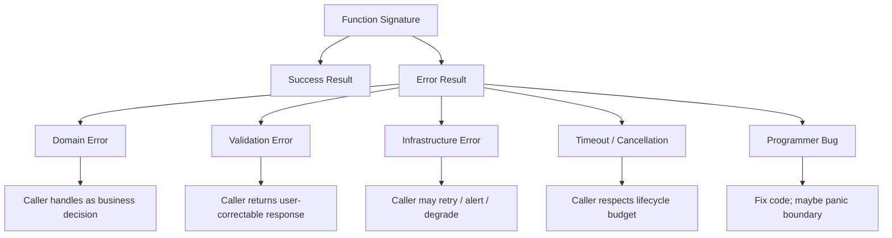
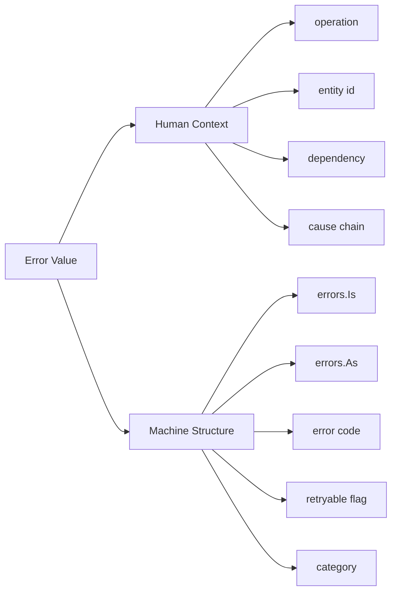
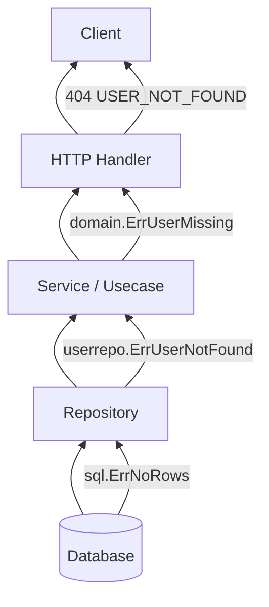
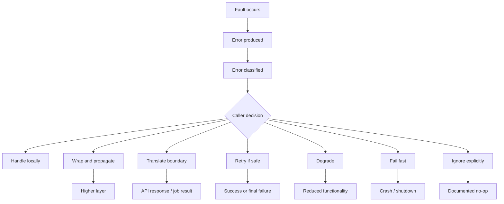
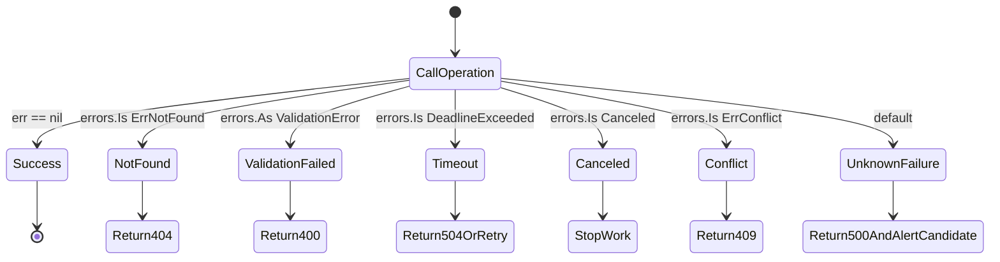

# learn-go-reliability-error-handling-part-001.md

# Go Error Philosophy: Explicit Failure as API Surface

> Seri: `learn-go-reliability-error-handling`  
> Bagian: `001 / 034`  
> Topik: Filosofi error Go sebagai bagian dari desain API  
> Baseline: Go 1.26.x  
> Target pembaca: Java software engineer yang ingin naik dari sekadar “bisa handle error” menjadi mampu mendesain failure contract produksi.

---

## 0. Posisi Bagian Ini Dalam Seri

Pada `part-000`, kita membangun orientasi besar:

- error bukan hanya masalah syntax;
- failure adalah bagian dari desain sistem;
- reliability terdiri dari correctness, resilience, dan operability;
- Go berbeda dari Java karena failure path dibuat eksplisit melalui return value;
- graceful shutdown, cancellation, timeout, retry, panic boundary, observability, dan incident response adalah satu sistem mental yang saling terhubung.

Bagian ini masuk lebih dalam ke pondasi Go:

> Di Go, error adalah bagian dari **API surface**.

Artinya, ketika sebuah function mengembalikan `error`, function itu tidak sekadar berkata “mungkin gagal”. Function itu sedang mendefinisikan:

1. apa bentuk kegagalan yang mungkin terjadi;
2. siapa yang bertanggung jawab mengambil keputusan;
3. apakah caller boleh inspect error;
4. apakah error tersebut stabil sebagai contract;
5. apakah error boleh di-wrap;
6. apakah error boleh diterjemahkan ke domain, HTTP, gRPC, log, metric, alert, retry, atau shutdown.

Di Java, banyak software engineer terbiasa berpikir:

```java
try {
    service.process(command);
} catch (ValidationException e) {
    return badRequest(e);
} catch (OptimisticLockingFailureException e) {
    return conflict(e);
} catch (Exception e) {
    return internalServerError(e);
}
```

Di Go, bentuk umumnya menjadi:

```go
if err := service.Process(ctx, cmd); err != nil {
    return mapError(err)
}
```

Secara visual tampak lebih sederhana. Tetapi secara desain, tanggung jawabnya justru lebih eksplisit:

- `Process` harus memilih error contract-nya;
- caller harus memutuskan apakah error tersebut business failure, technical failure, cancellation, timeout, conflict, atau bug;
- boundary harus menerjemahkan error tanpa membocorkan detail internal;
- observability harus menangkap error tanpa mengubahnya menjadi noise.

Bagian ini membahas fondasi mental tersebut.

---

## 1. Learning Objectives

Setelah bagian ini, kamu seharusnya bisa:

1. Menjelaskan mengapa Go memakai `error` value dan bukan exception sebagai mekanisme utama.
2. Mendesain function signature yang failure-aware.
3. Membedakan error sebagai:
   - signal lokal,
   - domain contract,
   - infrastructure detail,
   - operational evidence,
   - API boundary.
4. Menentukan kapan error harus dikembalikan, dibungkus, diterjemahkan, disembunyikan, atau diabaikan.
5. Menghindari anti-pattern seperti:
   - string matching error;
   - semua error dianggap sama;
   - log-and-return di setiap layer;
   - panic untuk expected failure;
   - exposing internal error sebagai API response;
   - membuat sentinel error publik tanpa memikirkan compatibility.
6. Membaca Go code dari sudut pandang reliability, bukan hanya syntax.

---

## 2. Referensi Utama

Bagian ini didasarkan pada beberapa referensi stabil:

- Go blog, **“Error handling and Go”**, menjelaskan bahwa Go menggunakan `error` value untuk menunjukkan abnormal state.
- Go blog, **“Errors are values”**, menjelaskan bahwa error adalah value yang bisa diprogram, bukan hanya dicek secara rote dengan `if err != nil`.
- Go blog, **“Working with Errors in Go 1.13”**, menjelaskan wrapping, `errors.Is`, `errors.As`, dan `Unwrap`.
- Package documentation `errors`, yang mendefinisikan behavior wrapping, `Is`, `As`, `Join`, dan traversal error tree.
- Go design talk **“Language Design in the Service of Software Engineering”**, yang menjelaskan bahwa Go sengaja tidak memakai exception sebagai mekanisme error utama.
- Effective Go dan Go blog **“Defer, Panic, and Recover”** untuk batas antara error normal dan panic/recover.

Catatan penting:

> Go 1.26.x tidak mengubah filosofi dasar error handling. Fitur utama modern yang relevan berasal dari Go 1.13 untuk wrapping, Go 1.20 untuk `errors.Join` dan context cause, serta peningkatan library/runtime setelahnya.

---

## 3. Inti Filosofi: Error Adalah Value, Bukan Side Channel

Di Go, `error` adalah interface sederhana:

```go
type error interface {
    Error() string
}
```

Ini terlihat terlalu sederhana jika dibandingkan dengan Java exception hierarchy. Tetapi kesederhanaan ini disengaja.

Error di Go adalah value biasa. Karena itu error bisa:

- disimpan;
- dibandingkan;
- dibungkus;
- diterjemahkan;
- digabung;
- diuji dengan `errors.Is`;
- diekstrak dengan `errors.As`;
- dikirim lewat channel;
- disertakan dalam struct;
- dimapping ke response;
- dihitung sebagai metric;
- diabaikan secara eksplisit;
- dijadikan bagian dari domain contract.

Dalam exception-based language, error sering menjadi **side channel**:

```java
User user = repository.findById(id);
// function signature tidak selalu cukup jelas apakah ini throw NotFoundException,
// SQLException, TimeoutException, RuntimeException, atau wrapped CompletionException.
```

Di Go, failure path menjadi bagian dari signature:

```go
user, err := repository.FindByID(ctx, id)
if err != nil {
    return User{}, err
}
```

Function itu secara eksplisit mengembalikan dua hal:

1. hasil;
2. alasan mengapa hasil tidak tersedia.

Ini memberi sinyal kuat:

> Caller tidak boleh berpura-pura operasi ini selalu berhasil.

---

## 4. Mental Model Java vs Go

### 4.1 Java Exception Mindset

Di Java, exception punya beberapa karakteristik:

- stack unwinding otomatis;
- control flow bisa lompat jauh;
- caller bisa tidak sadar ada exception runtime;
- checked exception memaksa declaration, tetapi sering dibungkus atau dihindari;
- unchecked exception sering menjadi campuran antara bug, infrastructure error, dan domain error;
- stack trace menjadi sumber debugging utama;
- exception hierarchy sering menjadi bagian dari API design.

Contoh:

```java
public Order submit(OrderCommand command) {
    validate(command);
    Customer customer = customerRepository.get(command.customerId());
    Payment payment = paymentGateway.charge(command);
    return orderRepository.save(command, payment);
}
```

Failure bisa muncul dari banyak tempat:

- validation error;
- customer not found;
- database error;
- HTTP timeout ke payment gateway;
- null pointer;
- serialization error;
- transaction failure.

Sebagian mungkin terlihat di signature, sebagian tidak.

### 4.2 Go Error Mindset

Di Go:

```go
func SubmitOrder(ctx context.Context, cmd SubmitOrderCommand) (Order, error) {
    if err := validate(cmd); err != nil {
        return Order{}, err
    }

    customer, err := customerRepo.Get(ctx, cmd.CustomerID)
    if err != nil {
        return Order{}, err
    }

    payment, err := paymentGateway.Charge(ctx, cmd)
    if err != nil {
        return Order{}, err
    }

    order, err := orderRepo.Save(ctx, cmd, payment)
    if err != nil {
        return Order{}, err
    }

    return order, nil
}
```

Control flow-nya lebih eksplisit:

- setelah setiap operasi berisiko, ada decision point;
- tidak ada hidden stack unwinding;
- setiap layer harus memilih apakah error diproses atau dinaikkan;
- pembaca dapat melihat failure path langsung di code.

Tetapi ini tidak otomatis membuat code lebih reliable. Go hanya memberi mekanisme. Engineer tetap harus mendesain contract.

---

## 5. Error as API Surface

API surface bukan hanya nama function, parameter, dan return type. API surface juga mencakup failure contract.

Contoh function:

```go
func GetUser(ctx context.Context, id UserID) (User, error)
```

Signature ini belum cukup. Pertanyaan desainnya:

1. Jika user tidak ditemukan, error apa?
2. Jika `ctx` canceled, error apa?
3. Jika database timeout, error apa?
4. Jika database row corrupt, error apa?
5. Jika caller memberikan invalid ID, error apa?
6. Apakah caller boleh menggunakan `errors.Is(err, ErrUserNotFound)`?
7. Apakah caller boleh menggunakan `errors.As(err, *ValidationError)`?
8. Apakah error message stabil?
9. Apakah error code stabil?
10. Apakah error ini boleh di-log sebagai warning, info, atau error?
11. Apakah error ini retryable?
12. Apakah error ini menjadi `404`, `400`, `409`, `499`, `500`, atau `503`?

Kalau tidak dijawab, caller akan menebak. Dan ketika caller menebak, sistem akan rusak secara perlahan.

---

## 6. Failure Contract: Yang Harus Didefinisikan Function

Setiap function production-grade yang bisa gagal idealnya punya kontrak minimal berikut:

| Aspek | Pertanyaan |
|---|---|
| Failure possibility | Operasi apa yang bisa gagal? |
| Failure category | Apakah failure ini domain, validation, dependency, timeout, cancellation, atau bug? |
| Caller action | Apa yang harus dilakukan caller? |
| Inspectability | Apakah caller boleh inspect error dengan `errors.Is`/`errors.As`? |
| Stability | Apakah error type/code/sentinel ini stabil lintas versi? |
| Abstraction | Apakah error low-level boleh bocor? |
| Observability | Apakah error membawa context cukup untuk debugging? |
| Security | Apakah error aman untuk user/log? |
| Retryability | Apakah caller boleh retry? |
| Idempotency | Jika retry dilakukan, apakah aman? |

Contoh dokumentasi Go-style:

```go
// FindByID returns the user with the given id.
//
// If no user exists, it returns an error matching ErrUserNotFound.
// If ctx is canceled or its deadline expires, it returns an error wrapping
// ctx.Err().
// Other errors indicate repository or storage failure and should generally
// be treated as internal infrastructure errors.
func (r *UserRepository) FindByID(ctx context.Context, id UserID) (User, error)
```

Dengan dokumentasi seperti ini, caller tahu cara membuat keputusan:

```go
user, err := repo.FindByID(ctx, id)
switch {
case err == nil:
    return user, nil
case errors.Is(err, ErrUserNotFound):
    return User{}, domain.ErrUserMissing
case errors.Is(err, context.Canceled), errors.Is(err, context.DeadlineExceeded):
    return User{}, err
default:
    return User{}, fmt.Errorf("find user %s: %w", id, err)
}
```

---

## 7. Mermaid: Error Sebagai API Contract



Diagram ini menunjukkan bahwa `error` bukan satu ember besar. Satu return value `error` bisa merepresentasikan berbagai kategori failure. Tugas engineer adalah menjaga kategorinya tetap bisa dibedakan.

---

## 8. Kenapa Go Tidak Menggunakan Exception Sebagai Mekanisme Utama

Go punya `panic` dan `recover`, tetapi bukan untuk expected error handling.

Alasan desain Go secara praktis:

### 8.1 Explicit Local Decision Point

Dengan error return, setiap call site punya kesempatan eksplisit:

```go
result, err := doSomething()
if err != nil {
    return err
}
```

Engineer dapat melihat:

- di mana error muncul;
- apakah error diproses;
- apakah error dibungkus;
- apakah error diabaikan;
- apakah cleanup dilakukan.

Exception menyembunyikan jalur ini kecuali kita membaca dokumentasi atau call graph.

### 8.2 Simpler Control Flow

Exception membuat control flow non-local. Function yang terlihat linear bisa keluar dari tengah melalui stack unwinding.

Go lebih dekat ke:

```text
call -> check -> decide
```

Daripada:

```text
call -> maybe hidden jump -> maybe caught somewhere else
```

### 8.3 Better Composition with Concurrency

Goroutine tidak punya parent exception propagation bawaan. Jika Go memakai exception sebagai mekanisme utama, failure antar goroutine tetap perlu model eksplisit.

Di Go, error bisa dikirim lewat channel:

```go
errCh <- err
```

Atau dikumpulkan melalui `errgroup`:

```go
g.Go(func() error {
    return worker(ctx)
})
```

Ini cocok dengan concurrency model Go.

### 8.4 API Design Simplicity

Go menghindari exception hierarchy yang terlalu besar. Alih-alih membuat tree class exception, Go mendorong engineer untuk memakai:

- sentinel error;
- typed error;
- wrapping;
- `errors.Is`;
- `errors.As`;
- domain-level mapping;
- explicit documentation.

---

## 9. Tapi Explicit Error Bukan Berarti Boilerplate Tanpa Desain

Banyak engineer baru Go melihat ini:

```go
if err != nil {
    return err
}
```

Lalu menyimpulkan Go error handling “verbose”. Kritik ini sering benar di codebase yang buruk, tetapi bukan inti masalahnya.

Masalah sebenarnya biasanya:

- error taxonomy tidak ada;
- boundary tidak jelas;
- semua layer hanya `return err`;
- tidak ada context wrapping;
- tidak ada domain mapping;
- tidak ada cancellation policy;
- tidak ada retry policy;
- tidak ada observability model;
- tidak ada testing untuk failure path.

Go tidak menghilangkan kebutuhan desain. Go hanya membuat failure path terlihat.

---

## 10. Good Go Error Handling Is Not Repeating `if err != nil`

Naive code:

```go
func Process(ctx context.Context, id string) error {
    user, err := repo.Find(ctx, id)
    if err != nil {
        return err
    }

    err = validator.Validate(user)
    if err != nil {
        return err
    }

    err = publisher.Publish(ctx, user)
    if err != nil {
        return err
    }

    return nil
}
```

Code ini benar secara syntax, tetapi miskin secara operasional.

Lebih baik:

```go
func Process(ctx context.Context, id string) error {
    userID, err := ParseUserID(id)
    if err != nil {
        return fmt.Errorf("parse user id: %w", err)
    }

    user, err := repo.Find(ctx, userID)
    if err != nil {
        return fmt.Errorf("find user %s: %w", userID, err)
    }

    if err := ValidateProcessable(user); err != nil {
        return fmt.Errorf("validate processable user %s: %w", userID, err)
    }

    if err := publisher.Publish(ctx, UserProcessed{UserID: userID}); err != nil {
        return fmt.Errorf("publish user processed event for user %s: %w", userID, err)
    }

    return nil
}
```

Tetapi bahkan ini belum cukup jika semua error hanya dibungkus string. Untuk production-grade code, caller harus tetap bisa inspect:

```go
if errors.Is(err, domain.ErrUserSuspended) {
    // business response
}
```

Jadi prinsipnya:

> Tambahkan context untuk manusia, tetapi pertahankan structure untuk program.

---

## 11. Error Untuk Manusia vs Error Untuk Program

Error punya dua audiens:

1. manusia;
2. program.

### 11.1 Manusia Membutuhkan Context

Manusia butuh menjawab:

- operasi apa yang gagal?
- entity apa yang terkait?
- dependency apa yang gagal?
- pada tahap apa?
- apa penyebab bawahnya?

Contoh buruk:

```text
connection refused
```

Contoh lebih baik:

```text
refresh user profile u-123: call profile service: connection refused
```

### 11.2 Program Membutuhkan Structure

Program butuh menjawab:

- apakah ini not found?
- apakah retryable?
- apakah timeout?
- apakah validation error?
- apakah conflict?
- apakah cancellation?
- apakah dependency unavailable?

Program tidak boleh mengandalkan string:

```go
if strings.Contains(err.Error(), "not found") {
    // fragile
}
```

Program sebaiknya memakai:

```go
if errors.Is(err, ErrUserNotFound) {
    // stable enough if documented
}
```

Atau:

```go
var validationErr *ValidationError
if errors.As(err, &validationErr) {
    // inspect fields safely
}
```

---

## 12. Mermaid: Human Context vs Machine Structure



Production-grade error handling harus mengoptimalkan keduanya.

---

## 13. Nil Error Contract

Di Go, convention dasar:

```go
result, err := f()
if err != nil {
    // result may be invalid unless documented otherwise
}
```

Artinya:

- `err == nil`: operasi berhasil;
- `err != nil`: success result tidak boleh diasumsikan valid kecuali dokumentasi mengatakan partial result valid.

Contoh:

```go
file, err := os.Open(path)
if err != nil {
    return err
}
defer file.Close()
```

Jangan gunakan result sebelum mengecek error.

Buruk:

```go
file, err := os.Open(path)
defer file.Close() // panic jika file nil
if err != nil {
    return err
}
```

Rule:

> Check error sebelum memakai value lain yang dikembalikan dari function yang sama.

---

## 14. Partial Result: Kapan Boleh?

Kadang function mengembalikan partial result bersama error.

Contoh konseptual:

```go
func ParseBatch(data []byte) ([]Record, error)
```

Jika ada error, apakah records valid?

Ada tiga pilihan contract:

### 14.1 No Partial Result

```go
records, err := ParseBatch(data)
if err != nil {
    // records should be ignored
}
```

Ini paling sederhana.

### 14.2 Partial Result Explicit

```go
type ParseResult struct {
    Records []Record
    Errors  []RecordError
}
```

Ini lebih jelas untuk batch.

### 14.3 Partial Result with Error

```go
records, err := ParseBatch(data)
if err != nil {
    // records contains valid records parsed before failure
}
```

Ini rawan disalahgunakan jika tidak terdokumentasi sangat jelas.

Untuk production API, lebih baik gunakan result type eksplisit:

```go
type BatchValidationResult struct {
    Accepted []Record
    Rejected []RejectedRecord
}
```

Daripada mengandalkan interpretasi `([]Record, error)`.

---

## 15. Kapan Function Harus Return Error?

Function harus return error ketika caller punya keputusan yang masuk akal untuk dibuat.

Contoh:

```go
func LoadConfig(path string) (Config, error)
```

Caller bisa:

- fail fast;
- pakai default;
- cari config alternatif;
- tampilkan diagnostic.

```go
func ChargePayment(ctx context.Context, req ChargeRequest) (ChargeResult, error)
```

Caller bisa:

- retry jika timeout dan request idempotent;
- return `402` jika declined;
- return `503` jika gateway unavailable;
- trigger compensation jika ambiguous.

Function tidak harus return error untuk programmer invariant yang mustahil jika caller benar.

Contoh:

```go
func MustParseStaticTemplate(name string) *Template
```

Jika template static tidak valid, ini deployment/programmer error. Panic saat startup bisa diterima.

Tetapi jangan menggunakan `Must*` untuk input user/runtime.

---

## 16. Kapan Error Tidak Perlu Dikembalikan?

Tidak semua kondisi harus menjadi error.

### 16.1 Boolean Query

```go
func IsEnabled(flag string) bool
```

Jika flag tidak ada dan default false adalah contract, tidak perlu error.

Tetapi jika source config bisa gagal:

```go
func IsEnabled(ctx context.Context, flag string) (bool, error)
```

### 16.2 Domain Negative Result

Not every “no” is an error.

Contoh:

```go
func CanApprove(actor User, application Application) bool
```

Jika hasilnya `false`, itu bukan error. Itu jawaban domain.

Tetapi jika perlu alasan:

```go
func CheckApproval(actor User, application Application) ApprovalDecision
```

Dengan:

```go
type ApprovalDecision struct {
    Allowed bool
    Reasons []DenialReason
}
```

Jangan jadikan business denial sebagai technical error jika caller memang mengharapkan decision.

### 16.3 Cache Miss

Cache miss sering bukan error.

```go
value, ok := cache.Get(key)
```

Tetapi cache backend unavailable adalah error:

```go
value, ok, err := cache.Get(ctx, key)
```

Kontrak ini memisahkan:

- miss normal;
- failure abnormal.

---

## 17. Error vs Result Type

Go tidak punya algebraic `Result<T, E>` seperti Rust, tetapi idiom `(T, error)` secara praktik adalah result type.

Namun untuk domain decision kompleks, `(T, error)` kadang bukan pilihan terbaik.

### 17.1 Untuk Technical Operation

```go
func ReadFile(path string) ([]byte, error)
```

Bagus.

### 17.2 Untuk Domain Decision

Buruk:

```go
func CanSubmit(app Application) error
```

Lebih ekspresif:

```go
type SubmissionDecision struct {
    Allowed bool
    Reasons []SubmissionDenial
}

func EvaluateSubmission(app Application) SubmissionDecision
```

Kenapa?

Karena “cannot submit because state is Draft” mungkin bukan error sistem. Itu hasil evaluasi rule.

### 17.3 Untuk Command Execution

```go
func Submit(ctx context.Context, cmd SubmitCommand) (SubmissionResult, error)
```

Di sini error bisa tetap dipakai untuk:

- repository failure;
- concurrency conflict;
- timeout;
- invalid command shape;
- policy violation jika command dianggap request yang gagal.

Tetapi hasil domain yang kaya bisa dimodelkan eksplisit:

```go
type SubmissionResult struct {
    ApplicationID ApplicationID
    NewState      ApplicationState
    AuditID       AuditID
}
```

---

## 18. Expected Failure vs Unexpected Failure

Production code harus membedakan:

| Jenis | Contoh | Handling |
|---|---|---|
| Expected domain failure | application cannot transition from Closed to Submitted | return domain error/decision |
| Expected validation failure | missing required field | return validation error |
| Expected absence | user not found | sentinel/typed not found |
| Expected lifecycle event | context canceled | propagate/respect |
| Expected dependency transient | timeout, 503 | classify/retry/degrade |
| Unexpected infrastructure | corrupt DB response | wrap/internal error |
| Programmer bug | nil pointer, invalid invariant | panic or fail test |
| Fatal startup | missing required config | fail fast |

Kesalahan umum:

- semua expected failure diperlakukan sebagai `500`;
- semua unexpected failure diberi user-friendly message tetapi hilang diagnostic;
- programmer bug ditelan recover lalu service lanjut dalam state korup;
- cancellation dianggap error server;
- validation error dilog sebagai error severity tinggi.

---

## 19. API Error Contract di Go Package

Sebuah package Go yang baik harus jelas tentang error yang diekspos.

Misal package `userrepo`:

```go
package userrepo

var ErrNotFound = errors.New("user not found")

type ConflictError struct {
    UserID UserID
    Version int64
}

func (e *ConflictError) Error() string {
    return fmt.Sprintf("user %s version conflict", e.UserID)
}
```

Kemudian function:

```go
// Update updates a user.
//
// If the user does not exist, it returns an error matching ErrNotFound.
// If optimistic locking fails, it returns an error assignable to *ConflictError.
// Other errors indicate storage failure.
func (r *Repository) Update(ctx context.Context, user User) error
```

Caller:

```go
err := repo.Update(ctx, user)
switch {
case err == nil:
    return nil
case errors.Is(err, userrepo.ErrNotFound):
    return domain.ErrUserMissing
default:
    var conflict *userrepo.ConflictError
    if errors.As(err, &conflict) {
        return domain.NewConcurrentModification(conflict.UserID)
    }
    return fmt.Errorf("update user: %w", err)
}
```

Ini jauh lebih kuat daripada:

```go
if strings.Contains(err.Error(), "not found") { ... }
```

---

## 20. Abstraction Leak: Bahaya Membocorkan Error Low-Level

Misal repository langsung expose error SQL:

```go
if errors.Is(err, sql.ErrNoRows) {
    ...
}
```

Apakah ini buruk? Tergantung boundary.

Di dalam repository, boleh:

```go
row := db.QueryRowContext(ctx, query, id)
if err := row.Scan(&user.ID, &user.Name); err != nil {
    if errors.Is(err, sql.ErrNoRows) {
        return User{}, ErrUserNotFound
    }
    return User{}, fmt.Errorf("scan user row: %w", err)
}
```

Di service/domain layer, sebaiknya jangan bergantung pada `sql.ErrNoRows`, karena itu membocorkan keputusan storage implementation.

Jika suatu hari repository pindah dari SQL ke HTTP service atau KV store, service layer tidak perlu berubah.

Rule:

> Low-level error boleh dikenali di adapter. Di boundary atas, expose error sesuai abstraction level.

---

## 21. Mermaid: Error Translation Across Layers



Yang penting bukan hanya error naik ke atas, tetapi berubah level:

- SQL level;
- repository level;
- domain/usecase level;
- transport/API level.

---

## 22. Wrapping: Context Tanpa Menghilangkan Cause

Wrapping membuat error punya chain.

```go
return fmt.Errorf("load config from %s: %w", path, err)
```

Dengan `%w`, caller masih bisa:

```go
errors.Is(err, os.ErrNotExist)
```

Jika memakai `%v`, cause hilang secara structural:

```go
return fmt.Errorf("load config from %s: %v", path, err)
```

Pesan masih terlihat, tapi program tidak bisa inspect cause dengan `errors.Is`/`errors.As`.

Rule:

> Gunakan `%w` ketika caller masih boleh melihat cause. Gunakan `%v` atau error baru ketika cause tidak boleh menjadi contract.

---

## 23. Wrapping Adalah Contract Leak Jika Tidak Dipikirkan

Misal:

```go
func (r *Repository) Find(ctx context.Context, id string) (User, error) {
    err := r.db.QueryRowContext(ctx, q, id).Scan(...)
    if err != nil {
        return User{}, fmt.Errorf("find user: %w", err)
    }
}
```

Jika caller bisa `errors.Is(err, sql.ErrNoRows)`, berarti kamu secara tidak langsung membuat `sql.ErrNoRows` bagian dari API. Itu mungkin tidak diinginkan.

Lebih baik:

```go
if errors.Is(err, sql.ErrNoRows) {
    return User{}, ErrUserNotFound
}
return User{}, fmt.Errorf("query user %s: %w", id, err)
```

Untuk error lain, wrapping SQL driver error mungkin masih acceptable jika package memang storage adapter internal. Tetapi untuk public library, pikirkan lebih ketat.

Pertanyaan penting:

> Jika saya wrap error ini, apakah caller sekarang bergantung pada implementation detail?

---

## 24. Error Identity: Sentinel, Type, Code, Message

Ada empat cara umum mengidentifikasi error:

### 24.1 Message

```go
err.Error() == "not found"
```

Hampir selalu buruk untuk logic.

Gunakan message untuk manusia, bukan control flow.

### 24.2 Sentinel

```go
var ErrNotFound = errors.New("not found")
```

Dipakai dengan:

```go
errors.Is(err, ErrNotFound)
```

Bagus untuk kategori sederhana dan stabil.

### 24.3 Typed Error

```go
type NotFoundError struct {
    Resource string
    ID string
}
```

Dipakai dengan:

```go
var nf *NotFoundError
if errors.As(err, &nf) {
    ...
}
```

Bagus ketika caller perlu metadata.

### 24.4 Error Code

```go
type ErrorCode string

const CodeUserNotFound ErrorCode = "USER_NOT_FOUND"
```

Bagus untuk API response, cross-language boundary, documentation, observability.

Untuk package internal Go, sentinel/type sering cukup. Untuk public API, error code biasanya lebih stabil.

---

## 25. Decision Matrix: Pilih Bentuk Error

| Kondisi | Bentuk yang cocok |
|---|---|
| Caller hanya perlu tahu kategori sederhana | sentinel error |
| Caller perlu metadata structured | typed error |
| Boundary lintas bahasa/API | error code |
| Error internal tidak boleh diinspect | opaque error |
| Error perlu context tambahan | wrapping |
| Ada banyak failure sekaligus | joined/multi error |
| Domain decision bukan failure | result/decision type |
| Programmer invariant broken | panic/fail fast |

Contoh:

```go
var ErrApplicationNotFound = errors.New("application not found")
```

Cocok jika hanya perlu 404.

```go
type InvalidTransitionError struct {
    From State
    To   State
    Rule string
}
```

Cocok jika caller perlu membangun audit trail atau user message.

---

## 26. Opaque Error: Ketika Caller Tidak Boleh Tahu Detail

Tidak semua error perlu inspectable.

Misal package security:

```go
func VerifyPassword(hash, password string) error
```

Kita mungkin tidak ingin membedakan:

- user not found;
- password wrong;
- hash malformed;
- account disabled;

secara eksternal, karena bisa membuka enumeration risk.

Boundary bisa mengembalikan:

```go
var ErrInvalidCredentials = errors.New("invalid credentials")
```

Detail internal tetap dilog secara aman di layer terbatas, bukan diexpose ke caller umum.

Rule:

> Semakin dekat ke security boundary, semakin hati-hati membuat error inspectable.

---

## 27. Error and Security

Error bisa membocorkan:

- username valid/tidak;
- internal hostname;
- SQL query;
- path file;
- secret/token;
- stack trace;
- policy rule internal;
- tenant id;
- PII;
- authorization model.

Buruk:

```json
{
  "error": "pq: duplicate key value violates unique constraint users_email_key for email alice@example.com"
}
```

Lebih baik:

```json
{
  "code": "EMAIL_ALREADY_REGISTERED",
  "message": "email is already registered",
  "request_id": "req-..."
}
```

Untuk internal log, tetap hindari PII jika tidak perlu:

```go
logger.WarnContext(ctx, "registration rejected",
    "code", "EMAIL_ALREADY_REGISTERED",
    "email_hash", hashEmail(email),
)
```

---

## 28. Error and Observability

Error value sendiri tidak cukup. Production system butuh observability.

Sebuah error perlu diterjemahkan ke:

- log event;
- metric counter;
- trace span status;
- alert signal;
- audit event jika domain-sensitive.

Tetapi jangan log error di setiap layer.

Buruk:

```go
func repo() error {
    if err != nil {
        log.Println("repo error", err)
        return err
    }
}

func service() error {
    if err := repo(); err != nil {
        log.Println("service error", err)
        return err
    }
}

func handler() {
    if err := service(); err != nil {
        log.Println("handler error", err)
    }
}
```

Akibat:

- duplicate logs;
- noisy alert;
- sulit korelasi;
- biaya observability naik;
- severity tidak konsisten.

Lebih baik:

- low layer: wrap context;
- boundary: log once with structured fields;
- metrics: count at boundary/classification point;
- trace: annotate span.

```go
if err := svc.Submit(ctx, cmd); err != nil {
    apiErr := mapError(err)
    logger.WarnContext(ctx, "submit application failed",
        "error", err,
        "code", apiErr.Code,
        "application_id", cmd.ApplicationID,
    )
    writeError(w, apiErr)
    return
}
```

---

## 29. Error Severity: Error Tidak Selalu `ERROR`

Tidak semua non-nil error harus log level error.

| Kondisi | Level umum |
|---|---|
| validation failed | info/debug, kadang no log |
| unauthorized login | warn jika suspicious, otherwise info |
| not found normal | no log/info |
| conflict optimistic lock | info/warn |
| client canceled request | debug/info |
| dependency timeout | warn/error tergantung impact |
| internal invariant violation | error/panic |
| repeated failure causing SLO burn | alert |

Contoh:

- `404` untuk resource yang memang sering dicari: bukan incident.
- `context.Canceled` karena client disconnect: biasanya bukan server error.
- `DeadlineExceeded` ke database pada critical path: bisa warning/error dan metric.
- Panic recovered di HTTP handler: error dan alert candidate.

---

## 30. Error and SLO

SRE mindset:

> Error penting bukan karena `err != nil`, tetapi karena user-visible reliability turun.

SLO mengubah pertanyaan:

Bukan:

```text
Berapa banyak error log hari ini?
```

Melainkan:

```text
Berapa banyak request valid yang gagal memenuhi contract?
```

Contoh:

- validation error dari user bukan SLO failure;
- unauthorized access bukan SLO failure;
- dependency timeout untuk request valid adalah SLO failure;
- server overload yang menghasilkan 503 adalah SLO failure;
- background job gagal tapi retry sukses mungkin bukan user-visible failure, tetapi tetap operational signal.

Jadi error classification harus tahu:

```go
type Classification struct {
    Code        string
    Category    string
    Retryable   bool
    UserVisible bool
    SLORelevant bool
    Severity    string
}
```

---

## 31. Designing Error Classifier

Di boundary, buat classifier:

```go
type ErrorClass struct {
    Code        string
    HTTPStatus  int
    Retryable   bool
    LogLevel    string
    UserMessage string
}

func ClassifyError(err error) ErrorClass {
    switch {
    case err == nil:
        return ErrorClass{Code: "OK", HTTPStatus: 200}

    case errors.Is(err, context.Canceled):
        return ErrorClass{
            Code:        "REQUEST_CANCELED",
            HTTPStatus: 499, // non-standard; use carefully
            Retryable:   false,
            LogLevel:    "debug",
            UserMessage: "request was canceled",
        }

    case errors.Is(err, context.DeadlineExceeded):
        return ErrorClass{
            Code:        "REQUEST_TIMEOUT",
            HTTPStatus: 504,
            Retryable:   true,
            LogLevel:    "warn",
            UserMessage: "request timed out",
        }

    case errors.Is(err, domain.ErrNotFound):
        return ErrorClass{
            Code:        "NOT_FOUND",
            HTTPStatus: 404,
            Retryable:   false,
            LogLevel:    "info",
            UserMessage: "resource not found",
        }

    default:
        return ErrorClass{
            Code:        "INTERNAL_ERROR",
            HTTPStatus: 500,
            Retryable:   false,
            LogLevel:    "error",
            UserMessage: "internal server error",
        }
    }
}
```

Catatan:

- HTTP 499 bukan status resmi IANA; banyak platform memakai secara internal untuk client closed request. Jika public API, gunakan kebijakan organisasi.
- Jangan asal memberi `Retryable: true`; harus terkait idempotency.

---

## 32. Error Handling Bukan Sama Dengan Recovery

Banyak engineer mencampur:

- detect error;
- classify error;
- recover from error;
- retry error;
- degrade behavior;
- report error;
- expose error.

Ini berbeda.

Contoh dependency timeout:

```text
Payment gateway timeout
```

Kemungkinan tindakan:

1. retry jika charge idempotent;
2. mark payment as pending;
3. return “processing” ke user;
4. enqueue reconciliation;
5. alert jika rate tinggi;
6. log dengan correlation id;
7. jangan double charge.

Handling yang buruk:

```go
if err != nil {
    return err
}
```

Handling yang juga buruk:

```go
for {
    err := charge()
    if err == nil {
        break
    }
}
```

Karena retry tanpa budget bisa menciptakan outage.

---

## 33. Error Lifecycle



Error handling yang matang adalah memilih cabang yang benar.

---

## 34. Kapan Error Boleh Diabaikan?

Go mengizinkan:

```go
_, _ = fmt.Fprintln(w, "hello")
```

Tetapi ignore harus disengaja.

Contoh acceptable:

```go
defer func() {
    _ = resp.Body.Close()
}()
```

Untuk HTTP response body dari client, close error biasanya tidak actionable.

Namun untuk file write, close error bisa penting karena data flush bisa gagal:

```go
func WriteFileAtomically(path string, data []byte) (err error) {
    f, err := os.CreateTemp(filepath.Dir(path), ".tmp-*")
    if err != nil {
        return fmt.Errorf("create temp file: %w", err)
    }

    tmpName := f.Name()
    defer func() {
        if err != nil {
            _ = os.Remove(tmpName)
        }
    }()

    if _, err := f.Write(data); err != nil {
        _ = f.Close()
        return fmt.Errorf("write temp file: %w", err)
    }

    if err := f.Close(); err != nil {
        return fmt.Errorf("close temp file: %w", err)
    }

    if err := os.Rename(tmpName, path); err != nil {
        return fmt.Errorf("rename temp file: %w", err)
    }

    return nil
}
```

Prinsip:

> Ignore hanya jika error tidak actionable, tidak memengaruhi correctness, dan alasannya jelas dari konteks atau komentar.

---

## 35. Common Anti-Patterns

### 35.1 String Matching

```go
if strings.Contains(err.Error(), "duplicate") {
    ...
}
```

Masalah:

- fragile;
- berubah karena driver/package;
- locale/message berubah;
- sulit test stabil.

Gunakan typed/sentinel/code.

### 35.2 Log and Return Everywhere

Menambah noise, bukan reliability.

Low layer:

```go
return fmt.Errorf("query user: %w", err)
```

Boundary:

```go
logger.ErrorContext(ctx, "request failed", "error", err)
```

### 35.3 Panic for Expected Error

Buruk:

```go
if err := validate(input); err != nil {
    panic(err)
}
```

Validation user input adalah expected failure. Return error.

### 35.4 Swallow Error

Buruk:

```go
result, _ := dangerous()
return result
```

Jika benar-benar ignore, jelaskan.

### 35.5 Returning `nil` Error with Invalid Result

Buruk:

```go
func Find(id string) (User, error) {
    if id == "" {
        return User{}, nil
    }
}
```

Caller mengira user valid. Gunakan error atau `(User, bool, error)`.

### 35.6 Exposing Internal Error to User

Buruk:

```go
http.Error(w, err.Error(), 500)
```

Bisa bocor internal. Map ke safe response.

### 35.7 Wrapping Without Meaning

Buruk:

```go
return fmt.Errorf("error: %w", err)
```

Tidak menambah context.

### 35.8 Losing Cause

Buruk:

```go
return fmt.Errorf("save user: %v", err)
```

Jika caller perlu inspect, gunakan `%w`.

### 35.9 Over-General Sentinel

Buruk:

```go
var ErrFailed = errors.New("failed")
```

Tidak membantu decision.

### 35.10 Public Error Contract Tanpa Stabilitas

Jika kamu export:

```go
var ErrSomething = errors.New("something")
```

Caller bisa bergantung padanya. Jangan ubah sembarangan.

---

## 36. Java-to-Go Translation Guide

### 36.1 Java Checked Exception

Java:

```java
User findUser(String id) throws UserNotFoundException, SQLException;
```

Go:

```go
func FindUser(ctx context.Context, id UserID) (User, error)
```

Dengan contract:

```go
// If the user does not exist, returns an error matching ErrUserNotFound.
// Storage failures are returned as non-nil errors not matching ErrUserNotFound.
```

### 36.2 Java RuntimeException

Java:

```java
throw new IllegalStateException("invalid transition");
```

Go untuk domain expected failure:

```go
return fmt.Errorf("transition application %s from %s to %s: %w",
    app.ID, app.State, target, ErrInvalidTransition)
```

Go untuk programmer invariant:

```go
panic("unreachable application state")
```

Tetapi hati-hati: banyak `IllegalStateException` di Java sebenarnya domain error, bukan bug.

### 36.3 Java `finally`

Java:

```java
try {
    use(resource);
} finally {
    resource.close();
}
```

Go:

```go
resource, err := open()
if err != nil {
    return err
}
defer resource.Close()
```

Untuk close error penting, handle eksplisit.

### 36.4 Java Exception Hierarchy

Java:

```java
class DomainException extends RuntimeException {}
class InvalidTransitionException extends DomainException {}
class PermissionDeniedException extends DomainException {}
```

Go:

```go
var ErrInvalidTransition = errors.New("invalid transition")
var ErrPermissionDenied = errors.New("permission denied")
```

Atau typed:

```go
type InvalidTransitionError struct {
    EntityID string
    From     string
    To       string
}
```

### 36.5 Java Global Exception Handler

Spring:

```java
@ControllerAdvice
class ErrorHandler {
    @ExceptionHandler(...)
}
```

Go equivalent:

- handler adapter returns error;
- centralized mapper;
- middleware logs/recovers.

```go
type HandlerFunc func(http.ResponseWriter, *http.Request) error

func Adapt(h HandlerFunc) http.HandlerFunc {
    return func(w http.ResponseWriter, r *http.Request) {
        if err := h(w, r); err != nil {
            writeAPIError(w, r, err)
        }
    }
}
```

---

## 37. Handler Error Adapter Pattern

Standard `net/http` handler tidak return error:

```go
func(w http.ResponseWriter, r *http.Request)
```

Untuk production service, sering berguna membuat adapter internal:

```go
type AppHandler func(http.ResponseWriter, *http.Request) error

func (h AppHandler) ServeHTTP(w http.ResponseWriter, r *http.Request) {
    if err := h(w, r); err != nil {
        writeError(w, r, err)
    }
}
```

Handler menjadi bersih:

```go
func (h *Handler) GetUser(w http.ResponseWriter, r *http.Request) error {
    ctx := r.Context()

    id, err := parseUserID(r.PathValue("id"))
    if err != nil {
        return fmt.Errorf("parse user id: %w", err)
    }

    user, err := h.users.Get(ctx, id)
    if err != nil {
        return fmt.Errorf("get user %s: %w", id, err)
    }

    return writeJSON(w, http.StatusOK, user)
}
```

Boundary mapper:

```go
func writeError(w http.ResponseWriter, r *http.Request, err error) {
    class := ClassifyError(err)

    // log once
    // metric once
    // trace status once
    // response once
}
```

Ini mirip `@ControllerAdvice`, tetapi eksplisit dan lightweight.

---

## 38. Error Contract Documentation Template

Gunakan template ini untuk function penting:

```go
// Operation does X.
//
// It returns:
//   - an error matching ErrA when ...
//   - an error assignable to *BError when ...
//   - an error wrapping context.Canceled or context.DeadlineExceeded when ctx
//     is canceled or expires.
//   - other non-nil errors for infrastructure or unexpected failures.
//
// On non-nil error, the returned Result must be ignored unless explicitly stated.
func Operation(ctx context.Context, input Input) (Result, error)
```

Untuk domain command:

```go
// Submit transitions an application from Draft to Submitted.
//
// Business rule failures are returned as errors assignable to *RuleViolationError.
// Concurrent modification returns an error matching ErrConflict.
// If the operation succeeds, the returned result contains the new state and audit id.
// The operation is idempotent for the same command id.
func Submit(ctx context.Context, cmd SubmitCommand) (SubmitResult, error)
```

Ini membuat API lebih tahan terhadap interpretasi salah.

---

## 39. Error Stability and Compatibility

Jika package kamu digunakan banyak caller, error adalah compatibility surface.

Breaking changes bukan hanya:

- mengubah nama function;
- mengubah struct field;
- mengubah parameter.

Breaking change juga:

- berhenti mengembalikan `ErrNotFound`;
- mengganti typed error;
- berhenti wrapping `context.DeadlineExceeded`;
- mengubah code dari `USER_NOT_FOUND` menjadi `NOT_FOUND`;
- mengubah retryability tanpa dokumentasi;
- mengubah not found dari error ke nil result;
- mengubah validation error shape.

Untuk internal monolith/microservice, stabilitas tetap penting karena banyak layer bergantung pada classification.

---

## 40. Error Granularity: Terlalu Sedikit vs Terlalu Banyak

### 40.1 Terlalu Sedikit

```go
var ErrBadRequest = errors.New("bad request")
```

Semua hal menjadi `BAD_REQUEST`.

Masalah:

- client tidak tahu cara memperbaiki;
- metric tidak informatif;
- support sulit triage;
- retry policy tidak jelas.

### 40.2 Terlalu Banyak

```go
ErrUserNameTooShortByOneCharacter
ErrUserNameTooShortByTwoCharacters
ErrUserNameHasInvalidUnderscoreAtBeginning
```

Masalah:

- API terlalu kompleks;
- compatibility berat;
- client bingung;
- metric cardinality tinggi.

### 40.3 Balanced

Gunakan code stabil dengan detail structured:

```json
{
  "code": "VALIDATION_FAILED",
  "message": "request validation failed",
  "fields": [
    {
      "path": "username",
      "code": "TOO_SHORT",
      "min": 3
    }
  ]
}
```

---

## 41. Error Cardinality

Observability sistem bisa rusak oleh cardinality tinggi.

Buruk:

```go
metric.ErrorCount.WithLabelValues(err.Error()).Inc()
```

Jika error message mengandung user id, order id, atau SQL detail, cardinality meledak.

Lebih baik:

```go
metric.ErrorCount.WithLabelValues(class.Code, class.Category).Inc()
```

Log boleh mengandung context terbatas:

```go
logger.WarnContext(ctx, "request failed",
    "code", class.Code,
    "user_id", userID,
    "error", err,
)
```

Metric label harus stabil dan bounded.

---

## 42. Error as Decision Input

Caller harus berpikir seperti state machine:



Error handling yang baik adalah deterministic classification.

---

## 43. Case Study: Regulatory Case Transition

Misal sistem case management punya command:

```go
func EscalateCase(ctx context.Context, cmd EscalateCaseCommand) (EscalateCaseResult, error)
```

Kemungkinan failure:

1. command invalid;
2. case not found;
3. actor unauthorized;
4. case state tidak boleh dieskalasi;
5. stale version;
6. database timeout;
7. audit write failed;
8. notification publish failed;
9. context canceled karena shutdown;
10. invariant internal rusak.

Desain error:

```go
var (
    ErrCaseNotFound       = errors.New("case not found")
    ErrPermissionDenied   = errors.New("permission denied")
    ErrInvalidTransition  = errors.New("invalid transition")
    ErrConflict           = errors.New("conflict")
)

type RuleViolationError struct {
    RuleID string
    Entity string
    Reason string
}

func (e *RuleViolationError) Error() string {
    return fmt.Sprintf("rule %s violated for %s: %s", e.RuleID, e.Entity, e.Reason)
}
```

Service:

```go
func (s *CaseService) EscalateCase(ctx context.Context, cmd EscalateCaseCommand) (EscalateCaseResult, error) {
    if err := cmd.Validate(); err != nil {
        return EscalateCaseResult{}, fmt.Errorf("validate escalate case command: %w", err)
    }

    c, err := s.repo.GetForUpdate(ctx, cmd.CaseID)
    if err != nil {
        return EscalateCaseResult{}, fmt.Errorf("load case %s for escalation: %w", cmd.CaseID, err)
    }

    if !s.authz.CanEscalate(cmd.Actor, c) {
        return EscalateCaseResult{}, ErrPermissionDenied
    }

    if !c.CanTransitionTo(StateEscalated) {
        return EscalateCaseResult{}, &RuleViolationError{
            RuleID: "CASE_ESCALATE_STATE",
            Entity: string(cmd.CaseID),
            Reason: "case state does not allow escalation",
        }
    }

    result, err := s.repo.SaveEscalation(ctx, c, cmd)
    if err != nil {
        return EscalateCaseResult{}, fmt.Errorf("save case %s escalation: %w", cmd.CaseID, err)
    }

    return result, nil
}
```

Boundary mapper:

```go
func classifyCaseError(err error) ErrorClass {
    var ruleErr *RuleViolationError

    switch {
    case errors.Is(err, ErrCaseNotFound):
        return ErrorClass{Code: "CASE_NOT_FOUND", HTTPStatus: 404}
    case errors.Is(err, ErrPermissionDenied):
        return ErrorClass{Code: "FORBIDDEN", HTTPStatus: 403}
    case errors.As(err, &ruleErr):
        return ErrorClass{Code: "RULE_VIOLATION", HTTPStatus: 409}
    case errors.Is(err, ErrConflict):
        return ErrorClass{Code: "CONFLICT", HTTPStatus: 409, Retryable: true}
    case errors.Is(err, context.DeadlineExceeded):
        return ErrorClass{Code: "TIMEOUT", HTTPStatus: 504, Retryable: true}
    default:
        return ErrorClass{Code: "INTERNAL_ERROR", HTTPStatus: 500}
    }
}
```

Ini memperlihatkan error sebagai:

- domain control flow;
- reliability signal;
- API contract;
- auditability support.

---

## 44. Error and Auditability

Dalam regulatory system, tidak semua error hanya teknis.

Contoh:

```text
User cannot approve case because user is maker, not checker.
```

Itu bukan sekadar `403`. Itu mungkin harus masuk audit sebagai denied action.

Tetapi technical error seperti:

```text
database connection reset
```

Biasanya bukan domain audit event, melainkan operational event.

Desain:

| Error | Audit? | Log? | Metric? | API |
|---|---:|---:|---:|---|
| Invalid transition | yes | maybe info | yes | 409 |
| Permission denied | yes | yes | yes | 403 |
| Validation failed | maybe | no/info | yes | 400 |
| DB timeout | no domain audit | yes | yes | 504 |
| Panic recovered | no domain audit | yes | yes/alert | 500 |
| Client canceled | no | debug | maybe | none/499 |

---

## 45. Error and Transaction Boundary

Error handling sering salah di transaction.

Buruk:

```go
tx, err := db.BeginTx(ctx, nil)
if err != nil {
    return err
}

if err := doA(tx); err != nil {
    return err // lupa rollback
}

if err := tx.Commit(); err != nil {
    return err
}
```

Lebih baik:

```go
func WithTx(ctx context.Context, db *sql.DB, fn func(*sql.Tx) error) error {
    tx, err := db.BeginTx(ctx, nil)
    if err != nil {
        return fmt.Errorf("begin transaction: %w", err)
    }

    committed := false
    defer func() {
        if !committed {
            _ = tx.Rollback()
        }
    }()

    if err := fn(tx); err != nil {
        return err
    }

    if err := tx.Commit(); err != nil {
        return fmt.Errorf("commit transaction: %w", err)
    }

    committed = true
    return nil
}
```

Tetapi production-grade transaction wrapper perlu memikirkan:

- rollback error;
- panic safety;
- context cancellation;
- commit ambiguity;
- retry for deadlock/serialization failure;
- idempotency of transaction body.

Akan dibahas lebih dalam di bagian persistence reliability.

---

## 46. Error and Context

`context.Context` bukan error mechanism, tetapi sangat terkait.

Banyak function return error yang bisa match:

```go
context.Canceled
context.DeadlineExceeded
```

Caller harus memperlakukan keduanya berbeda dari internal failure.

Contoh:

```go
if err := op(ctx); err != nil {
    if errors.Is(err, context.Canceled) {
        return err // stop; caller no longer wants result
    }
    if errors.Is(err, context.DeadlineExceeded) {
        return fmt.Errorf("operation timed out: %w", err)
    }
    return err
}
```

Prinsip:

- cancellation bukan “server error” biasa;
- deadline exceeded bisa menjadi timeout signal;
- jangan retry jika context sudah canceled;
- jangan mulai pekerjaan baru setelah shutdown context canceled;
- wrap context error dengan `%w` jika caller perlu mengenali.

---

## 47. Error and Retryability

Jangan embed retry logic hanya berdasarkan error string.

Buruk:

```go
if strings.Contains(err.Error(), "timeout") {
    retry()
}
```

Lebih baik:

```go
type RetryableError interface {
    error
    Retryable() bool
}
```

Atau classifier:

```go
class := ClassifyError(err)
if class.Retryable && idem.Safe {
    retry()
}
```

Tetapi retryability tidak hanya properti error. Retryability juga tergantung operasi.

Contoh:

| Error | Operation | Retry? |
|---|---|---|
| timeout | GET user | biasanya ya |
| timeout | charge payment tanpa idempotency key | berbahaya |
| conflict | update with version | mungkin reload and retry |
| validation | create invalid input | tidak |
| permission denied | any | tidak |
| 503 | idempotent request | ya dengan backoff |
| context canceled | any | tidak |

Rule:

> Error bisa retryable, tetapi operation harus idempotent atau punya deduplication.

---

## 48. Error and Panic Boundary

Gunakan error untuk expected failure. Gunakan panic untuk broken invariant.

Expected:

```go
if amount <= 0 {
    return ErrInvalidAmount
}
```

Invariant broken:

```go
switch state {
case Draft, Submitted, Approved:
    ...
default:
    panic(fmt.Sprintf("unknown state: %s", state))
}
```

Boundary recover:

```go
func RecoverMiddleware(next http.Handler) http.Handler {
    return http.HandlerFunc(func(w http.ResponseWriter, r *http.Request) {
        defer func() {
            if v := recover(); v != nil {
                // log stack
                // metric
                // return 500 if response not written
            }
        }()
        next.ServeHTTP(w, r)
    })
}
```

Recover bukan untuk “melanjutkan seolah tidak terjadi apa-apa”. Recover adalah boundary untuk:

- mencegah satu request menjatuhkan server;
- menangkap diagnostic;
- mengembalikan response aman;
- menjaga process tetap hidup jika state global tidak korup.

Jika panic menunjukkan state global korup, crash bisa lebih aman.

---

## 49. Error as Architecture Constraint

Error design memengaruhi arsitektur:

- Apakah service punya domain layer?
- Apakah repository leak SQL?
- Apakah API error code stabil?
- Apakah worker bisa retry aman?
- Apakah shutdown bisa membatalkan pekerjaan?
- Apakah observability bisa mengklasifikasi error?
- Apakah incident bisa ditriage dari log?
- Apakah caller tahu expected failures?

Jika error model buruk, arsitektur terlihat bersih di diagram tetapi rapuh di produksi.

---

## 50. Practical Design Rules

### Rule 1: Error Must Enable a Decision

Jika caller tidak bisa mengambil keputusan berbeda, jangan expose detail terlalu banyak.

### Rule 2: Human Message and Machine Contract Are Different

`Error()` string bukan API contract untuk program.

### Rule 3: Wrap for Context, Not Decoration

Tambahkan operation/entity/cause yang membantu debug.

### Rule 4: Do Not Leak Lower-Level Abstractions Accidentally

Translate SQL/HTTP/vendor errors di adapter boundary.

### Rule 5: Log Once at the Boundary

Layer bawah wrap; boundary log/classify/respond.

### Rule 6: Treat Cancellation as Lifecycle, Not Failure

`context.Canceled` sering berarti caller tidak membutuhkan hasil lagi.

### Rule 7: Retry Requires Classification Plus Idempotency

Jangan retry hanya karena error terlihat transient.

### Rule 8: Panic Is for Broken Invariants, Not User Input

User input buruk adalah validation error.

### Rule 9: Public Errors Are Compatibility Surface

Exported sentinel/type/code harus stabil.

### Rule 10: Test Failure Contracts

Test bukan hanya happy path. Test `errors.Is`, `errors.As`, mapping, retryability, dan response code.

---

## 51. Code Review Checklist untuk Part Ini

Saat review Go code, tanyakan:

1. Apakah function signature jelas tentang kemungkinan gagal?
2. Apakah error non-nil dicek sebelum result dipakai?
3. Apakah error diberi context yang cukup?
4. Apakah wrapping memakai `%w` saat cause perlu dipertahankan?
5. Apakah implementation detail bocor ke layer atas?
6. Apakah caller menggunakan string matching?
7. Apakah expected domain failure dimodelkan jelas?
8. Apakah validation error dibedakan dari internal error?
9. Apakah cancellation/timeout diperlakukan benar?
10. Apakah error dilog berulang di banyak layer?
11. Apakah API response membocorkan internal error?
12. Apakah metric label memakai bounded code, bukan `err.Error()`?
13. Apakah retry decision mempertimbangkan idempotency?
14. Apakah panic dipakai hanya untuk invariant?
15. Apakah exported error menjadi contract yang terdokumentasi?

---

## 52. Exercise 1: Klasifikasi Error

Diberikan function:

```go
func ApproveApplication(ctx context.Context, actorID, applicationID string) error
```

Daftar failure:

1. `actorID` kosong.
2. Application tidak ditemukan.
3. Actor tidak punya permission.
4. Application sudah approved.
5. Application sedang diubah user lain.
6. Database timeout.
7. Audit insert gagal.
8. Context canceled karena deployment shutdown.
9. Bug: state application bernilai string yang tidak dikenal.

Klasifikasikan menjadi:

| Failure | Category | Return error? | Panic? | HTTP mapping | Retry? | Audit? |
|---|---|---:|---:|---|---:|---:|

Jawaban yang diharapkan bukan satu-satunya, tetapi harus konsisten dengan business contract.

---

## 53. Exercise 2: Refactor Error Leaking

Code awal:

```go
func (r *Repo) Find(ctx context.Context, id string) (User, error) {
    row := r.db.QueryRowContext(ctx, "select id, name from users where id = ?", id)

    var u User
    if err := row.Scan(&u.ID, &u.Name); err != nil {
        return User{}, err
    }
    return u, nil
}
```

Masalah:

- `sql.ErrNoRows` bocor;
- tidak ada context;
- caller tidak tahu contract;
- error SQL lain tidak diberi operation context.

Refactor target:

```go
var ErrUserNotFound = errors.New("user not found")

func (r *Repo) Find(ctx context.Context, id UserID) (User, error) {
    row := r.db.QueryRowContext(ctx, "select id, name from users where id = ?", id)

    var u User
    if err := row.Scan(&u.ID, &u.Name); err != nil {
        if errors.Is(err, sql.ErrNoRows) {
            return User{}, ErrUserNotFound
        }
        return User{}, fmt.Errorf("scan user %s: %w", id, err)
    }

    return u, nil
}
```

Diskusikan:

- apakah `ErrUserNotFound` harus package-level exported?
- apakah perlu typed `NotFoundError`?
- apakah `id` aman masuk error message/log?
- apakah caller boleh map ke 404?

---

## 54. Exercise 3: Error Contract Documentation

Tuliskan documentation comment untuk:

```go
func (s *CaseService) Reassign(ctx context.Context, cmd ReassignCommand) (ReassignResult, error)
```

Harus mencakup:

- validation failure;
- case not found;
- assignee not found;
- permission denied;
- invalid state;
- optimistic lock conflict;
- context cancellation;
- infrastructure failure;
- result validity saat error non-nil.

---

## 55. Summary

Go error handling bukan sekadar:

```go
if err != nil {
    return err
}
```

Itu hanya syntax permukaan.

Mental model production-grade:

1. Error adalah value.
2. Error adalah bagian dari API surface.
3. Error harus memungkinkan caller mengambil keputusan.
4. Error message untuk manusia; error structure untuk program.
5. Wrapping mempertahankan cause jika memakai `%w`.
6. Error low-level harus diterjemahkan di boundary abstraction.
7. Expected domain failure berbeda dari infrastructure failure.
8. Cancellation dan timeout adalah lifecycle/budget signal.
9. Retry butuh classification dan idempotency.
10. Panic bukan mekanisme normal untuk user/runtime failure.
11. Observability harus log/classify/count error secara bounded.
12. Public error contract harus stabil.

Jika kamu menguasai ini, kamu tidak hanya “menulis Go yang idiomatis”, tetapi mulai mendesain service yang failure-aware.

---

## 56. Apa yang Akan Dibahas di Part Berikutnya

Part berikutnya:

```text
learn-go-reliability-error-handling-part-002.md
```

Topik:

```text
Failure Taxonomy: Cara Mengklasifikasikan Error Secara Engineering
```

Kita akan masuk lebih sistematis ke taxonomy:

- programmer error;
- validation error;
- business rule violation;
- transient infrastructure error;
- permanent infrastructure error;
- dependency error;
- timeout;
- cancellation;
- overload;
- conflict/concurrency error;
- data corruption;
- security/auth error;
- configuration error;
- resource exhaustion.

Tujuannya: membuat error classification yang bisa dipakai untuk retry, log level, HTTP/gRPC mapping, metric, alert, SLO, audit, dan runbook.

---

## 57. Status Seri

Seri belum selesai.

Sudah selesai:

```text
learn-go-reliability-error-handling-part-000.md
learn-go-reliability-error-handling-part-001.md
```

Belum selesai:

```text
part-002 sampai part-034
```

<!-- NAVIGATION_FOOTER -->
<div class="page-nav">
<a href="./learn-go-reliability-error-handling-part-000.md">⬅️ Part 000 — Orientation: Error, Failure, Reliability, dan Mental Model Produksi</a>
<a href="./index.md">📚 Kategori</a>
<a href="../../index.md">🏠 Home</a>
<a href="./learn-go-reliability-error-handling-part-002.md">Failure Taxonomy: Cara Mengklasifikasikan Error Secara Engineering ➡️</a>
</div>
