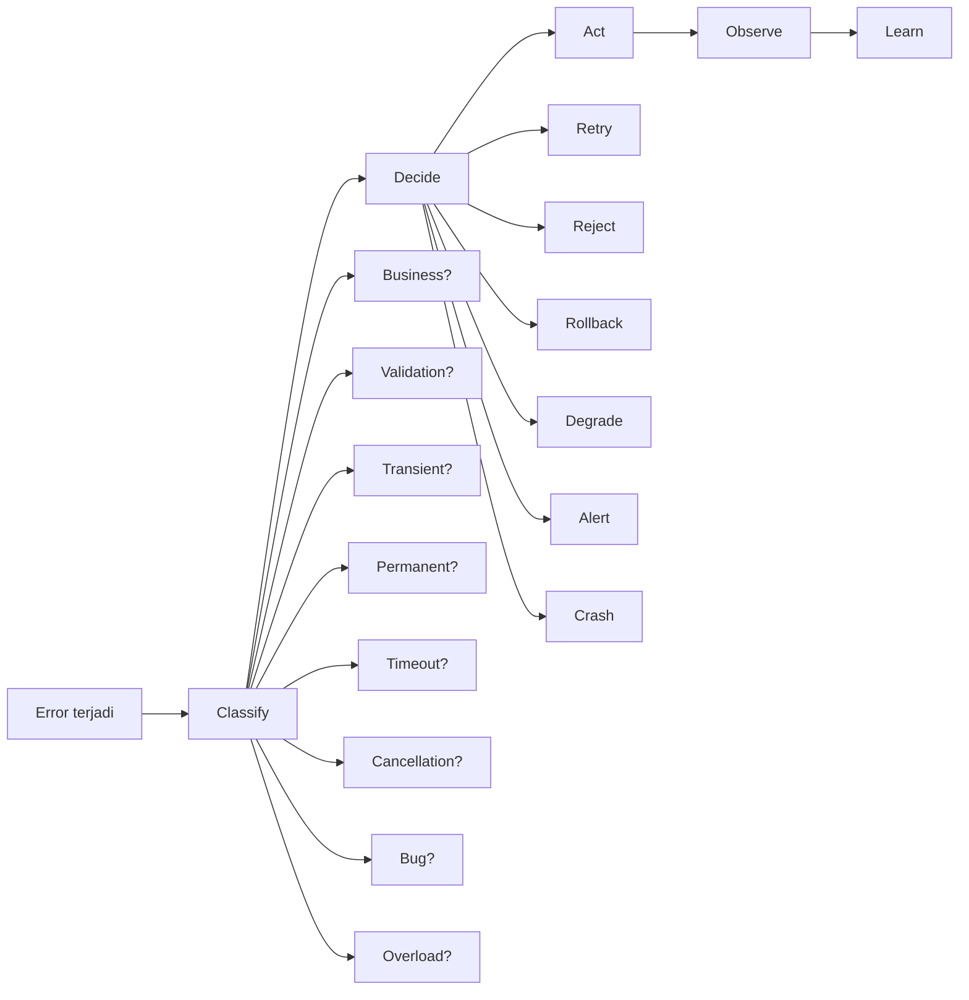
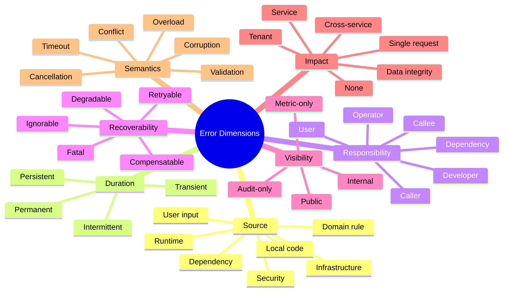
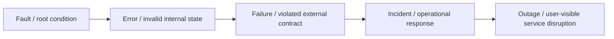
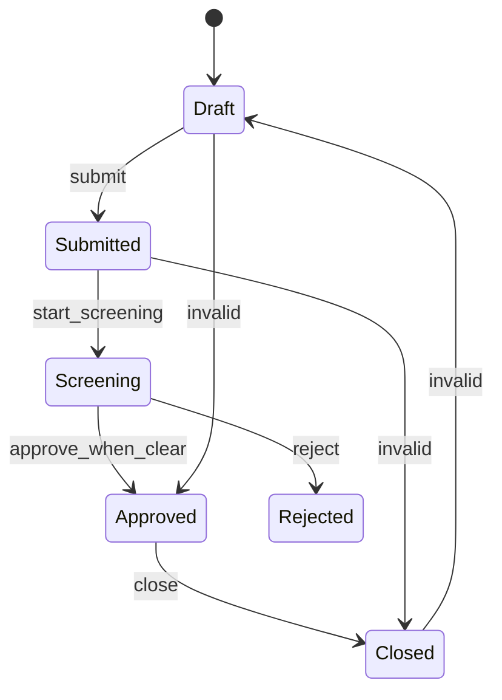
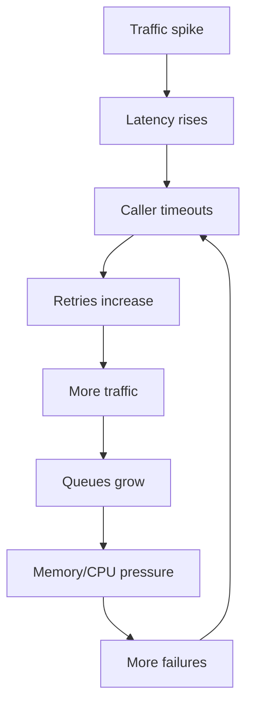
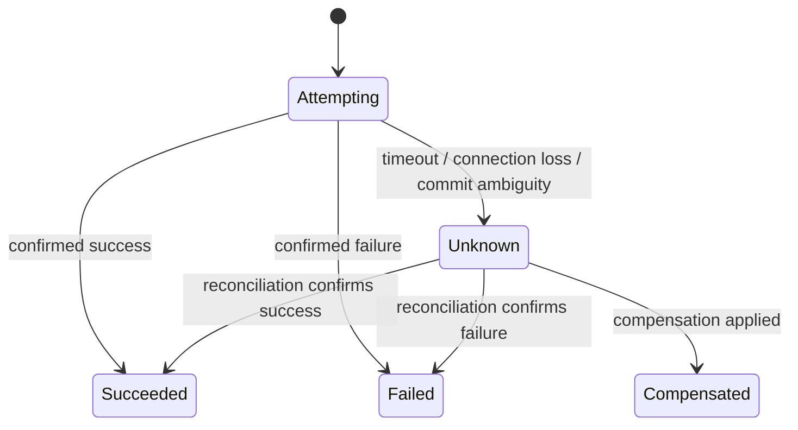
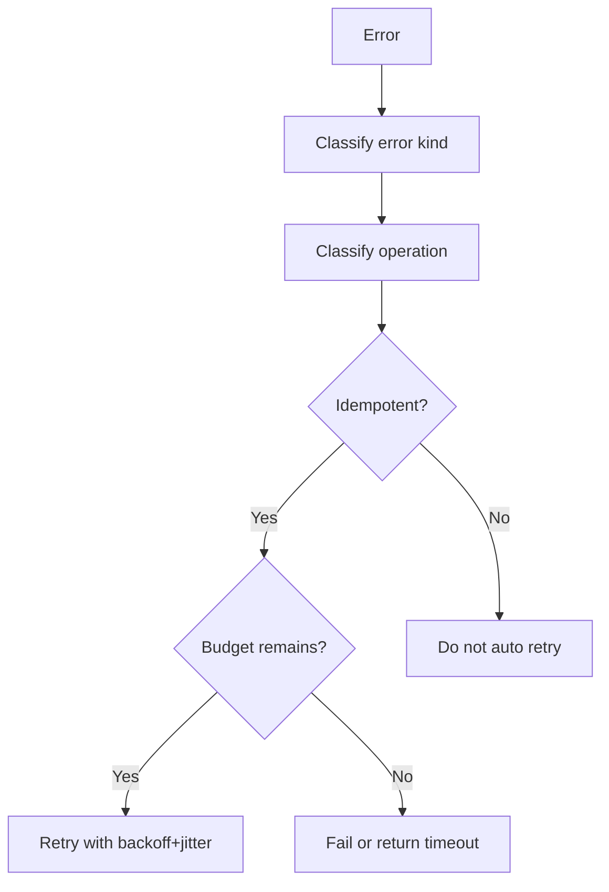
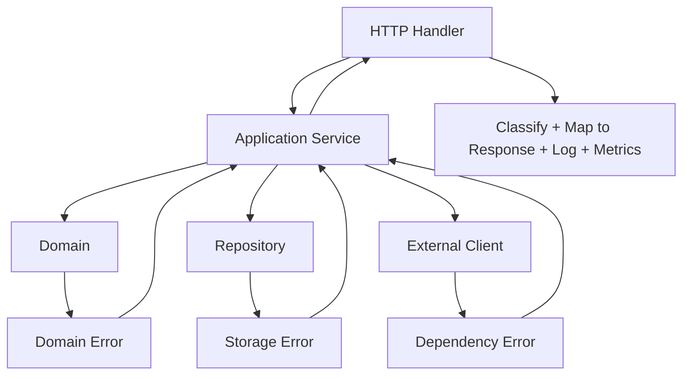
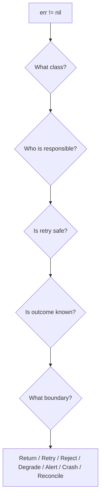

# learn-go-reliability-error-handling-part-002.md

# Failure Taxonomy: Cara Mengklasifikasikan Error Secara Engineering

> Seri: `learn-go-reliability-error-handling`  
> Bagian: `002`  
> Target pembaca: Java software engineer yang sedang membangun kedalaman production-grade Go reliability  
> Fokus: membangun taxonomy error/failure yang bisa dipakai untuk desain API, retry, timeout, observability, alerting, graceful shutdown, incident handling, dan auditability.

---

## 0. Posisi Materi Ini Dalam Seri

Pada `part-000`, kita membangun orientasi besar: error bukan sekadar return value, melainkan sinyal bahwa sistem harus mengambil keputusan. Pada `part-001`, kita membahas filosofi Go: error adalah value eksplisit yang menjadi bagian dari API surface.

Bagian ini menjawab pertanyaan yang lebih fundamental:

> Setelah sebuah fungsi mengembalikan `error`, bagaimana engineer tahu error itu harus diapakan?

Apakah harus:

- di-retry?
- di-log?
- di-alert?
- dikembalikan ke user?
- diterjemahkan menjadi HTTP `400`, `409`, `429`, `500`, atau `503`?
- menyebabkan rollback?
- menyebabkan process shutdown?
- dianggap business rejection yang normal?
- dianggap bug?
- dianggap incident?
- disembunyikan dari response publik?
- dimasukkan audit trail?
- dihitung dalam SLO error budget?

Jawabannya tidak bisa ditentukan hanya dari string error seperti:

```go
return fmt.Errorf("failed to process request: %w", err)
```

String tersebut mungkin berguna untuk manusia, tetapi tidak cukup sebagai basis keputusan sistem. Sistem produksi membutuhkan taxonomy.

---

## 1. Core Thesis

Taxonomy error adalah jembatan antara error sebagai value dan reliability sebagai perilaku sistem.



Top-tier engineer tidak hanya bertanya:

> Apa error message-nya?

Mereka bertanya:

> Error ini termasuk kelas failure apa, siapa yang harus mengambil keputusan, apa konsekuensinya terhadap correctness, availability, latency, security, auditability, dan user trust?

---

## 2. Kenapa Taxonomy Error Itu Penting?

Tanpa taxonomy, sistem biasanya jatuh ke salah satu ekstrem:

1. Semua error dianggap fatal.
2. Semua error dianggap retryable.
3. Semua error menjadi HTTP `500`.
4. Semua error di-log sebagai `ERROR`.
5. Semua error memicu alert.
6. Semua error ditampilkan ke user.
7. Semua error disembunyikan sebagai generic failure.
8. Semua error disamakan dalam metric `errors_total` tanpa makna.

Semua ekstrem tersebut buruk.

Contoh:

```go
if err != nil {
    log.Error("failed", "error", err)
    http.Error(w, "internal server error", http.StatusInternalServerError)
    return
}
```

Kode ini terlihat normal, tetapi secara engineering bisa salah total.

Jika `err` adalah input validation error, response `500` salah. Jika `err` adalah duplicate submission, response `409` mungkin lebih benar. Jika `err` adalah context cancellation karena client disconnect, log `ERROR` bisa noisy. Jika `err` adalah DB overload, retry lokal agresif bisa memperparah outage. Jika `err` adalah programmer invariant violation, menutupinya sebagai `500` tanpa crash atau alert bisa menyimpan corruption.

Taxonomy membantu menghindari keputusan generik yang merusak sistem.

---

## 3. Mental Model: Error Bukan Satu Dimensi

Error bukan hanya “ada” atau “tidak ada”. Error memiliki banyak dimensi.



Satu error konkret bisa berada di beberapa dimensi sekaligus.

Contoh:

> `context deadline exceeded` saat memanggil payment gateway.

Dimensi:

- source: dependency
- duration: mungkin transient
- recoverability: mungkin retryable jika operation idempotent
- visibility: user boleh tahu request masih belum berhasil, tetapi detail gateway internal tidak boleh bocor
- impact: single request atau lebih luas jika dependency outage
- semantics: timeout
- observability: perlu metric dependency latency/error
- auditability: untuk transaksi penting, perlu status unknown/ambiguous, bukan sekadar failed

Kesalahan umum adalah menganggap taxonomy sebagai enum tunggal. Dalam sistem serius, taxonomy sering berupa gabungan beberapa atribut.

---

## 4. Terminologi Dasar: Fault, Error, Failure, Incident, Outage

Sebelum mengklasifikasikan error Go, kita perlu membedakan istilah yang sering dicampur.

| Istilah | Arti Praktis | Contoh |
|---|---|---|
| Fault | Defect atau kondisi penyebab | Bug retry tanpa backoff, config salah, disk hampir penuh |
| Error | State internal yang salah atau sinyal operasi gagal | `err != nil`, invalid state, timeout |
| Failure | Sistem tidak memenuhi contract eksternal | API mengembalikan 500, request timeout, data tidak konsisten |
| Incident | Event operasional yang membutuhkan respons | Error rate naik, consumer lag menumpuk |
| Outage | Gangguan availability signifikan | Service tidak bisa melayani mayoritas traffic |

Hubungannya:



Tidak semua error menjadi failure. Tidak semua failure menjadi outage. Tidak semua incident berasal dari bug aplikasi; bisa berasal dari dependency, capacity, release, atau traffic pattern.

---

## 5. Perbedaan Perspektif Java dan Go

Sebagai Java engineer, Anda mungkin terbiasa dengan beberapa kategori seperti:

- checked exception
- unchecked exception
- runtime exception
- business exception
- infrastructure exception
- validation exception
- fatal error

Di Go, language-level taxonomy lebih minimal. Go tidak punya checked exception. `error` hanyalah interface:

```go
type error interface {
    Error() string
}
```

Konsekuensinya:

> Go tidak memaksa taxonomy lewat bahasa. Engineer harus mendesain taxonomy lewat API, package boundary, error wrapping, type, sentinel, policy, dan convention.

Ini terlihat lebih sederhana, tetapi secara production engineering lebih menuntut discipline.

Dalam Java, taxonomy sering terlihat dari class hierarchy:

```java
class ValidationException extends RuntimeException {}
class DuplicateSubmissionException extends RuntimeException {}
class DependencyTimeoutException extends RuntimeException {}
class RetriableInfrastructureException extends RuntimeException {}
```

Dalam Go, kita biasanya memilih kombinasi:

```go
var ErrDuplicateSubmission = errors.New("duplicate submission")

type ValidationError struct {
    Fields []FieldViolation
}

func (e *ValidationError) Error() string {
    return "validation failed"
}

type DependencyError struct {
    Dependency string
    Operation  string
    Retryable  bool
    Err        error
}

func (e *DependencyError) Error() string {
    return e.Dependency + ": " + e.Operation + ": " + e.Err.Error()
}

func (e *DependencyError) Unwrap() error { return e.Err }
```

Go memberi kebebasan, tetapi kebebasan itu harus dibayar dengan desain contract yang jelas.

---

## 6. Taxonomy Utama Untuk Sistem Produksi

Bagian berikut adalah taxonomy praktis yang akan kita gunakan sepanjang seri.

```mermaid
flowchart TD
    ERR[Any error] --> A[Programmer / invariant error]
    ERR --> B[Validation error]
    ERR --> C[Business rule violation]
    ERR --> D[Authentication / authorization error]
    ERR --> E[Conflict / concurrency error]
    ERR --> F[Not found / absence]
    ERR --> G[Dependency error]
    ERR --> H[Timeout]
    ERR --> I[Cancellation]
    ERR --> J[Overload / resource exhaustion]
    ERR --> K[Configuration / startup error]
    ERR --> L[Data corruption / integrity error]
    ERR --> M[Partial failure / ambiguous outcome]
    ERR --> N[Shutdown / lifecycle error]
```



Setiap kategori memiliki konsekuensi berbeda.

---

# 7. Programmer Error / Invariant Violation

## 7.1 Definisi

Programmer error adalah error yang menunjukkan kode melanggar asumsi internal yang seharusnya tidak mungkin terjadi jika program benar.

Contoh:

- nil pointer karena dependency wajib tidak diinisialisasi
- enum internal tidak dikenal
- state machine masuk transition yang impossible
- slice index out of range karena bug
- panic karena concurrent map writes
- type assertion salah
- invariant domain internal rusak
- config wajib kosong tetapi lolos validasi startup

## 7.2 Karakteristik

| Dimensi | Nilai Umum |
|---|---|
| Retryable? | Tidak |
| User fault? | Tidak |
| Developer fault? | Ya |
| Log level | Error/Critical |
| Alert? | Ya, jika terjadi di production path |
| Public response | 500 generic |
| Panic acceptable? | Ya, di boundary tertentu |
| Audit? | Mungkin, jika berdampak ke domain action |

## 7.3 Contoh Go

```go
type CaseStatus string

const (
    CaseDraft     CaseStatus = "DRAFT"
    CaseSubmitted CaseStatus = "SUBMITTED"
    CaseApproved  CaseStatus = "APPROVED"
)

func nextAllowedActions(status CaseStatus) []string {
    switch status {
    case CaseDraft:
        return []string{"submit", "delete"}
    case CaseSubmitted:
        return []string{"approve", "reject"}
    case CaseApproved:
        return []string{"close"}
    default:
        // This indicates an internal invariant breach if status came from trusted state.
        panic(fmt.Sprintf("unknown trusted case status: %q", status))
    }
}
```

Namun, hati-hati. Jika status berasal dari external input, itu bukan programmer error. Itu validation error.

```go
func parseCaseStatus(input string) (CaseStatus, error) {
    switch CaseStatus(input) {
    case CaseDraft, CaseSubmitted, CaseApproved:
        return CaseStatus(input), nil
    default:
        return "", fmt.Errorf("invalid case status: %q", input)
    }
}
```

Perbedaan penting:

- trusted internal state invalid → invariant violation
- untrusted external input invalid → validation error

## 7.4 Decision Rule

Gunakan pertanyaan ini:

> Apakah caller yang valid bisa secara wajar menyebabkan error ini?

Jika tidak, kemungkinan programmer error.

> Apakah retry bisa memperbaikinya?

Jika tidak, jangan retry.

> Apakah sistem masih bisa melanjutkan tanpa risiko corruption?

Jika tidak, fail fast.

---

# 8. Validation Error

## 8.1 Definisi

Validation error terjadi ketika input tidak memenuhi format, struktur, tipe, range, atau constraint dasar.

Contoh:

- email invalid
- required field kosong
- tanggal tidak valid
- string terlalu panjang
- enum input tidak dikenal
- JSON malformed
- request body terlalu besar
- field numeric negatif padahal harus positif

## 8.2 Karakteristik

| Dimensi | Nilai Umum |
|---|---|
| Retryable? | Tidak, kecuali input diubah |
| User fault? | Ya, atau client fault |
| Log level | Usually info/debug, bukan error noisy |
| Alert? | Tidak, kecuali spike abnormal |
| Public response | 400 / 422 |
| Metric | validation failure rate |
| Audit? | Biasanya tidak, kecuali domain/regulatory membutuhkan jejak rejected submission |

## 8.3 Validation Error Bukan System Failure

Ini penting.

Jika user mengirim payload invalid dan sistem mengembalikan `400`, sistem bekerja benar. Itu bukan outage. Itu bukan reliability failure.

Kesalahan umum:

```go
if err := validate(req); err != nil {
    log.Error("request failed", "error", err)
    http.Error(w, "internal server error", http.StatusInternalServerError)
    return
}
```

Lebih baik:

```go
if err := validate(req); err != nil {
    writeProblem(w, Problem{
        Status: 400,
        Code:   "VALIDATION_FAILED",
        Title:  "request validation failed",
        Detail: "one or more fields are invalid",
    })
    return
}
```

## 8.4 Field-Level Validation Model

Untuk sistem besar, validation error sebaiknya structured.

```go
type FieldViolation struct {
    Field   string `json:"field"`
    Code    string `json:"code"`
    Message string `json:"message"`
}

type ValidationError struct {
    Violations []FieldViolation
}

func (e *ValidationError) Error() string {
    return "validation failed"
}
```

Contoh response:

```json
{
  "code": "VALIDATION_FAILED",
  "message": "one or more fields are invalid",
  "violations": [
    {
      "field": "applicant.email",
      "code": "EMAIL_INVALID",
      "message": "email format is invalid"
    },
    {
      "field": "submissionDate",
      "code": "DATE_REQUIRED",
      "message": "submission date is required"
    }
  ]
}
```

## 8.5 Pitfall: Validation vs Business Rule

Validation:

> Field `amount` must be greater than zero.

Business rule:

> User cannot submit claim above their allowed limit.

Validation biasanya stateless dan local. Business rule biasanya membutuhkan domain state, policy, role, atau workflow.

---

# 9. Business Rule Violation

## 9.1 Definisi

Business rule violation terjadi ketika request secara format valid, tetapi tidak boleh dilakukan menurut aturan domain.

Contoh regulatory/case management:

- case tidak bisa di-approve karena belum melewati screening
- user mencoba melakukan transition dari `CLOSED` ke `DRAFT`
- appeal tidak boleh dibuat setelah deadline
- officer tidak boleh assign case ke dirinya sendiri
- entity sedang under enforcement hold
- submission valid secara format tetapi melanggar eligibility rule

## 9.2 Karakteristik

| Dimensi | Nilai Umum |
|---|---|
| Retryable? | Tidak, kecuali domain state berubah |
| User fault? | Bisa ya, bisa karena business state |
| Log level | Usually info/warn |
| Alert? | Tidak, kecuali unexpected spike |
| Public response | 403 / 409 / 422 tergantung semantics |
| Audit? | Sering ya di domain regulated |
| Metric | business rejection count by code |

## 9.3 Business Error Harus Stable

Business error adalah bagian dari contract. Jangan bergantung pada free-form string.

Buruk:

```go
return fmt.Errorf("case cannot be approved because screening is pending")
```

Lebih baik:

```go
var ErrScreeningPending = errors.New("screening pending")

type DomainError struct {
    Code    string
    Message string
    Err     error
}

func (e *DomainError) Error() string { return e.Message }
func (e *DomainError) Unwrap() error { return e.Err }

func NewScreeningPendingError() error {
    return &DomainError{
        Code:    "CASE_SCREENING_PENDING",
        Message: "case cannot be approved while screening is pending",
        Err:     ErrScreeningPending,
    }
}
```

## 9.4 State Machine View

Business error sering muncul di state transition.



Invalid transition bukan necessarily bug. Jika request berasal dari user atau concurrent actor, itu business/conflict error. Jika kode internal sendiri menghasilkan invalid transition tanpa external cause, itu programmer error.

---

# 10. Authentication and Authorization Error

## 10.1 Authentication Error

Authentication error berarti identitas belum terbukti atau credential/session/token tidak valid.

Contoh:

- missing token
- expired token
- invalid signature
- invalid session
- malformed credential

Typical response:

- HTTP `401 Unauthorized`
- `WWW-Authenticate` jika relevan

## 10.2 Authorization Error

Authorization error berarti identity valid, tetapi tidak punya permission melakukan aksi.

Contoh:

- user bukan assigned officer
- role tidak cukup
- tenant berbeda
- action tidak allowed pada state saat ini

Typical response:

- HTTP `403 Forbidden`

## 10.3 Security Semantics

Security error berbeda dari validation error karena response detail harus dibatasi.

Jangan bocorkan:

- apakah user id ada atau tidak
- policy internal
- role detail yang tidak perlu
- token parsing internals
- exact permission graph

Contoh aman:

```json
{
  "code": "FORBIDDEN",
  "message": "you are not allowed to perform this action"
}
```

## 10.4 Logging

Auth error bisa noisy. Jangan alert untuk setiap invalid token. Namun spike invalid token dari IP tertentu bisa menjadi security signal.

Klasifikasi auth error harus mendukung:

- audit security
- rate limiting
- anomaly detection
- safe response
- no secret leakage

---

# 11. Conflict / Concurrency Error

## 11.1 Definisi

Conflict error terjadi ketika request valid, tetapi bertabrakan dengan state terkini atau operasi concurrent.

Contoh:

- optimistic locking version mismatch
- duplicate unique key
- double submit
- stale update
- case sudah diproses actor lain
- idempotency key sedang diproses
- distributed lock unavailable

## 11.2 Karakteristik

| Dimensi | Nilai Umum |
|---|---|
| Retryable? | Kadang, setelah refresh state |
| User fault? | Tidak selalu |
| Public response | 409 Conflict |
| Alert? | Tidak, kecuali spike abnormal |
| Audit? | Sering ya untuk workflow penting |

## 11.3 Contoh Optimistic Locking

```go
var ErrVersionConflict = errors.New("version conflict")

type ConflictError struct {
    Resource string
    ID       string
    Err      error
}

func (e *ConflictError) Error() string {
    return fmt.Sprintf("%s %s conflict: %v", e.Resource, e.ID, e.Err)
}

func (e *ConflictError) Unwrap() error { return e.Err }
```

Repository bisa translate database result menjadi domain conflict:

```go
func (r *CaseRepository) UpdateStatus(ctx context.Context, c Case) error {
    res, err := r.db.ExecContext(ctx, `
        update cases
        set status = ?, version = version + 1
        where id = ? and version = ?
    `, c.Status, c.ID, c.Version)
    if err != nil {
        return fmt.Errorf("update case status: %w", err)
    }

    affected, err := res.RowsAffected()
    if err != nil {
        return fmt.Errorf("read update affected rows: %w", err)
    }
    if affected == 0 {
        return &ConflictError{
            Resource: "case",
            ID:       c.ID,
            Err:      ErrVersionConflict,
        }
    }
    return nil
}
```

Handler boundary:

```go
switch {
case errors.Is(err, ErrVersionConflict):
    writeProblem(w, Problem{
        Status: 409,
        Code:   "VERSION_CONFLICT",
        Title:  "resource was modified by another actor",
    })
default:
    writeProblem(w, internalProblem())
}
```

---

# 12. Not Found / Absence

## 12.1 Definisi

Not found berarti resource yang diminta tidak ditemukan atau tidak visible bagi caller.

Contoh:

- case id tidak ada
- document sudah dihapus
- user tidak punya akses ke resource, tetapi response disamarkan sebagai not found

## 12.2 Absence Bisa Error, Bisa Bukan

Ini tergantung API contract.

```go
func FindCase(ctx context.Context, id string) (*Case, error)
```

Jika fungsi bernama `Find`, absence bisa normal:

```go
case, err := repo.FindCase(ctx, id)
if err != nil { ... }
if case == nil { ... }
```

Namun untuk fungsi `Get`, absence sering error:

```go
func GetCase(ctx context.Context, id string) (Case, error)
```

```go
var ErrCaseNotFound = errors.New("case not found")
```

Pilih convention yang konsisten.

## 12.3 Security Consideration

Kadang `403` diganti `404` untuk mencegah resource enumeration.

Pertanyaan desain:

> Apakah caller boleh tahu resource ini ada tetapi tidak bisa diakses?

Jika tidak, gunakan not found response walaupun internal reason adalah forbidden.

---

# 13. Dependency Error

## 13.1 Definisi

Dependency error berasal dari sistem lain yang dipanggil aplikasi:

- database
- Redis
- HTTP API
- gRPC service
- message broker
- object storage
- identity provider
- payment gateway
- search engine

## 13.2 Dependency Error Harus Dinormalisasi

Low-level error sering terlalu detail dan vendor-specific.

Contoh:

```go
return err // directly from sql/http/redis vendor
```

Ini membuat caller bergantung pada detail dependency.

Lebih baik:

```go
type DependencyKind string

const (
    DependencyDB      DependencyKind = "database"
    DependencyHTTPAPI DependencyKind = "http_api"
    DependencyCache   DependencyKind = "cache"
    DependencyBroker  DependencyKind = "broker"
)

type DependencyError struct {
    Kind       DependencyKind
    Name       string
    Operation  string
    Retryable  bool
    Temporary  bool
    StatusCode int
    Err        error
}

func (e *DependencyError) Error() string {
    return fmt.Sprintf("dependency %s %s %s failed: %v", e.Kind, e.Name, e.Operation, e.Err)
}

func (e *DependencyError) Unwrap() error { return e.Err }
```

## 13.3 Dependency Failure Decision

| Condition | Typical Decision |
|---|---|
| Dependency timeout | Maybe retry if idempotent and budget remains |
| Connection refused | Fail fast, maybe circuit breaker |
| HTTP 429 | Respect `Retry-After`, backoff, do not hammer |
| HTTP 500 | Retry with backoff if operation safe |
| HTTP 400 | Do not retry; caller/request bug or contract mismatch |
| DB deadlock | Retry transaction carefully |
| DB constraint violation | Usually conflict/validation, not infrastructure |
| Redis unavailable | Degrade if cache optional; fail if required for correctness |
| Broker publish failure | Use outbox or fail transaction depending design |

## 13.4 Dependency Error Tidak Selalu `500`

Jika external service down, response ke caller mungkin:

- `503 Service Unavailable`
- `504 Gateway Timeout`
- degraded response
- queued for later
- accepted but pending
- failed with retryable hint

Taxonomy mempengaruhi public contract.

---

# 14. Timeout

## 14.1 Definisi

Timeout berarti operasi tidak selesai dalam batas waktu yang ditetapkan.

Di Go, timeout sering muncul sebagai:

- `context deadline exceeded`
- HTTP client timeout
- DB context timeout
- server read/write timeout
- queue receive timeout

## 14.2 Timeout Bukan Sekadar Dependency Error

Timeout adalah kategori khusus karena outcome bisa ambigu.

Contoh:

> Client timeout saat mengirim request create order ke dependency.

Apakah dependency tidak menerima request? Menerima tetapi belum memproses? Sudah memproses tetapi response terlambat? Sudah commit tetapi response hilang?

Untuk operation yang memiliki side effect, timeout tidak selalu berarti operation gagal. Bisa berarti outcome unknown.

## 14.3 Timeout Taxonomy

| Timeout Type | Meaning | Typical Action |
|---|---|---|
| Caller timeout | Caller tidak mau menunggu lagi | Stop work if safe |
| Local handler timeout | Service membatasi request duration | Cancel downstream work |
| Dependency timeout | Dependency lambat/tidak response | Retry if safe, degrade, fail |
| Queue timeout | Tidak ada item dalam periode tertentu | Usually normal |
| Shutdown timeout | Grace period habis | Force close / hard stop |

## 14.4 Go Example

```go
ctx, cancel := context.WithTimeout(parent, 2*time.Second)
defer cancel()

err := client.Call(ctx, req)
if err != nil {
    if errors.Is(err, context.DeadlineExceeded) {
        return &DependencyError{
            Kind:      DependencyHTTPAPI,
            Name:      "screening-service",
            Operation: "screen applicant",
            Retryable: true,
            Temporary: true,
            Err:       err,
        }
    }
    return err
}
```

Namun `Retryable: true` hanya benar jika operation idempotent atau memiliki idempotency key.

---

# 15. Cancellation

## 15.1 Definisi

Cancellation berarti operasi dihentikan karena caller, parent context, shutdown, atau policy membatalkan pekerjaan.

Di Go:

```go
errors.Is(err, context.Canceled)
```

Dengan cancellation cause:

```go
ctx, cancel := context.WithCancelCause(parent)
cancel(errors.New("shutdown started"))
fmt.Println(context.Cause(ctx))
```

## 15.2 Cancellation Bukan Selalu Error Operasional

Client menutup browser saat request berjalan. Handler menerima `context.Canceled`. Apakah itu error? Biasanya bukan server error.

Shutdown membatalkan worker. Apakah harus alert? Tidak, jika shutdown normal.

User membatalkan export report. Apakah harus retry? Tidak.

## 15.3 Cancellation Classification

| Cause | Log Level | Alert? | Response |
|---|---:|---:|---|
| Client disconnected | debug/info | no | none or 499-like internal metric |
| Request superseded | debug/info | no | none |
| Server shutdown | info | no | depends phase |
| Parent workflow aborted | info/warn | no/depends | domain-specific |
| Operator forced cancellation | warn | maybe | operational record |

## 15.4 Pitfall: Treating Cancellation as Failure

Buruk:

```go
if err != nil {
    log.Error("operation failed", "error", err)
    metrics.ErrorsTotal.Add(ctx, 1)
}
```

Lebih baik:

```go
if err != nil {
    switch {
    case errors.Is(err, context.Canceled):
        log.Debug("operation canceled", "error", err)
        metrics.CanceledTotal.Add(ctx, 1)
    case errors.Is(err, context.DeadlineExceeded):
        log.Warn("operation timed out", "error", err)
        metrics.TimeoutTotal.Add(ctx, 1)
    default:
        log.Error("operation failed", "error", err)
        metrics.ErrorsTotal.Add(ctx, 1)
    }
}
```

---

# 16. Overload / Resource Exhaustion

## 16.1 Definisi

Overload terjadi ketika demand melebihi kapasitas sistem atau salah satu resource penting.

Resource exhaustion meliputi:

- CPU saturated
- memory pressure
- goroutine explosion
- connection pool exhausted
- file descriptor exhausted
- DB pool saturated
- queue depth growing
- thread/goroutine blocked
- disk full
- network saturation
- rate limit dependency exceeded

## 16.2 Overload Error Harus Diperlakukan Berbeda

Jika sistem overload, retry agresif memperburuk keadaan. Reliability engineering modern menekankan backpressure, load shedding, throttling, jitter, dan degraded response.



Ini positive feedback loop. Jika tidak dihentikan, bisa menjadi cascading failure.

## 16.3 Typical Response

| Overload Condition | Response |
|---|---|
| Local queue full | reject fast, 503/429 |
| Rate limit exceeded | 429 + retry hint |
| Dependency overloaded | backoff, circuit breaker, degrade |
| DB pool exhausted | fail fast or short wait, avoid unbounded queue |
| Memory pressure | shed optional work |
| CPU saturated | reduce concurrency, reject expensive request |

## 16.4 Go-Level Signs

- request latency naik
- goroutine count naik terus
- `context deadline exceeded` meningkat
- DB wait duration naik
- queue length naik
- GC pressure naik
- memory allocation rate naik
- `too many open files`
- `connection refused`
- `server overloaded`

Taxonomy overload harus memisahkan symptom dari cause. Timeout bisa symptom overload, bukan root category tunggal.

---

# 17. Configuration / Startup Error

## 17.1 Definisi

Config/startup error terjadi saat sistem tidak bisa memulai secara aman karena konfigurasi atau dependency awal salah.

Contoh:

- required env var missing
- invalid URL
- invalid timeout config
- secret missing
- migration incompatible
- TLS cert invalid
- port already in use
- dependency mandatory unavailable at startup

## 17.2 Fail Fast

Untuk config wajib, fail fast lebih baik daripada service hidup dalam keadaan rusak.

Buruk:

```go
dsn := os.Getenv("DATABASE_DSN")
// empty DSN discovered only after first request
```

Lebih baik:

```go
type Config struct {
    DatabaseDSN string
    HTTPPort    int
    ShutdownTTL time.Duration
}

func LoadConfig() (Config, error) {
    dsn := os.Getenv("DATABASE_DSN")
    if dsn == "" {
        return Config{}, errors.New("DATABASE_DSN is required")
    }
    return Config{DatabaseDSN: dsn}, nil
}
```

Di `main`:

```go
cfg, err := LoadConfig()
if err != nil {
    return fmt.Errorf("load config: %w", err)
}
```

## 17.3 Panic atau Error?

Library sebaiknya return error. `main` memutuskan exit.

```go
func main() {
    if err := run(); err != nil {
        slog.Error("service exited", "error", err)
        os.Exit(1)
    }
}
```

Panic untuk config biasanya hanya masuk akal jika invariant compile-time/internal dilanggar, bukan input runtime biasa.

---

# 18. Data Corruption / Integrity Error

## 18.1 Definisi

Data corruption/integrity error berarti data tidak bisa dipercaya atau melanggar invariant correctness serius.

Contoh:

- checksum mismatch
- impossible domain state di database
- duplicate active record padahal harus unique
- missing mandatory relation
- event sequence gap
- ledger imbalance
- audit trail missing for committed action
- deserialization berhasil tetapi semantic state rusak

## 18.2 Karakteristik

| Dimensi | Nilai Umum |
|---|---|
| Retryable? | Biasanya tidak |
| Alert? | Ya |
| Public response | 500 generic |
| Operational action | isolate, stop writes, repair, investigate |
| Audit? | Ya |
| Risk | High correctness risk |

## 18.3 Jangan Disamakan Dengan Validation Error

Validation error adalah input baru yang ditolak.

Integrity error adalah data existing yang seharusnya valid tetapi ternyata rusak.

Ini harus diperlakukan jauh lebih serius.

```go
func (s *CaseService) LoadCaseForDecision(ctx context.Context, id string) (Case, error) {
    c, err := s.repo.Get(ctx, id)
    if err != nil {
        return Case{}, err
    }
    if c.Status == "APPROVED" && c.ApprovedAt.IsZero() {
        return Case{}, &IntegrityError{
            Entity: "case",
            ID:     id,
            Reason: "approved case missing approved timestamp",
        }
    }
    return c, nil
}
```

```go
type IntegrityError struct {
    Entity string
    ID     string
    Reason string
}

func (e *IntegrityError) Error() string {
    return fmt.Sprintf("integrity violation: %s %s: %s", e.Entity, e.ID, e.Reason)
}
```

Integrity error adalah kandidat kuat untuk alert dan incident triage.

---

# 19. Partial Failure / Ambiguous Outcome

## 19.1 Definisi

Partial failure terjadi ketika sebagian operasi berhasil dan sebagian gagal. Ambiguous outcome terjadi ketika sistem tidak tahu apakah side effect sudah terjadi.

Contoh:

- DB commit berhasil, publish event gagal
- request ke dependency timeout setelah dependency mungkin commit
- batch 1000 rows: 997 berhasil, 3 gagal
- file upload berhasil, metadata insert gagal
- email dikirim, tetapi status update gagal
- payment charged, response timeout

## 19.2 Ini Kategori Paling Berbahaya

Banyak engineer pemula melihat error sebagai binary:

> success atau failure.

Sistem distributed sering memiliki state ketiga:

> unknown.



## 19.3 Design Implication

Partial/ambiguous failure membutuhkan:

- idempotency key
- reconciliation job
- outbox pattern
- compensating transaction
- status `PENDING` atau `UNKNOWN`
- audit trail
- operator runbook
- retry with careful semantics

## 19.4 Go Error Model

```go
type Outcome string

const (
    OutcomeFailed  Outcome = "failed"
    OutcomeUnknown Outcome = "unknown"
)

type AmbiguousOutcomeError struct {
    Operation string
    Resource  string
    Outcome   Outcome
    Err       error
}

func (e *AmbiguousOutcomeError) Error() string {
    return fmt.Sprintf("%s on %s has ambiguous outcome: %v", e.Operation, e.Resource, e.Err)
}

func (e *AmbiguousOutcomeError) Unwrap() error { return e.Err }
```

Boundary harus memperlakukan ini berbeda dari confirmed failure.

---

# 20. Shutdown / Lifecycle Error

## 20.1 Definisi

Lifecycle error terkait proses startup, readiness, draining, shutdown, cleanup, dan termination.

Contoh:

- HTTP server returns `http.ErrServerClosed`
- worker stopped due to shutdown
- dependency close failed
- telemetry flush failed
- shutdown deadline exceeded
- in-flight job aborted

## 20.2 Normal Shutdown Bukan Error

Contoh common pattern:

```go
err := srv.ListenAndServe()
if err != nil && !errors.Is(err, http.ErrServerClosed) {
    return fmt.Errorf("http server: %w", err)
}
```

`http.ErrServerClosed` saat graceful shutdown normal tidak boleh dianggap incident.

## 20.3 Shutdown Classification

| Event | Category | Alert? |
|---|---|---|
| SIGTERM received during deployment | normal lifecycle | no |
| HTTP server closed after shutdown | normal lifecycle | no |
| Worker stopped after context canceled | normal lifecycle | no |
| Shutdown deadline exceeded | reliability risk | maybe |
| Failed to flush audit logs | correctness risk | yes |
| Failed to close optional metric exporter | warn | usually no |

---

# 21. Retriability Is Not a Category Alone

Banyak codebase membuat error seperti:

```go
type RetriableError struct { Err error }
```

Ini kadang membantu, tetapi bisa menyesatkan.

Retriability bukan properti absolut error. Retriability bergantung pada:

- operation idempotent atau tidak
- side effect sudah terjadi atau belum
- timeout budget masih ada atau tidak
- caller layer mana yang akan retry
- dependency sedang overload atau tidak
- retry akan memperburuk cascading failure atau tidak
- ada idempotency key atau tidak
- request masih relevan atau sudah canceled

Contoh:

`connection reset by peer` pada `GET /case/123` mungkin retryable.

`connection reset by peer` pada `POST /charge-payment` tanpa idempotency key tidak aman untuk retry.

Maka, taxonomy harus memisahkan:

- error kind
- operation semantics
- retry policy



---

# 22. Public Response Mapping

Taxonomy membantu mapping ke API response.

| Error Category | HTTP Status Candidate | Notes |
|---|---:|---|
| Validation | 400 / 422 | Invalid input |
| Authentication | 401 | Identity not established |
| Authorization | 403 / 404 | Hide existence if needed |
| Not found | 404 | Resource absent or hidden |
| Business rule violation | 409 / 422 / 403 | Depends domain semantics |
| Conflict/concurrency | 409 | Stale version, duplicate transition |
| Rate limit | 429 | Include retry hint if safe |
| Dependency unavailable | 503 | Retryable service condition |
| Dependency timeout | 504 / 503 | Gateway timeout or service unavailable |
| Local timeout | 503 / 504 | Depends service role |
| Programmer error | 500 | Generic response, alert internally |
| Data integrity error | 500 | Generic response, alert internally |
| Cancellation | Usually no response | Client already gone or request canceled |
| Shutdown draining | 503 | Stop accepting new work |

Jangan menjadikan tabel ini sebagai dogma. Status code harus mengikuti contract API dan role service.

---

# 23. Log Level Mapping

Taxonomy juga menentukan log level.

| Category | Typical Log Level | Rationale |
|---|---|---|
| Validation | debug/info | Normal client rejection |
| Auth invalid token | debug/info | Noisy if logged as error |
| Authorization denied | info/warn | Security/audit relevance |
| Business rule violation | info | Expected domain rejection |
| Conflict | info | Normal concurrency outcome |
| Not found | debug/info | Usually expected |
| Dependency timeout | warn/error | Depends rate and impact |
| Dependency unavailable | error | Operational concern |
| Overload | warn/error | Reliability risk |
| Programmer error | error/critical | Bug |
| Integrity error | critical | Correctness risk |
| Cancellation | debug/info | Often normal |
| Shutdown normal | info | Lifecycle event |
| Shutdown timeout | error | Reliability risk |

## 23.1 Anti-Pattern: Log at Every Layer

Buruk:

```go
func repo() error {
    if err != nil {
        log.Error("repo failed", "error", err)
        return err
    }
}

func service() error {
    if err := repo(); err != nil {
        log.Error("service failed", "error", err)
        return err
    }
}

func handler() {
    if err := service(); err != nil {
        log.Error("handler failed", "error", err)
    }
}
```

Hasilnya satu failure menghasilkan tiga log error. Noise naik, signal turun.

Lebih baik:

- low-level: wrap context
- boundary: classify + log sekali
- metrics: record structured category

---

# 24. Metrics Mapping

Metric harus menggunakan taxonomy yang stabil. Jangan gunakan raw error string sebagai label karena cardinality meledak.

Buruk:

```go
metrics.Errors.WithLabelValues(err.Error()).Inc()
```

Lebih baik:

```go
metrics.RequestErrors.WithLabelValues(
    route,
    method,
    errorClass,
    errorCode,
).Inc()
```

Contoh labels:

- `error_class="validation"`
- `error_class="business"`
- `error_class="dependency_timeout"`
- `error_class="overload"`
- `error_class="integrity"`
- `error_code="CASE_SCREENING_PENDING"`

Namun hati-hati: `error_code` juga harus bounded/stable.

---

# 25. Alert Mapping

Alert harus berbasis user impact atau risk, bukan semua error.

| Category | Alerting Guidance |
|---|---|
| Validation | No alert unless abnormal spike indicates client bug/attack |
| Business rejection | No alert unless unexpected rate shift |
| Conflict | No alert unless severe spike/regression |
| Dependency failure | Alert if SLO impact or sustained failure |
| Timeout | Alert if rate/latency exceeds threshold |
| Overload | Alert early, before total outage |
| Programmer error | Alert if production path hit |
| Integrity error | Alert immediately |
| Shutdown timeout | Alert if recurring or causes dropped work |
| Cancellation | Usually no alert |

SRE principle: alert on symptoms that require human action, not every internal cause.

---

# 26. Retry Mapping

| Category | Retry? | Notes |
|---|---|---|
| Validation | No | Input must change |
| Business rule | Usually no | Domain state must change |
| Auth | No | Credential/session must change |
| Conflict | Maybe | Refresh state or idempotent retry |
| Not found | Usually no | Unless eventual consistency expected |
| Timeout | Maybe | Only if idempotent and budget remains |
| Dependency 5xx | Maybe | Backoff + jitter + budget |
| Dependency 429 | Maybe later | Respect server hint |
| Overload | Usually reduce load | Retry may worsen outage |
| Programmer error | No | Fix code |
| Integrity error | No | Investigate/repair |
| Cancellation | No | Caller no longer wants result |

Retry tanpa taxonomy adalah outage multiplier.

---

# 27. Rollback / Compensation Mapping

| Category | Rollback? | Compensation? |
|---|---|---|
| Validation | No side effect should have occurred | No |
| Business rejection | No side effect or explicit rejected audit | Maybe audit only |
| Conflict | Usually no | Maybe refresh |
| Dependency failure before side effect | Rollback local transaction | No |
| Failure after local commit | Cannot simple rollback | Need compensation/outbox/reconciliation |
| Ambiguous outcome | No blind rollback | Reconcile first |
| Integrity error | Stop/repair | Case-specific |
| Shutdown cancellation | Depends checkpoint | Resume/requeue |

Important:

> Rollback is only simple inside a single transactional boundary. Distributed side effects require different patterns.

---

# 28. A Practical Error Classification Model in Go

Kita bisa membuat classification layer sederhana.

```go
type ErrorClass string

const (
    ClassUnknown        ErrorClass = "unknown"
    ClassValidation     ErrorClass = "validation"
    ClassBusiness       ErrorClass = "business"
    ClassAuthn          ErrorClass = "authentication"
    ClassAuthz          ErrorClass = "authorization"
    ClassNotFound       ErrorClass = "not_found"
    ClassConflict       ErrorClass = "conflict"
    ClassDependency     ErrorClass = "dependency"
    ClassTimeout        ErrorClass = "timeout"
    ClassCancellation   ErrorClass = "cancellation"
    ClassOverload       ErrorClass = "overload"
    ClassConfig         ErrorClass = "configuration"
    ClassIntegrity      ErrorClass = "integrity"
    ClassProgrammer     ErrorClass = "programmer"
    ClassLifecycle      ErrorClass = "lifecycle"
    ClassAmbiguous      ErrorClass = "ambiguous_outcome"
)

type ErrorInfo struct {
    Class      ErrorClass
    Code       string
    Retryable  bool
    Public     bool
    SafeMsg    string
    HTTPStatus int
}
```

Classifier:

```go
func ClassifyError(err error) ErrorInfo {
    if err == nil {
        return ErrorInfo{}
    }

    switch {
    case errors.Is(err, context.Canceled):
        return ErrorInfo{
            Class:      ClassCancellation,
            Code:       "REQUEST_CANCELED",
            Retryable:  false,
            Public:     false,
            SafeMsg:    "request canceled",
            HTTPStatus: 499, // internal/non-standard if you choose to track it
        }

    case errors.Is(err, context.DeadlineExceeded):
        return ErrorInfo{
            Class:      ClassTimeout,
            Code:       "REQUEST_TIMEOUT",
            Retryable:  true,
            Public:     true,
            SafeMsg:    "request timed out",
            HTTPStatus: http.StatusGatewayTimeout,
        }
    }

    var validation *ValidationError
    if errors.As(err, &validation) {
        return ErrorInfo{
            Class:      ClassValidation,
            Code:       "VALIDATION_FAILED",
            Retryable:  false,
            Public:     true,
            SafeMsg:    "one or more fields are invalid",
            HTTPStatus: http.StatusBadRequest,
        }
    }

    var conflict *ConflictError
    if errors.As(err, &conflict) {
        return ErrorInfo{
            Class:      ClassConflict,
            Code:       "RESOURCE_CONFLICT",
            Retryable:  false,
            Public:     true,
            SafeMsg:    "resource was modified or conflicts with current state",
            HTTPStatus: http.StatusConflict,
        }
    }

    var integrity *IntegrityError
    if errors.As(err, &integrity) {
        return ErrorInfo{
            Class:      ClassIntegrity,
            Code:       "DATA_INTEGRITY_ERROR",
            Retryable:  false,
            Public:     false,
            SafeMsg:    "internal server error",
            HTTPStatus: http.StatusInternalServerError,
        }
    }

    var dep *DependencyError
    if errors.As(err, &dep) {
        status := http.StatusServiceUnavailable
        if errors.Is(dep.Err, context.DeadlineExceeded) {
            status = http.StatusGatewayTimeout
        }
        return ErrorInfo{
            Class:      ClassDependency,
            Code:       "DEPENDENCY_FAILURE",
            Retryable:  dep.Retryable,
            Public:     false,
            SafeMsg:    "service temporarily unavailable",
            HTTPStatus: status,
        }
    }

    return ErrorInfo{
        Class:      ClassUnknown,
        Code:       "INTERNAL_ERROR",
        Retryable:  false,
        Public:     false,
        SafeMsg:    "internal server error",
        HTTPStatus: http.StatusInternalServerError,
    }
}
```

Catatan penting:

- Jangan terlalu cepat membuat framework internal besar.
- Mulai dari taxonomy dan boundary yang jelas.
- Tambahkan type hanya saat benar-benar dibutuhkan caller.
- Error classifier biasanya hidup di transport/application boundary, bukan di setiap package.

---

# 29. Boundary-Based Classification

Kapan error diklasifikasikan?

Tidak semua layer perlu tahu semua taxonomy. Biasanya:



Layer rendah sebaiknya memberi context, bukan mengambil keputusan transport.

Repository tidak perlu tahu HTTP `409`. Ia cukup mengembalikan `ErrVersionConflict` atau `ConflictError`.

HTTP handler boundary yang memutuskan `409`.

Worker boundary mungkin memutuskan `nack/requeue/DLQ`.

CLI boundary mungkin memutuskan exit code.

---

# 30. Same Error, Different Boundary, Different Action

Contoh error: dependency timeout.

## 30.1 HTTP Request Boundary

Action:

- return `504` atau `503`
- log warn/error
- increment dependency timeout metric
- maybe no retry if request budget exhausted

## 30.2 Background Worker Boundary

Action:

- retry with backoff
- keep job pending
- do not return HTTP response
- maybe requeue
- maybe DLQ after max attempts

## 30.3 Startup Boundary

Action:

- if dependency mandatory, fail startup
- if optional, start degraded but readiness reflects capability

## 30.4 Shutdown Boundary

Action:

- stop retrying
- checkpoint/requeue work
- exit within grace period

Maka taxonomy bukan hanya “apa error-nya”, tetapi juga “boundary mana yang sedang mengambil keputusan”.

---

# 31. Example: End-to-End Classification in a Go HTTP Service

## 31.1 Domain Errors

```go
package caseapp

import (
    "errors"
    "fmt"
)

var (
    ErrCaseNotFound      = errors.New("case not found")
    ErrInvalidTransition = errors.New("invalid case transition")
    ErrVersionConflict   = errors.New("version conflict")
)

type DomainError struct {
    Code string
    Msg  string
    Err  error
}

func (e *DomainError) Error() string { return e.Msg }
func (e *DomainError) Unwrap() error { return e.Err }

func NewInvalidTransition(from, to string) error {
    return &DomainError{
        Code: "CASE_INVALID_TRANSITION",
        Msg:  fmt.Sprintf("case cannot transition from %s to %s", from, to),
        Err:  ErrInvalidTransition,
    }
}
```

## 31.2 Service

```go
func (s *Service) ApproveCase(ctx context.Context, id string, expectedVersion int64) error {
    c, err := s.repo.GetCase(ctx, id)
    if err != nil {
        return fmt.Errorf("load case for approval: %w", err)
    }

    if c.Status != StatusScreeningClear {
        return NewInvalidTransition(string(c.Status), string(StatusApproved))
    }

    c.Status = StatusApproved
    c.Version = expectedVersion

    if err := s.repo.UpdateCase(ctx, c); err != nil {
        return fmt.Errorf("approve case: %w", err)
    }

    return nil
}
```

## 31.3 Handler Boundary

```go
type appHandler func(http.ResponseWriter, *http.Request) error

func (h appHandler) ServeHTTP(w http.ResponseWriter, r *http.Request) {
    err := h(w, r)
    if err == nil {
        return
    }

    info := ClassifyError(err)

    logAttrs := []any{
        "error", err,
        "error_class", info.Class,
        "error_code", info.Code,
        "request_id", requestIDFrom(r.Context()),
    }

    switch info.Class {
    case ClassValidation, ClassBusiness, ClassConflict, ClassNotFound, ClassCancellation:
        slog.InfoContext(r.Context(), "request rejected", logAttrs...)
    case ClassTimeout, ClassDependency, ClassOverload:
        slog.WarnContext(r.Context(), "request failed due to reliability condition", logAttrs...)
    default:
        slog.ErrorContext(r.Context(), "request failed", logAttrs...)
    }

    writeProblem(w, Problem{
        Status:  info.HTTPStatus,
        Code:    info.Code,
        Message: info.SafeMsg,
    })
}
```

---

# 32. Regulatory / Case Management Lens

Untuk sistem regulatory, taxonomy error harus mendukung defensibility.

Pertanyaan bukan hanya:

> Apakah request berhasil?

Tetapi:

- Kenapa action ditolak?
- Rule mana yang menyebabkan penolakan?
- Actor siapa yang mencoba action?
- State entity saat action ditolak apa?
- Apakah penolakan deterministic?
- Apakah error berasal dari user, policy, dependency, atau sistem?
- Apakah butuh audit trail?
- Apakah bisa dijelaskan ke user/regulator?
- Apakah error mengubah lifecycle case?

Contoh domain rejection:

```go
type RuleViolationError struct {
    RuleID     string
    EntityType string
    EntityID   string
    Action     string
    State      string
    Message    string
}

func (e *RuleViolationError) Error() string {
    return fmt.Sprintf("rule %s violated for %s %s action %s in state %s", e.RuleID, e.EntityType, e.EntityID, e.Action, e.State)
}
```

Public response mungkin tidak menyebut semua detail internal, tetapi audit log menyimpan rule id dan context.

---

# 33. Anti-Patterns

## 33.1 String Matching Error

Buruk:

```go
if strings.Contains(err.Error(), "not found") {
    return 404
}
```

Masalah:

- brittle
- localization breaks logic
- wrapping changes string
- dependency message berubah
- security leakage

Gunakan `errors.Is` atau `errors.As`.

## 33.2 One Error Type for Everything

Buruk:

```go
type AppError struct {
    Code string
    Message string
    Status int
}
```

Jika semua layer memakai `AppError`, domain, storage, HTTP, dan dependency bisa tercampur. Ini membuat package rendah tahu HTTP status, menyebabkan coupling.

Lebih baik: type berbeda untuk domain/dependency/validation, lalu classifier di boundary.

## 33.3 Retrying Everything

Buruk:

```go
for i := 0; i < 3; i++ {
    err := call()
    if err == nil { return nil }
}
return err
```

Masalah:

- retry validation error sia-sia
- retry non-idempotent operation berbahaya
- retry saat overload memperparah outage
- tidak menghormati context deadline
- tidak ada jitter

## 33.4 Logging Everything as Error

Validation dan business rejection bukan server error. Cancellation sering normal. Log level salah menyebabkan alert fatigue.

## 33.5 Exposing Internal Error to Client

Buruk:

```go
http.Error(w, err.Error(), 500)
```

Risiko:

- leak SQL detail
- leak hostname
- leak token path
- leak internal service name
- membuat string internal menjadi public contract

## 33.6 Swallowing Integrity Error

Buruk:

```go
if invalidState {
    return nil // ignore to keep system running
}
```

Integrity error harus terlihat. Menyembunyikannya bisa membuat data corruption makin luas.

---

# 34. Decision Matrix: Error Class → Engineering Action

| Class | Retry | Log | Alert | Public | Metric | Audit | Notes |
|---|---|---|---|---|---|---|---|
| Validation | No | Info/Debug | No | 400/422 | Yes | Sometimes | Normal rejection |
| Business | No | Info | No | 409/422/403 | Yes | Often | Domain-visible |
| Authn | No | Info | Spike only | 401 | Yes | Security | Avoid detail leak |
| Authz | No | Info/Warn | Spike only | 403/404 | Yes | Often | Access control |
| NotFound | No | Debug/Info | No | 404 | Maybe | Maybe | Absence may be normal |
| Conflict | Maybe | Info | Spike only | 409 | Yes | Often | Concurrency/domain race |
| Dependency | Maybe | Warn/Error | If impact | 503/504 | Yes | Maybe | Normalize vendor error |
| Timeout | Maybe | Warn | If impact | 503/504 | Yes | Maybe | Outcome may be ambiguous |
| Cancellation | No | Debug/Info | No | Usually none | Yes | Rare | Often normal |
| Overload | Reduce | Warn/Error | Yes if sustained | 429/503 | Yes | No | Protect system |
| Config | No | Error | Startup fail | N/A | Maybe | No | Fail fast |
| Integrity | No | Critical | Yes | 500 | Yes | Yes | Correctness risk |
| Programmer | No | Error/Critical | Yes | 500 | Yes | Maybe | Bug/invariant breach |
| Lifecycle | No | Info/Warn | Depends | 503 during drain | Yes | Maybe | Shutdown/startup semantics |
| Ambiguous | Careful | Error/Warn | Depends | 202/409/503 | Yes | Yes | Needs reconciliation |

---

# 35. Practical Code Review Checklist

Saat review error handling Go, tanyakan:

1. Apakah error ini punya class yang jelas?
2. Apakah caller perlu branch secara programmatic?
3. Apakah error harus bisa dicek dengan `errors.Is` atau `errors.As`?
4. Apakah string error dipakai sebagai logic? Jika ya, itu smell.
5. Apakah validation/business/conflict/dependency dicampur?
6. Apakah low-level package tahu HTTP status? Jika ya, cek coupling.
7. Apakah retry hanya dilakukan untuk error yang aman di-retry?
8. Apakah retry menghormati context deadline?
9. Apakah cancellation diperlakukan sebagai server error?
10. Apakah timeout dianggap confirmed failure padahal outcome bisa unknown?
11. Apakah dependency error dinormalisasi?
12. Apakah log level sesuai class?
13. Apakah metric label bounded?
14. Apakah public response aman dari detail internal?
15. Apakah integrity error di-alert?
16. Apakah normal lifecycle shutdown tidak dianggap crash?
17. Apakah business rejection memiliki code stabil?
18. Apakah regulatory/audit context cukup untuk keputusan domain penting?

---

# 36. Mini Exercise

## Exercise 1

Klasifikasikan error berikut:

```text
sql: no rows in result set
```

Jawaban tergantung context:

- Jika mencari optional record → absence normal, mungkin bukan error.
- Jika `GetCase(id)` contract mengharuskan case ada → not found.
- Jika foreign key mandatory hilang pada data existing → integrity error.

## Exercise 2

```text
context deadline exceeded saat POST ke external approval service
```

Kemungkinan:

- timeout
- dependency error
- ambiguous outcome jika external service mungkin sudah memproses
- retryable hanya jika ada idempotency key dan budget tersisa

## Exercise 3

```text
user mencoba approve case dari status DRAFT
```

Kemungkinan:

- business rule violation jika request user valid tapi transition tidak allowed
- programmer error jika internal workflow engine menghasilkan transition impossible tanpa input external

## Exercise 4

```text
duplicate key pada insert submission
```

Kemungkinan:

- conflict jika duplicate submission
- idempotency replay jika same idempotency key
- data integrity issue jika duplicate active row melanggar invariant internal

---

# 37. Ringkasan Mental Model

Taxonomy error adalah kemampuan untuk mengubah `err != nil` menjadi keputusan engineering yang benar.



Prinsip utama:

1. Error string untuk manusia; error type/code/class untuk program.
2. Validation dan business rejection bukan server failure.
3. Timeout bukan selalu confirmed failure.
4. Cancellation sering normal.
5. Retryability bergantung pada operation semantics, bukan hanya error cause.
6. Overload harus dikurangi, bukan dihajar retry.
7. Integrity error harus terlihat dan diinvestigasi.
8. Low-level package memberi context; boundary mengambil keputusan.
9. Public response harus stabil dan aman.
10. Taxonomy yang baik membuat observability, alerting, API contract, audit, dan incident response menjadi masuk akal.

---

# 38. Referensi Utama

Referensi konseptual dan teknis yang menjadi dasar bagian ini:

- Go `errors` package: `errors.Is`, `errors.As`, wrapping, dan `errors.Join`.
- Go `context` package: cancellation, deadline, `WithCancelCause`, dan `context.Cause`.
- Go `net/http`: server lifecycle dan `http.ErrServerClosed`.
- Go `os/signal`: signal handling dan `signal.NotifyContext`.
- Google SRE Book: cascading failures dan overload handling.
- AWS Builders Library: timeouts, retries, backoff, and jitter.
- AWS Prescriptive Guidance: retry with backoff pattern.

---

# 39. Penutup

Bagian ini sengaja tidak langsung masuk terlalu dalam ke implementasi `errors.Is`, `errors.As`, atau `errors.Join`, karena itu akan dibahas khusus di part berikutnya. Fondasi yang harus dikuasai dulu adalah taxonomy: kemampuan mengklasifikasikan error dari sudut pandang sistem produksi.

Setelah taxonomy jelas, barulah mekanisme Go seperti sentinel error, typed error, wrapping, joined error, context cancellation, panic boundary, retry policy, dan graceful shutdown menjadi alat yang tepat, bukan sekadar pattern hafalan.

---

## Status Seri

Selesai:

- `learn-go-reliability-error-handling-part-000.md`
- `learn-go-reliability-error-handling-part-001.md`
- `learn-go-reliability-error-handling-part-002.md`

Belum selesai. Bagian berikutnya:

- `learn-go-reliability-error-handling-part-003.md` — The `error` Interface, Sentinel Error, Typed Error, dan Opaque Error

<!-- NAVIGATION_FOOTER -->
<div class="page-nav">
<a href="./learn-go-reliability-error-handling-part-001.md">⬅️ Go Error Philosophy: Explicit Failure as API Surface</a>
<a href="./index.md">📚 Kategori</a>
<a href="../../index.md">🏠 Home</a>
<a href="./learn-go-reliability-error-handling-part-003.md">Part 003 — The `error` Interface, Sentinel Error, Typed Error, dan Opaque Error ➡️</a>
</div>
