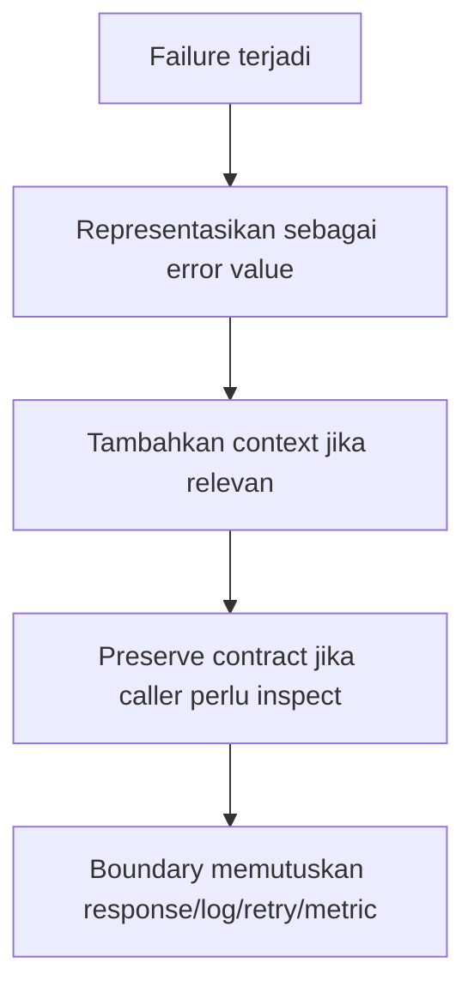
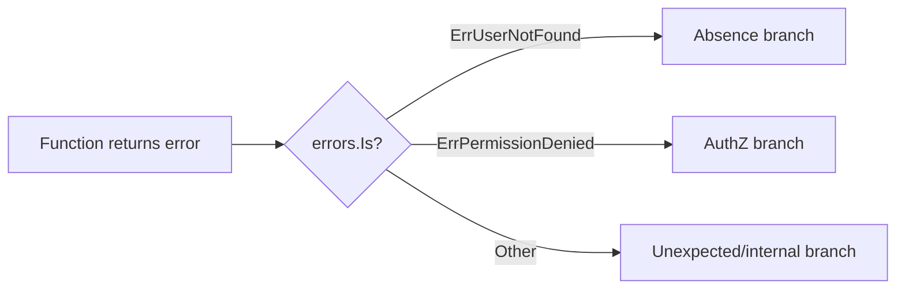
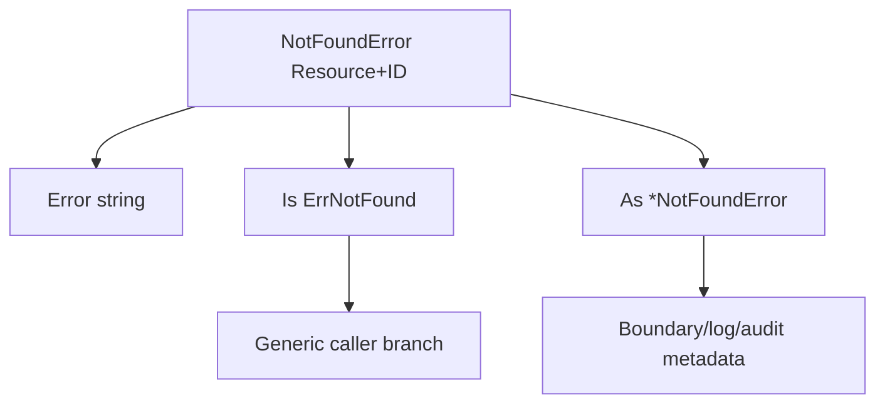
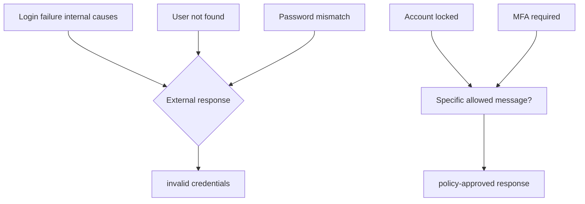
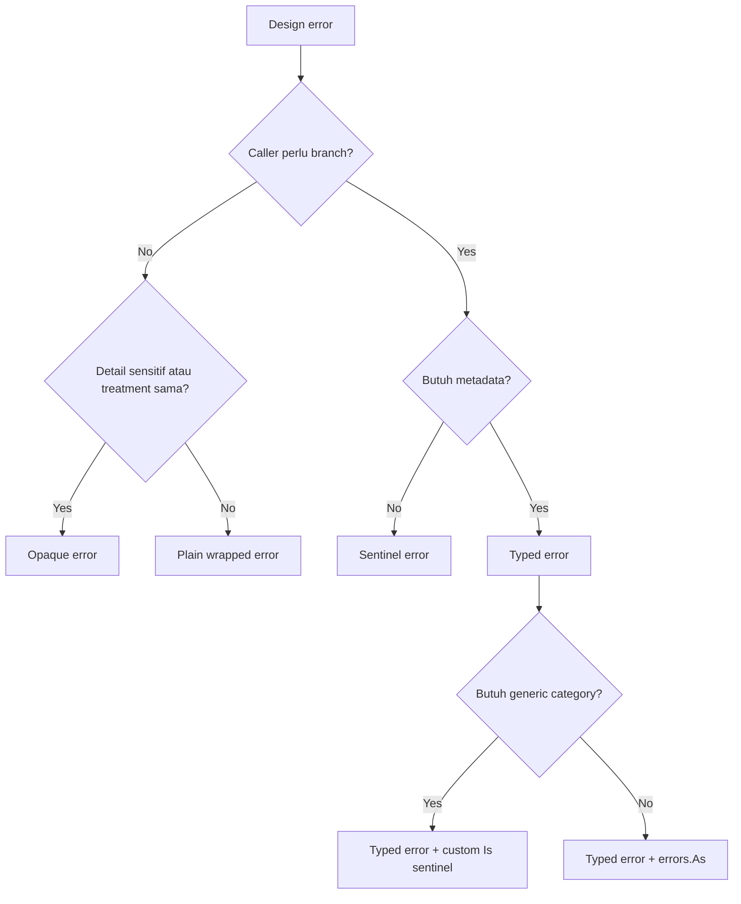
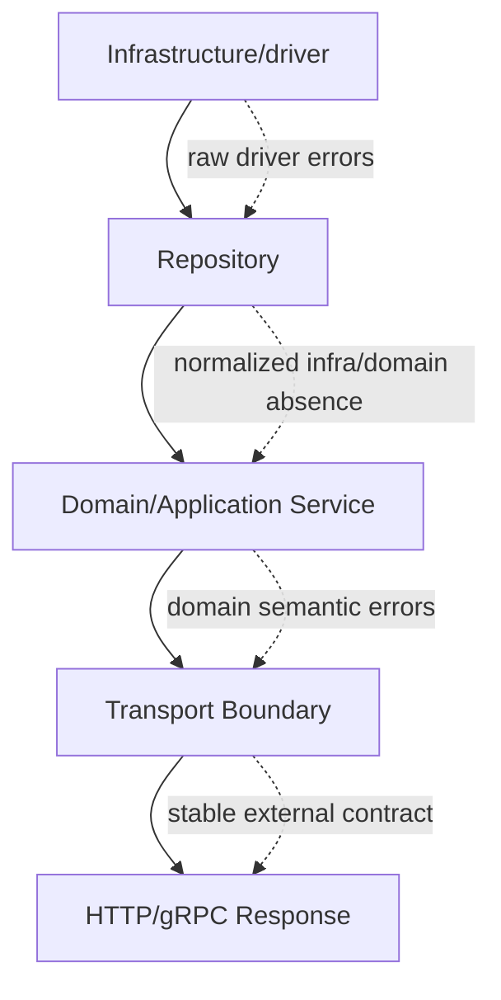
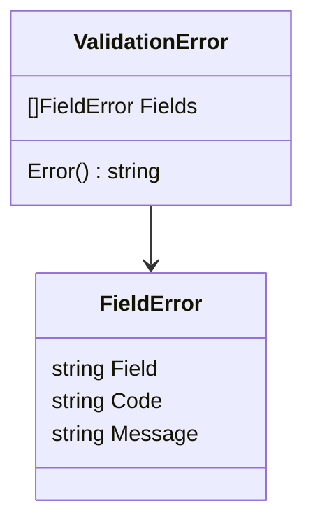
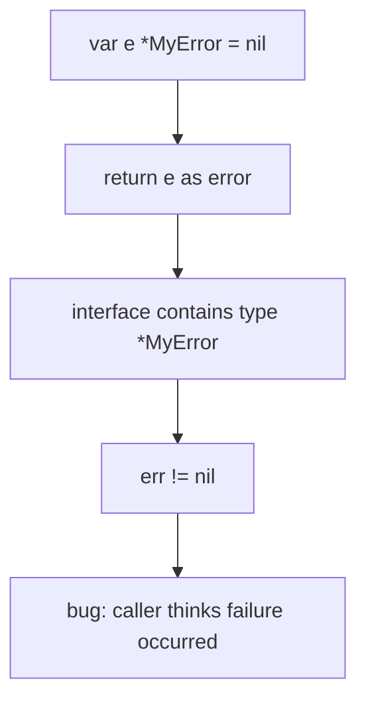

# learn-go-reliability-error-handling-part-003.md

# Part 003 — The `error` Interface, Sentinel Error, Typed Error, dan Opaque Error

> Seri: `learn-go-reliability-error-handling`  
> Target: Go 1.26.x  
> Audiens: Java software engineer yang ingin menguasai error handling dan reliability design pada level production/internal engineering handbook  
> Status seri: **belum selesai**  
> Bagian ini: fondasi desain bentuk error di Go: interface, sentinel, typed, opaque, dan cara memilihnya.

---

## 0. Posisi Part Ini dalam Seri

Pada part sebelumnya kita sudah membangun **taxonomy error**: programmer error, validation error, business violation, transient dependency failure, timeout, cancellation, overload, corruption, dan seterusnya.

Part ini menjawab pertanyaan berikut:

> Setelah kita tahu suatu kegagalan masuk kategori apa, bentuk error Go seperti apa yang sebaiknya kita expose kepada caller?

Di Go, error bukan sekadar pesan string. Error adalah **API surface**. Bentuk error menentukan:

- apakah caller bisa membedakan `not found` dari `database down`;
- apakah caller bisa melakukan retry secara aman;
- apakah package internal bocor ke boundary atas;
- apakah error tetap kompatibel ketika implementasi berubah;
- apakah observability bisa konsisten;
- apakah test bisa stabil tanpa string matching;
- apakah domain policy bisa diekspresikan dengan aman.

Bagian ini fokus pada empat bentuk utama:

1. plain error;
2. sentinel error;
3. typed error;
4. opaque error.

Kemudian kita akan bahas cara memilihnya secara engineering.

---

## 1. Core Primitive: `error` adalah Interface Kecil

Di Go, `error` adalah interface built-in dengan satu method:

```go
type error interface {
    Error() string
}
```

Artinya, semua type yang punya method `Error() string` otomatis memenuhi kontrak `error`.

Contoh paling sederhana:

```go
package user

import "errors"

var ErrInvalidEmail = errors.New("invalid email")
```

`errors.New` membuat value error sederhana yang hanya membawa pesan teks.

Namun karena `error` adalah interface, kita juga bisa membuat type sendiri:

```go
type ValidationError struct {
    Field string
    Code  string
    Msg   string
}

func (e *ValidationError) Error() string {
    return e.Field + ": " + e.Msg
}
```

Lalu function bisa return:

```go
func ParseEmail(input string) (Email, error) {
    if input == "" {
        return Email{}, &ValidationError{
            Field: "email",
            Code:  "required",
            Msg:   "email is required",
        }
    }
    // ...
    return Email{value: input}, nil
}
```

### Mental Model Penting

Di Java, exception biasanya membawa:

- type;
- message;
- stack trace;
- cause;
- suppressed exceptions;
- control-flow propagation via `throw`.

Di Go, `error` hanya menjamin:

- ada representasi string;
- value bisa dibandingkan/diinspeksi jika desainnya mendukung;
- propagation eksplisit lewat return value.

Maka tanggung jawab desain error di Go lebih eksplisit:



Kalau kita asal return `fmt.Errorf("something failed")`, kita hanya punya string. Caller manusia mungkin paham, tetapi program tidak punya contract yang stabil.

---

## 2. Plain Error: Error Tanpa Contract Programmatic

Plain error biasanya dibuat dengan:

```go
return errors.New("invalid input")
```

atau:

```go
return fmt.Errorf("parse config: missing %s", key)
```

Plain error cocok ketika:

- caller tidak perlu membedakan jenis error secara programmatic;
- error hanya untuk debugging internal;
- error akan langsung dibungkus dan ditangani di boundary;
- function berada di layer rendah dan tidak ingin expose semantic contract;
- error mustahil ditindaklanjuti selain abort current operation.

Contoh:

```go
func loadRawConfig(path string) ([]byte, error) {
    b, err := os.ReadFile(path)
    if err != nil {
        return nil, fmt.Errorf("read config file %q: %w", path, err)
    }
    return b, nil
}
```

Di sini caller mungkin hanya perlu tahu bahwa loading gagal. Namun karena kita wrap dengan `%w`, caller masih bisa melakukan `errors.Is(err, fs.ErrNotExist)` bila diperlukan.

### Kelebihan Plain Error

- sederhana;
- minim API commitment;
- cocok untuk error internal;
- tidak memperbesar public API;
- mudah dibaca.

### Kelemahan Plain Error

- tidak stabil untuk branching;
- caller cenderung melakukan string matching;
- sulit dipetakan ke retry/HTTP/log policy secara konsisten;
- metadata hilang;
- bisa membuat semua failure terlihat sama.

### Anti-pattern: String Matching

Buruk:

```go
if strings.Contains(err.Error(), "not found") {
    return nil
}
```

Masalahnya:

- message bisa berubah;
- localization bisa mengubah string;
- wrapping bisa menambah prefix;
- string mungkin muncul dari penyebab lain;
- tidak ada compile-time/API signal.

Lebih baik:

```go
if errors.Is(err, ErrUserNotFound) {
    return nil
}
```

atau:

```go
var ve *ValidationError
if errors.As(err, &ve) {
    // handle validation error
}
```

---

## 3. Sentinel Error

Sentinel error adalah value error yang dideklarasikan sebagai variabel tetap dan dipakai sebagai sinyal tertentu.

Contoh standar:

```go
var ErrUserNotFound = errors.New("user not found")
```

Caller bisa inspect dengan `errors.Is`:

```go
user, err := repo.FindByID(ctx, id)
if err != nil {
    if errors.Is(err, ErrUserNotFound) {
        return nil, nil
    }
    return nil, err
}
```

### Kenapa Disebut Sentinel?

Ia bertindak sebagai **penanda**. Nilai error itu sendiri adalah constant-like signal:



### Kapan Sentinel Error Cocok?

Sentinel cocok ketika kondisi error:

- sederhana;
- stabil;
- tidak membutuhkan metadata;
- merupakan bagian eksplisit dari public contract;
- caller perlu branch secara programmatic;
- jumlahnya kecil;
- meaning-nya tidak bergantung pada implementation detail.

Contoh cocok:

```go
var ErrNotFound = errors.New("not found")
var ErrConflict = errors.New("conflict")
var ErrUnauthorized = errors.New("unauthorized")
var ErrForbidden = errors.New("forbidden")
var ErrRateLimited = errors.New("rate limited")
```

Namun hati-hati: sentinel yang terlalu generic bisa kehilangan konteks. `ErrNotFound` bisa berarti user not found, case not found, config not found, file not found, atau dependency route not found.

Karena itu, di domain package sering lebih baik:

```go
var ErrCaseNotFound = errors.New("case not found")
var ErrOfficerNotFound = errors.New("officer not found")
```

Atau gunakan typed error bila entity/id perlu diketahui.

---

## 4. Sentinel Error sebagai API Commitment

Ketika package mengekspor sentinel error:

```go
package repository

var ErrNotFound = errors.New("not found")
```

maka package tersebut sedang berkata:

> Caller boleh bergantung pada error ini sebagai bagian dari kontrak package.

Konsekuensinya besar.

Jika hari ini repository memakai PostgreSQL, besok pindah ke DynamoDB, error public sebaiknya tetap:

```go
if errors.Is(err, repository.ErrNotFound) { ... }
```

Bukan bocor sebagai:

```go
sql.ErrNoRows
```

atau error driver tertentu.

### Contoh Buruk: Implementation Leak

```go
func (r *UserRepo) Find(ctx context.Context, id UserID) (User, error) {
    var u User
    err := r.db.QueryRowContext(ctx, query, id).Scan(&u.ID, &u.Name)
    if err != nil {
        return User{}, err // leaks sql.ErrNoRows and database-specific errors
    }
    return u, nil
}
```

Caller menjadi bergantung pada `database/sql`:

```go
if errors.Is(err, sql.ErrNoRows) {
    // repository implementation leaked upward
}
```

Lebih baik:

```go
var ErrUserNotFound = errors.New("user not found")

func (r *UserRepo) Find(ctx context.Context, id UserID) (User, error) {
    var u User
    err := r.db.QueryRowContext(ctx, query, id).Scan(&u.ID, &u.Name)
    if err != nil {
        if errors.Is(err, sql.ErrNoRows) {
            return User{}, ErrUserNotFound
        }
        return User{}, fmt.Errorf("find user %s: %w", id, err)
    }
    return u, nil
}
```

Namun ini kehilangan low-level cause untuk not found. Bila ingin preserve cause:

```go
func (r *UserRepo) Find(ctx context.Context, id UserID) (User, error) {
    var u User
    err := r.db.QueryRowContext(ctx, query, id).Scan(&u.ID, &u.Name)
    if err != nil {
        if errors.Is(err, sql.ErrNoRows) {
            return User{}, fmt.Errorf("find user %s: %w", id, ErrUserNotFound)
        }
        return User{}, fmt.Errorf("find user %s: %w", id, err)
    }
    return u, nil
}
```

Perhatikan: versi ini tidak menyimpan `sql.ErrNoRows` dalam chain. Itu deliberate. Public semantic-nya adalah `ErrUserNotFound`, bukan `sql.ErrNoRows`.

Kalau butuh audit/debug, metadata entity/id bisa disimpan di typed error, bukan expose SQL sentinel.

---

## 5. Sentinel Error: Exported vs Unexported

### Exported Sentinel

```go
var ErrCaseClosed = errors.New("case closed")
```

Gunakan exported sentinel jika caller luar package perlu branch.

Contoh:

```go
err := caseService.Submit(ctx, caseID)
if errors.Is(err, caseapp.ErrCaseClosed) {
    return http.StatusConflict
}
```

### Unexported Sentinel

```go
var errInvalidState = errors.New("invalid state")
```

Gunakan unexported sentinel jika hanya package internal yang perlu membedakan error.

Contoh:

```go
func validateTransition(from, to State) error {
    if !allowed(from, to) {
        return errInvalidState
    }
    return nil
}
```

Lalu public boundary menerjemahkan:

```go
func (s *Service) Submit(ctx context.Context, id CaseID) error {
    err := s.transition(ctx, id, StateSubmitted)
    if err != nil {
        if errors.Is(err, errInvalidState) {
            return ErrInvalidCaseTransition
        }
        return err
    }
    return nil
}
```

### Rule of Thumb

```text
Exported sentinel = public branch contract.
Unexported sentinel = internal control signal.
```

Jangan export error hanya karena “mungkin berguna”. Setiap exported error memperluas API yang perlu dipertahankan.

---

## 6. Sentinel Error dan Mutability Hazard

Di Go, exported variable bisa diubah oleh package lain jika bukan constant. Error value dari `errors.New` tidak bisa jadi `const`, jadi ini mungkin secara teknis:

```go
somepkg.ErrNotFound = nil
```

Dalam praktik, ini jarang dilakukan dan dianggap buruk. Namun sebagai designer package, Anda perlu sadar bahwa exported sentinel adalah exported variable.

Strategi mitigasi:

1. expose function predicate;
2. expose typed error;
3. keep sentinel unexported dan expose `IsNotFound(err error) bool`.

Contoh:

```go
var errNotFound = errors.New("not found")

func IsNotFound(err error) bool {
    return errors.Is(err, errNotFound)
}
```

Namun pattern ini juga punya trade-off: caller tidak bisa memakai standard `errors.Is(err, yourpkg.ErrNotFound)` langsung.

Untuk banyak aplikasi internal, exported sentinel masih acceptable. Untuk library publik dengan API compatibility ketat, pertimbangkan predicate atau typed error.

---

## 7. Typed Error

Typed error adalah error yang direpresentasikan sebagai struct/type khusus.

Contoh:

```go
type NotFoundError struct {
    Resource string
    ID       string
}

func (e *NotFoundError) Error() string {
    return fmt.Sprintf("%s %s not found", e.Resource, e.ID)
}
```

Caller bisa inspect dengan `errors.As`:

```go
var nf *NotFoundError
if errors.As(err, &nf) {
    log.Printf("resource=%s id=%s", nf.Resource, nf.ID)
}
```

Typed error cocok ketika error membutuhkan metadata.

Contoh metadata:

- entity/resource;
- ID;
- field;
- code;
- operation;
- retryable flag;
- dependency name;
- status code;
- request id;
- state transition;
- rule id;
- limit/quota;
- deadline budget.

### Contoh Domain Typed Error

```go
type InvalidTransitionError struct {
    CaseID string
    From   string
    To     string
    Rule   string
}

func (e *InvalidTransitionError) Error() string {
    return fmt.Sprintf(
        "invalid case transition: case=%s from=%s to=%s rule=%s",
        e.CaseID,
        e.From,
        e.To,
        e.Rule,
    )
}
```

Usage:

```go
err := svc.Submit(ctx, caseID)
if err != nil {
    var te *InvalidTransitionError
    if errors.As(err, &te) {
        // map to 409 Conflict, include safe user message, audit rule id
    }
    return err
}
```

### Typed Error sebagai Audit Signal

Dalam regulatory/case-management system, typed error bisa menjadi bridge antara domain correctness dan auditability.

Contoh:

```go
type PolicyViolationError struct {
    PolicyID string
    ActorID  string
    EntityID string
    Action   string
    Reason   string
}

func (e *PolicyViolationError) Error() string {
    return fmt.Sprintf(
        "policy violation: policy=%s actor=%s entity=%s action=%s",
        e.PolicyID,
        e.ActorID,
        e.EntityID,
        e.Action,
    )
}
```

Boundary bisa:

- return `403 Forbidden`;
- emit audit event;
- increment `policy_violation_total{policy_id=...}` secara hati-hati;
- log structured metadata;
- menampilkan safe message ke user.

Namun jangan otomatis memasukkan semua field ke response publik. Error internal dan external contract harus dipisah.

---

## 8. Typed Error dengan Custom `Is`

Go error inspection bisa lebih fleksibel jika type error punya method:

```go
Is(target error) bool
```

Contoh:

```go
var ErrNotFound = errors.New("not found")

type NotFoundError struct {
    Resource string
    ID       string
}

func (e *NotFoundError) Error() string {
    return fmt.Sprintf("%s %s not found", e.Resource, e.ID)
}

func (e *NotFoundError) Is(target error) bool {
    return target == ErrNotFound
}
```

Dengan ini, caller bisa melakukan dua level inspection:

```go
if errors.Is(err, ErrNotFound) {
    // generic not found branch
}

var nf *NotFoundError
if errors.As(err, &nf) {
    // access Resource and ID
}
```

Ini powerful karena kita bisa menyediakan:

- generic category contract via sentinel;
- rich metadata via typed error.

Diagram:



### Pattern Produksi yang Sering Kuat

```go
var ErrConflict = errors.New("conflict")

type ConflictError struct {
    Resource string
    ID       string
    Reason   string
}

func (e *ConflictError) Error() string {
    return fmt.Sprintf("conflict: resource=%s id=%s reason=%s", e.Resource, e.ID, e.Reason)
}

func (e *ConflictError) Is(target error) bool {
    return target == ErrConflict
}
```

Boundary:

```go
switch {
case errors.Is(err, ErrConflict):
    return writeProblem(w, http.StatusConflict, "conflict", "resource conflict")
default:
    return writeProblem(w, http.StatusInternalServerError, "internal_error", "internal server error")
}
```

Audit/log:

```go
var ce *ConflictError
if errors.As(err, &ce) {
    logger.Info("conflict", "resource", ce.Resource, "id", ce.ID, "reason", ce.Reason)
}
```

---

## 9. Typed Error dengan `Unwrap`

Typed error juga bisa membungkus cause.

```go
type DependencyError struct {
    Dependency string
    Operation  string
    Err        error
}

func (e *DependencyError) Error() string {
    return fmt.Sprintf("dependency %s %s: %v", e.Dependency, e.Operation, e.Err)
}

func (e *DependencyError) Unwrap() error {
    return e.Err
}
```

Usage:

```go
resp, err := c.client.Do(req)
if err != nil {
    return nil, &DependencyError{
        Dependency: "onemap",
        Operation:  "lookup postal code",
        Err:        err,
    }
}
```

Caller bisa:

```go
var dep *DependencyError
if errors.As(err, &dep) {
    // dependency-level policy
}

if errors.Is(err, context.DeadlineExceeded) {
    // timeout policy
}
```

### Design Note

Typed error + unwrap adalah cara baik untuk menyimpan metadata tanpa memutus cause chain.

Namun jangan sembarang expose cause. Kalau cause adalah implementation detail yang tidak boleh jadi public contract, bisa wrap tapi boundary harus hati-hati agar tidak membuat caller bergantung pada cause tersebut.

---

## 10. Opaque Error

Opaque error adalah error yang sengaja tidak memberi caller kemampuan branch detail. Caller hanya tahu operasi gagal.

Contoh:

```go
func (s *Signer) Sign(payload []byte) ([]byte, error) {
    sig, err := s.hsm.Sign(payload)
    if err != nil {
        return nil, fmt.Errorf("sign payload: %w", err)
    }
    return sig, nil
}
```

Atau bahkan:

```go
return nil, errors.New("sign payload failed")
```

Opaque error cocok ketika:

- detail failure tidak boleh diketahui caller;
- exposing detail membuat coupling buruk;
- semua failure punya treatment sama;
- package ingin mempertahankan kebebasan implementasi;
- error berasal dari security-sensitive area;
- caller hanya boleh abort atau return generic internal error.

### Security Example

Login failure sebaiknya opaque untuk external user:

```go
var ErrInvalidCredentials = errors.New("invalid credentials")
```

Jangan expose:

- user not found;
- password mismatch;
- account exists but disabled;
- MFA not enrolled;
- hash algorithm mismatch.

Internal log boleh punya structured reason, tetapi external error harus aman.



### Opaque Error Bukan Berarti Miskin Observability

Opaque terhadap caller bukan opaque terhadap operator.

Boundary internal tetap bisa log:

```go
logger.Warn("authentication failed",
    "reason", reason,
    "actor_hint", safeActorHint,
    "request_id", requestID,
)
```

Tetapi response external tetap:

```json
{
  "code": "invalid_credentials",
  "message": "invalid credentials"
}
```

---

## 11. Decision Matrix: Plain vs Sentinel vs Typed vs Opaque

| Kebutuhan | Plain Error | Sentinel Error | Typed Error | Opaque Error |
|---|---:|---:|---:|---:|
| Caller perlu branch? | Lemah | Kuat | Kuat | Tidak |
| Perlu metadata? | Lemah | Tidak | Kuat | Internal saja |
| API compatibility penting? | Sedang | Tinggi | Tinggi | Tinggi |
| Cocok untuk public package? | Kadang | Ya, hati-hati | Ya, hati-hati | Ya |
| Cocok untuk internal debugging? | Ya | Kadang | Ya | Ya |
| Risiko coupling | Rendah-sedang | Tinggi jika berlebihan | Tinggi jika field/type bocor | Rendah |
| Risiko string matching | Tinggi | Rendah | Rendah | Sedang jika buruk |
| Contoh | `fmt.Errorf` | `ErrNotFound` | `ValidationError` | `ErrInvalidCredentials` |

### Heuristic Cepat

```text
Apakah caller perlu branch?
  Tidak -> plain/opaque.
  Ya -> lanjut.

Apakah caller hanya perlu kategori sederhana?
  Ya -> sentinel.
  Tidak -> lanjut.

Apakah caller/boundary perlu metadata stabil?
  Ya -> typed error.

Apakah detail tidak boleh dibuka?
  Ya -> opaque + internal logging/metrics.
```

Mermaid:



---

## 12. Error Shape Harus Sesuai Layer

Error shape yang ideal berbeda per layer.



### Infrastructure Layer

Boleh tahu detail teknis:

- `sql.ErrNoRows`;
- connection refused;
- timeout;
- DNS error;
- driver-specific error code.

Tetapi jangan biarkan semuanya bocor ke domain layer.

### Repository Layer

Tugas repository:

- menerjemahkan absence menjadi domain/repository-level not found;
- preserve dependency failure dengan context;
- tidak membuat service layer bergantung pada driver.

Contoh:

```go
var ErrUserNotFound = errors.New("user not found")

func (r *UserRepository) Get(ctx context.Context, id UserID) (User, error) {
    user, err := r.queryUser(ctx, id)
    if err != nil {
        if errors.Is(err, sql.ErrNoRows) {
            return User{}, fmt.Errorf("get user %s: %w", id, ErrUserNotFound)
        }
        return User{}, fmt.Errorf("get user %s: %w", id, err)
    }
    return user, nil
}
```

### Domain/Application Layer

Tugas service:

- memahami business rule;
- return domain semantic error;
- tidak return HTTP status;
- tidak return SQL detail;
- tidak log setiap error hanya karena terjadi.

Contoh:

```go
var ErrCaseAlreadySubmitted = errors.New("case already submitted")

func (s *CaseService) Submit(ctx context.Context, id CaseID, actor Actor) error {
    c, err := s.repo.Get(ctx, id)
    if err != nil {
        return fmt.Errorf("submit case: %w", err)
    }

    if c.State == StateSubmitted {
        return ErrCaseAlreadySubmitted
    }

    // ...
    return nil
}
```

### Transport Boundary

Tugas handler/API boundary:

- map error ke HTTP/gRPC;
- log once dengan context;
- emit metric;
- return safe response;
- decide retry hint;
- preserve correlation id.

```go
func mapError(err error) (status int, code string, message string) {
    switch {
    case errors.Is(err, ErrCaseAlreadySubmitted):
        return http.StatusConflict, "case_already_submitted", "case has already been submitted"
    case errors.Is(err, ErrUserNotFound):
        return http.StatusNotFound, "user_not_found", "user was not found"
    default:
        return http.StatusInternalServerError, "internal_error", "internal server error"
    }
}
```

---

## 13. Repository Example: Correct Not Found Design

Mari lihat versi buruk dan versi production-grade.

### Versi Buruk

```go
func (r *CaseRepo) Find(ctx context.Context, id string) (Case, error) {
    row := r.db.QueryRowContext(ctx, `select id, status from cases where id = ?`, id)

    var c Case
    if err := row.Scan(&c.ID, &c.Status); err != nil {
        return Case{}, err
    }
    return c, nil
}
```

Masalah:

- service harus tahu `sql.ErrNoRows`;
- driver detail bocor;
- tidak ada operation context;
- log akan kurang informatif;
- nanti migration DB bisa memecah caller.

### Versi Lebih Baik dengan Sentinel

```go
var ErrCaseNotFound = errors.New("case not found")

func (r *CaseRepo) Find(ctx context.Context, id string) (Case, error) {
    row := r.db.QueryRowContext(ctx, `select id, status from cases where id = ?`, id)

    var c Case
    if err := row.Scan(&c.ID, &c.Status); err != nil {
        if errors.Is(err, sql.ErrNoRows) {
            return Case{}, fmt.Errorf("find case %s: %w", id, ErrCaseNotFound)
        }
        return Case{}, fmt.Errorf("find case %s: %w", id, err)
    }
    return c, nil
}
```

Caller:

```go
c, err := repo.Find(ctx, id)
if err != nil {
    if errors.Is(err, ErrCaseNotFound) {
        // 404 or domain absence handling
    }
    return err
}
```

### Versi dengan Typed Error

```go
var ErrNotFound = errors.New("not found")

type NotFoundError struct {
    Resource string
    ID       string
}

func (e *NotFoundError) Error() string {
    return fmt.Sprintf("%s %s not found", e.Resource, e.ID)
}

func (e *NotFoundError) Is(target error) bool {
    return target == ErrNotFound
}
```

Repository:

```go
func (r *CaseRepo) Find(ctx context.Context, id string) (Case, error) {
    row := r.db.QueryRowContext(ctx, `select id, status from cases where id = ?`, id)

    var c Case
    if err := row.Scan(&c.ID, &c.Status); err != nil {
        if errors.Is(err, sql.ErrNoRows) {
            return Case{}, &NotFoundError{Resource: "case", ID: id}
        }
        return Case{}, fmt.Errorf("find case %s: %w", id, err)
    }
    return c, nil
}
```

Boundary:

```go
if errors.Is(err, ErrNotFound) {
    var nf *NotFoundError
    if errors.As(err, &nf) {
        logger.Info("resource not found", "resource", nf.Resource, "id", nf.ID)
    }
    return http.StatusNotFound
}
```

Ini lebih kaya, tetapi juga lebih besar API surface-nya. Gunakan ketika metadata benar-benar berguna.

---

## 14. Validation Error: Typed Error Lebih Cocok daripada Sentinel

Validation biasanya membutuhkan metadata field-level.

Buruk:

```go
var ErrValidation = errors.New("validation failed")
```

Ini hanya memberi tahu bahwa validation gagal, tetapi tidak memberi tahu field mana.

Lebih baik:

```go
type FieldError struct {
    Field   string
    Code    string
    Message string
}

type ValidationError struct {
    Fields []FieldError
}

func (e *ValidationError) Error() string {
    return fmt.Sprintf("validation failed: %d field(s)", len(e.Fields))
}
```

Usage:

```go
func ValidateCreateUser(req CreateUserRequest) error {
    var fields []FieldError

    if req.Email == "" {
        fields = append(fields, FieldError{
            Field:   "email",
            Code:    "required",
            Message: "email is required",
        })
    }

    if req.Name == "" {
        fields = append(fields, FieldError{
            Field:   "name",
            Code:    "required",
            Message: "name is required",
        })
    }

    if len(fields) > 0 {
        return &ValidationError{Fields: fields}
    }
    return nil
}
```

Boundary:

```go
var ve *ValidationError
if errors.As(err, &ve) {
    return writeValidationProblem(w, ve)
}
```

### Kenapa Typed Error?

Karena validation bukan cuma “gagal”. Ia punya struktur:



Untuk API, struktur ini bisa dipetakan ke response seperti:

```json
{
  "code": "validation_failed",
  "message": "validation failed",
  "fields": [
    { "field": "email", "code": "required", "message": "email is required" }
  ]
}
```

---

## 15. Business Rule Error: Sentinel atau Typed?

Business rule error bisa sederhana atau kaya.

### Sentinel Cukup

Jika rule sangat sederhana:

```go
var ErrCaseAlreadySubmitted = errors.New("case already submitted")
```

Ini cukup bila caller hanya perlu map ke `409 Conflict`.

### Typed Error Lebih Baik

Jika rule butuh audit:

```go
type RuleViolationError struct {
    RuleID   string
    EntityID string
    ActorID  string
    Action   string
    Reason   string
}

func (e *RuleViolationError) Error() string {
    return fmt.Sprintf(
        "rule violation: rule=%s entity=%s action=%s",
        e.RuleID,
        e.EntityID,
        e.Action,
    )
}
```

Regulatory systems biasanya mendapat manfaat dari typed error karena error bukan hanya teknik, tetapi juga **defensible decision artifact**.

Misalnya:

- kenapa submission ditolak;
- policy/rule mana yang berlaku;
- state apa saat keputusan dibuat;
- actor melakukan aksi apa;
- apakah ini conflict, forbidden, atau invalid state.

---

## 16. Dependency Error: Typed Wrapper yang Sangat Berguna

Dependency failure sering butuh metadata untuk:

- retry policy;
- circuit breaker;
- alerting;
- dashboard;
- runbook;
- ownership routing.

Contoh:

```go
type DependencyKind string

const (
    DependencyHTTP   DependencyKind = "http"
    DependencyDB     DependencyKind = "db"
    DependencyRedis  DependencyKind = "redis"
    DependencyBroker DependencyKind = "broker"
)

type DependencyError struct {
    Name      string
    Kind      DependencyKind
    Operation string
    Retryable bool
    Err       error
}

func (e *DependencyError) Error() string {
    return fmt.Sprintf(
        "dependency error: name=%s kind=%s operation=%s retryable=%t: %v",
        e.Name,
        e.Kind,
        e.Operation,
        e.Retryable,
        e.Err,
    )
}

func (e *DependencyError) Unwrap() error {
    return e.Err
}
```

Usage:

```go
func (c *PostalClient) Lookup(ctx context.Context, postal string) (Address, error) {
    req, err := http.NewRequestWithContext(ctx, http.MethodGet, c.url(postal), nil)
    if err != nil {
        return Address{}, fmt.Errorf("build postal lookup request: %w", err)
    }

    resp, err := c.http.Do(req)
    if err != nil {
        return Address{}, &DependencyError{
            Name:      "postal-api",
            Kind:      DependencyHTTP,
            Operation: "lookup postal code",
            Retryable: isProbablyTransient(err),
            Err:       err,
        }
    }
    defer resp.Body.Close()

    // ...
    return Address{}, nil
}
```

Boundary atau retry layer:

```go
var de *DependencyError
if errors.As(err, &de) {
    metrics.DependencyErrors.WithLabelValues(de.Name, string(de.Kind)).Inc()
    if de.Retryable {
        // retry if budget allows
    }
}
```

### Caution: Retryable Field Bisa Berbahaya

`Retryable bool` terlihat praktis, tetapi retryability bukan murni properti error. Ia juga bergantung pada:

- operation idempotent atau tidak;
- budget masih ada atau tidak;
- request dari user atau background job;
- dependency sedang overload atau tidak;
- jumlah attempt sebelumnya;
- apakah side effect sudah mungkin terjadi.

Jadi `Retryable` sebaiknya dianggap **hint**, bukan keputusan final.

Lebih aman:

```go
type RetryHint string

const (
    RetryUnknown RetryHint = "unknown"
    RetryNever   RetryHint = "never"
    RetryMaybe   RetryHint = "maybe"
    RetryAfter   RetryHint = "after"
)
```

Atau letakkan retry policy di layer terpisah.

---

## 17. Timeout dan Cancellation: Jangan Disamakan

Go punya error standard yang penting:

```go
context.Canceled
context.DeadlineExceeded
```

Keduanya sering muncul dalam error chain.

Jangan ubah keduanya menjadi generic internal error tanpa preserve cause.

Buruk:

```go
if err != nil {
    return fmt.Errorf("operation failed")
}
```

Lebih baik:

```go
if err != nil {
    return fmt.Errorf("lookup profile: %w", err)
}
```

Caller:

```go
switch {
case errors.Is(err, context.Canceled):
    // client canceled, shutdown canceled, parent canceled
case errors.Is(err, context.DeadlineExceeded):
    // timeout budget exhausted
}
```

### Typed Error untuk Timeout?

Kadang berguna:

```go
type TimeoutError struct {
    Operation string
    Budget    time.Duration
    Err       error
}

func (e *TimeoutError) Error() string {
    return fmt.Sprintf("timeout: operation=%s budget=%s: %v", e.Operation, e.Budget, e.Err)
}

func (e *TimeoutError) Unwrap() error {
    return e.Err
}

func (e *TimeoutError) Is(target error) bool {
    return target == context.DeadlineExceeded
}
```

Namun hati-hati: tidak semua timeout berasal dari `context.DeadlineExceeded`. HTTP transport, database driver, DNS, dan TCP bisa punya error type berbeda.

Part timeout nanti akan membahas ini lebih detail.

---

## 18. Custom Predicate Function

Selain `errors.Is` dan `errors.As`, package kadang menyediakan predicate:

```go
func IsConflict(err error) bool {
    return errors.Is(err, ErrConflict)
}
```

Atau:

```go
func IsRetryable(err error) bool {
    var de *DependencyError
    if errors.As(err, &de) {
        return de.Retryable
    }
    return false
}
```

Predicate berguna untuk:

- menyembunyikan internal sentinel;
- menggabungkan banyak condition;
- menjaga API tetap stabil saat representasi error berubah;
- menyediakan policy-level question.

Contoh:

```go
func IsNotFound(err error) bool {
    return errors.Is(err, ErrNotFound)
}

func IsClientError(err error) bool {
    return errors.Is(err, ErrValidation) ||
        errors.Is(err, ErrNotFound) ||
        errors.Is(err, ErrConflict)
}
```

### Hati-hati dengan Predicate yang Terlalu Ambisius

Buruk:

```go
func IsRetryable(err error) bool
```

Kenapa? Karena retryability bergantung pada operation context, bukan error saja.

Lebih baik:

```go
type RetryDecision struct {
    Retry bool
    Delay time.Duration
    Reason string
}

func DecideRetry(ctx context.Context, op Operation, err error, attempt int) RetryDecision {
    // inspect err + operation idempotency + budget + attempt
}
```

---

## 19. Nil Error Contract dan Typed Nil Trap

Karena `error` adalah interface, ada jebakan klasik: typed nil di dalam interface bukan nil.

Contoh buruk:

```go
type MyError struct{}

func (e *MyError) Error() string { return "my error" }

func do() error {
    var e *MyError = nil
    return e
}

func main() {
    err := do()
    fmt.Println(err == nil) // false
}
```

Kenapa?

Interface value punya dua bagian konseptual:

```text
(type, value)
```

`err` berisi:

```text
(*MyError, nil)
```

Karena type-nya ada, interface tidak nil.

### Rule Praktis

Jangan return typed nil sebagai `error`.

Buruk:

```go
func validate() error {
    var err *ValidationError
    // no fields added
    return err // typed nil trap
}
```

Baik:

```go
func validate() error {
    var fields []FieldError
    // ...
    if len(fields) == 0 {
        return nil
    }
    return &ValidationError{Fields: fields}
}
```

### Mermaid Model



---

## 20. Pointer Receiver vs Value Receiver untuk Error Types

Contoh pointer receiver:

```go
type ValidationError struct {
    Fields []FieldError
}

func (e *ValidationError) Error() string { ... }
```

Contoh value receiver:

```go
type CodeError struct {
    Code string
}

func (e CodeError) Error() string { ... }
```

### Kapan Pointer Receiver?

Gunakan pointer receiver jika:

- struct besar;
- ada slice/map;
- ingin avoid copy;
- method lain perlu pointer;
- ingin `errors.As` target ke pointer type;
- error punya optional/mutable internal detail saat dibuat.

### Kapan Value Receiver?

Gunakan value receiver jika:

- error kecil;
- immutable;
- comparable desirable;
- tidak membawa slice/map;
- ingin value semantics.

Namun untuk consistency, banyak production code memakai pointer receiver untuk custom error struct.

### `errors.As` Detail

Jika error dikembalikan sebagai `*ValidationError`, inspect:

```go
var ve *ValidationError
if errors.As(err, &ve) { ... }
```

Bukan:

```go
var ve ValidationError
if errors.As(err, &ve) { ... } // biasanya salah untuk pointer-returned error
```

---

## 21. Error Type Field Design

Typed error field bukan tempat menaruh semua hal.

Field ideal:

- stabil;
- aman untuk log;
- relevan untuk decision;
- tidak memuat secrets;
- tidak memuat payload besar;
- tidak memuat PII tanpa alasan kuat;
- bisa dipakai observability dengan cardinality control.

### Field yang Umumnya Aman

```go
type ExternalServiceError struct {
    Service   string
    Operation string
    Status    int
    Err       error
}
```

### Field yang Berisiko

```go
type BadError struct {
    RawRequestBody  []byte
    RawResponseBody []byte
    Authorization   string
    Password        string
    FullProfile     UserProfile
    Err             error
}
```

Masalah:

- secrets leak;
- log membengkak;
- memory retention;
- PII exposure;
- accidental response leak;
- high cardinality metric.

### Rule

```text
Typed error should carry decision-grade metadata, not forensic dump.
```

Jika butuh forensic data, gunakan controlled debug logging, sampling, redaction, atau secure audit store.

---

## 22. Error Code di dalam Typed Error

Kadang kita perlu stable machine code.

```go
type ErrorCode string

const (
    CodeValidationFailed ErrorCode = "validation_failed"
    CodeCaseNotFound     ErrorCode = "case_not_found"
    CodeCaseConflict     ErrorCode = "case_conflict"
    CodeInternal         ErrorCode = "internal_error"
)

type AppError struct {
    Code    ErrorCode
    Message string
    Err     error
}

func (e *AppError) Error() string {
    if e.Err == nil {
        return string(e.Code) + ": " + e.Message
    }
    return string(e.Code) + ": " + e.Message + ": " + e.Err.Error()
}

func (e *AppError) Unwrap() error {
    return e.Err
}
```

### Kapan Error Code Berguna?

- public API contract;
- frontend branching;
- documentation;
- support/runbook;
- analytics;
- regulatory reason code;
- localization;
- compatibility across transport.

### Kapan Error Code Berbahaya?

Jika semua error dipaksa menjadi `AppError` terlalu awal.

Buruk:

```go
return &AppError{Code: CodeInternal, Message: err.Error()}
```

Masalah:

- cause hilang jika tidak wrap;
- internal detail bisa bocor;
- semua layer tahu transport-like code;
- domain tercemar API concern.

Lebih baik:

- domain layer return domain errors;
- boundary map domain/dependency errors ke external error code.

---

## 23. Error Package Layout untuk Aplikasi Besar

Ada beberapa pendekatan.

### Pendekatan 1: Error per Package

```text
internal/caseapp/errors.go
internal/userapp/errors.go
internal/auth/errors.go
```

Cocok jika domain besar dan setiap package punya semantic sendiri.

Contoh:

```go
package caseapp

var ErrCaseNotFound = errors.New("case not found")
var ErrInvalidTransition = errors.New("invalid case transition")
```

### Pendekatan 2: Central Error Package

```text
internal/apperr/
  errors.go
  validation.go
  dependency.go
  mapping.go
```

Cocok jika ingin error model seragam.

Namun risiko:

- semua package bergantung ke `apperr`;
- domain-specific meaning menjadi generic;
- package bisa menjadi dumping ground.

### Pendekatan 3: Hybrid

Biasanya paling sehat untuk sistem besar:

```text
internal/apperr/          shared categories + transport mapping helpers
internal/caseapp/         domain-specific errors
internal/auth/            auth-specific errors
internal/platform/db/     infra normalization
internal/platform/httpx/  response mapping
```

### Rule

```text
Shared category boleh centralized.
Domain meaning sebaiknya dekat dengan domain package.
Transport mapping sebaiknya di boundary package.
```

---

## 24. Public API Compatibility: Jangan Mengubah Error Sembarangan

Jika function public mendokumentasikan:

```go
// Find returns ErrUserNotFound if no user exists for id.
func Find(ctx context.Context, id UserID) (User, error)
```

Maka caller boleh menulis:

```go
if errors.Is(err, ErrUserNotFound) { ... }
```

Jika Anda mengubah return menjadi `ErrNotFound` generic atau `*NotFoundError` tanpa `Is`, caller bisa pecah.

### Compatibility Rule

Perubahan berikut bisa breaking:

- menghapus sentinel;
- mengganti sentinel tanpa custom `Is`;
- mengganti typed error pointer ke value sehingga `errors.As` gagal;
- menghapus field yang caller pakai;
- mengubah meaning error code;
- mengubah error wrapping sehingga `errors.Is` tidak lagi match;
- membocorkan low-level error yang sebelumnya dinormalisasi.

### Cara Evolusi Aman

Jika dari sentinel ingin pindah ke typed error:

```go
var ErrNotFound = errors.New("not found")

type NotFoundError struct {
    Resource string
    ID       string
}

func (e *NotFoundError) Error() string { ... }

func (e *NotFoundError) Is(target error) bool {
    return target == ErrNotFound
}
```

Caller lama tetap:

```go
errors.Is(err, ErrNotFound)
```

Caller baru bisa:

```go
var nf *NotFoundError
errors.As(err, &nf)
```

---

## 25. Error Wrapping dan Contract Preservation

Walaupun part berikutnya akan membahas wrapping mendalam, di sini kita perlu paham efeknya terhadap sentinel/typed/opaque.

### Preserve Contract

```go
if err != nil {
    return fmt.Errorf("create user: %w", err)
}
```

Jika `err` adalah `ErrConflict`, caller masih bisa:

```go
errors.Is(err, ErrConflict)
```

### Break Contract

```go
if err != nil {
    return fmt.Errorf("create user: %v", err)
}
```

Dengan `%v`, chain putus. `errors.Is` tidak bisa melihat cause.

### Deliberately Break Contract

Kadang kita sengaja tidak memakai `%w` untuk menyembunyikan cause.

Contoh security:

```go
if err := checkPassword(hash, password); err != nil {
    return ErrInvalidCredentials
}
```

Atau:

```go
if err := internalSensitiveCheck(); err != nil {
    return fmt.Errorf("authorization failed") // intentionally opaque
}
```

### Rule

```text
Use %w when caller is allowed to inspect the cause.
Use %v or new opaque error when cause is implementation detail or sensitive.
```

---

## 26. Error String adalah untuk Manusia, Bukan Primary Contract

`Error() string` berguna untuk:

- log;
- debugging;
- CLI output;
- trace annotation;
- failure summary.

Tetapi jangan jadikan string sebagai primary programmatic contract.

Buruk:

```go
if err.Error() == "user not found" {
    // fragile
}
```

Baik:

```go
if errors.Is(err, ErrUserNotFound) {
    // stable
}
```

### Error String Design

Error string sebaiknya:

- lowercase;
- tidak diakhiri punctuation;
- menyebut operation context;
- tidak menyebut “failed” berulang-ulang;
- tidak mengandung secrets;
- tidak terlalu panjang;
- search-friendly.

Baik:

```go
return fmt.Errorf("load policy %s: %w", policyID, err)
```

Buruk:

```go
return fmt.Errorf("Failed to load policy because there was an error while failing to query DB!!! %v", err)
```

---

## 27. Case Study: Regulatory Case Submission

Bayangkan service Go untuk case management regulatory.

Operation:

```text
SubmitCase(actor, caseID)
```

Possible failure:

1. case tidak ditemukan;
2. actor tidak punya permission;
3. case sudah submitted;
4. case state tidak valid;
5. validation checklist belum lengkap;
6. database timeout;
7. audit event gagal ditulis;
8. context canceled karena client disconnect;
9. duplicate submission request.

### Error Model

```go
var (
    ErrCaseNotFound        = errors.New("case not found")
    ErrForbidden           = errors.New("forbidden")
    ErrCaseAlreadySubmitted = errors.New("case already submitted")
    ErrConflict            = errors.New("conflict")
)
```

Typed errors:

```go
type InvalidTransitionError struct {
    CaseID string
    From   string
    To     string
    RuleID string
}

func (e *InvalidTransitionError) Error() string {
    return fmt.Sprintf(
        "invalid transition: case=%s from=%s to=%s rule=%s",
        e.CaseID,
        e.From,
        e.To,
        e.RuleID,
    )
}

func (e *InvalidTransitionError) Is(target error) bool {
    return target == ErrConflict
}
```

Validation:

```go
type ChecklistError struct {
    CaseID string
    MissingItems []string
}

func (e *ChecklistError) Error() string {
    return fmt.Sprintf("checklist incomplete: case=%s missing=%d", e.CaseID, len(e.MissingItems))
}
```

Dependency:

```go
type AuditWriteError struct {
    CaseID string
    Err    error
}

func (e *AuditWriteError) Error() string {
    return fmt.Sprintf("write audit event: case=%s: %v", e.CaseID, e.Err)
}

func (e *AuditWriteError) Unwrap() error {
    return e.Err
}
```

### Service Logic

```go
func (s *CaseService) Submit(ctx context.Context, actor Actor, caseID string) error {
    c, err := s.repo.Get(ctx, caseID)
    if err != nil {
        return fmt.Errorf("submit case: %w", err)
    }

    if !s.authz.CanSubmit(actor, c) {
        return ErrForbidden
    }

    if c.State == StateSubmitted {
        return ErrCaseAlreadySubmitted
    }

    if !CanTransition(c.State, StateSubmitted) {
        return &InvalidTransitionError{
            CaseID: caseID,
            From:   string(c.State),
            To:     string(StateSubmitted),
            RuleID: "CASE-SUBMIT-STATE-001",
        }
    }

    if missing := c.MissingChecklistItems(); len(missing) > 0 {
        return &ChecklistError{CaseID: caseID, MissingItems: missing}
    }

    if err := s.repo.MarkSubmitted(ctx, caseID); err != nil {
        return fmt.Errorf("mark case submitted: %w", err)
    }

    if err := s.audit.Write(ctx, AuditEvent{CaseID: caseID, ActorID: actor.ID}); err != nil {
        return &AuditWriteError{CaseID: caseID, Err: err}
    }

    return nil
}
```

### Boundary Mapping

```go
func mapSubmitError(err error) (int, string, string) {
    switch {
    case errors.Is(err, ErrCaseNotFound):
        return http.StatusNotFound, "case_not_found", "case was not found"
    case errors.Is(err, ErrForbidden):
        return http.StatusForbidden, "forbidden", "you are not allowed to submit this case"
    case errors.Is(err, ErrCaseAlreadySubmitted):
        return http.StatusConflict, "case_already_submitted", "case has already been submitted"
    case errors.Is(err, ErrConflict):
        return http.StatusConflict, "case_conflict", "case cannot be submitted in its current state"
    case errors.Is(err, context.Canceled):
        return 499, "client_closed_request", "request was canceled"
    case errors.Is(err, context.DeadlineExceeded):
        return http.StatusGatewayTimeout, "timeout", "request timed out"
    default:
        return http.StatusInternalServerError, "internal_error", "internal server error"
    }
}
```

Catatan: `499` bukan status standar Go/HTTP official, tetapi sering dipakai dalam ekosistem proxy/logging untuk client closed request. Untuk public API, organisasi harus menentukan apakah memakai `499`, `408`, atau hanya log internal.

---

## 28. Anti-Patterns dalam Error Shape

### Anti-pattern 1: Semua Error adalah `fmt.Errorf`

```go
return fmt.Errorf("not found")
```

Masalah:

- caller tidak bisa branch stabil;
- test rapuh;
- API response inconsistent.

### Anti-pattern 2: Semua Error adalah Global Sentinel

```go
var (
    ErrA = errors.New("a")
    ErrB = errors.New("b")
    ErrC = errors.New("c")
    // dozens more
)
```

Masalah:

- API terlalu besar;
- metadata hilang;
- caller terlalu coupling;
- sulit evolusi.

### Anti-pattern 3: Custom Error Type Terlalu Generic

```go
type CustomError struct {
    Code string
    Message string
    Data map[string]any
}
```

Masalah:

- type safety hilang;
- `Data` jadi dumping ground;
- caller tetap harus string matching code/data;
- tidak jelas ownership.

### Anti-pattern 4: Membocorkan Driver Error ke Domain

```go
if errors.Is(err, sql.ErrNoRows) {
    return domainDecision()
}
```

Masalah:

- domain bergantung pada SQL;
- sulit pindah storage;
- repository abstraction palsu.

### Anti-pattern 5: Membungkus dengan `%v` Saat Harus `%w`

```go
return fmt.Errorf("create order: %v", err)
```

Masalah:

- `errors.Is` gagal;
- `errors.As` gagal;
- retry/cancellation/timeout detection bisa hilang.

### Anti-pattern 6: Membungkus dengan `%w` Saat Harus Opaque

```go
return fmt.Errorf("login failed: %w", ErrUserNotFound)
```

Masalah:

- external caller bisa membedakan user exists vs not exists;
- account enumeration risk.

### Anti-pattern 7: Typed Error Menyimpan Secret

```go
type AuthError struct {
    Username string
    Password string
    Token string
}
```

Masalah:

- log leak;
- panic dump leak;
- trace leak;
- compliance risk.

---

## 29. Testing Error Shape

Test error shape harus menghindari string matching kecuali memang sedang menguji output manusia.

### Test Sentinel

```go
func TestFindReturnsNotFound(t *testing.T) {
    _, err := repo.Find(context.Background(), "missing")
    if !errors.Is(err, ErrCaseNotFound) {
        t.Fatalf("expected ErrCaseNotFound, got %v", err)
    }
}
```

### Test Typed Error

```go
func TestSubmitInvalidTransition(t *testing.T) {
    err := svc.Submit(context.Background(), actor, caseID)

    var te *InvalidTransitionError
    if !errors.As(err, &te) {
        t.Fatalf("expected InvalidTransitionError, got %T: %v", err, err)
    }

    if te.From != "draft" || te.To != "submitted" {
        t.Fatalf("unexpected transition: from=%s to=%s", te.From, te.To)
    }
}
```

### Test Contract Preservation

```go
func TestInvalidTransitionMatchesConflict(t *testing.T) {
    err := &InvalidTransitionError{
        CaseID: "C-1",
        From:   "closed",
        To:     "submitted",
        RuleID: "CASE-SUBMIT-STATE-001",
    }

    if !errors.Is(err, ErrConflict) {
        t.Fatal("expected invalid transition to match ErrConflict")
    }
}
```

### Test Wrapping

```go
func TestWrappedNotFoundStillMatches(t *testing.T) {
    err := fmt.Errorf("submit case: %w", ErrCaseNotFound)

    if !errors.Is(err, ErrCaseNotFound) {
        t.Fatal("expected wrapped error to match ErrCaseNotFound")
    }
}
```

---

## 30. Production Guidelines

### 30.1 Start with Caller Decision

Jangan mulai dari “error type apa yang keren”. Mulai dari:

> Caller perlu mengambil keputusan apa?

Jika tidak ada keputusan, jangan expose contract berlebihan.

### 30.2 Keep Low-Level Detail Low

Driver/dependency error harus dinormalisasi di boundary package yang tepat.

### 30.3 Use Sentinel for Stable Category

Gunakan sentinel untuk kategori sederhana dan stabil.

### 30.4 Use Typed Error for Metadata

Gunakan typed error ketika metadata memengaruhi:

- response;
- audit;
- retry;
- metric;
- log;
- compensation;
- support workflow.

### 30.5 Use Opaque Error for Security and Abstraction

Jangan expose detail yang:

- sensitif;
- tidak actionable;
- implementation detail;
- bisa disalahgunakan.

### 30.6 Preserve Error Chain Deliberately

`%w` adalah keputusan API. Gunakan secara sadar.

### 30.7 Do Not Log Everywhere

Error shape bukan alasan untuk logging di semua layer. Biasanya:

- low layer: add context, return;
- boundary: log/metric/response;
- worker boundary: log/metric/retry/DLQ;
- main boundary: log fatal startup failure.

### 30.8 Document Error Contract

Untuk exported function penting:

```go
// Find returns ErrCaseNotFound if the case does not exist.
// It returns an error wrapping context.Canceled or context.DeadlineExceeded
// when the operation is canceled or times out.
func (r *CaseRepo) Find(ctx context.Context, id string) (Case, error)
```

---

## 31. Code Review Checklist

Gunakan checklist ini saat review PR Go terkait error.

### Shape

- [ ] Apakah error perlu di-branch oleh caller?
- [ ] Jika ya, apakah sudah sentinel/typed, bukan string matching?
- [ ] Jika perlu metadata, apakah typed error lebih tepat?
- [ ] Jika detail sensitif, apakah error dibuat opaque?
- [ ] Apakah exported sentinel/type memang layak jadi public contract?

### Wrapping

- [ ] Apakah `%w` digunakan saat cause perlu dipertahankan?
- [ ] Apakah `%v` digunakan secara sengaja saat cause harus disembunyikan?
- [ ] Apakah wrapping menambah operation context yang berguna?
- [ ] Apakah wrapping menyebabkan abstraction leak?

### Layering

- [ ] Apakah repository membocorkan `sql.ErrNoRows` ke service?
- [ ] Apakah domain membocorkan HTTP status?
- [ ] Apakah transport boundary melakukan mapping terpusat?
- [ ] Apakah dependency error dinormalisasi?

### Observability/Security

- [ ] Apakah error message bebas secret/token/password?
- [ ] Apakah typed error tidak menyimpan payload besar/PII tidak perlu?
- [ ] Apakah metadata aman untuk structured logging?
- [ ] Apakah metric label tidak high-cardinality?

### Compatibility

- [ ] Apakah perubahan error shape breaking bagi caller?
- [ ] Apakah `errors.Is`/`errors.As` contract tetap terjaga?
- [ ] Apakah test memverifikasi contract, bukan string?

---

## 32. Exercises

### Exercise 1: Refactor String Error ke Sentinel

Diberikan code:

```go
func (r *UserRepo) Find(ctx context.Context, id string) (User, error) {
    user, ok := r.store[id]
    if !ok {
        return User{}, fmt.Errorf("user not found")
    }
    return user, nil
}
```

Tugas:

- buat `ErrUserNotFound`;
- update caller agar memakai `errors.Is`;
- tambahkan wrapping context tanpa memutus contract.

### Exercise 2: Buat ValidationError

Buat typed error untuk request:

```go
type CreateCaseRequest struct {
    Title       string
    Description string
    ApplicantID string
}
```

Requirement:

- collect multiple field errors;
- return nil jika valid;
- boundary bisa map ke `400`.

### Exercise 3: Dependency Error Wrapper

Buat `DependencyError` untuk external API client.

Requirement:

- membawa `Name`, `Operation`, `StatusCode`, `Err`;
- support `errors.As`;
- preserve `context.DeadlineExceeded` jika timeout;
- jangan masukkan raw response body ke error.

### Exercise 4: Security Opaque Error

Buat login function yang secara internal membedakan:

- user not found;
- password mismatch;
- disabled account.

Namun external caller hanya boleh melihat:

- `ErrInvalidCredentials`; atau
- policy-approved error untuk disabled account jika memang organisasi mengizinkan.

Jelaskan trade-off-nya.

---

## 33. Key Takeaways

1. `error` di Go adalah interface kecil, tetapi desainnya menentukan reliability behavior besar.
2. Plain error cocok untuk failure yang tidak perlu branch programmatic.
3. Sentinel error cocok untuk kategori sederhana, stabil, dan menjadi public/internal contract.
4. Typed error cocok saat metadata diperlukan untuk response, audit, retry, metric, atau debugging.
5. Opaque error cocok saat detail harus disembunyikan karena security atau abstraction boundary.
6. Exported error adalah API commitment.
7. `errors.Is` dan `errors.As` adalah cara utama untuk inspection stabil.
8. Error string untuk manusia, bukan primary machine contract.
9. `%w` preserve contract; `%v` memutus chain. Keduanya bisa benar jika dipakai sadar.
10. Error shape harus mengikuti layer: infrastructure detail di bawah, domain semantic di tengah, transport response di boundary.
11. Typed error jangan jadi forensic dump; simpan decision-grade metadata saja.
12. Test error contract dengan `errors.Is`/`errors.As`, bukan string matching.

---

## 34. Referensi

- Go `errors` package documentation: `errors.New`, `errors.Is`, `errors.As`, wrapping via `Unwrap() error` and `Unwrap() []error`, and `errors.Join`.
- Go Blog, Rob Pike, “Errors are values”.
- Go Wiki, Code Review Comments, especially Go style conventions around error strings and error handling.
- Go `context` package documentation for `context.Canceled`, `context.DeadlineExceeded`, cancellation, deadlines, and cause-aware cancellation.
- Go 1.26 release notes and release history for baseline version context.

---

## 35. Status Seri

Bagian yang sudah selesai:

```text
learn-go-reliability-error-handling-part-000.md
learn-go-reliability-error-handling-part-001.md
learn-go-reliability-error-handling-part-002.md
learn-go-reliability-error-handling-part-003.md
```

Bagian berikutnya:

```text
learn-go-reliability-error-handling-part-004.md
Error Wrapping, Error Chain, errors.Is, errors.As, errors.Join
```

Seri belum selesai.

<!-- NAVIGATION_FOOTER -->
<div class="page-nav">
<a href="./learn-go-reliability-error-handling-part-002.md">⬅️ Failure Taxonomy: Cara Mengklasifikasikan Error Secara Engineering</a>
<a href="./index.md">📚 Kategori</a>
<a href="../../index.md">🏠 Home</a>
<a href="./learn-go-reliability-error-handling-part-004.md">Part 004 — Error Wrapping, Error Chain, `errors.Is`, `errors.As`, `errors.Join` ➡️</a>
</div>
