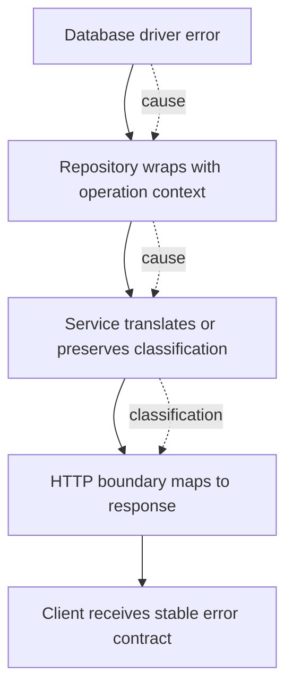
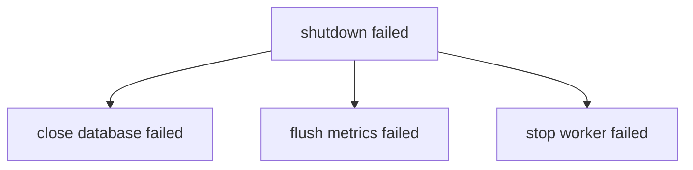
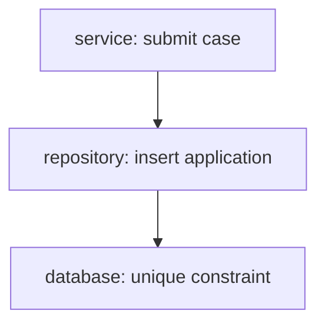
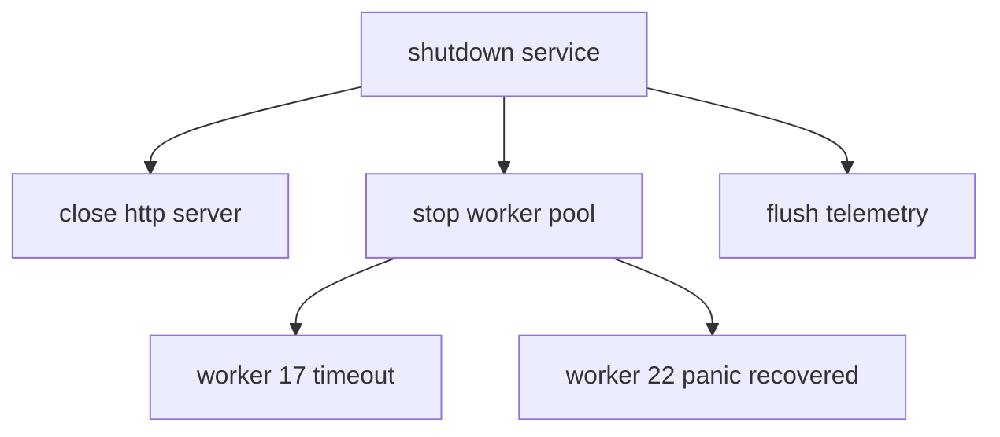
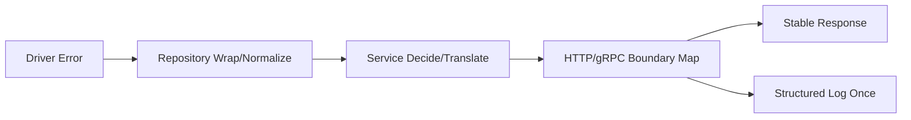
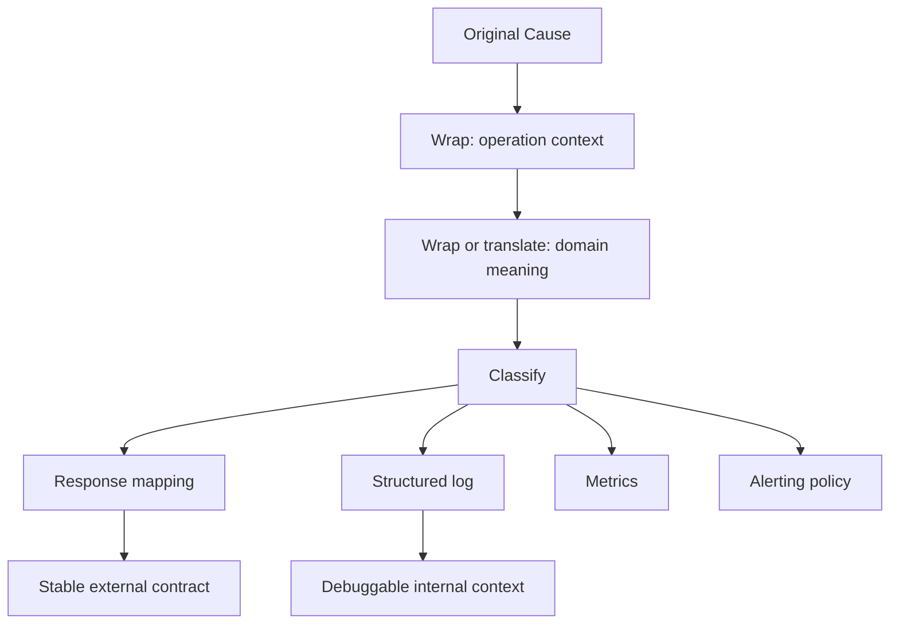

# learn-go-reliability-error-handling-part-004.md

# Part 004 — Error Wrapping, Error Chain, `errors.Is`, `errors.As`, `errors.Join`

> Seri: `learn-go-reliability-error-handling`  
> Target: Go 1.26.x  
> Audience: Java software engineer yang ingin berpikir seperti engineer produksi senior/top-tier  
> Fokus part ini: bagaimana membawa context error tanpa merusak contract, bagaimana membuat error bisa diklasifikasikan programmatically, dan bagaimana mendesain error chain/multi-error yang aman untuk sistem production.

---

## 0. Posisi Part Ini dalam Seri

Pada part sebelumnya kita membahas bentuk dasar error di Go:

- plain error,
- sentinel error,
- typed error,
- opaque error,
- exported vs unexported error,
- error sebagai API commitment.

Part ini naik satu level: **bagaimana error bergerak melewati layer**.

Di production system, error jarang lahir dan mati di tempat yang sama.

Contoh sederhana:

```text
HTTP handler
  -> service/usecase
    -> repository
      -> database driver
```

Database driver mungkin mengembalikan error low-level seperti:

```text
ORA-00060: deadlock detected while waiting for resource
```

Tetapi caller di level handler tidak seharusnya bergantung pada string Oracle. Handler perlu tahu:

```text
ini conflict/retryable/dependency failure/internal error?
```

Sementara operator perlu tahu:

```text
operation mana yang gagal, entity apa, request mana, tenant mana, dependency mana, timeout berapa?
```

Inilah fungsi utama wrapping:

> **Wrapping mempertahankan cause sambil menambahkan context layer saat error bergerak naik.**

Tetapi wrapping yang buruk akan membuat error menjadi:

- terlalu panjang,
- noisy,
- sulit diklasifikasikan,
- leaking internal detail,
- menyebabkan coupling antar layer,
- membuat API contract tidak stabil.

Part ini membangun mental model agar kamu tahu kapan harus wrap, kapan translate, kapan classify, kapan join, dan kapan menyembunyikan cause.

---

## 1. Referensi Faktual Singkat

Dalam standard library Go modern:

- `errors.Is(err, target)` memeriksa apakah error dalam chain cocok dengan target.
- `errors.As(err, &target)` mencari error dalam chain yang assignable ke tipe target.
- `fmt.Errorf("...: %w", err)` membuat error yang membungkus error lain.
- `errors.Join(errs...)` menggabungkan beberapa error menjadi satu error yang membungkus banyak child error.
- Sejak Go 1.20, Go mendukung multiple wrapping melalui `Unwrap() []error` dan multiple `%w` di `fmt.Errorf`.
- `errors.Unwrap(err)` hanya memanggil `Unwrap() error`, bukan `Unwrap() []error`. Jadi untuk multi-error, gunakan `errors.Is`/`errors.As`, bukan traversal manual sederhana.

Referensi utama:

- Go `errors` package documentation.
- Go 1.13 error wrapping design and behavior.
- Go 1.20 release notes untuk multiple error wrapping dan `errors.Join`.
- Go 1.26 release notes sebagai baseline versi seri.

---

## 2. Problem yang Diselesaikan Error Wrapping

Tanpa wrapping, kita sering jatuh ke dua ekstrem buruk.

### 2.1 Ekstrem 1 — Error terlalu low-level

```go
func LoadApplication(ctx context.Context, id ApplicationID) (*Application, error) {
    row := db.QueryRowContext(ctx, `select ...`, id)
    if err := row.Scan(...); err != nil {
        return nil, err
    }
    return app, nil
}
```

Caller menerima:

```text
sql: no rows in result set
```

Masalah:

- Caller tidak tahu operasi bisnis apa yang gagal.
- Log tidak menjawab application ID mana yang gagal.
- Layer atas mungkin langsung expose error DB ke client.
- Abstraction repository bocor.

### 2.2 Ekstrem 2 — Error diubah total, cause hilang

```go
func LoadApplication(ctx context.Context, id ApplicationID) (*Application, error) {
    row := db.QueryRowContext(ctx, `select ...`, id)
    if err := row.Scan(...); err != nil {
        return nil, errors.New("failed to load application")
    }
    return app, nil
}
```

Sekarang caller tahu operasi gagal, tetapi kehilangan cause.

Masalah:

- Tidak bisa `errors.Is(err, sql.ErrNoRows)`.
- Tidak bisa bedakan not found, timeout, cancellation, deadlock, connection failure.
- Debugging lebih sulit.
- Observability kehilangan root signal.

### 2.3 Wrapping sebagai kompromi

```go
func LoadApplication(ctx context.Context, id ApplicationID) (*Application, error) {
    row := db.QueryRowContext(ctx, `select ...`, id)
    if err := row.Scan(...); err != nil {
        return nil, fmt.Errorf("load application %s: %w", id, err)
    }
    return app, nil
}
```

Sekarang error memiliki:

```text
load application APP-123: sql: no rows in result set
```

Dan program masih bisa:

```go
errors.Is(err, sql.ErrNoRows)
```

Itulah inti wrapping.

---

## 3. Mental Model: Error Chain Adalah Causal Trace, Bukan Stack Trace

Java engineer sering menganggap error chain mirip exception stack trace.

Itu hanya sebagian benar.

Dalam Java:

```java
throw new ServiceException("failed to submit case", cause);
```

Exception membawa:

- type,
- message,
- stack trace,
- cause,
- suppressed exceptions.

Dalam Go:

```go
return fmt.Errorf("submit case %s: %w", id, err)
```

Error chain membawa:

- textual context,
- cause chain,
- optional type/sentinel classification,
- optional metadata jika error type menyediakannya.

Tetapi Go tidak otomatis membuat setiap error memiliki stack trace. Itu disengaja: error di Go adalah value kecil dan eksplisit, bukan exception object berat.

### 3.1 Error chain bukan tempat semua informasi

Error chain cocok untuk:

- operation context,
- entity identifier yang aman,
- dependency name,
- classification-preserving cause,
- recoverability signal.

Error chain tidak cocok untuk semua hal berikut:

- full request payload,
- PII,
- secrets,
- large object,
- stack trace setiap call,
- metric labels high-cardinality,
- data audit lengkap.

Untuk itu gunakan:

- structured log,
- trace span attributes,
- audit trail,
- event log,
- database record,
- incident timeline.

---

## 4. Diagram Dasar Error Wrapping



Interpretasi:

- Low-level layer tahu detail teknis.
- Mid-level layer tahu use case.
- Boundary layer tahu transport response.
- Caller luar harus menerima contract stabil, bukan detail internal.

---

## 5. `%w`: Wrapping yang Mempertahankan Cause

Gunakan `%w` di `fmt.Errorf` untuk membungkus error.

```go
return fmt.Errorf("open config file %q: %w", path, err)
```

Jangan gunakan `%v` jika kamu ingin caller bisa memakai `errors.Is` atau `errors.As`.

```go
// BAD: cause menjadi text saja, chain hilang.
return fmt.Errorf("open config file %q: %v", path, err)
```

### 5.1 `%w` hanya untuk error operand

```go
return fmt.Errorf("load user: %w", err)
```

Benar.

```go
return fmt.Errorf("load user: %w", "not an error")
```

Salah secara format contract.

### 5.2 Satu `%w` vs banyak `%w`

Sejak Go 1.20, `fmt.Errorf` dapat memakai lebih dari satu `%w`.

```go
return fmt.Errorf("shutdown failed: close db: %w; flush metrics: %w", dbErr, metricsErr)
```

Ini menghasilkan error yang membungkus banyak error.

Tetapi dalam praktik production, `errors.Join` sering lebih jelas untuk multi-error cleanup.

```go
return errors.Join(dbErr, metricsErr)
```

Atau:

```go
if joined := errors.Join(dbErr, metricsErr); joined != nil {
    return fmt.Errorf("shutdown dependencies: %w", joined)
}
```

---

## 6. `errors.Is`: Classification by Equivalence

`errors.Is(err, target)` menjawab pertanyaan:

> Apakah error ini, atau salah satu cause-nya, cocok dengan target tertentu?

Contoh:

```go
var ErrApplicationNotFound = errors.New("application not found")

func loadApplication(id string) error {
    return fmt.Errorf("load application %s: %w", id, ErrApplicationNotFound)
}

func handle() {
    err := loadApplication("APP-123")
    if errors.Is(err, ErrApplicationNotFound) {
        // map to HTTP 404 or domain-specific absence
    }
}
```

### 6.1 Kenapa bukan `err == target`?

Karena setelah wrapping:

```go
err == ErrApplicationNotFound
```

akan false.

Tetapi:

```go
errors.Is(err, ErrApplicationNotFound)
```

akan true.

### 6.2 `errors.Is` bukan string matching

Jangan lakukan:

```go
if strings.Contains(err.Error(), "not found") {
    // fragile
}
```

Itu rapuh karena:

- message bisa berubah,
- localization bisa berubah,
- dependency bisa mengubah wording,
- false positive mudah terjadi,
- security redaction bisa menghapus detail.

Gunakan sentinel, typed error, atau classifier.

---

## 7. Custom `Is`: Saat Equivalence Tidak Harus Identik

Error type dapat mendefinisikan method:

```go
Is(target error) bool
```

Ini membuat error bisa dianggap cocok dengan target tertentu.

Contoh:

```go
package domain

import "errors"

var ErrConflict = errors.New("conflict")

type VersionConflictError struct {
    Entity  string
    ID      string
    Current int64
    Given   int64
}

func (e *VersionConflictError) Error() string {
    return "version conflict"
}

func (e *VersionConflictError) Is(target error) bool {
    return target == ErrConflict
}
```

Pemakaian:

```go
err := &domain.VersionConflictError{
    Entity:  "application",
    ID:      "APP-123",
    Current: 8,
    Given:   7,
}

if errors.Is(err, domain.ErrConflict) {
    // HTTP 409
}
```

### 7.1 Kenapa ini berguna?

Karena kamu bisa punya banyak conflict detail:

- duplicate submission,
- version conflict,
- state transition conflict,
- unique constraint conflict,
- lock conflict.

Semuanya bisa dianggap bagian dari kategori umum:

```go
ErrConflict
```

Tetapi detail typed error tetap tersedia lewat `errors.As`.

---

## 8. `errors.As`: Classification by Type and Metadata Extraction

`errors.As(err, &target)` menjawab pertanyaan:

> Apakah chain error mengandung error dengan tipe tertentu, dan jika ya, ambil nilainya?

Contoh:

```go
type RuleViolationError struct {
    RuleID string
    Reason string
}

func (e *RuleViolationError) Error() string {
    return "rule violation: " + e.RuleID
}
```

Pemakaian:

```go
var ruleErr *RuleViolationError
if errors.As(err, &ruleErr) {
    logRuleViolation(ruleErr.RuleID, ruleErr.Reason)
}
```

### 8.1 `errors.As` untuk metadata, bukan sekadar kategori

`errors.Is` cocok untuk:

```text
apakah ini not found?
apakah ini conflict?
apakah ini unauthorized?
apakah ini timeout?
```

`errors.As` cocok untuk:

```text
rule id apa?
entity apa?
retry after berapa?
dependency mana?
field validation mana?
```

### 8.2 Common mistake: target harus pointer to type

```go
var e *RuleViolationError
if errors.As(err, &e) {
    // ok
}
```

Bukan:

```go
if errors.As(err, RuleViolationError{}) { // salah
}
```

Dan hati-hati jika target adalah interface.

---

## 9. `errors.Unwrap`: Berguna, tapi Jangan Overuse

`errors.Unwrap(err)` mengembalikan child error jika tipe error memiliki:

```go
Unwrap() error
```

Contoh:

```go
cause := errors.Unwrap(err)
```

Tetapi dalam code production, traversal manual biasanya bukan pilihan terbaik.

Lebih sering kamu butuh:

```go
errors.Is(err, target)
errors.As(err, &target)
```

Kenapa?

Karena sejak multiple wrapping, error bisa berbentuk tree, bukan hanya linked list.



`errors.Unwrap` sederhana tidak cukup untuk tree `Unwrap() []error`.

---

## 10. `errors.Join`: Multi-Error sebagai Error Tree

`errors.Join(errs...)` menggabungkan beberapa error menjadi satu.

```go
err := errors.Join(closeDBErr, flushMetricsErr, closeRedisErr)
```

Jika semua input nil, hasilnya nil.

Ini sangat berguna untuk cleanup/shutdown:

```go
func closeAll(db *sql.DB, redis io.Closer, tracer io.Closer) error {
    var err error

    if db != nil {
        err = errors.Join(err, db.Close())
    }
    if redis != nil {
        err = errors.Join(err, redis.Close())
    }
    if tracer != nil {
        err = errors.Join(err, tracer.Close())
    }

    if err != nil {
        return fmt.Errorf("close dependencies: %w", err)
    }
    return nil
}
```

### 10.1 Kapan `errors.Join` tepat?

Gunakan untuk kondisi di mana beberapa operasi independen dapat gagal, dan kamu tidak ingin kehilangan salah satunya.

Contoh tepat:

- shutdown cleanup,
- close multiple resources,
- validation multiple fields,
- batch processing per-item error summary,
- fan-out operation di mana semua branch dijalankan,
- partial cleanup after rollback.

### 10.2 Kapan `errors.Join` tidak tepat?

Jangan gunakan `errors.Join` untuk menyembunyikan keputusan yang seharusnya eksplisit.

Buruk:

```go
return errors.Join(ErrUnauthorized, ErrValidation, ErrConflict)
```

Jika satu request sekaligus unauthorized, invalid, dan conflict, kemungkinan besar boundary decision kamu kacau. Dalam API, biasanya harus ada primary response semantics.

Juga hati-hati untuk public response. Multi-error internal boleh ada, tapi response external harus stabil dan jelas.

---

## 11. Error Chain vs Error Tree

Sebelum Go 1.20, mental model umum:



Ini linked list.

Dengan `errors.Join`, bentuknya bisa menjadi tree:



`errors.Is` dan `errors.As` menelusuri tree ini.

Artinya kamu bisa:

```go
if errors.Is(err, context.DeadlineExceeded) {
    // at least one branch timed out
}
```

Tetapi kamu harus berhati-hati:

> `errors.Is(joined, target)` berarti **ada salah satu child yang cocok**, bukan berarti seluruh operasi memiliki satu klasifikasi tunggal.

---

## 12. Rule Utama Wrapping per Layer

Gunakan aturan ini sebagai default:

```text
Low-level layer:
  preserve cause + add technical operation context

Domain/service layer:
  translate low-level error ke domain/infrastructure category jika diperlukan

Transport boundary:
  map internal error contract ke stable external response

Logging boundary:
  log once with full context, not at every layer
```

Diagram:



---

## 13. Repository Wrapping Pattern

### 13.1 Bad: return raw DB error

```go
func (r *ApplicationRepo) FindByID(ctx context.Context, id string) (*Application, error) {
    row := r.db.QueryRowContext(ctx, `select ...`, id)

    var app Application
    if err := row.Scan(&app.ID, &app.Status); err != nil {
        return nil, err
    }
    return &app, nil
}
```

Caller harus tahu `sql.ErrNoRows`. Itu bisa acceptable untuk small internal package, tetapi buruk sebagai domain repository contract besar.

### 13.2 Better: normalize absence

```go
var ErrApplicationNotFound = errors.New("application not found")

func (r *ApplicationRepo) FindByID(ctx context.Context, id string) (*Application, error) {
    row := r.db.QueryRowContext(ctx, `select id, status from applications where id = ?`, id)

    var app Application
    if err := row.Scan(&app.ID, &app.Status); err != nil {
        if errors.Is(err, sql.ErrNoRows) {
            return nil, fmt.Errorf("find application %s: %w", id, ErrApplicationNotFound)
        }
        return nil, fmt.Errorf("find application %s: %w", id, err)
    }
    return &app, nil
}
```

Kelebihan:

- caller tidak bergantung pada `sql.ErrNoRows`,
- context operation tetap ada,
- classification not found tetap bisa dicek,
- DB error lain tetap preserve cause.

### 13.3 Production-grade variation: typed not found

```go
type NotFoundError struct {
    Entity string
    ID     string
}

func (e *NotFoundError) Error() string {
    return e.Entity + " not found"
}

func (e *NotFoundError) Is(target error) bool {
    return target == ErrNotFound
}

var ErrNotFound = errors.New("not found")
```

Pemakaian:

```go
if errors.Is(err, sql.ErrNoRows) {
    return nil, fmt.Errorf("find application %s: %w", id, &NotFoundError{
        Entity: "application",
        ID:     id,
    })
}
```

Caller:

```go
if errors.Is(err, ErrNotFound) {
    // 404
}

var nf *NotFoundError
if errors.As(err, &nf) {
    // nf.Entity, nf.ID available for safe internal logging
}
```

---

## 14. Service Layer Pattern: Translate, Do Not Leak

Service layer sebaiknya tidak sekadar membungkus semua error dengan message generik.

### 14.1 Bad: blind wrapping

```go
func (s *Service) Submit(ctx context.Context, id string) error {
    app, err := s.repo.FindByID(ctx, id)
    if err != nil {
        return fmt.Errorf("submit failed: %w", err)
    }
    return s.transition.Submit(app)
}
```

Ini tidak selalu buruk, tapi sering kurang expressive. Service tahu konteks domain: submit application.

### 14.2 Better: preserve known classifications

```go
func (s *Service) Submit(ctx context.Context, id string) error {
    app, err := s.repo.FindByID(ctx, id)
    if err != nil {
        if errors.Is(err, ErrNotFound) {
            return fmt.Errorf("submit application %s: %w", id, err)
        }
        return fmt.Errorf("load application for submit %s: %w", id, err)
    }

    if err := app.Submit(); err != nil {
        return fmt.Errorf("submit application %s: %w", id, err)
    }

    if err := s.repo.Save(ctx, app); err != nil {
        return fmt.Errorf("save submitted application %s: %w", id, err)
    }

    return nil
}
```

Perhatikan context berbeda:

- `load application for submit`,
- `submit application`,
- `save submitted application`.

Ini membantu debugging jauh lebih baik daripada semua error menjadi `submit failed`.

---

## 15. Boundary Pattern: Map Once

HTTP boundary harus menjadi tempat error internal diterjemahkan ke response.

```go
type AppErrorResponse struct {
    Code      string `json:"code"`
    Message   string `json:"message"`
    RequestID string `json:"requestId,omitempty"`
}
```

Mapper:

```go
func mapError(err error) (status int, code string, message string) {
    switch {
    case errors.Is(err, context.Canceled):
        return 499, "REQUEST_CANCELLED", "request was cancelled"
    case errors.Is(err, context.DeadlineExceeded):
        return http.StatusGatewayTimeout, "TIMEOUT", "request timed out"
    case errors.Is(err, ErrNotFound):
        return http.StatusNotFound, "NOT_FOUND", "resource was not found"
    case errors.Is(err, ErrConflict):
        return http.StatusConflict, "CONFLICT", "resource conflict"
    case errors.Is(err, ErrValidation):
        return http.StatusBadRequest, "VALIDATION_ERROR", "request is invalid"
    default:
        return http.StatusInternalServerError, "INTERNAL_ERROR", "internal server error"
    }
}
```

### 15.1 Jangan expose `err.Error()` langsung

```go
// BAD
json.NewEncoder(w).Encode(map[string]string{
    "error": err.Error(),
})
```

Kenapa buruk?

- Bisa leak SQL query.
- Bisa leak internal ID.
- Bisa leak dependency name.
- Bisa membuat client bergantung pada wording internal.
- Bisa bocorkan security-sensitive detail.

Public response harus stable. Internal error detail masuk log/trace, bukan response.

---

## 16. Wrapping dan Logging: Jangan Double/Triple Log

Anti-pattern umum:

```go
func repo() error {
    if err != nil {
        log.Printf("repo failed: %v", err)
        return fmt.Errorf("repo failed: %w", err)
    }
}

func service() error {
    if err := repo(); err != nil {
        log.Printf("service failed: %v", err)
        return fmt.Errorf("service failed: %w", err)
    }
}

func handler() {
    if err := service(); err != nil {
        log.Printf("handler failed: %v", err)
        http.Error(...)
    }
}
```

Hasilnya:

```text
repo failed: connection reset
service failed: repo failed: connection reset
handler failed: service failed: repo failed: connection reset
```

Ini noisy.

Rule:

> **Wrap di banyak layer boleh. Log biasanya sekali di boundary yang punya request context penuh.**

Boundary punya:

- request id,
- user id/actor id,
- tenant,
- route,
- method,
- latency,
- status,
- trace id,
- user agent,
- remote address,
- error chain.

Low-level package biasanya tidak punya context selengkap itu.

### 16.1 Exception

Low-level boleh log jika:

- error tidak dikembalikan,
- background goroutine tidak punya caller,
- recovery dari panic,
- best-effort cleanup gagal tapi tidak mempengaruhi return,
- audit/security event harus dicatat lokal.

---

## 17. Error Message Composition

Wrapping sering menghasilkan message chain.

Baik:

```text
save submitted application APP-123: insert application_event: unique constraint violated
```

Buruk:

```text
failed to save submitted application APP-123: failed to insert application_event: failed because database failed with error unique constraint violated
```

### 17.1 Gunakan operation phrase

```go
return fmt.Errorf("save application %s: %w", id, err)
return fmt.Errorf("decode request body: %w", err)
return fmt.Errorf("call identity service: %w", err)
return fmt.Errorf("commit transaction: %w", err)
```

Hindari:

```go
return fmt.Errorf("error happened: %w", err)
return fmt.Errorf("failed: %w", err)
return fmt.Errorf("something went wrong: %w", err)
```

### 17.2 Lowercase convention

Go convention umum: error string tidak diawali kapital dan tidak diakhiri punctuation kecuali perlu.

```go
errors.New("invalid state transition")
```

Bukan:

```go
errors.New("Invalid state transition.")
```

Alasannya: error sering dikomposisikan dalam wrapping.

---

## 18. Contract-Preserving Wrapping

Wrapping harus menjaga contract yang dibutuhkan caller.

Misalnya function contract:

```go
// Find returns ErrNotFound when application does not exist.
func (r *Repo) Find(ctx context.Context, id string) (*Application, error)
```

Maka implementation harus memastikan:

```go
errors.Is(err, ErrNotFound) == true
```

untuk absence.

Jangan hilangkan contract:

```go
if errors.Is(err, sql.ErrNoRows) {
    return nil, fmt.Errorf("find application: %v", ErrNotFound) // BAD: %v loses wrapping
}
```

Harus:

```go
if errors.Is(err, sql.ErrNoRows) {
    return nil, fmt.Errorf("find application: %w", ErrNotFound)
}
```

Atau typed error:

```go
return nil, fmt.Errorf("find application: %w", &NotFoundError{Entity: "application", ID: id})
```

---

## 19. Translate vs Wrap

Ini salah satu skill penting.

### 19.1 Wrap jika caller masih boleh melihat cause classification

```go
return fmt.Errorf("read config %s: %w", path, err)
```

### 19.2 Translate jika low-level error tidak boleh menjadi contract

```go
if isUniqueViolation(err) {
    return fmt.Errorf("create user: %w", ErrDuplicateUser)
}
```

Di sini kamu tidak expose driver-specific error sebagai contract utama.

### 19.3 Translate and preserve jika debugging masih butuh cause

```go
if isUniqueViolation(err) {
    return fmt.Errorf("create user: %w", &ConflictError{
        Entity: "user",
        Cause:  err,
    })
}
```

Dengan type:

```go
type ConflictError struct {
    Entity string
    Cause  error
}

func (e *ConflictError) Error() string {
    return e.Entity + " conflict"
}

func (e *ConflictError) Unwrap() error {
    return e.Cause
}

func (e *ConflictError) Is(target error) bool {
    return target == ErrConflict
}
```

Ini pattern kuat:

- caller bisa `errors.Is(err, ErrConflict)`,
- operator masih bisa lihat low-level cause,
- API tidak perlu expose cause.

---

## 20. Designing Error Types with `Unwrap`

Custom error type dapat membungkus cause.

```go
type DependencyError struct {
    Dependency string
    Operation  string
    Retryable  bool
    Cause      error
}

func (e *DependencyError) Error() string {
    return e.Operation + " " + e.Dependency
}

func (e *DependencyError) Unwrap() error {
    return e.Cause
}
```

Pemakaian:

```go
return &DependencyError{
    Dependency: "identity-service",
    Operation:  "get user profile",
    Retryable:  true,
    Cause:      err,
}
```

Caller:

```go
var depErr *DependencyError
if errors.As(err, &depErr) {
    if depErr.Retryable {
        // retry policy may consider this
    }
}
```

### 20.1 Jangan simpan metadata sensitif sembarangan

Kalau error akan dilog otomatis, jangan masukkan:

- token,
- password,
- full NRIC/NIK/passport,
- full request body,
- raw SQL dengan literal sensitif,
- personal data.

Gunakan redacted identifier.

---

## 21. `Unwrap() error` vs `Unwrap() []error`

Single cause:

```go
func (e *DependencyError) Unwrap() error {
    return e.Cause
}
```

Multiple cause:

```go
type BatchError struct {
    Operation string
    Errs      []error
}

func (e *BatchError) Error() string {
    return e.Operation + " failed"
}

func (e *BatchError) Unwrap() []error {
    return e.Errs
}
```

`errors.Is` dan `errors.As` akan memeriksa child error.

### 21.1 Design warning

Multiple causes berarti classification bisa ambigu.

Jika batch berisi:

- 1 validation error,
- 1 timeout,
- 1 conflict,

maka:

```go
errors.Is(batchErr, ErrValidation) == true
errors.Is(batchErr, context.DeadlineExceeded) == true
errors.Is(batchErr, ErrConflict) == true
```

Boundary harus punya policy:

- response 207 multi-status?
- reject whole batch?
- return summary?
- retry only failed subset?
- DLQ specific item?

Jangan biarkan multi-error tanpa decision model.

---

## 22. Practical Error Classification Helpers

Dalam sistem besar, langsung memakai `errors.Is` di seluruh code bisa berantakan. Buat classifier kecil.

```go
type Class string

const (
    ClassUnknown     Class = "unknown"
    ClassValidation  Class = "validation"
    ClassNotFound    Class = "not_found"
    ClassConflict    Class = "conflict"
    ClassTimeout     Class = "timeout"
    ClassCancelled   Class = "cancelled"
    ClassDependency  Class = "dependency"
    ClassInternal    Class = "internal"
)

func Classify(err error) Class {
    switch {
    case err == nil:
        return ""
    case errors.Is(err, context.Canceled):
        return ClassCancelled
    case errors.Is(err, context.DeadlineExceeded):
        return ClassTimeout
    case errors.Is(err, ErrValidation):
        return ClassValidation
    case errors.Is(err, ErrNotFound):
        return ClassNotFound
    case errors.Is(err, ErrConflict):
        return ClassConflict
    default:
        var dep *DependencyError
        if errors.As(err, &dep) {
            return ClassDependency
        }
        return ClassInternal
    }
}
```

Boundary mapper:

```go
func HTTPStatusFor(class Class) int {
    switch class {
    case ClassValidation:
        return http.StatusBadRequest
    case ClassNotFound:
        return http.StatusNotFound
    case ClassConflict:
        return http.StatusConflict
    case ClassCancelled:
        return 499
    case ClassTimeout:
        return http.StatusGatewayTimeout
    case ClassDependency:
        return http.StatusBadGateway
    default:
        return http.StatusInternalServerError
    }
}
```

### 22.1 Caution: classifier bukan pengganti desain error

Classifier hanya membaca signal yang sudah ada. Kalau layer bawah tidak preserve contract, classifier tidak bisa menyelamatkan.

---

## 23. Retryability: Jangan Disimpan Hanya di Message

Buruk:

```go
return fmt.Errorf("temporary error: %w", err)
```

Lalu caller parsing string:

```go
strings.Contains(err.Error(), "temporary")
```

Lebih baik:

```go
type RetryableError struct {
    Cause error
}

func (e *RetryableError) Error() string { return "retryable error" }
func (e *RetryableError) Unwrap() error { return e.Cause }

func IsRetryable(err error) bool {
    var retryable *RetryableError
    if errors.As(err, &retryable) {
        return true
    }

    var dep *DependencyError
    if errors.As(err, &dep) {
        return dep.Retryable
    }

    return errors.Is(err, context.DeadlineExceeded)
}
```

Namun hati-hati:

> Retryability bukan properti error saja. Retryability adalah hasil gabungan antara error, operation, idempotency, request budget, dan current system load.

Contoh:

- Timeout saat `GET` mungkin retryable.
- Timeout saat `POST /submit` belum tentu retryable tanpa idempotency key.
- Deadlock saat DB transaction mungkin retryable.
- Unique constraint biasanya bukan retryable.
- 503 dari dependency mungkin retryable, tetapi tidak jika retry budget habis.

---

## 24. Wrapping Cancellation and Timeout

Context cancellation dan deadline harus dipertahankan.

Buruk:

```go
if err := call(ctx); err != nil {
    return errors.New("call failed")
}
```

Ini menghilangkan:

```go
errors.Is(err, context.Canceled)
errors.Is(err, context.DeadlineExceeded)
```

Benar:

```go
if err := call(ctx); err != nil {
    return fmt.Errorf("call identity service: %w", err)
}
```

Boundary bisa:

```go
switch {
case errors.Is(err, context.Canceled):
    // client disconnected or caller cancelled
case errors.Is(err, context.DeadlineExceeded):
    // timeout
}
```

### 24.1 Do not convert all context errors to internal errors

Cancellation bukan selalu failure server.

Jika client disconnect, server mungkin tidak perlu alert.

Jika dependency timeout, mungkin perlu metric/alert tergantung rate.

Klasifikasi ini hilang kalau context error tidak di-wrap dengan `%w`.

---

## 25. Security Boundary: Wrap Internally, Redact Externally

Internal error:

```text
create account john@example.com: insert users: duplicate key value violates unique constraint users_email_key
```

Public response:

```json
{
  "code": "CONFLICT",
  "message": "resource conflict",
  "requestId": "req-abc123"
}
```

Log internal boleh punya detail yang aman. Tetapi hati-hati: email bisa PII. Untuk production regulated domain, gunakan redaction policy.

```go
return fmt.Errorf("create account email_hash=%s: %w", hashEmail(email), err)
```

Atau simpan entity id internal yang tidak sensitif.

---

## 26. Case Study: Regulatory Case Transition

Misalnya sistem case management punya state machine:

```text
DRAFT -> SUBMITTED -> UNDER_REVIEW -> APPROVED/REJECTED
```

Use case:

```text
submit application
```

Failure sources:

1. Application tidak ditemukan.
2. Actor tidak punya permission.
3. State bukan DRAFT.
4. Version conflict.
5. DB deadlock.
6. Audit trail insert gagal.
7. Notification enqueue gagal.
8. Request timeout.

### 26.1 Error definitions

```go
var (
    ErrNotFound      = errors.New("not found")
    ErrUnauthorized  = errors.New("unauthorized")
    ErrInvalidState  = errors.New("invalid state")
    ErrConflict      = errors.New("conflict")
    ErrAuditRequired = errors.New("audit required")
)

type InvalidTransitionError struct {
    Entity string
    ID     string
    From   string
    Event  string
}

func (e *InvalidTransitionError) Error() string {
    return "invalid state transition"
}

func (e *InvalidTransitionError) Is(target error) bool {
    return target == ErrInvalidState
}
```

### 26.2 Repository error mapping

```go
func (r *Repo) LoadApplication(ctx context.Context, id string) (*Application, error) {
    app, err := r.queryApplication(ctx, id)
    if err != nil {
        if errors.Is(err, sql.ErrNoRows) {
            return nil, fmt.Errorf("load application %s: %w", id, &NotFoundError{
                Entity: "application",
                ID:     id,
            })
        }
        return nil, fmt.Errorf("load application %s: %w", id, err)
    }
    return app, nil
}
```

### 26.3 Service error wrapping

```go
func (s *Service) Submit(ctx context.Context, actor Actor, id string, version int64) error {
    app, err := s.repo.LoadApplication(ctx, id)
    if err != nil {
        return fmt.Errorf("submit application %s: %w", id, err)
    }

    if !s.policy.CanSubmit(actor, app) {
        return fmt.Errorf("submit application %s: %w", id, ErrUnauthorized)
    }

    if app.State != StateDraft {
        return fmt.Errorf("submit application %s: %w", id, &InvalidTransitionError{
            Entity: "application",
            ID:     id,
            From:   string(app.State),
            Event:  "submit",
        })
    }

    if app.Version != version {
        return fmt.Errorf("submit application %s: %w", id, &VersionConflictError{
            Entity:  "application",
            ID:      id,
            Current: app.Version,
            Given:   version,
        })
    }

    if err := s.repo.SaveSubmitted(ctx, app); err != nil {
        return fmt.Errorf("persist submitted application %s: %w", id, err)
    }

    if err := s.audit.RecordSubmitted(ctx, actor, app); err != nil {
        return fmt.Errorf("record submission audit %s: %w", id, &AuditError{Cause: err})
    }

    return nil
}
```

### 26.4 Boundary classification

```go
func submitHandler(w http.ResponseWriter, r *http.Request) {
    err := service.Submit(r.Context(), actor, id, version)
    if err != nil {
        class := Classify(err)
        status := HTTPStatusFor(class)

        logger.ErrorContext(r.Context(), "submit application failed",
            "error", err,
            "class", class,
            "application_id", id,
            "request_id", requestIDFrom(r.Context()),
        )

        writeError(w, status, publicCodeFor(class), publicMessageFor(class))
        return
    }

    w.WriteHeader(http.StatusNoContent)
}
```

Di sini chain internal bisa kaya, tetapi response eksternal stabil.

---

## 27. Error Wrapping Anti-Patterns

### 27.1 Wrapping nil error

```go
return fmt.Errorf("do thing: %w", err) // if err nil, result non-nil weirdness? avoid pattern
```

Selalu cek:

```go
if err != nil {
    return fmt.Errorf("do thing: %w", err)
}
```

### 27.2 `%v` saat contract butuh `%w`

```go
return fmt.Errorf("find user: %v", ErrNotFound)
```

`errors.Is` tidak akan bekerja.

### 27.3 Semua layer menambahkan “failed to”

```text
failed to submit: failed to save: failed to insert: failed to execute
```

Gunakan operation phrase.

### 27.4 Expose low-level sentinel sebagai public domain contract

```go
// Bad public contract
// Find returns sql.ErrNoRows if absent.
```

Ini membuat domain bergantung pada database implementation.

### 27.5 String matching

```go
if err.Error() == "not found" { ... }
```

Rapuh.

### 27.6 Over-wrapping without decision

```go
return fmt.Errorf("service: %w", fmt.Errorf("repo: %w", fmt.Errorf("db: %w", err)))
```

Context harus spesifik, bukan nama layer generik.

### 27.7 Joining unrelated policy errors

```go
return errors.Join(ErrUnauthorized, ErrValidation)
```

Boundary menjadi bingung. Biasanya pilih primary failure.

---

## 28. Testing Error Wrapping Contract

Test bukan hanya message.

### 28.1 Test `errors.Is`

```go
func TestFindApplication_NotFound(t *testing.T) {
    repo := newRepoWithNoRows()

    _, err := repo.FindByID(context.Background(), "APP-404")
    if err == nil {
        t.Fatal("expected error")
    }

    if !errors.Is(err, ErrNotFound) {
        t.Fatalf("expected ErrNotFound, got %v", err)
    }
}
```

### 28.2 Test `errors.As`

```go
func TestSubmit_InvalidTransition(t *testing.T) {
    svc := serviceWithApplicationState(StateApproved)

    err := svc.Submit(context.Background(), actor, "APP-123", 10)
    if err == nil {
        t.Fatal("expected error")
    }

    var transitionErr *InvalidTransitionError
    if !errors.As(err, &transitionErr) {
        t.Fatalf("expected InvalidTransitionError, got %T %v", err, err)
    }

    if transitionErr.From != string(StateApproved) {
        t.Fatalf("expected from approved, got %q", transitionErr.From)
    }
}
```

### 28.3 Test message sparingly

Message tests terlalu rigid. Test message hanya jika message memang contract internal yang penting.

Lebih baik test:

- class,
- HTTP status,
- public code,
- sentinel match,
- typed metadata,
- retryability,
- redaction.

---

## 29. Design Checklist

Gunakan checklist ini saat code review.

### 29.1 Wrapping checklist

- Apakah error low-level dibungkus dengan operation context yang jelas?
- Apakah `%w` digunakan saat cause perlu dipertahankan?
- Apakah `%v` digunakan hanya saat memang ingin menghilangkan cause?
- Apakah message tidak redundant?
- Apakah context aman dari PII/secrets?
- Apakah wrapping tidak membocorkan abstraction yang tidak boleh menjadi contract?

### 29.2 Classification checklist

- Apakah caller bisa memakai `errors.Is` untuk kategori penting?
- Apakah caller bisa memakai `errors.As` untuk metadata penting?
- Apakah timeout/cancellation tetap preserve?
- Apakah domain error tidak bergantung pada driver-specific error?
- Apakah retryability tidak bergantung pada string matching?

### 29.3 Boundary checklist

- Apakah error dimapping ke response di satu tempat?
- Apakah public response tidak expose `err.Error()` mentah?
- Apakah error dilog sekali dengan request context penuh?
- Apakah metric label memakai class/code stabil, bukan full error string?
- Apakah joined error punya policy response yang jelas?

---

## 30. Mental Model Ringkas



Golden rule:

> **Error wrapping is not for making messages longer. It is for preserving cause while adding the minimum context required for correct decisions.**

---

## 31. Exercises

### Exercise 1 — Refactor raw DB error

Ambil function repository yang mengembalikan raw `sql.ErrNoRows`. Refactor agar:

- caller bisa `errors.Is(err, ErrNotFound)`,
- message mengandung operation context,
- tidak expose SQL detail sebagai public contract.

### Exercise 2 — Build conflict error

Buat `VersionConflictError` yang:

- punya `Entity`, `ID`, `Current`, `Given`,
- match terhadap `ErrConflict` via `Is`,
- bisa diekstrak via `errors.As`.

### Exercise 3 — Cleanup multi-error

Buat function `Shutdown()` yang menutup:

- HTTP server,
- DB,
- Redis,
- tracer.

Gunakan `errors.Join` agar semua close error tidak hilang.

### Exercise 4 — Boundary mapper

Buat function:

```go
func MapError(err error) (status int, code string, message string)
```

Harus support:

- not found,
- validation,
- conflict,
- context canceled,
- deadline exceeded,
- dependency error,
- default internal error.

### Exercise 5 — Redaction review

Cari error message yang memasukkan:

- email,
- token,
- request payload,
- SQL literal,
- personal identifier.

Refactor menjadi safe context.

---

## 32. Ringkasan Part 004

Kamu sekarang harus punya mental model berikut:

1. Error wrapping mempertahankan cause dan menambah context.
2. `%w` menjaga error chain; `%v` hanya membuat text.
3. `errors.Is` dipakai untuk kategori/equivalence.
4. `errors.As` dipakai untuk tipe/metadata.
5. `errors.Join` membuat multi-error tree.
6. Multi-error berarti classification bisa tidak tunggal.
7. Boundary harus memutuskan response satu kali.
8. Jangan log error berulang di semua layer.
9. Jangan expose `err.Error()` mentah ke client.
10. Error message harus cukup informatif untuk operator, tetapi aman dan tidak noisy.
11. Translate low-level error ketika abstraction boundary membutuhkan domain contract.
12. Preserve timeout/cancellation agar reliability decision tetap benar.

---

## 33. Koneksi ke Part Berikutnya

Part ini membahas bagaimana error chain dibangun secara benar.

Part berikutnya akan masuk ke aspek yang tampak sederhana tetapi sering menentukan kualitas production debugging:

```text
learn-go-reliability-error-handling-part-005.md
Error Message Design: Context Tanpa Noise
```

Kita akan membahas:

- struktur pesan error,
- operation naming,
- redaction,
- message vs code,
- human-readable vs machine-readable signal,
- kapan message menjadi contract,
- bagaimana menulis error yang bagus untuk log, alert, trace, dan incident review.

---

## 34. Status Seri

Selesai sampai part ini:

```text
learn-go-reliability-error-handling-part-000.md
learn-go-reliability-error-handling-part-001.md
learn-go-reliability-error-handling-part-002.md
learn-go-reliability-error-handling-part-003.md
learn-go-reliability-error-handling-part-004.md
```

Seri belum selesai. Masih lanjut ke part 005.


<!-- NAVIGATION_FOOTER -->
<div class="page-nav">
<a href="./learn-go-reliability-error-handling-part-003.md">⬅️ Part 003 — The `error` Interface, Sentinel Error, Typed Error, dan Opaque Error</a>
<a href="./index.md">📚 Kategori</a>
<a href="../../index.md">🏠 Home</a>
<a href="./learn-go-reliability-error-handling-part-005.md">Part 005 — Error Message Design: Context Tanpa Noise ➡️</a>
</div>
