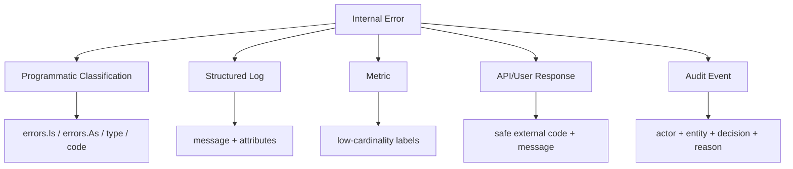
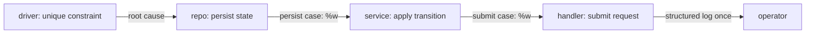
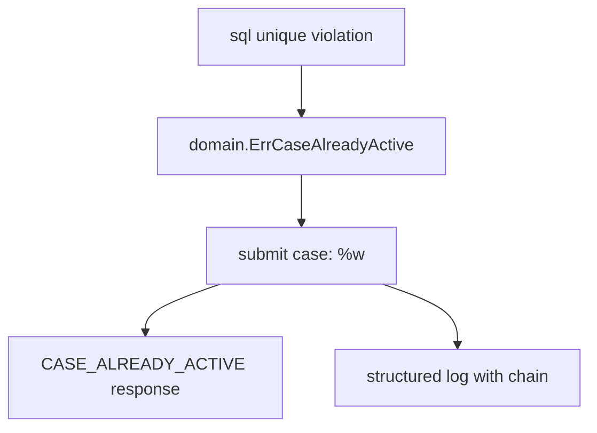

# learn-go-reliability-error-handling-part-005.md

# Part 005 — Error Message Design: Context Tanpa Noise

> Seri: `learn-go-reliability-error-handling`  
> Bagian: `005 / 034`  
> Topik: desain pesan error, context propagation, logging boundary, redaction, observability, API/user-facing error, dan auditability  
> Target pembaca: Java engineer yang sedang membangun keluwesan production-grade di Go 1.26.x  
> Status seri: belum selesai

---

## 0. Posisi Materi Ini dalam Seri

Pada part sebelumnya kita sudah membahas bentuk error di Go:

1. error sebagai value dan bagian dari API surface,
2. taxonomy error,
3. sentinel error, typed error, opaque error,
4. wrapping chain dengan `errors.Is`, `errors.As`, dan `errors.Join`.

Part ini masuk ke pertanyaan yang sering terlihat sepele, tetapi di sistem produksi justru menentukan apakah incident bisa diselesaikan dalam 5 menit atau 5 jam:

> Bagaimana mendesain pesan error yang cukup informatif untuk debugging, cukup stabil untuk observability, cukup aman untuk security, cukup pendek untuk dibaca, dan tidak berubah menjadi noise?

Di Go, error sering dibawa sebagai value yang berpindah antar layer. Setiap layer tergoda untuk menambahkan pesan seperti:

```go
return fmt.Errorf("failed to process request: failed to update case: failed to save case: failed to execute query: %w", err)
```

Hasilnya terlihat “bercontext”, tetapi sebenarnya noise:

```text
failed to process request: failed to update case: failed to save case: failed to execute query: ORA-00001: unique constraint violated
```

Masalahnya bukan hanya estetika. Pesan seperti ini buruk untuk:

- membaca log saat incident,
- mengelompokkan error,
- membuat alert yang stabil,
- melakukan redaction,
- memberi respons aman ke user,
- membedakan root cause vs propagation context,
- menjaga API contract.

Part ini membangun mental model bahwa **error message hanyalah satu dari beberapa kanal informasi error**. Jangan memaksa satu string untuk menjadi semua hal.

---

## 1. Core Thesis

Dalam sistem production-grade, error perlu punya minimal lima representasi berbeda:

| Representasi | Konsumen | Tujuan | Stabilitas |
|---|---|---|---|
| internal error chain | developer / code | classification, wrapping, root cause | cukup stabil |
| log event | operator / SRE / developer | diagnosis saat runtime | searchable, structured |
| metric label | monitoring system | agregasi, alerting, SLO | sangat stabil, low-cardinality |
| API/user response | client / user | tindakan aman yang bisa dilakukan | stabil, aman, tidak bocor |
| audit event | compliance / regulator / investigation | defensibility dan traceability | sangat stabil, durable |

Kesalahan umum adalah menggunakan satu string error untuk semuanya.



Rule utama:

> Error string boleh membantu manusia, tetapi tidak boleh menjadi satu-satunya contract sistem.

---

## 2. Referensi Dasar Go dan Security

Beberapa prinsip yang menjadi baseline:

- Go menyediakan package `errors` untuk membuat, membandingkan, mengunwrap, dan menggabungkan error. `errors.Is` dan `errors.As` digunakan untuk inspeksi chain tanpa bergantung pada string. Dokumentasi resmi package `errors` menjadi dasar mekanik ini.
- Go Blog “Working with Errors in Go 1.13” menjelaskan wrapping error dengan `%w` agar context dapat ditambahkan tanpa kehilangan kemampuan inspeksi programmatic.
- Go Wiki Code Review Comments menyarankan error string tidak diawali huruf kapital kecuali proper noun/acronym, dan tidak diakhiri punctuation, karena error sering digabung dengan context lain.
- `log/slog` di standard library mendukung structured logging berbasis key-value, sehingga detail error tidak perlu semuanya dijejalkan ke satu string.
- OWASP Logging Cheat Sheet menekankan pentingnya logging security-relevant event dan menghindari pencatatan data sensitif secara sembarangan.

Implikasinya untuk seri ini:

```text
Gunakan string error untuk manusia,
gunakan type/code/predicate untuk program,
gunakan structured fields untuk observability,
gunakan external response terpisah untuk client,
gunakan audit event terpisah untuk defensibility.
```

---

## 3. Masalah yang Sedang Kita Pecahkan

### 3.1 Error Message yang Terlalu Minim

Contoh buruk:

```go
if err != nil {
    return err
}
```

Kadang ini cukup, tetapi sering tidak.

Jika log boundary hanya menampilkan:

```text
unique constraint violated
```

Operator tidak tahu:

- operasi apa yang sedang dilakukan,
- entity apa yang diproses,
- case id apa,
- apakah error berasal dari insert case, insert audit trail, update workflow, atau publish outbox,
- apakah user bisa retry,
- apakah ini bug, conflict normal, atau data integrity issue.

### 3.2 Error Message yang Terlalu Panjang

Contoh buruk:

```go
return fmt.Errorf(
    "failed to process submit enforcement case request in case service because repository failed to insert enforcement case into oracle database due to database driver returning error: %w",
    err,
)
```

Ini tidak scalable. Saat layer lain menambahkan context lagi, hasilnya menjadi paragraf.

### 3.3 Error Message yang Mengandung Data Sensitif

Contoh buruk:

```go
return fmt.Errorf("login failed for user %s with password %s", username, password)
```

atau:

```go
return fmt.Errorf("failed to call myinfo with nric=%s payload=%s: %w", nric, string(body), err)
```

Masalah:

- bocor ke log,
- bocor ke error tracking,
- bocor ke external response jika mapping buruk,
- mungkin melanggar kebijakan keamanan dan privasi,
- sulit dihapus karena log immutable/long retention.

### 3.4 Error Message sebagai API Contract Tidak Sengaja

Contoh buruk:

```go
if strings.Contains(err.Error(), "not found") {
    return http.StatusNotFound
}
```

Ini rapuh. Jika string berubah, behavior berubah.

Di Go modern, gunakan:

- `errors.Is(err, domain.ErrCaseNotFound)`,
- `errors.As(err, *DomainError)`,
- explicit error code,
- typed classification.

### 3.5 Logging Error di Setiap Layer

Contoh buruk:

```go
func repoSave(ctx context.Context, c Case) error {
    if err := insert(ctx, c); err != nil {
        slog.Error("failed to insert case", "error", err)
        return fmt.Errorf("insert case: %w", err)
    }
    return nil
}

func submitCase(ctx context.Context, c Case) error {
    if err := repoSave(ctx, c); err != nil {
        slog.Error("failed to submit case", "error", err)
        return fmt.Errorf("submit case: %w", err)
    }
    return nil
}

func handler(w http.ResponseWriter, r *http.Request) {
    if err := submitCase(r.Context(), c); err != nil {
        slog.Error("request failed", "error", err)
        http.Error(w, "internal error", 500)
    }
}
```

Satu failure menghasilkan tiga log error. Saat incident, dashboard penuh duplikat.

Rule yang lebih sehat:

> Wrap di layer bawah, log di boundary observability.

Boundary observability biasanya:

- HTTP/gRPC handler,
- worker loop,
- scheduler loop,
- CLI command boundary,
- message consumer boundary,
- process startup/shutdown boundary.

---

## 4. Mental Model: Error Message sebagai Breadcrumb, Bukan Stack Trace

Java engineer sering terbiasa mengandalkan exception stack trace. Stack trace memberi path eksekusi otomatis. Go tidak otomatis memberi stack trace pada error biasa. Ini bukan kekurangan semata; ini memaksa desain yang lebih eksplisit.

Di Go, error message idealnya adalah breadcrumb kausal:

```text
submit case: persist case: duplicate active case
```

Bukan:

```text
java.sql.SQLIntegrityConstraintViolationException at ...
```

Bukan juga:

```text
failed to submit because failed to persist because failed to execute because failed due to failure
```

Breadcrumb yang baik menjawab:

1. operasi apa yang gagal,
2. pada boundary mana gagal,
3. root cause apa yang relevan,
4. tanpa mengulang kata generic,
5. tanpa membocorkan detail sensitif.



Hasil error chain:

```text
submit case: persist case: duplicate active case
```

Log structured:

```text
msg="request failed" error="submit case: persist case: duplicate active case" operation="case.submit" case_id="CASE-123" actor_id="U-456" error_kind="conflict" retryable=false
```

Metric:

```text
request_errors_total{route="POST /cases/{id}/submit", error_kind="conflict"}
```

API response:

```json
{
  "code": "CASE_ALREADY_ACTIVE",
  "message": "The case cannot be submitted because an active case already exists.",
  "correlationId": "..."
}
```

Audit:

```json
{
  "event": "CASE_SUBMISSION_REJECTED",
  "reasonCode": "CASE_ALREADY_ACTIVE",
  "actorId": "U-456",
  "caseId": "CASE-123",
  "decision": "REJECTED"
}
```

Satu failure, lima representasi.

---

## 5. Prinsip Desain Error Message di Go

### 5.1 Error String Harus Lowercase dan Tanpa Punctuation

Go convention:

```go
return errors.New("case not found")
return fmt.Errorf("load case: %w", err)
```

Hindari:

```go
return errors.New("Case not found.")
return fmt.Errorf("Load case failed: %w", err)
```

Alasan:

Error sering digabung:

```go
return fmt.Errorf("submit case: %w", err)
```

Jika inner error capitalized/punctuated, hasilnya buruk:

```text
submit case: Case not found.
```

Dengan convention Go:

```text
submit case: case not found
```

Catatan: ini berlaku untuk error string, bukan log message. Log message boleh mengikuti style organisasi.

### 5.2 Gunakan Verb Operasional, Bukan “failed to” Berulang

Buruk:

```go
return fmt.Errorf("failed to load case: %w", err)
```

Lebih bersih:

```go
return fmt.Errorf("load case: %w", err)
```

Buruk:

```text
failed to process request: failed to submit case: failed to save case: failed to insert row: duplicate key
```

Lebih baik:

```text
submit case: persist case: duplicate active case
```

Kenapa?

Karena kata “failed” sudah implisit oleh keberadaan error. Repetisi “failed to” mengurangi signal density.

### 5.3 Format yang Disarankan: `operation: object/context: cause`

Pattern umum:

```text
<operation> <entity>: <cause>
```

Contoh:

```go
return fmt.Errorf("load case %s: %w", safeCaseID(caseID), err)
return fmt.Errorf("decode request body: %w", err)
return fmt.Errorf("authorize case transition: %w", err)
return fmt.Errorf("publish case submitted event: %w", err)
```

Namun hati-hati dengan ID/entity dalam error string. Untuk log, lebih baik ID masuk structured field.

Lebih aman:

```go
return fmt.Errorf("load case: %w", err)
```

lalu di boundary:

```go
slog.ErrorContext(ctx, "request failed",
    "operation", "case.submit",
    "case_id", caseID,
    "error", err,
)
```

Kapan ID boleh masuk error string?

- CLI lokal,
- batch internal tanpa PII,
- debugging context yang tidak akan terekspos,
- ID non-sensitive dan low-risk,
- ketika error akan dibaca tanpa structured log.

Dalam service production, default lebih aman: **ID di structured log, bukan error string**.

### 5.4 Jangan Menaruh Semua Context di Error String

Go sekarang punya `slog`. Structured log membuat kita bisa memisahkan:

- pesan singkat,
- error chain,
- operation,
- entity id,
- actor id,
- tenant id,
- request id,
- trace id,
- classification,
- retryable,
- dependency,
- latency.

Buruk:

```go
return fmt.Errorf(
    "operation=case.submit actor=%s case=%s agency=%s failed while loading workflow state: %w",
    actorID, caseID, agencyID, err,
)
```

Lebih baik:

```go
return fmt.Errorf("load workflow state: %w", err)
```

Boundary:

```go
slog.ErrorContext(ctx, "operation failed",
    "operation", "case.submit",
    "actor_id", actorID,
    "case_id", caseID,
    "agency_id", agencyID,
    "error", err,
)
```

### 5.5 Jangan Bergantung pada `err.Error()` untuk Logic

Buruk:

```go
if strings.Contains(err.Error(), "timeout") {
    retry()
}
```

Lebih baik:

```go
if errors.Is(err, context.DeadlineExceeded) {
    retry()
}
```

atau:

```go
type Retryable interface {
    Retryable() bool
}

var r Retryable
if errors.As(err, &r) && r.Retryable() {
    retry()
}
```

String error untuk manusia. Logic sistem harus menggunakan:

- sentinel,
- type,
- interface capability,
- code,
- explicit classification.

---

## 6. Layered Error Message Design

### 6.1 Layer Bawah: Tambahkan Context Teknis Minimal

Repository:

```go
func (r *CaseRepository) FindByID(ctx context.Context, id CaseID) (Case, error) {
    row := r.db.QueryRowContext(ctx, `select ... where id = :1`, id)

    c, err := scanCase(row)
    if err != nil {
        if errors.Is(err, sql.ErrNoRows) {
            return Case{}, domain.ErrCaseNotFound
        }
        return Case{}, fmt.Errorf("scan case row: %w", err)
    }

    return c, nil
}
```

Catatan:

- `sql.ErrNoRows` diterjemahkan menjadi domain error jika caller tidak perlu tahu SQL.
- Error teknis tetap di-wrap untuk diagnosis.
- Tidak log di repository.

### 6.2 Service Layer: Tambahkan Context Use Case

```go
func (s *CaseService) Submit(ctx context.Context, id CaseID, actor Actor) error {
    c, err := s.repo.FindByID(ctx, id)
    if err != nil {
        return fmt.Errorf("load case for submission: %w", err)
    }

    if err := c.Submit(actor); err != nil {
        return fmt.Errorf("apply submit transition: %w", err)
    }

    if err := s.repo.Save(ctx, c); err != nil {
        return fmt.Errorf("persist submitted case: %w", err)
    }

    return nil
}
```

Service tidak memutuskan HTTP status. Service memberi context use case.

### 6.3 Transport Boundary: Translate + Log Once

```go
func (h *CaseHandler) Submit(w http.ResponseWriter, r *http.Request) {
    ctx := r.Context()
    id := parseCaseID(r)
    actor := actorFromContext(ctx)

    err := h.service.Submit(ctx, id, actor)
    if err != nil {
        apiErr := h.errorMapper.ToAPIError(err)

        slog.WarnContext(ctx, "request failed",
            "operation", "case.submit",
            "case_id", id.String(),
            "actor_id", actor.ID.String(),
            "error", err,
            "error_code", apiErr.Code,
            "status", apiErr.Status,
            "retryable", apiErr.Retryable,
        )

        writeJSON(w, apiErr.Status, apiErr)
        return
    }

    w.WriteHeader(http.StatusNoContent)
}
```

Catatan:

- Log di boundary.
- API response bukan `err.Error()`.
- Log level bisa berdasarkan klasifikasi.
- `error_code` stabil.
- `error` masih menyimpan chain untuk manusia.

---

## 7. Error Message vs Error Code

### 7.1 Error Message

Cocok untuk:

- debugging,
- log search,
- local CLI,
- developer diagnosis,
- breadcrumb operational.

Tidak cocok untuk:

- API compatibility,
- retry policy,
- metric label cardinality,
- authorization decision,
- client business logic,
- audit reason code.

### 7.2 Error Code

Cocok untuk:

- API contract,
- client handling,
- metric label,
- documentation,
- translation/localization,
- stable analytics,
- audit reason.

Contoh:

```go
type ErrorCode string

const (
    CodeCaseNotFound        ErrorCode = "CASE_NOT_FOUND"
    CodeInvalidTransition   ErrorCode = "INVALID_CASE_TRANSITION"
    CodeCaseVersionConflict ErrorCode = "CASE_VERSION_CONFLICT"
    CodeDependencyTimeout   ErrorCode = "DEPENDENCY_TIMEOUT"
    CodeInternal            ErrorCode = "INTERNAL_ERROR"
)
```

Domain error:

```go
type DomainError struct {
    Code    ErrorCode
    Message string
    Cause   error
}

func (e *DomainError) Error() string {
    if e.Message != "" {
        return strings.ToLower(e.Message)
    }
    return strings.ToLower(string(e.Code))
}

func (e *DomainError) Unwrap() error {
    return e.Cause
}
```

Namun hati-hati: jangan jadikan `Message` user-facing jika bisa bocor detail internal.

Lebih baik pisahkan:

```go
type DomainError struct {
    Code      ErrorCode
    Internal  string
    Public    string
    Cause     error
    Retryable bool
}

func (e *DomainError) Error() string {
    if e.Internal != "" {
        return e.Internal
    }
    return strings.ToLower(string(e.Code))
}
```

### 7.3 Jangan Membuat Code Terlalu Granular

Buruk:

```text
DB_ORACLE_CASE_TABLE_UNIQUE_CONSTRAINT_UK_CASE_ACTIVE_FAILED
```

Terlalu low-level.

Lebih baik:

```text
CASE_ALREADY_ACTIVE
```

atau:

```text
CASE_VERSION_CONFLICT
```

Simpan low-level detail di internal log, bukan external code.

---

## 8. Redaction dan Sensitive Data

### 8.1 Data yang Tidak Boleh Masuk Error String

Secara default, jangan masukkan:

- password,
- token,
- session id,
- API key,
- private key,
- authorization header,
- refresh token,
- NRIC/NIK/passport number,
- email/phone jika tidak perlu,
- full address,
- raw request/response body,
- payment data,
- sensitive case details,
- attachment content,
- legal correspondence content,
- personal health/financial data,
- SQL query dengan literal sensitive,
- full JWT.

Contoh buruk:

```go
return fmt.Errorf("call identity provider with token %s: %w", token, err)
```

Contoh lebih aman:

```go
return fmt.Errorf("call identity provider: %w", err)
```

Boundary log:

```go
slog.ErrorContext(ctx, "dependency call failed",
    "dependency", "identity_provider",
    "operation", "token.exchange",
    "status", status,
    "error", err,
)
```

### 8.2 Redaction Type

Buat type untuk value yang raw-nya tidak boleh tercetak.

```go
type Secret string

func (Secret) String() string {
    return "[REDACTED]"
}

func (Secret) GoString() string {
    return "[REDACTED]"
}
```

Namun jangan terlalu percaya pada ini. Lebih baik jangan bawa secret ke error/log sama sekali.

### 8.3 Safe Identifier

Kadang ID dibutuhkan. Buat pembeda:

```go
type SafeID string

type SensitiveID string

func (id SafeID) String() string { return string(id) }
func (id SensitiveID) String() string { return "[REDACTED_ID]" }
```

Untuk regulatory/case-management system:

- case internal UUID mungkin aman untuk log internal,
- NRIC/passport tidak aman,
- applicant name tidak aman kecuali sangat perlu dan access-controlled,
- full document title mungkin sensitif,
- rule code biasanya aman,
- agency code biasanya aman,
- actor internal id mungkin aman tergantung policy.

### 8.4 Redaction di Error Boundary

Jangan bergantung pada developer individual.

Buat boundary mapper:

```go
type SafeError struct {
    Code       string
    PublicText string
    Internal   error
}

func PublicMessage(err error) string {
    var de *DomainError
    if errors.As(err, &de) && de.Public != "" {
        return de.Public
    }
    return "An unexpected error occurred. Please contact support with the correlation ID."
}
```

---

## 9. Log Message Design dengan `slog`

### 9.1 Prinsip Structured Logging

Structured log memisahkan message dari attributes.

Buruk:

```go
slog.Error("failed submit case id=CASE-123 actor=U-456 status=409 retryable=false err=" + err.Error())
```

Lebih baik:

```go
slog.ErrorContext(ctx, "request failed",
    "operation", "case.submit",
    "case_id", caseID,
    "actor_id", actorID,
    "status", 409,
    "error_kind", "conflict",
    "retryable", false,
    "error", err,
)
```

Keuntungan:

- bisa query by field,
- bisa agregasi,
- tidak perlu parse string,
- lebih mudah redaction by field,
- lebih mudah sampling,
- lebih stabil untuk dashboard.

### 9.2 Log Message Harus Stabil dan Singkat

Baik:

```text
request failed
worker job failed
startup failed
shutdown timeout
message processing failed
dependency call failed
```

Buruk:

```text
Oh no something went wrong while submitting a case because the database was angry
```

Log message adalah event name manusia. Detail masuk attributes.

### 9.3 Error sebagai Attribute

```go
slog.ErrorContext(ctx, "request failed", "error", err)
```

Namun untuk production, tambahkan classification:

```go
class := Classify(err)

slog.LogAttrs(ctx, class.LogLevel(), "request failed",
    slog.String("operation", "case.submit"),
    slog.String("error_kind", string(class.Kind)),
    slog.String("error_code", string(class.Code)),
    slog.Bool("retryable", class.Retryable),
    slog.Int("status", class.HTTPStatus),
    slog.Any("error", err),
)
```

### 9.4 Avoid High Cardinality Explosion

Jangan jadikan error string sebagai metric label.

Buruk:

```text
request_errors_total{error="case CASE-123 not found"}
```

Karena setiap case id membuat label baru.

Lebih baik:

```text
request_errors_total{error_kind="not_found", error_code="CASE_NOT_FOUND"}
```

Untuk log, case id boleh attribute jika policy mengizinkan.

Untuk metric, gunakan low-cardinality label:

- route template,
- method,
- status class,
- error kind,
- error code stabil,
- dependency name,
- retryable true/false.

Jangan gunakan:

- raw URL dengan ID,
- user id,
- case id,
- raw error message,
- SQL statement,
- external request id yang unik,
- trace id.

---

## 10. Error Message untuk API Response

### 10.1 Jangan Return `err.Error()` ke Client

Buruk:

```go
http.Error(w, err.Error(), http.StatusInternalServerError)
```

Masalah:

- bocor detail internal,
- tidak stabil,
- sulit localization,
- client bisa bergantung pada string,
- bisa mengandung sensitive data,
- bisa mengungkap dependency/DB/schema.

### 10.2 API Error Response Terpisah

```go
type APIError struct {
    Code          string       `json:"code"`
    Message       string       `json:"message"`
    CorrelationID string       `json:"correlationId,omitempty"`
    Retryable     bool         `json:"retryable,omitempty"`
    Details       []FieldError `json:"details,omitempty"`
}

type FieldError struct {
    Field   string `json:"field"`
    Code    string `json:"code"`
    Message string `json:"message"`
}
```

Contoh response:

```json
{
  "code": "INVALID_CASE_TRANSITION",
  "message": "The case cannot be submitted from its current state.",
  "correlationId": "req-9f1c",
  "retryable": false
}
```

Internal error:

```text
submit case: apply submit transition: invalid transition from CLOSED to SUBMITTED
```

Keduanya sengaja berbeda.

### 10.3 User Message Harus Actionable

Buruk:

```json
{
  "message": "error occurred"
}
```

Buruk juga:

```json
{
  "message": "ORA-00001: unique constraint violated on UK_CASE_ACTIVE"
}
```

Baik:

```json
{
  "code": "CASE_ALREADY_ACTIVE",
  "message": "An active case already exists. Review the existing case before creating another one.",
  "retryable": false
}
```

Untuk timeout:

```json
{
  "code": "DEPENDENCY_TIMEOUT",
  "message": "The request could not be completed in time. Please try again later.",
  "retryable": true
}
```

Untuk validation:

```json
{
  "code": "VALIDATION_FAILED",
  "message": "Some fields are invalid.",
  "details": [
    {
      "field": "effectiveDate",
      "code": "DATE_IN_PAST",
      "message": "Effective date must not be in the past."
    }
  ]
}
```

---

## 11. Error Message untuk Audit Trail

Audit bukan log biasa.

Log menjawab:

> Apa yang terjadi untuk debugging operasional?

Audit menjawab:

> Siapa melakukan apa, terhadap apa, kapan, dari state apa ke state apa, dan atas alasan apa?

Error message internal tidak cukup untuk audit.

### 11.1 Audit Event untuk Rejected Action

Contoh:

```go
type AuditEvent struct {
    EventType     string
    ActorID       string
    EntityType    string
    EntityID      string
    Action        string
    Decision      string
    ReasonCode    string
    PreviousState string
    RequestedState string
    CorrelationID string
}
```

Jika submit gagal karena invalid transition:

```json
{
  "eventType": "CASE_TRANSITION_REJECTED",
  "actorId": "U-456",
  "entityType": "CASE",
  "entityId": "CASE-123",
  "action": "SUBMIT",
  "decision": "REJECTED",
  "reasonCode": "INVALID_CASE_TRANSITION",
  "previousState": "CLOSED",
  "requestedState": "SUBMITTED",
  "correlationId": "req-9f1c"
}
```

Ini lebih defensible daripada:

```text
submit failed: invalid transition
```

### 11.2 Audit Reason Code Harus Stabil

Jangan gunakan raw error message sebagai audit reason. Gunakan code.

Buruk:

```json
{
  "reason": "case cannot be submitted because status is CLOSED"
}
```

Lebih baik:

```json
{
  "reasonCode": "INVALID_CASE_TRANSITION",
  "reasonParameters": {
    "from": "CLOSED",
    "to": "SUBMITTED"
  }
}
```

Kenapa?

- message bisa berubah,
- code bisa didokumentasikan,
- localization bisa terpisah,
- audit analytics lebih mudah,
- defensibility lebih tinggi.

---

## 12. Operation Naming

Operation name adalah anchor untuk error message, log, trace, metric, dan audit.

Contoh operation naming:

```text
case.submit
case.approve
case.assign
case.escalate
case.close
appeal.create
appeal.review
document.upload
notification.send
outbox.publish
identity.token_exchange
```

Gunakan operation name yang konsisten.

### 12.1 Error Message vs Operation Attribute

Error message:

```text
persist submitted case: duplicate active case
```

Log operation:

```text
operation="case.submit"
```

Trace span:

```text
span.name="case.submit"
```

Metric:

```text
operation="case.submit"
```

Audit action:

```text
action="SUBMIT"
```

Jangan membuat masing-masing layer punya vocabulary liar.

### 12.2 Naming Rule

Gunakan:

```text
<domain>.<verb>
```

atau untuk dependency:

```text
<dependency>.<operation>
```

Contoh:

```text
case.submit
case.transition
workflow.evaluate
oracle.case.insert
redis.token.get
idp.token.exchange
email.send
```

---

## 13. Context tanpa Noise: Apa yang Masuk Error String?

### 13.1 Masuk Error String

Biasanya aman:

- operasi lokal,
- nama abstraction,
- domain action,
- dependency logical name,
- cause non-sensitive,
- stable technical context.

Contoh:

```go
return fmt.Errorf("decode request body: %w", err)
return fmt.Errorf("validate submit command: %w", err)
return fmt.Errorf("load workflow state: %w", err)
return fmt.Errorf("persist case transition: %w", err)
return fmt.Errorf("publish outbox event: %w", err)
```

### 13.2 Masuk Structured Log Attribute

Lebih baik sebagai attribute:

- case id,
- actor id,
- tenant/agency id,
- request id,
- dependency name,
- route,
- method,
- status,
- latency,
- retry attempt,
- timeout budget,
- queue name,
- message id.

### 13.3 Tidak Masuk Error/Log

Biasanya jangan masuk:

- raw secret,
- full token,
- raw payload,
- full document content,
- PII tanpa kebutuhan kuat,
- password,
- private key,
- session cookie,
- authorization header.

---

## 14. Designing Error Messages Across Boundaries

### 14.1 Repository Boundary

Repository boleh tahu storage. Domain/service belum tentu perlu tahu.

Buruk:

```go
return fmt.Errorf("oracle ORA-00001 in table CASE_T column ACTIVE_FLAG: %w", err)
```

Lebih baik:

```go
if isUniqueViolation(err) {
    return domain.ErrCaseAlreadyActive
}
return fmt.Errorf("insert case row: %w", err)
```

Jika butuh detail constraint untuk internal observability, masukkan structured log di boundary yang punya akses classifier, bukan ke API.

### 14.2 External Client Boundary

Buruk:

```go
return fmt.Errorf("call https://idp.example.com/oauth/token with client_id=%s secret=%s: %w", clientID, secret, err)
```

Baik:

```go
return fmt.Errorf("exchange identity provider token: %w", err)
```

Typed wrapper:

```go
type DependencyError struct {
    Dependency string
    Operation  string
    StatusCode int
    Retryable  bool
    Cause      error
}

func (e *DependencyError) Error() string {
    if e.StatusCode > 0 {
        return fmt.Sprintf("%s %s returned status %d", e.Dependency, e.Operation, e.StatusCode)
    }
    return fmt.Sprintf("%s %s failed", e.Dependency, e.Operation)
}

func (e *DependencyError) Unwrap() error { return e.Cause }
```

### 14.3 Handler Boundary

Handler harus memisahkan:

- internal error,
- public response,
- log attributes,
- metric labels.

```go
func (m ErrorMapper) Map(err error) APIError {
    switch {
    case errors.Is(err, domain.ErrCaseNotFound):
        return APIError{Status: 404, Code: "CASE_NOT_FOUND", Message: "Case was not found."}
    case errors.Is(err, domain.ErrInvalidTransition):
        return APIError{Status: 409, Code: "INVALID_CASE_TRANSITION", Message: "The case cannot move to the requested state."}
    case errors.Is(err, context.DeadlineExceeded):
        return APIError{Status: 504, Code: "REQUEST_TIMEOUT", Message: "The request could not be completed in time.", Retryable: true}
    default:
        return APIError{Status: 500, Code: "INTERNAL_ERROR", Message: "An unexpected error occurred."}
    }
}
```

---

## 15. Avoiding Stutter

Stutter muncul ketika setiap layer menambahkan kata yang sama.

Buruk:

```text
failed to submit case: failed to validate case: validation failed: invalid field: effectiveDate is invalid
```

Lebih baik:

```text
submit case: validate command: effectiveDate must not be in the past
```

### 15.1 Kata yang Sering Menjadi Noise

Hindari berlebihan:

- failed to,
- error while,
- unable to,
- could not,
- something went wrong,
- internal server error,
- unexpected error occurred,
- exception,
- panic occurred,
- problem.

Bukan berarti tidak pernah dipakai. Tetapi jangan setiap layer.

### 15.2 Rewrite Examples

| Buruk | Lebih baik |
|---|---|
| `failed to get data` | `load case` |
| `error while validating` | `validate command` |
| `unable to save case to database` | `persist case` |
| `failed to call external service` | `exchange identity provider token` |
| `database error` | `insert case row` |
| `something went wrong` | map ke `INTERNAL_ERROR` untuk public response, log detail internal |

---

## 16. Preserve Cause, Do Not Flatten

Buruk:

```go
if err != nil {
    return errors.New("save case failed")
}
```

Cause hilang.

Baik:

```go
if err != nil {
    return fmt.Errorf("save case: %w", err)
}
```

Jika ingin external response aman, jangan hilangkan cause di internal chain. Pisahkan mapping.



### 16.1 Kapan Tidak Wrap?

Tidak semua error perlu wrap.

Jangan wrap jika:

- caller sudah punya context operasi,
- error sudah final domain error,
- wrapper akan membuat abstraction leak,
- wrapper tidak menambah informasi,
- error akan dibandingkan dengan exact value tanpa `errors.Is` di legacy code,
- package contract sengaja opaque.

Contoh:

```go
if !allowed {
    return domain.ErrForbidden
}
```

Tidak perlu:

```go
return fmt.Errorf("authorization failed: %w", domain.ErrForbidden)
```

kecuali caller membutuhkan breadcrumb use case.

---

## 17. Error Message dan Stack Trace

Go error biasa tidak menyimpan stack trace. Kadang orang menjejalkan stack-like context ke string.

```text
handler.go:42 service.go:91 repo.go:77 db.go:13 duplicate key
```

Ini biasanya bukan desain yang baik.

Pilihan yang lebih baik:

1. gunakan wrapping context yang semantik,
2. log source location lewat logger jika diperlukan,
3. gunakan tracing span,
4. gunakan panic stack untuk programmer bug,
5. gunakan profiler/observability tools.

Semantic breadcrumb lebih berguna daripada file-line dalam banyak kasus produksi.

Namun untuk bug internal, source location bisa membantu. Jangan masukkan manual ke error string.

---

## 18. Classification-Driven Message Design

Error taxonomy dari part 002 harus memengaruhi message design.

### 18.1 Programmer Error

Internal:

```text
invalid invariant: submitted case has no applicant
```

Public:

```json
{
  "code": "INTERNAL_ERROR",
  "message": "An unexpected error occurred."
}
```

Log level: error/critical.

Action: fix bug, maybe panic if invariant impossible.

### 18.2 Validation Error

Internal:

```text
validate submit command: effectiveDate must not be in the past
```

Public:

```json
{
  "code": "VALIDATION_FAILED",
  "message": "Some fields are invalid.",
  "details": [
    {"field":"effectiveDate","code":"DATE_IN_PAST","message":"Effective date must not be in the past."}
  ]
}
```

Log level: usually info/debug, not error, unless attack/security relevant.

Metric: count as client error.

### 18.3 Business Rule Violation

Internal:

```text
apply submit transition: invalid transition from CLOSED to SUBMITTED
```

Public:

```json
{
  "code": "INVALID_CASE_TRANSITION",
  "message": "The case cannot be submitted from its current state."
}
```

Audit: rejected action with reason code.

### 18.4 Timeout

Internal:

```text
exchange identity provider token: context deadline exceeded
```

Public:

```json
{
  "code": "DEPENDENCY_TIMEOUT",
  "message": "The request could not be completed in time. Please try again later.",
  "retryable": true
}
```

Log fields:

```text
dependency="identity_provider" timeout_ms=1500 attempt=2 retryable=true
```

### 18.5 Cancellation

Internal:

```text
request canceled: context canceled
```

Public:

Often no response possible because client disconnected.

Log level:

- client cancellation: debug/info,
- shutdown cancellation: info,
- internal cancellation due to upstream failure: warn/error depending impact.

### 18.6 Overload

Internal:

```text
admission rejected: worker queue full
```

Public:

```json
{
  "code": "SERVICE_OVERLOADED",
  "message": "The service is currently busy. Please retry later.",
  "retryable": true
}
```

HTTP status: `429` or `503`, depending scope.

---

## 19. Message Design for `errors.Join`

`errors.Join` creates multi-error. Its default string joins messages with newline. That can be awkward in logs/API.

Example:

```go
err := errors.Join(
    errors.New("flush audit buffer: context deadline exceeded"),
    errors.New("close event publisher: connection reset"),
)
```

Default string may be:

```text
flush audit buffer: context deadline exceeded
close event publisher: connection reset
```

Use carefully.

### 19.1 Good Use Cases

- cleanup produced multiple failures,
- batch validation had multiple field errors,
- shutdown had several component errors,
- fan-out operation collected independent failures.

### 19.2 Bad Use Cases

- trying to avoid choosing primary error,
- dumping every low-level cause,
- using joined message as API response,
- joining sensitive error messages.

### 19.3 Structured Multi-Error

For validation, prefer structured details.

```go
type ValidationError struct {
    Fields []FieldError
}

func (e *ValidationError) Error() string {
    return "validation failed"
}
```

Then API response can expose field details safely.

For shutdown:

```go
if err := errors.Join(httpErr, workerErr, telemetryErr); err != nil {
    slog.Error("shutdown completed with errors", "error", err)
}
```

Do not return joined shutdown errors to user.

---

## 20. Case Study: Submit Regulatory Case

### 20.1 Scenario

User submits a case. Flow:

1. handler parses request,
2. service loads case,
3. domain validates transition,
4. repository persists state,
5. outbox event is inserted,
6. audit event is written,
7. response returned.

Potential failures:

- invalid case id format,
- case not found,
- invalid transition,
- version conflict,
- DB timeout,
- duplicate active case,
- outbox insert failure,
- audit insert failure,
- request cancellation,
- shutdown begins.

### 20.2 Bad Implementation

```go
func (s *Service) Submit(ctx context.Context, id string) error {
    c, err := s.repo.Get(ctx, id)
    if err != nil {
        log.Println("failed get", err)
        return fmt.Errorf("failed to get case: %v", err)
    }

    err = c.Submit()
    if err != nil {
        log.Println("failed submit", err)
        return fmt.Errorf("failed to submit: %v", err)
    }

    err = s.repo.Save(ctx, c)
    if err != nil {
        log.Println("failed save", err)
        return fmt.Errorf("failed to save: %v", err)
    }

    return nil
}
```

Problems:

- loses unwrap chain due to `%v`,
- logs at every layer,
- vague messages,
- no classification,
- no redaction policy,
- no API mapping,
- no audit reason code,
- no retryability signal.

### 20.3 Better Internal Error Design

```go
func (s *Service) Submit(ctx context.Context, id CaseID, actor Actor) error {
    c, err := s.repo.Get(ctx, id)
    if err != nil {
        return fmt.Errorf("load case for submission: %w", err)
    }

    if err := c.Submit(actor); err != nil {
        return fmt.Errorf("apply submit transition: %w", err)
    }

    if err := s.repo.Save(ctx, c); err != nil {
        return fmt.Errorf("persist submitted case: %w", err)
    }

    if err := s.outbox.InsertCaseSubmitted(ctx, c); err != nil {
        return fmt.Errorf("insert case submitted outbox event: %w", err)
    }

    return nil
}
```

### 20.4 Domain Error

```go
var ErrInvalidTransition = errors.New("invalid case transition")

type InvalidTransitionError struct {
    From State
    To   State
}

func (e *InvalidTransitionError) Error() string {
    return fmt.Sprintf("invalid transition from %s to %s", e.From, e.To)
}

func (e *InvalidTransitionError) Is(target error) bool {
    return target == ErrInvalidTransition
}
```

### 20.5 Handler Mapping

```go
func (m ErrorMapper) Classify(err error) ErrorClass {
    var transition *InvalidTransitionError
    switch {
    case errors.As(err, &transition):
        return ErrorClass{
            Status:    http.StatusConflict,
            Code:      "INVALID_CASE_TRANSITION",
            Kind:      "business_rule",
            Public:    "The case cannot be submitted from its current state.",
            Retryable: false,
            LogLevel:  slog.LevelWarn,
        }
    case errors.Is(err, domain.ErrCaseNotFound):
        return ErrorClass{
            Status:    http.StatusNotFound,
            Code:      "CASE_NOT_FOUND",
            Kind:      "not_found",
            Public:    "Case was not found.",
            Retryable: false,
            LogLevel:  slog.LevelInfo,
        }
    case errors.Is(err, context.DeadlineExceeded):
        return ErrorClass{
            Status:    http.StatusGatewayTimeout,
            Code:      "REQUEST_TIMEOUT",
            Kind:      "timeout",
            Public:    "The request could not be completed in time. Please try again later.",
            Retryable: true,
            LogLevel:  slog.LevelWarn,
        }
    default:
        return ErrorClass{
            Status:    http.StatusInternalServerError,
            Code:      "INTERNAL_ERROR",
            Kind:      "internal",
            Public:    "An unexpected error occurred.",
            Retryable: false,
            LogLevel:  slog.LevelError,
        }
    }
}
```

### 20.6 Boundary Log

```go
class := mapper.Classify(err)

logger.LogAttrs(ctx, class.LogLevel, "request failed",
    slog.String("operation", "case.submit"),
    slog.String("case_id", id.String()),
    slog.String("actor_id", actor.ID.String()),
    slog.String("error_kind", class.Kind),
    slog.String("error_code", class.Code),
    slog.Bool("retryable", class.Retryable),
    slog.Int("status", class.Status),
    slog.Any("error", err),
)
```

### 20.7 API Response

```json
{
  "code": "INVALID_CASE_TRANSITION",
  "message": "The case cannot be submitted from its current state.",
  "correlationId": "req-123",
  "retryable": false
}
```

### 20.8 Audit Event

```go
if class.Code == "INVALID_CASE_TRANSITION" {
    audit.Record(ctx, AuditEvent{
        EventType:     "CASE_TRANSITION_REJECTED",
        ActorID:       actor.ID.String(),
        EntityType:    "CASE",
        EntityID:      id.String(),
        Action:        "SUBMIT",
        Decision:      "REJECTED",
        ReasonCode:    class.Code,
        CorrelationID: correlationID(ctx),
    })
}
```

---

## 21. Error Message and Localization

Internal error messages should not be localized.

Why?

- logs need consistency,
- search queries need consistency,
- alert rules need consistency,
- developers need stable diagnostics.

External user messages may be localized, but localization should be based on code, not internal string.

```go
func Localize(code ErrorCode, locale string) string {
    switch locale {
    case "id-ID":
        return idMessages[code]
    default:
        return enMessages[code]
    }
}
```

API response:

```json
{
  "code": "CASE_VERSION_CONFLICT",
  "message": "The case was updated by another user. Refresh and try again."
}
```

Internal error:

```text
persist case transition: optimistic lock conflict
```

---

## 22. Error Message and Testability

### 22.1 Jangan Test Full Error String Jika Bukan Contract

Buruk:

```go
if got := err.Error(); got != "submit case: persist case: duplicate active case" {
    t.Fatalf("unexpected error: %s", got)
}
```

Ini membuat refactor message sulit.

Lebih baik:

```go
if !errors.Is(err, domain.ErrCaseAlreadyActive) {
    t.Fatalf("expected case already active, got %v", err)
}
```

Jika ingin memastikan context tertentu ada, test secara minimal:

```go
if !strings.Contains(err.Error(), "submit case") {
    t.Fatalf("missing operation context: %v", err)
}
```

Tetapi jangan jadikan seluruh chain string sebagai contract kecuali memang output CLI yang stabil.

### 22.2 Test API Error Code

```go
resp := performSubmit(...)

if resp.Code != "CASE_ALREADY_ACTIVE" {
    t.Fatalf("code = %s", resp.Code)
}
```

API code adalah contract; error string internal bukan.

### 22.3 Test Redaction

Buat test bahwa secret tidak bocor.

```go
func TestErrorDoesNotExposeToken(t *testing.T) {
    token := "super-secret-token"
    err := callWithToken(token)

    if strings.Contains(err.Error(), token) {
        t.Fatalf("error leaked token: %v", err)
    }
}
```

Untuk log redaction, gunakan test handler `slog.Handler` custom yang menangkap attributes.

---

## 23. Error Message Review Checklist

Gunakan checklist ini saat code review.

### 23.1 Internal Error String

- [ ] Apakah message lowercase dan tanpa punctuation?
- [ ] Apakah tidak berulang “failed to” di banyak layer?
- [ ] Apakah context yang ditambahkan benar-benar menambah informasi?
- [ ] Apakah `%w` digunakan saat cause perlu dipertahankan?
- [ ] Apakah `%v` tidak sengaja memutus error chain?
- [ ] Apakah tidak bergantung pada `err.Error()` untuk logic?
- [ ] Apakah tidak ada secret/PII/raw payload?
- [ ] Apakah tidak membocorkan implementation detail melewati boundary?

### 23.2 Structured Logging

- [ ] Apakah log dilakukan sekali di boundary?
- [ ] Apakah operation name stabil?
- [ ] Apakah error kind/code tersedia?
- [ ] Apakah retryable signal tersedia?
- [ ] Apakah status tersedia untuk transport boundary?
- [ ] Apakah correlation/request/trace id tersedia?
- [ ] Apakah field high-cardinality tidak masuk metric label?
- [ ] Apakah sensitive field di-redact?

### 23.3 API Response

- [ ] Apakah response tidak menggunakan raw `err.Error()`?
- [ ] Apakah error code stabil?
- [ ] Apakah message aman dan actionable?
- [ ] Apakah validation details terstruktur?
- [ ] Apakah retryable hint benar?
- [ ] Apakah correlation id dikembalikan?

### 23.4 Audit

- [ ] Apakah rejected business action punya reason code?
- [ ] Apakah actor/entity/action/decision tercatat?
- [ ] Apakah state transition context cukup?
- [ ] Apakah audit tidak bergantung pada error string volatile?
- [ ] Apakah sensitive data minim dan sesuai policy?

---

## 24. Common Anti-Patterns

### Anti-Pattern 1: String Matching Error

```go
if strings.Contains(err.Error(), "not found") { ... }
```

Fix:

```go
if errors.Is(err, domain.ErrNotFound) { ... }
```

### Anti-Pattern 2: Wrapping dengan `%v`

```go
return fmt.Errorf("load case: %v", err)
```

Fix:

```go
return fmt.Errorf("load case: %w", err)
```

### Anti-Pattern 3: Logging and Returning Everywhere

```go
slog.Error("save failed", "error", err)
return fmt.Errorf("save failed: %w", err)
```

Fix:

```go
return fmt.Errorf("save case: %w", err)
```

Log at boundary.

### Anti-Pattern 4: Exposing Internal Error to User

```go
writeJSON(w, 500, map[string]string{"error": err.Error()})
```

Fix:

```go
apiErr := mapper.Map(err)
writeJSON(w, apiErr.Status, apiErr)
```

### Anti-Pattern 5: Error Message as Metric Label

```text
error="case CASE-123 invalid transition from DRAFT to APPROVED"
```

Fix:

```text
error_code="INVALID_CASE_TRANSITION"
error_kind="business_rule"
```

### Anti-Pattern 6: Raw Payload in Error

```go
return fmt.Errorf("invalid request body %s: %w", body, err)
```

Fix:

```go
return fmt.Errorf("decode request body: %w", err)
```

Optional safe metadata:

```go
slog.WarnContext(ctx, "request decode failed",
    "content_length", r.ContentLength,
    "content_type", r.Header.Get("Content-Type"),
    "error", err,
)
```

### Anti-Pattern 7: Too Generic Domain Error

```go
return errors.New("bad request")
```

Fix:

```go
return &ValidationError{Fields: fields}
```

or:

```go
return &DomainError{Code: CodeInvalidTransition, Internal: "invalid transition from CLOSED to SUBMITTED"}
```

---

## 25. Practical Mini-Library Pattern

Berikut pola kecil untuk service internal.

### 25.1 Error Kind

```go
type ErrorKind string

const (
    KindInternal      ErrorKind = "internal"
    KindValidation    ErrorKind = "validation"
    KindBusinessRule  ErrorKind = "business_rule"
    KindNotFound      ErrorKind = "not_found"
    KindConflict      ErrorKind = "conflict"
    KindTimeout       ErrorKind = "timeout"
    KindCanceled      ErrorKind = "canceled"
    KindDependency    ErrorKind = "dependency"
    KindOverload      ErrorKind = "overload"
    KindUnauthorized  ErrorKind = "unauthorized"
    KindForbidden     ErrorKind = "forbidden"
)
```

### 25.2 App Error

```go
type AppError struct {
    Kind      ErrorKind
    Code      string
    Operation string
    Internal  string
    Public    string
    Retryable bool
    Cause     error
}

func (e *AppError) Error() string {
    switch {
    case e.Operation != "" && e.Internal != "":
        return e.Operation + ": " + e.Internal
    case e.Internal != "":
        return e.Internal
    case e.Operation != "" && e.Cause != nil:
        return e.Operation + ": " + e.Cause.Error()
    case e.Code != "":
        return strings.ToLower(e.Code)
    default:
        return "application error"
    }
}

func (e *AppError) Unwrap() error {
    return e.Cause
}
```

### 25.3 Constructor

```go
func E(kind ErrorKind, code string, op string, public string, cause error) *AppError {
    return &AppError{
        Kind:      kind,
        Code:      code,
        Operation: op,
        Public:    public,
        Cause:     cause,
    }
}
```

### 25.4 Mapper

```go
func Classify(err error) *AppError {
    var app *AppError
    if errors.As(err, &app) {
        return app
    }

    switch {
    case errors.Is(err, context.Canceled):
        return &AppError{Kind: KindCanceled, Code: "REQUEST_CANCELED", Public: "The request was canceled."}
    case errors.Is(err, context.DeadlineExceeded):
        return &AppError{Kind: KindTimeout, Code: "REQUEST_TIMEOUT", Public: "The request could not be completed in time.", Retryable: true}
    default:
        return &AppError{Kind: KindInternal, Code: "INTERNAL_ERROR", Public: "An unexpected error occurred."}
    }
}
```

This is not a universal framework. It is a pattern. In a large system, you may split domain error, transport mapper, and observability classifier.

---

## 26. Design Rules for Large Codebases

### 26.1 Define Error Vocabulary Centrally, But Not Everything Centrally

Good centralization:

- error kinds,
- public error codes,
- HTTP/gRPC mapping,
- redaction policy,
- log field names,
- operation naming convention.

Bad centralization:

- one giant file with every possible error in every domain,
- domain modules cannot define their own domain-specific errors,
- transport imports repository details,
- generic `AppError` used for everything without domain semantics.

### 26.2 Package Ownership

Possible layout:

```text
/internal/platform/apperr
    kind.go
    classify.go
    api.go
    log.go

/internal/case/domain
    errors.go
    state.go
    transition.go

/internal/case/repository
    oracle.go
    error_map.go

/internal/httpapi
    error_mapper.go
    response.go
```

Domain owns domain error.

Repository owns storage mapping.

Transport owns response mapping.

Platform owns shared vocabulary.

### 26.3 Error Codes Need Governance

For large systems:

- error code must be documented,
- code must not be reused for different meaning,
- deprecate instead of silently changing semantics,
- avoid exposing DB/vendor concepts,
- define retryability carefully,
- align audit reason code and API code when applicable.

---

## 27. Deep Dive: Message Granularity

### 27.1 Too Coarse

```text
request failed
```

This is acceptable as log event name, not enough as error chain.

### 27.2 Too Fine

```text
case repository oracle implementation insert into CASE_T with 17 columns failed after QueryContext returned driver-specific error
```

Too much.

### 27.3 Good Granularity

```text
submit case: persist submitted case: duplicate active case
```

It gives:

- use case: submit case,
- failing step: persist submitted case,
- cause: duplicate active case.

It avoids:

- table name,
- column name,
- SQL,
- stack trace,
- repeated failed-to,
- secret/PII.

### 27.4 Granularity Decision

Ask:

1. Will this context help someone decide next action?
2. Is this context available better as structured field?
3. Is this context safe to expose in internal logs?
4. Is this context stable enough?
5. Does this context leak implementation beyond boundary?

If answer #1 is no, omit it.

---

## 28. Error Message and Retry Semantics

Do not encode retryability only in words.

Buruk:

```go
return errors.New("temporary database error, please retry")
```

Better:

```go
type Temporary interface {
    Temporary() bool
}
```

or:

```go
type DependencyError struct {
    Retryable bool
    Cause error
}
```

or classifier:

```go
class := Classify(err)
if class.Retryable { ... }
```

Message boleh bilang:

```text
identity provider token exchange timeout
```

Tetapi retry decision harus explicit.

### 28.1 User-Facing Retry Message

Untuk retryable:

```json
{
  "code": "DEPENDENCY_TIMEOUT",
  "message": "The request could not be completed in time. Please try again later.",
  "retryable": true
}
```

Untuk non-retryable:

```json
{
  "code": "VALIDATION_FAILED",
  "message": "Some fields are invalid.",
  "retryable": false
}
```

---

## 29. Error Message and Cancellation Semantics

Context cancellation sering membingungkan.

```go
if err := call(ctx); err != nil {
    return fmt.Errorf("call dependency: %w", err)
}
```

Jika root cause `context.Canceled`, chain menjadi:

```text
call dependency: context canceled
```

Classifier perlu membedakan:

- client disconnected,
- server shutdown,
- parent operation canceled due to first goroutine failure,
- manual user cancellation,
- timeout exceeded.

Dengan Go modern, `context.WithCancelCause` dan `context.Cause` membantu membawa cause cancellation.

Message design:

- jangan treat semua cancellation sebagai error level,
- jangan alert karena client cancel normal,
- jangan expose internal shutdown detail ke user.

Log example:

```go
if errors.Is(err, context.Canceled) {
    slog.InfoContext(ctx, "request canceled",
        "operation", "case.submit",
        "cause", context.Cause(ctx),
    )
    return
}
```

---

## 30. Error Message and Shutdown

Saat shutdown, banyak error terlihat menakutkan tapi normal:

```text
http: Server closed
context canceled
use of closed network connection
```

Design rule:

> Shutdown-induced errors harus diklasifikasikan sebagai lifecycle noise kecuali menyebabkan data loss, stuck drain, atau failed cleanup critical.

Example:

```go
err := srv.ListenAndServe()
if err != nil && !errors.Is(err, http.ErrServerClosed) {
    return fmt.Errorf("serve http: %w", err)
}
```

Good shutdown log:

```go
slog.InfoContext(ctx, "http server stopped")
```

Bad:

```go
slog.Error("server crashed", "error", http.ErrServerClosed)
```

Part graceful shutdown berikutnya akan membahas lebih dalam.

---

## 31. Error Message and Security Monitoring

Tidak semua validation error sama.

Contoh normal:

```text
email is required
```

Contoh security-relevant:

```text
invalid enum value contains SQL meta characters
invalid content type
malformed authorization header
JWT signature invalid
CSRF token mismatch
unexpected field in privileged request
```

OWASP Logging Cheat Sheet menekankan bahwa input validation failures tertentu, terutama terhadap daftar nilai yang diskrit/finite, bisa menjadi event security-relevant.

Message design:

- public response tetap aman,
- internal log cukup untuk threat detection,
- jangan log payload berbahaya mentah-mentah tanpa encoding/redaction,
- gunakan event code.

Example:

```go
slog.WarnContext(ctx, "security validation failed",
    "event", "invalid_enum_value",
    "field", "role",
    "actor_id", actorID,
    "remote_ip", clientIP,
    "correlation_id", corrID,
)
```

Response:

```json
{
  "code": "VALIDATION_FAILED",
  "message": "Some fields are invalid."
}
```

---

## 32. Practical Rewrite Lab

### Example 1

Bad:

```go
return fmt.Errorf("Failed to query the database for getting a case by ID %s. Error: %v", id, err)
```

Better:

```go
return fmt.Errorf("query case by id: %w", err)
```

Boundary log:

```go
slog.ErrorContext(ctx, "request failed",
    "operation", "case.get",
    "case_id", id,
    "error", err,
)
```

### Example 2

Bad:

```go
return fmt.Errorf("User %s is not allowed to approve case %s", user.Email, caseID)
```

Better internal:

```go
return domain.ErrForbidden
```

or typed:

```go
return &domain.AuthorizationError{
    Action: "case.approve",
    Reason: domain.ReasonMissingPermission,
}
```

Log:

```go
slog.WarnContext(ctx, "authorization denied",
    "operation", "case.approve",
    "actor_id", actor.ID,
    "case_id", caseID,
    "reason", "missing_permission",
)
```

Response:

```json
{
  "code": "FORBIDDEN",
  "message": "You do not have permission to perform this action."
}
```

### Example 3

Bad:

```go
return errors.New("invalid")
```

Better:

```go
return &ValidationError{Fields: []FieldError{
    {Field: "effectiveDate", Code: "DATE_IN_PAST", Message: "effective date must not be in the past"},
}}
```

### Example 4

Bad:

```go
return fmt.Errorf("external call failed: %w", err)
```

Better:

```go
return &DependencyError{
    Dependency: "identity_provider",
    Operation:  "token_exchange",
    Retryable:  isRetryableStatus(status),
    Cause:      err,
}
```

Message:

```text
identity_provider token_exchange failed
```

Attributes:

```text
dependency="identity_provider" dependency_operation="token_exchange" status=503 retryable=true
```

---

## 33. Production Patterns

### 33.1 Boundary Error Reporter

```go
type ErrorReporter struct {
    Logger *slog.Logger
    Mapper ErrorMapper
}

func (r ErrorReporter) ReportHTTP(ctx context.Context, op string, err error, attrs ...slog.Attr) APIError {
    class := r.Mapper.Classify(err)

    base := []slog.Attr{
        slog.String("operation", op),
        slog.String("error_kind", class.Kind),
        slog.String("error_code", class.Code),
        slog.Bool("retryable", class.Retryable),
        slog.Int("status", class.Status),
        slog.Any("error", err),
    }
    base = append(base, attrs...)

    r.Logger.LogAttrs(ctx, class.Level, "request failed", base...)

    return APIError{
        Code:      class.Code,
        Message:   class.Public,
        Retryable: class.Retryable,
    }
}
```

This enforces consistency.

### 33.2 Dependency Error Normalization

```go
func normalizeHTTPDependencyError(dep, op string, status int, err error) error {
    if err != nil {
        return &DependencyError{
            Dependency: dep,
            Operation:  op,
            Retryable:  isNetworkTransient(err),
            Cause:      err,
        }
    }

    if status >= 500 || status == http.StatusTooManyRequests {
        return &DependencyError{
            Dependency: dep,
            Operation:  op,
            StatusCode: status,
            Retryable:  true,
        }
    }

    if status >= 400 {
        return &DependencyError{
            Dependency: dep,
            Operation:  op,
            StatusCode: status,
            Retryable:  false,
        }
    }

    return nil
}
```

### 33.3 Validation Error Aggregation

```go
type ValidationError struct {
    Fields []FieldError
}

func (e *ValidationError) Error() string {
    return "validation failed"
}

func (e *ValidationError) Add(field, code, message string) {
    e.Fields = append(e.Fields, FieldError{Field: field, Code: code, Message: message})
}

func (e *ValidationError) HasErrors() bool {
    return len(e.Fields) > 0
}
```

---

## 34. Advanced: Error Message Governance in Large Teams

Dalam tim besar, error message harus punya governance ringan.

### 34.1 Define a Style Guide

Minimal:

```text
- internal error strings use lowercase and no trailing punctuation
- prefer "operation: %w" over "failed to operation: %w"
- wrap with %w when preserving cause
- log once at boundary
- never expose raw err.Error() to external clients
- never put secrets or raw payload in error messages
- use structured fields for IDs/context
- use stable error code for API, metrics, and audit
```

### 34.2 Linting

Staticcheck has checks around error strings such as capitalization/punctuation. But linting cannot catch all production semantics.

Add code review focus:

- `%v` vs `%w`,
- string matching,
- repeated logging,
- PII leakage,
- public response leakage,
- metric cardinality.

### 34.3 Error Catalog

Maintain catalog:

```text
Code: CASE_NOT_FOUND
Kind: not_found
HTTP: 404
Retryable: false
Public message: Case was not found.
Audit applicable: no, unless attempted state-changing action
Owner: case domain
```

```text
Code: INVALID_CASE_TRANSITION
Kind: business_rule
HTTP: 409
Retryable: false
Public message: The case cannot move to the requested state.
Audit applicable: yes
Owner: case domain
```

```text
Code: DEPENDENCY_TIMEOUT
Kind: timeout
HTTP: 504
Retryable: true
Public message: The request could not be completed in time. Please try again later.
Audit applicable: no, unless business action ambiguous
Owner: platform
```

---

## 35. Exercises

### Exercise 1: Rewrite Error Messages

Rewrite:

```go
return fmt.Errorf("Failed to process because repository failed because DB failed: %v", err)
```

Target:

- preserve chain,
- remove stutter,
- improve operation context.

### Exercise 2: Design API Mapping

Given errors:

- `domain.ErrCaseNotFound`,
- `domain.ErrInvalidTransition`,
- `context.DeadlineExceeded`,
- `DependencyError{Dependency:"email", Retryable:true}`,
- unknown error.

Design:

- internal message,
- HTTP status,
- public code,
- public message,
- retryable,
- log level.

### Exercise 3: Redaction Review

Review this code:

```go
return fmt.Errorf("call myinfo nric=%s token=%s body=%s: %w", nric, token, body, err)
```

Identify:

- what must be removed,
- what can be structured,
- what can be safely logged,
- what should become correlation id only.

### Exercise 4: Boundary Logging

Refactor code that logs in repository, service, and handler into log-once-at-boundary pattern.

### Exercise 5: Audit vs Log

For `case.approve` denied due to missing permission, design:

- internal error,
- API response,
- log event,
- audit event.

---

## 36. Key Takeaways

1. Error string is for humans, not for machine contract.
2. Go error strings should generally be lowercase and without trailing punctuation.
3. Prefer `operation: %w` over repeated `failed to ...`.
4. Use `%w` when preserving cause matters.
5. Do not use `err.Error()` for branching logic.
6. Do not expose raw error messages to external clients.
7. Log once at observability boundary.
8. Put IDs and operational context in structured fields, not always in error strings.
9. Keep metric labels low-cardinality and stable.
10. Use error code for API, metrics, audit, and documentation.
11. Use audit event for defensibility; do not rely on volatile error strings.
12. Redaction is a design requirement, not a cleanup task.

---

## 37. Part 005 Summary

Part ini membahas desain pesan error sebagai discipline produksi:

```text
internal error chain != log event != metric label != API response != audit event
```

Go memberi kita error value dan wrapping chain. Tetapi production reliability membutuhkan kita mendesain representasi error untuk berbagai konsumen.

Mental model paling penting:

> Error message adalah breadcrumb. Classification, code, structured fields, audit event, dan response mapper adalah contract sebenarnya.

Dengan pola ini, sistem menjadi:

- lebih mudah di-debug,
- lebih aman,
- lebih stabil untuk client,
- lebih rapi untuk observability,
- lebih defensible secara audit,
- lebih siap untuk scale team besar.

---

## 38. Referensi

- Go package `errors` documentation: https://pkg.go.dev/errors
- Go Blog, “Working with Errors in Go 1.13”: https://go.dev/blog/go1.13-errors
- Go Wiki, Code Review Comments — Error Strings: https://go.dev/wiki/CodeReviewComments
- Go Blog, “Structured Logging with slog”: https://go.dev/blog/slog
- Go package `log/slog` documentation: https://pkg.go.dev/log/slog
- OWASP Logging Cheat Sheet: https://cheatsheetseries.owasp.org/cheatsheets/Logging_Cheat_Sheet.html

---

## 39. Status Seri

Selesai:

```text
learn-go-reliability-error-handling-part-000.md
learn-go-reliability-error-handling-part-001.md
learn-go-reliability-error-handling-part-002.md
learn-go-reliability-error-handling-part-003.md
learn-go-reliability-error-handling-part-004.md
learn-go-reliability-error-handling-part-005.md
```

Belum selesai. Bagian berikutnya:

```text
learn-go-reliability-error-handling-part-006.md
Error Boundary: Di Mana Error Diputuskan, Diterjemahkan, atau Dibiarkan Naik
```

<!-- NAVIGATION_FOOTER -->
<div class="page-nav">
<a href="./learn-go-reliability-error-handling-part-004.md">⬅️ Part 004 — Error Wrapping, Error Chain, `errors.Is`, `errors.As`, `errors.Join`</a>
<a href="./index.md">📚 Kategori</a>
<a href="../../index.md">🏠 Home</a>
<a href="./learn-go-reliability-error-handling-part-006.md">Part 006 — Error Boundary: Di Mana Error Diputuskan, Diterjemahkan, atau Dibiarkan Naik ➡️</a>
</div>
