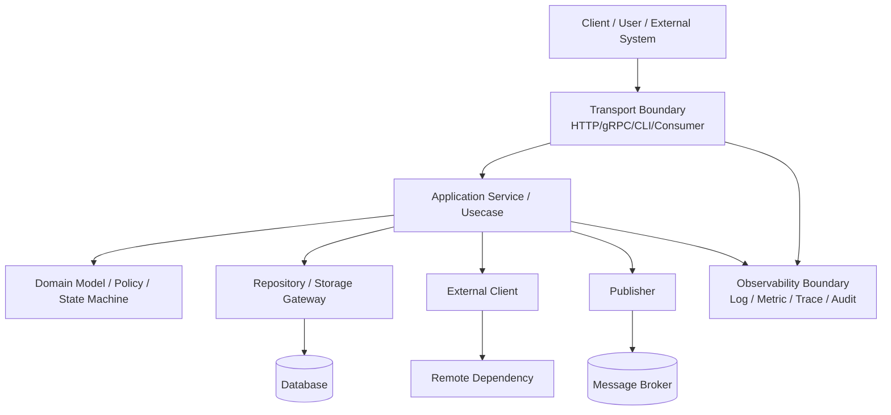
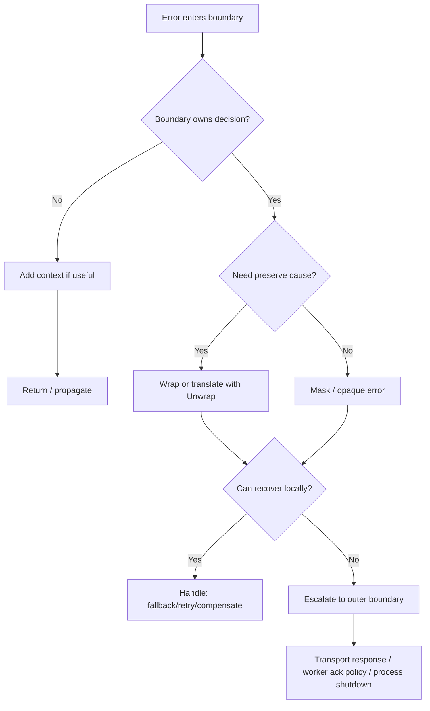
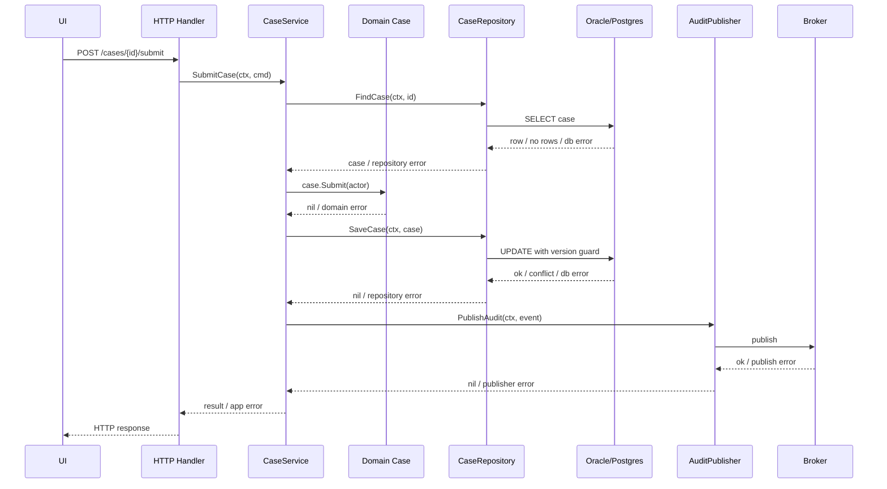
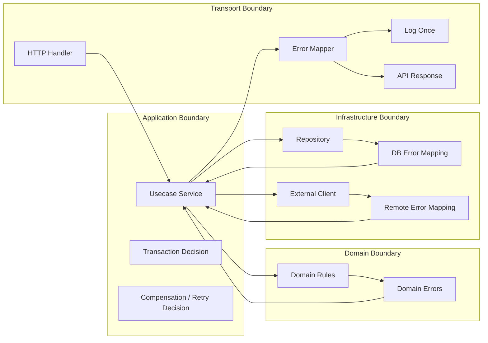

# learn-go-reliability-error-handling-part-006.md

# Part 006 — Error Boundary: Di Mana Error Diputuskan, Diterjemahkan, atau Dibiarkan Naik

> Seri: `learn-go-reliability-error-handling`  
> Target pembaca: Java software engineer yang ingin membangun intuisi reliability Go sampai level production engineering handbook.  
> Fokus part ini: memahami **boundary** sebagai titik keputusan error: kapan error dibungkus, diterjemahkan, disembunyikan, dilog, dipetakan ke response, memicu retry, rollback, compensation, alert, atau dibiarkan naik.

---

## 0. Posisi Part Ini dalam Seri

Sebelumnya:

- Part 000 membangun mental model besar: fault, error, failure, incident, outage, reliability.
- Part 001 membahas filosofi Go: error sebagai value dan API surface.
- Part 002 membahas taxonomy failure/error.
- Part 003 membahas bentuk error: plain, sentinel, typed, opaque.
- Part 004 membahas wrapping, chain, `errors.Is`, `errors.As`, `errors.Join`.
- Part 005 membahas desain pesan error tanpa noise.

Part ini menjawab pertanyaan arsitektural yang biasanya membedakan engineer biasa dan engineer production-grade:

> “Di layer mana sebuah error harus diputuskan maknanya?”

Karena error handling yang buruk jarang disebabkan oleh kurang tahu syntax. Biasanya masalahnya adalah **boundary decision** yang kacau:

- repository langsung tahu HTTP status,
- handler tahu detail SQL,
- service logging berkali-kali,
- external client membocorkan provider error ke domain,
- setiap layer menerjemahkan error dengan cara sendiri,
- retry dilakukan di tempat yang salah,
- cancellation dikira error bisnis,
- panic ditelan di worker tanpa sinyal operasional,
- domain rule violation diperlakukan seperti `500 Internal Server Error`.

Part ini akan membuat model yang jelas agar setiap layer tahu tanggung jawabnya.

---

## 1. Definisi: Apa Itu Error Boundary?

**Error boundary** adalah titik dalam sistem di mana error melewati batas tanggung jawab, abstraksi, ownership, atau protokol.

Boundary bukan hanya batas package. Boundary bisa berupa:

1. Batas antar layer kode.
2. Batas antar process/service.
3. Batas antar protocol.
4. Batas antar trust zone.
5. Batas antar lifecycle.
6. Batas antar ownership team.
7. Batas antar user-facing contract dan internal implementation.

Contoh boundary:

```text
HTTP request -> handler -> service/usecase -> repository -> database
                      \-> external client -> remote API
                      \-> publisher -> message broker
```

Pada setiap panah, error bisa:

- diteruskan apa adanya,
- dibungkus dengan context,
- diterjemahkan ke error domain,
- dinormalisasi,
- digabung,
- diklasifikasikan,
- diubah menjadi response,
- diubah menjadi retry decision,
- diubah menjadi audit event,
- diubah menjadi metric/log/trace,
- dihentikan sebagai panic/fatal,
- dikonversi menjadi fallback/degraded result.

Kesalahan umum adalah mengira semua layer bebas melakukan semua keputusan tersebut.

Tidak. Dalam sistem yang sehat, setiap boundary punya mandat yang sempit.

---

## 2. Prinsip Utama: Low-Level Menjelaskan, High-Level Memutuskan

Rule utama:

> Layer bawah menambahkan **context penyebab**. Layer atas membuat **keputusan sistem**.

Dengan kata lain:

- Repository tahu operasi database apa yang gagal.
- External client tahu remote dependency mana yang gagal.
- Service/usecase tahu operasi bisnis apa yang sedang dijalankan.
- Handler tahu protocol response apa yang harus dikirim.
- Main/lifecycle tahu apakah proses harus shutdown atau crash.
- Observability boundary tahu bagaimana error dilog, dimetric, dan dialert.

Layer bawah tidak seharusnya tahu terlalu banyak tentang layer atas.

Buruk:

```go
func (r *CaseRepository) FindCase(ctx context.Context, id CaseID) (*Case, int, error) {
    row := r.db.QueryRowContext(ctx, `select ...`, id)

    var c Case
    if err := row.Scan(&c.ID, &c.Status); err != nil {
        if errors.Is(err, sql.ErrNoRows) {
            return nil, http.StatusNotFound, fmt.Errorf("case not found")
        }
        return nil, http.StatusInternalServerError, fmt.Errorf("database error")
    }

    return &c, http.StatusOK, nil
}
```

Masalah:

- Repository bocor ke HTTP.
- Tidak reusable untuk worker, CLI, gRPC, batch job.
- Error context hilang.
- Policy response dicampur dengan storage access.

Lebih sehat:

```go
var ErrCaseNotFound = errors.New("case not found")

func (r *CaseRepository) FindCase(ctx context.Context, id CaseID) (*Case, error) {
    row := r.db.QueryRowContext(ctx, `select ...`, id)

    var c Case
    if err := row.Scan(&c.ID, &c.Status); err != nil {
        if errors.Is(err, sql.ErrNoRows) {
            return nil, ErrCaseNotFound
        }
        return nil, fmt.Errorf("query case %s: %w", id, err)
    }

    return &c, nil
}
```

Lalu service/handler yang memutuskan:

```go
func (h *CaseHandler) GetCase(w http.ResponseWriter, r *http.Request) error {
    ctx := r.Context()
    id := CaseID(r.PathValue("id"))

    c, err := h.service.GetCase(ctx, id)
    if err != nil {
        return err
    }

    return writeJSON(w, http.StatusOK, c)
}

func mapHTTPError(err error) APIError {
    switch {
    case errors.Is(err, ErrCaseNotFound):
        return APIError{Status: http.StatusNotFound, Code: "CASE_NOT_FOUND"}
    default:
        return APIError{Status: http.StatusInternalServerError, Code: "INTERNAL_ERROR"}
    }
}
```

---

## 3. Boundary sebagai Kontrak Abstraksi

Sebuah boundary menentukan apa yang boleh diketahui caller.

Pertanyaan desain:

```text
Apakah caller boleh tahu penyebab konkret error ini?
Apakah caller hanya butuh tahu kategori error?
Apakah caller boleh melakukan retry?
Apakah caller boleh membedakan not found vs forbidden?
Apakah caller boleh melihat dependency name?
Apakah caller boleh melihat SQL/provider detail?
Apakah error ini menjadi API contract publik?
```

Jawaban pertanyaan itu menentukan bentuk error.

### 3.1 Boundary yang Membuka Detail

Cocok untuk boundary internal yang caller-nya memang butuh detail.

Contoh repository internal:

```go
return nil, fmt.Errorf("query active case by id %s: %w", id, err)
```

Detail operasi berguna untuk debugging.

### 3.2 Boundary yang Menyembunyikan Detail

Cocok untuk user-facing/API/public SDK/security boundary.

Contoh:

```go
if err != nil {
    h.logger.ErrorContext(ctx, "submit case failed", "err", err, "case_id", caseID)
    writeProblem(w, http.StatusInternalServerError, "INTERNAL_ERROR", "request could not be completed")
    return
}
```

User tidak perlu tahu:

- SQL query,
- table name,
- Redis key,
- internal dependency hostname,
- IAM role,
- credential provider,
- stack trace.

### 3.3 Boundary yang Menerjemahkan Makna

Storage error bisa menjadi domain error:

```go
if errors.Is(err, repository.ErrDuplicateKey) {
    return nil, domain.ErrDuplicateSubmission
}
```

External provider `404` bisa menjadi domain `ErrAddressNotFound`.

Database unique constraint bisa menjadi `ErrCaseAlreadyExists`.

Message broker publish failure bisa menjadi `ErrSideEffectNotRecorded` atau menyebabkan rollback tergantung arsitektur.

---

## 4. Layer-Layer Umum dalam Go Service

Kita pakai model sederhana namun production-realistic:



Setiap layer punya tanggung jawab error berbeda.

---

## 5. Transport Boundary: HTTP/gRPC/CLI/Consumer

Transport boundary adalah tempat error internal diterjemahkan menjadi protocol contract.

Untuk HTTP:

- status code,
- response body,
- headers,
- correlation id,
- retry hint,
- rate-limit hint,
- safe user message.

Untuk gRPC:

- `codes.Code`,
- status message,
- details,
- metadata,
- retry semantics.

Untuk CLI:

- exit code,
- stderr message,
- human-readable instruction,
- machine-readable output mode.

Untuk message consumer:

- ack,
- nack,
- requeue,
- dead letter,
- retry topic,
- stop consumer.

Transport boundary adalah tempat yang tepat untuk mapping, bukan repository.

### 5.1 Handler Error Adapter Pattern

Karena `net/http.HandlerFunc` tidak return error, banyak code Go membuat adapter:

```go
type HandlerFunc func(http.ResponseWriter, *http.Request) error

func Adapt(logger *slog.Logger, fn HandlerFunc) http.HandlerFunc {
    return func(w http.ResponseWriter, r *http.Request) {
        err := fn(w, r)
        if err == nil {
            return
        }

        apiErr := MapError(err)

        logger.ErrorContext(r.Context(), "request failed",
            "method", r.Method,
            "path", r.URL.Path,
            "status", apiErr.Status,
            "code", apiErr.Code,
            "err", err,
        )

        writeProblem(w, apiErr)
    }
}
```

Keuntungan:

- Handler tetap bersih.
- Logging centralized.
- Mapping centralized.
- Tidak double log.
- HTTP detail tidak bocor ke service/repository.

### 5.2 Handler Tidak Harus Mengetahui SQL

Buruk:

```go
if errors.Is(err, sql.ErrNoRows) {
    http.Error(w, "not found", http.StatusNotFound)
    return
}
```

Kenapa buruk?

- Handler jadi bergantung pada storage implementation.
- Kalau repository ganti dari SQL ke API, handler berubah.
- Domain semantics tidak eksplisit.

Lebih baik:

```go
if errors.Is(err, caseapp.ErrCaseNotFound) {
    return APIError{Status: http.StatusNotFound, Code: "CASE_NOT_FOUND"}
}
```

---

## 6. Application Service / Usecase Boundary

Application service adalah boundary antara transport dan domain/infrastructure.

Tugasnya:

- mengorkestrasi flow,
- memanggil domain policy,
- memanggil repository/external client,
- mengelola transaction boundary,
- menerjemahkan infrastructure error tertentu menjadi application/domain error,
- mempertahankan invariant usecase,
- menentukan rollback/compensation,
- menambahkan context operasi bisnis.

Contoh:

```go
func (s *CaseService) SubmitCase(ctx context.Context, cmd SubmitCaseCommand) (*SubmissionResult, error) {
    c, err := s.repo.FindCase(ctx, cmd.CaseID)
    if err != nil {
        if errors.Is(err, repository.ErrNotFound) {
            return nil, ErrCaseNotFound
        }
        return nil, fmt.Errorf("submit case %s: load case: %w", cmd.CaseID, err)
    }

    if err := c.Submit(cmd.ActorID, cmd.Now); err != nil {
        return nil, fmt.Errorf("submit case %s: apply domain rule: %w", cmd.CaseID, err)
    }

    if err := s.repo.SaveCase(ctx, c); err != nil {
        if errors.Is(err, repository.ErrConflict) {
            return nil, ErrCaseVersionConflict
        }
        return nil, fmt.Errorf("submit case %s: save case: %w", cmd.CaseID, err)
    }

    return &SubmissionResult{CaseID: c.ID, Status: c.Status}, nil
}
```

Yang dilakukan service:

- `repository.ErrNotFound` diterjemahkan ke `ErrCaseNotFound`.
- `repository.ErrConflict` diterjemahkan ke `ErrCaseVersionConflict`.
- Error lain dibungkus dengan context usecase.
- Service tidak tahu HTTP status.

### 6.1 Application Boundary Boleh Menambah Business Context

Repository tahu `query case`.

Service tahu `submit case`.

Maka wrapping bertingkat masuk akal:

```text
submit case CASE-123: load case: query case CASE-123: driver: connection reset
```

Ini jauh lebih berguna daripada:

```text
failed to failed to failed to connection reset
```

---

## 7. Domain Boundary

Domain layer idealnya tidak peduli HTTP, SQL, Redis, Kafka, gRPC.

Domain error harus menyatakan pelanggaran aturan domain:

- state transition invalid,
- actor tidak punya authority domain,
- policy belum terpenuhi,
- entity sudah final,
- deadline bisnis terlewati,
- duplicate action,
- invariant rusak.

Contoh:

```go
var ErrInvalidCaseTransition = errors.New("invalid case transition")

type InvalidTransitionError struct {
    CaseID CaseID
    From   CaseStatus
    To     CaseStatus
    Rule   string
}

func (e *InvalidTransitionError) Error() string {
    return fmt.Sprintf("invalid case transition from %s to %s", e.From, e.To)
}

func (e *InvalidTransitionError) Is(target error) bool {
    return target == ErrInvalidCaseTransition
}
```

Domain method:

```go
func (c *Case) TransitionTo(target CaseStatus, actor ActorID) error {
    if !allowed(c.Status, target) {
        return &InvalidTransitionError{
            CaseID: c.ID,
            From:   c.Status,
            To:     target,
            Rule:   "CASE_STATE_TRANSITION_V3",
        }
    }
    c.Status = target
    return nil
}
```

Domain tidak memutuskan:

- HTTP `409` atau `422`,
- log level,
- JSON response,
- database rollback,
- retry.

Domain hanya menyatakan: “aturan domain ini dilanggar.”

---

## 8. Repository Boundary

Repository boundary mengubah storage primitive menjadi repository contract.

Storage primitive:

- `sql.ErrNoRows`,
- unique constraint violation,
- deadlock,
- serialization failure,
- connection refused,
- context deadline,
- driver-specific error,
- scan error,
- data conversion error.

Repository contract:

- `ErrNotFound`,
- `ErrConflict`,
- `ErrDuplicate`,
- `ErrDataIntegrity`,
- wrapped dependency error.

Contoh:

```go
package repository

var (
    ErrNotFound      = errors.New("not found")
    ErrConflict      = errors.New("conflict")
    ErrDuplicate     = errors.New("duplicate")
    ErrDataIntegrity = errors.New("data integrity violation")
)
```

Repository implementation:

```go
func (r *SQLCaseRepository) Save(ctx context.Context, c *Case) error {
    res, err := r.db.ExecContext(ctx, `
        update cases
        set status = ?, version = version + 1
        where id = ? and version = ?
    `, c.Status, c.ID, c.Version)
    if err != nil {
        if isUniqueViolation(err) {
            return fmt.Errorf("save case %s: %w", c.ID, ErrDuplicate)
        }
        if isDataIntegrityViolation(err) {
            return fmt.Errorf("save case %s: %w", c.ID, ErrDataIntegrity)
        }
        return fmt.Errorf("save case %s: %w", c.ID, err)
    }

    affected, err := res.RowsAffected()
    if err != nil {
        return fmt.Errorf("save case %s: inspect rows affected: %w", c.ID, err)
    }
    if affected == 0 {
        return fmt.Errorf("save case %s: %w", c.ID, ErrConflict)
    }

    return nil
}
```

Catatan penting:

- Repository boleh expose repository-level sentinel.
- Repository sebaiknya tidak expose driver-specific error sebagai contract publik package.
- Error driver tetap boleh di-wrap agar debugging root cause tidak hilang.

---

## 9. External Client Boundary

External client boundary mirip repository, tetapi dependency-nya remote system.

Remote error primitive:

- HTTP status remote,
- gRPC status remote,
- timeout,
- connection reset,
- TLS error,
- DNS error,
- malformed response,
- authentication failure,
- rate limit,
- provider-specific error code.

Client contract internal:

- `ErrRemoteUnavailable`,
- `ErrRemoteRateLimited`,
- `ErrRemoteUnauthorized`,
- `ErrRemoteBadResponse`,
- `ErrAddressNotFound`,
- typed dependency error dengan retryability.

Contoh:

```go
var (
    ErrDependencyUnavailable = errors.New("dependency unavailable")
    ErrDependencyRateLimited = errors.New("dependency rate limited")
    ErrDependencyBadResponse = errors.New("dependency bad response")
)

type DependencyError struct {
    Dependency string
    Operation  string
    StatusCode int
    Retryable  bool
    Cause      error
}

func (e *DependencyError) Error() string {
    if e.StatusCode != 0 {
        return fmt.Sprintf("%s %s failed with status %d", e.Dependency, e.Operation, e.StatusCode)
    }
    return fmt.Sprintf("%s %s failed", e.Dependency, e.Operation)
}

func (e *DependencyError) Unwrap() error { return e.Cause }
```

Client mapping:

```go
func (c *AddressClient) Lookup(ctx context.Context, postalCode string) (*Address, error) {
    req, err := http.NewRequestWithContext(ctx, http.MethodGet, c.url(postalCode), nil)
    if err != nil {
        return nil, fmt.Errorf("build address lookup request: %w", err)
    }

    resp, err := c.http.Do(req)
    if err != nil {
        return nil, &DependencyError{
            Dependency: "address-api",
            Operation:  "lookup address",
            Retryable:  isNetworkRetryable(err),
            Cause:      err,
        }
    }
    defer resp.Body.Close()

    switch resp.StatusCode {
    case http.StatusOK:
        // decode body
    case http.StatusNotFound:
        return nil, ErrAddressNotFound
    case http.StatusTooManyRequests:
        return nil, fmt.Errorf("lookup address: %w", ErrDependencyRateLimited)
    case http.StatusServiceUnavailable, http.StatusBadGateway, http.StatusGatewayTimeout:
        return nil, &DependencyError{
            Dependency: "address-api",
            Operation:  "lookup address",
            StatusCode: resp.StatusCode,
            Retryable:  true,
        }
    default:
        return nil, &DependencyError{
            Dependency: "address-api",
            Operation:  "lookup address",
            StatusCode: resp.StatusCode,
            Retryable:  false,
        }
    }

    return decodeAddress(resp.Body)
}
```

External provider detail tidak langsung bocor ke domain atau HTTP response.

---

## 10. Observability Boundary: Log, Metric, Trace, Audit

Error boundary juga menentukan kapan error diamati.

Prinsip:

> Jangan log error di setiap layer. Tambahkan context di layer bawah, log sekali di boundary operasional.

Boundary operasional biasanya:

- HTTP adapter,
- gRPC interceptor,
- worker loop,
- scheduler runner,
- CLI command root,
- main lifecycle,
- panic recovery middleware.

Buruk:

```go
func repo() error {
    err := query()
    if err != nil {
        log.Println("query failed", err)
        return err
    }
    return nil
}

func service() error {
    err := repo()
    if err != nil {
        log.Println("service failed", err)
        return err
    }
    return nil
}

func handler() {
    err := service()
    if err != nil {
        log.Println("request failed", err)
    }
}
```

Hasil:

- log duplikat,
- noise,
- alert palsu,
- sulit menghitung error rate,
- biaya logging naik,
- context bisa tidak konsisten.

Lebih baik:

```go
func repo() error {
    if err := query(); err != nil {
        return fmt.Errorf("query case: %w", err)
    }
    return nil
}

func service() error {
    if err := repo(); err != nil {
        return fmt.Errorf("submit case: %w", err)
    }
    return nil
}

func handlerBoundary(ctx context.Context) {
    if err := service(); err != nil {
        logger.ErrorContext(ctx, "request failed", "err", err)
    }
}
```

### 10.1 Metric Boundary

Metric label tidak boleh memakai raw `err.Error()`.

Buruk:

```go
errors_total{error="query case CASE-123: dial tcp 10.0.1.7:5432: connect: connection refused"}
```

Masalah:

- cardinality tinggi,
- metric backend meledak,
- tidak agregat,
- bocor detail internal.

Lebih baik:

```text
errors_total{class="dependency", dependency="postgres", operation="submit_case"}
```

atau:

```text
api_requests_total{status="500", error_code="INTERNAL_ERROR"}
```

### 10.2 Audit Boundary

Audit berbeda dari log.

Log menjawab:

```text
Apa yang terjadi secara teknis?
```

Audit menjawab:

```text
Siapa melakukan apa, pada entity apa, kapan, dengan outcome apa, dan alasan bisnis/regulasi apa?
```

Audit tidak boleh hanya berisi raw Go error.

Buruk:

```text
activity=submit_case outcome=failed reason="sql: no rows in result set"
```

Lebih baik:

```text
activity=submit_case
outcome=rejected
reason_code=CASE_NOT_FOUND
actor=officer-123
case_id=CASE-999
policy=CASE_SUBMISSION_POLICY_V2
```

---

## 11. Boundary Keputusan: Wrap, Translate, Mask, Handle, or Escalate

Setiap error yang masuk boundary punya lima kemungkinan utama.



### 11.1 Wrap

Gunakan wrap saat:

- caller masih perlu root cause,
- `errors.Is/As` harus tetap bekerja,
- context operasi perlu ditambahkan.

```go
return fmt.Errorf("approve case %s: load applicant profile: %w", caseID, err)
```

### 11.2 Translate

Gunakan translate saat:

- low-level error harus menjadi error level atas,
- abstraction tidak boleh bocor,
- caller butuh kategori/domain yang stabil.

```go
if errors.Is(err, repository.ErrNotFound) {
    return ErrCaseNotFound
}
```

Atau translate sambil preserve cause:

```go
return &CaseNotFoundError{CaseID: id, Cause: err}
```

### 11.3 Mask

Gunakan mask saat:

- detail internal sensitif,
- caller tidak boleh membedakan kondisi tertentu,
- security boundary perlu mencegah enumeration.

Contoh login:

```go
if err != nil {
    return ErrInvalidCredentials
}
```

Jangan return:

```text
user not found
password hash mismatch
account locked due to AML policy
```

ke boundary publik tanpa pertimbangan security.

### 11.4 Handle

Handle berarti error tidak dinaikkan karena boundary bisa menyelesaikan.

Contoh:

- retry dependency transient,
- fallback ke cache,
- skip invalid optional enrichment,
- default optional config,
- compensate partial action,
- nack message untuk redelivery.

### 11.5 Escalate

Escalate berarti boundary tidak punya cukup informasi atau mandat.

```go
return fmt.Errorf("process renewal %s: %w", renewalID, err)
```

---

## 12. Mapping Error Boundary dalam Case Management System

Misal ada operasi:

```text
Officer submit enforcement case
```

Flow:



Boundary decisions:

| Boundary | Error masuk | Keputusan benar |
|---|---|---|
| DB -> Repository | `sql.ErrNoRows` | Translate ke `repository.ErrNotFound` |
| DB -> Repository | unique/version conflict | Translate ke `repository.ErrConflict` |
| Repository -> Service | `repository.ErrNotFound` | Translate ke `caseapp.ErrCaseNotFound` |
| Domain -> Service | `InvalidTransitionError` | Preserve sebagai domain error |
| Service -> Audit Publisher | publish gagal | Tergantung consistency model: rollback/outbox/degraded |
| Service -> Handler | domain/app error | Handler map ke HTTP |
| Handler -> UI | internal error | Mask sebagai `INTERNAL_ERROR` |
| Handler -> Log | full error chain | Log structured dengan correlation id |
| Handler -> Metric | classified error | Metric by code/class/status, bukan raw string |
| Handler -> Audit | user action failed/succeeded | Audit reason code, bukan stack trace |

---

## 13. Boundary dan Retry Decision

Retry harus diputuskan di boundary yang memahami:

- apakah operasi idempotent,
- apakah side effect sudah terjadi,
- apakah error transient,
- apakah masih ada budget waktu,
- apakah retry akan memperburuk overload,
- apakah caller lebih tepat melakukan retry.

Repository tidak selalu tempat terbaik untuk retry.

External client bisa melakukan retry untuk transport transient yang aman.

Service bisa melakukan retry untuk optimistic conflict tertentu.

Handler biasanya tidak retry database write sembarangan.

Message consumer bisa retry dengan redelivery/DLQ policy.

### 13.1 Retry di External Client

Cocok untuk:

- GET idempotent,
- remote `503`,
- connection reset sebelum response,
- DNS/network transient,
- bounded retry dengan context deadline.

### 13.2 Retry di Service

Cocok untuk:

- optimistic locking conflict jika business operation bisa diulang secara deterministik,
- transaction serialization failure,
- compare-and-swap style updates.

### 13.3 Retry di Worker/Queue Boundary

Cocok untuk:

- async processing,
- side effect idempotent,
- ack/nack semantics jelas,
- retry count dan DLQ tersedia.

### 13.4 Jangan Retry di Tempat Buta

Buruk:

```go
func Save(ctx context.Context, c *Case) error {
    for i := 0; i < 3; i++ {
        if err := saveOnce(ctx, c); err == nil {
            return nil
        }
    }
    return err
}
```

Masalah:

- retry semua error, termasuk validation/data corruption,
- tidak cek context deadline,
- tidak pakai backoff,
- bisa menggandakan side effect,
- caller tidak tahu retry sudah dilakukan,
- bisa membuat latency membengkak.

---

## 14. Boundary dan Transaction Decision

Transaction boundary biasanya berada di application service, bukan di repository method kecil-kecil.

Kenapa?

Karena service tahu unit of work.

Contoh buruk:

```go
func (r *Repo) SaveCase(ctx context.Context, c *Case) error {
    tx, _ := r.db.BeginTx(ctx, nil)
    defer tx.Rollback()
    // update case
    return tx.Commit()
}

func (r *Repo) InsertAudit(ctx context.Context, a Audit) error {
    tx, _ := r.db.BeginTx(ctx, nil)
    defer tx.Rollback()
    // insert audit
    return tx.Commit()
}
```

Jika usecase butuh save case dan audit atomik, ini gagal karena dua transaction terpisah.

Lebih baik:

```go
func (s *CaseService) SubmitCase(ctx context.Context, cmd SubmitCaseCommand) error {
    return s.txRunner.Run(ctx, func(ctx context.Context, tx Tx) error {
        c, err := s.caseRepo.WithTx(tx).Find(ctx, cmd.CaseID)
        if err != nil {
            return fmt.Errorf("load case: %w", err)
        }

        if err := c.Submit(cmd.ActorID, cmd.Now); err != nil {
            return fmt.Errorf("submit case domain rule: %w", err)
        }

        if err := s.caseRepo.WithTx(tx).Save(ctx, c); err != nil {
            return fmt.Errorf("save case: %w", err)
        }

        if err := s.auditRepo.WithTx(tx).Insert(ctx, AuditFromCase(c)); err != nil {
            return fmt.Errorf("insert audit: %w", err)
        }

        return nil
    })
}
```

Transaction runner boundary:

```go
func (r *TxRunner) Run(ctx context.Context, fn func(context.Context, Tx) error) error {
    tx, err := r.db.BeginTx(ctx, nil)
    if err != nil {
        return fmt.Errorf("begin transaction: %w", err)
    }

    committed := false
    defer func() {
        if !committed {
            _ = tx.Rollback()
        }
    }()

    if err := fn(ctx, tx); err != nil {
        return err
    }

    if err := tx.Commit(); err != nil {
        return fmt.Errorf("commit transaction: %w", err)
    }

    committed = true
    return nil
}
```

Catatan:

- rollback error jarang menggantikan primary error,
- commit error adalah ambiguous outcome untuk beberapa database/situasi,
- service perlu tahu apakah commit sukses sebelum publish side effect eksternal.

---

## 15. Boundary dan Cancellation/Timeout

`context.Canceled` dan `context.DeadlineExceeded` memiliki makna khusus.

Boundary harus hati-hati membedakannya dari failure biasa.

### 15.1 Request Canceled oleh Client

Jika client disconnect:

- bukan selalu bug server,
- tidak selalu perlu alert,
- bisa log level debug/info,
- metric bisa class `client_canceled`,
- jangan retry otomatis.

### 15.2 Deadline Exceeded

Deadline exceeded bisa berarti:

- dependency lambat,
- server overloaded,
- timeout terlalu kecil,
- query tidak optimal,
- lock contention,
- downstream outage.

Tidak cukup hanya menulis:

```text
context deadline exceeded
```

Perlu context boundary:

```go
return fmt.Errorf("lookup address: %w", err)
```

Sehingga terlihat:

```text
submit case CASE-123: enrich address: lookup address: context deadline exceeded
```

### 15.3 Jangan Mengubah Cancellation Menjadi Internal Error Sembarangan

Buruk:

```go
if err != nil {
    return fmt.Errorf("database failed: %w", err)
}
```

Lalu handler map semua ke `500`.

Lebih baik classifier tahu:

```go
switch {
case errors.Is(err, context.Canceled):
    return ErrorClassClientCanceled
case errors.Is(err, context.DeadlineExceeded):
    return ErrorClassTimeout
}
```

`context` package mendefinisikan `Canceled` untuk context yang dibatalkan dan `DeadlineExceeded` untuk deadline yang lewat. Dengan `context.Cause`, boundary juga bisa membaca penyebab cancellation yang lebih spesifik ketika menggunakan cancel cause.

---

## 16. Boundary dan Panic

Panic adalah boundary berbeda dari error return.

Panic tidak boleh dipakai sebagai normal business flow.

Boundary panic yang umum:

- HTTP recovery middleware,
- worker loop recovery,
- goroutine supervisor,
- main init fatal boundary,
- test boundary.

### 16.1 HTTP Panic Boundary

```go
func Recover(next http.Handler, logger *slog.Logger) http.Handler {
    return http.HandlerFunc(func(w http.ResponseWriter, r *http.Request) {
        defer func() {
            if v := recover(); v != nil {
                logger.ErrorContext(r.Context(), "panic recovered",
                    "panic", v,
                    "method", r.Method,
                    "path", r.URL.Path,
                )
                writeProblem(w, APIError{
                    Status: http.StatusInternalServerError,
                    Code:   "INTERNAL_ERROR",
                    Message: "request could not be completed",
                })
            }
        }()

        next.ServeHTTP(w, r)
    })
}
```

Catatan:

- Recovery mencegah satu request membunuh process.
- Tapi panic tetap sinyal bug serius.
- Jangan diam-diam swallow panic tanpa log/metric.
- Jika panic terjadi setelah response partial tertulis, response tidak bisa diperbaiki.

### 16.2 Worker Panic Boundary

```go
func (w *Worker) runJob(ctx context.Context, job Job) {
    defer func() {
        if v := recover(); v != nil {
            w.logger.ErrorContext(ctx, "job panic recovered",
                "job_id", job.ID,
                "panic", v,
            )
            w.metrics.JobPanics.Add(ctx, 1)
            w.nack(job, RequeueOrDLQ)
        }
    }()

    if err := w.process(ctx, job); err != nil {
        w.handleJobError(ctx, job, err)
    }
}
```

Worker boundary harus memutuskan:

- ack?
- nack?
- requeue?
- DLQ?
- stop worker?
- crash process?

---

## 17. Boundary dan Security

Security boundary sering membutuhkan masking.

Contoh login:

Internal kemungkinan error:

- user not found,
- password mismatch,
- account locked,
- MFA required,
- password expired,
- identity provider unavailable,
- hash algorithm unsupported,
- rate limited.

Public response tidak boleh membocorkan semua detail.

Mapping:

| Internal | Public |
|---|---|
| user not found | invalid credentials |
| password mismatch | invalid credentials |
| account locked | invalid credentials / account unavailable, tergantung policy |
| IdP unavailable | service temporarily unavailable |
| rate limited | too many attempts |

Security boundary bertujuan menghindari:

- user enumeration,
- policy leakage,
- internal topology leakage,
- secret leakage,
- stack trace leakage.

Namun audit internal tetap harus kaya:

```text
actor=unknown
username_hash=...
outcome=denied
reason_code=USER_NOT_FOUND
source_ip=...
correlation_id=...
```

---

## 18. Boundary dan Abstraction Leak

Abstraction leak terjadi ketika layer atas bergantung pada detail layer bawah.

Contoh leak:

```go
if strings.Contains(err.Error(), "ORA-00001") {
    return ErrDuplicate
}
```

Jika ini di handler/service, artinya Oracle detail bocor ke layer atas.

Lebih baik driver-specific parsing dikurung di repository:

```go
func isUniqueViolation(err error) bool {
    var ora *godror.Error
    if errors.As(err, &ora) {
        return ora.Code() == 1
    }
    return false
}
```

Lalu repository return:

```go
return fmt.Errorf("insert case %s: %w", c.ID, repository.ErrDuplicate)
```

Layer atas cukup:

```go
if errors.Is(err, repository.ErrDuplicate) {
    return ErrCaseAlreadyExists
}
```

---

## 19. Boundary dan Package Design

Error boundary akan lebih bersih jika package dirancang benar.

Contoh package:

```text
internal/caseapp
    service.go
    errors.go

internal/casedomain
    case.go
    errors.go

internal/caserepo
    sql_repository.go
    errors.go

internal/addressclient
    client.go
    errors.go

internal/httpapi
    handler.go
    error_mapper.go
```

### 19.1 Domain Errors

```go
package casedomain

var ErrInvalidTransition = errors.New("invalid transition")
```

### 19.2 Repository Errors

```go
package caserepo

var (
    ErrNotFound  = errors.New("not found")
    ErrConflict  = errors.New("conflict")
    ErrDuplicate = errors.New("duplicate")
)
```

### 19.3 Application Errors

```go
package caseapp

var (
    ErrCaseNotFound        = errors.New("case not found")
    ErrCaseConflict        = errors.New("case conflict")
    ErrSubmissionRejected  = errors.New("submission rejected")
)
```

### 19.4 HTTP Mapper

```go
package httpapi

func MapError(err error) APIError {
    switch {
    case errors.Is(err, caseapp.ErrCaseNotFound):
        return APIError{Status: 404, Code: "CASE_NOT_FOUND"}
    case errors.Is(err, caseapp.ErrCaseConflict):
        return APIError{Status: 409, Code: "CASE_CONFLICT"}
    case errors.Is(err, casedomain.ErrInvalidTransition):
        return APIError{Status: 422, Code: "INVALID_CASE_TRANSITION"}
    case errors.Is(err, context.Canceled):
        return APIError{Status: 499, Code: "CLIENT_CANCELED"} // internal metric/log classification; 499 is non-standard
    case errors.Is(err, context.DeadlineExceeded):
        return APIError{Status: 504, Code: "REQUEST_TIMEOUT"}
    default:
        return APIError{Status: 500, Code: "INTERNAL_ERROR"}
    }
}
```

Catatan: HTTP `499` bukan status standar Go/HTTP resmi; sering dipakai secara internal oleh proxy/logging untuk client closed request. Untuk response actual, jika client sudah disconnect, sering tidak ada response yang bisa dikirim.

---

## 20. Boundary dan Public API Stability

Begitu error menjadi public API, ia menjadi contract.

Public contract:

```json
{
  "code": "CASE_NOT_FOUND",
  "message": "case was not found",
  "correlationId": "..."
}
```

Jangan membuat public contract bergantung pada raw Go error:

```json
{
  "error": "submit case CASE-123: load case: query case CASE-123: sql: no rows in result set"
}
```

Masalah:

- implementation detail bocor,
- client bisa bergantung pada string,
- perubahan internal memecahkan client,
- security risk,
- tidak bisa dilokalisasi,
- tidak cocok untuk product UX.

Gunakan stable error code.

Internal error chain tetap dilog dengan correlation id.

---

## 21. Boundary dan Worker/Consumer Semantics

Worker boundary berbeda dari HTTP.

HTTP boundary menjawab client sekarang.

Worker boundary menjawab broker/scheduler:

- sukses -> ack,
- gagal transient -> retry/requeue,
- gagal permanent -> ack + DLQ/record failure,
- panic -> recover + DLQ/requeue/stop,
- cancellation shutdown -> stop cleanly, maybe nack/requeue,
- poison message -> DLQ.

Contoh:

```go
func (c *Consumer) handle(ctx context.Context, msg Message) {
    err := c.processor.Process(ctx, msg)
    if err == nil {
        c.ack(msg)
        return
    }

    class := Classify(err)
    c.logger.ErrorContext(ctx, "message processing failed",
        "message_id", msg.ID,
        "class", class,
        "err", err,
    )

    switch class {
    case ErrorClassValidation, ErrorClassBusinessRule:
        c.deadLetter(msg, err)
        c.ack(msg)
    case ErrorClassDependency, ErrorClassTimeout:
        c.nack(msg, RequeueWithBackoff)
    case ErrorClassCanceled:
        c.nack(msg, Requeue)
    default:
        c.deadLetter(msg, err)
        c.ack(msg)
    }
}
```

Boundary di sini tidak map ke HTTP status, tetapi ke delivery semantics.

---

## 22. Boundary dan Graceful Shutdown

Shutdown adalah lifecycle boundary.

Saat shutdown:

- request baru ditolak,
- in-flight request diberi waktu selesai,
- worker berhenti menerima job baru,
- consumer berhenti polling,
- current job selesai atau direqueue,
- telemetry di-flush,
- dependency ditutup.

Error saat shutdown perlu diklasifikasikan berbeda.

Contoh:

```go
if err := srv.Shutdown(ctx); err != nil {
    return fmt.Errorf("shutdown http server: %w", err)
}
```

`net/http` mendefinisikan `ErrServerClosed` sebagai error yang dikembalikan oleh `Serve`, `ServeTLS`, `ListenAndServe`, dan `ListenAndServeTLS` setelah `Server.Shutdown` atau `Server.Close`. Itu bukan fatal error dalam graceful shutdown path.

```go
err := srv.ListenAndServe()
if err != nil && !errors.Is(err, http.ErrServerClosed) {
    return fmt.Errorf("listen and serve: %w", err)
}
```

Boundary `main` harus tahu bahwa `ErrServerClosed` pada path shutdown adalah normal.

---

## 23. Boundary Decision Matrix

| Boundary | Boleh Wrap | Boleh Translate | Boleh Log | Boleh Response | Boleh Retry | Boleh Panic/Exit |
|---|---:|---:|---:|---:|---:|---:|
| Domain entity | Jarang | Ya, domain internal | Tidak umum | Tidak | Tidak | Panic hanya invariant impossible |
| Repository | Ya | Ya, storage -> repo error | Biasanya tidak | Tidak | Terbatas, sangat hati-hati | Tidak |
| External client | Ya | Ya, provider -> dependency error | Biasanya tidak | Tidak | Ya, untuk safe transient | Tidak |
| Application service | Ya | Ya, repo/client -> app/domain | Kadang event penting, tapi hindari duplicate | Tidak | Ya, jika tahu idempotency/unit of work | Tidak |
| HTTP handler adapter | Tidak banyak | Ya, app -> API error | Ya | Ya | Jarang | Recover panic |
| Worker boundary | Tidak banyak | Ya, app -> ack/nack/DLQ | Ya | Tidak | Ya, via retry policy | Recover/possibly stop |
| Main/lifecycle | Ya | Ya, startup/shutdown classification | Ya | Tidak | Tidak umum | Ya, fatal startup |
| Observability | Tidak | Classify | Ya | Tidak | Tidak | Tidak |

---

## 24. Anti-Patterns

### 24.1 Every Layer Logs

Gejala:

- satu error menghasilkan 5 log entry,
- on-call bingung mana source of truth,
- alert noise.

Solusi:

- log once at operational boundary,
- wrap context di layer bawah.

### 24.2 Repository Returns HTTP Status

Gejala:

```go
return nil, http.StatusNotFound, err
```

Solusi:

- repository return repository error,
- handler map ke HTTP.

### 24.3 Handler Parses SQL Error

Gejala:

```go
if strings.Contains(err.Error(), "duplicate key") { ... }
```

Solusi:

- parse driver error di repository,
- expose `ErrDuplicate`.

### 24.4 Service Swallows Root Cause

Gejala:

```go
return ErrSubmitFailed
```

Root cause hilang.

Solusi:

```go
return fmt.Errorf("submit case %s: %w", id, err)
```

atau typed error dengan `Unwrap`.

### 24.5 Public API Uses `err.Error()`

Gejala:

```go
json.NewEncoder(w).Encode(map[string]string{"error": err.Error()})
```

Solusi:

- stable API error code,
- safe message,
- correlation id.

### 24.6 Retry at Every Boundary

Gejala:

- client retries,
- API gateway retries,
- service retries,
- repository retries,
- database driver retries,
- queue retries.

Hasil: retry amplification.

Solusi:

- explicit retry ownership,
- budget propagation,
- idempotency.

### 24.7 Cancellation Treated as Server Error

Gejala:

- client disconnect menghasilkan alert 500,
- timeout semua dianggap internal bug.

Solusi:

- classify `context.Canceled` dan `context.DeadlineExceeded`.

### 24.8 Panic Recovered Silently

Gejala:

```go
defer func() { _ = recover() }()
```

Solusi:

- log panic,
- increment metric,
- decide crash/recover policy.

---

## 25. Production-Grade Error Boundary Skeleton

Berikut skeleton sederhana untuk menyatukan konsep.

### 25.1 Application Error

```go
package caseapp

import "errors"

var (
    ErrCaseNotFound       = errors.New("case not found")
    ErrCaseConflict       = errors.New("case conflict")
    ErrInvalidTransition  = errors.New("invalid case transition")
    ErrDependencyFailure  = errors.New("dependency failure")
)
```

### 25.2 Service

```go
func (s *Service) Submit(ctx context.Context, cmd SubmitCommand) (*SubmitResult, error) {
    c, err := s.repo.Find(ctx, cmd.CaseID)
    if err != nil {
        if errors.Is(err, caserepo.ErrNotFound) {
            return nil, ErrCaseNotFound
        }
        return nil, fmt.Errorf("submit case %s: find case: %w", cmd.CaseID, err)
    }

    if err := c.Submit(cmd.ActorID); err != nil {
        if errors.Is(err, casedomain.ErrInvalidTransition) {
            return nil, fmt.Errorf("submit case %s: %w", cmd.CaseID, ErrInvalidTransition)
        }
        return nil, fmt.Errorf("submit case %s: apply domain rule: %w", cmd.CaseID, err)
    }

    if err := s.repo.Save(ctx, c); err != nil {
        if errors.Is(err, caserepo.ErrConflict) {
            return nil, ErrCaseConflict
        }
        return nil, fmt.Errorf("submit case %s: save case: %w", cmd.CaseID, err)
    }

    return &SubmitResult{CaseID: c.ID}, nil
}
```

### 25.3 HTTP Error Mapper

```go
type APIError struct {
    Status  int
    Code    string
    Message string
}

func MapError(err error) APIError {
    switch {
    case errors.Is(err, caseapp.ErrCaseNotFound):
        return APIError{http.StatusNotFound, "CASE_NOT_FOUND", "case was not found"}
    case errors.Is(err, caseapp.ErrCaseConflict):
        return APIError{http.StatusConflict, "CASE_CONFLICT", "case was modified by another operation"}
    case errors.Is(err, caseapp.ErrInvalidTransition):
        return APIError{http.StatusUnprocessableEntity, "INVALID_CASE_TRANSITION", "case cannot be submitted in its current state"}
    case errors.Is(err, context.DeadlineExceeded):
        return APIError{http.StatusGatewayTimeout, "REQUEST_TIMEOUT", "request timed out"}
    case errors.Is(err, context.Canceled):
        return APIError{499, "CLIENT_CANCELED", "request was canceled"}
    default:
        return APIError{http.StatusInternalServerError, "INTERNAL_ERROR", "request could not be completed"}
    }
}
```

### 25.4 HTTP Adapter

```go
type AppHandler func(http.ResponseWriter, *http.Request) error

func Adapt(logger *slog.Logger, next AppHandler) http.HandlerFunc {
    return func(w http.ResponseWriter, r *http.Request) {
        if err := next(w, r); err != nil {
            apiErr := MapError(err)

            logger.ErrorContext(r.Context(), "request failed",
                "method", r.Method,
                "path", r.URL.Path,
                "status", apiErr.Status,
                "code", apiErr.Code,
                "err", err,
            )

            writeProblem(w, apiErr)
        }
    }
}
```

---

## 26. Mermaid: End-to-End Boundary Map



---

## 27. Code Review Checklist

Gunakan checklist ini saat review Go service.

### 27.1 Boundary Ownership

- [ ] Apakah repository bebas dari HTTP/gRPC concern?
- [ ] Apakah handler bebas dari SQL/driver/provider detail?
- [ ] Apakah domain bebas dari transport/infrastructure concern?
- [ ] Apakah service menjadi orchestration boundary yang jelas?
- [ ] Apakah transaction boundary berada di tempat yang memahami unit of work?

### 27.2 Error Contract

- [ ] Apakah error yang diexpose package adalah contract yang memang ingin dijaga?
- [ ] Apakah low-level error diterjemahkan ke domain/application error di boundary yang tepat?
- [ ] Apakah root cause tetap tersedia jika dibutuhkan debugging?
- [ ] Apakah public API tidak memakai raw `err.Error()`?
- [ ] Apakah error code stabil dan terdokumentasi?

### 27.3 Observability

- [ ] Apakah error hanya dilog sekali di operational boundary?
- [ ] Apakah metric menggunakan bounded label?
- [ ] Apakah correlation id tersedia?
- [ ] Apakah audit event memakai reason code, bukan raw stack/error?
- [ ] Apakah cancellation/timeout diklasifikasikan benar?

### 27.4 Reliability Decision

- [ ] Apakah retry ownership eksplisit?
- [ ] Apakah retry hanya untuk operasi yang aman/idempotent?
- [ ] Apakah timeout budget dipertahankan lewat context?
- [ ] Apakah worker error dipetakan ke ack/nack/DLQ?
- [ ] Apakah shutdown error dibedakan dari runtime failure?

### 27.5 Security

- [ ] Apakah sensitive internal detail dimask di public boundary?
- [ ] Apakah authentication error tidak membocorkan user enumeration?
- [ ] Apakah dependency hostname, SQL, credential, token, payload sensitif tidak bocor?
- [ ] Apakah log/audit tetap cukup kaya untuk investigasi internal?

---

## 28. Latihan

### Latihan 1 — Refactor Boundary Leak

Diberikan kode:

```go
func (h *Handler) Get(w http.ResponseWriter, r *http.Request) {
    c, err := h.repo.Find(r.Context(), r.PathValue("id"))
    if err != nil {
        if errors.Is(err, sql.ErrNoRows) {
            http.Error(w, "not found", http.StatusNotFound)
            return
        }
        http.Error(w, err.Error(), http.StatusInternalServerError)
        return
    }
    json.NewEncoder(w).Encode(c)
}
```

Refactor agar:

- handler tidak tahu SQL,
- API tidak expose raw error,
- repository punya contract,
- logging ada di boundary adapter,
- response punya stable error code.

### Latihan 2 — Tentukan Boundary Retry

Untuk operasi:

```text
Submit case -> update DB -> publish audit event -> call external notification API
```

Tentukan:

- error mana yang boleh retry,
- retry dilakukan di layer mana,
- mana yang harus outbox,
- mana yang harus fail request,
- mana yang boleh async degraded.

### Latihan 3 — Buat Error Mapper

Buat `MapError(err error) APIError` untuk error:

- `ErrCaseNotFound`,
- `ErrInvalidTransition`,
- `ErrDuplicateSubmission`,
- `ErrUnauthorizedActor`,
- `context.Canceled`,
- `context.DeadlineExceeded`,
- dependency rate limited,
- unknown internal.

### Latihan 4 — Worker Boundary

Desain worker consumer untuk import file besar:

- invalid row,
- malformed file,
- DB timeout,
- duplicate row,
- context canceled karena shutdown,
- panic saat transform.

Tentukan ack/nack/DLQ dan audit/log behavior.

---

## 29. Ringkasan Mental Model

Error boundary adalah tempat sistem mengubah error dari “sesuatu gagal” menjadi keputusan yang lebih spesifik:

```text
Apa maknanya?
Siapa yang boleh tahu?
Apa yang boleh dilakukan caller?
Apakah perlu retry?
Apakah perlu rollback?
Apakah perlu response?
Apakah perlu alert?
Apakah perlu audit?
Apakah perlu crash?
```

Rule praktis:

1. **Domain** menyatakan rule/invariant.
2. **Repository/client** menerjemahkan dependency primitive ke contract internal.
3. **Service/usecase** mengorkestrasi, menambah business context, dan memutuskan transaction/compensation.
4. **Transport boundary** mengubah error internal menjadi protocol response.
5. **Worker boundary** mengubah error internal menjadi ack/nack/DLQ/retry.
6. **Observability boundary** log sekali, metric dengan label terbatas, audit dengan reason code.
7. **Security boundary** mask detail yang tidak boleh diketahui caller.
8. **Lifecycle boundary** membedakan startup fatal, runtime failure, graceful shutdown, dan cancellation.

Engineer top-level tidak hanya bertanya:

```text
Bagaimana cara return error?
```

Tapi bertanya:

```text
Boundary mana yang berhak memberi makna pada error ini?
```

---

## 30. Referensi

- Go package `errors`: `errors.Is`, `errors.As`, wrapping, `Unwrap`, joined errors.
- Go package `context`: cancellation, deadline, `context.Canceled`, `context.DeadlineExceeded`, cancel cause.
- Go package `net/http`: `Server.Shutdown`, `ErrServerClosed`, handler model.
- Go Blog: “Errors are values”.
- Go Blog: “Error handling and Go”.
- Go Blog: “Working with Errors in Go 1.13”.
- Go Wiki: Code Review Comments, especially error string guidance.
- Google SRE Book: monitoring distributed systems, alerting, cascading failure.
- AWS Builders Library: timeouts, retries, backoff, jitter, overload, static stability.
- OWASP Logging Cheat Sheet: safe logging and sensitive data handling.

---

## 31. Status Seri

Selesai:

- `learn-go-reliability-error-handling-part-000.md`
- `learn-go-reliability-error-handling-part-001.md`
- `learn-go-reliability-error-handling-part-002.md`
- `learn-go-reliability-error-handling-part-003.md`
- `learn-go-reliability-error-handling-part-004.md`
- `learn-go-reliability-error-handling-part-005.md`
- `learn-go-reliability-error-handling-part-006.md`

Belum selesai. Bagian berikutnya:

- `learn-go-reliability-error-handling-part-007.md` — Domain Error Model: Business Errors yang Tidak Tercampur dengan Infrastructure Errors


<!-- NAVIGATION_FOOTER -->
<div class="page-nav">
<a href="./learn-go-reliability-error-handling-part-005.md">⬅️ Part 005 — Error Message Design: Context Tanpa Noise</a>
<a href="./index.md">📚 Kategori</a>
<a href="../../index.md">🏠 Home</a>
<a href="./learn-go-reliability-error-handling-part-007.md">Domain Error Model: Business Errors yang Tidak Tercampur dengan Infrastructure Errors ➡️</a>
</div>
