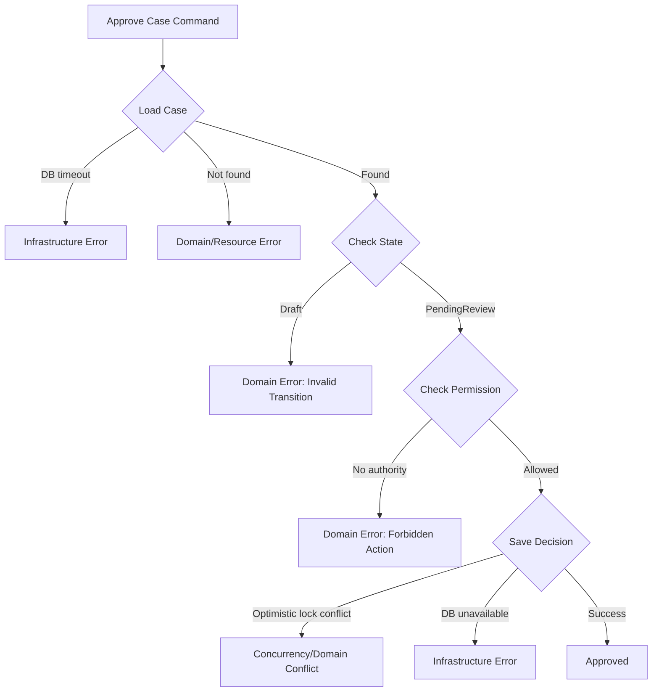
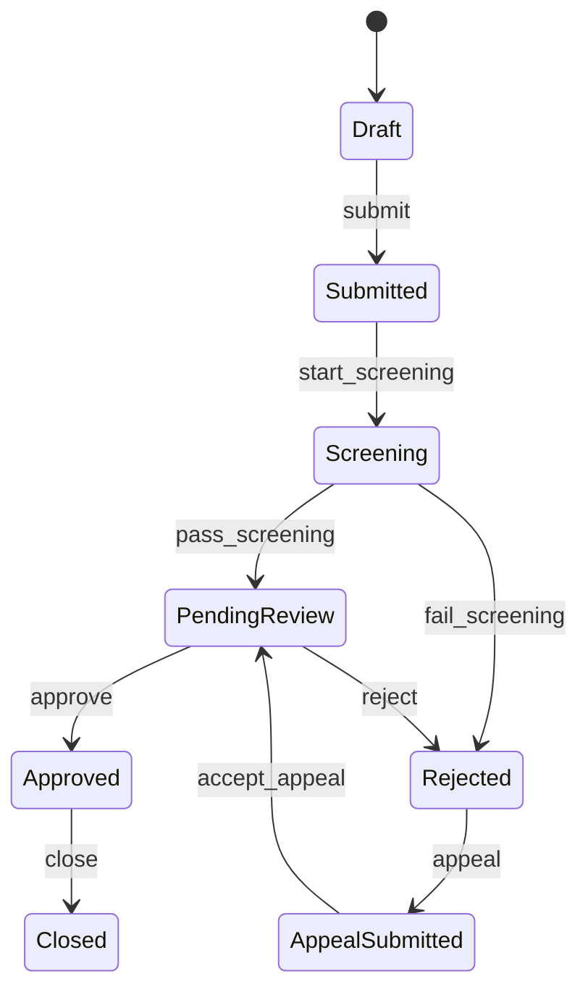
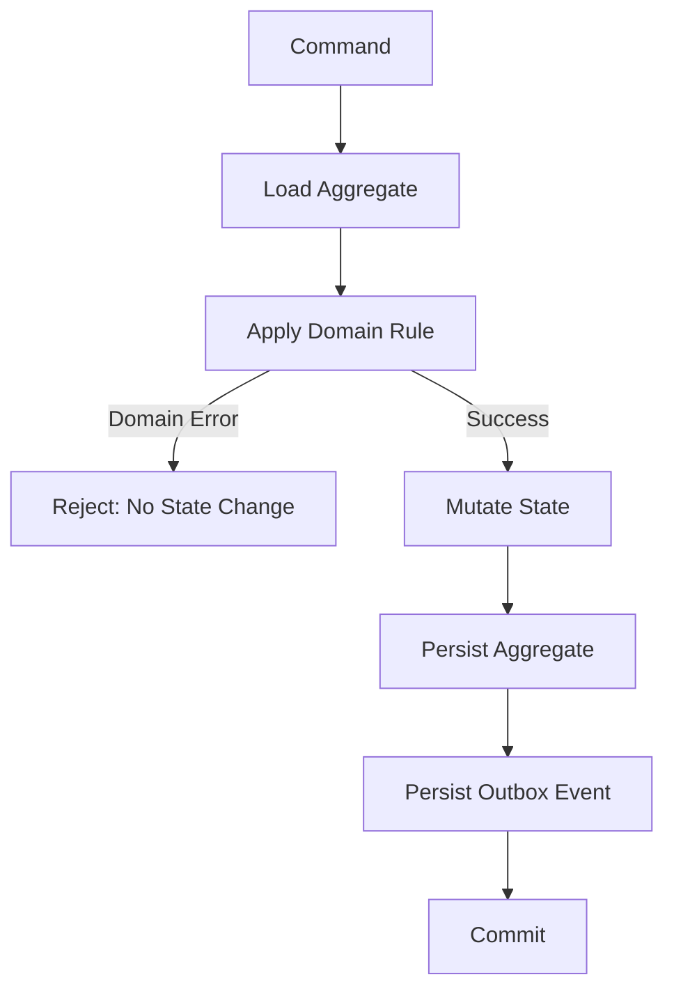
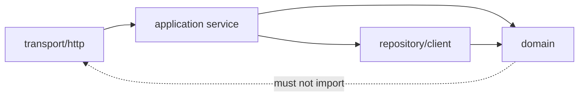
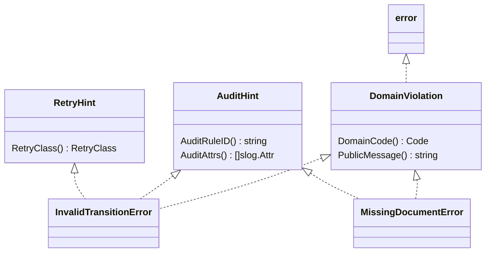
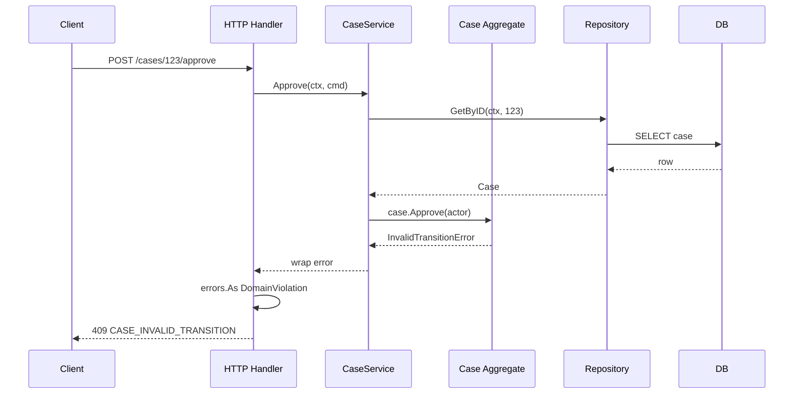

# learn-go-reliability-error-handling-part-007.md

# Domain Error Model: Business Errors yang Tidak Tercampur dengan Infrastructure Errors

> Seri: `learn-go-reliability-error-handling`  
> Bagian: `007`  
> Target pembaca: Java software engineer yang ingin membangun mental model Go production-grade  
> Fokus: domain error, business rule violation, state transition guard, auditability, API stability, dan pemisahan dari infrastructure error

---

## 0. Posisi Bagian Ini dalam Seri

Sampai bagian sebelumnya, kita sudah membangun fondasi:

1. error/failure sebagai konsep engineering, bukan hanya syntax;
2. error sebagai explicit API surface di Go;
3. taxonomy error untuk menentukan retry, alert, response, rollback;
4. bentuk error: sentinel, typed, opaque;
5. wrapping dan chain dengan `errors.Is`, `errors.As`, `errors.Join`;
6. error boundary: di layer mana error diputuskan, diterjemahkan, dilog, atau disembunyikan.

Bagian ini masuk ke area yang sangat penting untuk sistem bisnis, terutama sistem regulasi, compliance, approval, enforcement, workflow, dan case management:

> Bagaimana mendesain **domain error model** yang stabil, defensible, auditable, dan tidak tercemar oleh detail teknis seperti SQL, Redis, HTTP, timeout, atau broker failure.

Dalam sistem enterprise, domain error sering lebih penting daripada infrastructure error. Infrastructure error menjawab:

> “Sistem gagal melakukan sesuatu.”

Domain error menjawab:

> “Sistem menolak melakukan sesuatu karena aturan bisnis memang tidak memperbolehkannya.”

Keduanya harus diperlakukan berbeda.

---

## 1. Core Mental Model

Domain error adalah error yang muncul karena **aturan domain menolak operasi**, bukan karena sistem tidak mampu menjalankan operasi.

Contoh domain error:

- case tidak bisa di-submit karena masih ada mandatory document yang belum lengkap;
- application tidak bisa di-approve karena status saat ini bukan `PendingReview`;
- officer tidak boleh assign case ke dirinya sendiri;
- enforcement action tidak boleh diterbitkan sebelum notice period selesai;
- renewal tidak boleh diproses karena licence sudah expired melebihi grace period;
- appeal tidak boleh dibuat karena deadline sudah lewat;
- applicant tidak boleh mengubah submission setelah masuk tahap assessment;
- decision tidak boleh diubah tanpa alasan revisi dan approval level tertentu.

Contoh yang **bukan** domain error:

- database timeout;
- Redis unavailable;
- HTTP 502 dari dependency;
- JSON decode gagal karena payload corrupt;
- context canceled karena client disconnect;
- panic karena nil pointer;
- file upload storage unavailable;
- message broker connection lost.

Perbedaannya:

| Pertanyaan | Domain Error | Infrastructure Error |
|---|---|---|
| Apakah request secara teknis bisa diproses? | Ya | Tidak / belum tentu |
| Apakah sistem sengaja menolak? | Ya | Tidak |
| Apakah retry otomatis mungkin membantu? | Biasanya tidak | Mungkin |
| Apakah user bisa memperbaiki input/state? | Sering ya | Biasanya tidak |
| Apakah perlu alert? | Biasanya tidak | Tergantung dampak |
| Apakah harus masuk audit trail? | Sering ya | Tergantung operasi |
| Apakah response harus menjelaskan rule? | Ya, secara aman | Tidak terlalu detail |
| Apakah error termasuk bug? | Tidak selalu | Bisa jadi |

Domain error bukan “bad thing”. Domain error sering berarti sistem bekerja benar.

---

## 2. Domain Error Bukan Exception Teknis

Banyak engineer dengan background Java terbiasa melihat `Exception` sebagai hal buruk. Dalam aplikasi Spring/Java, domain rejection sering direpresentasikan sebagai exception seperti:

```java
throw new InvalidCaseStateException("case cannot be approved from Draft");
```

Ini tidak salah secara mutlak, tetapi sering mencampur dua konsep:

1. exceptional control flow;
2. business rule rejection.

Di Go, karena error dikembalikan eksplisit, kita lebih terdorong untuk menjadikan domain rejection sebagai bagian dari contract function.

```go
updated, err := svc.ApproveCase(ctx, cmd)
if err != nil {
    return err
}
```

Pertanyaannya bukan “apakah ada error?”, tetapi:

> “Jenis penolakan atau kegagalan apa yang terjadi, dan siapa yang berhak membuat keputusan berikutnya?”

Domain service boleh mengembalikan error karena rule violation. Transport boundary kemudian menerjemahkannya ke HTTP/gRPC response. Audit boundary mencatat attempt. Observability boundary membuat metric yang rendah cardinality.

---

## 3. Domain Error Harus Dipisahkan dari Infrastructure Error

Misalnya ada operasi:

```text
Approve Case
```

Operasi ini bisa gagal karena banyak alasan:



Jika semua error hanya menjadi `error`, tanpa model, boundary akan bingung:

- apakah response `400`, `403`, `404`, `409`, `422`, `500`, atau `503`?
- apakah boleh retry?
- apakah harus alert?
- apakah harus masuk audit?
- apakah user harus melihat pesan detail?
- apakah operasi boleh diulang?
- apakah perlu compensation?

Domain error model memberikan jawaban sistematis.

---

## 4. Ciri Domain Error yang Baik

Domain error production-grade biasanya memiliki karakteristik berikut:

1. **Stable code**  
   Code tidak berubah hanya karena wording berubah.

2. **Machine-readable**  
   Handler, client, test, metric, dan audit bisa mengenali jenis error tanpa parsing string.

3. **Human-meaningful**  
   Ada penjelasan cukup untuk engineer, user, atau auditor.

4. **Boundary-safe**  
   Tidak membocorkan SQL, stack, hostname, secret, raw payload, atau internal dependency.

5. **Contextual**  
   Bisa membawa entity, state, actor, rule, dan operation secara terkontrol.

6. **Auditable**  
   Bisa menjawab mengapa sistem menolak operasi.

7. **Composable**  
   Bisa digabung dengan wrapping, `errors.Is`, `errors.As`, dan logging.

8. **Versionable**  
   Bisa dipertahankan lintas versi API.

9. **Testable**  
   Unit test bisa assert code/type, bukan string rapuh.

10. **Non-ambiguous**  
   Domain violation tidak terlihat seperti technical failure.

---

## 5. Domain Error sebagai State Transition Guard

Banyak sistem bisnis sebenarnya adalah state machine.

Contoh case lifecycle:



Domain error muncul ketika command mencoba transisi ilegal:

```text
Approve from Draft        -> invalid transition
Submit without documents  -> missing requirement
Appeal after deadline     -> rule violation
Close without approval    -> invalid transition
Approve by unauthorized officer -> forbidden domain action
```

Dalam sistem regulasi, error ini bukan detail kecil. Ini adalah bukti bahwa sistem menerapkan governance.

### 5.1 Jangan Mengandalkan UI untuk Domain Rule

UI boleh mencegah user menekan tombol `Approve` saat status `Draft`, tetapi backend tetap harus memvalidasi.

Alasannya:

- API bisa dipanggil langsung;
- request bisa replay;
- user session bisa stale;
- role bisa berubah;
- state bisa berubah oleh actor lain;
- worker bisa menjalankan command lama;
- migration/import bisa menghasilkan edge case;
- bug frontend tidak boleh menjadi celah domain.

Domain rule harus hidup di domain/application layer, bukan hanya presentation layer.

---

## 6. Basic Domain Error Shape di Go

Kita mulai dari bentuk sederhana.

```go
type Code string

const (
    CodeInvalidTransition Code = "CASE_INVALID_TRANSITION"
    CodeMissingDocument   Code = "CASE_MISSING_DOCUMENT"
    CodeForbiddenAction   Code = "CASE_FORBIDDEN_ACTION"
    CodeAppealExpired     Code = "CASE_APPEAL_EXPIRED"
    CodeConflict          Code = "CASE_CONFLICT"
)

type DomainError struct {
    Code      Code
    Message   string
    Operation string
    Entity    string
    EntityID  string
    RuleID    string
    Cause     error
}

func (e *DomainError) Error() string {
    if e == nil {
        return "<nil>"
    }
    if e.Operation != "" {
        return string(e.Code) + ": " + e.Operation + ": " + e.Message
    }
    return string(e.Code) + ": " + e.Message
}

func (e *DomainError) Unwrap() error {
    if e == nil {
        return nil
    }
    return e.Cause
}
```

Ini belum sempurna, tetapi sudah memperlihatkan prinsip:

- `Code` untuk machine contract;
- `Message` untuk internal explanation;
- `Operation` untuk context;
- `Entity` dan `EntityID` untuk audit/debug;
- `RuleID` untuk traceability;
- `Cause` untuk optional causal chain.

Namun perlu hati-hati: tidak semua field boleh keluar ke API response.

---

## 7. Domain Error Code vs Go Error Type

Ada dua pendekatan umum:

1. typed error per kategori;
2. satu domain error type dengan `Code`.

### 7.1 Typed Error per Kategori

```go
type InvalidTransitionError struct {
    Entity string
    From   string
    Action string
}

func (e *InvalidTransitionError) Error() string {
    return e.Entity + ": cannot " + e.Action + " from state " + e.From
}
```

Kelebihan:

- kuat secara type system;
- cocok untuk behavior spesifik;
- `errors.As` mudah digunakan;
- field bisa spesifik per error.

Kekurangan:

- banyak type jika domain besar;
- bisa membengkak;
- sulit distandardisasi untuk API error response;
- package domain bisa penuh boilerplate.

### 7.2 Generic Domain Error dengan Code

```go
type DomainError struct {
    Code    Code
    Message string
    Details map[string]string
}
```

Kelebihan:

- mudah distandardisasi;
- cocok untuk API error contract;
- cocok untuk audit dan metrics;
- jumlah type lebih sedikit.

Kekurangan:

- lebih lemah secara type system;
- raw map bisa menjadi dumping ground;
- detail key bisa tidak konsisten;
- mudah berubah menjadi stringly-typed design.

### 7.3 Pendekatan Hybrid

Untuk sistem besar, pendekatan hybrid sering paling seimbang:

- satu interface umum untuk domain error;
- beberapa typed error untuk kategori penting;
- stable code untuk API/audit/metrics.

```go
type DomainViolation interface {
    error
    DomainCode() Code
    PublicMessage() string
    Retryable() bool
}
```

Lalu implementasi:

```go
type InvalidTransitionError struct {
    Entity string
    ID     string
    From   string
    Action string
    RuleID string
}

func (e *InvalidTransitionError) Error() string {
    return "invalid transition: " + e.Entity + " " + e.ID + " cannot " + e.Action + " from " + e.From
}

func (e *InvalidTransitionError) DomainCode() Code {
    return CodeInvalidTransition
}

func (e *InvalidTransitionError) PublicMessage() string {
    return "The requested action is not allowed in the current state."
}

func (e *InvalidTransitionError) Retryable() bool {
    return false
}
```

Keuntungan hybrid:

- internal code bisa menggunakan field typed;
- boundary bisa membaca stable code;
- API tidak tergantung string;
- audit bisa menyimpan `RuleID`;
- unit test bisa assert dengan `errors.As`.

---

## 8. Domain Code sebagai Contract

Domain code adalah contract yang lebih stabil daripada pesan.

Contoh:

```go
const (
    CodeCaseInvalidTransition Code = "CASE_INVALID_TRANSITION"
    CodeCaseMissingDocument   Code = "CASE_MISSING_DOCUMENT"
    CodeCaseForbiddenAction   Code = "CASE_FORBIDDEN_ACTION"
    CodeCaseAlreadySubmitted  Code = "CASE_ALREADY_SUBMITTED"
    CodeCaseVersionConflict   Code = "CASE_VERSION_CONFLICT"
)
```

Code sebaiknya:

- uppercase;
- namespaced;
- tidak terlalu generic;
- tidak terlalu detail implementation;
- stabil lintas release;
- bisa didokumentasikan;
- bisa dipakai di API, audit, logs, metrics.

### 8.1 Code yang Terlalu Generic

Buruk:

```text
INVALID
FAILED
ERROR
BAD_REQUEST
BUSINESS_ERROR
```

Masalahnya:

- tidak menjelaskan rule;
- tidak membantu support;
- tidak membantu client;
- tidak membantu metric;
- sulit diaudit.

### 8.2 Code yang Terlalu Detail

Buruk:

```text
CASE_APPROVE_FROM_DRAFT_BY_OFFICER_ROLE_LEVEL_2_WITHOUT_DOCUMENT_X_ERROR
```

Masalahnya:

- terlalu spesifik;
- mudah berubah;
- sulit dipertahankan;
- membuat API contract rapuh.

Lebih baik:

```text
CASE_INVALID_TRANSITION
CASE_MISSING_REQUIRED_DOCUMENT
CASE_INSUFFICIENT_APPROVAL_AUTHORITY
```

---

## 9. Domain Error dan HTTP Status Mapping

Domain error tidak otomatis berarti `500`.

Mapping umum:

| Domain Situation | HTTP Status | Catatan |
|---|---:|---|
| payload malformed | `400` | transport/request parsing |
| validation field gagal | `400` atau `422` | tergantung API convention |
| unauthorized | `401` | belum authenticated |
| forbidden action | `403` | authenticated tapi tidak boleh |
| resource tidak ditemukan | `404` | hati-hati enumeration leak |
| state conflict/stale version | `409` | optimistic locking/domain conflict |
| invalid business transition | `409` atau `422` | tergantung apakah konflik state atau semantic rule |
| missing prerequisite | `422` | request syntactically valid tapi semantically rejected |
| rate limited | `429` | bukan domain murni, policy/overload |
| dependency unavailable | `503` | infrastructure |
| unknown internal bug | `500` | internal |

Tidak ada mapping universal yang sempurna. Yang penting adalah konsistensi contract.

### 9.1 Jangan Jadikan Semua Domain Error `400`

`400 Bad Request` cocok untuk request yang malformed atau invalid secara input. Tetapi banyak domain rejection terjadi karena **state server** saat ini.

Contoh:

```text
User mengirim approve untuk case valid, tetapi case sudah di-approve oleh officer lain 2 detik sebelumnya.
```

Ini lebih cocok `409 Conflict`, bukan `400`.

### 9.2 Jangan Jadikan Semua Domain Error `422`

`422` sering dipakai untuk semantic validation, tetapi conflict, forbidden, not found, dan authentication tetap harus punya status sendiri.

---

## 10. API Error Response untuk Domain Error

Contoh response yang baik:

```json
{
  "error": {
    "code": "CASE_INVALID_TRANSITION",
    "message": "The requested action is not allowed in the current case state.",
    "correlation_id": "01JZ8K6R8EHX8D5Y9Z4H7K2P1A"
  }
}
```

Untuk validation error:

```json
{
  "error": {
    "code": "VALIDATION_FAILED",
    "message": "The request contains invalid fields.",
    "fields": [
      {
        "path": "documents[0].type",
        "code": "REQUIRED",
        "message": "Document type is required."
      }
    ],
    "correlation_id": "01JZ8K6R8EHX8D5Y9Z4H7K2P1A"
  }
}
```

Jangan expose:

```json
{
  "error": "pq: duplicate key value violates unique constraint case_submission_unique_idx"
}
```

Itu infrastructure leak.

---

## 11. Domain Error dan Auditability

Dalam sistem regulasi, audit trail bukan hanya log teknis. Audit harus menjawab:

- siapa actor-nya;
- action apa yang dicoba;
- entity apa yang terdampak;
- state sebelum operasi;
- state target;
- rule apa yang menolak;
- kapan terjadi;
- apakah request ditolak atau gagal teknis;
- correlation/request id;
- source channel;
- apakah ada override/manual intervention.

Domain error idealnya membawa cukup metadata agar audit event bisa ditulis tanpa parsing string.

```go
type AuditableDomainError interface {
    error
    DomainCode() Code
    RuleID() string
    AuditAttrs() map[string]string
}
```

Contoh implementasi:

```go
type MissingDocumentError struct {
    CaseID       string
    DocumentType string
    Rule         string
}

func (e *MissingDocumentError) Error() string {
    return "missing required document: " + e.DocumentType + " for case " + e.CaseID
}

func (e *MissingDocumentError) DomainCode() Code {
    return CodeMissingDocument
}

func (e *MissingDocumentError) PublicMessage() string {
    return "A required document is missing."
}

func (e *MissingDocumentError) Retryable() bool {
    return false
}

func (e *MissingDocumentError) RuleID() string {
    return e.Rule
}

func (e *MissingDocumentError) AuditAttrs() map[string]string {
    return map[string]string{
        "case_id":       e.CaseID,
        "document_type": e.DocumentType,
        "rule_id":       e.Rule,
    }
}
```

Catatan production: `map[string]string` mudah dipakai, tetapi bisa menjadi tidak konsisten. Untuk domain yang sangat regulated, typed audit event lebih kuat daripada map bebas.

---

## 12. Rule ID dan Defensibility

Domain error yang baik bisa ditelusuri ke rule.

Contoh:

```text
RULE-CASE-SUBMIT-001: Case cannot be submitted unless all mandatory documents are present.
RULE-CASE-APPROVE-003: Case can only be approved from PendingReview state.
RULE-APPEAL-002: Appeal must be submitted within 14 calendar days after rejection notice.
```

Mengapa rule id penting?

- membantu audit;
- membantu QA membuat test case;
- membantu BA/legal/regulatory owner meninjau behavior;
- membantu support menjelaskan penolakan;
- membantu migration impact analysis;
- membantu change request traceability.

Dalam code:

```go
const RuleCaseApproveOnlyPendingReview = "RULE-CASE-APPROVE-003"
```

Lalu:

```go
return &InvalidTransitionError{
    Entity: "case",
    ID:     c.ID,
    From:   string(c.Status),
    Action: "approve",
    RuleID: RuleCaseApproveOnlyPendingReview,
}
```

---

## 13. Domain Error dan State Machine

Daripada menulis rule tersebar seperti:

```go
if status != "PendingReview" {
    return errors.New("invalid status")
}
```

Lebih baik state transition dibuat eksplisit.

```go
type CaseStatus string

const (
    StatusDraft         CaseStatus = "Draft"
    StatusSubmitted     CaseStatus = "Submitted"
    StatusPendingReview CaseStatus = "PendingReview"
    StatusApproved      CaseStatus = "Approved"
    StatusRejected      CaseStatus = "Rejected"
)

type Case struct {
    ID     string
    Status CaseStatus
}

func (c *Case) Approve(actor Actor) error {
    if c.Status != StatusPendingReview {
        return &InvalidTransitionError{
            Entity: "case",
            ID:     c.ID,
            From:   string(c.Status),
            Action: "approve",
            RuleID: RuleCaseApproveOnlyPendingReview,
        }
    }

    if !actor.CanApproveCase(c) {
        return &ForbiddenDomainActionError{
            ActorID: actor.ID,
            Entity:  "case",
            ID:      c.ID,
            Action:  "approve",
            Rule:    "RULE-CASE-APPROVE-004",
        }
    }

    c.Status = StatusApproved
    return nil
}
```

Di sini error bukan sekadar failure. Error adalah hasil evaluasi rule.

---

## 14. Application Service Orchestration

Domain entity tidak seharusnya tahu database, HTTP, Redis, atau message broker.

Application service bertugas:

1. load entity;
2. authorize/request-level validation;
3. panggil domain behavior;
4. persist perubahan;
5. publish event/outbox;
6. translate infrastructure failure bila perlu;
7. return domain/infrastructure error ke boundary.

```go
func (s *CaseService) Approve(ctx context.Context, cmd ApproveCaseCommand) (*Case, error) {
    c, err := s.repo.GetByID(ctx, cmd.CaseID)
    if err != nil {
        return nil, fmt.Errorf("approve case: load case %s: %w", cmd.CaseID, err)
    }

    actor, err := s.actorProvider.ActorFromContext(ctx)
    if err != nil {
        return nil, fmt.Errorf("approve case: resolve actor: %w", err)
    }

    if err := c.Approve(actor); err != nil {
        return nil, fmt.Errorf("approve case: apply domain rule: %w", err)
    }

    if err := s.repo.Save(ctx, c); err != nil {
        return nil, fmt.Errorf("approve case: save case %s: %w", c.ID, err)
    }

    return c, nil
}
```

Important nuance:

- `c.Approve(actor)` menghasilkan domain error;
- `repo.GetByID` dan `repo.Save` menghasilkan repository/infrastructure error;
- wrapping menambah operation context;
- HTTP boundary tetap bisa menemukan domain error dengan `errors.As`.

```go
var dv DomainViolation
if errors.As(err, &dv) {
    // map to 403/409/422 etc
}
```

---

## 15. Jangan Membuat Domain Layer Bergantung pada HTTP

Buruk:

```go
type DomainError struct {
    HTTPStatus int
    Message    string
}
```

Masalah:

- domain layer menjadi tahu transport;
- domain logic tidak reusable untuk gRPC, CLI, batch, worker;
- testing domain tercampur HTTP;
- status mapping sulit berubah;
- error contract domain menjadi presentation concern.

Lebih baik:

```go
type DomainViolation interface {
    error
    DomainCode() Code
    PublicMessage() string
}
```

HTTP mapping di transport boundary:

```go
func mapDomainStatus(code Code) int {
    switch code {
    case CodeForbiddenAction:
        return http.StatusForbidden
    case CodeInvalidTransition, CodeConflict:
        return http.StatusConflict
    case CodeMissingDocument, CodeAppealExpired:
        return http.StatusUnprocessableEntity
    default:
        return http.StatusBadRequest
    }
}
```

---

## 16. Domain Error dan Authorization

Authorization sering berada di persimpangan domain dan security.

Ada dua jenis authorization failure:

1. technical/authentication authorization;
2. domain authorization.

### 16.1 Technical Authorization

Contoh:

- token invalid;
- token expired;
- missing authentication;
- role tidak ada;
- scope tidak cukup.

Biasanya mapping ke `401` atau `403`.

### 16.2 Domain Authorization

Contoh:

- officer tidak boleh approve case yang dia submit sendiri;
- supervisor hanya boleh approve case di branch yang sama;
- decision maker level 1 tidak boleh approve amount di atas threshold;
- case tidak boleh dipindahkan ke officer yang sedang suspended;
- applicant hanya boleh melihat case miliknya.

Ini sering butuh domain context, bukan sekadar role.

```go
type ForbiddenDomainActionError struct {
    ActorID string
    Entity  string
    ID      string
    Action  string
    Rule    string
}

func (e *ForbiddenDomainActionError) Error() string {
    return "forbidden domain action: actor " + e.ActorID + " cannot " + e.Action + " " + e.Entity + " " + e.ID
}

func (e *ForbiddenDomainActionError) DomainCode() Code {
    return CodeForbiddenAction
}

func (e *ForbiddenDomainActionError) PublicMessage() string {
    return "You are not allowed to perform this action."
}

func (e *ForbiddenDomainActionError) Retryable() bool {
    return false
}
```

Catatan keamanan: public message tidak perlu menjelaskan rule detail jika itu bisa membantu attacker.

---

## 17. Domain Error dan Not Found

`not found` ambigu. Bisa berarti:

1. resource memang tidak ada;
2. user tidak berhak melihat resource;
3. resource ada tapi sudah archived;
4. ID malformed;
5. database gagal mencari resource;
6. query context canceled.

Jangan semua dijadikan `sql.ErrNoRows` sampai ke handler.

Repository boleh tahu `sql.ErrNoRows`, tetapi domain/application boundary sebaiknya menerjemahkan menjadi error yang meaningful.

```go
var ErrCaseNotFound = errors.New("case not found")

func (r *CaseRepository) GetByID(ctx context.Context, id string) (*Case, error) {
    c, err := r.queryCase(ctx, id)
    if err != nil {
        if errors.Is(err, sql.ErrNoRows) {
            return nil, ErrCaseNotFound
        }
        return nil, fmt.Errorf("query case by id: %w", err)
    }
    return c, nil
}
```

Di application service:

```go
c, err := s.repo.GetByID(ctx, cmd.CaseID)
if err != nil {
    if errors.Is(err, ErrCaseNotFound) {
        return nil, &ResourceNotFoundError{
            Entity: "case",
            ID:     cmd.CaseID,
        }
    }
    return nil, fmt.Errorf("approve case: load case: %w", err)
}
```

Kenapa tidak langsung expose DB error?

Karena domain boundary harus menentukan arti bisnis dari absence.

---

## 18. Domain Error dan Conflict

Conflict adalah salah satu domain error paling penting dalam sistem concurrent.

Contoh:

- user mengapprove case yang sudah berubah status;
- optimistic version mismatch;
- duplicate submission;
- unique business key sudah ada;
- operation replay dengan idempotency key berbeda payload;
- entity sedang locked oleh process lain;
- schedule overlap;
- quota already consumed.

Conflict bukan selalu infrastructure error. Banyak conflict adalah bagian normal dari sistem multi-user.

```go
type VersionConflictError struct {
    Entity          string
    ID              string
    ExpectedVersion int64
    ActualVersion   int64
}

func (e *VersionConflictError) Error() string {
    return fmt.Sprintf(
        "version conflict: %s %s expected version %d but actual version %d",
        e.Entity,
        e.ID,
        e.ExpectedVersion,
        e.ActualVersion,
    )
}

func (e *VersionConflictError) DomainCode() Code {
    return CodeConflict
}

func (e *VersionConflictError) PublicMessage() string {
    return "The record was modified by another process. Please refresh and try again."
}

func (e *VersionConflictError) Retryable() bool {
    return false
}
```

Kenapa `Retryable() false`? Karena blind retry bisa mengulang keputusan atas state lama. User atau caller harus reload state dan membuat keputusan ulang.

Namun untuk internal idempotent operation tertentu, conflict bisa ditangani otomatis. Jadi retryability adalah policy, bukan hanya property type.

---

## 19. Domain Error dan Validation Error

Validation error sering dianggap domain error, tetapi perlu dibedakan:

1. structural validation;
2. field validation;
3. semantic validation;
4. cross-entity rule validation;
5. stateful domain validation.

### 19.1 Structural Validation

Payload tidak bisa diparse.

```json
{ "amount": "abc" }
```

Ini transport/request error.

### 19.2 Field Validation

```text
amount must be positive
email must be valid
postal code is required
```

Ini input validation.

### 19.3 Semantic Domain Validation

```text
appeal reason is required only when decision is Rejected
licence category A requires document X
```

Ini lebih dekat domain.

### 19.4 Stateful Domain Validation

```text
cannot submit because previous renewal still pending
cannot approve because case is locked by another active review
```

Ini jelas domain rule.

Jangan mencampur semua menjadi satu `ValidationError` tanpa klasifikasi.

---

## 20. Aggregated Domain Error

Kadang command gagal karena banyak rule sekaligus.

Contoh submit application:

- missing document;
- invalid declared address;
- applicant has unresolved compliance hold;
- selected licence category incompatible with entity type.

Ada dua strategi:

1. fail fast;
2. collect all deterministic violations.

Fail fast cocok jika:

- rule mahal dievaluasi;
- rule berikutnya bergantung pada rule sebelumnya;
- security concern;
- state bisa berubah cepat.

Collect all cocok jika:

- user perlu memperbaiki banyak field;
- validation deterministic;
- UX lebih baik;
- batch import.

Dengan Go 1.20+, `errors.Join` bisa dipakai untuk menggabungkan banyak error.

```go
func ValidateSubmission(app Application) error {
    var errs []error

    if !app.HasDocument("ID_PROOF") {
        errs = append(errs, &MissingDocumentError{
            CaseID:       app.ID,
            DocumentType: "ID_PROOF",
            Rule:         "RULE-APP-SUBMIT-001",
        })
    }

    if app.Category == "A" && !app.HasDocument("CATEGORY_A_CERT") {
        errs = append(errs, &MissingDocumentError{
            CaseID:       app.ID,
            DocumentType: "CATEGORY_A_CERT",
            Rule:         "RULE-APP-SUBMIT-002",
        })
    }

    return errors.Join(errs...)
}
```

Boundary bisa traverse error tree untuk mengambil semua domain violation.

---

## 21. Extracting Domain Violations dari Error Tree

Karena error bisa wrapped dan joined, classifier harus sadar chain/tree.

```go
func CollectDomainViolations(err error) []DomainViolation {
    if err == nil {
        return nil
    }

    var out []DomainViolation
    collectDomainViolations(err, &out)
    return out
}

func collectDomainViolations(err error, out *[]DomainViolation) {
    if err == nil {
        return
    }

    var dv DomainViolation
    if errors.As(err, &dv) {
        *out = append(*out, dv)
        // Do not return blindly. A joined error may contain multiple domain violations.
    }

    type unwrapperMany interface {
        Unwrap() []error
    }
    if many, ok := err.(unwrapperMany); ok {
        for _, child := range many.Unwrap() {
            collectDomainViolations(child, out)
        }
        return
    }

    type unwrapperOne interface {
        Unwrap() error
    }
    if one, ok := err.(unwrapperOne); ok {
        collectDomainViolations(one.Unwrap(), out)
    }
}
```

Catatan: implementasi production perlu deduplication jika `errors.As` pada wrapper juga match child yang sama. Prinsip utamanya: jangan asumsikan error selalu linear.

---

## 22. Domain Error dan Metrics Cardinality

Jangan gunakan full error string sebagai metric label.

Buruk:

```text
errors_total{error="invalid transition: case CASE-123 cannot approve from Draft"}
```

Ini menghasilkan cardinality tinggi karena `CASE-123` berbeda-beda.

Lebih baik:

```text
business_rejections_total{code="CASE_INVALID_TRANSITION", operation="approve_case"}
```

Domain code sangat berguna untuk metrics karena stabil dan low-cardinality.

Label yang biasanya aman:

- operation;
- domain code;
- module;
- channel;
- status class.

Label yang berbahaya:

- entity ID;
- user ID;
- full error string;
- document number;
- email;
- raw path dengan ID;
- SQL query;
- external request id jika cardinality tinggi.

---

## 23. Domain Error dan Logging

Domain error biasanya tidak perlu `ERROR` log, karena banyak domain rejection adalah expected behavior.

Contoh:

| Situation | Suggested Log Level |
|---|---|
| invalid form input | debug/info, often no log |
| user forbidden action | info/warn depending security relevance |
| invalid transition due stale UI | info |
| repeated forbidden action suspicious | warn/security event |
| domain invariant impossible | error/panic depending severity |
| DB unavailable | error |
| data corruption | error/critical |

Log domain rejection dengan structured fields:

```go
logger.InfoContext(ctx, "domain operation rejected",
    slog.String("operation", "approve_case"),
    slog.String("code", string(dv.DomainCode())),
    slog.String("case_id", safeCaseID),
    slog.String("actor_id", safeActorID),
)
```

Tapi hati-hati: `case_id` dan `actor_id` bisa sensitif tergantung konteks. Gunakan policy organisasi.

---

## 24. Domain Error dan Alerting

Domain error tidak otomatis perlu alert.

Alert harus berbasis symptom atau SLO impact, bukan keberadaan error.

Namun domain error rate bisa menjadi sinyal:

- spike `CASE_INVALID_TRANSITION` setelah release mungkin UI mengirim action salah;
- spike `CASE_MISSING_DOCUMENT` mungkin rule berubah tapi UI belum update;
- spike `CASE_FORBIDDEN_ACTION` bisa indikasi permission regression atau abuse;
- spike `CASE_VERSION_CONFLICT` bisa indikasi concurrency issue atau UX stale;
- spike `CASE_APPEAL_EXPIRED` mungkin batch notification gagal.

Jadi domain errors sebaiknya menjadi metric, tetapi tidak semua menjadi page.

---

## 25. Domain Error dan Retry

Sebagian besar domain error tidak boleh blind retry.

| Domain Error | Blind Retry? | Reason |
|---|---:|---|
| missing required document | no | input/state harus diperbaiki |
| invalid transition | no | state/action tidak valid |
| forbidden action | no | permission tidak berubah oleh retry |
| appeal expired | no | waktu rule sudah lewat |
| version conflict | no/conditional | perlu reload/merge |
| duplicate idempotency same payload | safe replay | return previous result |
| duplicate idempotency different payload | no | conflict |
| quota exceeded | maybe later | tergantung reset window |

Domain error bisa punya `Retryable()` tetapi jangan jadikan satu-satunya policy.

Lebih baik ada classification:

```go
type RetryClass string

const (
    RetryNever       RetryClass = "never"
    RetryAfterChange RetryClass = "after_change"
    RetryAfterTime   RetryClass = "after_time"
    RetrySafeReplay  RetryClass = "safe_replay"
)
```

Karena “retryable” terlalu boolean untuk sistem besar.

---

## 26. Domain Error dan Idempotency

Idempotency sering menghasilkan domain conflict.

Contoh:

```text
POST /cases/{id}/submit
Idempotency-Key: abc
```

Jika request pertama berhasil, request kedua dengan key sama dan payload sama sebaiknya mengembalikan hasil yang sama, bukan error.

Tetapi jika key sama payload berbeda:

```text
IDEMPOTENCY_PAYLOAD_MISMATCH
```

Itu domain/API contract error.

```go
type IdempotencyConflictError struct {
    Key string
}

func (e *IdempotencyConflictError) Error() string {
    return "idempotency conflict: key reused with different request payload"
}

func (e *IdempotencyConflictError) DomainCode() Code {
    return "IDEMPOTENCY_CONFLICT"
}

func (e *IdempotencyConflictError) PublicMessage() string {
    return "The idempotency key was already used with a different request."
}

func (e *IdempotencyConflictError) Retryable() bool {
    return false
}
```

Jangan expose raw key jika dianggap sensitive.

---

## 27. Domain Error dan Transaction Boundary

Domain rule sering dievaluasi sebelum save. Namun ada rule yang hanya bisa dijamin oleh database:

- unique constraint;
- optimistic lock;
- exclusion constraint;
- foreign key;
- transactional consistency;
- concurrent update conflict.

Repository bisa menerima SQL/database error lalu menerjemahkannya menjadi domain conflict jika constraint adalah bagian dari domain rule.

```go
func (r *CaseRepository) Save(ctx context.Context, c *Case) error {
    err := r.save(ctx, c)
    if err == nil {
        return nil
    }

    if isUniqueConstraint(err, "case_business_ref_uk") {
        return &DuplicateBusinessReferenceError{
            Ref: c.BusinessRef,
        }
    }

    if isOptimisticLockMiss(err) {
        return &VersionConflictError{
            Entity: "case",
            ID:     c.ID,
        }
    }

    return fmt.Errorf("save case: %w", err)
}
```

Ini bukan abstraction leak jika repository sengaja menerjemahkan known persistence condition menjadi domain-level conflict.

Yang buruk adalah membiarkan handler tahu nama constraint database.

---

## 28. Domain Error dan Event/Outbox

Operasi domain sering menghasilkan event:

```text
CaseApproved
CaseRejected
AppealSubmitted
DocumentRequested
```

Domain error berarti event tersebut tidak boleh diterbitkan.



Prinsip:

- jangan publish event sebelum domain operation valid;
- jangan publish event sebelum transaction commit;
- domain rejection bisa menghasilkan audit event, tetapi bukan business state-change event;
- audit event dan domain event berbeda.

Contoh:

```text
Domain Event: CaseApproved
Audit Event: ApproveCaseRejectedDueInvalidTransition
```

---

## 29. Domain Error dan Security

Domain error bisa membocorkan informasi.

Contoh buruk:

```json
{
  "code": "CASE_FORBIDDEN_ACTION",
  "message": "Case CASE-2026-0001 belongs to another agency and is currently under investigation by officer Tan."
}
```

Ini terlalu banyak informasi.

Lebih aman:

```json
{
  "code": "CASE_FORBIDDEN_ACTION",
  "message": "You are not allowed to perform this action."
}
```

Internal log/audit bisa menyimpan detail yang sesuai policy, tetapi public response harus minimal.

Not found juga sering dimasking:

- jika user tidak boleh tahu resource ada, return `404`;
- jika user boleh tahu resource ada tapi tidak boleh action, return `403`.

Keputusan ini adalah security/product policy.

---

## 30. Domain Error dan Localization

Jangan menjadikan `Error()` sebagai localized user message.

Buruk:

```go
func (e *InvalidTransitionError) Error() string {
    return "Aksi tidak dapat dilakukan karena status kasus saat ini tidak valid"
}
```

Masalah:

- internal logs tergantung bahasa;
- test rapuh;
- API client sulit menggunakan string;
- multi-language sulit.

Lebih baik:

- `Error()` untuk internal diagnostic;
- `DomainCode()` untuk message lookup;
- `PublicMessage()` fallback default;
- localization di presentation/client layer.

```go
func (e *InvalidTransitionError) PublicMessageKey() string {
    return "error.case.invalid_transition"
}
```

---

## 31. Domain Error dan Package Design

Contoh struktur package:

```text
internal/case/domain
    case.go
    status.go
    errors.go
    rules.go

internal/case/app
    service.go
    commands.go

internal/case/infra
    repository.go

internal/case/transport/http
    handler.go
    error_mapper.go
```

`domain/errors.go`:

```go
package domain

type Code string

const (
    CodeInvalidTransition Code = "CASE_INVALID_TRANSITION"
    CodeMissingDocument   Code = "CASE_MISSING_DOCUMENT"
    CodeForbiddenAction   Code = "CASE_FORBIDDEN_ACTION"
    CodeConflict          Code = "CASE_CONFLICT"
)

type Violation interface {
    error
    DomainCode() Code
    PublicMessage() string
}
```

Transport mapper mengimport domain package, tetapi domain tidak mengimport transport.



Repository kadang mengimport domain untuk menerjemahkan constraint menjadi domain conflict. Itu boleh jika repository adalah bagian dari bounded context internal. Untuk architecture yang lebih strict, translation bisa dilakukan di application service.

---

## 32. Domain Error Interface yang Production-Friendly

Contoh interface yang lebih lengkap:

```go
type Severity string

const (
    SeverityInfo  Severity = "info"
    SeverityWarn  Severity = "warn"
    SeverityError Severity = "error"
)

type Violation interface {
    error
    DomainCode() Code
    PublicMessage() string
    Severity() Severity
    AuditRuleID() string
}
```

Namun jangan over-engineer terlalu awal. Interface yang terlalu besar membuat semua error harus mengimplementasikan method yang tidak relevan.

Prinsip:

- mulai dari kebutuhan boundary nyata;
- tambah method hanya jika digunakan oleh lebih dari satu boundary;
- hindari method yang memaksa policy transport ke domain;
- hindari return raw map jika butuh strictness.

Versi minimal yang cukup sering:

```go
type Violation interface {
    error
    DomainCode() Code
    PublicMessage() string
}
```

Audit bisa menggunakan optional interface:

```go
type Auditable interface {
    AuditRuleID() string
    AuditAttrs() []slog.Attr
}
```

---

## 33. Optional Interface Pattern

Go cocok untuk optional capability.

```go
type DomainViolation interface {
    error
    DomainCode() Code
    PublicMessage() string
}

type RetryHint interface {
    RetryClass() RetryClass
}

type AuditHint interface {
    AuditRuleID() string
    AuditAttrs() []slog.Attr
}

type SecurityHint interface {
    MaskAsNotFound() bool
}
```

Boundary bisa membaca capability yang tersedia:

```go
func mapError(err error) APIError {
    var dv DomainViolation
    if errors.As(err, &dv) {
        res := APIError{
            Code:    string(dv.DomainCode()),
            Message: dv.PublicMessage(),
        }

        var rh RetryHint
        if errors.As(err, &rh) {
            res.Retry = string(rh.RetryClass())
        }

        return res
    }

    return APIError{
        Code:    "INTERNAL_ERROR",
        Message: "An unexpected error occurred.",
    }
}
```

Keuntungan:

- error sederhana tidak dipaksa implement semua method;
- boundary tetap extensible;
- interface kecil dan composable;
- tidak perlu inheritance hierarchy seperti Java.

---

## 34. Java Exception Hierarchy vs Go Interface Composition

Java sering menggunakan hierarchy:

```text
DomainException
  BusinessRuleException
    InvalidTransitionException
    MissingDocumentException
  AuthorizationException
  ConflictException
```

Go lebih natural dengan interface composition:

```text
error
  + DomainViolation
  + AuditHint
  + RetryHint
  + SecurityHint
```

Bukan class inheritance, tapi capability.



Mental shift:

- Java: “apa parent class error ini?”
- Go: “capability apa yang bisa saya baca dari error ini?”

---

## 35. Domain Error dan Invariant Violation

Tidak semua domain problem harus menjadi recoverable domain error.

Ada domain invariant yang jika dilanggar berarti bug/data corruption.

Contoh:

```text
Approved case has no approval decision.
Case status is unknown enum value.
Case has negative version.
Decision timestamp is before case creation timestamp.
```

Ini mungkin bukan user-correctable domain rejection. Ini bisa menjadi:

- data corruption error;
- programmer error;
- panic di constructor jika impossible state dibuat dalam memory;
- critical log dan reject operation;
- repair workflow.

Contoh:

```go
func NewCaseStatus(raw string) (CaseStatus, error) {
    switch raw {
    case "Draft", "Submitted", "PendingReview", "Approved", "Rejected":
        return CaseStatus(raw), nil
    default:
        return "", &CorruptCaseDataError{
            Field: "status",
            Value: raw,
        }
    }
}
```

Domain error bukan tempat menyembunyikan corrupted data.

---

## 36. Domain Error dan Command Result

Kadang domain operation punya hasil non-error selain success/failure.

Contoh:

```text
SubmitCase:
- submitted
- already submitted with same idempotency key
- rejected because missing documents
- rejected because invalid state
```

Semua bisa direpresentasikan dengan `(Result, error)`, tetapi hati-hati.

```go
type SubmitResult struct {
    CaseID string
    Status CaseStatus
}

func (s *Service) Submit(ctx context.Context, cmd SubmitCommand) (*SubmitResult, error) {
    // ...
}
```

Rule:

- jika operation tidak dilakukan karena rule violation, return error;
- jika operation already done dan idempotent replay valid, return success result;
- jika partial success valid secara domain, modelkan result eksplisit;
- jangan gunakan nil error untuk rejection yang harus diketahui caller.

---

## 37. Domain Error dan Partial Success

Batch operation sering menghasilkan partial success.

Contoh import 100 records:

- 80 accepted;
- 15 validation rejected;
- 3 duplicate;
- 2 infrastructure failure.

Pertanyaan desain:

- Apakah batch atomic?
- Apakah partial commit diperbolehkan?
- Apakah domain rejection per record termasuk error function-level?
- Apakah infrastructure failure harus menggagalkan seluruh batch?
- Bagaimana retry dilakukan?

Model result bisa seperti:

```go
type ImportResult struct {
    Accepted int
    Rejected []RecordRejection
    Failed   []RecordFailure
}

type RecordRejection struct {
    Row     int
    Code    Code
    Message string
}

type RecordFailure struct {
    Row int
    Err error
}
```

Jika partial success adalah expected domain behavior, jangan paksa semuanya menjadi single error string.

---

## 38. Boundary Mapping Example End-to-End



Perhatikan:

- domain tidak tahu HTTP;
- repository tidak membuat response;
- handler tidak tahu detail rule internal selain code/message aman;
- wrapping tidak merusak `errors.As`;
- status `409` dipilih di transport boundary.

---

## 39. Complete Example: Minimal Production-Style Domain Error Model

```go
package domain

import (
    "fmt"
    "log/slog"
)

type Code string

const (
    CodeInvalidTransition Code = "CASE_INVALID_TRANSITION"
    CodeMissingDocument   Code = "CASE_MISSING_DOCUMENT"
    CodeForbiddenAction   Code = "CASE_FORBIDDEN_ACTION"
    CodeVersionConflict   Code = "CASE_VERSION_CONFLICT"
)

type Violation interface {
    error
    DomainCode() Code
    PublicMessage() string
}

type AuditHint interface {
    AuditRuleID() string
    AuditAttrs() []slog.Attr
}

type InvalidTransitionError struct {
    CaseID string
    From   CaseStatus
    Action string
    RuleID string
}

func (e *InvalidTransitionError) Error() string {
    return fmt.Sprintf("invalid case transition: case %s cannot %s from %s", e.CaseID, e.Action, e.From)
}

func (e *InvalidTransitionError) DomainCode() Code {
    return CodeInvalidTransition
}

func (e *InvalidTransitionError) PublicMessage() string {
    return "The requested action is not allowed in the current case state."
}

func (e *InvalidTransitionError) AuditRuleID() string {
    return e.RuleID
}

func (e *InvalidTransitionError) AuditAttrs() []slog.Attr {
    return []slog.Attr{
        slog.String("case_id", e.CaseID),
        slog.String("from_status", string(e.From)),
        slog.String("action", e.Action),
        slog.String("rule_id", e.RuleID),
    }
}
```

Usage:

```go
func (c *Case) Approve(actor Actor) error {
    if c.Status != StatusPendingReview {
        return &InvalidTransitionError{
            CaseID: c.ID,
            From:   c.Status,
            Action: "approve",
            RuleID: "RULE-CASE-APPROVE-003",
        }
    }

    if !actor.CanApprove(c) {
        return &ForbiddenActionError{
            CaseID:  c.ID,
            ActorID: actor.ID,
            Action:  "approve",
            RuleID:  "RULE-CASE-APPROVE-004",
        }
    }

    c.Status = StatusApproved
    return nil
}
```

HTTP mapper:

```go
func writeError(w http.ResponseWriter, r *http.Request, err error) {
    var dv domain.Violation
    if errors.As(err, &dv) {
        status := statusForDomainCode(dv.DomainCode())
        writeJSON(w, status, APIErrorResponse{
            Error: APIError{
                Code:    string(dv.DomainCode()),
                Message: dv.PublicMessage(),
                TraceID: traceIDFromContext(r.Context()),
            },
        })
        return
    }

    writeJSON(w, http.StatusInternalServerError, APIErrorResponse{
        Error: APIError{
            Code:    "INTERNAL_ERROR",
            Message: "An unexpected error occurred.",
            TraceID: traceIDFromContext(r.Context()),
        },
    })
}
```

---

## 40. Anti-Patterns

### 40.1 Parsing Error String

Buruk:

```go
if strings.Contains(err.Error(), "invalid transition") {
    return http.StatusConflict
}
```

Gunakan type/code.

---

### 40.2 Domain Error Membawa HTTP Status

Buruk:

```go
type InvalidTransitionError struct {
    Status int
}
```

Domain tidak boleh tergantung transport.

---

### 40.3 Infrastructure Error Dianggap Business Error

Buruk:

```go
if err != nil {
    return ErrCaseCannotBeApproved
}
```

Ini menyembunyikan DB timeout sebagai domain rejection. Operator akan salah diagnosis.

---

### 40.4 Semua Domain Error Jadi `500`

Buruk:

```go
if err != nil {
    http.Error(w, "internal error", 500)
}
```

Business rejection bukan internal server error.

---

### 40.5 Semua Domain Error Dilog Sebagai Error

Buruk:

```go
logger.Error("approve failed", "err", err)
```

Jika 30% request ditolak karena validation, log akan noisy dan alert kehilangan makna.

---

### 40.6 Error Code Terlalu Banyak dan Tidak Distandarkan

Buruk:

```text
CASE_ERR_1
CASE_ERR_2
APPROVE_FAIL
INVALID_APPROVE_DRAFT
DRAFT_APPROVE_ERROR
```

Buat registry code.

---

### 40.7 Public Message Berisi Internal Detail

Buruk:

```text
Cannot approve because status column value is DRAFT in CASE_TBL.
```

---

### 40.8 Domain Layer Tahu SQL Constraint

Buruk:

```go
if err.Error() == "case_business_ref_uk" { ... }
```

Constraint translation ada di repository/application boundary.

---

## 41. Testing Domain Error

Test harus assert type/code, bukan string.

```go
func TestCaseApproveRejectsDraft(t *testing.T) {
    c := Case{
        ID:     "CASE-1",
        Status: StatusDraft,
    }

    err := c.Approve(Actor{ID: "u1"})
    if err == nil {
        t.Fatal("expected error")
    }

    var v Violation
    if !errors.As(err, &v) {
        t.Fatalf("expected domain violation, got %T", err)
    }

    if got, want := v.DomainCode(), CodeInvalidTransition; got != want {
        t.Fatalf("code = %s, want %s", got, want)
    }

    var ite *InvalidTransitionError
    if !errors.As(err, &ite) {
        t.Fatalf("expected InvalidTransitionError, got %T", err)
    }

    if ite.From != StatusDraft {
        t.Fatalf("from = %s, want %s", ite.From, StatusDraft)
    }
}
```

HTTP mapper test:

```go
func TestMapInvalidTransitionToConflict(t *testing.T) {
    err := fmt.Errorf("approve case: %w", &domain.InvalidTransitionError{
        CaseID: "CASE-1",
        From:   domain.StatusDraft,
        Action: "approve",
        RuleID: "RULE-CASE-APPROVE-003",
    })

    status, body := mapError(err)

    if status != http.StatusConflict {
        t.Fatalf("status = %d, want %d", status, http.StatusConflict)
    }
    if body.Error.Code != string(domain.CodeInvalidTransition) {
        t.Fatalf("code = %s", body.Error.Code)
    }
}
```

---

## 42. Design Checklist untuk Domain Error

Gunakan checklist ini saat code review.

### 42.1 Contract

- Apakah domain error punya stable code?
- Apakah caller bisa mengenali error tanpa parsing string?
- Apakah public message aman?
- Apakah code terdokumentasi?
- Apakah perubahan code dianggap breaking change?

### 42.2 Boundary

- Apakah domain layer bebas dari HTTP/gRPC/SQL detail?
- Apakah infrastructure error tidak disamarkan sebagai domain error?
- Apakah repository menerjemahkan known constraint secara sadar?
- Apakah handler menggunakan `errors.As`/`errors.Is`?

### 42.3 Observability

- Apakah log level sesuai?
- Apakah metric memakai low-cardinality code?
- Apakah audit menyimpan rule id?
- Apakah sensitive data tidak bocor?

### 42.4 Reliability

- Apakah retry policy jelas?
- Apakah conflict dibedakan dari transient failure?
- Apakah idempotency conflict dimodelkan?
- Apakah batch partial success dimodelkan eksplisit?

### 42.5 Domain Defensibility

- Apakah error menjelaskan rule yang dilanggar?
- Apakah state transition guard eksplisit?
- Apakah actor/action/entity tercatat?
- Apakah rejection bisa direkonstruksi dalam audit?

---

## 43. Practical Heuristics

1. Jika user/caller bisa memperbaiki request atau state, kemungkinan itu domain/validation error.
2. Jika retry tanpa perubahan input bisa berhasil, kemungkinan transient infrastructure error.
3. Jika retry tanpa reload state berbahaya, kemungkinan conflict/domain concurrency error.
4. Jika error harus masuk audit sebagai policy rejection, buat domain code.
5. Jika error hanya untuk debugging dependency, jangan jadikan domain error.
6. Jika error message ingin dipakai client untuk logic, berhenti: buat code/type.
7. Jika domain error butuh HTTP status, mapping dilakukan di transport boundary.
8. Jika domain rule berubah karena regulasi, code dan rule id harus bisa ditrace.
9. Jika domain rejection sangat sering, jangan log sebagai error terus-menerus.
10. Jika domain invariant impossible terjadi, jangan perlakukan seperti normal business rejection.

---

## 44. Exercises

### Exercise 1: Classify Failures

Klasifikasikan error berikut sebagai domain, validation, conflict, infrastructure, cancellation, atau programmer error:

1. applicant submit renewal tanpa mandatory document;
2. DB connection refused;
3. officer approve case yang sudah di-approve officer lain;
4. JWT expired;
5. context deadline exceeded saat call external API;
6. case status berisi value tidak dikenal dari database;
7. user memasukkan date format salah;
8. appeal diajukan setelah deadline;
9. Redis cache unavailable;
10. duplicate idempotency key dengan payload berbeda.

### Exercise 2: Design Error Code

Buat code untuk rule berikut:

```text
Case can only be closed after final decision is issued.
```

Pertimbangkan:

- code;
- public message;
- rule id;
- HTTP status;
- retryability;
- audit attributes.

### Exercise 3: Refactor

Refactor kode buruk ini:

```go
func (s *Service) Approve(ctx context.Context, id string) error {
    c, err := s.repo.Get(ctx, id)
    if err != nil {
        return errors.New("case cannot be approved")
    }
    if c.Status != "PENDING" {
        return errors.New("case cannot be approved")
    }
    return s.repo.Save(ctx, c)
}
```

Target:

- not found dibedakan;
- DB error tidak disamarkan;
- invalid transition punya domain code;
- save error tetap infrastructure;
- wrapping tetap menjaga chain.

---

## 45. Ringkasan

Domain error model adalah salah satu pembeda antara Go code yang sekadar berjalan dan sistem production-grade yang bisa dioperasikan, diaudit, diuji, dan dipertahankan.

Inti bagian ini:

- domain error adalah intentional rejection karena rule, bukan technical failure;
- domain error harus dipisahkan dari infrastructure error;
- domain error sebaiknya punya stable code, public message aman, dan optional audit metadata;
- state transition adalah sumber utama domain error dalam workflow/case system;
- HTTP/gRPC mapping dilakukan di transport boundary, bukan domain layer;
- domain error tidak otomatis retryable, alertable, atau log-level error;
- conflict, idempotency, authorization, validation, dan invariant violation harus dibedakan;
- Go lebih cocok menggunakan interface composition daripada exception hierarchy besar;
- test harus assert type/code, bukan string.

Mental model final:

> Domain error bukan “sistem gagal”. Domain error adalah “sistem berhasil menolak operasi yang tidak sah menurut aturan”.

Jika kita salah memodelkannya, production system akan terlihat noisy, sulit diaudit, sulit diretry, dan sulit dijelaskan kepada user maupun regulator.

---

## 46. Koneksi ke Bagian Berikutnya

Bagian berikutnya akan membahas:

```text
learn-go-reliability-error-handling-part-008.md
Validation Error, Field Error, dan Aggregated Error
```

Di sana kita akan masuk lebih dalam ke validation sebagai deterministic rejection:

- field-level error;
- nested path;
- request validation vs domain validation;
- aggregated error;
- partial success;
- batch validation;
- API response contract;
- testing validation error;
- desain error untuk user-facing form dan machine client.

<!-- NAVIGATION_FOOTER -->
<div class="page-nav">
<a href="./learn-go-reliability-error-handling-part-006.md">⬅️ Part 006 — Error Boundary: Di Mana Error Diputuskan, Diterjemahkan, atau Dibiarkan Naik</a>
<a href="./index.md">📚 Kategori</a>
<a href="../../index.md">🏠 Home</a>
<a href="./learn-go-reliability-error-handling-part-008.md">Validation Error, Field Error, dan Aggregated Error ➡️</a>
</div>
