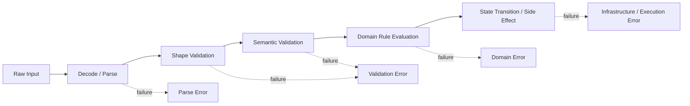
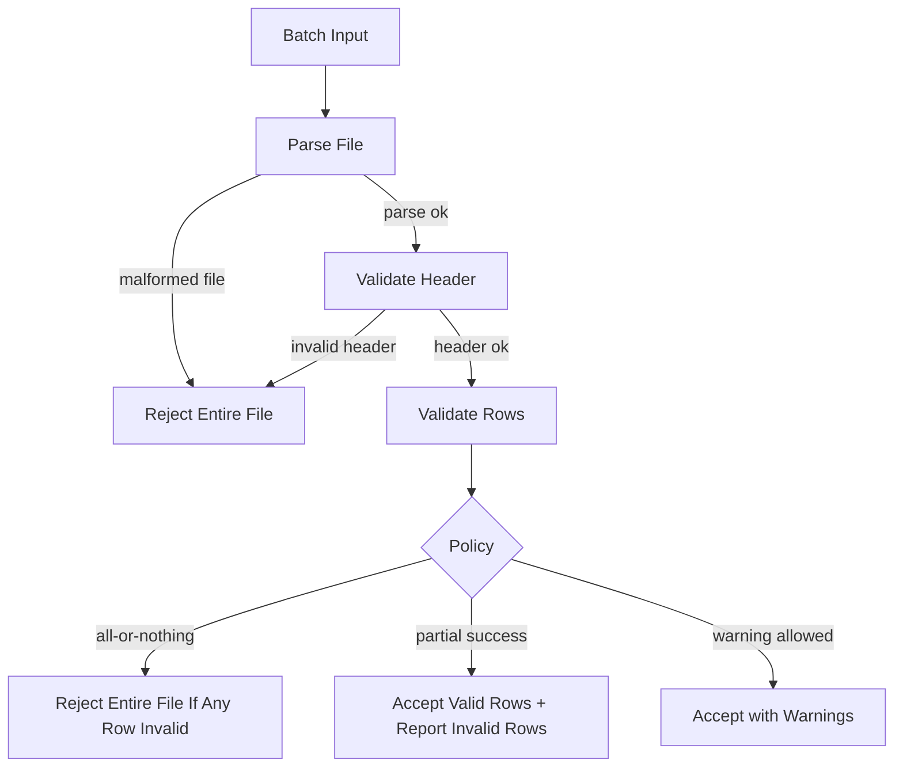
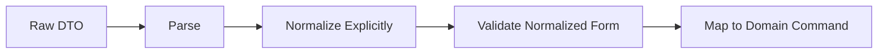
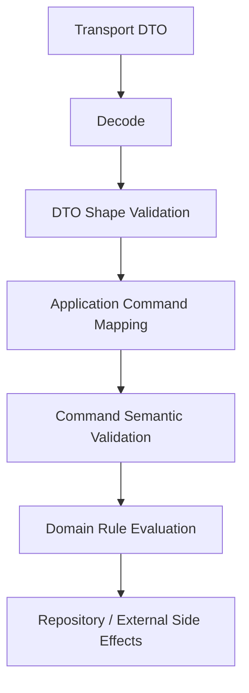
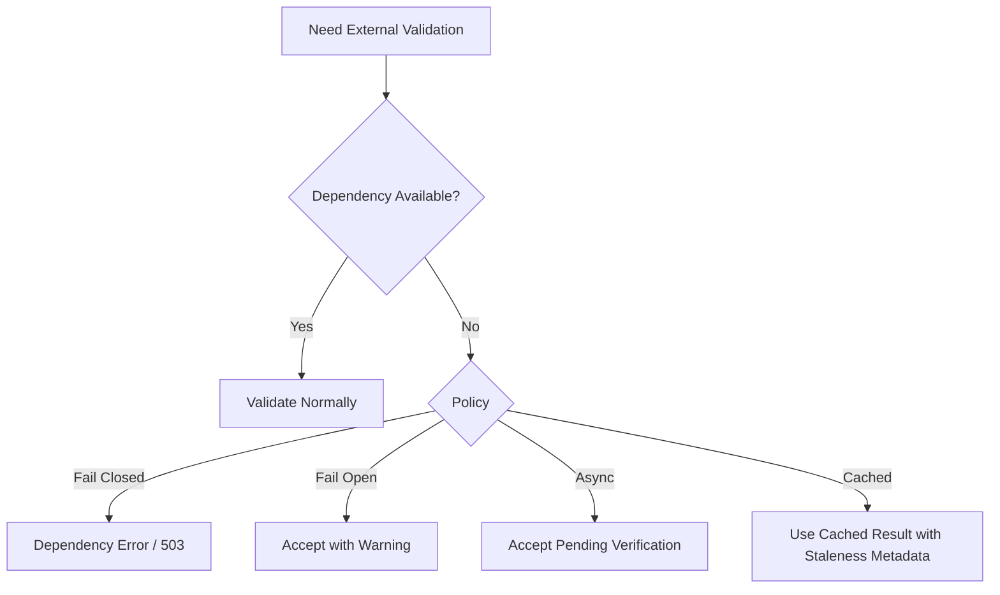
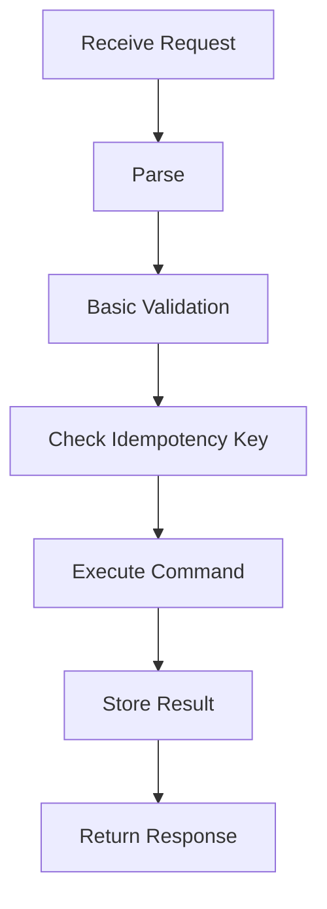
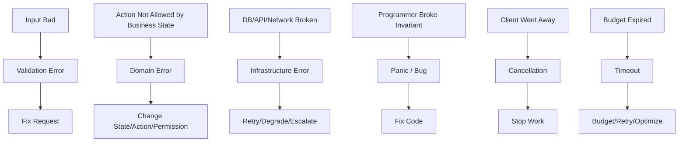

# learn-go-reliability-error-handling-part-008.md

# Validation Error, Field Error, dan Aggregated Error

> Seri: `learn-go-reliability-error-handling`  
> Part: `008`  
> Target pembaca: Java software engineer yang ingin menguasai Go reliability/error handling pada level production engineering handbook  
> Baseline Go: 1.26.x  
> Fokus: validation error sebagai kontrak deterministik, bukan sekadar pesan “input salah”

---

## 0. Posisi Part Ini dalam Seri

Pada part sebelumnya kita sudah membahas:

1. error/failure sebagai konsep sistem;
2. error sebagai API surface;
3. taxonomy error;
4. sentinel, typed, opaque error;
5. wrapping dan `errors.Is` / `errors.As` / `errors.Join`;
6. error boundary;
7. domain error model.

Part ini masuk ke area yang sangat sering diremehkan: **validation error**.

Banyak sistem production gagal bukan karena tidak punya validasi, tetapi karena validasinya:

- tersebar di layer yang salah;
- tidak punya taxonomy jelas;
- mencampur parsing error, validation error, authorization error, dan domain error;
- mengembalikan message yang tidak stabil;
- tidak bisa diobservasi;
- tidak aman terhadap PII/secrets;
- tidak mendukung batch/partial failure;
- tidak mempertahankan contract untuk API consumer;
- terlalu framework-driven sehingga domain rule bocor ke HTTP DTO;
- terlalu string-based sehingga test rapuh dan client susah otomatisasi.

Di Go, karena error adalah value, validation sebaiknya didesain sebagai **structured value** yang bisa:

- diperiksa program;
- dipetakan ke API response;
- dilog secara aman;
- di-audit jika perlu;
- dites secara stabil;
- digabung untuk banyak field;
- tetap terpisah dari domain dan infrastructure failure.

---

## 1. Core Thesis

Validation bukan hanya “mengecek input”.

Validation adalah **gatekeeping contract** yang memastikan data yang masuk ke sistem sudah memenuhi bentuk, batas, dan syarat minimal sebelum sistem menjalankan behavior yang lebih mahal, lebih stateful, atau lebih berisiko.



Yang membedakan engineer biasa dan engineer yang matang adalah kemampuan menjawab:

> “Error ini seharusnya berhenti di boundary mana, diklasifikasikan sebagai apa, dan contract apa yang boleh diketahui caller?”

---

## 2. Parsing Error vs Validation Error vs Domain Error

Tiga hal ini sering dicampur.

### 2.1 Parsing / Decoding Error

Parsing error berarti payload belum bisa dibaca sebagai struktur data yang valid.

Contoh:

- JSON malformed;
- XML tidak well-formed;
- body terlalu besar;
- tipe JSON salah;
- date string tidak bisa di-parse;
- base64 invalid;
- multipart boundary rusak.

Contoh Go:

```go
var req CreateCaseRequest

dec := json.NewDecoder(r.Body)
dec.DisallowUnknownFields()

if err := dec.Decode(&req); err != nil {
    return nil, NewBadRequestError("invalid_json", "request body is not valid JSON")
}
```

Ciri parsing error:

- belum masuk domain;
- biasanya HTTP `400 Bad Request`;
- tidak perlu mengevaluasi business rule;
- jangan expose raw decoder message jika bisa mengandung detail internal;
- boleh menyimpan detail internal di log dengan redaction.

`encoding/json.Decoder.DisallowUnknownFields` dapat dipakai untuk menolak field JSON yang tidak dikenal; secara default unknown object keys diabaikan saat decoding ke struct, kecuali decoder dikonfigurasi strict. Ini penting untuk API contract yang ingin mencegah silent client bug.

### 2.2 Shape Validation

Shape validation memastikan field yang sudah ter-decode memenuhi bentuk dasar.

Contoh:

- `case_id` required;
- `postal_code` length harus 6 digit;
- `email` format masuk akal;
- `amount` >= 0;
- `items` tidak kosong;
- `status` termasuk enum yang dikenal;
- `submitted_at` tidak boleh di masa depan;
- string length maksimum 255.

Ciri:

- deterministic;
- tidak butuh DB;
- tidak butuh external service;
- bisa dilakukan sebelum transaction;
- biasanya menghasilkan list field errors;
- biasanya HTTP `400`.

### 2.3 Semantic Validation

Semantic validation masih input-level, tetapi butuh pemahaman makna antar-field.

Contoh:

- `start_date <= end_date`;
- jika `application_type == "RENEWAL"`, maka `previous_license_id` wajib;
- jika `channel == "CORPPASS"`, maka `uen` wajib;
- `postal_code` dan `country` harus konsisten;
- field A dan B mutually exclusive;
- minimal salah satu dari beberapa field wajib ada.

Ciri:

- masih belum tergantung state database utama;
- dapat dianggap validation error;
- field target bisa lebih dari satu field;
- butuh error path yang bisa menunjuk field atau group.

### 2.4 Domain Rule Error

Domain error muncul ketika input sudah valid secara bentuk, tetapi operasi tidak boleh dilakukan berdasarkan state/rule bisnis.

Contoh:

- case sudah `APPROVED`, tidak boleh submit ulang;
- officer tidak boleh approve case yang dia assign sendiri;
- appeal window sudah tutup;
- license expired lebih dari batas policy;
- action invalid dari state saat ini;
- duplicate submission terdeteksi berdasarkan state sistem;
- version conflict karena optimistic lock.

Ciri:

- biasanya butuh state;
- bisa HTTP `409`, `422`, `403`, atau domain-specific mapping;
- perlu audit reason;
- bukan sekadar field validation;
- tidak boleh dicampur dengan JSON decoding error.

---

## 3. Kenapa Validation Error Harus Structured

Anti-pattern umum:

```go
return fmt.Errorf("invalid request")
```

Masalah:

- client tidak tahu field mana yang salah;
- UI tidak bisa highlight field;
- API consumer tidak bisa automate;
- test hanya bisa compare string;
- log tidak punya code;
- metric label akan kacau jika pakai raw message;
- translation/localization sulit;
- audit reason tidak stabil.

Validation error yang production-grade minimal punya:

```text
field/path + code + safe message + optional metadata
```

Contoh response:

```json
{
  "type": "https://api.example.com/problems/validation-error",
  "title": "Validation failed",
  "status": 400,
  "code": "VALIDATION_FAILED",
  "trace_id": "01J...",
  "errors": [
    {
      "path": "applicant.email",
      "code": "INVALID_EMAIL",
      "message": "email must be a valid email address"
    },
    {
      "path": "items[0].quantity",
      "code": "MIN_VALUE",
      "message": "quantity must be at least 1",
      "params": {
        "min": 1
      }
    }
  ]
}
```

RFC 9457 mendefinisikan format “problem details” untuk membawa detail error yang machine-readable dalam HTTP API dan menggantikan RFC 7807. Format ini berguna sebagai envelope umum, tetapi field-level validation detail biasanya tetap perlu extension sendiri.

---

## 4. Validation Error Shape di Go

Kita mulai dari model minimal yang tidak bergantung framework.

```go
package validation

import (
	"errors"
	"fmt"
	"strings"
)

var ErrValidation = errors.New("validation failed")

type FieldError struct {
	Path    string         `json:"path"`
	Code    string         `json:"code"`
	Message string         `json:"message"`
	Params  map[string]any `json:"params,omitempty"`
}

type Error struct {
	Fields []FieldError
}

func (e *Error) Error() string {
	if e == nil || len(e.Fields) == 0 {
		return ErrValidation.Error()
	}

	var b strings.Builder
	b.WriteString("validation failed")

	limit := len(e.Fields)
	if limit > 3 {
		limit = 3
	}

	for i := 0; i < limit; i++ {
		f := e.Fields[i]
		b.WriteString(": ")
		b.WriteString(f.Path)
		b.WriteString(" ")
		b.WriteString(f.Code)
	}

	if len(e.Fields) > limit {
		b.WriteString(fmt.Sprintf(": and %d more", len(e.Fields)-limit))
	}

	return b.String()
}

func (e *Error) Is(target error) bool {
	return target == ErrValidation
}

func (e *Error) Empty() bool {
	return e == nil || len(e.Fields) == 0
}

func (e *Error) Add(path, code, message string, params map[string]any) {
	e.Fields = append(e.Fields, FieldError{
		Path:    path,
		Code:    code,
		Message: message,
		Params:  params,
	})
}
```

Pemakaian:

```go
func ValidateCreateCase(req CreateCaseRequest) error {
	var v validation.Error

	if strings.TrimSpace(req.ApplicantName) == "" {
		v.Add("applicant_name", "REQUIRED", "applicant_name is required", nil)
	}

	if req.Amount < 0 {
		v.Add("amount", "MIN_VALUE", "amount must be greater than or equal to 0", map[string]any{
			"min": 0,
		})
	}

	if req.StartDate.After(req.EndDate) {
		v.Add("end_date", "DATE_ORDER", "end_date must be on or after start_date", map[string]any{
			"start_path": "start_date",
		})
	}

	if v.Empty() {
		return nil
	}
	return &v
}
```

Caller:

```go
if err := ValidateCreateCase(req); err != nil {
	if errors.Is(err, validation.ErrValidation) {
		// map to HTTP 400
	}
	return err
}
```

Ambil metadata:

```go
var vErr *validation.Error
if errors.As(err, &vErr) {
	for _, field := range vErr.Fields {
		// build API response
	}
}
```

---

## 5. `errors.Join` vs Custom Aggregated Validation Error

Go punya `errors.Join`, yang menggabungkan beberapa error menjadi satu error tree. Package `errors` mendukung error wrapping dengan `Unwrap() error` maupun `Unwrap() []error`; `errors.Join` membuang nilai nil dan mengembalikan nil jika semua argumen nil.

Namun untuk validation error, `errors.Join` tidak selalu ideal sebagai bentuk utama.

### 5.1 Kapan `errors.Join` Cocok

Cocok ketika:

- tiap error sudah punya type yang bermakna;
- caller cukup perlu `errors.Is` / `errors.As`;
- bukan field-level API detail;
- jumlah error kecil;
- error berasal dari beberapa validator independen.

Contoh:

```go
func Validate(req Request) error {
	return errors.Join(
		validateIdentity(req.Identity),
		validateAddress(req.Address),
		validateItems(req.Items),
	)
}
```

### 5.2 Kapan Custom Aggregated Error Lebih Baik

Lebih baik ketika:

- perlu `path`;
- perlu stable code;
- perlu API response field errors;
- perlu message aman;
- perlu params;
- perlu ordering;
- perlu grouping;
- perlu batch row number;
- perlu limit jumlah error;
- perlu localization.

Validation error untuk API hampir selalu lebih cocok sebagai custom type.

### 5.3 Hybrid Approach

Kita bisa menggabungkan keduanya:

```go
type Error struct {
	Fields []FieldError
	Cause  error
}

func (e *Error) Unwrap() error {
	return e.Cause
}
```

Atau:

```go
type Error struct {
	Fields []FieldError
	Causes []error
}

func (e *Error) Unwrap() []error {
	return e.Causes
}
```

Tetapi hati-hati: multi-error tree bisa membuat boundary mapping lebih kompleks. Jangan buat “clever” jika kebutuhan nyata hanya field validation.

---

## 6. Field Path Design

Field path harus stabil. Ini bukan sekadar string cantik.

Path dipakai oleh:

- frontend untuk highlight field;
- API consumer untuk mapping error;
- test contract;
- monitoring sample;
- support/debugging;
- documentation;
- batch import report.

Ada beberapa gaya:

### 6.1 JSON Pointer

Contoh:

```text
/applicant/email
/items/0/quantity
```

Kelebihan:

- standar;
- cocok untuk JSON document.

Kekurangan:

- kurang natural untuk manusia non-technical;
- butuh escaping `~0`, `~1`.

### 6.2 Dot Path

Contoh:

```text
applicant.email
items[0].quantity
```

Kelebihan:

- readable;
- mudah untuk UI;
- umum dipakai.

Kekurangan:

- bukan standar universal;
- perlu convention untuk array.

### 6.3 Domain Path

Contoh:

```text
application.applicant.email
submission.items[0].quantity
```

Kelebihan:

- stabil jika API DTO berubah;
- cocok untuk domain-heavy system.

Kekurangan:

- butuh mapping ke DTO.

Untuk kebanyakan service internal/enterprise, dot path cukup baik asalkan didokumentasikan.

---

## 7. Error Code Design

Message bisa berubah. Code harus stabil.

Bad:

```json
{
  "message": "Email is invalid"
}
```

Better:

```json
{
  "code": "INVALID_EMAIL",
  "message": "email must be a valid email address"
}
```

Code dipakai untuk:

- frontend behavior;
- translation;
- tests;
- docs;
- analytics;
- support runbook;
- API compatibility;
- alert filtering.

### 7.1 Code Naming Rule

Gunakan code yang:

- uppercase snake case;
- stabil;
- tidak terlalu granular;
- tidak mengandung nilai runtime;
- tidak mengandung nama library;
- tidak berubah hanya karena message berubah.

Contoh baik:

```text
REQUIRED
INVALID_FORMAT
MIN_LENGTH
MAX_LENGTH
MIN_VALUE
MAX_VALUE
INVALID_ENUM
DATE_ORDER
MUTUALLY_EXCLUSIVE
AT_LEAST_ONE_REQUIRED
DUPLICATE_ITEM
INVALID_REFERENCE_FORMAT
```

Contoh buruk:

```text
EmailValidatorFailed
invalid email: missing @
go_json_decode_error_123
username_must_be_between_5_and_20_chars
```

### 7.2 Global Code vs Field Code

Ada dua tingkat:

```json
{
  "code": "VALIDATION_FAILED",
  "errors": [
    { "path": "email", "code": "INVALID_EMAIL" }
  ]
}
```

Global code menjelaskan kategori response.

Field code menjelaskan detail field.

---

## 8. Message Design untuk Validation

Validation message harus:

- safe untuk user;
- jelas;
- tidak membocorkan internal rule engine;
- tidak mengandung secret;
- tidak bergantung pada library error;
- tidak terlalu teknis;
- tidak menjadi satu-satunya contract.

Contoh buruk:

```text
validator: Key: 'CreateCaseRequest.Applicant.Email' Error:Field validation for 'Email' failed on the 'email' tag
```

Contoh baik:

```text
email must be a valid email address
```

Contoh buruk untuk security:

```text
uen 201912345A exists but belongs to another tenant internal id 88123
```

Contoh lebih aman:

```text
uen is not valid for this request
```

---

## 9. Required, Empty, Zero Value, dan Optional Field

Di Go, zero value sering membuat validation tricky.

Contoh:

```go
type Request struct {
	Amount int `json:"amount"`
}
```

Masalah:

- jika client tidak mengirim `amount`, nilainya `0`;
- jika client mengirim `amount: 0`, nilainya juga `0`;
- apakah `0` valid?
- apakah field required?

Jika butuh membedakan missing vs zero, gunakan pointer atau custom decoder.

```go
type Request struct {
	Amount *int `json:"amount"`
}

func Validate(req Request) error {
	var v validation.Error

	if req.Amount == nil {
		v.Add("amount", "REQUIRED", "amount is required", nil)
	} else if *req.Amount < 0 {
		v.Add("amount", "MIN_VALUE", "amount must be greater than or equal to 0", map[string]any{
			"min": 0,
		})
	}

	if v.Empty() {
		return nil
	}
	return &v
}
```

Trade-off:

- pointer field membuat DTO lebih verbose;
- tetapi contract lebih akurat;
- untuk API boundary ini sering worth it;
- jangan pakai pointer di domain model hanya demi DTO validation.

---

## 10. Enum Validation

Go tidak punya enum built-in seperti Java enum. Biasanya memakai typed string/int.

```go
type ApplicationType string

const (
	ApplicationTypeNew     ApplicationType = "NEW"
	ApplicationTypeRenewal ApplicationType = "RENEWAL"
	ApplicationTypeAppeal  ApplicationType = "APPEAL"
)

func (t ApplicationType) Valid() bool {
	switch t {
	case ApplicationTypeNew, ApplicationTypeRenewal, ApplicationTypeAppeal:
		return true
	default:
		return false
	}
}
```

Validation:

```go
if !req.ApplicationType.Valid() {
	v.Add("application_type", "INVALID_ENUM", "application_type must be one of NEW, RENEWAL, APPEAL", map[string]any{
		"allowed": []string{"NEW", "RENEWAL", "APPEAL"},
	})
}
```

Important:

- allowed values boleh dikembalikan jika bukan sensitive;
- jangan expose internal state enum jika belum menjadi public API;
- enum public adalah compatibility commitment.

---

## 11. Cross-Field Validation

Cross-field validation tidak selalu punya satu path.

Contoh:

```go
if req.StartDate.After(req.EndDate) {
	v.Add("end_date", "DATE_ORDER", "end_date must be on or after start_date", map[string]any{
		"related": []string{"start_date"},
	})
}
```

Untuk mutually exclusive:

```go
if req.Email != nil && req.Phone != nil {
	v.Add("contact", "MUTUALLY_EXCLUSIVE", "only one of email or phone may be provided", map[string]any{
		"fields": []string{"email", "phone"},
	})
}
```

Untuk at least one:

```go
if req.Email == nil && req.Phone == nil {
	v.Add("contact", "AT_LEAST_ONE_REQUIRED", "at least one of email or phone is required", map[string]any{
		"fields": []string{"email", "phone"},
	})
}
```

Prinsip:

- field path boleh menunjuk group logis;
- metadata boleh menyimpan field terkait;
- message tetap user-safe;
- code tetap stabil.

---

## 12. Validation untuk Collection

Contoh:

```go
for i, item := range req.Items {
	path := fmt.Sprintf("items[%d]", i)

	if item.Quantity <= 0 {
		v.Add(path+".quantity", "MIN_VALUE", "quantity must be at least 1", map[string]any{
			"min": 1,
		})
	}

	if strings.TrimSpace(item.SKU) == "" {
		v.Add(path+".sku", "REQUIRED", "sku is required", nil)
	}
}
```

Tetapi untuk list besar, jangan return ribuan error.

Gunakan limit:

```go
const maxFieldErrors = 100

func addLimited(v *validation.Error, path, code, message string, params map[string]any) {
	if len(v.Fields) >= maxFieldErrors {
		return
	}
	v.Add(path, code, message, params)
}
```

Tambahkan flag response:

```json
{
  "code": "VALIDATION_FAILED",
  "truncated": true,
  "errors": []
}
```

Kenapa limit penting:

- mencegah response terlalu besar;
- mencegah log bloat;
- mencegah DoS via invalid payload besar;
- menjaga UX tetap usable.

---

## 13. Batch Validation

Batch import berbeda dari request tunggal.

Contoh: upload CSV 50.000 row.

Kita butuh:

- row number;
- column name;
- record id opsional;
- severity;
- reject row atau reject file;
- truncated error count;
- summary count;
- partial success policy.

Model:

```go
type BatchFieldError struct {
	Row     int            `json:"row"`
	Path    string         `json:"path"`
	Code    string         `json:"code"`
	Message string         `json:"message"`
	Params  map[string]any `json:"params,omitempty"`
}

type BatchValidationError struct {
	FileLevel []validation.FieldError `json:"file_errors,omitempty"`
	Rows      []BatchFieldError       `json:"row_errors,omitempty"`
	Truncated bool                    `json:"truncated,omitempty"`
}

func (e *BatchValidationError) Error() string {
	return "batch validation failed"
}

func (e *BatchValidationError) Is(target error) bool {
	return target == validation.ErrValidation
}
```

Policy decision:



Dalam regulatory system, policy harus eksplisit. Jangan “partial success” diam-diam jika user mengira semua row berhasil.

---

## 14. Validation Severity: Error vs Warning

Tidak semua validation finding harus menolak request.

Contoh warning:

- alamat tampak tidak lengkap;
- phone number format lama;
- duplicate optional attachment name;
- deprecated field dipakai;
- suspicious but allowed value.

Model:

```go
type Severity string

const (
	SeverityError   Severity = "ERROR"
	SeverityWarning Severity = "WARNING"
)

type Finding struct {
	Severity Severity       `json:"severity"`
	Path     string         `json:"path"`
	Code     string         `json:"code"`
	Message  string         `json:"message"`
	Params   map[string]any `json:"params,omitempty"`
}
```

Namun hati-hati:

- warning harus punya UX jelas;
- warning tidak boleh disalahgunakan untuk rule yang sebenarnya wajib;
- warning mungkin perlu audit;
- warning bisa menjadi future breaking change jika nanti diubah menjadi error.

---

## 15. Security Validation

OWASP menekankan input validation sebagai kontrol keamanan dasar: input harus divalidasi sebelum diproses lebih lanjut, idealnya dengan allowlist/positive validation ketika memungkinkan.

Prinsip security validation:

1. validate server-side;
2. jangan percaya frontend;
3. gunakan allowlist untuk enum/pattern yang jelas;
4. limit ukuran input;
5. limit jumlah item;
6. limit nesting/depth jika format memungkinkan;
7. reject unknown fields jika contract strict;
8. normalize sebelum membandingkan;
9. hindari regex catastrophic backtracking;
10. jangan tampilkan detail internal parser;
11. jangan log payload raw berisi PII/secrets.

### 15.1 Input Size Limit

HTTP handler:

```go
const maxBodyBytes = 1 << 20 // 1 MiB

r.Body = http.MaxBytesReader(w, r.Body, maxBodyBytes)
```

Tanpa body limit, validasi bisa dipakai sebagai attack surface.

### 15.2 String Length Limit

```go
if len(req.Description) > 4000 {
	v.Add("description", "MAX_LENGTH", "description must be at most 4000 bytes", map[string]any{
		"max": 4000,
	})
}
```

Catatan:

- `len(string)` menghitung byte, bukan rune;
- untuk user-facing character count, gunakan rune count;
- storage limit sering byte-based;
- UI limit dan DB limit harus konsisten.

### 15.3 Regex Validation

Hindari regex yang terlalu kompleks. Go regexp memakai RE2-style engine dan menghindari catastrophic backtracking seperti beberapa engine backtracking, tetapi regex tetap bisa mahal secara CPU jika dipakai sembarangan pada input besar. Tetap batasi ukuran input.

---

## 16. Normalization vs Validation

Normalization mengubah input.

Validation memutuskan input diterima atau tidak.

Contoh normalization:

- trim spaces;
- lower-case email domain;
- normalize Unicode;
- canonicalize phone number;
- parse date ke `time.Time`;
- remove formatting dash dari postal code.

Bahaya:

- normalization bisa mengubah makna;
- audit harus tahu nilai asli atau normalized?
- signature/idempotency fingerprint harus pakai yang mana?
- security comparison harus consistent.

Pattern yang baik:



Jangan normalisasi diam-diam di dalam domain entity jika API consumer perlu tahu alasan input diterima/ditolak.

---

## 17. Validation Layering

Layering umum:



### 17.1 DTO Validation

Cocok untuk:

- required field;
- format;
- length;
- enum;
- JSON-specific contract;
- unknown field;
- body size.

### 17.2 Command Validation

Cocok untuk:

- normalized semantic rule;
- cross-field business input;
- invariants before domain execution;
- usecase-specific requirement.

### 17.3 Domain Validation

Cocok untuk:

- state transition;
- permission in domain sense;
- policy rule;
- aggregate invariant;
- lifecycle rule.

### 17.4 Persistence Constraint

Cocok untuk:

- uniqueness guard;
- foreign key guard;
- optimistic version guard;
- data integrity backup.

Tetapi persistence constraint error harus diterjemahkan ke domain/validation/conflict error di boundary yang tepat.

---

## 18. Validation Library vs Hand-Written Validation

Go ecosystem punya banyak library, tetapi materi ini sengaja fokus ke mental model.

### 18.1 Library Advantage

- cepat;
- declarative tags;
- common validators;
- less boilerplate;
- familiar untuk DTO.

### 18.2 Library Risk

- error message library bocor ke API;
- tag rule menjadi domain rule tersembunyi;
- complex cross-field rule sulit dibaca;
- version upgrade bisa mengubah error behavior;
- testing sering menjadi string-based;
- reflection overhead biasanya bukan issue besar, tetapi tetap ada;
- rule tersebar di struct tag.

### 18.3 Rule of Thumb

Gunakan library untuk shape validation sederhana, tetapi:

- convert library errors ke internal `validation.Error`;
- jangan expose library message;
- jangan taruh domain lifecycle rule di tag;
- tetap punya code stable;
- tetap test response contract.

Pattern:

```go
func ValidateDTO(req CreateCaseRequest) error {
	if err := externalValidator.Struct(req); err != nil {
		return convertValidatorError(err)
	}
	return nil
}
```

---

## 19. API Response Mapping

Validation error biasanya dipetakan ke HTTP `400 Bad Request`.

Namun ada nuance:

| Situation | Likely HTTP Status |
|---|---:|
| Malformed JSON | 400 |
| Unknown field in strict API | 400 |
| Missing required field | 400 |
| Invalid enum | 400 |
| Cross-field invalid input | 400 |
| Valid shape but semantically unprocessable in API design | 422 |
| Version conflict | 409 |
| Duplicate idempotency key conflict | 409 |
| Unauthorized | 401 |
| Forbidden action | 403 |
| Resource not found | 404 |
| Too many items / rate-ish input abuse | 400 or 413 or 429 |

Dalam banyak internal enterprise API, konsistensi lebih penting daripada debat 400 vs 422. Pilih contract, dokumentasikan, dan stabilkan.

Problem Details style:

```go
type Problem struct {
	Type     string         `json:"type"`
	Title    string         `json:"title"`
	Status   int            `json:"status"`
	Code     string         `json:"code"`
	Detail   string         `json:"detail,omitempty"`
	TraceID  string         `json:"trace_id,omitempty"`
	Errors   []FieldProblem `json:"errors,omitempty"`
}

type FieldProblem struct {
	Path    string         `json:"path"`
	Code    string         `json:"code"`
	Message string         `json:"message"`
	Params  map[string]any `json:"params,omitempty"`
}
```

Mapping:

```go
func ProblemFromError(err error, traceID string) (Problem, int) {
	var vErr *validation.Error
	if errors.As(err, &vErr) {
		fields := make([]FieldProblem, 0, len(vErr.Fields))
		for _, f := range vErr.Fields {
			fields = append(fields, FieldProblem{
				Path:    f.Path,
				Code:    f.Code,
				Message: f.Message,
				Params:  f.Params,
			})
		}

		return Problem{
			Type:    "https://api.example.com/problems/validation-error",
			Title:   "Validation failed",
			Status:  http.StatusBadRequest,
			Code:    "VALIDATION_FAILED",
			TraceID: traceID,
			Errors:  fields,
		}, http.StatusBadRequest
	}

	return Problem{
		Type:    "https://api.example.com/problems/internal-error",
		Title:   "Internal server error",
		Status:  http.StatusInternalServerError,
		Code:    "INTERNAL_ERROR",
		TraceID: traceID,
	}, http.StatusInternalServerError
}
```

---

## 20. Validation and Observability

Validation error biasanya bukan alert.

Tetapi validation metrics tetap berguna:

- client integration quality;
- bad API usage;
- attack attempt;
- UI bug;
- contract drift;
- rollout issue.

Metric yang aman:

```text
api_validation_failures_total{
  route="/cases",
  method="POST",
  code="INVALID_ENUM"
}
```

Hindari:

```text
api_validation_failures_total{
  message="email foo@bar is invalid"
}
```

Masalah cardinality:

- jangan label dengan raw value;
- jangan label dengan path berisi index besar jika banyak variasi;
- jangan label dengan user id;
- jangan label dengan request id;
- jangan label dengan raw message.

Logging:

```go
logger.InfoContext(ctx, "request validation failed",
	"route", "/cases",
	"method", "POST",
	"field_error_count", len(vErr.Fields),
	"codes", summarizeCodes(vErr.Fields),
)
```

Jangan log seluruh payload raw.

---

## 21. Validation and Audit

Tidak semua validation error perlu audit. Tetapi dalam regulatory system, beberapa rejection mungkin perlu audit.

Contoh perlu audit:

- submission rejected because mandatory declaration missing;
- officer action rejected because lifecycle rule violated;
- batch import rejected due to invalid mandatory license identifiers;
- attempt to use unauthorized entity reference.

Tetapi bedakan:

- audit user/business action;
- log technical diagnostics.

Audit event sebaiknya punya stable reason code:

```json
{
  "event": "CASE_SUBMISSION_REJECTED",
  "actor_id": "u123",
  "case_id": "draft-789",
  "reason_code": "VALIDATION_FAILED",
  "field_codes": ["REQUIRED", "INVALID_ENUM"],
  "timestamp": "2026-06-22T10:15:00Z"
}
```

Jangan audit raw full request jika mengandung sensitive data.

---

## 22. Validation and Retry

Validation error hampir selalu non-retryable sampai input berubah.

Namun hati-hati dengan error yang terlihat seperti validation tapi sebenarnya dependency failure.

Contoh:

```text
postal code is invalid
```

Jika hasil ini berasal dari external address API yang timeout, itu bukan validation error. Itu dependency error atau degraded validation.

Policy options:

1. fail closed: request ditolak jika validation dependency unavailable;
2. fail open: request diterima dengan warning/pending verification;
3. async validation: request diterima lalu diverifikasi background;
4. cached validation: pakai stale cache.

Jangan mengubah dependency timeout menjadi validation error palsu.



---

## 23. Validation and Idempotency

Validation harus terjadi sebelum side effect. Tetapi idempotency complicates this.

Typical ordering:



Nuance:

- Jika request invalid, apakah idempotency result disimpan?
- Jika sama idempotency key dipakai dengan payload berbeda, apakah `409`?
- Jika validation rules berubah antara request pertama dan replay, response apa yang dikembalikan?
- Jika request lama valid dulu tapi invalid sekarang, replay harus return stored result, bukan revalidate ulang.

Best practice:

- validate shape enough to extract idempotency key safely;
- compute request fingerprint from canonical payload;
- if idempotency key exists, compare fingerprint;
- return stored result for same fingerprint;
- do not re-execute validation for completed idempotent result unless contract mengharuskan.

---

## 24. Validation and Authorization

Jangan bocorkan authorization via validation.

Contoh buruk:

```json
{
  "path": "agency_id",
  "code": "AGENCY_EXISTS_BUT_NOT_ASSIGNED_TO_YOU"
}
```

Lebih aman:

```json
{
  "code": "FORBIDDEN",
  "message": "you are not allowed to perform this action"
}
```

Prinsip:

- validate shape dulu;
- authorization sebelum mengekspos existence/detail resource;
- domain validation setelah authorization jika detail rule boleh diketahui;
- not found vs forbidden harus diputuskan secara security-aware.

---

## 25. Validation and Database Constraints

Database constraint sering menjadi guard terakhir.

Contoh unique constraint:

```text
unique_violation on case.reference_no
```

Jangan expose:

```json
{
  "message": "ORA-00001: unique constraint ACEAS.CASE_REF_UK violated"
}
```

Translate:

```json
{
  "code": "DUPLICATE_REFERENCE",
  "message": "reference number already exists"
}
```

Tetapi ini mungkin bukan validation error. Bisa jadi conflict.

Mapping:

- duplicate user-provided unique field: `409 Conflict` atau `400`, tergantung API contract;
- stale version: `409`;
- FK missing due to invalid provided id: bisa `400` / `404`;
- DB unavailable: `503` / `500`, bukan validation.

---

## 26. Validation Error Package Design

Contoh struktur:

```text
internal/
  validation/
    error.go
    builder.go
    codes.go
    path.go
  api/
    problem.go
  cases/
    create_request.go
    create_validation.go
```

`internal/validation/codes.go`:

```go
package validation

const (
	CodeRequired          = "REQUIRED"
	CodeInvalidFormat     = "INVALID_FORMAT"
	CodeInvalidEnum       = "INVALID_ENUM"
	CodeMinLength         = "MIN_LENGTH"
	CodeMaxLength         = "MAX_LENGTH"
	CodeMinValue          = "MIN_VALUE"
	CodeMaxValue          = "MAX_VALUE"
	CodeDateOrder         = "DATE_ORDER"
	CodeMutuallyExclusive = "MUTUALLY_EXCLUSIVE"
	CodeAtLeastOne        = "AT_LEAST_ONE_REQUIRED"
	CodeDuplicateItem     = "DUPLICATE_ITEM"
)
```

Builder:

```go
package validation

type Builder struct {
	err Error
	max int
}

func NewBuilder(max int) *Builder {
	if max <= 0 {
		max = 100
	}
	return &Builder{max: max}
}

func (b *Builder) Add(path, code, message string, params map[string]any) {
	if len(b.err.Fields) >= b.max {
		return
	}
	b.err.Add(path, code, message, params)
}

func (b *Builder) Err() error {
	if b.err.Empty() {
		return nil
	}
	return &b.err
}
```

Usage:

```go
func Validate(req CreateCaseRequest) error {
	v := validation.NewBuilder(100)

	v.Required("applicant.name", req.Applicant.Name)
	v.MaxLength("applicant.name", req.Applicant.Name, 255)

	if !req.ApplicationType.Valid() {
		v.Add("application_type", validation.CodeInvalidEnum,
			"application_type is invalid",
			map[string]any{"allowed": []string{"NEW", "RENEWAL", "APPEAL"}},
		)
	}

	return v.Err()
}
```

---

## 27. Helper Methods: Useful but Don’t Over-Abstract

Helper:

```go
func (b *Builder) Required(path, value string) {
	if strings.TrimSpace(value) == "" {
		b.Add(path, CodeRequired, path+" is required", nil)
	}
}
```

Masalah: message `path+" is required"` tidak selalu user-friendly.

Better:

```go
func (b *Builder) Required(path, label, value string) {
	if strings.TrimSpace(value) == "" {
		b.Add(path, CodeRequired, label+" is required", nil)
	}
}
```

Usage:

```go
v.Required("applicant.name", "applicant name", req.Applicant.Name)
```

Tetapi jangan terlalu banyak DSL sampai validation logic jadi sulit dibaca.

---

## 28. Testing Validation Error

Test jangan compare full error string.

Bad:

```go
if got := err.Error(); got != "validation failed: applicant.email INVALID_EMAIL" {
	t.Fatalf("unexpected error: %s", got)
}
```

Better:

```go
func TestValidateCreateCase_EmailRequired(t *testing.T) {
	err := ValidateCreateCase(CreateCaseRequest{})

	if !errors.Is(err, validation.ErrValidation) {
		t.Fatalf("expected validation error, got %v", err)
	}

	var vErr *validation.Error
	if !errors.As(err, &vErr) {
		t.Fatalf("expected *validation.Error, got %T", err)
	}

	assertFieldError(t, vErr, "applicant.email", validation.CodeRequired)
}

func assertFieldError(t *testing.T, err *validation.Error, path, code string) {
	t.Helper()

	for _, f := range err.Fields {
		if f.Path == path && f.Code == code {
			return
		}
	}

	t.Fatalf("missing field error path=%s code=%s in %+v", path, code, err.Fields)
}
```

Test contract:

- expected path;
- expected code;
- maybe params;
- maybe count;
- not raw message unless message is public API contract.

---

## 29. Golden Test untuk API Error Response

Untuk public API, response shape perlu stabil.

Golden-ish assertion:

```go
func TestCreateCase_InvalidRequest_Response(t *testing.T) {
	body := `{"application_type":"UNKNOWN"}`

	req := httptest.NewRequest(http.MethodPost, "/cases", strings.NewReader(body))
	rec := httptest.NewRecorder()

	handler.ServeHTTP(rec, req)

	if rec.Code != http.StatusBadRequest {
		t.Fatalf("status=%d", rec.Code)
	}

	var problem api.Problem
	if err := json.NewDecoder(rec.Body).Decode(&problem); err != nil {
		t.Fatal(err)
	}

	if problem.Code != "VALIDATION_FAILED" {
		t.Fatalf("code=%s", problem.Code)
	}

	requireFieldProblem(t, problem.Errors, "application_type", "INVALID_ENUM")
}
```

Jangan assert `trace_id` exact.

---

## 30. Common Anti-Patterns

### 30.1 Exposing Library Validation String

Bad:

```json
{
  "message": "Key: 'Request.Email' Error:Field validation for 'Email' failed on the 'email' tag"
}
```

Kenapa buruk:

- tidak user-friendly;
- leaks Go struct name;
- unstable;
- difficult for clients.

### 30.2 Throwing All Invalid Conditions into Validation

Bad:

```go
if dbDown {
	return validation.New("agency_id", "INVALID_AGENCY", "agency is invalid")
}
```

DB down bukan invalid agency.

### 30.3 Returning First Error Only

Kadang boleh. Tetapi untuk form/API biasanya buruk karena user memperbaiki satu per satu.

Better: return aggregated field errors.

### 30.4 Validating Everything Everywhere

Jika DTO, service, domain, repository semua mengulang rule yang sama, rule akan drift.

Gunakan boundary yang jelas.

### 30.5 Using Raw Message as Client Contract

Bad:

```js
if (error.message.includes("email")) showEmailError()
```

Use code/path.

### 30.6 Overusing Reflection Tags for Business Rule

Bad:

```go
type ApproveCaseRequest struct {
	Status string `validate:"eq=PENDING"`
}
```

State rule “case must be pending” bukan property DTO; itu domain state rule.

### 30.7 Ignoring Unknown JSON Fields Accidentally

Jika contract strict, unknown field harus error. Jika contract forward-compatible, unknown boleh diabaikan. Yang buruk adalah tidak sadar default behavior.

### 30.8 Logging Full Invalid Payload

Bisa bocor PII/secrets dan memperbesar log.

---

## 31. Case Study: Regulatory Case Submission

### 31.1 Requirement

User submit case:

- `application_type` wajib dan harus salah satu enum;
- `applicant.name` wajib;
- `applicant.email` optional tetapi jika ada harus valid;
- `declaration.accepted` wajib true;
- jika `application_type == RENEWAL`, `previous_license_id` wajib;
- attachments maksimal 10;
- setiap attachment wajib punya `document_type`;
- duplicate `document_type` tidak boleh untuk tipe tertentu;
- officer action dilakukan nanti oleh domain rule, bukan validation.

### 31.2 DTO

```go
type SubmitCaseRequest struct {
	ApplicationType  ApplicationType   `json:"application_type"`
	Applicant       ApplicantDTO       `json:"applicant"`
	Declaration     DeclarationDTO     `json:"declaration"`
	PreviousLicense *string            `json:"previous_license_id,omitempty"`
	Attachments     []AttachmentDTO    `json:"attachments"`
}

type ApplicantDTO struct {
	Name  string  `json:"name"`
	Email *string `json:"email,omitempty"`
}

type DeclarationDTO struct {
	Accepted bool `json:"accepted"`
}

type AttachmentDTO struct {
	DocumentType string `json:"document_type"`
	FileID       string `json:"file_id"`
}
```

### 31.3 Validator

```go
func ValidateSubmitCase(req SubmitCaseRequest) error {
	v := validation.NewBuilder(100)

	if !req.ApplicationType.Valid() {
		v.Add("application_type", validation.CodeInvalidEnum,
			"application_type is invalid",
			map[string]any{"allowed": []string{"NEW", "RENEWAL", "APPEAL"}},
		)
	}

	v.Required("applicant.name", "applicant name", req.Applicant.Name)
	v.MaxLength("applicant.name", "applicant name", req.Applicant.Name, 255)

	if req.Applicant.Email != nil && !looksLikeEmail(*req.Applicant.Email) {
		v.Add("applicant.email", "INVALID_EMAIL",
			"applicant email must be a valid email address", nil)
	}

	if !req.Declaration.Accepted {
		v.Add("declaration.accepted", "MUST_BE_TRUE",
			"declaration must be accepted", nil)
	}

	if req.ApplicationType == ApplicationTypeRenewal {
		if req.PreviousLicense == nil || strings.TrimSpace(*req.PreviousLicense) == "" {
			v.Add("previous_license_id", validation.CodeRequired,
				"previous_license_id is required for renewal applications", nil)
		}
	}

	if len(req.Attachments) > 10 {
		v.Add("attachments", validation.CodeMaxLength,
			"attachments must contain at most 10 items",
			map[string]any{"max": 10})
	}

	seenDocTypes := map[string]int{}
	for i, att := range req.Attachments {
		base := fmt.Sprintf("attachments[%d]", i)

		v.Required(base+".document_type", "document type", att.DocumentType)
		v.Required(base+".file_id", "file id", att.FileID)

		if prev, ok := seenDocTypes[att.DocumentType]; ok && att.DocumentType == "IDENTITY_DOCUMENT" {
			v.Add(base+".document_type", validation.CodeDuplicateItem,
				"document type must not be duplicated",
				map[string]any{
					"first_index": prev,
				})
		}
		seenDocTypes[att.DocumentType] = i
	}

	return v.Err()
}
```

### 31.4 What Not to Put Here

Jangan masukkan:

- “case must be DRAFT”;
- “officer cannot approve own case”;
- “agency quota exhausted”;
- “license already renewed”;
- “DB says applicant not found because DB timeout”.

Itu bukan DTO validation.

---

## 32. Validation Decision Matrix

| Question | If Yes | Error Category |
|---|---|---|
| Payload cannot be parsed? | reject before validation | parse/decode error |
| Required field missing? | return field error | validation |
| Field format invalid? | return field error | validation |
| Cross-field input inconsistent? | return group/field error | validation |
| Requires current DB state? | evaluate in service/domain | domain/conflict/not found |
| Dependency unavailable during check? | do not fake invalid | dependency/timeout |
| User not allowed? | authz/domain depending boundary | forbidden/domain |
| Duplicate due to DB unique constraint? | translate carefully | conflict or validation |
| Batch has invalid rows? | apply batch policy | batch validation |
| Same request replayed? | use idempotency result | not new validation |

---

## 33. Production Checklist

Sebelum menganggap validation layer production-grade, pastikan:

- [ ] Parsing error dipisah dari validation error.
- [ ] Validation error dipisah dari domain error.
- [ ] Validation error punya stable global code.
- [ ] Field error punya stable path.
- [ ] Field error punya stable code.
- [ ] Message aman untuk user.
- [ ] Tidak expose library/internal struct name.
- [ ] Tidak expose DB constraint raw.
- [ ] Tidak expose PII/secrets.
- [ ] Unknown field policy jelas.
- [ ] Body size limit ada.
- [ ] Collection size limit ada.
- [ ] Error count limit ada.
- [ ] Batch partial success policy jelas.
- [ ] API response contract terdokumentasi.
- [ ] Metrics tidak high-cardinality.
- [ ] Logs tidak memuat payload raw.
- [ ] Tests assert code/path, bukan raw string.
- [ ] Domain lifecycle rule tidak ditaruh di DTO tag.
- [ ] External validation dependency failure tidak dipalsukan menjadi invalid input.
- [ ] Idempotency interaction jelas.
- [ ] Authorization interaction aman.
- [ ] Localization/translation tidak mengubah code.

---

## 34. Mental Model Final

Validation adalah layer yang menjawab:

> “Apakah request ini cukup valid untuk masuk ke behavior sistem berikutnya?”

Bukan:

> “Apakah operasi ini pasti boleh berhasil?”

Perbedaan itu penting.

Validation menolak input buruk.  
Domain menolak aksi yang tidak sah menurut state/rule.  
Infrastructure bisa gagal walaupun input dan domain rule benar.



Top-tier Go engineer tidak hanya menulis:

```go
if err != nil {
    return err
}
```

Mereka mendesain **apa arti error itu**, siapa yang boleh melihatnya, bagaimana ia dipulihkan, bagaimana ia diobservasi, dan bagaimana ia tetap stabil saat sistem berkembang.

---

## 35. Referensi

- Go standard library `errors`: `errors.Is`, `errors.As`, `errors.Join`, wrapping semantics.
- Go standard library `encoding/json`: decoding behavior dan `Decoder.DisallowUnknownFields`.
- OWASP Input Validation Cheat Sheet: server-side input validation, allowlist, size constraints, security mindset.
- RFC 9457: Problem Details for HTTP APIs.
- Go standard library `net/http`: request body handling and response mapping.
- Previous parts in this series: error taxonomy, error boundary, domain error model.

---

## 36. Status Seri

Selesai:

- `learn-go-reliability-error-handling-part-000.md`
- `learn-go-reliability-error-handling-part-001.md`
- `learn-go-reliability-error-handling-part-002.md`
- `learn-go-reliability-error-handling-part-003.md`
- `learn-go-reliability-error-handling-part-004.md`
- `learn-go-reliability-error-handling-part-005.md`
- `learn-go-reliability-error-handling-part-006.md`
- `learn-go-reliability-error-handling-part-007.md`
- `learn-go-reliability-error-handling-part-008.md`

Seri belum selesai.

Bagian berikutnya:

```text
learn-go-reliability-error-handling-part-009.md
Panic, Recover, Fatal, dan Crash Semantics
```


<!-- NAVIGATION_FOOTER -->
<div class="page-nav">
<a href="./learn-go-reliability-error-handling-part-007.md">⬅️ Domain Error Model: Business Errors yang Tidak Tercampur dengan Infrastructure Errors</a>
<a href="./index.md">📚 Kategori</a>
<a href="../../index.md">🏠 Home</a>
<a href="./learn-go-reliability-error-handling-part-009.md">Part 009 — Panic, Recover, Fatal, dan Crash Semantics ➡️</a>
</div>
