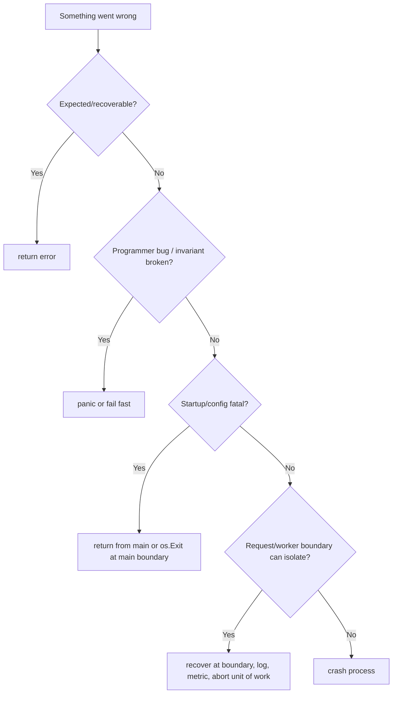
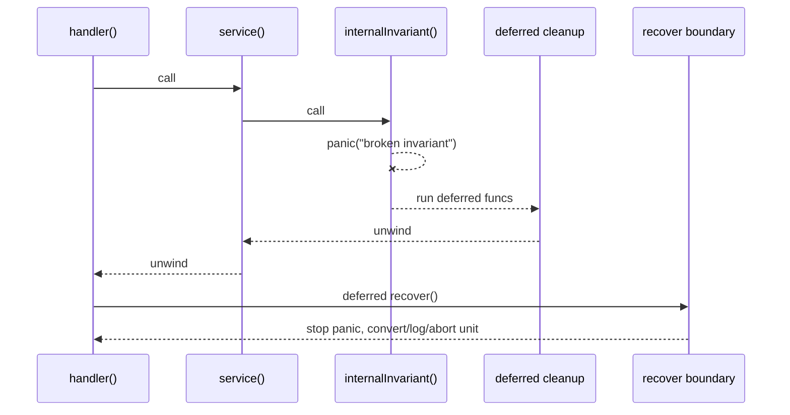
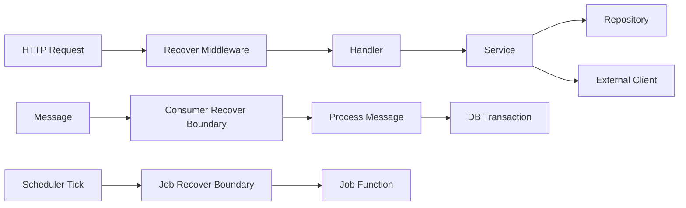
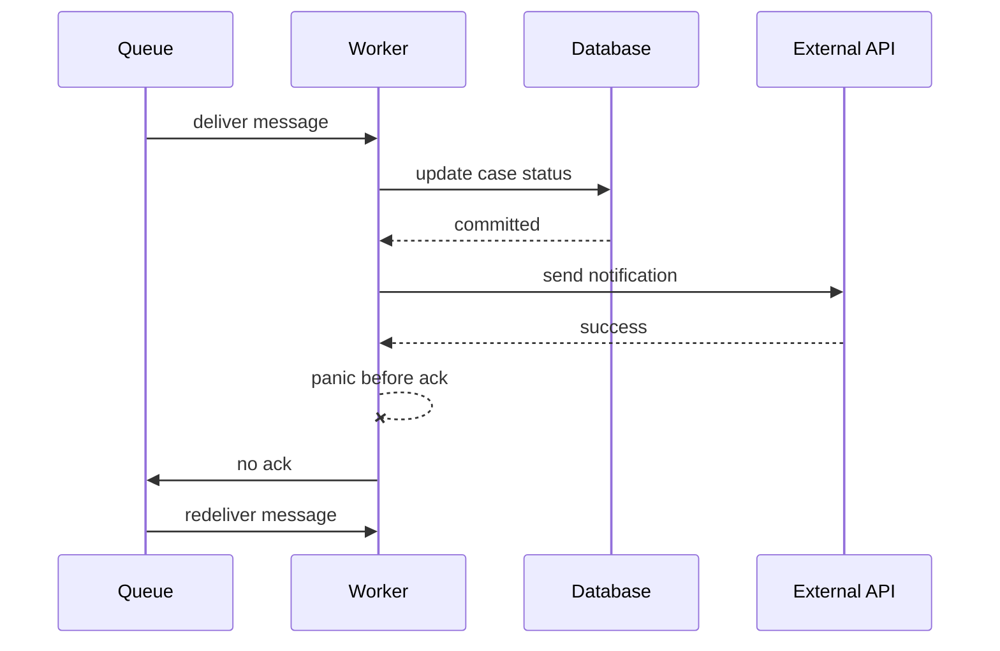
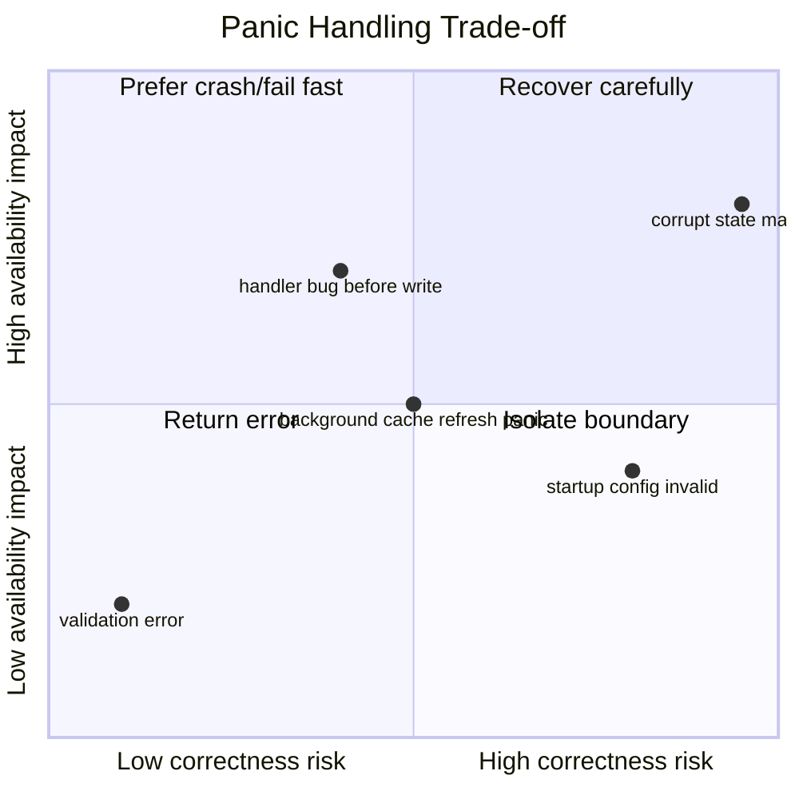

# learn-go-reliability-error-handling-part-009.md

# Part 009 — Panic, Recover, Fatal, dan Crash Semantics

> Seri: `learn-go-reliability-error-handling`  
> Target pembaca: Java software engineer yang ingin membangun reliability mindset tingkat production/internal engineering handbook.  
> Baseline bahasa: Go 1.26.x.  
> Fokus bagian ini: memahami kapan sebuah kondisi harus menjadi `error`, kapan boleh `panic`, kapan harus crash, kapan boleh `recover`, dan bagaimana membangun boundary yang tidak menyembunyikan corruption.

---

## 0. Posisi Part Ini dalam Seri

Pada part sebelumnya kita sudah membahas:

1. error sebagai API surface,
2. taxonomy failure,
3. sentinel/typed/opaque error,
4. wrapping dan error chain,
5. desain pesan error,
6. error boundary,
7. domain error,
8. validation dan aggregated error.

Part ini masuk ke wilayah yang sering disalahpahami oleh Java engineer ketika berpindah ke Go:

> “Kalau Go tidak punya exception seperti Java, apakah `panic/recover` adalah penggantinya?”

Jawaban pendeknya:

> Tidak. `panic/recover` bukan pengganti normal exception handling. Dalam production Go, `panic` adalah mekanisme untuk kondisi abnormal, invariant violation, programmer error, atau kondisi fatal yang tidak aman untuk dilanjutkan. Normal failure harus memakai `error`.

Part ini akan membangun mental model yang lebih presisi:



Tujuan akhirnya adalah agar kita bisa menjawab pertanyaan berikut dengan disiplin:

- Apakah kondisi ini normal failure atau broken invariant?
- Apakah caller bisa melakukan sesuatu yang berguna?
- Apakah aman melanjutkan proses setelah kondisi ini terjadi?
- Apakah recovery menyelamatkan availability atau justru menyembunyikan corruption?
- Apakah `recover` ditempatkan di boundary yang tepat?
- Apakah `log.Fatal` dipakai di tempat yang tidak semestinya?
- Apakah goroutine panic bisa membunuh seluruh proses?
- Apakah panic handler kita tetap menjaga observability dan auditability?

---

## 1. Mental Model Utama

### 1.1 Error adalah bagian dari kontrak; panic adalah pelanggaran asumsi

Dalam Go, `error` dipakai untuk kondisi yang masih berada dalam ruang kemungkinan normal sistem.

Contoh:

- input invalid,
- user tidak punya permission,
- record tidak ditemukan,
- dependency timeout,
- database deadlock,
- optimistic lock conflict,
- message broker unavailable,
- context canceled,
- request body terlalu besar,
- state transition ditolak oleh business rule.

Semua itu bukan alasan otomatis untuk `panic`.

Sebaliknya, `panic` lebih cocok untuk:

- invariant internal rusak,
- impossible state tercapai,
- bug programmer,
- dependency critical tidak boleh nil tapi nil,
- switch enum internal tidak exhaustive,
- memory/data structure internal corrupt,
- package internal ingin abort stack di dalam boundary lokal lalu di-convert menjadi error,
- startup gagal karena konfigurasi wajib invalid, jika sudah berada di composition root.

Contoh mental model:

```go
func ApproveCase(c Case, actor Actor) error {
    if actor.ID == "" {
        // Expected invalid input / caller problem.
        return validation.FieldRequired("actor.id")
    }

    if c.Status != StatusSubmitted {
        // Expected business rejection.
        return domain.InvalidTransition{
            From: string(c.Status),
            To:   string(StatusApproved),
            Rule: "CASE_APPROVAL_ONLY_FROM_SUBMITTED",
        }
    }

    if c.ID == "" {
        // Internal invariant violation.
        // A persisted case should never exist without ID.
        panic("case invariant violated: empty id")
    }

    return nil
}
```

Pertanyaannya bukan “apakah ini error?” tetapi:

> “Apakah ini bagian dari contract yang caller harus bisa handle, atau bukti bahwa program berada dalam state yang tidak valid?”

---

## 2. Java Exception Mindset vs Go Panic Mindset

Java engineer biasanya terbiasa dengan beberapa kategori:

- checked exception,
- unchecked exception,
- runtime exception,
- error,
- try/catch/finally,
- global exception handler,
- transactional exception rollback,
- framework exception translation.

Di Java, exception sering menjadi mekanisme umum untuk:

- validation failure,
- not found,
- business rule rejection,
- DB error,
- remote call failure,
- unexpected bug.

Di Go, satu mekanisme `panic` tidak seharusnya menggantikan semua itu.

### 2.1 Perbandingan konseptual

| Konsep | Java | Go |
|---|---|---|
| Normal recoverable failure | sering exception | `error` return |
| Business rejection | sering custom exception | typed/domain `error` |
| Validation failure | exception atau result object | validation `error`/field error |
| Programmer bug | `RuntimeException`, `AssertionError`, `Error` | `panic` atau fail fast |
| Cleanup | `finally` / try-with-resources | `defer` |
| Global handler | framework exception handler | explicit boundary/middleware/worker wrapper |
| Stack unwinding normal flow | umum | tidak idiomatis untuk normal error |
| Catch everything | sering ada | berbahaya jika menyembunyikan corruption |

### 2.2 Jangan mengubah Go menjadi Java berkostum Go

Anti-pattern Java-style di Go:

```go
func CreateUser(req CreateUserRequest) (user User) {
    if req.Email == "" {
        panic("email is required")
    }

    user, err := repo.Insert(req)
    if err != nil {
        panic(err)
    }

    return user
}
```

Ini buruk karena:

1. validation adalah expected failure,
2. repository error adalah dependency failure,
3. caller kehilangan kesempatan membuat response yang benar,
4. testing menjadi rapuh,
5. transaction/cleanup bisa menjadi tidak jelas,
6. panic boundary menjadi terlalu luas,
7. error classification hilang.

Versi Go yang lebih sehat:

```go
func CreateUser(ctx context.Context, req CreateUserRequest) (User, error) {
    if req.Email == "" {
        return User{}, validation.FieldRequired("email")
    }

    user, err := repo.Insert(ctx, req)
    if err != nil {
        return User{}, fmt.Errorf("insert user: %w", err)
    }

    return user, nil
}
```

---

## 3. Apa yang Terjadi Saat `panic`?

Secara konsep, ketika `panic` terjadi:

1. eksekusi normal goroutine berhenti,
2. deferred functions pada stack goroutine tersebut dijalankan secara LIFO,
3. stack goroutine mulai unwind,
4. jika ada deferred function yang memanggil `recover` secara benar, panic berhenti,
5. jika tidak ada recovery, program crash.

Diagram:



Penting:

- `panic` terjadi per goroutine.
- `recover` hanya bisa menangkap panic dari goroutine yang sama.
- Deferred cleanup tetap berjalan selama unwinding.
- `os.Exit` tidak menjalankan defer.

---

## 4. `recover` Bukan `catch` Umum

### 4.1 `recover` hanya bekerja di deferred function

Benar:

```go
func boundary() {
    defer func() {
        if r := recover(); r != nil {
            fmt.Println("recovered:", r)
        }
    }()

    doSomethingThatMayPanic()
}
```

Salah:

```go
func boundary() {
    if r := recover(); r != nil {
        fmt.Println("will not work here", r)
    }

    doSomethingThatMayPanic()
}
```

Salah juga secara praktis:

```go
func boundary() {
    defer recover() // return value ignored; no handling; not useful
    doSomethingThatMayPanic()
}
```

### 4.2 Recover hanya untuk goroutine yang sama

Ini tidak bisa menangkap panic dari goroutine lain:

```go
func main() {
    defer func() {
        if r := recover(); r != nil {
            fmt.Println("recovered", r)
        }
    }()

    go func() {
        panic("boom")
    }()

    time.Sleep(time.Second)
}
```

Panic dalam goroutine background harus punya boundary sendiri:

```go
func GoSafe(logger *slog.Logger, name string, fn func()) {
    go func() {
        defer func() {
            if r := recover(); r != nil {
                logger.Error("goroutine panic recovered",
                    "goroutine", name,
                    "panic", r,
                    "stack", string(debug.Stack()),
                )
            }
        }()

        fn()
    }()
}
```

Namun jangan langsung menganggap `GoSafe` selalu benar. Untuk beberapa panic, crash lebih aman daripada recover.

---

## 5. Decision Framework: Return Error, Panic, Recover, Fatal, atau Crash?

### 5.1 Pertanyaan utama

Gunakan pertanyaan ini sebagai decision tree:

1. Apakah kondisi ini mungkin terjadi karena input/user/dependency/runtime normal?
   - Ya → return `error`.
2. Apakah caller bisa mengambil keputusan bermakna?
   - Ya → return typed/classifiable `error`.
3. Apakah kondisi ini menunjukkan bug atau invariant internal rusak?
   - Ya → `panic` atau fail fast.
4. Apakah kondisi terjadi saat startup dan service tidak dapat melayani request dengan benar?
   - Ya → fail startup.
5. Apakah unit of work bisa diisolasi?
   - Ya → recover di boundary unit tersebut, log stack, abort unit of work.
6. Apakah melanjutkan proses bisa menyebabkan data corruption/security violation?
   - Ya → crash.

### 5.2 Decision table

| Kondisi | Mechanism | Kenapa |
|---|---:|---|
| Request JSON invalid | return validation error | expected client failure |
| Business transition invalid | return domain error | expected business rejection |
| DB timeout | return dependency error | caller/boundary menentukan retry/response |
| Context canceled | return context error | lifecycle signal |
| Missing required config at startup | fail startup | service tidak valid |
| Nil required dependency after initialization | panic/fail fast | composition invariant broken |
| Impossible enum branch internal | panic | programmer bug |
| Corrupt in-memory index | panic/crash | unsafe to continue |
| Handler panic from bug | recover at request boundary or crash depending policy | isolate request, preserve availability |
| Worker panic | recover at worker boundary or crash depending side effect risk | avoid silent worker death |
| Library internal parsing shortcut | panic internally, recover inside same package, return error | local implementation detail only |
| Fatal signal SIGTERM | graceful shutdown | lifecycle event |
| `main` cannot bind port | return/log exit | startup failure |

---

## 6. Kapan `panic` Layak Dipakai?

### 6.1 Invariant violation

Invariant adalah sesuatu yang harus selalu benar jika program benar.

Contoh:

```go
type CaseStatus string

const (
    StatusDraft     CaseStatus = "DRAFT"
    StatusSubmitted CaseStatus = "SUBMITTED"
    StatusApproved  CaseStatus = "APPROVED"
    StatusRejected  CaseStatus = "REJECTED"
)

func mustKnownStatus(s CaseStatus) {
    switch s {
    case StatusDraft, StatusSubmitted, StatusApproved, StatusRejected:
        return
    default:
        panic(fmt.Sprintf("unknown internal case status: %q", s))
    }
}
```

Tetapi hati-hati: jika status berasal dari database/user/external system, mungkin itu bukan invariant internal, melainkan data compatibility/corruption error yang perlu diklasifikasikan.

Lebih aman pada boundary data:

```go
func ParseCaseStatus(raw string) (CaseStatus, error) {
    switch CaseStatus(raw) {
    case StatusDraft, StatusSubmitted, StatusApproved, StatusRejected:
        return CaseStatus(raw), nil
    default:
        return "", fmt.Errorf("parse case status: unknown value %q", raw)
    }
}
```

Lalu setelah masuk domain object valid, invariant boleh diasumsikan.

### 6.2 Programmer error

Contoh:

```go
func NewService(repo Repository, clock Clock) *Service {
    if repo == nil {
        panic("nil Repository")
    }
    if clock == nil {
        panic("nil Clock")
    }
    return &Service{repo: repo, clock: clock}
}
```

Ini reasonable jika constructor adalah internal composition invariant. Tetapi untuk public library, pilihan bisa berbeda. Public library kadang lebih baik return error agar caller bisa handle.

### 6.3 Exhaustive internal branch

```go
func priorityWeight(p Priority) int {
    switch p {
    case PriorityLow:
        return 1
    case PriorityNormal:
        return 10
    case PriorityHigh:
        return 100
    default:
        panic(fmt.Sprintf("unhandled priority: %q", p))
    }
}
```

### 6.4 Package-local panic/recover sebagai implementation detail

Ada pola yang kadang valid: panic dipakai di dalam package untuk menyederhanakan control flow yang dalam, lalu di-recover di boundary package dan dikembalikan sebagai error.

Contoh simplifikasi:

```go
type parsePanic struct {
    err error
}

func ParseDocument(input []byte) (doc Document, err error) {
    defer func() {
        if r := recover(); r != nil {
            if p, ok := r.(parsePanic); ok {
                err = p.err
                return
            }
            panic(r) // bukan panic milik parser; jangan ditelan
        }
    }()

    p := parser{input: input}
    return p.parse(), nil
}

func (p *parser) failf(format string, args ...any) {
    panic(parsePanic{err: fmt.Errorf(format, args...)})
}
```

Rule penting:

> Jika panic dipakai sebagai shortcut internal, recover harus berada di package boundary yang sama, dan hanya recover panic type milik package tersebut. Panic lain harus di-repanic.

---

## 7. Kapan `panic` Tidak Layak Dipakai?

### 7.1 Validation failure

Buruk:

```go
if req.Amount <= 0 {
    panic("amount must be positive")
}
```

Lebih baik:

```go
if req.Amount <= 0 {
    return validation.FieldInvalid{
        Field: "amount",
        Code:  "AMOUNT_MUST_BE_POSITIVE",
    }
}
```

### 7.2 Not found

Buruk:

```go
caseData := repo.MustFindCase(ctx, id) // panic if not found
```

Lebih baik:

```go
caseData, err := repo.FindCase(ctx, id)
if err != nil {
    return fmt.Errorf("find case: %w", err)
}
```

### 7.3 Authorization/business rejection

Buruk:

```go
if !actor.CanApprove(c) {
    panic("forbidden")
}
```

Lebih baik:

```go
if !actor.CanApprove(c) {
    return domain.ForbiddenAction{
        Code:   "CASE_APPROVAL_FORBIDDEN",
        Actor:  actor.ID,
        CaseID: c.ID,
    }
}
```

### 7.4 Dependency failure

Buruk:

```go
resp, err := client.Do(req)
if err != nil {
    panic(err)
}
```

Lebih baik:

```go
resp, err := client.Do(req)
if err != nil {
    return fmt.Errorf("call document service: %w", err)
}
```

### 7.5 Library API normal failure

Jika membuat reusable package, jangan memaksa caller menghadapi panic untuk kondisi yang bisa diprediksi.

Buruk:

```go
func DecodeConfig(data []byte) Config {
    if len(data) == 0 {
        panic("empty config")
    }
    // ...
}
```

Lebih baik:

```go
func DecodeConfig(data []byte) (Config, error) {
    if len(data) == 0 {
        return Config{}, errors.New("decode config: empty input")
    }
    // ...
}
```

---

## 8. Recover Boundary

### 8.1 Boundary yang masuk akal

`recover` sebaiknya hanya berada di boundary yang jelas:

- HTTP middleware,
- gRPC interceptor,
- worker loop,
- scheduler job wrapper,
- message consumer unit-of-work,
- goroutine launcher wrapper,
- CLI command boundary,
- package-local boundary untuk internal panic.

Diagram:



### 8.2 Boundary yang buruk

Recover terlalu dalam:

```go
func (r Repo) Save(ctx context.Context, c Case) (err error) {
    defer func() {
        if x := recover(); x != nil {
            err = fmt.Errorf("repo panic: %v", x)
        }
    }()

    // ...
}
```

Masalah:

- repository menelan bug internal,
- stack mungkin hilang,
- transaction state bisa tidak jelas,
- caller mengira ini normal DB error,
- corruption bisa tersembunyi.

Recover terlalu luas:

```go
func main() {
    defer func() {
        if r := recover(); r != nil {
            log.Println("recovered everything", r)
        }
    }()

    runServer()
}
```

Masalah:

- service bisa masuk state setengah rusak,
- tidak ada unit-of-work boundary,
- fatal bug disembunyikan,
- orchestrator tidak mendapat sinyal process failure.

---

## 9. HTTP Panic Recovery

### 9.1 Kenapa HTTP boundary sering recover?

Dalam HTTP server, satu request adalah unit of work yang relatif bisa diisolasi. Jika handler panic karena bug, server bisa:

1. menghentikan request itu,
2. mengembalikan 500 jika response belum dikirim,
3. log stack trace,
4. increment metric,
5. menjaga process tetap hidup untuk request lain.

Skeleton:

```go
type statusRecorder struct {
    http.ResponseWriter
    wrote  bool
    status int
}

func (r *statusRecorder) WriteHeader(code int) {
    if r.wrote {
        return
    }
    r.wrote = true
    r.status = code
    r.ResponseWriter.WriteHeader(code)
}

func RecoverMiddleware(logger *slog.Logger) func(http.Handler) http.Handler {
    return func(next http.Handler) http.Handler {
        return http.HandlerFunc(func(w http.ResponseWriter, r *http.Request) {
            rec := &statusRecorder{ResponseWriter: w, status: http.StatusOK}

            defer func() {
                if x := recover(); x != nil {
                    logger.ErrorContext(r.Context(), "http handler panic",
                        "panic", x,
                        "method", r.Method,
                        "path", r.URL.Path,
                        "stack", string(debug.Stack()),
                    )

                    if !rec.wrote {
                        http.Error(rec, http.StatusText(http.StatusInternalServerError), http.StatusInternalServerError)
                    }
                }
            }()

            next.ServeHTTP(rec, r)
        })
    }
}
```

### 9.2 Problem: response sudah sebagian terkirim

Jika handler sudah menulis response lalu panic:

```go
func stream(w http.ResponseWriter, r *http.Request) {
    w.WriteHeader(http.StatusOK)
    w.Write([]byte("partial data\n"))

    panic("boom after partial response")
}
```

Middleware tidak bisa lagi mengubah status menjadi 500 secara reliable karena header/body mungkin sudah terkirim.

Strategi:

- hindari panic dalam streaming path,
- lakukan validation sebelum write,
- buffer response jika harus atomic,
- gunakan protocol-level error dalam stream,
- log dengan jelas bahwa response sudah committed,
- client contract harus mengakui partial response risk.

---

## 10. Worker Panic Recovery

### 10.1 Worker panic lebih berbahaya daripada HTTP panic

Dalam HTTP, request boundary relatif jelas. Dalam worker/message consumer, panic bisa terjadi setelah side effect sebagian dilakukan.

Contoh:



Jika worker recover dan ack sembarangan, data bisa hilang. Jika tidak ack, message bisa diproses ulang. Maka worker panic handling harus didesain bersama:

- idempotency,
- transaction boundary,
- ack/nack policy,
- DLQ policy,
- retry budget,
- side effect ordering.

### 10.2 Worker wrapper

```go
type Message interface {
    ID() string
    Ack() error
    Nack(requeue bool) error
}

func ConsumeOne(ctx context.Context, logger *slog.Logger, msg Message, handle func(context.Context, Message) error) {
    defer func() {
        if x := recover(); x != nil {
            logger.ErrorContext(ctx, "worker panic",
                "message_id", msg.ID(),
                "panic", x,
                "stack", string(debug.Stack()),
            )

            // Policy decision: usually do not ack after panic unless you can prove safe.
            _ = msg.Nack(true)
        }
    }()

    if err := handle(ctx, msg); err != nil {
        logger.ErrorContext(ctx, "message handling failed",
            "message_id", msg.ID(),
            "error", err,
        )
        _ = msg.Nack(shouldRequeue(err))
        return
    }

    if err := msg.Ack(); err != nil {
        logger.ErrorContext(ctx, "message ack failed",
            "message_id", msg.ID(),
            "error", err,
        )
    }
}
```

Catatan penting:

- `recover` tidak otomatis berarti sukses.
- Setelah panic, unit of work harus dianggap gagal kecuali terbukti aman.
- Ack after panic adalah keputusan berisiko tinggi.
- Untuk sistem regulatory, lebih aman redeliver/idempotent daripada silently drop.

---

## 11. Goroutine Panic Semantics

### 11.1 Panic dalam goroutine bisa mematikan proses

Jika sebuah goroutine panic dan tidak recover, program crash.

Contoh berbahaya:

```go
func StartBackgroundRefresh(cache *Cache) {
    go func() {
        for {
            cache.Refresh() // panic di sini bisa crash process
            time.Sleep(time.Minute)
        }
    }()
}
```

Lebih eksplisit:

```go
func StartBackgroundRefresh(ctx context.Context, logger *slog.Logger, cache *Cache) {
    go func() {
        defer func() {
            if x := recover(); x != nil {
                logger.ErrorContext(ctx, "cache refresh goroutine panic",
                    "panic", x,
                    "stack", string(debug.Stack()),
                )
            }
        }()

        ticker := time.NewTicker(time.Minute)
        defer ticker.Stop()

        for {
            select {
            case <-ctx.Done():
                return
            case <-ticker.C:
                if err := cache.Refresh(ctx); err != nil {
                    logger.WarnContext(ctx, "cache refresh failed", "error", err)
                }
            }
        }
    }()
}
```

Namun ada trade-off:

- Recover menjaga availability.
- Crash menjaga correctness jika panic menunjukkan corruption.

Untuk background loop penting, lebih baik punya supervisor yang tahu apakah harus restart goroutine atau crash process.

### 11.2 Supervisor pattern sederhana

```go
type PanicPolicy int

const (
    PanicPolicyLogAndStop PanicPolicy = iota
    PanicPolicyRestart
    PanicPolicyCrash
)

func RunSupervised(
    ctx context.Context,
    logger *slog.Logger,
    name string,
    policy PanicPolicy,
    fn func(context.Context) error,
) error {
    for {
        err := runOnce(ctx, logger, name, fn)
        if err == nil || ctx.Err() != nil {
            return err
        }

        var p panicError
        if errors.As(err, &p) {
            switch policy {
            case PanicPolicyLogAndStop:
                return err
            case PanicPolicyRestart:
                logger.ErrorContext(ctx, "restarting after panic", "name", name, "error", err)
                continue
            case PanicPolicyCrash:
                panic(p.Value)
            }
        }

        return err
    }
}

type panicError struct {
    Value any
    Stack []byte
}

func (e panicError) Error() string {
    return fmt.Sprintf("panic: %v", e.Value)
}

func runOnce(ctx context.Context, logger *slog.Logger, name string, fn func(context.Context) error) (err error) {
    defer func() {
        if x := recover(); x != nil {
            err = panicError{Value: x, Stack: debug.Stack()}
        }
    }()

    return fn(ctx)
}
```

---

## 12. `log.Fatal`, `panic`, `os.Exit`, dan `return error from main`

### 12.1 `log.Fatal`

`log.Fatal` menulis log lalu memanggil `os.Exit(1)`.

Konsekuensi penting:

- deferred functions tidak dijalankan,
- buffer/log/telemetry mungkin tidak flush,
- cleanup tidak terjadi,
- sulit dites,
- jika dipakai di library, caller kehilangan kontrol.

Buruk di library/package:

```go
func LoadConfig(path string) Config {
    data, err := os.ReadFile(path)
    if err != nil {
        log.Fatal(err) // Jangan lakukan ini di library.
    }
    // ...
}
```

Lebih baik:

```go
func LoadConfig(path string) (Config, error) {
    data, err := os.ReadFile(path)
    if err != nil {
        return Config{}, fmt.Errorf("read config: %w", err)
    }
    // ...
}
```

Di `main`, boleh:

```go
func main() {
    if err := run(); err != nil {
        log.Printf("fatal: %v", err)
        os.Exit(1)
    }
}

func run() error {
    cfg, err := LoadConfig("config.yaml")
    if err != nil {
        return err
    }
    return start(cfg)
}
```

Pattern `run() error` lebih testable daripada menaruh `log.Fatal` di banyak tempat.

### 12.2 `panic` vs `os.Exit`

| Mechanism | Defer jalan? | Stack trace? | Cocok untuk |
|---|---:|---:|---|
| `return error` | Ya | Tidak otomatis | normal failure |
| `panic` | Ya, selama unwinding | Ya jika tidak recovered | invariant violation/bug |
| `recover` | N/A | perlu log manual | boundary isolation |
| `log.Fatal` | Tidak | Tidak otomatis | `main` boundary sederhana |
| `os.Exit` | Tidak | Tidak | final process exit |

### 12.3 Hindari `os.Exit` di deep code

Buruk:

```go
func (s *Service) MustConnect() {
    if err := s.connect(); err != nil {
        os.Exit(1)
    }
}
```

Lebih baik:

```go
func (s *Service) Connect(ctx context.Context) error {
    if err := s.connect(ctx); err != nil {
        return fmt.Errorf("connect service: %w", err)
    }
    return nil
}
```

---

## 13. Startup Fatality vs Runtime Failure

Startup adalah fase khusus. Jika service belum menerima traffic, fail fast sering benar.

Contoh startup failure yang sebaiknya menghentikan service:

- config wajib missing,
- secret tidak bisa dibaca,
- port tidak bisa bind,
- database migration incompatible,
- required dependency client tidak bisa dibuat,
- invalid TLS certificate,
- invalid feature flag combination,
- schema version tidak kompatibel.

Namun runtime dependency failure belum tentu fatal.

```mermaid
flowchart TD
    A[Dependency unavailable] --> B{During startup?}
    B -->|Yes, required| C[fail startup]
    B -->|Yes, optional| D[start degraded or not ready]
    B -->|Runtime| E{return dependency error]
    E --> F[timeout/retry/degrade/circuit breaker]
```

Contoh:

```go
func run(ctx context.Context) error {
    cfg, err := config.Load()
    if err != nil {
        return fmt.Errorf("load config: %w", err)
    }

    db, err := sql.Open("postgres", cfg.DatabaseURL)
    if err != nil {
        return fmt.Errorf("open database: %w", err)
    }
    defer db.Close()

    pingCtx, cancel := context.WithTimeout(ctx, 5*time.Second)
    defer cancel()

    if err := db.PingContext(pingCtx); err != nil {
        return fmt.Errorf("ping database: %w", err)
    }

    return serve(ctx, cfg, db)
}
```

---

## 14. Crash-Only Thinking

Crash-only design bukan berarti sembarang crash. Maksudnya:

> Jika state internal sudah tidak dapat dipercaya, lebih aman crash cepat dan biarkan orchestrator memulai instance baru daripada melanjutkan dalam state corrupt.

Cocok untuk:

- memory corruption assumption,
- global cache invariant rusak,
- crypto/key material invariant rusak,
- impossible state pada consensus/ledger-like flow,
- unsafe partial initialization,
- concurrency bug yang merusak shared state.

Tidak cocok untuk:

- validation error,
- user not found,
- dependency timeout,
- normal conflict,
- transient network failure.

### 14.1 Availability vs correctness

Recover meningkatkan availability lokal, tetapi bisa menurunkan correctness jika panic menandakan state corrupt.



---

## 15. Panic and Transaction Safety

Panic dalam transaction harus rollback.

Pattern:

```go
func WithTx(ctx context.Context, db *sql.DB, fn func(context.Context, *sql.Tx) error) (err error) {
    tx, err := db.BeginTx(ctx, nil)
    if err != nil {
        return fmt.Errorf("begin tx: %w", err)
    }

    defer func() {
        if p := recover(); p != nil {
            _ = tx.Rollback()
            panic(p)
        }

        if err != nil {
            _ = tx.Rollback()
            return
        }

        if commitErr := tx.Commit(); commitErr != nil {
            err = fmt.Errorf("commit tx: %w", commitErr)
        }
    }()

    err = fn(ctx, tx)
    return err
}
```

Kenapa re-panic?

- Transaction boundary bertanggung jawab cleanup.
- Tetapi tidak boleh mengubah bug menjadi normal error tanpa policy eksplisit.
- Panic tetap naik ke boundary yang lebih tepat.

Jika ingin convert panic menjadi error, lakukan hanya jika unit-of-work boundary memang memiliki policy itu.

```go
func WithTxRecovering(ctx context.Context, db *sql.DB, fn func(context.Context, *sql.Tx) error) (err error) {
    tx, err := db.BeginTx(ctx, nil)
    if err != nil {
        return fmt.Errorf("begin tx: %w", err)
    }

    defer func() {
        if p := recover(); p != nil {
            _ = tx.Rollback()
            err = panicError{Value: p, Stack: debug.Stack()}
            return
        }

        if err != nil {
            _ = tx.Rollback()
            return
        }

        if commitErr := tx.Commit(); commitErr != nil {
            err = fmt.Errorf("commit tx: %w", commitErr)
        }
    }()

    return fn(ctx, tx)
}
```

Gunakan versi recovering hanya jika caller benar-benar memperlakukan panic sebagai failed unit of work dan punya observability kuat.

---

## 16. Panic, Observability, dan Stack Trace

Jika recover dilakukan, runtime tidak otomatis mencetak stack trace ke stderr. Anda harus log stack secara eksplisit.

```go
logger.ErrorContext(ctx, "panic recovered",
    "panic", fmt.Sprint(x),
    "panic_type", fmt.Sprintf("%T", x),
    "stack", string(debug.Stack()),
)
```

Field yang biasanya penting:

- service name,
- environment,
- version/build SHA,
- request id,
- trace id,
- actor id jika aman,
- tenant/agency id jika aman,
- route/job name,
- message id,
- panic value,
- panic type,
- stack trace,
- whether response was already committed,
- unit-of-work outcome.

### 16.1 Metric

Jangan jadikan panic message sebagai label metric.

Buruk:

```text
panic_total{message="index out of range [10] with length 3"}
```

Lebih baik:

```text
panic_total{boundary="http", route="/cases/{id}/approve"}
```

Atau:

```text
panic_total{boundary="worker", job="case-notification"}
```

### 16.2 Alerting

Panic yang recovered tetap harus terlihat.

Kemungkinan alert:

- panic rate > threshold,
- any panic in critical worker,
- panic after deploy,
- panic in security/authorization path,
- panic correlated with 5xx spike,
- panic causing DLQ growth.

---

## 17. Panic and Security

Jangan expose panic value ke user.

Buruk:

```go
http.Error(w, fmt.Sprintf("panic: %v", x), http.StatusInternalServerError)
```

Lebih baik:

```go
http.Error(w, "internal server error", http.StatusInternalServerError)
```

Atau structured response:

```json
{
  "type": "about:blank",
  "title": "Internal Server Error",
  "status": 500,
  "code": "INTERNAL_ERROR",
  "trace_id": "01H..."
}
```

Security concerns:

- stack trace bisa mengandung path internal,
- panic value bisa mengandung SQL/query/secret,
- error string bisa mengandung PII,
- debug endpoint tidak boleh expose panic detail ke public,
- panic frequency bisa menjadi signal vulnerability.

---

## 18. Panic in Tests

### 18.1 Test bahwa function panic untuk programmer error

```go
func TestNewServicePanicsOnNilRepo(t *testing.T) {
    t.Parallel()

    defer func() {
        if r := recover(); r == nil {
            t.Fatal("expected panic")
        }
    }()

    _ = NewService(nil, systemClock{})
}
```

Helper:

```go
func requirePanic(t *testing.T, fn func()) any {
    t.Helper()

    defer func() {
        if r := recover(); r != nil {
            // captured through named return in real helper variant
        }
    }()

    fn()
    t.Fatal("expected panic")
    return nil
}
```

Versi helper yang benar:

```go
func capturePanic(fn func()) (value any, panicked bool) {
    defer func() {
        if r := recover(); r != nil {
            value = r
            panicked = true
        }
    }()

    fn()
    return nil, false
}
```

### 18.2 Test bahwa normal failure tidak panic

```go
func TestCreateUserInvalidEmailReturnsError(t *testing.T) {
    _, err := CreateUser(context.Background(), CreateUserRequest{})
    if err == nil {
        t.Fatal("expected error")
    }

    var verr validation.Error
    if !errors.As(err, &verr) {
        t.Fatalf("expected validation error, got %T: %v", err, err)
    }
}
```

### 18.3 Test recovery middleware

Hal yang perlu dites:

- panic menghasilkan HTTP 500 jika belum write,
- panic dilog,
- panic metric naik,
- stack disertakan di log internal,
- response tidak mengandung panic detail,
- panic setelah write tidak double-write,
- request id tetap ada.

---

## 19. Common Anti-Patterns

### 19.1 Panic untuk control flow normal

```go
func FindUser(id string) User {
    if id == "" {
        panic("missing id")
    }
    // ...
}
```

Ini membuat API tidak jujur.

### 19.2 Recover lalu ignore

```go
defer func() {
    recover()
}()
```

Ini sangat berbahaya karena:

- bug hilang,
- stack hilang,
- metric tidak naik,
- caller mengira sukses,
- corruption bisa menyebar.

### 19.3 Recover lalu return nil error

```go
defer func() {
    if recover() != nil {
        err = nil
    }
}()
```

Ini hampir selalu salah.

### 19.4 `log.Fatal` di library

```go
func MustLoad() Config {
    if err != nil {
        log.Fatal(err)
    }
}
```

Library tidak boleh memutuskan hidup/mati proses caller.

### 19.5 Convert semua panic menjadi 500 tanpa stack

```go
defer func() {
    if recover() != nil {
        http.Error(w, "internal server error", 500)
    }
}()
```

Response aman, tetapi observability buruk.

### 19.6 Recover terlalu rendah

Recover di repository/domain object sering menyembunyikan bug.

### 19.7 Panic dalam goroutine tanpa boundary

```go
go doImportantWork()
```

Jika `doImportantWork` panic, process bisa crash tanpa context log yang cukup.

### 19.8 Restart loop tanpa backoff

```go
for {
    runWorkerRecovering()
}
```

Jika bug deterministic, ini menjadi CPU/log storm.

---

## 20. Production Patterns

### 20.1 `main` dengan `run() error`

```go
func main() {
    if err := run(context.Background()); err != nil {
        slog.Error("service failed", "error", err)
        os.Exit(1)
    }
}

func run(ctx context.Context) error {
    cfg, err := LoadConfig()
    if err != nil {
        return fmt.Errorf("load config: %w", err)
    }

    app, err := NewApp(ctx, cfg)
    if err != nil {
        return fmt.Errorf("initialize app: %w", err)
    }
    defer app.Close()

    return app.Run(ctx)
}
```

### 20.2 Constructor fail-fast untuk programming invariant

```go
func NewCaseService(repo CaseRepository, policy PolicyEngine, logger *slog.Logger) *CaseService {
    switch {
    case repo == nil:
        panic("nil CaseRepository")
    case policy == nil:
        panic("nil PolicyEngine")
    case logger == nil:
        panic("nil Logger")
    }

    return &CaseService{repo: repo, policy: policy, logger: logger}
}
```

### 20.3 Public constructor return error untuk external config

```go
func NewHTTPClient(cfg HTTPClientConfig) (*HTTPClient, error) {
    if cfg.BaseURL == "" {
        return nil, validation.FieldRequired("base_url")
    }

    u, err := url.Parse(cfg.BaseURL)
    if err != nil {
        return nil, fmt.Errorf("parse base url: %w", err)
    }

    return &HTTPClient{baseURL: u}, nil
}
```

### 20.4 Panic boundary middleware

```go
func PanicBoundary(logger *slog.Logger, metrics Metrics) func(http.Handler) http.Handler {
    return func(next http.Handler) http.Handler {
        return http.HandlerFunc(func(w http.ResponseWriter, r *http.Request) {
            rec := &statusRecorder{ResponseWriter: w, status: http.StatusOK}

            defer func() {
                if x := recover(); x != nil {
                    metrics.IncPanic("http")
                    logger.ErrorContext(r.Context(), "panic recovered at http boundary",
                        "panic", fmt.Sprint(x),
                        "panic_type", fmt.Sprintf("%T", x),
                        "method", r.Method,
                        "path", routePattern(r),
                        "wrote_response", rec.wrote,
                        "stack", string(debug.Stack()),
                    )

                    if !rec.wrote {
                        writeInternalError(rec, r)
                    }
                }
            }()

            next.ServeHTTP(rec, r)
        })
    }
}
```

---

## 21. Regulatory/Case Management Lens

Dalam sistem regulatory/case management, kesalahan panic/fatal handling bisa berdampak besar:

- approval bisa double processed,
- audit trail bisa tidak lengkap,
- notification bisa terkirim tapi state tidak berubah,
- state berubah tapi event tidak dipublish,
- DLQ tumbuh tanpa alert,
- user melihat 500 tanpa correlation id,
- bug authorization bisa disembunyikan sebagai generic panic,
- evidence trail hilang karena process exit sebelum flush.

### 21.1 Example: approve case

Normal domain rejection:

```go
if c.Status != StatusSubmitted {
    return domain.InvalidTransition{
        Code: "CASE_INVALID_APPROVAL_TRANSITION",
        From: string(c.Status),
        To:   string(StatusApproved),
    }
}
```

Invariant violation:

```go
if c.ID == "" {
    panic("case invariant violated: empty id on persisted case")
}
```

Dependency failure:

```go
if err := repo.Save(ctx, c); err != nil {
    return fmt.Errorf("save approved case: %w", err)
}
```

Boundary mapping:

```go
func (h *Handler) Approve(w http.ResponseWriter, r *http.Request) error {
    err := h.service.Approve(r.Context(), caseID, actor)
    if err != nil {
        return err // adapter maps domain/dependency/internal
    }
    w.WriteHeader(http.StatusNoContent)
    return nil
}
```

Panic recover is not where domain rejection belongs. Panic recover is last line of defense for bugs.

---

## 22. Checklist: Panic/Recover/Fatal Design Review

Gunakan checklist ini saat code review.

### 22.1 Untuk setiap `panic`

- Apakah kondisi ini benar-benar programmer error/invariant violation?
- Apakah kondisi ini bisa terjadi karena input user/external system?
- Apakah caller bisa melakukan sesuatu jika diberi error?
- Apakah panic message tidak mengandung secret/PII?
- Apakah panic berada di package internal atau API public?
- Apakah ada test untuk panic jika itu bagian dari invariant?
- Apakah lebih baik return error?

### 22.2 Untuk setiap `recover`

- Apakah recover berada di boundary yang jelas?
- Apakah stack trace dilog?
- Apakah metric panic dinaikkan?
- Apakah response/user output aman?
- Apakah panic yang bukan milik package di-repanic?
- Apakah unit-of-work dianggap gagal?
- Apakah transaction/lock/resource dibersihkan?
- Apakah recovery bisa menyembunyikan corruption?

### 22.3 Untuk setiap `log.Fatal`/`os.Exit`

- Apakah hanya ada di `main` atau command boundary?
- Apakah defer/cleanup penting akan terlewati?
- Apakah telemetry perlu flush?
- Apakah function menjadi sulit dites?
- Apakah caller kehilangan kontrol?
- Apakah `run() error` lebih tepat?

### 22.4 Untuk goroutine

- Apakah goroutine punya panic boundary?
- Apakah panic policy jelas: stop, restart, atau crash?
- Apakah restart punya backoff?
- Apakah context cancellation dihormati?
- Apakah goroutine failure terlihat di log/metric?

---

## 23. Exercises

### Exercise 1 — Refactor Java-style panic flow

Refactor kode berikut menjadi Go-style error handling:

```go
func SubmitApplication(req SubmitRequest) ApplicationID {
    if req.ApplicantID == "" {
        panic("applicant id required")
    }

    id, err := repo.Insert(req)
    if err != nil {
        panic(err)
    }

    return id
}
```

Target:

- validation error,
- repository wrapping,
- no panic for expected failure,
- testable API.

### Exercise 2 — Design recover boundary for worker

Desain worker consumer yang:

- recover panic,
- rollback transaction,
- tidak ack jika panic,
- log stack,
- increment metric,
- redelivery safe dengan idempotency key.

### Exercise 3 — Decide crash vs recover

Klasifikasikan kondisi berikut:

1. JSON request invalid.
2. Required config missing at startup.
3. Unknown enum from database.
4. Unknown enum created by internal switch bug.
5. Redis timeout during optional cache lookup.
6. Panic in HTTP handler before response write.
7. Panic in worker after DB commit but before message ack.
8. Nil repository passed to service constructor.
9. Authorization policy engine returns inconsistent result.
10. Audit trail writer panic.

Untuk masing-masing, pilih:

- return error,
- panic,
- recover boundary,
- crash process,
- fail startup,
- degrade.

---

## 24. Ringkasan Mental Model

Prinsip penting:

1. `error` adalah mechanism untuk expected/recoverable failure.
2. `panic` adalah signal untuk broken invariant, programmer bug, atau kondisi yang tidak aman.
3. `recover` bukan `catch` umum.
4. Recover hanya boleh di boundary yang jelas.
5. Recover harus log stack dan menaikkan metric.
6. Panic di goroutine lain tidak bisa ditangkap dari parent goroutine.
7. `log.Fatal` dan `os.Exit` hampir selalu hanya layak di `main` boundary.
8. Startup failure berbeda dari runtime failure.
9. Worker panic lebih berbahaya daripada HTTP panic karena side effect bisa parsial.
10. Jika state tidak bisa dipercaya, crash lebih aman daripada lanjut.

Slogan praktis:

> Return errors for the world you expect. Panic for the world that proves your program is wrong. Recover only where you can safely isolate the damage.

---

## 25. Referensi

- Go Blog — Defer, Panic, and Recover: https://go.dev/blog/defer-panic-and-recover
- Go Specification — Handling panics: https://go.dev/ref/spec#Handling_panics
- Go Wiki — PanicAndRecover: https://go.dev/wiki/PanicAndRecover
- Go package `log`: https://pkg.go.dev/log
- Go package `runtime/debug`: https://pkg.go.dev/runtime/debug
- Go package `net/http`: https://pkg.go.dev/net/http
- Go Blog — Error handling and Go: https://go.dev/blog/error-handling-and-go
- Go Blog — Errors are values: https://go.dev/blog/errors-are-values

---

## 26. Status Seri

Part yang sudah selesai:

```text
learn-go-reliability-error-handling-part-000.md
learn-go-reliability-error-handling-part-001.md
learn-go-reliability-error-handling-part-002.md
learn-go-reliability-error-handling-part-003.md
learn-go-reliability-error-handling-part-004.md
learn-go-reliability-error-handling-part-005.md
learn-go-reliability-error-handling-part-006.md
learn-go-reliability-error-handling-part-007.md
learn-go-reliability-error-handling-part-008.md
learn-go-reliability-error-handling-part-009.md
```

Seri belum selesai.

Part berikutnya:

```text
learn-go-reliability-error-handling-part-010.md
Defer, Cleanup, Resource Safety, dan Failure During Cleanup
```

<!-- NAVIGATION_FOOTER -->
<div class="page-nav">
<a href="./learn-go-reliability-error-handling-part-008.md">⬅️ Validation Error, Field Error, dan Aggregated Error</a>
<a href="./index.md">📚 Kategori</a>
<a href="../../index.md">🏠 Home</a>
<a href="./learn-go-reliability-error-handling-part-010.md">Defer, Cleanup, Resource Safety, dan Failure During Cleanup ➡️</a>
</div>
