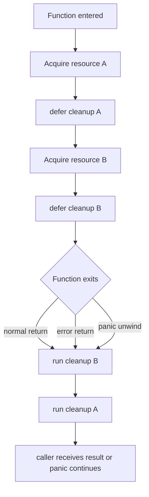
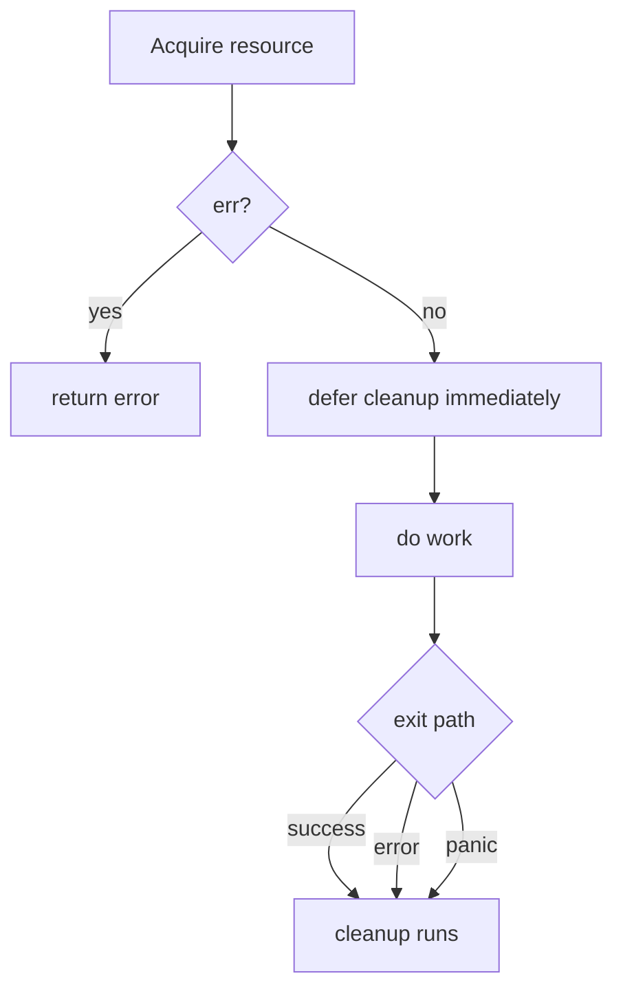
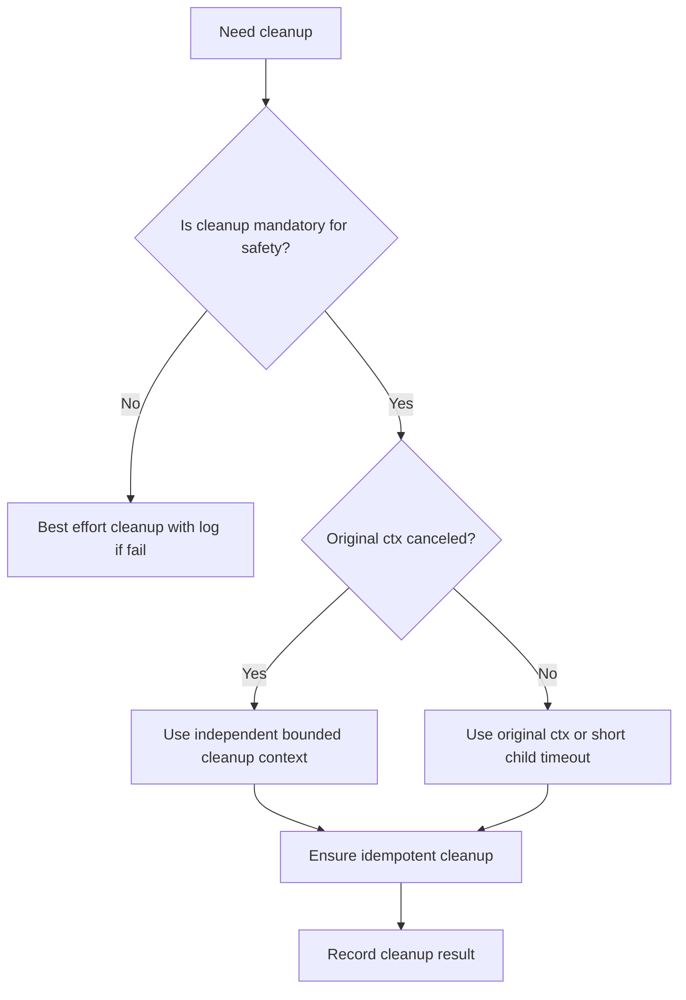
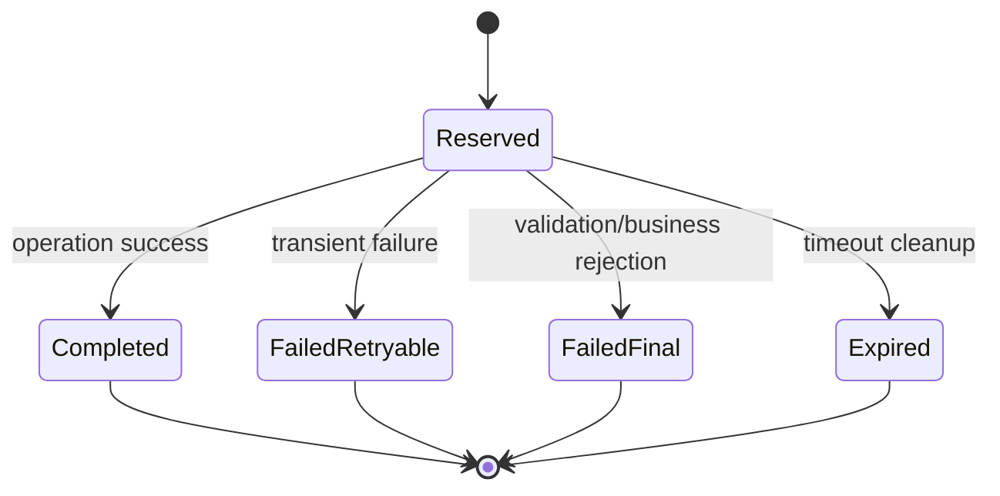
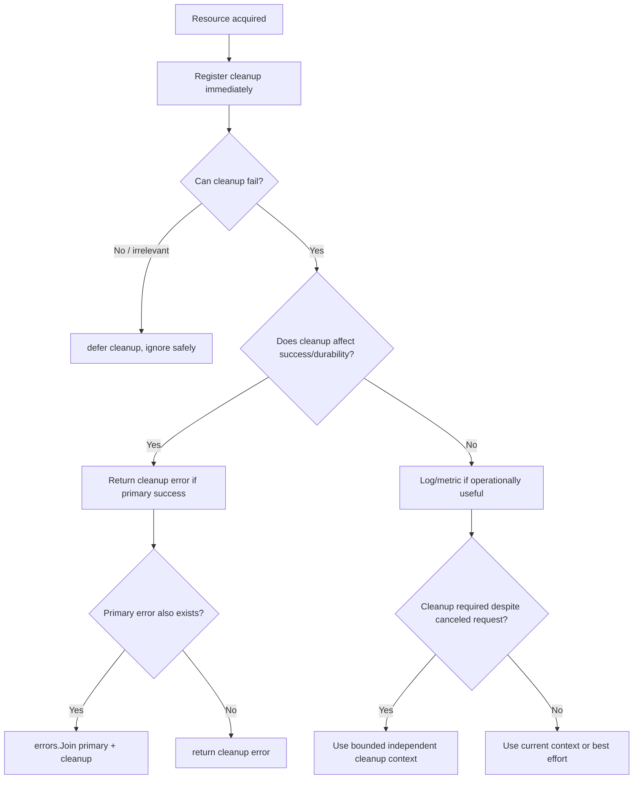
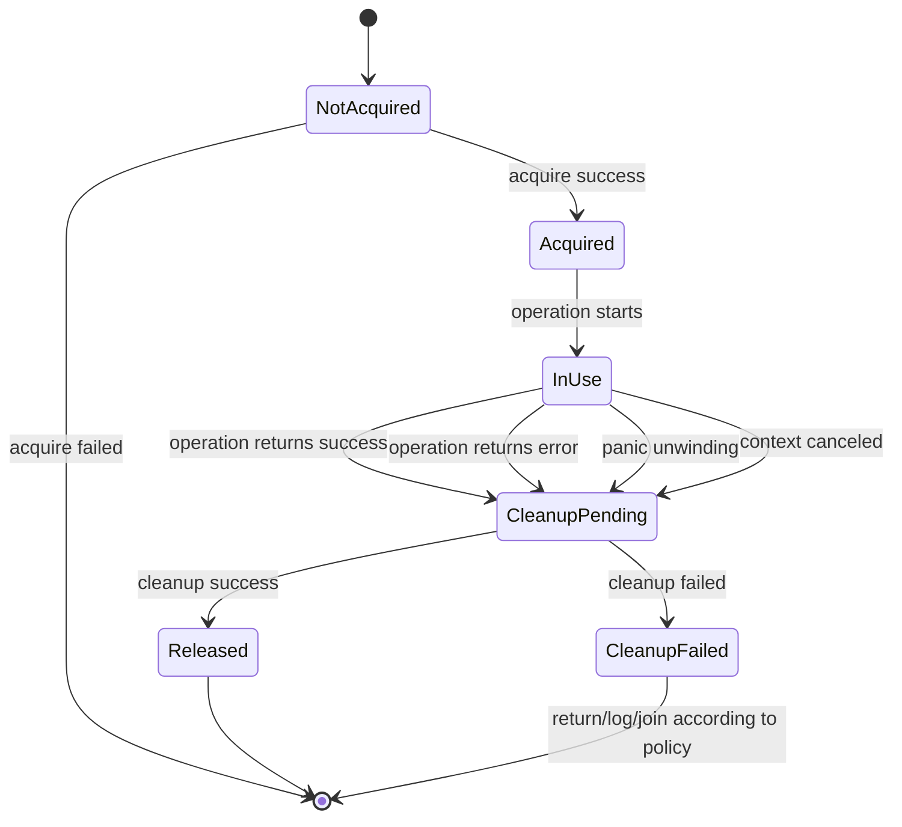

# learn-go-reliability-error-handling-part-010.md

# Defer, Cleanup, Resource Safety, dan Failure During Cleanup

> Seri: `learn-go-reliability-error-handling`  
> Part: `010`  
> Target: Go 1.26.x  
> Level: Advanced / internal engineering handbook  
> Fokus: bagaimana mendesain cleanup dan resource safety secara production-grade di Go.

---

## 0. Posisi Materi Ini Dalam Seri

Pada part sebelumnya kita sudah membahas:

- `part-000`: orientasi failure, reliability, dan mental model produksi.
- `part-001`: filosofi Go error sebagai API surface.
- `part-002`: taxonomy error.
- `part-003`: sentinel, typed error, dan opaque error.
- `part-004`: wrapping, `errors.Is`, `errors.As`, `errors.Join`.
- `part-005`: desain pesan error.
- `part-006`: error boundary.
- `part-007`: domain error model.
- `part-008`: validation dan aggregated error.
- `part-009`: panic, recover, fatal, dan crash semantics.

Sekarang kita masuk ke topik yang terlihat sederhana tetapi sering menjadi sumber bug produksi: **cleanup**.

Di Go, resource safety tidak bergantung pada garbage collector saja. GC mengelola memory object yang reachable/unreachable, tetapi banyak resource produksi bukan sekadar memory heap:

- file descriptor
- socket
- HTTP response body
- database transaction
- database rows cursor
- lock
- temporary file
- buffered writer
- telemetry exporter
- message broker channel
- OS process
- goroutine
- context cancellation function
- timer/ticker
- rate limiter slot
- semaphore permit
- distributed lease
- idempotency reservation
- external side effect reservation

Materi ini akan membahas `defer` bukan sebagai syntax convenience, tetapi sebagai **mekanisme desain lifecycle**.

---

## 1. Core Thesis

`defer` adalah alat untuk menjaga invariant berikut:

> Jika sebuah fungsi berhasil memperoleh resource, maka fungsi itu bertanggung jawab memastikan resource tersebut dilepas pada semua jalur keluar yang relevan: normal return, early return, error return, panic unwinding, cancellation path, dan shutdown path.

Namun top 1% engineer tidak berhenti di “pakai `defer close()`”.

Pertanyaan yang harus dijawab:

1. Siapa pemilik resource?
2. Kapan ownership berpindah?
3. Kapan cleanup harus dieksekusi?
4. Apakah cleanup bisa gagal?
5. Kalau cleanup gagal, apakah error cleanup harus mengganti error utama?
6. Kalau ada panic, apakah cleanup tetap harus berjalan?
7. Kalau context dibatalkan, apakah cleanup masih boleh memakai context yang sama?
8. Apakah cleanup butuh timeout sendiri?
9. Apakah cleanup harus idempotent?
10. Apakah cleanup failure harus di-log, di-return, di-metric-kan, atau diabaikan?

Inilah inti bagian ini.

---

## 2. Fakta Dasar `defer`

Secara resmi, `defer` menjadwalkan function call untuk dieksekusi setelah fungsi sekitarnya selesai. Deferred calls dieksekusi dalam urutan **last-in, first-out**. Deferred function juga tetap dieksekusi saat stack sedang unwind akibat panic.

Mental model:



Implikasi:

- taruh `defer` segera setelah resource berhasil diperoleh.
- jangan defer cleanup sebelum resource valid.
- jika resource acquisition gagal, jangan cleanup resource yang tidak dimiliki.
- untuk nested resource, LIFO biasanya sesuai: resource paling baru dilepas lebih dulu.

Contoh idiom dasar:

```go
f, err := os.Open(path)
if err != nil {
    return fmt.Errorf("open file: %w", err)
}
defer f.Close()
```

Namun contoh ini belum cukup production-grade, karena `Close()` mengembalikan error yang diabaikan. Kadang itu benar, kadang salah.

---

## 3. Resource Safety Bukan Memory Safety

Java engineer sering terbiasa dengan `try-with-resources`:

```java
try (InputStream in = Files.newInputStream(path)) {
    return in.readAllBytes();
}
```

Go tidak punya `try-with-resources`. Polanya eksplisit:

```go
f, err := os.Open(path)
if err != nil {
    return nil, fmt.Errorf("open file: %w", err)
}
defer f.Close()

b, err := io.ReadAll(f)
if err != nil {
    return nil, fmt.Errorf("read file: %w", err)
}
return b, nil
```

Tetapi ada perbedaan penting:

| Concern | Java try-with-resources | Go defer |
|---|---|---|
| Cleanup registration | otomatis di block header | eksplisit |
| Cleanup ordering | reverse order | reverse order |
| Cleanup exception/error | suppressed exception model | harus didesain manual |
| Resource ownership | lexical block | function scope |
| Error propagation | exception propagation | explicit return |
| Cleanup saat panic/exception | ya | ya, pada goroutine yang sama |
| Cleanup failure policy | runtime/language model | application design |

Go memberi kontrol lebih besar, tetapi juga menuntut desain lebih eksplisit.

---

## 4. Cleanup Sebagai Ownership Contract

Sebelum menulis `defer`, tentukan ownership.

### 4.1 Fungsi Memiliki Resource yang Dibuatnya

```go
func loadConfig(path string) ([]byte, error) {
    f, err := os.Open(path)
    if err != nil {
        return nil, fmt.Errorf("open config: %w", err)
    }
    defer f.Close()

    b, err := io.ReadAll(f)
    if err != nil {
        return nil, fmt.Errorf("read config: %w", err)
    }
    return b, nil
}
```

Fungsi membuat `f`, maka fungsi menutup `f`.

### 4.2 Fungsi Tidak Menutup Resource yang Tidak Dimiliki

```go
func writeReport(w io.Writer, report Report) error {
    if err := encodeReport(w, report); err != nil {
        return fmt.Errorf("encode report: %w", err)
    }
    return nil
}
```

Fungsi ini menerima `io.Writer`; belum tentu dia pemiliknya. Jangan asal:

```go
// Buruk: belum tentu w adalah resource yang boleh ditutup.
// Bisa saja w adalah bytes.Buffer, HTTP response writer, atau shared writer.
if c, ok := w.(io.Closer); ok {
    defer c.Close()
}
```

Kecuali contract fungsi jelas menyatakan bahwa ownership berpindah.

### 4.3 Transfer Ownership Harus Eksplisit

```go
// NewArchiveWriter takes ownership of dst and will close it when Close is called.
func NewArchiveWriter(dst io.WriteCloser) *ArchiveWriter {
    return &ArchiveWriter{dst: dst}
}
```

Atau:

```go
// WriteArchive writes to dst but does not close it.
func WriteArchive(dst io.Writer, files []File) error
```

Perbedaan ini harus jelas di dokumentasi dan nama API.

---

## 5. Defer Immediately After Successful Acquisition

Prinsip:

> acquire resource, check error, immediately register cleanup.

Baik:

```go
rows, err := db.QueryContext(ctx, query, args...)
if err != nil {
    return fmt.Errorf("query cases: %w", err)
}
defer rows.Close()
```

Buruk:

```go
rows, err := db.QueryContext(ctx, query, args...)
if err != nil {
    return fmt.Errorf("query cases: %w", err)
}

// banyak kode panjang di sini...

defer rows.Close()
```

Risiko:

- early return sebelum defer
- panic sebelum defer
- developer lain menambah branch return di tengah
- resource leak sulit terlihat saat code review

### 5.1 Diagram Jalur Keluar



---

## 6. LIFO Ordering: Kenapa Urutan Defer Penting

Deferred calls dieksekusi last-in-first-out.

```go
defer fmt.Println("A")
defer fmt.Println("B")
defer fmt.Println("C")
```

Output:

```text
C
B
A
```

Dalam resource lifecycle, ini biasanya cocok:

```go
conn := openConnection()
defer conn.Close()

tx := conn.Begin()
defer tx.Rollback()

stmt := tx.Prepare(...)
defer stmt.Close()
```

Saat keluar:

1. statement ditutup
2. transaction di-rollback jika belum commit
3. connection dilepas

Urutan ini masuk akal karena resource paling dalam bergantung pada resource luar.

---

## 7. Argumen Defer Dievaluasi Saat `defer` Dieksekusi

Ini sering menyebabkan bug.

```go
defer fmt.Println(x)
x = 10
```

Jika `x` bernilai `1` saat `defer` dibuat, yang dicetak adalah `1`, bukan `10`.

Untuk receiver/method call:

```go
defer f.Close()
```

Receiver `f` dievaluasi saat defer statement dijalankan.

Implikasi bug:

```go
for _, path := range paths {
    f, err := os.Open(path)
    if err != nil {
        return err
    }
    defer f.Close()
}
```

Secara semantics valid, tetapi semua file baru ditutup saat fungsi selesai, bukan per iterasi. Jika `paths` banyak, file descriptor bisa habis.

Solusi: gunakan helper function untuk membuat scope per iterasi.

```go
for _, path := range paths {
    if err := processFile(path); err != nil {
        return err
    }
}

func processFile(path string) error {
    f, err := os.Open(path)
    if err != nil {
        return fmt.Errorf("open %s: %w", path, err)
    }
    defer f.Close()

    return process(f)
}
```

---

## 8. Jangan Menumpuk Defer di Loop Panjang Tanpa Scope

Anti-pattern:

```go
func processMany(paths []string) error {
    for _, path := range paths {
        f, err := os.Open(path)
        if err != nil {
            return err
        }
        defer f.Close()

        if err := process(f); err != nil {
            return err
        }
    }
    return nil
}
```

Masalah:

- file descriptor baru ditutup di akhir fungsi
- memory untuk deferred calls bertambah
- external resources tertahan terlalu lama
- pada batch besar bisa menyebabkan `too many open files`

Lebih baik:

```go
func processMany(paths []string) error {
    for _, path := range paths {
        if err := processOne(path); err != nil {
            return err
        }
    }
    return nil
}

func processOne(path string) error {
    f, err := os.Open(path)
    if err != nil {
        return fmt.Errorf("open %q: %w", path, err)
    }
    defer f.Close()

    if err := process(f); err != nil {
        return fmt.Errorf("process %q: %w", path, err)
    }
    return nil
}
```

Pattern ini lebih mudah diuji, lebih aman untuk resource, dan lebih jelas secara ownership.

---

## 9. Cleanup Error: Masalah yang Sering Diabaikan

Banyak cleanup function mengembalikan error:

```go
func (f *File) Close() error
func (tx *Tx) Rollback() error
func (tx *Tx) Commit() error
func (w *bufio.Writer) Flush() error
func (zw *gzip.Writer) Close() error
func (rows *Rows) Close() error
```

Pertanyaan: apa yang dilakukan dengan error cleanup?

Tidak ada satu jawaban universal.

Cleanup error policy bergantung pada jenis resource.

---

## 10. Tiga Kategori Cleanup Error

### 10.1 Cleanup Error Tidak Penting Untuk Correctness

Contoh: menutup read-only file setelah semua data sukses dibaca.

```go
defer f.Close()
```

Jika `Close()` gagal, sering kali tidak ada aksi meaningful.

Namun untuk service produksi, bisa saja tetap log di boundary tertentu jika mencurigakan.

### 10.2 Cleanup Error Penting Jika Belum Ada Error Utama

Contoh: menulis file. Error write bisa muncul saat `Close()` karena data di-buffer.

```go
func writeFile(path string, data []byte) (err error) {
    f, err := os.Create(path)
    if err != nil {
        return fmt.Errorf("create file: %w", err)
    }

    defer func() {
        closeErr := f.Close()
        if err == nil && closeErr != nil {
            err = fmt.Errorf("close file: %w", closeErr)
        }
    }()

    if _, err := f.Write(data); err != nil {
        return fmt.Errorf("write file: %w", err)
    }

    return nil
}
```

Di sini, jika write sukses tetapi close gagal, fungsi harus gagal.

### 10.3 Cleanup Error Harus Digabung dengan Error Utama

Contoh: operasi gagal, lalu cleanup juga gagal. Keduanya penting untuk debugging.

Dengan Go modern, `errors.Join` bisa digunakan.

```go
func doWork() (err error) {
    r, err := acquire()
    if err != nil {
        return fmt.Errorf("acquire: %w", err)
    }

    defer func() {
        if closeErr := r.Close(); closeErr != nil {
            err = errors.Join(err, fmt.Errorf("close resource: %w", closeErr))
        }
    }()

    if err := use(r); err != nil {
        return fmt.Errorf("use resource: %w", err)
    }

    return nil
}
```

Catatan penting:

- Jika `err` awal `nil`, `errors.Join(nil, closeErr)` menghasilkan error cleanup.
- Jika `err` awal non-nil, hasilnya multi-error.
- `errors.Is/As` tetap bisa bekerja pada error tree.

---

## 11. Named Return Value: Berguna, Tetapi Tajam

Untuk memodifikasi return error di deferred function, perlu named return variable:

```go
func save() (err error) {
    r, err := acquire()
    if err != nil {
        return err
    }

    defer func() {
        if closeErr := r.Close(); closeErr != nil {
            err = errors.Join(err, closeErr)
        }
    }()

    return use(r)
}
```

Namun named return bisa menjadi sumber bug jika dipakai sembarangan.

### 11.1 Shadowing Pitfall

```go
func save() (err error) {
    r, err := acquire()
    if err != nil {
        return err
    }
    defer func() {
        if closeErr := r.Close(); closeErr != nil {
            err = errors.Join(err, closeErr)
        }
    }()

    if err := use(r); err != nil {
        return err
    }

    return nil
}
```

Ini masih aman karena `return err` mengassign ke named return sebelum defer jalan.

Tetapi pattern kompleks bisa membingungkan.

Lebih jelas:

```go
func save() (err error) {
    r, err := acquire()
    if err != nil {
        return fmt.Errorf("acquire: %w", err)
    }

    defer func() {
        if closeErr := r.Close(); closeErr != nil {
            err = errors.Join(err, fmt.Errorf("close: %w", closeErr))
        }
    }()

    if useErr := use(r); useErr != nil {
        return fmt.Errorf("use: %w", useErr)
    }

    return nil
}
```

Rule praktis:

- gunakan named return hanya bila deferred cleanup perlu memodifikasi return.
- hindari named return untuk banyak result jika tidak perlu.
- beri nama `err`, bukan nama kreatif.
- jangan membuat deferred function terlalu panjang.

---

## 12. Primary Error vs Cleanup Error

Dalam banyak fungsi, ada dua error:

1. primary error: error dari operasi utama
2. cleanup error: error saat menutup/membersihkan resource

Decision matrix:

| Kondisi | Policy yang umum |
|---|---|
| primary nil, cleanup nil | return nil |
| primary non-nil, cleanup nil | return primary |
| primary nil, cleanup non-nil | return cleanup |
| primary non-nil, cleanup non-nil | return joined error atau log cleanup |
| cleanup idempotent/noisy | ignore atau debug log |
| cleanup menentukan durability | return cleanup |
| cleanup gagal saat rollback | log/metric; transaction sudah invalid menurut docs |
| cleanup gagal saat flush | return cleanup jika belum ada primary |

Contoh helper:

```go
func joinCloseError(errp *error, op string, close func() error) {
    if closeErr := close(); closeErr != nil {
        *errp = errors.Join(*errp, fmt.Errorf("%s: %w", op, closeErr))
    }
}
```

Penggunaan:

```go
func export(path string, rows []Row) (err error) {
    f, err := os.Create(path)
    if err != nil {
        return fmt.Errorf("create export file: %w", err)
    }
    defer joinCloseError(&err, "close export file", f.Close)

    if err := writeRows(f, rows); err != nil {
        return fmt.Errorf("write rows: %w", err)
    }

    return nil
}
```

Hati-hati: helper seperti ini bagus kalau tim paham semantics-nya. Jangan membuat magic yang menyembunyikan control flow.

---

## 13. Buffered Writer: `Flush` Adalah Bagian Dari Operasi Utama

Ini bug umum.

```go
func writeReport(w io.Writer, r Report) error {
    bw := bufio.NewWriter(w)

    if err := encode(bw, r); err != nil {
        return fmt.Errorf("encode report: %w", err)
    }

    return nil // BUG: data mungkin masih di buffer
}
```

Harus:

```go
func writeReport(w io.Writer, r Report) error {
    bw := bufio.NewWriter(w)

    if err := encode(bw, r); err != nil {
        return fmt.Errorf("encode report: %w", err)
    }

    if err := bw.Flush(); err != nil {
        return fmt.Errorf("flush report: %w", err)
    }

    return nil
}
```

Apakah `Flush` didefer?

Kadang boleh, tetapi sering lebih baik eksplisit di akhir operasi karena `Flush` adalah bagian dari keberhasilan operasi, bukan sekadar cleanup.

Kurang jelas:

```go
func writeReport(w io.Writer, r Report) (err error) {
    bw := bufio.NewWriter(w)
    defer func() {
        if flushErr := bw.Flush(); flushErr != nil {
            err = errors.Join(err, fmt.Errorf("flush report: %w", flushErr))
        }
    }()

    return encode(bw, r)
}
```

Lebih jelas untuk durability:

```go
func writeReport(w io.Writer, r Report) error {
    bw := bufio.NewWriter(w)

    if err := encode(bw, r); err != nil {
        return fmt.Errorf("encode report: %w", err)
    }
    if err := bw.Flush(); err != nil {
        return fmt.Errorf("flush report: %w", err)
    }
    return nil
}
```

---

## 14. `gzip.Writer.Close` Bukan Sekadar Cleanup

`gzip.Writer.Close()` menulis footer/checksum. Jika tidak dipanggil, output bisa corrupt.

Buruk:

```go
func compress(dst io.Writer, src []byte) error {
    zw := gzip.NewWriter(dst)
    _, err := zw.Write(src)
    return err // BUG: footer belum ditulis
}
```

Baik:

```go
func compress(dst io.Writer, src []byte) error {
    zw := gzip.NewWriter(dst)

    if _, err := zw.Write(src); err != nil {
        _ = zw.Close()
        return fmt.Errorf("write gzip body: %w", err)
    }

    if err := zw.Close(); err != nil {
        return fmt.Errorf("close gzip writer: %w", err)
    }

    return nil
}
```

Atau dengan named return:

```go
func compress(dst io.Writer, src []byte) (err error) {
    zw := gzip.NewWriter(dst)

    defer func() {
        if closeErr := zw.Close(); closeErr != nil {
            err = errors.Join(err, fmt.Errorf("close gzip writer: %w", closeErr))
        }
    }()

    if _, err := zw.Write(src); err != nil {
        return fmt.Errorf("write gzip body: %w", err)
    }

    return nil
}
```

Tetapi untuk clarity, eksplisit `Close()` di akhir sering lebih baik ketika `Close` adalah bagian dari format finalization.

---

## 15. HTTP Response Body: Wajib Ditutup

Pada `net/http`, caller harus menutup response body setelah selesai membaca.

Pattern:

```go
req, err := http.NewRequestWithContext(ctx, http.MethodGet, url, nil)
if err != nil {
    return nil, fmt.Errorf("build request: %w", err)
}

resp, err := client.Do(req)
if err != nil {
    return nil, fmt.Errorf("do request: %w", err)
}
defer resp.Body.Close()

if resp.StatusCode != http.StatusOK {
    body, _ := io.ReadAll(io.LimitReader(resp.Body, 4<<10))
    return nil, fmt.Errorf("unexpected status %d: %s", resp.StatusCode, body)
}

body, err := io.ReadAll(resp.Body)
if err != nil {
    return nil, fmt.Errorf("read response body: %w", err)
}
return body, nil
```

Production concern:

- selalu close body
- limit body untuk error response agar tidak memory blow-up
- jangan leak response body pada branch status error
- jangan membaca body besar tanpa limit jika response tidak dipercaya
- close error biasanya tidak mengubah business result untuk read response
- untuk connection reuse, body handling penting

### 15.1 Anti-pattern: Return Sebelum Close

```go
resp, err := client.Do(req)
if err != nil {
    return err
}

if resp.StatusCode >= 400 {
    return fmt.Errorf("bad status: %d", resp.StatusCode) // BUG: body tidak ditutup
}

defer resp.Body.Close()
```

Baik:

```go
resp, err := client.Do(req)
if err != nil {
    return err
}
defer resp.Body.Close()

if resp.StatusCode >= 400 {
    return fmt.Errorf("bad status: %d", resp.StatusCode)
}
```

---

## 16. Database Rows: `Close` dan `Err`

Untuk `database/sql`, jangan hanya iterate rows lalu return.

Pattern:

```go
rows, err := db.QueryContext(ctx, query, args...)
if err != nil {
    return nil, fmt.Errorf("query cases: %w", err)
}
defer rows.Close()

var cases []Case
for rows.Next() {
    var c Case
    if err := rows.Scan(&c.ID, &c.Status); err != nil {
        return nil, fmt.Errorf("scan case: %w", err)
    }
    cases = append(cases, c)
}

if err := rows.Err(); err != nil {
    return nil, fmt.Errorf("iterate cases: %w", err)
}

return cases, nil
```

Kenapa `rows.Err()` penting?

Karena iteration bisa berhenti akibat error I/O, context cancellation, driver error, atau decode error yang baru muncul setelah loop.

### 16.1 Close Error pada Rows

Apakah `rows.Close()` error harus diperiksa?

Untuk banyak query read-only, `rows.Err()` lebih penting. Namun jika driver mengembalikan close error yang meaningful, bisa digabung:

```go
func listCases(ctx context.Context, db *sql.DB) (cases []Case, err error) {
    rows, err := db.QueryContext(ctx, `select id, status from cases`)
    if err != nil {
        return nil, fmt.Errorf("query cases: %w", err)
    }

    defer func() {
        if closeErr := rows.Close(); closeErr != nil {
            err = errors.Join(err, fmt.Errorf("close rows: %w", closeErr))
        }
    }()

    for rows.Next() {
        var c Case
        if scanErr := rows.Scan(&c.ID, &c.Status); scanErr != nil {
            return nil, fmt.Errorf("scan case: %w", scanErr)
        }
        cases = append(cases, c)
    }

    if iterErr := rows.Err(); iterErr != nil {
        return nil, fmt.Errorf("iterate cases: %w", iterErr)
    }

    return cases, nil
}
```

---

## 17. Transaction Cleanup: Rollback as Safety Net

Canonical transaction pattern:

```go
func transfer(ctx context.Context, db *sql.DB, from, to string, amount int64) error {
    tx, err := db.BeginTx(ctx, nil)
    if err != nil {
        return fmt.Errorf("begin transaction: %w", err)
    }
    defer tx.Rollback()

    if err := debit(ctx, tx, from, amount); err != nil {
        return fmt.Errorf("debit account: %w", err)
    }

    if err := credit(ctx, tx, to, amount); err != nil {
        return fmt.Errorf("credit account: %w", err)
    }

    if err := tx.Commit(); err != nil {
        return fmt.Errorf("commit transaction: %w", err)
    }

    return nil
}
```

`defer tx.Rollback()` aman karena setelah `Commit` sukses, rollback biasanya menghasilkan error seperti transaction already committed/done dan diabaikan.

Namun ini menimbulkan pertanyaan: apakah rollback error harus ditangani?

### 17.1 Rollback Error Setelah Primary Error

Jika operasi gagal lalu rollback juga gagal:

```go
func doTx(ctx context.Context, db *sql.DB) (err error) {
    tx, err := db.BeginTx(ctx, nil)
    if err != nil {
        return fmt.Errorf("begin tx: %w", err)
    }

    committed := false
    defer func() {
        if committed {
            return
        }
        if rbErr := tx.Rollback(); rbErr != nil {
            err = errors.Join(err, fmt.Errorf("rollback tx: %w", rbErr))
        }
    }()

    if err := updateA(ctx, tx); err != nil {
        return fmt.Errorf("update A: %w", err)
    }
    if err := updateB(ctx, tx); err != nil {
        return fmt.Errorf("update B: %w", err)
    }

    if err := tx.Commit(); err != nil {
        return fmt.Errorf("commit tx: %w", err)
    }
    committed = true

    return nil
}
```

Namun official docs menyatakan rollback failure tetap membuat transaction invalid dan tidak committed. Jadi rollback error biasanya lebih operasional/debugging daripada business outcome.

### 17.2 Commit Ambiguity

`Commit()` error adalah topik serius.

Jika `Commit()` mengembalikan error, apakah transaksi pasti gagal?

Tidak selalu mudah secara distributed/driver/network perspective. Beberapa commit error bisa ambiguous: server mungkin sudah commit, tetapi client gagal menerima response.

Untuk sistem yang memiliki side effect penting:

- gunakan idempotency key
- gunakan unique business key
- gunakan outbox
- cek state setelah ambiguous commit
- jangan retry blindly jika bisa double effect

Pattern:

```go
if err := tx.Commit(); err != nil {
    return fmt.Errorf("commit case transition transaction: %w", err)
}
```

Di boundary lebih tinggi, classifikasi commit error perlu hati-hati.

---

## 18. Context Cancellation dan Cleanup

Context cancellation berarti operasi utama harus berhenti. Namun cleanup sering tetap harus terjadi.

Masalah:

```go
func doWork(ctx context.Context, db *sql.DB) error {
    tx, err := db.BeginTx(ctx, nil)
    if err != nil {
        return err
    }
    defer tx.Rollback()

    // ...
}
```

Jika `ctx` canceled, `database/sql` bisa rollback otomatis untuk transaction yang dimulai dengan context. `Commit` akan error jika context dibatalkan sebelum commit.

Tetapi untuk cleanup lain, menggunakan context yang sudah canceled bisa gagal terlalu cepat.

Contoh:

```go
func cleanup(ctx context.Context) error {
    // ctx sudah canceled, cleanup langsung gagal
}
```

Untuk cleanup yang harus tetap dicoba, gunakan context cleanup terpisah dengan timeout terbatas.

```go
cleanupCtx, cancel := context.WithTimeout(context.Background(), 5*time.Second)
defer cancel()

if err := releaseLease(cleanupCtx, leaseID); err != nil {
    return fmt.Errorf("release lease: %w", err)
}
```

Namun hati-hati:

- jangan asal pakai `Background()` untuk melanjutkan business operation setelah request dibatalkan.
- gunakan context terpisah hanya untuk cleanup yang memang harus dilakukan.
- beri timeout keras.
- log jika cleanup gagal.
- pastikan cleanup idempotent.

### 18.1 Cleanup Context Decision



---

## 19. CancelFunc Cleanup: `defer cancel()` Bukan Opsional

Setiap `context.WithTimeout`, `WithDeadline`, atau `WithCancel` mengembalikan `CancelFunc`.

Pattern:

```go
ctx, cancel := context.WithTimeout(parent, 2*time.Second)
defer cancel()
```

Kenapa perlu `cancel()` walaupun timeout akan expire?

Karena cancel membebaskan resource internal lebih cepat, termasuk timer.

Anti-pattern:

```go
func call(parent context.Context) error {
    ctx, _ := context.WithTimeout(parent, 2*time.Second)
    return do(ctx)
}
```

Baik:

```go
func call(parent context.Context) error {
    ctx, cancel := context.WithTimeout(parent, 2*time.Second)
    defer cancel()

    return do(ctx)
}
```

Dalam loop:

```go
for _, item := range items {
    ctx, cancel := context.WithTimeout(parent, time.Second)
    err := process(ctx, item)
    cancel()
    if err != nil {
        return err
    }
}
```

Jangan `defer cancel()` di loop panjang jika ingin timer dilepas per item segera.

Lebih baik helper:

```go
func processOne(parent context.Context, item Item) error {
    ctx, cancel := context.WithTimeout(parent, time.Second)
    defer cancel()

    return process(ctx, item)
}
```

---

## 20. Timer dan Ticker Cleanup

Ticker harus dihentikan jika tidak dipakai lagi.

```go
ticker := time.NewTicker(time.Second)
defer ticker.Stop()

for {
    select {
    case <-ctx.Done():
        return ctx.Err()
    case <-ticker.C:
        doPoll()
    }
}
```

Timer juga perlu diperhatikan dalam pattern tertentu.

```go
timer := time.NewTimer(timeout)
defer timer.Stop()
```

Jika timer digunakan dalam loop, lebih baik memahami drain/reset semantics. Untuk kebanyakan service code, gunakan `context.WithTimeout` atau `time.After` dengan hati-hati sesuai kebutuhan.

Anti-pattern untuk loop long-running:

```go
for {
    select {
    case <-time.After(time.Second):
        poll()
    case <-ctx.Done():
        return
    }
}
```

`time.After` membuat timer baru setiap iterasi. Untuk interval tetap, gunakan ticker.

---

## 21. Lock Cleanup: `defer Unlock` dan Scope

Pattern umum:

```go
mu.Lock()
defer mu.Unlock()
```

Ini aman untuk fungsi pendek.

Namun untuk fungsi panjang, menahan lock terlalu lama bisa buruk.

Buruk:

```go
func (s *Store) Handle(ctx context.Context, id string) error {
    s.mu.Lock()
    defer s.mu.Unlock()

    item := s.items[id]

    // BAD: external call while holding lock
    if err := s.client.Notify(ctx, item); err != nil {
        return err
    }

    item.Status = "notified"
    return nil
}
```

Lebih baik:

```go
func (s *Store) Handle(ctx context.Context, id string) error {
    s.mu.Lock()
    item := s.items[id]
    s.mu.Unlock()

    if err := s.client.Notify(ctx, item); err != nil {
        return err
    }

    s.mu.Lock()
    defer s.mu.Unlock()
    item.Status = "notified"
    s.items[id] = item

    return nil
}
```

Namun ini membuka race semantic: item bisa berubah di antara unlock dan lock ulang. Solusi production bisa perlu optimistic versioning, transaction, atau state-machine guard.

### 21.1 Helper Scope Untuk Lock

```go
func (s *Store) getItem(id string) (Item, bool) {
    s.mu.Lock()
    defer s.mu.Unlock()

    item, ok := s.items[id]
    return item, ok
}
```

Lock scope pendek dan jelas.

---

## 22. Semaphore / Permit Cleanup

Untuk bounded concurrency:

```go
sem <- struct{}{}
defer func() { <-sem }()
```

Namun acquisition harus cancellable jika sem penuh.

```go
func acquire(ctx context.Context, sem chan struct{}) error {
    select {
    case sem <- struct{}{}:
        return nil
    case <-ctx.Done():
        return ctx.Err()
    }
}

func release(sem chan struct{}) {
    <-sem
}
```

Penggunaan:

```go
if err := acquire(ctx, sem); err != nil {
    return err
}
defer release(sem)
```

Invariant:

- release hanya jika acquire sukses.
- release harus dieksekusi tepat sekali.
- jangan release pada path acquire gagal.
- release harus panic-safe.

---

## 23. Temporary File Cleanup

Pattern umum:

```go
tmp, err := os.CreateTemp("", "report-*.tmp")
if err != nil {
    return fmt.Errorf("create temp file: %w", err)
}
defer os.Remove(tmp.Name())
defer tmp.Close()
```

Urutan LIFO:

1. `tmp.Close()`
2. `os.Remove(tmp.Name())`

Karena defer terakhir dieksekusi dulu, jika ingin close sebelum remove:

```go
defer os.Remove(tmp.Name())
defer tmp.Close()
```

Benar.

Namun untuk atomic file replace:

```go
func writeAtomic(path string, data []byte) (err error) {
    dir := filepath.Dir(path)

    tmp, err := os.CreateTemp(dir, ".tmp-*")
    if err != nil {
        return fmt.Errorf("create temp file: %w", err)
    }

    tmpPath := tmp.Name()
    cleanup := true

    defer func() {
        if cleanup {
            _ = os.Remove(tmpPath)
        }
    }()

    if _, err := tmp.Write(data); err != nil {
        _ = tmp.Close()
        return fmt.Errorf("write temp file: %w", err)
    }

    if err := tmp.Sync(); err != nil {
        _ = tmp.Close()
        return fmt.Errorf("sync temp file: %w", err)
    }

    if err := tmp.Close(); err != nil {
        return fmt.Errorf("close temp file: %w", err)
    }

    if err := os.Rename(tmpPath, path); err != nil {
        return fmt.Errorf("rename temp file: %w", err)
    }

    cleanup = false
    return nil
}
```

Catatan:

- `Close` error penting.
- `Sync` bisa penting untuk durability.
- remove temp hanya jika belum berhasil rename.
- cleanup best effort.
- atomicity tergantung filesystem dan OS semantics.

---

## 24. Cleanup Saat Panic

Deferred cleanup tetap berjalan saat panic unwinding di goroutine yang sama.

```go
func process() {
    f, err := os.Open("input.txt")
    if err != nil {
        panic(err)
    }
    defer f.Close()

    panic("boom")
}
```

`f.Close()` tetap dieksekusi.

Namun jangan mengandalkan panic untuk normal control flow.

Jika cleanup sendiri panic, panic baru bisa mengganti/menambah kompleksitas panic lama. Cleanup harus sebisa mungkin tidak panic.

Buruk:

```go
defer func() {
    mustClose(r) // panic if close fails
}()
```

Baik:

```go
defer func() {
    if err := r.Close(); err != nil {
        logger.Error("close resource after panic/return", "error", err)
    }
}()
```

Jika fungsi mengembalikan error, gunakan `errors.Join`.

---

## 25. Defer dan Recover Interaction

Recover hanya bekerja jika dipanggil dalam deferred function pada goroutine yang sama.

```go
defer func() {
    if v := recover(); v != nil {
        err = fmt.Errorf("panic: %v", v)
    }
}()
```

Namun jangan mencampur recovery dan cleanup terlalu rumit dalam satu defer jika bisa dihindari.

Lebih jelas:

```go
defer cleanup()
defer recoverPanic()
```

Karena LIFO, `recoverPanic` akan berjalan dulu jika ditulis setelah cleanup:

```go
defer cleanup()
defer recoverPanic()
```

Execution saat panic:

1. `recoverPanic`
2. `cleanup`

Apakah ini yang diinginkan? Biasanya cleanup harus tetap berjalan. Tetapi jika `recoverPanic` menghentikan panic, deferred lain tetap dieksekusi.

Untuk clarity, gunakan wrapper boundary:

```go
func runSafely(fn func() error) (err error) {
    defer func() {
        if v := recover(); v != nil {
            err = fmt.Errorf("panic: %v", v)
        }
    }()
    return fn()
}
```

Dan cleanup tetap di fungsi yang memiliki resource.

---

## 26. Idempotent Cleanup

Cleanup idealnya idempotent:

```go
type Closer struct {
    once sync.Once
    err  error
}

func (c *Closer) Close() error {
    c.once.Do(func() {
        c.err = c.close()
    })
    return c.err
}
```

Kenapa?

- shutdown bisa memanggil close dari beberapa path
- defer dan explicit close bisa bertemu
- worker cancel dan process shutdown bisa race
- external dependency close bisa dipanggil oleh owner dan supervisor

Namun jangan menjadikan idempotency alasan ownership tidak jelas. Tetap desain owner tunggal bila mungkin.

---

## 27. Multi-Resource Cleanup

Jika satu fungsi memperoleh banyak resource, cleanup failure bisa lebih dari satu.

```go
func buildPipeline() (err error) {
    a, err := openA()
    if err != nil {
        return fmt.Errorf("open A: %w", err)
    }
    defer func() {
        if closeErr := a.Close(); closeErr != nil {
            err = errors.Join(err, fmt.Errorf("close A: %w", closeErr))
        }
    }()

    b, err := openB(a)
    if err != nil {
        return fmt.Errorf("open B: %w", err)
    }
    defer func() {
        if closeErr := b.Close(); closeErr != nil {
            err = errors.Join(err, fmt.Errorf("close B: %w", closeErr))
        }
    }()

    c, err := openC(b)
    if err != nil {
        return fmt.Errorf("open C: %w", err)
    }
    defer func() {
        if closeErr := c.Close(); closeErr != nil {
            err = errors.Join(err, fmt.Errorf("close C: %w", closeErr))
        }
    }()

    return run(a, b, c)
}
```

Karena LIFO, close order:

1. C
2. B
3. A

Jika resource dependency seperti stack, ini benar.

### 27.1 Cleanup Stack Helper

Untuk kompleksitas tinggi, bisa buat cleanup stack.

```go
type CleanupStack struct {
    funcs []func() error
}

func (s *CleanupStack) Defer(fn func() error) {
    s.funcs = append(s.funcs, fn)
}

func (s *CleanupStack) Run() error {
    var err error
    for i := len(s.funcs) - 1; i >= 0; i-- {
        if closeErr := s.funcs[i](); closeErr != nil {
            err = errors.Join(err, closeErr)
        }
    }
    return err
}
```

Penggunaan:

```go
func setup() (err error) {
    var cleanups CleanupStack
    defer func() {
        err = errors.Join(err, cleanups.Run())
    }()

    a, err := openA()
    if err != nil {
        return err
    }
    cleanups.Defer(func() error { return a.Close() })

    b, err := openB()
    if err != nil {
        return err
    }
    cleanups.Defer(func() error { return b.Close() })

    return use(a, b)
}
```

Gunakan helper ini hanya jika kompleksitas resource banyak. Untuk kasus sederhana, defer langsung lebih idiomatik.

---

## 28. Lifecycle Object: Start/Stop/Close

Dalam service production, resource tidak selalu hidup dalam satu fungsi pendek.

Contoh:

```go
type App struct {
    server *http.Server
    db     *sql.DB
    queue  *Consumer
    log    *slog.Logger
}
```

Cleanup bukan `defer` lokal saja, tetapi lifecycle orchestration.

```go
func (a *App) Close(ctx context.Context) error {
    var err error

    if a.queue != nil {
        err = errors.Join(err, a.queue.Close(ctx))
    }
    if a.server != nil {
        err = errors.Join(err, a.server.Shutdown(ctx))
    }
    if a.db != nil {
        err = errors.Join(err, a.db.Close())
    }

    return err
}
```

Urutan harus deliberate:

1. stop accepting new work
2. stop consumers/schedulers
3. drain in-flight work
4. shutdown HTTP server
5. close dependency clients/pools
6. flush logs/metrics/traces

Ini akan dibahas lebih dalam di part graceful shutdown, tetapi fondasinya adalah cleanup ownership.

---

## 29. Cleanup dan Observability

Cleanup failure bisa berarti:

- harmless noise
- leak risk
- durability risk
- data corruption risk
- shutdown timeout risk
- dependency stuck
- rollback failure
- telemetry lost

Jangan logging semua close error sebagai fatal. Tapi jangan juga membuang error penting.

Guideline:

| Cleanup failure | Observability |
|---|---|
| close read-only body | usually debug/ignored |
| flush buffered writer | return error |
| gzip close | return error |
| tx rollback fail | warn/metric if unexpected |
| tx commit fail | return and classify |
| shutdown timeout | error log + metric + alert if recurring |
| release distributed lock fail | warn/error + metric |
| remove temp file fail | warn/debug depending sensitivity |
| telemetry flush fail | warn during shutdown |
| DB close fail at process exit | warn, usually not request failure |

Structured log example:

```go
logger.WarnContext(ctx, "cleanup failed",
    "operation", "release_lease",
    "lease_id", leaseID,
    "error", err,
)
```

Metric example:

```text
cleanup_failures_total{resource="lease",operation="release"}
```

Beware cardinality:

- jangan label metric dengan file path unik
- jangan label dengan user id
- jangan label dengan full error string
- gunakan resource class dan operation

---

## 30. Cleanup di HTTP Handler

Example: request body.

```go
func handle(w http.ResponseWriter, r *http.Request) {
    defer r.Body.Close()

    var req CreateCaseRequest
    if err := json.NewDecoder(r.Body).Decode(&req); err != nil {
        writeError(w, err)
        return
    }

    // ...
}
```

Pada server-side HTTP, `net/http` biasanya mengelola request body lifecycle, tetapi menutup body secara eksplisit tetap sering dilakukan terutama jika handler berhenti membaca lebih awal. Yang lebih penting: limit body.

```go
r.Body = http.MaxBytesReader(w, r.Body, 1<<20)
defer r.Body.Close()
```

Jika handler memanggil downstream dan menerima response:

```go
resp, err := h.client.Do(req)
if err != nil {
    return err
}
defer resp.Body.Close()
```

Boundary rule:

- request body cleanup di handler.
- downstream response body cleanup di client wrapper.
- jangan biarkan caller lupa close jika bisa desain helper yang membaca dan menutup di satu tempat.

---

## 31. API Design: Hindari Memaksa Caller Mengingat Cleanup Jika Tidak Perlu

Buruk:

```go
func (c *Client) GetCase(ctx context.Context, id string) (*http.Response, error)
```

Caller harus tahu close body.

Lebih baik untuk application client:

```go
func (c *Client) GetCase(ctx context.Context, id string) (Case, error) {
    req, err := http.NewRequestWithContext(ctx, http.MethodGet, c.url+"/cases/"+id, nil)
    if err != nil {
        return Case{}, fmt.Errorf("build get case request: %w", err)
    }

    resp, err := c.http.Do(req)
    if err != nil {
        return Case{}, fmt.Errorf("do get case request: %w", err)
    }
    defer resp.Body.Close()

    // decode, map status, return domain object
}
```

Expose low-level response hanya jika library memang low-level.

Principle:

> Higher-level API should own cleanup of lower-level resources when possible.

---

## 32. Cleanup Saat Partial Initialization

Service startup sering seperti ini:

```go
func NewApp(ctx context.Context, cfg Config) (*App, error) {
    db, err := openDB(cfg.DB)
    if err != nil {
        return nil, err
    }

    cache, err := openCache(cfg.Cache)
    if err != nil {
        return nil, err // BUG: db leak
    }

    broker, err := openBroker(cfg.Broker)
    if err != nil {
        return nil, err // BUG: db/cache leak
    }

    return &App{db: db, cache: cache, broker: broker}, nil
}
```

Better:

```go
func NewApp(ctx context.Context, cfg Config) (_ *App, err error) {
    app := &App{}

    defer func() {
        if err != nil {
            err = errors.Join(err, app.Close(context.Background()))
        }
    }()

    db, err := openDB(cfg.DB)
    if err != nil {
        return nil, fmt.Errorf("open db: %w", err)
    }
    app.db = db

    cache, err := openCache(cfg.Cache)
    if err != nil {
        return nil, fmt.Errorf("open cache: %w", err)
    }
    app.cache = cache

    broker, err := openBroker(cfg.Broker)
    if err != nil {
        return nil, fmt.Errorf("open broker: %w", err)
    }
    app.broker = broker

    return app, nil
}
```

But use bounded cleanup context in real startup:

```go
cleanupCtx, cancel := context.WithTimeout(context.Background(), 10*time.Second)
defer cancel()
err = errors.Join(err, app.Close(cleanupCtx))
```

---

## 33. Cleanup dan Goroutine Leak

Goroutine juga resource.

Anti-pattern:

```go
func startPoller() {
    go func() {
        for {
            poll()
            time.Sleep(time.Second)
        }
    }()
}
```

Tidak ada cleanup. Tidak bisa stop.

Better:

```go
type Poller struct {
    cancel context.CancelFunc
    done   chan struct{}
}

func StartPoller(parent context.Context) *Poller {
    ctx, cancel := context.WithCancel(parent)
    p := &Poller{
        cancel: cancel,
        done:   make(chan struct{}),
    }

    go func() {
        defer close(p.done)

        ticker := time.NewTicker(time.Second)
        defer ticker.Stop()

        for {
            select {
            case <-ctx.Done():
                return
            case <-ticker.C:
                poll(ctx)
            }
        }
    }()

    return p
}

func (p *Poller) Close(ctx context.Context) error {
    p.cancel()

    select {
    case <-p.done:
        return nil
    case <-ctx.Done():
        return ctx.Err()
    }
}
```

Goroutine lifecycle harus punya:

- start point
- stop signal
- done signal
- timeout on stop
- panic handling if necessary
- error reporting path

---

## 34. Cleanup dan Channel Close

Rule penting:

> Channel ditutup oleh sender/owner, bukan receiver.

Buruk:

```go
func worker(jobs <-chan Job) {
    defer close(jobs) // tidak bisa, receive-only; dan salah ownership
}
```

Owner yang membuat channel menentukan close.

```go
type Queue struct {
    jobs chan Job
    done chan struct{}
}

func (q *Queue) Close() {
    close(q.jobs)
    <-q.done
}
```

Namun hati-hati jika banyak sender. `close(q.jobs)` saat sender lain masih send akan panic. Dalam production, perlu coordination:

- context cancellation
- WaitGroup for producers
- close after all producers exit
- separate stop channel
- avoid closing shared input from random consumer

---

## 35. Cleanup dan Message Broker Ack/Nack

Pada consumer, “cleanup” sering berarti ack/nack/requeue.

```go
func handleMessage(ctx context.Context, msg Message) (err error) {
    defer func() {
        if err != nil {
            msg.Nack()
        } else {
            msg.Ack()
        }
    }()

    if err := process(ctx, msg); err != nil {
        return fmt.Errorf("process message: %w", err)
    }

    return nil
}
```

Ini terlihat rapi, tapi production semantics harus jelas:

- apakah panic harus nack?
- apakah validation error harus ack lalu DLQ?
- apakah transient dependency error harus nack/requeue?
- apakah context cancellation karena shutdown harus requeue?
- apakah duplicate message idempotent?
- apakah ack/nack bisa gagal?
- apakah ack/nack harus pakai context/timeout?
- apakah ack setelah DB commit?
- apakah ack sebelum external side effect?

Lebih explicit:

```go
func handleMessage(ctx context.Context, msg Message) error {
    err := process(ctx, msg)

    decision := classifyMessageResult(err)

    switch decision {
    case Ack:
        if ackErr := msg.Ack(); ackErr != nil {
            return errors.Join(err, fmt.Errorf("ack message: %w", ackErr))
        }
        return err

    case NackRequeue:
        if nackErr := msg.Nack(true); nackErr != nil {
            return errors.Join(err, fmt.Errorf("nack message: %w", nackErr))
        }
        return err

    case NackDiscard:
        if nackErr := msg.Nack(false); nackErr != nil {
            return errors.Join(err, fmt.Errorf("discard message: %w", nackErr))
        }
        return err

    default:
        return fmt.Errorf("unknown message decision")
    }
}
```

Defer bisa dipakai, tapi jangan sampai menyembunyikan reliability policy.

---

## 36. Defer Cost dan Performance

Dulu `defer` sering dianggap mahal. Dalam Go modern, compiler/runtime sudah banyak mengoptimalkan common defer patterns. Namun rule production tetap:

- gunakan `defer` untuk clarity dan safety.
- jangan menghindari `defer` di fungsi normal hanya karena micro-optimization.
- pada hot loop ekstrem, ukur dengan benchmark.
- jangan menumpuk defer dalam loop besar tanpa scope.
- clarity lebih penting kecuali profiling membuktikan bottleneck.

Performance engineering principle:

> Defer removal should be profiling-driven, not superstition-driven.

---

## 37. Pattern: `run() error` + Cleanup di `main`

Part sebelumnya membahas jangan gunakan `log.Fatal` di deep function. Untuk cleanup, pattern `run() error` membantu.

```go
func main() {
    if err := run(); err != nil {
        slog.Error("application failed", "error", err)
        os.Exit(1)
    }
}

func run() (err error) {
    app, err := NewApp()
    if err != nil {
        return fmt.Errorf("initialize app: %w", err)
    }

    defer func() {
        ctx, cancel := context.WithTimeout(context.Background(), 10*time.Second)
        defer cancel()

        if closeErr := app.Close(ctx); closeErr != nil {
            err = errors.Join(err, fmt.Errorf("close app: %w", closeErr))
        }
    }()

    return app.Run()
}
```

Namun untuk graceful shutdown, `Run()` biasanya menerima context signal dan orchestrates shutdown. Ini akan dibahas lebih detail pada part 019 dan 020.

---

## 38. Pattern: Explicit Close Plus Deferred Fallback

Kadang perlu close eksplisit untuk menangkap error di titik tertentu, sekaligus fallback cleanup jika return lebih awal.

```go
func writeArchive(path string, files []File) (err error) {
    f, err := os.Create(path)
    if err != nil {
        return fmt.Errorf("create archive: %w", err)
    }

    closed := false
    defer func() {
        if !closed {
            if closeErr := f.Close(); closeErr != nil {
                err = errors.Join(err, fmt.Errorf("close archive fallback: %w", closeErr))
            }
        }
    }()

    if err := writeArchiveBody(f, files); err != nil {
        return fmt.Errorf("write archive body: %w", err)
    }

    if err := f.Close(); err != nil {
        return fmt.Errorf("close archive: %w", err)
    }
    closed = true

    return nil
}
```

Ini berguna saat close error adalah bagian dari success path, tetapi tetap ingin fallback pada early error.

---

## 39. Pattern: Close Method Returning Joined Error

Untuk complex component:

```go
type Service struct {
    consumer *Consumer
    server   *http.Server
    db       *sql.DB
    logger   *slog.Logger
}

func (s *Service) Close(ctx context.Context) error {
    var err error

    if s.consumer != nil {
        if closeErr := s.consumer.Close(ctx); closeErr != nil {
            err = errors.Join(err, fmt.Errorf("close consumer: %w", closeErr))
        }
    }

    if s.server != nil {
        if closeErr := s.server.Shutdown(ctx); closeErr != nil {
            err = errors.Join(err, fmt.Errorf("shutdown server: %w", closeErr))
        }
    }

    if s.db != nil {
        if closeErr := s.db.Close(); closeErr != nil {
            err = errors.Join(err, fmt.Errorf("close db: %w", closeErr))
        }
    }

    return err
}
```

Important:

- order matters
- close should be safe if partially initialized
- close should be best-effort across resources
- one cleanup failure should not prevent other cleanup unless dependency requires it

---

## 40. Cleanup Pada External Lease / Lock

Distributed lock/lease cleanup tidak sama dengan local mutex.

```go
lease, err := locker.Acquire(ctx, key, ttl)
if err != nil {
    return fmt.Errorf("acquire lease: %w", err)
}

defer func() {
    cleanupCtx, cancel := context.WithTimeout(context.Background(), 2*time.Second)
    defer cancel()

    if err := lease.Release(cleanupCtx); err != nil {
        logger.Warn("release lease failed", "key", key, "error", err)
    }
}()
```

Kenapa tidak pakai request `ctx`?

Jika request context sudah canceled, release bisa langsung gagal. Tapi release lease adalah cleanup safety. Gunakan bounded independent context.

Namun design lease harus robust:

- lease TTL sebagai fallback
- release idempotent
- release hanya jika token cocok
- jangan release lock milik process lain
- record failure metric
- avoid indefinite cleanup hang

---

## 41. Cleanup untuk Idempotency Reservation

Contoh idempotency table:

1. reserve idempotency key
2. process operation
3. store final result
4. release/mark status

Failure cleanup harus didesain hati-hati.



Jangan asal `defer deleteReservation()`.

Kenapa?

- Jika operasi berhasil tetapi response gagal, reservation diperlukan untuk replay.
- Jika commit ambiguous, reservation membantu recovery.
- Jika operation sedang berjalan, reservation mencegah duplicate concurrent execution.

Cleanup di reliability system kadang bukan “hapus”, tetapi “transition state”.

---

## 42. Cleanup untuk Audit Trail

Dalam sistem regulatory/case-management, cleanup tidak boleh menghapus jejak keputusan penting.

Misalnya:

```go
defer deleteTempAuditContext()
```

Boleh untuk temp memory/file, tetapi jangan menghapus audit event yang sudah merekam attempted action.

Failure semantics:

- validation rejected: audit optional tergantung policy
- authorization denied: audit security event mungkin wajib
- transition failed due to conflict: audit business event mungkin wajib
- panic recovered: audit incident event mungkin perlu
- rollback: audit event harus sesuai transaction boundary

Top 1% mindset:

> Cleanup technical resource, not accountability evidence.

---

## 43. Designing Close Semantics

Jika membuat type sendiri, desain `Close()` dengan jelas.

Pertanyaan:

1. Apakah `Close` idempotent?
2. Apakah `Close` blocking?
3. Apakah `Close` bisa dipanggil bersamaan?
4. Apakah `Close` menunggu in-flight work?
5. Apakah `Close` menerima context?
6. Apakah setelah `Close`, method lain return error tertentu?
7. Apakah `Close` flush data?
8. Apakah `Close` mengirim final message?
9. Apakah `Close` bisa gagal?
10. Apakah caller wajib memeriksa error?

Example contract:

```go
// Close stops the worker, waits for in-flight jobs to finish, and releases
// the underlying broker channel. Close is idempotent. If ctx expires before
// the worker stops, Close returns ctx.Err(). After Close, Submit returns
// ErrClosed.
func (w *Worker) Close(ctx context.Context) error
```

Jangan ambigu:

```go
func (w *Worker) Close()
```

Kalau close bisa hang, butuh context.

---

## 44. Testing Cleanup

### 44.1 Test Resource Closed on Success

```go
type fakeCloser struct {
    closed bool
}

func (f *fakeCloser) Close() error {
    f.closed = true
    return nil
}
```

### 44.2 Test Resource Closed on Error

```go
func TestCloseOnError(t *testing.T) {
    fc := &fakeCloser{}

    err := useWithError(fc)

    if err == nil {
        t.Fatal("expected error")
    }
    if !fc.closed {
        t.Fatal("resource was not closed")
    }
}
```

### 44.3 Test Close Error Returned If Primary Success

```go
type failingCloser struct{}

func (f failingCloser) Close() error {
    return ErrCloseFailed
}

func TestCloseErrorReturned(t *testing.T) {
    err := use(failingCloser{})

    if !errors.Is(err, ErrCloseFailed) {
        t.Fatalf("expected close error, got %v", err)
    }
}
```

### 44.4 Test Primary and Cleanup Error Joined

```go
func TestPrimaryAndCleanupJoined(t *testing.T) {
    err := failAndCloseFail()

    if !errors.Is(err, ErrPrimary) {
        t.Fatalf("expected primary error, got %v", err)
    }
    if !errors.Is(err, ErrCloseFailed) {
        t.Fatalf("expected close error, got %v", err)
    }
}
```

### 44.5 Test Cleanup on Panic

```go
func TestCleanupOnPanic(t *testing.T) {
    fc := &fakeCloser{}

    func() {
        defer func() { _ = recover() }()
        useAndPanic(fc)
    }()

    if !fc.closed {
        t.Fatal("resource was not closed on panic")
    }
}
```

---

## 45. Static Analysis dan Code Review Smells

Smells:

- `resp, err := client.Do(req)` tanpa `defer resp.Body.Close()`.
- `rows, err := db.QueryContext(...)` tanpa `rows.Close()` dan `rows.Err()`.
- `context.WithTimeout` tanpa `cancel`.
- `time.NewTicker` tanpa `Stop`.
- `mu.Lock()` tanpa obvious `Unlock`.
- `tx.Begin` tanpa rollback safety net.
- `bufio.NewWriter` tanpa `Flush`.
- `gzip.NewWriter` tanpa `Close`.
- `defer` dalam loop besar.
- cleanup menggunakan request context yang sudah canceled.
- `Close` error diabaikan pada writer/durability path.
- cleanup error mengganti primary error tanpa sengaja.
- `defer` terlalu jauh dari acquisition.
- `log.Fatal` sebelum deferred cleanup di `main`.
- channel ditutup oleh non-owner.
- goroutine started tanpa stop mechanism.
- partial initialization tanpa cleanup.

---

## 46. Production Checklist

Gunakan checklist ini saat code review.

### 46.1 Resource Ownership

- [ ] Apakah fungsi ini membuat resource?
- [ ] Apakah fungsi ini menerima resource dari caller?
- [ ] Apakah ownership berpindah?
- [ ] Apakah contract ownership terdokumentasi?
- [ ] Apakah resource ditutup oleh owner yang benar?

### 46.2 Defer Placement

- [ ] Apakah `defer` diletakkan segera setelah acquisition sukses?
- [ ] Apakah ada early return sebelum cleanup registered?
- [ ] Apakah ada `defer` di loop besar?
- [ ] Apakah urutan LIFO benar?

### 46.3 Cleanup Error

- [ ] Apakah cleanup function bisa gagal?
- [ ] Jika primary success dan cleanup gagal, apakah fungsi return error?
- [ ] Jika primary gagal dan cleanup gagal, apakah error digabung/logged?
- [ ] Apakah cleanup error penting untuk durability?
- [ ] Apakah cleanup error bisa diabaikan dengan aman?

### 46.4 Context

- [ ] Apakah `CancelFunc` selalu dipanggil?
- [ ] Apakah cleanup memakai context yang tepat?
- [ ] Apakah cleanup memiliki timeout?
- [ ] Apakah cleanup tetap jalan saat request canceled jika memang wajib?

### 46.5 Concurrency

- [ ] Apakah lock dilepas pada semua path?
- [ ] Apakah lock scope terlalu panjang?
- [ ] Apakah semaphore permit dilepas tepat sekali?
- [ ] Apakah goroutine punya stop/done lifecycle?
- [ ] Apakah channel ditutup oleh owner?

### 46.6 Persistence

- [ ] Apakah transaction punya rollback fallback?
- [ ] Apakah commit error ditangani?
- [ ] Apakah rollback error policy jelas?
- [ ] Apakah rows ditutup dan `rows.Err()` dicek?
- [ ] Apakah ambiguous commit dipertimbangkan untuk side effect penting?

### 46.7 I/O

- [ ] Apakah response body ditutup?
- [ ] Apakah request/response body dibatasi ukurannya?
- [ ] Apakah writer di-flush?
- [ ] Apakah compressor/archive writer ditutup?
- [ ] Apakah temp file dihapus pada failure?
- [ ] Apakah close/sync penting untuk durability?

---

## 47. Case Study: Regulatory Case Submission

Scenario:

- User submit case.
- Service validate request.
- Service acquire idempotency reservation.
- Service begin DB transaction.
- Service write case transition.
- Service write audit event.
- Service commit transaction.
- Service publish outbox event later.
- Service release in-memory/semaphore resources.
- Service return API response.

Potential resources:

- request body
- context timeout cancel
- database transaction
- rows cursor
- idempotency reservation
- distributed lease
- temp attachment file
- audit buffer
- outbox writer
- semaphore permit

### 47.1 Bad Version

```go
func SubmitCase(w http.ResponseWriter, r *http.Request) {
    var req SubmitRequest
    json.NewDecoder(r.Body).Decode(&req)

    tx, _ := db.Begin()
    validate(req)
    updateCase(tx, req)
    writeAudit(tx, req)
    tx.Commit()

    w.WriteHeader(http.StatusOK)
}
```

Problems:

- request body not explicitly managed/limited
- decode error ignored
- validation panic risk
- transaction begin error ignored
- no rollback
- commit error ignored
- no context
- no timeout
- no audit failure handling
- no idempotency
- no clear cleanup
- no response error contract

### 47.2 Better Skeleton

```go
func (h *Handler) SubmitCase(w http.ResponseWriter, r *http.Request) {
    r.Body = http.MaxBytesReader(w, r.Body, 1<<20)
    defer r.Body.Close()

    ctx, cancel := context.WithTimeout(r.Context(), 3*time.Second)
    defer cancel()

    var req SubmitRequest
    if err := json.NewDecoder(r.Body).Decode(&req); err != nil {
        h.writeError(w, fmt.Errorf("decode submit case request: %w", err))
        return
    }

    resp, err := h.service.SubmitCase(ctx, req)
    if err != nil {
        h.writeError(w, err)
        return
    }

    writeJSON(w, http.StatusOK, resp)
}
```

Service:

```go
func (s *Service) SubmitCase(ctx context.Context, req SubmitRequest) (_ SubmitResponse, err error) {
    if err := req.Validate(); err != nil {
        return SubmitResponse{}, fmt.Errorf("validate submit case request: %w", err)
    }

    if err := s.sem.Acquire(ctx); err != nil {
        return SubmitResponse{}, fmt.Errorf("acquire submit permit: %w", err)
    }
    defer s.sem.Release()

    reservation, err := s.idempotency.Reserve(ctx, req.IdempotencyKey)
    if err != nil {
        return SubmitResponse{}, fmt.Errorf("reserve idempotency key: %w", err)
    }

    // Do not blindly delete reservation in defer.
    // Its lifecycle is business/reliability state, not simple cleanup.

    tx, err := s.db.BeginTx(ctx, nil)
    if err != nil {
        return SubmitResponse{}, fmt.Errorf("begin submit case transaction: %w", err)
    }

    committed := false
    defer func() {
        if committed {
            return
        }
        if rbErr := tx.Rollback(); rbErr != nil {
            err = errors.Join(err, fmt.Errorf("rollback submit case transaction: %w", rbErr))
        }
    }()

    result, err := s.cases.ApplySubmit(ctx, tx, req)
    if err != nil {
        return SubmitResponse{}, fmt.Errorf("apply submit case transition: %w", err)
    }

    if err := s.audit.RecordCaseSubmitted(ctx, tx, result); err != nil {
        return SubmitResponse{}, fmt.Errorf("record submit case audit: %w", err)
    }

    if err := s.outbox.EnqueueCaseSubmitted(ctx, tx, result); err != nil {
        return SubmitResponse{}, fmt.Errorf("enqueue case submitted event: %w", err)
    }

    if err := tx.Commit(); err != nil {
        return SubmitResponse{}, fmt.Errorf("commit submit case transaction: %w", err)
    }
    committed = true

    if err := s.idempotency.Complete(ctx, reservation, result.ResponseID); err != nil {
        // Policy decision: maybe this should be in same DB tx or outbox.
        return SubmitResponse{}, fmt.Errorf("complete idempotency reservation: %w", err)
    }

    return SubmitResponse{ID: result.CaseID}, nil
}
```

This skeleton is still incomplete for real production, but the cleanup reasoning is visible.

---

## 48. Mermaid: Cleanup Decision Tree



---

## 49. Mermaid: Resource Lifecycle State Machine



---

## 50. Anti-Patterns

### 50.1 “GC Will Handle It”

GC does not reliably close sockets/files/transactions at the time you need. Treat non-memory resources explicitly.

### 50.2 Ignoring Close Error on Durability Path

```go
defer f.Close()
return nil
```

Bad if file writing success depends on close/flush.

### 50.3 Defer in Big Loop

```go
for _, file := range files {
    f, _ := os.Open(file)
    defer f.Close()
}
```

Can exhaust file descriptors.

### 50.4 Rollback Without Commit Error Handling

```go
defer tx.Rollback()
tx.Commit()
return nil
```

Commit error ignored.

### 50.5 Context Timeout Without Cancel

```go
ctx, _ := context.WithTimeout(parent, time.Second)
```

Leaks timer resources until timeout.

### 50.6 Cleanup Hidden in Magic Abstraction

If helper hides rollback/ack/release policy, reviewer cannot reason about reliability.

### 50.7 Cleanup Uses Canceled Context for Mandatory Release

A lock release may fail immediately if using already canceled request context.

### 50.8 Log.Fatal Before Deferred Cleanup

`os.Exit` bypasses deferred calls. Do not call `log.Fatal` deep inside code where cleanup is expected.

### 50.9 Channel Close by Non-owner

Can cause send-on-closed-channel panic.

### 50.10 Panic in Cleanup

Cleanup should reduce damage, not create new failures.

---

## 51. Java Engineer Translation Layer

### 51.1 Java try-finally

Java:

```java
Resource r = acquire();
try {
    use(r);
} finally {
    r.close();
}
```

Go:

```go
r, err := acquire()
if err != nil {
    return err
}
defer r.Close()

return use(r)
```

### 51.2 Java try-with-resources Suppressed Exception

Java has suppressed exceptions. Go needs explicit policy.

Go equivalent-ish:

```go
func useResource() (err error) {
    r, err := acquire()
    if err != nil {
        return err
    }

    defer func() {
        if closeErr := r.Close(); closeErr != nil {
            err = errors.Join(err, closeErr)
        }
    }()

    return use(r)
}
```

### 51.3 Java Transaction Template

Java/Spring:

```java
@Transactional
public void submit() {
    repository.update();
    audit.record();
}
```

Go:

```go
tx, err := db.BeginTx(ctx, nil)
if err != nil {
    return err
}
defer tx.Rollback()

if err := repo.Update(ctx, tx); err != nil {
    return err
}
if err := audit.Record(ctx, tx); err != nil {
    return err
}
if err := tx.Commit(); err != nil {
    return err
}
return nil
```

Go makes transaction lifecycle explicit. This is more verbose, but also makes failure points visible.

---

## 52. Practical Utilities

### 52.1 Close and Join

```go
func closeAndJoin(errp *error, name string, close func() error) {
    if closeErr := close(); closeErr != nil {
        *errp = errors.Join(*errp, fmt.Errorf("%s: %w", name, closeErr))
    }
}
```

Usage:

```go
func readSomething() (err error) {
    r, err := open()
    if err != nil {
        return err
    }
    defer closeAndJoin(&err, "close reader", r.Close)

    return consume(r)
}
```

### 52.2 Best Effort Cleanup Logger

```go
func logCleanupError(ctx context.Context, logger *slog.Logger, op string, err error) {
    if err == nil {
        return
    }
    logger.WarnContext(ctx, "cleanup failed",
        "operation", op,
        "error", err,
    )
}
```

### 52.3 Bounded Cleanup Context

```go
func withCleanupTimeout(timeout time.Duration, fn func(context.Context) error) error {
    ctx, cancel := context.WithTimeout(context.Background(), timeout)
    defer cancel()

    return fn(ctx)
}
```

Use carefully. Do not hide business continuation under cleanup helper.

---

## 53. Exercises

### Exercise 1: Fix Response Body Leak

Given:

```go
func fetch(ctx context.Context, client *http.Client, url string) ([]byte, error) {
    req, _ := http.NewRequestWithContext(ctx, http.MethodGet, url, nil)
    resp, err := client.Do(req)
    if err != nil {
        return nil, err
    }

    if resp.StatusCode != 200 {
        return nil, fmt.Errorf("status %d", resp.StatusCode)
    }

    return io.ReadAll(resp.Body)
}
```

Tasks:

1. Fix body leak.
2. Wrap errors.
3. Limit error body.
4. Decide whether close error matters.

### Exercise 2: Fix Transaction Cleanup

Given:

```go
func submit(ctx context.Context, db *sql.DB) error {
    tx, err := db.BeginTx(ctx, nil)
    if err != nil {
        return err
    }

    if err := update(tx); err != nil {
        return err
    }

    tx.Commit()
    return nil
}
```

Tasks:

1. Add rollback safety.
2. Handle commit error.
3. Consider rollback error.
4. Consider context cancellation.

### Exercise 3: Avoid Defer in Loop

Given:

```go
func load(paths []string) error {
    for _, p := range paths {
        f, err := os.Open(p)
        if err != nil {
            return err
        }
        defer f.Close()
        if err := parse(f); err != nil {
            return err
        }
    }
    return nil
}
```

Refactor to avoid descriptor retention.

### Exercise 4: Cleanup Error Policy

For each resource, decide whether cleanup error should be ignored, returned, joined, logged, or alerted:

- read-only file
- output file
- gzip writer
- database rows
- transaction rollback
- transaction commit
- distributed lock release
- temp file remove
- telemetry flush
- message ack

### Exercise 5: Design Close Contract

Design `Close(ctx context.Context) error` for:

- background scheduler
- message consumer
- HTTP server wrapper
- external API client with idle connections
- in-memory worker pool

Specify idempotency, blocking behavior, timeout behavior, and post-close method behavior.

---

## 54. Key Takeaways

1. `defer` is not just convenience; it is resource lifecycle control.
2. Register cleanup immediately after successful acquisition.
3. Resource ownership must be explicit.
4. Cleanup error policy must be deliberate.
5. Writer `Flush` and compressor `Close` are often part of success, not optional cleanup.
6. HTTP response body must be closed.
7. SQL rows need `Close` and `Err`.
8. Transactions need rollback safety and commit error handling.
9. `CancelFunc` should be called.
10. Avoid `defer` accumulation in large loops.
11. Cleanup during canceled request may need bounded independent context.
12. Cleanup should be idempotent for long-lived components.
13. Goroutines are resources and need stop/done lifecycle.
14. `errors.Join` is useful when primary and cleanup errors both matter.
15. Production cleanup design is about preserving correctness, durability, operability, and debuggability.

---

## 55. References

- Go Blog: `Defer, Panic, and Recover`
- Go specification: defer statements, panic/recover semantics
- Go package documentation: `errors`
- Go package documentation: `context`
- Go package documentation: `net/http`
- Go package documentation: `database/sql`
- Go database guide: executing transactions
- Go package documentation: `os`
- Go package documentation: `io`
- Go package documentation: `time`
- Go package documentation: `log/slog`

---

## 56. Next Part

Next:

```text
learn-go-reliability-error-handling-part-011.md
```

Topic:

```text
Context Fundamentals for Reliability: Deadline, Timeout, Cancellation, Cause
```


<!-- NAVIGATION_FOOTER -->
<div class="page-nav">
<a href="./learn-go-reliability-error-handling-part-009.md">⬅️ Part 009 — Panic, Recover, Fatal, dan Crash Semantics</a>
<a href="./index.md">📚 Kategori</a>
<a href="../../index.md">🏠 Home</a>
<a href="./learn-go-reliability-error-handling-part-011.md">Context Fundamentals for Reliability: Deadline, Timeout, Cancellation, Cause ➡️</a>
</div>
