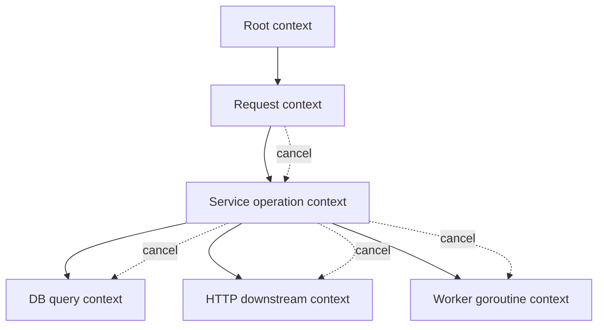
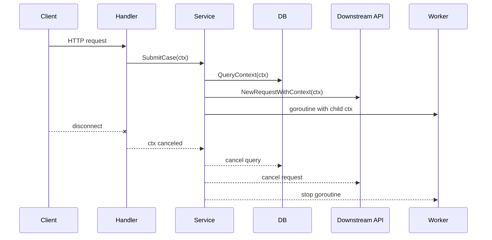
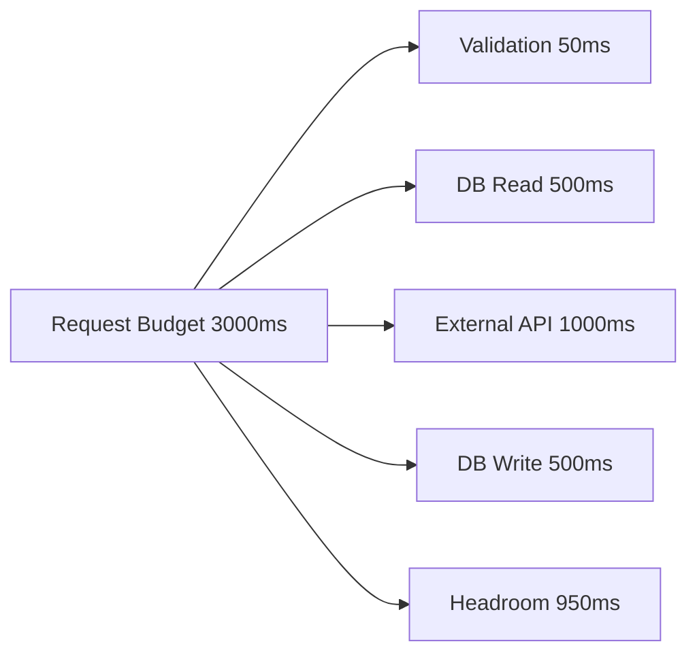
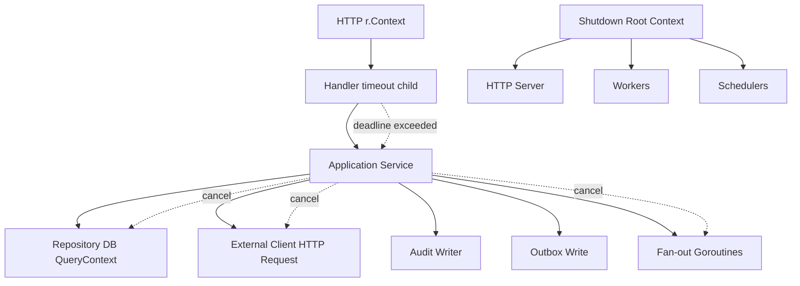
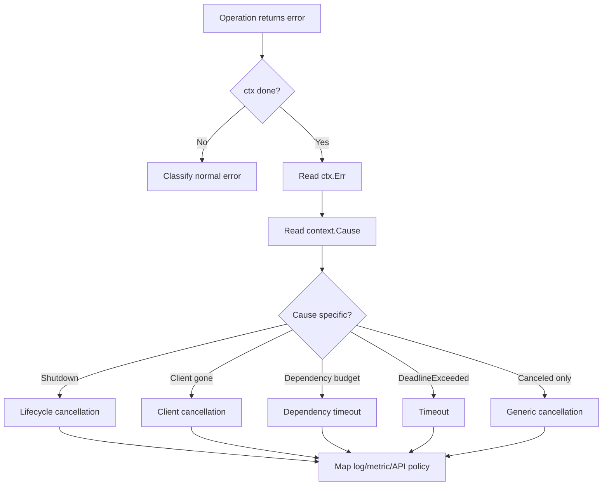

# learn-go-reliability-error-handling-part-011.md

# Context Fundamentals for Reliability: Deadline, Timeout, Cancellation, Cause

> Seri: `learn-go-reliability-error-handling`  
> Part: `011`  
> Target: Go 1.26.x  
> Level: Advanced / internal engineering handbook  
> Fokus: `context.Context` sebagai fondasi reliability: cancellation, deadline, timeout, cause, propagation, dan lifecycle control.

---

## 0. Posisi Materi Ini Dalam Seri

Pada bagian sebelumnya kita sudah membangun fondasi:

- error sebagai API contract
- taxonomy failure
- sentinel/typed/opaque error
- wrapping dan error chain
- error boundary
- domain error model
- validation error
- panic/recover/crash semantics
- `defer` dan cleanup resource

Sekarang kita masuk ke salah satu konsep paling penting dalam Go production system: **context**.

Di Go, banyak operasi produksi tidak cukup hanya return `error`. Sistem juga harus bisa menjawab:

- kapan operasi harus berhenti?
- siapa yang memutuskan operasi harus berhenti?
- apakah operasi berhenti karena timeout, client disconnect, shutdown, parent failure, atau explicit cancel?
- bagaimana cancellation menjalar ke goroutine child?
- apakah dependency call masih boleh berjalan?
- apakah cleanup tetap harus dilakukan?
- apakah error yang dikembalikan harus `context.Canceled`, `context.DeadlineExceeded`, atau cause yang lebih spesifik?
- apakah retry masih boleh dilakukan jika context sudah selesai?
- bagaimana menghindari goroutine leak?

`context.Context` adalah jawaban standar Go untuk sebagian besar pertanyaan tersebut.

Namun banyak codebase menggunakan context hanya sebagai formalitas:

```go
func DoSomething(ctx context.Context) error {
    // ctx diterima, tapi tidak pernah dicek
    // dependency tidak menerima ctx
    // goroutine tidak stop saat ctx done
    // timeout dibuat sembarangan
}
```

Itu bukan context-aware reliability. Itu hanya parameter kosmetik.

---

## 1. Core Thesis

`context.Context` adalah **propagation mechanism** untuk request-scoped lifecycle:

- cancellation signal
- deadline
- timeout
- cancellation cause
- request-scoped values

Tetapi `context` bukan:

- global variable
- dependency injection container
- configuration store
- logger dumping ground
- optional parameter bag
- business domain object
- magic retry controller
- substitute untuk explicit ownership
- excuse untuk mengabaikan cleanup

Top 1% Go engineer memakai context untuk membuat failure propagation eksplisit, bounded, testable, dan operationally visible.

---

## 2. Apa Itu `context.Context`

Secara konseptual, context adalah object immutable-like yang membentuk tree.

Setiap child context mewarisi cancellation/deadline/value dari parent.



Jika parent canceled, semua child ikut canceled.

Jika child canceled, parent tidak ikut canceled.

Ini sangat penting:

```text
parent cancellation flows downward
child cancellation does not flow upward
```

---

## 3. Method Pada Context

Interface dasar:

```go
type Context interface {
    Deadline() (deadline time.Time, ok bool)
    Done() <-chan struct{}
    Err() error
    Value(key any) any
}
```

Makna:

| Method | Fungsi |
|---|---|
| `Deadline()` | kapan context akan otomatis selesai |
| `Done()` | channel ditutup saat context canceled/deadline exceeded |
| `Err()` | alasan standar setelah Done closed |
| `Value()` | request-scoped value |

### 3.1 `Done()`

`Done()` adalah signal.

```go
select {
case <-ctx.Done():
    return ctx.Err()
case result := <-work:
    return result
}
```

Important:

- jangan kirim ke `ctx.Done()`
- jangan close `ctx.Done()`
- hanya baca dari channel itu
- channel bisa `nil` untuk context yang tidak pernah cancel
- `Done` closed berarti work harus berhenti secepat mungkin

### 3.2 `Err()`

Setelah `Done()` closed, `Err()` mengembalikan:

- `context.Canceled`
- `context.DeadlineExceeded`

Dengan cancellation cause, `context.Cause(ctx)` bisa memberi cause lebih spesifik.

### 3.3 `Deadline()`

Digunakan untuk budget-aware decision.

```go
if deadline, ok := ctx.Deadline(); ok {
    remaining := time.Until(deadline)
    if remaining < minRequired {
        return fmt.Errorf("insufficient time budget: %w", context.DeadlineExceeded)
    }
}
```

### 3.4 `Value()`

Dipakai untuk data request-scoped seperti:

- request id
- trace context
- auth principal reference
- locale
- tenant id, dengan hati-hati
- correlation id

Bukan untuk:

- database handle
- logger sebagai dependency utama
- config
- feature flags global
- domain object besar
- optional function arguments
- mutable state

---

## 4. Root Context: `Background` vs `TODO`

### 4.1 `context.Background()`

Digunakan sebagai root:

```go
ctx := context.Background()
```

Typical usage:

- `main`
- initialization
- tests
- top-level process
- independent cleanup with bounded timeout
- root for long-running service lifecycle

### 4.2 `context.TODO()`

Digunakan saat belum jelas context yang benar.

```go
ctx := context.TODO()
```

Ini harus dianggap sebagai technical debt marker.

Jika sudah tahu parent lifecycle, jangan pakai `TODO`.

### 4.3 Jangan Pakai `Background()` di Deep Layer

Buruk:

```go
func (r *Repo) FindUser(id string) (User, error) {
    ctx := context.Background()
    return r.query(ctx, id)
}
```

Kenapa buruk?

- caller cancellation diabaikan
- timeout hilang
- shutdown tidak menjalar
- request bisa selesai tapi DB call tetap jalan
- goroutine/resource bisa leak
- trace/correlation hilang

Baik:

```go
func (r *Repo) FindUser(ctx context.Context, id string) (User, error) {
    return r.query(ctx, id)
}
```

Rule:

> Deep layer should accept context from caller, not create a new root.

---

## 5. Context as Lifecycle Tree

Context tree memodelkan work hierarchy.

Example: HTTP request masuk.



Reliability benefit:

- client disconnect stops unnecessary work
- timeout stops slow dependency wait
- shutdown stops accepting and drains work
- parent failure stops child goroutines
- error handling becomes bounded

---

## 6. Cancellation Semantics

Cancellation berarti: “work ini tidak lagi dibutuhkan atau tidak lagi boleh dilanjutkan.”

Cancellation bukan selalu error bisnis. Cancellation adalah lifecycle signal.

Contoh cause:

- client disconnected
- request timed out
- service shutting down
- parent operation failed
- user explicitly canceled operation
- retry attempt budget expired
- worker group canceled after first error
- admin stopped job
- test canceled

### 6.1 `WithCancel`

```go
ctx, cancel := context.WithCancel(parent)
defer cancel()
```

Digunakan saat kita butuh membatalkan child work secara manual.

Example:

```go
func raceReplicas(ctx context.Context, replicas []Replica, key string) (Value, error) {
    ctx, cancel := context.WithCancel(ctx)
    defer cancel()

    resultCh := make(chan Value, 1)
    errCh := make(chan error, len(replicas))

    for _, replica := range replicas {
        replica := replica
        go func() {
            v, err := replica.Get(ctx, key)
            if err != nil {
                errCh <- err
                return
            }
            select {
            case resultCh <- v:
                cancel() // stop other replicas
            case <-ctx.Done():
            }
        }()
    }

    select {
    case v := <-resultCh:
        return v, nil
    case <-ctx.Done():
        return Value{}, ctx.Err()
    }
}
```

Cancellation is coordination.

---

## 7. Deadline vs Timeout

### 7.1 Timeout

Timeout adalah durasi relatif.

```go
ctx, cancel := context.WithTimeout(parent, 2*time.Second)
defer cancel()
```

“Mulai sekarang, maksimal 2 detik.”

### 7.2 Deadline

Deadline adalah waktu absolut.

```go
deadline := time.Now().Add(2 * time.Second)
ctx, cancel := context.WithDeadline(parent, deadline)
defer cancel()
```

“Berhenti pada timestamp ini.”

### 7.3 Timeout Dibangun dari Deadline

Secara mental, timeout adalah cara mudah membuat deadline relatif.

### 7.4 Parent Deadline Menang Jika Lebih Cepat

Jika parent sudah punya deadline 1 detik, child timeout 5 detik tidak memperpanjang.

```go
parent, cancelParent := context.WithTimeout(context.Background(), time.Second)
defer cancelParent()

child, cancelChild := context.WithTimeout(parent, 5*time.Second)
defer cancelChild()

deadline, _ := child.Deadline()
// deadline kira-kira parent deadline, bukan 5 detik dari sekarang.
```

Rule:

> Child cannot outlive parent.

Ini adalah invariant besar context tree.

---

## 8. Deadline Budget Mental Model

Dalam distributed system, deadline adalah budget.

Jika handler punya 3 detik total:

```text
Total request budget: 3000 ms
- decode/validate: 50 ms
- DB read: 500 ms
- external API: 1000 ms
- DB write: 500 ms
- response encode: 50 ms
- buffer/headroom: 900 ms
```

Jangan membuat setiap dependency timeout 3 detik. Itu membuat total bisa meledak.

Buruk:

```go
ctxDB, cancel := context.WithTimeout(ctx, 3*time.Second)
defer cancel()
```

Jika parent request juga 3 detik, ini tidak membagi budget. Ini hanya menyalin upper bound.

Lebih baik:

```go
dbCtx, cancel := context.WithTimeout(ctx, 500*time.Millisecond)
defer cancel()
```

Tapi jangan hardcode tanpa reasoning. Timeouts harus datang dari config/latency/SLO/dependency profile.

### 8.1 Mermaid Budget Flow



### 8.2 Deadline-aware Admission

Kadang lebih baik fail fast jika sisa budget terlalu kecil.

```go
func requireBudget(ctx context.Context, min time.Duration) error {
    deadline, ok := ctx.Deadline()
    if !ok {
        return nil
    }

    if remaining := time.Until(deadline); remaining < min {
        return fmt.Errorf("insufficient time budget: remaining=%s required=%s: %w",
            remaining, min, context.DeadlineExceeded)
    }

    return nil
}
```

Use case:

- sebelum melakukan DB transaction
- sebelum memulai external call mahal
- sebelum enqueue job synchronous
- sebelum memproses upload besar

---

## 9. Always Call CancelFunc

Setiap function berikut mengembalikan `CancelFunc`:

- `context.WithCancel`
- `context.WithTimeout`
- `context.WithDeadline`
- `context.WithCancelCause`
- `context.WithTimeoutCause`
- `context.WithDeadlineCause`

Rule:

```go
ctx, cancel := context.WithTimeout(parent, timeout)
defer cancel()
```

Kenapa?

- membebaskan timer lebih cepat
- melepas reference parent-child
- menghindari resource leak
- membuat lifecycle eksplisit

Buruk:

```go
ctx, _ := context.WithTimeout(parent, time.Second)
return call(ctx)
```

Baik:

```go
ctx, cancel := context.WithTimeout(parent, time.Second)
defer cancel()

return call(ctx)
```

### 9.1 Cancel in Loop

Buruk:

```go
for _, item := range items {
    ctx, cancel := context.WithTimeout(parent, time.Second)
    defer cancel() // baru cancel saat fungsi selesai
    process(ctx, item)
}
```

Baik:

```go
for _, item := range items {
    if err := processOne(parent, item); err != nil {
        return err
    }
}

func processOne(parent context.Context, item Item) error {
    ctx, cancel := context.WithTimeout(parent, time.Second)
    defer cancel()

    return process(ctx, item)
}
```

Atau manual cancel per iteration:

```go
for _, item := range items {
    ctx, cancel := context.WithTimeout(parent, time.Second)
    err := process(ctx, item)
    cancel()
    if err != nil {
        return err
    }
}
```

---

## 10. `context.Canceled` vs `context.DeadlineExceeded`

### 10.1 `context.Canceled`

Artinya context dibatalkan secara eksplisit.

Potential causes:

- client disconnected
- parent canceled after first goroutine error
- shutdown
- user canceled operation
- manual `cancel()`

### 10.2 `context.DeadlineExceeded`

Artinya deadline terlewati.

Potential causes:

- timeout too low
- dependency slow
- system overloaded
- queueing delay
- CPU throttling
- network latency
- lock contention

### 10.3 Jangan Perlakukan Sama

Cancellation karena user disconnect bukan incident.

Deadline exceeded pada critical API bisa SLO symptom.

Example classifier:

```go
func classifyContextError(err error) ErrorClass {
    switch {
    case errors.Is(err, context.Canceled):
        return ErrorClassCanceled
    case errors.Is(err, context.DeadlineExceeded):
        return ErrorClassTimeout
    default:
        return ErrorClassUnknown
    }
}
```

Operational mapping:

| Error | HTTP-ish meaning | Log level | Alert? |
|---|---|---|---|
| `context.Canceled` because client gone | often 499-like | debug/info | usually no |
| `context.Canceled` because shutdown | lifecycle | info | no unless excessive |
| `context.Canceled` because parent failure | derived failure | depends on cause | maybe |
| `context.DeadlineExceeded` for user request | timeout | warn/error based on SLO | maybe |
| `context.DeadlineExceeded` for background cleanup | shutdown/cleanup failure | warn | maybe if recurring |

---

## 11. Cancellation Cause

Modern Go includes cancellation cause functions:

- `context.WithCancelCause`
- `context.Cause`
- `context.WithTimeoutCause`
- `context.WithDeadlineCause`

Problem solved:

Plain `ctx.Err()` only returns:

```text
context canceled
context deadline exceeded
```

But real cause may be:

- dependency X failed
- validation aborted fan-out
- service shutting down
- parent job canceled due to poison message
- rate limiter rejected
- first replica succeeded and canceled the rest
- security policy aborted request

### 11.1 Basic WithCancelCause

```go
ctx, cancel := context.WithCancelCause(parent)

go func() {
    if err := doSomething(ctx); err != nil {
        cancel(fmt.Errorf("dependency failed: %w", err))
    }
}()

<-ctx.Done()

if err := context.Cause(ctx); err != nil {
    return fmt.Errorf("operation canceled: %w", err)
}
```

### 11.2 Difference Between `Err` and `Cause`

```go
err := ctx.Err()           // context.Canceled
cause := context.Cause(ctx) // custom cause, if provided
```

Rule:

- use `ctx.Err()` when you only need standard cancellation status
- use `context.Cause(ctx)` when you need causal diagnostics/policy

### 11.3 If No Cause Set

For normal cancellation, cause is usually same as `Err()`.

### 11.4 Cause Propagation

Child context sees parent cause if parent canceled.

This helps preserve failure origin.

```mermaid
flowchart TD
    A[Parent ctx canceled with cause: db unavailable] --> B[Child DB ctx]
    A --> C[Child API ctx]
    B --> D[context.Cause(child) = db unavailable]
    C --> E[context.Cause(child) = db unavailable]
```

### 11.5 Do Not Abuse Cause

Cause is not a dumping ground.

Good causes:

- stable, meaningful error
- wrapped with operation context
- safe for logs
- useful for classification
- not full PII payload

Bad causes:

- huge response body
- secret/token
- user private data
- random string
- mutable error object
- overly generic `fmt.Errorf("failed")`

---

## 12. Timeout Cause

`WithTimeoutCause` lets you specify cause when timeout expires.

```go
ctx, cancel := context.WithTimeoutCause(parent, 2*time.Second, ErrDependencyBudgetExceeded)
defer cancel()
```

If deadline expires, `context.Cause(ctx)` can return `ErrDependencyBudgetExceeded`.

Useful for:

- differentiating DB timeout vs external API timeout
- differentiating per-attempt timeout vs total operation timeout
- better metrics/logging
- better retry classifier

Example:

```go
var ErrExternalAPIBudgetExceeded = errors.New("external API budget exceeded")

func callExternal(parent context.Context, client *http.Client, req *http.Request) error {
    ctx, cancel := context.WithTimeoutCause(parent, 800*time.Millisecond, ErrExternalAPIBudgetExceeded)
    defer cancel()

    req = req.WithContext(ctx)

    resp, err := client.Do(req)
    if err != nil {
        if errors.Is(context.Cause(ctx), ErrExternalAPIBudgetExceeded) {
            return fmt.Errorf("call external API timed out: %w", context.Cause(ctx))
        }
        return fmt.Errorf("call external API: %w", err)
    }
    defer resp.Body.Close()

    return nil
}
```

Caution: still preserve underlying client error when useful.

---

## 13. `context.AfterFunc`

`context.AfterFunc(ctx, fn)` registers a function to run after context is done.

Use cases:

- interrupt blocking operation
- release resources on cancellation
- notify legacy API
- stop timer-like external wait
- bridge context to non-context-aware operation

Example conceptual:

```go
stop := context.AfterFunc(ctx, func() {
    conn.Close()
})
defer stop()
```

But be careful:

- `fn` may run concurrently
- `stop()` prevents function if not already started
- race with normal cleanup must be safe
- cleanup must be idempotent
- avoid panic in AfterFunc
- avoid blocking forever in AfterFunc

Pattern:

```go
stop := context.AfterFunc(ctx, func() {
    _ = resource.Close()
})
defer func() {
    if stop() {
        // AfterFunc did not run; normal cleanup continues.
    }
    _ = resource.Close()
}()
```

Resource close must tolerate double close or be guarded.

---

## 14. `context.WithoutCancel`

`context.WithoutCancel(parent)` creates context that is not canceled when parent is canceled.

This is sharp.

Potential valid cases:

- finish writing audit event after request canceled
- flush telemetry/logging
- perform bounded cleanup
- detach small non-critical continuation that must outlive request
- cache warm after response, if bounded and safe

Invalid cases:

- continue core business operation after caller canceled without explicit policy
- hide slow dependency from timeout
- bypass shutdown
- make goroutine immortal
- ignore user cancellation for expensive work
- preserve request values indefinitely

### 14.1 Safer Pattern

If detaching, always add a new bound:

```go
detached := context.WithoutCancel(parent)
cleanupCtx, cancel := context.WithTimeout(detached, 2*time.Second)
defer cancel()

return audit.Write(cleanupCtx, event)
```

Better for many cleanup operations:

```go
cleanupCtx, cancel := context.WithTimeout(context.Background(), 2*time.Second)
defer cancel()
```

But if you need values like trace id from parent, `WithoutCancel` may preserve values while removing cancellation.

### 14.2 Governance Rule

Every `WithoutCancel` usage should answer in code review:

1. Why is it safe to outlive parent?
2. What bounds it?
3. What values are carried?
4. What happens during process shutdown?
5. Is it idempotent?
6. Is it observable?

---

## 15. Context Parameter Convention

Go convention:

```go
func Do(ctx context.Context, arg Arg) error
```

Rules:

- context is first parameter
- name it `ctx`
- do not store context in struct for long-lived use
- do not pass nil context
- if unsure, use `context.TODO()`, not nil
- do not make context optional
- do not put context after other args

Good:

```go
func (s *Service) SubmitCase(ctx context.Context, req SubmitCaseRequest) (SubmitCaseResponse, error)
```

Bad:

```go
func (s *Service) SubmitCase(req SubmitCaseRequest, ctx context.Context) error
```

Very bad:

```go
func (s *Service) SubmitCase(req SubmitCaseRequest) error {
    ctx := context.Background()
    ...
}
```

---

## 16. Do Not Store Context in Struct

Buruk:

```go
type Service struct {
    ctx context.Context
    db  *sql.DB
}
```

Kenapa buruk?

- struct lifetime biasanya lebih panjang dari request
- context bisa canceled tapi service masih dipakai
- request values bocor
- impossible to reason about deadlines
- concurrent calls bisa share wrong context

Baik:

```go
type Service struct {
    db *sql.DB
}

func (s *Service) SubmitCase(ctx context.Context, req SubmitCaseRequest) error {
    return s.repo.Save(ctx, req)
}
```

Exception yang sangat terbatas:

- short-lived object yang memang merepresentasikan operation lifecycle
- command object per request
- goroutine worker object with its own lifecycle context

Even then, be explicit.

```go
type runningJob struct {
    ctx    context.Context
    cancel context.CancelFunc
}
```

This is lifecycle state, not general dependency.

---

## 17. Context Values: Use Sparingly

### 17.1 Good Context Values

- trace id
- request id
- correlation id
- auth principal
- tenant id
- locale
- request-scoped logger metadata
- OpenTelemetry span context

### 17.2 Bad Context Values

- database connection
- repository
- service dependency
- config object
- feature flag store
- large request payload
- mutable domain state
- optional parameters
- cache
- transaction, usually pass explicitly
- user object with huge permissions graph

### 17.3 Typed Key Pattern

Avoid string keys.

Bad:

```go
ctx = context.WithValue(ctx, "userID", userID)
```

Better:

```go
type userIDKey struct{}

func WithUserID(ctx context.Context, userID string) context.Context {
    return context.WithValue(ctx, userIDKey{}, userID)
}

func UserIDFromContext(ctx context.Context) (string, bool) {
    v, ok := ctx.Value(userIDKey{}).(string)
    return v, ok
}
```

### 17.4 Context Value and Security

Never put secrets casually in context:

- access token
- password
- private key
- raw identity document
- full PII payload

Context values often flow into logs/traces accidentally through instrumentation.

---

## 18. Context and HTTP Server

For incoming HTTP requests, `r.Context()` is canceled when:

- client connection closes
- request is canceled
- HTTP/2 request is canceled
- handler returns? Usually request context lifecycle is tied to request.

Handler pattern:

```go
func (h *Handler) ServeHTTP(w http.ResponseWriter, r *http.Request) {
    ctx := r.Context()

    result, err := h.service.Do(ctx, r)
    if err != nil {
        h.writeError(w, err)
        return
    }

    h.writeOK(w, result)
}
```

Add handler-level timeout carefully:

```go
ctx, cancel := context.WithTimeout(r.Context(), 2*time.Second)
defer cancel()

result, err := h.service.Do(ctx, req)
```

But avoid stacking random timeouts at every layer. Use budget model.

### 18.1 Outgoing HTTP Client

Use `http.NewRequestWithContext`.

```go
req, err := http.NewRequestWithContext(ctx, http.MethodGet, url, nil)
if err != nil {
    return fmt.Errorf("build request: %w", err)
}

resp, err := client.Do(req)
if err != nil {
    return fmt.Errorf("do request: %w", err)
}
defer resp.Body.Close()
```

For outgoing client requests, context controls the request lifetime: connection acquisition, sending, and reading response headers/body.

### 18.2 Client Timeout vs Context Timeout

`http.Client{Timeout: ...}` sets a total timeout for requests made by that client.

Context timeout is per request/operation.

Production recommendation:

- use context for request-specific budget
- use transport timeouts for lower-level network phases
- avoid relying only on one global `Client.Timeout`
- do not create new `http.Client` per request
- ensure response body close

---

## 19. Context and Database

`database/sql` supports context-aware operations:

- `QueryContext`
- `QueryRowContext`
- `ExecContext`
- `BeginTx`

Good:

```go
rows, err := db.QueryContext(ctx, query, args...)
```

Bad:

```go
rows, err := db.Query(query, args...) // ignores ctx
```

For transaction:

```go
tx, err := db.BeginTx(ctx, nil)
if err != nil {
    return fmt.Errorf("begin tx: %w", err)
}
defer tx.Rollback()
```

If context is canceled, transaction behavior depends on database/sql and driver semantics; docs specify transaction context is used until commit/rollback and transaction is rolled back if context is canceled before commit. Treat cancellation as a serious lifecycle event.

### 19.1 Do Not Use Request Context for Long Post-Commit Work

If DB commit succeeded and you need to publish outbox asynchronously, do not do long work under request context unless it is part of request contract.

Better:

- write outbox in transaction
- background dispatcher with service lifecycle context
- bounded retries
- idempotent publish

---

## 20. Context and Goroutines

When starting goroutine, decide its lifecycle.

Bad:

```go
go func() {
    doWork()
}()
```

Better:

```go
go func() {
    if err := doWork(ctx); err != nil {
        report(err)
    }
}()
```

But just passing ctx is not enough. Goroutine must observe it.

```go
func doWork(ctx context.Context) error {
    for {
        select {
        case <-ctx.Done():
            return ctx.Err()
        case item := <-items:
            if err := process(ctx, item); err != nil {
                return err
            }
        }
    }
}
```

### 20.1 Goroutine Leak

If goroutine waits on channel forever and ignores ctx:

```go
go func() {
    result := <-ch
    use(result)
}()
```

It can leak.

Better:

```go
go func() {
    select {
    case result := <-ch:
        use(result)
    case <-ctx.Done():
        return
    }
}()
```

### 20.2 Send with Context

Potential leak:

```go
out <- value
```

If receiver stopped, goroutine blocks.

Better:

```go
select {
case out <- value:
case <-ctx.Done():
    return ctx.Err()
}
```

### 20.3 Receive with Context

```go
select {
case v := <-in:
    return v, nil
case <-ctx.Done():
    return zero, ctx.Err()
}
```

---

## 21. Context and Worker Pools

Worker lifecycle:

```go
func worker(ctx context.Context, jobs <-chan Job) error {
    for {
        select {
        case <-ctx.Done():
            return ctx.Err()

        case job, ok := <-jobs:
            if !ok {
                return nil
            }

            if err := processJob(ctx, job); err != nil {
                return fmt.Errorf("process job %s: %w", job.ID, err)
            }
        }
    }
}
```

But production worker pool needs policy:

- Does one job failure stop worker?
- Does context cancellation requeue job?
- Does timeout apply per job or whole worker?
- Does shutdown finish current job or abort?
- Does job processing get child timeout?
- How are errors reported?

Per-job timeout:

```go
jobCtx, cancel := context.WithTimeout(ctx, cfg.JobTimeout)
err := processJob(jobCtx, job)
cancel()
```

Avoid `defer cancel()` inside long worker loop unless scope helper used.

---

## 22. Context and `errgroup`

`errgroup.WithContext` is common for fan-out operations.

Conceptual pattern:

```go
g, ctx := errgroup.WithContext(ctx)

for _, item := range items {
    item := item
    g.Go(func() error {
        return process(ctx, item)
    })
}

if err := g.Wait(); err != nil {
    return fmt.Errorf("process items: %w", err)
}
return nil
```

When one goroutine returns error, context is canceled, so siblings can stop.

Important:

- child work must observe ctx
- first error usually wins
- use bounded concurrency where needed
- not all multi-error cases fit errgroup
- cancellation cause may be useful when preserving first error

This will be deeper in part 016.

---

## 23. Context in Retry Loops

Retry loop must stop when context is done.

Bad:

```go
for attempt := 0; attempt < 3; attempt++ {
    err := call()
    if err == nil {
        return nil
    }
    time.Sleep(backoff)
}
```

Good:

```go
for attempt := 0; attempt < maxAttempts; attempt++ {
    err := call(ctx)
    if err == nil {
        return nil
    }

    if !isRetryable(err) {
        return err
    }

    if ctx.Err() != nil {
        return ctx.Err()
    }

    delay := nextBackoff(attempt)

    select {
    case <-time.After(delay):
    case <-ctx.Done():
        return ctx.Err()
    }
}
```

Even better: avoid `time.After` if loop is hot; use timer carefully.

### 23.1 Per-attempt Timeout vs Total Timeout

```go
totalCtx, cancel := context.WithTimeout(parent, 3*time.Second)
defer cancel()

for attempt := 0; attempt < 3; attempt++ {
    attemptCtx, cancelAttempt := context.WithTimeout(totalCtx, 800*time.Millisecond)
    err := call(attemptCtx)
    cancelAttempt()

    if err == nil {
        return nil
    }
    // classify, backoff bounded by totalCtx
}
```

Total context bounds whole operation. Attempt context bounds one try.

---

## 24. Context Error Wrapping

When returning context errors, preserve classification.

Good:

```go
return fmt.Errorf("query case by id: %w", ctx.Err())
```

Then:

```go
errors.Is(err, context.Canceled)
errors.Is(err, context.DeadlineExceeded)
```

still works.

Bad:

```go
return fmt.Errorf("query case by id: %v", ctx.Err())
```

This loses wrapping.

Better with cause:

```go
if cause := context.Cause(ctx); cause != nil {
    return fmt.Errorf("submit case canceled: %w", cause)
}
return fmt.Errorf("submit case canceled: %w", ctx.Err())
```

Be careful: if cause is domain-specific, wrapping it may change classifier. That may be desired.

---

## 25. Context and Error Boundary

At low level:

```go
return fmt.Errorf("execute query: %w", err)
```

At boundary:

```go
switch {
case errors.Is(err, context.Canceled):
    // client canceled/shutdown; maybe no error response possible
case errors.Is(err, context.DeadlineExceeded):
    // timeout response
}
```

But with cause:

```go
cause := context.Cause(ctx)
```

Boundary can decide:

- timeout due to total request budget
- timeout due to downstream API budget
- cancellation due to shutdown
- cancellation due to first failure in fan-out

Design typed causes if needed:

```go
var ErrShutdown = errors.New("service shutting down")
var ErrClientGone = errors.New("client disconnected")
var ErrExternalBudget = errors.New("external API budget exceeded")
```

---

## 26. Context and Observability

Context often carries trace/request metadata.

Good logging:

```go
logger.InfoContext(ctx, "submit case started",
    "case_id", req.CaseID,
)
```

`InfoContext` lets logging handler extract trace metadata if configured.

But context cancellation itself should be observable:

Metrics:

```text
requests_total{result="success"}
requests_total{result="canceled"}
requests_total{result="timeout"}
requests_total{result="error"}

operation_cancellations_total{cause="client_disconnect"}
operation_cancellations_total{cause="shutdown"}
operation_timeouts_total{operation="db_query"}
```

Avoid high-cardinality cause labels.

Bad:

```text
operation_timeouts_total{error="query user 12345 timeout after 817ms"}
```

Good:

```text
operation_timeouts_total{operation="case_query",dependency="oracle"}
```

### 26.1 Log Level Guidance

| Situation | Suggested level |
|---|---|
| client canceled request | debug/info |
| user canceled explicit job | info |
| context timeout due to dependency latency | warn |
| timeout impacting SLO | error/alert via metric |
| shutdown cancellation | info |
| internal parent failure cancellation | depends on root cause |
| cleanup timeout | warn |

---

## 27. Context and API Response

HTTP mapping depends on cause.

Possible mapping:

| Internal condition | HTTP response |
|---|---|
| handler timeout | 504 or 503 depending role |
| downstream timeout | 504 |
| server overload budget exceeded | 503 |
| client disconnected | often no response possible |
| shutdown before accepted | 503 |
| user canceled long job | 499-like internal metric, not standard HTTP |
| DB query timeout | 504/503/internal depending abstraction |

In Go standard `net/http`, there is no built-in 499 status. You can log client disconnect separately.

Do not expose raw context error strings as public API contract:

Bad:

```json
{"error":"context deadline exceeded"}
```

Better:

```json
{
  "code": "REQUEST_TIMEOUT",
  "message": "The request timed out before it could be completed.",
  "correlation_id": "..."
}
```

Internal log can preserve wrapped error.

---

## 28. Context and Shutdown

During graceful shutdown:

- root service context canceled with cause `ErrShutdown`
- server stops accepting new requests
- in-flight requests get bounded time
- workers receive cancellation
- cleanup gets separate bounded context
- telemetry flush gets bounded context

Example root:

```go
root, cancel := context.WithCancelCause(context.Background())
defer cancel(nil)

go func() {
    <-signalCh
    cancel(ErrShutdown)
}()
```

Worker:

```go
for {
    select {
    case <-root.Done():
        return context.Cause(root)
    case job := <-jobs:
        process(root, job)
    }
}
```

Shutdown cleanup:

```go
cleanupCtx, cancel := context.WithTimeout(context.Background(), 10*time.Second)
defer cancel()

if err := app.Close(cleanupCtx); err != nil {
    return fmt.Errorf("close app: %w", err)
}
```

Why not use root after canceled? Because cleanup may need time to complete.

This will be expanded in part 019 and 020.

---

## 29. Context and Long-running Jobs

HTTP request context is usually wrong for long-running background jobs after response.

Bad:

```go
func (h *Handler) StartJob(w http.ResponseWriter, r *http.Request) {
    go h.jobs.Run(r.Context(), job)
    w.WriteHeader(http.StatusAccepted)
}
```

When handler returns/client disconnects, request context may cancel and job stops unexpectedly.

Better:

- persist job request
- enqueue job
- background worker uses service lifecycle context
- job has its own deadline/cancel control
- user cancellation is separate command

```go
func (h *Handler) StartJob(w http.ResponseWriter, r *http.Request) {
    jobID, err := h.jobs.Enqueue(r.Context(), req)
    if err != nil {
        h.writeError(w, err)
        return
    }

    writeJSON(w, http.StatusAccepted, StartJobResponse{JobID: jobID})
}
```

Worker:

```go
func (w *Worker) Run(ctx context.Context) error {
    for {
        job, err := w.queue.Receive(ctx)
        if err != nil {
            return err
        }

        jobCtx, cancel := context.WithTimeout(ctx, w.cfg.JobTimeout)
        err = w.process(jobCtx, job)
        cancel()

        w.ackPolicy(ctx, job, err)
    }
}
```

---

## 30. Context and Validation/Domain Logic

Should pure domain logic accept context?

Usually no.

Pure deterministic validation:

```go
func (r SubmitRequest) Validate() error
```

No context needed.

Domain operation that calls repository/external policy:

```go
func (s *Service) SubmitCase(ctx context.Context, req SubmitRequest) error
```

Context belongs where operation may block, wait, call dependency, or be canceled.

Avoid infecting pure domain entity methods with context if not needed.

Good separation:

```go
func (c *Case) CanSubmit(actor Actor, now time.Time) error
```

Application service:

```go
func (s *Service) Submit(ctx context.Context, req SubmitRequest) error {
    actor, err := s.auth.ResolveActor(ctx, req.ActorID)
    if err != nil {
        return err
    }

    c, err := s.repo.GetCase(ctx, req.CaseID)
    if err != nil {
        return err
    }

    if err := c.CanSubmit(actor, s.clock.Now()); err != nil {
        return err
    }

    return s.repo.Save(ctx, c)
}
```

---

## 31. Context and Transactions

Important rule:

> Do not let context timeout accidentally split a business transaction in unclear ways.

If context deadline expires during transaction:

- DB driver may cancel query
- transaction may rollback
- commit may fail
- outcome may be ambiguous depending failure timing
- caller needs idempotency/recovery strategy

Pattern:

```go
func (s *Service) Submit(ctx context.Context, req SubmitRequest) error {
    if err := requireBudget(ctx, 500*time.Millisecond); err != nil {
        return err
    }

    tx, err := s.db.BeginTx(ctx, nil)
    if err != nil {
        return fmt.Errorf("begin submit tx: %w", err)
    }
    defer tx.Rollback()

    // operations

    if err := tx.Commit(); err != nil {
        return fmt.Errorf("commit submit tx: %w", err)
    }

    return nil
}
```

For critical transaction, check budget before begin.

---

## 32. Context and Locks

Local mutex operations do not accept context by default. If lock can block long and needs cancellation, use design alternatives:

- channel semaphore with select
- `TryLock` if available and appropriate
- context-aware queue
- avoid long lock contention
- redesign ownership

Example semaphore:

```go
func acquire(ctx context.Context, sem chan struct{}) error {
    select {
    case sem <- struct{}{}:
        return nil
    case <-ctx.Done():
        return ctx.Err()
    }
}
```

Do not hold lock while waiting on context-aware external operation unless deliberate.

Bad:

```go
mu.Lock()
defer mu.Unlock()

return external.Call(ctx)
```

This can block other requests until external call finishes or context cancels.

---

## 33. Context and Rate Limiters

Rate limit wait should accept context.

Concept:

```go
if err := limiter.Wait(ctx); err != nil {
    return fmt.Errorf("wait rate limiter: %w", err)
}
```

If context done while waiting for quota:

- do not execute operation
- classify as canceled/timeout
- do not retry blindly
- metric admission delay/timeouts

Manual channel token:

```go
select {
case <-limiter:
    return nil
case <-ctx.Done():
    return ctx.Err()
}
```

---

## 34. Context and Backpressure

Context is critical in backpressure:

```go
select {
case queue <- job:
    return nil
case <-ctx.Done():
    return ctx.Err()
}
```

Without context, enqueue can hang forever.

Bounded queue + context:

```go
func (q *Queue) Submit(ctx context.Context, job Job) error {
    select {
    case q.jobs <- job:
        return nil
    case <-ctx.Done():
        return fmt.Errorf("submit job: %w", ctx.Err())
    }
}
```

But if queue full due to overload, context deadline exceeded may be symptom of overload. Capture metric:

```text
queue_submit_timeout_total{queue="case_submission"}
```

---

## 35. Context and Pipelines

Pipeline stages must listen to `ctx.Done()`.

```go
func stage(ctx context.Context, in <-chan Item) <-chan Result {
    out := make(chan Result)

    go func() {
        defer close(out)

        for {
            select {
            case <-ctx.Done():
                return

            case item, ok := <-in:
                if !ok {
                    return
                }

                result := process(item)

                select {
                case out <- result:
                case <-ctx.Done():
                    return
                }
            }
        }
    }()

    return out
}
```

Two cancellation points:

1. while waiting for input
2. while sending output

Without second select, goroutine can leak if downstream stops reading.

---

## 36. Common Anti-Patterns

### 36.1 Accepting Context But Ignoring It

```go
func Process(ctx context.Context) error {
    time.Sleep(10 * time.Second)
    return nil
}
```

Better:

```go
func Process(ctx context.Context) error {
    timer := time.NewTimer(10 * time.Second)
    defer timer.Stop()

    select {
    case <-timer.C:
        return nil
    case <-ctx.Done():
        return ctx.Err()
    }
}
```

### 36.2 Creating `Background()` in Repository

Breaks cancellation propagation.

### 36.3 Storing Context in Long-lived Struct

Request context leaks into global object.

### 36.4 Passing Nil Context

Never pass nil context.

### 36.5 Using Context Value for Dependencies

Context is not DI container.

### 36.6 Timeout at Every Layer Without Budget Model

Stacking arbitrary timeouts makes behavior unpredictable.

### 36.7 Swallowing Cancellation

```go
if errors.Is(err, context.Canceled) {
    return nil
}
```

Sometimes correct, often wrong. Hiding cancellation can make caller think operation succeeded.

### 36.8 Retrying After Context Done

If context is done, stop.

### 36.9 Continuing Business Work with `WithoutCancel`

Dangerous unless explicitly bounded and justified.

### 36.10 Logging Context Timeout as Internal Error Without Classification

Timeout should be classified and observed as latency/SLO/dependency issue.

---

## 37. Java Engineer Translation Layer

### 37.1 Java Thread Interrupt vs Go Context

Java:

- thread interruption is thread-level signal
- many APIs may or may not respect interrupt
- cancellation often tied to `Future.cancel`
- timeout often from executor/future/client

Go:

- context is explicit parameter
- cancellation is operation-level, not goroutine magic
- code must select on `ctx.Done()` or pass ctx to context-aware APIs
- goroutine is not forcibly killed

### 37.2 Java CompletableFuture Timeout

Java:

```java
future.orTimeout(2, TimeUnit.SECONDS)
```

Go:

```go
ctx, cancel := context.WithTimeout(parent, 2*time.Second)
defer cancel()

return call(ctx)
```

But Go timeout only works if `call` observes ctx.

### 37.3 Spring RequestContext vs Go Context

Do not map Spring-like request context to Go context as a bag of everything. Go context values should remain minimal and request-scoped.

### 37.4 Checked Exception vs Context Error

Java timeout often appears as exception.

Go timeout appears as error returned from context-aware operation, often wrapping `context.DeadlineExceeded`.

---

## 38. Designing Context-aware APIs

Good API:

```go
type CaseRepository interface {
    GetByID(ctx context.Context, id CaseID) (Case, error)
    Save(ctx context.Context, c Case) error
}
```

Good external client:

```go
type ProfileClient interface {
    GetProfile(ctx context.Context, userID string) (Profile, error)
}
```

Good worker:

```go
type Worker interface {
    Run(ctx context.Context) error
    Close(ctx context.Context) error
}
```

Bad API:

```go
GetByID(id CaseID) (Case, error)
Save(c Case) error
GetProfile(userID string) (Profile, error)
RunForever()
Close()
```

Unless operations are pure CPU and quick.

### 38.1 Context Contract Documentation

Document cancellation behavior:

```go
// GetByID retrieves a case by ID. If ctx is canceled before the query
// completes, GetByID returns an error wrapping ctx.Err().
func (r *Repo) GetByID(ctx context.Context, id CaseID) (Case, error)
```

For long operations:

```go
// Run processes jobs until ctx is canceled or a non-recoverable error occurs.
// On ctx cancellation, Run stops accepting new jobs and returns ctx.Err()
// after the current job is either completed or aborted according to the
// worker policy.
func (w *Worker) Run(ctx context.Context) error
```

---

## 39. CPU-bound Work and Context

Context does not preempt CPU-bound loops automatically.

Bad:

```go
func compute(ctx context.Context, n int) Result {
    for i := 0; i < n; i++ {
        expensiveStep(i)
    }
    return result
}
```

Better:

```go
func compute(ctx context.Context, n int) (Result, error) {
    for i := 0; i < n; i++ {
        if i%1024 == 0 {
            select {
            case <-ctx.Done():
                return Result{}, ctx.Err()
            default:
            }
        }

        expensiveStep(i)
    }

    return result, nil
}
```

Check frequency should balance responsiveness and overhead.

For CPU-heavy jobs:

- chunk work
- check context between chunks
- use worker pool lifecycle
- avoid holding locks during compute
- expose progress/checkpoint if long-running

---

## 40. Context and Streaming

Streaming operations need continuous cancellation observation.

HTTP streaming:

```go
func stream(ctx context.Context, w io.Writer, events <-chan Event) error {
    enc := json.NewEncoder(w)

    for {
        select {
        case <-ctx.Done():
            return ctx.Err()

        case ev, ok := <-events:
            if !ok {
                return nil
            }

            if err := enc.Encode(ev); err != nil {
                return fmt.Errorf("encode event: %w", err)
            }
        }
    }
}
```

But write itself may block. Network write cancellation depends on underlying connection/server. Combine:

- request context
- write deadlines if available
- server timeouts
- close connection on cancellation for low-level streams

---

## 41. Context and `select` Defaults

Non-blocking check:

```go
select {
case <-ctx.Done():
    return ctx.Err()
default:
}
```

Use in CPU loop to avoid blocking.

But do not use default when you actually need to wait.

Bad:

```go
select {
case <-ctx.Done():
    return ctx.Err()
case job := <-jobs:
    process(job)
default:
    // busy loop
}
```

This can spin CPU.

If no work, block:

```go
select {
case <-ctx.Done():
    return ctx.Err()
case job := <-jobs:
    process(job)
}
```

---

## 42. Context and Channel Ownership

Context cancels work; it does not close your business channels.

Do not assume:

```go
<-ctx.Done()
// magically jobs channel closed
```

If you own channel, close it according to ownership policy.

Context and channel close are separate signals:

| Signal | Meaning |
|---|---|
| `ctx.Done()` | lifecycle canceled/deadline |
| `close(jobs)` | no more jobs |
| `close(results)` | no more results |
| `close(done)` | component stopped |

A robust component often uses both context and done channel.

---

## 43. Context and Cleanup Revisited

From part 010:

If operation context is canceled, cleanup may still be necessary.

Example:

```go
defer func() {
    cleanupCtx, cancel := context.WithTimeout(context.Background(), 2*time.Second)
    defer cancel()

    if err := lease.Release(cleanupCtx); err != nil {
        logger.Warn("release lease failed", "error", err)
    }
}()
```

Do not use canceled ctx for mandatory cleanup:

```go
defer lease.Release(ctx) // may immediately fail if ctx canceled
```

But also do not use unbounded background context:

```go
defer lease.Release(context.Background()) // may hang
```

Use bounded cleanup context.

---

## 44. Practical Context Classifier

```go
type CancelKind string

const (
    CancelKindNone          CancelKind = "none"
    CancelKindCanceled      CancelKind = "canceled"
    CancelKindDeadline      CancelKind = "deadline"
    CancelKindShutdown      CancelKind = "shutdown"
    CancelKindClientGone    CancelKind = "client_gone"
    CancelKindDependency    CancelKind = "dependency"
    CancelKindUnknown       CancelKind = "unknown"
)

var (
    ErrShutdown   = errors.New("service shutting down")
    ErrClientGone = errors.New("client disconnected")
)

func ClassifyContext(ctx context.Context, err error) CancelKind {
    if err == nil && ctx.Err() == nil {
        return CancelKindNone
    }

    cause := context.Cause(ctx)

    switch {
    case errors.Is(cause, ErrShutdown):
        return CancelKindShutdown
    case errors.Is(cause, ErrClientGone):
        return CancelKindClientGone
    case errors.Is(err, context.DeadlineExceeded),
        errors.Is(cause, context.DeadlineExceeded):
        return CancelKindDeadline
    case errors.Is(err, context.Canceled),
        errors.Is(cause, context.Canceled):
        return CancelKindCanceled
    default:
        return CancelKindUnknown
    }
}
```

Use with caution. Classifier should be local to your platform conventions.

---

## 45. Context-aware HTTP Client Wrapper

```go
type Client struct {
    baseURL string
    http    *http.Client
}

func (c *Client) GetCase(ctx context.Context, id string) (_ Case, err error) {
    ctx, cancel := context.WithTimeoutCause(ctx, 800*time.Millisecond, ErrExternalBudget)
    defer cancel()

    url := c.baseURL + "/cases/" + url.PathEscape(id)

    req, err := http.NewRequestWithContext(ctx, http.MethodGet, url, nil)
    if err != nil {
        return Case{}, fmt.Errorf("build get case request: %w", err)
    }

    resp, err := c.http.Do(req)
    if err != nil {
        if cause := context.Cause(ctx); cause != nil && ctx.Err() != nil {
            return Case{}, fmt.Errorf("get case canceled: %w", cause)
        }
        return Case{}, fmt.Errorf("do get case request: %w", err)
    }
    defer resp.Body.Close()

    if resp.StatusCode != http.StatusOK {
        body, _ := io.ReadAll(io.LimitReader(resp.Body, 4<<10))
        return Case{}, fmt.Errorf("get case unexpected status %d: %s", resp.StatusCode, body)
    }

    var out Case
    if err := json.NewDecoder(resp.Body).Decode(&out); err != nil {
        return Case{}, fmt.Errorf("decode get case response: %w", err)
    }

    return out, nil
}
```

This wrapper:

- accepts parent context
- creates per-dependency budget
- preserves cancellation cause
- closes response body
- limits error body
- wraps operation context
- hides low-level response from caller

---

## 46. Context-aware Repository

```go
type Repo struct {
    db *sql.DB
}

func (r *Repo) GetCase(ctx context.Context, id string) (Case, error) {
    if err := requireBudget(ctx, 100*time.Millisecond); err != nil {
        return Case{}, fmt.Errorf("get case budget check: %w", err)
    }

    row := r.db.QueryRowContext(ctx, `
        select id, status, version
        from cases
        where id = ?
    `, id)

    var c Case
    if err := row.Scan(&c.ID, &c.Status, &c.Version); err != nil {
        if errors.Is(err, sql.ErrNoRows) {
            return Case{}, ErrCaseNotFound
        }
        if ctx.Err() != nil {
            return Case{}, fmt.Errorf("query case canceled: %w", ctx.Err())
        }
        return Case{}, fmt.Errorf("scan case: %w", err)
    }

    return c, nil
}
```

Subtle point:

- DB driver may return context error directly or wrapped.
- Check both `err` and `ctx.Err()` carefully.
- Do not convert every scan error after deadline into timeout if actual error is more precise; classifier can handle.

---

## 47. Context-aware Service Operation

```go
func (s *Service) SubmitCase(ctx context.Context, req SubmitRequest) (SubmitResponse, error) {
    if err := req.Validate(); err != nil {
        return SubmitResponse{}, err
    }

    if err := requireBudget(ctx, 500*time.Millisecond); err != nil {
        return SubmitResponse{}, fmt.Errorf("submit case insufficient budget: %w", err)
    }

    tx, err := s.db.BeginTx(ctx, nil)
    if err != nil {
        return SubmitResponse{}, fmt.Errorf("begin submit case tx: %w", err)
    }
    defer tx.Rollback()

    c, err := s.repo.GetForUpdate(ctx, tx, req.CaseID)
    if err != nil {
        return SubmitResponse{}, fmt.Errorf("get case for submit: %w", err)
    }

    if err := c.Submit(req.ActorID); err != nil {
        return SubmitResponse{}, err
    }

    if err := s.repo.Save(ctx, tx, c); err != nil {
        return SubmitResponse{}, fmt.Errorf("save submitted case: %w", err)
    }

    if err := s.audit.Record(ctx, tx, AuditEvent{
        Action: "CASE_SUBMITTED",
        CaseID: c.ID,
        Actor:  req.ActorID,
    }); err != nil {
        return SubmitResponse{}, fmt.Errorf("record submit audit: %w", err)
    }

    if err := tx.Commit(); err != nil {
        if ctx.Err() != nil {
            return SubmitResponse{}, fmt.Errorf("commit submit case canceled: %w", context.Cause(ctx))
        }
        return SubmitResponse{}, fmt.Errorf("commit submit case: %w", err)
    }

    return SubmitResponse{CaseID: c.ID}, nil
}
```

Notice:

- pure validation does not need context
- repository calls accept context
- transaction accepts context
- budget checked before expensive transaction
- commit error handled
- context cause preserved at boundary

---

## 48. Testing Context Behavior

### 48.1 Test Cancellation

```go
func TestOperationStopsWhenContextCanceled(t *testing.T) {
    ctx, cancel := context.WithCancel(context.Background())
    cancel()

    err := operation(ctx)

    if !errors.Is(err, context.Canceled) {
        t.Fatalf("expected context canceled, got %v", err)
    }
}
```

### 48.2 Test Timeout Without Sleeping Too Long

Use very short timeout only if deterministic enough.

```go
func TestOperationDeadline(t *testing.T) {
    ctx, cancel := context.WithTimeout(context.Background(), time.Nanosecond)
    defer cancel()

    <-ctx.Done()

    err := operation(ctx)

    if !errors.Is(err, context.DeadlineExceeded) {
        t.Fatalf("expected deadline exceeded, got %v", err)
    }
}
```

Better: fake clock or controllable blocking dependency for complex code.

### 48.3 Test Goroutine Stops

```go
func TestWorkerStopsOnCancel(t *testing.T) {
    ctx, cancel := context.WithCancel(context.Background())

    done := make(chan error, 1)
    go func() {
        done <- worker(ctx)
    }()

    cancel()

    select {
    case err := <-done:
        if !errors.Is(err, context.Canceled) {
            t.Fatalf("expected canceled, got %v", err)
        }
    case <-time.After(time.Second):
        t.Fatal("worker did not stop")
    }
}
```

### 48.4 Test CancelFunc Called

This is harder directly, but static analysis and code review matter. For APIs you own, expose lifecycle and use leak tests for goroutines.

### 48.5 Test Context Cause

```go
func TestCancelCause(t *testing.T) {
    ctx, cancel := context.WithCancelCause(context.Background())
    cancel(ErrShutdown)

    <-ctx.Done()

    if !errors.Is(context.Cause(ctx), ErrShutdown) {
        t.Fatalf("expected shutdown cause, got %v", context.Cause(ctx))
    }
}
```

---

## 49. Code Review Checklist

### 49.1 Context Propagation

- [ ] Does every blocking operation accept context?
- [ ] Is `ctx` the first parameter?
- [ ] Is context passed down to DB/HTTP/broker calls?
- [ ] Is there any `context.Background()` in deep layer?
- [ ] Is there any `context.TODO()` that should be resolved?

### 49.2 Cancellation Observation

- [ ] Do goroutines listen to `ctx.Done()`?
- [ ] Do channel sends/receives have cancellation path?
- [ ] Do retry sleeps stop on context cancellation?
- [ ] Does CPU-bound work check context periodically?
- [ ] Does streaming stop on cancellation?

### 49.3 Timeout/Deadline

- [ ] Is timeout based on budget, not arbitrary?
- [ ] Are per-attempt and total timeouts separated?
- [ ] Does child timeout accidentally exceed parent budget?
- [ ] Is there enough budget before starting transaction?
- [ ] Are dependency timeouts configured?

### 49.4 CancelFunc

- [ ] Is every `CancelFunc` called?
- [ ] Is `defer cancel()` avoided in large loops?
- [ ] Is cancellation cause used where meaningful?
- [ ] Are timers/resources released?

### 49.5 Context Values

- [ ] Are context values minimal and request-scoped?
- [ ] Are typed keys used?
- [ ] Are secrets/PII avoided?
- [ ] Are dependencies/config not stored in context?

### 49.6 Error Handling

- [ ] Are `context.Canceled` and `DeadlineExceeded` preserved with `%w`?
- [ ] Is `context.Cause` considered where cause matters?
- [ ] Are cancellation and timeout classified differently?
- [ ] Are client cancellations not alerted as incidents?
- [ ] Are timeout metrics low-cardinality?

### 49.7 Cleanup

- [ ] Does cleanup use appropriate bounded context?
- [ ] Is `WithoutCancel` justified and bounded?
- [ ] Are detached operations observable?
- [ ] Does shutdown cancellation propagate correctly?

---

## 50. Production Decision Table

| Situation | Recommended context design |
|---|---|
| HTTP request handling | use `r.Context()` as parent |
| DB query | `QueryContext(ctx, ...)` |
| HTTP downstream | `NewRequestWithContext(ctx, ...)` |
| per-dependency budget | child `WithTimeout` |
| retry loop | total ctx + per-attempt ctx |
| worker lifecycle | service root ctx |
| per-job processing | child timeout from worker ctx |
| graceful shutdown | cancel root ctx with shutdown cause |
| cleanup after canceled request | bounded independent cleanup ctx |
| audit after client disconnect | explicit bounded detach, if policy allows |
| pure validation | no context |
| pure domain state transition | usually no context |
| CPU loop | periodic context checks |
| channel send/receive | select with `ctx.Done()` |
| long-running user job | job lifecycle ctx, not HTTP request ctx |

---

## 51. Regulatory Case Management Lens

In regulatory/case lifecycle systems, context semantics matter because operations often have legal/audit implications.

### 51.1 User Cancel vs System Timeout

If user cancels before submission reaches transaction boundary:

- no state transition
- maybe no audit, or audit attempted action depending policy

If timeout occurs after commit ambiguity:

- do not assume no state transition
- client retry must be idempotent
- API response may say “unknown, check status”
- audit/outbox must support reconciliation

### 51.2 Shutdown During Case Transition

If service shutdown happens:

- new requests should be rejected/readiness false
- in-flight transition gets limited drain budget
- if not committed, rollback
- if commit ambiguous, recovery path needed
- outbox ensures event publish later
- idempotency prevents duplicate transition

### 51.3 Cancellation Cause as Audit Signal

Do not directly audit every `context.Canceled` as business event. Classify:

| Cause | Audit? |
|---|---|
| client disconnect before validation | usually no business audit |
| user explicitly cancels submitted job | yes, domain event |
| shutdown aborts background processing | operational event |
| dependency timeout during transition | operational/audit depending stage |
| authorization resolution canceled | security audit maybe no |

Audit policy must be deliberate.

---

## 52. Mermaid: Context Propagation Architecture



---

## 53. Mermaid: Cancellation Cause Decision



---

## 54. Mental Model: Context Is Not Control Flow Replacement

Do not write code where context becomes hidden global decision source for business behavior.

Bad:

```go
func SubmitCase(ctx context.Context, c Case) error {
    if ctx.Value("skipValidation") == true {
        return repo.Save(ctx, c)
    }
    ...
}
```

Business options should be explicit:

```go
type SubmitOptions struct {
    SkipValidation bool
}

func SubmitCase(ctx context.Context, c Case, opts SubmitOptions) error
```

Context is lifecycle, not hidden business parameter.

---

## 55. Key Takeaways

1. Context is the standard Go mechanism for cancellation, deadline, and request-scoped values.
2. Context forms a tree; cancellation flows downward.
3. Child contexts cannot outlive parent deadlines.
4. Always call `CancelFunc`.
5. Do not create `context.Background()` in deep layers.
6. Do not store context in long-lived structs.
7. Use context values sparingly with typed keys.
8. Cancellation and timeout are different operational classes.
9. `context.Cause` preserves why cancellation happened.
10. `WithoutCancel` is powerful but dangerous; always bound detached work.
11. Goroutines must observe `ctx.Done()` or they can leak.
12. Retry loops must stop when context is done.
13. Channel send/receive should include cancellation path when blocking matters.
14. Cleanup may need bounded context independent from canceled request context.
15. Pure domain validation usually does not need context.
16. DB/HTTP/broker operations should receive context.
17. Preserve context errors with `%w`.
18. Context is lifecycle propagation, not DI, config, or business option storage.
19. Timeouts should come from budget reasoning, not random constants.
20. Production reliability depends on correct context propagation.

---

## 56. References

- Go package documentation: `context`
- Go Blog: `Go Concurrency Patterns: Context`
- Go Blog: `Go Concurrency Patterns: Pipelines and cancellation`
- Go package documentation: `net/http`
- Go package documentation: `database/sql`
- Go package documentation: `os/signal`
- Go package documentation: `time`
- Go package documentation: `errors`

---

## 57. Next Part

Next:

```text
learn-go-reliability-error-handling-part-012.md
```

Topic:

```text
Context Propagation Across Layers: Handler → Service → Repository → External Client
```


<!-- NAVIGATION_FOOTER -->
<div class="page-nav">
<a href="./learn-go-reliability-error-handling-part-010.md">⬅️ Defer, Cleanup, Resource Safety, dan Failure During Cleanup</a>
<a href="./index.md">📚 Kategori</a>
<a href="../../index.md">🏠 Home</a>
<a href="./learn-go-reliability-error-handling-part-012.md">Context Propagation Across Layers: Handler → Service → Repository → External Client ➡️</a>
</div>
