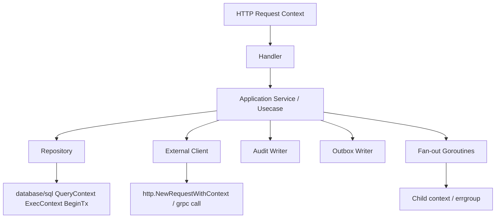
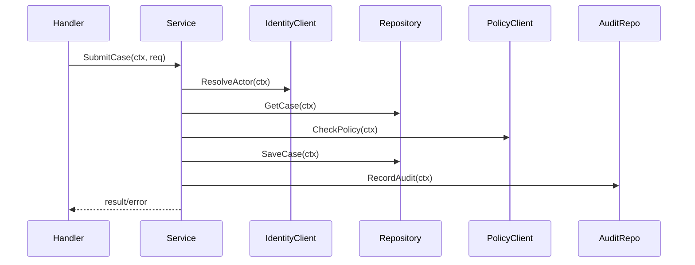
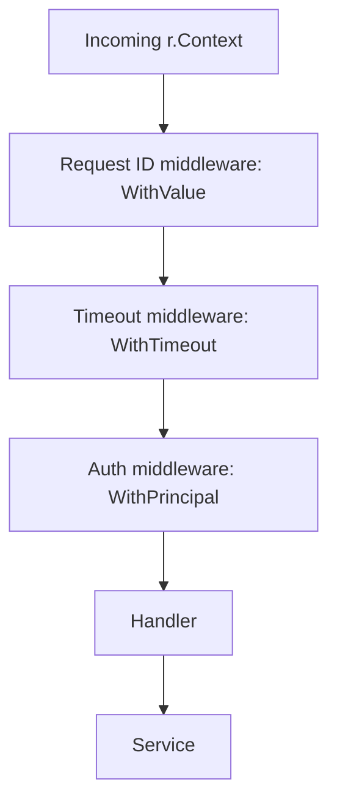
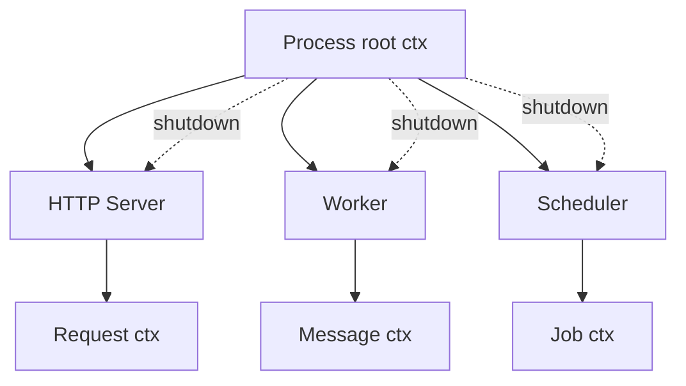
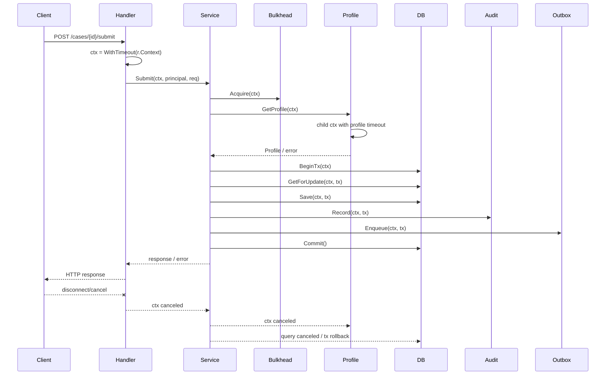
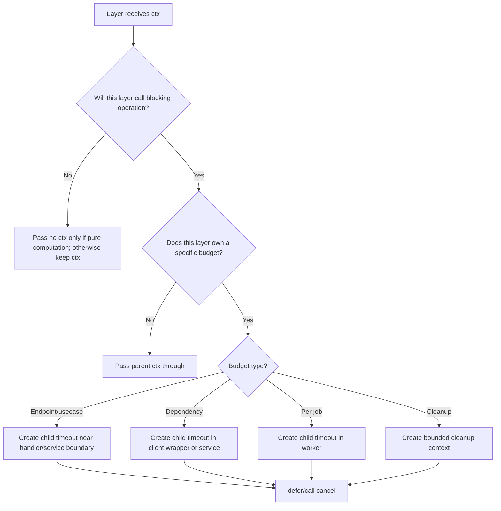
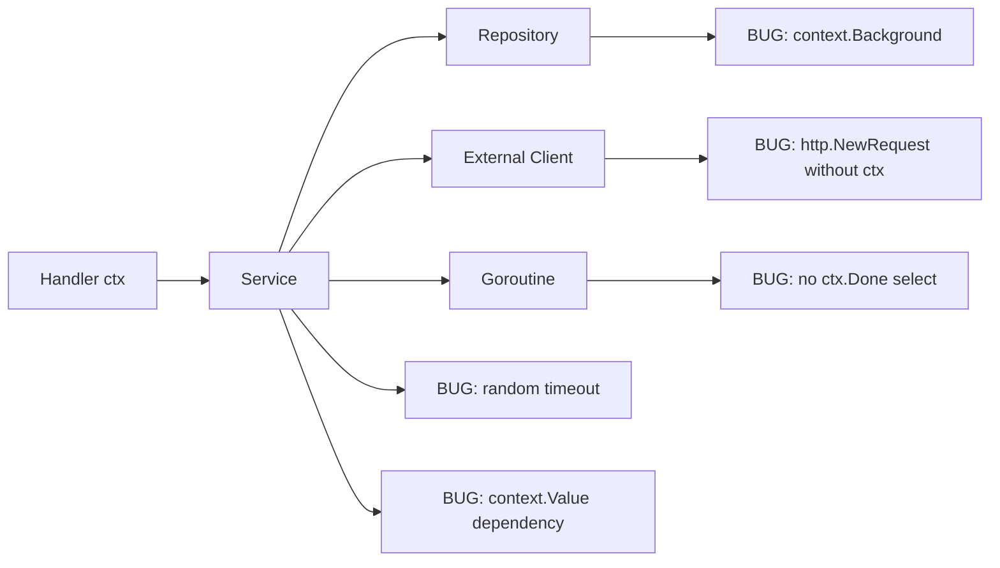

# learn-go-reliability-error-handling-part-012.md

# Context Propagation Across Layers: Handler → Service → Repository → External Client

> Seri: `learn-go-reliability-error-handling`  
> Part: `012`  
> Target: Go 1.26.x  
> Level: Advanced / internal engineering handbook  
> Fokus: menerapkan `context.Context` secara konsisten lintas layer aplikasi Go production.

---

## 0. Posisi Materi Ini Dalam Seri

Pada `part-011`, kita membahas fundamental `context`:

- cancellation
- deadline
- timeout
- cause
- `WithCancel`
- `WithTimeout`
- `WithDeadline`
- `WithCancelCause`
- `WithoutCancel`
- `AfterFunc`
- context value
- goroutine cancellation
- cleanup context

Bagian ini menjawab pertanyaan berikutnya:

> Bagaimana context harus mengalir dari HTTP handler sampai repository, external client, worker, audit writer, outbox, dan goroutine fan-out tanpa berubah menjadi spaghetti lifecycle?

Topik ini penting karena banyak service Go tampak menerima `ctx context.Context`, tetapi propagation-nya salah:

- handler membuat timeout sembarangan
- service membuat `context.Background()`
- repository tidak memakai `QueryContext`
- external client tidak memakai `NewRequestWithContext`
- goroutine tidak listen ke `ctx.Done()`
- retry loop tidur walau request sudah canceled
- cleanup memakai request context yang sudah canceled
- context value dipakai sebagai dependency injection container
- timeout dibuat ulang di setiap layer tanpa budget model

Hasilnya: cancellation tidak bekerja, shutdown lambat, DB query tetap berjalan, goroutine leak, dependency call menggantung, dan incident sulit dijelaskan.

---

## 1. Core Thesis

Context propagation yang benar bukan berarti “semua function punya parameter `ctx`”.

Context propagation yang benar berarti:

1. **Root lifecycle jelas**.
2. **Context diteruskan ke semua operation yang bisa block/wait/cancel**.
3. **Layer bawah tidak membuat root context baru**.
4. **Layer yang membuat child timeout punya alasan budget yang jelas**.
5. **Cancellation error tetap dipreservasi**.
6. **Context tidak dipakai untuk menyembunyikan dependency atau business option**.
7. **Boundary tinggi memutuskan response/log/metric berdasarkan error + context cause**.
8. **Goroutine, retry, queue, dan cleanup punya cancellation path**.

Context adalah _lifecycle propagation contract_, bukan sekadar parameter.

---

## 2. Layer Model

Kita akan gunakan arsitektur umum:

```text
HTTP handler
  → application service / usecase
    → domain model
    → repository
      → database/sql
    → external client
      → net/http / grpc
    → audit writer
    → outbox/event publisher
    → background worker / goroutine fan-out
```

Context propagation tidak sama untuk semua layer.



---

## 3. Golden Rules

### 3.1 Context Is First Parameter

Good:

```go
func (s *Service) SubmitCase(ctx context.Context, req SubmitCaseRequest) (SubmitCaseResponse, error)
```

Bad:

```go
func (s *Service) SubmitCase(req SubmitCaseRequest, ctx context.Context) error
```

### 3.2 Never Pass Nil Context

Bad:

```go
repo.GetCase(nil, id)
```

Use:

```go
repo.GetCase(context.TODO(), id)
```

Only if you truly do not know the correct context yet.

### 3.3 Do Not Store Context in Long-lived Struct

Bad:

```go
type Service struct {
    ctx context.Context
    db  *sql.DB
}
```

Good:

```go
type Service struct {
    db *sql.DB
}

func (s *Service) Do(ctx context.Context) error {
    return s.repo.Do(ctx)
}
```

### 3.4 Do Not Create `Background()` in Deep Layer

Bad:

```go
func (r *Repo) Save(case Case) error {
    ctx := context.Background()
    _, err := r.db.ExecContext(ctx, query, ...)
    return err
}
```

Good:

```go
func (r *Repo) Save(ctx context.Context, c Case) error {
    _, err := r.db.ExecContext(ctx, query, ...)
    return err
}
```

### 3.5 Every Blocking Boundary Must Accept Context

Accept context for:

- DB calls
- HTTP/gRPC calls
- broker operations
- lock/lease acquisition
- rate limiter wait
- queue submit
- worker run loop
- retry loops
- long CPU work
- streaming
- file/network I/O if cancellation path exists
- shutdown/close operations that may block

Pure domain functions usually do not need context.

---

## 4. Propagation Responsibility by Layer

| Layer | Should accept ctx? | Should create child ctx? | Should decide API response? | Should log? |
|---|---:|---:|---:|---:|
| HTTP handler | yes | often yes, request budget | yes | yes, boundary |
| Application service/usecase | yes | sometimes, operation/dependency budget | no transport response | maybe domain/audit events, not noisy logs |
| Domain entity/value object | usually no | no | no | no |
| Repository | yes | rarely | no | usually no |
| External client wrapper | yes | yes, per-dependency budget | no transport response to caller, but maps dependency response | no or debug only |
| Worker | yes | yes, per-job budget | ack/nack policy | boundary log |
| Scheduler | yes | yes, per-run budget | no | boundary log |
| Cleanup/Close | yes if blocking | yes, bounded cleanup ctx | no | yes if failure matters |

---

## 5. Handler Layer

HTTP handler is usually the first application-owned boundary.

Responsibilities:

- derive from `r.Context()`
- parse request
- validate transport-level input
- optionally create request-level timeout
- call service with ctx
- map error to HTTP response
- log once at boundary
- emit metrics
- do not perform business logic directly
- do not create random deep dependency timeouts

### 5.1 Minimal Handler

```go
func (h *CaseHandler) SubmitCase(w http.ResponseWriter, r *http.Request) {
    ctx := r.Context()

    var req SubmitCaseRequest
    if err := json.NewDecoder(r.Body).Decode(&req); err != nil {
        h.writeError(ctx, w, fmt.Errorf("decode submit case request: %w", err))
        return
    }

    resp, err := h.service.SubmitCase(ctx, req)
    if err != nil {
        h.writeError(ctx, w, err)
        return
    }

    writeJSON(w, http.StatusOK, resp)
}
```

### 5.2 Handler With Request Timeout

```go
func (h *CaseHandler) SubmitCase(w http.ResponseWriter, r *http.Request) {
    ctx, cancel := context.WithTimeout(r.Context(), h.cfg.SubmitTimeout)
    defer cancel()

    var req SubmitCaseRequest
    if err := decodeJSON(w, r, &req); err != nil {
        h.writeError(ctx, w, err)
        return
    }

    resp, err := h.service.SubmitCase(ctx, req)
    if err != nil {
        h.writeError(ctx, w, err)
        return
    }

    writeJSON(w, http.StatusOK, resp)
}
```

### 5.3 Handler Should Not Use `context.Background()` for Service Call

Bad:

```go
resp, err := h.service.SubmitCase(context.Background(), req)
```

Consequence:

- client disconnect ignored
- request timeout ignored
- trace/request metadata lost
- shutdown does not stop work
- DB/external calls may continue after HTTP request is gone

### 5.4 Request Body Cleanup

```go
r.Body = http.MaxBytesReader(w, r.Body, 1<<20)
defer r.Body.Close()
```

Use this especially when body size matters and early return is possible.

---

## 6. Handler Error Mapping With Context

At handler boundary, context affects response classification.

```go
func (h *CaseHandler) writeError(ctx context.Context, w http.ResponseWriter, err error) {
    switch {
    case errors.Is(err, context.Canceled):
        h.logger.InfoContext(ctx, "request canceled", "error", err)
        return

    case errors.Is(err, context.DeadlineExceeded):
        h.logger.WarnContext(ctx, "request timed out", "error", err)
        writeProblem(w, http.StatusGatewayTimeout, "REQUEST_TIMEOUT", "request timed out")

    case errors.Is(err, ErrValidation):
        writeProblem(w, http.StatusBadRequest, "VALIDATION_FAILED", "invalid request")

    default:
        h.logger.ErrorContext(ctx, "request failed", "error", err)
        writeProblem(w, http.StatusInternalServerError, "INTERNAL_ERROR", "internal server error")
    }
}
```

Caution:

- If client already disconnected, writing response may fail.
- Do not expose raw internal error string.
- Use error code contract.
- Log at boundary once.
- Use context cause if you have specific causes.

---

## 7. Service / Usecase Layer

Application service is where orchestration happens.

Responsibilities:

- accept context from handler/worker
- perform usecase orchestration
- call repository/external clients with same or child context
- create operation/dependency-specific child timeouts when justified
- enforce transaction boundary
- preserve domain error
- preserve context cancellation
- avoid transport-specific response logic
- avoid hidden `Background()`

Example:

```go
func (s *CaseService) SubmitCase(ctx context.Context, req SubmitCaseRequest) (SubmitCaseResponse, error) {
    if err := req.Validate(); err != nil {
        return SubmitCaseResponse{}, fmt.Errorf("validate submit case request: %w", err)
    }

    if err := requireBudget(ctx, s.cfg.MinSubmitBudget); err != nil {
        return SubmitCaseResponse{}, fmt.Errorf("submit case budget check: %w", err)
    }

    actor, err := s.identity.ResolveActor(ctx, req.ActorID)
    if err != nil {
        return SubmitCaseResponse{}, fmt.Errorf("resolve actor: %w", err)
    }

    result, err := s.withSubmitTransaction(ctx, actor, req)
    if err != nil {
        return SubmitCaseResponse{}, err
    }

    return SubmitCaseResponse{CaseID: result.CaseID}, nil
}
```

### 7.1 Service Should Not Always Create a New Timeout

Bad:

```go
func (s *Service) Do(ctx context.Context) error {
    ctx, cancel := context.WithTimeout(context.Background(), 10*time.Second)
    defer cancel()

    return s.repo.Do(ctx)
}
```

This discards parent.

Less bad but still often wrong:

```go
func (s *Service) Do(ctx context.Context) error {
    ctx, cancel := context.WithTimeout(ctx, 10*time.Second)
    defer cancel()

    return s.repo.Do(ctx)
}
```

This is okay only if `10s` is a deliberate usecase budget. If handler already set 2s, child will still expire at parent 2s. But if no handler timeout exists, service imposes 10s.

The question is: **who owns the operation SLO?**

For a public API, request budget often belongs near handler/router config. For dependency-specific budgets, client wrapper may own them.

---

## 8. Domain Layer

Pure domain logic usually should not accept context.

Good:

```go
func (c *Case) Submit(actor Actor, now time.Time) error {
    if c.Status != StatusDraft {
        return NewDomainError(CodeInvalidTransition, "case is not draft")
    }
    if !actor.CanSubmit(c) {
        return NewDomainError(CodeForbiddenAction, "actor cannot submit case")
    }

    c.Status = StatusSubmitted
    c.SubmittedAt = now
    return nil
}
```

No context because:

- no blocking operation
- no I/O
- no cancellation point
- deterministic
- easier to test

Bad:

```go
func (c *Case) Submit(ctx context.Context) error {
    actor := ctx.Value("actor").(Actor)
    ...
}
```

This hides business dependency and weakens testability.

### 8.1 Domain Service Exception

A domain service that calls external policy/repository is no longer pure. It can accept context.

```go
func (p *PolicyService) CanSubmit(ctx context.Context, actorID ActorID, caseID CaseID) error
```

But be clear: this is application/domain service with I/O, not entity method.

---

## 9. Repository Layer

Repository must accept context and pass it to `database/sql`.

```go
func (r *CaseRepository) GetByID(ctx context.Context, id CaseID) (Case, error) {
    row := r.db.QueryRowContext(ctx, `
        select id, status, version
        from cases
        where id = ?
    `, id)

    var c Case
    if err := row.Scan(&c.ID, &c.Status, &c.Version); err != nil {
        if errors.Is(err, sql.ErrNoRows) {
            return Case{}, ErrCaseNotFound
        }
        return Case{}, fmt.Errorf("scan case by id: %w", err)
    }

    return c, nil
}
```

### 9.1 Repository Should Not Invent Business Timeout

Bad:

```go
func (r *Repo) GetByID(ctx context.Context, id string) (Case, error) {
    ctx, cancel := context.WithTimeout(ctx, 100*time.Millisecond)
    defer cancel()
    ...
}
```

Why questionable?

- repository does not know full usecase budget
- same query may be used in different workflows
- timeout hidden from caller
- difficult to tune per endpoint
- test flakiness

Better options:

1. Parent service/client passes context with deadline.
2. Repository has documented query timeout config if it owns DB SLA.
3. Use database driver/server-side statement timeout at connection/session/query level.
4. Have explicit method variants for latency-sensitive operations.

### 9.2 Repository Can Check Context After Driver Error

Some drivers return context errors directly; some wrap; some return driver-specific errors.

Pattern:

```go
if err := row.Scan(&c.ID); err != nil {
    if ctxErr := ctx.Err(); ctxErr != nil {
        return Case{}, fmt.Errorf("get case canceled: %w", context.Cause(ctx))
    }
    if errors.Is(err, sql.ErrNoRows) {
        return Case{}, ErrCaseNotFound
    }
    return Case{}, fmt.Errorf("scan case: %w", err)
}
```

Caution:

- Do not override precise DB error blindly.
- If `ctx.Err()` is non-nil, cancellation likely explains the failure.
- For debugging, consider joining:

```go
if ctxErr := ctx.Err(); ctxErr != nil {
    return Case{}, errors.Join(
        fmt.Errorf("scan case: %w", err),
        fmt.Errorf("context done: %w", context.Cause(ctx)),
    )
}
```

Use based on your error classifier.

---

## 10. Transaction Boundary

Application service usually owns transaction boundary, not repository.

Good:

```go
func (s *CaseService) withSubmitTransaction(ctx context.Context, actor Actor, req SubmitCaseRequest) (_ SubmitResult, err error) {
    tx, err := s.db.BeginTx(ctx, nil)
    if err != nil {
        return SubmitResult{}, fmt.Errorf("begin submit transaction: %w", err)
    }

    committed := false
    defer func() {
        if committed {
            return
        }
        if rbErr := tx.Rollback(); rbErr != nil {
            err = errors.Join(err, fmt.Errorf("rollback submit transaction: %w", rbErr))
        }
    }()

    c, err := s.repo.GetForUpdate(ctx, tx, req.CaseID)
    if err != nil {
        return SubmitResult{}, fmt.Errorf("get case for update: %w", err)
    }

    if err := c.Submit(actor, s.clock.Now()); err != nil {
        return SubmitResult{}, err
    }

    if err := s.repo.Save(ctx, tx, c); err != nil {
        return SubmitResult{}, fmt.Errorf("save case: %w", err)
    }

    if err := s.audit.Record(ctx, tx, AuditEventFrom(c)); err != nil {
        return SubmitResult{}, fmt.Errorf("record audit: %w", err)
    }

    if err := tx.Commit(); err != nil {
        if cause := context.Cause(ctx); cause != nil && ctx.Err() != nil {
            return SubmitResult{}, fmt.Errorf("commit submit transaction after context done: %w", cause)
        }
        return SubmitResult{}, fmt.Errorf("commit submit transaction: %w", err)
    }
    committed = true

    return SubmitResult{CaseID: c.ID}, nil
}
```

### 10.1 Should Repository Start Transactions?

Usually no, unless repository method represents an atomic persistence operation and transaction is implementation detail.

Better for complex usecase:

```go
repo.GetForUpdate(ctx, tx, id)
repo.Save(ctx, tx, c)
```

or define abstraction:

```go
type DBTX interface {
    ExecContext(context.Context, string, ...any) (sql.Result, error)
    QueryContext(context.Context, string, ...any) (*sql.Rows, error)
    QueryRowContext(context.Context, string, ...any) *sql.Row
}
```

Then methods accept `DBTX`.

---

## 11. External Client Layer

External client wrapper should accept context and use it in request.

```go
func (c *ProfileClient) GetProfile(ctx context.Context, userID string) (Profile, error) {
    req, err := http.NewRequestWithContext(ctx, http.MethodGet, c.baseURL+"/profiles/"+url.PathEscape(userID), nil)
    if err != nil {
        return Profile{}, fmt.Errorf("build get profile request: %w", err)
    }

    resp, err := c.http.Do(req)
    if err != nil {
        return Profile{}, fmt.Errorf("do get profile request: %w", err)
    }
    defer resp.Body.Close()

    // decode...
}
```

Official `net/http` docs state that for outgoing client requests, the request context controls the entire lifetime of a request and its response: obtaining a connection, sending the request, and reading response headers/body.

### 11.1 Client May Own Per-Dependency Timeout

Unlike repository, an external client wrapper often knows dependency-specific budget.

```go
func (c *ProfileClient) GetProfile(ctx context.Context, userID string) (Profile, error) {
    ctx, cancel := context.WithTimeoutCause(ctx, c.timeout, ErrProfileClientTimeout)
    defer cancel()

    req, err := http.NewRequestWithContext(ctx, http.MethodGet, c.url(userID), nil)
    if err != nil {
        return Profile{}, fmt.Errorf("build get profile request: %w", err)
    }

    resp, err := c.http.Do(req)
    if err != nil {
        if ctx.Err() != nil {
            return Profile{}, fmt.Errorf("get profile context done: %w", context.Cause(ctx))
        }
        return Profile{}, fmt.Errorf("do get profile request: %w", err)
    }
    defer resp.Body.Close()

    return c.decodeProfile(resp)
}
```

### 11.2 Avoid Creating New HTTP Client Per Request

Bad:

```go
client := &http.Client{Timeout: time.Second}
resp, err := client.Do(req)
```

Create client once and reuse.

```go
type ProfileClient struct {
    http *http.Client
}
```

Context gives per-request cancellation; transport/client config gives connection behavior.

---

## 12. External Client Response Mapping

Client wrapper should translate dependency response into stable internal errors.

```go
func (c *ProfileClient) decodeProfile(resp *http.Response) (Profile, error) {
    switch resp.StatusCode {
    case http.StatusOK:
        var p Profile
        if err := json.NewDecoder(resp.Body).Decode(&p); err != nil {
            return Profile{}, fmt.Errorf("decode profile response: %w", err)
        }
        return p, nil

    case http.StatusNotFound:
        return Profile{}, ErrProfileNotFound

    case http.StatusTooManyRequests:
        return Profile{}, NewDependencyError("profile", "rate_limited", true)

    case http.StatusServiceUnavailable, http.StatusGatewayTimeout:
        return Profile{}, NewDependencyError("profile", "unavailable", true)

    default:
        body, _ := io.ReadAll(io.LimitReader(resp.Body, 4<<10))
        return Profile{}, fmt.Errorf("profile service unexpected status %d: %s", resp.StatusCode, body)
    }
}
```

Context propagation alone is not enough; dependency error must be classified.

---

## 13. Service Calling Multiple Dependencies

Example: submit case needs identity, case repo, policy, audit.



Design options:

1. Same context for all calls.
2. Child timeout per dependency.
3. Total operation context + per dependency sub-budget.
4. Fan-out with child context and cancellation on first failure.

For sequential dependencies, same parent with per-dependency timeout is common.

```go
actor, err := s.identity.ResolveActor(ctx, req.ActorID)
if err != nil {
    return zero, fmt.Errorf("resolve actor: %w", err)
}

policyCtx, cancel := context.WithTimeout(ctx, s.cfg.PolicyTimeout)
decision, err := s.policy.Check(policyCtx, actor, req.CaseID)
cancel()
if err != nil {
    return zero, fmt.Errorf("check policy: %w", err)
}
```

Avoid `defer cancel()` repeatedly in long sequential functions if many child contexts; explicit `cancel()` after call makes resource release immediate.

---

## 14. Fan-out Propagation

For parallel calls, create group context.

Conceptual pattern:

```go
g, ctx := errgroup.WithContext(ctx)

var actor Actor
g.Go(func() error {
    a, err := s.identity.ResolveActor(ctx, req.ActorID)
    if err != nil {
        return fmt.Errorf("resolve actor: %w", err)
    }
    actor = a
    return nil
})

var c Case
g.Go(func() error {
    got, err := s.repo.GetCase(ctx, req.CaseID)
    if err != nil {
        return fmt.Errorf("get case: %w", err)
    }
    c = got
    return nil
})

if err := g.Wait(); err != nil {
    return zero, err
}
```

But beware shared variable races. The above is safe only because each variable is written by one goroutine and read after `Wait`, but use caution. Race detector helps.

### 14.1 Fan-out Cancellation

If one goroutine fails, group context cancels siblings. Siblings must observe context.

```go
func (c *Client) Call(ctx context.Context) error {
    req, _ := http.NewRequestWithContext(ctx, http.MethodGet, c.url, nil)
    ...
}
```

### 14.2 When Not to Cancel on First Error

Some operations need all results or aggregated errors:

- validation across many records
- batch import
- best-effort enrichment
- fan-out where partial success acceptable
- cleanup of multiple resources

In such cases, use custom multi-error collection, not first-error cancellation.

---

## 15. Worker Entry Boundary

Worker is another top-level boundary like HTTP handler.

```go
func (w *Worker) Run(ctx context.Context) error {
    for {
        msg, err := w.consumer.Receive(ctx)
        if err != nil {
            return fmt.Errorf("receive message: %w", err)
        }

        if err := w.handleMessage(ctx, msg); err != nil {
            w.logger.ErrorContext(ctx, "handle message failed", "error", err)
        }
    }
}
```

But per-message context should often be separate:

```go
func (w *Worker) handleMessage(parent context.Context, msg Message) error {
    ctx, cancel := context.WithTimeout(parent, w.cfg.MessageTimeout)
    defer cancel()

    err := w.service.ProcessMessage(ctx, msg.Payload)

    return w.applyAckPolicy(parent, msg, err)
}
```

Notice ack policy may use parent or cleanup context, not necessarily canceled per-message ctx.

### 15.1 Shutdown Semantics

If parent ctx canceled due to shutdown:

- stop receiving new messages
- finish current message if policy allows
- or cancel current message and requeue
- ack/nack with bounded cleanup context
- exit Run

This is part 020 deeper.

---

## 16. Scheduler Boundary

Scheduler jobs need context too.

```go
func (s *Scheduler) Run(ctx context.Context) error {
    ticker := time.NewTicker(s.interval)
    defer ticker.Stop()

    for {
        select {
        case <-ctx.Done():
            return context.Cause(ctx)

        case <-ticker.C:
            jobCtx, cancel := context.WithTimeout(ctx, s.jobTimeout)
            err := s.runOnce(jobCtx)
            cancel()

            if err != nil {
                s.logger.WarnContext(ctx, "scheduled job failed", "error", err)
            }
        }
    }
}
```

Questions:

- can runs overlap?
- what if previous run still active?
- should missed tick be skipped?
- should shutdown cancel current run?
- should job timeout differ from scheduler lifecycle?

---

## 17. Queue Submit Boundary

If service submits to internal bounded queue:

```go
func (q *Queue) Submit(ctx context.Context, job Job) error {
    select {
    case q.jobs <- job:
        return nil
    case <-ctx.Done():
        return fmt.Errorf("submit job: %w", context.Cause(ctx))
    }
}
```

Do not do:

```go
q.jobs <- job
return nil
```

If queue is full, request can hang until timeout not observed.

### 17.1 Full Queue Classification

If queue full until context deadline, error appears as deadline exceeded. But root cause is overload/backpressure.

At boundary:

```go
if errors.Is(err, context.DeadlineExceeded) && q.IsSaturated() {
    return ErrOverloaded
}
```

Better: queue submit can own explicit overload error if non-blocking or bounded wait.

```go
func (q *Queue) TrySubmit(job Job) error {
    select {
    case q.jobs <- job:
        return nil
    default:
        return ErrQueueFull
    }
}
```

---

## 18. Context and Logging Across Layers

Do not log the same error at every layer.

Bad:

```go
func repo(ctx context.Context) error {
    err := query(ctx)
    if err != nil {
        logger.Error("query failed", "error", err)
        return err
    }
    return nil
}

func service(ctx context.Context) error {
    err := repo(ctx)
    if err != nil {
        logger.Error("repo failed", "error", err)
        return err
    }
    return nil
}

func handler(...) {
    err := service(ctx)
    if err != nil {
        logger.Error("request failed", "error", err)
    }
}
```

Good:

- low layer wraps
- high boundary logs once
- context carries trace/request metadata

```go
func repo(ctx context.Context) error {
    if err := query(ctx); err != nil {
        return fmt.Errorf("query case: %w", err)
    }
    return nil
}

func service(ctx context.Context) error {
    if err := repo(ctx); err != nil {
        return fmt.Errorf("load case for submission: %w", err)
    }
    return nil
}

func handler(...) {
    if err := service(ctx); err != nil {
        logger.ErrorContext(ctx, "submit case failed", "error", err)
    }
}
```

---

## 19. Context Values Across Layers

Context values should be stable and request-scoped.

Example typed helpers:

```go
type requestIDKey struct{}

func WithRequestID(ctx context.Context, id string) context.Context {
    return context.WithValue(ctx, requestIDKey{}, id)
}

func RequestID(ctx context.Context) (string, bool) {
    v, ok := ctx.Value(requestIDKey{}).(string)
    return v, ok
}
```

Handler/middleware can add:

```go
ctx := WithRequestID(r.Context(), requestID)
r = r.WithContext(ctx)
next.ServeHTTP(w, r)
```

Service/repo can log with context, but should not require hidden values for correctness.

Bad:

```go
func (s *Service) SubmitCase(ctx context.Context, req SubmitRequest) error {
    actor := ctx.Value(actorKey{}).(Actor) // hidden required input
    return s.domain.Submit(actor, req)
}
```

Better:

```go
func (s *Service) SubmitCase(ctx context.Context, actor Actor, req SubmitRequest) error
```

or resolve explicitly:

```go
actor, err := s.identity.ActorFromRequest(ctx)
```

Be deliberate.

---

## 20. Auth Principal Propagation

There are two approaches:

### 20.1 Principal in Context

Middleware authenticates and stores lightweight principal reference.

```go
ctx = auth.WithPrincipal(r.Context(), principal)
```

Service:

```go
principal, ok := auth.PrincipalFromContext(ctx)
if !ok {
    return ErrUnauthenticated
}
```

Pros:

- common in HTTP apps
- avoids passing actor through many handler signatures
- request-scoped

Cons:

- hidden dependency
- harder unit tests if overused
- can become context abuse

### 20.2 Principal as Explicit Argument

```go
func (s *Service) SubmitCase(ctx context.Context, principal Principal, req SubmitRequest) error
```

Pros:

- explicit
- testable
- domain-friendly

Cons:

- more plumbing

For high-assurance regulatory systems, explicit principal at usecase boundary is often cleaner:

```go
principal := auth.MustPrincipal(r.Context())
resp, err := h.service.SubmitCase(ctx, principal, req)
```

Inside service, pass actor explicitly to domain.

---

## 21. Tenant/Correlation Propagation

Tenant/correlation often fits context, but must be controlled.

Tenant ID affects data access. If tenant is hidden in context, repository might silently filter by tenant.

Option A:

```go
func (r *Repo) ListCases(ctx context.Context, tenantID TenantID, filter Filter) ([]Case, error)
```

Option B:

```go
tenantID, ok := tenancy.FromContext(ctx)
```

For high-safety systems, prefer explicit tenant ID at repository/usecase boundary unless platform convention strongly enforces tenancy middleware and tests.

Context is fine for telemetry correlation; be careful for authorization/data partitioning correctness.

---

## 22. Context and API Boundary Adapters

A clean pattern:

```go
type HandlerFunc func(context.Context, http.ResponseWriter, *http.Request) error

func (h HandlerFunc) ServeHTTP(w http.ResponseWriter, r *http.Request) {
    ctx := r.Context()

    if err := h(ctx, w, r); err != nil {
        writeBoundaryError(ctx, w, err)
    }
}
```

Example:

```go
func (h *CaseHandler) submit(ctx context.Context, w http.ResponseWriter, r *http.Request) error {
    req, err := decodeSubmitRequest(w, r)
    if err != nil {
        return err
    }

    principal, err := auth.PrincipalFromContext(ctx)
    if err != nil {
        return err
    }

    resp, err := h.service.SubmitCase(ctx, principal, req)
    if err != nil {
        return err
    }

    return writeJSON(w, http.StatusOK, resp)
}
```

This centralizes:

- panic recovery
- request timeout
- logging
- metrics
- error response
- context decoration

---

## 23. Middleware Context Flow

Typical middleware stack:

```text
request
  → recover middleware
  → request id middleware
  → timeout middleware
  → auth middleware
  → logging middleware
  → handler
```

Context modifications:



Important ordering:

- request id before logging
- timeout before expensive auth if auth should be bounded
- auth before handler
- recover outside all
- metrics around full chain

### 23.1 Timeout Middleware Caution

If using `http.TimeoutHandler`, understand response behavior and limitations. A custom timeout middleware using context may not stop handler unless handler observes context.

Context timeout is cooperative.

---

## 24. Context Propagation in gRPC

For gRPC server methods:

```go
func (s *Server) SubmitCase(ctx context.Context, req *pb.SubmitCaseRequest) (*pb.SubmitCaseResponse, error) {
    principal, err := s.auth.FromContext(ctx)
    if err != nil {
        return nil, status.Error(codes.Unauthenticated, "unauthenticated")
    }

    resp, err := s.service.SubmitCase(ctx, principal, mapReq(req))
    if err != nil {
        return nil, mapError(err)
    }

    return mapResp(resp), nil
}
```

gRPC context carries:

- deadline
- cancellation
- metadata
- auth info depending interceptors

For outgoing gRPC clients, pass ctx:

```go
resp, err := c.client.GetProfile(ctx, req)
```

Do not create `Background()`.

---

## 25. Context and Outbox Pattern

Outbox write inside transaction uses request context:

```go
if err := s.outbox.Enqueue(ctx, tx, event); err != nil {
    return fmt.Errorf("enqueue outbox: %w", err)
}
```

Outbox dispatcher uses service lifecycle context:

```go
func (d *Dispatcher) Run(ctx context.Context) error {
    for {
        batch, err := d.repo.FetchPending(ctx, d.batchSize)
        if err != nil {
            return fmt.Errorf("fetch pending outbox: %w", err)
        }

        for _, event := range batch {
            publishCtx, cancel := context.WithTimeout(ctx, d.publishTimeout)
            err := d.publisher.Publish(publishCtx, event)
            cancel()

            if err != nil {
                d.repo.MarkFailed(ctx, event.ID, err)
                continue
            }

            d.repo.MarkPublished(ctx, event.ID)
        }
    }
}
```

Important distinction:

- request context controls writing the outbox record
- service lifecycle context controls later delivery
- do not publish external event directly after request context canceled unless explicitly designed
- outbox makes cancellation/retry safer

---

## 26. Context and Audit

Audit inside transaction:

```go
if err := s.audit.Record(ctx, tx, event); err != nil {
    return fmt.Errorf("record audit: %w", err)
}
```

Audit after cancellation may need special policy.

Example: security denial audit should maybe happen even if client disconnects.

```go
auditCtx, cancel := context.WithTimeout(context.WithoutCancel(ctx), 500*time.Millisecond)
defer cancel()

if err := s.audit.RecordSecurityEvent(auditCtx, event); err != nil {
    s.logger.WarnContext(ctx, "security audit failed", "error", err)
}
```

This is acceptable only if:

- bounded
- idempotent
- safe
- policy-approved
- observable

For regulatory defensibility, audit operation context should be explicit and reviewed.

---

## 27. Context and Cleanup Boundary

Cleanup may need context different from operation context.

Example service method:

```go
lease, err := s.locker.Acquire(ctx, key)
if err != nil {
    return err
}

defer func() {
    cleanupCtx, cancel := context.WithTimeout(context.Background(), s.cfg.CleanupTimeout)
    defer cancel()

    if err := lease.Release(cleanupCtx); err != nil {
        s.logger.WarnContext(ctx, "release lease failed", "error", err)
    }
}()
```

Why not `ctx`?

Because if request times out, release should still be attempted.

Why not unbounded background?

Because cleanup must not hang forever.

---

## 28. Context Propagation and Retry

A retry helper should accept parent context and never create root context.

```go
func Retry(ctx context.Context, policy RetryPolicy, fn func(context.Context) error) error {
    var last error

    for attempt := 0; attempt < policy.MaxAttempts; attempt++ {
        attemptCtx, cancel := context.WithTimeout(ctx, policy.PerAttemptTimeout)
        err := fn(attemptCtx)
        cancel()

        if err == nil {
            return nil
        }

        last = err

        if !policy.IsRetryable(err) {
            return err
        }

        if ctx.Err() != nil {
            return errors.Join(last, context.Cause(ctx))
        }

        delay := policy.Delay(attempt)

        timer := time.NewTimer(delay)
        select {
        case <-timer.C:
        case <-ctx.Done():
            timer.Stop()
            return errors.Join(last, context.Cause(ctx))
        }
    }

    return last
}
```

Key points:

- total ctx bounds all attempts
- per-attempt ctx bounds each try
- retry sleep observes ctx
- context cause preserved
- retry classifier decides based on error taxonomy

---

## 29. Context Propagation and Rate Limiting

Rate limiter wait must use caller context.

```go
func (s *Service) SubmitCase(ctx context.Context, req SubmitRequest) error {
    if err := s.limiter.Wait(ctx); err != nil {
        return fmt.Errorf("wait submit rate limit: %w", err)
    }

    return s.submit(ctx, req)
}
```

If limiter wait returns due to context deadline, classify as overload/admission timeout if limiter is saturated.

Do not create background context for limiter:

```go
s.limiter.Wait(context.Background()) // bad
```

That lets a canceled request still wait for quota.

---

## 30. Context Propagation and Bulkhead/Semaphore

```go
func (b *Bulkhead) Acquire(ctx context.Context) (func(), error) {
    select {
    case b.ch <- struct{}{}:
        return func() { <-b.ch }, nil
    case <-ctx.Done():
        return nil, fmt.Errorf("acquire bulkhead: %w", context.Cause(ctx))
    }
}
```

Usage:

```go
release, err := s.bulkhead.Acquire(ctx)
if err != nil {
    return err
}
defer release()
```

This ensures:

- if capacity unavailable until timeout, request stops
- permit released on all paths
- no goroutine blocked forever

---

## 31. Context Propagation and CPU-bound Work

Service may call CPU-heavy domain computation:

```go
result, err := s.engine.Evaluate(ctx, input)
```

Engine should periodically check context:

```go
func (e *Engine) Evaluate(ctx context.Context, input Input) (Result, error) {
    for i := range input.Items {
        if i%1024 == 0 {
            select {
            case <-ctx.Done():
                return Result{}, fmt.Errorf("evaluate policy: %w", context.Cause(ctx))
            default:
            }
        }

        // compute...
    }

    return result, nil
}
```

Pure small domain method should not accept context. Long CPU operation should.

---

## 32. Context Propagation and Streaming

Handler:

```go
func (h *Handler) StreamCases(w http.ResponseWriter, r *http.Request) {
    ctx := r.Context()

    stream, err := h.service.StreamCases(ctx, filter)
    if err != nil {
        h.writeError(ctx, w, err)
        return
    }

    for {
        select {
        case <-ctx.Done():
            return

        case item, ok := <-stream:
            if !ok {
                return
            }

            if err := writeSSE(w, item); err != nil {
                h.logger.InfoContext(ctx, "stream write failed", "error", err)
                return
            }
        }
    }
}
```

Service stream:

```go
func (s *Service) StreamCases(ctx context.Context, filter Filter) (<-chan CaseEvent, error) {
    out := make(chan CaseEvent)

    go func() {
        defer close(out)

        events := s.repo.WatchCases(ctx, filter)

        for {
            select {
            case <-ctx.Done():
                return

            case ev, ok := <-events:
                if !ok {
                    return
                }

                select {
                case out <- ev:
                case <-ctx.Done():
                    return
                }
            }
        }
    }()

    return out, nil
}
```

Both receive and send must be cancellable.

---

## 33. Context Propagation and File Processing

File processing may not always support context at OS read level, but pipeline should.

```go
func ProcessUpload(ctx context.Context, r io.Reader) error {
    scanner := bufio.NewScanner(r)

    for scanner.Scan() {
        select {
        case <-ctx.Done():
            return fmt.Errorf("process upload canceled: %w", context.Cause(ctx))
        default:
        }

        if err := processLine(scanner.Text()); err != nil {
            return err
        }
    }

    if err := scanner.Err(); err != nil {
        return fmt.Errorf("scan upload: %w", err)
    }

    return nil
}
```

For huge processing:

- check context per chunk
- avoid reading all into memory
- cleanup temp files with bounded cleanup context
- partial results need transaction/checkpoint semantics

---

## 34. Context Propagation and Platform Shutdown

Root context in `main`:

```go
root, stop := signal.NotifyContext(context.Background(), os.Interrupt, syscall.SIGTERM)
defer stop()

app, err := NewApp(root, cfg)
if err != nil {
    return fmt.Errorf("initialize app: %w", err)
}

if err := app.Run(root); err != nil {
    return fmt.Errorf("run app: %w", err)
}
```

But if using cause:

```go
root, cancel := context.WithCancelCause(context.Background())
defer cancel(nil)

go func() {
    <-sigCh
    cancel(ErrShutdown)
}()
```

Propagation:



Shutdown flow will be covered deeply in part 019/020.

---

## 35. Context and Readiness

During shutdown, context root may be canceled, but readiness should flip before killing in-flight operations.

Flow:

```text
signal received
  → mark not ready
  → stop accepting new work
  → cancel worker receive loops
  → drain in-flight requests/jobs
  → close dependencies
```

Context propagation matters because:

- new work should fail fast
- existing work should have drain budget
- background loops should exit
- cleanup should be bounded

Do not use request context for global readiness. Use component lifecycle state.

---

## 36. Context Propagation in Tests

Tests should pass context deliberately.

Basic:

```go
ctx := context.Background()
```

Timeout test:

```go
ctx, cancel := context.WithTimeout(context.Background(), time.Second)
defer cancel()
```

Cancellation test:

```go
ctx, cancel := context.WithCancel(context.Background())
cancel()

err := svc.SubmitCase(ctx, req)

if !errors.Is(err, context.Canceled) {
    t.Fatalf("expected canceled, got %v", err)
}
```

Cause test:

```go
ctx, cancel := context.WithCancelCause(context.Background())
cancel(ErrShutdown)

err := svc.Run(ctx)

if !errors.Is(err, ErrShutdown) {
    t.Fatalf("expected shutdown, got %v", err)
}
```

Avoid tests that rely on long real sleeps.

Use fake dependencies that block until ctx done.

```go
type blockingRepo struct{}

func (blockingRepo) GetCase(ctx context.Context, id CaseID) (Case, error) {
    <-ctx.Done()
    return Case{}, ctx.Err()
}
```

---

## 37. End-to-End Example: Submit Case

### 37.1 Handler

```go
func (h *CaseHandler) Submit(w http.ResponseWriter, r *http.Request) {
    ctx, cancel := context.WithTimeout(r.Context(), h.cfg.SubmitTimeout)
    defer cancel()

    r.Body = http.MaxBytesReader(w, r.Body, h.cfg.MaxBodyBytes)
    defer r.Body.Close()

    var req SubmitRequest
    if err := json.NewDecoder(r.Body).Decode(&req); err != nil {
        h.writeError(ctx, w, fmt.Errorf("decode submit request: %w", err))
        return
    }

    principal, err := h.auth.Principal(ctx)
    if err != nil {
        h.writeError(ctx, w, err)
        return
    }

    resp, err := h.service.Submit(ctx, principal, req)
    if err != nil {
        h.writeError(ctx, w, err)
        return
    }

    writeJSON(w, http.StatusOK, resp)
}
```

### 37.2 Service

```go
func (s *Service) Submit(ctx context.Context, principal Principal, req SubmitRequest) (SubmitResponse, error) {
    if err := req.Validate(); err != nil {
        return SubmitResponse{}, err
    }

    if err := requireBudget(ctx, s.cfg.MinSubmitBudget); err != nil {
        return SubmitResponse{}, fmt.Errorf("submit case budget: %w", err)
    }

    release, err := s.bulkhead.Acquire(ctx)
    if err != nil {
        return SubmitResponse{}, fmt.Errorf("acquire submit bulkhead: %w", err)
    }
    defer release()

    profile, err := s.profile.GetProfile(ctx, principal.UserID)
    if err != nil {
        return SubmitResponse{}, fmt.Errorf("get actor profile: %w", err)
    }

    result, err := s.submitTx(ctx, principal, profile, req)
    if err != nil {
        return SubmitResponse{}, err
    }

    return SubmitResponse{CaseID: result.CaseID}, nil
}
```

### 37.3 Transaction

```go
func (s *Service) submitTx(ctx context.Context, principal Principal, profile Profile, req SubmitRequest) (_ SubmitResult, err error) {
    tx, err := s.db.BeginTx(ctx, nil)
    if err != nil {
        return SubmitResult{}, fmt.Errorf("begin submit tx: %w", err)
    }

    committed := false
    defer func() {
        if committed {
            return
        }
        if rbErr := tx.Rollback(); rbErr != nil {
            err = errors.Join(err, fmt.Errorf("rollback submit tx: %w", rbErr))
        }
    }()

    c, err := s.cases.GetForUpdate(ctx, tx, req.CaseID)
    if err != nil {
        return SubmitResult{}, fmt.Errorf("get case for update: %w", err)
    }

    if err := c.Submit(principal.Actor(), profile, s.clock.Now()); err != nil {
        return SubmitResult{}, err
    }

    if err := s.cases.Save(ctx, tx, c); err != nil {
        return SubmitResult{}, fmt.Errorf("save case: %w", err)
    }

    if err := s.audit.Record(ctx, tx, AuditEventFromCase(c)); err != nil {
        return SubmitResult{}, fmt.Errorf("record submit audit: %w", err)
    }

    if err := s.outbox.Enqueue(ctx, tx, CaseSubmittedEventFrom(c)); err != nil {
        return SubmitResult{}, fmt.Errorf("enqueue case submitted event: %w", err)
    }

    if err := tx.Commit(); err != nil {
        if ctx.Err() != nil {
            return SubmitResult{}, fmt.Errorf("commit submit tx context done: %w", context.Cause(ctx))
        }
        return SubmitResult{}, fmt.Errorf("commit submit tx: %w", err)
    }
    committed = true

    return SubmitResult{CaseID: c.ID}, nil
}
```

### 37.4 Repository

```go
func (r *CaseRepo) GetForUpdate(ctx context.Context, tx DBTX, id CaseID) (Case, error) {
    row := tx.QueryRowContext(ctx, `
        select id, status, version
        from cases
        where id = ?
        for update
    `, id)

    var c Case
    if err := row.Scan(&c.ID, &c.Status, &c.Version); err != nil {
        if errors.Is(err, sql.ErrNoRows) {
            return Case{}, ErrCaseNotFound
        }
        if ctx.Err() != nil {
            return Case{}, fmt.Errorf("get case for update canceled: %w", context.Cause(ctx))
        }
        return Case{}, fmt.Errorf("scan case for update: %w", err)
    }

    return c, nil
}
```

### 37.5 External Client

```go
func (c *ProfileClient) GetProfile(ctx context.Context, userID UserID) (Profile, error) {
    ctx, cancel := context.WithTimeoutCause(ctx, c.timeout, ErrProfileTimeout)
    defer cancel()

    req, err := http.NewRequestWithContext(ctx, http.MethodGet, c.profileURL(userID), nil)
    if err != nil {
        return Profile{}, fmt.Errorf("build profile request: %w", err)
    }

    resp, err := c.http.Do(req)
    if err != nil {
        if ctx.Err() != nil {
            return Profile{}, fmt.Errorf("profile request context done: %w", context.Cause(ctx))
        }
        return Profile{}, fmt.Errorf("do profile request: %w", err)
    }
    defer resp.Body.Close()

    return c.decode(resp)
}
```

---

## 38. Mermaid: Full Context Propagation for Submit Case



---

## 39. Anti-Pattern Gallery

### 39.1 Context Black Hole

```go
func (s *Service) Submit(ctx context.Context, req Req) error {
    return s.repo.Save(req) // ctx stops here
}
```

Fix:

```go
return s.repo.Save(ctx, req)
```

### 39.2 Root Context in Deep Layer

```go
func (c *Client) Call(ctx context.Context) error {
    req, _ := http.NewRequestWithContext(context.Background(), http.MethodGet, c.url, nil)
    ...
}
```

Fix:

```go
req, _ := http.NewRequestWithContext(ctx, http.MethodGet, c.url, nil)
```

### 39.3 Arbitrary Timeout Stack

```go
handler: 5s timeout
service: 5s timeout
repo: 5s timeout
client: 5s timeout
```

This is not budgeting. It is timeout theater.

Fix:

- define endpoint budget
- define dependency budgets
- ensure child budgets fit parent
- measure and tune

### 39.4 Context Value Abuse

```go
db := ctx.Value("db").(*sql.DB)
```

Fix: dependency injection through struct.

### 39.5 Swallowing Cancellation

```go
if errors.Is(err, context.Canceled) {
    return nil
}
```

This may report success for canceled operation.

Fix: only swallow cancellation at boundary when semantics explicitly say no response/action needed.

### 39.6 Retrying With Background

```go
attemptCtx := context.Background()
```

Fix: derive from parent.

### 39.7 Async Work Using Request Context

```go
go sendEmail(r.Context(), email)
```

When handler returns, context may cancel. Use job queue/lifecycle context instead.

### 39.8 Detach Without Bound

```go
go audit.Write(context.WithoutCancel(ctx), event)
```

Fix:

```go
auditCtx, cancel := context.WithTimeout(context.WithoutCancel(ctx), 500*time.Millisecond)
defer cancel()
```

### 39.9 Using Canceled Context for Cleanup

```go
defer lease.Release(ctx)
```

Fix: bounded cleanup context.

### 39.10 Logging at Every Layer

Context-aware logging does not mean spam logging. Boundary logs, lower layers wrap.

---

## 40. Design Patterns

### 40.1 Boundary Adapter Pattern

```go
type AppHandler func(ctx context.Context, w http.ResponseWriter, r *http.Request) error
```

Centralizes context and error handling.

### 40.2 Dependency Client Budget Pattern

```go
ctx, cancel := context.WithTimeoutCause(ctx, c.timeout, ErrDependencyTimeout)
defer cancel()
```

### 40.3 Repository Passive Context Pattern

Repository accepts ctx but does not invent timeout.

### 40.4 Usecase Budget Check Pattern

```go
if err := requireBudget(ctx, min); err != nil {
    return fmt.Errorf("operation budget: %w", err)
}
```

### 40.5 Bounded Cleanup Context Pattern

```go
cleanupCtx, cancel := context.WithTimeout(context.Background(), timeout)
defer cancel()
```

### 40.6 Job Context Pattern

Worker root ctx + per-job child timeout.

### 40.7 Outbox Context Split Pattern

Request ctx writes outbox; lifecycle ctx dispatches outbox.

### 40.8 Explicit Principal Pattern

Extract principal at boundary, pass explicitly to service.

---

## 41. Production Checklist

### 41.1 Handler

- [ ] Uses `r.Context()` as parent.
- [ ] Applies endpoint timeout deliberately.
- [ ] Does not use `Background()` for service call.
- [ ] Closes/limits request body when needed.
- [ ] Logs once at boundary.
- [ ] Maps context cancellation/timeout correctly.

### 41.2 Service

- [ ] Accepts context first.
- [ ] Passes context to all blocking dependencies.
- [ ] Creates child timeout only with budget reason.
- [ ] Checks budget before expensive transaction.
- [ ] Does not hide transport response logic.
- [ ] Preserves context cause/error.

### 41.3 Domain

- [ ] Pure domain functions do not require context.
- [ ] Actor/tenant/business parameters are explicit if correctness-critical.
- [ ] Context is not used as hidden business option bag.

### 41.4 Repository

- [ ] Uses `QueryContext`, `ExecContext`, `BeginTx`.
- [ ] Does not create root context.
- [ ] Does not invent arbitrary timeout unless documented.
- [ ] Handles `sql.ErrNoRows` separately.
- [ ] Preserves cancellation/timeout errors.

### 41.5 External Client

- [ ] Uses `NewRequestWithContext`.
- [ ] Reuses `http.Client`.
- [ ] Closes response body.
- [ ] Applies per-dependency budget where appropriate.
- [ ] Maps dependency response into stable internal errors.
- [ ] Limits error response body.

### 41.6 Goroutine / Worker

- [ ] Goroutines observe `ctx.Done()`.
- [ ] Channel send/receive are cancellable.
- [ ] Worker has root lifecycle context.
- [ ] Per-job timeout is explicit.
- [ ] Shutdown semantics are defined.

### 41.7 Retry / Backpressure

- [ ] Retry loop stops when context done.
- [ ] Retry sleep observes context.
- [ ] Per-attempt timeout is child of total context.
- [ ] Queue submit/rate limiter/bulkhead waits accept context.
- [ ] Overload is classified separately from generic timeout where possible.

### 41.8 Cleanup / Detached Work

- [ ] Cleanup uses bounded context.
- [ ] `WithoutCancel` usage is reviewed.
- [ ] Detached work is idempotent and observable.
- [ ] Mandatory audit/security events have explicit policy.
- [ ] No unbounded background work.

---

## 42. Code Review Questions

Ask these in review:

1. Where does this context come from?
2. Can this function block?
3. If parent context is canceled, does this operation stop?
4. Does any layer replace context with `Background()`?
5. Who owns timeout budget?
6. Is this timeout endpoint-level, dependency-level, job-level, or cleanup-level?
7. Is cancellation preserved with `%w`?
8. Is `context.Cause` useful here?
9. Are context values safe and minimal?
10. Is any business-critical input hidden inside context?
11. Does retry/backoff observe context?
12. Does queue/bulkhead wait observe context?
13. Does cleanup need a different bounded context?
14. Does async work incorrectly use request context?
15. Does this function log or merely wrap?

---

## 43. Testing Strategy

### 43.1 Test Context Reaches Repository

Use fake repo that waits for context cancellation.

```go
type fakeRepo struct {
    called bool
}

func (r *fakeRepo) Get(ctx context.Context, id string) (Case, error) {
    r.called = true
    <-ctx.Done()
    return Case{}, ctx.Err()
}
```

### 43.2 Test Handler Timeout

```go
func TestHandlerTimeout(t *testing.T) {
    svc := blockingService{}
    h := NewHandler(svc, Config{SubmitTimeout: time.Nanosecond})

    req := httptest.NewRequest(http.MethodPost, "/cases/1/submit", strings.NewReader(`{}`))
    rr := httptest.NewRecorder()

    h.Submit(rr, req)

    if rr.Code != http.StatusGatewayTimeout {
        t.Fatalf("expected 504, got %d", rr.Code)
    }
}
```

Avoid flaky sleeps; prefer controlled blocking channel.

### 43.3 Test No Background Escape

Hard to test directly; use code review/static analysis. But fake dependencies can assert deadline exists.

```go
func (c assertingClient) Call(ctx context.Context) error {
    if _, ok := ctx.Deadline(); !ok {
        return errors.New("missing deadline")
    }
    return nil
}
```

### 43.4 Test Retry Stops on Cancel

```go
ctx, cancel := context.WithCancel(context.Background())
cancel()

err := Retry(ctx, policy, func(ctx context.Context) error {
    return ErrTransient
})

if !errors.Is(err, context.Canceled) {
    t.Fatalf("expected canceled, got %v", err)
}
```

### 43.5 Test Context Cause

```go
ctx, cancel := context.WithCancelCause(context.Background())
cancel(ErrShutdown)

err := worker.Run(ctx)

if !errors.Is(err, ErrShutdown) {
    t.Fatalf("expected shutdown cause, got %v", err)
}
```

---

## 44. Mermaid: Decision Tree for Child Context Creation



---

## 45. Mermaid: Context Anti-Pattern Map



---

## 46. Practical Architecture Template

A reasonable package shape:

```text
internal/
  transport/http/
    handler.go
    middleware_context.go
    error_mapping.go

  app/case/
    service.go
    errors.go

  domain/case/
    case.go
    errors.go

  persistence/postgres/
    case_repo.go

  client/profile/
    client.go
    errors.go

  worker/outbox/
    dispatcher.go

  platform/contextx/
    request_id.go
    principal.go
    cause.go
```

Guidance:

- `transport/http` owns HTTP-specific context decoration.
- `app` accepts explicit principal/request and ctx.
- `domain` avoids context unless truly needed.
- `persistence` passes ctx to DB.
- `client` passes ctx to network calls and owns dependency budget.
- `worker` owns lifecycle/per-job contexts.
- `platform/contextx` contains typed context value helpers.

---

## 47. Small Reference Implementation: Context Helpers

```go
package contextx

import (
    "context"
    "errors"
    "time"
)

type requestIDKey struct{}
type principalKey struct{}

func WithRequestID(ctx context.Context, id string) context.Context {
    return context.WithValue(ctx, requestIDKey{}, id)
}

func RequestID(ctx context.Context) (string, bool) {
    id, ok := ctx.Value(requestIDKey{}).(string)
    return id, ok
}

func WithPrincipal(ctx context.Context, p Principal) context.Context {
    return context.WithValue(ctx, principalKey{}, p)
}

func PrincipalFrom(ctx context.Context) (Principal, bool) {
    p, ok := ctx.Value(principalKey{}).(Principal)
    return p, ok
}

func RequireBudget(ctx context.Context, min time.Duration) error {
    deadline, ok := ctx.Deadline()
    if !ok {
        return nil
    }

    remaining := time.Until(deadline)
    if remaining < min {
        return errors.Join(
            context.DeadlineExceeded,
            ErrInsufficientBudget,
        )
    }

    return nil
}
```

Be careful with central helpers. They should standardize, not hide policy.

---

## 48. Key Takeaways

1. Context propagation is a lifecycle contract across API boundaries.
2. Handler should derive from `r.Context()`, not `Background()`.
3. Service/usecase passes context to all blocking dependencies.
4. Pure domain logic usually should not accept context.
5. Repository should use `QueryContext`, `ExecContext`, `BeginTx`.
6. Repository usually should not invent hidden timeout budgets.
7. External client wrappers should use `NewRequestWithContext`.
8. Dependency clients may own per-dependency timeout budgets.
9. Worker and scheduler are top-level context boundaries like handlers.
10. Retry, queue submit, rate limiter, and bulkhead waits must observe context.
11. Async work should not blindly use request context after response.
12. `WithoutCancel` is a reviewed exception, not normal control flow.
13. Context values are for request-scoped metadata, not dependencies or hidden business parameters.
14. Log once at boundary; wrap errors in lower layers.
15. Preserve cancellation and timeout errors with `%w`.
16. Context cause helps differentiate shutdown, timeout, client disconnect, and dependency budget.
17. Cleanup may need bounded context independent from canceled request context.
18. Good context propagation makes timeout, shutdown, overload, and incident analysis explainable.

---

## 49. References

- Go package documentation: `context`
- Go package documentation: `net/http`
- Go Blog: `Go Concurrency Patterns: Context`
- Go Blog: `Go Concurrency Patterns: Pipelines and cancellation`
- Go package documentation: `database/sql`
- Go package documentation: `os/signal`
- Go package documentation: `errors`

---

## 50. Next Part

Next:

```text
learn-go-reliability-error-handling-part-013.md
```

Topic:

```text
Timeout Engineering: Connect, TLS, Header, Body, Handler, DB, Queue
```


<!-- NAVIGATION_FOOTER -->
<div class="page-nav">
<a href="./learn-go-reliability-error-handling-part-011.md">⬅️ Context Fundamentals for Reliability: Deadline, Timeout, Cancellation, Cause</a>
<a href="./index.md">📚 Kategori</a>
<a href="../../index.md">🏠 Home</a>
<a href="./learn-go-reliability-error-handling-part-013.md">Timeout Engineering: Connect, TLS, Header, Body, Handler, DB, Queue ➡️</a>
</div>
